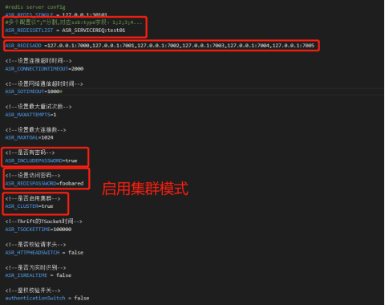
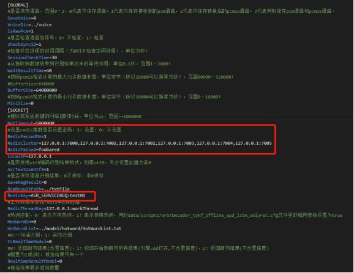
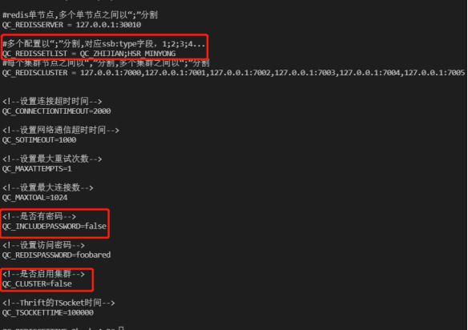
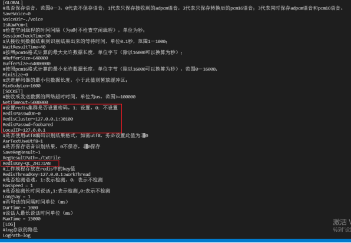
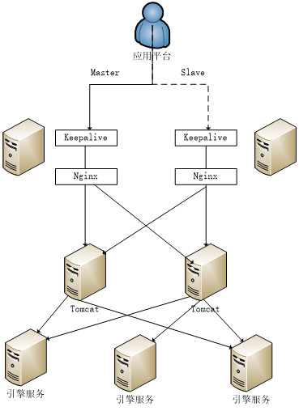
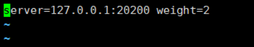
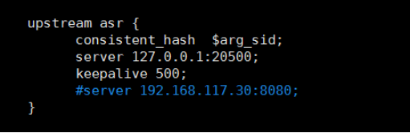

# 引言

1. **编制目的**：本文档通过对语音引擎系统安装配置过程的说明来指导该系统的安装部署工作，顺利推进项目建设。

2. **适用范围**：本文档面向是运维人员，提供部署上的技术支持，在进行部署时,参考此文档进行操作,确保我们的服务能正常运行。

3. **参考依据**：《电力行业信息系统安全等级保护基本要求》

# **系统安装**

## 机房要求

**（1）机房环境要求**

> - 机房内部机器布置应具有足够的服务空间并有可扩充性。
> - 机房地板承重应大于400KG。
> - 机房高度要求地板至天棚距离大于2.7M，地面至地板距离为35CM。

**（2）机房电气要求**

> - 要求使用机房专用地， 对地电阻小于40HMS。
> - 要求防静电地板电阻在150K欧姆至20000M欧姆。
> - 要求UPS供电，具体指标如下：
>     - 3PHASE：380V-415V，+6%-- -13% (专为 SP 主机使用)
>     - 1PHASE：220V-240V，+6%-- -13%
>     - 频率：50HZ，+0.5-- -0.5
>     - 功率：大于50KW
>     - 三相电相序要求正确，并为RS/6000专设开关便于电源线的连接及以后的管理。
>     - 零地之间的电压小于0.5V
>     - 零线，地线连接正确。
>     - 各电源柜，电源线，开关标签明确。

**（3）机房工作环境要求**

> - 机房空调应使室温保持在22度左右，正负不超过2度。
> - 相对湿度保持在50%+5%-- -5%。
> - 机房安全性要求。
> - 要求有防火、防水设备，备有紧急电闸、紧急出口，以及报警、监查设备和电话线路。

## 系统安装平台要求

> 1.  地面及地下需要清洁。
>
> 2.  UPS电气性能稳定。
>
> 3.  各机电源以及机房电工到位。
>
> 4.  空调已正常运转。
>
> 5.  消防设备到位。
>
> 6.  地板通气孔到位。
>
> 7.  RS/6000布线所需的三块打孔地板到位，(孔的位置在地板边沿，面积约200CM2)。

## 操作系统配置环境要求

（1）硬件环境

> - 内存：建议64G及以上。
> - CPU: 建议E5 2640及以上（核心数少,则并发少）
> - 硬盘：推荐安装目录所在磁盘可用空间为500GB以上,如果安装目录可用空间小于200GB，建议系统配置中设置不保存语音,或定期对合成语音进去清理。
> - 操作系统: 64位，建议系统版本：centos-server 7.0 及以上，建议不要安装最小系统。

（2）软件环境

- gcc/g++ : 部署机器需要4.8及以上版本。

- 软件版本:

| 序号 |      软件安装包名/版本      | 软件类型(基础/系统/引擎) |
| :--: | :-------------------------: | :----------------------: |
|  1   | jdk-8u171-linux-x64.tar.gz  |           基础           |
|  2   |        nginx 1.14.0         |           基础           |
|  3   | apache-tomcat-9.0.35.tar.gz |           基础           |
|  4   |     redis-3.2.0.tar.gz      |           基础           |

# **语音引擎组件安装**

## 在线语音引擎组件安装

（1）检查系统是否安装docker环境

如果没有docker环境，在提供的部署安装包中有提供docker的离线安装包**docker.tar.gz**，将其放入到服务机中：

```shell
# 解压
tar -zxvf docker.tar.gz -C docker
# 进入到解压目录：
cd docker
# 使用rpm安装：
rpm -Uvh --force --nodes *.rpm
```

（2）加载online\_docker镜像文件：

```shell
docker load -i online_docker.tar
```

（3）启动镜像，配置目录映射，端口映射等，以交互模式启动容器。

```

```

（4）解压部署包，进入安装目录： 

```shell
# 

cd rel_onlineasr/tools/tools_install
```

（5）安装jdk，redis，tomcat等相关组件：

```shell
sh 01_install_jdk.sh
sh 02_install_redis.sh
sh 03_install_tomcat.sh
```

# **语音引擎授权 **

## 在线asr引擎授权

> 1.  检查操作系统是否符合要求。
>
> 2.  检查安装文件是否完整。
>
> 3.  检查镜像是否启动成功，且现在是在容器中执行相关命令。
>
> 4.  进入rel\_onlineasr/tools 下执行`./getinfo`，生成\*\_machine.info结尾的信息文件，将该信息文件取出，发送给我方，申请的线数参考《xxxxx文档》
>
> 5.  将授权后的文件名字改为license\_120.dat,并将其放入到**rel\_onlineasr/Decoder/bin** 下。

## 在线质检引擎授权

> 1.  检查操作系统是否符合要求。
>
> 2.  检查安装文件是否完整。
>
> 3.  检查镜像是否启动成功且现在是在容器中执行相关命令。
>
> 4.  进入rel\_onlineasr/tools 下执行`./getinfo`，生成\*\_machine.info结尾的信息文件，将该信息文件取出，发送给我方，申请的线数参考《xxxxx文档》
>
> 5.  将授权后的文件名字改为license\_120.dat，并将其放入到**rel\_onlineasr/EngineDecoder/bin** 下。

# **语音引擎配置和启动**

## 在线引擎前提

> 1.  检查操作系统是否符合要求。
>
> 2.  检查安装文件是否完整。
>
> 3.  检查镜像是否启动成功且现在是在容器中执行相关命令。
>
> 4.  检查jdk是否安装，并配置正确的环境变量。
>
> 5.  检查redis是否正确安装。
>
> 6.  检查tomcat是否正确安装。
>
> 7.  授权文件是否放入到指定目录。

## **在线asr引擎**配置和启动

### redis数据库启动

进入到**/root/local/redis/redis-3.2.0**，启动redis

```shell
cd /root/local/redis/redis-3.2.0
sh cluster_install_ms.sh
```

### 配置和启动tomcat

**（1）**进入到**/root/local/tomcat/apache-tomcat-9.0.35/webapps/asrability/WEB-INF/classes** 修改配置**redis.propertites**




**（2）**进入到**/root/local/tomcat/apache-tomcat-9.0.35/bin**目录下执行：

```shell
sh shutdown.sh
sh startup.sh
```


### 配置decoder.conf

进入到**/root/rel\_onlineasr/Decoder/conf** 查看decoder.conf




**注意：**

> /root/local/tomcat/apache-tomcat-9.0.35/webapps/asrability/WEB-INF/classes/redis.properties中的ASR_REDISSETLIST = **ASR_SERVICEREQ:test01**
>
> 要和/root/rel_onlineasr/Decoder/conf 中的 RedisKey=**ASR_SERVICEREQ:test01**相同。

### 服务启动

**/root/rel\_onlineasr/Decoder/bin** 目录下执行:

```shell
./start.sh
```

## **在线质检引擎**配置和启动

### redis数据库启动

进入到**/root/local/redis/redis-3.2.0**

```shell
./redis-server redis.conf &
```

### 配置和启动tomcat

（1）进入到**/root/local/tomcat/apache-tomcat-9.0.35/webapps/asrability/WEB-INF/classes** 修改配置qcRedis.properties




（2）进入到**/root/local/tomcat/apache-tomcat-9.0.35/bin** 目录下执行：

```shell
sh shutdown.sh
sh startup.sh
```

### 配置decoder.conf

进入到**/root/rel\_onlineasr/EngineDecoder/conf** 修改decoder.conf



**修改**：

- RedisPasswdOn=0
- RedisCluster=127.0.0.1:30010
- RedisKey=QC\_ZHIJIAN


**注意**：

> /root/local/tomcat/apache-tomcat-9.0.35/webapps/asrability/WEB-INF/classes/qcRedis.properties  
>
> 中的QC_REDISSETLIST=**QC_ZHIJIAN**;HSR_MINYONG 
>
> 要和/root/rel_onlineasr/EngineDecoder/conf  中的 RedisKey=**QC_ZHIJIAN** 相同。

### 服务启动

**/root/rel\_onlineasr/EngineDecoder/bin** 目录下执行：

```shell
./start.sh
```

# **服务器集群搭建**

## 集群搭建

集群搭建是使用nginx做负载均衡，发送到不同的tomcat节点，拓扑图如下所示：



> Nginx 安装：多 tomcat 需安装 nginx， 默认单使用 tomcat， 无需安装 nginx。

## **在线asr** nginx安装部署

进入到**rel\_onlineasr/tools/nginx**目录，解压文件nginx14\_tools.tar.gz

```shell
cd nginx_tools
```

执行安装脚本 

```shell
sh install.sh
```

**配置nginx**：进入**~/local/nginx/nginx**目录，修改server\_conf\_asr.txt文件中的tomcat集群 ；如下图所示：



**注意：**图中的server=127.0.0.1:20200修改为部署的tomcat对应的ip和端口号。

完成后执行：

```shell
source ~/.bash_profile
source ~/.bashrc
```

进入目录**~/local/nginx/nginx**，执行 `./sbin` 启动nginx。

## **在线质检** nginx安装部署

进入到**rel\_onlineasr/tools/nginx**目录，解压文件nginx16\_tools.tar.gz

```shell
cd nginx_tools
```

执行安装脚本 

```shell
sh install.sh
```

**配置nginx**：进入**~/local/nginx/nginx**目录，修改nginx.conf文件中的tomcat集群 ；如下图所示：



**注意：**图中的server=127.0.0.1:20500修改为部署的tomcat对应的ip和端口号。

完成后执行：

```shell
source ~/.bash_profile
source ~/.bashrc
```

进入目录**~/local/nginx/nginx**执行 `./sbin` 启动nginx。


# 附录

参考文档：《语音识别引擎安装配置手册-语音能力.docx》

