# **解码器内核**

包含端到端声学模型推理计算和语音识别令牌传递，提供解码库实现输入语音特征流，输出识别文本。

> **代码位置**：133：/wp/aster/zhongke/三阶段代码和文档202203b/三阶段代码和文档/语音识别引擎(端到端）/在线/解码器内核/source

## 在线端到端语音识别引擎**代码清单**说明

### 主要源代码介绍

> **位置**：语音识别引擎(端到端）\在线\解码器内核

```c++
source
├── include // 该目录主要是依赖的一些头文件
├── RecEngine // 该目录主要是解码器的外壳，是调用解码算法的接口
│   ├── BaseEngine.cpp // 解码器基类实现，主要是定义WFST解码器的接口│ 函数
│   ├── BaseEngine.h // 解码器的基类的头文件
│   ├── E2EEngine.cpp // 端到端解码器类的具体实现
│   ├── E2EEngine.h // 端到端解码器的头文件
│   ├── onepass.cpp // 解码器引擎的整体实现，定义解码器引擎的接口函数
│   └── onepass.h // 解码器引擎的整体实现的头文件

├── sharelib // 该目录主要是进行线程处理、内存管理等
│   └── share
│   ├── comm.h // 常用的参数、类、函数的声明
│   ├── dirutil.cpp // 用于处理目录的工具
│   ├── FileUtility.cpp // 用于处理、读取文件的工具
│   ├── FileUtility.h // 用于处理、读取文件的工具的头文件
│   ├── iexception.h // 针对未知异常的处理的头文件
│   ├── imem.cpp // 内存管理相关的工具的实现
│   ├── imem.h // 内存管理相关的工具的头文件
│   ├── isdtexception // 对异常的处理
│   ├── logfile.cpp // 日志文件相关的工具
│   ├── StringProcess.cpp // 字符串类型的相关方法的实现
│   ├── StringProcess.h // 字符串类型的相关方法的头文件
│   ├── Thread.cpp // 线程有关的类的实现
│   └── Thread.h // 线程有关的类的头文件

├── srilm // 该目录主要是用于计算语言模型概率（不使用）

├── tools // 该目录主要是线程处理、内存管理的函数
│   ├── cn // 该目录主要是混淆网络的实现、使用（不使用）
│   └── onepass
│   ├── debug_new.cpp // 用于调试使用的类的实现
│   ├── debug_new.h // 用于调试使用的类的头文件
│   ├── lat2saus.cpp // 将lattice转化成sausage的函数
│   ├── main.cpp WFST // 解码器的测试程序。主要功能是读取参数文件，初始化多线程解码器，读取语音特征文件，对语音每一帧进行解码
│   ├── resource.h // 基本的值的设置

├── toolslib // 该目录主要实现配置文件的读取，以及一些全局变量的设置
│   ├── arg.h // 命令行参数的头文件，主要是定义一个用于初始化命令行参数的基类，对输入的命令行参数进行解析
│   ├── lvcsrcfg.cpp // 解析配置文件的类，主要是解析配置文件里的参数并赋值给程序中相应的变量
│   └── lvcsrcfg.h // 解析配置文件类的头文件

└── WFSTDecoder // 该目录主要实现神经网络计算以及解码算法（核心部分）
├── E2E
│   ├── math // 该目录主要是解码用到的数学运算
│   │   ├── matrix.h // 实现矩阵运算的头文件，定义了一个矩阵的类
│   │   ├── MatMath.cpp // 基于矩阵的数学运算函数实现
│   │   ├── MatMath.h // 基于矩阵的数学运算函数的头文件
│   ├── nn // 该目录主要是神经网络相关内容的实现
│   │   ├── activation.cpp // 常用的激活函数类的实现
│   │   ├── activation.h // 常用的激活函数类的头文件
│   │   ├── attention.cpp // 注意力机制的类的实现
│   │   ├── attention.h // 注意力机制的类的头文件
│   │   ├── base.cpp // 神经网络模型模板类的实现
│   │   ├── base.h // 神经网络模型模板类的头文件
│   │   ├── conv.cpp // 卷积相关的类的实现
│   │   ├── conv.h // 卷积相关的类的头文件
│   │   ├── ctc.cpp // CTC相关的类的实现
│   │   ├── ctc.h // CTC相关的类的头文件
│   │   ├── decoder.cpp // 神经网络解码器相关的类的实现
│   │   ├── decoder.h // 神经网络解码器相关的类的头文件
│   │   ├── e2emodel.cpp // 在线端到端模型的类的整体实现
│   │   ├── e2emodel.h // 在线端到端模型的类的整体实现的头文件
│   │   ├── encoder.cpp // 神经网络编码器相关的类的实现
│   │   ├── encoder.h // 神经网络编码器相关的类的头文件
│   │   ├── linear.cpp // 常用的线性层的类的实现
│   │   ├── linear.h // 常用的线性层的类的文件
│   │   ├── lm.cpp // 语言模型的类的实现，主要是基于LSTM的语言模型的构造和使用
│   │   ├── lm.h // 语言模型的类的头文件
│   │   ├── norm.cpp // 正则化相关的类的实现
│   │   ├── norm.h // 正则化相关的类的头文件
│   │   ├── pe.cpp // 位置编码相关的类的实现
│   │   ├── pe.h // 位置编码相关的类的头文件
│   │   ├── rnn.cpp // RNN相关的类的实现
│   │   ├── rnn.h // RNN相关的类的头文件
│   ├── search // 该目录主要是解码时使用beam search相关的实现
│   │   ├── node.h // 构建解码过程中使用的节点等结构体
│   │   ├── search.cpp // beam search过程相关的类的实现
│   │   ├── search.h // beam search过程相关的类的头文件
│   ├── test // 该目录主要是解码时测试的实现。主要功能是读取参数文件，初始化模型，进行解码（不使用）
│   ├── utils // 该目录主要是一些依赖函数
│   │   ├── Thread.cpp // 构建多线程的类
│   │   ├── Thread.h // 构建多线程的类的头文件
├── src
│   ├── NeuralNet // 该目录主要是神经网络计算时用到的基本的方法与类，与E2E-math目录下文件相同
│   ├── BlockMemPool.cpp // 构建内存池的类的实现
│   ├── BlockMemPool.h // 构建内存池的类的头文件
│   ├── common.h // 定义了一些常用的方法，主要是参数和mfcc特征的提取
│   ├── Histogram.cpp // 直方图剪枝一些函数的具体实现
│   ├── Histogram.h // 直方图剪枝一些函数的头文件
│   ├── WFSTDecoderCTC.cpp // 结合CTC分数进行WFST解码的具体实现
│   ├── WFSTDecoderCTC.h // 结合CTC分数进行WFST解码的头文件
│   ├── WFSTGeneral.h // 将WFST转化成text格式
│   ├── WFSTNetwork.cpp // 读取WFST解码，并加载到内存中，供解码算法来调用的类的具体实现
│   ├── WFSTNetwork.h // 读取WFST解码的类的头文件
├── Torch // 定义了部分通用数据
│   ├── general.cc // 定义了部分通用数学变量
│   ├── general.h // 定义了部分通用数学变量
│   ├── log_add.h // 定义了部分通用对数运算函数
```


### 主要函数调用流程说明

下图供参考。

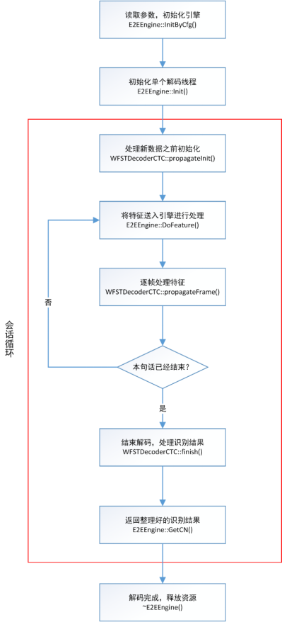

## 在线端到端语音识别引擎**设计概要**说明

### 概述

#### 简介

`引擎功能介绍`

> 端到端语音识别解码器可以完成流式场景下的语音识别任务。
>
> 引擎实现方案为：**对输入的语音识别特征序列（例如mfcc-hires），通过神经网络完成前向计算（例如Transformer作为语音识别模型，CE/CTC Loss作为联合训练准则）并输出字符的后验概率，通过帧同步的方式，以静态加权有限状态转移器的形式，将语音转写为文字**。
>
> 满足如下功能及性能需求：
>
> 1. 支持大词表连续语音识别；
> 2. 支持实时语音流识别；
> 3. 不依赖于语种相关的发音字典；
> 4. 具有较低的字错率，容忍一定的口音。

`引擎输入介绍`

> 1. 资源文件，包括：
>     - 配置文件onepass.cfg
>
>     - 端到端语音识别模型
>
>     - 静态加权有限状态转移器网络
>
>
> 2. 语音数据
>     - 语音识别特征（例如mfcc-hires）

`引擎输出介绍`

> 语音识别结果，包括识别文字和对应的时间点。

#### 读者对象

本文档的读者对象为引擎算法研究，开发人员和测试人员。读者通过阅读该文档了解设计的主要细节，可进行具体代码实现和测试。

#### 参考资料

> 1.  Miao, Y., Gowayyed M., Metze F.: ‘EESEN: End-to-End Speech Recognition Using Deep RNN Models and WFST-based Decoding’, ASRU, 2015, p. 167-174.
>
> 2.  Vaswani, A., Shazeer, N., Parmar, N., *et al*: ‘Attention is All you Need’, *NIPS*, 2017, p. 5998-6008.
>
> 3.  Watanabe, S., Hori, T., Karita, S., *et al*: ‘ESPnet: End-to-End Speech Processing Toolkit’, *Interspeech*, 2018, p. 2207-2211.
>
> 4.  Karita, S., Soplin, N. E. Y. and Watanabe, S., *et al*: ‘Improving Transformer-Based End-to-End Speech Recognition with Connectionist Temporal Classification and Language Model Integration’, *Interspeech*, 2019, p. 1408-1412.
>
> 5.  Miao, H., Cheng, G., Gao, C., *et al*: ‘Transformer-Based Online CTC/Attention End-To-End Speech Recognition Architecture’, *ICASSP*, 2020, p. 6084-6088.
>
> 6.  Miao, H., Cheng, G., Zhang, P., *et al*: ‘Online Hybrid CTC/Attention End- to-End Automatic Speech Recognition Architecture’, *IEEE ACM Trans. Audio Speech Lang. Process.*, 2020, 28, p. 1452-1465.

### **总体设计**

端到端语音识别引擎的基本框架图如下：

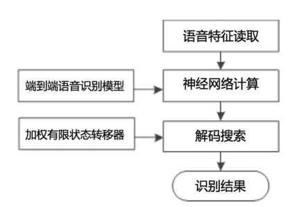

语音数据送入引擎后，经过语音特征读取、神经网络计算和解码搜索3个模块，最终得到语音识别的结果。各模块概述如下：

> （1）**语音特征读取**：输入是语音识别任务中常见的语音特征，例如40维的mfcc-hires特征，80维的filter-bank特征，语音特征将被送入声学概率计算模块。
>
> （2）**神经网络计算**：在引擎初始化阶段加载端到端语音识别模型，例如Transformer模型，构建端到端语音识别神经网络；将特征送入神经网络中，计算出字符后验概率。
>
> （3）**解码搜索**：在引擎初始化阶段加载加权有限状态转移器，构建静态网络，负责将字符的后验概率序列转换为字符序列，将后验概率送入静态网络，通过集束搜索输出识别结果。

### 可靠性设计

> 识别解码器内核设计考虑了上层调用的复杂性和输入的多样性的情况，为了支持不同应用场景中高性能的工作，内核中的基础模型采用了多领域较数据量进行训练，并包含了该语种全集字词作为字典，保证了识别性能的可靠性；
>
> 识别内核支持多种不同格式的语音特征作为输入（需要相关的声学模型支持），支持高并发同步处理方式，对内部各个模块尽可能减少耦合。
>
> 识别解码器内核按照严格的7\*24小时压力测试标准进行测试，同时也针对所有异常数据进行异常情况测试，保证解码器的稳定性和可靠性。

### 扩展性设计

> 识别解码器内核支持面向对象编程，支持多个实例多路并发，保证了不同cpu数和内存大小的机器拓展需求。内核支持对于不同领域采用不同的字典，语言模型以及声学模型的设计，可以根据实际需求选取更匹配的模型达到最优性能。

### 维护性设计

#### **解码器配置文件参数说明**

（1）引擎相关：`onepass.cfg`

|   参数名   | 说明                 | 默认配置 |
| :--------: | -------------------- | -------- |
| EngineType | 语音识别引擎类别     | e2e      |
| useWFSTCTC | 是否使用wfst-ctc解码 | TRUE     |

（2）模型相关

|        参数名         | 说明                       | 默认配置                   |
| :-------------------: | -------------------------- | -------------------------- |
|     **ModelFile**     | 端到端模型路径             | default/modelFile.bin      |
|       **wfst**        | WFST模型路径               | default/TLG.int            |
|       **insym**       | WFST的输入列表             | default/tokens.txt         |
|      **outsym**       | WFST的输出列表             | Default/words.txt          |
|  **VocabularyFile**   | 端到端模型的输出列表       | default/vocabularyFile.txt |
| **LanguageModelFile** | 语言模型路径               | default/lstmlmFile.bin     |
|      **filter1**      | 端到端模型第1层CNN卷积核数 | 320                        |
|      **filter2**      | 端到端模型第2层CNN卷积核数 | 320                        |

（3）解码相关

参考《在线端到端语音识别引擎数据结构设计》2.2部分

|     参数名      | 说明                    | 默认配置  |
| :-------------: | ----------------------- | --------- |
|     factor      | 分数缩放因子            | 10        |
|    **acwt**     | 声学分数系数            | 1         |
|    **lmwt**     | 语言学分数系数          | 0.3       |
|  **mainBeam**   | 分数剪枝参数            | 20        |
|   **maxHyps**   | 直方图剪枝参数          | 30        |
|  **blkScale**   | <blank>概率的惩罚系数   | 0.4       |
|  **blkThresh**  | <blank>概率跳过的阈值   | 0.95      |
|     isword      | 输出格式（1为分词结果） | 0         |
|  **beamSize**   | 节点剪枝参数            | 10        |
|   ctcBeamSize   | 节点剪枝参数            | 15        |
|    maxDepth     | 最大识别字数参数        | 5000      |
|   toleration    | 终止搜索参数            | 3         |
|      dEnd       | 终止搜索参数            | -3        |
|  **ctcWeight**  | CTC分数系数             | 0.5       |
|  **lmWeight**   | 语言学分数系数          | 0         |
|    forceEnd     | 强制扩展<eos>参数       | FALSE     |
|   speechSpeed   | 限制识别字数参          | 0.1       |
|  timeReduction  | 语音特征采样倍数参数    | 4         |
| **forceAlign**  | 强制对齐参数            | TRUE      |
| forceAlignBlank | 强制对齐参数            | TRUE      |
|  silThreshold   | 强制对齐平滑参数        | -1.00E-04 |
|    **Nbest**    | 解码过程中的多候选数目  | 10        |
|  **extraStep**  | 流式扩展参数            | 5         |

**注：** 以上表中加粗的参数为经常需要改动的参数，其余参数基本不用改动。

### 易用性设计

> 识别解码器内核采用c/c++接口，接口方便灵活，内部运行高效，支持c/c++调用，只需掌握基础的语言学习知识和基本的语音应用调用流程，即可自主设计功能模块和对新增功能的实现。

## 在线端到端语音识别引擎**接口模块**说明

在RecEngine文件夹中，

- **BaseEngine.h**定义了通用的语音识别解码引擎类。
- **E2EEngine.h**定义了端到端语音识别解码引擎类，对解码引擎内核进行封装。
- **onepass.h**定义了OnePass类，对BaseEngine进一步封装，用于上层调用语音识别引擎，包括初始化、输入语音识别特征和输出语音识别结果。

下面介绍如何使用OnePass。

### 初始化接口

**接口1声明：**

```c++
void InitByCfg (LvcsrConfig *cfg);
```

> **功能：**根据配置文件设置解码器引擎的参数（详见概要说明5.1），加载资源文件。
>
> **形参：**
>
>   - cfg: 配置文件路径
>
> **返回值**：无

**接口2声明：**

```c++
void Init ();
```

> **功能：**初始化解码引擎（BaseEngine）的对象，每个对象负责各自的语音识别任务。实际使用的是E2E\_TIT::E2EEngine。
>
> **形参：**无
>
> **返回值**：无

### 输入接口

**接口声明：**

```c++
bool DoFeature (float *newSet, int frameNum, char *featureName, TSR_STREAM_FLAG flag);
```

> **功能：**解码引擎完成语音识别特征接收、神经网络前向计算和解码搜索。
>
> **形参：**
>
>   - newSet: 输入语音识别特征的首地址；
>
>   - frameNum: 输入语音识别特征的帧数；
>
>   - featureName: 输入语音的名称；
>
>   - flag: 语音流状态，包括TSR\_STREAM\_START（流式输入开始）、TSR\_STREAM\_END（流式输入结束）和TSR\_STREAM\_ALL（非流式输入）。
>
> **返回值**：
>
> - true: 处理正常。
>
> - false：处理失败。

### 输出接口

**接口1声明：**

```c++
void * GetMidResult ();
```

> **功能：**在流式模式下获取语音识别解码过程中的中间结果。
>
> **形参：**无。
>
> **返回值**：WordResult对象指针。

**接口2声明：**

```c++
void * GetCN (int DataTimestamp, int DataTimestampEnd, char *format, int &wordNum);
```

> **功能：**获取语音识别解码过程中的最终结果。
>
> **形参：**
>
>   - DataTimestamp: 输入语音片段的起始时间；
>
>   - DataTimestampEnd: 输入语音片段的终止时间；
>
>   - format: 输出结果的格式（弃用），默认输出格式是WordResult；
>
>   - wordNum: 识别结果中的字数。
>
> **返回值**：WordResult对象指针。

## 在线端到端语音识别引擎**数据结构**说明

### 神经网络计算功能开发

语音信号的字符概率计算是将语音特征数据进行端到端语音识别模型的前向深度神经网络计算，得到语音特征对应的字符后验概率。

神经网络计算模块是计算语音声学得分的重要模块，在提取语音特征后，将特征数据送入已训练好的端到端语音识别模型中，计算出字符的后验概率，作为语音的声学得分。

#### 神经网络组件开发

##### **BaseComponent**类

BaseComponent是神经网络基类，包含了各种神经网络中通用的成员变量和成员函数。

关键的**成员变量**中包括：

> 1. m\_id：神经网络名称；
> 2. m\_pplane:：指定该层神经网络的输入来自哪些层的神经网络；
> 3. m\_pfmap：该层神经网络的输入矩阵指针，可以存在多个输入矩阵；
> 4. m\_fmap：该层神经网络的输出矩阵。

关键的**成员函数**包括：

1. FLOAT \* setparam(FLOAT \* param):

> **功能**：读取并设置该层神经网络的模型参数。
>
> **形参**：
>
> - param：读取二进制端到端语音识别模型的指针。

2. Matrix\<FLOAT\> \* fprop():

> **功能**：定义该层神经网络的计算方式，由于不同神经网络的输入类型和个数不同，需要重载该函数。

3. Matrix\<FLOAT\> \* getfmap ():

> **功能**：获取该层神经网络的输出矩阵指针。

4. int setfmap (FLOAT \* source, int nrow, int ncol):

> **功能**：读取并设置该层神经网络的输出矩阵。
>
> **形参**：
>
> - source：数组指针，一维数组表示二维矩阵，行优先存储；
>
> - nrow：二维矩阵行数；
>
> - ncol：二维矩阵列数。

##### **InputComponent**类

InputComponent类是BaseComponent类的子类。InputComponent是输入层，作为整个模型的第一层。该层无模型参数，无前向计算，只需要调用函数setfmap，将输入特征直接写入该层的输出矩阵。

##### **ReluComponent**类

ReluComponent类是BaseComponent类的子类。ReluComponent是ReLU激活函数网络层，该层无模型参数。输入为x，输出为

$$
f\left( x \right) = max(0,\ x)
$$


##### **TanhComponent**类

TanhComponent类是BaseComponent类的子类。TanhComponent是Tanh激活函数网络层，该层无模型参数。输入为x，输出为

$$
f\left( x \right) = \frac{\left( e^{x} - \ e^{- x} \right)}{\left( e^{x} + \ e^{- x} \right)}
$$

##### **MultiHeadAttComponent**类

MultiHeadAttComponent类是BaseComponent类的子类。MultiHeadAttComponent是标准Transformer中的多头注意力层，关键的成员变量包括：

  - m\_weight\_q: query的变换矩阵W\_q；

  - m\_weight\_k: key的变换矩阵W\_k；

  - m\_weight\_v: value的变换矩阵W\_v；

  - m\_weight\_o: output的变换矩阵W\_o；

  - m\_bias\_q: query的偏置向量b\_q；

  - m\_bias\_k: key的偏置向量b\_k；

  - m\_bias\_v: value的偏置向量b\_v；

  - m\_bias\_o: output的偏置向量b\_o。

计算过程参考文章《Attention Is All You Need》(https://arxiv.org/abs/1706.03762)。其构造函数的若干重要参数包括：

  - qdim: query输入维度；

  - kdim: key/value输入维度；

  - nhead: 多头个数；

  - isbias: 是否存在偏置向量。

MultiHeadAttComponent重载了前向计算函数fprop的接口，除了从上一层获得query之外，还需要另外输入key/value（key和value是相同的）。在线系统中编码器和解码器的自注意力层均使用MultiHeadAttComponent，编码器和解码器中自注意力层的key均是由上一层(LayerNormComponent)输出和历史块中的输出拼接得到，编码器和解码器的成员函数propagate定义如何选取历史块中的输出。

##### **OnlineAttComponent**类

OnlineAttComponent类是BaseComponent类的子类。OnlineAttComponent是在线Transformer中的单调截断注意力层，关键的成员变量包括：

  - m\_weight\_q: query的变换矩阵W\_q；

  - m\_weight\_k: key的变换矩阵W\_k；

  - m\_weight\_v: value的变换矩阵W\_v；

  - m\_weight\_o: output的变换矩阵W\_o

  - m\_bias\_q: query的偏置向量b\_q；

  - m\_bias\_k: key的偏置向量b\_k；

  - m\_bias\_v: value的偏置向量b\_v；

  - m\_bias\_o: output的偏置向量b\_o；

  - m\_offset: 偏置标量r。

计算过程参考文章《Transformer-based Online CTC/attention End-to-End Speech Recognition Architecture》(https://arxiv.org/abs/2001.08290)。其构造函数的若干重要参数包括：

  - keys：存储编码器输出特征的数组指针；

  - enclen：当前编码器存储特征的数目；

  - endpointer：上一步预测的截断点，作为搜索截断点的起始值，保证截断点单调向后搜索；

  - useBuff：置为true时，存储key对应的线性变换值，避免重复计算；当计算新的语句时将被置为false时清空此前存储的值。

##### **FastMultiHeadAttComponent**类

FastMultiHeadAttComponent类是BaseComponent类的子类。FastMultiHeadAttComponent构成标准Transformer中的多头注意力层中一部分的运算，FastMultiHeadAttComponent去除了对query/key/value线性变换的运算，而这部分计算被移到 KQVComponent。KQVComponent和FastMultiHeadAttComponent组合构成完整的MultiHeadAttComponent，因此FastMultiHeadAttComponent的成员变量仅仅包括：

  - m\_weight\_o: output的变换矩阵W\_o

  - m\_bias\_o: output的偏置向量b\_o。

FastMultiHeadAttComponent的构造函数的若干重要参数包括：

  - qdim: query输入维度；

  - kdim: key/value输入维度；

  - nhead: 多头个数；

  - isbias: 是否存在偏置向量。

FastMultiHeadAttComponent重载了前向计算函数fprop的接口，除了从上一层获得query之外，还需要另外输入key和value（key和value经过线性变换后是不同的）。目前在线系统中编码器和解码器的自注意力层均使用FastMultiHeadAttComponent代替MultiHeadAttComponent，编码器和解码器中自注意力层的key和value均是由上一层(KQVComponent)输出和历史块中的输出拼接得到，编码器和解码器的成员函数propagate定义如何选取历史块中的输出。

##### **ConvComponent**类

ConvComponent类是BaseComponent类的子类。ConvComponent是二维卷积神经网络层，关键的成员变量包括：

  - m\_weight: 多个卷积核拼接成的矩阵W；

  - m\_bias: output的偏置向量b。

其中矩阵W的第一个维度等于输出通道数，第二个维度是输入通道数乘卷积核高度（时域）乘卷积核宽度（频域），向量b的长度等于输出通道数，计算过程参考pytorch教程（https://pytorch.org/docs/stable/nn.html?highlight=conv2d\#torch.nn.Conv2d）。

ConvComponent构造函数的若干重要参数包括：

  - in: 输入通道数；

  - out: 输出通道数；

  - kernel: 卷积核高度和宽度；

  - stride: 卷积核高度和宽度方向移动的步长；

  - pad: 对输入的二维矩阵首尾两端填充零的行数和列数；

  - dilation: 空洞卷积核高度和宽度方向的间隙；

  - isbias: 是否存在偏置向量。

ConvComponent前向计算采用im2col优化卷积运算，对于多通道的特征图，系统一律采用单个二维矩阵存储，矩阵的行代表特征图的时域（语音特征序列长度），矩阵的列代表特征图的频域（语音特征维度）乘通道数。

##### **LinearComponent**类

LinearComponent类是BaseComponent类的子类。LinearComponent是全连接网络层，关键的成员变量包括：

  - m\_weight: 参数矩阵W；

  - m\_bias: output的偏置向量b。

输入为x，输出为

$$
f\left( x \right) = Wx + b
$$
LinearComponent构造函数的若干重要参数包括：

  - in: 输入通道数；

  - out: 输出通道数；

  - isbias: 是否存在偏置向量。

##### **LogSoftmaxLinearComponent**类

LogSoftmaxLinearComponent类是BaseComponent类的子类。LogSoftmaxLinearComponent是全连接网络层和LogSoftmax网络层的组合，关键的成员变量包括：

  - m\_weight: 参数矩阵W；

  - m\_bias: output的偏置向量b。

输入为x，输出为

$$
f\left( x \right) = log(\text{softmax}\left( Wx + b \right))
$$
LogSoftmaxLinearComponent构造函数的若干重要参数包括：

  - in: 输入通道数；

  - out: 输出通道数；

  - isbias: 是否存在偏置向量。

##### **SoftmaxLinearComponent**类

SoftmaxLinearComponent类是BaseComponent类的子类。LogSoftmaxLinearComponent是全连接网络层和Softmax网络层的组合，关键的成员变量包括：

  - m\_weight: 参数矩阵W；

  - m\_bias: output的偏置向量b。

输入为x，输出为

$$
f\left( x \right) = log\left( Wx + b \right)
$$
SoftmaxLinearComponent构造函数的若干重要参数包括：

  - in: 输入通道数；

  - out: 输出通道数；

  - isbias: 是否存在偏置向量。

##### **PosFFComponent**类

PosFFComponent类是BaseComponent类的子类。PosFFComponent是标准Transformer中的前馈网络层，关键的成员变量包括：

  - m\_weight\_1: 第一个参数矩阵W\_1；

  - m\_weight\_2: 第二个参数矩阵W\_2；

  - m\_bias\_1: 第一个偏置向量b\_1；

  - m\_bias\_2: 第二个偏置向量b\_2。

输入为x，输出为

$$
f\left( x \right) = W_{2} \cdot \max\left( 0,\ W_{1}x + b_{1} \right) + b_{2}
$$
PosFFComponent构造函数的若干重要参数包括：

  - in: W\_1的输入维度，W\_2的输出维度；

  - inner: W\_2的输入维度，W\_1的输出维度。

##### **EmbedComponent**类

EmbedComponent类是BaseComponent类的子类。EmbedComponent是词嵌入网络层，作为标准Transformer中解码器的第一层，负责将字符标签通过查表的方式转换为特征向量，关键的成员变量包括：

  - m\_weight: 词嵌矩阵W。

EmbedComponent构造函数的若干重要参数包括：

  - ndim: 特征向量维度；

  - vnum: 词汇表大小。

##### **KQVComponent**类

KQVComponent类是BaseComponent类的子类。KQVComponent是标准Transformer中自注意力网络层的部分计算，关键的成员变量包括：

  - m\_weight\_q: query的变换矩阵W\_q；

  - m\_weight\_k: key的变换矩阵W\_k；

  - m\_weight\_v: value的变换矩阵W\_v；

  - m\_bias\_q: query的偏置向量b\_q；

  - m\_bias\_k: key的偏置向量b\_k；

  - m\_bias\_v: value的偏置向量b\_v。

输入为x，输出为

$$
f\left( x \right) = \lbrack W_{q}x + b_{q},W_{k}x + b_{k},W_{v}x + b_{v}\ \rbrack
$$
KQVComponent构造函数的若干重要参数包括：

  - qdim: query输入维度；

  - kdim: key/value输入维度；

  - isbias: 是否存在偏置向量。

##### **LayerNormComponent**类

LayerNormComponent类是BaseComponent类的子类。LayerNormComponent是层归一化网络层，关键的成员变量包括：

  - m\_weight: 权重向量$w = (w_{1},\ \ldots,\ w_{n})$；

  - m\_bias: output的偏置向量$b = (b_{1},\ldots,b_{n})$；

  - m\_eps: 精度值$\epsilon$。

输入为$x = (x_{1},\ldots,x_{d})$，输出为

$$
text{mean} = \frac{1}{n}\sum x_{i} \\

\text{var} = \frac{1}{n}\sum\left( x_{i} - \text{mean} \right)^{2}  \\

f\left( x_{i} \right) = \frac{x_{i} - \text{mean}}{\sqrt{\text{var} + \epsilon}} \cdot w_{i} + b_{i}
$$
LayerNormComponent构造函数的若干重要参数包括：

  - ndim: 输入/输出维度；

  - eps: 输出通道数；

  - isbias: 精度值，pytorch默认值1e-12。

##### **ResidualComponent**类

ResidualComponent类是BaseComponent类的子类。ResidualComponent是残差连接网络层，该层无模型参数，输入为x和y，输出为

$$
f\left( x,y \right) = x + y
$$


##### **PosEncComponent**类

PosEncComponent类是BaseComponent类的子类。PosEncComponent是标准Transformer中的位置编码层，该层的模型参数是由正弦余弦函数计算得到的位置编码矩阵$W=w_{ij}$，该层无模型参数，输入为$x=x_{ij}$，输出为

$$
f(x_{ij}) = \sqrt{ndim} \cdot x_{ij} + w_{ij}
$$
PosEncComponent构造函数的若干重要参数包括：

  - ndim: 输入/输出维度；

  - maxlen: 最大长度，训练平台默认值5000，因此编码器降采样后特征序列的最大长度，以及解码器预测序列的最大长度均限制为maxlen。

##### **LSTMCellComponent**类

LSTMCellComponent类是BaseComponent类的子类。LSTMCellComponent是长短时记忆网络层，关键的成员变量包括：

  - m\_weight\_ih: 权重矩阵W\_i=\[W\_ii, W\_if, W\_ig, W\_io\]；

  - m\_weight\_hh: 权重矩阵W\_h=\[W\_hi, W\_hf, W\_hg, W\_ho\]；

  - m\_bias\_ih: 偏置向量b\_i=\[b\_ii, b\_if, b\_ig, b\_io\]；

  - m\_bias\_hh: 偏置向量b\_h=\[b\_hi, b\_hf, b\_hg, b\_ho\]。

其中下标i, f, g, o代表输入门(input)、遗忘门(forget)、记忆单元(memory cell)和输出门(output)，计算过程参考pytorch教程（https://pytorch.org/docs/stable/nn.html?highlight=lstm\#torch.nn.LSTM）。

LSTMCellComponent构造函数的若干重要参数包括：

  - idim: 输入维度；

  - ndim: 输出维度；

  - nbias: 偏置向量个数，pytorch中LSTM的偏置向量个数是2，即b\_i和b\_h。

#### 神经网络模型开发

##### **Encoder**类

Encoder类是组合BaseComponent类的上层类，提供对BaseComponent类的总体管控，控制进行网络参数的载入，神经网络计算的相关配置，以及调用不同的BaseComponent子类进行前向计算。Encoder是不同编码器神经网络的基类。

关键的成员变量包括：

  - m\_fmap: 存储Encoder输出的特征矩阵；

  - m\_plane: 管理Encoder中所有BaseComponent类的指针。

关键的成员函数包括：

  - Matrix\<FLOAT\> \* getfmap (): 获取存储Encoder输出的特征矩阵的指针；

  - FLOAT \* setparam(FLOAT\* param): 从首地址param开始读取Encoder模型参数，继承的子类必须实现自己的读取模型参数顺序；

  - void propagate(Encoder \* pGlobalEncoder, FLOAT \* feats, int len): 定义Encoder内部的神经网络前向计算，继承的子类必须实现自己的神经网络前向计算。

##### **OnlineEncoder**类

OnlineEncoder类继承Encoder类，实现Speech Transformer中Encoder的前向计算。具体包括2层ConvComponent、1层PosEncComponent和N层Transformer block。计算过程参考文章《Transformer-Based Online CTC/Attention End-To-End Speech Recognition Architecture》（https://arxiv.org/pdf/2001.08290.pdf）。

关键的成员变量包括：

  - m\_layer: Transformer block层数；

  - m\_idim: 输入特征维度;

  - m\_odim: 输出特征维度;

  - m\_channel: 输出特征通道数，默认为1;

  - m\_maxlen: 输出特征序列长度的最大值;

  - m\_nhead: self-attention中的头个数;

  - m\_inner: feed-forward中隐藏层维度;

  - **m\_left**: 左侧历史帧数（10 ms一帧）；

  - **m\_central**: 当前窗口帧数（10 ms一帧）;

  - **m\_right**: 右侧未来帧数（10 ms一帧）；

  - m\_filter1: 一次层CNN中卷积个数，默认为0时，卷积个数等于m\_odim;

  - m\_filter2:第二层CNN中卷积个数，默认为0时，卷积个数等于m\_odim。

在OnlineEncoder的构造函数中详细定义了每一层神经网络组件以及组件之间的连接关系。在OnlineEncoder的propagate函数中定义了整个神经网络模型的前向计算。其余重要的成员函数包括：

  - void init (): 开始新的解码任务时调用，清空缓存的历史信息；

  - propagate(Encoder \* pGlobalEncoder, FLOAT \* feats, int len, bool isend): 定义OnlineEncoder内部的神经网络前向计算，feats是语音特征的首地址，len是语音特征序列长度，isend判断当前语音流是否结束。

  - void updateMem (): 更新缓存的历史信息;

  - void updatefmap (Matrix\<FLOAT\> \* fmap): 更新编码器输出，将新增的输出结果写进m\_fmap;

##### **Decoder**类

Decoder调用BaseComponent类的上层类，提供对BaseComponent类的总体管控，控制进行网络参数的载入，神经网络计算的相关配置，以及调用不同的BaseComponent子类进行前向计算。

Decoder是不同解码器神经网络的基类，关键的成员变量包括：

>   - m\_fmap: 指向Decoder输出的特征矩阵的指针；
>
>   - m\_fmap\_enc: 指向Encoder输出的特征矩阵的指针；
>
>   - m\_plane: 管理Decoder中所有BaseComponent类的指针；
>
>   - m\_odim: 解码器输出维度，即端到端模型建模单元个数；
>
>   - m\_endLabel: \<eos\>的id;
>
>   - m\_useBuff: 是否使用Buffer中存储的计算结果，减少冗余计算。

关键的成员函数包括：

>   - Matrix\<FLOAT\> \* getfmap (): 获取存储Decoder输出的特征矩阵的指针；
>
>   - FLOAT \* setparam(FLOAT\* param): 从首地址param开始读取Decoder模型参数，继承的子类必须实现自己的读取模型参数顺序；
>
>   - void propagate(Decoder \* pGlobalDecoder, Matrix\<FLOAT\> \* states, FLOAT \* newstate, int label, int step): 定义Decoder内部的神经网络前向计算，继承的子类必须实现自己的神经网络前向计算。
>
>   - FLOAT getprob(int label): 在调用一次前向计算后返回label对应的概率；
>
>   - int getStateSize ():返回解码器单个字符的前向计算时需要的生成的新状态大小；
>
>   - int getVocabularySize ():返回解码器建模单元的个数。

##### **OnlineDecoder**类

OnlineDecoder类继承Decoder类，实现Speech Transformer中Decoder单个字符的前向计算。具体包括一层EmbedComponent、一层PosEncComponent、N层Transformer block和一层LogSoftmaxLinearComponent。**该模块仅参与流式字符同步解码功能。**计算过程参考文章《Transformer-Based Online CTC/Attention End-To-End Speech Recognition Architecture》（https://arxiv.org/pdf/2001.08290.pdf）。关键的成员变量包括：

>   - m\_layer: Transformer block层数；
>
>   - m\_idim: 输入词向量维度;
>
>   - m\_kdim: Encoder的输出特征维度;
>
>   - m\_maxlen: 输出特征序列长度的最大值;
>
>   - m\_nhead: self-attention中的头个数;
>
>   - m\_inner: feed-forward中隐藏层维度。

在OnlineDecoder的构造函数中详细定义了每一层神经网络组件以及组件之间的连接关系。在OnlineDecoder的propagate函数中定义了整个神经网络模型的前向计算。其余重要的成员函数包括：

> void propagate (Decoder \* pGlobalDecoder, Matrix\<FLOAT\> \* states, FLOAT \* newstate, int \* endpoints, int label, int step, int enclen): 
>
> 定义OnlineDecoder内部的神经网络前向计算，states是历史状态，newstate 用于存储当前状态，endpoints是历史截断点，label 是输入字符id，step 是位置编码id，enclen是当前编码器输出的特征序列长度;

##### **CTC**类

CTC类负责解码过程中所有与CTC相关的功能。**在语音帧同步解码时，仅用于计算字符的后验概率；在流式字符同步解码时，还用于计算前缀分数（Prefix score）以及判断当前节点是否有足够语音用于扩展新的字符（Look ahead）**。其中前缀分数的计算过程参考文章《Online Hybrid CTC/Attention End- to-End Automatic Speech Recognition Architecture》（https://ieeexplore.ieee.org/abstract/document/9072325/）。

成员变量包括：

>   - m\_idim: 输入特征的维度，一般等于Encoder输出特征的维度；
>
>   - m\_odim: 输出特征的维度，即CTC建模单元的个数；
>
>   - m\_blank: \<blank\>符号的id;
>
>   - m\_eos: \<eos\>符号的id;
>
>   - m\_length: 输入特征序列的长度；
>
>   - m\_isbias: 是否有偏置向量；
>
>   - m\_weight: 权重矩阵；
>
>   - m\_bias: 偏置向量；
>
>   - m\_posteriors：输入语音信号特征对应的字符后验概率分布。

重要的成员函数包括：

>   - FLOAT \* setparam(FLOAT\* param): 从首地址param开始读取CTC模型参数；
>
>   - void init (CTC \* pGlobalCTC, Matrix\<FLOAT\> \* input, FLOAT \* state): 由输入的特征矩阵input计算m\_posterior，并且初始化CTC前缀分数使用的内部状态state;
>
>   - void computeTCTCPrefixScore(CTC \* pGlobalCTC, FLOAT \* state, Hook \* cand): 根据上一步CTC前缀分数的内部状态state和当前的节点（记录在cand中），计算在旧前缀后面扩展新字符时对应的新前缀分数，**仅在流式字符同步解码调用**;
>
>   - void lookAhead (CTC \* pGlobalCTC, Node \* node, int extra): 判断是否有足够的语音信号用于扩展当前的节点node，extra指定在足够的语音信号后再保留一定数目的语音信号，**仅在流式字符同步解码调用**；
>
>   - void rescoreCTCPrefixScore(Node \* node, FLOAT ctcWeight): 在完整的语音上计算CTC前缀分数，替换之前在不完整的语音上计算的分数，**仅在流式字符同步解码调用**；
>
>   - bool forceAlign(Node \* node, int \* align, FLOAT \* probs): 从节点node回溯识别的字符串，使用m\_posterior和维特比算法获得概率最大的对齐方式并存储在align中，每一帧对齐结果对应的概率存储在probs中。

##### **E2EModel**类

E2Emodel类实现端到端模型的基类，其成员变量包括：

>   - m\_encoder: 管理Encoder类的指针；
>
>   - m\_decoder: 管理Decoder类的指针；
>
>   - m\_ctc: 管理CTC类的指针;
>
>   - m\_maxlen: Encoder和Decoder输出序列的最大长度。

重要的成员函数包括：

>   - FLOAT \* setparam(FLOAT \* param): 从首地址param开始读取端到端模型参数；
>
>   - void doEncoder(Encoder \* pGlobalEncoder, FLOAT \* feats, int len): 调用Encoder的propagate函数；
>
>   - void doDecoder(Decoder \* pGlobalDecoder, Matrix\<FLOAT\> \* states, FLOAT \* newstate, int label, int step): 调用Decoder的propagate函数;
>
>   - void resetDecoderBuffer (): 清空Decoder的Buffer；
>
>   - void initCTC(CTC \* pGlobalCTC, FLOAT \* state): 调用CTC的initCTC函数；
>
>   - void doCTCPrefixScore(FLOAT \* state, Node \* node): 调用CTC的computeTCTCPrefixScore函数；
>
>   - void lookAhead(CTC \* pGlobalCTC, Node \* node, int extra): 调用CTC的lookAhead函数；
>
>   - void rescore(Node \* node, FLOAT weight): 调用CTC的rescore函数；
>
>   - bool CTCForceAlign (Node \* node, int \* align, FLOAT \* probs): 调用CTC的forceAlign函数；
>
>   - FLOAT getDecoderProb(int label): 返回当前解码器中label对应的概率。

其他的成员函数可以从字面直接理解其功能，这里不再赘述。

##### **OnlineTransformer**类

Transformer类继承E2EModel类，它的Encoder和Decoder分别使用OnlineEncoder和OnlineDecoder。**该模块仅参与流式字符同步解码功能。**其构造函数接口中涉及的参数均与OnlineEncoder和OnlineDecoder有关。除了继承基类的成员函数外，其他重要的成员函数包括：

>   - bool doEncoder(Encoder \* pGlobalEncoder, FLOAT \* feats, int len, bool isend): 调用OnlineEncoder的propagate函数；
>
>   - void doDecoder(Decoder \* pGlobalDecoder, Matrix\<FLOAT\> \* states, FLOAT \* newstate, int \* endpoints, Node \* node): 调用OnlineDecoder的propagate函数。

##### **LM**类（目前没有使用）

LM类是调用BaseComponent类的上层类，提供对BaseComponent类的总体管控，控制进行网络参数的载入，神经网络计算的相关配置，以及调用不同的BaseComponent子类进行前向计算。

LM是不同语言模型的基类，关键的成员变量包括：

>   - m\_fmap: 存储LM输出的特征矩阵；
>
>   - m\_plane: 管理LM中所有BaseComponent类的指针；

关键的成员函数包括：

>   - Matrix\<FLOAT\> \* getfmap (): 获取存储LM输出的特征矩阵的指针；
>
>   - FLOAT \* setparam(FLOAT\* param): 从首地址param开始读取LM模型参数，继承的子类必须实现自己的读取模型参数顺序；
>
>   - void propagate(LM \* pGlobalLM, FLOAT \* prevstate, FLOAT \* newstate, int label): 定义LM内部的神经网络前向计算，继承的子类必须实现自己的神经网络前向计算。
>
>   - FLOAT getprob(int label): 在调用一次前向计算后返回label对应的概率；
>
>   - int getStateSize ():返回语言模型单个字符的前向计算时需要的生成的新状态大小；
>
>   - int getVocabularySize ():返回语言模型建模单元的个数。

##### **LSTMLM**类（目前没有使用）

LSTMLM类继承LM类，实现基于LSTM的神经网络语言模型单个字符的前向计算。具体包括1层EmbedComponent、N层LSTMCellComponent和一层LogSoftmaxLinearComponent。

关键的成员变量包括：

>   - m\_layer: LSTMCellComponent层数；
>
>   - m\_idim: 输入词向量维度;
>
>   - m\_odim: LM的输出特征维度，即建模单元个数;
>
>   - m\_ndim: LSTM内层状态的维度;
>
>   - m\_nbias: LSTM中使用的偏置向量个数，pytorch默认为2。

### 解码搜索功能开发

语音识别解码的目标是基于输入的语音信号，输出概率最大的文字串。在端到端语音识别引擎中，通过用户提供的端到端语音识别模型和语言模型，引擎内部将构建搜索空间并快速搜索出概率最大的文字串。

#### WFST构建功能开发

在本套端到端语音识别引擎中使用WFST时，默认使用的是基于CTC的端到端语音识别模型。在构建WFST时，需要用户提供端到端语音识别模型的建模单元列表，Arpa格式的语言模型。引擎提供脚本生成WFST，其中会依赖openFST。下面详细解释生成WFST的步骤。

**（1）获取WFST的输入/输出列表**

```c++
get_words_from_arpa.py <lm.arpa> <words.txt> <lexicon.txt> [<non-language-symbols.txt>]
```

该脚本从\<lm.arpa\>中读取1-gram，生成输出列表\<words.txt\>。\<words.txt\>形式如下：

```
<eps> 0
<unk> 1
…
#0 N
```

其中编号为0的\<eps\>和编号N的\#0是openFST中默认的。编号1～N-1是用户自定义使用的词汇表。因为输出列表中删掉了\<s\>和\</s\>，增加了\<eps\>和\#0，并且从0开始编号，所以N正好比1-gram的个数少一个。\<eps\>用于表示空字符，\#0用于语言模型回退计算时的消歧。

同时生成拼写词典\<lexicon.txt\>。在中文端到端语音识别引擎中，拼写词典中的中文词语被拆成汉字串，英文单词被拆成字母串，中英混合的词语被拆成汉字和字母组合的字符串。这里仅以中文端到端语音识别引擎为例，使用的\<lexicon.txt\>形式如下：

```
<unk> <unk>
wifi w i f i
无线 无 线
无线wifi 无 线 w i f i
…
```

其中\<lexicon.txt\>中第一列包含了\<words.txt\>中编号1～N-1词语，从第二列开始是按照拼写规则拆分词语的到的字符串（用空格间隔开）。表示非语言的词语，例如样例中的\<unk\>，不应该被拆分成字符串（\< u n k \>），需要在\<non-language-symbols.txt\>中申明。\<non-language-symbols.txt\>的格式如下：

```
<unk>
<noise>
…
```

如果不提供\<non-language-symbols.txt\>，则编号1～N-1词语全部被拆成字符串。

脚本还会生成列表units.txt，它是\<lexicon.txt\>从第二列开始出现的字符集合。将units.txt的编号删掉生成units.list。

```python
fix_units.py <vocab.txt> <units.list> <units.fix.list>
```

由于units.list中的字符列表和提供的端到端语音识别模型的建模单元列表\<vocab.txt\>不同，脚本将取两个列表的交集得到\<units.fix.list\>，其中\<vocab.txt\>的字符在\<units.fix.list\>中排在前，且原始顺序不变。在\<units.fix.list\>的基础上在首位增加\<eps\>，在末尾增加消歧符号\#0、\#1 …，生成输入序列tokens.txt。tokens.txt形式如下：

```
<eps\> 0
\<blank\> 1
\<unk\> 2
…
\<eos\> V

…
\#0 N+1
\#1 N+2
\#2 N+3
…
```

其中编号为0的\<eps\>和从编号N+1开始的\#0、\#1、\#2是openFST中默认的，编号为1的\<blank\>和编号为V的\<eos\>是基于CTC的端到端语音识别模型中默认的，编号1～V是端到端语音识别模型的建模单元。端到端模型中的建模单元实际应该从0开始编号，但需要把首位留给\<eps\>，所以WFST中输入字符的编号比端到端模型中对应字符的编号相差1。编号V+1～N的字符未被端到端模型采用，但被语言模型采用，依然参与构建WFST。但是在解码搜索过程中，端到端模型无法给出其分数，搜索路径不经过这些字符。

---

**（2）构建CTC塌缩规则的WFST**

```python
ctc_token_fst.py <tokens.txt> | fstcompile --isymbols=<tokens.txt> --osymbols=<tokens.txt> --keep\_isymbols=false --keep_osymbols=false | fstarcsort --sort_type=olabel > <T.fst>
```

首先通过ctc\_token\_fst.py生成FST的txt格式，再通过fstcompile编译为二进制格式，其中\<T.fst\>将基于CTC的端到端模型输出的序列塌缩为字符串，塌缩规则是先将连续相同的字符串塌缩为单个字符，再删除所有的\<blank\>字符，得到目标字符串。

---

**（3）构建拼写规则的WFST**

  - perl -ape 's/(\\S+\\s+)(.+)/\${1}1.0\\t\$2/;' \< ${lexicon.txt} \> ${lexiconp.txt}

首先在${lexicon.txt}的每个词条中加入拼写概率，默认为1.0。

  - add\_lex\_disambig.pl \${lexiconp.txt} \${lexiconp\_disambig.txt}

然后在${lexiconp.txt}的某些词条中加入消歧符号。消歧符号从\#1开始编号，\#0留给语言模型使用。

  - make\_lexicon\_fst.pl --pron-probs \<lexiconp\_disambig.txt\> | fstcompile --isymbols=\<tokens.txt\> --osymbols=\<words.txt\> --keep\_isymbols=false --keep\_osymbols=false | fstaddselfloops \<in-disambig-list\> \<out-disambig-list\> | fstarcsort --sort\_type=olabel \> \<L.fst\>

最后由make\_lexicon\_fst.pl生成FST的txt格式，通过fstcompile编译为二进制格式，其中\<L.fst\>将塌缩后的字符串转换成可能的词语串。fstaddselfloops在\<L.fst\>中加入\#0的自环，以供后续复合FST。

**（4）构建语言模型的WFST**

```
arpa2fst <lm.arpa> | fstprint | eps2disambig.pl | s2eps.pl | fstcompile --isymbols=<words.txt> --osymbols=<words.txt> --keep_isymbols=false --keep_osymbols=false | fstrmepsilon | fstarcsort --sort_type=ilabel > \<G.fst>
```

首先通过arpa2fst生成FST的txt格式，其中eps边被改成\#0，\<s\>和\</s\>被改成\<eps\>。然后通过fstcompile编译为二进制格式，其中\<G.fst\>给出输入词语串的语言模型概率。

**（5）生成最终的WFST**

```
fsttablecompose <L.fst> <G.fst> | fstdeterminizestar --use-log=true | fstminimizeencoded | fstpushspecial | fstarcsort --sort_type=ilabel > <LG.fst>

fsttablecompose <T.fst> <LG.fst> | fstminimizeencoded | fstarcsort --sort_type=ilabel > <TLG.fst>
```

首先使用fsttablecompose、fstdeterminizestar和fstminimizeencoded实现

$$
TLG = \min\left( T \circ \min\left( \det\left( L \circ G \right) \right) \right)
$$
生成的\<TLG.fst\>将CTC输出的序列转换为词语串，并赋予语言学分数。

```
fstprint <TLG.fst> <TLG.int>
```


#### 流式语音帧同步解码功能开发

在本套端到端语音识别引擎中使用语音帧同步解码时，默认使用的是基于CTC的端到端语音识别模型（OnlineEncoder）和基于N-gram的统计语言模型（WFSTNetwork）。语音帧同步解码的搜索空间由2.2.1中生成的TLG.bin决定，其中语言学分数来自TLG.bin中的转移边上的分数，声学分数来自端到端模型计算出的每一帧语音特征对应的字符后验概率。

（1） 搜索空间WFST相关内容在wfst/WFSTNetwork.h中，关键的结构体和类包括：

  - **WFSTTransition**: 储存TLG.bin中的转移边，成员变量包括：
	- id: 按照TLG.bin中转移边排序的id；
	- toState: 转移边转向的状态id；
	- weight: 转移边权重；
	- inLabel: 转移边输入字符id，0表示\<eps\>；
	- outLabel: 转移边输出字符id，0表示\<eps\>。

  - **WFSTState**: 存储TLG.bin中的状态，成员变量包括：
    
      - start\_trans: 状态首个出边id（同一个状态的出边id连续）；
      
      - nTrans: 状态出边个数。

  - **WFSTFinalState**: 存储TLG.bin中的终止状态，成员变量包括：
    
      - id: 状态id；
      
      - weight: 终止状态的分数。

  - **WFSTNetwork**: 读取TLG.bin，管理输入字符、输出字符、状态和转移边。重要的成员变量包括：
    
      - inputAlphabet: 管理输入字符集合；
      
      - outputAlphabet: 管理输出字符集合；
      
      - initState: 起始状态id，默认为0。
      
      - nStates: 状态个数；
      
      - states: 管理状态集合；
      
      - nFinalStates: 终止状态个数；
      
      - finalStates: 管理终止状态集合；
      
      - finalStatesMap: 终止状态id对其结构体的映射，用于快速判断是否为终止状态；
      
      - nTransitions: 转移边个数；
      
      - transitions: 管理转移边集合。


重要的成员函数包括：

  - int getTransitions(WFSTTransition \*prev, WFSTTransition \*\*next): 从转移边prev得到指向的状态，再由状态得到所有出边的首地址next，返回出边个数；

  - real getFinalStateWeight( int stateIndex ): 返回终止状态的分数，若非终止状态返回最小值。

  - const char \* GetInLabel(int pos): 返回输入字符id对应的字符串；

  - const char \* GetOutLabel(int pos): 返回输出字符id对应的字符串。


（2） 搜索算法相关内容在wfst/WFSTDeocderCTC.h中，关键的结构体和类包括：

  - **Token**: 记录在TLG.bin上传递的活跃令牌，成员变量包括：
    
      - trans: 对应转移边的指针；
      
      - prev: 同一帧下在网络中活跃令牌的链表指针；
      
      - acScore: 累计声学分数；
      
      - lmScore: 累计语言学分数；
      
      - score: 累计总分数；
      
      - istate: 记录从哪个状态过来的；
      
      - acPath: 记录输入序列（声学序列）路径的指针；
      
      - lmPath:记录输出序列（语言学序列）路径的指针。

  - **Path**: 记录输入或输出序列（声学序列或语言学序列）路径，成员变量包括：
    
      - prev: 路径链表指针；
      
      - label: 输入字符id；
      
      - timestep: 出现的时间戳（帧数）。

  - **WFSTDecoderCTC**: 实现帧同步解码算法的类，重要的成员变量包括：
    
      - m\_network: 加载了TLG.bin的WFSTNetwork的指针；
      
      - m\_model: 加载了端到端模型的E2EModel的指针;
      
      - m\_tokenList: 当前活跃令牌的链表头;
      
      - m\_bestToken: 当前分数最高的令牌;
      
      - m\_transTable: 查询转移边的哈希表;
      
      - m\_bestScore: 当前最高分数;
      
      - m\_normScore: 当前归一化分数;
      
      - m\_factor: 分数缩放因子，更大的值可以增加直方图剪枝精度;
      
      - m\_acWeight: 声学分数权重;
      
      - m\_lmWeight: 语言学分数权重;
      
      - m\_mainBeam: 基于当前最高分数，对活跃令牌剪枝的参数;
      
      - m\_odim: 端到端模型建模单元个数;
      
      - m\_hlength: 端到端模型输出语音特征序列的长度;
      
      - m\_blank\_penalty: 对CTC中\<blank\>概率的惩罚系数，e.g. 0.8指\<blank\>实数域概率乘以0.8;
      
      - m\_blank\_thresh: CTC中\<blank\>概率的阈值，e.g. 0.95指\<blank\>实数域概率超过0.95时，搜索路径只扩展\<blank\>符号；
      
      - m\_maxHyps: 当前允许的活跃令牌个数;
      
      - m\_hist: 直方图剪枝类，用于将活跃令牌裁剪到指定个数附近;
      
      - m\_result: 记录识别结果。

重要的成员函数包括：

  - void propagate(Token \* tok, int timestep, bool onlyBlk): 该函数基于timestep时刻的声学特征，将活跃令牌tok传递到其他转移边，过程中将生成一组新的活跃令牌。该函数以递归的形式进行，当传递到输入符号非\<eps\>时终止递归调用。若当前声学特征预测\<blank\>的概率超过m\_blank\_thresh，即onlyBlk为真，活跃令牌tok传递只能传递到输入符号为\<blank\>的转移边。

  - void propagate2final(Token \* tok): 该函数在所有声学特征上令牌传递结束后调用，将活跃令牌继续传递到终止状态。该函数以递归的形式进行，传递过程中转移边的输入符号只能是\<eps\>，即不再接受声学特征；

  - void start(E2EModel \* pGlobalModel, FLOAT \* feats, int len): 该函数读取语音信号特征的首地址以及长度，开始进行帧同步解码。若一次性输入所有语音信号特征，即认为是非流式解码；若后续还有语音信号特征要处理，则认为是流式解码。多线程之间使用同一个端到端模型，该模型参数通过pGlobalModel访问获取。首先，基于端到端模型计算输入语音信号特征对应的字符后验概率。然后，循环每一帧语音信号，调用propagate函数，传递活跃令牌，传递过程中会依据当前最高分数删除分数过低的令牌。处理完每一帧后会使用直方图剪枝限制当前活跃令牌的个数。最后，循环结束且后续无语音特征，调用propagate2final将所有活跃令牌传递到终止状态。

  - void finish(std::string featureName): 该函数在帧同步解码结束后对结果进行后处理。首先，从活跃令牌中选出分数最高的令牌，可以通过令牌上指向acPath的指针，或者指向lmPath的指针，以回溯的方式得到路径上的输入字符序列或输出字符序列。对于输入字符序列，需要通过塌缩规则的到最终的识别结果，而输出字符序列是经过分词后的识别结果。若需要获取每个输入字符对应的时间点，将会调用端到端模型中的CTC模块，使用维特比算法，实现识别结果和语音信号特征之间的强制对齐。

#### 流式字符同步解码功能开发（目前没使用）

在本套端到端语音识别引擎中使用流式字符同步解码时，默认使用的是基于编-解码器的端到端语音识别模型（OnlineTransformer）和基于RNN的语言模型（LSTMLM），其中端到端模型中仍保留CTC分支。字符同步解码的算法采用标准的束搜素算法（Beam Search），是一种基于前缀树的宽度优先搜索算法。在搜索空间动态扩展的过程中，通过限制每次拓展节点的个数，限制搜索空间的大小；解码器、CTC和语言模型对扩展的节点打分，根据分数排序的结果保留分数靠前的节点。

为了支持流式解码，前缀树中每一个活跃节点在扩展之前需要先通过CTC判断是否具备足够的语音信号，否则暂不扩展节点。当前缀树同一层中所有活跃节点扩展完毕后，再扩展到一下层。

该解码算法实现过程中涉及关键的结构体或类包括：

  - **Node**: 实现解码算法中的令牌类定义在search/node.h中，成员变量包括：
	  - parent: 令牌父节点；

	  - prev: 活跃令牌的链表指针;

	  - label: 输出字符id;

	  - score: 累计得分;

	  - decScore: 当前节点端到端模型解码器得分;

	  - ctcScore: 累计端到端模型CTC得分;

	  - lmScore: 当前节点语言模型得分;

	  - decMem: 当前节点端到端模型解码器内部状态;

	  - ctcMem: 当前节点端到端模型CTC内部状态;

	  - lmMem: 当前节点语言模型内部状态；

	  - ready: 判断当前节点是否可以扩展；

	  - decEP: 保存节点在端到端模型解码器中的截断点；

	  - ctcEP: 保存节点在CTC模块中的截断点；

	  - ctcMemEP: 保存节点在ctcMem中计算的数目。


  - **BeamSearch**: 实现字符同步解码的类定义在search/search.h中，重要的成员变量包括：
	  - m\_root: 动态解码中前缀树的根节点，label对应\<sos\>，内部状态均为初始值；

	  - m\_beamsz: 扩展前缀树时的最大节点个数;

	  - m\_ctcBeamsz: 计算CTC分数时的最大节点个数;

	  - m\_depth: 当前前缀树深度;

	  - m\_maxDepth: 扩展前缀树的最大深度，限制识别结果字符个数;

	  - m\_odim: 端到端模型建模单元个数;

	  - m\_lmVocabsz: 语言模型建模单元个数，必须和m\_odim相等;

	  - m\_hlength: 编码器输出声学特征序列的长度;

	  - m\_ctcWeight: CTC分数的权重，取值在\[0, 1)，解码器分数的权重为1-m\_ctcWeight;

	  - m\_lmWeight: 语言模型分数的权重;

	  - m\_activeHypList: 当前活跃节点的链表头;

	  - m\_endHypList: \<eos\>节点的链表头;

	  - m\_bestEndScore: \<eos\>节点中的最大值;

	  - m\_bestEndScores: 等深的\<eos\>节点中的最大值;

	  - m\_forceEnd: 是否每轮强制拓展\<eos\>节点;

	  - m\_bestPreEndScore: 在m\_forceEnd为真时，记录强制拓展\<eos\>节点中的最大值;

	  - m\_bestPreEndHyp: 在m\_forceEnd为真时，记录强制拓展\<eos\>节点中分数最高的节点;

	  - m\_bestCurScore: 当前层中节点分数的最大值；

	  - m\_bestCurHyp: 当前层中分数最大的节点；

	  - m\_extra: 当CTC判断具备足够语音信号时，要求端到端模型编码器多输入的特征数；

	  - m\_ctcEndEPs: 前缀树同一层中活跃节点的ctcEP的最小值，该值等于语音信号结束时间**是停止扩展前缀树的必要条件**；

	  - m\_dend: 判断是否满足继续扩展前缀树的条件，当前以\<eos\>结尾的最佳节点的分数减去所有以\<eos\>结尾的最佳节点的分数小于m\_dend时，不满足继续扩展前缀树的条件;

	  - m\_toleration: 决定是否继续扩展前缀树的参数，连续m\_toleration次不继续拓展前缀树是**停止扩展前缀树的必要条件**;

	  - m\_forceAlign: 是否对识别结果强制对齐获取每个字符的时间点;

	  - m\_silTreshold: 平滑字符时间点参数，取值（-∞, 0），阈值越高平滑效果越明显;

	  - m\_first\_candidates: 对某个节点的所有子节点排序，筛选前m\_ctcBeamsz个节点;

	  - m\_final\_candidates: 对当前拓展的节点排序，筛选前m\_beamsz个节点;

	  - m\_getnbest: 输出多个候选结果个数;

	  - m\_model: 加载了端到端模型的E2EModel的指针;

	  - n\_lm: 加载了语言模型的LM的指针;

	  - m\_vocab: 端到端模型使用的建模单元id到字符串的映射;

	  - m\_result: 保存识别结果;

	  - m\_nbest: ;保存多候选结果

	  - m\_mlf: 保存识别结果中各个字符的时间点;

	  - m\_timeReduction: 编码器对原始语音特征的采样倍数，e.g.，原始语音特征帧移10 ms，编码器输出特征帧移40 ms，采样倍数为4;

	  - m\_speechSpeed: 每帧输入语音（10 ms），编码器最多输出的字符数目，e.g.，采样倍数为4时，每4帧（40 ms，对应编码器输出一帧），默认解码器最多输出一个字符，上限值m\_speechSpeed=0.25。中文环境下若每秒不超过10个字，即m\_speechSpeed=0.1。


在介绍成员函数之前，先要介绍在search/search.h中定义的三种搜索状态：

  - **LOCAL\_UNDONE**: 由于输入的语音信号不够，当前的前缀树中某一层尚未扩展结束；

  - **LOCAL\_DONE**: 输入的语音信号足够，并且当前的前缀树中某一层已经扩展结束；

  - **GLOBAL\_DONE**: 后续无语音信号，且当前的前缀树终止扩展。


重要的成员函数包括：

  - void propagateInit(): 该函数创建前缀树的根节点m\_root，label对应\<sos\>，内部状态均为初始值。

  - SearchState propagateFrame(FLOAT \* feats, int featsLen, bool featsEnd): 该函数处理输入的语音流，语音信号特征的首地址是feats，累计帧数是featsLen， featsEnd为真表示后续无语音信号。首先，函数将新增的特征传给端到端模型编码器，计算新的特征序列。如果语音信号帧数不够，返回LOCAL\_UNDONE。然后，用CTC计算新的特征对应的字符概率，为判断节点是否有充足的语音信号，以及计算CTC分数做准备。最后，基于已有的语音信号，循环扩展前缀树。当某一层存在无法扩展的活跃节点，返回LOCAL\_UNDONE；当满足停止扩展前缀树的条件，返回GLOBAL\_DONE。外部在调用propagateFrame函数时，只会接收LOCAL\_UNDONE和GLOBAL\_DONE两种状态。当接收LOCAL\_UNDONE时需要继续输入语音流，接收GLOBAL\_DONE时识别结果。

  - SearchState propagateToken(bool featsEnd): 函数遍历当前层的活跃节点，每个活跃节点扩展出新的节点，并且调用解码器、CTC和语言模型计算新节点的分数。剪枝时，要求每个活跃节点扩展的节点数不超过m\_ctcBeamsz，整层拓展的活跃节点数不超过m\_beamsz。如果存在无法扩展的活跃节点，返回LOCAL\_UNDONE；如果当前层的所有活跃节点扩展结束，且不满足扩展前缀树的条件，返回LOCAL\_DONE；否则返回GLOBAL\_DONE。

  - void forceEndHyps(): 如果停止扩展前缀树时没有\<eos\>节点，则在当前活跃节点上直接拓展\<eos\>，并计算相应分数。

#### 热词功能开发

本识别引擎提供的热词功能基于WFST，是基于3.3.2所述解码功能的扩展。热词功能是指提高用户定义的若干词条识别准确率的一种算法。实现方法分为以下两步：首先，将用户提交的若干词条编译为WFST；然后，识别引擎加载热词WFST干预识别。

**（1）编译热词WFST**

```c++
buildKWFST -inbfsm <base.bin> -key <keywords.txt> -outbfsm <kw.bin>
```

用户提供的\<keywords.txt\>包括若干词条，其形式可以是词语、短语、中英混合词语、集外词，无数量限制，不区分英文大小写（统一转为小写）。用户可以给每个词条赋予非零的整数作为权值（空格间隔）。正整数表示用户希望识别结果中出现该词条，负整数表示不希望出现该词条。不指定分数时默认该词条的权值为1。样例如下：

```
无线宽带

无线wifi 1

无限 -1
```

它表示用户希望识别出“无限宽带”和“无线wifi”，权值为1；希望不识别出“无限”，权值为-1。编译\<kw.bin\>时还需要提供解码使用的\<base.bin\>，即3.3.2中提到的TLG.bin。通过\<base.bin\>输出字符集合对词条分词。\<kw.bin\>的功能是接收任意的词语串，当词语串中包含\<keywords.txt\>中的词条，返回非零的分数。热词WFST的示意图如下：

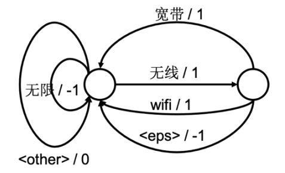


**（2） 热词WFST干预识别**

在3.3.2基础上增加热词功能，涉及到的关键结构体和类包括：

  - **RescoreToken**: 在wfst/WFSTDecoderCTC.h中定义了结构体，成员变量包括：
	  - next: RescoreToken的链表指针;

	  - id: 输出字符id;

	  - score: 累计分数；

	  - omitedlmScore: score中从\<base.bin\>上累计获取的分数。


  - **TokenHotWord**: 在wfst/WFSTDecoderCTC.h中重新定义了结构体，与**Token**相比新增了以下成员变量：
	  - rescoreTokenList: RescoreToken的链表头;

	  - nActiveRescoreHyps: RescoreToken链表中的活跃令牌数;

	  - bestRescore: RescoreToken链表中活跃令牌分数的最大值。


  - **WFSTDecoderCTCHotWord**: 在wfst/WFSTDecoderCTC.h中继承父类**WFSTDecoderCTC**，其中成员变量增加了：
	  - m\_rescoreNetwork: 加载了\<kw.bin\>的WFSTNetwork;

	  - m\_keyWeight: RescoreToken.score计入TokenHotWord.score的权值;

	  - m\_lmScoreOmit: TokenHotWord.lmScore计入RescoreToken.score的权值。


新增重要的成员函数包括：

  - void propagateRescoreToken: 当propagate函数中令牌传递到输出字符不为\<eps\>的转移边时，调用该函数，将令牌上绑定的子令牌在热词WFST传递。该函数以递归的形式进行，当传递到输入符号非\<eps\>时终止递归调用。

在热词干预识别过程中，每条搜索路径满足如下性质：命中热词部分的分数为 m\_acWeight \* acScore + m\_lmWeight \* (1-m\_lmScoreOmit) \* lmScore + m\_keyWeight \* bestRescore；未命中热词部分的分数为m\_acWeight \* acScore + m\_lmWeight \* lmScore。通过这种设计方式，提升热词识别的准确率，并且不影响非热词识别的准确率。

#### 多候选和置信度功能开发

本引擎提供了多候选和置信度功能开发。分别支持在解码过程中提供多个候选识别结果，每个候选结果进行置信度打分，并最终根据置信度得分对多个候选结果进行排序。

主要实现的思路则是在识别进行到最终阶段时，根据还处于活跃状态的hyps分别进行打分，并且根据所需要的多候选结果数目，保留得分最高的N个hyps作为多候选结果。此外，考虑到本引擎使用了WFSTCTC方式进行解码，可能会存在多个hyps对应同一个文本识别结果的情况，根据这种情况对hyps进行合并，并最终返回识别结果。

本功能所使用的到类和变量有：

在**WFSTDecoderCTC.h**

- m\_Nbest：多候选结果的数目
- m\_mlf：储存多个候选文本结果的指针
- m\_mlf\_start：储存多个候选结果起始时间点的指针
- m\_mlf\_end：储存多个候选结果终止时间点的指针
- m\_mlf\_prob：储存多个候选结果似然度得分的指针
- m\_confidence：储存多个候选结果置信度得分的指针
- m\_result\_hist：对多候选识别结果进行直方图剪枝的对象
- get1best：判定是否多候选为1，也就是不进行多候选操作

本功能所额外需要或改动的函数有：

**WFSTDecoderCTC.cpp:**

- void propagate2final(Token \* tok, bool getmid)：令牌传递的最终状态，在本状态中将活跃的所有hyps存入直方图，并进行直方图剪枝获取Nbest结果
- void finish()：最终处理多候选结果，将其整理成外部接口所需要的形式，包括文本结果，时间点，置信度等多个信息。
- void updataCands( Token\* in)：多候选结果处理，用于合并对应相同文本结果的不同hyps。并对合并之后的结果进行排序，确保排名第一的候选结果和不做多候选的识别结果相吻合。

void WFSTCTCForceAlign(list\<int\> hyp, list\<int\> timestep\_list, int candsNum)：

对多候选结果进行逐条处理，分别得到每个候选结果的时间点，文本结果和置信度。

**WFSTDecoderCTC.h**

- std::string getresults(int i)：返回第i个多候选结果
- std::vector\<int\>\* getmlfStart(int i)：返回第i个多候选结果的起始时间的点
- std::vector\<int\>\* getmlfEnd(int i) ：返回第i个多候选结果的结束时间点
- std::vector\<std::string\>\* getmlfWord(int i) ：返回第i个多候选结果的文本信息
- std::vector\<FLOAT\>\* getmlfProb(int i) ：返回第i个多候选结果的似然度
- FLOAT getconfidence(int i) ：返回第i个多候选结果的置信度打分
- int getCandNum()：返回多候选结果的总数

**E2EEngine.cpp:**

- WordResult\* GetE2EResult()：进一步将多候选结果整理成WordResult结构体指针的形式。

## 在线端到端语音识别引擎**编译与测试**说明

> 1)  编译器要求：安装4.8以上版本的g++和gcc
>
> 2)  机器环境配置：要求64位linux系统，Centos或Redhat 6.3以上企业开发版
>
> 3)  编译步骤：
>       - 进入 source/make 目录
>
>       - 运行./make\_all.sh
>
>       - 在source/bin 目录下面生成可执行文件**onepass**，以及静态库**librecengine.a、libsrilm.a、libtools.a、libtshare.a** 和**libwfstdecoder.a**
>
>
> 4)  第三方依赖库：动态链接函数库，位置在source/ipplib/sharedlib下面
>
> 5. 测试说明：将编译好的静态库文件**librecengine.a、libsrilm.a、libtools.a、libtshare.a 和libwfstdecoder.a**链接至引擎封装工程TBNR中（TBNR_API/release_lib_wfst_dnn/）统一进行测试。

# **引擎封装tbnr**

## 在线语音识别引擎**总模块**

语音识别引擎工程前端封装包括：端点检测、特征提取、后处理匹配和多线程封装等子模块。完成输入实时输入语音进行实时转写的功能。

### 在线识别引擎**工程使用**说明

**注**：EPD版本

1.  EPD是一种基于谐波的端点检测算法，有较高的实时性，适用于在线和离线识别场景；

2.  当前在线识别系统使用的是EPD版本；

#### 编译环境

（1）**编译器要求**：安装4.7以上版本的gcc和g++

（2）**机器环境配置**： 要求64位linux系统，Centos或Redhat 6.3以上企业开发版

（3）**编译步骤**：Epd版本，进入**TBNR\_EPD/TBNR\_API**目录执行，即可生成TBNR动态库：**libTBNR\_API.so**

```shell
make – f Makefile_TBNR_new_epd
```

（4）**依赖库**：依赖解码器生成的静态库，位于TBNR\_API\\release\_lib\_wfst\_dnn目录下：

>   - librecengine.a：解码器生成的静态库，已提供源码
>
>   - libsrilm.a：解码器生成的静态库，已提供源码
>
>   - libtools.a：解码器生成的静态库，已提供源码
>
>   - libtshare.a：解码器生成的静态库，已提供源码
>
>   - libwfstdecoder.a：解码器生成的静态库，已提供源码

（5）**第三方依赖库**：依赖intel 加速库，对应的so位于**TBNR\_API/RelyOn/ipp\_lib/linux**下，包括：

>   - libiomp5.so： Intel公司发布的通用IPP函数库，用于加速计算，我们没有源码。
>
>   - libippcoreem64t.so：Intel公司发布的通用IPP函数库，用于加速计算，我们没有源码。
>
>   - libippcoreem64t.so.6.0：Intel公司发布的通用IPP函数库，用于加速计算，我们没有源码。
>
>   - libippscem64t.so.6.0： Intel公司发布的通用IPP函数库，用于加速计算，我们没有源码。
>
>   - libippsem64t.so：Intel公司发布的通用IPP函数库，用于加速计算，我们没有源码。
>
>   - libippsem64t.so.6.0： Intel公司发布的通用IPP函数库，用于加速计算，我们没有源码。
>
>   - libippsmx.so.6.0：Intel公司发布的通用IPP函数库，用于加速计算，我们没有源码。
>
>   - libippsrem64t.so： Intel公司发布的通用IPP函数库，用于加速计算，我们没有源码。
>
>   - libippsrem64t.so.6.0：Intel公司发布的通用IPP函数库，用于加速计算，我们没有源码。
>
>   - libippsry8.so.6.0：Intel公司发布的通用IPP函数库，用于加速计算，我们没有源码。

#### 整体框架

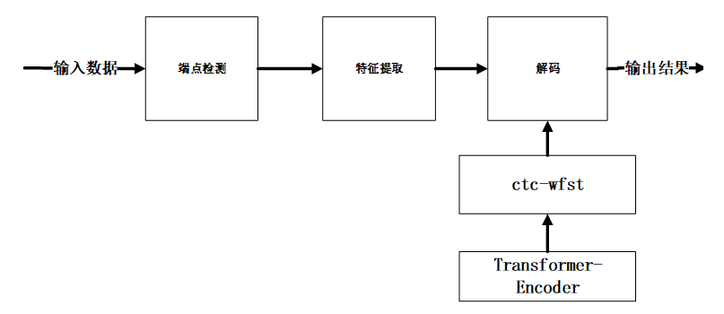

如上图所示，首先对输入的音频数据进行端点检测，获取逐句的有效语音数据，然后将其送入特征提取模块，接着对于提取的声学特征进行解码，解码过程采用transformer的decoder输出进行字符同步的束搜索算法，在搜索空间内寻找匹配概率最大的最优路径，得到识别结果。

#### 主要源代码介绍

TBNR\_EPD目录：用于编译生成**libTBNR\_API.so**

```shell
|──Makefile.common.variables：# 设置TBNR_API下Makefile_TBNR_new_epd编译选项
|──include_wfst：# 链接解码器需要头文件
| |──onepass.h：# 定义解码器类
|──TBNR_API目录：# 编译目录
| |──Makefile_TBNR_new_epd：# Makefile文件
| |──TBNR_API.cpp :#  实现TBNR各功能模块的组合，对外接口API。
| |──CTSRBuffer.cpp： # 通过类CTSBuffer控制数据流程。
| |──EPD目录， # 该目录实现主要是基于谐波方式的端点检测功能
| | |──EPD.cpp # 实现EPD检测
| | |──DetectEnergy.cpp # 能量检测
| | |──FFT.cpp # 快速傅里叶变换
| |──RingDetect目录，# 该目录实验彩铃检测
| | |──RingDetect.cpp  # 彩铃检测接口源文件
| |──CreateFeature  # 目录， 该目录实现主要功能是提取特征
| | |──CreateFeature.cpp:  # 实现提取语音特征；
| | |──onlinecms.cpp: # 进行倒谱均值减
| | |──PLP_NCC.cpp：# 提取PLP及基频残差。
| | |──rsrfft.cpp：# 实现分裂基fft算法
| | |──plp.cpp：# 提取plp特征（FBank方法）
| | |──PitchTracker.cpp：# 提取基频模块，利用频域算法提取基频
| | |──mfcc_hires.cpp：# 提取MFCC模块，实现提取MFCC特征
| |──highpass，# 该目录主要功能是进行高通滤波
| | |──Highfilter.cpp：# 实现高通滤波器相关函数
| |──RecResultDeal，# 该目录主要为识别结果后处理
| | |──GBK2UTF8：# 识别结果GBK转UTF8编码
| | | |——CodeForamtConversion.cpp # 转码函数源文件
| |──release_lib_wfst_dnn，# 该目录实现解码依赖的静态库
| | |──librecengine.a：# 解码器编译生成，已提供源码
| | |──libsrilm.a：# 解码器编译生成，已提供源码
| | |──libtools.a：# 解码器编译生成，已提供源码
| | |──libtshare.a：# 解码器编译生成，已提供源码
| | |──libwfstdecoder.a：# 解码器编译生成，已提供源码
| |──RelyOn：# 该目录下依赖的intel ipp库及头文件
| | |──RelyOn\ipp_header\emt64t：# 64位用该目录头文件，引擎目前用的该目录。
| | |──RelyOn\ipp_lib\linux：# ipp动态库，详细介绍参照依赖库介绍。
| |──resample：# 该目录实现重采样相关算法
| | |──filter.cpp：# 实现滤波相关算法
| | |──Rtresample.cpp：# 实现重采样相关算法
| |──BC:BCVAD  # 检测目录，目前该通能不再使用但接口保留
| | |──HotWord：# 热词功能模块
| | |──Word2PhnIdx.cpp：# 热词功能实现源文件
| | |──DTW.cpp：# DTW算法实现源文件
| | |──Tools：# 字符串处理文件目录
| |──Punctuation：# 标点功能模块
| | |──Punctuation.h：# 标点功能接口头文件
| | |──libPunctuation.so：# 标点功能接口库
| | |──libcrflearn.so：# 标点功能依赖crf库 
| |──ITN：# ITN功能模块
| | |──translate-api.h：# ITN功能头文件
| | |──libthraxrewrite.so：# ITN功能实现库
| | |──thrax-1.2.3：# ITN功能依赖的thrax库
| | |──openfst-1.6.3：# ITN功能依赖的openfst库
```


#### 函数调用流程

##### “单线程单解码器”函数调用流程

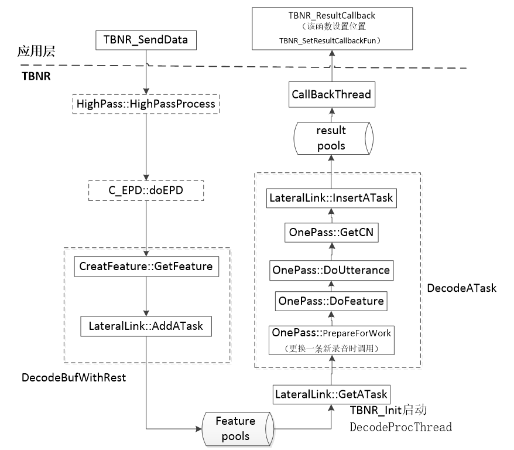

**说明：**图中虚线部分为可选操作；

##### “多线程多解码器”函数调用流程

这里多线程指的是“多个发送数据线程”，下图分别展示在线模式下多线程多解码器函数调用流程。

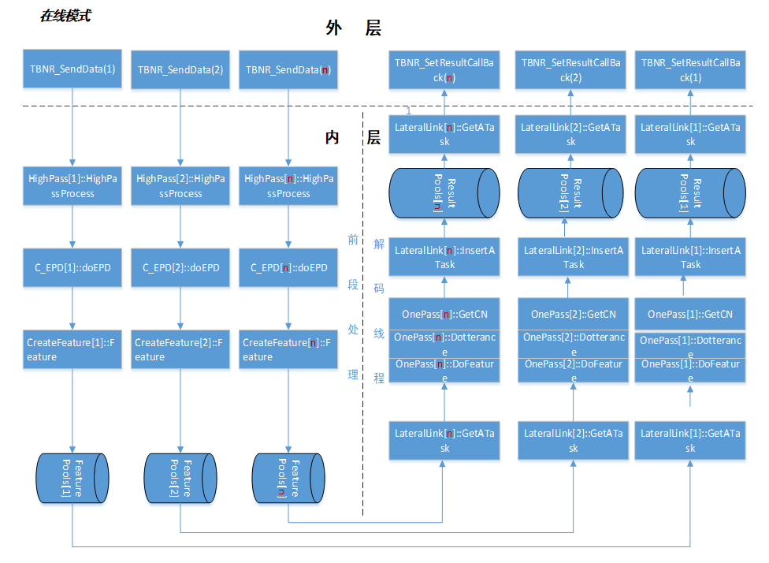

<center>Fig.b 在线模式“多线程多解码器”函数调用流程

如图3所示，外层通过TBNR\_SendData()接口函数完成送入语音任务，内层对进来的语音任务依次进行**高通滤波**，**EPD端点检测**，**特征提取**，然后将提取的特征压入各自对应**任务池**中，解码线程依次从任务池中依次获取特征任务，完成**解码**并将解码后的结果各自的**结果池**中，并通过结果回调返回结果。

**说明1：**外层的会话数和内层的解码线程数是相等，并且会话ID(SessionID)与解码ID(DecodeID)是一一对应的，也就是说外层的会话与内层的解码进行了绑定。

**说明2：**在EPD端点检测时，检测到起点时，将起点之后的每一小包任务(1024个采样点)送入特征提取模块进行特征提取，将提取的特征压入与之会话ID对应的任务池中等待解码；当解码器解码到尾点包时，获取解码结果。也就说在线识别环境是在检测到起点之后开始进行解码。

##### 解码器函数调用流程

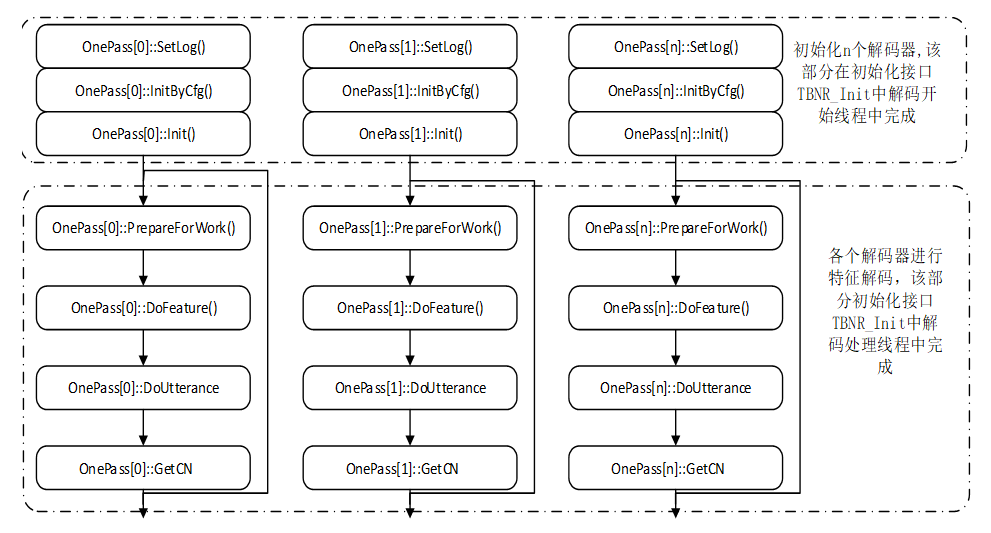

#### 如何正确运行

按照章节2的步骤编译生成动态库libTBNR\_API.so后，将该so到**测试环境bin\\lib**目录下，即可进行识别。

#### 附录

##### A 接口函数调用流程

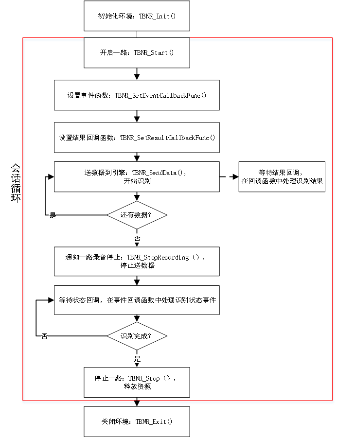

### 识别引擎**概要设计**说明

#### 概述

##### 简介

“好记性不如烂笔头”，反映出人们对记录的重视程度。从传统的纸文化进步到计算机时代，除了手写识别，当信息量更大的时候，人们会选择音频和视频。虽然人们不用担心存储容量不够用，但是今后如何有效的利用这些多媒体的记录，成为一个突出问题。

很多人为此倾向花高价邀请速录员。一来需要成本，二来在专业领域，培训和保密又成为新的问题。现在，用户有了新的选择-声学所识别引擎。该识别引擎不仅能保存语音，还能把语音转化成文字与之对应保存下来。有了它，今后无论何时用户想要调出所需的记录，只要通过查找相应文字并简单点击，相关的语音片断就找到了。同时，本引擎还提供了直接识别以往录音的功能，把以前宝贵的资料统统转化成文本，给用户的媒体档案库将来查询时提供最大便利。

中科院声学所中科信利连续语音识别引擎，针对连续音频流（即来自说话人直接录入的语音，或者广播电台、电视台或其他领域的音频信号）进行识别，将音频信息自动转化成文字。覆盖汉语中绝大多数词语，适用于说普通话的任何人群。输出的结果都是汉字，兼容数字。

在输入的声音中，检测出可靠的语音，排除噪声音乐等，实时送入语音识别解码器进行识别。识别引擎把音视频中提取出的语音分成 25 毫秒一帧，提取有用特征，然后识别出一些类似拼音的结果（声学模型），再根据汉语字词句之间的搭配概率（语言模型），综合考虑。当然，考虑的越多（beam路径越大），识别准确率相对提高，同时消耗的时间就增长了；所以我们有优化策略，及时排除不可能的结果，避免系统过慢。用户可以通过调节这些参数来平衡识别质量和速度，以满足实际的需要。

最后返回的识别结果，软件以汉语中基本词语为单位给出了包含对应时间点的词序列。

需要说明的是，对识别正确率以及识别速度来说，输入语音（普通话）的质量（录音过程）是很重要的。录音时应尽可能的排除噪声和音乐、增大语音，识别效果就会好得多，因此建议用户在录音的时候选用质量较好的麦克风。

另外，系统在检测是否有语音信号时可能会带来一定的时间滞后，用户在实时录入时在每句话结束后，需要略有停顿，这样可以提高系统语音检测的速度和精度。语音检测的越好。识别引擎的识别效果也就越好。

##### 读者对象

本文档是对识别引擎的内部代码流程和相关技术点的整体说明，因此读者最好满足如下几点条件后再读此文档：

  - 有一定的C和C++语言基础

  - 了解语音识别过程和原理

  - 了解声学所识别引擎实现原理

##### 术语定义

  - TBNR，Thinkit-Broadcast-News-Recongnize：中科信利识别引擎

  - CN，Confuse-Network：混淆网络

  - VAD，Speech Activity Detection：语音活动检测

  - WFST, Weighted Finite-State Transducer：加权有限状态转录机

  - ITN,Inverse –Text-Normalization：逆文本标准化

#### 总体设计

声学所识别引擎的大体流程可以分为五步：

  - 第一步：进行识别环境的初始化，构建WFST解码网络。

  - 第二步：将输入的语音数据送入到声学所的识别引擎中进行分段处理，得到有效的分段语音数据。

  - 第三步：将步骤一中得到的分段语音数据进行特征提取，得到分段语音对应的特征数据。

  - 第四步：将步骤二中的特征数据进行解码，得到多个候选的识别结果。

  - 第五步：识别结果进行相应的后处理。并通过回调函数进行返回。

识别引擎总体设计流程如图2.1所示：

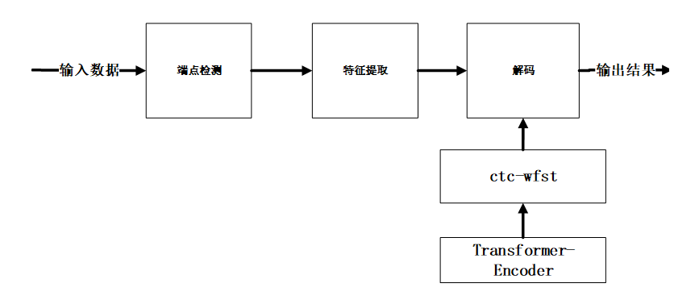

<center>图2.1 识别引擎总体设计流程

如上图所示，首先对输入的音频数据进行端点检测，获取逐句的有效语音数据，然后将其送入特征提取模块，接着对于提取的声学特征进行解码，解码过程采用transformer的decoder输出进行字符同步的**束搜索算法**，在搜索空间内寻找匹配概率最大的最优路径，得到识别结果。

#### 模块设计

##### **初始化**模块

初始化模块主要任务是通过读取配置文件完成识别引擎环境的初始化，如初始化端点检测模块，初始化提取模块，初始化解码模块，初始化后处理功能模块。

初始化模块内容如图3.1所示：

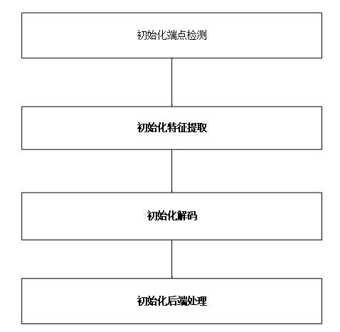

<center>图3.1 初始化流程图

###### 构建解码网络子模块

读取输入的模型，利用解码器加载相应的模型并构建解码网络。

##### **端点检测**模块

端点检测模块是对输入的语音数据进行分段处理，切分出有效的语音进行后面的特征提取和解码工作，该模块避免了噪音，静音等非有效片段对识别性能的影响，提高了识别结果的准确率，同时也提升了引擎实时率。

此识别引擎支持基于**能量**，**谐波**和**深度学习**三种方式的端点检测方法，使识别引擎在不同数据上具有很强的适用性，保证了端点检测的分段结果的可靠性。

###### 基于能量端点检测子模块

首先对输入的语音数据进行分帧处理，逐帧计算其时域能量，缓存一定的帧数，利用**自适应初始化噪音模型**，重新计算各帧时域能量，当连续有效能量帧数超过设定阈值时确认出起点位置，当连续静音数据帧数超过设定阈值时确认出尾点位置。

基于能量端点检测流程图如图3.2.1所示：

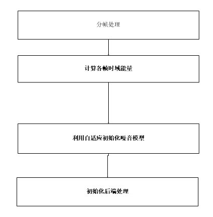

###### 基于谐波端点检测子模块

通过快速傅里叶变换FFT将语音在时域的信号变换到频域。一般正常的说话人语音可以在频谱图中看到明显的谐波，传真音和震铃这些类型的语音则没有明显的谐波结构，据此可通过分析信号在频域的谐波位置判断噪音和正常的说话人语音的起止点。谐波形式如图3.2.2.1所示

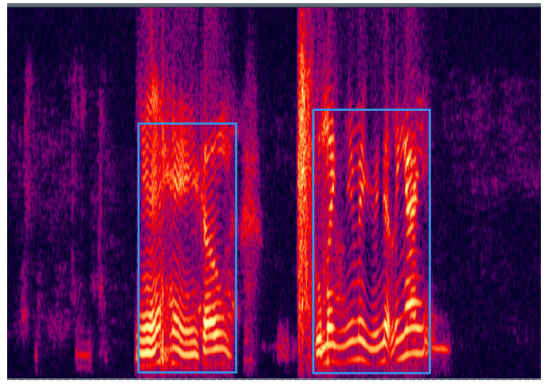

<center>图3.2.2.1 谐波形式

基于谐波能量方式的端点检测方法的基本流程：

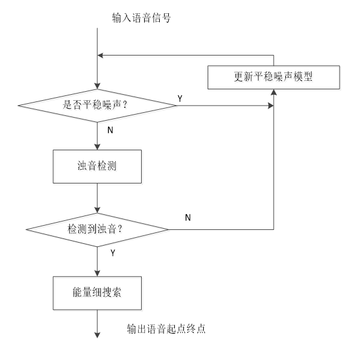

<center>图3.2.2.2 端点检测流程图
##### **特征提取**模块

语音波形在时域上几乎没有描述能力，因此必须将波形作变换，即进行声学特征提取。特征提取模块负责计算语音的声学参数，并进行特征的计算，以便提取出反映信号特征的关键特征参数，以降低维数以便于后续处理。语音识别系统常用的特征参数有幅度、能量、过零率、线性预测系数（LPC）、LPC 倒谱系数（LPCC）、线谱对参数（LSP ）、短时频谱、共振峰频率、反映人耳听觉特征的Mel频率倒谱系数（MFCC）等。

识别模块支持**感知线性预测（PLP）**和**Mel频率倒谱系数（MFCC）**两种特征；

###### 基于MFCC特征提取子模块

梅尔频标倒谱系数(Mel Frequency Cepstrum Coefficient,MFCC)考虑了人耳的听觉特性，将频谱转化为Mel频标的非线性频谱，然后转换到倒谱域上。MFCC是采用滤波器组的方法计算出来的，这组滤波器组在频率的Mel坐标上是等宽的。这是因为人类对1000HZ以上的声音频率范围的感知不遵循线性关系而遵循在对数频率坐标上的近似线性关系。

梅尔频率倒谱特征的提取一般分为如下步骤：

  - **预加重**，目的是提升高频部分，使信号变得平坦，保持在低频到高频的整个频带中，能用同样的信噪比求频谱，并消除发声过程中的声带和嘴唇效应，突出高频的共振峰；

  - **分帧**，由于语音具有短时平稳特征，需将语音分成一个个小段，每一小段为一帧，帧长一般为25ms，相邻帧的重叠为10ms。

  - **加窗**，一般为方窗、汉明窗、汉宁窗等，目的是消除相邻帧两端可能造成的不连续性。

  - **快速傅里叶变换FFT**，将语音信号转换到频域，分析语音信号在频域的特性。

  - **梅尔滤波器组**，人耳对不同频率的敏感程度不同，且成非线性关系，因此我们将频谱按人耳敏感程度分为多个Mel滤波器组；在Mel刻度范围内，各个滤波器的中心频率是相等间隔的线性分布，但在频率范围不是相等间隔的，将能量谱通过一组Mel尺度的三角形滤波器组过滤后获得一个与滤波器个数相等的维数的特征。

  - **离散余弦变换**，大多数的自然信号（包括声音和图像）的能量都集中在离散余弦变换后的低频部分，离散余弦变换具有很强的"能量集中"特性，通过离散余弦变换对每帧数据在进行一次降维并获得音频的包络特征。

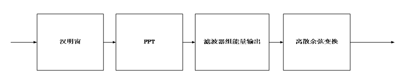

<center>图3.2.1 MFCC特征流程

###### 基于PLP特征提取子模块

PLP共60维度，包括1维能量，12维PLP，1维基本， 1维NCC（基频置信度），并进行三阶差分。具体实现步骤如下：

1. 语音信号经过采样、加窗、离散傅立叶变换后,取短时语音频谱的实部和虚部的平方和, 得到短时功率谱P(f)= Rx[X(f)\]<sup>2</sup> + Im[X(f)]<sup>2</sup>

2. 临界频带分析

临界频带的划分反映了人耳听觉的掩蔽效应，是人耳听觉模型的体现。利用公式

Z( f ) = 6ln{ f / 600+ \[ ( f / 600)<sup>2</sup> + 1\] <sup>0.5</sup> }

将频谱P ( f ) 的频率轴f 映射到Bark 频率Z, 总共得到17 个频带。这17 个频带中每个频带内的能量谱与式( 3) 的加权系数相乘, 求和后得到临界带宽听觉谱θ( k) 。

3.  等响度预加重

用模拟人耳大约40 dB 等响曲线E( f ) 对θ( k)进行等响度曲线预加重, 即

Γ( k) = E\[f0(k)\]θ( k) , ( k = 1, 2, ..., 17)

式中f<sub> 0</sub> ( k ) 表示第k 个临界带听觉谱的中心频率所对应的频率( 单位为Hz) 。其中：E\[ f0(k)\] =(f0(k)<sup>2</sup> + 1. 44 \* 10<sup>6</sup> )f<sub>0</sub>(k)<sup>4</sup>/( f0(k)<sup>2</sup> + 1.6\*10<sup>5</sup>)<sup>2</sup>\*( f0( k)<sup>2</sup> + 9.61\*10<sup>9</sup>)

4. 强度-响度转换

为了近似模拟声音的强度与人耳感受的响度间的非线性关系, 进行强度-响度转换θ(k) = Γ( k )<sup>0.33</sup> 经过离散傅里叶反变换后, 用德宾算法计算全极点模型, 并求出倒谱系数, 最终程序提取出0-12阶共计13维PLP特征。

5. 之后可选择是否加入基频以及基频置信度（NCC），并做三阶差分，最终得到特征集。若选择加入基频以及NCC特征，则最终得到(13+2)\*4=60维特征集

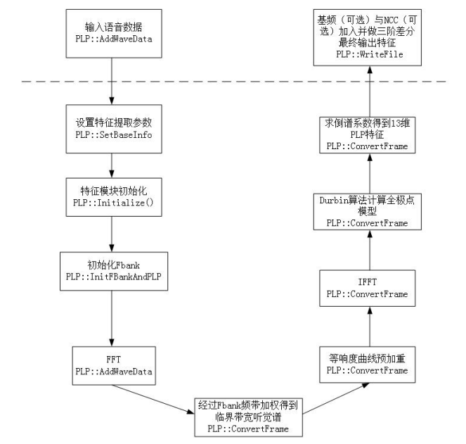


##### **解码模块**

端到端声学模型神经网络推理介绍：

采用的是transformer结构构建的声学模型前向推理。输入的是归一化的声学特征，encoder输出是每一帧的声学embedding，声学embeding输入decoder，其中decoder是一个自回归的计算流程，最后通过decoder输出每一个character的概率。整个包括**模型加载**，**模型分层计算**，**decoder自回归计算**，**模型定点化计算**，**向量矩阵计算加速**，**encoder-decoder计算优化**，**多线模型参数共享**等部分。在线部分还包括截断点判决，中间隐含层结果缓存等模块。

**解码中的令牌传递算法介绍：**

**有限状态转换机**(WFST)提供了一个统一的形式来表示当前主流的大规模连续语音识别(LVCSR)系统的不同知识源(knowledge source)。表示不同知识源的多个WFST可以通过复合运算整合成一个WFST，这个WFST表示的搜索网络的输入是HMM状态。然后这个WFST可以通过各种优化运算来去掉其中的冗余部分而变成等价的但是更加紧凑高效的WFST来加速解码过程。具体包括：

  - wfst网络确定化，最小化算法；

  - 动态语言模型计算算法；

  - 快速维特比搜索算法，基于空边和静音特殊处理算法；

  - 动态结果回溯和词图构建算法。

**基于热词网络的令牌传递算法：**

在大规模连续语音识别中，解码过程一般采用加权有限状态转换器wfst，这里的热词解码算法即on-the-fly decoding就是在语音识别的帧同步算法中，其搜索空间包含基础模型的wfst网络和根据热词或领域词构建热词的wfst网络，解码过程中动态的结合利用基础网络和热词网络进行解码，其目的是有效的在一遍解码过程中融入领域热词的信息又不降低其他通用领域的信息权重，实现提高领域热词识别率的方法，领域热词网络权重可以根据任务更新，识别过程不用增加后处理耗时。具体包括热词网络的读取和构建，动态的热词网络解码两个部分。

调用流程如图3.4.4所示：

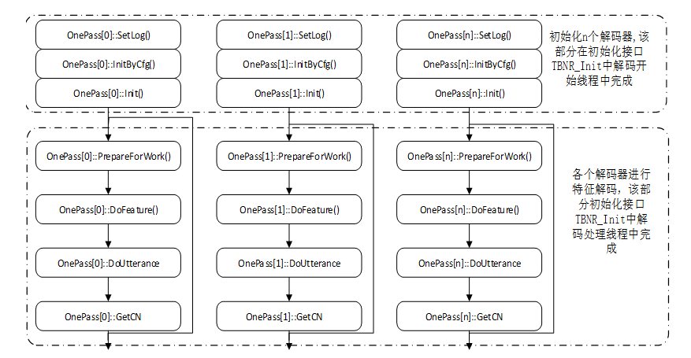

<center>图3.4.4 解码函数调用流程图

##### 结果后处理模块

后处理模块是根据解码出来的识别结果，对识别结果进行一系列的处理；如**音素转拼音**，**ITN转换**，**添加标点**，**热词替换**等处理操作。

###### 音素转拼音子模块

解码后的识别结果是训练过程的音素单元，利用音素单元与汉语拼音之间的映射，进行相互转换。

###### ITN子模块

**逆转文本标准化**（ITN, Inverse Text Normalization）：在大多数语音识别系统中，核心语音识别器会生成语音形式的标志序列，这个序列随后通过 ITN 过程被转换成书写形式。ITN 包括数字、日期和地址等对象。图3.5.2.1 展示了输入为语音形式，输出为书写形式的例子。


###### 标点子模块

利用标点模型，对识别结果进行添加标点操作。标点模块主要采用CRF算法，用带有标点符号的文本进行训练，在模型的基础上再添加语义的方法，实现逗号、句号、感叹号、问号的添加，目前支持这四种中文标点符号。

CRF(Conditional Random Field)：条件随机场，一种机器学习技术（模型）。CRF由John Lafferty最早用于NLP技术领域，其在NLP技术领域中主要用于文本标注，并有多种应用场景，例如：分词（标注字的词位信息，由字构词）、词性标注（标注分词的词性，例如：名词，动词，助词）、命名实体识别（识别人名，地名，机构名，商品名等具有一定内在规律的实体名词）、标点添加等；

###### 热词子模块

热词模块是针对一些特定领域的词语识别效果不好，用户可以将该特定领域的词语动态输入到识别引擎，引擎通过热词技术对识别出错的词语进行优化，提高这类词语识别的准确率。 声学所连续语音识别引擎 API 提供两种应用模式：

（1）一种是**在线**实时录音，检测语音并进行识别。这种方法适合用于需要实时获得语音内容的场合。例如可以在智能导航系统、语音听写系统进行开发使用。

（2）另一种是**离线**读入录音文件进行识别，可以充分的利用聚类、实时自适应等技术，把语音的内容充分分析，进一步提高识别准确度。

##### 多线程封装模块

引擎通过CycLine类来实现多线管理，用户层通过申请会话获取处于空闲状态的会话，申请成功后可以进行语音任务的发送，引擎内部将该路会话的语音任务进行**前端处理后得到声学特征**并将该声学特征送入对应的任务池LateralLink中等待解码线程获取并解码。

多线程解码流程如下图3.6所示：

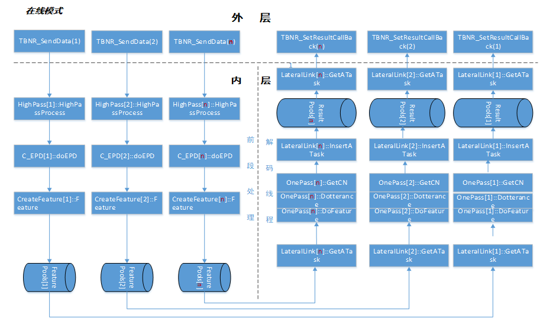

<center>图3.6

外层通过TBNR_SendData()接口函数完成送入语音任务，内层对进来的语音任务依次进行高通滤波，EPD端点检测，特征提取，然后将提取的特征压入各自对应任务池中，解码线程依次从任务池中依次获取特征任务，完成解码并将解码后的结果各自的结果池中，并通过结果回调返回结果。

**说明1**：外层的会话数和内层的解码线程数是相等，并且会话ID(SessionID)与解码ID(DecodeID)是一一对应的，也就是说外层的会话与内层的解码进行了绑定。

**说明2**：在EPD端点检测时，检测到起点时，将起点之后的每一小包任务(1024个采样点)送入特征提取模块进行特征提取，将提取的特征压入与之会话ID对应的任务池中等待解码；当解码器解码到尾点包时，获取解码结果。也就说在线识别环境是在检测到起点之后开始进行解码。

在线识别引擎采用EPD(基于谐波能量)作为端点检测，利用人声的谐波特点能有效检测出有效人声，具有低延时，速度快的特点。

#### 可靠性设计

识别引擎设计考虑了应用场景的复杂性和输入的多样性的情况，为了让识别引擎应用复杂的应用场景中高性能的工作，识别引擎中的模型采用了较全的多领域数据进行训练，并包含了该语种全集字词作为字典，保证了识别性能的可靠性。

识别引擎支持多种不同格式的语音数据作为输入，同时引擎支持高并发且异步的处理方式，保证了各个处理单元间的独立工作。

识别引擎内部对每一个操作和异常都做了判断以及日志记录，便于记录引擎工作流程和出现异常时的问题排查。并且识别引擎测试按照严格的7\*24小时压力测试标准进行测试，同事也针对所以异常数据进行异常情况测试，保证引擎的稳定性和可靠性。

#### 扩展性设计

> 识别引擎支持多路并发，保证了不同cpu数和内存大小的机器拓展需求；识别引擎可以通过参数配置来实现不同语种的任务处理以及性能和功能上调节，目前支持汉，英，日，韩，维，粤，哈萨克，越南，藏，土耳其语种的语音数据进行语音识别。

#### 安全性设计

【详细说明引擎如何满足安全性，包括防止系统错误，如何进行保密，用户数据泄漏等】

【说明测试要点】

#### **维护性设计**

识别引擎为了方便后期的引擎维护，识别引擎采用标准c/c++函数同时在较低编译器上进行编译。

识别引擎开放了大量内部参数，保证了引擎的可配性和可维护性。常见参数如下：

|          参数名           |                         取值                          | 说明                                                         |
| :-----------------------: | :---------------------------------------------------: | ------------------------------------------------------------ |
|        SampleRate         |                      8000或16000                      | 声学模型训练语音的采样率。目前仅广电模型SampleRate=16000，其余模型下均为8000。 |
|       isOnlineMode        |                      true或fasle                      | 是否走在线语音流处理流程。true:在线；false:离线系统。        |
|      NumberOfSession      |                       >=1的整数                       | 开启会话数。实际可通过TBNR_Init()传参设定开启会话数，仅当参数<=0时, NumberOfSession才起作用。实际会话个数最多不能超过授权线数。 |
|      NumberOfDecoder      |                       >=1的整数                       | 解码器个数。在线模式下，实际解码器个数=实际会话个数；离线模式下，decoderNumPerSession>0时，实际解码器个数= int (0.5 + decoderNumPerSession * sessionNum)。实际TBNR解码器个数最大不能超过授权文件授权线数。 |
| NumberOfDecoderPerSession |                       >=1的整数                       | 每个会话开启的解码器个数。仅对离线模式适用。                 |
|         CNFormat          |                      DaLian或KWS                      | 引擎模式。仅做纯识别还是要做关键词检索。                     |
|       IndexWithRec        |                      true或FALSE                      | 是否建索引。 CNFormat与IndexWithRec一般如下搭配使用： 1、CNFormat=DaLian,IndexWithRec=false:纯识别模式。 2、CNFormat=KWS, IndexWithRec=false:纯关键词检索模式。 3、CNFormat=KWS, IndexWithRec=true:识别+检索模式。 |
|        isSaveData         |                      true或FALSE                      | 是否保存分段语音。isSaveData=true,保存分段语音到参数“FeatureRootDir”所指目录下（一般位于model/ElvaData/目录下）。 |
|       KeepAllSpeech       |                      true或FALSE                      | 是否保留无效语音(如，静音等)。 KeepAllSpeech=false,无效语音不送解码。 KeepAllSpeech=true,无效语音送解码。 |
|          isDoEPD          |                      true或FALSE                      | 是否做分段（端点检测）。                                     |
|         VadFormat         |                      oldEPD或BC                       | 端点检测算法。BC:广电引擎端点检测；oldEPD:EPD端点检测。      |
|       DetectRingNum       |                       >=0的整数                       | 彩铃检测开关。DetectRingNum=0时，不做彩铃检测。DetectRingNum>0时，做彩铃检测。 |
|    PrintSegTimeOFWord     |                        true或                         | PrintSegTimeOFWord =true: 转写候选结果中词的时间是相对于整条语音的绝对时间； |
|           FALSE           | PrintSegTimeOFWord =false：词的时间是相对于句的时间。 |                                                              |
|     PrintPunctuation      |                      true或false                      | 是否输出标点。如果PrintPunctuation=true，则必须设置PrintSegTimeOFWord=true。 |
|        PrintPinyin        |                      true或false                      | 识别结果带拼音输出。如果PrintPinyin=true，必须设置字典WordPhonemePinyinDict。且只有当解码器版本支持拼音输出时，最终才能够输出拼音。 |
|       DictFileName        |                                                       | 识别用字典，含词语及其对应音素发言。该字典跟模型一一对应，更换模型时，注意更换相应字典。 |
|   WordPhonemePinyinDict   |                                                       | 识别结果输出拼音时所用字典，含词语、对应音素及拼音。         |
|     MonoListFileName      |                                                       | 音素字典。                                                   |
|     SyllableWordDict      |                                                       | 检索用字典，含拼音、词语、音素。                             |
|       bfsmFileName        |                                                       | 语言模型。                                                   |
|        LatticeDir         |         LatticeDir=./lat 或 #LatticeDir=./lat         | CN结果存放路径。纯识别时：#LatticeDir=./lat 做检索时：LatticeDir=./lat |
|      FeatureRootDir       |                      ../ElvaData                      | 索引文件存放路径。                                           |
|       StateProbFile       |                                                       | 声学模型：.arpa文件。                                        |
|          NNModel          |                                                       | 声学模型：.bin文件。                                         |
|         VocabFile         |                   ../syllvocab.list                   | 拼音字典。关键词检索时需要。                                 |
|       MultiWordFile       |                  ../multiword.vocab                   | 拼音、音素对应字典。关键词检索时需要。                       |
|         LogLevel          |                           0                           | log级别值越大输出越详细[0-2]                                 |

#### 易用性设计

识别引擎采用c/c++接口，接口方便灵活，支持c/c++，java，python等变成语言调用，只需掌握基础的语言学习知识，即可自主设计功能模块和功能的实现。

### 在线识别引擎代码模块**接口设计**说明

#### 概述

##### 简介

“好记性不如烂笔头”，反映出人们对记录的重视程度。从传统的纸文化进步到计算机时代，除了手写识别，当信息量更大的时候，人们会选择音频和视频。虽然人们不用担心存储容量不够用，但是今后如何有效的利用这些多媒体的记录，成为一个突出问题。

很多人为此倾向花高价邀请速录员。一来需要成本，二来在专业领域，培训和保密又成为新的问题。现在，用户有了新的选择-声学所识别引擎。该识别引擎不仅能保存语音，还能把语音转化成文字与之对应保存下来。有了它，今后无论何时用户想要调出所需的记录，只要通过查找相应文字并简单点击，相关的语音片断就找到了。同时，本引擎还提供了直接识别以往录音的功能，把以前宝贵的资料统统转化成文本，给用户的媒体档案库将来查询时提供最大便利。

中科院声学所连续语音识别引擎，针对连续音频流（即来自说话人直接录入的语音，或者广播电台、电视台或其他领域的音频信号）进行识别，将音频信息自动转化成文字。覆盖汉语中绝大多数词语，适用于说普通话的任何人群。输出的结果都是汉字，兼容数字。

在输入的声音中，检测出可靠的语音，排除噪声音乐等，实时送入语音识别解码器进行识别。识别引擎把音视频中提取出的语音分成 25 毫秒一帧，提取有用特征，然后识别出一些类似拼音的结果（声学模型），再根据汉语字词句之间的搭配概率（语言模型），综合考虑。当然，考虑的越多（beam路径越大），识别准确率相对提高，同时消耗的时间就增长了；所以我们有优化策略，及时排除不可能的结果，避免系统过慢。用户可以通过调节这些参数来平衡识别质量和速度，以满足实际的需要。

最后返回的识别结果，软件以汉语中基本词语为单位给出了包含对应时间点的词序列。

需要说明的是，对识别正确率以及识别速度来说，输入语音（普通话）的质量（录音过程）是很重要的。录音时应尽可能的排除噪声和音乐、增大语音，识别效果就会好得多，因此建议用户在录音的时候选用质量较好的麦克风。

另外，系统在检测是否有语音信号时可能会带来一定的时间滞后，用户在实时录入时在每句话结束后，需要略有停顿，这样可以提高系统语音检测的速度和精度。语音检测的越好。识别引擎的识别效果也就越好。

##### 读者对象

本文档是对识别引擎的内部代码流程和相关技术点的整体说明，因此读者最好满足如下几点条件后再读此文档：

  - 有一定的C和C++语言基础

  - 了解语音识别过程和原理

  - 了解声学所识别引擎实现原理

##### 术语定义

>   - TBNR，Thinkit-Broadcast-News-Recongnize：中科信利识别引擎
>
>   - CN，Confuse-Network：混淆网络
>
>   - VAD，Speech Activity Detection：语音活动检测
>
>   - WFST, Weighted Finite-State Transducer：加权有限状态转录即
>
>   - ITN,Inverse –Text-Normalization：逆文本标准化

#### 总体设计

声学所在线识别引擎的大体流程可以分为五步：

> - 第一步：进行识别环境的初始化，构建WFST解码网络。
> - 第二步：将输入的语音数据送入到声学所的识别引擎中进行分段处理，得到有效的分段语音数据。
> - 第三步：将步骤二中得到的分段语音数据进行特征提取，得到分段语音对应的特征数据。
> - 第四步：将步骤中的特征数据进行解码，得到多个候选的识别结果。
> - 第五步：识别结果进行相应的后处理。并通过回调函数进行返回。

识别引擎总体设计流程如图2.1所示：

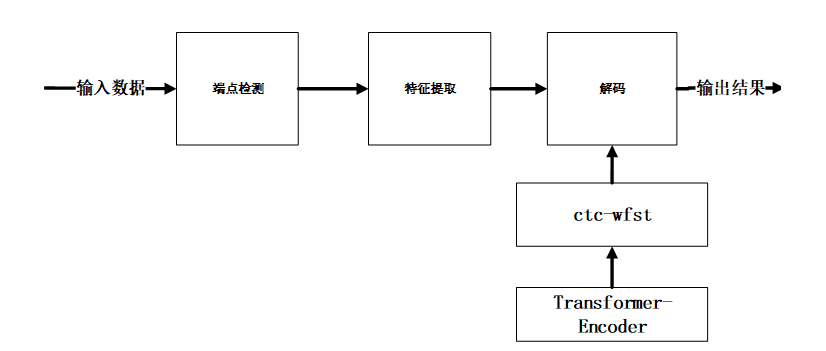

<center>图2.1 识别引擎总体设计流程

如上图所示，首先对输入的音频数据进行端点检测，获取逐句的有效语音数据，然后将其送入特征提取模块，接着对于提取的声学特征进行解码，解码过程采用transformer的decoder输出进行字符同步的束搜索算法，在搜索空间内寻找匹配概率最大的最优路径，得到识别结果。

#### 接口设计

##### **引擎接口设计**

###### 引擎初始化接口

| 函数原型 | **TBNR\_Init(const char\* systemDir, char\* configFile, int NumberOfSession = -1);** |
| :------: | ------------------------------------------------------------ |
|   功能   | 读取配置文件，加载识别模型构建解码网络，创建解码线程，初始化数据处理资源，初始化识别结果后处理资源。 |
| 参数说明 | char \* systemDir:引擎模型位置                               |
|          | char\* configFile 引擎配置文件                               |
|          | int NumberOfSession 引擎并发量                               |
|  返回值  | 成功返回0,失败返回\<0;;                                      |
|   说明   |                                                              |

###### 引擎退出接口

| 函数原型 | **TBNR\_Exit();**                                            |
| :------: | ------------------------------------------------------------ |
|   功能   | 释放解码解码网络，回收解码线程，释放数据处理资源和识别结果后处理资源 |
| 参数说明 |                                                              |
|  返回值  | 成功返回0,失败返回\<0;;                                      |
|   说明   |                                                              |

###### 引擎开启一路识别

| 函数原型 | **TBNR\_Start(int sessionId = 0);**                          |
| :------: | ------------------------------------------------------------ |
|   功能   | 输入要开启识别的会话ID，当该会话已经被占用时返回处于空闲状态的识别会话ID，并初始化该路会话识别资源 |
| 参数说明 | int sessionId 请求开启识别的会话ID                           |
|  返回值  | 成功返回处于空闲状态的识别会话ID，失败返回\<0                |
|   说明   | 当所有会话(**NumberOfSession**)都被占用时返回值\<0，表示没有多余的会话ID可被使用 |

###### 引擎开启一路识别

| 函数原型 | **TBNR\_Stop(int sessionId);**             |
| :------: | ------------------------------------------ |
|   功能   | 关闭一路sessionId识别会话,释放该路会话资源 |
| 参数说明 | int sessionId 请求关闭识别的会话ID         |
|  返回值  | 成功返回0,失败返回\<0                      |
|   说明   |                                            |

###### 该路识别设置事件回调函数

| 函数原型 | **TBNR\_SetEventCallbackFunc(TBNR\_ProcessEventCallback pFunc, int sessionId = 0);** |
| :------: | ------------------------------------------------------------ |
|   功能   | 设置该路识别会话的事件回调函数,通过时间回调函数实时返回该路识别的状态 |
| 参数说明 | TBNR\_ProcessEventCallback pFunc 事件回调函数地址            |
|          | int sessionId 该路识别会话ID                                 |
|  返回值  | 成功返回0,失败返回\<0                                        |
|   说明   | 引擎通过事件函数返回引擎工作状态,以便通知接口层引擎识别完成,可以停止当前识别会话以复用； |

###### 该路识别设置结果回调函数

| 函数原型 | **TBNR\_SetResultCallbackFunc (TBNR\_ResultCallback pFunc, int sessionId = 0);** |
| :------: | ------------------------------------------------------------ |
|   功能   | 设置该路识别会话的事件结果函数,通过结果回调函数实时返回该路的识别结果 |
| 参数说明 | TBNR\_ResultCallback pFunc 结果回调函数地址                  |
|          | int sessionId 该路识别会话ID                                 |
|  返回值  | 成功返回0,失败返回\<0                                        |
|   说明   |                                                              |

###### 该路会话结果回调函数设计

| 函数原型 | **typedef void (\*TBNR\_ResultCallback) (const Task \*pResultArray, int numberOfTasks, int sessionId);** |
| :------: | ------------------------------------------------------------ |
|   功能   | 获取识别结果                                                 |
| 参数说明 | Task \*pResultArray 分段结果数组头地址                       |
|          | int numberOfTasks 分段结果数据大小                           |
|          | int sessionId 会话ID                                         |
|  返回值  |                                                              |
|   说明   | 每出发一次回调函数可能返回会个分段的识别结果                 |

###### 该路会话进行语音数据识别函数设计

| 函数原型 | **TBNR\_SendData(char \*buf, int length, int sessionId = 0, SPEECHTYPE type = TSR\_RAW\_16, long timestamp = -1);** |
| :------: | ------------------------------------------------------------ |
|   功能   | 送入语音数据进行识别                                         |
| 参数说明 | char \*buf 语音数据                                          |
|          | int length 语音数据大小(字节)                                |
|          | int sessionId 会话ID                                         |
|          | SPEECHTYPE type 语音格式                                     |
|          | long timestamp 更新时间戳                                    |
|  返回值  | 成功返回0,失败返回\<0                                        |
|   说明   |                                                              |

###### 该路会话停止送任务函数设计

| 函数原型 | **TBNR\_StopRecording(int sessionId = 0);**                |
| :------: | ---------------------------------------------------------- |
|   功能   | 通知引擎停止送语音数据                                     |
| 参数说明 | int sessionId 会话ID                                       |
|  返回值  | 成功返回0,失败返回\<0                                      |
|   说明   | 该函数主要通知引擎送任务结束，对最后一个分段进行强制识别。 |

###### 该路会话参数参数设置函数

| 函数原型 | **int TBNR\_SetParam(char \*paramName, char \*paramValue, int sessionId = 0)** |
| :------: | ------------------------------------------------------------ |
|   功能   | 设置当前识别会话资源的某些参数值                             |
| 参数说明 | char \*paramName 参数名称                                    |
|          | char \*paramValue 参数值                                     |
|          | int sessionId 会话ID                                         |
|  返回值  | 成功返回0,失败返回\<0                                        |
|   说明   | 设置参数具体有“isSaveData”是否保存语音数据，“isSaveFeature”是否保存特征，“printPinyin”是否输出拼音，“printPunctuation”是否输出标点，“doITN”是否做ITNdoITN，“incompletetimeout”VAD参数调节 |

###### 该路会话设置热词列表

| 函数原型 | **int TBNR\_LoadHotWord(HotWord\* pHotWordList,int nLen,int sessionId);** |
| :------: | ------------------------------------------------------------ |
|   功能   | 设置当前识别会话的热词列表                                   |
| 参数说明 | HotWord\* pHotWordList热词信息数组首地址                     |
|          | int nLen 热词信息数组大小                                    |
|          | int sessionId 会话ID                                         |
|  返回值  | 成功返回0,失败返回\<0                                        |
|   说明   | 热词为GBK编码格式                                            |

###### 该路会话释放热词列表资源

| 函数原型 | **Int TBNR\_FreeHotWord (int sessionId);** |
| :------: | ------------------------------------------ |
|   功能   | 释放当前识别会话的热词资源                 |
| 参数说明 | int sessionId 会话ID                       |
|  返回值  | 成功返回0,失败返回\<0                      |
|   说明   |                                            |

##### 引擎接口流程

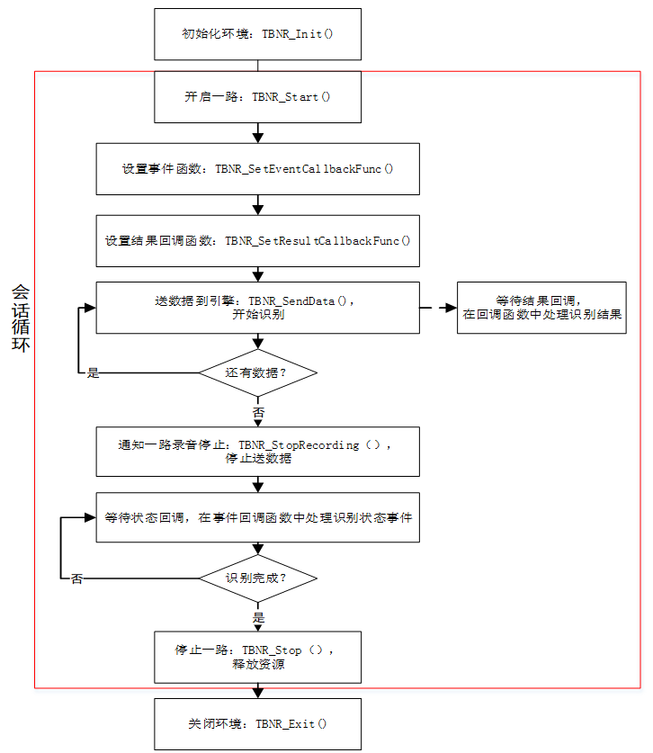

##### 引擎数据在线处理流程

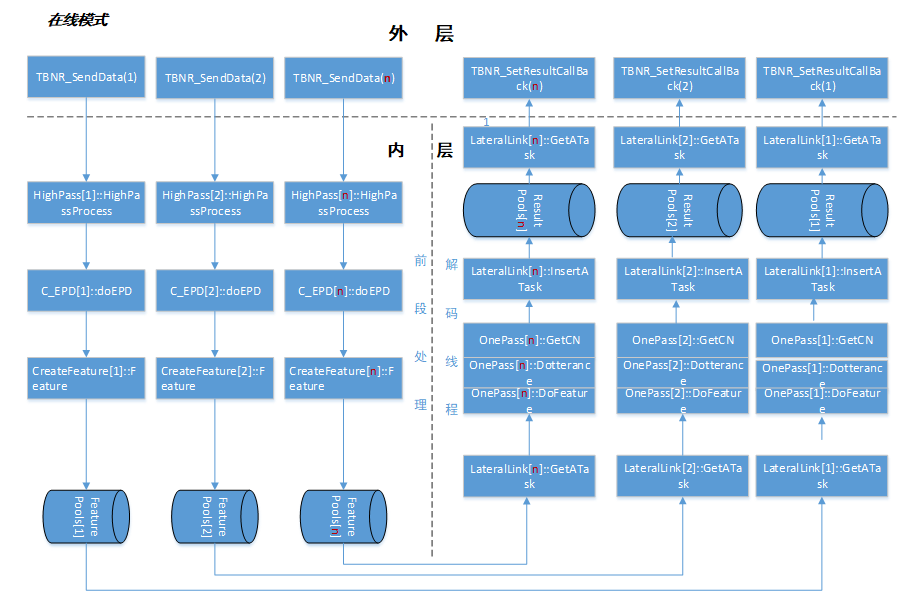

<center>图5.3.1 在线模式数据处理函数调用流程

如图5.3.1所示，外层通过TBNR\_SendData()接口函数完成送入语音任务，内层对进来的语音任务依次进行高通滤波，EPD端点检测，特征提取，然后将提取的特征压入各自对应任务池中，解码线程依次从任务池中依次获取特征任务，完成解码并将解码后的结果各自的结果池中，并通过结果回调返回结果。

**说明1**：外层的会话数和内层的解码线程数是相等，并且会话ID(SessionID)与解码ID(DecodeID)是一一对应的，也就是说外层的会话与内层的解码进行了绑定。

**说明2**：在EPD端点检测时，检测到起点时，将起点之后的每一小包任务(1024个采样点)送入特征提取模块进行特征提取，将提取的特征压入与之会话ID对应的任务池中等待解码；当解码器解码到尾点包时，获取解码结果。也就说在线识别环境是在检测到起点之后开始进行解码。

### 在线识别引擎**数据结构**设计

#### 概述

##### 简介

“好记性不如烂笔头”，反映出人们对记录的重视程度。从传统的纸文化进步到计算机时代，除了手写识别，当信息量更大的时候，人们会选择音频和视频。虽然人们不用担心存储容量不够用，但是今后如何有效的利用这些多媒体的记录，成为一个突出问题。

很多人为此倾向花高价邀请速录员。一来需要成本，二来在专业领域，培训和保密又成为新的问题。现在，用户有了新的选择-声学所识别引擎。该识别引擎不仅能保存语音，还能把语音转化成文字与之对应保存下来。有了它，今后无论何时用户想要调出所需的记录，只要通过查找相应文字并简单点击，相关的语音片断就找到了。同时，本引擎还提供了直接识别以往录音的功能，把以前宝贵的资料统统转化成文本，给用户的媒体档案库将来查询时提供最大便利。

中科院声学所连续语音识别引擎，针对连续音频流（即来自说话人直接录入的语音，或者广播电台、电视台或其他领域的音频信号）进行识别，将音频信息自动转化成文字。覆盖汉语中绝大多数词语，适用于说普通话的任何人群。输出的结果都是汉字，兼容数字。

在输入的声音中，检测出可靠的语音，排除噪声音乐等，实时送入语音识别解码器进行识别。识别引擎把音视频中提取出的语音分成 25 毫秒一帧，提取有用特征，然后识别出一些类似拼音的结果（声学模型），再根据汉语字词句之间的搭配概率（语言模型），综合考虑。当然，考虑的越多（beam路径越大），识别准确率相对提高，同时消耗的时间就增长了；所以我们有优化策略，及时排除不可能的结果，避免系统过慢。用户可以通过调节这些参数来平衡识别质量和速度，以满足实际的需要。

最后返回的识别结果，软件以汉语中基本词语为单位给出了包含对应时间点的词序列。

需要说明的是，对识别正确率以及识别速度来说，输入语音（普通话）的质量（录音过程）是很重要的。录音时应尽可能的排除噪声和音乐、增大语音，识别效果就会好得多，因此建议用户在录音的时候选用质量较好的麦克风。

另外，系统在检测是否有语音信号时可能会带来一定的时间滞后，用户在实时录入时在每句话结束后，需要略有停顿，这样可以提高系统语音检测的速度和精度。语音检测的越好。识别引擎的识别效果也就越好。

##### 读者对象

本文档是对识别引擎的内部代码流程和相关技术点的整体说明，因此读者最好满足如下几点条件后再读此文档：

  - 有一定的C和C++语言基础

  - 了解语音识别过程和原理

  - 了解声学所识别引擎实现原理

##### 术语定义

  - TBNR，Thinkit-Broadcast-News-Recongnize：中科信利识别引擎

  - CN，Confuse-Network：混淆网络

  - VAD，Speech Activity Detection：语音活动检测

  - WFST, Weighted Finite-State Transducer：加权有限状态转录即

  - ITN,Inverse –Text-Normalization：逆文本标准化

#### 数据结构设计

声学所识别引擎主要数据结构设计如下：

##### 语音数据信息结构体

###### 语音数据格式

```c++
enum SPEECHTYPE

{
TSR_ALAW_PCM = 0, //alaw
TSR_ULAW_PCM = 1,//ulaw
TSR_LINEAR_PCM = 2,//linear pcm
TSR_ADPCM = 3,//AD pcm
TSR_RAW_16 = 4 | TSR_LINEAR_PCM, //8k\_16bit\_pcm
TSR_16K_16 = 8 | TSR_RAW_16, //16k\_16bit\_pcm
TSR_MFCC = 16, //MFCC feature
TSR_MFCCPLP = 17,//以下数据为预留格式
TSR_RASTAPLP = 18,
TSR_WITHEAD = 19,
TSR_MFCC_FE = 8 | TSR_MFCC,
TSR_MFCCPLP_FE = 8 | TSR_MFCCPLP,
TSR_RASTAPLP_FE = 8 | TSR_RASTAPLP,
TSR_WITHEAD_FE = 8 | TSR_WITHEAD,
TSR_SILENCE = 32,
TSR_LOST = 33,
};
```


##### 识别结果输出数据结构

###### 分段任务/结果信息数据结构

```c++
struct Task

{
void *newSet; //作为任务时表示特征数据，作为结果时表示识别结果WordResult
void *latSet; //作为任务时表示二次判决开启情况下该分段是否为有效特征数据
int frameNum; //作为任务时表示特征数据大小
long long sessionId; //表示该任务/结果对应的会话ID
unsigned long saveFileIdx; //表示该任务/结果对应的分段ID
unsigned long dataTimestamp; //表示该任务/结果对应的分段的起始位置
long decoderId; //作为任务时表示该任务在该段的位置，作为结果时表示对应的解码ID
unsigned long dataTimestampEnd; //表示该任务/结果对应的分段的结束位置
SOUND\_TYPE soundType;// 作为结果时该结果在分段中的位置
};

enum SOUND\_TYPE
{
MALE=0, //男，在结果中表示该将结果为分段中间识别结果
FEMALE, //女，在结果中表示该将结果为分段最终识别结果
MUSIC, //音乐
NOISE, //噪声
UNK,
};
```


###### 识别结果信息数据结构

**识别结果数据结构**

```c++
struct WordResult

{
int candNum;//该词可选个数+1，至少为1不固定，首个为最终结果1-best，通常为第一选
ACand *cands;//识别结果结构体
WordResult *next;

WordResult()

{
candNum = 0;
cands = 0;
next = 0;
}
};
```

**候选识别结果数据结构**

```c++
struct ACand

{
char *text; //候选文本结果
float score; //候选得分，0.00~100.00，candNum个
float startTime; //开始时刻，单位为秒s
float endTime; //结束时刻，单位为秒s
ACand *next; //到下一个的指针
#ifdef ENHANCED\_RESULT
char * phone; //候选分词形式结果
char * segTime; //候选分词时间结果
char * confidence; //候选结果得分
#endif

ACand ()

{
text = 0;
next = 0;
score = startTime = endTime = 0;
phone = 0;
segTime = 0;
confidence = 0;
};
};
```


##### 识别引擎状态数据结构

**引擎事件信息，即时反馈引擎状态**

```c++
enum TBNR\_EVENT

{
TBNR_EVENT_START_COMPLETE = 0, // 启动识别完成
TBNR_EVENT_STOP_COMPLETE, // 停止识别完成
TBNR_EVENT_RECOGNITION_COMPLETE, // 识别完成
TBNR_EVENT_RECOGNITION_DOING, // 识别中
TBNR_EVENT_RECOGNITION_IDLE, // 空闲
TBNR_EVENT_RECOGNITION_ERROR, // 异常
};
```


##### 识别热词功能数据结果

**指定输入热词的发音方式**

```c++
typedef enum HOTWORD\_PRON\_MODE

{
AUTO_GEN_PRON_MODE = 0, //自动获取热词发音
USER_GEN_PRON_MODE//用户自定义热词发音
}HOTWORD_PRON_MODE;

//热词信息

typedef struct HOTWORD

{
char szHotWordChinese[256]; //热词
char szHotWordPinyin[256]; //热词发音，自动获取发音时该字段可以为空
int pronmode; //热词发音方式
float threshold; //热词权重，权重越大用容易识别出热词

#ifdef __cplusplus

HOTWORD()

{
pronmode = AUTO_GEN_PRON_MODE;
szHotWordChinese[0]='\0';
szHotWordPinyin[0]='\0';
threshold=0.0;
}
#endif
}HotWord;
```


### 在线识别引擎**开发测试**

#### 概述

##### 简介

“好记性不如烂笔头”，反映出人们对记录的重视程度。从传统的纸文化进步到计算机时代，除了手写识别，当信息量更大的时候，人们会选择音频和视频。虽然人们不用担心存储容量不够用，但是今后如何有效的利用这些多媒体的记录，成为一个突出问题。

很多人为此倾向花高价邀请速录员。一来需要成本，二来在专业领域，培训和保密又成为新的问题。现在，用户有了新的选择-声学所识别引擎。该识别引擎不仅能保存语音，还能把语音转化成文字与之对应保存下来。有了它，今后无论何时用户想要调出所需的记录，只要通过查找相应文字并简单点击，相关的语音片断就找到了。同时，本引擎还提供了直接识别以往录音的功能，把以前宝贵的资料统统转化成文本，给用户的媒体档案库将来查询时提供最大便利。

中科院声学所中科信利连续语音识别引擎，针对连续音频流（即来自说话人直接录入的语音，或者广播电台、电视台或其他领域的音频信号）进行识别，将音频信息自动转化成文字。覆盖汉语中绝大多数词语，适用于说普通话的任何人群。输出的结果都是汉字，兼容数字。

在输入的声音中，检测出可靠的语音，排除噪声音乐等，实时送入语音识别解码器进行识别。识别引擎把音视频中提取出的语音分成 25 毫秒一帧，提取有用特征，然后识别出一些类似拼音的结果（声学模型），再根据汉语字词句之间的搭配概率（语言模型），综合考虑。当然，考虑的越多（beam路径越大），识别准确率相对提高，同时消耗的时间就增长了；所以我们有优化策略，及时排除不可能的结果，避免系统过慢。用户可以通过调节这些参数来平衡识别质量和速度，以满足实际的需要。

最后返回的识别结果，软件以汉语中基本词语为单位给出了包含对应时间点的词序列。

需要说明的是，对识别正确率以及识别速度来说，输入语音（普通话）的质量（录音过程）是很重要的。录音时应尽可能的排除噪声和音乐、增大语音，识别效果就会好得多，因此建议用户在录音的时候选用质量较好的麦克风。

另外，系统在检测是否有语音信号时可能会带来一定的时间滞后，用户在实时录入时在每句话结束后，需要略有停顿，这样可以提高系统语音检测的速度和精度。语音检测的越好。识别引擎的识别效果也就越好。

##### 读者对象

本文档是对识别引擎的内部代码流程和相关技术点的整体说明，因此读者最好满足如下几点条件后再读此文档：

  - 有一定的C和C++语言基础

  - 了解语音识别过程和原理

  - 了解声学所识别引擎实现原理

##### 术语定义

- TBNR，Thinkit-Broadcast-News-Recongnize：中科信利识别引擎
- CN，Confuse-Network：混淆网络
- VAD，Speech Activity Detection：语音活动检测
- WFST, Weighted Finite-State Transducer：加权有限状态转录即
- ITN,Inverse –Text-Normalization：逆文本标准化

#### 测试工程

##### 测试工程

测试工程组要完成对识别引擎接口的集成，实现识别引擎对录音的转写功能。提供给用户对如何集成识别引擎，引擎具体工作流程和测试一个参考实例。测试工程参考提供的ASROnlineTestEnv/Example

###### 测试工程目录结构说明

参考提供测试环境：在线语音识别引擎-测试用例/TBNR\_API\_TBNRTestDemo测试工程用例。

TBNR\_API\_TBNRTestDemo目录结构说明

```shell
-API_Include # 识别引擎头文件目录
--TBNR_API.h # 识别引擎头文件
-API_Lib # 识别引擎库目录
--libTBNR_API.so # 识别引擎库
-API_Tools # 测试用例工程所需功能函数目录
-KWSAPI_LIBLINUX # 识别引擎linux环境下依赖库文件目录
-TBNR_TKW_Test_demo # 识别引擎测试用例源文件目录
--TBNR_Test_Stream
---TBNR_Test_Stream.cpp # 识别引擎测试用例源文件
---TBNR_Test_Stream.makefile # 识别引擎测试工程的makefile文件
---buildTest.sh # 识别引擎测试工程的编译脚本
```


###### 测试工程编译说明

参考提供测试环境:在线语音识别引擎-测试用例/TBNR\_API\_TBNRTestDemo测试工程用例。

进入TBNR\_API\_TBNRTestDemo/TBNR\_Test\_demo/TBNR\_Test\_Stream 目录，执行buildTest.sh 编译脚本得到测试用例可执行文件TBNR\_Test\_Stream

#### 测试环境

##### 测试工程

测试环境为识别引擎完成转写等功能所依赖的运行环境。识别引擎测试环境参考提供的ASROnlineTestEnv/Env

###### 测试环境目录结构说明

```shell
-bin # 引擎的工作目录
--lib # 识别关键词引擎库和引擎测试程序可执行文件目录
---libTBNR_API.so # 识别引擎库文件
---TBNR_Test_Stream # 识别引擎测试程序可执行文件
---buildKWFST # 建立热词模型的可执行文件(不需热词功能时不必关心该文件,引擎默认不做热词功能)
--log # 识别关键词引擎日志文件目录
---DictationLog.txt # 识别引擎日志文件
--run.bat # 识别关键词引擎的启动脚本
--hotwords.txt # 样例热词列表文件(不需热词功能时不必关心该文件,引擎默认不做热词功能,为GBK格式且为unix格式)
--tbnr_Result.txt # 识别结果文件
--exapmle.far # ITN(中文数字转阿拉伯)模型
--wavlist.txt # 语音任务列表
-KWSAPI_ENV # 识别引擎依赖库目录
--KWSAPI_LINUX # 识别引擎依赖库所在目录
-model # 识别引擎模型字典配置文件目录
--cts_src # 识别模型存放目录
--model.eteh.dim320_96_64_32_alimid.ep25_29.bin # 识别模型
--TLG.new.bin # TLG模型
--vocab.kefu_cts.txt # 识别字典
--scripts # 识别引擎配置文件目录
---WFST_onlyRec.cfg # 识别模式下的识别引擎配置文件
--ElvaData # 送入引擎中语音和提取特征保存目录
--hotword # 热词模型生成，热词配置文件，热词依赖文件存放目录(不需热词功能时不必关心该文件,引擎默认不做热词功能)
---ConfusionMatrix.word # 前端热词音素混淆文件
---hotword.cfg # 前端热词配置文件
---mono.list # 前端热词音素集
---syllable.word.179phones # 前端热词发音文件
--punctuation # 为标点模型及其配置文件
---config.cfg # 标点配置文件
---model  # 标点模型文件
--word2phone # 词转发音目录
---word2phoneme_ctstykf_english.txt # 词转发音的文件
-wav # 用例语音目录
--8K_16BIT_PCM # 8k16bitpcm格式语音目录
--8K_8BIT_ALAW # 8k8bitalaw格式语音目录
```


###### 测试环境使用说明

打开引擎脚本run.sh修改相应参数：

>   - 修改语音任务路径参数DataDir,
>
>   - 修改引擎启动并发线程数参数linenum,
>
>   - 修改语音格式参数wavformat,改参数需要与出来的语音任务格式一致,否者识别错误;
>
>   - 可选(前端热词功能)：./lib/buildKWFST -inbfsm ../model/cts\_src/TLG.bin –key hotwords.txt --outbfsm ../model/hotword/TLG.rescore.bin
>
>   - 指定热词文件hotwords.txt，生成前端热词模型../model/hotword/TLG.rescore.bin，修改前端热词参数，则前端热词功能开启；
>
>   - 启动引擎启动脚本run.sh;

###### 测试环境结果查看

识别引擎的输出结果有两种格式：文本格式和分词格式,两种格式的结果内容是一样的,只是格式上的区别,文本格式结果保存引擎的工作目录下的tbnr\_Result.txt中，分词格式保存在任务语音目录下一个语音文件对应一个分词结果文件。

别引擎文本结果tbnr\_Result.txt文件格式说明:

所有任务语音的转写结果都在该文件内且一个任务语音转写结果占据一行,输出结果默认是GBK编码格式，如下所示：

```
你好很高心为你服务 有什么需要帮助的 (../wav/1.wav)
今天天气很好 我们打算去哪玩 (../wav/2.wav)
…
```

识别引擎分词结果文件格式说明:

一条语音文件对应着一个分词结果文件,如下所示：

> 第一行是该段语音在整通语音中的起始时间和结束时间
>
> 第二行是该段语音的转写结果,分词之间用空格隔开
>
> 第三行是转写结果中各个分词的起始时间和结束时间
>
> 第四行是该段语音转写的置信度

1. wav对应的分词结果文件为1\_sent.txt其内容：

```
0.1 0.7

你 好 很 高 兴 你 服 务

0.15 0.25 0.25 0.35 0.35 0.40 0.40 0.50 0.50 0.60 0.60 0.70

100.00

0.8 1.2

有 什么 需要 帮助的

0.9 1.0 1.0 1.1 1.1 1.2 1.2 1.3

100.00

…
```


###### 测试环境配置文件

引擎开放了大量内部参数，保证了引擎的可配性和可维护性。常见参数如下：

|            参数名            |          取值          | 说明                                                         |
| :--------------------------: | :--------------------: | ------------------------------------------------------------ |
|         LogFileName          | ./log/DictationLog.txt | 引擎日志文件                                                 |
|           LogLevel           |           0            | log级别值越大输出越详细[0-3]                                 |
|          SampleRate          |      8000或16000       | 声学模型训练语音的采样率。目前仅广电模型SampleRate=16000，其余模型下均为8000。 |
|         isOnlineMode         |      true或fasle       | 是否走在线语音流处理流程。true:在线；false:离线系统。        |
|       NumberOfSession        |       >=1的整数        | 开启会话数。实际可通过TBNR_Init()传参设定开启会话数，仅当参数<=0时, NumberOfSession才起作用。实际会话个数最多不能超过授权线数。 |
|       NumberOfDecoder        |       >=1的整数        | 解码器个数。在线模式下，实际解码器个数=实际会话个数；离线模式下，decoderNumPerSession>0时，实际解码器个数= int (0.5 + decoderNumPerSession * sessionNum)。实际TBNR解码器个数最大不能超过授权文件授权线数。 |
|  NumberOfDecoderPerSession   |       >=1的整数        | 每个会话开启的解码器个数。仅对离线模式适用。                 |
|           CNFormat           |      DaLian或KWS       | 引擎模式。仅做纯识别还是要做关键词检索。                     |
|         IndexWithRec         |      true或FALSE       | 是否建索引。 CNFormat与IndexWithRec一般如下搭配使用： CNFormat=DaLian,IndexWithRec=false:纯识别模式 CNFormat=KWS, IndexWithRec=false:纯关键词检索模式 CNFormat=KWS, IndexWithRec=true:识别+检索模式 |
|          isSaveData          |      true或FALSE       | 是否保存分段语音。isSaveData=true,保存分段语音到参数“FeatureRootDir”所指目录下（一般位于model/ElvaData/目录下）。 |
|        isSaveFeature         |      true或FALSE       | 是否保存分段特征。isSaveData=true,保存分段特征到参数，“FeatureRootDir”所指目录下（一般位于model/ElvaData/目录下）。 |
|        KeepAllSpeech         |      true或FALSE       | 是否保留无效语音(如，静音等)。 KeepAllSpeech=false,无效语音不送解码。 KeepAllSpeech=true,无效语音送解码。 |
|           isDoEPD            |      true或FALSE       | 是否做分段（端点检测）。                                     |
|          VadFormat           |       oldEPD或BC       | 端点检测算法。BC:广电引擎端点检测；oldEPD:EPD端点检测。      |
|          isHighPass          |         true或         | 是否做高通滤波                                               |
|            FALSE             |                        |                                                              |
|        DetectRingNum         |       >=0的整数        | 彩铃检测开关。DetectRingNum=0时，不做彩铃检测。DetectRingNum>0时，做彩铃检测。 |
|      PrintSegTimeOFWord      |      true或FALSE       | PrintSegTimeOFWord =true: 转写候选结果中词的时间是相对于整条语音的绝对时间； PrintSegTimeOFWord =false：词的时间是相对于句的时间。 |
|       PrintPunctuation       |      true或false       | 是否输出标点。如果PrintPunctuation=true，则必须设置PrintSegTimeOFWord=true。 |
|         PrintPinyin          |      true或false       | 识别结果带拼音输出。如果PrintPinyin=true，必须设置字典WordPhonemePinyinDict。且只有当解码器版本支持拼音输出时，最终才能够输出拼音。 |
|    isGBKRecResConverUTF8     |      true或false       | 识别结果进行GBK转U8                                          |
|     isHoldWavDataOnline      |      true或false       | 在线hold数据延缓解码                                         |
| HoldWavDataBySampleNumOnline |                        | Hold数据大小（采样数）                                       |
|         DictFileName         |                        | 识别用字典，含词语及其对应音素发言。该字典跟模型一一对应，更换模型时，注意更换相应字典。 |
|     isAddPhonemeEnd2End      |       true/false       | 是否输出拼音                                                 |
|    WordPhonemePinyinDict     |                        | 识别结果输出拼音时所用字典，含词语、对应音素及拼音。         |
|          HotWordOn           |       true/false       | 后端热词开关                                                 |
|      HotWordConfigFile       |                        | 后端热词配置文件。                                           |
|      isReturnMidRecRes       |       true/false       | 是否实时返回识别结果                                         |
|          isTestEPD           |       true/false       | 仅仅测试vad                                                  |
|          ModelFile           |                        | 端到端模型文件                                               |
|        VocabularyFile        |      ../ElvaData       | 字典文件。                                                   |
|             wfst             |                        | TLG模型文件                                                  |
|           key_wfst           |                        | 前端热词模型文件                                             |
|            keywt             |       0.00~5.00        | 前端热词权重                                                 |
|    harmonicMinNumber_EPD     |                        | 最小谐波大小(帧)                                             |
|       MAX_SILENCE_EPD=       |           20           | 最大静音长度(帧)                                             |
|     ENERGY_DECREASE_END      |                        | 最小谐波长度(帧)                                             |
|    ENERGY_DECREASE_START     |           1            | 检测起点能量                                                 |
|     ENERGY_DECREASE_END      |           1            | 检测尾点能量                                                 |

## 在线语音识别引擎**子模块-ITN**

### ITN引擎源**代码清单**

ITN引擎源代码清单如下：

```shell
ITN_nanwang/
├── compile # 编译环境目录
│ ├── compileApi
│ │ ├── Makefile
│ │ └── translate # 主要源代码实现
│ │ ├── merge-rewrite-time.cc # 合并时间点代码
│ │ ├── merge-rewrite-time.h
│ │ ├── rewrite.cc # 重写模块
│ │ ├── rewrite.h
│ │ ├── rewrite-tester-utils.cc # 底层重写函数
│ │ ├── rewrite-tester-utils.h
│ │ ├── translate-api.cc # 接口函数实现
│ │ └── translate-api.h
│ ├── compileExe # 测试环境源代码
│ │ ├── Makefile
│ │ └── testsrc_rec
│ │ ├── more_thread.cc # 多线程实现函数
│ │ ├── more_thread.h
│ │ ├── rewrite-tester.cc # 测试源代码
│ │ ├── translate-api.h
│ │ ├── usage.cc
│ │ └── usage.h
│ ├── compileFar_nanwangPOC # 文法规则文件目录
│ │ ├── addword.grm
│ │ ├── byte.grm
│ │ ├── currency.grm
│ │ ├── data_flow.grm
│ │ ├── dict.grm
│ │ ├── dict.list
│ │ ├── example.grm
│ │ ├── Makefile
│ │ ├── measure.grm
│ │ ├── numbers.grm
│ │ ├── number_symbol.grm
│ │ ├── specialLex.list
│ │ ├── task.list
│ │ └── time.grm
├── lib # 编译生成目录
│ ├── example.far
│ ├── libthraxrewrite.so # 生成的ITN接口库
│ ├── openfst-1.4.3_g++4.2 # openfst开源库
│ ├── thrax-1.0.2_g++4.2 # thrax开源库
│ └── thraxrewrite-tester-rec # 测试程序
└── testEnv-rec # 测试环境
├── all_number3.txt # 测试文本
├── all_number3.txt.itn
├── example.far # 文法文件
├── lib # 依赖的库和测试程序
└── run.sh # 测试脚本
```


### ITN引擎源代码**概要设计**说明

#### 概述

##### 简介

**引擎功能介绍**

> ITN引擎可以实现字符串之间的转译，如数字转阿拉伯数字等。
>
> 适用场景及性能：语音识别结果后处理，将数字转换为阿拉伯数字，具体可以根据需求进行定制开发。

**引擎输入介绍**

> （1）资源文件，包括：**语法规则文件**：example.far
>
> （2）识别结果：语音识别的转写结果作为输入

**引擎输出介绍**

> ITN引擎会对识别结果进行处理，按照语法规则文件对识别结果进行重写。

##### 读者对象

本文档对ITN引擎进行总体设计，包括使用的算法和主要实现代码，主要面向引擎开发和维护人员。

1. 有一定的C和C++语言基础；

2. 了解相关算法。

##### 术语定义

ITN(Inverse Text Normalization)：逆文本正则化，将汉字的数字转写为阿拉伯数字。

##### 参考资料

> Paper：
>
> A Mostly Data-driven Approach to Inverse Text Normalization
>
> The OpenGram Open-source finite-state grammar.pdf
>
> http://www.openfst.org/twiki/bin/view/GRM/Thrax

#### 总体设计

ITN处理流程如下：

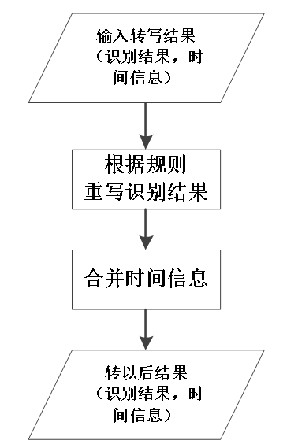

<center>图2.1 ITN处理流程图

ITN引擎主要实现识别结果后处理，包括语法文件的构建和程序设计模块。

##### 语法文件的构建

首先我们人为构建需要的语法文件，将语法文件通过thrax和WFST进行编译，构建语法文件的网络空间，实现识别结果后处理；

##### 程序设计

1. 对识别结果进行处理，去空格。
2. 识别结果后处理，对数字进行处理，输出处理后的结果。
3. 对输出结果进行处理，还原输入的分词形式，以及时间点的合并标点引擎主要利用条件随机场算法，并对引擎接口进行设计实现，下面进行简要介绍。

#### 可靠性设计

1. 函数返回值规范，对应程序里的异常（如：文件打开失败、内存分配、释放异常等），通过函数返回值的形式逐层向上反馈，避免直接退出引擎；
2. 支持多线程异步调用，加快处理速度。

#### 扩展性设计

 **支持跨平台**

> 目前引擎支持intel、ARM平台上的编译运行。

**安全性设计**

> 引擎对各类异常进行判断，有一定的容错机制。

**易用性设计**

> 引擎接口设计简洁，方便开发者快速熟悉引擎接口调用流程，快速完成接口集成；
>
> 引擎同时提供了接口测试程序，可供开发者参考。

### ITN引擎模块**接口设计**说明

本文档主要对ITN引擎接口进行详细说明。

接口头文件：translate-api.h

动态库文件：libthraxrewrite.so

#### 结构体说明

结构体变量，存储每行sent的分词结果及相应的分词时间段，送去做转写；

```c++
typedef struct TitText{
std::string text;
std::string time;

};
```

变量说明：

- std::string text; //sent分词结果

- std::string time; //sent分词时间点

#### 接口类


```c++
class TitTranslate{

public:

//init

bool Init(const int nThread, const char *grammarfile, const bool bMergeTime);

bool DoTranslate(const TitText *input, TitText **output, const int sessionId);

bool Exit();

TitTranslate() {};

private:

void **rewrite;

void **mergetime;

bool bmergetime;

TitText **resultText;

int threadNum;

void FreeText(TitText *text);

};
```

**成员函数说明：**


`初始化`

```c++
bool Init(const int nThread, const char *grammarfile, const bool bMergeTime);
```

> **方法名称**：Init
>
> **返回值**：bool
>
> **参数**：
>
> - nThread：线程数
>
> - grammarfile：文法文件，即example.fst
>
> - bMergeTime：是否合并时间点，1合并，0不合并


`退出`

```c++
bool Exit ();
```

> **方法名称**：Exit ()
>
> **返回值**：bool


`开始处理`

```c++
bool DoTranslate(const TitText *input, TitText **output, const int sessionId);
```

> **方法名称**：DoTranslate
>
> **返回值**：bool
>
> **参数**：
>
> - input：TitText结构体类型指针，转写前
>
> - output：TitText结构体类型指针，转写后
>
> - sessionId：线程id

### ITN引擎**数据结构**设计

ITN主要对文本进行处理，将汉字形式的数字转写为阿拉伯，主要利用文法规则加权有限状态机实现。

#### 语法文件的构建

##### 编写.grm文件

Thrax处理的文法文件.far是由.grm文件编译而成，接下来将举例介绍编写.grm文件步骤方法。

###### 变量定义---“Optimize”

如下定义一个阿拉伯数字变量：

```c++
hanziDigit = Optimize["零"|"一"|"幺"|"二"|"两"|"三"|"四"|"五"|"六"|"七"|"八"|"九"];
```


###### 变量叠加---“|”

如下实现两个变量叠加

```c++
measureUnit = Optimize["米" | "克" | "平" |"立"|"升"];

percentUnit = Optimize["之"];

kDictRemoveWithoutNumber = Optimize[percentUnit |measureUnit ];
```

那么kDictRemoveWithoutNumber = Optimize\["米" | "克" | "平" |"立"|"升" |"之"\];

###### 变量剔除---“-”

```c++
Tmp = Optimize[kDictRemoveWithoutNumber – measureUnit]
```

那么 Tmp = Optimize\["之"\];

###### 变量导出---export

```c++
export kDictRemoveWithoutNumber = Optimize["米" | "克" | "平" |"立"|"升" |"之"];
```

那么变量kDictRemoveWithoutNumber就可以在其它文件中使用；未加“export”则只能在本文件使用。

###### 文件加载---stringFile

如果某个变量的内容非常多（如字典），可以通过该字符进行加载，如下：

```c++
dict = StringFile['dict.list','byte'];
```

那么就而已将文件dict.list的内容以“byte”格式加载赋给变量dict。这里需要说明的是thrax通常支持两种格式“utf8”和“byte”。

###### 包含多次---“+”

```c++
Withoutnumber = Optimize[“ab”]

Tmp = Optimize[withoutnumber+];
```

表示Tmp可以匹配“ab”,“abab”,“ababab”等等。

###### 可有可无---“\*”

匹配234556、234这种电话号码、身份证号等。

```c++
read_digit_by_digit = (units | zero) (units | zero) (units | zero) ((units | zero))*;
```


###### 汉字替换阿拉伯---“：”

把零替换成0

```c++
delzero = "零" : "0";
```


##### .grm文件规则详解

本节对文法规则原理进行详细说明，主要实现变量组合，对涉及到的规则进行介绍；没有export的，但是比较复杂不易理解的变量也会进行说明，其他比较简单的变量这里不做赘述。

###### numbers.grm

该文件主要实现对数字的处理，只举部分进行说明。

定义变量numbers\_to\_9999，数字范围为0-9999

```c++
export numbers_to_9999 = Optimize[numbers_to_99 | numbers_100_to_999 | numbers_1000_to_9999];
```

其中：

```shell
numbers_to_99：0-99

numbers_to_99 = Optimize\[

(units|zero) | # 匹配0-9

teens | # 匹配10-19

decades | # 匹配20、30、…、90

units ("十" : "") units ] # 匹配22、35、99等这些数字

;
```


###### number\_symbol.grm

该文件主要处理百分之、千分之问题，替换成%和‰，以及小数问题，替换成几点几。

```c++
import 'numbers.grm' as numberslib; #使用上面已经定义好的文法，import进来；
```

例如，

1. 匹配小数

匹配小数，并导出到变量kDecimal

```c++
export kDecimal = Optimize[

numbers decimal (Digit)+| #匹配九十九点二五->99.25

(Digit)+ decimal (Digit)+ #匹配三四点六六六->34.666

];
```

其中，numbers为0-9999

```c++
numbers = numberslib.numbers_to_9999;
```

**小数点**

```c++
decimal = ("点" : ".");
```

**Digit，小数点末尾数字**

```c++
Digit =("零" : "0") | ("一" : "1") | ("幺" : "1") | ("二" : "2") | ("三" : "3") | ("四" : "4") | ("五" : "5") | ("六" : "6") | ("七" : "7") | ("八" : "8") | ("九" : "9");
```

2. 匹配小数、百分之、千分之

该变量涵盖了上面的kDecimal，同时包含百分之、千分之转为%，‰

```c++
export kNumberSymbol = Optimize[
percent (numbers|kDecimal) ("":"%") |
permill (numbers|kDecimal) ("":"‰") |
kDecimal
] ;
```

其中，百分之、千分之定义如下：

```c++
percent = ("百分之" : "");
permill = ("千分之" : "");
```


###### time.grm

该文件主要匹配时间信息，包括年月日、时分秒。

同样引用numbers.grm文法，里面变量units、teens、teens\_withoutten、decades的定义同numbers.grm文件里的变量定义，同时定义了months、dates、hours\_safe、hours\_unsafe、minutes、seconds等变量。

```c++
export kTIMES = Optimize[
date_digit (time_digit | "") |
date_digit (hours_safe | hours_unsafe) ("点"|"时") |
(date\_digit | "") time_digit
] ;
```

其中，date\_digit和time\_digit需要重点说明；

```c++
date_digit = Optimize[
months "月" dates ("日" |"号")| #五月二十四号/日->5月24日
];

time_digit = Optimize[
hours_safe ("点"|"时") ((minutes "分") | "") ((seconds "秒") | "") | #三点、三点十分、三点十分二十五秒 等都可以匹配
hours_unsafe ("点"|"时") (minutes "分") ((seconds "秒") | "") | #三点十分、三点十分三十秒
(hours_safe | hours_unsafe) "点" number_up_ten | #三点二十
];
```


###### measure.grm

匹配计量单位，引入numbers.grm和number\_symbol.grm文法

```c++
export kMEASURES = Optimize[

(numbers | decimal | special_unit) measures

] ;
```

其中：计量单位包括以下几种

```c++
measures =

("克" : "g")
| ("千克" : "kg")
| ("平方米" : "m^2")
| ("平米" : "m^2")
| ("立方米" : "m^3")
| ("平" : "平")
| ("厘米" : "cm")
| ("毫米" : "mm")
| ("米" : "m")
| ("升" : "L")
| ("千米" : "km")
| ("千米每小时" : "km/h")
;
```

currency.grm

匹配金钱相关，引入numbers.grm和number\_symbol.grm文法

首先定义金钱相关的单位：

```c++
MoneyUnitL1 = Optimize["块" | "元"];
MoneyUnitL2 = Optimize["毛" | "角"];
MoneyUnitL3 = Optimize["分"];

export kMoney = Optimize[
numbers MoneyUnitL1 Digit MoneyUnitL2 ((Digit (MoneyUnitL3|""))|"") | #0-99999999元1-9毛、0-9999元1-9毛1-9分
(numbers | Digit) MoneyUnitL1 Digit (MoneyUnitL3|"") | #0-99999999块1-9（分）Digit MoneyUnitL2 Digit (MoneyUnitL3|"") | #1-9毛1-9（分）
(numbers | Digit) MoneyUnitL1 Digit | #1-9块1-9
(numbers | Digit) MoneyUnitL1 zero Digit (MoneyUnitL2 | MoneyUnitL3) | #0-99999999元零1-9分/角
Digit MoneyUnitL2 | #1-9角
(numbers | Digit) MoneyUnitL1 | #0-99999999元
Digit MoneyUnitL3 #1-9分
];
```


###### addword.grm

该文件主要存放不想转的文本

```c++
export kAddWords = Optimize[

"一五一十" |
"十一国庆" |
"一年" |
"九牛一毛" |
"冰山一角" |
"点钟" |
"第一点"
];
```


###### dict.grm

dict.list存放所有的汉字及字符，单字，通过以下方法加载；

```c++
dict = StringFile['dict.list','byte'];
export kDict = Optimize[ dict ];

# 0-9
export kDictNumber = Optimize[hanziDigit];

# 除了数字之外的所有特殊的字符
export kDictRemoveWithoutNumber = Optimize[kDictSpace | kCalUnit | timeUnit | measureUnit | money | percentUnit | dataflow];

# 从识别结果中挖去所有需要特殊处理的字符
export kDictNotSpace = Optimize[kDict - kDictSpace - kCalUnit - hanziDigit - timeUnit- measureUnit - money - percentUnit - dataflow];
```

以上export的全部用在exampl.grm中构建解码空间；

###### data\_flow.grm

电信数据中较容易涉及到兆，g等，所以增加该文法

```c++
data_flow =("兆" : "M")| ("g" : "G");

export kDATAFLOW = Optimize[(numbers | decimal | special_unit) data_flow] ;
```


###### exampl.grm

总的grm文件，对上面的文法进行组合，生成exampl.far文件，可供程序使用；

里面主要包含rules/rules\_safe/word1/word2变量，最后组成word变量，进行匹配；

rules/rules\_safe，把前面定义好的文法组合，赋值给该变量，该变量主要负责进行替换；

word1和word2，和rules进行组合，除rules之外为不替换的特殊字符

最后word对word1和word2进行组合，实现数字转阿拉伯；

```c++
word1=Optimize[
((removeword_number (removeword_number | ""))<1.7>) |
(((removeword_withoutnumber - "十")+)<1.2>) |
(((removeword_withoutnumber - "十" )+ removeword_number+)<1.5>) |
((("" | (removeword_withoutnumber - "百" - "十" - "万")+) rules)<1.0>) |
((("" | (removeword_withoutnumber - "十")+) rules_close)\<1.1>) |
rules_safe (removeword_number)+ |addwords |""];

word2=Optimize[rules |""];
word = Optimize [(word1 (anyword | "之"))+ word1 (anyword | "") |word1 |word2];
```

该文件为构建的解码空间，要保证你送进去转写的字符串在该空间中可以找到路径，其中道理也是根据出现问题进行规则修改总结出来的；

\<1.5\>此为权重，应该是值越小，越优先走该路径；

rule\_close是为了解决规则紧邻问题定义的特殊处理的方法；

#### 程序设计

##### TitTranslate

该类为接口类，该类实现对识别结果后处理，类定义存放于translate-api.h文件中。

```c++
class TitTranslate{

public:

//初始化：每个进程只需初始化一次
bool Init(const int nThread, const char *grammarfile, const bool bMergeTime);

//处理：每个线程调用一次
bool DoTranslate(const TitText *input, TitText **output, const int sessionId);

//退出引擎：每个进程进行一次
bool Exit();
TitTranslate() {};

private:

//该类实现重写
void **rewrite;

//该类实现时间合并，通过Init成员函数进行设置
void **mergetime;

//是否需要进行时间合并，如果仅仅想进行文本转译，置为false
bool bmergetime;

//每个线程结果
TitText **resultText;

//线程数，通过Init成员函数进行设置
int threadNum;

//简单的释放内存
void FreeText(TitText *text);
};
```


##### MergeRewriteTime

该类实现时间点合并，类定义存放于merge-rewrite-time.h文件中。

```c++
class MergeRewriteTime{

public:

//删除所有空格，更新至srcstr
void DeleteAllSpace(std::string &srcstr, std::vector<PointNode> &segNodeVec);

//将原字符串strA和转译后的字符串strB进行比较

// bBackTrace=true，进行路径回溯；bBackTrace=false，不进行路径回溯
int EditDistance(const std::string &strA, const std::string &strB, const bool bBackTrace);

//根据EditDistance的回溯路径及原分词时间（sentTime息（newTime）

//这里需要注意的是sentTime为原始时间，newTime为合并后的时间

bool MergeTime(const std::string &sentTime, const std::vector<PointNode> segNodeVec, std::string &newTime);

MergeRewriteTime();
~MergeRewriteTime();

private:

//normal: row-\>base; col-\>rewrite

int **operationPath; //保存路径
int **operationDistance; //保存距离
int operationRow; //原字符串长度
int operationCol; //转译之后字符串长度
std::string strRow; //原字符串
std::string strCol; //转译后字符串
std::vector<PointNode> rewritePosRow; //原字符串进行转译的位置
std::vector<PointNode> rewritePosCol; //转译后字符串发生转译的位置
}
```


##### TitRewrite

```c++
class TitRewrite{

public:

//初始化，加载文法文件
bool Init(const char *grammar);

//重写：根据grammar对input进行重写，保存至output
bool Rewrite(const std::string &input, std::string &output);

//退出
bool Exit();
private:
void *utils;
};
```


##### PointNode

用于记录位置信息，如发生转译的开始位置和结束位置

```c++
typedef struct PointNode{
int start;
int end;
};
```


### ITN引擎**开发测试环境**

#### 硬件要求

> Intel(R) Xeon(R) CPU，内存64G。

#### 软件要求

> 操作系统建议安装CentOS 7.x，gcc/g++ 4.8及以上。

#### 测试运行

编译和测试说明

1. 编译

进入到compile/compileApi文件夹下，执行如下命令：

```shell
make clean
make -f Makefile
```

生成的库文件放在lib/libthraxrewrite.so

进入到compile/compileExe文件夹下，执行如下命令：

```shell
make clean -f Makefile-rec
make -f Makefile-rec
```

生成的可执行文件放在lib/thraxrewrite-tester-rec

进入到compile/compileFar\_nanwangPOC文件夹下，执行如下命令：

```shell
make clean
make
```

生成的example.far文件即为文法文件

2. 测试运行

进入到testEnv-rec文件夹下,将上述生成的lib/libthraxrewrite.so、lib/thraxrewrite-tester-rec拷贝到lib目录下，将example.far文件拷贝到testEnv-rec目录下，执行如下命令：

```shell
./run.sh all_number3.txt
```

执行完成后会在当前目录下生成all\_number3.txt.itn，即为ITN之后的文件。

## 在线语音识别引擎**子模块-标点**

### 标点引擎源**代码清单**

标点引擎源代码清单如下：

```shell
Punc_nanwang/
├── crfpp_learn
├── LIB_LINUX
│ ├── libcrflearn.so # crf算法库
│ ├── libPunctuation.so # 标点引擎接口库
│ └── PunctuationTest # 标点引擎测试程序
├── PunctuationTest # 测试程序源码目录
│ ├── Makefile
│ ├── more_thread.cpp # 多线程函数
│ ├── more_thread.h
│ ├── Punctuation.h # 标点接口
│ ├── PunctuationTest.cpp # 测试程序源码
│ ├── segWords.cpp # 分词模块
│ ├── segWords.h
│ ├── usage.cpp # 工具类函数
│ ├── usage.h
│ └── word.list # 分词字典
├── Punctuation_to_tbnr # 接口函数目录
│ ├── crfpp.h # crf接口
│ ├── Makefile
│ ├── more_config.cpp # 配置文件读取函数
│ ├── more_config.h
│ ├── Punctuation.cpp # 接口函数，主要实现代码
│ ├── Punctuation.h
│ ├── PuncUsage.cpp # 工具类函数
│ ├── PuncUsage.h
├── readme.txt
└── testEnv # 测试环境
├── 19_report_rewrite.txt
├── 19_report.txt # 测试文本
├── lib # 依赖库和测试程序
│ ├── libcrflearn.so
│ ├── libPunctuation.so
│ └── PunctuationTest
├── Punc # 模型和配置文件
│ ├── config.cfg
│ └── model
├── run.sh 可执行文件
└── word.list
```


### 标点引擎源代码**概要设计**说明

#### 概述

##### 简介

1. `引擎功能介绍`

标点引擎利用条件随机场（CRF）算法对文本序列进行处理，对文本序列添加标点符号，主要支持逗号、句号、感叹号和问号四种。

适用场景及性能：语音识别结果后处理，对文本序列进行断句，添加标点符号。

2. `引擎输入介绍`

- 资源文件，包括：CRF模型文件：model
- 识别结果：语音识别的转写结果作为输入

3. `引擎输出介绍`

标点引擎会对识别结果进行处理，对识别结果添加标点，然后重写识别结果文件。

##### 读者对象

本文档对标点引擎进行详细设计，包括使用的算法和主要实现代码，主要面向引擎开发和维护人员。

1. 有一定的C和C++语言基础；
2. 了解相关算法。

##### 术语定义

> CRF(Conditional Random Fields)：条件随机场，给定一组输入序列条件下另一组输出序列的条件概率分布模型。

##### 参考资料

> Paper：
>
> A CRF Sequence Labeling Approach to Chinese Punctuation Prediction.pdf
>
> Conditional Random Fields Probabilistic Models for Segmenting and Labeling Sequence Data.pdf

#### 总体设计

标点引擎主要利用条件随机场算法，并对引擎接口进行设计实现，下面进行简要介绍。

##### 条件随机场

条件随机场（CRF）是给定随机变量X条件下，随机变量Y的马尔可夫随机场。在序列标注问题上，主要用到的是线性链条件随机场，这时概率模型可以表示为P(Y|X)，Y是输出变量，表示标记序列，X是输入变量，表示标注的观测序列，标记序列也称为状态序列。学习时，利用训练数据集通过极大似然估计得到条件概率模型P(Y|X)，预测时，对于给定的输入序列X，求出条件概率P(Y|X)最大的输出序列。

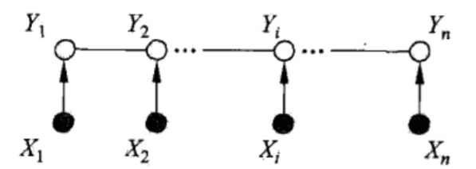

<center>图1.1 X和Y具有相同结构的线性链条件随机场

在本应用中，对识别结果进行分词处理，每个分词作为一个输入label，即$x_{i},i \in (1,N)$，，多个label组成一个输入文本X。为了让模型学习到文本断句信息，这里用较长句子（包含多个标点符号的文本）作为一条训练数据，进行模型训练。

##### 程序设计

标点引擎是以识别引擎输出结果作为输入文件的，对识别结果进行加标点，因为识别引擎本身识别结果为分词形式，所以引擎不再进行重新分词，直接送引擎进行后处理，主要接口包括：

1. 模型初始化

2. 对识别结果进行处理，添加标点

3. 退出引擎

#### 可靠性设计

1. 函数返回值规范，对应程序里的异常（如：文件打开失败、内存分配、释放异常等），通过函数返回值的形式逐层向上反馈，避免直接退出引擎；

2. 支持多线程异步调用，加快处理速度。

#### 扩展性设计

支持跨平台：目前引擎支持intel、ARM平台上的编译运行。

#### 安全性设计

引擎对各类异常进行判断，有一定的容错机制。

#### 易用性设计

引擎接口设计简洁，方便开发者快速熟悉引擎接口调用流程，快速完成接口集成；

引擎同时提供了接口测试程序，可供开发者参考。

### 标点引擎模块**接口设计**说明

本文档主要对标点引擎接口进行详细说明。

- 接口头文件：Punctuation.h

- 动态库文件：libPunctuation.lib、libcrflearn.lib

#### 初始化接口 PunctuationInit

**接口声明：**

```c++
bool PunctuationInit(const char* puncPath,const char* configFile,const int numberOfSession);
```

**函数功能**：初始化模型及线程数

**返回值**：bool

**参数：**

- puncPath：配置文件路径
- configFile：配置文件名称
- numberOfSession：开启线程数

#### 文本处理 PunctuationProcess

**接口声明：**

```c++
bool PunctuationProcess(const std::string &recString,std::string &recStringMarkEnds,const int sessionId);
```

**函数功能**：对文本序列进行处理，添加标点符号

**返回值**：bool

**参数**：

- recString：分词后的字符串

- recStringMarkEnds：添加标点符号后的字符串

- sessionId：线程id

**参数举例**：

- 输入：您好 很高兴 为您服务 请问 有什么 可以帮您

- 输出：您好， 很高兴 为您服务， 请问 有什么 可以帮您

#### 退出 PunctuationExit

```c++
bool PunctuationExit()
```

**函数功能**：退出引擎

**返回值**：bool

### 标点引擎**数据结构**设计

条件随机场使用crf++开源库实现，下面对主要利用的函数进行说明。

主要接口和库函数为：Punctuation.h、libcrflearn.so、libPunctuation.so

#### CRFPP::Model类

**主要方法**：

```c++
createModel(const char *arg)
```

**主要功能**：初始化模型

**参数**：模型文件名及相关参数，例如“-v1 -m model”,-v1指定详细信息的层级，可以输出模型的详细信息，这里使用“-v1”即可。

---

```c++
createTagger()
```

**主要功能**：由model调用，生成Tagger实例，多线调用时共享模型

####  CRFPP::Tagger类

**主要方法**：

```c++
bool add(const char* str)
```

**主要功能**：将分词添加到当前预测序列文本中

**参数**：分词


---

```c++
bool parse()
```

**函数功能**：解析文本序列，为文本序列添加标记


---

```c++
size_t xsize()
```

**函数功能**：返回列的大小


---

```c++
size_t ysize()
```

**函数功能**：返回输出tags的大小


---

```c++
const char* y2(size_t i)
```

**函数功能**：返回第i-th token的输出标签


---

```c++
bool clear()
```

**函数功能**：清除所有上下文token


### 标点引擎**开发测试环境**

#### 硬件要求

Intel(R) Xeon(R) CPU，内存64G。

#### 软件要求

操作系统建议安装CentOS 7.x，gcc/g++ 4.8及以上。

#### 测试运行

编译和测试说明

1. 编译

- 进入到crfpp\_learn目录，编译libcrflearn.so库

- 进入到Punctuation\_to\_tbnr目录，编译libPunctuation.so接口库

- 进入到PunctuationTest目录，编译PunctuationTest可执行文件

以上库和可执行文件均生成在LIB\_LINUX目录下。


2. 测试

测试目录testEnv,将LIB\_LINUX下的文件拷贝到当前lib目录下，然后执行一下命令：

```shell
./run.sh Punc 19_report.txt 12
```

- 参数1：模型目录

- 参数2：文本

- 参数3：线程数

运行结果，会在当前目录下生成19\_report\_rewrite.txt，即为加标点的文件。

#### 配置参数说明

**config.cfg**

- modelFile=Punc/model \#标点模型文件

- logFile=Punc/Punc.log \#log日志文件

- logLevel=3 \#log等级日志，默认3


