# 概述

## 编写目的

本文档主要用于为开发人员、维护人员了解在线识别源码编译、服务集成及运行中的服务替换更新文件进行说明，具体描述了源码编译步骤、服务集成步骤及编译生成的文件如何替换到部署环境中。

## 读者对象

本文档的读者对象为在线识别系统的开发人员、代码维护人员。

目的在于：

  - 为开发人员提供依据；

  - 为代码开发编译、维护提供条件；

  - 为维护人员替换升级提供依据；

## 源码和部署包关系

> **代码位置**：二阶段目录和文档.zip\\应用平台封装\\在线\\在线识别\\在线识别系统源码
>
> **部署包**：
>
> 1. Rel\_OnlineASR-e2e\_v3.10.9\_20210708\_20210916\_nolic\_nanwang.tar.gz
> 2. Rel\_OnlineASR-hybrid\_v3.9.3\_20210708\_20210916\_nolic\_nanwang.tar.gz
> 3. Release\_MRCP-v2.7.1\_20210820\_20210916\_nolic\_nanwang.tar.gz

## 在线识别服务系统介绍

在线识别系统服务主要包含**能力接口**部分和**decoder处理语音**部分。两者通过redis建立联系。

在线识别系统模块间逻辑关系如下：

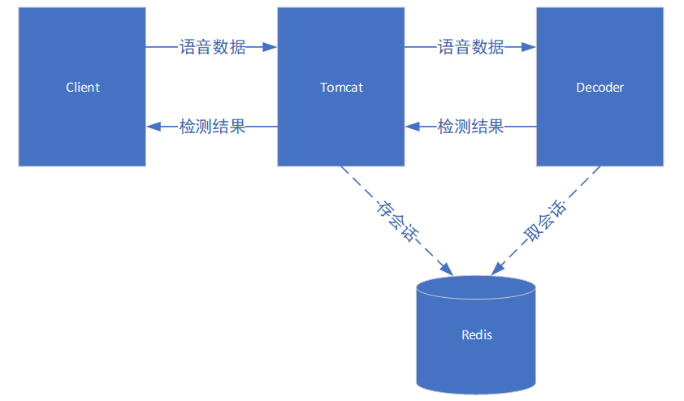

第3章节集成的Decoder服务和第4章节集成的tomcat服务，通过redis建立联系，tomat服务负责接收客户端会话，并将会话存入redis，Decoder服务从redis中获取会话。tomcat服务及Decoder服务集成方式第3、4章节详细介绍。

# **mrcp源码编译**及服务集成

## 硬件需求

mrcp源码编译环境开发中硬件需求如下：

|   服务器   | Cpu  | 内存 | 磁盘 |
| :--------: | :--: | :--: | :--: |
| 开发服务器 |  2   |  4G  |  5G  |

## 软件环境

|  服务器  | 操作系统  | 编译环境 |
| :------: | :-------: | :------: |
| 操作系统 | Centos7.X | gcc、g++ |

> **源码：**二阶段目录和文档.zip\\应用平台封装\\在线\\在线识别\\在线识别系统源码\\**在线识别系统mrcp接口**

## mrcp代码编译

### 编译mrcp依赖库

解压开提供的mrcp源码包，进入unimrcpserver目录，找到脚本文件**build-dep-libs.sh**，如下图所示：

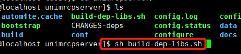


执行`sh build-dep-libs.sh`编译mrcp依赖库，编译完成后，依赖库默认安装在当前用户的local目录下（~/local目录下），生成**apr、apr-util、sofia-sip**三个文件，三个文件的lib文件中是编译mrcp需要的依赖库文件，如下图所示：

**（1）**~/local/apr/lib目录下库文件：

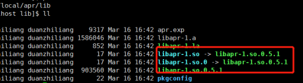

**（2）**~/local/apr-util/lib目录下库文件：

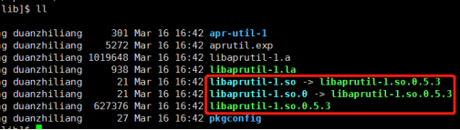

**（3）**~/local/sofia-sip/lib目录下库文件：

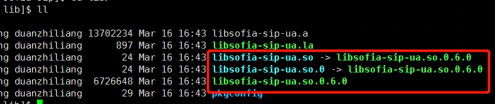

### 编译mrcp

如下图所示，在unimrcpserver目录下中找到编译脚本 **boostrap**，执行`sh bootstrap`

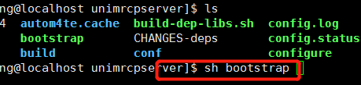

编译完成后，在当前用户的local目录下生成unimrcp目录(~/local/unimrcp)。

生成的unimrcp目录结构如下：

```
unimrcp
├── bin
├── conf
├── data
├── include
├── lib
├── log
└── plugin
```


## mrcp部署包集成

>   在2.3.2章节编译生成的unimrcp文件是一个基础部署包；
>
>   将2.3.1章节生成的依赖库文件复制到unimrcp/lib目录下（~/local/unimrcp/lib）；
>
>   将release\_mrcp/uni、mrcp/bin **部署包**中的启动脚本**run\_mrcpserver.sh、shutdown.sh、start.sh**放到unimrcp/bin目录下（~/local/unimrcp/bin）。
>
>   将release\_mrcp/unimrcp/conf **部署包**中的配置文件**unimrcpserver.xml**放到unimrcp/conf目录下（~/local/unimrcp/conf）。
>
>   完成上述操作后unimrcp（~/local/unimrcp）文件夹就是一个部署包，打包后可以部署到其它服务器上。

**注：**目录**release\_mrcp**是压缩包Release\_MRCP-v2.7.1\_20210820\_20210916\_nolic\_nanwang.tar.gz解压后的目录文件。

## 部署包文件替换

编译mrcp代码生成 **unimrcp** 目录中的文件替换到部署环境中，对于已经部署好的服务如果重新集成部署包进行替换比较耗时，可以只替换更新部分文件，替换文件操作如下：

  - 将目录unimrcp/bin中所有文件放到部署包对应的部署目录unimrcp/bin；

  - 将目录unimrcp/plugin 中所有文件放到部署包对应的部署目录unimrcp/plugin ；

  - 将目录unimrcp/lib中所有文件放到部署包对应的部署目录unimrcp/lib；

  - 进入部署目录unimrcp/bin，执行`run_mrcpserver.sh`用控制台启动服务，日志提示没有错误
  - ctrl+c 停止控制台服务，执行`sh start.sh`后台启动服务，进行下一步的联调测试。

## mrcp对接服务

mrcp服务上层通过**sip协议**对接ivr服务，下层通过**http协议**对接asr服务，对应关系如下：


### mrcp对接ivr服务

只需要将mrcp的ip和sip端口号提供给ivr侧即可；ip和sip端口号在配置文件**conf/unimrcpser.xml**中配置，如下图所示：

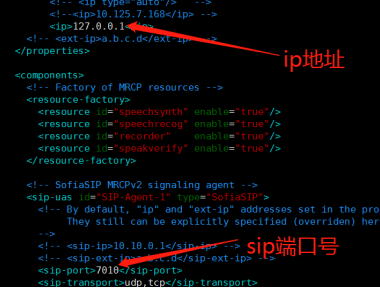

### mrcp对接asr服务

需要将asr服务的ip、端口和url配置到配置文件**conf/unimrcpserver.xml**中，具体位置如下图所示：

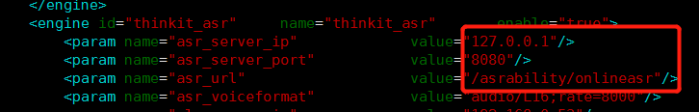

>   - asr\_server\_ip :  asr服务的ip地址；
>
>   - asr\_server\_port:  asr服务的端口号；
>
>   - asr\_url:  asr服务的url路径；

# **decoder源码编译**及服务集成

## 硬件需求

在线识别源码编译环境开发中硬件需求如下：

|   服务器   | Cpu  | 内存 | 磁盘 |
| :--------: | :--: | :--: | :--: |
| 开发服务器 |  2   |  4G  |  5G  |

## 软件环境

|  服务器  | 操作系统  | 编译环境 |
| :------: | :-------: | :------: |
| 操作系统 | Centos7.X | gcc、g++ |

> **源码：**二阶段目录和文档.zip\\应用平台封装\\在线\\在线识别\\在线识别系统源码\\在线识别系统decoder接口

## 在线识别代码编译

### libTitCppKits依赖库编译

**libTitCppKits**依赖库编译，进入目录decoder-code，如下图所示：找到编译脚本build\_thirdparty.sh。

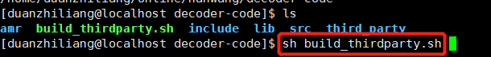

执行`sh build_thirdparty.sh`，编译的依赖库会生成到decode-code/lib目录中，如下图所示：

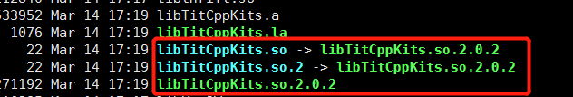

>   **注意：**
>
>   如果decode-code/lib目录下有文件libTitCppKits.so.2.0.2、libTitCppKits.so.2、libTitCppKits.so可以不编译该库；
>
>   如果修改了decoder-code/third\_party/libTitCppKits目录中的文件，需要执行sh build\_thirdparty.sh重新编译。

### decoder源码编译

解压开提供的源码包，进入decode-code/src目录，如下图所示执行`make`。执行make进行源码编译，编译过程中如何发现缺少系统库，安装对应的系统库；

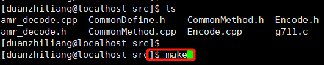

编译完成后，生成二进制文件**decoder**，如下所示：

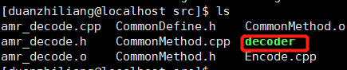

## 在线识别服务集成

### 在线识别服务目录结构介绍

在线识别服务目录结构如下：

```
Decoder
├── bin
├── conf
├── lib
├── log
└── model
```

**（1）**目录说明：

- **bin**：放置启动脚本、执行文件，如下所示：

    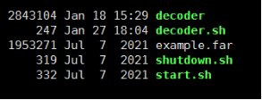

- **conf**：放置识别服务的配置文件decoder.conf：

- **lib**：放置识别服务依赖库，如下所示

    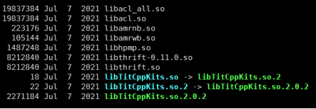

- **log**：放置识别服务生成的日志文件；

- **model**：放置模型文件、引擎库文件。

**（2）**端到端版本：

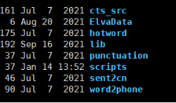

**（3）**hybrid版本：

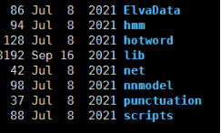

### 在线识别服务集成-Decoder

**了解部署包的结构：**首先解压开部署包，解压后，查看目录rel\_onlineasr。

> Rel\_OnlineASR-hybrid\_v3.9.3\_20210708\_20210916\_nolic\_nanwang.tar.gz
>
> Rel\_OnlineASR-e2e\_v3.10.9\_20210708\_20210916\_nolic\_nanwang.tar.gz

**重新集成部署包：**

>   （1）**首先创建部署包文件Decoder目录**：在Decoder目录中分布创建bin、lib、conf、log、model目录。
>
>   （2）**构建bin目录**：
>   - 将3.3.2章节编译生成的**decoder**文件放在此目录下，
>   - 将rel\_onlineasr/Decoder/bin目录下的启动脚本decoder.sh 、start.sh、shutdown.sh放在此目录下。
>   - 将rel\_onlineasr/Decoder/bin目录下转阿拉伯数字依赖文件~~fe\_source~~、example.far放在此目录下。
>
>   （3）**构建conf目录**：将代码decode-code/conf目录下配置文件decoder.conf放到此目录下。
>
>   （4）**构建lib目录**：将代码中decode-code/lib下库文件libacl\_all.so、libacl.so、libamrnb.so、libamrwb.so、libhpmp.so、libthrift-0.11.0.so、libthrift.so、libTitCppKits.so、libTitCppKits.so.2、libTitCppKits.so.2.0.2放在此目录下。`libTBNR_API.so`
>
>   （5）**构建log目录**：直接创建log目录即可。
>
>   （6）**构建model目录**：model目录结构是引擎库和模型文件。
>   - 模型文件从【在线语音识别引擎-运行环境】中model直接复制。
>   - model目录中创建lib目录存放引擎库文件，引擎库文件从语音识别引擎sdk包中**KWSAPI\_ENV\\KWSAPI\_LIBLINUX**目录中复制。
>   - model目录也可以从安装包中复制。

**PS：**语音识别引擎/在线/引擎封装tbnr/在线语音识别引擎-运行环境

**147：**/wp/aster/zhongke/三阶段代码和文档202203/三阶段代码和文档/语音识 别引擎(端到端）/在线/引擎封装tbnr/在线语音识别引擎-运行环境

> **hybrid版本：**Rel\_OnlineASR-hybrid\_v3.9.3\_20210708\_20210916\_nolic\_nanwang.tar.gz
>
> **端到端版本：**Rel\_OnlineASR-e2e\_v3.10.9\_20210708\_20210916\_nolic\_nanwang.tar.gz
>
> 解压hybrid或端到端版本，将rel\_onlineasr/model目录下的文件复制到当前model目录下。
>
> 完成以上操作后，在线识别服务的部署包集成完成，打包Decoder文件后可以部署到其它服务器。

## 替换编译文件、启动服务

对于已经部署完成的服务重新打包比较耗时，可以进行更新文件的直接替换，如下介绍替换较频繁的操作进行介绍；

> **替换decoder编译文件，具体操作如下**：编译代码生成二进制文件decoder，将生成的**decode-code/src/decoder**文件复制到在线识别部署包Decoder/bin目录下；
>
> **替换模型文件**：将训练好的模型文件替换到Decoder/model/cts\_src目录下；
>
> **启动服务**：进入Decoder/bin目录，执行`sh start.sh`启动服务即可。

# **http源码编译**

## 硬件需求

能力接口源码编译环境开发中硬件需求如下：终端电脑。

## 软件环境

| 操作系统 | 编译环境 | 编译软件 | 编译框架 |
| :------: | :------: | :------: | :------: |
| Windows  |  Jdk1.8  |   IDEA   |  Maven   |

> **位置**：二阶段目录和文档.zip\\应用平台封装\\在线\\在线识别\\在线识别系统源码\\在线识别系统http能力接口

## 代码编译

（1）导入能力接口源码至IDEA。

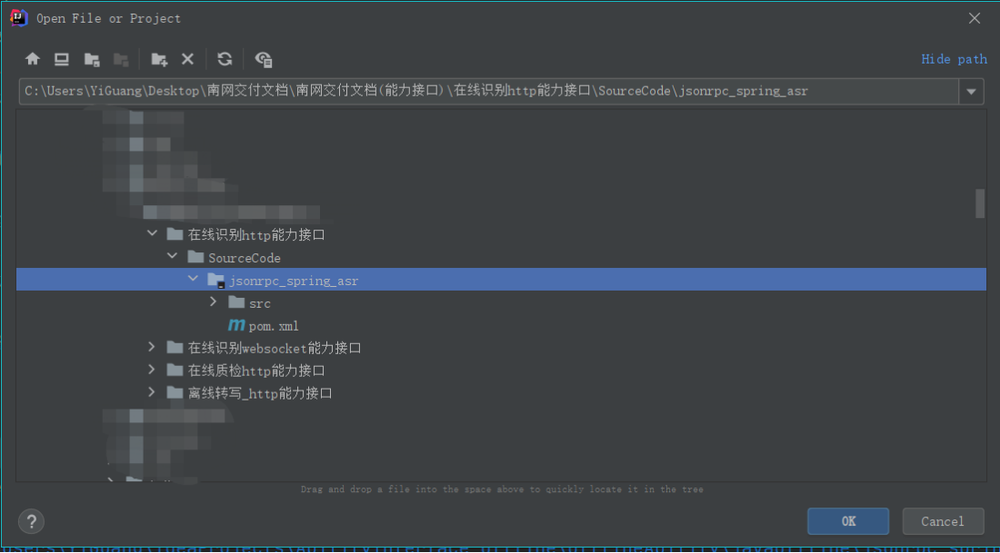

（2）在maven中执行compile功能实现编译。

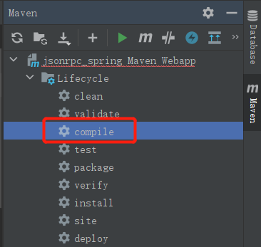

## 能力接口服务集成

tomcat包选择apache-tomcat-9.0.35。

（1）maven中执行package功能实现生成war包。

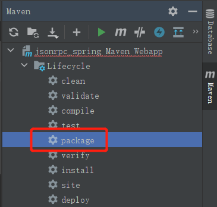

（2）将生成的war包放在apache-tomcat-9.0.35/webapp目录下。

完成上述两步后，打包apache-tomcat-9.0.35，打包后可以部署到其它服务器中。

## 编译文件替换

对于已经部署使用中的能力接口服务，不需要重新打包tomcat，只需要将编译后的war包替换到apache-tomcat-9.0.35/webapp目录下即可。

## 辅助工具介绍

工具目录结构如下：

```c++
tools
├── apache-tomcat-9.0.35.20210702.tar.gz //tomcat能力接口服务（第4章节介绍）
├── jdk-8u171-linux-x64.tar.gz //tomcat运行依赖
├── jmeter.zip //jmeter测试工具
├── nginx
│   └── nginx14_tools.tar.gz //nginx负载均衡
├── redis-3.2.0.tar.gz //redis会话管理工具
├── SDK //sdk测试工具
│   ├── JAVA
│   ├── Linux_Cpp
│   └── Python
├── tools_install //工具安装脚本目录
│   ├── 01_install_jdk.sh
│   ├── 02_install_redis.sh
│   ├── 03_install_tomcat.sh
│   ├── 04_install_nginx.sh
│   ├── 05_install_keepalived.sh
│   └── install_All.sh
└── WebSocket.20210222.tar.gz //websocket能力服务（第5章节详细介绍）
```

**集成介绍**：

> - Jmeter、sdk测试工具是按照在线识别接口文档编写；
> - Jdk 通过网络下载，不需要做任何修改；
> - nginx源码安装，添加分发策略脚本；
> - redis通过源码编译后生成的可执行安装包；
> - tools\_insall是工具的安装脚本目录，记录工具的安装步骤。

# **WebSocket源码编译**

## 硬件需求

能力接口源码编译环境开发中硬件需求如下：终端电脑。

## 软件环境

| 操作系统 | 编译环境 | 编译软件 | 编译框架 |
| :------: | :------: | :------: | :------: |
| Windows  |  Jdk1.8  |   IDEA   |  Maven   |

> **位置**：二阶段目录和文档.zip\\应用平台封装\\在线\\在线识别\\在线识别系统源码\\在线识别系统websocket能力接口

## 代码编译

（1）导入能力接口源码至IDEA。

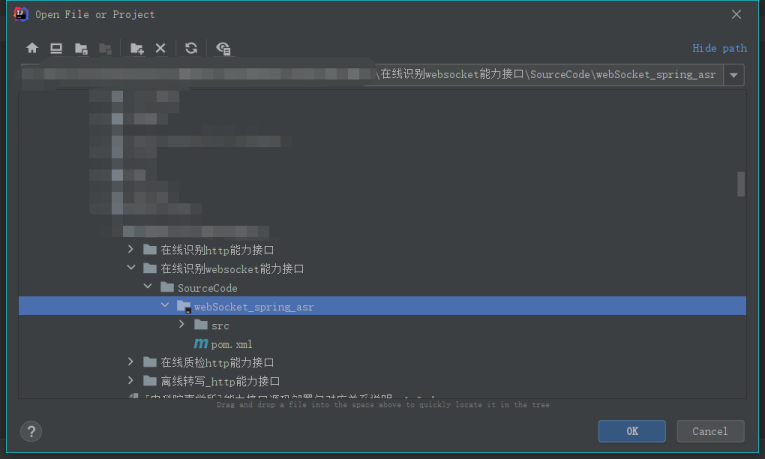

（2）在maven中执行compile功能实现编译。

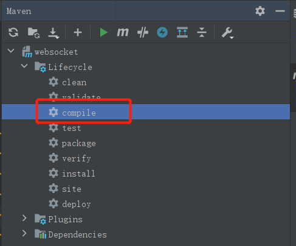

## 能力接口服务集成

**（1）**maven中执行package功能实现生成jar包。

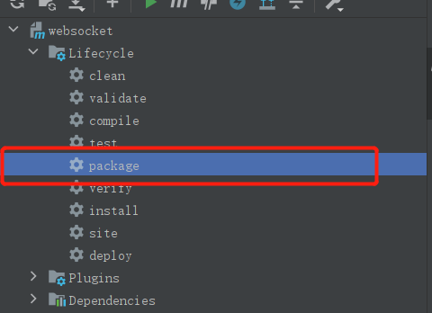

**（2）**将生成的jar包放在webSocket目录下。

**（3）**修改jar包名称为websocket.jar。

完成上述两步后，打包webSocket，打包后可以部署到其它服务器中。

## 编译文件替换

对于已经部署使用中的能力接口服务，不需要重新打包webSocket，只需要将编译后的jar包替换到webSocket目录下即可。

# 系统Docker镜像-online\_base

## 构建镜像

**文件位置**：***

基础镜像使用Dockerfile生成，Dockerfile放在/home下。Dockerfile内容如下：

```dockerfile
FROM centos:7
MAINTAINER asr
ENV MYPATH /home
WORKDIR $MYPATH
ADD jdk-8u171-linux-x64.tar.gz /home
ADD apache-tomcat-9.0.35.20210702.tar.gz /home
ADD redis-3.2.0.tar.gz /home
ENV JAVA_HOME /home/jdk1.8.0_171
ENV CLASSPATH $JAVA_HOME/lib/dt.jar:$JAVA_HOME/lib/tools.jar
ENV CATALINA_HOME /home/apache-tomcat-9.0.35
ENV CATALINA_BASE /home/apache-tomcat-9.0.35
ENV PATH $PATH:$JAVA_HOME/bin:$CATALINA_HOME/lib:$CATALINA_HOME/bin
```

**生成镜像命令**：

```shell
docker build -t online_base:v1.0 
```

**查看生成镜像**：

```shell
docker images
```


## 导出镜像

解压部署包：

```shell
docker save -o 镜像包名.tar 镜像名:tag(版本号)
```

例如：`docker save -o online_asr.tar online_base:v1.0`

导出的镜像包online\_asr.tar用于在线识别服务的容器化部署。

## 镜像启动

在线识别服务部署包保存日志、语音和识别结果占的空间较大，选用挂载方式部署。

  - 安装docker环境；

  - 导入镜像：`docker load -i online_asr.tar`；

  - `docker images` 查看镜像；

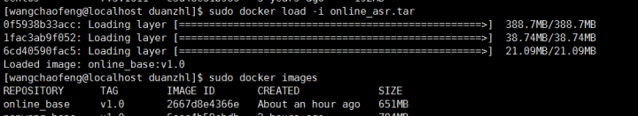

  - 启动镜像 

    ```shell
    docker run -p 主机端口号:容器端口号 -dit -v 主机目录:容器目录 --name online(容器名字) online_base:v1.0 /bin/bash
    ```

  - 部署包放在 启动镜像时挂载的“主机目录”；

  - 进入容器：`docker exec -it CONTAINER_ID /bin/bash`

  - 在容器中解压部署包进行部署操作。
