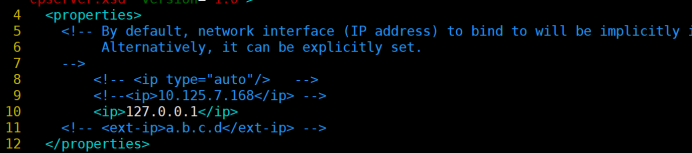
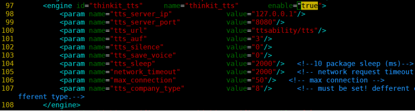
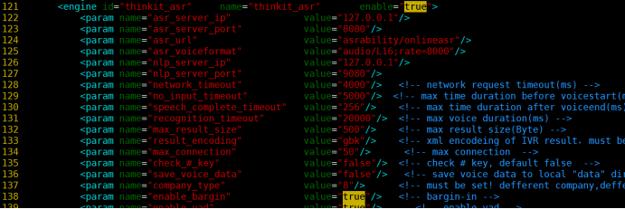
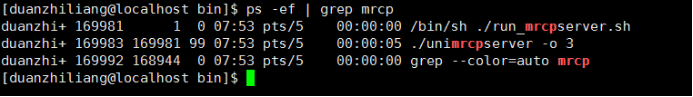
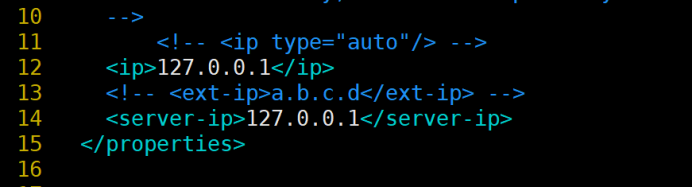
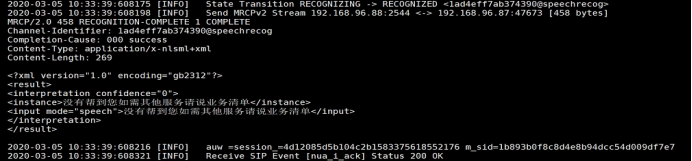
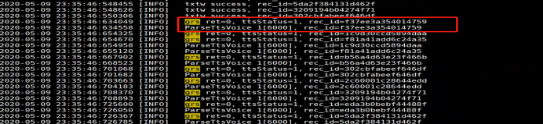

# 1．系统介绍

## 1.1系统功能

本系统是对语音资源进行控制的服务。系统将待识别语音静音切除，去噪声处理，得到有效语音流转发给后台识别引擎，并将识别引擎返回的识别结果返回给上层业务，支持导航的后续工作。

## 系统配置环境

### 硬件环境

|        操作系统         | CPU  | 内存 | 磁盘 | 其他                                     |
| :---------------------: | :--: | :--: | :--: | ---------------------------------------- |
| centos-server 7.0，64位 |  4c  |  8G  | 100G | 部署前关闭防火墙，防止客户端请求不到服务 |

### 软件环境

gcc/g++ ：部署机器需要4.8及以上版本。

# 2．模块安装

## 前提

> 建议所有文件都放在/home/用户名/mrcp目录下，依赖工具放置在/home/用户名/mrcp/tools目录下。（以下例子的环境变量配置按照这个目录来配置）
>
> 授权申请，切换到bin目录下，执行 ./getinfo，会生成一个新文件，将此文件通过邮件发至我方人员并注明申请的产品号80，81以及线数、期限等信息，待我方人员将授权发过来后将文件重命名为license_80.dat,license_81.dat,放置在bin目录下即可正常使用。

## 2.2 mrcp服务部署

### 2.2.1 mrcp服务配置

进入目录conf，修改配置文件unimrcpserver.xml。

- 如下图部分，需要把ip地址修改为本机的ip地址。

    

- tts模块配置修改

    

    > 如果没有用到tts模块，enable设置为false，跳过下面tts设置；
    >
    > tts_server_ip： tts服务ip地址；
    >
    > tts_server_port：tts服务对外端口；
    >
    > tts_url： tts服务对外访问路径；若是直接访问nginx，tts_url改为/tts; 若是 直接访问tomcat，tts_url改为ttsability/tts。
    >
    > max_connection：为最大线数限制，不能超过授权线数，根据申请的授权数进行填写(产品号81)。
    >
    > tts_save_voice： 为配置是否在mrcp侧保存语音。配置为1代表保存语音。
    >
    > tts_company_type：默认为8，其他参数按默认即可。

- asr模块配置修改

    

    > asr_server_ip： 在线asr的ip地址；
    >
    > asr_server_port：在线asr服务的对外端口；
    >
    > asr_url： 在线asr服务对外的访问路径，tomcat或nginx所在的机器，若是 直接访问nginx，asr_url改为/onlineasr; 若是直接访问tomcat，asr_url改为asrability/onlineasr。
    >
    > max_connection：服务最大线程数，不能超过授权的线数，根据申请的授权数进行填写(产品号80)。
    >
    > 注意：对应模块的enable变量必须设置为true。

### 启动mrcp

#### 前台启动mrcp

进入到目录**unimrcp/bin**，执行`sh run_mrcpserver.sh`，检查启动的前台日志是否有错误提示，如果没有错误提示，退出前台启动，执行后台启动。

#### 后台启动mrcp

进入bin目录执行`sh start.sh` 启动服务。

查看mrcp是否启动成功，执行ps -ef \| grep mrcp，如果出现下面界面，

表示启动成功：

# 3. 服务验证

## 验证asr模块

1、进入conf目录下，配置客户端文件unimrcpclient.xml，修改ip为本机ip地址。

2、进入bin目录，执行 **./ unimrcpclient -f ../data/ one-8kHz.pcm**    (**或选择data目录下任意语音文件)**

然后执行**run recog**，然后看mrcp服务端日志如果有识别结果说明asr模块部署成功。例子如下：

## 验证tts模块

1、配置客户端文件unimrcpclient.xml 同 3.1 的第一步。

2、进入bin目录，执行 **./unimrcpclient**，然后执行**run synth**，如果在data目录下生成语音文件（unimrcpsever.xml配置时tts_save_voice必须配置成1）说明tts模块部署成功。也可以选择看mrcp服务端日志有语音流收到代表部署成功，如下：

