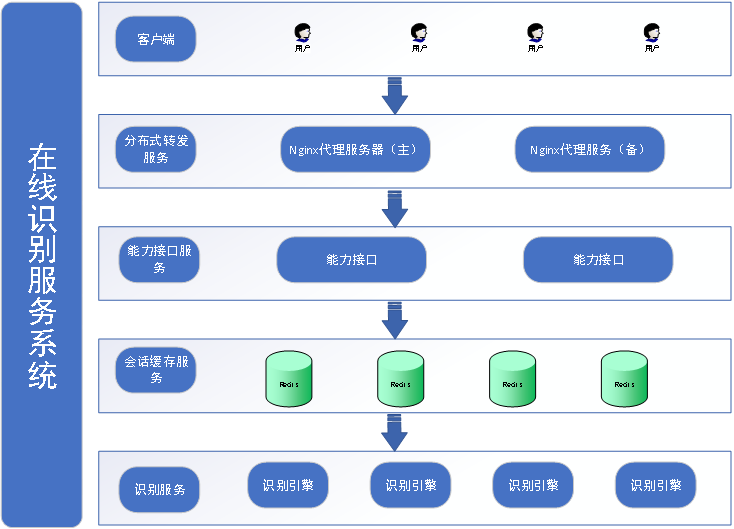
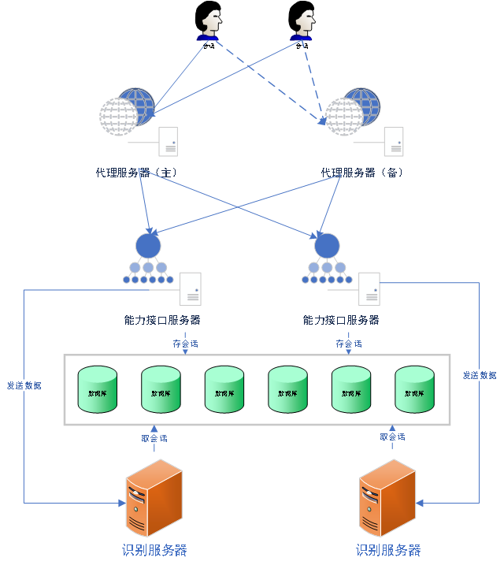
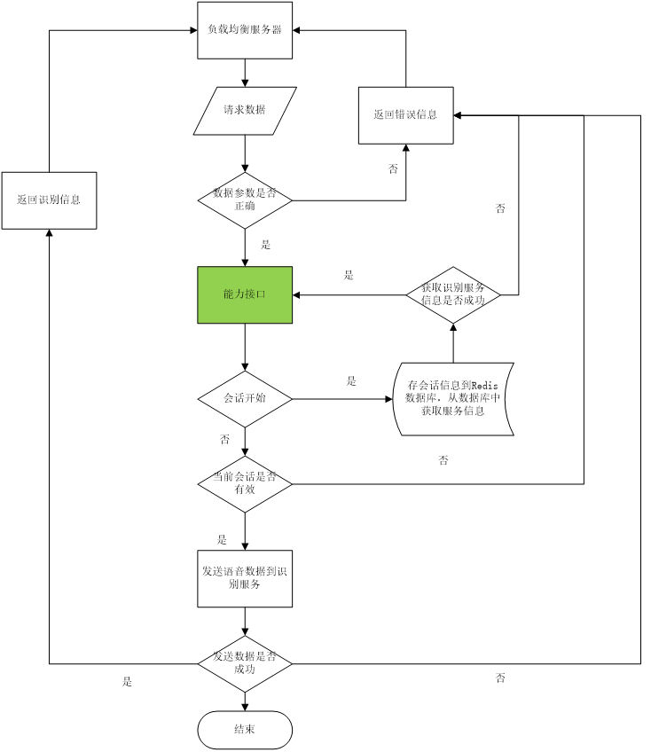
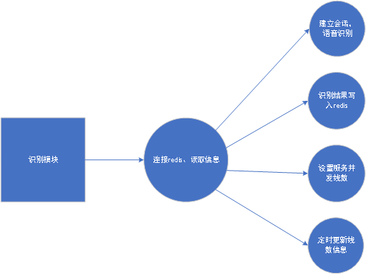
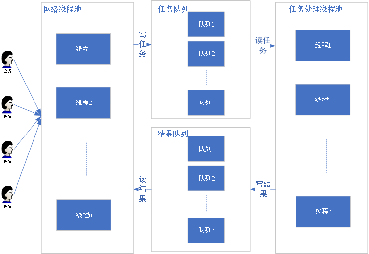
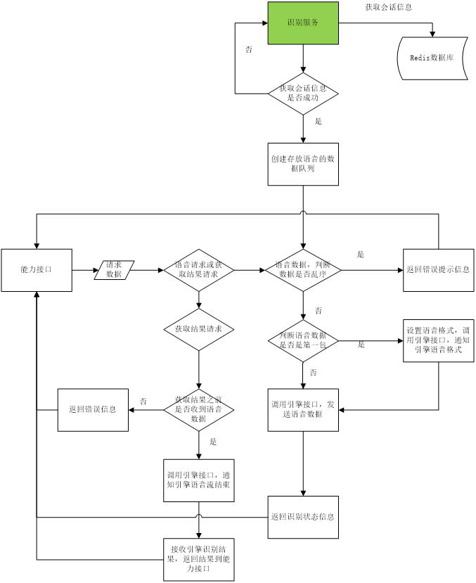

# **引言**

**编写目的**：本文档主要用于为实现系统功能而进行的系统详细设计说明，具体描述了系统包含的的软件模块的实现流程、功能、接口、数据结构等内容，供项目组开发人员和软件维护人员阅读。

**定义**：语音识别（Automatic Speech Recognition），简称（ASR）。

**参考资料**：《国家标准软件开发文档规范》。

# **系统的结构**

在线识别系统软件架构图：



在线识别系统物理架构图：



# **能力接口模块设计说明**

## **模块描述**

能力接口模块用来接收负载均衡服务器转发的请求，并将请求数据进行封装转发。

## **功能**

能力接口负责接收nginx转发过来的请求数据，判断数据的有效性及转换数据格式为识别服务需要的格式。

首先，能力接口需要判断请求是否是新会话的开始，新会话的开始，能力接口将会话信息存放在redis数据库中，等待识别服务获取会话信息。

然后，能力接口从redis数据库中获取是哪台识别服务来处理后续的识别请求，能力接口将接收到的语音数据发送到指定的识别服务器。

## **性能**

软件环境要求：

|     分类     | 名称   | 版本    |
| :----------: | ------ | ------- |
|   操作系统   | Centos | 7.0以上 |
| Java运行环境 | Jdk    | 1.8     |
|   能力接口   | Tomcat | 9.0.35  |

硬件环境要求：

| 分类 | 配置 |
| :--: | ---- |
| Cpu  | 4    |
| 内存 | 10G  |
| 磁盘 | 20G  |
| 带宽 | 20M  |

## **输入、输出项**

能力接口模块包含四个交互流程，会话开始（ssb）、发送语音（auw）、获取识别结果（grs）和会话结束（sse）。

`会话开始输入、输出数据`：详见接口文档《在线语音识别接口开发文档-v1.15.pdf》

`会话交互输入、输出数据`：详见接口文档《在线语音识别接口开发文档-v1.15.pdf》

`获取会话结果输入、输出数据`：详见接口文档《在线语音识别接口开发文档-v1.15.pdf》

`会话结束输入、输出参数`：详见接口文档《在线语音识别接口开发文档-v1.15.pdf》

## **流程逻辑**

能力接口数据逻辑流程图如下所示：



## **接口**

**说明**：说明本模块与其它相关模块间的逻辑连接方式，说明涉及到的参数传递方式。能力接口和识别引擎交互方式为socket通信，数据格式为json字符串。

逻辑图如下：


具体交互数据如下。

### 能力接口会话开始输出、输入参数

1. 输出参数：

| 参数 |  类型  | 说明           |
| :--: | :----: | -------------- |
| aue  | 字符串 | 非编码原始语音 |
| auf  | 字符串 | 语音采样率     |
| cmd  | 字符串 | 会话状态       |
| sid  | 字符串 | 会话Id         |

2. 输入参数：

| 参数 |  类型  | 说明             |
| :--: | :----: | ---------------- |
| ret  |  整型  | 响应状态         |
| sid  | 字符串 | 会话Id           |
| addr | 字符串 | 识别服务地址信息 |

### 会话交互输出、输入数据

1. 输出参数：

|  参数  | 类型   | 说明                 |
| :----: | ------ | -------------------- |
|  data  | 字符串 | Base64加密的语音数据 |
|  cmd   | 字符串 | 会话状态             |
| syncid | 字符串 | 语音包序号           |
|  sid   | 字符串 | 会话Id               |

2. 输入参数：

|     参数     | 类型       | 说明               |
| :----------: | ---------- | ------------------ |
|     sid      | 字符串     | 会话Id             |
|  recStatus   | 字符串     | 识别状态           |
| engine\_name | 字符串     | 引擎地址           |
|    result    | json字符串 | 识别结果           |
|      bg      | 字符串     | 检测到有效语音     |
|      ed      | 字符串     | 检测到有效语音尾点 |

### 获取会话结果输出、输入数据

1. 输出参数：

|  参数  | 类型   | 说明     |
| :----: | ------ | -------- |
|  cmd   | 字符串 | 会话状态 |
| syncid | 字符串 | 序号     |
|  sid   | 字符串 | 会话Id   |

2. 输入参数：

|     参数     | 类型       | 说明               |
| :----------: | ---------- | ------------------ |
|     sid      | 字符串     | 会话Id             |
|  recStatus   | 字符串     | 识别状态           |
| engine\_name | 字符串     | 引擎地址           |
|    result    | json字符串 | 识别结果           |
|      bg      | 字符串     | 检测到有效语音     |
|      ed      | 字符串     | 检测到有效语音尾点 |

### 会话结束输出、输入参数

1. 输出参数：

| 参数 | 类型   | 说明     |
| :--: | ------ | -------- |
| cmd  | 字符串 | 会话状态 |
| sid  | 字符串 | 会话Id   |

2. 输入参数：

| 参数 | 类型   | 说明         |
| :--: | ------ | ------------ |
| ret  | 整型   | 会话结束状态 |
| sid  | 字符串 | 会话Id       |

## **存储分配**

本模块对存储分配要求不高，仅存储识别的会话信息。

## **注释设计**

主要函数功能说明，输入、输出参数解释说明。

## **限制条件**

服务运行环境：限于centos操作系统；

技术要求：java

调用请求：模块服务的调用必须按照接口文档进行参数传递。

# **识别模块设计说明**

## **模块描述**

识别模块接收语音流，识别语音，返回识别文本。

## **功能**

识别服务负责接收能力结果发送过来的语音，返回识别出的文字结果；首先，识别服务从redis服务中获取会话信息，成功后将本服务器信息写入redis数据库中，然后，能力接口从redis数据库中获取服务器信息，将数据发送到识别服务。

### 功能设计

识别模块包含连接redis、识别、更新引擎并发信息、设置引擎线数和识别结果写入redis功能；

连接redis：首先，识别服务需要重redis中读取会话信息，写入自己的ip和端口信息，然后才能接收到语音数据流，连接redis是识别模块的重要功能，识别模块中的多数功能都和redis有直接的关系。

连接redis在识别模块中的作用如下图所示：



**识别**：识别服务接收到语音流后，将语音数据通过调用引擎进行识别，获取识别结果。

**更新引擎并发信息**：识别服务会定时的将本服务的并发信息更新到redis中，便于后期通过redis查看服务的并发量，进行扩容或减少并发设置。

**识别结果写入redis**：该功能主要是防止比较长的识别结果第三方调用端无法完全接收时，可以通过读取redis的形式获取识别结果。

## **性能**

1. 软件环境要求：

|   分类   | 名称    | 版本          |
| :------: | ------- | ------------- |
| 操作系统 | Centos  | 7.0以上       |
| 识别引擎 | Decoder | 3.10.9、3.9.3 |

2. 硬件环境要求：

| 分类 | 配置 |
| :--: | ---- |
| Cpu  | 10   |
| 内存 | 20G  |
| 磁盘 | 100G |
| 带宽 | 20M  |

## **设计方法（算法）**

**并发设计**：软件设计使用线程池的方式，通过读取配置文件线程数量一次启动所有需要的线程，线程数配置参考机器配置，线数=cpu核数\*2；

**网络设计**：程序通过单独的线程池接收、发送数据，接收到的数据放到数据队列中，数据处理线程从队列中读取数据进行识别处理，然后将识别出的结果放入到对应的结果队列中，网络线程读取结果队列发送数据。

**任务线程池**、**网络线程池**、**任务队列**和**结果队列**之间的交互关系如下图所示：



## **流程逻辑**

识别模块数据逻辑流程图如下所示：



### 主要函数功能介绍

#### 连接redis函数

void redis\_connect(acl::redis\_client\_cluster \&client\_cluster)

函数功能：该函数主要实现连接redis，作为通用的调用方法，供其他功能调用。

#### 获取会话函数

**int processSsb（**asr\_var\_t \&threadVar, asr\_var\_temp\_t \&threadVarTemp,

**void** \*parameter, redis\_param \&rparam, std::string \&bitRate**）**

函数功能：通过调用改函数，识别服务的空闲线程获取新的会话信息，然后接收语音数据进行识别。

#### 网络交互函数

**void** **CallBackFunc\_Server**(std::string \&out\_action, std::string \&out\_msg, **const** std::string &\_in\_action, **const** std::string &\_in\_msg)

函数功能：该函数主要接收能力接口端发送的请求数据，并将识别后的数据返回给能力接口。

#### 逻辑控制函数

**static** **void** \***DecodeProcThread**(**void** \*parameter)

函数功能：该函数主要实现数据处理工程的逻辑控制功能；

#### 数据队列读取函数

**int** **getRequest**(redis\_param \&rparam,**int** num)

函数功能：该函数的功能为从当前会话的数据队列中读取语音数据，进行后续的处理。

#### 并发线数设置函数

**void** **UpdateOnlineInfo**()

函数功能：该函数主要功能是从reids中读取对当前识别服务设置的线程数，调整当前服务的最大任务处理线数。

#### 线程信息通知函数

**void** **sendOnlineInfo**()

函数功能：该函数功能为定时的将服务的线数信息写入reids中。

## **接口**

识别引擎和能力接口交互方式为socket通信，数据格式为json字符串。

逻辑图如下：


### 会话开始输入、输出数据

会话开始输入数据：

| 参数 | 类型   | 说明           |
| :--: | ------ | -------------- |
| aue  | 字符串 | 非编码原始语音 |
| auf  | 字符串 | 语音采样率     |
| cmd  | 字符串 | 会话状态       |
| sid  | 字符串 | 会话Id         |

如下实例：

```json
{  
    "request":{  
        "aue":"raw",  
        "auf":"audio/L16;rate=8000",  
        "cmd":"ssb"  
    },  
    "sid":"16e374f04d8348e487dab492552537a8"
}
```

会话开始输出数据：

| 参数 | 类型   | 说明             |
| :--: | ------ | ---------------- |
| ret  | 整型   | 响应状态         |
| sid  | 字符串 | 会话Id           |
| addr | 字符串 | 识别服务地址信息 |

**实例如下：**

```json
{  
    "response":{  
        "ret":0  
    },  
    "sid":"16e374f04d8348e487dab492552537a8",  
    "addr":"192.168.0.52:10200"  
}
```


### 会话交互输入、输出数据

|  参数  | 类型   | 说明                 |
| :----: | ------ | -------------------- |
|  data  | 字符串 | Base64加密的语音数据 |
|  cmd   | 字符串 | 会话状态             |
| syncid | 字符串 | 语音包序号           |
|  sid   | 字符串 | 会话Id               |

实例如下：

```json
{  
    "request":{  
        "data":"KgAUAOD/jP9P/xj/CP8x/2//2P9LALcAGgFQAWcBVgEeAdIAagABAKH/Uf8i/xH/I/9R/5L/4P8rAGsAnACwAKwAkABdACEA4f+q/4H/bf+p/9L/XgCHALEA1gBbAE4A4/+A/4b/Jv9G/1f/V/+//9f/JABwAHsAuQCwAKUAoABgAEAACgDI/67/f/91/3T/df+a/7X/3P8OACwAUwBmAH3/Xv84//f+WP+5/lr+WP8n/0gAlACBAHgBNwGWAcwBJwFYAZkAMgAQAB0AKQA5AD0AQQBBAD0AOQAtAOf+vf4g/rD9Gv6s/SL+VP5l/kn/HP+b/kL+m/0A/iT+Uv5YAmf/4wBI/zz+bP6r/Hb9vvzM/PT9sv3YAMIA2ABQAm8CvgPfAwQEWASJA4MDnwLRAUcBewB3AOr+ev5r/in+bP7p/h//W/5I/pb+YP7k/Qn+if0R/vb8pf1q/lb+7f7OANH/jgAKAVoBYgHPAb0AMgEwAb4ArgC7AL8AHQHaAOgA6gAtAUIBWAFTAWYBWQE8AXv+2P7Z/uv9cP1V/TD9t/zv/Ir8+fy4/cj9NP40AeD/ZAAgAb8BHQKaAnEBEgItAiUB8gDoALIAT/+PAJgAOf/zAC4BTwGUAeYBFwGNATsB9gAx/2P++f0i/kD9rfzG/Fb9oP1t/vj++wDrAIQBAgKrAioDWwNvAw4CMAIQAnv+9wCW/if/bwHO/X3+oP7t/oH/M/6YAV8BigExAoACQgJV/tsC//6p/f78RfzM+zD8xfzK/Yj+SQF3AZsCowN9BJMEhgSuBHIDnAIMAlD/1gDG/vr9u/06/Yr94/1u/kv/qgD4ALUBKgJBAioCeQGs/g0AVP9B/87/K/+lAAgBLQE9AQYB3ACkAG8AgwBv/zr/NP8w/0T/aP+e/7L/0//6/7z/5f+w/3r/Of8A/w3/Mf9R/4T/oP/A/8n/t/+4/5n/dP9e/3EABQGTAEr/0v7U/hf/7v7a/jP/c/93/3z/sf4u/jH/d/+O/5L/s/9SALMAcwDW/6b/wP/Q/4//Zv9o/jn+bv+FAZMChgF8ACEAIQAhALr/Mf9NADEBhgBX/5/+Af+b/7X/qf8uAEoApQB3APX+Jf4m/ysAVgA9ACkAVgCEAKcAgAAwACMA+v/k/8P/lP4Z/lb/yAEZA1QCTQGBADUA1//o/kD/LwAdAHf/9/5m/xAAOgA+AD4ARQBIAGgAjv9o/sH+kf8IADcACwDu/wQAZQC4AIUASQATAO7/rv+8/iz+wf6iAGUCgwLyARgBMQBk/5/+v/45/5H/eABFASABYwC1/43/Sv8n/4L/1f8LAEMAswBrAIn/i//c/+X/5/++/5n/pv8QAI8AlABlACsA9f+s/yT/4P4s/wwAIwGoAXEBmgDh/0r/vP4j/8P/JwDfADIBpgD0/5D/bf8w/07/x/8UAAwASADCACoAbv+///j/v/+0/8H/s//X/24AzwCVAEQABQDC/2T/+v7//qP/tgCIAY8B5AApALr/Hf/J/pD/MgBrAOYA6QA0AKb/nf+B/zv/e//3/zEALgCaAKYAqv9x/w0A8v98/47/y//J/x4AyADLAEEA+f/d/6D/bP9Y/17/uP+cAF4BCgFHAA8A8P+B/wv/jP9AAFsA2gATATEAi/+k/5H/Kv9U/wcARwA7AJ8AyQDj/0z/3P8IAHb/Zf/b//7/FQDhABMBIgCR/33/fP99/8L/1v+V/9b/tAA6AagABQDX/9P/p/8b/2X/SgCeACkBQQE6AIj/Uv81/x7/b/8VAGIAcgC2ANYACQBA/5v/4P+A/7j/LQAHAOf/RQBOAO//AwAuAOn/zf8HAAYA5v8IACoAAQDy/xsAHQAGAPn/BQD5//j/+f8LABUAEgAWABMA+//x//L/6f/r//v/CgALAAsADgANAAUA8//1//j/9v8GAAUABAAGAA0ACAD8//z//P/4//P/9v/8////AwAFAAEA/f/7//v/+v8DAAMABQAGAAYABwAHAAYACAAHAAgACAAHAAUAAgD+//z/+v/5//f/9v/2//f/+f/6//z/+v/8//3//f/9//////8CAAIAAQD8//z/BQAGAAgABwAJAAgACQAJAAgABwAGAAQAAgD+//z/+P/2/w==",  
        "cmd":"auw",  
        "syncid":"1"  
    },  
    "sid":"16e374f04d8348e487dab492552537a8"  
}
```

输出数据：

|     参数     | 类型       | 说明               |
| :----------: | ---------- | ------------------ |
|     sid      | 字符串     | 会话Id             |
|  recStatus   | 字符串     | 识别状态           |
| engine\_name | 字符串     | 引擎地址           |
|    result    | json字符串 | 识别结果           |
|      bg      | 字符串     | 检测到有效语音     |
|      ed      | 字符串     | 检测到有效语音尾点 |

**实例如下：**

```xml
<?xml version="1.0" encoding="utf-8"?>

<results>
<sid>16e374f04d8348e487dab492552537a8</sid>
<recStatus>5</recStatus>
<engine_name>192.168.0.52</engine_name>
<result>[{ "text": "你好。"]</result>
<bg>1</bg>
<ed>0</ed>
</results>
```


### 获取会话结果输入、输出数据

输入参数：

|  参数  | 类型   | 说明     |
| :----: | ------ | -------- |
|  cmd   | 字符串 | 会话状态 |
| syncid | 字符串 | 序号     |
|  sid   | 字符串 | 会话Id   |

**实例如下：**

```json
{  
    "request":{  
        "cmd":"grs",  
        "syncid":"1306"  
    },  
    "sid":"16e374f04d8348e487dab492552537a8"  
}
```


|     参数     | 类型       | 说明               |
| :----------: | ---------- | ------------------ |
|     sid      | 字符串     | 会话Id             |
|  recStatus   | 字符串     | 识别状态           |
| engine\_name | 字符串     | 引擎地址           |
|    result    | json字符串 | 识别结果           |
|      bg      | 字符串     | 检测到有效语音     |
|      ed      | 字符串     | 检测到有效语音尾点 |

输出参数：

**实例如下：**

```xml
<?xml version="1.0" encoding="utf-8"?>

<results>
<sid>16e374f04d8348e487dab492552537a8</sid>
<recStatus>5</recStatus>
<engine_name>192.168.0.52</engine_name>
<result>[{ "text": "你好。", "phoneme": "你好。", "segtime": "0.31 0.86", "score": 1.0 }]</result>
<bg>1</bg>
<ed>1</ed>
<results>
```


### 会话结束输入、输出参数

输入参数：

| 参数 | 类型   | 说明     |
| :--: | ------ | -------- |
| cmd  | 字符串 | 会话状态 |
| sid  | 字符串 | 会话Id   |

实例如下：

```shell
{  
    "request":{  
        "cmd":"sse"  
    },  
    "sid":"16e374f04d8348e487dab492552537a8"  
}
```

输出参数：

| 参数 | 类型   | 说明         |
| :--: | ------ | ------------ |
| ret  | 整型   | 会话结束状态 |
| sid  | 字符串 | 会话Id       |

**实例如下：**

```json
{  
    "ret":0,  
    "sid":"16e374f04d8348e487dab492552537a8"  
}
```


## **存储分配**

本模块对存储分配要求不高，仅存储识别的会话信息及识别结果信息。

## **注释设计**

主要函数功能说明，输入、输出参数解释说明。

## **限制条件**

服务运行环境：限于centos操作系统；

技术要求：c/c++
