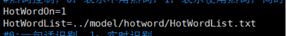
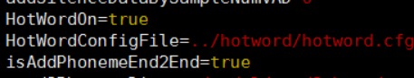

1、修改配置文件Decoder/conf/decoder.conf

```
HotWordOn=1
HotWordList 为热词列表文件路径。
```



2、修改配置文件Decoder/model/scripts/WFSTDecoder_onlyrec.cfg，下面参数设置为true

```
HotWordOn=true
isAddPhonemeEnd2End=true
```



3、热词列表HotWordList.txt编码格式必须为gbk编码

4、修改完如上配置后，重启服务。