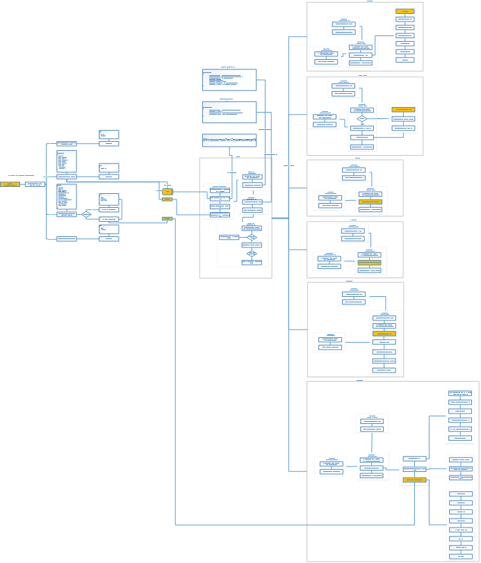
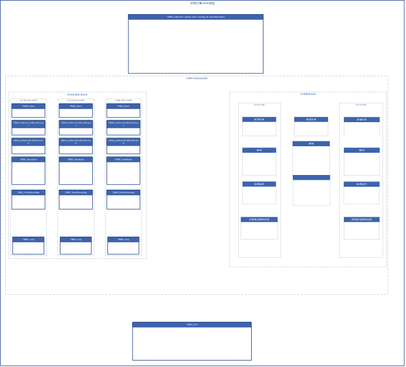
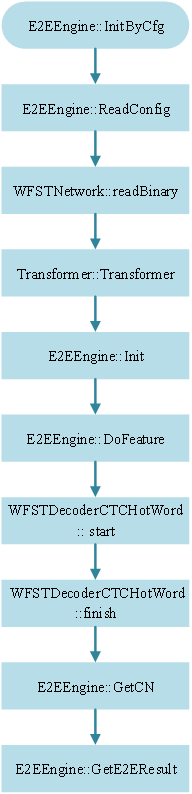

离线转写系统总控端完成的功能有：从Redis任务列表中获取任务，控制语音任务在各个引擎服务端之间按一定顺序进行处理，记录任务处理状态与结果等信息到数据库。总控端总共有“3N+2”个线程，包括：1个主函数线程，1个原始任务获取线程，3N个关于任务发送、结果获取、结果处理的线程，N表示系统中开启的引擎服务端端的个数。

原始任务获取线程主要负责从Redis任务队列中获取语音任务、插入语音任务到数据库、对原始语音进行转码、构造任务结构体TaskInfo压入第一个服务端的任务队列中。具体流程如下图所示：

图一.离线转写系统流程图

识别引擎服务通过TBNR结果调用实现，首先TBNR\_Init接口通过调用解码器完成识别模型资源的加载构建解码网络；TBNR\_Start接口开启一路语音任务处理会话；TBNR\_SetEventCallBack接口设置事件回调函数，通过事件回调函数获取引擎的工作状态，TBNR\_SetResultCallBack接口设置结果回调函数，通过结果回调函数获取识别结果；TBNR\_SendData接口接受语音数据并对语音数据进行端特征提取，端点检测；将端点检测得到的分段的特征数据压入特征任务队列中；TBNR\_StopRecording接口通知引擎送任务结束；解码线程从特征任务池中获取任务送入解码器进行解码并获取识别结果并返回；所有结果返回后返回TBNR\_EVENT\_RECOGNITION\_COMPLETE事件，告知当前会话识别完成；可以结束当前会话TBNR\_Stop。

离线识别引擎TBNR内部流程如图2所示：

解码器通过读取配置文件结果获取识别资源文件信息，对识别资源文件进行加载；通过DoFeature接口获取特征任务并进行解码，离线解码器内部工作流程图如下图所示：

