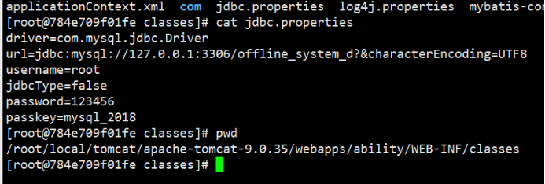
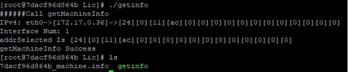
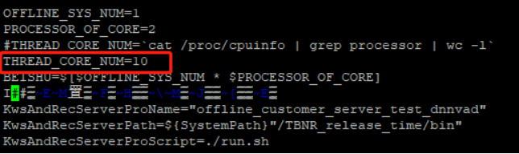
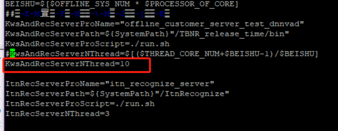
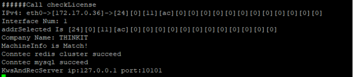
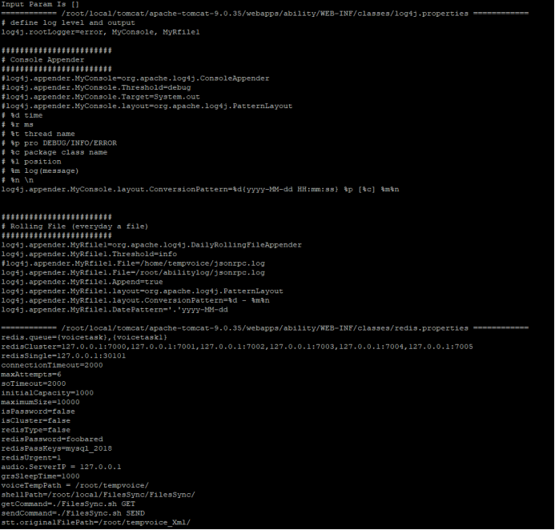
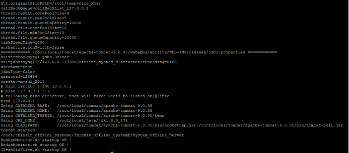

<center><font size=6 color=blue>离线语音识别引擎部署文档

# 部署包

- Thinkit\_Offline\_SystemE-e2e-v3.3.21\_20210723\_withlic\_nanwang.tar.gz

- Thinkit\_Env\_base.tar

# 解压压缩包

```shell
tar -zxvf Thinkit_Offline_SystemE-e2e-v3.3.21_20210723_withlic_nanwang.tar.gz
```

# 加载镜像

```shell
docker load -i Thinkit_Env_base.tar
```

# 运行容器

根据刚才的解压文件会有一个thinkit\_offline\_systeme文件夹

```shell
docker run -itd 
--name offline_e2e 
--restart=unless-stopped 
-p 对外映射的服务端口:20100 
-v 服务器上面存储录音的文件夹:/root/tempvoice 
-v 服务器上面存储录音的结果的文件夹:/root/tempvoice_Xml 
-v 刚才解压的thinkit_offline_systeme文件夹路径:/root/thinkit_offline_systeme 
--privileged=true 
offline_base:v1.1 
/usr/sbin/init
```


# mysql密码修改

如果有必要需要修改mysql密码，在运行容器后，mysq就已经自启了。可以用mysql命令行进行密码的修改。

在改完密码后，需要更改一下文件

```shell
cd /root/thinkit_offline_systeme/Thinkit_Offline_SystemE
cd database
```

修改mysql密码

```shell
vi db_user_passwd
```

修改PASSWORD为刚才修改的密码

然后修改tomcat配置里面mysql密码，就是下图对应的password项



# 容器启动成功后进去容器获取机器码文件

获取机器码文件的工具在容器里面的/root/thinkit\_offline\_systeme/Thinkit\_Offline\_SystemE/System\_Offline\_Server/tools/Lic

执行getinfo



里面的.info文件就是机器码文件，需要发给算法进行服务申请

# license

申请完成后会有一个license.dat文件，需要放到

/root/thinkit\_offline\_systeme/Thinkit\_Offline\_SystemE/System\_Offline\_Server/Offline\_System\_Client下面

需要根据申请license的线程数，修改/root/thinkit\_offline\_systeme/Thinkit\_Offline\_SystemE/System\_Offline\_Server/RunAndMonitor.sh

```
vi RunAndMonitor.sh
```

修改THREAD\_CORE\_NUM为对应的线程数乘2，如果没有修改这个数字，这个数字超过license所运行的线程数，就会无法启动



修改KwsAndRecServerNThread为对应的线程数



尝试执行/root/thinkit\_offline\_systeme/Thinkit\_Offline\_SystemE/System\_Offline\_Server/Offline\_System\_Client下面run.sh脚本

```shell
sh run.sh
```

如果license没有问题，就会显示这个



确认无误后，结束这个脚本

# 启动服务

```shell
cd /root/thinkit\_offline\_systeme/Thinkit\_Offline\_SystemE
./SystemStartup.sh
```





关闭服务的命令是

```shell
./SystemShutdown.sh
```


# 测试服务

1. 进入到目录/root/thinkit\_offline\_systeme/Thinkit\_Offline\_SystemE/System\_Offline\_Server/tools/SDK/Linux\_Cpp
2. 解压 tar -zxvf demo\_3.1.tar.gz
3. 进入解压后的目录 demo
4. 修改test.sh
    - ThreadNum = 1
    - voicedir=./test
    - Url=http://ip:port/ability/offlineasr
    - ip为本机ip port 为容器映射端口

5. 执行 sh test.sh
6. 在/root/tempvoice\_Xml 目录中生成xml文件 表示启动成功
