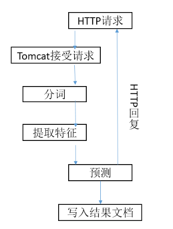
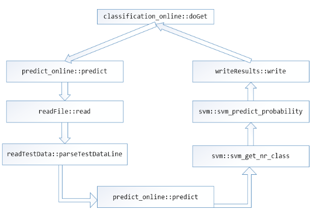
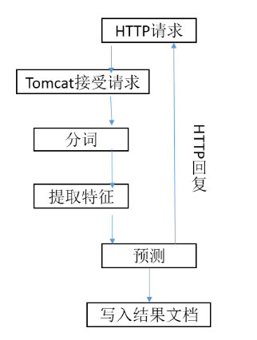
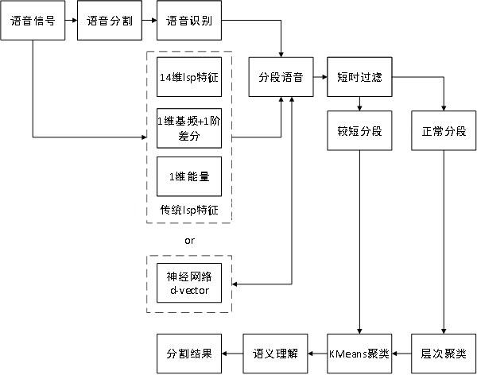
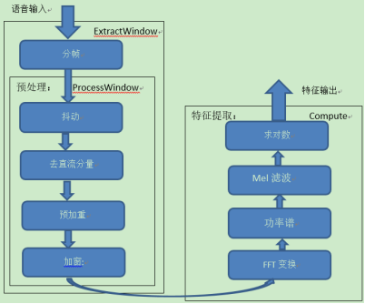
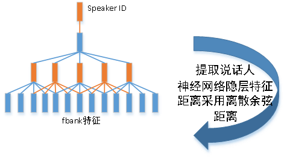
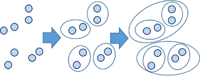
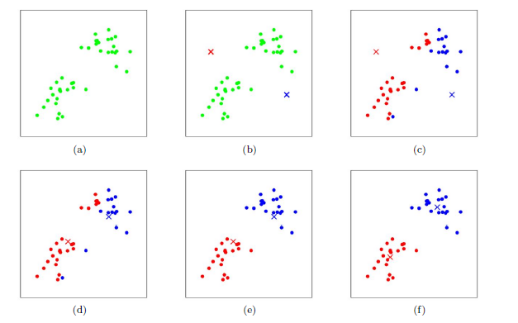

# 场景分割源码-离线

## 角色分类

### 角色分类引擎源代码清单

角色分类引擎源代码清单如下：

```
JueseClassification_online

|--src 源代码目录
| |--Server
| | |--classification_online.java 角色分类服务端代码
| |--seg
| | |--SegMent.java 调用开源分词库进行分词处理
| |--Predict
| | |--predict_online.java 对聚类后的AB进行预测
| | |--readDic.java 读取字典文件，读取坐席、客户及选取的特征参数
| | |--readFile.java 读取测试数据，text_AB_result.txt
| | |--dataClass.java 定义存放测试数据的类
| | |--readTestData.java 整理测试数据为标准的模型输入数据
| | |--writeResults.java 写结果文见，text_role_result.txt
|--ModelAndDic 存放字典和模型的目录
| |--FeatureDic.dic 字典
| |--model 模型
|--lib 用到的库目录
| |--libsvm.jar svm分类器，开源无源码
| |--ansj_seg-1.3.jar 开源中文分词工具，开源无源码
| |--tree_split-1.2.jar 开源中文分词工具，开源无源码
|--web
| |--WEB-INF
| |--web.xml web服务
```

### 角色分类引擎源代码概要设计说明

#### 概述

`简介`

角色分类程序的主要功能是将聚类的结果分词提取特征之后，通过SVM模型预测出输入文本的角色类别信息，并将预测结果写入到输出文件。

`读者对象`

本文档是对角色分类引擎的内部代码流程和相关技术点的整体说明，因此读者最好满足如下几点条件后再读此文档

1. 有一定的JAVA开发基础
2. 对语义理解和SVM算法有一定了解

`术语定义`

SVM，support vector machines：支持向量机

`参考资料`

Paper：

基于概率语义分布的短文本分类 作者：马成龙

svm：https://zhuanlan.zhihu.com/p/77750026

#### 总体设计

角色分类引擎模块流图如图所示：



<center>图2.1 角色分类引擎流程图

如上图所示，引擎采用http协议发送请求，通过角色分类模块的处理，最终以http协议返回最终结果。

#### 可靠性设计

1. 函数返回值规范，对应程**序里的**异常（如：文件打开失败等），通过函数返回值的形式逐层向上反馈，避免直接退出引擎；
2. 支持多线程异步调用，加快处理速度。

#### 扩展性设计

**支持跨平台**：目前引擎支持intel、ARM平台上的编译运行。

#### 安全性设计

引擎对各类异常进行判断，有一定的容错机制。

#### 易用性设计

引擎接口设计简洁，方便开发者快速熟悉引擎接口调用流程，快速完成接口集成；

引擎同时提供了接口测试程序，可供开发者参考。

### 标点引擎模块接口设计说明

角色分类引擎采用http协议接口形式，下面对主要接口函数进行介绍。

接口函数主要位于classification\_online.java文件中。

#### 初始化接口

**classification\_online.java**

**接口函数**：

**public void init()：**初始化函数，读取SVM模型词典和模型文件

**参数说明**：无

#### 读取特征

**private void readWordFeatureDic (String dicStr, int ValueNum)：**读取字典,生成SVM模型字典,词索引Map：wordNumMap;和词所对应特征值map：wordFeatureValueMap

**参数说明**：

- String dicStr：词典的路径
- int ValueNum：init()函数中处理得到的SVM模型表示词的方式，比如1代表布尔，2代表tf等等

#### 发送请求

**public void doGet(HttpServletRequest req, HttpServletResponse res)：**接受HTTP请求并处理

**参数说明**：

- HttpServletRequest req：HTTP请求
- HttpServletResponse res：HTTP响应

### 角色分类引擎数据结构设计

本文档主要介绍各模块调用流程及主要代码，其调用流程如图所示：



<center>图1 函数调用流程

主要接口和库函数为：Punctuation.h、libcrflearn.so、libPunctuation.so

#### 预测代码

`predict\_online.java`

**接口函数**：

```java
// 对testDataFile文件进行分类，并将结果写入resultFile中
public void predict(svm_model model, 
                    String testDataFile, 
                    Map<String, Integer> wordNumMap, 
                    Map<String, Double> wordFeatureValueMap, 
                    int valueType, 
                    String _1as, 
                    String _2as, 
                    String resultFile)：
```

**参数说明**：

- svm\_model model：分类调用的SVM模型
- String testDataFile：待分类的AB文档
- Map\<String, Integer\> wordNumMap：SVM模型字典词索引Map
- Map\<String, Double\> wordFeatureValueMap：词所对应特征值Map
- int valueType：SVM模型表示词的方式，比如1代表布尔，2代表tf等等（1:布尔;2:tf;3:idf;4:idf\_common;5:tf\*idf; 6:tf\*idf\_common;7:tfc;8:itc;9:tfidf\_1;10:tfidf\_2;）
- String \_1as： 1代表啥？客户：坐席
- String \_2as： 2代表啥？客户：坐席
- String resultFile：分类后text\_role结果文件

```java
// 私有函数，由公有函数predict调用，该函数调用SVM模型，对公有函数predict处理的数据tempMapList进行分类，tempMapList抽取测试数据中标注都为A或B的同一类别的数据，结果返回一个predictValueClass对象，该对象保存了SVM模型分类得到的值
private predictValueClass predict(List<Map.Entry<Integer, Double>> tempMapList, svm_model model)：
```

**参数说明**：

- List\<Map.Entry\<Integer, Double\>\> tempMapList：公有predict函数内部处理得到的标注为同一类别的数据
- svm\_model model：分类使用的SVM模型

#### 读取待分类文件

`readFile.java`

**接口函数**：

```java
// 该函数对分类文件进行处理得到一个dataClass对象，该对象存放了待分类数据各方面信息
public dataClass read(String fileStr)：
```

**参数说明**：

- String fileStr：待分类数据的路径

#### 存储待分类数据各方面信息

`dataClass.java`

dataClass类中数据成员如下：

- String fileName; //待分类文件路径及名称
- List\<String\> contentList = new ArrayList\<\>();//待分类文件内容，以行为单位（除了包含文件路径及名称的第一行）
- String AStr; //待分类文件中标注为A的语音识别内容
- String BStr; //待分类文件中标注为B的语音识别内容
- String A; //标注标签A代表啥？客户：坐席
- String B; //标注标签B代表啥？客户：坐席

dataClass类中函数成员如下：

- public void setFileName(String \_fileName)
- public String getFileName()
- public void setContentList(List\<String\> \_contentList)
- public List\<String\> getContentList()
- public void setAStr(String \_AStr)
- public String getAStr()
- public void setBStr(String \_BStr)
- public String getBStr()
- public void setA(String \_A)
- public String getA()
- public void setB(String \_B)
- public String getB()

#### 读字典文件

`readDic.java`

readDic类的数据成员如下：

- String \_1as： 1代表啥？客户：坐席
- String \_2as： 2代表啥？客户：坐席
- String featureNum：SVM模型表示词的方式，比如1代表布尔，2代表tf等等（1:布尔;2:tf;3:idf;4:idf\_common;5:tf\*idf; 6:tf\*idf\_common;7:tfc;8:itc;9:tfidf\_1;10:tfidf\_2;）

readDic类的函数成员如下：

- public String get\_1as()
- public String get\_2as()
- public String getfeatureNum()
- public void readDic(String dicPath)：读取字典，然后给该类的三个数据成员赋值

**参数说明**：

- String dicPath：字典路径

#### 对待分类的数据每行进行解析

`readTestData.java:` 对待分类数据每行进行解析，得到一个map（存储该行数据中的词和特征值）

**接口函数：**

```java
// 解析待处理文件中每行数据，每个词对应结果map中键，键对应的值为该词的特征值
public List<Map.Entry<Integer, Double>> parseTestDataLine(
    String testDataLine, 
    String wordToken,
    Map<String, Integer> wordNumMap, 
    Map<String, Double> wordFeatureValueMap, 
    int valueType)：
```

**参数说明**：

- String testDataLine：待分类文件的一条语音识别结果
- String wordToken：取值有三种，分别是 “1”代表字特征，“2”代表字+词特征，“3”代表词特征
- Map\<String, Integer\> wordNumMap：SVM模型字典词索引Map
- Map\<String, Double\> wordFeatureValueMap：词所对应特征值Map
- int valueType：SVM模型表示词的方式，比如1代表布尔，2代表tf等等（1:布尔;2:tf;3:idf;4:idf\_common;5:tf\*idf; 6:tf\*idf\_common;7:tfc;8:itc;9:tfidf\_1;10:tfidf\_2;）

角色分类服务用的是8所对应的特征值，该特征计算方法说明如下：

首先了解两个概念：

- tf：term-frequency，词频，指某一个给定的词语在该文件中出现的频率
- idf：inverse document frequency，逆文档频率，指该文档包含某个词条，但在其他文档中该词条却不存在，即包含该词条的文档数很少
- tf-idf(term-frequency, inverse document frequency)是一个用来表示文档中词的重要性的权值，主要思想是：如果某个词或短语在一篇文章中出现的频率TF高，并且在其他文章中很少出现，则认为此词或者短语具有很好的类别区分能力，适合用来分类。
- 8：itc所对应的特征值计算方法，就是先算每个词的tf-idf，然后计算全部的tf-idf的平方和，开方后再对每个tf-idf做归一化，是一种归一化的计算方法，目的是降低数据尺度，提高分类准确率。

#### 将分类结果写入结果文件

`writeResults.java`

**接口函数**：

```java
// 将分类结果写入结果文件
public void write(dataClass dc, String resultPath)：
```

**参数说明**：

- dataClass dc：存储待分类文件的dataClass对象dc
- String resultPath；结果文件的路径

#### 分词工具

`SegMent.java`

**接口函数**：

```java
// 该函数对输入字符串strIn进行分词，如果分词结果包含在SVM的字典中就将该分词结果添加到结果集合中
public List<String\> SegMentSentenceWithWordMapReturnList(String strIn, 
                                                          Map<String, Integer> wordNumMap)：
```

**参数说明**：

- String strIn：待解析的一条语音识别文本
- Map\<String, Integer\> wordNumMap：SVM模型字典词索引Map

### 聚类引擎开发测试环境

#### 硬件要求

Intel(R) Xeon(R) CPU，内存64G。

#### 软件要求

1. 编译器要求：

安装1.7版本或者以上的JDK；安装7.0.70或以上版本的tomcat

2. 第三方依赖库

依赖ansj\_seg-1.3.jar、libsvm.jar和tree\_split-1.2.jar，对应的jar包位于\\WEB-INF\\lib下。

#### 整体框架



<center>图1 系统流程图

#### 测试运行

将解压后的war包放到tomcat目录下，启动服务，发送http请求进行测试：

http://192.168.14.200:8080/JueseClassification\_online/parser?line=/home/xiaosujie/suning/roleClassifyTest/Test/0825246\_text\_AB\_result.txt\&out=/home/xiaosujie/suning/roleClassifyTest/Test/0825246\_text\_role\_result.txt

line指定输入文件

out指定输出文件

## 说话人聚类

### 聚类引擎源代码清单

聚类源代码清单如下：

```
speakerCluster/

├── Lib
│   ├── ClusteringDemo 编译生成的可执行文件
│   ├── ipp 环境依赖的ipp库
│   ├── libClustering.so 编译生成的库文件
│   └── wan 编译生成的工具类库文件
├── makefile 编译的总的makefile文件
├── speakerCluster
│   ├── include
│   │   ├── cluster_api.h 聚类接口头文件
│   │   ├── cluster_common.h
│   │   ├── cluster_distance.h 聚类相似度距离计算头文件
│   │   ├── cluster_feature.h 聚类特征提取头文件
│   │   ├── cluster.h 核心聚类头文件
│   │   ├── cluster_seg.h
│   │   ├── libClustering.h 聚类库接口头文件
│   │   ├── matrix_def.h
│   │   ├── matrix_functions.h
│   │   ├── pitchTrack.h
│   │   └── rsrfft.h
│   ├── makefile
│   └── src
│   ├── cluster_api.cc
│   ├── cluster.cc
│   ├── cluster_common.cc
│   ├── cluster.d
│   ├── cluster_distance.cc
│   ├── cluster_feature.cc
│   ├── CreateFeature fbank特征提取模块
│   ├── dvector d-vector特征提取模块
│   ├── libClustering.cc
│   ├── matrix_def.cc
│   ├── matrix_functions.cc
│   ├── pitchTrack.cc
│   ├── rsrfft.cc
│   └── rsrfft.h
├── speakerClusterDemo 测试程序
│   ├── include
│   ├── makefile
│   └── src
│   └── main.cc 测试程序入口函数
├── wanac
├── wancore
├── wanio
└── wans
```

### 聚类引擎源代码概要设计说明

#### 概述

##### 简介

###### 引擎功能介绍

离线客服聚类引擎主要应用于智能客服领域，处理单声道语音，通过聚类算法，标记出同一个说话人的语音分段，通过语义理解，判断说话人所属类别，便于上层业务层进行质检分析。

适用场景及性能：

1. 适用于单声道、两个人通话的客服语音
2. 目前正常实网客服场景分割性能达到85%-90%左右

###### 引擎输入介绍

1. 资源文件，包括：

   - 配置文件configure.cfg
   - d-vector模型及相关特征提取配置文件Decode.cfg、feat.cfg
2. 语音数据及识别结果\_sent.txt文件
3. 编码格式要求：8k\_16bit\_pcm。
4. 引擎的输入为语音及对应的识别结果\_sent.txt文件。

###### 引擎输出介绍

语音目录下会输出\_1.txt、\_2.txt及\_ABC.txt，分别为第一个人对应的分段语音、第二个人对应的分段语音以及最后的综合的聚类结果。

##### 读者对象

本文档是对聚类引擎的代码流程和相关技术点的整体说明，因此读者最好满足以下几个条件：

1. 有一定的C和C++语言基础；
2. 了解相关聚类算法。

##### 术语定义

AHC，Agglomerative Hierarchical Cluster，凝聚层次聚类

K-means，K均值聚类

Spectral Cluster，谱聚类

##### 参考资料

Paper：Deep Speaker Feature Learning for Text-independent Speaker Verification

#### 总体设计

聚类引擎的基本框架图如下：



<center>图2.1 聚类引擎基本架构图

语音数据首先经过语音识别后，被切分为分段语音，传统方法采用LSP特征，计算GLR距离，采用层次聚类和K-means方法进行聚类，得到相应的聚类簇；随着深度学习的发展，开始采用神经网络特征向量d-vector来表征说话人特征，并引入谱聚类算法对聚类结果进行修正，提升聚类正确性。

目前引擎采用神经网络d-vector特征，主要模块包括：

**特征提取**：

1. 提取60维fbank特征
2. 将60维fbank特征输入到神经网络，神经网络采用TDNN网络结构，提取隐层特征作为说话人特征向量，即d-vector

**距离公式**：

1. 神经网络d-vector 采用cosine离散余弦公式，计算分段之间的相似度

**聚类模块**：

1. 首先采用层次聚类算法确定聚类中心
2. 利用K-means算法对聚类中心进行修正
3. 在采用神经网络d-vector特征时，我们还引入了谱聚类算法，可一定程度上提高聚类算法的准确性。

#### 可靠性设计

1. 函数返回值规范，对应程序里的异常（如：文件打开失败、内存分配、释放异常等），通过函数返回值的形式逐层向上反馈，避免直接退出引擎；
2. 支持多线程异步调用，加快处理速度。

#### 扩展性设计

##### 支持跨平台

目前引擎支持intel、ARM平台上的编译运行。

##### 支持SSE、neon指令加速

SSE指令加速：X86架构CPU特有的，通过宏定义“USEIPPFUNCTION”开启。

NEON: ARM架构CPU特有， 通过宏定义“USE\_NEON”开启。

#### 安全性设计

引擎对各类异常进行判断，如语音格式、语音长短等，保证程序正常运行。

#### 易用性设计

引擎接口设计简洁，方便开发者快速熟悉引擎接口调用流程，快速完成接口集成；

引擎同时提供了接口测试程序，可供开发者参考。

### 聚类引擎模块接口设计说明

本文档主要对聚类引擎接口进行详细说明。

#### 初始化接口 InitClustering

**接口声明：**

```
LIBCLUSTERING_API int InitClustering( const char* kpcConfigFile = "clustering.cfg" );
```

**功能：**

初始化引擎，加载资源文件。

**形参：**

kpcConfigFile:聚类的配置文件，如configure.cfg。

**返回值：**

- 非0: 处理失败。
- 0：正常。

#### 聚类接口 ClusteringBuf

**接口声明：**

```c++
LIBCLUSTERING_API int ClusteringBuf(const char* kpcWavFile, const char* outDir, const short* wavBuf, const int wavBufLen, const int iSamplingRate, const char* sentTimeStr, const char* sentWordStr, SpkTimeInfo** spkTimeInformation, bool kbOutputTxt = false, bool kbOutputWav = false);
```

**功能：**

聚类接口函数。

**形参：**

- kpcWavFile 文件名
- outDir 聚类结果文件输出目录，分布式接口会用到
- wavBuf 语音流
- wavBufLen 语音流长度
- iSamplingRate 采样率
- sentTimeStr sent识别结果分词时间字符串
- sentWordStr sent识别结果分词字符串
- spkTimeInformation 说话人聚类结果
- kbOutputTxt 是否输出聚类结果文件
- kbOutputWav 是否输出聚类后的对应某一个说话人的语音文件

**返回值：**

- 非0: 处理失败。
- 0：正常。

#### 退出 ExitClustering

**接口声明：**

```c++
LIBCLUSTERING_API int ExitClustering();
```

**功能：**

聚类引擎结束，退出。

### 聚类引擎数据结构设计

本文档主要对聚类引擎使用的算法及主要函数进行详细说明。

#### 特征提取功能开发

##### fbank特征提取

fbank特征提取模块代码主要位于CreateFeature目录，特征维度60，其特征提取流程如下图所示：

**主要代码**：CreateFeature

**主要流程**：

1. 预加重，目的是提升高频部分，使信号变得平坦，保持在低频到高频的整个频带中，能用同样的信噪比求频谱，并消除发声过程中的声带和嘴唇效应，突出高频的共振峰；
2. 分帧，由于语音具有短时平稳特征，需将语音分成一个个小段，每一小段为一帧，帧长一般为25ms，相邻帧的重叠为10ms。
3. 加窗，一般为方窗、汉明窗、汉宁窗等，目的是消除相邻帧两端可能造成的不连续性。
4. 快速傅里叶变换FFT，将语音信号转换到频域，分析语音信号在频域的特性。
5. 梅尔滤波器组，人耳对不同频率的敏感程度不同，且成非线性关系，因此我们将频谱按人耳敏感程度分为多个Mel滤波器组；在Mel刻度范围内，各个滤波器的中心频率是相等间隔的线性分布，但在频率范围不是相等间隔的，将能量谱通过一组Mel尺度的三角形滤波器组过滤后获得一个与滤波器个数相等的维数的特征。



<center>图1.1 fbank特征提取流程图

##### 神经网络说话人特征d-vector

利用神经网络说话人模型，提取隐层特征d-vector，模型输入采用60维fbank特征，利用2000+人，每个人2min以上的数据进行训练，得到说话人模型。



<center>图1.2 TDNN网络提取隐层d-vector特征

**主要代码**： dvector目录下所有代码

模块接口函数说明：

```c++
int process(short *Feature_in, int FrameNum, float **dnnResult, int &dnnResultRow, int &dnnResultCol);
```

**输入**：

- Feature\_in 输入的语音数据
- FrameNum 语音帧数

**输出**：

- dnnResult 提取的d-vector特征
- dnnResultRow 提取的特征行数
- dnnResultCol 提取的特征列数

#### 聚类模块

聚类模块主要采用层次聚类和k-means及谱聚类算法，用到的距离公式为离散余弦距离，其计算公式如下：

$$
\cos\left( \theta \right) = \frac{\sum_{i = 1}^{n}{(x_{i} \ast y_{i})}}{\sqrt{\sum_{i = 1}^{n}{x_{i}}^{2}} \ast \sqrt{\sum_{i = 1}^{n}{y_{i}}^{2}}}

$$

X和Y分别为音频特征向量，值越大，相似度越高。

下面将对聚类模块进行详细介绍。

##### 层次聚类

层次聚类的合并算法通过计算两类数据点间的相似度，对所有数据点中最为相似的两个数据点进行合并，并反复迭代这一过程。简单的说层次聚类的合并算法是通过计算每一个类别的数据点与所有数据点之间的距离来确定它们之间的相似性，距离越小，相似度越高。并将距离最近的两个数据点或类别进行组合，生成聚类树。

凝聚层次聚类流程如下图所示：



<center>图2.1 凝聚层次聚类(AHC)流程图

**层次聚类主要代码**：cluster.cc

**主要函数**：void HCClustering() 层次聚类函数入口

##### K-means

K-means聚类在层次聚类之后，通过层次聚类确定中心点，对聚类中心进行修正。采用聚类中心作为初始聚类中心点的原因，是因为K-means方法对聚类中心的选取比较敏感，通过层次聚类可以得到相对比较准确的聚类中心。

K-means流程如下：

1. 计算每个分段到聚类中心的距离，将该分段标记为对应类别；
2. 计算完所有分段后，利用对应类别的特征向量更新聚类中心，即重新确定聚类中心点；
3. 重复1）、2）步骤，直到K-means聚类迭代次数完毕。



<center>图2.2 K-means聚类中心点更新过程

K-means主要代码：cluster.cc

**主要函数**：

```c++
void WCluster::KMeanClustering(int iItTimes)
```

**函数功能**：K-means聚类迭代更新

**参数说明**：

- iItTimes：K-means聚类迭代更新的次数

```c++
void WCluster::KMeanClustering(int iStart, int iEnd)
```

**函数功能**：K-means聚类，更新聚类中心

**参数说明**：

- iStart：分段起始id
- iEnd：分段结束id

##### 谱聚类

谱聚类（Spectral Cluster），这里的谱指的某个矩阵的特征值。谱聚类的思想来源于图论，它把聚类的数据集中的每一个样本看做是图中的一个顶点，这些顶点连接在一起，连接的这些边上有权重，权重的大小表示这些样本之间的相似度。同一类的顶点他们的相似度很高，在图论中体现为同一类的顶点中连接他们的边的权重很大，不在同一类的顶点连接他们的边的权重很小。因此，谱聚类的最终目标就是找到一种切割图的方法，使得切割之后的各个子图内的权重很大，子图间的权重很小。

谱聚类流程：

1. 构建图的拉普拉斯矩阵，这里主要由每个分段直接的离线余弦距离组成，并进行对称化和Diffusion操作：

Diffusion(X)=XX^T

该操作主要让不同说话人直接的边界更加清晰。

2. 对矩阵进行分解，计算矩阵的特征值和特征向量；
3. 取特征值最大的N个特征向量，将说话人特征映射为N维特征；
4. 利用得到的新特征做K-means，进一步提高聚类准确性。

主要代码：cluster.cc 谱聚类主要操作位于该文件中。

#### 数据结构说明

##### 聚类结果

聚类结果以链表形式返回，数据结构说明如下：

```c++
typedef struct _SpkTimeInfo

{
//char* timeInfo;
int startTime;
int endTime;
char spkTypeABC;

struct _SpkTimeInfo* next;
}SpkTimeInfo;
```

**说明**：

typedef struct \_SpkTimeInfo 定义结构体

**结构体成员**：

- startTime 分段起始时间
- endTime 分段结束时间
- spkTypeABC 分段所属聚类类别
- struct \_SpkTimeInfo \* next 指向下一个链表指针

### 聚类引擎开发测试环境

#### 硬件要求

Intel(R) Xeon(R) CPU，内存64G。

#### 软件要求

操作系统建议安装CentOS 7.x，gcc/g++ 4.8及以上。

#### 测试运行

测试程序位于该路径下：

```
speakerCluster/Env/linux
|--cluster_demo 测试程序
|--libClustering.so 聚类库
|--configure.cfg 配置文件
|--Decode.cfg 模型前向计算配置
|--feat.cfg 特征提取配置
|--spk_role_role1_role2_2390_63_60.bin d-vector特征提取模型文件
|--Relyon_so 依赖的库文件
```

**测试方法**：

**数据**：语音及对应的识别结果\_sent.txt文件

```shell
./run.sh 1 wav.list configure.cfg
```

- 参数1：线程数
- 参数2：语音列表
- 参数3：配置文件

#### 配置参数说明

##### 4.1 配置参数说明

###### hybrid configure.cfg

```shell
<ClusterCfg\>

#聚类目标人数
iDstClusterNum=2
iSingleMinTimeSec=0.1
iSingleOutTimeSec=10800

#聚类所使用的距离公式
ClusterDisType=GLR2
TimeSegMode=ORIGINAL

#KMeans聚类的次数
iKMeansTimes=10

#以下两个参数为特征提取的帧长和帧移
iFeatFramePeriodMSec=40
iFeatFrameStepPeriodMSec=20

#根据分词时间进行二次分段，分词间隔大于0.01s时进行二次切分
fCombinedTimeMSec=0.01
save_blank=false
BreakPointDetect=false
WriteBreakPointLog=false
logTxt=log.txt
bpRuleCfg=bp_rule.cfg

#是否开启高通滤波
HighPassPro=true
FC=26
dBGain=65
fClusBicAlpha=0.5

#短时过滤阈值，单位ms
shortTimeThreshold=600

#基频阈值
pitchThreshold=110

#能量阈值
energyThreshold=25

#该值为true时，上面两个参数才起作用，低于这些阈值的单独做KMeans
shortTimeFilterByKmeans=false

#特征是否使用基频特征
pitchFeatureEnable=true

#特征是否使用基频一阶差分特征
pitchFeature1OrderEnable=true

#特征是否使用能量特征
energyFeatureEnable=true

#电信系统前导音不参与聚类，add by xiaosujie
LeadingVoiceFilter=false

#前导音一般出现在开始处，如果开始的前几行不包含则不再继续判断，该参数可跟据sent文件配置
sentLineNum=5
LeadingVoiceSentence1=为-您-服务
LeadingVoiceSentence2=话-务-员,客服代表,客户-代表,号,为-您-服务

#ClusteringBuf模式时， shell 为离线客服shell接口，结果输出到语音目录下， distribute 苏宁分布式接口，输出到指定目录下
Mode=shell

<License>
iLicense=license.dat
```

###### e2e configure.cfg

```shell
<ClusterCfg>

#聚类目标人数
iDstClusterNum=2
iSingleMinTimeSec=0.1
iSingleOutTimeSec=10800

#聚类所使用的距离公式

#COSINE/EUC/GLR2
ClusterDisType=COSINE
TimeSegMode=ORIGINAL

#KMeans聚类的次数
iKMeansTimes=10

#以下两个参数e2e版本不起作用
iFeatFramePeriodMSec=40
iFeatFrameStepPeriodMSec=20

#根据分词时间进行二次分段，分词间隔大于0.5s时进行二次切分

#fCombinedTimeMSec=0.01

fCombinedTimeMSec=0.5
save_blank=false
BreakPointDetect=false
WriteBreakPointLog=false
logTxt=log.txt
bpRuleCfg=bp_rule.cfg
HighPassPro=false
FC=26
dBGain=65
fClusBicAlpha=0.5

#短时过滤阈值，单位ms

#short time filter ms
shortTimeThreshold=2500
#shortTimeThreshold=0
pitchThreshold=110
energyThreshold=30
shortTimeFilterByKmeans=false
pitchFeatureEnable=false
pitchFeature1OrderEnable=false
energyFeatureEnable=false

#是否做谱聚类以及谱聚类特征维度，可根据实际测试集进行调整
isDoSpectral=false
spectralClusteringDim=8

#e2e跳变点检测

#跳变点检测的窗长，单位帧，即窗长1s
winFrame=100

#跳变点检测的窗移
stepFrame=10

#skipFrame参数要同前向计算的跳帧参数同，见Decode.cfg
skipFrame=2

#相似度小于该值时，则为跳变点
consineThreshold=0.95

#ClusteringBuf模式时， shell 为离线客服shell接口，结果输出到语音目录下， distribute 苏宁分布式接口，输出到指定目录下
Mode=shell

#电信系统前导音不参与聚类，add by xiaosujie
LeadingVoiceFilter=false

#前导音一般出现在开始处，如果开始的前几行不包含则不再继续判断，该参数可跟据sent文件配置
sentLineNum=5
LeadingVoiceSentence1=为-您-服务
LeadingVoiceSentence2=话-务-员,客服代表,客户-代表,号,为-您-服务

<License>
iLicense=license.dat
```
