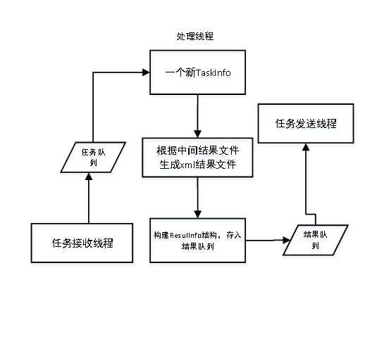
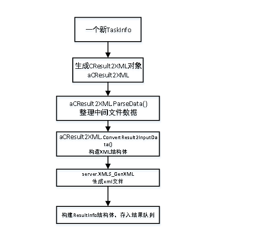
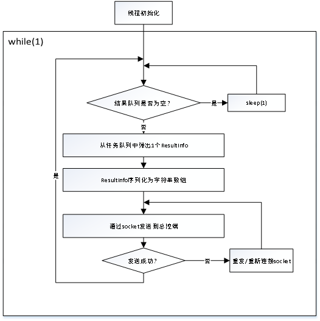
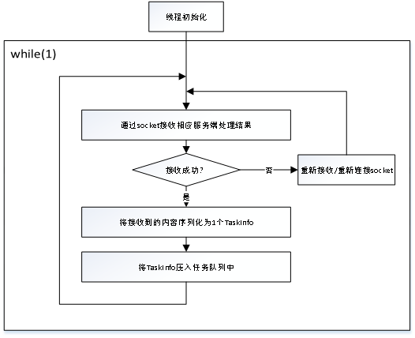
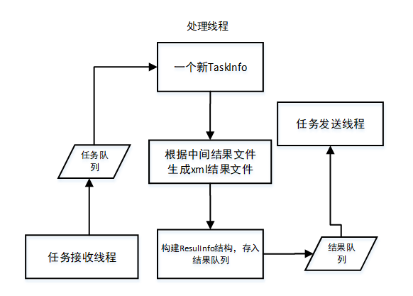
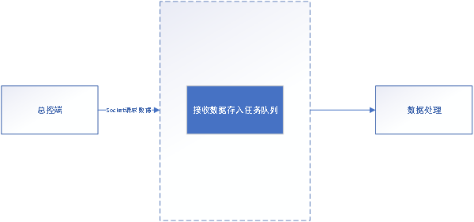
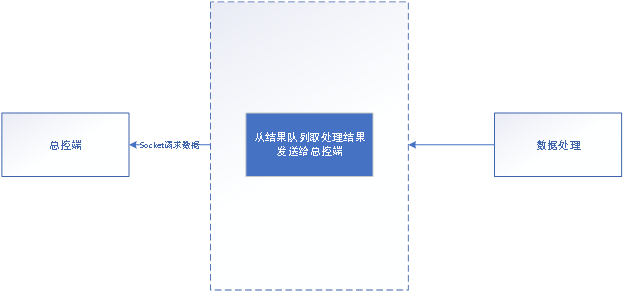
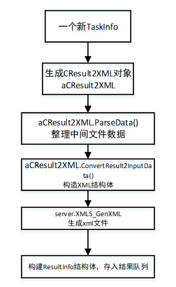

# 离线转写结果融合

## 离线识别引擎XML源代码清单

### 概述

#### 编写目的

文档编写目的是为代码维护者能清楚了解代码模块的具体功能及分布位置，本文档的读者对象为开发人员和测试人员。

  - 为开发人员提供依据；

  - 为代码修改、维护提供条件；

### 运行环境

#### 软件环境

|   分类   | 名称   | 版本    |
| :------: | ------ | ------- |
| 操作系统 | Centos | 7.0以上 |
|  数据库  | Redis  | 3.2.0   |
|          | Mysql  | 5.7.6   |
| 能力接口 | Tomcat | 9.0.35  |

#### 硬件环境

|   服务器    |              最低配置              |              推荐配置               |
| :---------: | :--------------------------------: | :---------------------------------: |
| redis服务器 |       CPU：1<br/>内存：256M        |         CPU：1<br/>内存：1G         |
| 识别服务器  | CPU：4<br/>内存：10G<br/>磁盘：20G | CPU：10<br/>内存：15G<br/>磁盘：30G |


### 源代码清单

#### 代码清单

|        程序名         | 程序路径                                              |
| :-------------------: | ----------------------------------------------------- |
|       common.h        | Thinkit\_Offline\_SystemD\_Src/XMLServerSrc           |
|  configure\_xml.cfg   | Thinkit\_Offline\_SystemD\_Src/XMLServerSrc           |
|     CPPSocket.cpp     | Thinkit\_Offline\_SystemD\_Src/XMLServerSrc           |
|      CPPSocket.h      | Thinkit\_Offline\_SystemD\_Src/XMLServerSrc           |
|   CPPTcpSocket.cpp    | Thinkit\_Offline\_SystemD\_Src/XMLServerSrc           |
|    CPPTcpSocket.h     | Thinkit\_Offline\_SystemD\_Src/XMLServerSrc           |
|    KeyWord\_GBK.h     | Thinkit\_Offline\_SystemD\_Src/XMLServerSrc           |
|      keyword.txt      | Thinkit\_Offline\_SystemD\_Src/XMLServerSrc           |
|       main.cpp        | Thinkit\_Offline\_SystemD\_Src/XMLServerSrc           |
|       makefile        | Thinkit\_Offline\_SystemD\_Src/XMLServerSrc           |
|     MsgInfo.pb.cc     | Thinkit\_Offline\_SystemD\_Src/XMLServerSrc           |
|     MsgInfo.pb.h      | Thinkit\_Offline\_SystemD\_Src/XMLServerSrc           |
|      porting.cpp      | Thinkit\_Offline\_SystemD\_Src/XMLServerSrc           |
|       porting.h       | Thinkit\_Offline\_SystemD\_Src/XMLServerSrc           |
| punctuation\_rule.cfg | Thinkit\_Offline\_SystemD\_Src/XMLServerSrc           |
|    Result2XML.cpp     | Thinkit\_Offline\_SystemD\_Src/XMLServerSrc           |
|     Result2XML.h      | Thinkit\_Offline\_SystemD\_Src/XMLServerSrc           |
|   ResultParser.cpp    | Thinkit\_Offline\_SystemD\_Src/XMLServerSrc           |
|    ResultParser.h     | Thinkit\_Offline\_SystemD\_Src/XMLServerSrc           |
|   socketHandle.cpp    | Thinkit\_Offline\_SystemD\_Src/XMLServerSrc           |
|    socketHandle.h     | Thinkit\_Offline\_SystemD\_Src/XMLServerSrc           |
|       tools.cpp       | Thinkit\_Offline\_SystemD\_Src/XMLServerSrc           |
|        tools.h        | Thinkit\_Offline\_SystemD\_Src/XMLServerSrc           |
|   XMLPraseData.hpp    | Thinkit\_Offline\_SystemD\_Src/XMLServerSrc           |
|     XMLServer.cpp     | Thinkit\_Offline\_SystemD\_Src/XMLServerSrc           |
|     XMLServer.hpp     | Thinkit\_Offline\_SystemD\_Src/XMLServerSrc           |
|    libprotobuf.so     | Thinkit\_Offline\_SystemD\_Src/XMLServerSrc/lib       |
|       Makefile        | Thinkit\_Offline\_SystemD\_Src/XMLServerSrc/MoreTools |
|    more\_buffer.h     | Thinkit\_Offline\_SystemD\_Src/XMLServerSrc/MoreTools |
|   more\_config.cpp    | Thinkit\_Offline\_SystemD\_Src/XMLServerSrc/MoreTools |
|    more\_config.h     | Thinkit\_Offline\_SystemD\_Src/XMLServerSrc/MoreTools |
|     more\_log.cpp     | Thinkit\_Offline\_SystemD\_Src/XMLServerSrc/MoreTools |
|      more\_log.h      | Thinkit\_Offline\_SystemD\_Src/XMLServerSrc/MoreTools |
|   more\_thread.cpp    | Thinkit\_Offline\_SystemD\_Src/XMLServerSrc/MoreTools |
|    more\_thread.h     | Thinkit\_Offline\_SystemD\_Src/XMLServerSrc/MoreTools |
|   more\_wavfile.cpp   | Thinkit\_Offline\_SystemD\_Src/XMLServerSrc/MoreTools |
|    more\_wavfile.h    | Thinkit\_Offline\_SystemD\_Src/XMLServerSrc/MoreTools |

## 离线识别引擎XML概要设计说明

### 概述

#### 简介

XML服务端主要功能，基于之前的识别、场景分割、叠音服务端、ITN、标点服务端产生的中间结果文件进行整合处理，并进行静音检测、叠音角色判断、语速计算、能量计算、语速计算、关键字检索等功能，最终生成可被查询、检索、分析结构化的xml文件。

#### 读者对象

本文档的读者对象为离线识别系统的开发人员、测试人员、系统维护人员及接入识别系统的第三方业务人员，通过本文档能够从总体上了解识别系统的架构形式及数据流向。

本说明给出离线识别系统的设计说明，包括最终实现的系统必须满足的功能、性能、接口、附属测试工具程序及设计约束等。

目的在于：

  - 为开发人员提供依据；

  - 为代码修改、维护提供条件；

#### 术语定义

语音识别（Automatic Speech Recognition），简称（ASR）。

### 总体设计

#### 总体需求

功能需求：根据各模块中间文件组装xml文件；

性能需求：组装xml内容不崩溃；

接口需求：接口参数简单明了，接口中的每个参数都要有实际意义，保证接口调用流程清晰。

系统验证工具：提供系统完整性，功能正确性的验证工具；

#### 运行环境

##### 软件环境

|   分类   | 名称   | 版本    |
| :------: | ------ | ------- |
| 操作系统 | Centos | 7.0以上 |
|  数据库  | Redis  | 3.2.0   |
| 能力接口 | Tomcat | 9.0.35  |

##### 硬件环境

|   服务器    |              最低配置              |              推荐配置               |
| :---------: | :--------------------------------: | :---------------------------------: |
| redis服务器 |       CPU：1<br/>内存：256M        |         CPU：1<br/>内存：1G         |
| 识别服务器  | CPU：4<br/>内存：10G<br/>磁盘：20G | CPU：10<br/>内存：15G<br/>磁盘：30G |


#### 系统总体结构设计

Xml部分主要包括一个任务接收线程，一个结果发送线程，一个任务处理线程组成。



- 任务接收线程：完成接收总控端发送的任务，存入任务队列。

- 任务处理线程：从任务队列中取出待处理任务，经过生成CResult2XML对象、中间文件数据整理、构造XML相关结构体、生成xml文件。处理结果存入结果队列。

- 任务发送线程:从结果队列中取已经处理完的任务，发送到总控端。

### 模块设计

#### 任务处理



##### 构造CResult2XML对象

CResult2XML构造函数完成成员变量赋值。

```c++
CResult2XML::CResult2XML(TaskInfo* pTaskInfo, Result2XMLPara* pStResult2XMLPara, StPunctuationRule* pStPunctuationRule)

{

string audioName =pTaskInfo->audioname();
string audioUrl =pTaskInfo->audiourl();
string resultfilePath =pTaskInfo->resultfilepath();
string XMLfilePath =pTaskInfo->xmlfilepath();
channels = pTaskInfo->channels();

LOG_PRINT_INFO("audioName: %s",audioName.c_str());
LOG_PRINT_INFO("audioUrl: %s",audioUrl.c_str());
LOG_PRINT_INFO("resultfilePath: %s",resultfilePath.c_str());
LOG_PRINT_INFO("XMLfilePath: %s",XMLfilePath.c_str());

string tempName = audioName;
size_t dotpos = tempName.rfind(".");
string basename = tempName.substr(0,dotpos);
wavFullName = audioUrl+"/"+audioName;
sentFile = resultfilePath+"/"+basename+"_sent.txt";
sentBakFile = resultfilePath+"/"+basename+"_sent_bak.txt";
roleResultFile = resultfilePath+"/"+basename+"_text_role_result.txt";
interResultFile = resultfilePath+"/"+basename+"_inter_result.txt";
emotionResultFile= resultfilePath+"/"+basename+"_emotion_result.txt";
itnFile = resultfilePath+"/"+basename+"_itn.txt";
puncFile = resultfilePath+"/"+basename+"_punc.txt";
emotionResultItnPuncFile=resultfilePath+"/"+basename+"_emotionItnPunc_result.txt";
sentResultItnPuncFile=resultfilePath+"/"+basename+"_sentItnPunc_result.txt";
gidResultFile = resultfilePath+"/"+basename+"_gender_result.txt";
gidResult1 = resultfilePath+"/"+basename+"_1.txt";
gidResult2 = resultfilePath+"/"+basename+"_2.txt";
XMLfile = XMLfilePath+"/"+basename+".xml";
pResult2XMLPara = pStResult2XMLPara;
pPunctuationRule = pStPunctuationRule;

}
```


##### 中间结果文件整理

中间结果数据整理包括整合sent、int、pun文件到\_sentItnPunc\_result.txt，整合role、int、pun文件到\_emotionItnPunc\_result.txt，解析\_emotionItnPunc\_result.txt文件，分句能量计算，解析\_sentItnPunc\_result.txt，角色重确认（双声道语音），解析叠音文件，静音计算：


<center>整理中间结果文件流程图

主要函数设计

**函数原型**：

```c++
int Integrate_File(const char* itnFile,const char* puncFile,const char* emotionResultFile, const char* emotionResultItnPuncFile, const char* sentResultItnPuncFile);
```

**参数说明**：

- const char\* itnFile 阿拉伯中间文件
- const char\* puncFile 标点中间文件
- const char\* emotionResultFile 角色中间文件
- const char\* emotionResultItnPuncFile 输出整合itn，标点后的角色文件
- const char\* sentResultItnPuncFile 输出整合itn，标点后的sent文件

**返回值**：

- int 类型，0：成功，\<0：失败。

**功能**：

- 整合标点、数字到新的sent、role文件。

**函数原型**：

```c++
int int Parser_Emotion(const char* szFile, vector<StSentenceItem>& vecStSentence); //解析场景分割结果;
```

**参数说明**：

- const char\* szFile 场景分割中间结果文件

- vector\<StSentenceItem\>& vecStSentence 全局结果结构体

**返回值**：

- int 类型，0：成功，\<0：失败。

**功能**：解析场景分割文件。

**函数原型**：

```c++
int CalcEnergy(const char* szFile, vector<StSentenceItem>& vecStSentence,int& nDuration); //计算能量;
```

**参数说明**：

- const char\* szFile 语音文件名

- vector\<StSentenceItem\>& vecStSentence 全局结果结构体

- int& nDuration 语音时长

**返回值**：

- int 类型，0：成功，\<0：失败。

**功能**：

计算每个分局的能量到vecStSentence全局结构体中。

**函数原型**：

```c++
int Parser_Sent(const char* szFile, vector<StSentenceItem>& vecStSentence); //解析识别结果;
```

**参数说明**：

- const char\* szFile sent文件名

- vector\<StSentenceItem\>& vecStSentence 全局结果结构体

**返回值**：

- int 类型，0：成功，\<0：失败。

**功能**：

解析sent中间结果到vecStSentence全局结构体中。

**函数原型**：

```c++
int Reconfirm_Role(const char* szFile, bool role, vector<StSentenceItem>& vecStSentence);//重新确认角色;
```

**参数说明**：

- const char\* szFile 备份左右声道识别sent文件

- bool role 左右声道角色是否固定

- vector\<StSentenceItem\>& vecStSentence 全局结果结构体

**返回值**：

- int 类型，0：成功，\<0：失败。

**功能**：

当双声道语音左声道固定角色时，角色重确认。

**函数原型**：

```c++
int GenerateInterruptedFile(int channels, const char *interruptedFile, const char* szFile, const char *wavName, vector<StSentenceItem>& vecStSentence);//生成叠音文件
```

**参数说明**：

- int channels 声道数
- char \*interruptedFile 叠印文件名
- const char\* szFile sent文件
- const char \*wavName 语音名
- vector\<StSentenceItem\>& vecStSentence 全局结果结构体

**返回值**：

- int 类型，0：成功，\<0：失败。

**功能**：

当双声道并且叠音文件不存在时，生产叠音文件。

**函数原型**：

```c++
int Parser_Interrupted(const char* szFile, vector<StInterruptedItem>& vecStInterrupted,const int interDuration); //解析叠音结果;
```

**参数说明**：

- const char\* szFile 叠音文件名

- vector\<StInterruptedItem\>& vecStInterrupted 保存叠音结果结构体

- const int interDuration 叠音阈值

**返回值**：

- int 类型，0：成功，\<0：失败。

**功能**：

解析叠音中间结果文件，结果存入vecStInterrupted全局接结构体中。

**函数原型**：

```c++
int CResult2XML::CalcAllSilence(); //计算所有角色静音
```

**参数说明**：

**返回值**：

- int 类型，0：成功，\<0：失败。

**功能**：

根据静音阈值计算出所有角色满足阈值条件的时间点。

##### 构造xml 结构体

构造XML结构体包括初始化xml结构，生成xml结构中的speaker-separation内容部分，生成xml结构中的search内容部分：


<center>构造xml 结构体流程图

主要函数设计

**函数原型**：

```c++
int CResult2XML::InitXMLServerInput();
```

**参数说明**：

**返回值**：

- int 类型，0：成功，\<0：失败。

**功能**：

初始化xml结构，包括声道数、语音名、语音时长、比特率等。

---

**函数原型**：

```c++
int CResult2XML::ParseSpkDiarizationResult();
```

**参数说明**：

**返回值**：

- int 类型，0：成功，\<0：失败。

**功能**：

根据解析的中间结果文件内容，生成speaker-separation部分每个分句开始时间 、结束时间、分句能量、语速、时长、角色。

---

**函数原型**：

```c++
int CResult2XML::ParseSearchResult();
```

**参数说明**：

**返回值**：

- int 类型，0：成功，\<0：失败。

**功能**：

根据解析的中间结果文件内容，生成search部分内容，包括坐席、客户每个分词及分词对应开始结束时间点、分词分词个数、检索出来的关键词及关键词对应时间点、静音部分及对应时间点、叠音部分及对应时间点、高能量部分及对应时间点。

##### 生成xml 文件

主要函数设计

**函数原型**：

```c++
void XMLServer::XMLS_GenXML(const XMLServerInputData &input, string &xmlStr);
```

**参数说明**：

- const XMLServerInputData \&input 整理对应xml结构数据

- string \&xmlStr 字符串形式输出xml结果

**返回值**：

**功能**：

成成xml文件中每个节点，并且给节点赋值，最终组成标准xml文件。

#### 结果发送

结果发送线程主要是从结果队列中获取任务后，发送处理结果给总控端。

结果发送线程对应线程函数为RestaskSendThreadProc(),流程图如下：



<center>RestaskSendThreadProc()函数流程图

#### 任务接收

任务接收线程主要是接收总控端发送的任务，并将接收到的内容放入任务队列。

任务接收线程对应线程函数为TaskInsertThreadProc(),流程图如下：



<center>TaskInsertThreadProc()函数流程图

### 配置及测试设计

#### 配置文件设计

设置配置文件，方便使用不同控制逻辑，支持不同的功能及结果输出，xml模块配置文件实现如下目的：

  - 通过参数控制支持特殊功能

  - 检测异常数据

  - 日志输出

  - 引擎资源加载

配置文件主要参数如下表：

|         参数         |    取值    | 说明                                                     |
| :------------------: | :--------: | -------------------------------------------------------- |
| LongSilenceDuration  |    int     | 静音阈值，单位：ms                                       |
| InterruptedDuration  |    int     | 叠音阈值，单位：ms                                       |
|   EngergyThreshold   |    int     | 高能量阈值，单位：dB                                     |
|       LogFile        |   字符串   | 日志文件                                                 |
|       LogLevel       |    0-6     | 输出日志级别                                             |
|     LogFileSize      |    int     | 日志文件最大大小，单位：M                                |
|      LogFileNum      |    int     | 最多保存日志数量                                         |
| role\_channel\_fixed |    int     | 固定角色开关,1:固定,0:不固定                             |
|      role\_left      |    int     | 固定左声道为,0:坐席,1:客户                               |
|       keyword        |   字符串   | 关键字文件名                                             |
|     OnOffkeyword     | false:true | 关键字开关                                               |
|    SpeedDuration     |    int     | 平均语速阈值，用来计算年龄                               |
|       roleNums       |    int     | 支持角色人数\[2,3\]: 2:客户，坐席 3:客户，坐席，系统播报 |

#### 测试功能点

根据设计需求，对服务必须满足的功能点进行验证测试。

|    测试功能    | 期望结果                                                     |
| :------------: | ------------------------------------------------------------ |
|  服务启动验证  | 正确配置服务参数，启动服务，CPU、内存满足情况下，服务能够正常启动。 |
|    静音阈值    | 设置不同阈值，输出正确结果。                                 |
|    叠音阈值    | 设置不同阈值，输出正确结果。                                 |
|   高能量阈值   | 设置不同阈值，输出正确结果。                                 |
|   关键词开关   | 打开关键词开关，正确输出关键词                               |
| 双声道固定角色 | 双声道角色固定，xml正确输出角色内容                          |
|    日志级别    | 调整不同的日志级别，日志输出内容不同                         |
|  日志文件大小  | 调整日志文件大小，保存日志文件大小不同                       |

### 可靠性设计

离线系统设计考虑了实际应用场景的复杂性和输入的多样性的情况，内部加入了大部分实际情况中会出现的异常情况的处理方案，socket连接异常断开重连、中间结果文件完整性检查等异常事件的处理；并且整套系统测试按照严格的7\*24小时压力测试标准进行测试，同时也针对所有异常数据进行异常情况测试，保证引擎的稳定性和可靠性。

### 扩展性设计

服务端处理引擎支持多路并发，保证了不同cpu数和内存大小的机器拓展需求；同时支持叠音、静音、能量阈值参数配置，以适应不同的应用场景；系统本身遵循模块化设计，可以随时添加定制化功能，满足不同应用场景的需要。

### 维护性设计

离线系统为了方便后期的引擎维护，采用标准c/c++函数同时在较低编译器上进行编译。

XML模块可配置configure\_xml.cfg文件部分参数，保证了引擎的可配性和可维护性。常见参数如下：

LongSilenceDuration 静音阈值，单位：ms

InterruptedDuration 叠音阈值，单位：ms

EngergyThreshold 高能量阈值，单位：dB

### 易用性设计

系统安装部署时有一键安装部署脚本，只需要执行脚本即可安装引擎转写系统及所需的中间件（如ffmpeg、sox、redis等），不需要安装人员逐个安装，减少操作量。系统启停均有对应的脚本，实现自动启动、停止服务。

## 离线识别引擎XML模块接口设计

### 概述

#### 编写目的

本文档主要描述xml服务端内部接口设计及接口中参数的数据结构，本文档的读者对象为离线识别系统的开发人员、测试人员、系统维护人员及接入识别系统的第三方业务人员，通过本文档能够从总体上了解识别系统内部的数据流向及处理方式。

本说明给出离线识别系统的接口设计说明，包括接口安全、版本兼容性、数据格式、服务端的异常处理等。

目的在于：

  - 为开发人员提供依据；

  - 为代码修改、维护提供条件；

### 总体设计

#### 总体需求

接口需求：

1. 接口参数简单明了，参数有实际意义；
2. 接口功能定义明确；
3. 接口的数据特性明确；
4. 接口的规格和技术要求明确；
5. 接口程序的数据处理逻辑清晰；

### xml服务模块接口设计

Xml服务包含接收数据模块、处理数据模块和结果返回模块。

模块间关系如下：



#### 任务接收模块 

Xml服务端和总控端之间通过socket通信，数据接收模块负责接收总控端发送过来的请求数据并将接收到的数据放入任务队列；

处理流程如下：



##### 任务接收接口

```c++
THREAD_VOID TaskInsertThreadProc(THREAD_PVOID)
```

接口功能：该函数主要实现接收总控端发送请求数据；

例如：

```c++
message TaskInfo

{
required string serialNum =20211102-01a28fa3-00;
required string audioname=20211102-01a28fa3-00.wav;
required string audiourl =/home/thinkit/tempvoice;
required int32 channels=0;
required string language=zhn;
optional string keywordlist = keyword.txt;
optional string resultfilePath = /home/thinkit/tempvoice_Xml ;
optional string xmlfilePath=/home/thinkit/tempvoice_Xml ;

}
```

**说明：**

- serialNum：音频文件的唯一性标识。
- audioname：音频文件的名称。
- audiourl ：音频的存放目录。
- channels：音频的声道信息。
- language：音频语种信息。
- keywordlist ：关键词列表的绝对路径。
- resultfilePath ：结果文本文件存放的绝对目录。
- xmlfilePath:最终的xml结果文件存放的绝对路径。

#### 结果发送模块 

Xml服务端和总控端之间通过socket通信，结果发送模块负责从结果队列中取已经处理完的任务，并把处理结果返回给总控端；

处理流程如下：



##### 结果发送接口

```c++
THREAD_VOID RestaskSendThreadProc(THREAD_PVOID)
```

接口功能：该函数主要实现任务处理结果返回总控端；

例如：

```c++
message ResultInfo

{
required string serialNum = 20211102-01a28fa3-00;
required int32 errorCode = 0;
optional bytes audioname=20211102-01a28fa3-00.wav;
optional bytes xmlfilePath = /home/thinkit/tempvoice_Xml;
}
```

**说明：**

- serialNum：音频文件的唯一性标识。
- errorCode：结果错误码。
- audioname：音频文件的名称。
- xmlfilePath: xml结果存放路径。

#### 任务处理模块 

从任务队列中取出待处理任务，经过生成CResult2XML对象、中间文件数据整理、构造XML相关结构体、生成xml文件。处理结果存入结果队列。

流程图如下：



##### 构造CResult2XML对象

```c++
CResult2XML::CResult2XML(TaskInfo* pTaskInfo, Result2XMLPara* pStResult2XMLPara, StPunctuationRule* pStPunctuationRule)
```

接口功能：构造函数：完成成员变量赋值；

|      接口参数      | 数据格式 | 参数说明         |
| :----------------: | -------- | ---------------- |
|     pTaskInfo      | 指针     | 存放任务信息     |
| pStResult2XMLPara  | 指针     | 存放配置文件信息 |
| pStPunctuationRule | 指针     | 存放标点配置信息 |

##### 中间结果文件整理

```c++
int CResult2XML::ParseData()
```

接口功能：该函数接口主要实现数据准备：读取中间结果文件到内存。

##### 构造xml 结构体

```c++
int CResult2XML::InitXMLServerInput();
```

接口功能：主要初始化xml结构，包括声道数、语音名、语音时长、比特率等。

##### 生成xml 文件

```c++
void XMLServer::XMLS_GenXML(const XMLServerInputData &input, string &xmlStr);
```

接口功能：主要生成xml文件中每个节点，并且给节点赋值，最终组成标准xml文件。

| 接口参数 | 数据格式 | 参数说明                  |
| :------: | -------- | ------------------------- |
|  input   | 结构体   | 存放整理对应xml结构数据   |
|  xmlStr  | 结构体   | 存放字符串形式输出xml结果 |

### 代码目录

#### 代码目录结构

```
XMLServerSrc

├── MoreTools //文件操作相关函数及日志库
├── include //依赖头文件目录
├── lib //依赖库目录
├── src
│  ├── CPPSocket.cpp //socket通信
│  ├── CPPSocket.h
│  ├── CPPTcpSocket.cpp //socket通信
│  ├── CPPTcpSocket.h
│  ├── common.h //共用方法声明文件
│  ├── main.cpp //主函数，任务接收、处理、返回线程
│  ├── makefile //编译脚本
│  ├── MsgInfo.pb.cc //protobuf文件
│  ├── MsgInfo.pb.h
│  ├── porting.cpp
│  ├── porting.h
│  ├── Result2XML.cpp //读取中间结果文件到内存
│  ├── Result2XML.h
│  ├── ResultParser.cpp //解析中间结果文件
│  ├── ResultParser.h
│  ├── socketHandle.cpp
│  ├── socketHandle.h
│  ├── tools.cpp //加载配置文件
│  ├── tools.h
│  ├── XMLPraseData.hpp
│  ├── XMLServer.cpp //XML结构操作
│  ├── XMLServer.hpp
```


#### 主要代码文件说明

##### 解析中间结果文件模块

ResultParser.cpp该cpp文件中主要包含解析识别、聚类、叠音、标点、阿拉伯模块生成的中间结果文件。

##### 组装xml结构所需数据模块

Result2XML.cpp该cpp读取解析完的中间结果到内存，完成静音计算，生成xml结构中所需数据。

##### 流程控制模块

main.cpp该cpp功能为日志文件初始化，加载配置文件，任务接收、处理、返回线程的起动及具体处理逻辑。

## 离线xml数据结构设计说明

### 概述

#### 简介

XML服务端主要功能，基于之前的识别、场景分割、叠音服务端、ITN、标点服务端产生的中间结果文件进行整合处理，并进行静音检测、叠音角色判断、语速计算、能量计算、语速计算、关键字检索等功能，最终生成可被查询、检索、分析结构化的xml文件。

#### 读者对象

本文档是对离线工程部分的内部代码流程和相关技术点的整体说明，因此读者最好满足如下几点条件后再读此文档：

  - 有一定的C和C++语言基础

### 数据结构设计

本节主要介绍protobuf消息结构设计和XML模块结构体。

总控端和各服务端之间通信的消息结构的封装采用Google Protocol Buffer( 简称 Protobuf)，类TaskInfo用于表示语音任务，类ResultInfo用于表示处理结果。

#### 任务消息：TaskInfo

```c++
message TaskInfo

{
//音频信息
required string serialNum = 1;
required string audioname=2;
required string audiourl = 3;
required int32 channels=4;
required string language=5;
optional string keywordlist = 6;
optional string resultfilePath = 7 ;
optional string xmlfilePath=8;
}
```

**说明**：

  - serialNum：音频文件的唯一性标识。

  - audioname：音频文件的名称，例如：1.V3。

  - audiourl ：音频的存放目录，例如：/home/thinkit/tempvoice

根据2,3的拼接得到语音文件的绝对路径。

  - channels：音频的声道信息，0：单声道；1:双声道。

  - language：音频语种信息，zhn：中文，eng：英语 .......。

若未设置，默认为zhn。

  - keywordlist ：关键词列表的绝对路径。

若未设置，则默认使用XML服务端目录下的关键词列表。

  - resultfilePath ：结果文本文件存放的绝对目录。

若未设置，则默认与xmlfilePath相同。

  - xmlfilePath:最终的xml结果文件存放的绝对路径。

请务必给定该路径，否则任务将处理失败。

总控端从数据库中获取每条语音任务的详细信息后，都将对应生成一个个TaskInfo。当语音任务需要发送给某服务端前，再将TaskInfo序列化为一个字符串，发送给服务端进行处理。

#### 结果消息：ResultInfo

```c++
message ResultInfo

{
required string serialNum = 1;
required int32 errorCode = 2;
optional bytes audioname=3;
optional bytes xmlfilePath = 4;
}
```

**说明**：

  - serialNum：音频文件的唯一性标识。与TaskInfo中serialNum对应。

  - errorCode：结果错误码。 0表示正常返回，-1表示分析过程有错误

  - audioname：音频文件的名称。与TaskInfo中audioname对应。

  - xmlfilePath: xml结果存放路径。与TaskInfo中xmlfilePath对应。

各服务端每处理完一个TaskInfo任务后，将相应构建一个ResultInfo，当需要将结果反馈给总控端前，将ResultInfo序列化为一个字符串，发送给总控端进行后续处理。

#### Xml模块类定义

本节主要整理中间结果并生成xml结果的类。

```c++
class CResult2XML

{

private:

string wavFullName; //原始语音文件
string sentFile; //识别结果文件
string sentBakFile; //识别结果分声道文件
string puncFile; //标点结果文件
string itnFile; //阿拉伯数字结果文件
string roleResultFile; //场景分割结果文件
string interResultFile; //叠音结果文件
string emotionResultFile;
string emotionResultItnPuncFile;//包含阿拉伯数字、标点
string sentResultItnPuncFile;//包含阿拉伯数字、标点
string gidResultFile; //性别识别结果文件
string gidResult1;
string gidResult2;
string XMLfile; //xml结果文件
Result2XMLPara *pResult2XMLPara; //xml相关参数
StPunctuationRule *pPunctuationRule; //标点符号规则
int nDuration; //语音总时长，单位：毫秒
int channels;
vector<StSentenceItem> vecStSentence; //识别、场景分割结果
vector<StInterruptedItem> vecStInterrupted; //叠音结果
vector<StSilenceItem> vecn0StSilence; //坐席静音结果
vector<StSilenceItem> vecn1StSilence; //客户静音结果
vector<StSilenceItem> vecn2StSilence; //系统静音结果
vector<StSilenceItem> vecmixStSilence; //坐席和客户都未说话时的静音结果
vector<StGenderItem> vecgender; //性别结果
XMLServerInputData input;
XMLServer server;

//数据准备：解析识别、场景分割、叠音结果，计算静音结果
int ParseData();

//计算静音
int CalcAllSilence();

int CalcSilence(vector<StSentenceItem>& vecSent, vector<StSilenceItem>& vecStSilence);
void CheckSilAndInter(vector<StSilenceItem>& vecStSilence, int start, int end);

//生成XMLServerInputData
int ConvertResult2InputData();

//初始化xml结构
int InitXMLServerInput();

//生成xml结构中的speaker-separation内容部分
int ParseSpkDiarizationResult();

//生成xml结构中的search内容部分
int ParseSearchResult();

//关键字处理
int DealKeyWord(const char* text,const char* time,std::string &keyword,std::string &keywordtime);

public:

//构造函数
CResult2XML(TaskInfo* pTaskInfo, Result2XMLPara* presult2XMLPara, StPunctuationRule\* pStPunctuationRule);

//读取中间结果->生成xml结果
int DoTask();

//获取结果XML名字
string GetXMLFileFullName();
}

typedef struct Result2XMLPara

{
XmlPhase m_phase; //xml结果格式
string m_Encoding; //xml文件编码格式
string m_standalone; //
string m_AudioFmt; //语音编码格式
string m_channel; //语音声道数 单声道："mono",双声道"stereo
int m_roleNums; //角色个数 2:客户，坐席 3:客户，坐席，系统播报
int m_sampleRate; //采样率
int m_bitRate; //位数
int m_LongSilenceDuration; //静音阈值，单位：ms
int m_InterruptedDuration; //叠音阈值，单位：ms
int m_EngergyThreshold; //能量阈值,单位：dB
bool role_channel_fixed; //固定左右声道开关
bool role_left; //固定左声道为"客户"或"坐席"
string m_Keyword; //关键字
string m_OnOffKeyword; //关键字开关
string m_OnOffChannel; //mix角色
float m_SpeedDuration; //平均语速阈值，用来计算年龄
float m_EnergyDuration; //平均音量阈值，用来计算年龄
Result2XMLPara(): m_Encoding("utf-8"),
m_standalone("no"),
m_AudioFmt("pcm"),
m_channel("mono"),
m_roleNums(2),
m_sampleRate(8000),
m_bitRate(16),
m_LongSilenceDuration(3000),
m_InterruptedDuration(500),
m_EngergyThreshold(70),
role_channel_fixed(false),
role_left(1),
m_Keyword("keyword"),
m_OnOffKeyword("false"),
m_OnOffChannel("false"),
m_SpeedDuration(0.0),
m_EnergyDuration(0.0){}
}Result2XMLPara;
```


## 离线系统XML服务端开发测试环境说明

### 编译环境

#### 硬件环境

| 分类 | 最低配置 | 推荐配置 |
| :--: | -------- | -------- |
| CPU  | 4C       | 16       |
| 内存 | 8G       | 32G      |
| 磁盘 | 64G      | 128G     |

#### 软件环境

|     分类     | 名称                   | 版本   |
| :----------: | ---------------------- | ------ |
|   操作系统   | Centos                 | 7.x    |
|    数据库    | Redis                  | 3.2.0  |
|              | Mysql                  | 5.7.30 |
|   能力接口   | Tomcat                 | 9.0.35 |
|     GCC      | GCC                    | 4.8.5  |
|     G++      | G++                    | 4.8.5  |
|     GUN      | make                   | 3.82   |
| 总控端源代码 | OfflineSystemClientSrc | /      |

#### 编译方式

编译

```c++
cd XMLServerSrc/
make
```


#### 输出结果

编译输出

XMLServer xml服务端工程文件

### 测试环境部署

#### 系统部署

1. 解压部署包
2. 配置数据库信息到db\_user\_pwd
3. 配置环境变量bash\_global
4. 安装应用和依赖包：./SystemStartup.sh install
5. 申请替换秘钥
6. 启动系统：./SystemStartup.sh
7. 检查系统启动是否正常

#### 运行环境

硬件环境

|           分类           | 最低配置 | 推荐配置 |
| :----------------------: | -------- | -------- |
| CPU(支持avx、sse4指令集) | 4C       | 64C      |
|           内存           | 16       | 64G      |
|           磁盘           | 128G     | 1T       |

软件环境

| 分类     | 名称          | 版本       |
| -------- | ------------- | ---------- |
| 操作系统 | Centos        | 7.x        |
| 数据库   | Redis         | 3.2.0      |
|          | Mysql         | 5.7.30     |
| 能力接口 | Tomcat        | 9.0.35     |
| GCC      | GCC           | 4.8.5      |
| G++      | G++           | 4.8.5      |
| GUN      | make          | 3.82       |
| JDK      | jdk1.8.0\_171 | 1.8.0\_171 |
| Python   | Python        | 2.7        |

### 系统测试

#### 测试工具

c++测试工具：demo\_3.1.tar.gz

#### 测试脚本

Python测试脚本：test\_thinkit\_offlineasr\_list\_json.py

#### 测试数据

8k16bitwav,单声道mp3语音，双声道mp3语音。

#### 测试方法

##### C++方式

1. 配置test.sh文件中

```shell
#发送线程数
ThreadNum=20

#待处理语音路径
voicedir=/home/thinkit/test_tools/demo/voice

#URL
Url=http://127.0.0.1:30100/offlineasr
Delvoice=false
channel_flag=true

#声道数配置
channels=0
stereo_on=3
type=1

#获取结果文件类型
postfix=.xml
```

2.  待测试语音放入voice目录

3.  执行./test.sh

##### Python方式

1.  配置test\_thinkit\_offlineasr\_list\_json.py
    
    ```python
    SERVER_IP = "127.0.0.1"
    SERVER_PORT = 30100
    SERVER_URI = '/offlineasr'
    kFiledir = '/home/thinkit/python_demo/voice'
    kchannels = 0
    kstereo_on = 3
    kThreadNum = 1 # 线程数
    kType = 1 # 使用第几个集群
    kpostfix = 'sent.txt' #获取结果类型
    kOnePacketLen = 16000 # 每包大小，最好设置为1600
    gGrstimeOut = 3600 #超时时间
    ```
    
2.  待测试语音放入voice目录

3.  执行python test\_thinkit\_offlineasr\_list\_json.py

#### 测试结果

使用c++和python测试工具测试不同语音，均能正常转写，转写结果正常。测试期间，系统正常运行，没有出现宕机、崩溃现象。
