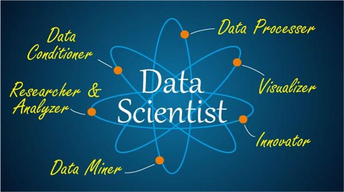

💻

你好，顿河

好好学习，天天向上

# N01-Algorithmes

## ASR

### ASR培训

[🔖 N01-VAD算法](N01-Algorithmes/ASR/ASR培训/N01-VAD算法.md)

[🔖 N02-数据预处理](N01-Algorithmes/ASR/ASR培训/N02-数据预处理.md)

[🔖 N03-离线训练](N01-Algorithmes/ASR/ASR培训/N03-离线训练.md)

[🔖 N04-在线训练](N01-Algorithmes/ASR/ASR培训/N04-在线训练.md)

### 基础理论

[🔖 CTC算法详解](N01-Algorithmes/ASR/基础理论/CTC算法详解.md)

[🔖 HResults](N01-Algorithmes/ASR/基础理论/HResults.md)

## LeetCode

### LeetCode 精选 TOP 面试题

[🔖 N01-两数之和](N01-Algorithmes/LeetCode/LeetCode%20精选%20TOP%20面试题/N01-两数之和.md)

## Math

[🔖 LinearAlgebra](N01-Algorithmes/Math/LinearAlgebra.md)

[🔖 Prob](N01-Algorithmes/Math/Prob.md)

[🔖 概率论与数理统计](N01-Algorithmes/Math/概率论与数理统计.md)

[🔖 矩阵向量求导](N01-Algorithmes/Math/矩阵向量求导.md)

[🔖 线性代数](N01-Algorithmes/Math/线性代数.md)

[🔖 高等数学](N01-Algorithmes/Math/高等数学.md)

## Sorting-Algorithm

[🔖 0-排序算法](N01-Algorithmes/Sorting-Algorithm/0-排序算法.md)

[🔖 常用算法复杂度速查表](N01-Algorithmes/Sorting-Algorithm/常用算法复杂度速查表.md)

[🔖 1.bubbleSort](N01-Algorithmes/Sorting-Algorithm/1.bubbleSort.md)

[🔖 2.selectionSort](N01-Algorithmes/Sorting-Algorithm/2.selectionSort.md)

[🔖 3.insertionSort](N01-Algorithmes/Sorting-Algorithm/3.insertionSort.md)

[🔖 4.shellSort](N01-Algorithmes/Sorting-Algorithm/4.shellSort.md)

[🔖 5.mergeSort](N01-Algorithmes/Sorting-Algorithm/5.mergeSort.md)

[🔖 6.quickSort](N01-Algorithmes/Sorting-Algorithm/6.quickSort.md)

[🔖 7.heapSort](N01-Algorithmes/Sorting-Algorithm/7.heapSort.md)

[🔖 8.countingSort](N01-Algorithmes/Sorting-Algorithm/8.countingSort.md)

[🔖 9.bucketSort](N01-Algorithmes/Sorting-Algorithm/9.bucketSort.md)

[🔖 10.radixSort](N01-Algorithmes/Sorting-Algorithm/10.radixSort.md)

# N02-ML

## N01-API

[🔖 00-Api](N02-ML/N01-API/00-Api.md)

[🔖 01-datasets](N02-ML/N01-API/01-datasets.md)

[🔖 02-model_selection](N02-ML/N01-API/02-model_selection.md)

[🔖 03-preprocessing](N02-ML/N01-API/03-preprocessing.md)

[🔖 04-feature_extraction](N02-ML/N01-API/04-feature_extraction.md)

[🔖 05-feature_selection](N02-ML/N01-API/05-feature_selection.md)

[🔖 06-decomposition](N02-ML/N01-API/06-decomposition.md)

[🔖 07-metrics](N02-ML/N01-API/07-metrics.md)

[🔖 08-linear_model](N02-ML/N01-API/08-linear_model.md)

[🔖 09-discriminant_analysis](N02-ML/N01-API/09-discriminant_analysis.md)

[🔖 10-svm](N02-ML/N01-API/10-svm.md)

[🔖 11-ensemble](N02-ML/N01-API/11-ensemble.md)

[🔖 12-naive_bayes](N02-ML/N01-API/12-naive_bayes.md)

[🔖 13-neighbors](N02-ML/N01-API/13-neighbors.md)

[🔖 14-tree](N02-ML/N01-API/14-tree.md)

[🔖 15-ensemble](N02-ML/N01-API/15-ensemble.md)

[🔖 16-cluster](N02-ML/N01-API/16-cluster.md)

[🔖 17-pipeline](N02-ML/N01-API/17-pipeline.md)

[🔖 18-semi_supervised](N02-ML/N01-API/18-semi_supervised.md)

[🔖 19-HMM](N02-ML/N01-API/19-HMM.md)

[🔖 20-xgboost](N02-ML/N01-API/20-xgboost.md)

[🔖 21-manifold](N02-ML/N01-API/21-manifold.md)

[🔖 30-数据可视化](N02-ML/N01-API/30-数据可视化.md)

## N02-ML_Base

[🔖 方差与偏差](N02-ML/N02-ML_Base/方差与偏差.md)

[🔖 机器学习术语](N02-ML/N02-ML_Base/机器学习术语.md)

[🔖 模型优缺点及选型](N02-ML/N02-ML_Base/模型优缺点及选型.md)

[🔖 正则化](N02-ML/N02-ML_Base/正则化.md)

[🔖 熵](N02-ML/N02-ML_Base/熵.md)

[🔖 生成式和判别式](N02-ML/N02-ML_Base/生成式和判别式.md)

## N04-基础知识

[🔖 N01-模型评估](N02-ML/N04-基础知识/N01-模型评估.md)

[🔖 N02-特征工程](N02-ML/N04-基础知识/N02-特征工程.md)

[🔖 N03-集成学习](N02-ML/N04-基础知识/N03-集成学习.md)

[🔖 N04-最小二乘法](N02-ML/N04-基础知识/N04-最小二乘法.md)

[🔖 N05-梯度下降](N02-ML/N04-基础知识/N05-梯度下降.md)

[🔖 N06-超参数调优](N02-ML/N04-基础知识/N06-超参数调优.md)

[🔖 N07-过拟合欠拟合](N02-ML/N04-基础知识/N07-过拟合欠拟合.md)

[🔖 N08-随机数据生成](N02-ML/N04-基础知识/N08-随机数据生成.md)

## N05-监督学习

[🔖 Adaboost](N02-ML/N05-监督学习/Adaboost.md)

[🔖 CatBoost](N02-ML/N05-监督学习/CatBoost.md)

[🔖 EM](N02-ML/N05-监督学习/EM.md)

[🔖 GBDT](N02-ML/N05-监督学习/GBDT.md)

[🔖 KNN](N02-ML/N05-监督学习/KNN.md)

[🔖 LightGBM](N02-ML/N05-监督学习/LightGBM.md)

[🔖 xgboost](N02-ML/N05-监督学习/xgboost.md)

[🔖 决策树](N02-ML/N05-监督学习/决策树.md)

[🔖 决策树_tmp](N02-ML/N05-监督学习/决策树_tmp.md)

[🔖 感知机](N02-ML/N05-监督学习/感知机.md)

[🔖 支持向量机](N02-ML/N05-监督学习/支持向量机.md)

[🔖 支持向量机_完整版](N02-ML/N05-监督学习/支持向量机_完整版.md)

[🔖 最大熵](N02-ML/N05-监督学习/最大熵.md)

[🔖 线性回归](N02-ML/N05-监督学习/线性回归.md)

[🔖 贝叶斯](N02-ML/N05-监督学习/贝叶斯.md)

[🔖 逻辑回归](N02-ML/N05-监督学习/逻辑回归.md)

[🔖 随机森林](N02-ML/N05-监督学习/随机森林.md)

## N06-无监督学习

[🔖 Apriori](N02-ML/N06-无监督学习/Apriori.md)

[🔖 DBSCAN](N02-ML/N06-无监督学习/DBSCAN.md)

[🔖 FP_Tree](N02-ML/N06-无监督学习/FP_Tree.md)

[🔖 K-Means](N02-ML/N06-无监督学习/K-Means.md)

[🔖 LDA](N02-ML/N06-无监督学习/LDA.md)

[🔖 PCA](N02-ML/N06-无监督学习/PCA.md)

[🔖 谱聚类](N02-ML/N06-无监督学习/谱聚类.md)

[🔖 高斯混合模型](N02-ML/N06-无监督学习/高斯混合模型.md)

## N07-AC_ML

### 机器学习实战

[🔖 AC02_KNN](N02-ML/N07-AC_ML/机器学习实战/AC02_KNN.md)

[🔖 AC03_DecisionTree](N02-ML/N07-AC_ML/机器学习实战/AC03_DecisionTree.md)

[🔖 AC04_NaiveBayes](N02-ML/N07-AC_ML/机器学习实战/AC04_NaiveBayes.md)

[🔖 AC05_logRegres](N02-ML/N07-AC_ML/机器学习实战/AC05_logRegres.md)

[🔖 AC06_svmMLiA](N02-ML/N07-AC_ML/机器学习实战/AC06_svmMLiA.md)

[🔖 AC07_adaboost](N02-ML/N07-AC_ML/机器学习实战/AC07_adaboost.md)

[🔖 AC08_regression](N02-ML/N07-AC_ML/机器学习实战/AC08_regression.md)

[🔖 AC10_K-Means](N02-ML/N07-AC_ML/机器学习实战/AC10_K-Means.md)

[🔖 AC11_Apriori](N02-ML/N07-AC_ML/机器学习实战/AC11_Apriori.md)

[🔖 AC12_fpGrowth](N02-ML/N07-AC_ML/机器学习实战/AC12_fpGrowth.md)

[🔖 AC13_PCA](N02-ML/N07-AC_ML/机器学习实战/AC13_PCA.md)

[🔖 AC14_svdRec](N02-ML/N07-AC_ML/机器学习实战/AC14_svdRec.md)

## N08-其它

[🔖 异常点检测](N02-ML/N08-其它/异常点检测.md)

[🔖 神经网络](N02-ML/N08-其它/神经网络.md)

# N03-DL

## N01-API

### PyTorch

[🔖 N01-eat_pytorch_in_20_days](N03-DL/N01-API/PyTorch/N01-eat_pytorch_in_20_days.md)

[🔖 N02-PyTorch常用代码段合集](N03-DL/N01-API/PyTorch/N02-PyTorch常用代码段合集.md)

#### 深度之眼PyTorch框架班

[🔖 N0101-PyTorch 简介与安装](N03-DL/N01-API/PyTorch/深度之眼PyTorch框架班/N0101-PyTorch%20简介与安装.md)

[🔖 N0102-Tensor(张量)介绍](N03-DL/N01-API/PyTorch/深度之眼PyTorch框架班/N0102-Tensor(张量)介绍.md)

[🔖 N0103-张量操作与线性回归](N03-DL/N01-API/PyTorch/深度之眼PyTorch框架班/N0103-张量操作与线性回归.md)

[🔖 N0104-计算图与动态图机制](N03-DL/N01-API/PyTorch/深度之眼PyTorch框架班/N0104-计算图与动态图机制.md)

[🔖 N0105-autograd 与逻辑回归](N03-DL/N01-API/PyTorch/深度之眼PyTorch框架班/N0105-autograd%20与逻辑回归.md)

[🔖 N0201-DataLoader 与 DataSet](N03-DL/N01-API/PyTorch/深度之眼PyTorch框架班/N0201-DataLoader%20与%20DataSet.md)

[🔖 N0202-图片预处理 transforms 模块机制](N03-DL/N01-API/PyTorch/深度之眼PyTorch框架班/N0202-图片预处理%20transforms%20模块机制.md)

[🔖 N0203-二十二种 transforms 图片数据预处理方法](N03-DL/N01-API/PyTorch/深度之眼PyTorch框架班/N0203-二十二种%20transforms%20图片数据预处理方法.md)

[🔖 N0301- 模型创建步骤与 nn.Module](N03-DL/N01-API/PyTorch/深度之眼PyTorch框架班/N0301-%20模型创建步骤与%20nn.Module.md)

[🔖 N0302-卷积层](N03-DL/N01-API/PyTorch/深度之眼PyTorch框架班/N0302-卷积层.md)

[🔖 N0303-池化层、线性层和激活函数层](N03-DL/N01-API/PyTorch/深度之眼PyTorch框架班/N0303-池化层、线性层和激活函数层.md)

[🔖 N0401-权值初始化](N03-DL/N01-API/PyTorch/深度之眼PyTorch框架班/N0401-权值初始化.md)

[🔖 N0402-损失函数](N03-DL/N01-API/PyTorch/深度之眼PyTorch框架班/N0402-损失函数.md)

[🔖 N0403-优化器](N03-DL/N01-API/PyTorch/深度之眼PyTorch框架班/N0403-优化器.md)

[🔖 N0501-TensorBoard 介绍](N03-DL/N01-API/PyTorch/深度之眼PyTorch框架班/N0501-TensorBoard%20介绍.md)

[🔖 N0502-Hook 函数与 CAM 算法](N03-DL/N01-API/PyTorch/深度之眼PyTorch框架班/N0502-Hook%20函数与%20CAM%20算法.md)

[🔖 N0601-weight decay 和 dropout](N03-DL/N01-API/PyTorch/深度之眼PyTorch框架班/N0601-weight%20decay%20和%20dropout.md)

[🔖 N0602-Normalization](N03-DL/N01-API/PyTorch/深度之眼PyTorch框架班/N0602-Normalization.md)

[🔖 N0701-模型保存与加载](N03-DL/N01-API/PyTorch/深度之眼PyTorch框架班/N0701-模型保存与加载.md)

[🔖 N0702-模型 Finetune](N03-DL/N01-API/PyTorch/深度之眼PyTorch框架班/N0702-模型%20Finetune.md)

[🔖 N0703-使用 GPU 训练模型](N03-DL/N01-API/PyTorch/深度之眼PyTorch框架班/N0703-使用%20GPU%20训练模型.md)

[🔖 N0801-图像分类简述与 ResNet 源码分析](N03-DL/N01-API/PyTorch/深度之眼PyTorch框架班/N0801-图像分类简述与%20ResNet%20源码分析.md)

[🔖 N0802-目标检测简介](N03-DL/N01-API/PyTorch/深度之眼PyTorch框架班/N0802-目标检测简介.md)

[🔖 N0803-GAN（生成对抗网络）简介](N03-DL/N01-API/PyTorch/深度之眼PyTorch框架班/N0803-GAN（生成对抗网络）简介.md)

[🔖 N0804-手动实现 RNN](N03-DL/N01-API/PyTorch/深度之眼PyTorch框架班/N0804-手动实现%20RNN.md)

[🔖 N0901-PyTorch 常见报错信息](N03-DL/N01-API/PyTorch/深度之眼PyTorch框架班/N0901-PyTorch%20常见报错信息.md)

[🔖 N0902-PyTorch Geometric 入门](N03-DL/N01-API/PyTorch/深度之眼PyTorch框架班/N0902-PyTorch%20Geometric%20入门.md)

### TensorFlow

[🔖 N01-TensorFlow_API](N03-DL/N01-API/TensorFlow/N01-TensorFlow_API.md)

[🔖 N02-eat_tensorflow2_in_30_days](N03-DL/N01-API/TensorFlow/N02-eat_tensorflow2_in_30_days.md)

#### TensorFlow_2.x

[🔖 N01-tf](N03-DL/N01-API/TensorFlow/TensorFlow_2.x/N01-tf.md)

[🔖 N02-tf.random](N03-DL/N01-API/TensorFlow/TensorFlow_2.x/N02-tf.random.md)

[🔖 N03-tf.data](N03-DL/N01-API/TensorFlow/TensorFlow_2.x/N03-tf.data.md)

[🔖 N04-tf.keras](N03-DL/N01-API/TensorFlow/TensorFlow_2.x/N04-tf.keras.md)

[🔖 N05-tf.initializers](N03-DL/N01-API/TensorFlow/TensorFlow_2.x/N05-tf.initializers.md)

[🔖 N06-tf.losses](N03-DL/N01-API/TensorFlow/TensorFlow_2.x/N06-tf.losses.md)

[🔖 N07-tf.nn](N03-DL/N01-API/TensorFlow/TensorFlow_2.x/N07-tf.nn.md)

[🔖 N08-tf.image](N03-DL/N01-API/TensorFlow/TensorFlow_2.x/N08-tf.image.md)

## N02-DL_base

[🔖 batch-norm_DS](N03-DL/N02-DL_base/batch-norm_DS.md)

[🔖 交叉熵损失函数](N03-DL/N02-DL_base/交叉熵损失函数.md)

[🔖 损失函数](N03-DL/N02-DL_base/损失函数.md)

[🔖 激活函数](N03-DL/N02-DL_base/激活函数.md)

### 优化器

[🔖 优化器](N03-DL/N02-DL_base/优化器/优化器.md)

[🔖 N01-优化器介绍](N03-DL/N02-DL_base/优化器/N01-优化器介绍.md)

[🔖 N02-梯度下降和随机梯度下降](N03-DL/N02-DL_base/优化器/N02-梯度下降和随机梯度下降.md)

[🔖 N03-小批量随机梯度下降](N03-DL/N02-DL_base/优化器/N03-小批量随机梯度下降.md)

[🔖 N04-动量法](N03-DL/N02-DL_base/优化器/N04-动量法.md)

[🔖 N05-AdaGrad算法](N03-DL/N02-DL_base/优化器/N05-AdaGrad算法.md)

[🔖 N06-RMSProp算法](N03-DL/N02-DL_base/优化器/N06-RMSProp算法.md)

[🔖 N07-AdaDelta算法](N03-DL/N02-DL_base/优化器/N07-AdaDelta算法.md)

[🔖 N08-Adam算法](N03-DL/N02-DL_base/优化器/N08-Adam算法.md)

## N03-基础算法

[🔖 N03-CNN](N03-DL/N03-基础算法/N03-CNN.md)

[🔖 N03-CNN基础_DS](N03-DL/N03-基础算法/N03-CNN基础_DS.md)

[🔖 N04-CNN调参](N03-DL/N03-基础算法/N04-CNN调参.md)

[🔖 N05-LeNet5](N03-DL/N03-基础算法/N05-LeNet5.md)

[🔖 N06-AlexNet](N03-DL/N03-基础算法/N06-AlexNet.md)

[🔖 N07-VGGNet](N03-DL/N03-基础算法/N07-VGGNet.md)

[🔖 N08-NiN](N03-DL/N03-基础算法/N08-NiN.md)

[🔖 N09-GoogleNet](N03-DL/N03-基础算法/N09-GoogleNet.md)

[🔖 N10-InceptionNet](N03-DL/N03-基础算法/N10-InceptionNet.md)

[🔖 N11-ResNet](N03-DL/N03-基础算法/N11-ResNet.md)

[🔖 N12-DenseNet](N03-DL/N03-基础算法/N12-DenseNet.md)

[🔖 N13-MobileNet](N03-DL/N03-基础算法/N13-MobileNet.md)

# N04-NLP

## NLP_Base

[🔖 jieba](N04-NLP/NLP_Base/jieba.md)

[🔖 pyltp](N04-NLP/NLP_Base/pyltp.md)

[🔖 倒排表](N04-NLP/NLP_Base/倒排表.md)

[🔖 困惑度](N04-NLP/NLP_Base/困惑度.md)

[🔖 正则表达式](N04-NLP/NLP_Base/正则表达式.md)

## 其它

[🔖 BiLSTM-CRF模型理解](N04-NLP/其它/BiLSTM-CRF模型理解.md)

[🔖 台大 Bert、ELMO、GPT 学习笔记](N04-NLP/其它/台大%20Bert、ELMO、GPT%20学习笔记.md)

[🔖 台大 Transformer 学习笔记](N04-NLP/其它/台大%20Transformer%20学习笔记.md)

## 基础算法

[🔖 Attention](N04-NLP/基础算法/Attention.md)

[🔖 Bi-LSTM](N04-NLP/基础算法/Bi-LSTM.md)

[🔖 CRF](N04-NLP/基础算法/CRF.md)

[🔖 Gan](N04-NLP/基础算法/Gan.md)

[🔖 GNN](N04-NLP/基础算法/GNN.md)

[🔖 GRU](N04-NLP/基础算法/GRU.md)

[🔖 HMM](N04-NLP/基础算法/HMM.md)

[🔖 LSTM](N04-NLP/基础算法/LSTM.md)

[🔖 RNN](N04-NLP/基础算法/RNN.md)

[🔖 RNN_DS](N04-NLP/基础算法/RNN_DS.md)

[🔖 SeqGAN](N04-NLP/基础算法/SeqGAN.md)

[🔖 TextCNN](N04-NLP/基础算法/TextCNN.md)

[🔖 TextRNN](N04-NLP/基础算法/TextRNN.md)

[🔖 Tranformer](N04-NLP/基础算法/Tranformer.md)

[🔖 Transformer-C](N04-NLP/基础算法/Transformer-C.md)

[🔖 Transformer-XL](N04-NLP/基础算法/Transformer-XL.md)

[🔖 Transformer-图解](N04-NLP/基础算法/Transformer-图解.md)

[🔖 Seq2Seq](N04-NLP/基础算法/Seq2Seq.md)

## 知识图谱

[🔖 graph_TMP](N04-NLP/知识图谱/graph_TMP.md)

[🔖 知识图谱技术综述](N04-NLP/知识图谱/知识图谱技术综述.md)

[🔖 py2neo](N04-NLP/知识图谱/py2neo.md)

[🔖 Neo4j](N04-NLP/知识图谱/Neo4j.md)

## 词向量

[🔖 N01-TF-IDF](N04-NLP/词向量/N01-TF-IDF.md)

[🔖 N02-NNLM](N04-NLP/词向量/N02-NNLM.md)

[🔖 N03-Word2vec](N04-NLP/词向量/N03-Word2vec.md)

[🔖 N04-Glove](N04-NLP/词向量/N04-Glove.md)

[🔖 N05-FastText](N04-NLP/词向量/N05-FastText.md)

[🔖 N06-ELMO](N04-NLP/词向量/N06-ELMO.md)

[🔖 N07-Bert](N04-NLP/词向量/N07-Bert.md)

[🔖 N07-Bert图解](N04-NLP/词向量/N07-Bert图解.md)

[🔖 N08-ALBERT](N04-NLP/词向量/N08-ALBERT.md)

[🔖 N09-XLNet](N04-NLP/词向量/N09-XLNet.md)

[🔖 N10-GPT](N04-NLP/词向量/N10-GPT.md)

[🔖 N10-GPT图解-2](N04-NLP/词向量/N10-GPT图解-2.md)

[🔖 N10-GPT图解-3](N04-NLP/词向量/N10-GPT图解-3.md)

[🔖 N11-GPT-2](N04-NLP/词向量/N11-GPT-2.md)

[🔖 N12-词向量小结](N04-NLP/词向量/N12-词向量小结.md)

# N09-Notebook

## TaskMD

### N01-图计算

#### 基础理论

[🔖 N01-基础概念](N09-Notebook/TaskMD/N01-图计算/基础理论/N01-基础概念.md)

[🔖 N02-状态估计](N09-Notebook/TaskMD/N01-图计算/基础理论/N02-状态估计.md)

[🔖 N03-潮流计算](N09-Notebook/TaskMD/N01-图计算/基础理论/N03-潮流计算.md)

[🔖 N04-图计算论文](N09-Notebook/TaskMD/N01-图计算/基础理论/N04-图计算论文.md)

#### 学习笔记

[🔖 基础知识](N09-Notebook/TaskMD/N01-图计算/学习笔记/基础知识.md)

#### 开发笔记

[🔖 N01-函数编译及功能说明](N09-Notebook/TaskMD/N01-图计算/开发笔记/N01-函数编译及功能说明.md)

[🔖 N02-CIM数据说明](N09-Notebook/TaskMD/N01-图计算/开发笔记/N02-CIM数据说明.md)

[🔖 N03-节点关系明细](N09-Notebook/TaskMD/N01-图计算/开发笔记/N03-节点关系明细.md)

[🔖 N04-节点关系图例](N09-Notebook/TaskMD/N01-图计算/开发笔记/N04-节点关系图例.md)

[🔖 N05-节点数据处理](N09-Notebook/TaskMD/N01-图计算/开发笔记/N05-节点数据处理.md)

[🔖 N06-母线支路生成](N09-Notebook/TaskMD/N01-图计算/开发笔记/N06-母线支路生成.md)

[🔖 N07-流程梳理](N09-Notebook/TaskMD/N01-图计算/开发笔记/N07-流程梳理.md)

#### 项目实践

[🔖 潮流计算的基本算法](N09-Notebook/TaskMD/N01-图计算/项目实践/潮流计算的基本算法.md)

[🔖 N01-基于图计算的潮流计算说明](N09-Notebook/TaskMD/N01-图计算/项目实践/N01-基于图计算的潮流计算说明.md)

### N02-语音识别

[🔖 TMP](N09-Notebook/TaskMD/N02-语音识别/TMP.md)

#### ASR_tmp

[🔖 【其它】在线识别详细设计说明书](N09-Notebook/TaskMD/N02-语音识别/ASR_tmp/【其它】在线识别详细设计说明书.md)

[🔖 【安装】在线语音识别系统安装手册](N09-Notebook/TaskMD/N02-语音识别/ASR_tmp/【安装】在线语音识别系统安装手册.md)

[🔖 【安装】语音识别引擎安装配置手册](N09-Notebook/TaskMD/N02-语音识别/ASR_tmp/【安装】语音识别引擎安装配置手册.md)

[🔖 【授权】在线语音识别系统授权](N09-Notebook/TaskMD/N02-语音识别/ASR_tmp/【授权】在线语音识别系统授权.md)

[🔖 【汇总】ASR大全](N09-Notebook/TaskMD/N02-语音识别/ASR_tmp/【汇总】ASR大全.md)

[🔖 【流程图】在线识别流程图](N09-Notebook/TaskMD/N02-语音识别/ASR_tmp/【流程图】在线识别流程图.md)

[🔖 【流程图】离线识别流程图](N09-Notebook/TaskMD/N02-语音识别/ASR_tmp/【流程图】离线识别流程图.md)

[🔖 【离线】叠音检测](N09-Notebook/TaskMD/N02-语音识别/ASR_tmp/【离线】叠音检测.md)

[🔖 【离线】场景分割](N09-Notebook/TaskMD/N02-语音识别/ASR_tmp/【离线】场景分割.md)

[🔖 【离线】离线转写结果融合](N09-Notebook/TaskMD/N02-语音识别/ASR_tmp/【离线】离线转写结果融合.md)

[🔖 【离线】语音格式转换](N09-Notebook/TaskMD/N02-语音识别/ASR_tmp/【离线】语音格式转换.md)

[🔖 【编译】在线代码编译及服务集成](N09-Notebook/TaskMD/N02-语音识别/ASR_tmp/【编译】在线代码编译及服务集成.md)

[🔖 【运维】声学模型&语言模型替换](N09-Notebook/TaskMD/N02-语音识别/ASR_tmp/【运维】声学模型&语言模型替换.md)

[🔖 【运维】语音识别引擎部署文档-在线](N09-Notebook/TaskMD/N02-语音识别/ASR_tmp/【运维】语音识别引擎部署文档-在线.md)

[🔖 【运维】语音识别引擎部署文档-离线](N09-Notebook/TaskMD/N02-语音识别/ASR_tmp/【运维】语音识别引擎部署文档-离线.md)

[🔖 【验证】ASR实操记录](N09-Notebook/TaskMD/N02-语音识别/ASR_tmp/【验证】ASR实操记录.md)

[🔖 【finetune】e2e声学模型finetune-在线](N09-Notebook/TaskMD/N02-语音识别/ASR_tmp/【finetune】e2e声学模型finetune-在线.md)

[🔖 【finetune】e2e声学模型finetune-离线](N09-Notebook/TaskMD/N02-语音识别/ASR_tmp/【finetune】e2e声学模型finetune-离线.md)

[🔖 【引擎】e2e引擎详解-在线](N09-Notebook/TaskMD/N02-语音识别/ASR_tmp/【引擎】e2e引擎详解-在线.md)

[🔖 【引擎】e2e引擎详解-离线](N09-Notebook/TaskMD/N02-语音识别/ASR_tmp/【引擎】e2e引擎详解-离线.md)

[🔖 【训练】e2e在线模型训练源码详解](N09-Notebook/TaskMD/N02-语音识别/ASR_tmp/【训练】e2e在线模型训练源码详解.md)

[🔖 【训练】e2e离线模型训练源码详解](N09-Notebook/TaskMD/N02-语音识别/ASR_tmp/【训练】e2e离线模型训练源码详解.md)

#### 声学模型

[🔖 【汇总】语音识别记录](N09-Notebook/TaskMD/N02-语音识别/声学模型/【汇总】语音识别记录.md)

##### e2e

###### 在线引擎

[🔖 【在线-安装】在线语音识别系统安装手册](N09-Notebook/TaskMD/N02-语音识别/声学模型/e2e/在线引擎/【在线-安装】在线语音识别系统安装手册.md)

[🔖 【在线-安装】语音识别引擎安装配置手册](N09-Notebook/TaskMD/N02-语音识别/声学模型/e2e/在线引擎/【在线-安装】语音识别引擎安装配置手册.md)

[🔖 【在线-授权】在线语音识别系统授权](N09-Notebook/TaskMD/N02-语音识别/声学模型/e2e/在线引擎/【在线-授权】在线语音识别系统授权.md)

[🔖 【在线-模型替换】声学模型&语言模型替换](N09-Notebook/TaskMD/N02-语音识别/声学模型/e2e/在线引擎/【在线-模型替换】声学模型&语言模型替换.md)

[🔖 【在线-流程图】在线识别流程图](N09-Notebook/TaskMD/N02-语音识别/声学模型/e2e/在线引擎/【在线-流程图】在线识别流程图.md)

[🔖 【在线-编译】在线代码编译及服务集成](N09-Notebook/TaskMD/N02-语音识别/声学模型/e2e/在线引擎/【在线-编译】在线代码编译及服务集成.md)

[🔖 【在线-部署】语音识别引擎部署文档](N09-Notebook/TaskMD/N02-语音识别/声学模型/e2e/在线引擎/【在线-部署】语音识别引擎部署文档.md)

[🔖 【在线】MRCP安装手册](N09-Notebook/TaskMD/N02-语音识别/声学模型/e2e/在线引擎/【在线】MRCP安装手册.md)

[🔖 【在线】在线识别详细设计说明书](N09-Notebook/TaskMD/N02-语音识别/声学模型/e2e/在线引擎/【在线】在线识别详细设计说明书.md)

[🔖 【在线】热词配置](N09-Notebook/TaskMD/N02-语音识别/声学模型/e2e/在线引擎/【在线】热词配置.md)

[🔖 【记录】ASR实操记录](N09-Notebook/TaskMD/N02-语音识别/声学模型/e2e/在线引擎/【记录】ASR实操记录.md)

[🔖 【在线-finetune】e2e声学模型finetune](N09-Notebook/TaskMD/N02-语音识别/声学模型/e2e/在线引擎/【在线-finetune】e2e声学模型finetune.md)

[🔖 【在线-引擎】e2e引擎详解](N09-Notebook/TaskMD/N02-语音识别/声学模型/e2e/在线引擎/【在线-引擎】e2e引擎详解.md)

[🔖 【在线-训练】e2e在线模型训练源码详解](N09-Notebook/TaskMD/N02-语音识别/声学模型/e2e/在线引擎/【在线-训练】e2e在线模型训练源码详解.md)

###### 离线引擎

[🔖 【离线-安装】语音识别引擎安装配置手册](N09-Notebook/TaskMD/N02-语音识别/声学模型/e2e/离线引擎/【离线-安装】语音识别引擎安装配置手册.md)

[🔖 【离线-模型替换】声学模型&语言模型替换](N09-Notebook/TaskMD/N02-语音识别/声学模型/e2e/离线引擎/【离线-模型替换】声学模型&语言模型替换.md)

[🔖 【离线-流程图】离线识别流程图](N09-Notebook/TaskMD/N02-语音识别/声学模型/e2e/离线引擎/【离线-流程图】离线识别流程图.md)

[🔖 【离线-部署】语音识别引擎部署文档](N09-Notebook/TaskMD/N02-语音识别/声学模型/e2e/离线引擎/【离线-部署】语音识别引擎部署文档.md)

[🔖 【离线-验证】ASR实操记录](N09-Notebook/TaskMD/N02-语音识别/声学模型/e2e/离线引擎/【离线-验证】ASR实操记录.md)

[🔖 【离线】叠音检测](N09-Notebook/TaskMD/N02-语音识别/声学模型/e2e/离线引擎/【离线】叠音检测.md)

[🔖 【离线】场景分割](N09-Notebook/TaskMD/N02-语音识别/声学模型/e2e/离线引擎/【离线】场景分割.md)

[🔖 【离线】离线转写结果融合](N09-Notebook/TaskMD/N02-语音识别/声学模型/e2e/离线引擎/【离线】离线转写结果融合.md)

[🔖 【离线】语音格式转换](N09-Notebook/TaskMD/N02-语音识别/声学模型/e2e/离线引擎/【离线】语音格式转换.md)

[🔖 【离线-finetune】e2e声学模型finetune](N09-Notebook/TaskMD/N02-语音识别/声学模型/e2e/离线引擎/【离线-finetune】e2e声学模型finetune.md)

[🔖 【离线-引擎】e2e引擎详解](N09-Notebook/TaskMD/N02-语音识别/声学模型/e2e/离线引擎/【离线-引擎】e2e引擎详解.md)

[🔖 【离线-训练】e2e离线模型训练源码详解](N09-Notebook/TaskMD/N02-语音识别/声学模型/e2e/离线引擎/【离线-训练】e2e离线模型训练源码详解.md)

#### 实践记录

##### ASR部署

[🔖 在线ASR部署](N09-Notebook/TaskMD/N02-语音识别/实践记录/ASR部署/在线ASR部署.md)

#### 技术文档

##### JQ

[🔖 TMP](N09-Notebook/TaskMD/N02-语音识别/技术文档/JQ/TMP.md)

#### 语言模型

##### e2e

[🔖 【离线】基于标注文本的语音模型优化训练指南](N09-Notebook/TaskMD/N02-语音识别/语言模型/e2e/【离线】基于标注文本的语音模型优化训练指南.md)

[🔖 【记录】语音模型优化训练](N09-Notebook/TaskMD/N02-语音识别/语言模型/e2e/【记录】语音模型优化训练.md)

### N03-任务记录

#### 数字人

[🔖 N01-数字人](N09-Notebook/TaskMD/N03-任务记录/数字人/N01-数字人.md)

#### 潮流计算

[🔖 N01-基于广东数据的潮流计算](N09-Notebook/TaskMD/N03-任务记录/潮流计算/N01-基于广东数据的潮流计算.md)

# N10-Blog

## N01-STB

[🔖 面试指南-CP篇](N10-Blog/N01-STB/面试指南-CP篇.md)

[🔖 面试指南-DL篇](N10-Blog/N01-STB/面试指南-DL篇.md)

[🔖 面试指南-ML篇](N10-Blog/N01-STB/面试指南-ML篇.md)

[🔖 面试指南-NLP篇](N10-Blog/N01-STB/面试指南-NLP篇.md)

[🔖 面试指南-Python篇](N10-Blog/N01-STB/面试指南-Python篇.md)

# N13-DDU

## N04-Docsify

[🔖 coverpage](N13-DDU/N04-Docsify/coverpage.md)

[🔖 homepage](N13-DDU/N04-Docsify/homepage.md)

[🔖 navbar](N13-DDU/N04-Docsify/navbar.md)

[🔖 sidebar](N13-DDU/N04-Docsify/sidebar.md)

### IDEhe

[🔖 N01-基础算法](N13-DDU/N04-Docsify/IDEhe/N01-基础算法.md)

[🔖 N02-机器学习](N13-DDU/N04-Docsify/IDEhe/N02-机器学习.md)

[🔖 N03-深度学习](N13-DDU/N04-Docsify/IDEhe/N03-深度学习.md)

[🔖 N04-自然语言处理](N13-DDU/N04-Docsify/IDEhe/N04-自然语言处理.md)

[🔖 N08-all_in_one](N13-DDU/N04-Docsify/IDEhe/N08-all_in_one.md)

[🔖 N09-Others](N13-DDU/N04-Docsify/IDEhe/N09-Others.md)

