# 第01章 PSTN与VoIP基础

一说起VoIP，给人的感觉好像有些抽象，或许大家对“网络电话”这个词更熟悉一些。VoIP的英文原意是Voice Over IP，即承载于IP网上的语音通信。大家熟悉家庭上网所使用的ADSL吧？或许有些人还记得前些年用过的吱吱叫的老“猫”（Modem，调制解调器）。技术日新月异，之前的技术都是用电话线上网，现在VoIP技术使我们可以在网上打电话。

所谓“温故而知新”，在学习任何新东西以前，我们最好都了解一下它的历史，以做到心中有数。所以在了解VoIP之前，我们先来看一下PSTN。

PSTN（Public Switched Telephone Network，公共交换电话网）就是我们日常打电话所使用的电话网络。有时，人们喜欢对新鲜的事物刨根问底，却对司空见惯的东西不求甚解。在此，为了便于读者了解本书所述的技术，我们一起来回顾一下交换机的起源和演变过程、探索一下电话网的现状和发展方向，同时一起学习一些与PSTN有关的基础知识和专业术语等。

## PSTN起源与发展

在漫长的通信历史长河中，PSTN及电话交换技术的发展经历了很多阶段，如从直接控制到间接控制再到公共控制、从人工交换到自动交换、从电子交换到程控交换、从模拟到数字、从电路交换到分组交换、从“硬”交换到软交换等。下面我们分别介绍。

### 最早的电话网

第一次语音传输是苏格兰人亚历山大·贝尔（Alexander Granham Bell） [1]在1876年用振铃电路实现的。而在那之前，普遍认为烽火台是最好的远程通信方式。

用振铃电路实现通话功能的时代是没有电话号码的，相互通话的用户之间必须由物理线路连接；并且，在同一时间只能有一个用户讲话（半双工）。发话方通过话音振动来激励电炭精麦克风从而产生电信号，电信号传到远端后通过振动对方的扬声器发声，从而传到对方的耳朵里。

由于每对通话的个体之间都需要单独的物理线路，如果整个电话网上有10个人，而某人想与另外9个人通话，他就需要铺设9对电话线。同时整个电话网上就需要10×(10–1)/2=45对电话线，如图1-1所示。

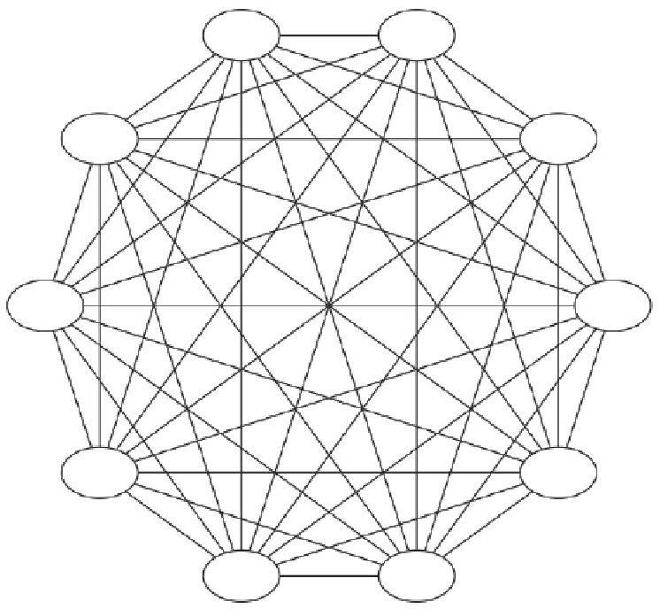

 图1-1　电话网上有10个人通话的情况

### 人工电话交换时代

随着时代的发展，对电话有需求的用户越来越多，甚至普通家庭都希望拥有自己的电话。但是，为每对欲通话的家庭之间都铺设电话线是不可能的。因此，一种称为交换机（Switch，又称Exchange）的设备诞生了。它位于整个电话网的中心，用于连接每个用户。用户想打电话时，先拿起电话连接到管理交换机的接线员，由接线员负责接通到对方的线路。这便是最早的电话交换网（见图1-2），交换接续工作全部由人工完成。通过使用交换机，交换网上需要的线路大大减少了。

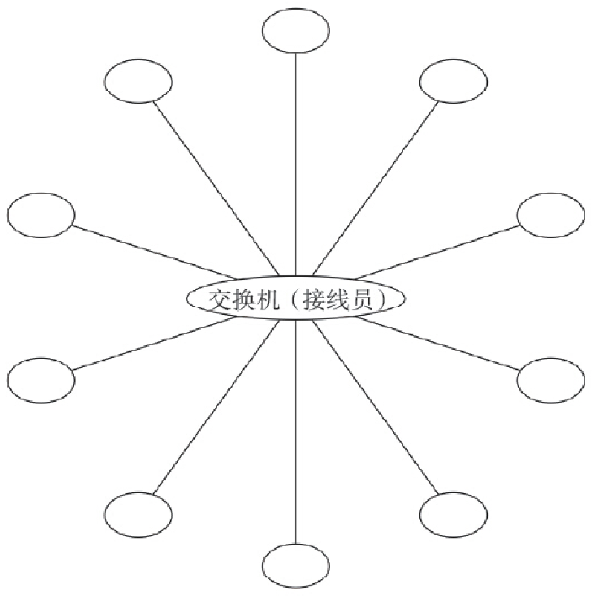

图1-2　人工电话交换网

### 自动电话交换时代

1889年到1891年期间，美国阿尔蒙·B·史端乔（Almon B Strowger）发明了步进式自动电话交换机。有趣的是，他发明自动交换机的目的并不是为了把接线员从繁忙的人工交换机上解放下来，而是来源于另外一则故事：他本是一个殡仪馆老板。他发觉每当城里发生死亡事件，用户给“殡仪馆”打电话时，不知接线员是有意还是无意的，总会把电话接到另一家殡仪馆。这使史端乔非常郁闷，发誓要将电话交换自动化。功夫不负有心人，史端乔凭他那过人的聪明和毅力，终于发明了一种步进式的自动电话交换机，并申请了专利。人们为了纪念他，故又称这种电话交换机为“史端乔交换机”（见图1-3）。这种交换机的特点是由用户话机的拨号脉冲直接控制交换机的动作，属于“直接控制”方式。

图1-3　步进式交换机4位拨号电话中继示意图

以后，又出现了旋转式（见图1-4）和升降式的交换机。这类交换机采用了一个称为“记发器”的部件来接收用户的拨号脉冲，然后将其通过译码器译成电码来控制接线器的动作，这属于“间接控制”方式。在采用记发器后，增加了选择的灵活性，从而使交换机的容量得到了提高。

1919年，瑞典的电话工程师帕尔姆格伦和贝塔兰德发明了“纵横制接线器”（见图1-5），并申请专利。这种交换机将过去使用滑动摩擦方式的触点改成了压接触，减少了磨损，从而提高了交换机的寿命；而且，由于采用了导电性好的贵金属（如银）做金属触点，也大大提高了接触的可靠性。这种交换机的另一个特点是把控制部分和话路部分分开。控制部分由标志器和记发器来完成，称为公共控制。公共控制对用户拨号盘要求低，而中继部署的灵活性大大提高。

瑞典和美国分别在1926年和1938年开通了纵横制交换机，接着，法国、日本和英国也相继生产出纵横制交换机。

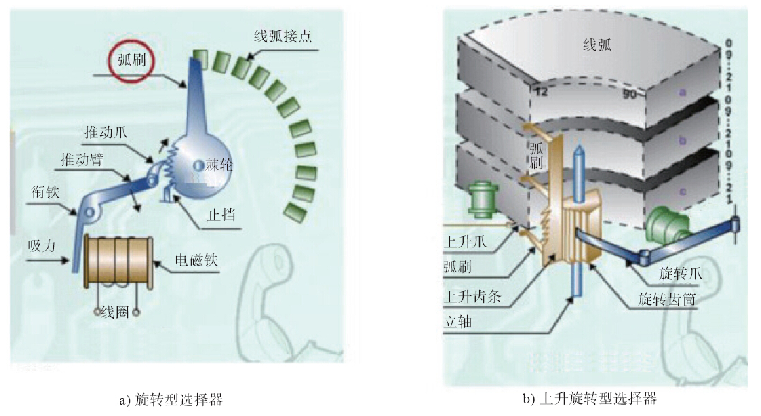

图1-4　旋转式交换机

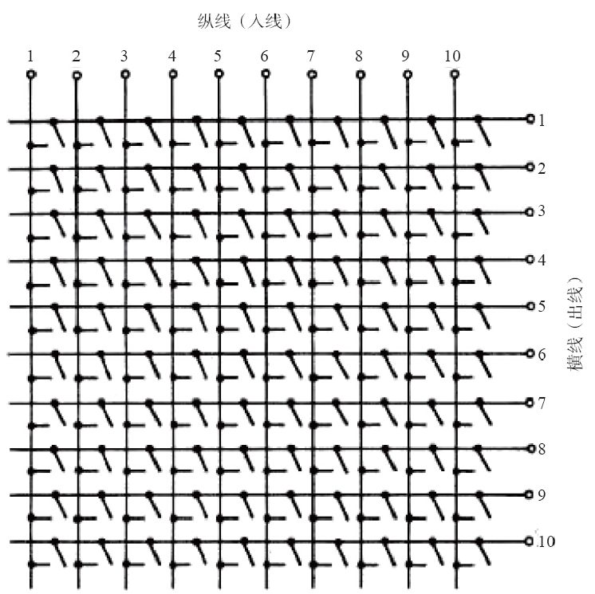

图1-5　纵横接线器交叉点示意图

### 半电子交换机时代

随着电子技术，尤其是半导体技术的迅速发展，人们开始在交换机内引入电子技术，产生了电子交换机。由于当时技术条件的限制，仅在控制部分引入了电子技术，而话路部分在较长的一段时间内仍然采用机械触点。这种交换机一般称为半电子交换机或准电子交换机（区别是后者采用了速度较快的笛簧接线器）。

### 空分交换机时代

1946年，第一台由存储程序控制的电子计算机诞生，这对现代科学技术起到了划时代的作用。通过在交换机中引入“存储程序控制”的概念，1965年5月，美国贝尔系统的1号电子交换机（ESS No.1）问世了，这是世界上第一部开通使用的程控电话交换机。当时的交换机话路部分还保留了机械触点，以“空分”方式工作，因此称为空分交换机。并且，它交换的还是模拟信号。

### 数字交换机时代

20世纪60年代初以来，脉冲编码调制（PCM）技术成功地应用于传输系统中，它通过将“模拟”的信号数字化，提高了通话质量、增加了传输距离，同时，节约了许多线路成本。1970年，法国开通了世界上第一部程控数字交换机E10，开始了数字交换的新时代。

### 现代PSTN时代

随着技术的进步和人们对通信要求的增加，世界上许许多多的交换机间也需要相互通信，这些交换机之间通过中继线（Trunk）相连，随着电子交换机和程控交换机的发展，便出现了现代意义的PSTN网络。PSTN网络把世界上各个角落的人们都联系在了一起，很显然，有时一个通话需要穿越好多台交换机。

20世纪70年代后期出现了蜂窝式移动电话（当移动电话小到可以拿在手里的时候就开始叫“手机”了）系统，这是无线电话发展的里程碑。而在此之前，虽然无线电通信是在1895年发明的，但无线电话却是在20世纪初发明了真空三极管之后才出现的。1915年首次成功地实现了跨越大西洋的无线电话通信；1927年在美国和英国之间开通了商用无线电话。移动电话的出现，扩展了PSTN网络的能力和范围，对PSTN网络的影响极其深远。

专门用于移动电话交换的通信网络称为移动网，而原来的程控交换网则称为固定电话网，简称固网。简单来说，移动网就是在普通固网的基础上增加了许多基站（Base Station，可以简单理解为天线），并增加了归属位置寄存器（Home Location Register，HLR）和拜访位置寄存器（Visitor Location Register，VLR），以记录用户的位置（在哪个天线的覆盖范围内）、支持异地漫游等。移动交换中心称为MSC（Mobile Switch Center）。

### 下一代网络及VoIP时代

随着分组交换技术的成熟及因特网的发展，人们认识到了将原始的基于电路交换的语音网络与基于分组交换的因特网络进行融合（即语音通信和数据通信相结合）的必要性，因此一个称为NGN（Next Generation Network）的概念被提了出来。NGN是指下一代网络，ETSI [2]对它的定义是：“NGN是一种规范和部署网络的概念，即通过采用分层、分布和开放业务接口的方式，为业务提供者和运营者提供一种能够逐步演进的策略，实现一个具有快速生成、提供、部署和管理新业务的平台。” [3]

在NGN提出之后，经过数年的研究和探索，人们提出了各种NGN的解决方案，但最终基本上都统一到了IMS（IP Multimedia Subsystem）技术 [4]。IMS运行于标准的IP网络上，使用一种基于第三方伙伴计划（3GPP）的SIP标准的VoIP实现方式。IMS的目标不仅是在现有网络基础上提供新的业务，它还要能提供在未来的因特网上能够承载的所有的业务。

当然，IMS属于核心交换层的技术，它全部基于IP网络，但在接入层，目前的语音大部分还是基于电路接入的方式接入的，因此，这就要求在一定时间内IMS在接入层要继续兼容电路接入。同时，在无线移动通信领域，随着移动通信技术的成熟及众多智能终端的出现，对高速IP网络的要求也就越来越迫切。最新的3G [5]、4G [6]技术就是应此要求而产生的。未来的通信中要完全取消低效的电路传输及电路交换，而全部集中到IP通信上来，也就催生了一个新的无线通信标准LTE [7]。LTE的定义是长期演进而来的，其为现代的手机及其他移动设备提供了高速的数据通信手段，逐步实现了全IP交换。

关于通信网络的演进，简单来说，在无线方面体现为从GSM/CDMA/UMTS等向LTE发展，在核心网方面则体现为从电路交换向IMS发展。过去几年，围绕LTE语音曾经出现过多种观点、技术和演进路线。由于LTE标准不再支持用于支撑GSM、UMTS和CDMA2000网络下语音传输的电路交换技术，它只能进行全IP网络下的分组交换，因此随着LTE网络的部署，运营商需选择VoLTE [8]、CSFB [9]、SVLTE [10]、OTT [11]等方法之一解决LTE网络中的语音传输问题。从目前来看，移动网络庞大且复杂，在网络建设初期大部分运营商都选择使用CSFB方式建设网络，这种方式便于快速部署系统。当然，CSFB只是过渡时期的临时解决方案。从长远来看，VoLTE及其他几种方案更符合未来网络的发展方向。据报道，中国移动已于2013年6月发布了VoLTE技术白皮书，并计划于2014年下半年展开大规模商用。未来通信网络将走向何方，让我们拭目以待。

[1] 1847年3月3日－1922年8月2日。1870年贝尔移民到加拿大，一年后到美国。1882年加入美国国籍。参见：https://zh.wikipedia.org/wiki/亚历山大·格拉汉姆·贝尔。 

[2] European Telecommunications Standards Institute，即欧洲电信标准化协会，官方网站是http://www.etsi.org。

[3] 原文是：NGN is a concept for defining and deploying networks,which,due to their formal separation into different layers and planes and use of open interfaces,offers service providers and operators a platform which can evolve in a step-by-step mannerto create,deploy and manage innovative services.不过，这个概念的定义跟它的名字一样令人迷惑。事实上，这个概念最早大约是在1997年提出来的，所以，“下一代”中的“下”早就过时了。 

[4] 一般来说，NGN就应该称为软交换，而有的人也说IMS是更软的软交换。读者到后面就能了解到，与“更软的软交换”相比，FreeSWITCH更是用纯软件实现的，或许可以称做是“更更软的软交换”了。当然软交换的“软”并不是取决于它是否用“软件”来实现，而是更强调基于分组网的交换网络中的呼叫控制功能与媒体网关的分离。

 [5] 3G是指第三代移动通信技术，与第一代（1G、模拟系统）和第二代（2G、以GSM为代表的数字系统）移动通信技术相比，它主要是支持高速IP数据传输。详见http://zh.wikipedia.org/wiki/3G。 

[6] 4G是指第四代移动通信技术，是3G之后的延伸，从技术标准的角度看，按照ITU的定义，静态传输速率达到1Gbps，用户在高速移动状态下可以达到100Mbps，就可以称为4G的技术。详见http://zh.wikipedia.org/wiki/4G。

 [7] 参见http://zh.wikipedia.org/wiki/长期演进技术。 

[8] VoLTE（Voice Over LTE，LTE网络直传）：该方案基于IP多媒体子系统（IMS）网络，配合GSMA在PRD IR.92中制定的LTE控制和媒体层面的语音服务标准。使用该方案意味着语音将以数据流形式在LTE网络中传输，所以无须调用传统电路交换网络，旧网络无须保留。简单来说，VoLTE就是LTE网络环境下的VoIP业务。 

[9] CSFB（Circuit Switched Fallback，电路交换网络支援）：该方案中的LTE网络将只用于数据传输，当有语音拨叫或呼入时，终端将使用原有电路交换网络。该方案只需运营商升级现有MSC核心网而无须建立IMS网，因此运营商可以较迅速地向市场推出网络服务。也由于语音通话需要切换网络才能使用的缘故，通话接续时间将被延长。 

[10] SVLTE（Simultaneous Voice and LTE，LTE与语音网同步支持）：该方案使用可以同时支持LTE网络和电路交换网络的终端，使得运营商无须对当前网络作太多修改。但这同时意味着终端价格的昂贵和电力消耗的迅速。 

[11] OTT（Over-The-Top）：一种将服务建于网络之上的方式，如用Skype来提供LTE的语音。LTE具备高带宽、低时延、永远在线、全IP等特点，为OTT的发展带来了天然的便利，使得OTT语音几乎没有壁垒。但应当看到，现在乃至将来很长时间里，语音业务都是移动运营商的最主要的收入来源，把LTE的语音业务完全交给OTT是一种非常激进的观点，在电信领域得到的支持并不多。

## 电话实现技术

电话系统的发展与科技的进步是分不开的。在本节，我们来介绍一些关键的电话技术及专业术语。

### 电话号码

我们的生活已经离不开电话，而要打电话就离不开电话号码。但好多人对天天使用的电话号码既熟悉又陌生，因此，在这里我们也补充一些现行的电话网中电话号码的知识。值得注意的是，这些号码的出现大部分与业务内容和行政区划有关，也有一些历史背景，但限于篇幅，我们就不深入讨论了。

1. 固定电话号码

现行的电话网中采用E.164 [1]号码格式。以我国固话电话的编号规则为例，我们先来看本地号码。

一般来说，在比较大的省市（如北京、上海等）使用8位号码，比较小的省市使用7位号码。以北京的电话号码为例，它由8位数字组成，表示为ABCD EFGH，其中，ABCDE称为一个千群，即该群可以包含1000个电话号码，同理ABCD称为一个万群。小规模的交换机可能只包含几个千群，而大规模的可能包含几个万群。

如果在不同的省市之间打电话，则称为长途电话，一般需要通过长途局进行路由。打长途电话需要在本地号码前加上长途区号。根据城市的大小不同，我国电话区号的长度一般是2位到3位，如：

10  北京

20  广州

21  上海

755 深圳

535 烟台

读者可能会问，北京的长途区号不是010吗？答案是——“不是！”许多人会错误地认为北京的区号是010，这也正是作者要写这一节的原因。

由于各地区号的长度不同，而且数字也不规则，因此，为了区分长途电话和本地电话，我国规定，在拨打长途电话前除了要加上区号外，还要在最前面加“0”。因此，“0”是国内长途字冠，它本身不是区号的一部分。为了帮助读者理解，我们先考虑国际长途的情况。为了区分国内长途与国际长途，我国规定，国际长途要在国家代码前加两个0。因此，如果拨打美国的号码，如：1-234-567-890，则需要拨00-1-234-567-890。其中，1为美国的国家代码，我们稍后还会讲到。

交换机的拨号规则遵循短号优先的原则，拨号时不加0就认为是本地号码，加一个0就认为是国内长途，两个0是国际长途。我国的国家代码是86，因此，一个北京号码的国际表示是：86 10 ABCD EFGH。

与我国不同，美国的国际长途字冠是011，因此如果从美国拨打中国的号码，则需要拨：011 86 10 ABCD EFGH。

类似的，其他国家和地区也有不同的拨号方式，这增加了电话号码书写的复杂性。因此，在实际书写电话号码时，有时会省略国际长途字冠，而统一用“+”号代替，如：+86 10 ABCD EFGH [2]。

读到这里，读者就可以理解为什么北京的区号不是010了吧？另外，我们还知道，使用固定电话拨打异地手机时前边要加拨0，同样说明0并不是区号或手机号码的一部分。

2. 移动电话号码和专用号段

移动电话号码俗称手机号，由于其可移动与漫游的特性，因此与普通固定电话号码略有不同。众所周知，我国的移动电话号码都是以1开头的，按不同的运营商来划分。如中国移动的号码由135、136、137、138、139等开头；中国联通的由130、186等开头，中国电信的由133、189等开头。它们后面都是8位的号码，因此整个手机号共11位，前3位称为移动电信运营商专用的号段。

在2013年工信部发放虚拟运营商牌照以后，核发170号段作为虚拟运营商的专用号段。

3. 短号码

有一类特殊的号码称为短号码，如大家熟知的110、119、120等，这些属于公益性的号码（又称紧急号码，供紧急情况下使用），拨打都是免费的。
还有一部分是预付费的电话卡类业务，如200、201、300等。拨打这类号码本身不收费，而从关联的电话卡上扣费。

另一些短号码，如114等，由于运营商的分拆、合并，有的演变成了116114；还有一些5位的短号码专门供一些大的集团（如银行等）使用，如95555、95588等，这些号码不论何时何地拨打，一般只收市话费。

这些短号码的资源比较紧张，一般不会给个人使用。另外还有其他一些短号码，我们就不多讲了。

4. 800和400号码

800开头的号码是被叫付费的业务，主叫呼叫这些号码是免费的。这些号码主要由一些大的企业集团使用。这类号码都是虚拟的电话号码，在实际呼叫过程中通过查询数据库转换成真正的目的号码。

但是800号码有一个致命的缺点，就是用手机打不通，这主要是电信业务的历史原因（主要原因是不同运营商的网间结算）造成的。随着移动业务的发展，手机用户越来越多，因此，出现了400业务。这类业务的特点是主被叫分摊付费，主叫付本地通话费，被叫付长途电话费（如果主被叫不在一个城市）。400业务是手机用户可以呼叫的。

当然，随着时代的发展，以及各运营商提供更加灵活的话务套餐（如主叫免收长途费等），主叫用户对拨打这类号码时对实际资费已不太敏感。拥有800和400之类的电话号码越来越多地成为了企业实力和社会形象的标志。

5. 北美电话号码分类计划

为了与国内号码进行对比，我们来简单说一下北美电话号码分类计划（North American Numbering Plan [3]）。

加拿大和美国使用北美电话号码分类计划，其区号由3位数字组成，本地号码为7位数字，1为长途接入码，即长途字冠（在有的情况下可以省略长途字冠）。比如，一个完整的号码为1（ABC)DEF-GHIJ，如果是在本地拨打，则可以直接拨“DEF GHIJ”，如果是拨打长途，则需要先拨长途字冠1及区号，即：1（ABC)DEF-GHIJ。

值得一提的是，其中的区号ABC如果是555，除555-1212是查号台外，其他的号码都是不存在的。这类号码一般用于电影或戏剧中，防止与真实环境中的电话号码相冲突。

6. 电话号码的书写格式

电话号码就是一长串号码，但有时候为了便于阅读，在写的时候常用连字符“-”、括号、空格等将数字分开，如上一节我们看到美国电话号码的格式。
国内电话号码的书写一般采用如下的方式：

（010) ABCD EFGH    （没有国家代码，虽然0不是区号的一部分，但是，习惯了）

+86 （10) ABCD EFGH （固话，8位，国际号码格式）

+86 （535) ABC DEFG （固话，7位，国际号码格式）

+86 139 ABCD EFGH  （手机，国际号码格式）

当然，具体的写法没有统一的规定，只要让看到号码的人知道怎么拨打就行了。至于要将电话号码印到名片上，又涉及企业形象设计的问题了，那就另当别论了。

### 模拟信号与数字信号

模拟（Analog）量是连续的变化的量，如温度、声音等。早期的电话网也是基于模拟交换的。对于人类交流来讲模拟信号是非常理想，但它很容易引入噪声。如果通话双方距离很远，信号会衰减，因而需要对信号进行放大。问题是，信号中经常混入线路的噪声，放大信号的同时也放大了噪声，导致信噪比（信号量与噪声的比例）下降，严重时甚至会难以分辨。

数字（Digital）信号是不连续的（离散的），是按一定的时间间隔（单位时间内抽样的次数称为频率）对模拟信号进行抽样（见图1-6）得出的一些离散值。然后通过量化和编码过程就可将这些离散值变成数字信号。根据抽样定理 [4]，当抽样频率是模拟信号最高频率的2倍时，就能够完全还原原来的模拟信号。

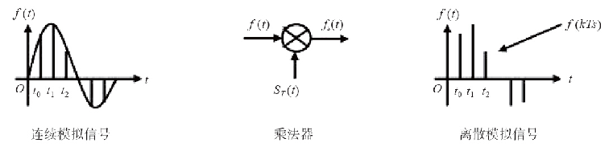

图1-6　抽样

### PCM

PCM（Pulse Code Modulation）的全称是脉冲编码调制。它是一种通用的将模拟信号转换成以0和1表示的数字信号的方法。

一般来说，人的声音频率范围在300~3400Hz之间，通过滤波器将超过4000Hz的频率过滤出去，便得到4000Hz内的模拟信号。然后根据抽样定理，使用8000Hz进行抽样，便得到离散的数字信号。使用PCM方法得到的数字信号就称为PCM信号，一般一次抽样会得到16bit的信息。

为了更有效地在线路上进行传输，通常对PCM信号进行一定的压缩。通过使用压缩算法 [5]，可以将每一个抽样值压缩到8bit。这样1秒的抽样就得到8bit×8000=64000bit的信号（简称64kbit），抽样速率（即传输速率）为64kbit/s [6]。

PCM通常有两种压缩方式：A律和μ律。其中北美使用μ律，我国和欧洲使用A律。这两种压缩方法很相似，都采用8bit的编码获得12bit到13bit的语音质量 [7]。但在低信噪比的情况下，μ律比A律略好。A律也用于国际通信，因此，凡是涉及A律和μ律转换的情况，都由使用μ律的国家负责。

### 局间中继与电路复用技术

连接交换机（局）的E1或T1电路称为局间中继。交换机间的消息以及通话数据都是在局间中继上传送的，传统的交换机使用时分复用（TDM）技术将多路通话合并到一条数字中继线上，可以大大节省局间中继线的数量。

利用时分复用技术可以将32个64kbit/s的信道合并到一条2Mbit/s（64kbit/s×32=2.048Mbit/s，通俗来说就直接叫一个两兆）的电路上，这样的电路称为一个E1（在北美和日本，是24个64kbit/s复用，称为T1，速率是1.544Mbit/s）。在E1中，每一个信道称为一个时隙。其中，除0时隙固定传同步时钟外，其他31个时隙最多可以同时支持31路电话（有时候会使用第16时隙传送信令，这时最多支持30路电话）。

随着话务量的增加，交换机之间的电路越开越多，因而需要更高级别的电路复用技术。目前通常的做法是将63个E1合并到一个155Mbit/s（2×63+P=155，其中P是电路复用的开销）速率的光路（光纤）上，在SDH（Synchronous Digital Hierarchy，同步数字传输体系）技术中这称为STM-1（Synchronous Transfer Module，同步传输模块）。

当然，155Mbit/s速率的光路还可以使用波分复用等技术合并到1Gbit/s或10Gbit/s速率的光路上，实现话路收敛和传输。

[1] 参见http://en.wikipedia.org/wiki/E.164。 

[2] 当然，为了方便阅读，有时还会在电话电码中增加括号和短横线。 

[3] 参见http://zh.wikipedia.org/wiki/北美电话号码分类计划。

 [4] 又称采样定理或奈奎斯特·香农定理，见http://zh.wikipedia.org/wiki/采样定理。 

[5] 实际为压扩法，因为有的部分是压缩的，有的是扩张的。目的是给小信号更多的比特位数以提高语音质量。 

[6] bit/s即比特/秒，有时也写作bps（Bit Per Second）。注意，通常，对于二进制数来说K为大写，1K=1024，但此处的k为小写，1k=1000。

 [7] 目前我国使用的是A律13折线特性。基本原理是：使用非均匀量化方法和压缩扩张技术得到13段折线。感兴趣的读者可在Google上搜索“13段折线”进行更深入的了解。

## 我国电话网结构

我国的电话网由本地网与长途网组成，并通过国际交换中心进入国际电话网。

原有电话网的结构采用了等级制，共有五级，分别用C1～C5表示。其中C1～C4构成长途电话网，C5（端局）及汇接局（Tm）构成本地网。但随着社会和经济的发展，电话业务量迅速增加，横向话务流量日趋增多，新业务的需求不断涌现，五级网络结构由于转接段数多造成了接续时延长、传输损耗大、网络管理工作复杂、不利于新业务的开展等问题。因此，我国电话网正在由五级电话网向三级电话网转变，即将原来的C1级和C2级长途交换中心演变为DC1，原来的C3级和C4级交换中心演变为DC2，以便减少转接段数。下面，我们主要以本地网为例简单讲解一下电话网的结构。

图1-7所示的主体部分为我国一地级市固定电话网（称为本地网）的结构。通常，用户话机（如A、B、C、D）通过一对电话线连接到距离最近的交换机上，该交换机称为端局交换机（一般以区或县为单位）。端局交换机通过局间中继线连接到汇接局 [1]。长途电话需要通过所在长途局与其他长途局相连。但根据话务量要求，汇接局也可以直接与其他长途局开通高速直达中继（未画出）。为节省用户线，在一些人口比较集中的地方（如学校、小区），会在端局下再设模块局或接入网，用户话机（如a、b、c、d、e）则就近接入到模块局（或接入网）上。

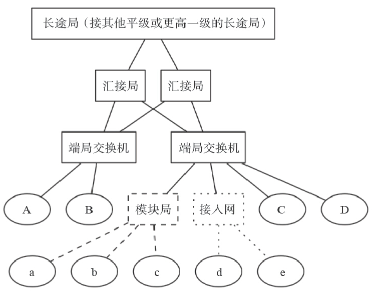

图1-7　我国固定电话网结构

在我国，智能网一般用于实现电话卡、预付费或400/800类业务，而前几年新部署的NGN（Next Generation Network，下一代网络，一般指软交换）则支持更灵活、更复杂的业务，包括IM/SMS/MMS等消息类业务、点对点交互式多媒体/文件共享/游戏等多方协作交互业务、内容分发业务、广播/多播业务、企业托管业务，以及数据检索、数据通信、在线应用、传感器网络、远程控制等各类多媒体业务和数据业务。

但是技术发展很快，为响应国家“光进铜退” [2]的号召，现在已经实现了直接光纤到户，也就是说很快全网都能IP化了。新技术代替旧技术，为用户带来了五彩斑斓的业务，但旧技术的一些优点则永远让人怀念，最典型的就是原来的电话线是带电的，家里停电不影响打电话。但光纤是不带电的，停电以后用户就不能打电话了（除非加UPS）。

在我国的移动网络中，大量部署了IMS。IMS具有组网灵活的优点，但涉及的网元和基本概念很多，对于非专业人士来说理解起来有些困难。我们将在本章的最后一节对IMS进行专门的讨论。

[1] 为了保证安全，汇接局通常会成对出现，平常实行负荷分担，一台汇接局出现故障，与之配对的汇接局会承担其负责的所有话务。

[2] 用户家里的电话线使用铜双绞线。

## 信令

用户设备（如话机）与端局交换机之间，以及交换机与交换机之间需要进行通信。这些通信所包含的信息有（但不限于）用户、中继线状态、主叫号码、被叫号码、中继路由的选择等。我们把这些消息称为信令（Signaling）。

### 信令分类

按照不同分类方式，信令可以分成很多种。下面介绍信令主要的几种分类方式。

（1）按信令的功能分

按照功能的不同，信令可以分成以下三种：

- 线路信令：具有监视功能，用来监视主被叫的摘、挂机状态及设备忙闲。
- 路由信令：具有选择功能，指主叫所拨的被叫号码，用来选择路由。
- 管理信令：具有操作功能，用于电话网的管理和维护。

（2）按信令的工作区域分

信令按照工作区域的不同可以分成以下两种：

- 用户线信令：是用户终端与交换机之间的信令。它包括用户状态（摘、挂机）信号、用户拨号（脉冲、DTMF）所产生的数字信号，以及交换机向用户终端发送的信号（铃流、信号音）。
- 局间信令：是交换机和交换机之间的信令，在局间中继线上传送，用来控制呼叫接续和拆线。

**注意**：用户线信令少而简单，局间信令多而复杂。

（3）按信令的信道分

按照信道的不同，信令可以分为以下两种：

- 随路信令：信令和话音在同一条话路中传送。
- 公共信道信令：以时分方式在一条高速数据链路上传送一群话路。

随路信令传送速度慢，信息容量有限（传递与呼叫无关的信令能力有限）；公共信道信令传送速度快、容量大，具有改变或增加信令的灵活性，便于开放新业务。

（4）其他分类

另外，信令还可分为带内信令和带外信令、模拟信令和数字信令、前向信令和后向信令、线路信令和记发器信令等，我们在这里就不多解释了，有兴趣的读者可以自行搜索相关的关键词进一步学习。

下面我们分别对一些重要的信令进行简单介绍。

### 用户线信令

从用户终端（通常是话机）到端局交换机之间经常需要传送一些控制信息，如用户摘机、挂机、拨号、主叫号码显示等，这些信息称为用户线信令。用户线信令可以通过模拟或数字信号传递。

对于普通的话机，线路上传送的是模拟信号，因此信令只能在电话线路上传送，这种信令称为带内信令。话机通过电压变化来传递摘、挂机信号；通过DTMF（Dual Tone Multi Frequency，双音多频 [1]）传送要拨叫的电话号码。另外，也可以通过移频键控（Frequency Shift-keying，FSK）技术来支持主叫号码显示，俗称来电显示（Caller Line Identification Presentation，Caller ID或CLIP，主叫线路识别提示）。

与普通电话不同，ISDN（Integrated Service Digital Network，综合业务数字网）在用户线上传送的是数字信号。它的基本速率接口（Base Rate Interface，BRI）使用144kbit/s的2B+D信道——两个64kbit/s的B信道及一个16kbit/s的D信道。其中B信道一般用来传输话音、数据和图像，D信道用来传输信令或分组信息。

2B+D的ISDN最初是为了解决用户线上的语音与数据同步传输问题。但事实上，2B+D的ISDN并不像传说中那么美，而且需要专门的NT1终端设备，在我国并没有发挥出它应有的作用，后来很快被ADSL技术取代了。

### 局间信令

交换机与交换机之间也需要传送控制信号，用于话路的建立、释放等，这些控制信号就称为局间信令。局间信令主要在局间中继上传送，传送局间信令的电路称为信令链路。一般来说，一条信令链路通常只占用一个64kbit/s的时隙。一条信令消息通常只有几十或上百个字节，一条64kbit/s的电路足以容纳成千上万路电话所需要的信令。但随着技术的进步、话务量的上涨以及更多增值业务的出现，完成一次通话需要更多的信令消息，因此出现了2Mbit/s速率的信令链路，即整个E1链路上全部传送信令。

目前在传统的PSTN网络中常见的局间信令有ISDN PRI（Primary Rate Interface，基群速率接口）信令和七号信令。PRI信令和话路在同一个E1上传送，通常使用第16时隙，而0时隙传送同步信号，其他30个时隙可传输通话信息，因此又称30B+D。与PRI信令不同，七号信令除可以与话路在同一个E1上传送外，还可以在专门的用于传送信令链路的E1中继上传送，因而它组网更加灵活，支持更大的话务量。我们将在下一节专门讲解七号信令。

支持七号信令的每个通信设备都需要有一个全局唯一信令点编码，而信令点编码资源是比较有限的。因而，七号信令主要在运营商的设备上使用，而运行商与用户设备（如PBX）一般使用PRI信令对接。

### 七号信令

七号信令（Signaling System No.7，SS7）是我国目前使用的主要信令方式，用于局间通信。我国的电话网络中有专门的七号信令网。

在此，我们先来看一次简单的固定电话的通话流程。如图1-8所示，用户a摘机，与其相连的交换机A根据电压、电流的变化检测到a摘机后，即向a发送拨号音，同时启动收号程序。a听到拨号音后开始拨号，待交换机A收齐号码后，即查找路由，发送IAM（Initial Address Message，初始地址消息）给交换机B。B向A发ACM（Adress Complete Message，地址全消息）并通知用户b（b的话机）振铃，A向a送回铃音。这时如果b接听电话，则B向A发送ANC（Answer Charge，应答计费消息），a与b开始通话，同时A对a进行计费 [2]。

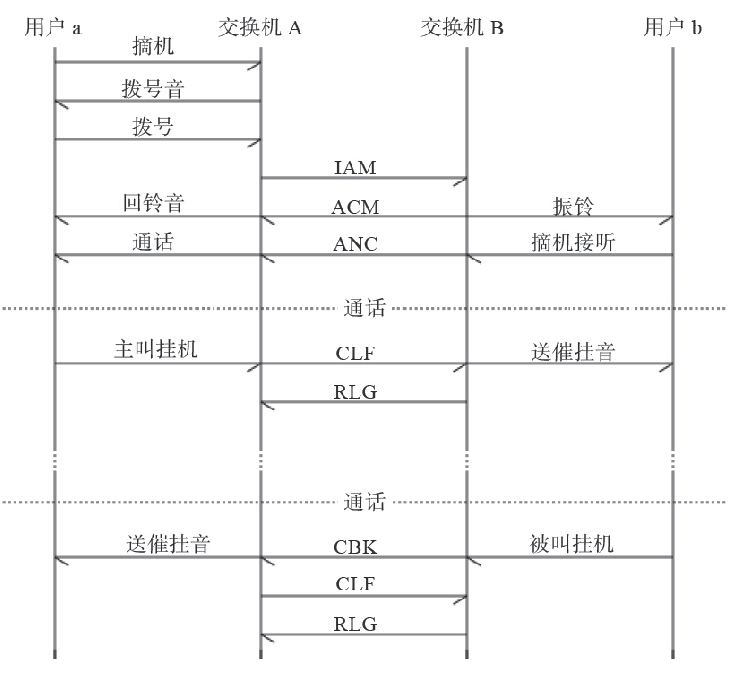

图1-8　七号信令局间呼叫流程

通话完毕，如果主叫挂机，则本端交换机A向对端B发送CLF（Clear Forward，前向释放消息），B向A返回RLG（ReleaseGard，释放监护消息），并向b传送催挂音（嘟嘟嘟……）。

如果被叫挂机，则B向A发送CBK（Clear Backword，后向释放消息），A回送CLF，最后B返回RLG。

上面在交换机A与B之间传递的为七号信令中的TUP（Telephone User Part，电话用户部分）。目前，由于ISUP（ISDN User Part，ISDN用户部分）能与ISDN互联并提供比TUP更多的能力和服务，故其已基本取代TUP成为我国七号信令网采用的主要信令方式。ISUP信令与TUP互通时的对应关系如图1-9所示。

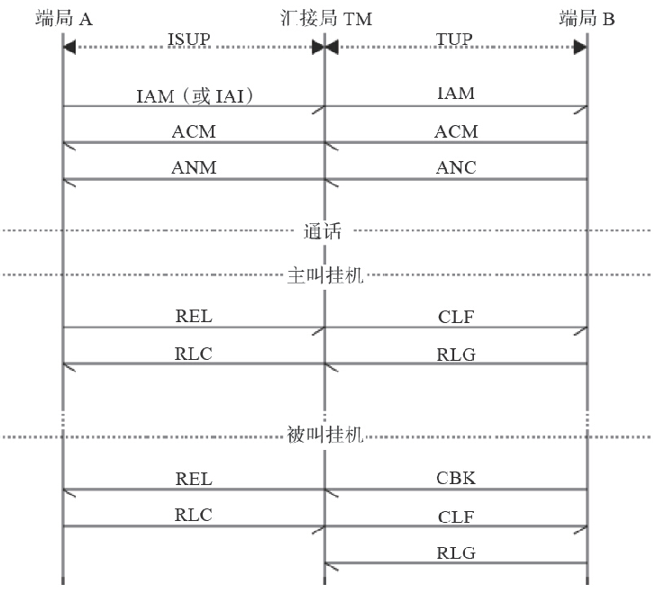

图1-9　ISUP与TUP互通信令流程

图1-9所示为端局A与端局B经过汇接局TM汇接通信中ISUP与TUP信令的例子。ISUP信令的初始地址消息有IAM和IAI（IAM With Additional Information，带附加信息的IAM）两种，后者能提供更多的信息（如主叫号码等）。另外ISUP信令的拆线信号不分前后向，只有REL（Release，释放）和RLC（Release Complete，释放完成）。

在上一节中我们提到了ISDN PRI信令，出于完整性的考虑，这里我们也来看一下ISUP与ISDN PRI信令互通的例子。ISDN PRI使用SETUP/CONNECT/RELEASE消息分别对应ISUP中的IAM/ANM/REL消息，如图1-10所示。

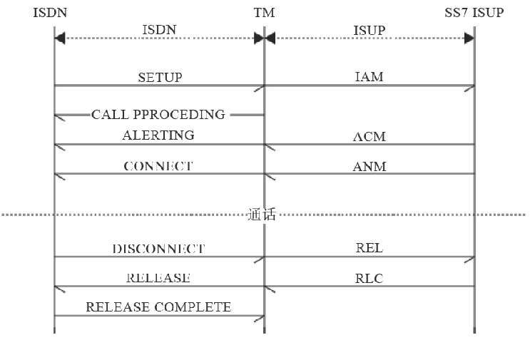

图1-10　ISUP与ISDN互通的信令流程

### H.323与SIP信令

H.323与SIP属于VoIP领域的通信信令，它们适用于用户线信令和局间信令，由于IP终端比普通话机更加智能，因此这些信令在用户线信令及局间信令使用方式上已没有太大区别。

H.323是ITU多媒体通信系列标准H.32x的一部分，该系列标准使得在现有通信网络上进行视频会议成为可能，其中，H.320是在N-ISDN上进行多媒体通信的标准；H.321是在B-ISDN上进行多媒体通信的标准；H.322是在有服务质量保证的LAN上进行多媒体通信的标准；H.324是在GSTN和无线网络上进行多媒体通信的标准。H.323为现有的分组网络PBN（如IP网络）提供多媒体通信标准，若和其他的IP技术（如IETF的资源预留协议RSVP）相结合，就可以实现IP网络的多媒体通信。

SIP（Session Initiation Protocol，会话发起协议）是由IETF（Interne工程任务组）提出的IP电话信令协议。正像其名字所隐含的那样，SIP用于发起会话，它能控制多个参与者参加的多媒体会话的建立和终结，并能动态调整和修改会话属性，如会话带宽要求、传输的媒体类型（语音、视频和数据等）、媒体的编解码格式、对组播和单播的支持等。

H.323和SIP设计之初都是作为多媒体通信的应用层控制（信令）协议，目前一般用于IP电话。它们能实现的信令功能基本相同，也都利用RTP作为媒体传输的协议。但两者的设计风格截然不同，这是由于推出它们的两大阵营（电信领域与Internet领域）都想沿袭自己的传统。H.323是由国际电信联盟提出来的，它企图把IP电话当作众所周知的传统电话，只是传输方式由电路交换变成了分组交换，就如同模拟传输变成数字传输、同轴电缆传输变成了光纤传输。而SIP侧重于将IP电话作为Internet上的一个应用，较其他应用（如FTP，E-mail等）增加了信令和QoS的要求。H.323推出较早，协议发展得比较成熟，由于其采用的是传统的实现电话信令的模式，故便于与现有的电话网互通，但相对复杂。SIP借鉴了其他Internet标准和协议的设计思想，有其突出的优点。

- SIP是基于文本的协议，而H.323采用基于ASN.1和压缩编码规则的二进制方法表示其消息，因此，SIP对以文本形式表示的消息的词法和语法分析比较简单。
- SIP会话请求过程和媒体协商过程等是一起进行的，因此呼叫建立时间短，而在H.323中呼叫建立过程和进行媒体参数等协商的信令控制过程是分开进行的。
- H.323为实现补充业务定义了专门的协议，如H.450.1、H.450.2和H.450.3等，而SIP只要充分利用已定义的头域，必要时对头域进行简单扩展就能很方便地支持补充业务或智能业务。
- H.323进行集中、层次式控制。尽管集中控制便于管理（如便于计费和带宽管理等），但是当用于控制大型会议电话时，H.323中执行会议控制功能的多点控制单元很可能成为瓶颈。而SIP类似于其他的Internet协议，设计上为分布式的呼叫模型服务，具有分布式的组播功能。

关于SIP信令我们将在第8章详细讲解，读者可以先在这里参考一下图1-11所示的ISUP与SIP间的信令转换关系图，以便建立一个直观的印象。

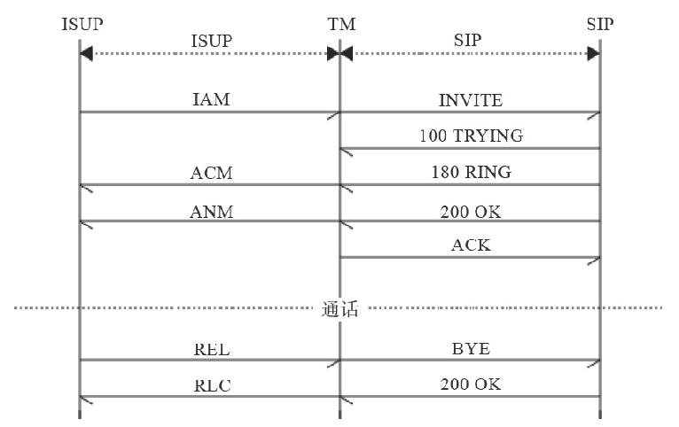

图1-11　ISUP与SIP互通的信令流程

[1] 话机上每个数字或字母都可以发送一个低频和一个高频信号相结合的正弦波，交换机经过解码即可知道对应的话机按键。 

[2] B也可以对A计费，这种收费方式称为中继计费，主要用于局间结算（话费）。如果A和B分属于不同的运营商（如移动和电信），则称为网间结算。

## 媒体

信令主要传输一些控制信号，而通信双方需要听到的是对方的语音数据，这些语音数据就称为媒体（Media）。随着通信系统能力的提高及更加高级、智能的终端设备的出现，通信系统所能传输的媒体类型也越来越丰富，比较典型的有我们刚才提到的语音，还有视频、文字信息（短消息）、传真等。

在SIP通信中，除文字外，媒体都是在RTP协议中传输的。由于媒体一般都是持续传输的，因此又称RTP流。

举一个通俗一点例子：假设张三乘火车从北京到南京，那么张三就是媒体。而火车称为承载（或载体，Carrier）。为了保证正常运行，火车需要听从控制信号的指挥，而这些控制信号就相当于信令。如果信令出了问题，媒体就可能无法正常到达了。当然这个比方可能不十分恰当，你也可以认为张三和火车都是媒体，只不过张三被火车“包”了一层，而铁路才是真正的载体。不管怎么说，在SIP通信中，SIP相当于这里的火车控制信号，RTP流中的语音数据相当于很多张三，他们被RTP又“包”了一层，通过以太网承载到达目的地。

## 　电路交换与分组交换

在传统的电路交换中，两个通信节点间需要建立一个专用通路，这会导致电路利用率较低。而报文交换以报文作为数据交换的单位，携带目标地址、源地址等信息，在节点间采用存储转发的方式，不需要建立专门的通信线路，可以大大提高通信线路的利用率。分组交换是报文交换的特殊情形，下面我们来介绍一下电路交换和分组交换 [1]。

### 电路交换

传统的电话都是基于电路交换的。由于电路交换在通信之前要在通信双方之间建立一条被双方独占的物理通路（由通信双方之间的交换设备和链路逐段连接而成），因而有以下优缺点。

电路交换的优点：

- 由于通信线路为通信双方用户专用，数据直达，所以传输数据的时延非常小。
- 通信双方之间的物理通路一旦建立，双方可以随时通信，实时性强。
- 双方通信时按发送顺序传送数据，不存在失序问题。
- 电路交换既适用于传输模拟信号，又适用于传输数字信号。
- 进电路交换的设备（交换机等）及控制均较简单。

电路交换的缺点：

- 电路交换的平均连接建立时间对计算机通信来说较长。
- 建立电路交换连接后，物理通路被通信双方独占，即使通信线路空闲，也不能供其他用户使用，因而信道利用率低。
- 在进行电路交换时，数据直达，不同类型、不同规格、不同速率的终端很难相互进行通信，也难以在通信过程中进行差错控制。

### 分组交换

我们熟悉的IP交换采用的就是分组交换的方式。它仍采用存储转发的传输方式，但将一个长报文先分割为若干个较短的分组，然后把这些分组（携带源、目的地址和编号信息）逐个地发送出去，因此分组交换除了具有报文交换的优点外，与报文交换相比其还有以下优缺点。

分组交换的优点：

+ 加快了数据在网络中的传输速度。因为分组是逐个传输，可以使后一个分组的存储操作与前一个分组的转发操作并行，这种流水线式传输方式减少了报文的传输时间。此外，传输一个分组所需的缓冲区比传输一份报文所需的缓冲区小得多，这样因缓冲区不足而等待发送的几率及等待的时间也必然少得多。
+ 简化了存储管理。因为分组的长度固定，故相应的缓冲区的大小也固定，在交换节点中存储器的管理通常被简化为对缓冲区的管理，相对比较容易。
+ 减少了出错几率和重发数据量。因为分组较短，其出错几率必然减少，每次重发的数据量也就大大减少，这样不仅提高了可靠性，也减少了传输时延。
+ 由于分组短小，更适用于采用优先级策略，便于及时传送一些紧急数据，因此对于计算机之间的突发式的数据通信，分组交换显然更为合适些。

分组交换的缺点：

- 尽管分组交换比报文交换的传输时延少，但仍存在存储转发时延，而且其节点交换机必须具有更强的处理能力。
- 分组交换与报文交换一样，每个分组都要加上源、目的地址和分组编号等信息，使传送的信息量增大5%～10%，这在一定程度上降低了通信效率，增加了处理的时间，使控制复杂、时延增加。
- 当分组交换采用数据报服务时，可能出现失序、丢失或重复分组，分组到达目的节点时，要对分组按编号进行排序等工作，增加了麻烦。若采用虚电路服务，虽无失序问题，但有呼叫建立、数据传输和虚电路释放三个过程。

总之，若要传送的数据量很大，且其传送时间远大于呼叫时间，则采用电路交换较为合适；当端到端的通路有很多段的链路组成时，采用分组交换传送数据较为合适。从提高整个网络的信道利用率上看，报文交换和分组交换优于电路交换，其中分组交换比报文交换的时延小，尤其适合计算机之间的突发式的数据通信。

[1] 参考自：http://baike.baidu.com/view/188266.htm。

## 　VoIP

维基百科上是这样说的：IP电话（Voice over Internet Protocol，VoIP，又称宽带电话或网络电话）是一种透过互联网或其他使用IP技术的网络来实现的新型电话通信。过去IP电话主要用在大型公司的内联网内，技术人员可以复用同一个网络提供数据及语音服务，除了简化管理，更可提高生产力。随着互联网日渐普及，以及跨境通信数量大幅飙升，IP电话亦被应用在长途电话业务上。由于世界各主要大城市的通信公司竞争日益剧烈，以及各国电信相关法令松绑，IP电话也开始应用于固网通信，因其具有的低通话成本、低建设成本、易扩充性及日渐优良化的通话质量等主要特点，被目前国际电信企业看成是传统电信业务的有力竞争者。更详细的内容参见维基百科上的“IP电话” [1]。

目前，VoIP呼叫控制协议主要有SIP、H.323、MGCP与H.248/MEGACO等。

[1] 参见http://zh.wikipedia.org/wiki/IP电话。

## IMS

IMS [1]涉及的概念和名词术语相当多，本节将简单加以介绍，对此感兴趣的读者参考，也可以根据这里提到的关键词到网上搜索或查找相关书籍进行更深入的学习。其他读者可跳过本节。

### 什么是IMS

IMS的全称是IP多媒体子系统（IP Multimedia Subsystem），它是一个基于IP网提供语音及多媒体业务的网络体系架构。它最初是由3G标准化组织3GPP [2]设计的，作为其GSM之后的未来移动网络远景目标的一部分。IMS的最初的版本（3GPP R5）主要是给出了一种基于GPRS来实现IP多媒体业务的方法。在这个版本的基础上，3GPP、3GPP2以及TISPAN进行了进一步的更新，以支持GPRS之外的（诸如WLAN、CDMA2000和固定等）其他接入网络。从目前来看，IMS是独立于接入网技术的，尽管它与底层传输功能有着很多联系。

从另外一个角度看，IMS实际上是IP网上的一个应用系统。IP网的相关技术标准主要由IETF制定，包括应用层（如Email（POP3、SMTP）、文件传输（FTP）、网页浏览（HTTP）等）的相关协议标准。IETF负责制定了与实时应用（Real-time Applications）相关的协议标准，包括SIP、RTP等。IMS使用的基本都是IETF相关的协议标准（SIP、Diameter等），不同的是，ISM在其基础上又进行了详细的操作性描述和增强，以便提供一种完整的、健壮的多媒体系统。这些操作性描述和增强为运营商控制、分责任、计费和安全提供了支持。

IP多媒体的全套解决方案是由终端、GERAN（GSM EDGE Radio Access Network，GSM/EDGE无线通信网络）或UTRAN（UMTS Terrestrial Radio Access Network，UMTS陆地无线接入网）、GPRS核心网和IP多媒体核心网子系统的一些特殊的功能单元来支持的。这些功能单元包括呼叫会话控制功能（CSCF）、媒体网关控制功能（MGCF）、IP多媒体网关功能（IM-MGW）、多媒体资源功能控制器（MRFC）、多媒体资源功能处理器（MRFP）、签约定位功能（SLF）、出口网关控制功能（BGCF）、应用服务器（AS）、信令网关功能（SGW）等。

IMS网元众多，其核心网络基本架构如图1-12所示。

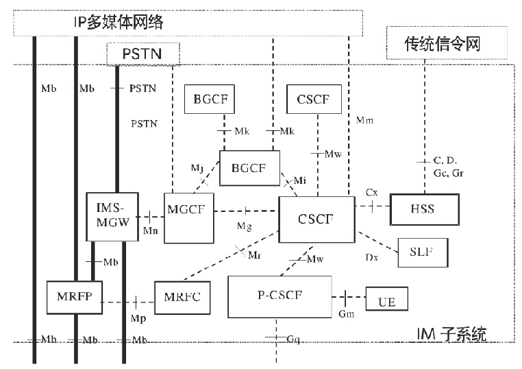

图1-12　IMS基本架构

### IMS的特点

IMS具有以下特点：

- 采用SIP作为呼叫控制协议。基于SIP协议实现了呼叫控制和业务控制的分离，并增强了多媒体支持能力。

- 支持Diameter协议。Diameter是IETF开发的协议，用于认证、授权和计费（Authen-tication、Authorization、Accouting，AAA）。

- 采用归属控制方式。对于移动用户而言，通过归属控制，即使用户漫游到外地，也可以享受到与归属地同样的服务。

- 采用接入无关性。提供优越的融合特性，核心功能与具体接入技术无关。

- 业务、控制、承载层完全分离。IMS进一步发扬了NGN软交换结构中业务与控制分离、控制与承载分离的思想，与软交换相比其进行了更充分的网络解耦，网络结构更加清晰合理，同时不同类型网络的解耦也为网络在不同层次上的重新聚合创造了条件。这种重新聚合，就是网络新的融合的过程。

- 增强计费功能。通过CCF（计费采集功能），可以支持更灵活的在线、离线计费。

- 增强多媒体业务。在增强多媒体业务这方面，主要体现在Presence（呈现）、Messaging（短消息）、Conferencing（会议）、PoC（Push-to-talk over Cellular，基于移动网络、采用VoIP技术的集群对讲业务）、MBMS：Multimedia Broadcast Multicast Service（多媒体广播多播服务）等几个方面。

    

### IMS核心网元

IP多媒体子系统像CS域（Circut Switched Domain，用于向用户提供电路型业务连接）、PS域（Packet Switched Domain，用于向用户提供分组型业务的连接）子系统一样，可以完成呼叫的发起、保持、释放等功能。另外，它还要对多媒体进行转换控制以及对多媒体业务提供支持，所以包含更多的功能实体来分别完成不同的功能。

（1）CSCF

CSCF（Call Session Control Function，呼叫会话控制功能）根据在网络中所处的位置的不同，承担的作用也不一样，它可以分为如下三种类型：

- 代理CSCF（P-CSCF）：它是IMS中与用户的第一个连接点，提供Proxy（代理）功能，即接受业务请求并转发它们。P-CSCF在某些情况下也可以提供UA（用户代理）功能。
- 问询CSCF（I-CSCF）：类似IMS的关口节点，分配S-CSCF、路由查询以及IMS域间拓扑隐藏。
- 服务CSCF（S-CSCF）：它在IMS核心网中处理核心控制地位，负责对UE的注册鉴权、会议控制以及用户数据管理等。

（2）MGCF

MGCF（Media Gateway Control Function，媒体网关控制功能）一般用于以下场景：

- 控制IMS-MGW中的媒体信道的连接。
- 与CSCF通信。
- 根据路由号码，为从传统网络来的入局呼叫选择CSCF。
- 执行ISUP协议和IMS呼叫控制协议间的转换。

（3）IM-MGW

一个IM-MGW（IP Multimedia-Media Gateway Function，多媒体网关功能）可以终止来自电路交换网的承载信道和来自分组网的媒体流（如IP网中的RTP流）。IM-MGW可以支持媒体转换、承载控制和负荷处理（例如，多媒体信号编解码器、回声消除器、会议桥等）。它包含如下功能：

- 通过与MGCF交互来进行资源控制。
- 拥有并维护回声消除器等资源。
- 可能需要多媒体数字信号编、解码器。

IMS-MGW要提供必要的资源来支持UMTS/GSM媒体传输，还需要对H.248协议进行进一步的调整来支持额外的多媒体数字编、解码器等。

（4）MRF

MRF（Multimedia Resource Function，多媒体资源功能）分成两部分，包括MRFC（Multimedia Resource Function Controller，多媒体资源功能控制器）和MRFP（Multimedia Resource Function Processor，多媒体资源功能处理器）。

- MRFC的主要功能：控制MFP中的媒体流资源；翻译来自AS和S-CSCF的信息（会话标志符等），并相应地对MRFP进行控制；产生计费记录。
- MRFP的主要功能：控制Mb接口点的承载；提供MRFC需要的资源，混合输入媒体流（如用于多方会议），发出多媒体流（如用于多媒体广播），处理多媒体流（如语音编码转换、媒体分析）等。

（5）SLF

在会话建立期间，被I-CSCF查询，SLF（Subscription Locator Function，签约定位功能）向I-CSCF提供存储用户具体数据的HSS的名字；通过Dx接口来接入IMS。在单一的HSS环境中，并不需要SLF。

（6）HSS

HSS（Home Subscriber Server，归属用户服务器功能）是一个数据库实体，它用于在归属网络中保存用户的签约信息，包括基本标志、路由信息及业务签约信息等。HSS中保存的主要信息包括：

- IMS用户标识（包括公有及私有标志）：号码地址信息。
- IMS用户安全上下文：用户网络接入认证密钥信息、漫游限制信息等。
- IMS用户的路由信息：HSS支持用户注册，并且存储用户的位置信息。
- IMS用户的业务签约信息：包括其他AS增值业务数据。

（7）BGCF

BGCF（Breakout Gateway Control Function，出口网关控制功能）用于选择与PSTN（或CS域）接口点相连的网络。如果BGCF发现自己所在的网络与接口点相连，那么BGCF就选择一个MGCF，该MGCF负责与PSTN（或CS域）的交互。如果接口点在另一个网络，那么BGCF就把会话信令转发给另一个网络的BGCF。BGCF在选择与PSTN相连的网络的时候，会利用收到的其他协议的信息和管理信息。BGCF的主要功能如下：

- 收到S-CSCF请求后，为呼叫选择一个适当的PSTN（或CS域）接口点。
- 选择一个与PSGN（或CS域）相连的网络。如果本网络没有与PSTN相连，那么BGCF就把SIP信令转发给与PSTN（或CS域）相连的网络的BGCF。
- 在与PSTN（或CS域）相连的网络中，选择一个MGCF，并把SIP信令转发给MGCF。
- 生成计费记录。

（8）SGW

SGW（Singnalling Gateway Function，信令网关功能）完成传输层的信令转换，在基于SS7的信令与基于IP的信令之间转换（也就是在Sigtran SCTP/IP和SS7 MTP之间进行转换）。SGW不对应用层的消息进行解释，但必须对底层的SCCP或SCTP消息进行解释来保证信令的正确路由。

（9）AS

在IMS系统中，实现了业务与控制的完全分离，所有的具体业务都是通过应用服务器（Application Server，AS）来提供的。应用服务器通过一种称为开放服务架构（Open Service Architecture，OSA）的方式引入了Internet上应用的开发模式，为IT应用与电信网的融合奠定了技术基础。AS与CSCF之间使用SIP协议通信。对于不同的服务，AS可以选择不同的SIP模式，如SIP代理模式、SIP用户代理（UA-User agent）模式和SIP B2BUA模式。AS可以设置在IMS本网内，也可以设置在外部的第三方网络中。如果位于本网，它还可以利用Sh或Si接口查询HSS。

一般来说，AS包含以下三类功能与实体：

- SIP AS（Application Server）：基于SIP的应用服务器，负责提供IMS的具体服务。SIP AS和S-CSCF之间直接利用SIP及其扩展的呼叫信令协议，因此不需要进行呼叫信令协议之间的转换工作。另外由于基于SIP可以非常方便地实现语音、数据以及视频等多媒体类的会话，因此SIP AS可以高效率地提供各种新型的融合业务。
- IM-SSF（IP Multimedia Service Switching Function）：IP多媒体交换功能实体，它作为SIP和智能网的CAP（CAMEL [3]Application Part，CAMEL应用部分）之间的接口，为IMS用户提供增值业务。可以位于用户归属网，也可以由第三方提供，主要用于处理IMS发来的SIP会话、发起SIP请求、发送计费信息给CCF和OCS。
- OSA-SCS（Open Service Access-Service Capability Server）：SIP和OSA框架之间的接口。SCS实际上是负责API具体实现的功能实体，它与核心网络元素（如HLR、MSC、SSP等）进行交互。这样，一个SCS服务程序就相当于一个进入核心网络的一个代理或一个网关。

### SIP协议的参考点

IMS网络中使用SIP协议的主要参考点如表1-1所示。

表1-1　SIP主要参考点

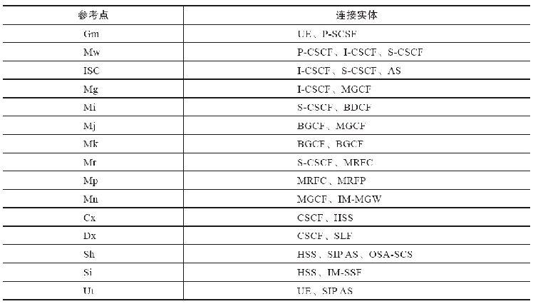

[1] 参见http://zh.wikipedia.org/zh-cn/IP多媒体子系统。 

[2] 第三代合作伙伴计划（3rd Generation Partnership Project）是一个成立于1998年12月的标准化机构。目前其成员包括欧洲的ETSI、日本的ARIB和TTC、中国的CCSA、韩国的TTA和北美洲的ATIS，详见https://zh.wikipedia.org/wiki/3GPP。

[3] Customised Applications for Mobile networks Enhanced Logic，即移动网络定制应用增强逻辑服务器，它扩展了智能网（IN）提供给移动环境的业务范围，使移动网络能更容易地实现基于智能网的增值业务。参考：https://en.wikipedia.org/wiki/CAMEL。

## 小结

本章介绍了通信系统的一些历史故事和背景知识，其中PSTN起源部分简单介绍了交换机的起源及历史演变过程。科技的发展带来了技术的变革，但从另一方面讲，这些变化不仅是技术驱动的，更多的是在社会的发展过程中改变了人们的生产生活方式，又影响并推动了技术的发展。了解这些背景知识对于理解交换系统的各种功能会有很大的帮助。同时，读者也可以延伸思考一下：在这些技术发展的历程中，用户、运营商、设备制造商又各自扮演了哪些角色；他们各自得到哪些好处；有哪些痛处；这些又是如何取得平衡的；等等。思考这些问题有助于把握技术的发展方向，从而更容易理解技术的实现方式和来龙去脉。

本章还重点讲了信令的知识，并对典型信令间的互通及对应关系给出了呼叫时序图。由于本书处处都有SIP信令的影子，因此，希望这些时序图能给读者一个直观的印象。对初学者而言，理解各种信令之间既有所不同的，又有相似的地方就可以了，对于实际互通的细节则没必要深究。当然，读了后面的章节后再回到本章肯定能加深对信令系统的了解。

另外，我们还专门介绍了IMS基本概念。虽然IMS不是我们研究的重点，而且IMS中太多的概念和术语也会让初学者摸不着头脑，但IMS本身作为SIP协议的最大用户仍有了解的价值。通过对后面章节的学习，读者就能更深入了解FreeSWITCH可以在IMS网络中充当什么角色，进而更容易理解通信网的总体架构和设计思想。当然，对于初学者来说粗略了解一下IMS部分即可，等学完后面章节再回过头来看会更有心得。