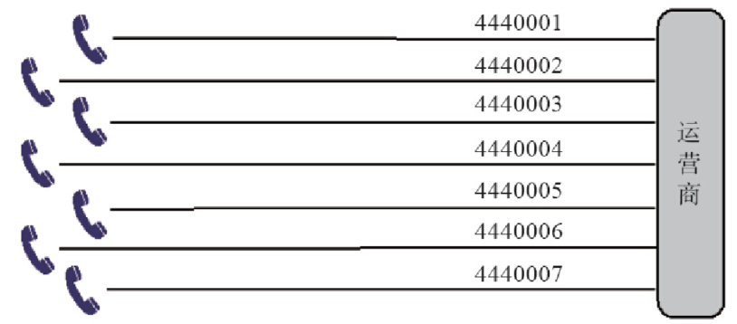
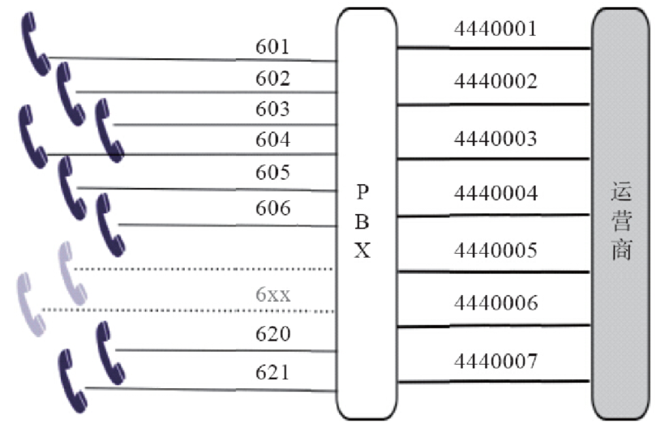
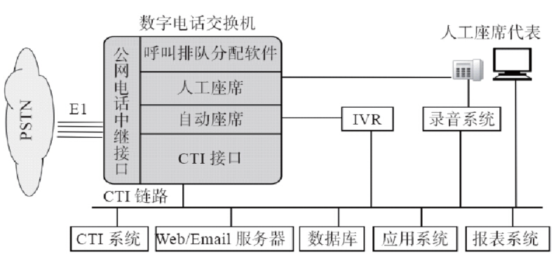
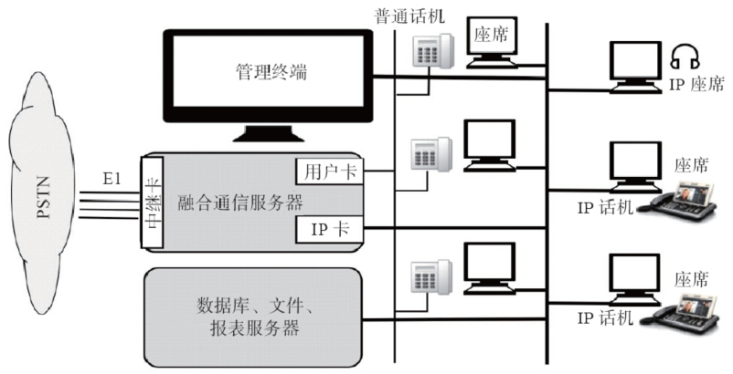
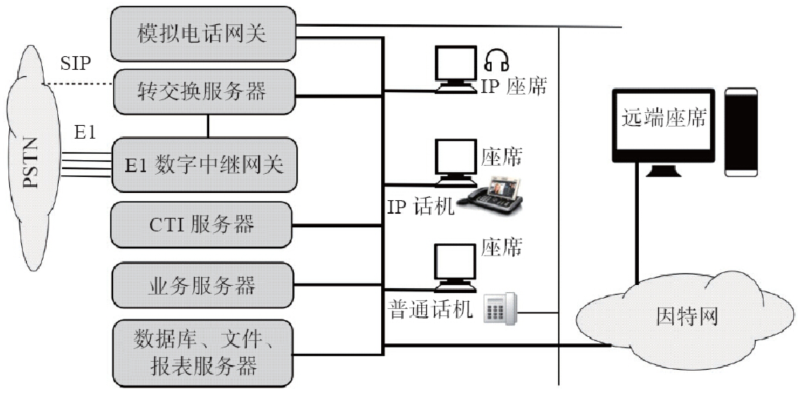
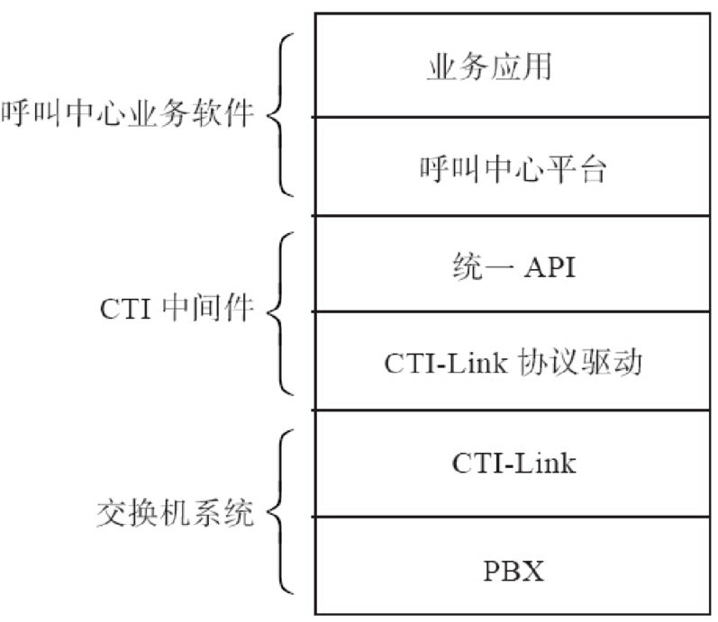

# 第01章 PSTN与VoIP基础

# 第02章 PSTN、PBX及呼叫中心业务

我们在第1章学习了PSTN和VoIP的基本概念和术语，在本章我们接着了解一下传统的电话网及交换设备。这些服务有的是读者已经熟悉的，有的可能没听说过。有一些传统业务在VoIP时代实现起来异常简单，而有一些业务可能已经不需要了。

为了更深入地理解这些业务，在本章我们也对一些基本的概念，如中继线、IP-PBX等加以深入介绍。
另外，考虑到相当一部分读者可能把FreeSWITCH应用到呼叫中心或相关业务中，在本章我们也对呼叫中心业务进行了简单的介绍，并简单讨论一下在FreeSWITCH中的实现思路。

## PSTN业务

我们还是从传统的PSTN业务开始讲起。除了为用户提供基本的语音通话外，PSTN还能提供一些附加的业务，如叫醒服务、呼叫转移等，为人们的生产和生活提供方便。这些业务有的可以由运营商为用户设置，有的也可以由用户拨打某些特殊的号码自行激活和取消。下面我们分类来介绍一下。

### POTS

POTS（Plain Old Telephone Service）即普通老式电话业务。POTS是沿用国外的叫法，在国内我们称之为新业务。当然，新业务这种叫法这还是沿用数年前的叫法。这些业务有的是收费的，有的是不收费的。它们的接入号码通常以“*”开头。古老的话机是转盘式的，使用脉冲方式拨号，只能拨0～9的号码，现在在现实生活中已很少用了，但大家从电影上经常能看到。现代的话机多为按键式，使双音频方式拨号，上面有0～9、*和#字等键。其中，*字键通常读作“星” [1]。有的话机上还有A、B、C、D键，但这些键很少用到。另外有的话机上还有各种其他的功能键，如号码翻查、重拨等。在某些新业务中（如三方通话），会用到话机上的叉簧，快速拍一下可以给交换机传递相关信号，某些话机上有专门的Flash键、R键或闪断键。下面仅列举几种典型的业务：*

- 缩位拨号（Abbreviated dialing）。通过事先登记的代码代替长号码，可以减少记忆难度，加速拨号。比如，拨“\*\*1”可以拨叫之前指定的号码（比如12345678），该功能比较实用。

- 呼叫前转（Call Forwarding，有时也称呼叫转移）。分三种基本情况：无条件转移，即任何来电转移至事先登记的号码；遇忙转移，若被叫忙，则转移；无应答转移（或称久叫不应转移），若指定时间内无应答，则转移。其中大部分交换机上无条件转移的登记方式为“*57*电话号码#”，取消方式为“#57#”。登记成功后，所有到该话机的来电会转到所登记的电话号码。如在话机A上操作“*57*B#”，则所有对A的呼叫都会转移到B上。适用于将家里或办公室电话转移到手机上的情况。运营商也经常使用该功能作一些特殊的业务，如改号通知，即通过后台操作将某一号码转移至特定的语音平台，实现类似“您拨的电话已改号，新的号码是XXX”的功能。

- 新转移方式。在移动电话及小灵通等出现后，又有了新的转移方式，如不在服务区转移等。

- 立即热线（Hotline）。拿起电话不用拨号即自动拨打某号码，方便拨号。笔者在北京某银行网点用过该项业务，拿起电话直接连接到他们的自助语音服务。

- 延迟热线（Delayed Hotline）。与立即热线差不多，区别是摘机后会延迟一段时间（如5秒）再自动拨号，在特殊场合有用。

- 呼叫等待（Call Waiting）。被叫忙时，主叫仍会听到正常的回铃音（或个性化的语音提示：请不要挂机，您拨打的电话正在通话中……），而交换机会通过特殊的提示音提示有新电话呼入，被叫可选择是否接听，或在两者间切换。

- 三方通话（Three Way,Conference Call）。通过比较复杂的操作实现三方通话，某些交换机支持最多五方的通话（会议电话），更多方的电话会议系统需要专门的平台。

- 来电显示（Caller ID Presentation）。就是在被叫话机上显示主叫方的电话号码。

- 呼出限制（Call Barring，又称密码限呼）。呼叫某类号码（如长途电话）前提示先输入密码，在电话费还是很贵的年代比较有用。该功能可以使用密码限制话机能否打长途等，也可以限制小孩乱打电话。

- 免打扰服务（Do Not Distrurb，DND）。登记该业务后，如果有来电，交换机会提示主叫用户被叫用户不想被打扰。不过，在实际应用中，直接拔掉电话线比登记这个容易多了。

- 叫醒服务（Alarm Call，又称闹钟服务）。登记后在相应的时间电话会振铃。在这个手机异常普及的年代相信一般人不会用这个功能了，但在酒店应用中还是非常普遍的。

- 遇忙回叫（Completion of Call to Busy Subscriber或Auto CallBack，CCBS）。如果被叫忙，则主叫可以按一个特殊的号码以登记该业务，待被叫空闲后双方话机会自动振铃，接听后双方进行通话，省了好多重复拨叫的操作。不过，该业务一般限制主、被叫用户都在同一交换机上，因而实际应用意义不大（最早发明该业务时可能人们的交际范围不广，大家都在同一交换机上）。

    

### 商务业务

商务业务是由运营商提供的，主要是为企业用户服务，一般有以下几种。

（1）模拟中继线

模拟中继线又称为用户小交换机 [2]，它主要提供号码连选功能。典型应用是提供一个总机号（又称引示号）及若干条中继线（实际上就是普通的电话线）。当有人拨总机号时，交换机会根据指定的策略选择一条空闲的中继线呼入。而用户端通常会接PBX设备，下设分机。当用户呼出时，通过用户端的PBX设备选择一条空闲的线路。用户可选择是否显示总机号。

（2）数字中继线

如果用户需要的中线数量较多，数字中继线能提供更稳定的服务，设备通常支持2Mbit/s的一号信令或30B+D的ISDN信令，有的设备也支持7号信令。

（3）虚拟网

虚拟网又称商务组（Business Call Group，BCG）或汇线通（Centrex）业务。虚拟网主要提供在无需用户端PBX设备的情况下，实现网内（组）电话互拨小号，通常小号间的通话是免费的，但要比普通电话多收部分月租费。

虚拟网与模拟中继线的区别是，它的每路电话都是直线，可以直接呼入呼出，但需要占用更多的PSTN号码资源。它与普通电话的区别是，网内可以互拨小号。

（4）立即计费

传统的PSTN需要通过额外的系统来计算通话费用，通常需要有一段时间的滞后。而立即计费主要用于酒店等需要立即计费的场合，通常使用ISDN信令配合用户端的话务台软件实现。

（5）VPN

VPN（Virtual Private Network）的全称是虚拟专用网，有别于Internet上的VPN。它主要是用在连接大型企业在不同城市的分支机构中，可实现公司内部互拨小号，有时也称为广义虚拟网。

### 其他增值业务

传统的语音业务所带来的收入比例越来越低，因此，各大运营商都纷纷推出基于数据库和计算机系统的各种增值业务以增加收入。这些业务包括预付费业务（电话卡类业务等）、800业务、400业务以及彩铃、电话秘书台（语音信箱）等。当前，受苹果商店和安卓市场的影响和启发，随着云和大数据时代的到来，大家也都意识到靠几个大厂家研发的产品和服务是永远跟不上时代发展的，因而各大运营商也在积极研发和试点新型的能力开放平台，力求将沉睡在运营商网络中的通信能力、数据等通过API或其他接口方式提供给开发人员和用户，吸引更多的开发者，从而创造更丰富的应用，为社会创造更多的价值。

[1] 有些运营商的话务员也将“*”读作“米”，笔者觉得不是很通用。

[2] 注意，这里说的模块中继线并不是“中继线”本身，而是指一种功能，可以理解为模拟中继线功能或用户小交换机功能。

## PBX业务

PBX（Private Branch eXchange）的全称是专用小交换机。该设备一般安装在企业内部。PBX的上端通过运营商提供的模拟或数字中继线连接到PSTN，而下端则直接接企业内部的话机。

企业使用PBX的好处是可以自己控制内部呼叫，而且内部通话免费。它通常可以提供呼叫保持、自动选线、呼叫前转、呼叫转移等基本功能，比较高级的小交换机还可以提供自动总机、三方通话、语音信箱等功能。在此，我们仅就经常使用的呼叫转移业务和同组代答业务简述如下。

### 呼叫转移

企业用总机一般有人工话务员，话务员接听电话后可能会根据需要将来话转移到其他分机 [1]。转移有两种，一种是称为盲转（Blind Transfer），即被叫一方不管三七二十一将来话转至第三方号码，至于第三方号码是否可用，是否有人接听，则全然不管；另一种称为协商转（Attended Transfer），被叫一方先通过一些操作将来话置于Hold状态，主叫一方听音乐，被叫一方呼叫第三方号码，第三方接听后，被叫可询问第三方是否愿意接听，然后再执行转移操作或挂机。关于这两种转移操作，我们在15.1节还会详细讨论。

### 同组代答

通过逻辑上将一些分机分配到一个组，组中其他电话振铃时，组内的任意人可以拿起话筒拨叫一个特殊号码将正在振铃的某一分机上的呼叫接到本机上来。在办公室人数较少又不想漏接电话的情况下可使用本业务。

[1] 与上一节所述的呼叫前转不同（虽然人们有时也将前转称为呼叫转移，但在本书中，我们认为前转和转移是不同的概念），“前转”来自英文Call Forwarding，是由交换机实现的，在电话到达被叫用户之前就被转移到其他号码了；而“转移”来自英文的Transfer，是被叫用户接听后，将来话转移到其他号码。所以，我们认为，“前转”是一项业务，而“转移”指一个动作。

## PBX与中继线

用户或企业PBX要想打通外面的电话，或者外面的电话需要打进来，需要走运营商提供的中继线，以接入到PSTN网上去。理解中继线的概念对于理解PBX以及PSTN是非常重要的，中继的接入方式决定了我们如何拨号，读者在学习中也可以思考一下为什么使用这种拨号方式，我们能如何配置以提供更好的用户体验等。因此，在这里我们单独拿出一节来说明。

下面我们以模拟中继线为例，通过一则故事来说明中继线与PBX的关系。

假设我们刚开了一家公司，需要7部电话，于是向运营商（在PSTN交换机上）申请了7条模拟中继线。前面已经指出，实际上就是7条普通的电话线，只是运营商在PSTN交换机端对我们这7条线（也可以解释为7个号码）做了特殊的数据设置，将其逻辑上分为一个组，并为该组设了一个总机号。我们有幸选到了一个很酷的号码——88888888（它可以是一个虚拟的号码，或者是其中某一条中继线的真实号码）。而其他的中继线号则可能是44440001～44440007。现在，我们把这7条线都接上话机。如果有人呼叫88888888，则PSTN交换机会从7条线中自动选择一条空闲的线路呼入，因此某个电话会就会振铃。如果有多个电话呼入，只要同时呼入的电话不超过7个，我们的电话就都有机会振铃，因而我们可以同时对外为7个人同时提供服务。一般来说，当有电话呼入时，交换机有两种选线策略——顺序选线和循环选线。所谓顺序选线，就是每次都从44440001开始，寻找一条空闲的线路进行呼入；而循环选线则是每次都从上一次呼叫的下一个开始选起，使用这种选线方式，每个话机接到的电话数会比较平均。公司安装的7部电话的结构示意如图2-1所示。

图2-1　运营商为公司安装了7部电话

为维护企业形象，当有人呼出时，不管是从哪个分机呼出，都显示总机号88888888。当然，也可以设置显示单线的号码（如44440004），这个要在PSTN交换机端设置，一旦设置后，用户端不能动态更改。

一个月后，公司发展到21个人，因此需要21部电话。但由于一般不会出现所有人同时都在打电话的情况，故安装21条线有些浪费。因此我们买了一个小交换机，把原来的7条中继线接到小交换机的外线接口上，而把每个人的话机接到小交换机的内线口上，这样，每个人就都有了一个分机号，从601到621，而PSTN端的配置不变，如图2-2所示。当客户打总机号时，PSTN交换机仍然会选择一条线进入我们的小交换机，这时候，选线方式已经不像以前那样重要，因为现在是小交换机在接电话，对它来说，7条线哪条都一样。就这样，小交换机接了电话，并播放“您好，欢迎致电某某公司，请直拨分机号，查号请拨0……”，如果客户按某一分机号，则对应分机振铃，电话接通。

图2-2　小交换机（7条外线，21条内线）

有了小交换机，内部通话就免费了。但出现了另外一个问题，就是如果拨打外线，则需要先拨一个特殊的数字，一般是0或9。有的小交换机会送二次拨号音，即你拿起电话，听到小交换机的拨号音，拨了0之后，则听到外部PSTN交换机的拨号音，表明你可以拨打外线了。总之，小交换机会选择一条空闲的中继线对外呼叫。

上述例子中，21:7称为集线比，即3:1。集线比是由话务量决定的，如果同时通话的人数比较多，那我们可能会把中继线增加到12条，集线比就降为21:12，约为2:1了。

即使增加了线路，也经常会遇到这样的情况：由于打进来的电话太多，占用了太多的线路，经常一个电话都打不出，因此，我们联系运营商，将中继线分为三组，其中4条只进不出，4条只出不进，4条能出能进。在电信术语中，分别叫做单出，单入和双向 [1]，而北京联通则分别称为发专、受专和双向。当然，这种分配方式降低了总体线路的使用率，为此，我们把每个组都增加1条线，现在中继线总共达到15条。

又过了几天，有客户反映这样的情况，正常上班期间打电话经常无人接听，需要打好几遍；而同时，内部也有人反映往外打电话时有时拨0没反应，再试一次就好了。我们没有处理这种问题的经验，只好请教PBX专家，专家说可能是某条外线断了。因为，如果有一条线断了，当有电话呼入时，交换机仍会向主叫方送回铃音，跟被叫端没接话机是一样的。但到底是哪条线断了，却不好查。由于双方都是自动选线。我们只好将每条线都从小交换机上拔下来，接上话机试一试 [2]，以确定是哪条线断了。

还算比较幸运，我们找到了断线的号码，联系运营商，很快修好了，把所有线路都插回小交换机，一切恢复正常。

几天后，老板又很幸运地搞到了一个新号码66666666，该号码并未加入中继线组，而是直接扯了根线拉到老板办公桌上。为了能拨打内线，他不得不在办公桌上放两部电话，另一部专门打内线。后来技术人员小张仔细阅读了PBX的说明书，发现该小交换机功能还比较强，就进行了以下设置：将66666666这个号码接到小交换机上，仍给老板一个内线电话，同时在小交换机上进行设置，只有老板打出时才走66666666这个端口；而对于打入的电话，也不播放“欢迎致电XX公司…”，而是直接向老板电话振铃。这种拨入方式叫做DID，即对内直接呼叫（Direct Inbound Dial）。

接下来，随着公司的发展，加入的中继线条数越来越多，维护起来更加复杂。比如，像我们刚才遇到的情况，其中有一条线断了，在很长的一段时间内根本不知道，即使知道了，要找到是哪条线也非常麻烦。后来，当公司发展到100人的时候，购买了新设备，并将模拟中继线换成了两条E1数字中继线，可同时支持60路通话。

公司发展一帆风顺，电话量也越来越多，公司有了很多分支机构，也有了更多客户，需要更复杂的语音菜单及更智能的电话分配策略，而更换专门的电话系统不仅价格昂贵，而且跟现有业务系统进行集成难度也很大。在综合考虑了多种解决方案以后，技术人员开始学习FreeSWITCH……

[1] 注意，对电信部门来说，出和入跟我们是相反的，因为我们（小交换机）的出，对应它们（PSTN交换机）的入。 

[2] 某些小交换机也支持指定端口拨打功能，即在拨打真正号码前先拨几个特殊的数字，可以选择从指定的线路出去。实际上还有一种方法：我们知道，一般来说，每条单线的号码也都是可以呼入的，只是外人不知道而已，故只需要依次拨打所有的单线号码就可以知道是哪条线断了。当然，这依赖于PSTN交换机端的设置，有些城市（甚至同一城市不同的交换机都有不同的设置）默认设置单线是不允许呼入的。

## 　IP-PBX [1]业务

在上一节中，我们最初买的模拟和数字小交换机是基于电路实现的，在这里我们将它们称为传统的PBX。同时我们也欣喜地看到，我们的技术人员已经开始学习和研究FreeSWITCH了。FreeSWITCH的默认配置就是一个家用或小型企业级的PBX，它是由纯软件实现的，基于IP网进行通信，因而又称为IP-PBX。

IP-PBX首先是一个PBX（Private Branch eXchange），它具有传统PBX的绝大部分功能。另外，由于使用了IP通信，它能通过IP网提供语音、视频以及即时消息通信。这些通信不仅可以在企业内部网上进行，也可以通过Internet在外网甚至PSTN（Public Switched Telephone Network）电话间进行。

由于大部分PBX功能都是用软件实现的，因而实现起来成本相对来讲都非常廉价，并且非常易于增加新功能，如多方会议、使用XML-RPC等控制正在进行的通话、IVR、TTS/ASR（Text To Speech/Automatic Speech Recognition）、支持通过模拟或数字线路与PSTN网络对接，支持通过SIP、IAX、H.323或Jingle（Google对XMPP协议的扩展）以及其他协议与其他通信系统进行互联互通等。

与传统的PBX相比，IP-PBX支持更多的新特性（或更易于支持某些特性）：

- 无限分机数量、无限自动话务台、无限语音信箱；
- 更易于通过API与其他应用系统（如CRM等）集成；
- 支持远端电话分机、支持软电话；
- 支持高级用户接口，如电话跟随、统一消息、电话录音、语音邮箱、传真集成等；
- 根据时间路由、自定义路由规则；
- 支持从语音邮箱回拨、语音邮箱转Email；
- 支持电话监听、耳语；
- 支持根据名字呼叫；
- 支持话务员控制台、拖拽转移、点击拨号等；
- 支持多人会议室；
- 支持高级IVR（Interractive Voice Response）；
- 支持自动呼叫分配（Automatic Call Distribution，ACD）；

除了上面所述的这些特性外，IP-PBX更易于部署，尤其是基于IP的通信更加廉价。但是，IP-PBX并不是解决所有问题的良药，老技术向新技术过渡总要有些取舍。比如，在IP环境中，IP电话终端更加智能，如摘机检测、挂机检测、收号等，这些原来由PBX或交换机实现的功能现在都在终端上实现了，因而在PBX上很难获得这些信息的细节。另外，当它与传统的PBX或PSTN网络对接时，还需要相应的VoIP网关来实现。当然，现在国内某些运营商也开始试验性地提供基于IMS或SBC的SIP中继，这样对接起来就方便多了。

[1] 本节大部分内容来自Wikipedia:http://en.wikipedia.org/wiki/IP_PBX，http://zh.wikipedia.org/wiki/网络电话交换机。

## 　呼叫中心

基于企业级的PBX和IP-PBX的通信还只是局限于基础的通信层。而随着企业规模的扩大及用户对服务要求的提高，企业更需要在业务逻辑和管理层方面为用户提供更好的服务。当这些服务可以通过远程电话支持的方式解决的情况下，一种称为呼叫中心的业务（Call Center）便产生了。

在呼叫中心中，有专门的话务员为客户提供服务。呼叫中心通常能同时处理大量的通话，并且为了给客户更好的服务体验，呼叫中心的通信系统通常通过技术手段与CRM（Customer Ralationship Management，客户关系管理）系统集成。

本节我们简单介绍呼叫中心的基本概念及其在语音业务中的应用模式、技术发展情况以及FreeSWITCH在呼叫中心应用中的优势。

### 什么是呼叫中心

呼叫中心又称客户服务中心，它是一种基于CTI技术、充分利用通信网和计算机网的多项功能集成，并与企业连为一体的一个完整的综合信息服务系统，利用现有的各种先进的通信手段，高效地为客户提供高质量、高效率、全方位的服务。初看起来呼叫中心好像是企业在最外层加上一个服务层，实际上它不仅为外部用户，也为整个企业内部在管理、服务、调度、增值方面起到非常重要的统一协调作用 [1]。

通俗地讲，呼叫中心是企业或机构建立的以电话为主要手段，为客户提供服务与沟通的部门组织及信息系统。百姓生活中常见的110、119、120这些应急服务电话，及电信运营商的客服电话、电话银行等都是呼叫中心的具体应用。在呼叫中心中通常是由座席代表通过电话为客户提供相应的服务与沟通。根据呼叫中心业务量不同，可以同时处理的电话量和座席代表的人数也有所不同。较小规模的呼叫中心只有几个人，大规模的呼叫中心会达到几千人。

### 呼叫中心的历史

1956年美国泛美航空公司建成了世界上第一家呼叫中心，在20世纪80年代，呼叫中心在欧美等发达国家的电信企业、航空公司、商业银行等领域得到了广泛的应用。20世纪90年代中后期，随着中国经济的发展，呼叫中心概念被引入国内。今天，呼叫中心在家电企业、邮电、银行、航空、铁路、保险、股票、房地产、旅游、公共安全等众多的行业间搭建起了企业与客户、政府与百姓之间的一座桥梁，与百姓的日常生活息息相关。

呼叫中心技术的发展可以分为以下几个阶段。

（1）第一代呼叫中心

第一代呼叫中心最早出现在民航服务领域，用于接受旅客的机票预订业务。第一代呼叫中心的系统主要在早期PBX的基础上增加了电话排队功能，那时甚至不能称为呼叫中心，而称为热线电话，其全部服务由人工完成。

（2）第二代呼叫中心

IVR（Interactive Voice Responce，交互式语音应答）系统的出现，标志着第二代呼叫中心的开始。在呼叫中心中利用IVR系统可以将大部分常见问题交由系统设备通过语音播放、DTMF（双音多频，电话机上面的数字按键所发出的频率）按键交互解决。例如我们在日常生活中常用的121121天气预报、117报时电话，通过电话银行进行余额查询、转账等业务都是通过IVR系统自动实现的。在第二代呼叫中心中，IVR系统的大量使用，可以大大减少人工业务的受理数量和人工座席的工作强度，同时可以为客户提供7×24小时全天候、不间断的服务。

（3）第三代呼叫中心

随着计算机技术的发展，CTI（Computer Telephony Integration，计算机电话集成）技术的诞生与应用，标志着第三代呼叫中心时代的开始。CTI技术实现了电话交换机系统与计算机系统的集成，即实现了语音与数据的同步。客户信息与资料采用数据库方式存储，座席代表可以在处理电话服务的同时可以从计算机系统中调取和修改客户信息数据，为客户提供个性化的服务。CTI技术的使用，推动了呼叫中心更大范围地使用。与此同时，呼叫中心中出现了专门用于电话录音的录音设备，对座席代表与客户的通话进行录音、存储和查询。

相比之前的呼叫中心系统，CTI技术的使用使得呼叫中心大部分功能实现了自动化。从客户电话接入到最终问题的解决，整个过程被完整地记录了下来。

（4）第四代呼叫中心

前三代呼叫中心均是以电话为主要的服务渠道。在2000年，伴随着互联网以及移动通信的发展与普及，将电子邮件、互联网、手机短信等渠道接入呼叫中心，成为第四代呼叫中心的标志。第四代呼叫中心也称为多媒体呼叫中心或联络中心（Contact Center） [2]。它相对传统呼叫中心来说接入渠道丰富，同时引入了多渠道接入与多渠道统一排队等概念。

（5）下一代呼叫中心

目前，已经有厂商提出了第五代呼叫中心的概念。下一代呼叫中心的发展方向是在第四代多媒体呼叫中心的基础上，更多地融入了依托于互联网技术的媒体渠道与沟通渠道。例如：社交网络、社交媒体（如微博、微信等媒体渠道），依托于互联网的文本交谈、网上音频、网上视频等沟通渠道。

### 呼叫中心的分类

对于呼叫中心的分类可以有多种维度，如技术架构、呼叫类型、建设规模、功能、使用性质、呼叫方式、部署地点等。从呼叫方式上讲，它主要分为外呼型呼叫中心（如电话营销）、客服型呼叫中心（如客户服务）以及混合型呼叫中心（营销和客服融合）。除此之外，在这里，我们仅针对技术架构进行简单讨论。

按照呼叫中心系统所采用的技术架构的不同，呼叫中心可以分为交换机、板卡、软交换（IPCC）三种类型。

1. 交换机类型的呼叫中心

交换机类型的呼叫中心的呼叫中心系统是在交换机基础上构建而成的。呼叫中心系统平台主要由交换机系统、CTI中间件、IVR系统、录音系统组成。用于呼叫中心系统平台常见的交换机系统有：Avaya、西门子、华为、阿尔卡特–朗讯等。图2-3是一个典型交换机类型的呼叫中心平台系统架构图。

图2-3　交换机类型的呼叫中心架构示意图

交换机类型的呼叫中心系统平台语音接入平台采用的是成熟稳定的交换机系统，采用专用硬件设备，具有产品成熟稳定、接入能力强、处理能力大等特点，适用于大中规模呼叫中心的建设。同时，交换机类型的呼叫中心系统平台具有系统架构复杂（需要由多个系统组成，通常会由多个厂家提供），安装部署及运维难度大，建设成本高等缺点。

2. 板卡类型的呼叫中心

板卡类型的呼叫中心系统平台语音接入平台采用语音板卡实现。语音板卡按照功能分为中继卡和用户卡两种类型，分别用于中继线的接入和座席端电话终端设备的连接。板卡类型的呼叫中心系统配合会议卡和传真卡还可以实现电话会议和电子传真的功能。随着VoIP技术的普及，一些语音板卡厂商也推出了自己的IP板卡，可以支持IP座席或IP中继的接入。图2-4是一个典型板卡类型的呼叫中心平台系统架构图。

图2-4　板卡类型的呼叫中心架构示意图

板卡类型的呼叫中心系统平台语音接入平台采用工控机加语音板卡的方式实现，其最大特点是系统结构简单。板卡类型的呼叫中心系统特别适用于中小规模呼叫中心的建设。板卡类型的呼叫中心系统安装部署及运维技术难度低，相对于交换机类型的呼叫中心系统其建设成本低。对于小规模的呼叫中心通常一台服务器就可以提供一套功能齐全的呼叫中心系统。

板卡类型呼叫中心的缺点是其受限于语音板卡的容量及服务器主板总线槽位数量，单台服务器对语音呼叫的处理能力有限（通常小于120路）。虽然语音板卡厂商也提供多台设备堆叠扩展的解决方案（通常采用过机卡的方式），但是实现难度较大、稳定性差，因而很少有厂商支持这种方式。板卡类型呼叫中心通常采用通用的硬件平台和软件系统，所有呼叫过程需要上层应用程序开发实现，其系统的功能和稳定性取决于开发商的技术能力和产品成熟度。相对于交换机厂商几十年的产品成熟度，国内厂商所提供的板卡类型呼叫中心解决方案在系统的稳定性和功能上还有很大的差距。

3. 软交换类型的呼叫中心

随着基于VoIP的软交换技术的发展，特别是一些优秀的开源软交换项目的出现，在呼叫中心系统建设方面出现了以软交换技术为核心的呼叫中心系统。软交换类型的呼叫中心不仅解决了板卡类型呼叫中心接入能力受限于硬件板卡的问题，同时还具备板卡类型呼叫中心系统结构简单、部署灵活、低成本的优势。除E1接入外，现在有的运营商也提供SIP线路，较交换服务器也可以绕过E1网关而直接通过运营商的SBC接入PSTN。图2-5是一个典型软交换类型呼叫中心的系统架构图。

图2-5　软交换类型的呼叫中心架构示意图

软交换类型的呼叫中心系统基于VoIP技术，具备先天的分布式部署的优势，特别适用于座席职场分散、接入分散的呼叫中心。软交换类型呼叫中心的系统容量可以通过多台服务器集群的方式平滑扩展，可以满足大型呼叫中心对于容量和性能的要求，是呼叫中心技术的发展方向。但是，软交换类型呼叫中心系统的性能和稳定性与呼叫中心厂商自身的研发能力有很大的关系。早期大多数软交换类型呼叫中心都是基于Asterisk或其他开源项目演变而来，受限于这些项目早期版本自身的问题，在市场上留下了性能差、不稳定的印象。这不是软交换技术本身的问题，而更多的是呼叫中心厂商自身技术能力的问题，它们大多采用“拿来主义”、“站在巨人肩膀上”的策略，在通信底层不愿进行太多的研发和投入，另外即使自己解决了某些问题一般也不会向开源社区公开，因而对开源软件的生态环境没有太大的贡献。

### 呼叫中心的主要技术指标

呼叫中心是一种劳动密集型产业。一个呼叫中心少则几个人，多则成百上千人。为了对呼叫中心工作人员进行有效管理，通常会通过一些量化技术指标来制定各种KPI（Key Performance Indications，即关键绩效指标），作为衡量座席代表工作指标。

每个呼叫中心会根据其具体的业务类型、企业要求来制定自己的KPI指标，其数量和标准也不尽相同。常见的KPI指标有接通率、呼入项目占有率、呼出项目工作效率、服务水平、客户满意度、平均振铃次数、监听合格率、一次性解决问题率等。一般来说，这些指标的得分越高，绩效就越好。

- 接通率：对于呼入业务类型的呼叫中心，接通率是指IVR终极服务单元的接通量与人工座席接通量之和与进入呼叫中的呼叫量之比；对于呼出业务类型的呼叫中心，接通率是指座席呼出电话后接通量与呼出电话总量之比。
- 呼入项目占有率：呼入项目占有率是指在某一统计时间段内，人工座席处理电话的总时长与实际登录系统时长的比率。
- 呼出项目工作效率：呼出项目工作效率是指在某一统计时间段内，人工座席处理电话的总时长与实际登录系统时长的比率。
- 服务水平：服务水平是对于呼入项目呼叫中心的一个技术指标，是指在某一统计时间段内应答呼叫数量占呼叫中心接入呼叫数量的百分比。
- 客户满意度：客户满意度一般是指接受电话服务的客户对于呼叫中心所提供服务的满意程度。一般通过定期对客户进行满意度调查，或在每一次电话服务结束后系统自动对客户满意度进行调查获得数据。
- 平均振铃次数：平均振铃次数是指呼入业务类型的呼叫中心在某一统计时间段内，客户听到IVR或人工座席接起电话之前所听到的振铃次数之和与总呼叫次数的比值。
- 监听合格率：监听合格率是指在某一统计时间段内，质检人员通过监控、电话录音等手段抽检座席的服务质量的合格率。
- 一次性解决问题率：一次性解决问题率是在某一统计时间段内，不需要客户再次拨打呼叫中心电话也不需要座席员回拨或转接电话就可以解决客户所提出问题的电话量所占座席员接起电话量总数的比率。

### CTI中间件

在2.5.2节我们讲到，CTI中间件是第三代呼叫中心的重要标志。那么，什么是CTI中间件呢？CTI（Computer Telephony Integration）的字面意思为：计算机电话集成。早先的电话交换机（即PBX）是一个独立、封闭的系统设备。随着计算机技术的发展和呼叫中心需求的提出，交换机设备厂商开始考虑为交换机增加一个可以受计算机系统控制的接口，由计算机系统通过某种协议获取交换机用户话机的状态信息以及对呼叫的控制命令。这种连接和控制接口称为CTI-Link。

交换机的厂商繁多，不同交换机厂商所提供的CTI-Link的接口协议不尽相同，常见的有北电网络的Merisian Link、Avaya的ASAI/TSAPI以及欧洲交换机厂商所普遍遵循的ECMA（欧洲计算机制造协会）提出的CSTA标准。因此，要针对每一个交换机厂商的CTI-Link协议进行开发是一件很繁杂的工作，因此人们提出了CTI中间件的概念。CTI中间件在下层通过对各种CTI-Link协议的包装和抽象，屏蔽了各种交换机的不同，在上层为呼叫中心业务软件开发人员提供统一的API开发接口，这样开发人员开发的程序不仅能支持丰富的业务逻辑，还能适用于各种不同的交换机，增加了系统的灵活性，也提高了开发效率。同时CTI作为一种中间件产品，也一直长盛不衰。图2-6是CTI中间件在呼叫中心系统中的位置。

图2-6　CTI在呼叫中心系统中的位置

早期比较著名的CTI中间件有CT-CONNECT、Genesys、Quintus等。随着呼叫中心技术的发展，CTI中间件的功能也在不断丰富。CTI中间件由最初单纯的CTI-Link协议转换和标准化的单一功能发展成为涵盖多渠道统一接入、智能ACD呼叫分配、智能预测外呼、现场监控工具、数据统计分析等多个功能模块的系统平台。

在互联网尤其是移动互联网技术飞速发展的今天，人们对电话与互联网的集成又提出了新的要求，因而各厂商也增加了一些面向互联网的接口。但是，传统的CTI技术由于其产生的年代及其本身的基础架构的局限性，一般来讲是不适合互联网的。而且，随着使用VoIP软交换设备替代传统的硬件交换机，以及运营商网络由传统的PSTN向IMS及LTE的发展，理论上讲，原来的以电路交换为基础的电话系统现在也都变成了计算机了，因而计算机–电话系统集成也就失去了它原本的意义。现代的VoIP电话系统直接可以提供更现代、更开放的集成接口，SIP、3GPP、Webservice、REST、大规模并发和集群等新型的协议和开发部署方式由于其更易于与互联网集成而受开发者青睐，因而，CTI领域也必将迎来一场新的革命。

### FreeSWITCH在呼叫中心的应用

我们可以使用FreeSWITCH项目构建一个软交换类型的呼叫中心系统。本小节我们来看一下FreeSWITCH中和呼叫中心相关的几个主要功能。

（1）语音交换功能

FreeSWITCH首先是一个IP-PBX，具备类似交换机的语音交换功能。通过路由设置或程序控制，通过FreeSWITCH可以将客户拨打进的呼叫分配到指定的座席代表所在的话机终端。同样，座席代表也可使用话机终端通过FreeSWITCH发起呼叫，拨打客户的固定电话或移动电话。语音交换功能是构成呼叫中心接入平台最基本的功能。

（2）媒体处理功能

FreeSWITCH具备媒体处理功能，可以进行录音、放音、DTMF按键分析、产生DTMF按键的操作。利用FreeSWITCH的媒体处理功能可以实现呼叫中心系统中的IVR系统和录音系统的功能。

（3）媒体监播功能

FreeSWITCH具备媒体监播功能。利用FreeSWITCH的媒体监播功能，可以实现呼叫中心所需的监听、强插、耳语等功能。

（4）电话会议功能

在某类呼叫中心业务中（如：电话外语翻译），需要多方参与通话时可以使用FreeSWITCH所提供的电话会议功能实现。

（5）电子传真功能

FreeSWITCH支持收、发电子传真的功能，可以完全替代传统基于传真卡的语音板卡传真系统。

（6）排队功能

FreeSWITCH提供mod_fifo（先进先出模块）以及mod_callcenter模块用于实现呼叫中心的排队和ACD功能。当然，开发者也可以利用FreeSWITCH所提供的接口自己完成排队策略的控制模块。

通过以上关于对FreeSWITCH与呼叫中心相关功能的介绍我们可以发现，使用FreeSWITCH开发出一套功能完善的呼叫中心系统是完全没问题的。同时，FreeSWITCH良好的性能和稳定性也为呼叫中心系统提供了可靠的保障。对于大规模呼叫中心的应用可以提供HA（双机热备方案）和Cluster（集群）方案来解决对于高可用性和大容量呼叫中心的需求。

[1] 摘自百度百科：http://baike.baidu.com/view/4061981.htm。

[2] Call Center与Contact Center的缩写都是“CC”，由于Contact Center涵盖的业务面更广，因而现代大多数人倾向于使用联络中心这一概念。但呼叫中心这一名词已深入人心，因此，本书中仍然使用呼叫中心。

## 　小结

本章着重介绍了传统的PSTN网络和PBX系统所能实现的基本业务和增值业务。其中有一些业务是比较小众的，可能大部分人一生也不会用到；而很大一部分业务是在我们的工作和生活中常常用到的，只是可能没怎么在意。当然，对于这个领域的从业者来讲，这些都应该是非常熟悉的。但无论如何，在学习FreeSWITCH的过程中会涉及这些业务的方方面面。在本章，既有简单的罗列，也有生动的故事，目的就是带领对业务不熟悉的读者循序渐进地了解这些业务，对熟悉业务的读者也统一一下思想。读者在学习中不妨也深入思考一下：这些业务为什么会出现？它们给人们带来了怎样的便利？各种业务的出现都是为了解决谁的问题，是主叫用户、被叫用户，还是运营商？

本章也简单介绍了从PBX到IP-PBX的演变。值得一提的是，IP-PBX能提供更丰富、灵活的功能，但有些人可能更喜欢传统的PBX简单。而且IP-PBX为兼容旧的设备和用户使用习惯往往采取一些妥协的办法，因而不一定能充分发挥其优势。旧技术到新技术的演变总要有一个过程，用户从认识、接受、慢慢习惯到熟练应用需要一个过程，各厂商的推动、研发以及利益方面的考虑也需要时间。新技术不是解决所有问题的良药，总有人会怀旧，但历史的车轮永远是向前的，新技术取代旧技术肯定是一个不可逆转的趋势。

最后，本章也用了大量的篇幅讲了呼叫中心。并不是因为呼叫中心这一概念有多重要，而是从它的历史和发展中可以看出交换机技术的发展以及进步，业务层五花八门的需求也将交换机的性能和功能都发挥到了极致。在呼叫中心部分我们也着重讲了CTI的概念，以及其将面临的挑战和革命。

总之，通过这两章的学习，我们已经了解了一些基础知识，端正了思想，统一了认识。接下来，便可以大步进入我们的FreeSWITCH之旅了。