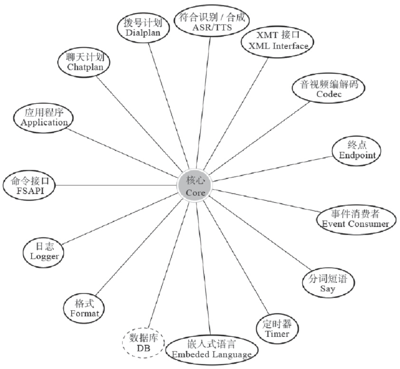
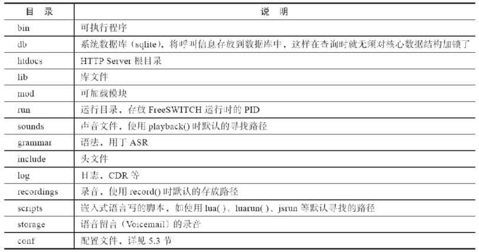
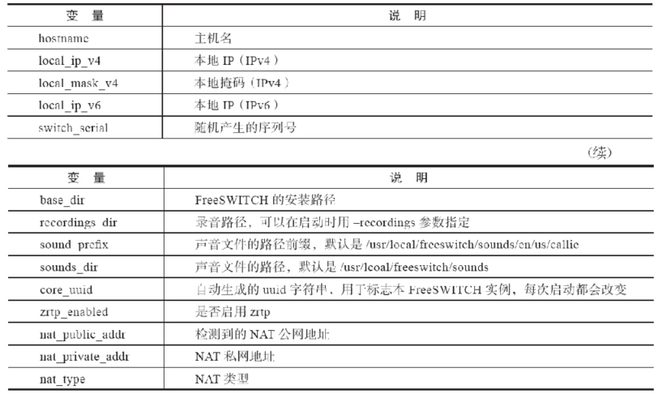
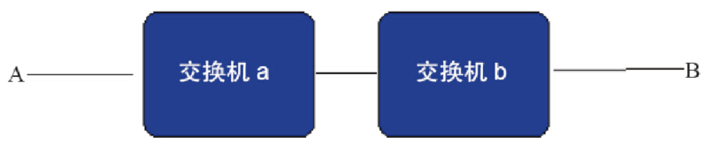

# 第01章 PSTN与VoIP基础
# 第02章 PSTN、PBX及呼叫中心业务
# 第03章 初识FreeSWITCH
# 第04章 运行FreeSWITCH
# 第05章 FreeSWITCH架构

通过对上一章的学习，我们了解了FreeSWITCH是如何启动和运行的。在本章，我们一起来看一看FreeSWITCH的内部架构。

## 总体架构

总的来说，FreeSWITCH由一个稳定的核心（Core）及一些外围模块组成。这些外围的模块根据其功能和用途的不同又分为Endpoint、Codec、Dialplan、Application等不同的类别，如图5-1所示。其中，数据库的代码是在核心中实现的，图5-1中之所以将核心单独列出来只是因为从逻辑上看它是独立的 [1]。

FreeSWITCH内部使用线程模型来处理并发请求，每个连接都在单独的线程中进行处理，不同的线程间通过Mutex互斥访问共享资源，并通过消息和异步事件等方式进行通信。这种架构能处理很高的并发，并且在多核环境中运算能均匀地分布到多颗CPU或单CPU的多个核心上。FreeSWITCH的核心非常短小精悍，这也是其保持稳定的关键。绝大部分应用层的功能都在外围的模块中实现。外围模块是可以动态加载（以及卸载）的，在实际应用中可以只加载用到的模块。外围模块通过核心提供的Public API与核心进行通信，而核心则通过回调（或称钩子）机制执行外围模块中的代码。

### 核心

FreeSWITCH的核心是Core，它包含了关键的数据结构和复杂的代码、状态机、数据库等，这些代码只出现在核心中，并保持了最大限度的抽象和重用。外围模块只能通过核心代码提供的公共应用程序接口（Public API）调用核心的功能，因而核心运行在一个受保护的环境中，核心代码都是经过了精心编写和严格测试的，最大限度地保证了系统整体的稳定。



<center>图5-1　FreeSWITCH架构示意图</center>

核心代码保持了最高程度的抽象，因而它可以调用不同功能、不同协议的模块。同时，实现良好的API也使得编写不同的外围模块非常容易。

1. 数据库（DB）

FreeSWITCH的核心除了使用内部的队列、哈希表存储数据外，也使用外部的关系型数据库存储数据。使用外部数据库的好处是查询数据不用锁定内存数据结构，这不仅能提高性能，还能降低死锁的风险，保证了系统稳定。命令show calls、show channels等都可直接从数据库中读取内容并显示。

FreeSWITCH支持多种流行的关系型数据库。为了尽量减少对其他系统的依赖，FreeSWITCH默认使用的数据库类型是SQLite。SQLite是一种嵌入式数据库，FreeSWITCH可以直接调用它提供的库函数来访问数据。由于SQLite会进行读锁定，因此在使用SQLite时不建议通过外部应用直接读取核心数据库 [2]。

除SQLite外，系统也支持通过使用ODBC [3]方式连接其他数据库，如PostgreSQL、MySQL等（有的人也成功地使用ODBC方式连接到Oracle及MS SQL Server等，但可能需要改动一些代码）。由于PostgreSQL、MySQL等都是Client/Server的结构，允许多个客户端连接查询，因此外部程序可以直接查询数据库，获取当前分机的注册状态及通话状态等。

另外，FreeSWITCH内部也提供了一个对PostgreSQL数据库的原生支持。它可以通过PostgreSQL提供的客户端库直接访问PostgreSQL服务，减少了中间的ODBC环节。

FreeSWITCH使用一个核心的数据库（默认的存放位置是/usr/local/freeswitch/db/core.db）来记录系统的接口（interfaces）、任务（tasks）以及当前的通道（channels）、通话（calls）等实时数据。某些模块，如mod_sofia、mod_fifo等，都有自己的数据库（表），一般来说，这些模块也提供相关的API用于从这些表里查询数据。必要时，用户也可以直接查询这些数据库（表）来获取数据（如mod_sofia中的分机注册数据等）。

系统对数据库操作做了优化，在高并发状态下，核心会尽量将几百条SQL语句一起执行，这可以大大提高系统性能。

2. 公共应用程序接口（Public API）

FreeSWITCH在核心层实现了一些Public API。这些Public API可以被外围的模块调用。例如，当FreeSWITCH外围的Endpoint模块收到一个呼入请求时，该模块就可以调用核心的switch_core_session_request函数为该呼叫生成一个新的Session，此后，该呼叫的生命周期就由该Session管理。如果呼叫挂断，就调用switch_core_session_destroy函数将该Session释放。

一般来说，与Session相关的函数都是与呼叫相关的。进一步细分，我们可以认为它主要与信令层相关，因为一个呼叫的生命周期是由信令来控制的。为了便于理解，接下来我们再举一个媒体层的例子。我们在1.5节中讲到，在SIP通话中，实际的语音、视频数据是使用RTP协议传输的（在这里为了简单起见我们只讨论语音）。为了在通话中使通话双方能彼此听到对方的声音，需要在已经建立的Session的基础上再增加一个RTP的Session，通过它进行RTP媒体流的收发等。使用switch_rtp_new函数可以建立一个新的RTP Session，在挂断电话前，可以使用switch_rtp_destroy来释放它。

核心的代码是任何模块都可以调用的，所以不同的Endpoint模块都可以调用核心中与Session相关的函数，以创建或释放一个Session，以及创建或释放相关的媒体流。当然，除了Session、RTP等与呼叫相关的函数外，核心中还有一些通用的工具函数，如生成JSON格式的函数、通用字符串处理函数、与通用数据数据结构相关的函数等。这些工具函数提供统一的接口，这方便开发外围模块，也有助于统一代码的风格，利于修改和维护。关于这些函数我们将在第20章讲解FreeSWITCH代码导读时再详细分析，在此就不多费笔墨了。

3. 接口（Interface）

FreeSWITCH在核心中除实现了大量的Public API供外围模块调用外，还提供了很多抽象的接口，如图5-1中所示的Endpoint、Codec等。这些接口对同类型的逻辑或功能实体进行了抽象，但没有具体实现。具体的实现一般由外围的模块负责，核心层通过回调（钩子）方式调用具体的实现代码或函数 [4]。

FreeSWITCH核心层定义了以下接口（来自switch_types.h，注释为作者所加）：

```c
typedef enum {
    SWITCH_ENDPOINT_INTERFACE,        // 终点
    SWITCH_TIMER_INTERFACE,           // 定时器
    SWITCH_DIALPLAN_INTERFACE,        // 拨号计划
    SWITCH_CODEC_INTERFACE,           // 编解码
    SWITCH_APPLICATION_INTERFACE,     // 应用程序
    SWITCH_API_INTERFACE,             // 命令
    SWITCH_FILE_INTERFACE,            // 文件
    SWITCH_SPEECH_INTERFACE,          // 语音合成
    SWITCH_DIRECTORY_INTERFACE,       // 用户目录
    SWITCH_CHAT_INTERFACE,            // 聊天计划
    SWITCH_SAY_INTERFACE,             // 分词短语
    SWITCH_ASR_INTERFACE,             // 语音识别
    SWITCH_MANAGEMENT_INTERFACE,      // 网管接口
    SWITCH_LIMIT_INTERFACE,           // 资源限制接口
    SWITCH_CHAT_APPLICATION_INTERFACE // 聊天应用程序接口
    } switch_module_interface_name_t;
```

具体的，外围模块可以选择实现其中一个或多个接口，并向核心层“注册”这些接口。核心层在需要这些接口时，会回调在这些接口中约定的回调函数。举例来说，在SIP通话中，如果核心需要取音频数据，它会调用mod_sofia中的相关回调函数，最后mod_sofia将调用核心中与RTP相关的函数，以便从RTP媒体流中取得数据；而在mod_portaudio中，音频数据是从本地声卡中获得的。也就是说，在上层应用中，我们可能只需读取一段音频数据，而不必关心该音频是怎么产生的或从哪里来的。在此，上层应用可以调用核心中的switch_core_session_read_frame函数以便从相关的Session中取得一“帧”音频数据，但该数据具体是从RTP流中还是本地声卡中取得，是由具体的Endpoint决定的，上层应用不知道也不关心它到底是怎么来的。

通过这种方式，在上层屏蔽了下层实现方式的细节，保证了上层实现接口的简单和稳定。同时，很容易通过这种机制扩展其他类型的模块，进而支持越来越多的协议、功能和特性。

4. 事件（Event）

除了使用Public API及接口回调方式执行内部逻辑和通信外，FreeSWITCH在内部也使用消息和事件机制进行进程间和模块间通信。消息机制完全是内部的，在此我们就不多讲了。事件机制既可在内部使用，也可在外部使用。当FreeSWITCH内部状态发生变化或收到一些新的消息时，会产生（Fire）一些事件。事件机制是一种“生产者–消费者”模型。事件的产生和处理（生产和消费）是异步的，是一种松耦合的关系。这些事件可以在FreeSWITCH内部通过绑定（Bind）一定的回调函数进行捕获，即FreeSWITCH的核心事件系统会依次回调这些回调函数，完成相应的功能。另外，在嵌入式脚本（如Lua）中也可以订阅相关的事件并进行处理。

在FreeSWITCH外部，也可以通过Event Socket等接口订阅相关的事件，通过这种方式可了解FreeSWITCH内部发生了什么，如当前呼叫的状态等。fs_cli就是一个典型的外部程序，它通过Event Socket与FreeSWITCH通信，可以对FreeSWITCH进行控制和管理，也可以订阅相关的事件对FreeSWITCH的运行情况进行监控。订阅事件最简单的方法是：

```
fs_cli> /event plain ALL
```

在fs_cli中执行上述命令可以订阅所有的事件。FreeSWITCH的事件主要有两大类：一类是主事件，可根据事件的名字（Event-Name）来区分，如CHANNEL_ANSWER（应答）、CHANNEL_HANGUP（挂机）等；另一类是自定义事件，它们的Event-Name永远是CUSTOM，不同的事件类型可根据子类型（Event-Subclass）来区分，如sofia::register（SIP注册）、sofia::unregister（SIP注销）等。

在fs_cli中可以单独订阅某类事件，如：

```
fs_cli> /event plain CHANNEL_ANSWER
fs_cli> /event plain CUSTOM sofia::register
```

在此，读者对事件有一个简单的了解就可以了，我们将在后面的章节中更详细地讨论事件机制、函数及相关用法。

### 接口实现

从上一节中我们了解到，接口都是抽象的，其中只有少量在核心中有具体实现（如PCM编解码的实现），大部分最终由外部的模块来实现。与接口的抽象概念相比，我们更关注具体实现。因此，在本节中我们把接口和模块结合在一起来讲。由于接口和模块的分类及源代码结构并不总是一一对应的，因此我们在这里不关注这些概念的不同点，而专注于它们的共同点。下面我们简单介绍一下这些不接口以及相关的模块：

- 终点（Endpoint）。Endpoint是终结FreeSWITCH的地方，也就是说再往外走就超出FreeSWITCH的控制了。它主要包含了不同呼叫控制协议的接口，如SIP、TDM硬件、H323以及Google Talk等。这使得FreeSWITCH可以与众多不同的电话系统进行通信。例如，可以使用mod_skypopen与Skype网络进行通信。另外，我们在3.4节也讲过，它还可以通过mod_portaudio驱动本地声卡，用作一个软电话。
- 拨号计划（Dialplan）。Dialplan主要提供查找电话路由功能。系统默认的Dialplan由mod_dialplan_xml提供，它是以XML描述的。除此之外，FreeSWITCH也支持Asterisk风格的配置文件以及ENUM查询等。
- 聊天计划（Chatplan）。类似于Dialplan，不同的是Chatplan主要对文本消息进行路由，如SIP SIMPLE、Skype Message、XMPP Message等。它是在mod_sms中实现的。
- 应用程序（Application，APP）。FreeSWITCH提供了许多App使复杂的任务变得异常简单，如mod_voicemail模块可以很简单地实现语音留言；而mod_conference模块则可以实现高质量的多方会议。我们在本书中多次提到FreeSWITCH本身是一个B2BUA，而实际上所有与FreeSWITCH的通话（或通过FreeSWITCH的通话）都是在与一个或多个App在交互。mod_dptools模块提供了系统中大部分的App。
- 命令接口（FSAPI）[5]。FSAPI简称API，它是一种对外的命令接口，它的原理非常简单─输入一个简单的字符串（以空格分隔），该字符串由模块的内部函数处理，然后得到一个输出。输出可以是一个简单的字符串、一大串文本、XML或JSON文本。通过使用FSAPI，一个模块可以通过命令字符串的方式调用另一个模块提供的功能，而不用连接其他模块的函数（或代码，实际上FreeSWITCH不鼓励也不支持模块间互相连接）。它实际上是一种高度抽象的输入/输出机制，不仅在模块内部，在FreeSWITCH外部也可能通过Event Socket（第3章所说的fs_cli就是用这种方式）或XML-RPC等进行调用。系统中大部分的API都是由mod_commands模块提供的，有的模块实现了一些与本模块相关的API。
- XML接口（XML Interface）。XML接口支持多种获取XML的方式，它可以从本地的配置文件或数据库中读取，甚至可以从一个能动态返回XML的远程HTTP服务器中读取。对XML的解析和访问是在核心中实现的，但对XML的应用和扩展都是在外部模块中完成的，如mod_xml_rpc、mod_xml_curl、mod_xml_cdr等。
- 编解码器（Codec）。FreeSWITCH支持最广泛的Codec，除了大多数VoIP系统支持的G711、G722、G729、GSM外，它还支持iLBC、BV16/32、SILK、iSAC、CELT、OPUS等。它可以同时桥接不同采样频率的电话以及电话会议等。G711（即PCM）编解码是在核心中实现的，其他的编解码一般都由独立的模块实现，如mod_ilbc实现了iLBC编解码。
- 语音识别及语音合成（ASR/TTS）。支持语音自动识别（ASR）及文本/语音转换（TTS）。可以通过本地模块实现（如mod_flite），也可以通过MRCP协议与其他语音产品对接（如mod_unimrcp）实现。
- 格式、文件接口（Format，File Interface）。支持不同格式的声音文件回放、录音，如WAV、MP3等。mod_sndfile模块通过libsndfile库提供了对大部分音频文件格式的支持。MP3格式是在mod_shout中实现的。
- 日志（Logger）。日志可以写到控制台、日志文件、系统日志（syslog）以及远程的日志服务器。实现日志功能的模块有mod_console、mod_logfile、mod_syslog等。
- 定时器（Timer）。实时的话音通话需要非常准确的定时器。在FreeSWITCH中，可以使用软时钟（soft timer）或内核提供的时钟来定时（如Linux中的timerfd或posix timer）。值得一提的是，FreeSWITCH最理想的工作时钟频率是1000Hz，而某些Linux发行版或虚拟机的内核的默认时钟可能是100Hz或250Hz，在这种情况下，可以使用内核提供的时钟接口，或者可以重新编译内核调整时钟频率。
- 嵌入式语言（Embeded Language）。通过swig可支持多种嵌入式语言进而控制呼叫流程，如Lua、Javascript、Perl等。
- 事件套接字（Event Socket）。通过Event Socket可以使用任何其他语言（只要支持Socket），通过TCP Socket可控制呼叫流程、扩展FreeSWITCH的功能。

[1] 除此之外，核心也实现了一些逻辑上应该在外部模块中实现的接口，如编解码接口中的PCMU和PCMA。

[2] 如果使用了ODBC连接其他数据库如PostgreSQL及MySQL时，则又建议直接读取数据库的内容获取信息。 

[3] 如果在UNIX类系统上使用ODBC，则需要安装UnixODBC，并进行正确的配置（我们将在本书第二部分详细讲解ODBC的配置和使用）。如果要编译安装，还需要开发包unixodbc-devel（CentOS）或unixodbc-dev（Debian/Ubuntu）。 

[4] 可以想象为面向对象的语言中的基类或纯虚函数，我们将在本书的第三部分深入剖析。 

[5] 即FreeSWITCH API，它在FreeSWITCH内部是使用switch_api_interface_t类型实现的，即它实现的是FreeSWITCH的命令行接口。在后面要讲到的嵌入式语言及ESL中也使用API（如mod_lua中的freeswitch.API及ESL中的api命令）。注意，不要将这里的API与常见的应用程序接口（Application Programming Interface）混淆。参见4.6节。

## 目录结构

在UNIX类系统上，FreeSWITCH默认的安装位置是/usr/local/freeswitch，在Windows上可能是C:\Programming Files\FreeSWITCH。在这两种系统上，FreeSWITCH的目录结构大致相同，如表5-1所示。

<center>表5-1　FreesSWITCH目录结构</center>



一般来说，大部分的目录结构都是扁平的，没有什么子目录。比较例外的有以下几个：

- sounds：sounds目录中存放了各种声音文件。FreeSWITCH支持多种频率的通话，因而也支持多种频率的声音文件。如下面的列表所示。

```
├── en
│   
└── us
│       
└── callie
│           
├── ascii
│           
│   
└── 8000
│           
├── base256
│           
│   
└── 8000
│           
├── conference
│           
│   
└── 8000
│           
├── currency
│           
│   
└── 8000
│           
├── digits
│           
│   
└── 8000
│           
├── directory
│           
│   
└── 8000
│           
├── ivr
│           
│   
└── 8000
│           
├── misc
│           
│   
└── 8000
│           
├── phonetic-ascii
│           
│   
└── 8000
│           
├── time
│   
│   
└── 8000
│           
├── voicemail
│           
│   
└── 8000
│           
└── zrtp
│               
└── 8000
├── music
│   
└── 8000
└── zh
└── cn
└── link
├── ascii
│   
└── 8000
├── conference
│   
└── 8000
```

**注意**：中文目录与英文目录结构大致相同，以下略。

声音文件存放在多级目录中。其中，en表示英语、us表示美国英语、callie表示嗓音（即人的声音，不同的人，音调和音色不同），下面的ascii、conference表示声音文件的类别。在这里我们只有8000Hz的语音，因此里面只有8000这个子目录，具体的声音文件在8000目录下面。

music目录中存放的是MOH，即保持音乐。

- storage：storage目录中存放从其他HTTP服务器下载过来的语音文件缓存（http_file_cache）以及voicemail录音留言等。其中voicemail的声音文件也是以profile（如下面的default）和domain（如下面的192.168.1.123）分级存放的，具体如下：

```
├── http_file_cache
└── voicemail
└── default
├── 192.168.1.123
│   
├── 1001
│   
└── 1007
├── 192.168.1.124
│   
├── 1000
│   
├── 1001
│   
├── 1003
│   
└── 1004
└── 192.168.127.103
└── 1001
```

- conf:conf目录中存放的是FreeSWITCH的配置文件，我们将在下一节单独说明。

## 配置文件

配置文件由许多XML文件组成。在系统装载时，XML解析器会将所有XML文件组织在一起，并读入内存，组成一个大的XML文档（Document），称为XML注册表。XML文档本身非常适合描述复杂的数据结构，在FreeSWITCH中可以非常灵活地使用这些数据。这种设计的好处是可以帮助实现非常高的可扩展性。并且，XML也是一个国际通用的标准，其他外部应用程序也可以很容易地生成XML，从而很容易地与FreeSWITCH集成。另外，系统还允许在某些XML节点上安装回调函数，当这些节点的数据变化时（如在reloadxml时），系统便自动调用这些回调函数，以更新系统的内部数据或状态等。

使用XML唯一的不足就是手工编辑这些XML比较困难，但正如其作者所言 [1]，他绝对不是XML的铁杆粉丝，他认为人们在理解XML的过程中迷失了方向，相反，把一个复杂的对象序列化成文本形式以及用一个易于解析又易于生成的标记语言来描述这正是XML的长处。使用XML的最高境界是让所有人意识不到它的存在。虽然现在还没有谁能做到这一点，但随着XML的发展以及更多的GUI界面和配置程序出现，终有一天会发展到只有高级用户才会去看这些XML，那时其他用户就意识不到XML的存在了。

在继续讨论配置文件之前，我们先来看一下这些配置文件的目录结构。在本书第3章我们已经提到过，配置文件的目录结构如下（其中，带扩展名的是文件，其他的一般都是目录）：

```
├── freeswitch.xml
├── mime.types
├── notify-voicemail.tpl
├── tetris.ttml
├── vars.xml
├── voicemail.tpl
├── web-vm.tpl
├── autoload_configs
├── chatplan
├── dialplan
│   
├── default
│   
├── public
│   
└── skinny-patterns
├── directory
│   
└── default
├── ivr_menus
├── jingle_profiles
├── lang
│   
├── en
│   
│   
├── demo
│   
│   
├── dir
│   
│   
├── ivr
│   
│   
└── vm
│   
├── fr
│   
│   
├── demo
│   
│   
├── dir
│   
│   
└── vm
├── mrcp_profiles
├── sip_profiles
│   
├── external
│   
└── internal
└── skinny_profiles
```

其中最重要的一个配置文件是freeswitch.xml，它的作用是将所有配置文件“粘”到一起。只要有一点点XML [2]基础知识，都可很容易理解这些配置。其中，X-PRE-PROCESS标签是FreeSWITCH中特有的，它称为预处理指令，用于设置一些变量和装入其他配置文件。

在XML加载阶段，FreeSWITCH的XML解析器会先将预处理命令展开，在FreeSWITCH内部生成一个大的XML文档。log/freeswitch.xml.fsxml是FreeSWITCH内部XML的一个内存镜像（注意，它在log目录中，而不是在conf目录中，由于它是动态生成的，所以用户不应该手工编辑它）。它对调试非常有用：假设你不慎弄错了某个标签，又不知道它错在哪了，可以尝试让FreeSWITCH重新加载XML（reloadxml），这时在FreeSWITCH的日志中就可以看到XML某一行出错的提示，在freeswitch.xml.fsxml就能很容易地定位到这一行。

完整的XML文档分为以下几个重要的部分：configuration（配置）、dialplan（拨号计划）、chatplan（聊天计划）、directory（用户目录）及phrase（分词），每一部分又有不同的配置。由于完整的XML非常大，而且大的XML文档已经对X-PRE-PROCESS标签进行处理，隐藏了很多配置的细节，因此这里我们还是按单个的文件或目录进行介绍。

### freeswitch.xml

freeswitch.xml是所有XML文件的黏合剂，我们先从它讲起。为了便于讲解，下面是一个精简过的freeswitch.xml。

```xml
<?xml version="1.0"?>
<document type="freeswitch/xml">
    <!-- #comment 这是一个配置文件，本行是注释 -->
    <X-PRE-PROCESS cmd="include" data="vars.xml"/>
    <section name="configuration" description="Various Configuration">
        <X-PRE-PROCESS cmd="include" data="autoload_configs/*.xml"/>
    </section>
</document>
```

众所周知，XML文档是一种树型的结构。在这里，它的根是document，在document中，有许多Section，每个Section都对应一部分功能。其中有两个X-PRE-PROCESS预处理指令，它们的作用是将data参数指定的文件内容包含（include）到当前文件中来。

上述freeSwitch.xml文件没有特别的作用，它就是将不同的配置文件“包含”到不同的部分（Section）中，从而生成一个大的XML配置文件。最后大的配置文件将类似下列代码所示：

```xml
<?xml version="1.0"?>
<document type="freeswitch/xml">
    <section name="configuration" description="Various Configuration">
        <configuration name="mod1.conf" description="Mod 1"/>
        <configuration name="mod2.conf" description="Mod 2"/>
        <configuration name="mod3.conf" description="Mod 3"/>
    </section>
    <section name="dialplan" description="XML Dialplan ">
        <context name="default " description="default Dialplan"/>
        <context name="public" description="public Dialplan"/>
    </section>
</document>
```

可以看出，configuration这个Section中有很多configuration，而dialplan这个Section中有很多Context。关于这些配置项的具体含义我们将在后面相关的章节讲解，在此就不多讲了。

由于X-PRE-PROCESS是一个预处理指令，FreeSWITCH在加载阶段只对其进行简单替换，并不进行语法分析，因此对它进行注释是没有效果的，这是一个新手常犯的错误。下面举例说明一下。
假设vars.xml的内容如下，它是一个合法的XML：

```xml
<!-- this is vars.xml -->
<vars>
    <var1>xxxxx</var1>
    <var2>xxxxx</var2>
</vars>
<!-- end of vars.xml -->
```

若在调试阶段想把一条X-PRE-PROCESS指令注释掉：

```xml
<!-- <X-PRE-PROCESS cmd="include" data="vars.xml"/> -->
```

当FreeSWITCH预处理时，还没有到达XML解析阶段，也就是说它还不认识XML注释语法，而仅会机械地将预处理指令替换为如下的vars.xml里的内容：

```xml
<!--    <!-- this is vars.xml -->
<vars>
    <var1>xxxxx</var1>
    <var2>xxxxx</var2>
</vars>
<!-- end of vars.xml --> -->
```

因而，由于XML的注释不能嵌套，这里便产生了错误的XML。解决办法是破坏掉X-PRE-PROCESS的定义，如作者常用下面两种方法：

```xml
<xX-PRE-PROCESS cmd="include" data="vars.xml"/>
<XPRE-PROCESS cmd="include" data="vars.xml"/>
```

由于FreeSWITCH不认识xX-PRE-PROCESS及XPRE-PROCESS，因此它会忽略该行，相当于注释掉了。

### vars.xml

vars.xml主要通过X-PRE-PROCESS指令定义了一些全局变量，如：

```xml
<X-PRE-PROCESS cmd="set" data="domain=$${local_ip_v4}"/>
<X-PRE-PROCESS cmd="set" data="domain_name=$${domain}"/>
<X-PRE-PROCESS cmd="set" data="hold_music=local_stream://moh"/>
<X-PRE-PROCESS cmd="set" data="use_profile=internal"/>
```

读者可能已经注意到了，该指令使用set表示要设置一个变量。如上述第1行，将domain这一变量的值设置为\$\${local_ip_v4}。那么\$\${local_ip_v4}是什么意思呢？它又是从哪里来的呢？

可以这样讲，在这里使用X-PRE-PROCESS设置的变量都称为全局变量，它们在FreeSWITCH运行期间永远都是有效的。而后面可能还会遇到局部变量，它们通常在拨号计划中，在一个呼叫的生命周期中才有效。如果需要引用这些变量，则全局变量以$${var}表示，临时变量以${var}表示。

在加载vars.xml之前，FreeSWITCH就已经“算”出并设置了一些全局变量，也就是说有些变量是系统在运行时自动设置的，其有默认的值，如表5-2所示。

<center>表5-2　系统自动设置的变量</center>



在实际使用中，可以使用global_getvar或这个API命令来查看这些变量的值，如：

```
freeswitch> global_getvar sound_prefix
```

```
/usr/local/freeswitch/sounds/en/us/callie
freeswitch > global_getvar local_ip_v4
192.168.7.6
```

由于这些变量是在vars.xml加载前设置的，因而可以在varx.xml中覆盖它们，如：

```xml
<X-PRE-PROCESS cmd="set" data="local_ip_v4=192.168.1.123"/>
```

上面的设置经常会用到，因为有时候FreeSWITCH自动“算”出的值可能不是你想要的，如上面的local_ip_v4的值，在服务器有多个网卡的情况下，可能希望它能得到另外一个网卡的IP地址，这时候就可以通过手动的方式设置该变量的IP来实现。

### autoload_configs目录

autoload_configs目录下的各种配置文件会在系统启动时装入。一般来说都是模块级的配置文件，每个模块对应一个（注意，并不是所有的模块都有配置文件）。文件名一般以“模块名.conf.xml”的方式命名（模块名中不包含“mod_”，如sofia.conf.xml）。

各模块的配置文件不尽相同，其中的配置项也都是由不同的模块分别解析的。这里我们以sofia.conf.xml为例简单介绍一下。

```xml
<configuration name="sofia.conf" description="sofia Endpoint">
  <global_settings>
    <param name="log-level" value="0"/>
    <!-- <param name="auto-restart" value="false"/> -->
    <param name="debug-presence" value="0"/>
    <!-- <param name="capture-server" value="udp:homer.domain.com:5060"/> -->
  </global_settings>
  <!--
      The rabbit hole goes deep.  This includes all the
      profiles in the sip_profiles directory that is up
      one level from this directory.
  -->
  <profiles>
      <X-PRE-PROCESS cmd="include" data="../sip_profiles/*.xml"/>
  </profiles>
</configuration>
```

该配置文件比较简单，首先它定义了一个configuration标签，其中name表示名字，这里是sofia.conf，而后面的description是一个简单的描述。

其实，sofia.conf.xml的文件名并不重要，完全可以改成其他的名字，只要扩展名是.xml就可以正常被freeswitch.xml中的X-PRE-PROCESS预处理指令装入。这里重要的是，这个配置文件中的configuration标签的name属性，mod_sofia在启动时会向XML注册表中查找name为“sofia.conf”的configuration，进而访问其下面的配置参数。

global_settings标签定义了一些全局参数，具体参数的意义我们在此就不多解释了。

profiles标签可通过X-PRE-PROCESS指令装入其他的配置文件，这些配置文件一般都是每个文件描述了一个profile（见默认的conf/sip_profiles/internal.xml），关于这些profile我们将在第8章中详细讲解。在此我们仅看一下profile装入后的效果，具体如下：

```xml
<profiles>
         <profile name="profile1"></profile>
         <profile name="profile2"></profile>
</profiles>
```

另外，autoload_configs目录中有一个特殊的modules.conf.xml，其决定了FreeSWITCH启动时自动加载哪些模块。如下面的配置片断，如果需要在FreeSWITCH启动时自动加载某个模块，就在这里添加一行，如果不需要，就注释掉或直接删除。下面列出了该配置文件的前几行：

```xml
<configuration name="modules.conf" description="Modules">
  <modules>
    <!-- Loggers (I'd load these first) -->
    <load module="mod_console"/>
    <load module="mod_logfile"/>
<!-- <load module="mod_syslog"/> -->
```

最后，autoload_configs目录中还有一个post_load_modules.conf.xml文件，其格式和用法与modules.conf.xml差不多，不同的是其中定义的模块加载时间比较晚。

### 其他

上面我们大体了解了配置文件的目录结构和简单的配置格式。其他配置文件的配置方法也大同小异。至于具体的配置项的含义只有到了具体的应用时才有意义，因此，我们后面用到某些项时，会详细进行说明。不过，在结束本节之前，我们还需简单介绍以下几个目录，因为我们在后面的章节中可能会经常提到它们：

- dialplan目录：该目录下的文件定义了XML拨号计划（Dialplan）。拨号计划是Free-SWITCH中很重要的一部分，它用于对进电话进行路由。我们将会在第6章专门讲解拨号计划。
- ivr_menues目录：该目录下存放了默认的一些IVR菜单的例子。
- directory目录：该目录中的配置文件决定了当FreeSWITCH作为注册服务器时，哪些用户可以注册，即用于配置本地用户，其中的配置信息称为用户目录。FreeSWITCH的用户目录支持多个域（Domain），每个域可以写到一个XML文件中。默认的配置包括一个default.xml，其中定义了1000~1019一共20个用户（实际上是装入了下一级子目录中的20个配置文件）。

[1] Trust me.I am far from XML's biggest fan,but I do feel it's actual uses are lost in a sea of contrived forced solutions that give it a bad name.To serialize complex objects to and from a text format and to make markup that is easily parsed and generated are the real strengths of XML.The best used XML is XML nobody ever realizes is even there.Certainly that is not true completely with FreeSWITCH today but as we scale and more GUI's and config apps are made,the curve will be in our favor and most people besides only the truly advanced users will ever have to see the XML again.---Anthony Minessale 全文见：http://www.freeswitch.org/node/123。 

[2] XML由标签（Tag）和属性构成。<tag>和</tag>组成一对标签，如果该标签有相关属性，则以<tag attr="value"></tag>形式指定。有些标签无须配对，但必须以“/>”关闭该标签定义，如<other_tag attr="value"/>。

## XML用户目录

我们在5.3.4节提到XML用户目录决定了哪些用户可以注册到FreeSWITCH上。在此，我们再深入分析一下。

SIP并不要求一定要注册才可以打电话，但是通话前的用户认证参数仍需要在用户目录中进行配置。

用户目录的默认配置文件在conf/directory/下，系统自带的配置文件为default.xml，其实现代码如下：

```xml
<domain name="$${domain}">
  <params>
    <param name="dial-string"
      value="{^^:sip_invite_domain=${dialed_domain}:presence_id=${dialed_user}@${dialed_domain}}${sofia_contact(*/${dialed_user}@${dialed_domain})}"/>
  </params>
  <variables>
    <variable name="record_stereo" value="true"/>
    <variable name="default_gateway" value="$${default_provider}"/>
    <variable name="default_areacode" value="$${default_areacode}"/>
    <variable name="transfer_fallback_extension" value="operator"/>
  </variables>
</domain>
```

该配置文件决定了哪些用户能注册到FreeSWITCH中。一般来说，所有用户都应该属于同一个domain（除非想使用多个domain，后面我们会有例子）。这里的$${domain}这个全局变量是在vars.xml中设置的，它默认是主机的IP地址，可以修改为使用一个域名。params中定义了该Domain中所有用户的公共参数。在这里只定义了一个dial-string，这是一个至关重要的参数。在使用user/username或sofia/internal/username@domain这样的呼叫字符串时，FreeSWITCH会根据username（以及domain）找到该dial-string，并最终扩展成用户实际的SIP地址 [1]。其中sofia_contact是一个API命令，它会根据用户的注册地址扩展成相应的呼叫字符串。

variables则定义了一些公共变量，在用户主叫或被叫时，这些变量会绑定到相应的Channel上形成Channel Variable。

在domain中还定义了许多组（group），组里面包含很多用户（user）。

```xml
<groups>
  <group name="default">
    <users>
      <X-PRE-PROCESS cmd="include" data="default/*.xml"/>
    </users>
  </group>
</groups>
```

在这里，组名default并没有什么特殊的意义，它只是随便起的，可以将其修改成任何值。在用户标签中，使用预处理指令装入了default目录中的所有XML文件。可以看到，在default目录中，每个用户都对应一个文件。

也可以定义其他的用户组，组中的用户并不需要是完整的XML节点，也可以是一个指向已存在用户的“指针”，如下代码就是使用type="pointer"定义的指针。

```xml
<group name="sales">
  <users>
    <user id="1000" type="pointer"/>
    <user id="1001" type="pointer"/>
    <user id="1002" type="pointer"/>
  </users>
</group>
```

虽然这里设置了组，但使用组并不是必需的。如果不打算使用组，将用户节点（users）直接放到domain的下一级也是可以的。但使用组可以比较方便地支持像群呼、代接之类的业务。例如，使用group_call可以同时或顺序呼叫某个组的用户。

其实与用户相关的设置很直观，下面显示了Alice这个用户的设置：

```xml
<user id="alice">
  <params>
    <param name="password" value="$${default_password}"/>
    <param name="vm-password" value="alice"/>
  </params>
  <variables>
    <variable name="toll_allow" value="domestic,international,local"/>
    <variable name="accountcode" value="alice"/>
    <variable name="user_context" value="default"/>
    <variable name="effective_caller_id_name" value="Alice"/>
    <variable name="effective_caller_id_number" value="1000"/>
    <variable name="outbound_caller_id_name" value="$${outbound_caller_name}"/>
    <variable name="outbound_caller_id_number" value="$${outbound_caller_id}"/>
    <variable name="callgroup" value="techsupport"/>
  </variables>
</user>
```

由上面代码可知，实际上params和variables可以出现在user节点中，也可以出现在group或domain中。当它们有重复时，优先级顺序由高到低依次为user、group、domain。

当然，用户目录还有一些更高级的设置，我们留待以后研究。

[1] 这个呼叫字符串比较复杂，需要许多知识才能理解它，因此我们留到本书的第二部分来详细研究。

## 　呼叫相关概念

本节我们再来复习一下第3章的内容，FreeSWITCH是一个B2BUA，我们还是以图3-2为例。
如果Bob与Alice通话，典型的呼叫流程主要有以下两种：

- Bob向FreeSWITCH发起呼叫，FreeSWITCH接着启动另一个UA呼叫Alice，两者通话。
- FreeSWITCH同时呼叫Bob和Alice，两者接电话后FreeSWITCH将a-leg和b-leg桥接（bridge）到一起，两者通话。

其中第二种流程还有一种变种。例如，市场上有人利用上、下行通话的不对称性卖电话回拨卡获取利润。比方说，他们可以把FreeSWITCH作为服务器，把回拨卡卖给Bob。Bob按回拨卡上的号码呼叫FreeSWITCH，FreeSWITCH不应答，而是在获得Bob的主叫号码后直接挂机。然后FreeSWITCH回拨Bob，Bob接听后FreeSWITCH启动一个IVR程序指示Bob输入Alice的号码。最后FreeSWITCH再呼叫Alice [1]。

在实际应用中，由于涉及回铃音、呼叫失败等，情况可能要复杂得多。在此我们就不深入讨论了，而是针对简单的呼叫流程介绍一下与呼叫相关的基本概念。

### 来去话、Session、Channel与Call

在前面所说的第一种呼叫流程中，Bob到FreeSWITCH的通话称为来话（注意，在这里我们都是针对FreeSWITCH来说的），而FreeSWITCH作为一个B2BUA再去呼叫Alice时，就称为去话。显而易见，在第二种呼叫流程中两路通话（两个leg）都是去话。

无论来话还是去话，对每一次呼叫，FreeSWITCH都会启动一个Session（会话，它包含SIP会话，SIP会在每对UAC-UAS之间生成一个SIP Session），用于控制整个呼叫，它会一直持续到通话结束。其中，每个Session都控制着一个Channel（通道，又称信道），Channel是一对UA间通信的实体，相当于FreeSWITCH的一条腿（leg），每个Channel都用一个唯一的UUID来标识，称为Channel UUID。另外，Channel上可以绑定一些呼叫参数，称为Channel Variable（通道变量）。Channel中可能包含媒体（音频或视频流），也可能不包含。通话时，FreeSWITCH的作用是将两个Channel（a-leg和b-leg，通常先创建的或占主动的叫a-leg）桥接（bridge）到一起，使双方可以通话。这两路桥接的通话（两条腿）在逻辑上组成一个通话，称为一个Call。

在通话中，媒体（音频或视频）数据流在RTP包中传送。一般来说，Channel是双向的，因此媒体流会有发送（Send/Write）和接收（Receive/Read）两个方向。

### 回铃音与Early Media

为了便于说明，我们假定A与B不在同一台交换机（服务器）上（如在PSTN通话中可能不在同一座城市），中间需要经过两台交换机中转，如图5-2所示。



<center>图5-2　A与B通过两台交换机通话</center>

假设图5-2所示是在PSTN网络中，A呼叫B，B话机开始振铃，A端可听到回铃音（Ring Back Tone）。在早期，B端所在的交换机b只向A端交换机a传送地址全（ACM）信号，证明呼叫是可以到达B的，A端听到的回铃音的铃流是由A端所在的交换机生成并发送的。但后来，为了在A端能听到B端特殊的回铃音（如“您拨打的电话正在通话中…”或“对方暂时不方便接听您的电话”尤其是现代交换机，支持各种个性化的彩铃 [2]），回铃音只能由B端交换机发送。在B接听电话前，回铃音和彩铃是不收费的（不收取主叫A的本次通话费。彩铃费用一般是在被叫端即B端以月租或套餐形式收取的）。这些回铃音就称为Early Media（早期媒体）。在SIP通信中，它是由SIP的183（带有SDP）消息描述的。

理论上讲，B接听电话后交换机b可以一直不向交换机a发送应答消息，而是将真正的话音数据伪装成Early Media，以实现“免费通话”。但这种应用是有限制的，大多数交换机允许Early Media的时间不会太长，如1分钟，以防止不守规则的人进行免费通话。

### 全局变量与局部变量

在5.3.2节我们讲到，可以使用X-PRE-PROCESS在FreeSWITCH中设置一些变量（包括自动生成的变量），在后续使用时可以用\$\${var}的形式来进行引用。这些变量是全局有效的，因而称为全局变量。另外一些变量是在Dialplan、Application或Directory中设置的，它们会影响呼叫流程且可以被动态改变。这些变量一般与一个呼叫有关，严格地说是与一个Channel有关，因而又称为Channel Variable，即通道变量。通道变量可以以\${var}的形式引用。全局变量仅在预处理阶段（系统启动时或重新装载-reloadxml时）被求值，一般用于设置一些系统一旦启动就不会轻易改变的量，如\$\${domain}或\$\${local_ip_v4}等。而局部变量（即通道变量）仅在Channel的生命周期中有效。所以，两者最大的区别是，\$\${var}只在加载时求值一次 [3]，而\${var}则在每次执行时都求值（如一个新电话进来时）。

在呼叫过程中，某些变量可以改变Channel的行为。另外，也可以使用自定义的通道变量来存储随路数据等。

在实际使用中会发现，有些变量在显示时（可以使用dp_tools中的info App显示，后面会讲到）是以variable_开头的，但在实际引用时要去掉这些开头的variable\_。如variable_username，引用时要使用\${username}。我们将在下一章深入讨论通道变量。

[1] 在整个过程中，Bob和Alice的电话都不会被扣费，费用将在回拨卡账号上扣除，通常会比Bob直接呼叫Alice便宜。这种方法比较复杂，用户体验也不好，故我们不赞成这种做法。在此只是举一个例子，说明FreeSWITCH可以这样用。 

[2] 彩铃称为CRBT，即Color Ring Back Tone。 

[3] 如果更改XML配置文件中的全局变量，一般需要重新启动才能重新加载。在UNIX类系统上，也可以向FreeSWITCH发送HUP信号让它重新加载和解析全局的配置文件，实现命令是kill-HUP<FreeSWITCH的pid>。

## 小结

FreeSWITCH是由一个稳定的核心及外围的可加载模块组成的。核心代码经过精心设计及严格测试，保证了它的稳定性。外围的模块则保证了它的可扩展性。核心与模块间通过Public API通信，而模块间通过事件系统（Event）通信，事件机制消除了模块间的耦合，进一步增加了其可伸缩性。

与第4章类似，本章也介绍了一些基本概念，如Session、Channel、Channel Variable等，这里介绍的基本概念后面会多次涉及，读者在后面遇到时也不妨回来复习一下，以加深对它们的理解。