# 第01章 PSTN与VoIP基础
# 第02章 PSTN、PBX及呼叫中心业务
# 第03章 初识FreeSWITCH
# 第04章 运行FreeSWITCH
# 第05章 FreeSWITCH架构
# 第06章 拨号计划
# 第07章 SIP协议

经过对前面章节的学习，相信读者已经对FreeSWITCH的架构和基本概念了解得差不多了。在继续深入学习之前，我们需要了解SIP。

SIP协议是FreeSWITCH的核心协议，理解SIP协议对理解FreeSWITCH的设计理念和使用方法很有帮助。我们在第1章已经对SIP协议做了简单介绍，并与H.323协议做了简单对比。在本章，笔者会带领大家更深入地了解SIP的基本概念以及协议内容。本章不要求读者有SIP基础，但如果读者有一些HTTP协议的基础知识，对理解本章的内容还是很有帮助的。

## SIP协议基础

会话初始协议（Session Initiation Protocol）是一个控制发起、修改和终结交互式多媒体会话的信令协议。它是由IETF（Internet Engineering Task Force，Internet工程任务组）在RFC 2543 [1]中定义的，最早发布于1999年3月，后来在2002年6月又发布了一个新的标准RFC 3261 [2]。除此之外，还有很多相关的或是在SIP基础上扩展出来的RFC，如关于SDP的RFC 4566 [3]、关于会议的RFC 4579 [4]等。

首先，我们先来看一下SIP协议中的基础知识和基本概念，为了便于理解，我们对照大家可能更熟悉的HTTP协议来进行讲解 [5]。

### HTTP与SIP协议基础

SIP是一个基于文本的协议，这一点与HTTP和SMTP类似。我们来对比一组简单的HTTP请求与SIP请求。

```
HTTP:
GET /index.html HTTP/1.1
SIP:  
INVITE sip:seven@freeswitch.org.cn SIP/2.0
```

两者类似，请求均有三部分组成：在HTTP请求中，GET指明一个获取资源（文件）的动作，/index.html则是资源的地址，最后HTTP/1.1是协议版本号；而在SIP中，INVITE表示发起一次呼叫请求，seven@freeswitch.org.cn为请求的地址，也称为SIP URI或AOR（Adress of Record，用户的公开地址），第三部分的SIP/2.0也是版本号。其中，SIP URI类似一个电子邮件地址，其格式为“协议:名称@主机”。这里SIP URI格式中的“协议”与HTTP和HTTPS相对应，也有SIP和SIPS两种（后者是加密的，如sips:seven@freeswitch.org.cn）；“名称”可以是一串数字的电话号码，也可以是字母表示的名称；而“主机”可以是一个域名，也可以是一个IP地址。

对于HTTP来说，好多人可能既熟悉又陌生。熟悉的是，天天听到看到它；陌生的是，好多人又不是真正了解HTTP协议。大家通常在使用浏览器上网时，浏览器与Web服务器间的通信使用的就是HTTP协议。只是，具体的协议文本和交互流程普通人看不见而已。在我们浏览网页时，浏览器作为一个HTTP客户端向远端的HTTP服务器请求我们想看的网页。HTTP返回结果后，浏览器再将收到的结果进行渲染，呈现给我们的是漂亮的页面。不过，作为一名技术人员或开发人员，我们想知道的不止于此，而是想透过浏览器，看看隐藏在浏览器背后的东西。因此，在这里我们先通过一个简单的例子来看一下HTTP协议。

CURL [6]是一个HTTP的命令行工具和客户端，相当于一个命令行版的浏览器。命令行工具与图形界面的工具比起来，前者使用起来更灵活，并且通常更容易展现工具“背后”的东西。CURL工具使用-v命令可以看到HTTP协议的通信情况 [7]，它与HTTP服务器的交互流程如下：

```
01 $ curl -v http://www.freeswitch.org.cn
02 * About to connect() to www.freeswitch.org.cn port 80 (#0)
03 *   Trying 207.97.227.245...
04 * connected
05 * Connected to www.freeswitch.org.cn (207.97.227.245) port 80 (#0)
06 >
 GET / HTTP/1.1
07 > User-Agent: curl/7.24.0 (x86_64-apple-darwin12.0) libcurl/7.24.0 OpenSSL/ 0.9.8r zlib/1.2.5
08 > Host: www.freeswitch.org.cn
09 > Accept: */*
10 >
11 
<HTTP/1.1 200 OK
12 < Server: GitHub.com
13 < Date: Sat, 22 Jun 2013 02:30:25 GMT
14 < Content-Type: text/html
15 < Connection: keep-alive
16 < Content-Length: 8685
17 < Last-Modified: Thu, 20 Jun 2013 15:52:14 GMT
18 < Expires: Sat, 22 Jun 2013 02:40:25 GMT
19 < Cache-Control: max-age=600
20 < Vary: Accept-Encoding
21 < Accept-Ranges: bytes
22 < Vary: Accept-Encoding
23 <
24 <html>
25 <head>
26     <meta http-equiv="Content-type" content="text/html; charset=utf-8">
27     <title>FreeSWITCH-CN
中文社区</title>
28     .... 
以下略 ...
```

在上面的例子中，我们用CURL请求网站www.freeswitch.org.cn的首页。其中，以“*”开头的都是CURL的调试信息，以“>”开头的行是客户端向服务器发出的请求，以“<”开头的行是服务器对客户端的响应 [8]。

第2行，CURL准备连接网站www.freeswitch.org.cn的80端口；第3行，通过DNS解析得到了与该网站对应的IP地址，并向该地址发起TCP连接请求（HTTP是基于TCP的）；第4和第5行表示TCP连接成功。

连接成功后，客户端在第6行发送一个获取网页的请求：GET/HTTP/1.1。其中，GET表示获取一个资源；“/”是一个路径，表示资源的地址，这里表示网站的根目录，即网站的首页；“HTTP/1.1”为HTTP协议的版本号。User-Agent说明它是一个HTTP客户端用户代理（UA），相当于客户端自己的名片。Accept字段表示接收回复信息的类型，具体的类型称为MIME [9]，常见的有“text/plain”（纯文本）、“text/html”（HTML网页）等。

服务器收到请求后，查找相关资源并返回结果。其中，以“<”开头的行都称为HTTP头（Header），后续的行称为HTTP正文（Body）。结果是从第11行开始的。“HTTP/1.1200 OK”也分为三个部分：其中第一部分是协议版本号；200表示状态码；OK是一个可读的描述字符串（称为Reason Phrase）。HTTP的状态码 [10]由三位数字构成，说明如下：

- 1xx表示临时响应；
- 2xx表示成功的响应；
- 3xx表示重定向（一般情况下浏览器会对3xx返回的地址重新发起请求，以获取新的资源，称为follow）；
- 4xx表示客户端引起的错误（如请求一个不存在的地址时就会收到著名的404）或需要客户端认证（如401）；
- 5xx表示服务器端的错误（服务器脚本出错等）。

在本章后面，读者会看到SIP协议也有类似的状态码。

所以，这时的“200 OK”表示返回的是一个正常的结果。起始行后面从第12行开始跟的是一些HTTP头，本例中的Content-Type表示返回的资源的类型，它的值“text/html”说明这是一个HTML文档。Content-Length表式文档正文（Body）的长度。在所有的HTTP头域结束后，会有一个空行，它标志HTTP头部的结束及消息正文的开始。HTTP响应的正文是从第24行开始的。至此，读者应该已经看到熟悉的HTTP<html>和<head>标签了。如果是浏览器收到这些响应头和正文，就会根据里面的参数对正文进行正确的渲染，呈现给用户漂亮的网页。

Body是可选的，并不是所有的请求或响应中都有Body字段，如果Content-Length为0或不存在，就表示没有Body。

SIP协议也与HTTP协议类似，如果你熟悉其中的一种，可以对比着进行学习。我们将从下节开始专门讨论SIP。

### SIP的基本概念和相关元素

言归正传，我们回到SIP。SIP是一个对等的协议，类似P2P。它和HTTP不一样，其不是客户端服务器结构的 [11]；也不像传统电话那样必须有一个中心的交换机，它可以在不需要服务器的情况下进行通信，只要通信双方都彼此知道对方地址（或者只有一方知道另一方的地址）即可，这种情况称为点对点通信。如图7-1所示，Bob给Alice发送一个INVITE请求，说“Hi,一起吃饭吧…”，Alice说“好的，OK”，电话就接通了。

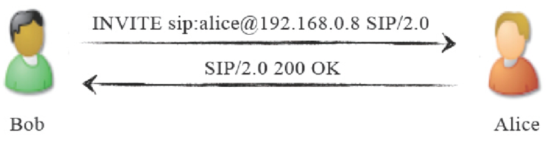

<center>图7-1　SIP点对点通信</center>

在SIP网络中，Alice和Bob都称为用户代理（User Agent，UA）。UA是在SIP网络中发起或响应SIP处理的逻辑实体。UA是有状态的，也就是说，它维护会话（或称对话）的状态。UA有两种：一种是UAC（UA Client），它是发起SIP请求的一方，比如图7-1中的Bob；另一种是UAS（UA Server），它是接受请求并发送响应的一方，比如图7-1中的Alice。由于SIP是对等的，当Alice呼叫Bob时，Alice就称为UAC，而Bob则实现UAS的功能。一般来说，UA都会实现上述两种功能。

设想Bob和Alice是经人介绍认识的，而他们还不熟悉，Bob想请Alice吃饭就需要一个中间人（M）传话，而这个中间人就叫代理服务器（Proxy Server）。还有另一种中间人称为重定向服务器（Redirect Server），它以类似于这样的方式工作──中间人M告诉Bob，我也不知道Alice在哪里，但我爱人知道，要不然我告诉你我爱人的电话，你直接问她吧，我爱人叫W。这样，M就成了一个重定向服务器（把Bob对他的请求重定向到他的爱人，这样Bob接下来要直接联系他的爱人），而他的爱人W是真正的代理服务器。这两种服务器都是UAS，它们主要是提供一对欲通话的UA之间的路由选择功能。

还有一种UAS称为注册服务器。试想这样一种情况：Alice还是个学生，没有自己的手机，但它又希望Bob能随时找到她，于是当她在学校时就告诉中间人M说她在学校，如果有事找她可以打宿舍的固定电话；如果她要回家，也通知M说有事打家里电话；或许某一天她要去姥姥家，也要把她姥姥家的电话告诉M。总之，只要Alice换一个新的位置，它就要向M重新“注册”，以让M能随时找到她，这时候M就相当于一个注册服务器。

还有一种特殊的UA称为背靠背用户代理（Back-to-Back UA，B2BUA）。需要指出，其实RFC 3261并没有定义B2BUA的功能，它只是一对UAS和UAC的串联。FreeSWITCH就是一个典型的B2BUA，事实上，B2BUA的概念会贯穿本书始终，所以在此我们需要多花一点笔墨来解释。

为了理解B2BUA，我们来看上述故事的另一个版本。M和W是一对恩爱夫妻。M认识Bob而W认识Alice。M和W有意撮合两个年轻人，但见面时由于两人太腼腆而互相没留电话号码。事后Bob想知道Alice对他感觉如何，于是打电话问M，M不认识Alice，就转身问爱人W（注意这次M没有直接把W的电话给Bob），W紧接着打电话给Alice，Alice说印象还不错，W就把这句话告诉M，M又转过身告诉Bob。这样，M和W一个面向Bob，一个对着Alice，他们两个合在一起，称为B2BUA。在这里，Bob是UAC，因为他发起请求；M是UAS，因为他接受Bob的请求并为他服务；我们把M和W看做一个整体，他们背靠着背（站着、坐着、躺着都行），W是UAC，因为她又向Alice发起了请求，最后Alice是UAS。其实这里UAC和UAS的概念也不是那么重要，重要的是要理解这个背靠背的用户代理。因为事情还没有完，Bob一听说Alice对他印象还不错，开心得不得了，便想请抽空请Alice吃饭，他将这一想法告诉M，M告诉W，W又告诉Alice。然后Alice问去哪里吃啊，W又只好问M，M再问Bob……在这对年轻人挂断电话之前，M和W只能“背对背”不停地工作，如图7-2所示。

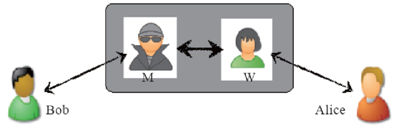

<center>图7-2　B2BUA</center>

从图7-2可以看出，四个人其实全是UA。当然，虽然FreeSWITCH是B2BUA，但也可以经过特殊的配置，实现一些代理服务器和重定向服务器的功能，甚至也可以从中间劈开，两边分别作为一个普通的UA来工作。这没有什么奇怪的，在SIP世界中，所有UA都是平等的。具体到实物，则M和W就组成了实现软交换功能的交换机，它们对外说的语言是SIP，而在内部它们使用自己家的语言沟通。Bob和Alice就分别成了我们常见的软电话，或者硬件的SIP话机。

此外，还有一个概念，称为边界会话控制器（Session Border Controller，SBC）。它主要位于一堆SIP服务器的边界，用于隐藏内部服务器的拓扑结构、抵御外来攻击等。SBC可能是一个代理服务器，也可能是一个B2BUA。其应用位置和拓扑结构如图7-3所示。

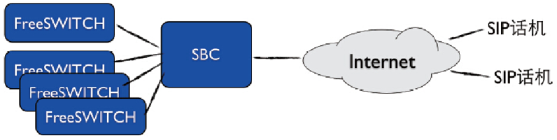

<center>图7-3　SBC示意图</center>

一般来说，SBC具有两个或多个网络接口卡（网卡），一边连接互联网，一边连接内部的网络。从互联网上对内部SIP服务器的访问只能经过SBC，因而这种拓扑结构能从一定程序上保证内部SIP服务器的安全。其他的部署模式还包括更高级别的防火墙设备，以及把SBC设备放在网络拓扑结构的防火区（DMZ）中等，以最大限度保证安全。

### SIP协议的基本方法和头域简介

SIP定义了6种基本方法，如表7-1所示。

<center>表7-1　SIP的6种基本方法</center>

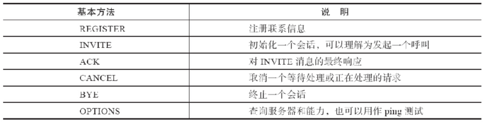

除此之外，SIP还定义了一些扩展方法，如SUBSCRIBE、NOTIFY、MESSAGE、REFER、INFO等，等到我们用到时会简单介绍。

另外，无论是基本方法还是扩展方法，所有SIP消息都必须包含以下6个头域，如表7-2所示。

在后面的例子中，我们会看到这些方法和头域在实际的SIP消息中是如何应用的，在此就不多着笔墨了。

<center>表7-2　SIP必须包含的头域</center>

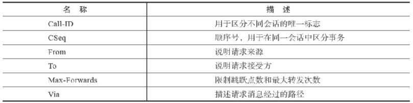

[1] 参见http://tools.ietf.org/html/rfc2543。 

[2] 参见http://tools.ietf.org/html/rfc3261。 

[3] 参见http://tools.ietf.org/html/rfc4566。 

[4] 参见http://tools.ietf.org/html/rfc4579。 

[5] 当然，有的读者可能对SIP更熟悉一些。不管怎么样，HTTP协议是当今互联网的基础，我们大家每天上网都离不开它。实际上，SIP协议中有些功能就直接套用了HTTP中的定义，如Digest验证。而且，FreeSWITCH支持使用HTTP（Web）服务器提供动态的XML配置文件，因此HTTP协议也是有必要了解的。对比HTTP和SIP协议进行学习，通过比较它们的异同，可以比较容易理解其原理和机制，学起来事半功倍。另外，在第11章我们要讲到的Event Socket（ESL）协议也是类似于HTTP与SIP的。 

[6] http://zh.wikipedia.org/zh-cn/CURL。 

[7] 使用浏览器的交互过程也类似，只不过是不容易看到这里的交互过程，因此这里我们以curl为例。 

[8] 注意，这里的&quot;*&quot;、&quot;&gt;&quot;及&quot;&lt;&quot;都不是HTTP的一部分，在这里只是为了对各种不同的文本加以区别。 

[9] 参见http://zh.wikipedia.org/wiki/多用途互联网邮件扩展。 

[10] http://zh.wikipedia.org/wiki/HTTP状态码。 

[11] 客户端能请求服务器资源，但服务器不能反过来请求客户端，而SIP双方都可以互发请求，即每一个UA都可以互做服务器和客户端，下面会讲到。

## SIP注册

普通的固定电话网中电话的地址都是固定的，而因特网是开放的。Alice可能在家也可能在学校，甚至可能在世界上任何角落，只要能上网，她就能与全世界通信。当然，如果她作为被叫的一方，为了让我们的FreeSWITCH服务器能随时找到她，她的UA必须向我们的服务器注册。

通常的注册流程是，Alice向FreeSWITCH发起注册（REGISTER）请求，FreeSWITCH返回401消息对Alice发起Challenge（挑战），Alice将自己的用户名密码信息与收到的Challenge信息进行计算，并将计算结果以加密的形式附加到下一个REGISTER请求上，重新发起注册，FreeSWITCH收到后对本地数据库中保存的Alice的信息使用同样的算法进行计算和加密，并将其与Alice发过来的计算结果相比较。如果计算结果相匹配，则认证通过，Alice便可以正常注册。交互流程如图7-4所示。

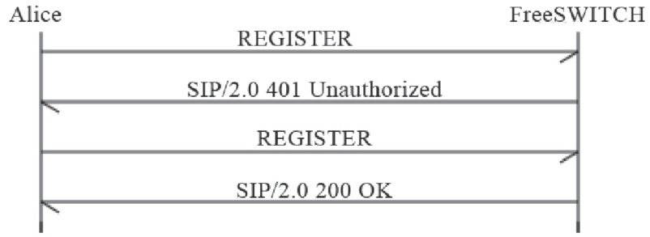

<center>图7-4　SIP注册流程</center>

下面我们用真正的注册流程进行说明。下面的SIP消息是在真正的FreeSWITCH中跟踪（trace）出来的。其中FreeSWITCH服务器的IP地址是192.168.4.4，它使用默认的端口号5060，在这里我们使用的SIP承载方式是UDP。Alice使用的UA是Zoiper，端口号是5090（在笔者写作时它与FreeSWITCH在同一台机器上，所以不能再使用端口5060）。其中，每个消息短横线之间的内容都是FreeSWITCH中输出的调试信息，不是SIP的一部分。recv（Receive的缩写形式）表示FreeSWITCH收到的消息，send表示发出的消息，下同。

在Alice发起注册时，下面是FreeSWITCH收到的第一条消息（为了便于说明，在排版时增加了行号）：

```
-----------------------------------------------------------------------
recv 584 bytes from udp/[192.168.4.4]:5090 at 12:30:57.916812:
-----------------------------------------------------------------------

01 REGISTER sip:192.168.4.4;transport=UDP SIP/2.0
02 Via: SIP/2.0/UDP 192.168.4.4:5090;branch=z9hG4bK-d8754z-d9ed3bbae47e568b-1---d8754z-;rport
03 Max-Forwards: 70
04 Contact: <sip:Alice@192.168.4.4:5090;rinstance=d42207a765c0626b;transport=UDP>
05 To: <sip:Alice@192.168.4.4;transport=UDP>
06 From: <sip:Alice@192.168.4.4;transport=UDP>;tag=9c709222
07 Call-ID: NmFjNzA3MWY1MDI3NGViMjY1N2QwZDlmZWQ5ZGY2OGE.
08 CSeq: 1 REGISTER
09 Expires: 3600
10 Allow: INVITE, ACK, CANCEL, BYE, NOTIFY, REFER, MESSAGE, OPTIONS, INFO, SUBSCRIBE
11 User-Agent: Zoiper rev.5415
12 Allow-Events: presence
13 Content-Length: 0
```

我们前面已经说过，SIP是类似HTTP的纯文本的协议，所以很容易阅读。其中：

- 第1行的REGISTER表示这是一条注册消息。
- 第2行的Via是SIP的消息路由，如果SIP经过好多代理服务器转发，则会有多条Via记录。
- 第3行，Max-forwards指出消息最多可以经过多少次转发，主要是为了防止产生死循环。
- 第4行，Contact是Alice的联系地址，即相当于Alice家的地址，本例中FreeSWITCH应该能在192.168.4.4这台机器上的5090端口找到她。
- 第5和第6行的To和From表示以Alice注册。
- 第7行，Call-ID是本次SIP会话（Session）的标志。
- 第8行，CSeq是一个序号，由于UDP是不可靠的协议，在不可靠的网络上可能丢包，所以有些包需要重发，该序号则可以防止重发引起的消息重复。
- 第9行，Expires是说明本次注册的有效期，单位是秒。在本例中，Alice的注册信息会在一小时后失效，它应该在半小时内再次向FreeSWITCH注册，以免FreeSWITCH“忘记”她。实际上，大部分UA的实现都会在几十秒内重新发一次注册请求，这在NAT的网络中有助于保持连接。
- 第10行，Allow是说明Alice的UA所能支持的功能，某些UA功能丰富，而某些UA仅有有限的功能。
- 第11行，User-Agent是UA的型号。
- 第12行，Allow-Events说明她允许哪些事件通知。
- 第13行，Content-Length是消息正文（Body）的长度，在这里只有消息头（Header），没有消息正文，因此长度为0。

FreeSWITCH需要验证Alice的身份才允许她注册。在SIP中，没有发明新的认证方式，而是使用已有的HTTP摘要 [1]（Digest）方式来认证。这里它给Alice回送（发，send）401响应消息，消息内容如下：

```
-----------------------------------------------------------------------
send 664 bytes to udp/[192.168.4.4]:5090 at 12:30:57.919364:
-----------------------------------------------------------------------

SIP/2.0 401 Unauthorized
Via: SIP/2.0/UDP 192.168.4.4:5090;branch=z9hG4bK-d8754z-d9ed3bbae47e568b-1---d8754z-;rport=5090
From: <sip:Alice@192.168.4.4;transport=UDP>;tag=9c709222
To: <sip:Alice@192.168.4.4;transport=UDP>;tag=QFXyg6gcByvUH
Call-ID: NmFjNzA3MWY1MDI3NGViMjY1N2QwZDlmZWQ5ZGY2OGE.

CSeq: 1 REGISTER
User-Agent: FreeSWITCH-mod_sofia/1.0.trunk-16981M
Allow: INVITE, ACK, BYE, CANCEL, OPTIONS, MESSAGE, UPDATE, INFO, REGISTER, REFER,
    NOTIFY, PUBLISH, SUBSCRIBE
Supported: timer, precondition, path, replaces
WWW-Authenticate: Digest realm="192.168.4.4",
nonce="62fb812c-71d2-4a36-93d6-e0008e6a63ee",
algorithm=MD5, qop="auth"
Content-Length: 0
```

401消息表示未认证，它是FreeSWITCH对Alice请求的响应。各消息头的含义基本上与请求中的含义是一样的。其中，“CSeq:1 REGISTER”表示它是针对刚刚收到的CSeq为1的REGISTER请求的响应。同时，它在本端生成一个认证摘要（WWW-Authenticate），一起发送给Alice。

Alice收到带有摘要的401后，重新发起注册请求，这一次加上了根据收到的摘要和她自己的用户名密码生成的认证信息（Authorization头）。同时，下面你可能也会注意到，CSeq序号变成了2。下面是重发的注册请求信息：

```
-----------------------------------------------------------------------
recv 846 bytes from udp/[192.168.4.4]:5090 at 12:30:57.921011:
-----------------------------------------------------------------------

REGISTER sip:192.168.4.4;transport=UDP SIP/2.0
Via: SIP/2.0/UDP 192.168.4.4:5090;branch=z9hG4bK-d8754z-dae1693be9f8c10d-1---d8754z-;rport
Max-Forwards: 70
Contact: <sip:Alice@192.168.4.4:5090;rinstance=d42207a765c0626b;transport=UDP>
To: <sip:Alice@192.168.4.4;transport=UDP>
From: <sip:Alice@192.168.4.4;transport=UDP>;tag=9c709222
Call-ID: NmFjNzA3MWY1MDI3NGViMjY1N2QwZDlmZWQ5ZGY2OGE.
CSeq: 2 REGISTER
Expires: 3600
Allow: INVITE, ACK, CANCEL, BYE, NOTIFY, REFER, MESSAGE, OPTIONS, INFO, SUBSCRIBE
User-Agent: Zoiper rev.5415
Authorization: Digest username="Alice",realm="192.168.4.4",
 nonce="62fb812c-71d2-4a36-93d6-e0008e6a63ee",
uri="sip:192.168.4.4;transport=UDP",
response="32b5ddaea8647a3becd25cb84346b1c3",
cnonce="b4c6ac7e57fc76b85df9440994e2ede8",
nc=00000001,qop=auth,algorithm=MD5
Allow-Events: presence
Content-Length: 0
```

FreeSWITCH收到带有认证的注册消息后，核实Alice身份，如果认证通过，则向Alice回应200 OK消息，表示注册成功了。返回的200 OK消息如下：

```
-----------------------------------------------------------------------
send 665 bytes to udp/[192.168.4.4]:5090 at 12:30:57.936940:
-----------------------------------------------------------------------

SIP/2.0 200 OK
Via: SIP/2.0/UDP 192.168.4.4:5090;branch=z9hG4bK-d8754z-dae1693be9f8c10d-1---d8754z-;rport=5090
From: <sip:Alice@192.168.4.4;transport=UDP>;tag=9c709222
To: <sip:Alice@192.168.4.4;transport=UDP>;tag=rrpQj11F86jeD
Call-ID: NmFjNzA3MWY1MDI3NGViMjY1N2QwZDlmZWQ5ZGY2OGE.
CSeq: 2 REGISTER
Contact: <sip:Alice@192.168.4.4:5090;rinstance=d42207a765c0626b;transport=UDP>; expires=3600
Date: Tue, 27 Apr 2010 12:30:57 GMT
User-Agent: FreeSWITCH-mod_sofia/1.0.trunk-16981M
Allow: INVITE, ACK, BYE, CANCEL, OPTIONS, MESSAGE, UPDATE, INFO, REGISTER, REFER,
    NOTIFY, PUBLISH, SUBSCRIBE
Supported: timer, precondition, path, replaces
Content-Length: 0
```

如果认证失败（可能是Alice的密码填错了），则回应403 Forbidden或其他失败消息，消息内容如下：

```
-----------------------------------------------------------------------
send 542 bytes to udp/[192.168.4.4]:5090 at 13:22:49.195554:
-----------------------------------------------------------------------

SIP/2.0 403 Forbidden
Via: SIP/2.0/UDP 192.168.4.4:5090;branch=z9hG4bK-d8754z-d447f43b66912a1b-1---d8754z-;rport=5090
From: <sip:Alice@192.168.4.4;transport=UDP>;tag=c097e17f
To: <sip:Alice@192.168.4.4;transport=UDP>;tag=yeecX364pvryj
Call-ID: ZjkxMGJmMjE4Y2ZiNjU5MzM5NDZkMTE5NzMzMzM0Mjc.
CSeq: 2 REGISTER
User-Agent: FreeSWITCH-mod_sofia/1.0.trunk-16981M
Allow: INVITE, ACK, BYE, CANCEL, OPTIONS, MESSAGE, UPDATE, INFO, REGISTER, REFER,
    NOTIFY, PUBLISH, SUBSCRIBE
Supported: timer, precondition, path, replaces
Content-Length: 0 
```

可以看到，在整个注册过程中，Alice的密码是不会直接在SIP消息中传送的，因而最大限度地保证了认证过程的安全。

如果Alice注册成功，则FreeSWITCH会将Alice在SIP消息中的联系地址（Contact字段）记录下来。以后如果有人呼叫Alice，FreeSWITCH就可以向该联系地址发送SIP消息以建立呼叫。

[1] 参见：http://zh.wikipedia.org/wiki/HTTP摘要认证。

## SIP呼叫流程

上一节，我们讨论了SIP注册。SIP UA向FreeSWITCH注册的主要是为了在呼叫时FreeSWITCH能够找到它。SIP的主要意义也是“处理会话的发起和终结”，通俗地讲就是处理和控制呼叫。下面我们就来讨论几个典型的SIP呼叫流程。

### UA间直接呼叫

前面我们讲过，SIP的UA都是平等的，如果一方知道另一方的地址，就可以通信。我们先来做一个实验。在笔者的机器上，启动了两个软电话（UA），一个是Bob的X-Lite（左），另一个是Alice的Zoiper。它们的IP地址都是192.168.4.4，而端口号分别是26000和5090，当Bob呼叫Alice时，它只需直接呼叫Alice的SIP地址sip:Alice@192.168.4.4:5090 [1]。如图7-5所示，Alice的电话正在振铃。

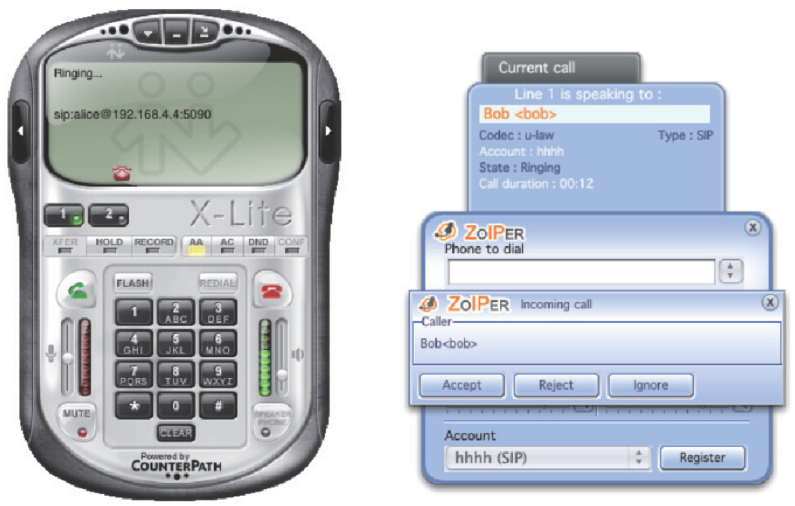

<center>图7-5　SIP UA间直接呼叫</center>

详细的呼叫流程如图7-6所示。

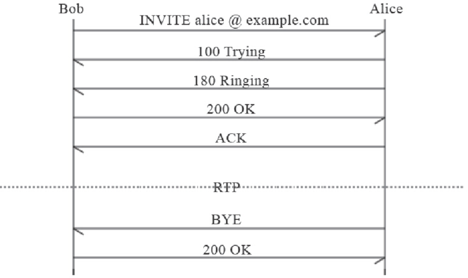

<center>图7-6　SIP UA间直接呼叫流程图</center>

首先Bob向Alice发送INVITE消息请求建立SIP会话。Alice的UA回100 Trying消息，意思是说我收到你的请求了，先等一会儿。接着Alice的电话开始振铃，并给对方回消息180 Ringing，说我这边已经振铃了，Alice听到后可能一会就过来接电话。Bob的UA收到该消息后即可以播放回铃音，以提示Bob对方的话机正在振铃。接着Alice接了电话，她发送200 OK消息给Bob，该消息是对INVITE消息的最终响应（所有大于1的状态码都是最终响应），而先前的100和180消息都是临时状态，只是表明呼叫进展的情况。Bob收到200后向Alice回复ACK证实消息。INVITE-200-ACK完成“三次握手”的操作，保证了呼叫可以正常进行。其中，INVITE-1xx-200等消息合在一起称为一个事务（Transaction）。这时候Bob已经在跟Alice通话了，他们通话的内容（语音数据）是在SIP之外的RTP包中传递的，我们后面再详细讨论RTP。

最后，Alice挂断电话，向Bob发送BYE消息，Bob收到BYE后回送200 OK，通话完毕。其中BYE和200 OK也是一个事务，而上面的所有消息，则称为一个对话（Dialog，也译作会话）。

反过来也一样，Alice可以直接呼叫Bob的地址sip:Bob@192.168.4.4:26000进行通话。

上面描述了一个最简单的SIP呼叫流程。实际上，SIP还有其他一些消息。SIP消息大致可分为请求和响应两类。请求由UAC发出，到达UAS后，UAS回送响应消息。某些响应消息需要证实（ACK），以完成三次握手。其中请求消息包括基本的INVITE、ACK、OPTIOS、BYE、CANCEL、REGISTER，以及re-INVITE、PRACK、SUBSCRIBE、NOTIFY、UPDATE、MESSAGE、REFER等一些扩展。而响应消息则都包含一个状态码和一个原因短语（Reason Phrase）。与HTTP响应类似，状态码由三位数字组成：

- 1xx组的响应为临时状态，表明呼叫进展的情况；
- 2xx表明请求已被成功收到、理解和接受；
- 3xx为重定向，表明SIP请求需要转向到另一个UAS处理；
- 4xx表明请求失败，这种失败一般是由客户端或网络引起的，如密码错误、空号等，客户端应该重新修改请求，然后重发；
- 5xx为服务器内部错误，表明服务器出错，不能响应合法的请求；
- 6xx为全局性错误，如600 Busy Everywhere。

状态码后面跟着一个原因短语（如200 OK中的OK及刚才讲到的Busy Everywhere），它是对前面的状态码的一个简单解释。

### 通过B2BUA呼叫

在真实世界中，Bob和Alice可以会经常改变位置，那么它们的SIP地址也会相应改变，并且，如果他们之中有一个或两个处于NAT的网络中时，直接通信就更困难了。所以，他们通常会借助于一个服务器来实现通信。这样Bob和Alice通过注册到服务器上即可获得一个服务器上的公有SIP地址。注册服务器的地址一般是不变的，因此他们的SIP地址就不会发生变化，他们也就总是能够进行通信了。

现在，作为例子，我们让他们两个都注册到FreeSWITCH上。上面已经说过，FreeSWITCH监听的端口是SIP默认的5060端口。Bob和Alice注册后，他们分别获得了一个服务器的地址（SIP URI）：sip:Bob@192.168.4.4和sip:Alice@192.168.4.4（默认的端口号5060可以省略）。

下面是Bob呼叫Alice的流程。需要指出，如果Bob只是发起呼叫而不接收呼叫，他并不需要向FreeSWITCH注册（有些软交换服务器规定需要先注册才能发起呼叫，但SIP是不强制这么做的）。

首先，Bob向FreeSWITCH发送INVITE消息，请求建立一个呼叫，发送的INVITE消息如下：

```
-----------------------------------------------------------------------
recv 1118 bytes from udp/[192.168.4.4]:26000 at 13:31:39.938891:
-----------------------------------------------------------------------

INVITE sip:Alice@192.168.4.4 SIP/2.0
Via: SIP/2.0/UDP 192.168.4.4:26000;branch=z9hG4bK-d8754z-56adad736231f024-1---d8754z-;rport
Max-Forwards: 70
Contact: <sip:Bob@192.168.4.4:26000>
To: "Alice"<sip:Alice@192.168.4.4>
From: "Bob"<sip:Bob@192.168.4.4>;tag=15c8325a
Call-ID: YWEwYjNlZTZjOWZjNDg3ZjU3MjQ3MTA1ZmQ1MDM5YmQ.
CSeq: 1 INVITE
Allow: INVITE, ACK, CANCEL, OPTIONS, BYE, REFER, NOTIFY, MESSAGE, SUBSCRIBE, INFO
Content-Type: application/sdp
User-Agent: X-Lite release 1014k stamp 47051
Content-Length: 594
```

上面的消息中省略了SDP的内容，关于SDP的部分我们将留到本章后面再探讨。在此，Bob的UAC通过INVITE消息向FreeSWITCH发起请求。Bob的UAC用的是X-Lite（User-Agent），它运行在端口26000上（由Contact字段给出。实际上，它默认的端口也是5060，但由于在笔者的实验环境下它与FreeSWITCH运行在一台机器上，5060端口已被FreeSWITCH占用，因此需要选择另一个端口）。其中，From为主叫用户的地址，To为被叫用户的地址。此时FreeSWITCH作为一个UAS接受请求并进行响应。但在此之前，它先通过100 Trying消息通知Bob它已经收到了他的请求，消息内容如下：

```
-----------------------------------------------------------------------
send 345 bytes to udp/[192.168.4.4]:26000 at 13:31:39.940278:
-----------------------------------------------------------------------

SIP/2.0 100 Trying
Via: SIP/2.0/UDP 192.168.4.4:26000;branch=z9hG4bK-d8754z-56adad736231f024-1---d8754z-;rport=26000
From: "Bob"<sip:Bob@192.168.4.4>;tag=15c8325a
To: "Alice"<sip:Alice@192.168.4.4>
Call-ID: YWEwYjNlZTZjOWZjNDg3ZjU3MjQ3MTA1ZmQ1MDM5YmQ.
CSeq: 1 INVITE
User-Agent: FreeSWITCH-mod_sofia/1.0.trunk-16981M
Content-Length: 0           
```

FreeSWITCH通过100 Trying消息告诉Bob：“我已经收到你的消息了，别着急，我正在设法联系Alice……”，该消息称为呼叫进展消息。

但就在此时，FreeSWITCH发现它还不认识Bob，即它还不确定Bob是否有权通过它发起呼叫，因而它需要确认Bob的身份。在SIP中，它通过回送带有Digest验证信息（Proxy-Authenticate头）的407消息来通知Bob（类似于注册流程中的401），消息内容如下：

```
-----------------------------------------------------------------------
send 826 bytes to udp/[192.168.4.4]:26000 at 13:31:39.943392:
-----------------------------------------------------------------------

SIP/2.0 407 Proxy Authentication Required
Via: SIP/2.0/UDP 192.168.4.4:26000;branch=z9hG4bK-d8754z-56adad736231f024-1---d8754z-;rport=26000
From: "Bob"<sip:Bob@192.168.4.4>;tag=15c8325a
To: "Alice" <sip:Alice@192.168.4.4>;tag=B4pem31jHgtHS
Call-ID: YWEwYjNlZTZjOWZjNDg3ZjU3MjQ3MTA1ZmQ1MDM5YmQ.
CSeq: 1 INVITE
User-Agent: FreeSWITCH-mod_sofia/1.0.trunk-16981M
Accept: application/sdp

Allow: INVITE, ACK, BYE, CANCEL, OPTIONS, MESSAGE, UPDATE, INFO, REGISTER, REFER,
    NOTIFY, PUBLISH, SUBSCRIBE
Supported: timer, precondition, path, replaces
Allow-Events: talk, presence, dialog, line-seize, call-info, sla,
    include-session-description, presence.winfo, message-summary, refer
Proxy-Authenticate: Digest realm="192.168.4.4",
nonce="31c5c3e0-cc6e-46c8-a661-599b0c7f87d8",
algorithm=MD5, qop="auth"
Content-Length: 0
```

Bob回送ACK证实消息向FreeSWITCH证实已收到认证要求，至此，从INVITE开始发起的事务就结束了。下面是FreeSWITCH收到的ACK消息：

```
-----------------------------------------------------------------------
recv 319 bytes from udp/[192.168.4.4]:26000 at 13:31:39.945314:
-----------------------------------------------------------------------

ACK sip:Alice@192.168.4.4 SIP/2.0
Via: SIP/2.0/UDP 192.168.4.4:26000;branch=z9hG4bK-d8754z-56adad736231f024-1---d8754z-;rport
To: "Alice" <sip:Alice@192.168.4.4>;tag=B4pem31jHgtHS
From: "Bob"<sip:Bob@192.168.4.4>;tag=15c8325a
Call-ID: YWEwYjNlZTZjOWZjNDg3ZjU3MjQ3MTA1ZmQ1MDM5YmQ.
CSeq: 1 ACK
Content-Length: 0
```

然后，Bob重新发送INVITE请求。这次还附带了Proxy-Authorization验证信息，该信息是根据上次收到的Proxy-Authenticate中的信息与Bob提供的认证用户名和密码计算出的结果。该INVITE重新开始了一个事务，消息内容如下：

```
-----------------------------------------------------------------------
recv 1376 bytes from udp/[192.168.4.4]:26000 at 13:31:39.945526:
-----------------------------------------------------------------------

INVITE sip:Alice@192.168.4.4 SIP/2.0
Via: SIP/2.0/UDP 192.168.4.4:26000;branch=z9hG4bK-d8754z-87d60b47b6627c3a-1---d8754z-;rport
Max-Forwards: 70
Contact: <sip:Bob@192.168.4.4:26000>
To: "Alice"<sip:Alice@192.168.4.4>
From: "Bob"<sip:Bob@192.168.4.4>;tag=15c8325a
Call-ID: YWEwYjNlZTZjOWZjNDg3ZjU3MjQ3MTA1ZmQ1MDM5YmQ.
CSeq: 2 INVITE
Allow: INVITE, ACK, CANCEL, OPTIONS, BYE, REFER, NOTIFY, MESSAGE, SUBSCRIBE, INFO
Content-Type: application/sdp
Proxy-Authorization: Digest username="Bob",realm="192.168.4.4",
nonce="31c5c3e0-cc6e-46c8-a661-599b0c7f87d8",
uri="sip:Alice@192.168.4.4",response="327887635344405bcd545da06763c466",
cnonce="c164b74f625ff2161bd8d47dba3a0ee2",
nc=00000001,qop=auth,
algorithm=MD5
User-Agent: X-Lite release 1014k stamp 47051
Content-Length: 594
```

这里也省略了SDP消息正文。
FreeSWITCH收到INVITE请求后，重新回送100 Trying，通知Bob呼叫进展情况，消息内容如下：

```
-----------------------------------------------------------------------
send 345 bytes to udp/[192.168.4.4]:26000 at 13:31:39.946349:
-----------------------------------------------------------------------

SIP/2.0 100 Trying
Via: SIP/2.0/UDP 192.168.4.4:26000;branch=z9hG4bK-d8754z-87d60b47b6627c3a-1---d8754z-;rport=26000
From: "Bob"<sip:Bob@192.168.4.4>;tag=15c8325a
To: "Alice"<sip:Alice@192.168.4.4>
Call-ID: YWEwYjNlZTZjOWZjNDg3ZjU3MjQ3MTA1ZmQ1MDM5YmQ.
CSeq: 2 INVITE
User-Agent: FreeSWITCH-mod_sofia/1.0.trunk-16981M
Content-Length: 0
```

然后FreeSWITCH对Bob发来的认证信息进行验证，发现Bob是本地的授权用户，因而呼叫可以继续进行。

至此，Bob与FreeSWITCH之间的通信已经初步建立，这种通信的逻辑通道称为一个Channel。该Channel是由Bob的UA和FreeSWITCH的一个UA构成的，我们称之为FreeSWITCH的一条腿，又称a-leg。

接下来，呼叫进入路由阶段，FreeSWITCH根据路由，发现Bob要呼叫Alice，由于FreeSWITCH是一个B2BUA，因而它需要要建立另外一条腿去呼叫Alice，与a-leg相对，这条新腿就称为b-leg。

FreeSWITCH通过查找本地数据库，得到了Alice的位置（Alice的联系地址，Alice必须事先已经向它注册），接着启动一个UA（用作UAC），向Alice发送一个新的INVITE消息，内容如下（注意，这完全是一个新的事务，理论上与a-leg没有任何关系）：

```
-----------------------------------------------------------------------
send 1340 bytes to udp/[192.168.4.4]:5090 at 13:31:40.028988:
-----------------------------------------------------------------------

INVITE sip:Alice@192.168.4.4:5090;rinstance=e7d5364c81f2b879;transport=UDP SIP/2.0
Via: SIP/2.0/UDP 192.168.4.4;rport;branch=z9hG4bKey90QUyHZQXNN
Route: <sip:Alice@192.168.4.4:5090>;rinstance=e7d5364c81f2b879;transport=UDP
Max-Forwards: 69
From: "Bob" <sip:Bob@192.168.4.4>;tag=Dp9ZQS3SB26pg
To: <sip:Alice@192.168.4.4:5090;rinstance=e7d5364c81f2b879;transport=UDP>
Call-ID: 0d74ac35-cca4-122d-81a2-2990e5b2bd3e

CSeq: 130069214 INVITE
Contact: <sip:mod_sofia@192.168.4.4:5060>
User-Agent: FreeSWITCH-mod_sofia/1.0.trunk-16981M
Allow: INVITE, ACK, BYE, CANCEL, OPTIONS, MESSAGE, UPDATE, INFO, REGISTER, REFER,
    NOTIFY, PUBLISH, SUBSCRIBE
Supported: timer, precondition, path, replaces
Allow-Events: talk, presence, dialog, line-seize, call-info, sla,
    include-session-description, presence.winfo, message-summary, refer
Content-Type: application/sdp
Content-Disposition: session
Content-Length: 313
X-FS-Support: update_display
Remote-Party-ID: "Bob" <sip:Bob@192.168.4.4>;party=calling;screen=yes;privacy=off
```

可以看到，该INVITE的Call-ID与上一次INVITE消息中的不同，说明这是另一个SIP对话（Dialogue）。另外，消息中还多了一个Remote-Party-ID，它主要是用来支持主叫号码显示功能（俗称来电显示，有了这个功能，Alice的话机上就可以显示Bob的号码，知道是Bob打来的）。与普通的POTS通话不同，在SIP通话话中，不仅能显示电话号码（这里是Bob），还能显示一个可选的名字（Bob）。这也说明了FreeSWITCH这个B2BUA本身是一个整体，它虽然是以一个单独的UA呼叫Alice，但还是跟负责Bob的那个UA有联系——就是这种背靠背的串联关系，使得Alice这一侧的Channel（b-leg）知道Bob那一侧（a-leg）的一些信息（如这里的主叫号码）。

同理，Alice会回送100 Trying消息通知FreeSWITCH它已经正常接收到该INVITE请求，正准备进行下一步处理。消息内容如下：

```
-----------------------------------------------------------------------
recv 309 bytes from udp/[192.168.4.4]:5090 at 13:31:40.193634:
-----------------------------------------------------------------------

SIP/2.0 100 Trying
Via: SIP/2.0/UDP 192.168.4.4;rport=5060;branch=z9hG4bKey90QUyHZQXNN
To: <sip:Alice@192.168.4.4:5090;rinstance=e7d5364c81f2b879;transport=UDP>
From: "Bob" <sip:Bob@192.168.4.4>;tag=Dp9ZQS3SB26pg
Call-ID: 0d74ac35-cca4-122d-81a2-2990e5b2bd3e
CSeq: 130069214 INVITE
Content-Length: 0
```

虽然我们曾经说过，所有的SIP UA都是对等的。但Alice的身份与FreeSWITCH不同，它作为一个被叫用户，不需要对FreeSWITCH发起的呼叫进行认证，因而，Alice的话机直接振铃，并向FreeSWITCH回送180 Ringing消息，通知FreeSWITCH Alice的话机已经开始振铃了。FreeSWITCH收到的180消息如下：

```
-----------------------------------------------------------------------
recv 431 bytes from udp/[192.168.4.4]:5090 at 13:31:40.193816:
-----------------------------------------------------------------------

SIP/2.0 180 Ringing
Via: SIP/2.0/UDP 192.168.4.4;rport=5060;branch=z9hG4bKey90QUyHZQXNN
Contact: <sip:Alice@192.168.4.4:5090;rinstance=e7d5364c81f2b879;transport=UDP>
To: <sip:Alice@192.168.4.4:5090;rinstance=e7d5364c81f2b879;transport=UDP>;tag=3813e926
From: "Bob"<sip:Bob@192.168.4.4>;tag=Dp9ZQS3SB26pg
Call-ID: 0d74ac35-cca4-122d-81a2-2990e5b2bd3e
CSeq: 130069214 INVITE
User-Agent: Zoiper rev.5415
Content-Length: 0
```

上述代码中，180也是呼叫进展消息，它说明Alice的电话已经开始振铃了，如果Alice听到了，则过一会她可能会接听电话。FreeSWITCH在收到180以后，有以下两个选择。

- 直接给Bob回180消息。Bob的话机收到180后，知道Alice那边已经振铃了。注意，这里只是Bob的话机知道，Bob并不知道收到了180。因而Bob的话机会自己产生一个回铃音，播放给Bob听，以提示Bob对方正在振铃。
- 给Bob回183消息。与180不同，183消息包含媒体SDP。这时，FreeSWITCH就有机会产生一个回铃音，通过RTP发送给Bob。Bob的话机就不需要自己再产生回铃音。通过这种技术，FreeSWITCH可以为呼叫Alice的用户产生个性化的回铃音，也称彩铃。

不过，在此我们先不深入讨论。不管是180还是183，Bob都会听到回铃音。FreeSWITCH默认是183，消息内容如下：

```
send 1125 bytes to udp/[192.168.4.4]:26000 at 13:31:40.270533:
-----------------------------------------------------------------------

SIP/2.0 180 Ringing
Via: SIP/2.0/UDP 192.168.4.4:26000;branch=z9hG4bK-d8754z-87d60b47b6627c3a-1---d8754z-;rport=26000
From: "Bob"<sip:Bob@192.168.4.4>;tag=15c8325a
To: "Alice" <sip:Alice@192.168.4.4>;tag=cDg7NyjpeSg4m
Call-ID: YWEwYjNlZTZjOWZjNDg3ZjU3MjQ3MTA1ZmQ1MDM5YmQ.
CSeq: 2 INVITE
Contact: <sip:Alice@192.168.4.4:5060;transport=udp>
User-Agent: FreeSWITCH-mod_sofia/1.0.trunk-16981M
Accept: application/sdp
Allow: INVITE, ACK, BYE, CANCEL, OPTIONS, MESSAGE, UPDATE, INFO, REGISTER, REFER,
    NOTIFY, PUBLISH, SUBSCRIBE
Supported: timer, precondition, path, replaces
Allow-Events: talk, presence, dialog, line-seize, call-info, sla,
    include-session-description, presence.winfo, message-summary, refer
Content-Type: application/sdp
Content-Disposition: session
Content-Length: 267
Remote-Party-ID: "Alice" <sip:Alice@192.168.4.4
```

这里省略了SDP消息。

再看Alice这端，她听到电话响了，一看主叫号码是Bob，心里非常甜蜜，便迫不及待地接起电话。在她接起电话的一刹那，她的SIP话机给FreeSWITCH回送了200 OK消息，表示Alice已经接听了。消息内容如下：

```
-----------------------------------------------------------------------
recv 768 bytes from udp/[192.168.4.4]:5090 at 13:31:43.251980:
-----------------------------------------------------------------------

SIP/2.0 200 OK
Via: SIP/2.0/UDP 192.168.4.4;rport=5060;branch=z9hG4bKey90QUyHZQXNN
Contact: <sip:Alice@192.168.4.4:5090;rinstance=e7d5364c81f2b879;transport=UDP>
To: <sip:Alice@192.168.4.4:5090;rinstance=e7d5364c81f2b879;transport=UDP>;tag=3813e926
From: "Bob"<sip:Bob@192.168.4.4>;tag=Dp9ZQS3SB26pg
Call-ID: 0d74ac35-cca4-122d-81a2-2990e5b2bd3e
CSeq: 130069214 INVITE
Allow: INVITE, ACK, CANCEL, BYE, NOTIFY, REFER, MESSAGE, OPTIONS, INFO, SUBSCRIBE
Content-Type: application/sdp
User-Agent: Zoiper rev.5415
Content-Length: 226
```

这里省略了SDP消息。
FreeSWITCH向Alice回送ACK证实消息，证实它已经收到200 OK了。至此，FreeSWITCH与Alice这一端的通话已建立完毕。ACK消息内容如下：

```
-----------------------------------------------------------------------
send 436 bytes to udp/[192.168.4.4]:5090 at 13:31:43.256692:
-----------------------------------------------------------------------

ACK sip:Alice@192.168.4.4:5090;rinstance=e7d5364c81f2b879;transport=UDP SIP/2.0
Via: SIP/2.0/UDP 192.168.4.4;rport;branch=z9hG4bKF72SSpFNv0K8g
Max-Forwards: 70
From: "Bob" <sip:Bob@192.168.4.4>;tag=Dp9ZQS3SB26pg
To: <sip:Alice@192.168.4.4:5090;rinstance=e7d5364c81f2b879;transport=UDP>;tag=3813e926
Call-ID: 0d74ac35-cca4-122d-81a2-2990e5b2bd3e
CSeq: 130069214 ACK
Contact: <sip:mod_sofia@192.168.4.4:5060>
Content-Length: 0
```

当然，FreeSWITCH作为中间人也不敢怠慢，它立即向Bob的话机发送200 OK消息，并切断原先自动产生的回铃音，把Alice甜美的声音接进来。200 OK消息如下：

```
-----------------------------------------------------------------------
send 1135 bytes to udp/[192.168.4.4]:26000 at 13:31:43.293311:
-----------------------------------------------------------------------

SIP/2.0 200 OK
Via: SIP/2.0/UDP 192.168.4.4:26000;branch=z9hG4bK-d8754z-87d60b47b6627c3a-1---d8754z-;rport=26000
From: "Bob"<sip:Bob@192.168.4.4>;tag=15c8325a
To: "Alice" <sip:Alice@192.168.4.4>;tag=cDg7NyjpeSg4m
Call-ID: YWEwYjNlZTZjOWZjNDg3ZjU3MjQ3MTA1ZmQ1MDM5YmQ.
CSeq: 2 INVITE
Contact: <sip:Alice@192.168.4.4:5060;transport=udp>
User-Agent: FreeSWITCH-mod_sofia/1.0.trunk-16981M
Allow: INVITE, ACK, BYE, CANCEL, OPTIONS, MESSAGE, UPDATE, INFO, REGISTER, REFER,
    NOTIFY, PUBLISH, SUBSCRIBE
Supported: timer, precondition, path, replaces
Allow-Events: talk, presence, dialog, line-seize, call-info, sla,
    include-session-description, presence.winfo, message-summary, refer
Session-Expires: 120;refresher=uas
Min-SE: 120
Content-Type: application/sdp
Content-Disposition: session
Content-Length: 267
Remote-Party-ID: "Alice" <sip:Alice@192.168.4.4
```

这里省略了SDP消息。

多半这时Alice已经开始说话了：“Hi,Bob，你好……”，Bob的UA在收到200消息后也启动本地的麦克风，至此，他们两个就可以对话了。当然，Bob作为一个有责任的男人，他还顺便通过ACK消息通知FreeSWITCH他确实收到了上面的200消息。ACK消息如下：

```
-----------------------------------------------------------------------
recv 697 bytes from udp/[192.168.4.4]:26000 at 13:31:43.413025:
-----------------------------------------------------------------------

ACK sip:Alice@192.168.4.4:5060;transport=udp SIP/2.0
Via: SIP/2.0/UDP 192.168.4.4:26000;branch=z9hG4bK-d8754z-ef53864320037c04-1---d8754z-;rport
Max-Forwards: 70
Contact: <sip:Bob@192.168.4.4:26000>
To: "Alice"<sip:Alice@192.168.4.4>;tag=cDg7NyjpeSg4m
From: "Bob"<sip:Bob@192.168.4.4>;tag=15c8325a
Call-ID: YWEwYjNlZTZjOWZjNDg3ZjU3MjQ3MTA1ZmQ1MDM5YmQ.
CSeq: 2 ACK
Proxy-Authorization: Digest username="Bob",realm="192.168.4.4",
    nonce="31c5c3e0-cc6e-46c8-a661-599b0c7f87d8",
    uri="sip:Alice@192.168.4.4",response="327887635344405bcd545da06763c466",
    cnonce="c164b74f625ff2161bd8d47dba3a0ee2",nc=00000001,qop=auth,
    algorithm=MD5
User-Agent: X-Lite release 1014k stamp 47051
Content-Length: 0
```

至此，a-leg和b-leg的通话分别建立完毕，FreeSWITCH作为一个中间人将两个leg桥接起来，使得双方可以正常通话，通话进入稳定阶段。

一般来说，在需要计费的场合，FreeSWITCH可以对Bob进行计费。计费的开始时间是以FreeSWITCH给Bob发送200的时间为准的。当然，FreeSWITCH本身并不做任何计费处理，它只是记录通话的起止时间，实际的费率和计费工作由其他软件完成。

通话进入稳定阶段后，一般不再有SIP消息交互，所有的语音数据都在RTP中传送。

“电话粥”也不能煲太久，终于Alice挂断了电话，它的话机会给FreeSWITCH发送BYE消息，通知FreeSWITCH要再见（拆线）了。消息内容如下：

```
-----------------------------------------------------------------------
recv 484 bytes from udp/[192.168.4.4]:5090 at 13:31:49.949240:
-----------------------------------------------------------------------

BYE sip:mod_sofia@192.168.4.4:5060 SIP/2.0
Via: SIP/2.0/UDP 192.168.4.4:5090;branch=z9hG4bK-d8754z-2146ae0ddd113efe-1---d8754z-;rport
Max-Forwards: 70
Contact: <sip:Alice@192.168.4.4:5090;rinstance=e7d5364c81f2b879;transport=UDP>
To: "Bob"<sip:Bob@192.168.4.4>;tag=Dp9ZQS3SB26pg
From: <sip:Alice@192.168.4.4:5090;rinstance=e7d5364c81f2b879;transport=UDP>;tag=3813e926
Call-ID: 0d74ac35-cca4-122d-81a2-2990e5b2bd3e
CSeq: 2 BYE
User-Agent: Zoiper rev.5415
Content-Length: 0
```

FreeSWITCH回送200 OK，并释放b-leg。消息内容如下：

```
-----------------------------------------------------------------------
send 543 bytes to udp/[192.168.4.4]:5090 at 13:31:49.950425:
-----------------------------------------------------------------------

SIP/2.0 200 OK
Via: SIP/2.0/UDP 192.168.4.4:5090;branch=z9hG4bK-d8754z-2146ae0ddd113efe-1---d8754z-;rport=5090
From: <sip:Alice@192.168.4.4:5090;rinstance=e7d5364c81f2b879;transport=UDP>;ta
           g=3813e926
To: "Bob"<sip:Bob@192.168.4.4>;tag=Dp9ZQS3SB26pg
Call-ID: 0d74ac35-cca4-122d-81a2-2990e5b2bd3e
CSeq: 2 BYE
User-Agent: FreeSWITCH-mod_sofia/1.0.trunk-16981M
Allow: INVITE, ACK, BYE, CANCEL, OPTIONS, MESSAGE, UPDATE, INFO, REGISTER, REFER,
    NOTIFY, PUBLISH, SUBSCRIBE
Supported: timer, precondition, path, replaces
Content-Length: 0
```

同时，FreeSWITCH也给Bob发送BYE消息，通知Bob要拆线了。在下面的消息中，它还包含了挂机原因（Hangup Cause，在Reason头中给出），此处NOMAL_CLEARING表示正常释放。BYE消息内容如下：

```
-----------------------------------------------------------------------
send 630 bytes to udp/[192.168.4.4]:26000 at 13:31:50.003165:
-----------------------------------------------------------------------

BYE sip:Bob@192.168.4.4:26000 SIP/2.0
Via: SIP/2.0/UDP 192.168.4.4;rport;branch=z9hG4bKggvjUH0rS99tc
Max-Forwards: 70
From: "Alice" <sip:Alice@192.168.4.4>;tag=cDg7NyjpeSg4m
To: "Bob" <sip:Bob@192.168.4.4>;tag=15c8325a
Call-ID: YWEwYjNlZTZjOWZjNDg3ZjU3MjQ3MTA1ZmQ1MDM5YmQ.
CSeq: 130069219 BYE
Contact: <sip:Alice@192.168.4.4:5060;transport=udp>
User-Agent: FreeSWITCH-mod_sofia/1.0.trunk-16981M
Allow: INVITE, ACK, BYE, CANCEL, OPTIONS, MESSAGE, UPDATE, INFO, REGISTER, REFER,
    NOTIFY, PUBLISH, SUBSCRIBE
Supported: timer, precondition, path, replaces
Reason: Q.850;cause=16;text="NORMAL_CLEARING"
Content-Length: 0
```

Bob的话机回送200 OK消息，FreeSWITCH收到后，也释放a-leg，通话结束。FreeSWITCH收到的200 OK消息如下：

```
-----------------------------------------------------------------------
recv 367 bytes from udp/[192.168.4.4]:26000 at 13:31:50.111765:
-----------------------------------------------------------------------

SIP/2.0 200 OK
Via: SIP/2.0/UDP 192.168.4.4;rport=5060;branch=z9hG4bKggvjUH0rS99tc
Contact: <sip:Bob@192.168.4.4:26000>
To: "Bob"<sip:Bob@192.168.4.4>;tag=15c8325a
From: "Alice"<sip:Alice@192.168.4.4>;tag=cDg7NyjpeSg4m
Call-ID: YWEwYjNlZTZjOWZjNDg3ZjU3MjQ3MTA1ZmQ1MDM5YmQ.
CSeq: 130069219 BYE
User-Agent: X-Lite release 1014k stamp 47051
Content-Length: 0
```

上面描述的是一个典型的通过FreeSWITCH进行呼叫的流程。虽然有点长，但是并不复杂，图7-7所示可以很形象地描述出了FreeSWITCH的两条“腿”——a-leg和b-leg。

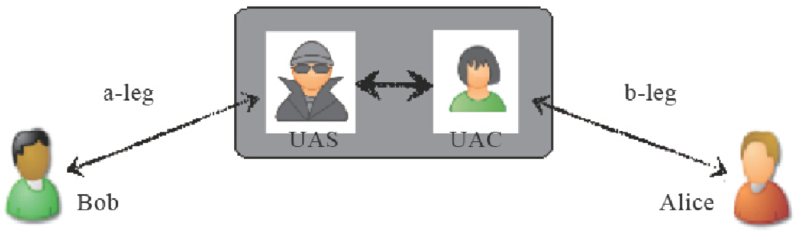

<center>图7-7　B2BUA的两条腿</center>

完整的呼叫流程如图7-8所示。

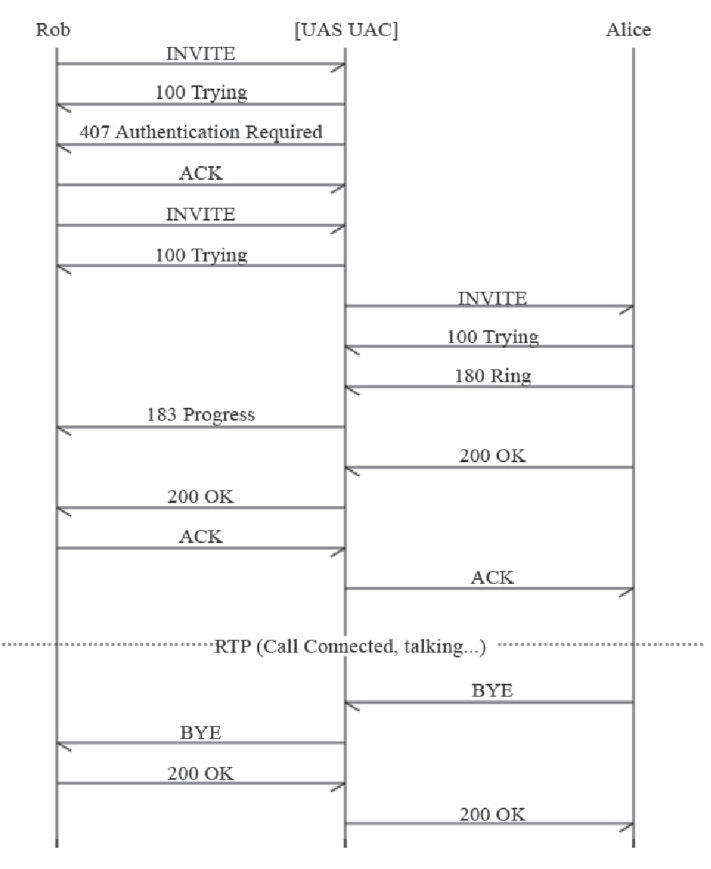

<center>图7-8　SIP B2BUA接呼叫流程图</center>

从图7-8可以看出，右半部分与图7-6是一样的，而左半部分也与图7-6类似。这就更好的说明了实际上有4个UA（两对）参与到了通信中，4个UA组成了通信中的两条腿。

[1] 注意，在最新版的X-Lite上（如X-Lite 4.5.4），不允许直接使用SIP地址进行呼叫，解决办法是添加一个SIP账号，其中Domain中填写对方的SIP地址，如本例中的192.168.4.4:5090。其他参数可以随便填，最后记住去掉“Register with domain and receive calls”前面的复选框的选中状态。保存后，就可以呼叫Alice了，这跟上述流程一样。

## 深入理解SIP

读者只要对照一下上面讲的HTTP协议与SIP协议，就会发现协议文本本身的格式很类似，不同的只是SIP的交互流程更丰富一些。下面我们再来跟大家一起再深学习一些与SIP相关的知识。

### SIP URI

上面我们介绍了一些FreeSWITCH的基本概念，并通过一个真正的呼叫流程讲解了SIP。由于实验中所有UA都运行在一台机器上，这可能会引起读者的不解，如果我们有三台机器，其中192.168.1.9是FreeSWITCH服务器，而Bob和Alice分别在另外两台机器上，那么情况可能是图7-9所示的样子。

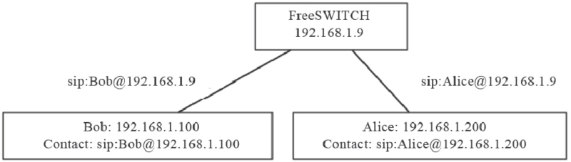

<center>图7-9　SIP URI</center>

Alice注册到FreeSWITCH，Bob呼叫她时，使用她的服务器地址（因为Bob只知道服务器地址），即sip:Alice@192.168.1.9，FreeSWITCH接到请求后，查找本地数据库，发现Alice的实际地址（Contact地址，又叫联系地址）是sip:Alice@192.168.1.200，便可以建立呼叫。

SIP URI除使用IP地址外，也可以使用域名，如sip:Alice@freeswitch.org.cn。更高级及更复杂的配置可能需要DNS的SRV记录，在此就不做讨论了。

这里再重复一下，Bob呼叫Alice里，Bob是主叫方，他已经知道服务器的地址，因此可以直接给服务器发送INVITE消息，因而它是不需要注册的 [1]。而Alice不同，它是作为被叫的一方，为了让服务器能找到它，它必须事先通过REGISTER消息注册到服务器上。

### SDP和SOA

SIP负责建立和释放会话，一般来说，会话会包含相关的媒体，如视频和音频。媒体数据是由SDP（Session Description Protocol，会放描述协议）描述的。SDP一般不单独使用，它与SIP配合使用时会放到SIP协议的正文（Body）中。

会话建立时，需要媒体协商，双方才能确定对方的媒体能力以交换媒体数据。在第8章我们会专门讲媒体协商，在此我们通过一个简单的例子介绍一下SDP是如何工作的。

这里我们来看一个FreeSWITCH参与的单腿呼叫的例子。客户端607呼叫FreeSWITCH默认的服务echo，它是一个回声服务，呼通后，主叫用户不仅能听到自己的声音，还能看到自己的视频（如果有的话）。在此，为了显示直观一些，我们使用了Wireshark抓包并进行分析，图7-10显示了该SIP呼叫的流程（关于Wireshark的用法我们将在第12章讨论）。

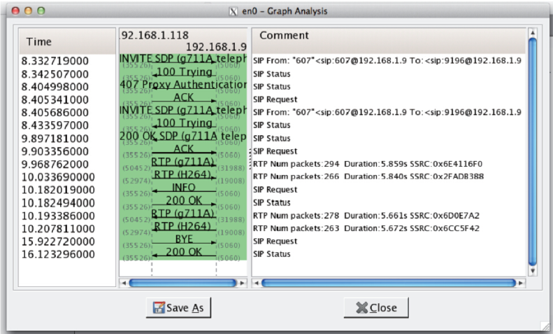

<center>图7-10　带SDP的SIP呼叫</center>

图7-10中，客户端（192.168.1.118）呼叫FreeSWITCH（192.168.1.9），INVITE中带了SDP消息。其认证过程与我们上面讲到的类似。最后，FreeSWITCH回复200 OK对通话应答，然后双方互发RTP媒体流（G711A，即PCMA的音频和H264的视频）。并且，在图中可以看出，客户端的SIP端口号是35526，音频端口号是50452，视频端口号是52974；FreeSWITCH端的端口号则分别是5060、31988和19008。后面我们会在SIP消息中找到这些端口，这里就不再赘述了，大家只要知道用到的是这些端口就可以了。

在本章前面的例子中，为了节省篇幅，我们都省略了SDP部分。下面是一个完整的SIP INVITE消息：

```
-----------------------------------------------------------------------
recv 921 bytes from udp/[192.168.1.118]:35526 at 05:48:25.379261:
-----------------------------------------------------------------------

INVITE sip:9196@192.168.1.9 SIP/2.0
Via: SIP/2.0/UDP 192.168.1.118:35526;branch=z9hG4bK-d8754z-0a09c74c6345dc09-1---d8754z-;rport
Max-Forwards: 70
Contact: <sip:607@192.168.1.118:35526>
To: <sip:9196@192.168.1.9>
From: "607"<sip:607@192.168.1.9>;tag=f49f383a
Call-ID: ZTQ0N2Y2NzI2ZjMxZTcwZTY0YTA5ODUyZDUzNWM2YjM
CSeq: 1 INVITE
Allow: INVITE, ACK, CANCEL, OPTIONS, BYE, REFER, NOTIFY, MESSAGE, SUBSCRIBE, INFO
Content-Type: application/sdp
Supported: replaces
User-Agent: Bria 3 release 3.5.0b stamp 69410
Content-Length: 381
v=0
o=- 1371880105304943 1 IN IP4 192.168.1.118
s=Bria 3 release 3.5.0b stamp 69410
c=IN IP4 192.168.1.118
b=AS:2064
t=0 0
m=audio 50452 RTP/AVP 8 0 98 101
a=rtpmap:98 ILBC/8000
a=rtpmap:101 telephone-event/8000
a=fmtp:101 0-15
a=sendrecv
m=video 52974 RTP/AVP 123
b=TIAS:2000000
a=rtpmap:123 H264/90000
a=fmtp:123 profile-level-id=428014;packetization-mode=0
a=rtcp-fb:* nack pli

a=sendrecv
-----------------------------------------------------------------------
```

关于SIP头部，我们前面已经了解得差不多了。其中的Content-Length也跟HTTP协议中的类似，表示正文的长度。读者也能看出正文的类型用Content-Type表示，在这里它是application/sdp，表示正文中是SDP消息。同样，一个空行把SIP头（Header）与SIP正文（Body）部分隔开（SIP头部的结束是以“\r\n\r\n”为标志的）。

下面我们主要讨论SDP部分。

- v=：Version，表示协议的版本号。
- o=：Origin，表示源。值域中各项（以空格分隔）的涵义依次是username（用户名）、sess-id（会话ID）、sess-version（会话版本号）、nettype（网络类型）、addrtype（地址类型）、unicast-address（单播地址）。
- s=：Session Name，表示本SDP所描述的Session的名称。
- c=：Connecton Data，连接数据。其中值域中以空格分配的两个字段分别是网络类型和网络地址，以后的RTP流就会发到该地址上。注意，在NAT环境中如果我们要解决RTP穿越 [2]问题就要看这个地址。NAT问题将在第9章节中讲到。
- b=：Badwidth Type，带宽类型。
- t=：Timing，起止时间。0表示无限。
- m=：audio Media Type，媒体类型。audio表示音频，50452表示音频的端口号，跟图7-10中的一致；RTP/AVP是传输协议 [3]；后面是支持的Codec类型，与RTP流中的Payload Type [4]（载荷类型）相对应，在这里分别是8、0、98和101，8和0分别代表PCMA和PCMU，它们属于静态编码，因而有一一对应的关系，而对于大于95的编码都属于动态编码，需要在后面使用“a=rtpmap”进行说明。
- a=：Attributes，属性。它用于描述上面音频的属性，如本例中98代表8000Hz的ILBC编码，101代表RFC2833 DTMF事件。a=sendrecv表示该媒体流可用于收和发，其他的还有sendonly（仅收）、recvonly（仅发）和inactive（不收不发）。
- v=：Video，视频。可以看出它的端口号52974也是跟图7-10中是一致的。而且与H264的视频编码对应的也是一个动态的Payload Type [5]，在本例中是123。

FreeSWITCH收到上述的请求后，进行编码协商，这里我们省去SIP交互的中间环节，直接看200（应答）消息：

```
-----------------------------------------------------------------------
send 1255 bytes to udp/[192.168.1.118]:35526 at 05:48:26.939191:
-----------------------------------------------------------------------

SIP/2.0 200 OK
…
Content-Type: application/sdp
Content-Length: 297
v=0
o=FreeSWITCH 1371848118 1371848119 IN IP4 192.168.1.9
s=FreeSWITCH
c=IN IP4 192.168.1.9
t=0 0
m=audio 31988 RTP/AVP 8 101
a=rtpmap:8 PCMA/8000
a=rtpmap:101 telephone-event/8000
a=fmtp:101 0-16
a=silenceSupp:off - - - -
a=ptime:20
m=video 19008 RTP/AVP 123

a=rtpmap:123 H264/90000
-----------------------------------------------------------------------
```

为节省篇幅，我们省略了一部分SIP头。下面直接看200返回的SDP数据。在这里我们也能找到音、视频的IP地址192.168.1.9以及端口号31988和19008。该SDP也携带了FreeSWITCH协商后的编码PCMA（8）以及“a=ptime”项，其中ptime表示RTP数据的打包时间，其实这里也可以省略，默认是20毫秒。至此，双方都有了对方的RTP地址和端口信息，它们就可以互发RTP流了。

媒体流的协商过程称为SOA [6]（Service Offer and Answer，提议/应答）。通俗地讲，它首先由一方提供支持的Codec类型，由另一方选择。如本例中，607先在INVITE中提议：“我支持PCMA、PCMU和ILBC编码（在m=audio 50452 RTP/AVP 8 0 98 101行中说明），你看咱俩用哪种通信比较好？”，FreeSWITCH在200 OK中回复说：“那我们就用PCMA吧”（m=audio 31988 RTP/AVP 8 101）。具体SOA流程及FreeSWITCH选择Codec的策略和依据我们将在第8章中详细解释。

### 3PCC

值得一提的是，并不是所有的INVITE请求都是带SDP的，在3PCC中可能没有SDP。

3PCC（Third Party Call Control，第三方电话呼叫控制）指的是由第三方控制者（Controller）在另外两者之间建立的一个会话，由控制者负责会话双方的媒体协商。3PCC是一种非常灵活的会话控制方式。在PSTN网中，第三方呼叫控制通常用于会议、接线业务(接线员创建一个连接另外双方的呼叫)。同样，使用SIP协议也可以借助3PCC来完成PSTN网中的一些相关业务，例如点击拨号、通话过程中放音等等，而且实现起来非常方便。

3PCC的实现关键就在于控制者如何使用SOA在会话双方之间使用SDP消息协商即将建立的会话。RFC3725 [7]描述了几种实现3PCC的方法，我们在此以第一种为例简单介绍一下。详细了解3PCC已超出本书的范围，在此笔者仅以此为例帮助读者理解不带SDP的INVITE呼叫的交互流程，而对3PCC则避重就轻。一个典型的3PCC呼叫如图7-11所示。

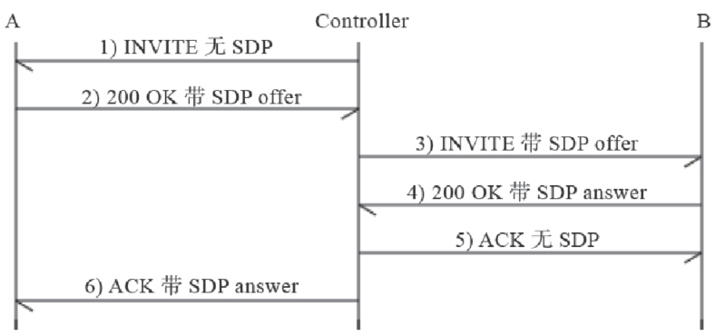

<center>图7-11　一个简单的3PCC呼叫</center>

其中：

1）Controller向A发送一个不带SDP的INVITE请求。

2）A给Controller回送200 OK，其中的offer指的是SDP消息，其中还有描述与A相关的媒体处理能力的数据，详见SDP协议。

3）Controller向B发送INVITE请求，这其中带有A的SDP相关描述。

4）B给Controller回送200 OK应答，其中的answer指的是SDP消息，其中描述与B相关的媒体处理能力的数据。

5）Controller给B回送ACK，不含任何SDP信息，因为在前面的INVITE中已经有了。

6）Controller对A回送ACK，其中带有B的SDP相关信息，这其实就可使媒体流在A和B之间传输了，而不用Controller去转发媒体流。

这就是用一个第三方的Controller进行呼叫控制的例子。FreeSWITCH默认不支持没有SDP的INVITE请求，如果需要响应这种请求，则可以尝试在SIP Profile中开启enable-3pcc参数。

### SIP承载

大家已经熟知，HTTP是用TCP承载的，而SIP则支持TCP和UDP承载。事实上，RFC3261规定，任何SIP UA必须同时支持TCP和UDP [8]。我们常见的SIP都是用UDP承载的，由于UDP是面向无连接的，在大并发量的情况下与TCP相比可以节省TCP由于每个IP包都需要确认带来的额外开销 [9]。不过，在SIP包比较大的情况下，如果超出了IP层窗口的大小（通常是1500），在经过路由器的时候可能会被拆包，使用UDP承载的SIP消息就可能发生丢失、乱序等，这时候就应该使用TCP。

在需要对SIP加密的情况下，可以使用TLS [10]。TLS是基于TCP的。

在新的网络时代，又出了一个新的草案，称为SIP over WebSocket [11]。当前有些浏览器如Chrome和FireFox已经实现了WebSocket，从而可以通过它承载SIP；而它们也实现了WebRTC [12]，这意味着可以通过浏览器与普通的SIP话机（甚至PSTN）进行音频、视频通话。关于WebRTC的内容我们将在第12章讲解。

[1] 某些服务器在收到呼叫时会检查主叫是否注册，否则不允许继续呼叫，这是策略问题，不是必须的。 

[2] 在NAT环境中，处于内部的主机又往往不知道自已在NAT设备中对应的公网地址，因而此处的网络地址就只好填私网的IP地址，而处于公网的主机无法直接访问NAT内部主机的IP地址（私网地址），因而会出现RTP媒体流不通的情况。 

[3] RTP/AVP即RTP音频、视频Profile，由RFC 3551定义，参见http://en.wikipedia.org/wiki/RTP_audio_video_profile及http://tools.ietf.org/html/rfc3551。 

[4] Payload Type为RTP中承载的媒体数据的类型，简称载荷类型。RFC3551定义了一些常用的音频、视频媒体，如0代表PCMU，8代表PCMA等。 

[5] 由于Payload Type123大于95，因而它属于一个动态编码，即实际编码内容与该数字不是一一对应的。实际的映射关系要在后续的“a=rtpmap”行中进行说明。本例中，“a=rtpmap:123 H264/90000”表示它说明了一对Payload Type和实际编码的对应关系，即在这里，123表示H264编码（仅在本次会话中有效）。 

[6] 它是在RFC3264中定义的，参见http://tools.ietf.org/html/rfc3264。 

[7] http://tools.ietf.org/html/rfc3725。 

[8] All SIP elements MUST implement UDP and TCP.SIP elements MAY implement other protocols. 

[9] 当然，仁者见仁，智者见智。笔者也听有人说过由于使用了TCP，客户端可以不用总发REGISTER注册消息以用于保持连接或穿越NAT等，反而节省了资源。可惜找不到原文出处了。 

[10] http://zh.wikipedia.org/wiki/安全套接层。 

[11] http://datatracker.ietf.org/doc/draft-ietf-sipcore-sip-websocket/。 

[12] http://www.webrtc.org/http://zh.wikipedia.org/wiki/WebRTC。

## 小结

本章没有照本宣科地讲解SIP协议的内容，而是从最简单的注册和呼叫开始，以讲故事的方式由浅入深地介绍了SIP的基本概念以及注册和呼叫等交互流程。希望没有SIP甚至也没有HTTP基础的读者也可以轻松上手。而对于高级的读者，本章也给出了延伸阅读的资料。

FreeSWITCH是一个B2BUA。读者在了解了FreeSWITCH的架构以后，再结合SIP的详细呼叫流程思考一下，就比较容易理解了。

本章的协议文本都是从FreeSWITCH中实际抓出来的，看起来比较直观。读者可以在学习的过程中自行练习。获取这些SIP消息的方法是在FreeSWITCH命令行上执行如下命令：

```
freeswitch> sofia global siptrace on
```

然后，打电话看一下能不能在控制台上看到信令。有时候，注册的电话多了以后，信令消息比较多，看起来就比较累。在这种情况下笔者一般是执行fs_cli连接到FreeSWITCH，打开siptrace，打一个测试电话后就立即用Ctrl+D（或/exit）退出fs_cli，然后慢慢分析。当然对初学者而言还是建议找一个清净的环境学习，不要注册太多分机。

如果需要关闭trace，可执行如下命令：

```
freeswitch> sofia global siptrace off
```

最权威的资料还是RFC 3261，如果你从事这方面的开发，还是需要好好读一读的。当然，如果你觉得RFC比较枯燥的话，网上也有一些有趣的关于SIP的阅读资料，感兴趣的读者不妨去读一读。这些资料有：

- http://www.freeswitch.org.cn/2012/06/20/guan-yu-voipni-ceng-jing-yi-wei-ni-bu-bi-zhi-dao-de-suo-you-dong-dong.html
- http://arstechnica.com/business/2010/01/voip-in-depth-an-introduction-to-the-sip-protocol-part-1/
- http://arstechnica.com/tech-policy/2010/03/voip-in-depth-an-introduction-to-the-sip-protocol-part-2/