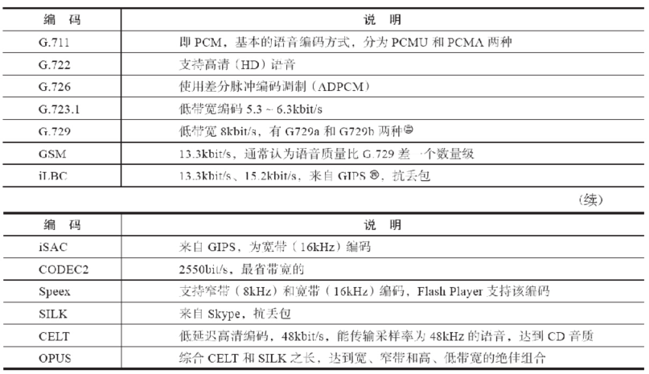
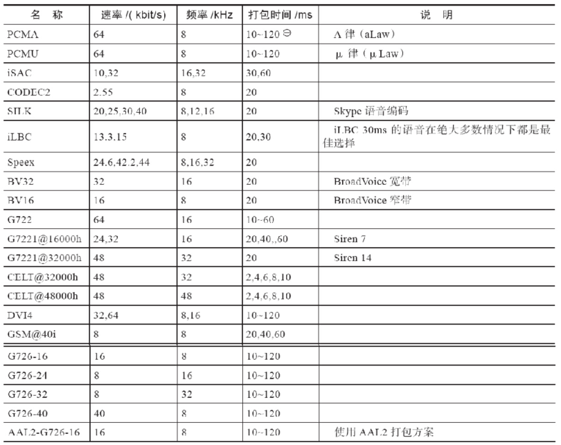
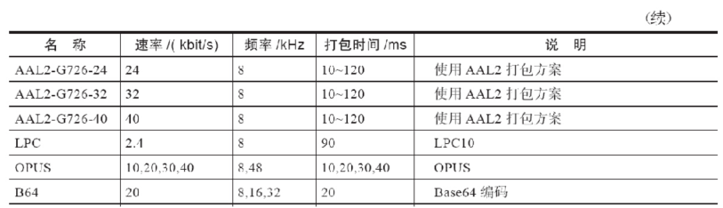
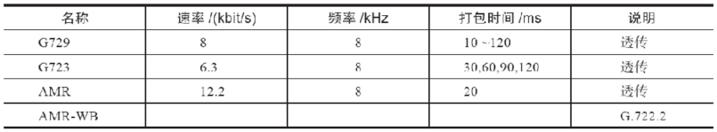
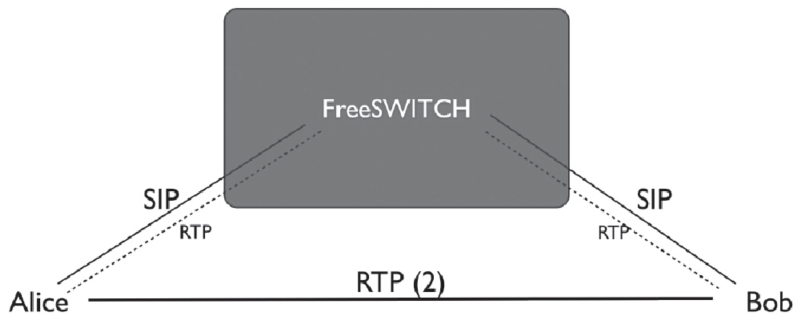
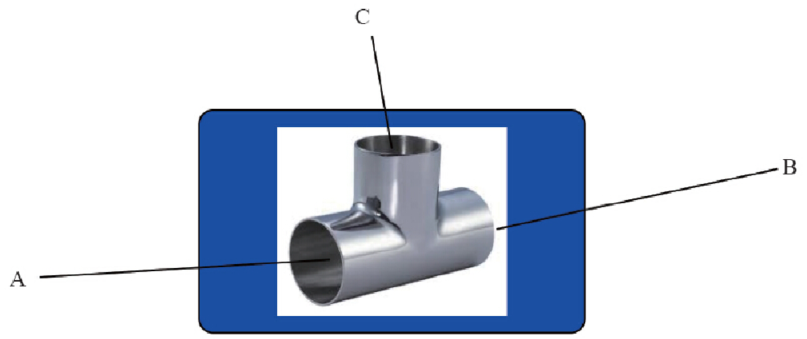
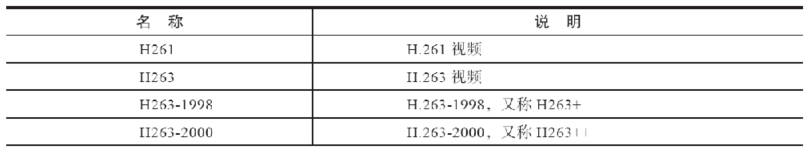
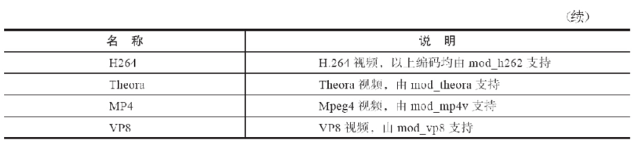

# 第01章 PSTN与VoIP基础
# 第02章 PSTN、PBX及呼叫中心业务
# 第03章 初识FreeSWITCH
# 第04章 运行FreeSWITCH
# 第05章 FreeSWITCH架构
# 第06章 拨号计划
# 第07章 SIP协议
# 第08章 媒体

通过第7章，我们已经了解了SIP信令，它用于帮助我们建立会话。但我们建立通话的目的是“通话”，即通话的双方要能互相听到对方的声音。通过第3章我们也已经了解到，要通过采样、量化、编码将我们声音的模块量变成数字信号，以便在数字线路上传输，我们把这些数字信号称为媒体（Media）。

本章我们就一起来学习一下媒体的知识，以及FreeSWITCH中的媒体处理机制和协商策略。

## 媒体与媒体处理

常见的媒体有音频、视频、图像（传真）、文本等。为了简单起见，接下来我们主要以音频为例来讲解相关的知识以及在FreeSWITCH中的实现和配置等。

### 频编码

从模拟信号变成数字信号的过程称为模数转换（Analog Digital Convert，AD）。AD转换要经过采样、量化、编码三个过程。编码（Code）就是指按照一定的规则将采样所得的信号用一组二进制或者其他进制的数来表示。经过编码后的数据便于在数字网络上传输，到达对端以后，再通过解码（Decode）过程变成原始信号，进而经过数模转换（Digital Analog Convert，DA）再恢复为模拟量，即转换为人们能够感知的信号。

一般来说，编码与解码过程都是成对出现的，所以习惯上人们把它们合起来说，称为编解码（Codec），即Co（de）与Dec（ode）的合成写法，但有时候为了方便，也简称为编码，如我们常说的音频编码或视频编码。

1. PCM编码

我们在1.2.2节讲过PCM。使用PCM方式对原始声音信号进行采样、量化后得到线性编码，然后再进行压缩，这种编码方式就称为PCM编码。PCM的两种压缩方式A律和μ律（alaw和ulaw）对应的编解码名称分别为PCMA和PCMU [1]。PCM编码是在ITU-T Recommendation G.711标准中定义的，因而又称为G.711 [2]编码。

经过压缩的PCM编码仍然占用比较高的带宽，因此在带宽比较紧张或比较昂贵的场合（如卫星线路上）又出现了一些更高级的压缩算法，目的都是降低带宽、提高传输效率。

另外，由于VoIP是在IP网上传输的，而大多数的网络没有QoS（Quality of Service）保证，容易产生丢包（Packet Loss）、延迟（Delay）或抖动（Jitter）。它们对于普通数据传输影响不是很严重，但对于实时的语音来说，影响就比较大，有时会引起声音质量的迅速下降，严重时甚至无法分辨。因此，某些好的压缩算法又平衡了这些因素带来的影响，在质量不好的网络上也能得到较好的声音质量。

PCM编码的采样频率为8000Hz，而随着技术的进步及人们对声音质量要求的提高，各种高清（High Definition，HD）编码也纷纷涌现，如G.722等。

如果在网络上传输语音，则要将编码后的语音数据打包。通常使用的打包时间间隔为20ms，即将20ms的音频数据放到一个数据包里传送，也可以理解为每20ms打一个包。如果采样频率是8000Hz，那么1秒就能传输1000ms/20ms=50个包，每个包携带8000/50=160个采样数据。在PCMA或PCMU方式中，每个采样数据占1字节，因此一个20ms的PCM包的数据净荷就是160字节。

2. FreeSWITCH支持的其他语音编码

FreeSWITCH支持非常丰富的语音编码，具体如表8-1所示。

<center>表8-1　FreeSWITCH支持的语音编码</center>



与其他压缩算法不同的是，G.729携带的不是真正语音数据的压缩结果，而是使用CS-ACELP预测模型得到的声音码表。CS-ACELP的全称是Conjugate-Structure Algebraic-Codec-Excited Liner，它利用数学模型模拟人类的各种发声方式，可以建立声音码表，用发送对应的声音代码代替实际的声音采样。对端收到后再根据这些声音代码合成语音。

Global IP Sound，后改为Global IP Solutions，在语音编解码方面颇有建树，它们的解决方案在抗丢包及回声消除方面做得特别好，广泛应用于我们所熟知的产品，如Skype及QQ。2010年被Google收购，后来开源了iSAC。

在FreeSWITCH中，编码名称的格式为“名称@xxh@yyi”。其中h代表Hz，即采样频率；i则代表ptime，即打包间隔；xx和yy分别代表实际的数值，如speex@16000h@20i表示16000Hz、20ms的Speex编码。表8-2列举了FreeSWITCH中各种编码的一些详细参数。

<center>表8-2　FreeSWITCH支持的语音参数</center>





以10ms为间隔，即10，20，30，…，120，下同。

表8-3中所列的编码，由于专利原因，只能透传。其中，G729编码在FreeSWITCH中Linux平台上有Licence解决方案，购买一路需要10美元，其中包含一个编码器和一个解码器。

<center>表8-3　透传的语音编码</center>



另外，关于这些编码的比较，可以参见http://en.wikipedia.org/wiki/Comparison_of_audio_codecs。

3. FreeSWITCH中与编码相关的主要命令

如果要查看FreeSWITCH支持的编码类型，可以在控制台上使用show codec命令，下面是该命令在笔者电脑上的输出结果（有删节）。

```
freeswitch> show codec
codec,ADPCM (IMA),mod_spandsp
codec,AMR,mod_amr
codec,G.711 alaw,CORE_PCM_MODULE
codec,G.711 ulaw,CORE_PCM_MODULE
codec,G.722,mod_spandsp
codec,G.723.1 6.3k,mod_g723_1
codec,G.726 16k,mod_spandsp
codec,G.729,mod_g729
codec,H.264 Video (passthru),mod_h26x
codec,VP8 Video (passthru),mod_vp8
```

上述结果中，每一行代表某一个编码，都标明了相关的编码名称及参数（以逗号隔开的第2列）以及具体实现的模块（第3列）。我们可以看到，G.711编码（A律和μ律）都是在核心模块（CORE_PCM_MODULE）中实现的。关于具体的实现代码，我们在第18章讲源代码阅读的时候还会讲到。

另外，在FreeSWITCH启动的时候，或者你使用reload来重新加载某个编解码模块的时候，可以看到控制台上有类似如下的输出（下面是重新加载mod_spandsp时的输出，该模块提供了很多语音编码，有删节）。

```
[NOTICE] Adding Codec DVI4 6 ADPCM (IMA) 16000hz 40ms 64000bps
[NOTICE] Adding Codec DVI4 6 ADPCM (IMA) 16000hz 50ms 64000bps
[NOTICE] Adding Codec DVI4 6 ADPCM (IMA) 16000hz 60ms 64000bps
[NOTICE] Adding Codec DVI4 5 ADPCM (IMA) 8000hz 10ms 32000bps
[NOTICE] Adding Codec DVI4 5 ADPCM (IMA) 8000hz 20ms 32000bps
[NOTICE] Adding Codec DVI4 5 ADPCM (IMA) 8000hz 30ms 32000bps
[NOTICE] Adding Codec G726-16 124 G.726 16k 8000hz 10ms 16000bps
[NOTICE] Adding Codec G726-16 124 G.726 16k 8000hz 20ms 16000bps
[NOTICE] Adding Codec G726-16 124 G.726 16k 8000hz 30ms 16000bps
....
```

上述结果中，上面每一行都代表增加了一种编码。它们的意义一目了然，因此，在这里就不多解释了。
在实践中，当你不清楚某种编码所提供的各种参数时，可以尝试重新加载所属模块。比如SILK编码属于mod_silk模块，则可以使用reload mod_silk实现，示例如下：

```
freeswitch> reload mod_silk
[NOTICE] Adding Codec SILK 119 SILK 16000hz 20ms 30000bps
[NOTICE] Adding Codec SILK 118 SILK 12000hz 20ms 25000bps
[NOTICE] Adding Codec SILK 117 SILK 8000hz 20ms  20000bps
```

iLBC编码也是由独立的模块提供的，重新加载的命令和输出如下：

```
freeswitch> reload mod_ilbc
[NOTICE] Adding Codec iLBC 97 iLBC 8000hz 30ms 13330bps
[NOTICE] Adding Codec iLBC 98 iLBC 8000hz 20ms 15200bps
```

音频编码最基本的两个技术参数就是采样频率和打包周期。采样频率越高，声音就越清晰，保留的细节就越多，当然它会占用更大的带宽。对于普通“人声”通话来讲，8000Hz就够了，但对于高品质的音乐来讲，就需要更高的采样率才能保证“悦耳”，比如我们通常说的CD音质的声音使用的就是44.1kHz的采样率。打包周期跟传输有关，打包周期超短，延迟越小，相对而言传输开销就会越多，因而需要更大的带宽；打包周期超长，带来的延迟就越大，如果传输过程中有丢包，对语音质量的影响也就越大。大部分编码都支持多种打包周期，最常见的是20ms，iLBC、G.723等默认使用30ms，更长的打包周期如60~120ms，通常用于卫星链路等高延迟、低带宽的场合。

注意，在FreeSWITCH中，有些编码不是默认安装的。如果要使用这些编码，需要自己编译，如在源代码目录下可执行以下命令来安装相应的编码（中文注释为笔者所加）：

```
# make mod_celt-install         #安装CELT编码
# make mod_silk-install         # 安装SILK编码
# make mod_isac-install         # 安装iSAC编码
# make mod_opus-install         # 安装OPUS编码
# make mod_codec2-install       # 安装CODEC2编码
```

### 媒体工作机理和相关配置

为了帮助大家更好地理解媒体，下面我们简单介绍一下媒体的工作机理和相关的配置。

1. 工作机理

在第7章中，我们只讨论了SIP的呼叫建立和释放流程，而没有考虑媒体的情况。实际上，在基于SIP的通信中，媒体数据是在RTP流中传输的。

以PCM音频数据为例，我们上面已经讲过，如果打包周期是20ms，则每个音频包得到160字节的数据，在这些数据前面加上12字节的RTP包头，就成为了一个RTP包。RTP包头中携带了音频的编码类型及时间戳等数据，以便于对方收到后进行解码回放及同步等。

RTP包使用与SIP不同的UDP端口传送，因而在实际传输前需要先通过SIP信令与对方“协商”好该往哪个端口传送，一个高度简化的SIP/RTP交互流程示意图如图8-1所示。从图中我们可以看到，A和B首先通过SIP信令“协商”好双方将要使用的RTP端口号（当然还有双方的IP地址，我们省略了），然后双方互相向对方发送RTP媒体流。


<center>图8-1　简化的SIP/RTP交互流程示意图</center>

SIP可使用TCP或UDP承载，但RTP数据一般只使用UDP承载。更详细的协商过程我们稍后讨论，下面先来看一下FreeSWITCH中与媒体相关的配置。

2. 相关配置

在默认的配置中，SIP Profile支持的媒体列表是在vars.xml文件中配置的，如：

```xml
<X-PRE-PROCESS cmd="set" data="global_codec_prefs=G722,PCMU,PCMA,GSM"/>
<X-PRE-PROCESS cmd="set" data="outbound_codec_prefs=PCMU,PCMA,GSM"/>
```

如果要增加其他编码的支持（如G729），可以将上述配置项改为：

```xml
<X-PRE-PROCESS cmd="set" data="global_codec_prefs=G722,PCMU,PCMA,GSM,G729"/>
<X-PRE-PROCESS cmd="set" data="outbound_codec_prefs=PCMU,PCMA,GSM,G729"/>
```

然后需要重启FreeSWITCH以使设置生效 [3]。
如果在学习过程中需要频繁做实验，不妨直接修改Profile配置中的相关项，如在internal.xml中，将下面的行：

```xml
<param name="inbound-codec-prefs" value="$${global_codec_prefs}"/>
```

改为：

```xml
<param name="inbound-codec-prefs" value="PCMU,PCMA,G729,iLBC,H264,VP8"/>
```

然后只需在FreeSWITCH控制台上或fs_cli中执行如下命令使刚才的配置生效：

```
freeswitch> sofia profile internal rescan
```

以下命令可以列出当前与Profile相关的配置情况，如（有删节）：

```

freeswitch> sofia status profile internal
====================================================================

Name                internal
Dialplan            XML
Context             public
RTP-IP              192.168.1.102
SIP-IP              192.168.1.102
URL                 sip:mod_sofia@192.168.1.102:5060
BIND-URL            sip:mod_sofia@192.168.1.102:5060
CODECS IN           PCMU,PCMA,G729,iLBC,H264,VP8
CODECS OUT          PCMU,PCMA,H264,VP8
……
```

其中，CODECS IN、CODECS OUT行显示了呼入、呼出的编码设置。

[1] 这些名字用于在SDP中标志RTP中传输的媒体的类型，参见：http://en.wikipedia.org/wiki/RTP_audio_video_profile。 

[2] 参见http://en.wikipedia.org/wiki/G.711。 

[3] 在UNIX类平台上，也可以给FreeSWITCH发送HUP信号让FreeSWITCH重新解析这些XML中的全局变量。首先找到FreeSWITCH的Pid，然后kill-HUP<Pid>，最后在FreeSWITCH中执行sofia profile internal rescan。

## 　媒体协商

世界是丰富多彩的，不同的SIP终端有不同的特性。支持不同的语音编码。所以不同的SIP终端进行通信时需要先与支持的编码进行“协商”，以便双方互相能够“理解”对方发来的媒体流中的数据。

### 协商过程

我们来看一个最简单的编码协商过程。如果在FreeSWITCH中，按F8打开详细的Log，打一个电话，就会在Log中看到如下类似的协商过程：

```
Audio Codec Compare [iLBC:97:8000:60:0]/[G722:9:8000:20:64000]
Audio Codec Compare [iLBC:97:8000:60:0]/[G729:18:8000:20:8000]
Audio Codec Compare [iLBC:97:8000:60:0]/[PCMU:0:8000:20:64000]
Audio Codec Compare [iLBC:97:8000:60:0]/[PCMA:8:8000:20:64000]
Audio  Codec Compare  [iLBC:97:8000:60:0]/[GSM:3:8000:20:13200]
```

在上面的例子中，SIP客户端呼入时使用iLBC编码，打包周期是60ms，Payload Type是97；而服务器端提供G722、PCMU、PCMA、GSM等选择，但都是20ms的。所以我们在上述Log中可以看出FreeSWITCH会将客户端提供的编码与本地提供的编码逐一比较。由于客户端与服务器提供的编码没有交集，故上面的协商是不成功的，在这种情况下，FreeSWITCH会返回SIP 488消息，失败原因INCOMPATIBLE_DESTINATION（目的地不兼容）说明找不到兼容的编码。

SIP采用Offer/Answer（请求/应答）机制来协商。请求发起的一方提供（Offer）自己支持的媒体编码列表，被请求的一方比较自己支持的媒体列表最终选择一种（或几种）编码以应答（Answer）方式通知请求者，然后它们就可以使用兼容的编码进行通信了。下面是一次成功的协商Log（客户端使用PCMA，最终成功协商PCMA）：

```
Audio Codec Compare [PCMA:8:8000:20:64000]/[G722:9:8000:20:64000]
Audio Codec Compare [PCMA:8:8000:20:64000]/[PCMU:0:8000:20:64000]
Audio Codec Compare [PCMA:8:8000:20:64000]/[PCMA:8:8000:20:64000]
switch_core_media.c:3213 Audio Codec Compare [PCMA:8:8000:20:64000] 
++++ is saved as a match
Set Codec sofia/internal/1006@192.168.7.6 PCMA/8000 20 ms 160 samples 64000
```

从上面的协商Log中可以看到，它也是将客户端的编码与服务器端的编码进行逐一比较，最后一行的“Set Codec…PCMA”表示本次协商成功并把该Channel的编码设为PCMA编码。

### SDP及其在编码协商中的作用

为了更直观地理解SIP协议中的编码协商过程，下面我们来详细看一下相关的SIP信令。

由第7章我们知道，SIP信令格式类似HTTP协议，由请求/应答行、消息头及消息体构成。一般的SIP INVITE消息体都包含SDP [1]，我们来看一个INVITE请求（为节省篇幅，消息头部分做了删节），消息如下：

```
INVITE sip:3000@192.168.1.102 SIP/2.0
To: <sip:3000@192.168.1.102>
From: "1000"<sip:1000@192.168.1.102>;tag=53604628
Content-Type: application/sdp
Content-Length: 222
v=0
o=- 1364745810658806 1 IN IP4 192.168.1.102
s=Bria 3 release 3.5.0b stamp 69410
c=IN IP4 192.168.1.102
b=AS:2064
t=0 0
m=audio 59820 RTP/AVP 8 18 101
a=rtpmap:101 telephone-event/8000
a=fmtp:101 0-15
a=sendrecv
```

其中，媒体类型是由SDP消息（Session Description Protocol，会话描述协议）描述的，SDP消息的MIME类型是application/sdp，它是在SIP头中以Content-Type标志，并在SIP消息的正文（Body，又称消息体，消息头中的Content-Length指示Body的长度）中携带。以下我们将忽略SIP消息头部分，只讨论SDP消息。

SDP消息从v=0一行开始。“C=IN”一行表示媒体所在机器的IP地址。“m=audio”一行描述音频数据，其中59820就是RTP的端口号，该端口用于收、发RTP数据；RTP/AVP表示使用RTP承载的Audio/Video Profile [2]；8和101表示音频编码的代号，它是由IANA [3]负责分配和管理的，因而又称为IANA代码，在此8代表PCMA，18代表G729。a=sendrecv表示双向收发，其他的还有sendonly（只发）、recvonly（只收）及inactive（不发不收）等。

当FreeSWITCH收到后，即启动协商过程。如上一节的Log所示，服务器端提供PCMU和PCMA，因此当比较到PCMA时协商成功，FreeSWITCH将返回如下SIP消息：

```
SIP/2.0 200 OK
... 
（略）
Content-Type: application/sdp
Content-Length: 249
v=0
o=FreeSWITCH 1364717298 1364717299 IN IP4 192.168.1.102
s=FreeSWITCH
c=IN IP4 192.168.1.102
t=0 0
m=audio 28512 RTP/AVP 8 101

a=rtpmap:8 PCMA/8000
a=rtpmap:101 telephone-event/8000
a=fmtp:101 0-16
a=silenceSupp:off - - - -
a=ptime:20
```

以上消息中的SDP说明FreeSWITCH这端的RTP端口号是28512，使用PCMA编码。至此，协商完毕，双方互相知道了对方的IP地址和端口号，就可以互发音频RTP包了。

注意，在本例中，FreeSWITCH回复的是200消息以此作为对Offer的Answer，当然具体回复的消息要视具体情况而定，如果在早期媒体的情况下则需要先回复，这时可能是183消息。我们第7章已经讲过，1xx消息是呼叫进展消息。当UA发出一个请求后，如果对方回复的是180，证明呼叫进展顺利，主叫这一端即自己产生回铃音给用户一个有效的反馈。如果对方回复的是183，则183是可以携带SDP的，从而可以在协商成功后把自己个性化的媒体也传送过来，如彩铃或呼叫失败之前播放的录音通知等，这些媒体称为早期媒体（即Early Media，与正常的通话数据相比，它来得早了那么一点点）。对方在回送180或183时，自己的话机开始振铃，如果有人接听，则切断回铃音，并发送200 OK消息，一般来说交换机会在此时开始计费，因为正常的通话开始了。

另外，上面SDP消息中有一行“a=rtpmap:8 PCMA/8000”，它是对其上一行中音频代码列表中“8”的描述，在本例中，这一行不是必需的。但是IANA代码只规定了96以下的代码的一一对应关系，大于或等于96的称为动态编码，动态编码不能只用代码来区分，还必须同时使用其名称，因而，对于动态编码来讲，rtpmap行就是必需的。而UA在进行编码协商时，对于大于或等于96的编码，必须使用其名称来对比（如iLBC）。也许更糟糕的是，若双方约定了iLBC，一方的代码是96，另一方的代码是98，那么在RTP中，它们就必须使用自己的代码来发送，却需要以对方指定的代码来接收。当然，虽然代码不同，但双方都知道这是iLBC，所以编码和解码都没有问题。很遗憾的是，有一些UA没有充分理解这一点，因而在互联互通时可能会出问题。

### 协商时机与策略

FreeSWITCH的协商可分为早协商和晚协商。当呼叫到达一个SIP Profile时，即某端口收到INVITE请求而未到达路由阶段时，就先行协商的，称为早协商。而如果等到路由阶段，到达拨号计划时再进行协商的，称为晚协商（Later Negotiation）。通过使用晚协商，用户可以有更多的自由去确定协商策略。

系统默认为晚协商，如果要使用早协商，可以在SIP Profile中设置以下参数 [4]：

```
<param name="inbound-late-negotiation" value="false"/>
```

这里需要注意的是，如果启用了inbound-zrtp-passthru（默认），则隐含设置inbound-late-negotiation为true。

FreeSWITCH支持如下协商策略：generous、greedy和scrooge。

我们先看generous（普通的），它是默认的协商策略。假设客户端提供的编码列表为PCMA、G729，而FreeSWITCH支持的列表优先顺序为G729、PCMU、PCMA。那么当FreeSWITCH收到请求时将优先考虑客户端的感受，因而优先使用PCMA编码。

如果协商策略设为greedy（贪婪的），则上面的例子中FreeSWITCH会优先考虑自己的编码，因而会选择G729。

如果设置成scrooge（吝啬的），则FreeSWITCH会更加强势，它除了具有greedy所有的特性外，还将强制使用自己的采样率。

上面提到的是UA跟FreeSWITCH进行单腿协商的情况。我们总是提到FreeSWITCH是一个B2BUA。在预计通话会有两条腿的情况下，启用晚协商会得到更好的效果。比如，在SIP Profile中设置disable-transcoding为true时，FreeSWITCH将首先呼叫bleg，并仅Offer aleg提供的编码，从而可以避免转码，以节约CPU资源。

[1] 如在3PCC应用中，有些INVITE消息中可能没有SDP。参见7.4.3节。 

[2] 参见http://en.wikipedia.org/wiki/RTP_audio_video_profile。 

[3] the Internet Assigned Numbers Authority，互联网号码分配局。 

[4] 我们将在下一章深入讲解mod_sofia中Profile中的配置。


## 其他媒体相关的问题

FreeSWITCH有很强的媒体处理能力，也支持非常灵活的配置。下面我们再讲几个与媒体有关的概念及相关知识。

### RTP和RTCP

在完成SIP及SDP协商后，真正的语音数据是在RTP协议中传送的。即双方在前面的SDP协商中都已经获得了对方的IP地址、端口号，以及支持的媒体类型。接下来，就是将本地的媒体数据以指定的编码格式进行编码并通过RTP协议发送到对方去。

RTP [1]协议的全称是Real-time Transport Protocol，即实时传输协议，它是由IETF的多媒体传输工作小组在RFC 3550 [2]中定义的。RTP协议详细说明了在互联网上传递音频和视频的标准数据包格式。它一开始被设计为一个多播协议，但后来被用在很多单播应用中。RTP协议是建立在UDP协议之上的，常用于流媒体系统、视频会议和一键通（Push to Talk）系统（配合H.323或SIP），它已成为IP电话产业的技术基础。

RFC 3550中规定的RTP封包格式如下：

```
0                    1                    2                     3
0 1 2 3 4 5 6 7 8 9 0 1 2 3 4 5 6 7 8 9 0 1 2 3 4 5 6 7 8 9 0 1
+-+-+-+-+-+-+-+-+-+-+-+-+-+-+-+-+-+-+-+-+-+-+-+-+-+-+-+-+-+-+-+-+
|V=2|P|X|  CC   |M|     PT      |       sequence number         |
+-+-+-+-+-+-+-+-+-+-+-+-+-+-+-+-+-+-+-+-+-+-+-+-+-+-+-+-+-+-+-+-+
|                           timestamp                           |
+-+-+-+-+-+-+-+-+-+-+-+-+-+-+-+-+-+-+-+-+-+-+-+-+-+-+-+-+-+-+-+-+
|           synchronization source (SSRC) identifier             |
+=+=+=+=+=+=+=+=+=+=+=+=+=+=+=+=+=+=+=+=+=+=+=+=+=+=+=+=+=+=+=+=+
|            contributing source (CSRC) identifiers              |
|                             ....                              |
+-+-+-+-+-+-+-+-+-+-+-+-+-+-+-+-+-+-+-+-+-+-+-+-+-+-+-+-+-+-+-+-+
```

一般来说，在没有任何扩展的情况下，RTP包头的长度为12字节。其中主要字段的含义简介如下：

- version(V)：1 bit。标明RTP版本号。RFC3550中规定的版本号为2。
- padding(P)：1 bit。如果该位被设置，则将在该packet末尾包含额外的附加信息，附加信息的最后一个字节表示额外附加信息的长度（包含该字节本身）。该字段之所以存在是因为一些加密机制需要固定长度的数据块，或者为了在一个底层协议数据单元中传输多个RTP packets。
- extension(X)：1 bit。如果该位为1，则在固定的头部后存在一个扩展头部，格式定义在RFC3550中。
- CSRC count(CC)：4 bit。在固定头部后存在多少个CSRC标记。
- marker(M):1 bit。该位的功能依赖于RTP中实际传输媒体类型的Profile的定义。Profile可以改变该位的长度，但是要保持marker和payload type总长度不变（一共是8 bit）。一般来说，音频跟视频中该位的定义是不同的。在视频中，marker值为1通常表示一帧图像的结束 [3]。
- payload type(PT)：7 bit。标记着RTP packet所携带信息的类型，标准类型列在RFC3551中。如果接收方不能识别该类型，必须忽略该包。
- sequence number：16 bit。序列号，每个RTP包发送后该序列号加1，接收方可以根据该序列号检测丢包或重新排列数据包顺序等。
- timestamp：32 bit。时间戳。反映RTP包中所携带信息包中第一个字节的采样时间。
- SSRC：32 bit。数据源标识。在一个RTP Session期间每个数据流都应该有一个不同的SSRC。如果视频源发生变化，则应该改变SSRC，以让接收端感知到该变化。
- CSRC list：0到15项，每个源标识为32 bit。贡献数据源标识。只有存在多路混发的时候才有效。多路混发的情况，如一个将多声道的语音流合并到一个RTP流中发送，在这里就可以列出原来每个声道的SSRC。

实时传输控制协议 [4]（Real-time Transport Control Protocol或RTP Control Protocol，RTCP）是实时传输协议（RTP）的一个姊妹协议，前者由RFC 3551 [5]定义。RTP使用一个偶数UDP端口，而RTCP则使用RTP的下一个相邻的奇数端口。RTCP除为RTP媒体流提供信道外（out-of-band）的控制。RTCP本身并不传输数据，但会和RTP一起协作将多媒体数据打包并发送出去。RTCP定期在多媒体会话参加者之间传输控制数据。RTCP的主要功能是为RTP提供的服务的质量（Quality of Service）提供反馈信息。RTCP收集相关媒体连接的统计信息，例如传输字节数、传输分组数、丢失分组数及拉动（jitter）、单向和双向网络延迟等等，网络应用程序即可利用RTCP的统计信息来控制传输的品质，比如当网络拥塞比较严重时，可以限制信息流量或改用压缩率较高的编解码器。

### 转码

FreeSWITCH是一个B2BUA，因而在桥接两条腿时，如果两条腿分别使用不同的编码，则需要经过一个转码过程分别转成对方需要的编码。

当需要转码时，FreeSWITCH会将收到的音频数据转成一种中间格式，称为L16，即线性16位的编码。这种格式可以与其他各种编码进行转换。

另外，即使呼叫的双方采用同样的编码，但如果有IVR或录、放音等中间环节时，也需要转码。

有一些编码，如G729，由于专利原因，不能自由使用，因此FreeSWITCH默认不支持对它的转码。如果确实需要转码，则可以购买商业版的转码模块。

FreeSWITCH默认的配置（本例中的配置基于FreeSWITCH 1.2.11+git~20130720）不支持自动转码，笔者用默认的配置做了一个实验，A呼叫B，A端只有PCMA，B端只支持PCMU，而FreeSWITCH使用默认的编码，即“G722,PCMU,PCMA,GSM”。A端呼叫到达FreeSWITCH后，FreeSWITCH又向B发送INVITE，其中的SDP如下：

```
1 v=0
2 o=FreeSWITCH 1374385260 1374385261 IN IP4 192.168.7.8
3 s=FreeSWITCH
4 c=IN IP4 192.168.7.8
5 t=0 0
6 m=audio 21582 RTP/AVP 8 101 13
7 a=rtpmap:101 telephone-event/8000
8 a=fmtp:101 0-16
9 a=ptime:20
```

可以看出，FreeSWITCH提供的编码类型只有8（第6行，其中8代表PCMA，后面的101和13，分别代表RFC2833和静音包支持，不是实际的音频编码），而由于B端仅支持PCMU，所以协商失败，对方返回488消息，表示没有找到兼容的媒体类型。在笔者测试中收到的488消息内容如下：

```
SIP/2.0 488 Not Acceptable Here
Via: SIP/2.0/UDP 192.168.7.8;rport=5060;branch=z9hG4bKH1t8Fv9Xr7XgK
To: <sip:1002@192.168.7.8:51570;rinstance=59ddd96a3228b9f6>;tag=95be460b
From: "Extension 1000"<sip:1000@192.168.7.8>;tag=QQaKDZ709NHtF
Call-ID: 36dd7df4-6c9d-1231-82ad-cb44f52397c6
CSeq: 46867357 INVITE
User-Agent: Bria 3 release 3.5.0b stamp 69410
Warning: 305 devnull "SDP: Incompatible media format: no common codec"
Content-Length: 0
```

其中的Warning是一个可选的消息头，SIP终端（这里是Bria）带了这个消息头便于我们查找问题原因。
最后，经过实验笔者发现，如果要使协商成功，只需要在internal Profile里将下面一行注释掉：

```xml
<param name="inbound-zrtp-passthru" value="true"/>
```

需要将该Profile重启使之生效，重启命令如下：

```
freeswitch> sofia profile internal restart
```

读者也可以看一下重启前后该配置项的区别（省略其他输出，中文注释为笔者所加）：

```
freeswitch> sofia status profile internal
```

```
Name                internal
ZRTP-PASSTHRU       true              # 

重启前
----------------------------------------------------------

ZRTP-PASSTHRU       false             # 
重启后
```

尝试再打一个电话，可以看到，这次FreeSWITCH向B提供的编码列表就多了。下面是FreeSWITCH发给B的INVITE消息中的SDP部分：

```
v=0
o=FreeSWITCH 1374381088 1374381089 IN IP4 192.168.7.8
s=FreeSWITCH
c=IN IP4 192.168.7.8
t=0 0
m=audio 26076 RTP/AVP 8 9 0 3 101 13
a=rtpmap:101 telephone-event/8000
a=fmtp:101 0-16
a=ptime:20
```

其中，“8 9 0 3”分别代表PCMA、G722、PCMU、GSM，由于A提供的编码是PCMA，而FreeSWITCH提供的列表是G722、PCMU、PCMA、GSM，基于FreeSWITCH默认的协商策略（generous），FreeSWITCH在向B发送SDP的时候，尊重客户端A的选择，因此将PCMA排在了最前面，最后的列表成了PCMA、G722、PCMU、GSM。这时候B收到INVITE请求后，由于它仅支持PCMU，因此它在后续的200消息中告诉FreeSWITCH，FreeSWITCH将电话接通后，A便向FreeSWITCH发送PCMA编码的RTP媒体流，FreeSWITCH在收到后会自动转换为PCMU格式的媒体流并发送给B。同理，B向FreeSWITCH发送PCMU，FreeSWITCH转成PCMA再发给A。也就是说，FreeSWITCH可以在A与B端编码不同的情况下进行自动编码转换，简称转码。

通过该例子读者应能了解到，FreeSWITCH使用该协商策略的好处是，由于FreeSWITCH做SDP Offer的时候把PCMA放到了最前面，如果B同时也支持PCMA，而且也采取类似FreeSWITCH的协商策略，选用Offer列表中第一个编码，那么最终协商的结果还是PCMA，最终还是不用转码，从而有效节省了服务器的资源。

### 透传、媒体绕过与媒体代理

一般情况下，RTP媒体流也是经过FreeSWITCH转发的（见图8-1中的虚线部分）。如上节所述，在G729不支持转码的情况下，只要通话的双方都支持G729，FreeSWITCH仍然是可以建立通话的，其中一种方式就是透传（Passthru）。透传是指在不经过转码的情况下，将从一方收到的媒体流原样转给另一方。这种情况下，仍然可以建立通话，但在需要媒体处理的情况下，如在IVR、录音时，就会有些限制。

另一种极端的情况是采用媒体绕过（Bypass Media）技术，即真正的媒体流使用点到点传输，根本不经过FreeSWITCH。即使是FreeSWITCH从来没听说过的编码，只要通话的双方都支持，FreeSWITCH也能正常建立通话，而RTP则通过点对点直接传输，如图8-2中粗实线部分的RTP（2）路径。当然，使用媒体绕过与透传一样，要求通话的双方必须支持同样的媒体编码。



<center>图8-2　Bypass Media</center>

还有一种情况称为媒体代理（Proxy Media），即不管FreeSWITCH是否支持对该种编码转码，它都对RTP数据在不进行任何处理的情况下发给另一方，注意这里它跟透传的区别是，它只改变SDP中的“c=”部分，而不对RTP进行任何改变，如仍然保留其时间戳等数据。

### Media Bug

为了解决监听和录音问题，FreeSWITCH在媒体流路径上放了一个Media Bug [6]，它的作用相当于我们水管上的一个三通，如图8-3所示，媒体流不仅在A（Alice）和B（Bob）之间交换，还通过一个三通连接到C（Carl）。



<center>图8-3　Media Bug就类似一个三通</center>

技术上讲，C可能是另一个SIP Channel，在做监听。Media Bug的媒体流也是双向的，因而C也可以发送音频数据形成三方通话。FreeSWITCH提供eavesdrop和three_way两个App来分别完成该功能。

实际上，Media Bug的用处还有很多，如音信号检测（Tone Detect）就是使用Media Bug来检测是否有特殊音频的，如传真音或inband DTMF信号等。当然，录音也是通过这种机制来实现的（这时候C就相当于一个录音机）。

### 视频

上面为了讲解方便，我们一直拿音频做例子，其实FreeSWITCH也支持视频呼叫和会议。目前，所有编码的视频流都是透传的，在本书截稿时，FreeSWITCH还不支持视频编码的转码。它支持透传的视频编码如表8-4所示。

<center>表8-4　透传的视频编码</center>





下面我们来看一个视频SDP的例子。在如下的SDP中，可以看到除m=audio外，还有一个m=video，它表示这是一个视频流，IANA编码123（注意，它属于大于等于96的动态编码）及后面的rtpmap属性说明该视频流是H264编码的。

```
v=0
o=FreeSWITCH 1364797393 1364797394 IN IP4 192.168.1.102
s=FreeSWITCH
c=IN IP4 192.168.1.102
t=0 0
m=audio 24786 RTP/AVP 8 101
a=rtpmap:8 PCMA/8000
a=rtpmap:101 telephone-event/8000
a=fmtp:101 0-16
a=silenceSupp:off - - - -
a=ptime:20
a=sendrecv
m=video 22252 RTP/AVP 123
a=rtpmap:123 H264/90000
```

视频编码的协商过程与音频类似，不同的是，由于视频不支持转码，因而必须保证两端都使用相同的视频编码才可以互相看到视频。

### 排错

在实际应用中，媒体的相关的问题可能会较多，各种客户端的实现也五花八门，所以具体的查错和分析方法需要根据当时的情况具体问题具体分析，有一定经验可以帮助你更快地解决问题。这里给出笔者的经验：遇到媒体协商的问题，打个电话并在Log中查找与“Audio Codec Compare”相关的行，一般能比较快地定位到问题。

另外，如果在日志中查找不到原因，也可以使用外部的抓包工具（如tcpdump或Wireshark）来抓包分析。关于如何使用这些工具排查错误我们将在后面讲到。这里值得一提的是，FreeSWITCH也提供了一个实用工具——uuid_debug_media，可以比较方便地查看是否有媒体流的收发，它是一个API命令，使用格式如下：

```
uuid_debug_media <uuid><read|write|both><on|off>
```

如以下命令可以在终端上打印当前收到的RTP媒体流的信息：

```
uuid_debug_media f87f1d62-ec54-44bd-ab37-cf2fb5b6a5a7 read on
```

另外，在read/write/both前面加上v就可以打印视频媒体流的信息，如：

```
uuid_debug_media f87f1d62-ec54-44bd-ab37-cf2fb5b6a5a7 vread on
```

[1] 参见http://zh.wikipedia.org/wiki/实时传输协议。 

[2] 参见http://www.ietf.org/rfc/rfc3550。 

[3] 如传输H264视频的情况，由于视频数据量较大，一帧视频数据可能会分到不同的RTP包中传送，同一帧数据的时间戳是相同的，若该位为1则该帧结束，下一个数据包的时间戳将会改变。 

[4] 参见http://zh.wikipedia.org/wiki/实时传输控制协议。 

[5] 参见http://www.ietf.org/rfc/rfc3551。 

[6] 注意这里Bug不是我们通常所说的软件的缺陷，而是Bugging，即监听。

## 小结

本章我们介绍了与媒体相关的一些基本概念以及各种音/视频编码、SDP及RTP，也讲了FreeSWITCH对媒体处理的方法、协商机制等。理解这些基本概念对于了解整个SIP通信的流程和机制都是很有帮助的，熟练掌握和灵活运用这些知识将有助于在以后的使用中快速排查和解决问题。

在实际应用中，可以使用late-negotiatioin、disable-transcoding等方法来尽量避免发生转码，以节省系统资源。也可以更进一步设置Bypass Media，让媒体流不经过FreeSWITCH而直接在两个SIP客户端间点对点传输，则可以更进一步节约FreeSWITCH的资源。当然，在NAT环境下，SIP客户端间的点对点传输可能不可用，那么这时就不能设置Bypass Media了。关于具体的应用场景和案例分析，我们将在后面的章节中介绍，这里就不再展开了。


