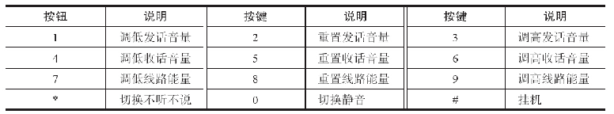
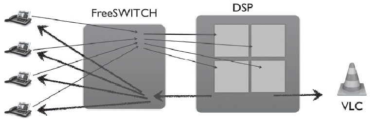
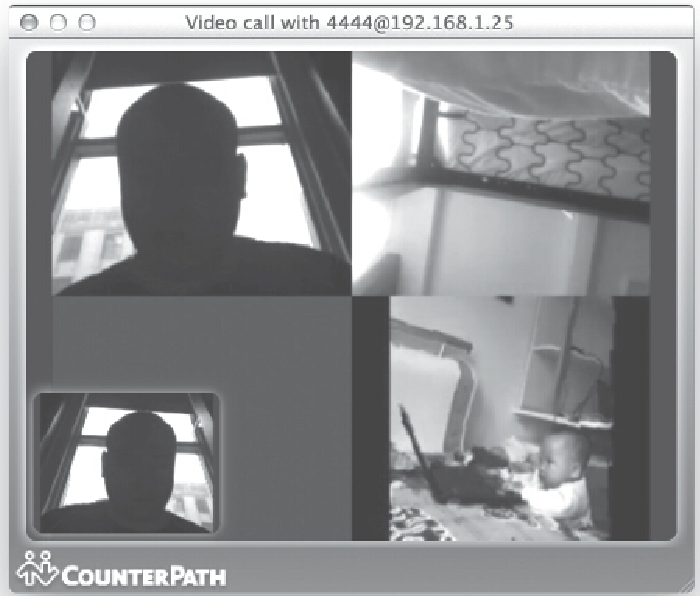
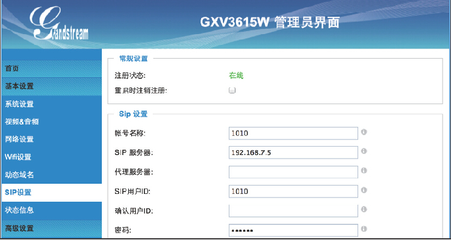
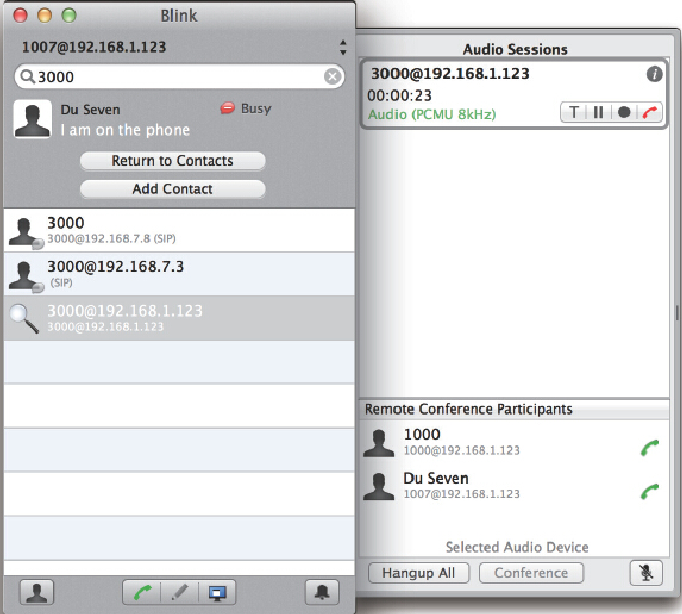

# 第01章 PSTN与VoIP基础
# 第02章 PSTN、PBX及呼叫中心业务
# 第03章 初识FreeSWITCH
# 第04章 运行FreeSWITCH
# 第05章 FreeSWITCH架构
# 第06章 拨号计划
# 第07章 SIP协议
# 第08章 媒体
# 第09章 SIP模块
# 第10章 基本技能
# 第11章 基本功能与实现
# 第12章 高级功能与配置实例

在上一章，我们学习了FreeSWITCH的一些基本功能与配置实例。本章我们来学习一些比较高级的功能，如呼叫中心应用、多人会议、与数据库的连接、话单及计费等。

## 使用mod_fifo实现简单呼叫队列

在呼叫中心应用中，有一个很常用的功能——ACD（Automatic Call Distributioin，自动电话分配）。一般来说，我们这里所说的呼叫中心都是客服型呼叫中心，即有一组话务员（称为座席，英文称为Agent）在等待为用户服务。当有电话呼入时，先将用户放入一个队列进行排队（因为可能同时有大量用户呼入），然后按一定的策略选择一个空闲的座席为用户服务（将来话从队列中取出并与该座席通话）。这种通过一定策略为来话分配空闲座席的功能就称为ACD。

mod_fifo模块实现了一些简单的ACD功能，下面我们来看一下。

### 呼叫停泊与取回

一般来说，普通的电话呼叫会使用bridge App来桥接两条腿。但在电话分配中，一般采用停泊与取回的方式进行电话搭接。顾名思义，停泊跟泊车类似，即在有来话时，先将来话停靠在一个泊位上（一般还会放点音乐），然后通过某种算法找到一个空闲的座席，该座席拨打一个与该泊位相关的号码，就可以将该泊位上的电话取回，双方进行通话。

FreeSWITCH默认的Dialplan中提供了使用这种方式进行电话分配的例子。我们先来看停泊的部分，Dialplan设置如下：

```xml
<extension name="park">
    <condition field="destination_number" expression="^5900$">
        <action application="set" data="fifo_music=$${hold_music}"/>
        <action application="fifo" data="5900@${domain_name} in"/>
    </condition>
</extension>
```

拿起电话拨打5900，就可以将电话停在一个泊位上。从上面的Dialplan中可以看出：首先，它使用set设置了一个fifo_music的通道变量，该变量指定电话停靠在泊位上时播放的音乐。然后，使用fifo App将电话放入一个先入先出的队列中（fifo的意思就是First In,First Out，即先入先出），该队列的名字是5900@\${domain_name}，一般来说${domain_name}变量的值是FreeSWITCH所在服务器的IP地址。参数in表示是入队。

当有电话呼入时，可以使用fifo list命令显示当前队列的状态，具体如下：

```
freeswitch> fifo list
```

```xml
<fifo_report>
    <fifo name="5900@192.168.7.9" consumer_count="0"
    caller_count="1" waiting_count="1" importance="0"
    outbound_per_cycle="0" ring_timeout="0" default_lag="0"
    outbound_priority="5" outbound_strategy="ringall">
        <outbound></outbound>
        <callers>
            <caller uuid="a8cbbbd0-91a8-4f3f-be6e-1741e25deb1d"
                    status="WAITING" caller_id_name="1002"
                    caller_id_number="1002"
                    timestamp="2013-10-14 21:10:18"
                    position="1" slot="0">
            </caller>
        </callers>
    <consumers></consumers>
    <bridges></bridges>
    </fifo>
    ...
```

该列表是以XML格式显示的。其中，我们可以看到一个fifo标签，它的名字是5900@192.168.7.9，它里面有一个caller（即主叫），并显示了该caller的当前的状态是WAITING（即在队列中等待服务）。

fifo是一个“生产者——消费者”模型，即来话（Caller）相当于生产者（Producer），而座席（Agent）则称为消费者（Consumer），它对来话进行服务即相当于“消费”生产者生产的内容。

我们接着来看下列的Dialplan，它也是来自默认的配置：

```xml
<extension name="unpark">
    <condition field="Destination_number" expression="^5901$">
        <action application="answer"/>
        <action application="fifo" data="5900@${domain_name} out nowait"/>
    </condition>
</extension>
```

通过上述Dialplan，如果座席端通过某种方式（如业务界面上的通知，可以使用HTML等其他消息通知机制实现）知道队列里有一个来电需要服务，座席话务员就可以（手工或自动）拨打5901将该来电从队列里出取来，然后双方进行通话。可以看出，这里Dialplan的配置与前面入队时是类似的，所不同的是使用了out参数代表出队，另外有一个附加的nowait参数，它表示如果队列中没有电话在等待（可能这时候主叫已经等不及而挂机了），即没有人需要服务时，座席端的电话就没必要在这里等待了。当然，如果把该参数改成wait，或者不加该参数（默认值为wait），那么座席端会在这里继续等待，直到队列里来了一路通话，它便可以立即得到服务。

### 配置座席

本节我们来介绍座席的具体配置方法。

1. 静态座席的配置

上一节我们讲了fifo入队及出队的简单原理。一般情况下，fifo是不需要配置的，如果在呼叫中需要一个fifo，FreeSWITCH就会自动创建（如上面的fifo名字可以改成任意的其他字符串）。但有时候，我们也可能希望配置一些静态的座席用于呼叫分配。

mod_fifo的配置文件是conf/autoload_configs/fifo.conf.xml。它默认的配置中有一个cool_fifo的例子，为了简单起见，我们自己配置一个fifo队列，命名为book，具体如下：

```xml
<fifos>
    <fifo name="book" importance="0">
        <member timeout="60" simo="1" lag="5">user/1005</member>
        <member timeout="60" simo="1" lag="5">user/1006</member>
    </fifo>
</fifos>
```

其中，我们为book队列配置了两个member（1005和1006），每个member相当于一个座席。user/1005为该member的呼叫字符串，即队列中有来话时怎么呼叫该座席；timeout表示呼叫超时值；simo表示最大能服务的呼叫的数量；lag表示该座席在接听一个呼叫后，隔多长时间（秒）才可以再接收下一个呼叫。

使用如下命令可以使刚才的配置生效：

```
freeswitch> reloadxml
freeswitch> fifo reparse
```

然后，可以使用fifo list book查看一下配置的结果。该命令显示的结果比我们配置的会多出一些参数，这里我们就不详细介绍了。
我们可以使用如下Dialplan将来话路由到我们刚刚配置的fifo。

```xml
<extension name="fifo-test">
    <condition field="destination_number" expression="^(1234)$">
        <action application="set" data="hold_music=$${hold_music}"/>
        <action application="fifo" data="book in"/>
    </condition>
</extension>
```

当有用户拨打1234时，便进入我们刚才配置的fifo，听等待音乐。然后，1005和1006就会轮流振铃（笔者在试验中，拒接其中一个，另一个就振铃）。

当将队列中的来话分配到座席时，fifo使用轮循的方式分配，因而它是“公平”的，即不会出现某些座席“忙死”而其他座席“饿死” [1]的情况。

2. 动态座席的配置

在实际的呼叫中心应用中，座席的配置往往是动态的，即一个话务员上班时，会执行一个“签入”的动作，说明他（她）上班了，准备好接电话了；而在中途休息时，或者下班时执行“签出”，这样队列里再有电话进来就不会分配到该座席了。

mod_fifo提供了一个fifo_member命令可以动态增加和删除座席，如我们可以用如下命令再增加两个座席：

```
freeswitch> fifo_member add user/1007
freeswitch> fifo_member add user/1008
```

如果删除座席，则可以使用如下命令（注意，最后一个参数呼叫字符串必须与增加的时候严格相同）：

```
freeswitch> fifo_member del user/1008
```

熟悉了这些命令后，就可以使用Lua脚本或Event Socket等与其他系统集成了，如可以在业务系统的网页上集成一些按钮，按这些按钮就可以进行签入或签出了。

当然，在一些简单的呼叫中心中可能没有业务系统，甚至没有条件做网页。在这种情况下，也可以用我们学过的知识，使用话机签入签出。如下面的Dialplan就可以做到：

```xml
<extension name="Agent Login">
    <condition field="destination_number" expression="^5902$">
        <action application="answer"/>
        <action application="set" data="result=${fifo_member(add book user/ ${user_name})}"/>
        <action application="playback" data="ivr/ivr-you_are_now_logged_in.wav"/>
    </condition>
</extension>
<extension name="Agent Logout">
    <condition field="destination_number" expression="^5903$">
        <action application="answer"/>
        <action application="set" data="result=${fifo_member(del book user/ ${user_name})}"/>
        <action application="playback" data="ivr/ivr-you_are_now_logged_out.wav"/>
    </condition>
</extension>
```

通过使用上述Dialplan，就可以在上班时在自己话机上拨打5902进行签入，下班时拨打进行5903签出，它们都是使用了我们上面讲过的fifo_member API命令实现的。

3. offhook座席

以上配置的座席中，不管是静态配置的还是动态配置的，都称为onhook（挂机）座席。这种座席的特点是当队列中来了电话后再去呼叫座席。而与之相对的另一种座席称为offhook（摘机）座席，这种座席会事先呼入队列并等待（一般听等待音乐），当有来电时就可以立即接听，省去了呼叫座席的时间，因而能更迅速为客户提供服务。这在比较繁忙的呼叫中心中也有助于提高效率。

其实我们把12.1.1节从队列中取回电话的例子稍作修改，就可以支持offhook座席。比如，我们建立下面的Dialplan，当座席呼叫5902时，就会执行fifo App，它会尝试从队列中取出一个呼叫。而此时如果队列中没有呼叫在等待服务，则由于此处我们使用了wait参数（对比一下12.1.1节中使用的是wait），因此该座席会一直停在这里等待，直到队列中有新的电话进入。该Dialplan的设置如下：

```xml
<extension name="unpark">
    <condition field="destination_number" expression="^5902$">
        <action application="answer"/>
        <action application="fifo" data="5900@${domain_name} out wait"/>
    </condition>
</extension>
```

当服务完成后，该座席就又变成等待状态，继续等待下一个呼叫的到来。

### fifo

本节我们来详细介绍一下fifo。

1. 相关的通信变量

在mod_fifo中，有许多相关的通道变量可以改变它的行为。通过有效地使用这些通道变量，往往能配置出比较实用的功能。

如每个fifo都有10个优先级队列，在进行入fifo前，可以使用fifo_priority变量指定来话的优先级，高优先级的来话将排在队列的前面（默认的优先级是5）：

```xml
<action application="set" data="fifo_priority=1" />
<action application="fifo" data="book in" />
```

在队列中有多个电话排队时，座席这一端也可以随意取出一个电话进行接听。当然，如果达到这种效果需要通过其他手段获取到队列中所有成员的UUID，如下面的设置中，我们在从队列中取出（out）电话前先把fifo_bridge_uuid变量设置为想取出的Channel的UUID，然后就可以取出与特定的UUID相关联的通话了：

```xml
<action application="set" data="fifo_bridge_uuid=9c3a1fee-fae2-4355-bceb-5064f2107983" />
<action application="fifo" data="book out" />
```

在下面的例子中，我们使用了很多的通道变量。该例子基于多年前笔者实现的一个呼叫中心应用。我们先看看Dialplan中的配置（为了方便讲解，我们增加了行号）：

```xml
01 <action application="answer"/>
02 <action application="set" data="fifo_music=$${hold_music}"/>
03 <action application="set" data="tts_engine=tts_commandline"/>
04 <action application="set" data="tts_voice=Ting-Ting"/>
05 <action application="set" data="fifo_chime_list=say:
座席全忙，继续等待请按1
，转其他服务请按2"/>
06 <action application="set" data="fifo_chime_freq=15"/>
07 <action application="set" data="fifo_orbit_exten=1007:45"/>
08 <action application="set" data="fifo_orbit_dialplan=XML"/>
09 <action application="set" data="fifo_orbit_context=default"/>
10 <action application="set" data="fifo_orbit_announce=say:
为保证服务质量，您的电话可能被录音"/>
11 <action application="set" data="fifo_caller_exit_key=2"/>
12 <action application="set" data="fifo_caller_exit_to_orbit=true"/>
13 <action application="set"
      data="fifo_override_announce=say:tts_commandline:Ting-Ting:
来电号码${caller_id_number}"/>
14 <action application="fifo" data="book in"/>
```

当有来电进来时，我们会将电话路由到这里的Dialplan处理。其中，第1行先对来话进行应答；第2行设置来话在队列中听到的保持音乐；第3行和第4行设置TTS引擎的参数（因为使用TTS比使用声音文件讲起来更方便一些）；第5行设置一个声音，它会每隔15秒（在第6行设置）播放一次，以给用户比较好的体验 [2]；第7行，设置一个分机号，如果等待超时（冒号后面指定超时时间，即45秒），会转到该号码；第8行和第9行分别是与第7行配合的Dialplan和Context；第10行，设置一个声音，如果座席接听，则先给来话用户播放一段提示音；第11行，设置一个按键，配置第5行；第12行，实现在用户按了第11行的按键的情况下，转到第7行的号码上（否则的话将会退出fifo）；第13行，是在座席接听电话后，在与来电客户通话前播放给座席的，这里我们播放了来电的号码 [3]；第14行，这里是最重要的，即将来话送入book这个fifo队列中（如果没有这一行的话上面所有的设置就都白费了）。

还有一些其他变量是在fifo是执行过程中自动产生的，如fifo_position表示来话在当前队列中的位置；fifo_serviced_by或fifo_serviced_by表示来话被哪个Channel（通过UUID可以进而找到相关的座席）服务了。

当然，该模块还有其他相关的变量，限于篇幅，我们就不一一讲解了。有需要的读者可以参阅http://wiki.freeswitch.org/wiki/Mod_fifo。

2. 相关事件

当fifo相关的状态发生变化，会产生一些Subclass为fifo::info的CUSTOM事件。通过这些事件，可以获取fifo中的详细信息，如哪个座席为哪个来话进行了服务等。

事件消息中，有一个FIFO-Action消息头标志了事件实际的动作。在笔者的试验中，一通来话从入队到挂机，大致经过以下几个事件：

- push：来话入队时产生。
- pre-dial：呼叫座席之前产生。
- post-dial：呼叫座席之后产生。
- consumer_start：消费者（即座席）开始。
- caller_pop：主叫出队。
- consumer_pop：消费者出队。
- bridge-consumer-start：消费者Channel开始bridge。
- bridge-caller-start：主叫Channel开始bridge。
- bridge-consumer-stop：消费者Channel停止bridge。
- bridge-caller-stop：主叫Channel停止bridge。
- consumer_stop：消费者停止。
- channel-consumer-start：消费者Channel开始。
- channel-consumer-stop：消费者Channel结束。

具体的事件我们就不赘述了。

3. 其他

在fifo应用中，通话中的两条腿都是独立建立的，只有这样才能进行桥接（即bridge）。因而，在普通的通话中靠a-leg上的变量去影响b-leg的做法（如，使用export将变量设置到未来的b-leg上）在这里就不适用了。

那么，为了在b-leg上设置我们想要的通道变量，可以在向b-leg发起呼叫的呼叫字符串上做文章。如下面的设置可以在呼叫1007时将主叫号码改为7777：

```xml
<member>{origination_call_id_name=7777}user/1007</member>
```

也可以设置与其他业务系统中的座席工号进行关联，如：

```xml
<member>{my_worker_number=1234}user/1007</member>
```

当然，这里的座席成员除了是本地用户外，也可以是外部系统的号码，如通过某网关能打通的一个手机号：

```xml
<member>sofia/gateway/pstn/139xxxxxxxx</member>
```

对于PSTN网络来讲，它们一般会在呼叫进展阶段返回回铃音或彩铃（对应SIP中会收到183消息），这会让FreeSWITCH认为电话已经接通。因此，为了消除这种影响，一般来说会增加ignore_early_media参数，如：

```xml
<member>{ignore_early_media=true}sofia/gateway/pstn/139xxxxxxxx</member>
```

注意，FreeSWITCH在拨打PSTN网络中的电话之前是无法知道对方是否正常空闲的（也可能是无法接通或被叫忙），它只能按正常的策略去呼出。如果碰巧出现被叫忙或不在服务区之类的情况，PSTN网络中通常会播放相关的提示音，而不是正常的返回信令消息，这会令接续到下一个座席的时间延长。这是与PSTN网络中的电话对接固有的问题。在具体应用时可能还需要注意设置恰当的超时（timeout）等参数，在此我们就不多讲了。

[1] 闲着没事干的情况称为“饥饿”。 

[2] 注意，在本例中，我们仅设置了按键“2”对应的动作，没有设置按键“1”，但提示音中包含了“1”。实际上，“1”本自是不存在的，即按与不按结果都一样。但如果这里提示“转其他服务请按2，继续等待请不按”的话，显得有点别扭。当然，也可以把这里的提示音改成“请继续等待，或按2转其他服务”。总之，这是一个用户体验问题，而不是技术问题。我们在此主要是以这些例子来讲解各变量的含义，实际的提示音可以在实际应用场景中根据需要进行调整。 

[3] 注意由于该TTS是在座席的Channel上播放的，因而上述使用set设置的TTS引擎变量就不起作用了，所以我们在该行单独设置。

## 使用mod_callcenter实现呼叫中心应用

上一节讲的fifo只是实现了一些先入先出的呼叫队列，与实际的呼叫中心应用相比，还是显得简单了点。而mod_callcenter从名字上看就是一个与呼叫中心应用有关的模块。它实现的ACD队列更接近于实际的呼叫中心应用。

对于主叫用户来说，mod_callcenter采用一种基于积分（score）策略的排队算法。用户在队列中每等待一秒，积分就自动加一 [1]。在座席端，它实现了一个多级的梯队，允许具有不同技能的座席通过不同的优先级来对用户提供服务。

### mod_callcenter模块简介

要想深入了解mod_callcenter模块，就要先安装该模块，并了解其涉及的一些基本概念。

1. mod_callcenter模块的安装

与mod_fifo不同，mod_callcenter模块并不是默认就编译安装的。因而我们首先要编译安装它。跟其他模块的安装方法类似，可以到FreeSWITCH源代码目录中使用以下命令编译安装：

```
# make mod_callcenter-install
```

然后到FreeSWITCH控制台上加载该模块：

freeswitch> load mod_callcenter
如果需要在FreeSWITCH启动时自动加载该模块，则可以编辑conf/autoload_configs/modules.conf.xml，去掉与该模块相关的行的注释，即如下一行：

```xml
<load module="mod_callcenter"/>
```

2. 涉及的基本概念

mod_callcenter中有以下基本概念：

- 队列（Queue）：用于标志一个队列，呼入的电话会在相关的队列中进行排队。
- 座席（Agent）：座席会事先登录到一个梯队中（后文会讲到），该梯队会与某个队列相关联，当关联的队列中有来话（排队）时，系统会根据一定的策略选择一个空闲的座席为来话客户服务（接听电话）。
- 策略（Strategy）：队列中座席的分配策略，即当队列中有来话时，如何选择一个空闲的座席。该模块实现了以下几种策略。
    - ring-all：选择所有座席。即让所有座席振铃，哪个先接就选择哪个。
    - long-idel-agent：选择空闲时间最长的座席。
    - round-robin：轮循。
    - top-down：按固定的顺序选择。
    - agent-with-least-talk-time：总是选择通话时间最短的座席；
    - agent-with-fewest-calls：总是选择接电话次数最少的座席；
    - sequentially-by-agent-order：根据梯队和顺序选择；
    - random：随机选择。
- 座席状态：一个座席有两个状态标志，分别是Status和States。Status是一个座席逻辑上的状态，它有以下几种取值：
    - Logged Out：退出服务状态。
    - Available：可用状态，可以接电话。
    - Available(On Demand)：一种特殊的可用状态。
    - On Break：座席已登录，但不可以接电话。
    - States是跟电话呼叫有关的状态，它有以下几种取值：
    - Idle：空闲。
    - Waiting：等待接受呼叫。
    - Receiving：正在接受呼叫。
    - In a queue call：当前正在一个队列呼叫中。
- 座席类型：有callback和uuid-standby两种类型。前者是onhook座席，即如果有电话分配到该座席时，FreeSWITCH将会呼叫座席；而后者是offhook座席，即座席需要首先拨入FreeSWITCH建立一个呼叫，当有来话时则可以立即与座席桥接起来。
- 梯队（Tier）：梯队是将队列与座席连接起来的桥梁。另外，它也可以实现多级服务。例如，通过将不同的座席分配到不同的梯队中，可以实现当有电话进来时先连接到普通的座席，有必要时再转到专家座席这样的应用。

### 座席配置与管理

本小节我们具体介绍座席的配置、管理方法，以帮助大家将前面的所学的知识应用于实践。

1. 静态座席的配置

mod_callcenter默认的配置文件是conf/autoload_configs/callcenter.conf.xml，其中配置了一个support@default队列，部分配置如下：

```xml
<center>图13-6　PBX上带网关的结构图</center>
```

其中，strategy参数指定了队列的分配方式，它的值（value）longest-idle-agent说明要优先选择等待时间最长的座席分配。其他的参数我们就不多讲了。

接着，我们来配置一个座席，它的名字是1005@default，配置如下：

```xml
<agent name="1005@default" type="callback"
    contact="[call_timeout=10]user/1005"
    status="Available" max-no-answer="3" wrap-up-time="10"
    reject-delay-time="10" busy-delay-time="60" />
```

在该座席的配置中，name指定座席的名字，它的值为1005@default，以后都可使用该名字引用这个座席；type指定座席的类型；contact为座席的呼叫字符串，用于在有来话时呼叫该座席；status为座席的初始状态；max-no-answer定义座席呼叫失败的次数，如果超过这个值，则将座席状态设为On Break；reject-delay-time为座席拒接后再次选到该座席的最短时长；busy-delay-time为如果该座席忙，则再次尝试选到该座席的最短时间。

同理我们可以按上面的例子再增加其他座席配置，如1006@default、1007@default等。

然后，还需要配置tier，以将座席与队列关联起来。如下面的配置将三个座席与队列support@default关联起来了。

```xml
<tier agent="1005@default" queue="support@default" level="1" position="1"/>
<tier agent="1006@default" queue="support@default" level="1" position="1"/>
<tier agent="1007@default" queue="support@default" level="1" position="1"/>
```

上述设置完成后，就可以重新加载模块使之生效了：

```
freeswitch> reload mod_callcenter
```

然后，当有电话呼叫（或转移）到support时，就可以使用如下的Dialplan将电话转到该callcenter队列中了：

```xml
<extension name="Callcenter Example">
    <condition field="destination_number" expression="^support$">
        <action application="answer"/>
        <action application="callcenter" data="support@default"/>
    </condition>
</extension>
```

然后callcenter便会根据我们上面设置的规则去呼叫相关的座席。

2. 动态管理队列和座席

mod_callcenter提供了一个callcenter_config的API命令，用于管理与该模块相关的各种资源。比如，可以使用如下命令手工将座席签入：

```
freeswitch> callcenter_config agent set status 1005@default 'Available'
```

当然，上述的签入命令用于座席已正确配置的基础上。通过把座席的状态变成Available，该座席就准备好接听电话了。

下列命令将该座席的状态置为Logged Out，因此，就不会再有电话分配到该座席了。

```
freeswitch> callcenter_config agent set status 1005@default 'Logged Out'
```

可以用以下命令列出当前所有的座席：

```
freeswitch> callcenter_config agent list
```

当然，如果座席本身没有在配置文件中配置，也可以使用命令添加。比如，下列命令添加一个名字为1007@default的座席：

```
freeswitch> callcenter_config agent add 1007@default callback
```

当然，还需要用下列命令给它设置相关的参数，如contact：

```
freeswitch> callcenter_config agent set contact 1007@default user/1007
```

也可以用以下命令列出当前的队列：

```
freeswitch> callcenter_config queue list
```

或列出当前的梯队：

```
freeswitch> callcenter_config tier list
```

类似的命令还有很多，我们就不一一介绍了。当然，这些命令一般不会仅用手工执行。通过Event Socket或XMLRPC等接口调用这些命令，则可以做出很友好的界面，也可以很容易集成到其他业务系统中去。

3. offhook座席

mod_callcenter也支持offhook座席。该模块的Wiki页面上有一个示例的Dialplan设置，我们把它稍微简化一下：

```
01 <extension>
02   <condition field="destination_number" expression="^(4099)$">
03     <action application="set" data="transfer_after_bridge=4099"/>
04     <action application="sleep" data="300"/>
05     <action application="set"
          data="r=${callcenter_config(agent set uuid ${caller_id_number}@default '${uuid}')}"/>
06     <action application="set"
          data="r=${callcenter_config(agent set type ${caller_id_number}@default 'uuid-standby')}"/>
07     <action application="set"
          data="r=${callcenter_config(agent 10 set status ${caller_id_number}@default 'Available (On Demand)')}"/>
08     <action application="set"
          data="r=${callcenter_config(agent set state ${caller_id_number}@default 'Waiting')}"/>
09     <action application="set"
          data="cc_warning_tone=tone_stream://%(15 200,0,500,600,700)"/>
10     <action application="answer" />
11     <action application="playback" data="$${hold_music}"/>
12   </condition>
13 </extension>
```

为了便于讲解，我们增加了行号。如果座席呼叫4099，则会匹配到第2行，并进入该Dialplan；第3行设置transfer_after_bridge参数，当该座席与来电通话（bridge）完毕后，会再转到4099上，重新等待；第4行加了一个sleep，防止执行得太快；第5行执行set，通过${API(...)}的方式调用callcenter_config API命令，它将设置本座席的uuid参数为当前Channel的UUID；第6行将该座席的类型设为uuid-standby，表示如果有来话就不需要呼叫该座席了，而直接找到前面设置的座席的uuid直接将来话和座席的Channel桥接（bridge）到一起就可以了；第7行设置座席的状态（Status）为可用状态；第8行设置座席的呼叫状态（State）；第9行通过通道变量cc_warning_tone设置一个铃音，当有电话进来时，将向座席播放该铃音；第10行应答；第11行则播放保持音乐。

至此座席就一直在听音乐，直到有新的电话进来。

除了上面介绍的参数外，mod_callcenter还有好多配置参数，以及好多可用的命令可以配置不同的队列和运行方式。另外，有一些以cc_开头的通道变量（如上面我们讲到的cc_warning_tone）也会在某些时候发生作用。关于这些，读者可以多参考该模块的Wiki页面，在这里我们就不一一列举了。

mod_callcenter在排队及电话分配的各个阶段都会产生一些事件，允许第三方的开发者通过Event Socket等接口监控队列的行为，并进行各种集成——如可以在Web界面上实时显示队列及座席的状态，将状态变化写入数据库供以后产生报表等。当然，要做成一个好的应用前端的开发，工作量还是不小的。

该模块提供的功能与FreeSWITCH中其他的模块功能相比，属于更偏上层（应用）的功能。一般来说类似这种功能的应用大家都是使用Event Socket等接口在外部进行开发，但若在FreeSWITCH内部开发则明显控制力更强一些。当然，不管是在内部开发还是外部开发，对于类似呼叫中心的应用，本模块的一些概念和业务逻辑都是很有参考价值的。

[1] 也可以通过人工干预积分的方式来改变主叫用户在队列中的位置。

## 数据库

FreeSWITCH内部使用关系型数据库记录一些实时的数据。这些数据有的是临时存储的，有的是持久存储的。关系型数据库很适合描述通信应用中的实体以及关系数据，而且它所支持的各种关系运算也极大简化了FreeSWITCH的代码量及开发难度。

### 默认数据库中有什么？

数据库中到底有什么？很多网友会问这个问题。虽然，一般来讲，用户没有必要直接访问这里的数据库。但是在某些时候直接访问数据库比使用FreeSWITCH的命令访问速度更快一些，在合适的场合也不妨合理使用 [1]。

1. 核心数据库

我们先从核心看起，看一看默认的数据库中都有什么。

FreeSWITCH默认使用SQLite嵌入式数据库，因而不需要任何配置就能工作。默认的数据库存储位置是FreeSWITCH安装目录下的db目录，默认的核心数据库名称是core.db。我们可以先打开该数据库，看看里面到底有什么。

```
dujinfang@seven:/usr/local/freeswitch/db$ sqlite3 core.db
sqlite> .tables
aliases         channels        interfaces      registrations
basic_calls     complete        nat             tasks
calls           detailed_calls  recovery
```

其中，sqlite3命令用于打开SQLite数据库。.tables命令会显示数据库中所有的表，各表的作用如下：

- aliases：别名表，用于存储命令行别名。
- basic_calls：一个视图，基于channels和calls表，提供基本的呼叫信息。
- calls：呼叫表，在bridge的呼叫中，用于关联Channel表中的两条腿。
- channels：存储所有当前的Channel。
- complete：存储所有Tab Complete数据。
- detailed_calls：一个视图，基于Channels和Calls，提供详细的呼叫信息。
- interfaces：存储所有的Interface。
- nat：存储当前的NAT映射关系。
- recovery：在使用系统恢复功能功能时，该表存储所有呼叫的详细信息。
- registrations：存储注册用户的信息。
- tasks：当前的任务表，如heartbeat（心跳）、检测IP地址变化等。

FreeSWITCH的show命令的大部分内容都是基于这些表的，如show channels即查询Channels表。当FreeSWITCH中有通话时，可以使用如下SQL语句进行查询：

```
sqlite> select * from channels;
```

也可以使用.schema命令看表的结构，如下列命令就显示了calls表的结构：

```
sqlite> .schema calls
CREATE TABLE calls (
   call_uuid  VARCHAR(255),
   call_created  VARCHAR(128),
   call_created_epoch  INTEGER,
   caller_uuid      VARCHAR(256),
   callee_uuid      VARCHAR(256),
   hostname VARCHAR(256)
);
CREATE INDEX calls1 on calls(hostname);
CREATE INDEX callsidx1 on calls (hostname);
CREATE INDEX eeuuindex on calls (callee_uuid);
CREATE INDEX eeuuindex2 on calls (call_uuid);
CREATE INDEX eruuindex on calls (caller_uuid, hostname);
```

2. Sofia数据库

除核心数据库外，很多外部模块也都使用数据库存储数据。最典型的就是mod_sofia模块。

mod_sofia模块中的每一个Profile都使用一个单独的数据库，如我们可以通过下面命令看到每个数据库：

```
dujinfang@seven:/usr/local/freeswitch/db$ ls sofia*
sofia_reg_external.db       sofia_reg_internal-ipv6.db  sofia_reg_internal.db
```

我们打开sofia_reg_internal.db（即internal Profile对应的数据库），看看里面有什么：

```
$ sqlite3 sofia_reg_internal.db
sqlite> .tables
sip_authentication   sip_shared_appearance_dialogs
sip_dialogs          sip_shared_appearance_subscriptions
sip_presence         sip_subscriptions
sip_registrations
```

其中，SIP用户的注册信息都存储在sip_registrations表中。当然，该表与core.db中的registrations表中的有些数据是重复的。由于不止SIP用户需要注册，其他模块的用户也可能需要注册，核心数据库中存储的是一种统一的注册信息。

其他各表的功能简介如下：

- sip_authentication：SIP认证相关。
- sip_dialogs：SIP对话相关。
- sip_presence：SIP呈现相关。
- sip_shared_appearance_dialogs：SIP SLA相关，记录当前的Dialog。
- sip_shared_appearance_subscriptions：SIP SLA相关，记录订阅信息。
- sip_subscriptions：SIP订阅相关。

感兴趣的读者可以自己打开看一下，这里就不多介绍了。

3. 其他数据库

其他模块，如我们上面讲过的mod_fifo、mod_callcenter等也有自己的数据库。通过直接访问这些数据库，也可以从里面取出有趣的数据，甚至还可以改变模块的运行规则。当然，这类似黑客 [2]行为，跟前面讲的在数据库上安装触发器差不多，不推荐使用。

关于数据库，我们就不进行更深入的探索了，有兴趣的读者可以参照源代码自行学习。

### ODBC

SQLite在并发量特别大的情况下可能会是一个瓶颈，另外，在一些需要HA或负载均衡的场合，也需要一个外部的数据库。FreeSWITCH支持通过ODBC [3]接口连接外部的数据库。最典型的外部数据库是PostgreSQL和MySQL，也有人成功地连到Oracle或Microsoft SQL Server。

1. 增加ODBC数据库支持

为了让FreeSWITCH支持ODBC，在编译前需要安装unixODBC的开发包，并安装相应的数据库驱动。在CentOS、Ubuntu或Debian上的安装unixODBC的方式分别如下：

```
CentOS：

yum install unixODBC unixODBC-devel
Ubuntu/Debian：

apt-get install unixODBC unixODBC-dev
```

在系统中安装了上述软件包以后，再重新执行./configure&&make install的时候，FreeSWITCH就可以支持ODBC数据库了。

2. MySQL

如果使用MySQL，则需要安装MySQL数据库的ODBC驱动程序MyODBC。在不同的系统上可以使用以下命令安装：

```
Ubuntu：

# apt-get install libmyodbc

CentOS：

# yum install mysql-connector-odbc
```

通过/etc/odbcinst.ini可以配置数据库的驱动：

```
[MySQL]
Description     = MySQL driver
Driver          = /usr/lib64/odbc/libmyodbc.so
Setup           = /usr/lib64/odbc/libodbcmyS.so
UsageCount      = 1
FileUsage       = 1
Threading       = 0
```

MySQL的ODBC驱动有一个_r版本，如果在你使用的平台上存在这个版本，则必须使用该版本的，如：

Driver = /usr/lib64/odbc/libmyodbc_r.so

MySQL的ODBC驱动以及客户端库在多线程环境中使用时可能会有问题（如内存泄露），而FreeSWITCH是一个典型的多线程系统，因而在生产环境中使用前，需要多做测试，并精心选择一个ODBC版本与MyODBC版本的有效组合。

接下来需要在/etc/odbc.ini中配置DSN。下面的配置中，DSN（即数据源的名称）为freeswitch，我们以后可以以这个名字引用它。注意该配置为64位平台上的例子，如果使用32位的系统，则可能需要将/usr/lib64替换为/usr/lib。另外，里面的OPTION=67108864一行非常重要——FreeSWITCH会将多条SQL语句放到一起执行，以提高效率，如果没有该选项则会出错（MyODBC 3.51.18及以后的版本才支持该选项）。

```
[freeswitch]
Driver      = /usr/lib64/odbc/libmyodbc.so
SERVER      = localhost
PORT        = 3306
DATABASE    = freeswitch
OPTION      = 67108864
USER        = root
PASSWORD    = password
Threading   = 0
```

3. PostgreSQL

PostgreSQL的ODBC驱动在Ubuntu上的安装方法如下：

```
# apt-get install odbc-postgresql
```

/etc/odbcinst.ini配置如下。注意，下面有两个版本的PostgreSQL ODBC驱动。FreeSWITCH可以使用任意一个。如果你自己在数据库中存储Unicode数据的话（如中文），则最好选择Unicode版本的。

```
[PostgreSQL ANSI]
Description     = PostgreSQL ODBC driver (ANSI version)
Driver          = /usr/lib/odbc/psqlodbca.so
Setup           = /usr/lib/odbc/libodbcpsqlS.so
Debug           = 0
CommLog         = 0
UsageCount      = 0
Threading       = 0
[PostgreSQL Unicode]
Description     = PostgreSQL ODBC driver (Unicode version)
Driver          = /usr/lib/odbc/psqlodbcw.so
Setup           = /usr/lib/odbc/libodbcpsqlS.so
Debug           = 0
CommLog         = 0
UsageCount      = 0
Threading       = 0
MaxLongVarcharSize=65536
```

/etc/odbc.ini的配置如下：

```
[freeswitch]
Driver      = /usr/lib64/odbc/psqlodbcw.so
Description = POSTGRESQL
Servername  = localhost
Port        = 5432
Protocol    = 6.4
FetchBufferSize = 99
Username        = postgres
Password        = password
Database        = freeswitch
ReadOnly        = no
Debug           = 1
CommLog         = 1
```

4. 测试ODBC连接

ODBC提供了一个用于连接测试的isql命令行工具。只要设置好ODBC驱动以及配置文件后，我们这里的测试就与具体数据库类型无关了。命令的使用格式是：

isql DSN [UID [PWD]] [options]

比如，如果已经将密码写在odbc.ini中，我们可以用如下命令进行测试：

```
# isql -v freeswitch
```

也可以明确地提供用户名和密码：

```
# isql -v freeswitch username password
```

其中，-v选项是可选的，加上它以后可以输出更详细的调试信息。

如果连接成功，将会显示如下界面，然后就可以输入SQL语句进行查询了。

```
+---------------------------------------+
| Connected!                            |
|                                       |
| sql-statement                         |
| help [tablename]                      |
| quit                                  |
|                                       |
+---------------------------------------+
SQL>
```

如果连接失败，则需要查配置文件是否正确，对应的驱动程序是否存在。不同的系统及同一系统不同的版本，驱动程序的路径也不尽相同。

5. 使用ODBC

当然，也可以把核心数据库放到ODBC数据库中，这个可以通过配置switch.conf.xml中的如下选项实现：

```
<param name="core-db-dsn" value="odbc://freeswitch:username:password" />
```

其中，dsn为ODBC的Data Source Name，即数据源的名称，在这里，我们使用了上面配置的名称freeswitch；username和password分别为连接数据库的用户名和密码。

当然，如果把用户名和密码配置到odbc.ini中，则可以直接这样写：

```xml
<param name="core-db-dsn" value="odbc://freeswitch::" />
```

另外，我们也可以在mod_sofia的配置文件（如internal.xml）或mod_fifo的配置文件fifo.conf.xml中使用如下参数开启对ODBC的支持：

```xml
<param name="odbc-dsn" value="odbc://freeswitch:username:password"/>
```

配置完上述选择后，重启FreeSWITCH或相关模块，就可以使用上述数据库了。在第一次连接一个新的数据库时，FreeSWITCH会提示找到不相关的表，因而在日志中会出现很多错误。这些错误一般是无害的，FreeSWITCH会自动创建相关的表，下一次启动就不会报错了。如果不放心的话，可以再重启一次看这些错误是否仍然存在。

### 使用数据库原生客户端库直接连接数据库

ODBC在客户端和数据库之间多加了一层中间环节，因而不如直接从客户端连接数据库来得有效。2012年有人贡献了一些代码，在FreeSWITCH内部增加了对PostgreSQL的原生支持。我们可以在编译的时候使用如下选项增加这一支持：

```
./configure --enable-core-pgsql-support
```

重新编译安装后，如果一切正常，就可以使用以下方式直接使用原生的客户端库连接数据库了：

```
<param name="odbc-dsn"
    value="pgsql://hostaddr=127.0.0.1
    dbname=freeswitch user=freeswitch password=''
    options='-c client_min_messages=NOTICE'
    application_name='freeswitch'" />
```

在上述配置中，odbc-dsn参数的值，前面的“pgsql://”表示是使用PostgreSQL原生的客户端库外，后面的表示是一个标准的PostgreSQL数据库连接字符串。

现在在FreeSWITCH核心中还不能原生地支持MySQL。FreeSWITCH官方也不排斥提供对MySQL原生支持这个想法，但是到现在为止也没有人愿意贡献这部分代码，而且PostgreSQL本身工作得很好，因此在FreeSWITCH核心中对原生MySQL的支持至今没有进展。

[1] 一般来说，进行简单的数据查询或少量的修改算是合理使用。除此之外，有的应用通过在某些数据库表（如用户注册表）上添加触发器，进而触发外部事件，这就显得有些不合适了。 

[2] 这里说的黑客并不含贬义，而是对某个程序或设备进行修改，使之完成原来不可用的功能的人，参见《黑客与画家》（硅谷创业之父Paul Graham文集，2011）。自由软件基金会创始人Richard Stallman说：“出于兴趣而解决某个问题，不管它有没有用，这就是黑客”。 

[3] ODBC（Open DataBase Connectivity，开放数据库互连）是由Microsoft提出的数据库接口标准。旨在提供一种标准的API（应用程序编程接口）方法用于访问数据库管理系统（DBMS）。这些API利用SQL来完成其大部分任务。ODBC本身也提供了对SQL语言的支持，用户可以直接将SQL语句送给ODBC。ODBC的设计者们努力使它具有最大的独立性和开放性：与具体的编程语言无关，与具体的数据库系统无关，与具体的操作系统无关。参见http://zh.wikipedia.org/zh-cn/ODBC。

## 视频通话

FreeSWITCH也支持基于SIP的视频通话，下面我们来看一看基本的设置，以及视频转码与录像等高级话题。

### 配置视频通话

FreeSWITCH默认的配置文件中并没有对视频编解码的相关项，因而默认不支持视频呼叫。如果需要支持视频呼叫，只需要在配置文件中增加相关的视频编解码就可以了。

目前FreeSWITCH支持的视频编解码有H261、H263、H263-1998（H263+）、H263-2000（H263++）、H264、VP8等。具体应该使用哪种或哪几种编解码需要看SIP终端的支持。需要注意的是，与音频编解码不同，FreeSWITCH中的视频编解码目前仅支持透传，即FreeSWITCH仅将通话中一方的视频原样送到另一方去，而不做任何编码转换。这就要求进行视频通信的双方使用一致的编解码 [1]。

FreeSWITCH支持的媒体编码默认是在conf/vars.xml中定义的，读者可以在该文件中找到类似下面的配置：

```xml
<X-PRE-PROCESS cmd="set" data="global_codec_prefs=G722,PCMU,PCMA,GSM"/>
<X-PRE-PROCESS cmd="set" data="outbound_codec_prefs=PCMU,PCMA,GSM"/>
```

以上两行分别定义了两个全局变量，它们的字面意思分别是全局的和出局的编解码首选项。假设我们要增加对H264和VP8编码的支持，则相应的配置如下：

```xml
<X-PRE-PROCESS cmd="set" data="global_codec_prefs=G722,PCMU,PCMA,GSM,GSM,H264,VP8"/>
<X-PRE-PROCESS cmd="set" data="outbound_codec_prefs=PCMU,PCMA,GSM,GSM,H264,VP8"/>
```

由于上述配置文件实际修改的是全局变量，一般来说需要重启FreeSWITCH才能使之生效。

另外，我们在8.1.3节也讲了不需要重启FreeSWITCH使之生效的一个技巧——如果是在UNIX类平台上，可以给FreeSWITCH进程发送一个SIGHUP信号，让它重新解析全局变量（当然，FreeSWITCH在收到该信号后还会做其他的事，如执行日志轮转等）。示例如下：

```
# kill -HUP <FreeSWITCH
的进程号>
```

注意，上述Shell命令只是保证FreeSWITCH正确解析了这些变量。实际上，这些变量的值是在Sofia Profile中引用的，因而，还需要在FreeSWITCH中执行以下命令来重读Sofia的配置，如：

```
freeswitch> sofia profile internal rescan
freeswitch> sofia profile external rescan
```

上面我们重新加载了internal和external两个Profile的配置。当然，也可以用以下命令简单地重新加载Sofia模块：

```
freeswitch> reload mod_sofia
```

实际上，我们也可以不修改全局变量，而直接修改Profile的配置。如internal.xml默认的配置如下：

```xml
<param name="inbound-codec-prefs" value="$${global_codec_prefs}"/>
<param name="outbound-codec-prefs" value="$${global_codec_prefs}"/>
```

我们可以把视频编码附加到变量引用的后面，具体如下：

```xml
<param name="inbound-codec-prefs" value="$${global_codec_prefs},H264,VP8"/>
<param name="outbound-codec-prefs" value="$${global_codec_prefs},H264,VP8"/>
```

或直接改成如下形式：

```xml
<param name="inbound-codec-prefs" value="PCMA,PCMU,H264,VP8"/>
<param name="outbound-codec-prefs" value="PCMA,PCMU,H264,VP8"/>
```

如果出局和入局编解码相同，也可以直接使用同一个参数设置，如：

```xml
<param name="codec-prefs" value="$${global_codec_prefs}"/>
```

配置完毕后记得通过rescan或reload mod_sofia命令使之生效。可以使用如下命令查看是否生效（其中CODECS IN和CODECS OUT分别代表入局和出局时使用的编解码）：

```
freeswitch> sofia status profile internal
===========================================================================

Name                internal
CODECS IN           G722,PCMU,PCMA,GSM,G729,H264,VP8
CODECS OUT          PCMU,PCMA,GSM,G729,H264,VP8
```

配置了正确的视频编解码后，就可以在视频话机之间进行视频通话了。

### 视频录像与回放

前面讲了，FreeSWITCH支持录音和视频通话，现在我们来讲讲录像。与录音相比，录像要复杂一些。录像数据要按一定的格式存储在文件中，而这些文件格式有好多种。不同的文件格式称为不同的容器（Container），在这些容器中，通常会包含多个音频轨道（Track）和视频轨道，有的还含有同步信息。

目前，处理视频格式最好的开源软件就是ffmpeg，但是暂时还没有人将它与FreeSWITCH集成（这样说也不全对，因为笔者已经在做了）。FreeSWITCH中实现了一个简单的mod_fsv [2]模块，提供FreeSWITCH中的录像及回放支持。它不依赖于任何其他的视频处理库，而是自己定义了一种私有的格式，将音频轨道用L16编码的数据保存，视频轨道则将整个RTP原始包都保存进去。

在默认的Dialplan中，也提供了录像与回放的例子。拨打9193可以通过record_fsv App进行录像，Dialplan的设置如下：

```xml
<action application="record_fsv" data="/tmp/testrecord.fsv"/>
```

录像过程中，用户可以看到自己的视频也被原样echo了回来。

录制完成后，就可以拨打9194播放刚刚录制的录像了，它是使用play_fsv App实现的。

```xml
<action application="play_fsv" data="/tmp/testrecord.fsv"/>
```

上面的录像只能针对单腿的呼叫进行。因为，对于桥接（bridge）的呼叫，需要类似音频的Media Bug方式支持录像。而标准的FreeSWITCH代码中并不包含视频的Media Bug支持。

`扩展`

笔者在做项目的过程中开发了视频的Media Bug支持，并实现了.fsv及.mp4文件接口，可以支持视频录像。通过使用文件接口，可以直接使用FreeSWITCH的record和playback App进行录像和回放，而不再需要针对每一种视频格式再单独写接口（虽然笔者也实现了record_mp4文件接口）。这些代码有望在不久的将来合并到标准的FreeSWITCH代码库中。

### 视频转码

在FreeSWITCH支持WebRTC之后，人们对视频转码的需求就越来越迫切了。因为在此之前，视频设备一般都支持H263或H264转码，很容易统一。但有了WebRTC以后，由于Google Chrome浏览器实现的WebRTC仅支持VP8，与原来的H26x的设备进行视频通信就成了问题，而原来的视频设备也不能很快地支持VP8。当然，Firefox浏览器也开始支持WebRTC了，并支持H264格式的视频，但WebRTC毕竟是Google提出来的标准，因而还是有大量的用户会使用Chrome。

通过相应的视频库或硬件的DSP芯片，也可以在FreeSWITCH中提供视频的转码。在FreeSWITCH的作者Anthony Minessale的支持下，目前笔者已经开始了这方面的研究，希望在不远的将来会有所突破。

[1] 目前，比较常用的编解码是H263、H264和VP8。这三种编码都是免费的，而且现在市场上大量的设备都支持H263和H264。但由于H264版税的不确定性（现在是免费的，但不知道何时不免费），因而Google又大力支持VP8，Google在这上面做了大量的工作，力求永远免费。这方面典型的代表就是Google Chrome浏览器中的WebRTC仅支持VP8。 

[2] 参见http://wiki.freeswitch.org/wiki/Mod_fsv。

## 　多人电话会议

FreeSWITCH支持很强大的多人电话会议（又称音频会议）功能，在会议过程中，可以随时播放声音文件、对会议进行录音，也可以对任意成员进行禁言、禁听等操作。另外，它也支持简单的视频会议功能。下面我们就来一起实验一下会议是怎么工作的，以及如何对会议进行控制的。电话会议功能是在mod_conference [1]这个模块中实现的。

### 音频会议

我们先使用FreeSWITCH的默认配置对音频会议来做一个初步的体验。

首先，拿起电话拨打3000，就进入了一个会议。在会议中，每一个Channel都是会议的一个成员（Member），会议中的每个成员都是以member_id标志的，它是一个整数值。

由于第一次进入会议时只有一个成员，会议系统会首先播放“You are the only member in this conference”，即提示该会议中只有你一个成员。

接下来可以用其他电话也呼入3000进行电话会议。

1. 使用DTMF按键进行控制

在会议中，各成员也可以随时通过DTMF按键来进行各种操作。按键对应的操作可以在系统配置文件中配置，默认的控制功能如表12-1所示。

<center>表12-1　电话会议中的功能按键</center>



其中，比较常用的是0，它用于切换本成员静音与否 [2]。一般来说，在一个会议中，如果超过3个人同时讲话的话，就不容易分辨是谁在说话了；因此，如果某个成员长时间不发言，就可以自发地将自己端的电话静音，以保证会议的质量。另外，有时候有的会议成员的背景环境噪声比较大，如果不发言，也可以使用静音或调低说话音量。

2. 配置Dialplan将电话路由到会议

mod_conference提供了一个conference App，因此，我们可以直接在Dialplan中使用它。下面的Dialplan是FreeSWITCH提供的默认的Dialplan：

```xml
<extension name="nb_conferences">
  <condition field="destination_number" expression="^(30\d{2})$">
    <action application="answer"/>
    <action application="conference" data="$1-${domain_name}@default"/>
  </condition>
</extension>
```

可以看出，正则表达式^(30\d{2})\$匹配以30开头的4位数号码，所以，用户可以呼叫3000～3099之间的号码进入该Dialplan。电话路由到这里后，将首先执行answer动作对来话应答（这步也可以省略，如果后续执行到conference的话它也可以自动应答），然后就可以执行到conference进入会议了。

其中，conference的参数$1-${domain_name}@default中引用了一些变量，domain_name一般来说是一个IP地址（如192.168.1.7），如果用户呼叫的是3000，则上面的参数值就是3000-192.168.1.7@default。其中，@之前的部分为会议的名字，之后的部分为会议的参数。在这里，只有一个参数default，它是一个会议的Profile。该Profile中定义了一个会议的基本参数和特性。我们先不讨论Profile中参数的细节，来接着看下面三个Dialplan配置（它们都是在默认Dialplan中的，为了节省篇幅，我们省去了其他不关心的内容）：

```xml
<condition field="destination_number" expression="^(31\d{2})$">
  <action application="conference" data="$1-${domain_name}@wideband"/>
<condition field="destination_number" expression="^(32\d{2})$">
  <action application="conference" data="$1-${domain_name}@ultrawideband"/>
<condition field="destination_number" expression="^(33\d{2})$">
  <action application="conference" data="$1-${domain_name}@cdquality"/>
```

可以把它们与3000的那个对比一下，它们除了匹配的被叫号码不同外，进入会议的Profile也不同。其中，如果拨打31开头的4位数电话号码就进入一个宽带（Wideband，16kHz）的会议；拨打32开头的4位数电话号码就进入一个超宽带（Ultra Wideband，32kHz）的电话会议；如果拨打33开头的4位数电话号码就进入一个CD音质（CD Quality，48kHz）的电话会议。关于这些Profile的区别我们稍后会讲到。

上面我们只讲了conference App的Profile参数，实际上还可以指定其他参数。conference的参数总的语法规则是<conference_name>@<profile>+<pin>+flags{<flag1>|<flag2}。其中，各参数也可以酌情省略。几种有代表性的写法如下：

- 3000：3000是一个会议名称
- 3000+1234：3000是会议名称，使用默认的Profile default，1234是密码。所有成员在进入会议时都会提示输入密码。
- 3000@default+1234：同上，只是明确指定了Profle的名字为default，当然也可以指定其他Profile的名字。
- 3000@default+1234+flags{mute|waste}：在上面的基础上，又增加了mute和waste参数。
- 3000@default+flags{endconf|moderator}：与上面的类似，只是参数换成了endconf和moderator。

通过上面的语法规则可以看到，会议的名称应该是普通字母加数字组成，不要有“@”、“+”之类的特殊字符。

3. 使用API命令控制会议

除了conference App外，FreeSWITCH也提供了一个conference API命令用于对会议进行各种控制。在控制台上输入conference命令不加任何参数可以显示一些命令帮助信息，如：

```
freeswitch> conference
<conf name> list [delim <string>]|[count]
<conf name> xml_list
<conf name> energy <member_id|all|last|non_moderator> [<newval>]
<conf name> volume_in <member_id|all|last|non_moderator> [<newval>]
<conf name> volume_out <member_id|all|last|non_moderator> [<newval>]
....
```

上面列出了conference命令的参数格式，其中，第一个参数是会议的名称；紧接着后面的参数是一个子命令；子命令后面是子命令的参数。不过，上述帮助信息中没列出的是，其中的子命令“list”和“xml_list”前面也可以不需要会议名称，如果没有会议名称就默认列出系统中所有的会议，如：

```
freeswitch> conference list
freeswitch> conference xml_list
```

下面我们按帮助中列出的格式把各子命令简单介绍一下。

`注意`

我们在这里都以会议名称为3000做例子，默认的Dialplan生成的会议是类似“3000-IP地址”这样的会议名称，为了简单起见可以将Dialplan中的“-${domain-name}”去掉（在本书的例子中我们大部分都去掉了，这样可以避免每个人的IP地址不同造成的差异）。

- list和xml_list：列出会议中的成员。
- energy：设置成员的能量值。FreeSWITCH具有静音检测功能，只有音量超过一定能量才能混音到会议桥中。它的参数首先是一个成员的ID（member_id），即修改哪个成员的能量，然后是实际能量值。如，ID为1的成员背景噪声比较大，将其的能量提升为500（默认值为300）。

```
freeswitch> conference 3000 energy 1 500
```

其中，成员的ID除了以整数形式存在的值外，还可以是下列特殊值：

- all：所有成员
- last：最后加入的成员
- non_moderator：非会议主席的成员
    - volume_in：调整成员的输入音量，如下面的例子。

```
freeswitch> conference 3000 volume_in 1 1
```

- volume_out：调整成员的输出音量。
- play：向会议中播放声音文件。如向全体成员播放声音的配置如下。

```
freeswitch> conference 3000 play /tmp/test.wav
```

仅向ID为1的成员播放声音的配置如下。

```
freeswitch> conference 3000 play /tmp/test.wav 1
```

- pause：暂停会议中声音文件的播放。
- file_seek：声音文件的快进、快退。
- say：使用TTS功能播放文本。如向会议中播放某一文本的配置如下。

```
freeswitch> conference 3000 say "Hello everyone"
```

- saymember：仅向某个成员播放TTS。
- stop：停止声音文件的播放。看下面的例子。

```
freeswitch> conference 3000 stop current      # 停止当前正在播放的文件
freeswitch> conference 3000 stop all          # 停止所有正在播放的文件
freeswitch> conference 3000 stop last         # 停止最后播放的文件
```

- dtmf：向某个成员发送DTMF。
- kick：踢出某个成员。
- hup：挂断某成成员。
- mute：将成员静音（不允许发言）。
- tmute：切换成员的静音状态。
- unmute：取消成员的静音。
- deaf：禁听。
- undeaf：取消禁听。
- relate：使用该功能可以任意控制两个成员间是否可以听到彼此的声音，如下面的例子。

```
freeswitch> confernece 3000 relate 1 2 nohear    # 2听不到1
freeswitch> confernece 3000 relate 1 2 nospeak   # 1听不到2
freeswitch> confernece 3000 relate 1 2 clear     # 清除建立的关系
```

- lock：锁定会议，别人无法加入。
- unlock：将会议解锁。
- agc：启用自动增益控制（Auto Gain Control）。
- dial：从会议呼出。参数是一个呼叫字符串，如呼叫1000加入会议：

```
freeswitch> conference 3000 dial user/1000
```

也可以在呼出时指定主叫名称和号码，如以下命令将在1000的话机上显示来电信息为“Seven<7777>”。

```
freeswitch> conference 3000 dial user/1000 Seven 7777
```

- bgdial：同dial，只是dial是阻塞的，bgdial是异步的，不阻塞当前命令的执行，类似bgapi。
- transfer：将一个成员转到另一个会议中，如以下命令将成员1转到3001中。

```
freeswitch> conference 3000 transfer 3001 1
```

- record：对会议录音，如下面的例子。

```
freeswitch> conference 3000 record /tmp/conference.wav
```

- chkrecord：检查录音情况。
- norecord：停止录音。
- pause：暂停录音。
- resume：恢复录音。
- recording：如果在会议的Profile中设置了录音模板，则该子命令可以开始和停止录音。如下面的例子。

```
freeswitch> conference 3000 recording start     # 开始
freeswitch> conference 3000 recording stop      # 停止
freeswitch> conference 3000 recording check     # 检查
freeswitch> conference 3000 recording pause     # 暂停
freeswitch> conference 3000 recording resume    # 继续
```

- exit_sound：如果会议中有人退出，所有成员都可以听到一个声音，该命令可以修改这个声音。如下面的例子。

```
freeswitch> conference 3000 exit_sound on               # 启用
freeswitch> conference 3000 exit_sound off              # 禁用
freeswitch> conference 3000 exit_sound none             # 静音
freeswitch> conference 3000 exit_sound file /tmp/a.wav   # 修改成该文件指定的声音
```

- enter_sound：如果会议中有成员进入则播放该声音，用法同上。
- pin：修改会议的密码。
- nopin：取消会议密码。
- get：取得参数的值，这些参数有max_members（最大成员数）、sound_prefix（声音文件路径）、caller_id_name（主叫名称）、caller_id_number（主叫号码）等。
- set：设置上述变量的值。
- floor：将某成员设为floor，没什么用。
- vid-floor：设置视频成员的floor。在视频会议中，所有人都看到持有floor的成员。
- clear-vid-floor：取消视频成员的floor。

4. 配置文件

最后，我们再一起来看一下会议的配置文件，它的默认位置是conf/autoload_configs/conference.conf.xml。其中，首先配置了一组DTMF按键控制功能：

```xml
<caller-controls>
    <group name="default">
        <control action="mute" digits="0"/>
        <control action="deaf mute" digits="*"/>
        <control action="energy up" digits="9"/>
        <control action="energy equ" digits="8"/>
        <control action="energy dn" digits="7"/>
        <control action="vol talk up" digits="3"/>
        <control action="vol talk zero" digits="2"/>
        <control action="vol talk dn" digits="1"/>
        <control action="vol listen up" digits="6"/>
        <control action="vol listen zero" digits="5"/>
        <control action="vol listen dn" digits="4"/>
        <control action="hangup" digits="#"/>
    </group>
</caller-controls>
```

上述的配置也就是我们在前面看到的按键控制的配置参数，读者可以对比一下看看各参数与实际功能的对应关系。如果需要改变这些按键的功能，建议另外加一个组（group），然后就可以通过组名在后面的Profile中引用。

接下来，就可以在配置文件中找到我们前面讲到的那几个Profile，如：

```xml
<profile name="default">
<profile name="wideband">
<profile name="ultrawideband">
<profile name="cdquality">
```

可以看到，这些Profile之间最主要的区别就是会议的采样率，不同音质的会议采样率不同。我们最常用的defalt Profile使用与PSTN一致的8000Hz的采样率。参数配置如下：

```xml
<param name="rate" value="8000"/>
```

此外，Profile的参数中还有一大堆的“-sound”参数，它们配置了在会议中不同时刻播放的声音。如“muted-sound”是在用户被静音时播放给用户的，“unmuted-sound”则相反。有些用户不喜欢在加入会议时听到“You are the only person in this conference”，则可以把“alone-sound”改掉或注释掉。

“comfort-noise”是一个比较有用的参数。在多人会议中，如果没有人发言，则会议中会很安静，大家会误以为会议或者网络出了问题。因此，设置该参数可以产生舒适噪声。该参数的值可以根据需要调整，详情可以参见12.6.1节中的silence_stream部分。

“auto-record”参数可以设置一个录音模板，当会议室中有至少两个人时，便会自动开始录音。

其他的参数我们就不多介绍了，读者可以自己尝试一下或参考该模块相关的Wiki页面。

### 视频会议

FreeSWITCH也支持视频会议，下面我们就来看一下FreeSWITCH在视频会议方面都有哪些功能。

1. 普通视频会议

按12.4.1节中的说明配置好了视频编解码后，就可以拨打3000呼入默认的会议进行视频会议了。由于FreeSWITCH目前不能对视频进行转码，因而只能是所有人共同看其中一个人的视频图像。那么，具体应该看谁的呢？笔者经常开玩笑说：“谁的声音大就看谁的”。当然，这么说不完全准确。实际上，在会议的所有成员中，其中一个成员会有一个vid_floor标志，谁持有这个标志，大家就看到谁。这个标志是在会议中由FreeSWITCH根据发言者的声音能量值来动态分配的。一般来说，当有多个人轮流说话时，大家就轮流看到正在发言的人，在这种情况下它工作得很好。

当然，视频与音频不同，前者切换没有后者快。而且，在有的视频终端上，可能会出现“花屏”（即屏幕杂乱，出现马赛克之类的）现象。产生这种现象的原因是视频的传输和编码机制造成的。一般来说，视频是以一帧一帧的图像压缩后传送的 [3]。为了减少传送的数据量，则先传送一个完整的帧（称为关键帧 [4]），然后后面只传送后面的帧与前面帧的不同的部分（称为非关键帧或预测帧 [5]）。由于每帧之间图像的差别不是很大，因而可以大大减少传送的数据量。但为了保证画面的清晰流畅以及减少由到丢包等引起的影响，每隔一段时间需要重新发一个关键帧。

所以，在视频会议中发生发言人的视频切换时，如果大家的终端正好错过了新的发言人的终端发出的关键帧，而此时只收到预测帧，在播放时就可能会出现花屏的现象。为了解决这个问题，FreeSWITCH支持在发生视频切换时主动请求一个关键帧。对于一些旧的SIP视频终端，一般支持picture_fast_update [6]请求；对于新的应用，如WebRTC，则会使用FIR [7]功能请求关键帧。

有时候，在会议中我们可能不希望FreeSWITCH自动改变当前看到的成员图像，而是希望手工控制。在FreeSWITCH 1.4中，新加入了一个vid-floor子命令，可以用它来控制当前哪个成员显示在大家面前。比如，在会议中，以下命令将大家看到的视频切换到member-id为3的成员：

```
conference 3000 vid-floor 3 force
```

注意其中的force参数，该参数是可选的。如果没有该参数，则只是临时切换到该成员，根据声音大小自动切换还是会出现；如果使用该参数，就固定永远显示这一个成员（当然如果该成员挂机，就又会变成自动选择模式）。

FreeSWITCH从1.4版开始也支持使用WebRTC参与会议。不过，由于FreeSWITCH不能进行视频转码，因而参与会议的成员必须同使用相同的编码才能相互看到。一般的视频话机都使用H263或H264编码，而Chrome浏览器中实现的WebRTC仅支持VP8编码。

2. 多画面融屏 [8]

另一种比较常见的电话会议是融屏。即将多个成员的图像缩小，再合并到一个图像上，这样，如果会议室中的成员比较少（一般用4分屏或9分屏，再多了以后图像就很小了）时，就可以看到所有人的图像了。

FreeSWITCH内部的视频不能进行转码，因而也不支持这种应用。不过，可以通过将视频呼叫转发到其他的MCU（Multiple Control Unit）上面实现。

笔者在2013年ClueCon大会上也演示了如何把FreeSWITCH做成一个MCU的示例 [9]。当然，该Demo是配合一个硬件板卡实现的，不是标准FreeSWITCH的组成部分。不过，在这里，我们也简单介绍一下其实现思路，或许对基于FreeSWITCH开发这方面应用的读者有借鉴意义。

由于考虑到软件的视频转码可能会有性能问题，正好有个合作伙伴也提供了一个DSP [10]用于测试，笔者就花了一些时间写了个示例程序。

笔者拿到的DSP提供SDK，很快在其提供的示例代码基础上做了一个四分屏融屏程序。实现思路很简单，给视频芯片发过去四路RTP视频流，经过融合以后返回来一路RTP。为简单起见，我们都使用同一种视频编码——H264。实现原理如图12-1所示。



图12-1　视频融屏原理示意图

其中，我们可以看到四个视频终端的视频流都发送到FreeSWITCH，我们将它们转发到DSP上，然后控制DSP进行融屏，并将结果视频返回给FreeSWITCH，FreeSWITCH再将视频发送到各个视频终端上去。当然，为了使例子看起来更灵活，笔者还特意控制DSP芯片将融合后的视频也转发了一路到一个VLC播放器上播放。

为了实现该应用，笔者修改了mod_conference，增加了一些代码 [11]。在会议开始时，每加入一方就将其视频RTP流直接转发到DSP视频处理芯片上，它会把各路视频融合，并返回一路视频RTP流到FreeSWITCH，在FreeSWITCH中启动一个线程专门接收该路视频，并发送到所有视频终端上去。然后所有终端就都能看到所有与会者融合以后的画面，而混音功能仍由FreeSWITCH的mod_conference提供。

图12-2是笔者在芝加哥“彩排”时的截图。其中左上角的视频就是笔者；右上角是一个手机SIP客户端发过来的视频；右下角是从一个本地视频文件中播放的视频；左下角是空的，等待其他成员加入。



<center>图12-2　视频融屏应用截图</center>

3. 视频监控

有了视频会议及融屏的解决方案以后，就可以将视频监控也融入到FreeSWITCH中了。为了能与FreeSWITCH进行视频通信，最简单的方案就是找一个支持SIP协议的摄像机。笔者验证过一款Grandstream（潮流）高清IP摄像机，型号是GXV3615W。图12-3是该摄像机的SIP配置页面，可以看出，它跟普通的SIP话机配置方式基本上是一样的。



<center>图12-3　GXV3615W摄像机SIP配置</center>

配置完成后，该摄像机也是以一个SIP客户端的方式注册到FreeSWITCH上。一般来说，它不会主动发起呼叫，但是我们可以从FreeSWITCH中呼叫它。摄像机在接收到呼叫后，会自动应答，所以，我们就可以简单呼叫一个电话号码查看该摄像机覆盖范围内的图像了。在一些智能家居类的应用中，通过呼叫一个电话号码即可以查看家里的情况。在FreeSWITCH中，就这么简单地实现了。

当然，我们也可以将该摄像机加入会议，如（所配置的账号为1010）：

```
conference 3000 dial user/1010
```

由于该摄像机一般不会说话，所以在FreeSWITCH视频会议中如果想看到它的话，就需要使用vid-floor功能强制把floor设置成它，如：

```
conference 3000 vid-floor 2 force
```

当然，如果使用前面讲到的视频融屏方案，就很容易看到它了。

`扩展阅读`

在现实生活中，很多摄像机（如马路上的监控）早就安装好了，不可能一下子全部换成SIP。因此，如何与这些摄像机对接也是一个需要解决的问题。通过研究FreeSWITCH的代码，我们给mod_vlc模块打了一个补丁 [12]，让它能支持视频。由于VLC库支持相当多的视频格式和协议，不管是一般摄像机使用的RTSP协议，还是有些视频编码器输出的Mpeg2TS格式，VLC都能正常播放。因此，打了补丁的mod_vlc就可以将这些视频都“收”到FreeSWITCH中来，再发到其他任何它支持的视频终端上去。通过这些功能，就可以将不同种类的音、视频客户端用SIP联系起来，每个设备也可以分配一个号码，通过这些号码就可以随时“呼叫”这些设备，查看监控现场的情况。而这种思路也与2011年国家发布的（2012年6月实施）标准编号为GB/T 28181-2011的《安全防范视频监控联网系统信息传输、交换、控制技术要求》 [13]不谋而合。

总之，FreeSWITCH作为一个融合平台，将新一代的SIP通信与旧时代的各种音频及视频设备融合在一起，可以很容易地做出各种创新、实用的解决方案。

4. RFC4579

RFC4579 [14]定义了一个基于SIP的视频会议控制标准，可以使用标准的视频客户端控制会议里的成员。当会议中的成员有变化时，也可实时通知SIP客户端，以便将成员信息显示在客户端的界面上。FreeSWITCH支持这一特性。它的实现原理是使用了SIP中的SUBSCRIBE/NOTIFY机制。客户端在启用这一特性时，会向FreeSWITCH发起SUBSCRIBE请求，订阅与会议相关的资源；FreeSWITCH在资源的内容发生变化时（如有人入会、出会）便会发送NOTIFY消息通知客户端。具体的消息内容是用XML定义的。

如果让FreeSWITCH支持该特性，需要在会议的Profile中开启RFC4579的支持，配置如下：

```
<param name="conference-flags" value="rfc-4579"/>
```

然后，FreeSWITCH默认配置的Dialplan中定义的会议名称与被叫号码不匹配，会导致订阅不匹配的现象，因此，我们把默认的“3000”会议的Dialplan中会议名称中的“-${domain_name}”部分去掉，改成如下的样子：

```xml
<extension name="nb_conferences">
  <condition field="destination_number" expression="^(30\d{2})$">
    <action application="answer" data="is_conference"/>
    <action application="conference" data="$1@default"/>
  </condition>
</extension>
```

其中，可以看出，除了会议名称要与实际的被叫号码匹配外，这一次我们使用的answer App多了一个is_conference参数，它标志该会议是一个支持RFC4579的会议，在SIP应答消息“200 OK”中会包含相应的参数，以通知客户端FreeSWITCH支持这一特性。当然，在此我们也可以不使用answer进行应答，而让来话直接进入会议。在会议中，conference App会根据Profile中定义的参数做出正确的应答选择。

在撰写本书时，笔者已知支持这一特性的唯一客户端是Mac版的Blink [15]，因此，在这里我们就用它来进行测试。

在FreeSWITCH中经过上面所述的配置，然后用Blink注册到FreeSWITCH上，呼叫3000进入会议，然后用其他客户端也呼入会议，就可以看到如图12-4所示的界面，其中，右下角显示了会议室中的两个成员1000和1007。



<center>图12-4　Blink RFC4579会议界面</center>

当然，如果不使用Blink的话，也可以在开发自己的SIP客户端时参考RFC4579，看能否在自己的客户端中增加这些支持。

[1] 参考https://wiki.freeswitch.org/wiki/Mod_conference。 

[2] 当然，如果使用软电话，也可以将本地的麦克风静音。不过，并不是所有的话机上都有静音按钮，因而，该选项还是很有用的。 

[3] 众所周知，当帧的频率大于一定值的时候，人们的眼睛就可以看到流畅的图像。每秒传送的帧的数量称为帧频，即FPS（Frame Per Second）。一般来说，电影使用24FPS、PAL制式的电视为25FPS、NTSC制式的为29.97FPS，而普通的SIP终端一般为15或30FPS。 

[4] 这种完整的帧称为Intraframe，也称为关键帧，即Key Frame。在MPEG编码（可以认为H264是MPEG的增强版）中称为I帧。 

[5] 这种非关键帧称为Interframe，也称为预测帧，在MPEG编码中称为P帧。这种帧需要引用前面的关键帧和预测帧才能还原原始的图像。有的视频系统中也使用双向预测帧，即MPEG编码中的B帧。但B需要前后向的引用，一般不用在实时通信中。VP8编码中也没有双向预测帧。 

[6] 在SIP消息中是通过INFO消息实现的，参考http://tools.ietf.org/html/rfc5168。 

[7] FIR的全称为Full INTRA-frame Request，即完整关键帧请求。它是通过RTCP协议实现的，参考http://tools.ietf.org/html/rfc2032。 

[8] 注意本节的内容不是标准FreeSWITCH具有的功能。在此仅向读者提供一种实现思路。 

[9] 部分演讲视频参见http://v.youku.com/v_show/id_XNjAxMDM4NDQ4.html。 

[10] Digital Signal Processor，即数字信号处理器。一般来说，我们服务器上通用的CPU不适合处理视频运算，而视频处理一般使用专用的硬件DSP或GPU实现。 

[11] 由于这代码依赖于特定的硬件芯片，因此尚未合并到标准的FreeSWITCH代码库中。 

[12] 当然，这部分不是FreeSWITCH的标准功能，代码也未开源，在此这种方案和思路仅供读者参考。 

[13] 参见http://www.sac.gov.cn/gjbzgg/201123/。 

[14] 参见http://tools.ietf.org/html/rfc4579。 

[15] 参考http://icanblink.com/。

## 话单

作为一个运营平台，一定要有记录话单（Call Detail Record，CDR）的能力，以便为后续的计费提供数据支持。FreeSWITCH内部有几个可以记录话单的模块，我们来简单介绍一下。

### CSV格式的话单

mod_cdr_csv [1]模块可以记录CSV（Comma-Separated Values，即以逗号分隔的值）格式的话单，也可以在话单文件中嵌入SQL语句，方便后续直接导入到数据库中。该模块是默认加载的。

话单的格式是以模块定义的，默认的配置文件中定义了sql、example、snom、linksys、asterisk、opencdrrate等几个模板。默认使用的模板是example，它是一个CSV模板，具体如下：

```xml
<template name="example">
    "${caller_id_name}","${caller_id_number}",
    "${destination_number}","${context}","${start_stamp}",
    "${answer_stamp}","${end_stamp}","${duration}","${billsec}",
    "${hangup_cause}","${uuid}","${bleg_uuid}","${accountcode}",
    "${read_codec}","${write_codec}"
</template>
```

其中，各字段都是通道变量的引用，在挂机的时候FreeSWITCH会将通道变量对应的值替换这里的变量。可以看到，里面包含主叫号码（caller_id_number）、被叫号码（destination_number）、起止时间（start_stamp、end_stamp）、呼叫时长（duration）、计费时长（billsec）等。其中呼叫时长是从呼叫开始到结束的总时间，而计费时长是从应答才开始计算的。

如果使用sql模板，就可以直接产生SQL语句，模板格式如下（省略部分字段）：

```xml
<template name="sql">INSERT INTO cdr VALUES ("${caller_id_name}",...
```


当然，也可以参照这些模板写自己的模板。可以在配置文件中使用以下参数配置使用的模板：

```xml
<param name="default-template" value="example"/>
```


默认情况下，只记录a-leg的话单，如果连b-leg也记，可以修改如下参数：

```xml
<param name="legs" value="ab"/>
```

话单文件默认存储在FreeSWITCH安装目录的log/cdr-csv目录中。其中有Master.csv记录了所有的话单，而每个独立的分机也有自己的话单文件。如果只需要记录总的话单，则可以在配置文件中配置如下参数：

```xml
<param name="master-file-only" value="true"/>
```

话单文件是持续写入的。一般来说，当处理话单时（如将话单导入数据库），需要一个“冻结”版本的话单文件，以防止丢失或产生重复话单。为了达到该目的，可以在FreeSWITCH中使用cdr_csv rotate命令让话单文件产生轮转。该命令会将当前话单文件改名为包含有日期时间标志的文件名，如Master.csv.2013-07-29-09-29-41；并且重新打开一个新的话单文件继续写入。这时我们就可以用其他脚本或程序去处理旧的话单文件了。

也可以在Shell中按如下的方式执行该命令，如：

```
# fs_cli -x "cdr_csv rotate"
```

如果配置文件中的rotate-on-hup参数值为true，也可以使用下列命令给FreeSWITCH进程发HUP信号触发日志轮转：

```
# kill -HUP <FreeSWITCH

进程ID>
```

在UNIX类系统中，还可以把日志轮转加到crontab定时任务中，如：

```
0 * * * * fs_cli -x "cdr_csv rotate"
```

将上述配置加到crontab的配置中，可以每小时将话单轮转一次。当然，也可以在定时任务中直接配置一个处理话单的脚本，在脚本中调用话单轮转命令，并处理产生的话单文件。详细的处理过程我们就不多介绍了，请参考该模块相关的Wiki页面。

### 直接将话单写入数据库

通过mod_cdr_pg_csv [2]模块可以直接在FreeSWITCH中将话单写入PostgreSQL数据库。默认该模块是不自动安装的，因此，在使用前，我们需要手工安装它。

首先，确保系统上安装了PostgreSQL的客户端库。如在Ubuntu Linux上，可以用如下命令安装：

```
# apt-get install libpq-dev libpq5
```

然后就可以按类似其他模块的安装方式来安装该模块了。到FreeSWITCH的源代码目录中，执行如下命令安装：

```
# make mod_cdr_pg_csv-install
```

该模块的配置文件是conf/autoload_configs/cdr_pg_csv.conf.xml，其中有一个参数是配置数据库的连接的，如：

```xml
<param name="db-info" value="host=127.0.0.1 dbname=freeswitch user=password= connect_timeout=10" />
```

可以看出，它并没有像其他模块那样使用核心数据库的“pgsql://”字符串方式，而是直接使用的PostgreSQL标准的连接字符串。因为该模块是在核心数据库中加入PostgreSQL之前写的，所以这里的配置格式并不统一。

默认写入的数据库表的名称是“cdr”，也可以使用如下参数修改，如：

```xml
<param name="db-table" value="freeswitch_cdr"/>
```

配置文件中的“schema”标签配置了通道变量与数据库中字段的对应关系，可以根据这里的配置建立数据库表结构。默认的配置如下：

```xml
<schema>
    <field var="local_ip_v4"/>
    <field var="caller_id_name"/>
    <field var="caller_id_number"/>
    <field var="destination_number"/>
    <field var="context"/>
    <field var="start_stamp"/>
    <field var="answer_stamp"/>
    <field var="end_stamp"/>
    <field var="duration" quote="false"/>
    <field var="billsec" quote="false"/>
    <field var="hangup_cause"/>
    <field var="uuid"/>
    <field var="bleg_uuid"/>
    <field var="accountcode"/>
    <field var="read_codec"/>
    <field var="write_codec"/>
    <!-- <field var="sip_hangup_disposition"/> -->
    <!-- <field var="ani"/> -->
</schema>
```

可以看出，由于duration和billsec的值是整数值，因此对应的数据库中也应该使用整数（INTEGER）类型的字段，并且我们在SQL语句中不需要使用单引号，因此这里加了一个参数quote="false"。

默认数据库中话单的表结构中的字段名称与这里配置的名称是相同的，如果不相同，可以在<field>标签中增加column参数，以匹配在数据库中的字段名，如：

```xml
<field var="local_ip_v4" column="server_ip"/>
```

其他的配置参数与mod_cdr_csv中的类似，我们就不多讲了。配置完毕后就可以加载该模块将话单直接写入数据库了。

```
freeswitch> load mod_cdr_pg_csv
```

如果由于某种原因引起写入话单失败，则FreeSWITCH就会将这张话单存入一个本地的文件话单池中（默认位置在log/cdr-pg-csv目录中），以免丢失话单。在发生这种情况时，可以使用其他的工具将话单池中的话单取出，再导入数据库。

另外，如果你使用的是MySQL数据库，则目前FreeSWITCH中没有对应的模块，可以考虑使用我们下面介绍的方式实现。

### 使用HTTP服务器接收话单

除了上面介绍的方式外，FreeSWITCH也支持将话单写入远程的HTTP服务器。在那里，你可以使用任何喜欢的编程语言处理话单以及写入任何可能的数据库。有三个模块可以实现该功能：mod_xml_cdr [3]、mod_json_cdr以及mod_format_cdr。前两者分别产生XML和JSON格式的话单，最后一个模块则可以配置产生XML或JSON格式的话单。

以mod_xml_cdr为例，在配置文件中配置如下url参数即可以将话单写入指定的Web服务器指定的地址上：

```xml
<param name="url" value="http://localhost/cdr_curl/post.php"/>
```

如果有话单写入，在Web服务器端就会收到一个HTTP Post请求，请求中带有一个xml参数，它的值是一个XML文档。然后，在Web服务器上就可以取出这个参数，并用XML解析器解析里面的内容了。XML格式的话单内容非常详细（包括电话转接历史等），因而可以很容易在其中获取各种信息。

服务器处理完毕后，应该返回HTTP“200 OK”消息，然后FreeSWITCH就会释放相关的Channel。如果服务器没有任何反应，FreeSWITCH就会一直等待，从而产生很多僵尸Channel，所以一定要保证Web服务器能正常响应。当然，Web技术都发展了几十年了，这种解决方案已经很成熟了。

如果由于某种原因引起写入话单失败，服务器返回非“200 OK”的消息，则FreeSWITCH就会将这张话单存入一个本地的XML文件中（默认位置在log/xml_cdr目录中），以免丢失话单。

[1] http://wiki.freeswitch.org/wiki/Mod_cdr_csv。 

[2] 参考http://wiki.freeswitch.org/wiki/Mod_cdr_pg_csv。 

[3] http://wiki.freeswitch.org/wiki/Mod_xml_cdr。

## 计费

严格来说，计费并不是FreeSWITCH要做的工作。FreeSWITCH只需要忠实地产生正确的话单，实际的计费工作可以由专门的系统去处理。实际的电信运营商也是有专门的计费中心用于话费处理的（因为现在的情况更多的不是以时长（如分钟）计费，而是有各种形式的套餐，在交换机中是不可能知道五花八门的套餐信息的）。

不过，在这里我们还是简单介绍一下FreeSWITCH相关的计费方案，以供读者参考。

mod_nibblebill是一个预付费的计费模块。可以在FreeSWITCH源代码目录中使用如下命令配置安装：

```
# make mod_nibblebill-install
```

它需要配合一个外部数据库才能工作，外部数据库可以是通过ODBC或内置的PostgreSQL原生模式连接。本例中，笔者使用的是PostgreSQL数据库。我们先来创建一个数据库表用于存储账户：

```
pgsql> create table accounts (
    id bigserial not null,
    name varchar( 256 ),
    cash double precision not null
);
```

插入一个账户，给我们自己充值100元钱：

```
pgsql> insert into accounts (name, cash) values ('Seven', 100);
```

然后，修改模块配置，指向我们的数据库：

```
<param name="odbc-dsn" value="pgsql://hostaddr=127.0.0.1 dbname=freeswitch"/>
```

查询一下数据库中的账户及余额：

```
pgsql> select * from accounts;
 id | name  | cash
----+-------+------
  1 | Seven |  100
(1 row)
```

另外，我们也可以看出我们账户的id是“1”，后面我们将根据该id计费。

在用户目录中（如1002.xml），加入以下参数：

```xml
<variable name="nibble_rate" value="0.01"/>
<variable name="nibble_account" value="1"/>
```

其中，nibble_rate是每分钟的费率；nibble_account对应accounts表中的id字段的值，即对哪个账号进行计费。这样只要该用户打电话，它的费率就是每分钟1分钱。

当然，我们也可以改变，账号对应的字段，如，我们可以通过accounts表中的name字段引用账号：

```xml
<param name="db_column_account" value="name"/>
```

然后，上述的配置就可以改成这样了：

```xml
<variable name="nibble_rate" value="0.01"/>
<variable name="nibble_account" value="Seven"/>
```

配置完成后，加载该模块：

```
freeswitch> load mod_nibblebill
```

然后，以后每次分机1002打电话，它的账户上就每分钟扣1分钱。

当然，我们也可以根据不同的被叫号码设置不同的费率。如我们可以在Dialplan中设置，如果是长途呼叫，则每分钟0.3元：

```
<extension name="Toll Bill">
  <condition field="destination_number" expression="^(0.*)$">
    <action application="set" data="nibble_rate=0.3"/>
    <action application="bridge" data="sofia/gateway/.....
```

为了保证计费安全，在用户通话过程中该模块将每隔一定时间就从账户上扣一次钱。比如，以下设置实现了每分钟写一次数据库：

```
<param name="global_heartbeat" value="60"/>
```

此外，该模块可以允许设置账号的最低余额、低余额提醒等。通过设置负数的最低余额或者往账号中预充一定的金额，也可以支持后付费的应用。

除了该模块外，还有一个开源的专门用于FreeSWITCH计费的产品——vBilling。这款产品笔者没有用过，有兴趣的读者也可以参考官方网站http://vbilling.org/，在此我们就不再赘述了。

## 小结

与普通的PBX类应用相比，本章的话题大部分都比较高级。本章我们尽量多地覆盖了一些功能点和特性，仅对某些关键的方面进行了深入的讲解。
首先，我们介绍了使用mod_fifo和mod_callcenter做呼叫中心应用的实例，以便对想使用FreeSWITCH做呼叫中心的读者有一定参考价值。

然后，我们简单介绍了FreeSWITCH所使用的数据库的内容，以及如何连接和使用外部的关系数据库等，帮助读者了解数据库的功能和在FreeSWITCH中的作用。

接着，我们还详细介绍了FreeSWITCH中的多人电话会议功能，并花了很大的篇幅讲了FreeSWITCH中的视频通话及视频处理的知识和方法。虽然有些与视频相关的功能和特性不是标准的FreeSWITCH，但对于使用FreeSWITCH进行这方面开发的朋友来说，也有很好借鉴和参考价值的。

最后，我们还讲了在FreeSWITCH运营中比较关心的话单和计费的知识。