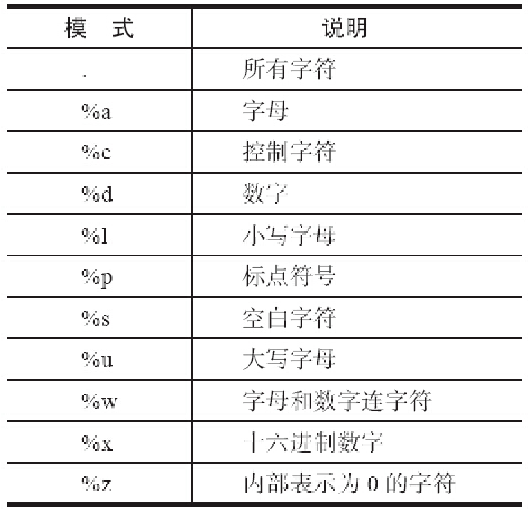

# 第01章 PSTN与VoIP基础
# 第02章 PSTN、PBX及呼叫中心业务
# 第03章 初识FreeSWITCH
# 第04章 运行FreeSWITCH
# 第05章 FreeSWITCH架构
# 第06章 拨号计划
# 第07章 SIP协议
# 第08章 媒体
# 第09章 SIP模块
# 第10章 基本技能
# 第11章 基本功能与实现
# 第12章 高级功能与配置实例
# 第13章 FreeSWITCH与FreeSWITCH对接
# 第14章 FreeSWITCH与其他设备或系统对接
# 第15章 其他技巧与实例
# 第16章 嵌入式脚本

FreeSWITCH默认使用XML Dialplan配置呼叫流程。XML文件描述性很强，因而也可以描述比较复杂的呼叫流程。但在一些比较高级的IVR应用和呼叫交互流程中，仅靠简单的XML的配置很难满足要求。因而我们还需要更灵活、更强大的解决方案。

除XML Dialplan外，FreeSWITCH支持使用嵌入式的脚本语言控制呼叫流程。我们不仅可以用它们写出灵活多样的IVR，给用户带来更好的体验，还可以通过它们很好地与你的业务进行无缝集成，以节省你的后台业务处理及管理成本。

在内部，FreeSWITCH通过使用swig [1]工具来支持多种开发语言。简单来讲，swig是一个包装工具（Wrapper），它可以将FreeSWITCH用C语言实现的一些功能包装成各种其他语言的接口、类或者方法，这样就可以在使用其他语言时以原生的方式调用。现在已知支持的语言有C、Perl、PHP、Python、Ruby、Lua、Java、Tcl以及由Managed支持的.Net平台语言，如C#、VB.NET等。FreeSWITCH源代码中的swig脚本和程序已被转换成各种语言的接口了，因而开发者不需要安装swig工具就可以使用。这里有一点要专门指出，JavaScript语言比较特殊一些，对它的支持是基于Google的V8库，在mod_v8模块中实现的。

使用程序语言来做前面提到的那些事情有两种方式：第一种是嵌入式脚本，第二种是独立的应用程序。如果使用后者，理论上讲，你可以使用任何你喜欢的语言，只要该语言支持TCP Socket就行。关于使用Socket方式来控制FreeSWITCH的编程方法我们将在18章讲解。本章主要关注嵌入式脚本。

[1] 参见http://www.swig.org或http://www.swig.org/translations/chinese/。

## FreeSWITCH中的嵌入式脚本

其实前面我们学到的XML Dialplan已经体现了其非凡的配置能力，它配合FreeSWITCH提供的各种App使用时，也可以认为是一种脚本。当然，毕竟XML是一种描述语言，功能还比较有限，为了扩展其功能，FreeSWITCH通过嵌入其他语言的解析器支持很多流行的编程语言。这些语言一般都能提供if...else判断及等循环跳转控制等，因而控制呼叫流程更加灵活。

一般来说，编程语言分为两种：编译型语言（如C）和解释型语言（如JavaScript、Perl等）。使用解释型语言编写出来的脚本不需要编译，因而非常灵活方便。比较典型的、FreeSWITCH支持的（可嵌入的）语言有 [1]：

- Lua
- JavaScript
- Python
- Perl
- Java

一般来说，这些嵌入式脚本主要用于编写IVR类的应用，即主要用来控制一路通话的呼叫流程，虽然它们也可以控制多路通话（在后面我们也会讲到这样的例子，但这不是其擅长的）。

当然，这里说的一路通话不是说它们只能控制唯一一路通话。以Lua为例，你可以把呼叫路由到一个Lua脚本，当有电话进来时，FreeSWITCH会为每一路通话启动一个线程，控制每一路通话的Lua脚本则在相应的线程内执行，互不干扰。Java语言需要Java的虚拟机环境，比Lua要复杂些。

[1] 其他脚本语言如PHP、Ruby等以前是支持的，由于它们有内存及性能问题，且没有志愿者维护，所以现在已经不支持了。

## Lua

Lua是一门小众语言，它可能不像其他语言（如Java）那样“如雷贯耳”，但由于其优雅的语法及小巧的身段受到很多开发者的青睐，尤其是游戏开发人员 [1]。

在FreeSWITCH中，Lua模块是默认加载的。在所有嵌入式脚本语言中，它是最值得推荐的语言。首先它非常轻量级，mod_lua.so经过减肥（Strip）后只有272KB；另外，它的语法相对的简单。有人做过对比，在嵌入式的脚本语言里，如果Python得2分，Perl得4分，JavaScript得5，则Lua语言可得10分 [2]，由此可见一斑。

另外，Lua模块的文档也是最全的。笔者在使用其他语言（如JavaScript）甚至写Event Socket程序时也经常参考Lua模块的文档。

`注意`：FreeSWITCH完全内置了Lua解释器，因此与操作系统上的Lua版本以及各种第三方库一点关系都没有，详细的配置信息可以参考conf/autoload_configs/lua.conf.xml。

另外，自2013年11月中旬起，FreeSWITCH中的Lua解释器升级到了Lua 5.2版本，因此，读者在写Lua脚本时要注意使用与Lua 5.2兼容的语法。而原来的Lua模块（基于Lua 5.1）则被移动到了源代码目录下的src/mod/legacy目录中，如果需要Lua 5.1的用户可以自行编译该版本。

### Lua语法简介

Lua的语法非常简洁易懂，有人说：如果你会其他编程语言，则在30分钟内就能学会它 [3]。

大家都知道，如果有某种语言的编程经验，则学一种新的语言时可以对比着学。在这里，我们对比大家比较熟悉的JavaScript语言 [4]来学习Lua。

1. 相似性

Lua与JS（JavaScript的缩写，下同）有很多相似的地方，简述如下。

- 变量无需声明。Lua与JS都是“弱”类型的语言（不像C），所以它们不需要事先声明变量的类型。
- 区分大小写。Lua和JS都是区分大小写的。true和false分别代表布尔类型的真和假，true与True或TRUE是完全不同的。
- 函数可以接受个数不定的参数。与JS类似，在Lua中，与已经声明的函数参数个数相比，实际传递的参数个数可多可少，如：

```lua
function showem( a, b, c )
print( a, b, c )
end
showem( 'first'  )                             --> first   nil      nil
showem( 'first', 'second' )                    --> first   second   nil
showem( 'first', 'second', 'third' )           --> first   second   third
showem( 'first', 'second', 'third', 'fourth' ) --> first   second   third
```

在Lua中，个数不定的参数列表使用“...”（称为vararg expressions）来表示，如：

```lua
function showem(a, b, ...)
    local output = tostring(a) .. "\t" .. tostring(b)
    local theArgs = { ... }
    for i,v in ipairs(theArgs) do
        output = output .. "\t#" .. i .. ":" .. v
    end
    print(output)
end
showem('first' )                             --> first  nil
showem('first', 'second')                    --> first  second
showem('first', 'second', 'third')           --> first  second  #1:third
showem('first', 'second', 'third', 'fourth') --> first  second  #1:third  #2:fourth
```

- 哈希可以用方括号或点方式引用。哈希表是编程语言中一种重要的数据结构。在Lua中，哈希表用Table来实现，在JS中，用稀疏在数组实现。无论如何，在两者中都可以使用如下的语法引用，如：

```
theage = gavin['age']
theage = gavin.age
```

- 数字区别不大。在JS和Lua中，整数和浮点数是没有区别是的。它们在内部都是以浮点数表示。在Lua中，所有的数字类型都是number类型。
- 分号是可选的。两者类似，在不产生歧义的情况下，行尾的分号可以有，也可以没有。不同的是对待分号的方式，在JS中，按惯例是包含分号的，而在Lua中，惯例是不包含分号的。
- 默认全局变量。在JS中，如果用var声明一个变量并赋值，则它是本地变量；如果不用var声明，默认就是全局的，如：

```lua
function foo( )
{
    var jim = "This variable is local to the foo function";
    jam = "This variable is in global scope";
}
```

而在Lua中也类似，用local声明一个本地变量，省略local时则默认为全局变量：

```lua
function foo( )
    local jim = "This variable is local to the foo function";
    jam = "This variable is in global scope";
end
```

- 使用双引号和单引号表示字符串。在JS和Lua中，字符串是用引号引起来的，并且单引号和双引号的作用没有任何不同 [5]。引号要配对使用，但这两种引号可以混合以避免使用转义符，必要时可以使用“\”来转义，如（其中，箭头后面为实际变量的值）：

```lua
local book = "Seven's Book";             --> Seven's Book
local book = 'Seven\'s Book';            --> Seven's Book
local book = '"Awsome" book of Seven';   --> "Awsome" book of Seven
local book = "\"Awsome\" book of Seven"; --> "Awsome" book of Seven
```

- 函数是一等公民。在JS和Lua中，函数是一等公民，这意味着，你可以将它赋值给一个变量，将它作为参数传递，或者直接加上括号进行调用，如在Lua中：

```lua
1    mytable = { }
2    mytable.squareit = function( x )
3        return x * x
4    end
5    thefunc = mytable.squareit
6    print( thefunc( 7 ) ) --> 49
```

其中，第1行声明一个Table类型的变量mytable；第2～4行定义一个匿名函数，并将它赋值给mytable的squareit成员变量；第5行将上述成员变量的值又赋值给了一个变量thefunc。至此，thefunc实际上就代表第2行至第4行定义的匿名函数。最后，在第6行就可以通过thefunc引用该函数，该函数对输入的参数7进行平方计算（x*x），最后得到结果49。

- 函数都是闭包。在JS和Lua中，函数都是闭包。简单来说，这意味着函数可以随时访问该函数在定义时可以访问的本地变量，尽管在以后调用时这些本地变量逻辑上已经“失效”了。比如下面的Lua例子中，inBaseValue中在定义时有效，却能在调用时照样使用它。

```lua
function MakeAdder( inBaseValue )
    return function( inValueToAdd )
        return inBaseValue + inValueToAdd
    end
end
add10 = MakeAdder( 10 )
add30 = MakeAdder( 30 )
print( add10( 1 ) )       --> 11
print( add10( 6 ) )       --> 16
print( add30( 3 ) )       --> 33
```

2. 区别

Lua与JS又有很多区别，简述如下：

- 单行和多行注释不同。JS使用“//”做单行注释，而Lua使用“--”。JS使用“/*...*/”来做多行注释，而Lua中使用“--[[...]]”（注意，这里的“...”表示实际被注释的内容）。
- JS中多行注释不能嵌套，解析器将在遇到第一个“*/”时终止该注释，而在Lua中，则可以使用类似“--[===[...]===]”的方式，通过在方括号中多加几个等号（前后等号的数量要匹配）来改变最外层的注释。参考以下Lua注释：

```lua
-- 
本行是单行注释
local jim = "This is not commented"
--[[
local foo = "本行代码被注释掉了"
local bar = "本行代码也被注释掉了"
--]]
local jam = "本行是有效的"
---[[ 本行相关于一个单行注释
local foo = "本行也是有效的，为什么？"
local bar = "本行也是有效的，因为前面的注释中多了一个“-”
--]] 
本行也相当于一个单行注释了
--[==[ 把下面这些全都注释掉
--[[
local foo = "foo"
local bar = "bar"
--]]
--]==]
```

- 用end终止程序块。Lua与Ruby类似，使用end来代替JS中的大括号来终止程序块，如下面是Lua中终止程序块的语法：

```lua
function foo( )
    --my code here
end
if foo( ) then
    --my code here
end
for i=0,1000 do
    --my code here
end
```

- 使用nil代表空值。类似Ruby，在Lua中，使用nil代表空值，在JS及C语言中则使用null或NULL。
    在JS中，空字符串（""）和0在条件测试中都为假（false）。而在Lua中，nil和false是仅有的非“真”（True）值，其他所有的都表示测试结果为真。
- Lua中任何值都可以作为Table的键（Key）。在JS中，对象（Object）的所有键都是字符串（如myObj[11]与myObj["11"]是相同的），而在Lua中，字符串、数字、甚至另一个Table都可以是键。参见如下Lua代码：

```lua
a = {}
b = {}
mytable = {}
mytable[1] = "The number one"
mytable["1"] = "The string one"
mytable[a] = "The empty table 'a'"
mytable[b] = "The empty table 'b'"
print( mytable["1"] ) --> The string one
print( mytable[1] )   --> The number one
print( mytable[b] )   --> The empty table 'b'
print( mytable[a] )   --> The empty table 'a'
```

- Lua中没有数组，任何复杂的数据类型都是Table。在JS里有明确的数组对象，并且有对应的操作数组的方法，如：

```lua
var myArray = new Array( 10 );  // 声明一个新数组，有10个空元素
var myArray1 = [ 1, 2, 3 ];     // 声明一个新数组，有3个元素

myArray1.pop();                 // 从数组中弹出最后一个元素
```

而在Lua中，对象是Table、prototype是Table、哈希是Table、数组是Table、Table是Table、什么都是Table。

Lua中的所谓数组本身是一个Table，它相当于JS里的稀疏数组，只是它的第一个元素的下标是从1开始的，而不是0。可以使用Table的语法来创建数组。如下面Lua代码中的两种方法是等价的：

```lua
people = { "Alice", "Bob", "Carl" }
people = { [1]="Alice", [2]="Bob", [3]="Carl" }
```

如果拿Table当数组来用，可以使用两种方法来获取和设置数组的大小，并允许数组中有空值存在，如：

```lua
people = { "Alice", "Bob", "Carl" }
print( table.getn( people ) )              --> 3
people[ 7 ] = "Someone Else "
print( table.getn( people ) )              --> 3
print( people[ 10 ] )                      --> "Some Dude"
for i=1,table.getn( people ) do
    print( people[ i ] )
end
--> Alice
--> Bob
--> Carl
table.setn( people, 7 )
print( table.getn( people ) )              --> 7
for i=1,table.getn( people ) do
    print( people[ i ] )
end
--> Gavin
--> Stephen
--> Harold
--> nil
--> nil
--> nil
--> Someone Else
```

- 数字、字符串以及Table都不是对象。与面向对象概念里面的对象不同，数字、字符串以及Table本质上都不是对象。

Lua仍然是面向过程的编程，大多数操作可以通过库函数实现，如：

```lua
print(string.len(mystring)  )  --> 11
print(string.lower(mystring))  --> hello world
```

其中，string.len是一个函数，实际上string本身是一个Table。从Lua5.1起，也支持一些类似面向对象的语法，如上面的例子等价于：

```lua
mystring = "Hello World"
print(mystring:len())  --> 11
print(mystring:lower())  --> hello world
```

在上面的例子中，通过使用“:”，把mystring看成一个对象，然后len和lower就类似于这个对象的方法。便实际上，Lua是在内部把mystring这个假的“对象”特殊处理了，找到它所对应的数据类型（string）后，调用实际的string.len()，并把mystring作为该函数的第一个参数，所以mystring:len()与string.len(mystring)是等价的。

- 没有++和+=。在Lua中没有++和+=这样的缩写形式，所以变量自加必须用以下方式：

```lua
local i = 0;
i = i + 1;
```

字符串的拼接是使用“..”操作符实现的，如：

```lua
local themessage = "Hello"
themessage = themessage .. " World"
```

如果把一个字符串和一个数字相加，Lua会试图将字符串转换成数字，如：

```lua
print(10 + "2")    --> 12
print(10 + "a")    --> 出错：attempt to perform arithmetic on a string value
```

- 没有三目运算符。JS或C中的“a?b:c”语法是很贴心的，但在Lua中没有。不过，Lua中有个“短路”语法，与该功能类似，如：

```lua
local foo = (math.random( ) > 0.5) and "It's big!" or "It's small!"
local numusers = 1
print( numusers .. " user" ..
(numusers == 1 and " is" or "s are") .. " online.")
--> 1 user is online.
numusers = 2
print( numusers .. " user" ..
(numusers == 1 and " is" or "s are") .. " online.")
--> 2 users are online.
```

- 模式匹配。正则表达式是很方便的字符串匹配工具。与JS以及其他语言不同，为了保持Lua的小巧且减少对其他库的依赖，Lua没有使用常用的POSIX(regexp)，也没有使用PCRE（Perl兼容的正则表达式），而是自己实现了模式匹配算法，其语法也有很大不同。

模式（Pattern）实际上就是Lua中的正则表达式。它与普通正则表达式最大的不同就是使用“%”而不是使用“\”来转义。Lua模式中的字符分类如表16-1所示。

<center>表16-1　Lua中的模式</center>



除此之外，它还有一些具有魔法含义的特殊字符，这些字符有：( ) . % + - * ? [ ] ^ $

它们的含义都与PCRE里的差不多的，其中“-”的含义与“*”类似，都是重复前一个字符0次或多次，不同的是，“*”为最大匹配，它会尽量匹配更长的字符串，而“-”为最小匹配，它会尽量匹配更短的字符串。

3. 其他

Lua的介绍已经占了本章很大的篇幅了。相信这些内容对于编辑简单的脚本也够用了。最后推荐一本学习Lua的书——《Lua程序设计（第二版）》（原名Programming Lua）。另外，英文好的读者可以参考另一本书Programming in Lua，该书第一版是免费的，见http://www.lua.org/pil/。

### 将电话路由到Lua脚本

在快速测试的情况下，可以直接使用如下的originate命令在FreeSWITCH中外呼一路通话，并在电话的本端执行Lua脚本：

```
originate user/1000 &lua(test.lua)
```

其中，lua是一个App，它的参数就是脚本的名字，脚本的默认路径在安装路径的scripts目录下，当然你也可以指定一个绝对路径，如/tmp/test.lua。

在Dialplan XML中，使用下列配置便可将进入Dialplan的电话（Channel）交给Lua脚本接管。

```xml
<action application="lua" data="test.lua"/>
```

当然，除此之外，也可以直接使用uuid_transfer命令直接配合inline Dialplan将一个Channel路由到Lua脚本，如：

```
uuid_transfer <uuid> lua:/tmp/test.lua inline
```

总之，这里的Lua是一个标准的App，在任何可以使用App的地方都可以使用它（如上面介绍的各种场景，以及后面要介绍的Event Socket等。甚至在Lua脚本中也可以再次使用lua App来调用下一个Lua脚本）。

### Session相关函数

在Lua环境中，FreeSWITCH会自动生成一个session对象（实际上是一个Table），因而可以在Lua脚本中使用Lua类似面向对象的语法特性编程，如以下脚本放播放欢迎声音 [6]：

```lua
-- 应答

session:answer()
-- 睡一小会（毫秒）

session:sleep(1000)
-- 播放声音文件

session:streamFile("/tmp/hello-lua.wav")
-- 挂机
session:hangup()
```

大部分与Session有关的函数都是跟FreeSWITCH中的App是一一对应的，如上面的answer、hangup等。有一点要特别说明：streamFile对应playback这个App。如果在Lua中没有对应的函数，也可以通过session:execute()函数来执行相关的App，如session:execute("playback","/tmp/sound.wav")与session:streamFile("/tmp/sound.wav")是等价的 [7]。

需要注意，Lua脚本执行完毕后默认会挂断电话，所以上面的Hello Lua例子中不需要明确的session:hangup()。如果想在Lua脚本执行完毕后继续执行Dialplan中的后续流程，则需要在脚本开始处先设置不要自动挂机，语法如下：

```
session:setAutoHangup(false)
```

例如下列场景，test.lua执行完毕后（假设没有session:hangup()，主叫也没有挂机），如果没有setAutoHangup(false)，则后续的playback动作得不到执行。

```xml
<extension name="test-lua">
    <condition field="destination_number" expression="^1234$">
        <action application="answer"/>
        <action application="lua" data="test.lua"/>
        <action application="playback" data="lua-script-complete.wav"/>
    </condition>
</extension>
```

下面，我们来讲与Ssession相关的几个常用的函数：

- getVariable。取得变量的值，如：

```lua
local moh = session:getVariable("hold_music")
local dest_number = session:getVariable("context")
local dest_number = session:getVariable("destination_number")
local cid_name = session:getVariable("caller_id_name")
local cid_number = session:getVariable("caller_id_number")
local ani = session:getVariable("ani")
local uuid = session:getVariable("uuid")
```

- getUUID。取得当前Session的UUID，下列两行是等价的：

```lua
local uuid = session:get_uuid(]);
local uuid = session:getVariable("uuid")
```

- setVariable。设置通道变量，等价于Dialplan App里的set：

```lua
session:setVariable("varname", "varval")
```

- hangup。挂断当前通话：

```lua
session:hangup();
```

也可以同时指定挂断原因，如以下函数将在挂断时向对方返回用户忙：

```lua
session:hangup("USER_BUSY")
```

- ready。检查Session是否可正常使用，如果已经挂机就会返回false。

在写脚本时，如果有循环，一定需要经常检测session:ready()是否为true，否则Session挂机后Lua脚本可能仍然在死循环地运行。

```lua
while (session:ready() == true) do
    -- do something here
end
```

- streamFile：放音，相当于Dialplan App里的playback。

```lua
session:streamFile("/tmp/test.wav")
```

- recordFile：录音，相当于Dialplan App里的record，参数是：file_name [,max_len_secs] [,silence_threshold] [,silence_secs]
    其中，各参数含义如下：
    - file_name：录音文件名。
    - max_len_secs：录音最长的秒数。
    - silence_threashold：一个声音阈值，如果声音小于该值，就认为是静音。
    - silence_secs：如果静音时长大于一定秒数，则停止录音。

例如，以下函数将对当前的Channel录音，并存放到/tmp/test_record.wav中：

```lua
session:recordFile("/tmp/test_record.wav")
```

- read。类似于Dialplan App中的read，用于播放一个声音并获取DTMF。它的5个参数与read含义相同：

```
<min digits><max digits><file to play><inter-digit timeout><terminators>
```

6.4节介绍的身份证号的例子用Lua改写如下：

```lua
digits = session:read(15, 18, "/tmp/input-id-card.wav", "5000", "#");
session:("log", "INFO ID Card Number: ".. digits .."\n");
```

读者可以发现Lua中的read比Dialplan App中的read少了一个参数。由于session:read()能返回值，因此那个参数就不需要了，实际收到的DTMF会返回到本例的digits变量中。

- playAndGetDigits。与Dialplan App中的play_and_get_digits类似，它的参数格式是：<min_digits>, <max_digits>, <max_attempts>, <timeout>, <terminators>,<prompt_audio_files>, <input_error_audio_files>,<digit_regex>, [variable_name], [digit_timeout],[transfer_on_failure])

其中，大部分参数都很直观，也跟play_and_get_digits中类似。其中timeout是收齐所有号的超时值，而digit_timeout是允许的两次按键之音的时间间隔最大值，最后transfer_on_failure指明如果失败后是否转到Dialplan中的一个Extension上去，它的格式应该是一个Dialplan三要素的格式串，如“failed XML dialplan”。

我们把6.4节中的身份证号的例子重写如下：

```lua
digits = session:playAndGetDigits(15, 18, 3, 10000, "#",
    "/tmp/input-id-card.wav", "/tmp/invalid_num.wav",
    "^\\d{15}|\\d{17}[0-9\\*]$")
session:execute("log", "INFO ID Card Number: ".. digits .."\n");
```

- setInputCallback。在放音或录音时，用户按下的DTMF可以用于触发一些功能。所以在这些状态下，Lua支持如果收到DTMF等外部输入时，则调用相关的回调函数。setInputCallback的作用就是设置（安装）一个回调函数。

```lua
01 function onInputCBF(s, type, obj, arg)
02     if (type == "dtmf") then
03         freeswitch.consoleLog("INFO",
04           "Got DTMF: " .. obj.digit .. " Duration: " .. obj.duration .. "\\n")
05           if (obj.digit == "3") then
06               return 'break'
07           end
08       end
09       return ''
10   end
11 session:setInputCallback('onInputCBF', '');
12 session:streamFile("local_stream://moh");
```

其中，第1行，我们定义了一个回调函数onInputCBF，并在第11行使用setInput-Callback将该函数绑定到该Session上。第12行执行streamFile实现一直不停地播放等待音乐。当用户按下话机上的键时，FreeSWITCH就会回调上面指定的回调函数。下面我们来看一下该函数的内容。

回调函数一共有4个参数，在这里我们只关注type和obj两个参数。在此，由于我们的回调函数是由DTMF触发的，因此这里的type值为“dtmf”。obj是一个Table，它的两个Key分别是digit和duration，分别表示DTMF的链值和时长。

上面的例子中第2行测试该回调是否是由DTMF引起，如果是，就打印相关DTMF信息。在第5行测试如果用户按了3的话，就返回break。返回break会停止当前正在执行的App（在这里我们正在播放保持音乐），如果后面没有其他脚本语句的话，Lua App就会退出。如果返回空值（空字符串，如第9行），则它什么也不做。

如果我们顺序按1、2、3，则上面例子在控制台上的输出结果如下：

```
[INFO] switch_cpp.cpp:1288 Got DTMF: 1
[INFO] switch_cpp.cpp:1288 Got DTMF: 2
[INFO] switch_cpp.cpp:1288 Got DTMF: 3
```

除DTMF外，回调还可能由其他的输入引起，如在进行语音识别的时候识别到相关关键词，这里我们就不多介绍了。

另外，使用unsetInputCallback函数也可以取消刚才设置的回调函数，在此我们就不多讲了。更多与Session相关的函数可以参考相关的wiki文档：http://wiki.freeswitch.org/wiki/Mod_lua。

### 非Session函数和独立的Lua脚本

Lua脚本中也可以使用跟Session不相关的函数，最典型的是freeswitch.consoleLog()，其用于输出日志，如：

```lua
freeswitch.consoleLog("NOTICE", "Hello lua log!\n")
```

另外一个是freeswitch.API()，允许你在Lua中执行任意API，如：

```lua
api = freeswitch.API()
reply = api:execute("version", "")
freeswitch.consoleLog("INFO", "Got reply:\n\n" .. reply .. "\n")
```

上面Lua脚本可以直接在FreeSWITCH控制台上执行，如果将上述脚本保存到/tmp/a.lua中，则输出结果为：

```lua
freeswitch> lua /tmp/a.lua
2013-09-16 16:20:31.363305 [INFO] switch_cpp.cpp:1288 Got reply:
FreeSWITCH Version 1.5.6b+git~20130914T180606Z~60f5dec57e (git 60f5dec 2013-09-14 18:06:06Z)
```

除此之外，其他的非Session函数还有freeswitch.bridge()、freeswitch.email()等，在此就不多介绍了。

非Session函数一般运行在独立的Lua脚本中。独立的Lua脚本可以直接在控制台终端上执行（使用luarun），这种脚本大部分可用于执行一些非Session相关的功能（因为这里面没有Session）。读到这里读者已经了解到了，Lua是一个App [8]，而luarun是一个API。

我们刚刚讲到的a.lua就是一个典型的可独立运行的Lua脚本。独立运行的Lua脚本跟在Dialplan中用Lua App运行的不同，前者不会自动获得一个session对象（Table）。当然，独立运行的脚本也可以自行创建session对象。在17.4节可以看到相关的实例。

### Event相关函数

在第5章我们曾提到，FreeSWITCH使用事件机制进行异步通信。在Lua脚本中，可以“生产”事件，也可以“消费”事件，下面我们来看一下与事件相关的函数。

FreeSWITCH的事件也跟一个SIP消息类似，它包含一些事件头（Header）和可选的事件正文（Body）。在FreeSWITCH内部使用C语言结构体表示，可以序列化成类似SIP消息的简单文本格式（Plain）、JSON或XML。

- freeswitch.Event。初始化一个事件，该事件类型需要在switch_event_types_t枚举类型中有定义，它是在switch_types.h中定义的。如果使用了未定义过的名字，则统一为MESSAGE。下面的例子初始化一个主事件：event = freeswitch.Event("MESSAGE_WAITING")

也可以初始化一个CUSTOM事件，其中第二个参数可以是任意字符串 [9]，它将作为事件中的Event-Subclass，如：event = freeswitch.Event("CUSTOM", "freeswitch:book")

- event:addHeader。给事件增加一个事件头，如：

```
event:addHeader("MWI-Messages-Waiting", "no")
event:addHeader("MWI-Message-Account", "sip:1000@192.168.0.2")
event:addHeader("Sofia-Profile", "internal")
```

- event:fire。产生（生产）事件，如：event:fire()

- event:addBody。给事件增加一个可选的正文，并使用Content-Type头标志正文的类型，如：

```
event:addHeader("Content-Type", "text/plain")
event:addBody("Hello FreeSWITCH")
```

- event:delHeader。从事件中删除一个头域，下面的例子可以替换from头：

```
event:delHeader("from")
event:addHeader("from", "1000@192.168.0.2")
```

- event:getHeader。在收到一个事件后，可以取得其头域的值，如：

```
event:getHeader("from")
event:getHeader("Caller-Caller-ID-Name")
```

- event:getBody。取得Body的值（如果有的话），如：event:getBody()

- event:getType。取得事件的类型（名字），以下两种方法是等价的：

```
event:getType()
event:getHeader("Event-Name")
```

- event:serialize。将事件序列化成可读的形式（字符串），支持plain text、JSON、XML三种类型，如：

```
event:serialize()
event:serialize("json")
event:serialize("xml")
```

最后，我们来看一个完整的例子。该例子综合使用了上面介绍的各种函数，读者可以对照下面的代码和输出结果自行分析一下。代码如下：

```lua
function log(k, v)
    if not v then v = "[NIL]" end
    freeswitch.consoleLog("INFO", k .. ": " .. v .. "\n")
end
event = freeswitch.Event("CUSTOM", "freeswitch:book")
event:addHeader("Author", "Seven Du")
event:addHeader("Content-Type", "text/plain")
event:addBody("FreeSWITCH: The Definitive Guide")
type = event:getType()
author = event:getHeader("Author")
text=event:serialize()
json=event:serialize("json")
xml=event:serialize("XML")
log("type", type)
log("author", author)
log("text", text)
log("json", json)
log("xml", xml)
event:fire()
log("MSG", "Event Fired")
```

将上述内容保存到/tmp/event.lua中，执行结果如下（为了节省篇幅这里省略了某些事件头域及JSON和XML中的一些字段）：

```
freeswitch> lua /tmp/event.lua
[INFO] switch_cpp.cpp:1288 type: CUSTOM
[INFO] switch_cpp.cpp:1288 author: Seven Du
[INFO] switch_cpp.cpp:1288 text: 'Event-Name: CUSTOM
...
Event-Subclass: freeswitch%3Abook
Author: Seven%20Du
Content-Type: text/plain
Content-Length: 32
FreeSWITCH: The Definitive Guide'
[INFO] switch_cpp.cpp:1288 json: {
    "Event-Name":   "CUSTOM",
    "Core-UUID":    "bc647e68-47de-407f-b32a-d9bdf5c25786",
    "Event-Sequence":   "5000",
    "Event-Subclass":   "freeswitch:book",
    "Author":   "Seven Du",
    "Content-Type": "text/plain",
    "Content-Length":   "32",
    "_body":    "FreeSWITCH: The Definitive Guide"
}
[INFO] switch_cpp.cpp:1288 xml: <event>
<headers>
<Event-Name>CUSTOM</Event-Name>
<Core-UUID>bc647e68-47de-407f-b32a-d9bdf5c25786</Core-UUID>
<Event-Sequence>5000</Event-Sequence>
<Event-Subclass>freeswitch%3Abook</Event-Subclass>
<Author>Seven%20Du</Author>
<Content-Type>text/plain</Content-Type>
</headers>
<Content-Length>32</Content-Length>
<body>FreeSWITCH: The Definitive Guide</body>
</event>
[INFO] switch_cpp.cpp:1288 MSG: Event Fired
```

### Chat相关函数

FreeSWITCH通过mod_sms支持文本消息。一个文本消息与一个Session类似，FreeSWITCH收到文本消息后将执行Chatplan，然后在Chatplan中可以执行Lua脚本。在Chatplan中的Lua脚本会自动获得一个message对象，该对象的内部表示跟event是一样的。因而与Event相关的函数，如addHeader、delHeader、addBody、serialize等，都是可以用的。除此之外，还有一个chat_execute函数，它可以执行mod_sms中支持的以下动作。

- fire：产生一个MESSAGE事件。
- send：发送消息。
- reply：回复消息。
- set：设置变量。
- info：显示信息。
- stop：停止消息路由。
- system：调用system函数执行系统调用。

下面的Lua脚本可以在Chatplan中执行，收到消息后先打印出来，然后修改目的号码和主机，并发送出去。

```lua
area_code = "010"
to_host = "192.168.0.2"
function log(k, v)
    if not v then v = "[NIL]" end
    freeswitch.consoleLog("INFO", k .. ": " .. v .. "\n")
end
log("Message", message:serialize())
to_user = message:getHeader("to")
message:delHeader("to")
message:addHeader("to", "internal/sip:" .. area_code .. to_user .. "@" .. to_host)
message:delHeader("to_host")
message:addHeader("to_host", to_host)
log("New Message", message:serialize())
message:chat_execute("send")
```

与在Dialplan中类似，在Chatplan中可以用以下方法调用Lua脚本，如：

```lua
<action application="lua" data="test.lua"/>
```

### LUA拨号计划

在第6章我们提到，拨号计划除XML外还有很多种，其中一种就是LUA拨号计划，即可以通过Lua脚本提供Lua风格的Dialplan。

<center>图9-5　常见FreeSWITCH NAT网络拓扑结构</center>

下面的脚本入进路由阶段时将查询并生成一个Dialplan，FreeSWITCH接下来执行该Dialplan，打印一些Log，并执行answer和playback。

```lua
function log(k, v)
    if not v then v = "[NIL]" end
    freeswitch.consoleLog("INFO", k .. ": " .. v .. "\n")
end
cid = session:getVariable("caller_id_number")
dest = session:getVariable("destination_number")

log("From Lua DP: cid:  ", cid)
log("From Lua DP: dest: ", dest)
-- Some Bussinuss logic here
ACTIONS =  {
    {"log", "INFO I'm From Lua Dialplan"},
    {"log", "INFO Hello FreeSWITCH, Playing MOH ..."},
    "answer",
    {"playback", "local_stream://moh"}
}
```

首先，跟在Dialplan中执行Lua脚本类似，这里也有一个session对象，可以执行所有与Session相关的函数，如获取主被叫号码（cid、dest）等。获取到相关信息后可以通过Lua相关的函数，如判断日期时间、连接数据库检查主被叫号码合法性及黑白名单等（这里我们省略了跟逻辑相关的操作）。最后，生成一个Lua Table。该Table的名字必须是ACTIONS。其成员可以是一个字符串或一个子Table。FreeSWITCH在ROUTING阶段获得该Table后，便可以进入EXECUTING阶段执行ACTIONS中定义的一系列动作（Action）。

Dialplan有三个要素——Extension、Context和Dialplan的名字，在Lua Dialplan中，Dialplan的名字当然是LUA，其Context就是Lua脚本的路径。把上面的脚本存为/tmp/db.lua，我们可以立即使用originate测试。

```
freeswitch> originate user/1000 test LUA /tmp/dp.lua
[NOTICE] switch_channel.c:1030 New Channel sofia/internal/sip:1000@192.168.1.124: 34574 ...
[NOTICE] sofia.c:5898 Ring-Ready sofia/internal/sip:1000@192.168.1.124:34574!
[NOTICE] sofia.c:6561 Channel [sofia/internal/sip:1000@192.168.1.124:34574] has been answered
[NOTICE] switch_ivr.c:1831 Transfer sofia/internal/sip:1000@192.168.1.124:34574 to LUA[test@/tmp/dp.lua]
+OK bbe75fce-2e94-4730-94e0-060f1bc81026
[INFO] mod_lua.cpp:566 Processing ->test in context/script /tmp/dp.lua
[INFO] switch_cpp.cpp:1288 From Lua DP: cid:  : 0000000000
[INFO] switch_cpp.cpp:1288 From Lua DP: dest: : test
[INFO] mod_dptools.c:1588 I'm From Lua Dialplan
[INFO] mod_dptools.c:1588 Hello FreeSWITCH, Playing MOH ...
```

其中，originate命令首先呼叫user/1000，当它接听后，即转入LUA Dialplan中的/tmp/dp.lua这一Context进行路由，其对应的extension是test。其执行结果也很直观。

用originate回呼是一种快速的测试方法，除此之外，读者也可以尝试在XML Dialplan中转入LUA Dialplan，如：

```lua
<action application="transfer" data="$1 LUA /tmp/dp.lua"/>
```

或直接修改Profile，让电话在呼入时直接进入LUA Dialplan。如将internal.xml中的：

```xml
<param name="dialplan" value="XML"/>
<param name="context" value="public"/>
```

修改为：

```lua
<param name="dialplan" value="LUA"/>
<param name="context" value="/tmp/dp.lua"/>
```

执行sofia profile internal rescan可以使之生效。别忘了如果是注册用户拨打的话，还需要修改User Directory中的user_context（因为它的优先级比Profile中的context要高），如在1000.xml中：

```xml
<variable name="user_context" value="/tmp/dp.lua"/>
```

总之，读者可以自己尝试一下，尽量完全掌握对这些不同的参数。如果遇到错误也不要紧，仔细看一下日志，应该很容易找到解决的办法。

### 连接数据库

在Lua中，可以使用LuaSQL [10]连接各种关系型数据库，但LuaSQL与某些版本的数据库驱动结合有内存泄漏问题，配置起来也相对复杂一些。
另一种连接数据库的方式是直接使用freeswitch.Dbh。它可以直接通过FreeSWITCH内部的数据库连接句柄来连接SQLite数据库或任何支持ODBC的数据库。下面是一个来自FreeSWITCH Wiki的例子，这里稍微做了一些改动：

```lua
-- 这里我们使用SQLite数据库，先初始化一个DB Handle

local dbh = freeswitch.Dbh("/tmp/test.db")
-- 如果使用ODBC数据库，可以使用以下格式
-- local dbh = freeswitch.Dbh("odbc://dsn username password")
assert(dbh:connected()) -- 断言，测试数据库是否成功连接，如果连接不成功则退出
-- test_reactive测试数据库表是否存在，它有三个参数：
-- 测试语句（查询，SELECT），删除语句（DROP）及创建语句（CREATE）
-- 意思是说，如果SELECT不成功，则先试图运行一个DROP操作，再用CREATE重新创建
dbh:test_reactive("SELECT * FROM test_table",
                  "DROP TABLE test_table",

                  "CREATE TABLE test_table (id INTEGER, name VARCHAR(255))")
-- 往我们新建的表中插入两条数据
dbh:query("INSERT INTO test_table VALUES(1, 'foo')")

dbh:query("INSERT INTO test_table VALUES(2, 'bar')")
-- 查询数据，并对查询结果集的每一行回调一个匿名函数（function），
-- 查询结果集将作为一个Table传入row参数，则实际列的值可以用row.id、row.name引用
dbh:query("SELECT id, name FROM test_table", function(row)
    freeswitch.consoleLog("INFO", string.format("Row #%s: %s\n", row.id, row.name))

end)
-- 更新表

dbh:query("UPDATE test_table SET name = 'changed'")
-- 打印更新行数（Affected Rows）

freeswitch.consoleLog("INFO", "Affected rows: " .. dbh:affected_rows() .. "\n")
-- 查看更新后的结果
dbh:query("SELECT id, name FROM test_table", function(row)
    freeswitch.consoleLog("INFO", string.format("Row #%s: %s\n", row.id, row.name))

end)
-- 释放Handle，可选，默认用完后会自动释放
dbh:release()
```

执行结果如下：

```
[DEBUG] freeswitch_lua.cpp:352 DBH handle 0x7fa218a0fd28 Connected.
[DEBUG] switch_core_sqldb.c:1187 SQL ERR [no such table: test_table]
[SELECT * FROM test_table]
Auto Generating Table!
[DEBUG] switch_core_sqldb.c:1194 SQL ERR [no such table: test_table]
[DROP TABLE test_table]
[ERR] freeswitch_lua.cpp:391 DBH NOT Connected.
[INFO] switch_cpp.cpp:1287 Row #1: foo
[INFO] switch_cpp.cpp:1287 Row #2: bar
[INFO] switch_cpp.cpp:1287 Affected rows: 2
[INFO] switch_cpp.cpp:1287 Row #1: changed
[INFO] switch_cpp.cpp:1287 Row #2: changed
[DEBUG] freeswitch_lua.cpp:369 DBH handle 0x7fa218a0fd28 released.
```

我们也可以直接查看数据库（如果没有这个命令，需要安装sqlite3软件包，以“--”开头的注释为笔者所加）：

```sql
dujinfang@seven:/tmp$ sqlite3 test_db
SQLite version 3.7.12 2012-04-03 19:43:07
Enter ".help" for instructions
Enter SQL statements terminated with a ";"
sqlite> -- 显示所有表
sqlite> .table
test_table
sqlite> -- 显示表结构
sqlite> .schema test_table
CREATE TABLE test_table (id INTEGER, name VARCHAR(255));
sqlite> -- 查询
sqlite> select * from test_table;
1|changed
2|changed
```

[1] 我相信有很多人知道它是缘于2010年一则新闻，新闻中说：一个14岁的少年用Lua编出了iPhone上的名为Bubble Ball的游戏，该游戏下载量曾一度超过史上最流行的《愤怒的小鸟》。 

[2] Highly Embeddable:As far as embeddability goes-Python ranks a 2,Perl ranks a 4,JavaScript is a 5,and Lua is a 10!参见：http://wiki.freeswitch.org/wiki/Mod_lua。 

[3] 找不到原始的出处了，好像是FreeSWITCH IRC上某个成员说的。不过，下面这篇博客倒是有点意思：http://ruoyusun.com/2013/03/23/pragmatic-lua-basics-in-30-mins.html。 

[4] JavaScript是网页上浏览器端最流行的开发语言，而且随着node.js的流行，它在服务器端也迅速成长。当然，如果读者连JavaScript都不熟悉的话，也不要紧。JavaScript的语法与C或C++也比较类似。即使读者对所有这些语言都不熟悉，在这里两种语言对比着学习也没有什么坏处。本节大部分内容来自：http://phrogz.net/lua/LearningLua_FromJS.html。 

[5] 这一点与PHP、Ruby以及Bash不同。在这三种语言中，双引号表示引用的内容中如果有变量的话，则要进行变量替换；而单引号表示引用的内容中的的字符串形式要保持原样，不管有没有变量。 

[6] 来自Hello Lua:http://wiki.freeswitch.org/wiki/Mod_lua#Hello_Lua。 

[7] 实际上还是有一点区别：当使用onInputCallback回调时，session:execute方式不会触发回调，而session:streamFile则可以。 

[8] 实际上，也有一个叫Lua的API，它与luarun是等价的。不同的是，前者是在当前线程中执行的，而后者会新启动一个线程执行Lua脚本，并不阻塞当前线程的执行。 

[9] FreeSWITCH内部也使用CUSTOM事件，如sofia::register等。使用时注意命名空间与内部不要发生冲突就行了，当然也可以选择跟内部一样的名字，用于伪造事件。 

[10] 参见：http://www.keplerproject.org/luasql/。


## 其他脚本语言

虽然在嵌入式脚本中Lua是值得推荐的，但“萝卜白菜各有所爱”，并不是所有用户都选用Lua语言。而且，FreeSWITCH作为一款优秀的开源软件也是尽量满足更多人的口味。因此，在这里作为对嵌入式语言的补充和比较，我们再来简单看一下另外几种语言。

### JavaScript

相对于Lua，大家可能对JavaScript更熟悉一些。JavaScript是Web浏览器上最主流的编程语言，它最早用于配合HTML渲染页面，近几年由于node.js [1]的发展使它在服务器端的应用也发扬光大。它遵循EMCAScript标准。

通过加载mod_v8 [2]模块可以使用JavaScript解析器，该模块基于Google的V8 [3]JavaScript库。

我们在16.2.1节对Lua和JavaScript两种语言作了对比解析。在FreeSWITCH中，二者除了语法不同外，其用法类似。如使用JavaScript（它是一个App)执行一个Session相关的脚本，或jsrun（它是一个API）执行一个非Session相关的脚本。

例如，16.2.3节的Lua脚本可以用JavaScript重写如下：

```js
session.answer();
session.sleep(1000);
session.streamFile("/tmp/hello-js.wav");
session.hangup();
```

可以看出，除了与Lua在语法格式方面有点不同外，函数名都是相同的。但是，mod_spidermonkey对应的Wiki页面上的函数参考说明也没有Lua详细。所以，如果使用JavaScript开发的话，读者可以使用JavaScript的语法，并参考Lua的wiki页面相关的函数说明。

可以在XML Dialplan中使用如下配置将来话交给上述脚本处理（假设文件名为test.js）：

```xml
<action application="javascript" data="/tmp/test.js"/>
```

在源代码目录中的scripts/javascript目录下，还有几个JavaScript应用的例子，读者可自行研究一下，在这里就不多介绍了。

### Python

为了方便读者对各种语言做比较，我们这里再简单讲一下Python语言的例子。Python是一门很流行的脚本语言，实际上，Linux的安装程序的大部分脚本就是用Python写的。

Python语言能很好地与其他系统集成，不过，它的可嵌入性比起Lua和JS来要差一些，因此，对编译FreeSWITCH Python模块的支持要稍微复杂一些。当然，这对于熟悉Python语言的读者来说也不算什么。因为，大部分在FreeSWITCH中选择使用Python的人都是因为对Python特别熟悉，否则的话，肯定就选择Lua了。

在编译Python模块前需要安装Python的开发包，笔者在Ubuntu Linux 12.04的安装过程如下：

```
# apt-get install python-dev
```

笔者使用的Python版本是2.7，不过Python 2.6到Python 3.x的版本应该都可以支持。

安装了Python的开发包后，就可以直接安装Python模块了，在FreeSWITCH源代码目录中，执行以下命令就可以安装：

```
# make mod_python-install
```

如果安装过程中提示找不到Python之类的错误提示，则可以尝试重新配置并指定一个Python的路径，如：

```
# ./configure --with-python=/usr/bin/python    #配置，指定Python的路径
```


```
# make && make install                        #安装FreeSWITCH基本系统
```


```
# make mod_python-install                     #安装Python模块
```

安装完成后会在FreeSWITCH的mod目录下生成mod_python.so模块，然后就可以在FreeSWITCH中加载该模块了，如：

```
freeswitch> load mod_python
```

与Lua和JS脚本不同。你可以将Lua或JS脚本放到任意路径中，但Python有自己的环境和Package/Module机制，因而需要配置特殊的路径。在笔者的Ubuntu Linux上，存放Python脚本的路径是/usr/lib/python2.7/dist-packages/ [4]。

FreeSWITCH自带了一个Python的例子。我们可以将该例子复制到上述目录中。命令如下：

```bash
# cp src/mod/languages/mod_python/python_examply.py /usr/lib/python2.7/dist-packages/
```

然后，在FreeSWITCH控制台下就可以通过下列命令执行该脚本：

```
freeswitch> python python_example
```

执行命令后如果能看到如下输出就证明脚本执行成功了（脚本的实际内容读者可以自己查看一下）。

```
freeswitch> python python_example
w00t!
'Event-Name: API
Core-UUID: 0611d6ee-1e7f-11e3-927e-bdbdad023004
FreeSWITCH-Hostname: localhost.localdomain
FreeSWITCH-Switchname: localhost.localdomain
FreeSWITCH-IPv4: 192.168.1.124
FreeSWITCH-IPv6: %3A%3A1
Event-Date-Local: 2013-09-16%2015%3A23%3A48
Event-Date-GMT: Mon,%2016%20Sep%202013%2007%3A23%3A48%20GMT
Event-Date-Timestamp: 1379316228983106
Event-Calling-File: switch_loadable_module.c
Event-Calling-Function: switch_api_execute
Event-Calling-Line-Number: 2333
Event-Sequence: 2523
API-Command: python
API-Command-Argument: python_example'
[NOTICE] mod_python.c:212 Invoking py module: python_example
[DEBUG] mod_python.c:281 Call python script
[DEBUG] mod_python.c:284 Finished calling python script
```

Python模块加载成功后，我们就可以把前面的Lua和JS脚本重写为Python版的。内容如下：

```python
import freeswitch
def handler(session, args):
    session.answer()
    session.sleep(1000);
    session.streamFile("/tmp/hello-python.wav");
    session.hangup();
```

其实各种语言都是相通的，函数的话用方法大同小异。

这里将上述脚本放到/usr/lib/python2.7/dist-packages/book/test.py中。另外，Python环境还需要在当前的模块目录中有一个__init__.py文件，我们用以下命令生成一个空的文件即可：

```
# touch /usr/lib/python2.7/dist-packages/book/__init__.py
```

然后，就可以在XML Dialplan中通过如下的设置来调用上述脚本了：

```xml
<action application="python" data="book/test"/>
```

除此之外，其他脚本语言的使用也类似，读者可参照使用。值得一提的是，FreeSWITCH有一个mod_managed模块支持Windows.NET架构下的语言（F#、VB.NET、C#、IronRuby、IronPython、JScript.NET），通过mono也可以支持其他平台（如Linux）。

[1] 参见：http://nodejs.org。 

[2] 参见http://wiki.freeswitch.org/wiki/Mod_v8。注意，该模块仅是在最新的1.4版或Master分支上（2014年1月14日以后）才有。对于以前的版本（如1.2版），请使用mod_spidermonkey。mod_v8由于使用了V8库，在性能上比以往有所提升，但两个模块提供的API是兼容的。 

[3] Google的V8库用于在Chrome及node.js中以支持JavaScript，参见http://code.google.com/p/v8/。 

[4] 不同的系统，Python的路径可能不一样，如有的系统默认位置放在/lib/python2.7/site-packages/目录中。

## 小结

本章讲了嵌入式语言并着重讲了Lua在FreeSWITCH中的用法，以及各种接口函数。使用嵌入式语言可以非常方便地控制呼叫流程，创建丰富的IVR应用，通过Lua结合Dbh接口连接数据库还可以创建更强大的IVR流程。Lua语言由于其天生支持嵌入式的天分，在这里展现了最好的表现。Java需要Java VM的支持，Python的嵌入能力不是非常好，Perl比它们稍好一点但还是比Lua要多占一些资源。

Lua模块功能实现得最完善。它不仅可以调用几乎所有的API和App，还可以提供Dialplan、XML绑定等。

Lua脚本运行于FreeSWITCH内部，它可以作为一个App来运行，相当于运行在一个Channel内部，这就使得它特别适合做IVR之类的应用，也就是说，它比较适合控制单腿的呼叫，一旦它执行bridge时bridge就阻塞了，因而不适合控制多条腿的情况。当然也不是说完全不能，Lua也可以作为独立的与Session无关的脚本来运行，只是不是很常用。我们在第17章也会讲到Lua在各种使用场景下的实际例子。

此外，Lua也适合用于配合“execute_on_*”一族的通道变量使用，在Channel状态发生变化时执行相应的脚本。

当然，如果说嵌入式脚本还不能满足你的要求，那么就需要Event Socket粉墨登场了。我们将会在第18章讲到Event Socket。

