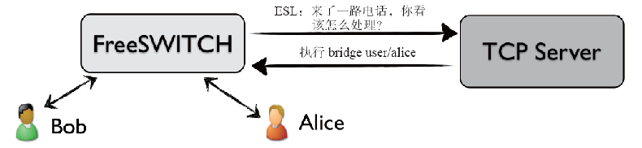
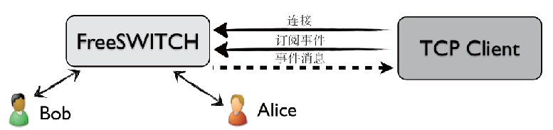
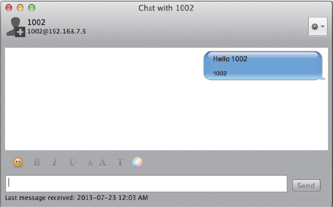

# 第01章 PSTN与VoIP基础
# 第02章 PSTN、PBX及呼叫中心业务
# 第03章 初识FreeSWITCH
# 第04章 运行FreeSWITCH
# 第05章 FreeSWITCH架构
# 第06章 拨号计划
# 第07章 SIP协议
# 第08章 媒体
# 第09章 SIP模块
# 第10章 基本技能
# 第11章 基本功能与实现
# 第12章 高级功能与配置实例
# 第13章 FreeSWITCH与FreeSWITCH对接
# 第14章 FreeSWITCH与其他设备或系统对接
# 第15章 其他技巧与实例
# 第16章 嵌入式脚本
# 第17章 嵌入式及HTTP开发
# 第18章 Event Socket

与Lua之类的嵌入式语言不同，通过Event Socket方式，可以使用运行在FreeSWITCH外部的程序控制FreeSWITCH。Event Socket是操控FreeSWITCH的“瑞士军刀”。它可以通过Socket方式使用FreeSWITCH提供的所有的App程序和API命令。由于绝大多数程序语言都支持Socket，因而它几乎可以跟任何语言开发的程序通信，也就是说，它几乎可以跟任何系统进行集成。

另外，使用Event Socket的一点好处是，它避免了开源许可证的兼容性问题。开源许可证种类繁多，各有特点，如有的对开放源代码要求高些，有的对商业应用限制少些。FreeSWITCH使用MPL 1.1许可证发布，而有些开源许可证（典型的如GPL）与它是不兼容的，因而，如果FreeSWITCH与其他软件或库混合编译就可能遇到许可证兼容方面的问题。通过使用Event Socket与其他系统对接，其他任何许可证的软件或系统都是以独立的程序存在的，这样就避免了潜在的许可证兼容问题。

FreeSWITCH使用SWIG [1]来支持多语言。简单来讲，FreeSWITCH用C语言写了一些库函数，通过SWIG包封装成其他语言接口。现在已知FreeSWITCH支持的语言有C、Perl、PHP、Python、Ruby、Lua、Java、Tcl，以及由Managed支持的.Net平台语言如C#、VB.NET等。

其实，Event Socket并没有提供什么新的功能，只是提供了一个开发接口，所有的通道处理及媒体控制都是由FreeSWITCH内部提供的App和API来完成的。

[1] Simplified Wrapper and Interface Generator，即简单包装及接口生成器，用于帮助使用C或C++语言写的程序生成其他高级语言的接口。参见：http://www.swig.org/。

## 架构

Event Socket [1]有两种模式：内连（Inbound）模式和外连（Outbound）模式。注意，这里所说的内和外都是针对FreeSWITCH而言的。

### 外连模式

如图18-1所示，FreeSWITCH作为一个TCP客户端连接到一个TCP Server上。那么这个TCP Server是谁呢？它是需要用户自己去实现的，实际上这就是用户需要开发的部分。在这个服务器里，用户可以实现自己的业务逻辑，以及连接数据库获取数据帮助决策等。



<center>图18-1　Outbound ESL示意图</center>

那么，怎么让FreeSWITCH去连接你的TCP Server呢？回想一下第7章。FreeSWITCH是一个B2BUA，当Bob呼叫Alice时，首先电话会到达FreeSWITCH（通过SIP），建立一个单腿的Channel（a-leg），然后电话进入路由状态，FreeSWITCH查找Dialplan，然后可以通过以下动作建立一个到TCP Server的连接：

```xml
<action application="socket" data="127.0.0.1:8040"/>
```

到此为止，还是只有一个Channel。其中socket是一个App，它会先把这个Channel置为Park状态，然后FreeSWITCH作为一个TCP客户端连接到TCP Server上，把当前呼叫的相关信息告诉它，并询问下一步该怎么做。当然，这里FreeSWITCH跟TCP Server说的语言称为ESL，该语言只有它们两个人懂，与SIP及RTP没有任何关系。也就是说，TCP Server只是发布控制指令，并不实际处理语音数据。

接下来，TCP Server收到FreeSWITCH的连接请求后，进行决策，如果它认为Bob想要呼叫Alice（根据来话信息和主被叫号码判断），它就给FreeSWITCH发一个执行bridge App的消息，告诉它应该继续呼叫Alice（给Alice发SIP INVITE消息）。

在Bob挂机之前，FreeSWITCH会一直向TCP Server汇报Channel的相关信息，所以这个TCP Server就可掌握这路电话所有的详细信息，也可以在任何时间对它们发号施令。

Bob挂机后，与TCP Server的连接也会断开，并释放资源。读到这里，读者应该明白了。之所以叫做TCP Server，是因为它应该是一个服务器应用，永远在监听一个端口（在上面的例子中是8040）等待有人连接。如果需要支持多个连接，这个服务器就应该使用Socket的Select机制或做成多线程（多进程）的。

我们上面说过，所谓Inbound和Outbound都是针对FreeSWITCH而言的。由于在这种模式下，FreeSWITCH要向外连接到TCP Server，因此称为外连模式。

### 内连模式

内边模式如图18-2所示。



<center>图18-2　Inbound ESL示意图</center>

在内连模式下，FreeSWITCH作为一个服务器，而用户的程序可以作为一个TCP Client主动连接到FreeSWITCH上。同样，FreeSWITCH允许多个客户端连接。每个客户端连接上来以后，可以订阅FreeSWITCH的一些内部事件。上面我们说过，FreeSWITCH要通过EventSocket向外部发送信息，这些信息就是以事件的形式体现的。同样，在内部好多功能也是事件驱动的。

用户的TCP Client收到这些事件后，可以通过执行App和API来控制FreeSWITCH的行为。

对于外连模式来讲，由于Socket来自一个App，而且它所连接的TCP Server也像是这个App功能的一部分，它们在Alice这个Channel的内部工作，与之相连的TCP Server发布的命令通常也是让FreeSWITCH执行一些App。只是在使用bridge APP桥接到Bob后这个Socket Server又好像是一个中间人或第三者。

对于内连模式，很明显外部的TCP Client是一个第三者，它通常不是Channel的一部分，而是监听到一个感兴趣的事件以后，通过API（uuid_一族的API）来对Channel进行操作。

[1] 参见http://wiki.freeswitch.org/wiki/Event_Socket。

## Event Socket协议

无论是上一节说的哪种模式，FreeSWITCH都要跟外部的程序“交流思想”，这就要求它们说同一种语言。上面我们为了区分SIP、RTP等协议，说这是一种方言。在此，我们姑且称这种方言为ESL（Event Socket Language，实际上ESL是Event Socket Library，即Event Socket库的缩写）。

ESL协议是纯文本的协议。它的设计思想来自于大家熟悉的HTTP协议及SIP协议 [1]。如果对这些协议还不熟悉，可以翻回第7章看看。这里再稍微啰嗦一点点─该协议的特点就是大部分消息（一些命令除外）都有一些字段组成的消息头（Header），某些消息有消息体（Body），某些则没有。消息头中有一个名为Content-Length的字段，其标志了消息体的长度。消息头和消息体之间用两个回车换行符“\r\n\r\n”隔开。

用户程序（TCP Server/Client）可以使用sendmsg发送App或直接发送其他API命令，此外还有其他相关的认证、订阅事件等操作指令。

下面我们先来看两个外连和内连的例子，然后简单介绍一下EventSocket协议的内容。

### 外连

我们使用如下Dialplan进行测试：

```xml
<extension name="socket">
  <condition field="destination_number" expression="^1234">
    <action application="socket" data="localhost:8040 async full"/>
  </condition>
</extension>
```

当电话呼叫1234时，FreeSWITCH便会使用Outbound模式，使用socket App启动Socket连接。注意这里的两个参数async和full。其中，async表示异步执行。默认是同步的，比如在同步状态下，如果FreeSWITCH正在执行playback操作，而playback是阻塞的，因而在playback完成之前向它发送任何消息都是不起作用的，但异步状态可以进行更灵活的控制。当然，异步状态增加了灵活性的同时也增加了开发的复杂度，读者在实际的开发过程中可以对比一下它们的异同。另一个参数full指明可以在外部程序中使用全部的API，默认只有少量的API是有效的。至于哪些API跟这个参数相关，也留给读者自行练习。总之一句话，如果你不确定，那么加上full是没有错的。

好了，电话来了，由于我们还没有准备好TCP Server，因此连接会失败，电话就断掉了。

下面我们需要实现一个TCP Server，在这里我们使用netcat这个工具来讲解。

netcat是一般Linux系统自带的一个工具，它可以启动一个Socket，做服务器或客户端。如果作为客户端，你可以认为它类似于你更熟悉的telnet命令。虽然它叫netcat，但程序的名字是nc。如果系统默认没有安装，可以尝试使用下列命令来安装：

```shell
apt-get install netcat       # Ubuntu/Debian
yum install netcat           # CentOS
yum install nc               # 其他？
```

打开一个终端A，启动一个ServerA，监听8040端口（其中-l表示监听，即listen；-k表示客户端断开后继续保持监听。注意，有些版本的netcat参数稍有不同，使用时请查看相关的man文档）。

```shell
nc -l -k localhost 8040
```

打开另一个终端（Terminal）B，启动一个Client B连上它：

```shell
nc localhost 8040
```

然后在这个客户端中打些字，回车，在终端A中就应该能看到你输入的文字了。

好了，接下来按Ctrl+C退出终端B，到这里就该让FreeSWITCH上场了，即我们用FreeSWITCH来替换终端B。

拿起电话拨打1234，电话路由到Socket，FreeSWITCH就会连到ServerA上。这时候你听不到任何声音，因为Channel处于Park状态。但是你在ServerA里也看不到任何连接的迹象。不过，如果你打开另一个终端，使用如下命令可以显示8040端口已处于连接（ESTABLISHED）状态。

```shell
$ netstat -an|grep 8040
tcp4       0      0  127.0.0.1.8040         127.0.0.1.60588        ESTABLISHED
tcp4       0      0  127.0.0.1.60588        127.0.0.1.8040         ESTABLISHED
tcp4       0      0  127.0.0.1.8040         *.*                    LISTEN
```

好了，现在回到终端A，输入connect然后打两下回车，奇迹出现了吧？你应该会看到类似下面的输出：

```
Event-Name: CHANNEL_DATA
Core-UUID: 4bfcc9bd-6844-4b45-96a7-4feb2a4f9795
...
```

这便是FreeSWITCH发给ServerA的第一个事件消息，里面包含了该Channel所有的信息。下面该Channel何去何从就完全看你的了。比如，发送如下消息给它放段音乐（local_stream://moh）：

```
sendmsg
call-command: execute
execute-app-name: playback
execute-app-arg: local_stream://moh
```

建议你直接粘贴上面的命令到ServerA的窗口里，记得完成后按两下回车。sendmsg的作用就是发送一个App命令（这里是playback）给FreeSWITCH，然后FreeSWITCH就乖乖地照着做（执行该App）了。如果你玩够了，就把上面的playback换成hangup再发一次，电话就挂断了。这些命令就跟直接写到Dialplan里一样，不同的是现在是由你来控制，以后你可以用自己的程序控制什么时候该发什么命令。

### 内连

FreeSWITCH启动后会启动一个EventSocket TCP Server，IP、端口号和密码均可以在conf/autoload_configs/event_socket.conf.xml文件里配置。

还记得上面我们在终端B里用nc做客户端吧？在此，我们还使用nc作为客户端，使用以下命令连接FreeSWITCH：

```shell
nc localhost 8021
```

连接上以后，你会看到如下消息：

```
Content-Type: auth/request
```

这表示已经连接上FreeSWITCH的Socket了，并且它告诉你，应该输入密码进行验证。这时我们输入“auth ClueCon”，记得按两下回车。FreeSWITCH默认监听在8021端口上，默认的密码是ClueCon，因此我们在上面使用了这些默认值，当然需要的话也可以根据情况在conf/autoload_configs/event_socket.conf.xml中修改。

如果一切顺利的话，我们就已经作为一个客户端连接到FreeSWITCH上了。可以输入下列命令试一试（记得每个命令后面都按两下回车）：

```
api version
api status
api sofia status
api uptime
```

你肯定经常在fs_cli中使用这些命令，只不过在此我们在每个命令前面多加了个“api”。其实fs_cli作为一个客户端也是使用ESL与FreeSWITCH通信的，只是它帮你做了好多事，你不用手工敲一些协议细节了。但在这里，我们手工输入各种命令，更有助于理解这些细节，例如：

```
api status
Content-Type: api/response
Content-Length: 327
UP 0 years, 0 days, 17 hours, 13 minutes, 19 seconds, 959 milliseconds, 304 microseconds
FreeSWITCH (Version 1.2.11 git b9c9d34 2013-07-20 19:06:40Z) is ready
27 session(s) since startup
0 session(s) - 0 out of max 30 per sec peak 2 (0 last 5min)
1000 session(s) max
min idle cpu 0.00/100.00
Current Stack Size/Max 240K/8192K
```

键入如下命令接收事件：

```
event plain ALL
```

可以订阅所有的事件，当然如果你看不过来可以少订一些。比如，下列命令仅订阅CHANNEL_CREATE事件：

```
even plain CHANNEL_CREATE
```

它等效于在fs_cli中输入以下命令：

```
/event plain CHANNEL_CREATE
```

### Event Socket命令详解

我们上面举了几个简单的例子，用到了几个命令。实际上，ESL还提供了更多的命令，用于各种控制。下面列举了大部分在Event Socket中可以使用的命令。

1. auth

对于Inbound连接来说，auth是第一个需要发送的命令，用于向FreeSWITCH认证，格式如下：

```
auth <password>
例如：
auth ClueCon
```

实际的密码（这里是Cluecon）是在conf/autoload_configs/event_socket.conf.xml中定义的。

2. api

api命令上面已经讲过了，它用于执行FreeSWITCH的API，语法如下：

```
api <command> <args>
```

其中，command和args分别是FreeSWITCH实际的命令和参数，上面已经举过例子，在此就不多讲了。

3. bgapi

api命令是阻塞执行的，因此，对于执行时间比较长的API命令（如originate），会有一段时间得不到响应结果，影响实时接收事件。因此，可以使用bgapi将这些命令放到后面执行，语法是：

```
bgapi <command> <args>
```

上述命令会立即执行，在后台建立一个任务（Job），并返回一个Job-UUID，如：

```
Content-Type: command/reply
Reply-Text: +OK Job-UUID: c7709e9c-1517-11dc-842a-d3a3942d3d63
```

当真正需要执行的API命令返回后，FreeSWITCH会产生一个BACKGROUND_JOB事件，该事件带了原先的Job-UUID以及命令执行的结果。因而客户端可以通过匹配Job-UUID知道上一次命令的执行结果。

另外，FreeSWITCH也允许客户端提供自己的Job-UUID，这样匹配起来就更容易一些（但客户端需要保证产生的Job-UUID要全局唯一），命令格式是：

```
bgapi <command> <args>
Job-UUID: <uuid>
```

如下面的例子：

```
event plain BACKGROUND_JOB       (订阅BACKGROUND_JOB事件)
Content-Type: command/reply     (上述指令的返回结果)
Reply-Text: +OK event listener enabled plain
bgapi status                    (使用bgapi执行status命令)
Job-UUID: My-UUID               (指定Job-UUID)
Content-Type: command/reply     (上述指令的返回结果)
Reply-Text: +OK Job-UUID: My-UUID
Job-UUID: My-UUID
Content-Length: 852             (在此我们收到一条消息，长度是852字节)
Content-Type: text/event-plain  (消息类型是text/event-plain)
Event-Name: BACKGROUND_JOB      (消息中的内容是一个事件—Event，它的名字是BACKGROUND_JOB)
...                             
省略一些事件的消息头)
Event-Sequence: 9308
Job-UUID: My-UUID               (从该头域中可以看到Job-UUID与我们在上述bgapi中指定的匹配)
Job-Command: status             (该事件的正文本部分就包含了status命令的输出)
Content-Length: 325             (事件正文部分的长度，接下来是事件正文，即status命令的输出)
UP 0 years, 0 days, 17 hours, 1 minute, 27 seconds, 717 milliseconds, 221 microseconds
FreeSWITCH (Version 1.2.11 git b9c9d34 2013-07-20 19:06:40Z) is ready
27 session(s) since startup
0 session(s) - 0 out of max 30 per sec peak 2 (0 last 5min)
1000 session(s) max
min idle cpu 0.00/100.00
Current Stack Size/Max 240K/8192K
```

4. linger和nolinger

在外连模式下，当一个Channel挂断时，FreeSWITCH会断开与TCP Server的Socket的连接。这时，可能还有与该Channel相关的事件没有来得及发送到TCP Server上，因而会“丢失”事件。为避免这种情况发生，TCP Server可以明确告诉FreeSWITCH希望它能在断开之前“逗留”（linger）一段时间，以等待把所有事件都发完。格式如下：

```
linger <seconds>
```

例如：

```
linger 10
```

如果开启了linger又后悔了，可以再用nolinger命令撤销，该命令没有参数。

5. event

event用于订阅事件。让FreeSWITCH把相关的事件发送过来。格式是：

```
event [type] <events>
```

其中，type（即事件类型）有plain、json和xml三种，默认为plain，即纯文本；events参数可以指定事件的名字，或者使用ALL表示订阅全部事件。订阅全部事件的命令如下：

```
event plain ALL
```

仅订阅部分事件，事件名字之间以空格隔开：

```
event plain CHANNEL_CREATE CHANNEL_ANSWER CHANNEL_HANGUP_COMPLETE
```

要想订阅CUSTOM事件该怎么做呢？CUSTOM事件即自定义事件，它是一类特殊的事件，它主要是为了扩充FreeSWITCH的事件类型，它具体的类型是在Subclass中指定的，如下面的指令指定订阅Subclass为“sofia::register”的事件：

```
event plain CUSTOM sofia::register
```

可以一次订阅多个CUSTOM事件，如：

```
event plain CUSTOM sofia::register sofia::unregister sofia::expire
```

也可以使用多个event命令混合订阅，如：

```
event plain CHANNEL_ANSWER CHANNEL_HANGUP
event plain CHANNEL_BRIDGE CUSTOM sofia::register sofia::unregister
```

但参数中一旦出现了CUSTOM，后面就不能有普通的事件类型了。如下面的订阅方法是达不到预期的效果的（FreeSWITCH会把CHANNEL_ANSWER当成CUSTOM事件的Subclass对待，因而不是你想要的）：

```
event plain CHANNEL_CREATE CUSTOM sofia::register CHANNEL_ANSER
```

另外，CUSTOM事件必须逐一明确订阅，如下面这种订阅形式是不对的：

```
event plain CUSTOM ALL
```

其他的例子还有：

```
event json CHANNEL_CREATE
event xml CHANNEL_CREATE
event plain DTMF
event plain ALL
```

最后，值得一提的是，HEARTBEAT是一个特殊的事件，它每20秒就产生一次，用于汇报FreeSWITCH的当前状态。有时候可以用它做心跳，如果超过20秒没收到事件，就可以认为网络或FreeSWITCH异常。下面是HEARTBEAT事件的三种不同输出格式：

json格式：

```json
Content-Length: 939
Content-Type: text/event-json
{
    "Event-Name":   "HEARTBEAT",
    ...
    "Event-Info":   "System Ready",
    "Up-Time":  "0 years, 0 days, 22 hours, 19 minutes, 14 seconds, ...
    ...
}
```

XML格式：

```xml
Content-Length: 1432
Content-Type: text/event-xml
<event>
  <headers>
    <Event-Name>HEARTBEAT</Event-Name>
    ...
    <Event-Info>System%20Ready</Event-Info>
    <Up-Time>0%20years,%200%20days,%2022%20hours,%2019%20minutes,%2034%20seconds,...</Up-Time>
    ...
  </headers>
</event>
```

PLAIN（纯文本）格式：

```plain
Content-Length: 848
Content-Type: text/event-plain
Event-Name: HEARTBEAT
...
Event-Info: System%20Ready
Up-Time: 0%20years,%200%20days,%2022%20hours,%2019%20minutes,%2054%20seconds,...
...
```

6. myevents

myevents是event的一种特殊情况，它主要用于Outbound模式中。在Outbound模式中，对于每一个呼叫（对应一个Channel），FreeSWITCH都会向外部的TCP Server请求以建立一个新的连接。外部的TCP Server就可以通过myevents订阅与该Channel（UUID）相关的所有事件。使用的格式为：

```
myevents <type><UUID>
```

当然，myevents也支持json及XML形式，如：

```
myevents
myevents json
myevents xml
```

当然，在Inbound模式中也可以调用myevents，这样它看起来类似于一个Outbound模式的连接，但它要指定UUID，原因是显而易见的，如：

```
myevents 289fe829-af62-47be-9a59-7519a77d0d40
```

7. divert_events

还有一类特殊的事件，它们是作为InputCallback产生的。那么什么时候会产生Input-Callback呢？回忆一下16.2.3节，当Channel上通过setInputCallback()函数安装了相关的回调函数并遇到某些事件，如收到用户按键（DTMF）或收到语音识别的结果（DETECTED_SPEECH），就会产生InputCallback这样的事件，并回调指定的回调函数，但这些InputCallback默认只能在嵌入式脚本的回调函数中捕获。通过使用divert_events，就能将这些事件转发到Event Socket连接上来，进而在通过Event Socket连接的外部程序中也能收到相关事件。使用格式是：

```
divert_events on          # 开启
divert_events off         # 关闭
```

8. filter

filter用于安装一个过滤器。这里的过滤不是“滤出”，而是“滤入”，即把符合过滤条件的过滤进来，也就是我们要收到它们。可以同时使用多个过滤器，使用格式是：

```
filter <EventHeader> <ValueToFilter>
```

例如，下面的例子与myevent<uuid>的作用是相同的：

```
event plain all
filter Unique-ID <uuid>
```

又如，下面的例子会订阅所有事件，但只接收匹配主叫号码是1001的事件：

```
event plain all
event filter Caller-Caller-ID-Name 1001
```

为了理解滤入的概念，可以看下面的例子以加深印象，它可以接收3个Channel事件：

```
event plain all
filter Unique-id uuid1
filter Unique-ID uuid2
filter Unique-ID uuid3
```

如果过滤器写错了，或不想使用某些过滤器了，则可以将其取消掉，如：

```
filter delete                    # 取消所有的过滤器
filter delete Unique-ID uuid2    # 仅取消与uuid2相关的过滤器
```

9. nixevent与noevent

nixevent是event的反义词，与event的语法一样，只是取消某些已订阅的事件。如：

```
nixevent CHANNEL_CREATE
nixevent all
```

另外，还有一个noevent命令用于简单取消使用event订阅的所有事件，相当于“nixevent all”。

10. log

跟使用event订阅事件类似，log用来订阅日志，它的使用格式是：

```
log <level>
```

其中level级别我们在6.1.4节已经讲过了，如：

```
log info
log 6
```

下面是一个完整的例子。这个例是在开启了info级别的日志以后打了一个电话，此时会收到很多日志信息，下面是两条信息：

```shell
$ nc 127.0.0.1 8022
Content-Type: auth/request
auth ClueCon
Content-Type: command/reply
Reply-Text: +OK accepted
log info
Content-Type: command/reply
Reply-Text: +OK log level info [6]
Content-Type: log/data
Content-Length: 141
Log-Level: 5
Text-Channel: 3
Log-File: switch_channel.c
Log-Func: switch_channel_set_name
Log-Line: 1030
User-Data: dfe873c8-f418-4807-8f45-0c87402fdebd
2013-07-23 00:22:17.293556 [NOTICE] switch_channel.c:1030 New Channel sofia/internal/1002@192.168.7.5 [dfe873c8-f418-4807-8f45-0c87402fdebd]
Content-Type: log/data
Content-Length: 103
Log-Level: 6
Text-Channel: 3
Log-File: mod_dialplan_xml.c
Log-Func: dialplan_hunt
Log-Line: 558
User-Data: dfe873c8-f418-4807-8f45-0c87402fdebd
2013-07-23 00:22:17.353573 [INFO] mod_dialplan_xml.c:558 Processing Seven <1002>->s in context default
```

11. nolog

log的反义词，关闭使用log命令订阅的日志，具体的使用方法很简单，这里不再介绍。

12. exit

告诉FreeSWITCH关闭Socket连接。FreeSWITCH收到该命令后会主动关闭Socket连接。

13. sendevent

通过sendevent可以向FreeSWITCH的事件系统发送事件。使用格式是：

```
sendevent <event-name>
```

比如，你可以发送一个NOTIFY消息：

```
sendevent NOTIFY
profile: internal
event-string: check-sync
user: 1002
host: 192.168.7.5
content-type: application/xml
content-length: 29
<xml>FreeSWITCH IS COOL</xml>
```

FreeSWITCH收到NOTIFY消息后，将启用内部处理机制，最后它可能会生成一个SIP NOTIFY消息，如：

```
NOTIFY sip:1002@192.168.7.5:32278;rinstance=3db08ce44e5166a4 SIP/2.0
Via: SIP/2.0/UDP 192.168.7.5;rport;branch=z9hG4bKXDtD32g0N9atg
Max-Forwards: 70
From: <sip:1002@192.168.7.5>;tag=ZF9SFyaUHeZ4p
To: <sip:1002@192.168.7.5>
...
Event: check-sync
Subscription-State: terminated;reason=noresource
Content-Type: application/xml
Content-Length: 29
<xml>FreeSWITCH IS COOL</xml>
```

当然，也可以使用它发送MESSAGE消息，如：

```
sendevent SEND_MESSAGE
profile: internal
user: 1002
host: 192.168.7.5
content-type: text/plain
content-length: 10
Hello 1002
```

上述命令将会产生如下的SIP消息：

```
send 623 bytes to udp/[192.168.7.5]:32278 at 16:01:23.686473:
------------------------------------------------------------------------

MESSAGE sip:1002@192.168.7.5:32278;rinstance=3db08ce44e5166a4 SIP/2.0
Via: SIP/2.0/UDP 192.168.7.5;rport;branch=z9hG4bK085Q8K3aD4DjK
Max-Forwards: 70
From: <sip:1002@192.168.7.5>;tag=11UBKmc2B0Bae
To: <sip:1002@192.168.7.5>
...
Content-Type: text/plain
Content-Length: 10
Hello 1002
```

笔者使用Bria注册的SIP客户端收到消息的界面如图18-3所示。



<center>图18-3　Bria收到SIP MESSAGE后的显示</center>

当然，在实际使用中更多的是产生CUSTOM的事件，可以自定义一些事件类型。使用这种方式甚至可以把FreeSWITCH当成一个消息队列（Message Queue）来用，如你可以启动一个客户端订阅以下消息：

```
event plain CUSTOM freeswitch:book
```

我们可以在另外的客户端上发送一条消息，如：

```
sendevent CUSTOM
Event-Subclass: freeswitch::book
content-type: text/plain
content-length: 44
This Message comes from the FreeSWITCH Book!
```

我们可以在订阅该消息的客户端上收到如下信息：

```
Content-Length: 688
Content-Type: text/event-plain
Event-Subclass: freeswitch%3A%3Abook
Command: sendevent%20CUSTOM
...
content-type: text/plain
Content-Length: 44
This Message comes from the FreeSWITCH Book!
```

[1] 关于这种类型的协议，可以参考一下http://www.ietf.org/rfc/rfc2822.txt，但ESL并不是完全遵循该RFC。

## Event Socket库

事情永远都不像看起来那么简单。如果所有协议都需要手工敲的话，那电话一多你就忙不过来了。不过，这些早就有人帮你做好了，这就是我们下面要讲的ESL（Event Socket Library，Event Socket库）。ESL提供了一些库函数，通过这些库函数可以很方便地使用ESL协议与FreeSWITCH交互，进而控制FreeSWITCH的各种功能。

在上面的实验中，你应该已注意到原始的ESL协议中有很多类似下面的输出：

```
Content-Type: command/reply
```

这些是针对你输入命令的响应，如果同时你订阅了事件的话还能收到很多事件。再如果你有很多通话，而同时你又要不停地控制它们，这时会不会很凌乱？会不会产生竞争条件（Race Condition）？答案是不会，因为ESL都帮你做好了，它将相关的功能模块都封装成了函数，而且有各种语言的版本。当然，对于不支持的语言，就需要自己写了。比如，笔者在几年前学习Flex时就曾自己写了一个Flex版本的ESL库 [1]。

虽然是实际应用中一般不需要知道上面的ESL协议的具体细节，但笔者相信了解了这些协议的具体内容，有助于理解ESL。

### Event Socket示例

言归正传，其实学习编程序最好的办法就是看别人写的代码。因此，下面我们先来看几个使用ESL的例子，然后再对ESL中提供的函数进行说明。

1. Ruby客户端

下面是一个使用Ruby语言通过ESL控制FreeSWITCH的例子。不管你是否熟悉Ruby，以下脚本都是很好懂的，脚本内容如下：

```
require 'ESL'
con = ESL::ESLconnection.new('127.0.0.1', '8021', 'ClueCon')
esl = con.sendRecv('api sofia status')
puts esl.getBody
```

上述脚本只有短短的4行代码，首先它加载了ESL库，然后连接到FreeSWITCH，接着执行sofia status命令，最后将结果输出到控制台。

2. C语言客户端示例

在源代码目录的libs/esl/目录下有个testclient.c的ESL客户端例子，编译运行它后会使用Inbound模式连接到FreeSWITCH。对于下面的testclient.c的内容，为了讲解方便我们进行了简单的修改并增加了中文注释：

```c
int main(void)
{
    // 初始化一个 handle，用于标志到FreeSWITCH的Socket连接
    esl_handle_t handle = {{ 0 }};
    // 连接服务器，如果成功 handle 就代表连接成功了
    esl_connect(&handle, "localhost", 8021, NULL, "ClueCon");
    // 发送一个命令，并接收返回值
    esl_send_recv(&handle, "api status\n\n");
    // last_sr_event应该是 last server response event，即针对上面命令的响应
    // 如果在此之前收到事件（在本例中不会，因为没有订阅），事件会存到一个队列里，不会发生竞争条件
    if (handle.last_sr_event&& handle.last_sr_event->body) {
        // 打印返回结果
        printf("%s\n", handle.last_sr_event->body);
    } else {
        // 对于api和bgapi来说（上面已经将命令写死了），应该不会运行到这里，但其他命令可能
        // 会到这里
        printf("%s\n", handle.last_sr_reply);
    }
    // 断开连接
    esl_disconnect(&handle);
    return 0;
}
```

可以看出，该程序很简单，它运行之后向FreeSWITCH建立一个连接，运行一个API命令，然后输出命令的执行结果。

3. C语言服务器示例

在testclient.c所在目录中有一个testserver.c，其运行于Outbound模式，是多线程的，每次有电话进来时，通过Dialplan路由到socket App。该App便会从FreeSWITCH中向testserver发起一个TCP连接。

我们先从main函数开始看。首先它调用esl_global_set_default_logger函数设置日志级别（代表DEBUG级别，即最大级别，这样能看到详细的日志，包括所有协议的细节）。然后它通过esl_listen_threaded启动一个Socket监听本地回环地址（localhost）的8040端口。如果有连接（从FreeSWITCH）到来，它便回调mycallback函数为该连接服务。其中，NULL是一个空指针，该参数的位置是一个无类型（void*）的指针，即允许你传入任何类型的指针，该指针将作为mycallback函数的参数（user_data）在回调中携带 [2]。

```c
int main(void)
{
    esl_global_set_default_logger(7);
    esl_listen_threaded("localhost", 8040, mycallback, NULL, 100000);
    return 0;
}
```

下面我们介绍回调函数，该函数比较长，因此为了描述方便我们加了行号。注意，这里的行号仅为描述方便，与原始文件中的行号不同。

首先，第1行为函数的定义，它有三个参数，分别是服务器端的Socket标志、客户端的Socket标志、一个连接地址，以及一个用户私有数据。第3行初始化了一个句柄，用于标志本次ESL连接，其他几个变量的意义我们后面再说。具体代码如下：

```c
01 static void mycallback(esl_socket_t server_sock, esl_socket_t client_sock, struct sockaddr_in *addr, void *user_data)
02 {
03     esl_handle_t handle = {{ 0 }}; // 初始化一个句柄，用于标志一个ESL连接
04     int done = 0;
05     esl_status_t status;
06     time_t exp = 0;
```

第7行，将用于标志ESL连接的handle与传入的客户端的Socket绑定，这样就可以与客户端之间相互收发消息了；第8行，打印一条日志；第11行，添加一个过滤器（filter），只收取与本次连接的Channel相关的事件（与本次连接的Channel UUID相同的事件）；第12～15行，订阅各种类型的事件，至此我们应该能收到跟本Channel相关的事件了。具体代码如下：

```c
07    esl_attach_handle(&handle, client_sock, addr); // 将handle与socket绑定
08    esl_log(ESL_LOG_INFO, "Connected! %d\n", handle.sock);
11    esl_filter(&Handle, "unique-id", esl_event_get_header(handle.info_event, 
                 caller-unique-id"));
12    esl_events(&handle, ESL_EVENT_TYPE_PLAIN, "SESSION_HEARTBEAT CHANNEL_NSWER"
13        " CHANNEL_ORIGINATE CHANNEL_PROGRESS CHANNEL_HANGUP "
14        " CHANNEL_BRIDGE CHANNEL_UNBRIDGE CHANNEL_OUTGOING CHANNEL_EXECUTE"
15        " CHANNEL_EXECUTE_COMPLETE DTMF CUSTOM conference::maintenance");
```

第19行，发送一个linger命令开启逗留模式。如果不开启该模式，则主叫挂机后，FreeSWITCH会立即断开它主动建立的Socket，这样会造成一些后续的事件收不到，如CHANNEL_HANGUP_COMPLETE、CHANNEL_DESTROY等。逗留模式的目的就是告诉FreeSWITCH晚一些断开这个Socket。后面我们还会讲到linger的用法。第20行，执行answer App对来话进行应答（跟在Dialplan中类似），然后，在第21行将来话送入一个会议。具体代码如下：

```c
19    esl_send_recv(&handle, "linger");
20    esl_execute(&handle, "answer", NULL, NULL);
21    esl_execute(&handle, "conference", "3000@default", NULL);
```

接下来是一个无限循环，用于不断地接收事件。在第22行，我们用的接收事件函数esl_recv_timd是非阻塞的，如果在1秒内没有收到任何事件，它就会返回，然后程序进入循环体。在第23行，检测done变量，它是个结束标志，用于结束循环，在满足一定的条件下，将在第32行对其进行赋值。在24行，判断，即如果当前的时间超过exp变量指定的值，则退出循环（关于退出条件我们后面再讲）。一般情况下，程序会执行到第25行，如果成功收到一条消息，则在第26行取出消息的类型。在此，它忽略所有的消息，直到在满足第27行的条件（挂机时将收到该消息）。如果收到挂机消息，则第28行将取出FreeSWITCH发过来的关于挂机的相关信息，并在第29行打印一条日志。具体代码如下：

```c
22    while((status = esl_recv_timed(&handle, 1000)) != ESL_FAIL) {
23        if (done) {
24            if (time(NULL) >= exp) { break; }
25        } else if (status == ESL_SUCCESS) {
26            const char *type = esl_event_get_header(handle.last_event, content-type");
27            if (type && !strcasecmp(type, "text/disconnect-notice")) {
28                const char *dispo = esl_event_get_header(handle.last_event, 
                  content-disposition");
29                esl_log(ESL_LOG_INFO, "Got a disconnection notice 
                  dispostion: %s]\n", dispo ? dispo : "");
```

由于我们使用了逗留模式，因此FreeSWITCH给我们返回的消息中将包含linger字符（或者从打印出的日志中看到），因此，我们设置done变量为1，并于第35行将exp变量的值设为5秒，也就是说，在5秒之后循环中将匹配第23～24行的条件。具体代码如下：

```c
31                if (!strcmp(dispo, "linger")) {
32                    done = 1;
33                    // 挂机后，可能还有后续的事件，我们多等几秒钟
34                    esl_log(ESL_LOG_INFO, "Waiting 5 seconds for any remaining 
                               events.\n");
35                    exp = time(NULL) + 5;
36                }
37            }
38        }
39    }
```

上面的消息接收循环完毕后将打印一条日志（第40行），并断开连接（第41行，这时很可能连接已经断开了，这样做只是为了保险）。

```c
40    esl_log(ESL_LOG_INFO, "Disconnected! %d\n", handle.sock);
41    esl_disconnect(&handle);
42 }
```

总之，该程序也很简单，它启动后监听一个端口，当FreeSWITCH中有来话路由到它时便启动一个新线程为新的Channel进行服务（具体的服务就是应答），并将来话送入一个会议。由于它是多线程的，因而可以同时为很多来话服务。

4. 使用ESL发送SIP MESSAGE消息

Wiki [3]上有一个使用Perl发送MESSAGE的应用，这里我们用C改写一下（在testclient基础上修改的）。

首先，前三行装入了必要的头文件。程序比较简单，只有一个main函数（第5行），并于第7～9行初始化了一些变量。程序内容如下。

```c
01 #include <stdio.h>
02 #include <stdlib.h>
03 #include <esl.h>
04
05 int main(void)
06 {
07     esl_handle_t handle = {{ 0 }};
08     struct esl_event *event;
09     struct esl_event_header header;
```

第10行初始化一个CUSTOM类型的事件，它的子类型（Subclass）是SMS::SEND_MESSAGE。第11～17行则给该事件增加各种必要的参数。关于这些参数的具体含义我们就不多讲了，只需要知道，FreeSWITCH收到包含这些参数的事件后，将会给1000@192.168.0.7用户发送一个文本消息，消息内容是在第17行定义的。具体代码如下：

```c
10     esl_event_create_subclass(&event,  ESL_EVENT_CUSTOM, "SMS::SEND_MESSAGE");
11     esl_event_add_header_string(event, ESL_STACK_BOTTOM, "to", "1000@192.168.0.7");
12     esl_event_add_header_string(event, ESL_STACK_BOTTOM, "from", "seven@192.168.0.7");
14     esl_event_add_header_string(event, ESL_STACK_BOTTOM, "sip_profile", "internal");
15     esl_event_add_header_string(event, ESL_STACK_BOTTOM, "dest_proto", "sip");
16     esl_event_add_header_string(event, ESL_STACK_BOTTOM, "type", "text/plain");
17     esl_event_add_body(event, "Hello");
```

第18行，建立到FreeSWITCH的连接。第19行，发一个命令试试连接是否正常。第20行，如果连接正常的话，打印一下上述命令的输出结果（第21行），并于第23行将刚才构造的事件发送出去。当然，要记得在第24行释放事件占用的内存。当然，如果第19行执行失败的话，程序会执行到第29行，打印相关信息。具体代码如下：

```c
18    esl_connect(&handle, "localhost", 8021, NULL, "ClueCon");
19    esl_send_recv(&handle, "api version\n\n");
20    if (handle.last_sr_event&& handle.last_sr_event->body) {
21        printf("%s\n", handle.last_sr_event->body);
22        printf("sending event....\n");
23        esl_sendevent(&handle, event);
24        esl_event_destroy(&event);
28    } else {
29        printf("%s\n", handle.last_sr_reply);
30    }
```

最后，断开连接，程序正常返回（第31～32行）。具体代码如下：

```c
31    esl_disconnect(&handle);
32    return 0;
33 }
```

执行以上程序后，在1000这个SIP电话上将会收到一个Hello消息（如果该用户正常注册的话）。

### ESL函数说明

通过上面的几个简单的例子，相信读者已经对ESL有了一个基本的了解，下面我们就来详细看一下ESL里涉及的基本概念以及它提供的库函数。

18.2.3节中所讲的Event Socket命令对于我们理解各种基本概念是非常有用的。除此之外，FreeSWITCH也通过ESL库包装了大量的易于使用的函数，我们在18.3.1节也已经领略到一部分函数的风采了。

ESL本身与FreeSWITCH没有任何依赖关系，可以单独编译和使用。它在底层是使用C语言实现的，并通过swig包装成了其他程序语言惯用的格式。Wiki上的例子大部分都是以Perl和PHP语言编写的，为了方便读者比较，本节也给出了C语言对应的形式，以方便使用C语言开发的读者参考。即使不使用C语言而使用其他语言开发，对照原代码也便于发现在Wiki上找不到的函数原型及数据结构。

1. ESL对象

ESL对象是一个核心ESL的对象，它用于一些全局的设置。你可以使用如下函数设置打印日志的级别：

```
eslSetLogLevel($loglevel)
```

它的C语言定义如下：

```
ESL_DECLARE(void) esl_global_set_default_logger(int level);
```

这里的level是整数值，对应关系如下：

- 0为EMERG；
- 1为ALERT；
- 2为CRIT；
- 3为ERROR；
- 4为WARNING；
- 5为NOTICE；
- 6为INFO；
- 7为DEBUG。

2. ESL Event对象

ESL Event是一个事件对象，在C语言中的定义如下（在esl_event.h中定义）：

```c
/*! \brief Representation of an event */
struct esl_event {
    esl_event_types_t event_id;        /*! 事件ID (描述符) */
    esl_priority_t priority;           /*! 事件优先级 */
    char *owner;                       /*! 事件所有者 */
    char *subclass_name;               /*! 事件的子类型（Subclass） */
    esl_event_header_t *headers;       /*! 事件的头域，指向一个链表 */
    esl_event_header_t *last_header;   /*! 指向事件的最后一个头域 */
    char *body;                        /*! 事件的正文（内容） */
    void *bind_user_data;              /*! 事件绑定者提供的用户自定义数据 */
    void *event_user_data;             /*! 事件发送者绑定的用户自定义数据 */
    unsigned long key;                 /*! 唯一的键值*/
 struct esl_event next;                /*! 下一个事件的指针*/
int flags;                             /*! 标志 */
};
```

当从FreeSWITCH中收到一个事件后，你就得到一个事件对象。ESL定义了一些函数用于从该对象中获取信息或构造新的对象。下面我们来简单介绍。

- serialize([$format])。它可以将事件序列化成可读的形式，以冒号分隔的“名称:值”的形式给出。C语言定义如下：ESL_DECLARE(esl_status_t) esl_event_serialize(esl_event_t \*event, char \*\*str, esl_bool_t encode);

- setPriority([$number])。设置事件的级别。C语言定义如下：ESL_DECLARE(esl_status_t) esl_event_set_priority(esl_event_t \*event, esl_priority_t priority);

- getHeader($header_name)。从事件中获取头域的值。其C语言定义如下：ESL_DECLARE(char *) esl_event_get_header_idx(esl_event_t \*event, const char \*header_name, int idx);
    #define esl_event_get_header(_e, _h) esl_event_get_header_idx(_e, _h, -1)

- getBody()。从事件中获取正文：ESL_DECLARE(char *) esl_event_get_body(esl_event_t *event);

- getType()。取得事件的类型。在C语言中可以使用下列方式实现：esl_event_get_header(event, "content-type");

- addBody($value)。向事件中增加正文，可以调用多次。C语言定义如下：ESL_DECLARE(esl_status_t) esl_event_add_body(esl_event_t *event, const char *fmt, ...);

- setBody($value)。设置事件的正文，可以多次调用，但后者将覆盖前者。C语言定义如下：ESL_DECLARE(esl_status_t) esl_event_set_body(esl_event_t *event, const char *body);

- addHeader($header_name,$value)。向事件中增加一个头域。C语言定义如下：ESL_DECLARE(esl_status_t) esl_event_add_header_string(esl_event_t *event, esl_stack_t stack,const char *header_name, const char *data);

C语言中还有另一种形式，即使用类似printf的方式设置字符串的值：

```
ESL_DECLARE(esl_status_t) esl_event_add_header(esl_event_t *event,
    esl_stack_t stack, const char *header_name, const char *fmt, ...);
```

- delHeader($header_name)。从Event中删除头域。C语言定义如下：ESL_DECLARE(esl_status_t) esl_event_del_header_val(esl_event_t *event,    const char *header_name, const char *var);
    #define esl_event_del_header(_e, _h) esl_event_del_header_val(_e, _h, NULL)

- firstHeader()。将指针指向Event的第一个头域，并返回它的Key值。C语言中没有明确的定义，靠使用ESL Event的headers结构体成员实现。
- nextHeader()。移动指针指向下一个header，在调用该函数前必须先调用firstHeader()，同样在C语言中没有明确定义，靠访问esl_event_header结构体的next成员实现。

3. ESLconnection对象

ESLConnection对象维护与FreeSWITCH之间的连接，以发送命令并进行事件处理。在C语言中使用如下定义（在esl.h中）：

```c
typedef struct {
    struct sockaddr_storage sockaddr;
    struct hostent hostent;
    char hostbuf[256];
    esl_socket_t sock;
    /*! In case of socket error, this will hold the error description as reported 
    by the OS */
    char err[256];
    /*! The error number reported by the OS */
    int errnum;
    /*! The inner contents received by the socket. Used only internally. */
    esl_buffer_t *packet_buf;
    char socket_buf[65536];
    /*! Last command reply */
    char last_reply[1024];
    /*! Las command reply when called with esl_send_recv */
    char last_sr_reply[1024];
    /*! Last event received. Only populated when **save_event is NULL */

esl_event_t *last_event;
    /*! Last event received when called by esl_send_recv */
    esl_event_t *last_sr_event;
    /*! This will hold already processed events queued by esl_recv_event */
    esl_event_t *race_event;
    /*! Events that have content-type == text/plain and a body */
    esl_event_t *last_ievent;
    /*! For outbound socket. Will hold reply information when connect\n\n is sent */
    esl_event_t *info_event;
    /*! Socket is connected or not */
    int connected;
    struct sockaddr_in addr;
    /*! Internal mutex */
    esl_mutex_t *mutex;
    int async_execute;
    int event_lock;
    int destroyed;
} esl_handle_t;
```

它有如下函数：

- new(\$host,\$port,\$password)。该函数初始化一个新的连接，仅用于inbound模式。在C语言中定义如下：

```
ESL_DECLARE(esl_status_t) esl_connect_timeout(esl_handle_t *handle,
    const char *host, esl_port_t port,
    const char *user, const char *password, uint32_t timeout);
#define esl_connect(_handle, _host, _port, _user, _password)
    esl_connect_timeout(_handle, _host, _port, _user, _password, 0)
```

可以看出，esl_connect只是指向esl_connect_timeout的一个宏，默认超时时间0表示永不超时。

- new($fd)。该命令用于根据一个已存在的Socket句柄建立一个ESLconnection对象。它仅用于outbound模式。
- socketDescriptor()。该函数返回连接的UNIX文件句柄。
- connected()。判断是否已连接，连接返回1，否则返回0。
- getInfo()。当FreeSWITCH使用outbound模式连接时，它将首先发出一个CHANNEL_DATA事件，getInfo会返回该事件。在inbound模式中它返回NULL。
- send(\$command)。向FreeSWITCH发送一个ESL命令，它不会等待接收事件，而需要明确地使用recvEvent或recvEventTimed以接收返回的事件。返回事件的类型为api/response或command/reply。使用sendRecv()可以自动获取返回结果。对应C语言的定义是：ESL_DECLARE(esl_status_t) esl_send(esl_handle_t *handle, const char *cmd);
- sendRecv(\$command)。在ESL内部，sendRecv(command)首先调用send(command)，然后调用recvEvent()并最终返回一个ESLevent对象。recvEvent()会在一个循环中调用并一直阻塞直到收到头域为api/response或command/reply的事件为止。在此期间所有收到的其他的将保存到一个内部队列中，这些队列中的事件会能在后续的recvEvent()中取到。C语言中的定义如下：ESL_DECLARE(esl_status_t) esl_send_recv_timed(esl_handle_t *handle, const char *cmd, uint32_t ms);
    #define esl_send_recv(_handle, _cmd) esl_send_recv_timed(_handle, _cmd, 0)
- api(\$command[,\$arguments])。向FreeSWITCH发API命令，它是阻塞执行的。它与sendRecv("api$command$args")是等价的。
- bgapi(\$command[,\$arguments])。后台执行API，要执行的API将在新的线程中执行，因而不会阻塞。该函数与sendRecv("bgapi$command$args")也是完全等价的。它执行后也返回一个Job-UUID，与我们上面讨论的bgapi使用场景类似。
- sendEvent($event)。向FreeSWITCH发送一个事件。C语言定义如下：ESL_DECLARE(esl_status_t) esl_sendevent(esl_handle_t *handle, esl_event_t *event);
- recvEvent()。从FreeSWITCH中接收事件，如果此时没有事件，它将一直阻塞直到有新事件到来。如果在调用它之前曾经调用了sendRecv()，并且sendRecv()曾经将收到的事件放到队列中，则该函数会返回队列中的第一个事件，否则，它会一直等待。C语言定义如下：ESL_DECLARE(esl_status_t) esl_recv_event(esl_handle_t *handle, int check_q, esl_event_t **save_event);
- recvEventTimed($milliseconds)。该函数与recvEvent类似，不同的是它不会永远阻塞，而是将在参数指定的毫秒数会返回。recvEventTimed(0)可以立即返回，可以用于事件轮循。ESL_DECLARE(esl_status_t) esl_recv_event_timed(esl_handle_t *handle,
        uint32_t ms, int check_q, esl_event_t **save_event);

- filter(\$header,\$value)。类似上面提到的filter命令，用于过滤事件。C语言定义如下：ESL_DECLARE(esl_status_t) esl_filter(esl_handle_t *handle, const char *header, const char *value);

- events(\$event_type,\$value)。订阅事件，类似上面的event命令。C语言定义如下：ESL_DECLARE(esl_status_t) esl_events(esl_handle_t *handle, esl_event_type_t etype, const char *value);

- execute(\$app\[,$arg][,\$uuid])。执行DialplanApp，并阻塞等待返回。它将最终返回一个ESLevent对象，通过getHeader("Reply-Text")方法可以获取返回值，一般来说“+OK[成功的信息]”表示执行成功，“-ERR[错误信息]”表示执行失败。C语言定义如下：ESL_DECLARE(esl_status_t) esl_execute(esl_handle_t *handle,    const char *app, const char *arg, const char *uuid);

- executeAsync(\$app\[,\$arg][,\$uuid])。与execute()相同，但非阻塞。两者实际上都调用了上面的execute命令，只是executeAsync带了“async:true”头。
- setAsyncExecute($value)。强制将Socket连接设为异步模式。value为1为异步，0为同步。调用该函数后，所有使用execute()执行的App都将带有“async:true”头域，因而执行是异步的。除此之外本函数对其他函数没有影响。在C语言中可以通过设置esl_handle结构体成员async_execute=1来实现。
- disconnect()。主动中断与FreeSWITCH的Socket连接。C语言定义如下：ESL_DECLARE(esl_status_t) esl_disconnect(esl_handle_t *handle);

- setEventLock($value)。使用该选项后，所有后续的execute()调用都将带有“event-lock:true”头域。

关于ESL我们就先讲到这里，更多的请参考：http://wiki.freeswitch.org/wiki/Event_Socket_Library。

[1] 参见：http://wiki.freeswitch.org/wiki/FsAir。 

[2] 也就是它允许你从main函数向回调函数传递私有数据。注意，该参数直到1.4版（及Git master版）才有，在1.2版中无此参数。 

[3] 参见：http://wiki.freeswitch.org/wiki/Mod_sms#Sending_a_Message_via_ESL。

## 事件

在本章结束之前，我们再来讨论一些常用的事件。在第5章，我们曾简单讲过事件的一些基本知识。其实有了前面的基本知识，再加上本章的内容，笔者觉得已经讲得足够多了。讲得再多也代替不了读者自己的练习和实践，毕竟，笔者在学习这些知识的时候就是一点一点积累起来的。然而，笔者还是经常被问到这样的问题：FreeSWITCH都会产生哪些事件啊？这些事件都是在什么情况下产生的？FreeSWITCH的事件那么“长”，里面的都是什么意思啊？

所谓“授人以鱼不如授人以渔”，在此笔者不想直接回答这几个问题，而是先就这几个问题谈一下自己的看法。

### 事件的学习方法

首先，FreeSWITCH事件的机制就是在特定的情况下产生特定的事件。这些事件都是在源代码的switch_types.h文件中定义的 [1]。从定义一般能很直观地看到事件的含义。但要直观地看到事件含义需要两个基础：

- 英语要过关。事件的定义都是很直观的英文单词，只要认识，一般就能知道该事件是什么意思。
- FreeSWITCH使用要熟练。只有熟练掌握了前面章节中讲到的各种知识，多多进行实际的配置练习和拨打测试，才能比较好的理解这些事件。否则，即使源代码中所有的事件定义或注释是中文的，你也看不懂。

其次，只要了解了这些事件的含义，那么可能在什么情况下产生什么样的事件就能大体猜出，剩下的只需要去实践中验证。比如，跟踪所有的事件，然后打个电话看一下产生的事件是否跟你想的一样。

再次，要大胆。对陌生的东西不要存畏惧心理。FreeSWITCH中的某些事件确实很长，Channel相关的事件动辄几百行。但是，正如毛主席所说——一切反动派全是纸老虎。其实，Channel相关的事件中比较重要的字段跟info App的输出都是相同的，且它们的含义我们在表6-2中就已写清楚了。理解了这些字段的含义，举一反三，就能很容易理解其他的了。

最后，踏实。多动手实验。爱因斯坦说过：天才是百分之一的灵感加百分之九十九的汗水。一定不要好高骛远。好多人刚学习FreeSWITCH几天就想编个呼叫中心的系统出来；还没学会用FreeSWITCH，就看FreeSWITCH的源代码想进行二次开发。笔者认为这些做法都是不可取的。

总之，笔者推荐的学习方法是——利用自己学到的知识，跟踪所有的事件，然后打一个电话看看在不同的阶段都会产生哪些不同的事件，试着去理解事件内部内容的含义。积少成多，慢慢就理解了。另外，为了帮助读者跟踪调试这些事件，笔者也在FreeSWITCH中写了一些图形化的跟踪调试的工具，它们的使用方法将在下一章最讲到。

学而不思则罔，思而不学则殆。到这里，读者不妨合上书，思考一下我们刚刚谈到的这些有没有道理？你是否其中具备上面提到的两个基础？你都是如何学习的？其实，即使英语水平不好也无妨，多查查字典，所有事件加起来也没有多少单词；但是，如果FreeSWITCH使用不熟练的话，就说明你没有好好下工夫了。学习的态度永远比能力重要。

### 常用事件简介

上面啰啰嗦嗦讲了那么多，我们还是言归正传。简单介绍一下事件的种类和产生的场景。

我们曾在第5章讲到FreeSWITCH中的事件分为主事件和CUSTOM事件，但其实FreeSWITCH中也没有严格的分类方法。下面我们就以CUSTOM事件、CHANNEL事件、CHANNEL相关的事件、系统事件和其他事件这种分类来进行说明。

1. CUSTOM事件

CUSTOM事件主要是用于跟系统内部核心逻辑关系不大的一些事件，一般用于模块内部，且便于扩展。它的Event-Name永远是CUSTOM，不同事件的类型使用Event-Subclass区分。Event-Subclass可以是任意的字符串，可以任意定义，但FreeSWITCH中也有约定俗成的命名空间，如mod_sofia模块中常用的sofia::register、sofia::unregister等，都使用以“::”隔开、以sofia开头的命名空间。类似的还有，会议模块（mod_conference）中的conference::maintenaince、FIFO模块（mod_fifo）中的fifo:info等。

2. Channel事件

有一部分事件是以Channel开头的，它主要跟Channel的状态（状态机）有关。下从以Channel的生命周期来大体讲一下。

首先，系统中有来话或去话时，将生成一个新的Channel，并产生一个CHANNEL_CREATE事件。该事件中会包含该Channel的UUID（其对应的字段名字是Unique-ID）、主叫号码、被叫号码、Channel的创建时间等。

接下来，如果Channel正常继续进行，则会产生CHANNEL_PROGRESS事件（如在SIP中收到对方的100或180消息）。如果在应答之前能收到Early Media（如在SIP中收到对方的）183消息，则会产生CHANNEL_PROGRESS_MEDIA事件。

如果一个Channel被应答，就会产生Channel Answer事件。

如果一个Channel与另外一个Channel bridge成功，则会产生CHANNEL_BRIGE事件。注意，bridge是由两个Channel参与的，其中两个Channel分别称为a-leg和b-leg。在SIP中，如果使用bridge这个App等待bridge的Channel收到对端Channel发来的Early Media消息（如SIP中的183消息）即bridge成功，可以在Channel创建时使用ignore_early_media通道变量延迟bridge的返回（直到应答，如收到SIP中的200消息。但结果是a-leg，则听不到b-leg发来的Early Media（回铃音）。

另外，CHANNEL_BRIDGE事件只在一个Channel上发生，即只发生在主动的那个leg上。例如，终端A通过FreeSWITCH呼叫B，A端的呼叫到达FreeSWITCH后产生一个新的Channel，FreeSWITCH使用bridge App去呼叫B，又产生一个新的Channel。如果B应答，则b-leg上会产生一个CHANNEL_ANSWER消息，同时，该应答信号通过bridge App传递到A上，a-leg上也会产生一个CHANNEL_ANSWER消息。bridge成功后（假设没有Early Media参与，因此会直到应答bridge才完成），a-leg上会产生CHANNEL_BRIGE事件，而b-leg上不会。

CHANNEL_BRIGE事件与上面单腿的事件不同的地方在于它里面包含了b-leg的信息，如Other-Leg-Unique-ID是b-leg的Channel UUID，Other-Channel-Caller-ID-Number是b-leg上的主叫号码等。

挂机后将产生CHANNEL_HANGUP事件和CHANNEL_HANGUP_COMPLETE事件，其中，后者比前者内容丰富一些，比如后者带有variable_duration（通话时长，从Channel创建开始计时）及variable_billsec（计费时长，从应答后开始计时）。因此，一般使用该事件取计费信息。
最后还将产生CHANNEL_DESTROY事件，表示该Channel已经完全释放（销毁）了。

在Channel生存期间，在执行App的时候，将产生CHANNEL_EXECUTE事件，表示一个App已开始执行。有的App执行非常快，如set；有的则可能比较慢，如playback（要等声音文件播放完毕）。在App执行完毕后，会产生CHANNEL_EXECUTE_COMPLETE事件。在使用异步方式进行ESL编程时可以在收到该事件后执行下一个App。其中，这两个事件都会包含一个Application字段，标志当前正在执行或已完成的App的名字。

对于大部分的Channel事件，与Channel相关的Channel Variable都会附加在Channel相关的事件上。与系统内部的字段名字不同（大写字母开头加中横线方式命名，如Unique-ID），这些Channel Variable都是以“variable\_”开头的，如variable_effective_caller_id_name。

某些Channel事件默认没有variable_开头的字段，如CHANNEL_CALLSTATE。这主要是为了减少消息量。如果希望这些消息中也包含所有的variable，则可以在Dialplan中使用verbose_events App来打开，如：

```xml
<action application="verbose_events" data="true"/>
```

3. Channel相关事件

有一部分事件虽然与Channel相关的，但是它们的名字不是以CHANNEL_开头的，例如PLAYBACK_START（放音开始）、PLAYBACK_STOP（放音结束）、RECORD_START（录音开始）、RECORD_STOP（录音结束）、DTMF（双音多频按键信息）等。

这类事件也有Channel UUID（Unique-ID），但它们一般与Channel的状态无关。

4. 系统事件

系统事件包含STARTUP（系统启动）、SHUTDOWN（系统关闭）、MODULE_LOAD（模块加载）、MODULE_UNLOAD（模块卸载）等。另外，系统每隔20秒会产生一个HEARTBEAT（心跳）事件，可以用于检测FreeSWITCH是否正常运行。

其他还有许多事件，如API（执行API时产生）、BACKGROUND_JOB（使用bgapi后台执行API时产生）等，在此我们就不多介绍了。

[1] 考虑到使用ESL的开发者并不一定需要去读源代码，因此，本书在附录中列出了所有的事件。并对一些关键的事件和常用事件添加了中文注释。

## 小结

本章详细介绍了Event Socket协议、ESL库及库函数的使用方法等，并通过一些简单的例子讲了它们在编程开发中的使用方法和注意事项。

初学者往往比较容易理解Event Socket的Inbound模式和Outbound模式，但对于何时该使用哪种模式不是很清楚。一般来说，Outbound模式与上一章讲的嵌入式语言相比更强大，它比较适合控制单腿的呼叫，实现复杂的IVR应用；而Inbound更适合接收所有的事件，与多条腿进行交互，进行更复杂的呼叫控制。其中，在Outbound模式中，又分为同步模式和异步模式，同步模式控制比较简单，但自由度较小；异步模式需要更多的编程技巧，但会更强大。

当然，上述说法不是绝对的，Inbound和Outbound两种模式都能完成所有的控制功能，只是，Outbound模式的Socket是由FreeSWITCH建立的，它是建立在Channel的基础上的，每一个Channel均会为外部的TCP Server建立一个连接，在Channel挂机时释放。因此，Outbound的连接要考虑Channel的生命周期（即Socket的生命周期）。而Inbound的连接由客户端主动向FreeSWITCH发起连接，极需要考虑断线重连等问题。

在实际开发应用中，具体使用哪种模式需要具体问题具体分析，解决问题需要自己动手进行实验，而不能盲目迷信别人说的。

如果你使用C语言进行ESL开发，可以参考一下源代码目录中的fs_cli.c（在libs/esl目录中），里面有各种函数的真实使用方法。我们也将在下一节再讲解一些实际的例子。

在本章的最后，我们也讲了FreeSWITCH的事件并重点讲了学习方法。后面讲了一些常用的事件主要是给想“偷懒”的读者一个捷径，以快速理解和使用这些事件，但更深入的学习还需要读者自己实际练习。

