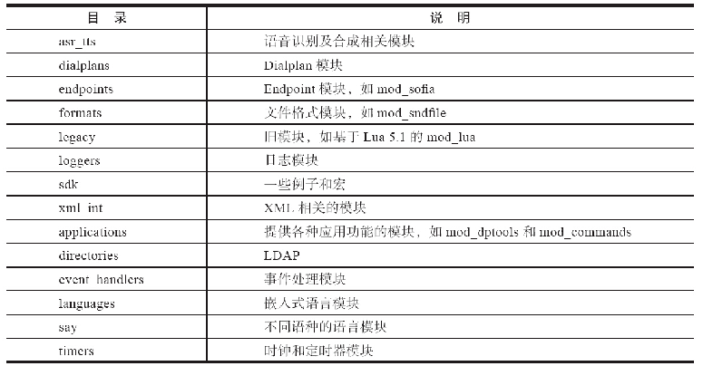
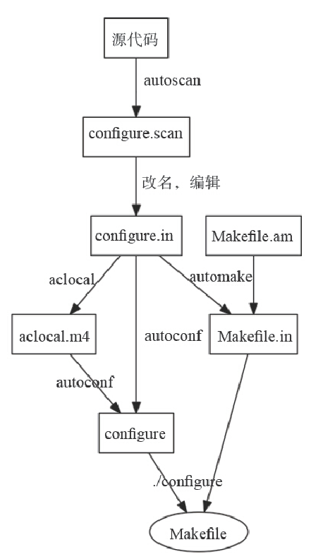

# 第01章 PSTN与VoIP基础
# 第02章 PSTN、PBX及呼叫中心业务
# 第03章 初识FreeSWITCH
# 第04章 运行FreeSWITCH
# 第05章 FreeSWITCH架构
# 第06章 拨号计划
# 第07章 SIP协议
# 第08章 媒体
# 第09章 SIP模块
# 第10章 基本技能
# 第11章 基本功能与实现
# 第12章 高级功能与配置实例
# 第13章 FreeSWITCH与FreeSWITCH对接
# 第14章 FreeSWITCH与其他设备或系统对接
# 第15章 其他技巧与实例
# 第16章 嵌入式脚本
# 第17章 嵌入式及HTTP开发
# 第18章 Event Socket
# 第19章 使用ESL开发
# 第20章 源代码导读及编译指南

从本章开始，我们进入FreeSWITCH源代码的学习。使用开源项目的好处是我们可以阅读并修改其源代码。

有好多朋友在被问到如何阅读源代码时，都会告诉笔者，他们最大的困扰并不是看不懂代码，而是不知道从哪里下手，就好像是老虎吃天——无从下口。是的，FreeSWITCH的源代码太长了，确实好像从哪里看都找不到源头。不过，也不要因此望而却步。在看比较大型的项目时，尤其是对着不熟悉的功能和代码时，总要经过这么一个过程。尤其是，有些读者在对FreeSWITCH本身还不熟悉的时候，就试图通过阅读源代码来了解系统的功能。笔者认为那是本末倒置的方法，不可取。而本书的读者，如果是从前面的章节一步一步读过来的，甚至做过了必要的实验，在实验的过程中遇到问题自己也尝试解决了，那么笔者相信大家已经掌握了FreeSWITCH的基本功能，接下来再去阅读源代码便很容易入手了。

当然，阅读源代码不仅是为了满足我们的好奇心——哪些功能是怎么实现的、系统还有何种没有公开（写到文档里）的功能等。更重要的是，如果我们熟悉了源代码，就可以修改它——不管是修复BUG、增加功能并为开源项目做贡献，还是修改源代码以适合自己的需要，这些都能给我们带来很好的成就感。

接下来，我们从准备源代码环境开始，由浅入深地一步一步进入FreeSWITCH内部的神秘世界。

## 准备FreeSWITCH源代码环境

我们在第3章已经讲到多种获取源代码的方法。如果你需要基于FreeSWITCH源代码进行二次开发的话，笔者强烈建议学一点Git基本知识，并使用Git复制源代码。方法重述如下：

```bash
git clone git://git.freeswitch.org/freeswitch.git
```

要查看源代码，最好选择一个具有语法高亮功能的阅读器或编辑器。笔者在Mac平台上一般使用Sublime Text 2，它是跨平台的，也可以在Windows上使用。当然也可以使用一些经典工具，如在UNIX类系统上使用vi/vim或Emacs，在Windows上可以使用Visual Studio等。关于在Windows平台中的编译方法我们在第3章已经讲过了，本章及后面章节的例子都是在Mac平台上完成的，它适用于大部分的UNIX类平台（如Linux等）。

## FreeSWITCH源代码目录结构

FreeSWITCH的源代码目录中，src目录中包含了绝大部分的源代码；libs目录下是一些第三方的库和模块，如libs/sofia-sip就是Nokia的SIP库。

在src目录中，include目录存放了系统大部分的头文件；不同模块的代码则分门别类地放到mod目录中不同的子目录中。系统的核心代码则直接在src目录中。

FreeSWITCH模块的源代码（mod目录）结构与图5-1所示的差不多，如表20-1所示。

<center>表20-1　FreeSWITCH源代码模块目录结构</center>



上面不同的分类也与FreeSWITCH内部模块的抽象大致对应，但也有例外的情况，比较典型的，比如一些模块可能由多个接口（Interface）实现，这样的模块会根据其主要功能放到对应的目录中，有时就直接放到applications目录中，相当于该目录中有一些多功能的模块。但随着时间的推移，某些单功能的模块也可能会被增加一些新的功能和接口（Interface），变成多功能模块。

## FreeSWITCH源代码导读

由于FreeSWITCH的代码非常多，为了节省篇幅，我们在本章中尽量不大段列出源代码。读者在阅读本章时可以配合源代码进行。

FreeSWITCH的更新速度比较快，因此，为了让读者能找到正确的行号，我们这里的源代码导读基于Git的Tag v1.5.7，它是在本章写作是比较新的版本。读者可以使用下列命令切换到该Tag：

```
git checkout v1.5.7
```

###  APR

FreeSWITCH在设计之初就定位于跨平台的，它使用了跨平台较好的APR库 [1]。APR出身于Apache [2]的代码。Apache是网络上非常流行的Web服务器软件，其代码是公认的写得比较好的。在程序员这一行业，大家一致的观点是——要想提高开发水平，除了大量的练习外，还要大量地阅读其他优秀系统的源代码，而Apache就是常被推荐阅读的代码之一。

APR的主要目的是为应用提供一个可移植的、平台无关的层。它的底层在不同平台上调用不同的库和函数来向上提供诸如文件系统访问、网络编程、进程和线程管理以及共享内存等一致的功能接口。使用APR开发的程序能够在所有被Apache所支持的平台上被干净地（最坏的情况也仅需要很小程度的修改）编译。

除了跨平台支持外，APR的核心还提供系统内存、数据结构、线程、互斥锁等各种资源的管理和抽象等。大家都知道C语言的内存管理是非常令人头痛的，而APR通过内存池的管理大大提高了使用的方便性和安全性。

APR实用库（APR-UTIL，或者APU）是APR项目的另一个库。它在APR基础上使用统一标准的编程接口，提供了一部分功能函数集。APU并不是在每一个平台上都有一个单独的模块，但是它为某些其他常用的资源一个类似的方法，这些资源包括Base64编码、MD5/SHA1加密、UUID以及队列（Queue）管理等。

FreeSWITCH为了防止潜在的命名空间冲突等因素，对所有使用到的APR函数又进行了一些封装，这样所有的核心函数就都有了一致的命名空间“switch\_”。这些封装在switch_apr.c里实现。

### SWITCH APR

FreeSWITCH采用了APR的代码风格及约定，非常易于使用。所以如果熟悉APR的话，看FreeSWITCH的源代码就容易多了。当然，反过来，熟悉了FreeSWITCH的源代码也会熟悉APR。

1. 命名空间

在APR和APR-UTIL中，所有的公开接口都使用了字符串前缀“apr_”（数据类型和函数）和“APR_”（宏）。与此类似，在FreeSWITCH中，所有的核心接口函数也都使用了“switch_”前缀的函数和“SWITCH_”前缀的宏。

在APR命名空间中，也大量使用了二级命名空间，如“apr_socket\_”等。同理在FreeSWITCH中，也有类似的如“switch_file_”、“switch_core_session_”等二级及三级命名空间。

2. 声明的宏

APR使用类似于APR_DECLARE的宏进行声明，例如：

```
APR_DECLARE(apr_status_t) apr_initialize(void);
```

在很多的平台上，这是一个空声明，并且扩展为：

```
apr_status_t apr_initialize(void);
```

但在某些平台上，如在Windows的Visual C++平台上，需要使用特有的、非标准的关键字，例如“_dllexport”、“__stdcall”等来允许其他的模块使用一个函数，这些宏就需要扩展以适应这些需要的关键字。

与APR类似，在FreeSWITCH中，大部分使用SWITCH_DECLARE或SWITCH_DECLARE_DATA之类的声明。

另外，FreeSWITCH中不同类型的模块也都有专用的声明，如声明Application的SWITCH_STANDARD_APP、声明Dialplan的SWITCH_STANDARD_DIALPLAN以及声明API的SWITCH_STANDARD_API等。

大部分的宏以及常量、枚举等都在switch_types.h中定义。

3. apr_status_t和返回值

在APR中广泛采用的一个约定是：函数返回一个状态值，用来为调用者指示成功或者返回一个错误代码。这个类型便是apr_status_t，它是在apr_errno.h中定义的整数值。因此一个APR函数的常见原型就是：

```
APR_DECLARE(apr_status_t) apr_do_something(...function args...);
```

返回值应当在逻辑上进行判断，并进行相应的错误处理。返回值APR_SUCCESS意味着成功。FreeSWITCH也定义了类似的返回值，并以SWITCH_SUCCESS对应APR_SUCCESS。这里注意一点，SWITCH_SUCCESS对应该的枚举值为0，因此常见的错误是：

```erlang
apr_status_t status;
status = call_some_function(... args ...);
if (status) {/* 成功？ */
    return status;
} else {
    ...
}
```

上面的程序片断是错误的，如果要判断执行结果是否成功，应该永远使用下面的方式：

```
if (status == SWITCH_STATUS_SUCCESS)
```

在FreeSWITCH的历史上也曾经因为这个原因出过Bug（高手也会犯错误）。

另外，有些函数会返回一个字符串（char*或者const char*）、一个void*或者void，这些函数就被认为没有失败条件或者在发生错误时返回一个空指针。

4. 内存池

APR使用内存池来方便对内存的管理。大家都知道，C语言中的内存管理是“臭名昭著”的。而在APR中，通过使用内存池，用户在申请内存时可以不用时刻记着释放申请到的内存，可以在用完后一起释放，这极大地方便了内存管理，并能防止产生大量内存碎片。

实际上，APR中大部分的函数及资源严重依赖于内存池，如创建一个Socket需要内存池，创建一个Thread也需要内存池。这种情况听起来似乎有些过分，甚至其作者都认为这些操作显式地依赖于内存池是个巨大错误 [3]，并希望能在2.0时解决这个问题。

内存池一般设计用于小的内存分配，如果要申请几兆字节的内存，那么不建议在内存池中申请 [4]。

除了这些之外，APR在使用起来还是相当方便的。在APR中通常认为从内存池中申请的内存分配永远不会失败。这个假设成立的原因在于如果内存分配失败，那么系统是不可恢复的，任何错误处理都将失败。

5. 其他

另外，SWITCH APR还包装了APR中的字符串处理、文件管理、队列、互斥锁、Socket、线程库等。

### main函数

在此，回答一下本章开头提出的问题——关于看源代码从哪里开始的问题，答案就是从main函数开始看。

大家都知道，C语言程序的执行都是从main开始执行的，FreeSWITCH也不例外。打开src/switch.c，在第482行就可以看到main函数。它的主要作用就是解析从命令行带来的各种参数，然后把一些重要参数记到一个switch_core_flag_t结构体中。默认系统会启动在前台。在Linux平台上，如果执行的时候提供了“-nc”参数（第750行），则在UNIX类系统上会通过fork系统调用将服务启动到后台（第1701行将最终调用fork）；在Windows平台上，则是通过FreeConsole WINAPI实现的。

总之，不管是在前台还是后台，它在初始化一些环境并设置好系统相关的路径后，就执行第1165行，调用switch_core_init_and_modload函数加载各种模块。具体加载哪个模块则依赖于安装目录中的配置文件conf/autoload_configs/modules.conf中的设置。

```
482   int main(int argc, char *argv[])
483   {
...
750           else if (!strcmp(local_argv[x], "-nc")) {
751               nc = SWITCH_TRUE;
752           }
...
1066      if (nc) {
1067  #ifdef WIN32
1068          FreeConsole();
1069  #else
1070          if (!nf) {
1071              daemonize(do_wait ? fds : NULL);
1072          }
1073  #endif
...
1165      if (switch_core_init_and_modload(flags, nc ? SWITCH_FALSE : SWITCH_
            TRUE, &err) != SWITCH_STATUS_SUCCESS) {
```

加载完所有模块后，系统核心进入switch_core.c:989的switch_core_runtime_loop，对于后台启动的实例来讲，它基本什么都不做，在Windows平台上，执行第1001行的WaitForSingleObject以等待服务终止；在UNIX类平台上，就是无限循环（第1005～1007行），其中第1006行相当于sleep 1秒；对于从前台启动的系统，它会在第1011行进入switch_console_loop以启动一个控制台接收用户的链盘输入并打印系统运行的信息（命令输出和日志等）。

```
989   SWITCH_DECLARE(void) switch_core_runtime_loop(int bg)
990   {
...
1001              WaitForSingleObject(shutdown_event, INFINITE);
...
1005          while (runtime.running) {
1006              switch_yield(1000000);
1007          }
...
1011          switch_console_loop();
```

switch_console_loop函数在switch_console.c:1098定义。它使用跨平台的libedit库用于接收用户的按键并在控制台上打印信息。在第1176行，启动了一个新线程执行console_thread函数。

```
1098  SWITCH_DECLARE(void) switch_console_loop(void)
1099  {
...
1176      switch_thread_create(&thread, thd_attr, console_thread, pool, pool)
```

在console_thread中（第1044行），也是一个循环用于接收用户输入。如果用户输入一条命令，则在检查命令的合法性后将命令放入命令历史记录（第1075行），以备以后再执行时可以使用键盘上的箭头键翻查命令历史。然后，在第1076行调用switch_console_process执行输入的命令并返回结果。

```
1044  static void *SWITCH_THREAD_FUNC console_thread(switch_thread_t *thread, 
        void *obj)
1045  {
...
1075                  history(myhistory, &ev, H_ENTER, line);
1076                  running = switch_console_process(cmd);
```

switch_console_process（第134行）又调用了switch_console_execute（第348行），后者最终在第392行调用核心提供的switch_api_execute（switch_loadable_module.c:2282）执行输入的命令。

```
392        status = switch_api_execute(cmd, arg, NULL, istream);
```

如果用户在命令行上输入sofia status，则上述命令执行的结果就是：

```
status = switch_api_execute("sofia", "status", NULL, istream);
```

上述命令的执行结果将存放到istream中，最终会在某处被取出并打印到命令行上。

### 可加载模块

通过对上一节的学习，我们的FreeSWITCH已经启动并可以接收和执行命令了。不过，我们还是往回倒一下，看看FreeSWITCH中的可加载模块是如何被加载的。

FreeSWITCH的核心代码非常紧凑，大部分实际的功能都是由外围的模块实现和扩展的。

我们在上一节提到switch_core_init_and_modload函数负责初始化和加载各种模块。它是在switch_core.c:2084中定义的。在该文件的2110行，完成一些初始化后它就调用switch_loadable_module_init进行模块的初始化，该函数是在switch_loadable_module.c:1747中定义的。在第1761行到1770行定义了各种不同平台上的动态库的扩展名，如在Windows上动态链接库的扩展名是.dll、在Mac上是.dylib、在其他各种UNIX类系统上是.so。

```
1747  SWITCH_DECLARE(switch_status_t) switch_loadable_module_init(switch_bool_
        t autoload)
1748  {
...
1761  #ifdef WIN32
1762      const char *ext = ".dll";
1763      const char *EXT = ".DLL";
1764  #elif defined (MACOSX) || defined (DARWIN)
1765      const char *ext = ".dylib";
1766      const char *EXT = ".DYLIB";
1767  #else
1768      const char *ext = ".so";
1769      const char *EXT = ".SO";
1770  #endif
```

在第1772行，初始化了一个结构体变量loadable_modules，它是一个可加载模块的容器。

```
1772      memset(&loadable_modules, 0, sizeof(loadable_modules));
```

loadable_modules的定义如下（switch_loadable_module.c:59）：

```
0059 struct switch_loadable_module_container {
0060     switch_hash_t *module_hash;
0061     switch_hash_t *endpoint_hash;
0062     switch_hash_t *codec_hash;
0063     switch_hash_t *dialplan_hash;
0064     switch_hash_t *timer_hash;
0065     switch_hash_t *application_hash;
0066     switch_hash_t *chat_application_hash;
0067     switch_hash_t *api_hash;
0068     switch_hash_t *json_api_hash;
0069     switch_hash_t *file_hash;
0070     switch_hash_t *speech_hash;
0071     switch_hash_t *asr_hash;
0072     switch_hash_t *directory_hash;
0073     switch_hash_t *chat_hash;
0074     switch_hash_t *say_hash;
0075     switch_hash_t *management_hash;
0076     switch_hash_t *limit_hash;
0077     switch_mutex_t *mutex;
0078     switch_hash_t *secondary_recover_hash;
0079     switch_memory_pool_t *pool;
0080 };
```

可以看出，它主要定义了各种哈希表（hash）。将来，新加载的各种模块将统一由不同的哈希表管理，如mod_sofia将被记入endpoint_hash，mod_g729将被记入codec_hash等。

此外，它还使用互斥（mutex）来防止多线程访问。pool是一个内存池。在接下来的1773行就紧接着初始化了这个内存池：

```
1773      switch_core_new_memory_pool(&loadable_modules.pool);
```

第1780～1798行则初始化了所有的hash及mutex。其中有些hash的键（Key）是区分大小写的，用switch_core_hash_init初始化；有些则是大小写无关的，用switch_core_hash_init_nocase进行初始化。这些数据结构初始化时都需要一个内存池，由此可以看出内存池的重要性 [5]。

```
1780      switch_core_hash_init(&loadable_modules.module_hash, loadable_modules.pool);
1781      switch_core_hash_init_nocase(&loadable_modules.endpoint_hash, 
            loadable_modules.pool);
...
1798      switch_mutex_init(&loadable_modules.mutex, SWITCH_MUTEX_NESTED, 
            loadable_modules.pool);
```

系统加载完以后，就开始加载各种模块了。在1802～1803行，首先加载的是CORE_SOFTTIMER_MODULE和CORE_PCM_MODULE两个模块，这两个模块是直接在核心代码中实现的，因而比较特殊。

```
1802      switch_loadable_module_load_module("", "CORE_SOFTTIMER_MODULE", SWITCH_FALSE, &err);
1803      switch_loadable_module_load_module("", "CORE_PCM_MODULE", SWITCH_FALSE, &err);
```

我们暂且不深入研究这两个模块是如何加载的，继续往下走。第1806行，switch_xml_open_cfg()将打开XML配置文件中的modules.conf（参见1753行）部分（默认在安装目录conf/autoload_configs/modules.conf.xml中配置），经过一个for循环（1809行）依次取得需要加载的模块的名字，并最终在第1824行执行switch_loadable_module_load_module_ex加载它们。

```
1806      if ((xml = switch_xml_open_cfg(cf, &cfg, NULL))) {
...
1809              for (ld = switch_xml_child(mods, "load"); ld; ld = ld->next) {
...
1824                  if (switch_loadable_module_load_module_ex((char *) path, (char *) val, SWITCH_FALSE, global, &err) == SWITCH_STATUS_GENERR) {
```

然后，用同样的方法尝试加载post_load_modules.conf（参见第754行）中配置的模块（1839行起）。

另外，如果上面两个配置文件中都没有找到可加载的模块（1867），则尝试加载所有模块(1872~1897行)。

```
1867      if (!count) {
1869          all = 1;
1870      }
1871
1872      if (all) {
...
1897              switch_loadable_module_load_module((char *) SWITCH_GLOBAL_dirs.mod_dir, (char *) fname, SWITCH_FALSE, &err);
```

无论如何，模块加载完毕后，将执行switch_loadable_module_runtime函数（第1902行）。该函数在第114行定义，关于该函数的作用我们在下一节讲解。

```
1902      switch_loadable_module_runtime();
```

接下来，我们看一下模块是怎么被加载的。模块加载最终是由1476行的switch_loadable_module_load_module_ex实现的。它会首先计算与欲加载的模块对应的文件名，并在第1515行检查loadable_modules.module_hash这个哈希表来判断该模块是否已被加载，如果未被加载，则在第1519行调用switch_loadable_module_load_file将该模块加载到内存。

```
1476  static switch_status_t switch_loadable_module_load_module_ex(
        char *dir, char *fname, switch_bool_t runtime,
        switch_bool_t global, const char **err)
1477  {
...
1515      if (switch_core_hash_find_locked(loadable_modules.module_hash,
                file, loadable_modules.mutex)) {
...
1519      } else if ((status = switch_loadable_module_load_file(
            path, file, global, &new_module)) == SWITCH_STATUS_SUCCESS) {
```

switch_loadable_module_load_file是在第1328行定义的。这个函数我们需要好好看一下。

在第1356行和第1360行，它会多次尝试使用switch_dso_open来打开相应的模块的动态链接库（switch_dso_open在switch_dso.c:35中定义。在Windows平台上，它将使用LoadLibraryEx来打开相应的.dll库，在Mac和Linux上，它将使用dlopen函数打开相应的.so文件）。

```
1328  static switch_status_t switch_loadable_module_load_file(char *path,
        char *filename, switch_bool_t global, switch_loadable_module_t **new_module)
1329  {
...
1356          dso = switch_dso_open(lib_path, load_global, &derr);
...
1360      dso = switch_dso_open(NULL, load_global, &derr);
```

动态库打开后，通过下面的代码找到动态库里的符号表（第1379行）。执行到1402行时，如果符号表加载成功，则将该符号表赋值给mod_interface_functions变量。

```
1379              interface_struct_handle = switch_dso_data_sym(dso, struct_name, &derr);
...
1402              mod_interface_functions = interface_struct_handle;
```

mod_interface_functions是一个switch_loadable_module_function_table结构的结构体，它是在switch_type.h:2228中定义的：

```
2228  typedef struct switch_loadable_module_function_table {
2229      int switch_api_version;
2230      switch_module_load_t load;
2231      switch_module_shutdown_t shutdown;
2232      switch_module_runtime_t runtime;
2233      switch_module_flag_t flags;
2234  } switch_loadable_module_function_table_t;
2235
```

该结构体定义了几个指向函数的指针，分别是load、shutdown和runtime。如果被加载的模块中实现了这些函数，则这些指针指向相关的函数入口，如果没有实现，就是NULL。

每个模块都必须实现load函数，它一般用于模块的初始化操作。因而在第1403行，load函数的指针被赋值给load_func_ptr这个变量。

```
1403              load_func_ptr = mod_interface_functions->load;
```

第1411行，load函数将被执行：

```
1411          status = load_func_ptr(&module_interface, pool);
```

load函数的原型是使用SWITCH_MODULE_LOAD_FUNCTION(name)这个宏来定义的（switch_types.h:2211），该宏展开的结果就是：

```
switch_status_t mod_xx_load(
    switch_loadable_module_interface_t **module_interface, switch_memory_pool_t *pool)
```

因而，如果该函数执行成功，将返回SWITCH_STATUS_SUCCESS，并且会初始化一个module_interface指针。然后，在第1424行初始化一个module变量。

```
1424          if ((module = switch_core_alloc(pool,
                    sizeof(switch_loadable_module_t))) == 0) {
```

module变量是一个如下所示的结构（在第44行定义）。它定义了该模块的一些参数，其中，成员module_interface就用于存放刚刚在第1411行初始化的module_interface指针。

```
44  struct switch_loadable_module {
45      char *key;
46      char *filename;
47      int perm;
48      switch_loadable_module_interface_t *module_interface;
49      switch_dso_lib_t lib;
50      switch_module_load_t switch_module_load;
51      switch_module_runtime_t switch_module_runtime;
52      switch_module_shutdown_t switch_module_shutdown;
53      switch_memory_pool_t *pool;
54      switch_status_t status;
55      switch_thread_t *thread;
56      switch_bool_t shutting_down;

57  };
```

接下来从第1451行开始，对module中的各成员赋值。最后，在第1463行初始化new_module指针，返回到调用该函数的地方，模块加载成功。

```
1451      module->pool = pool;
1452      module->filename = switch_core_strdup(module->pool, path);
1453      module->module_interface = module_interface;
1454      module->switch_module_load = load_func_ptr;
...
1463      *new_module = module;
```

总之，模块加载的流程就是，首先找到模块对应的动态库文件，然后打开并找到符号表，接下来执行模块中的load函数。另外，如果模块定义了runtime及shutdown函数，也将一并记录到module结构的switch_module_runtime及switch_module_shutdown成员变量中。

switch_loadable_module_load_file执行完毕后，得到了一个new_module指针，并返回到第1519行。紧接着在第1520行执行switch_loadable_module_process函数，它使用模块的文件名（file）和我们新得到的new_module结构作为参数传入。

```
1519      } else if ((status = switch_loadable_module_load_file(
            path, file, global, &new_module)) == SWITCH_STATUS_SUCCESS) {
1520          if ((status = switch_loadable_module_process(file, new_module))
```

switch_loadable_module_process函数是在第133行定义的，在第138行，有如下语句：

```
138      new_module->key = switch_core_strdup(new_module->pool, key);
```

第138行初始化new_module的key，它是一个字符串，实际上就是传入的文件名。switch_core_strdup用于制作一个key的副本（duplicate），它需要的内存是从内存池中申请的，因而后续不需要明确释放，在模块卸载时直接释放掉内存池就行了。

在第140行通过互斥的mutex来锁定全局的loadable_modules结构，并在第141行向其中的loadable_modules.module_hash哈希表中插入该模块，以记录该模块被加载了。

```
140      switch_mutex_lock(loadable_modules.mutex);
141      switch_core_hash_insert(loadable_modules.module_hash, key, new_module);
```

第143行进行判断，如果被加载的模块实现了一个endpoint_interface，则在第150行将它记录到loadable_modules.endpoint_hash中。

```
143      if (new_module->module_interface->endpoint_interface) {
...
150                  switch_core_hash_insert(loadable_modules.endpoint_hash, ptr->interface_name, (const void *) ptr);
```

第151行产生一个模块加载的事件——SWITCH_EVENT_MODULE_LOAD，并于第156行发送出去：

```
151                  if (switch_event_create(&event, SWITCH_EVENT_MODULE_LOAD) == SWITCH_STATUS_SUCCESS) {
...
156                      switch_event_fire(&event);
```

同理，如果该模块也实现了其他的interface（在同一模块中可以实现多个interface，如第163行的codec_interface，第220行的dialplan_interface等），则都记录到相应的哈希表中，产生相关的事件，并针对不同的interface类型可能还有不同的检查和其他处理等。

```
163      if (new_module->module_interface->codec_interface) {
...
220      if (new_module->module_interface->dialplan_interface) {
```

至此，模块就加载成功了，最后到第551行会将锁定的临界区的资源解锁，并返回成功的状态码。

```
551      switch_mutex_unlock(loadable_modules.mutex);
552      return SWITCH_STATUS_SUCCESS;
```

不过，模块加载成功并不表示所有工作已完成。上面的函数返回后又回到第1521行。接下来，判断如果新加载的模块定义了runtime函数，则启动一个新的线程，执行该runtime函数。

```
1521    if (new_module->switch_module_runtime) {
1522        new_module->thread = switch_core_launch_thread(
                switch_loadable_module_exec, new_module, new_module->pool);
1523    }
```

runtime函数是循环的执行的，即只要runtime函数不返回SWITCH_STATUS_TERM，则它就会被再次执行，直到该模块被卸载为止，参见第99～101行。

```
99       for (restarts = 0; status != SWITCH_STATUS_TERM && !module->shutting_down; restarts++) {
100          status = module->switch_module_runtime();
101      }
```

至此，模块加载的工作才算完成了。FreeSWITCH进入正常运行阶段。

### 模块的结构

上一节，我们讲了核心中对可加载模块的处理，本节我们接着来看一下可加载模块的结构。

在src/mod/sdk/autotools/src目录下有一个mod_example.c，其描述了一个最精简的模块的结构。其他模块可以在这个基础上修改。该文件只是一个例子，有些语句默认是注释掉的，在需要的时候可以打开。

该文件不长，因此我们把它全部的内容都列在这里（除了最前面的版权信息及最后面对编译器的注释）。真正的代码是从第33行开始的（为了与实际文件对应，我们为空行也编了行号）。它首先装入switch.h，使得它可以引用FreeSWITCH核心中的公用函数（即所谓的Core Public API）。

然后，它使用3个宏（在switch_types:第2211～2213行定义）分别声明了3个函数：第36行的mod_example_shutdown、第37行的mod_example_runtime以及第40行的mod_example_load。其中，只有load函数是必需的，因此其他两个默认是注释掉的。

上面只是对3个函数的前向声明，真正让这3个函数起作用的行是第41行。它的作用是告诉核心，在加载该模块时，就要回调本模块的mod_example_load函数进行一些初始化操作（即我们上一节讲过的switch_loadable_module.c:1411）。

```
33  #include <switch.h>
34
35  /*
36  SWITCH_MODULE_SHUTDOWN_FUNCTION(mod_example_shutdown);
37  SWITCH_MODULE_RUNTIME_FUNCTION(mod_example_runtime);
38  */
39
40  SWITCH_MODULE_LOAD_FUNCTION(mod_example_load);
41  SWITCH_MODULE_DEFINITION(mod_example, mod_example_load, NULL, NULL);
42
```

在这里，我们仅使用了load回调函数，如果把其他两个都用上，我们可以这样写：

```
SWITCH_MODULE_DEFINITION(mod_example,
    mod_example_load, mod_example_shutdown, mod_example_runtime);
```

这样的话，当模块被加载的时候就会回调load、启动一个新线程运行runtime，并在模块被卸载的时候执行shutdown函数。

当该模块被加载时（如在FreeSWITCH控制台上执行mod_example），则回调其下面的函数。该函数在参数中会传过来一个空指针（实际上一个个双重指针）——module_interface，我们需要初始化这个指针（第46行）。在module_interface初始化完成后打印一条日志（第48行），并返回SWITCH_STATUS_SUCCESS值（第51行）以表示初始化成功。如果初始化失败（如不能连接数据库、不能申请相关资源等，都可能导致初始化失败），则可以返回SWITCH_STATUS_FALSE或其他错误值。

```
43  SWITCH_MODULE_LOAD_FUNCTION(mod_example_load)
44  {
45      /* connect my internal structure to the blank pointer passed to me */
46      *module_interface = switch_loadable_module_create_module_interface(pool, 
        modname);
47
48      switch_log_printf(SWITCH_CHANNEL_LOG, SWITCH_LOG_NOTICE, "Hello World!\n");
49
50      /* indicate that the module should continue to be loaded */
51      return SWITCH_STATUS_SUCCESS;
52  }
53
```

下面是模块卸载时的回调函数，其可以用于断开数据库连接、释放内存、清理相关现场等。在此，我们的模块没有申请什么资源，因而直接返回成功（第58行）。

```
54  /*
55    Called when the system shuts down
56  SWITCH_MODULE_SHUTDOWN_FUNCTION(mod_example_shutdown);
57  {
58      return SWITCH_STATUS_SUCCESS;
59  }
60  */
61
```

如果runtime函数存在，则系统核心会启动一个新线程来调用该函数。在这里，可以是一个无限循环（如第67行，当然要记住给无限循环终止条件，否则该模块就不能卸载了），也可以在执行一段时间后返回一个状态值，只要返回值不是SWITCH_STATUS_TERM，该函数就会被再次调用。

```
62  /*
63    If it exists, this is called in it's own thread when the module-load completes
64    If it returns anything but SWITCH_STATUS_TERM it will be called again automaticly
65  SWITCH_MODULE_RUNTIME_FUNCTION(mod_example_runtime);
66  {
67      while(looping)
68      {
69          switch_yield(1000);
70      }
71      return SWITCH_STATUS_TERM;
72  }
73  */
```

上述就是在FreeSWITCH中可加载模块的大体结构。我们在后面会看到编写一个新模块的实际例子。

### Session和Channel

在FreeSWITCH核心中，与通话最相关的部分莫过于Session和Channel了。FreeSWITCH是一个B2BUA，因此，它参与通话的每一条腿（Leg）都是一个Channel。而Session则比Channel更高级一些，它用于描述一次会话，也就是说，虽然Session与Channel总是一一对应的，但前者管的事更多一些。也可以这样认为，Session更关注于控制信令层，而Channel更关注于媒体层。

每当有一个电话到来时，或者每次从FreeSWITCH中发起一路通话时，便建立一个Session（同时生成一个Channel）。

用于标志Session的是一个struct switch_core_session的结构体，它的部分定义如下：

```
107 struct switch_core_session {
108      switch_memory_pool_t *pool;
109      switch_thread_t *thread;
110      switch_thread_id_t thread_id;
111      switch_endpoint_interface_t *endpoint_interface;
112      switch_size_t id;
113      switch_session_flag_t flags;
114      switch_channel_t *channel;
...
```

可以看出，在switch_core_session中有一个指向channel的指针（第114行）。上述的定义在是src/include/private/switch_core_pvt.h中实现的。之所以在private（私有的）下面定义，是因为它不想让FreeSWITCH核心之外的应用知道Session中的细节。也就是说，其他系统如果使用FreeSWITCH的库，即使在FreeSWITCH内部的模块中，也看不到Session内部的东西。如果一段代码需要知道与Session相关的Channel，则只能用switch_core_session_get_channel(session)函数从session变量中取得，而不能直接调用session->channel。如果这样说读者还不是太明白的话，看一看该文件前面的注释：

```
29   * switch_core.h -- Core Library Private Data (not to be installed into the system)
30   * If the last line didn't make sense, stop reading this file, go away!,
31   * this file does not exist!!!!
```

它的大意是说，该文件的内容是私有的，不需要看，就当它不存在！因而，我们也没必须深入研究了。
Session是由switch_core_session_request_uuid（第2259行）函数生成的。

```
2259    SWITCH_DECLARE(switch_core_session_t *) switch_core_session_request_uuid(
2260                     switch_endpoint_interface_t *endpoint_interface,
2261                     switch_call_direction_t direction,
2262                     switch_originate_flag_t originate_flags,
2263                     switch_memory_pool_t **pool, const char *use_uuid)
```

在该函数中，它会检查是使用现有的内存池（第2319行）还是创建一个新的内存池（第2322行）。然后在该内存池上为session结构体变量申请内存空间（第2325行），并将它的pool成员变量指向该内存池（第2326行）。这样我们就有了一个Session了，并且，以后与该Session有关的内存申请都可以在该内存池中申请。该内存池会在Session消亡时释放，因而在很大程度上方便了内存管理。

```
2318      if (pool && *pool) {
2319          usepool = *pool;
2320          *pool = NULL;
2321      } else {
2322          switch_core_new_memory_pool(&usepool);
2323      }
2324
2325      session = switch_core_alloc(usepool, sizeof(*session));
2326      session->pool = usepool;
2327
```

接下来我们看到，第2330行又在该内存池中又立即为与session所对应的Channnel申请了内存，并在第2334行对Channel进行了初始化，同时将Channel的当前状态设为CS_NEW。

```
2330      if (switch_channel_alloc(&session->channel, direction, session->pool) != SWITCH_STATUS_SUCCESS) {
2331          abort();
2332      }
2333
2334      switch_channel_init(session->channel, session, CS_NEW, 0);
```

如果在调用该函数时提供了一个UUID，则使用它（第2344行），否则自动生成一个（第2346行），它用于标志一个Channel。接下来，就可以设置通道变量了，如第2350～2351行。

```
2343      if (use_uuid) {
2344          switch_set_string(session->uuid_str, use_uuid);
2345      } else {
2346          switch_uuid_get(&uuid);
2347          switch_uuid_format(session->uuid_str, &uuid);
2348      }
2349
2350      switch_channel_set_variable(session->channel, "uuid", session->uuid_str);
2351      switch_channel_set_variable(session->channel, "call_uuid", session->uuid_str);
```

接下来，进行初始化与Session相关的各种变量、申请相关内存、初始化Mutex、锁、队列等操作。最后，将与该Session对应的UUID记录到一个核心的哈希表中（第2381行），至此，Session的初始化基本上就结束了。

```
2381      switch_core_hash_insert(session_manager.session_table, session-
             >uuid_str, session);
2382      session->id = session_manager.session_id++;
2383      session_manager.session_count++;
```

然后，第1876行的switch_core_session_thread_launch函数会被调用，来启动一个新的线程。

```
1876 SWITCH_DECLARE(switch_status_t) switch_core_session_thread_launch(
                                        switch_core_session_t *session)
```

由于启动一个新的线程是比较费时的操作，因而在系统内部维护了一个线程池。在该函数第1888行，判断核心参数是否启用线程池（默认启用），如果是，则就在第1889行把该Session推到线程池队列中去。否则就在第1906行启动一个新线程，执行switch_core_session_thread函数（当然在线程池队列中找到一个可用的线程后，也会执行该函数）。

```
1888      if (switch_test_flag((&runtime), SCF_SESSION_THREAD_POOL)) {
1889          return switch_core_session_thread_pool_launch(session);
1890      }
...
1906          if (switch_thread_create(&thread, thd_attr, switch_core_session_thread,
                session, session->pool) == SWITCH_STATUS_SUCCESS) {
1907              switch_set_flag(session, SSF_THREAD_STARTED);
1908              status = SWITCH_STATUS_SUCCESS;
```

switch_core_session_thread是在第1555行定义的。它有两个传入参数，一个是当前线程的指针thread，另一个是一个无类型的（void*）指针obj，该obj实际上就是我们的Session指针，因此在第1557行，初始化了一个session变量并指向与obj指针同样的地址。在进行一些初始化操作后，便执行1565行的switch_core_session_run函数。

```
1555  static void *SWITCH_THREAD_FUNC switch_core_session_thread(switch_thread_t *thread, void *obj)
1556  {
1557      switch_core_session_t *session = obj;
...
1565      switch_core_session_run(session);
```

转了这么一大圈，我们终于找到了关键的地方。switch_core_session_run实际上是一个状态机。该状态机的定义在switch_types.h中，它是一个枚举类型的定义，内容如下：

```
1179  typedef enum {
1180      CS_NEW,                  // 新建
1181      CS_INIT,                 // 已初始化
1182      CS_ROUTING,              // 路由
1183      CS_SOFT_EXECUTE,         // 准备好执行，可由第三方控制
1184      CS_EXECUTE,              // 执行Dialplan中的App
1185      CS_EXCHANGE_MEDIA,       // 与另一个Channel在交换媒体
1186      CS_PARK,                 // Park，等待进一步的命令指示
1187      CS_CONSUME_MEDIA,        // 消费掉媒体并丢弃
1188      CS_HIBERNATE,            // 没事可干，Sleep
1189      CS_RESET,                // 重置
1190      CS_HANGUP,               // 挂机，结束信令和媒体交互
1191      CS_REPORTING,            // 收集呼叫信息（如写CDR等）
1192      CS_DESTROY,              // 待销毁，退出状态机
1193      CS_NONE                  // 无效
1194  } switch_channel_state_t;
```

switch_core_session_run函数是在switch_core_state_machine.c:414中定义的。

```
414  SWITCH_DECLARE(void) switch_core_session_run(switch_core_session_t *session)
```

该函数主要的功能就是执行一个循环，只要该Session所对应的Channel的状态不是CS_DESTROY，它就会一直循环。

```
449      while ((state = switch_channel_get_state(session->channel)) != CS_DESTROY) {
```

在循环体内使用了一些switch…case语句，用于决定在不同的状态执行哪些代码段或函数，部分代码如下。其中，有一些关键的代码段被提取出来，放到一个名为STATE_MACRO宏中执行了，而该宏就是状态机中最关键的部分。

```
483              switch (state) {
484              case CS_NEW:
...
487              case CS_DESTROY:
488                  goto done;
489              case CS_REPORTING:  /* Call Detail */
...
495              case CS_HANGUP: /* Deactivate and end the thread */
...
502              case CS_INIT:   /* Basic setup tasks */
503                  {
...
506                      STATE_MACRO(init, "INIT");
...
521              case CS_ROUTING:/* Look for a dialplan and find something to do */
522                  STATE_MACRO(routing, "ROUTING");
523                  break;
524              case CS_RESET:      /* Reset */
525                  STATE_MACRO(reset, "RESET");
526                  break;
```

STATE_MACRO宏是在第356行定义的，该宏比较复杂，其实展开以后，大致就想当于下面的代码片断（这里用伪代码表示）：

```
1 do {
2     switch_log_printf("INIT");
3     if (driver_state_handler->on_init) {
4             driver_state_handler->on_init(session);
5         }
6     }
7 } while (0)
```

这里以CS_INIT状态为例，从伪代码可以看出，该宏整个套在一个大的“do{...}while(0)”单次循环体中 [6]。如果在与该Channel对应的Endpoint的底层驱动中在当前状态上安装了回调函数，则会执行该回调函数（第4行）。

当然，实际的情况比这里的情况要复杂得多，它更类似于下面的样子。即，除了可以在Channel对应的Endpoint的底层驱动中安装回调函数外，在其他的模块或第三方应用中也可以在Channel上安装回调函数，以后在Channel的状态机状态发生变化时得到回调，那么下面这段伪代码就有机会执行额外的回调函数（第5行）了。

```
1 do {
2     switch_log_printf("INIT");
3     if (!driver_state_handler->on_init ||
         (driver_state_handler->on_init(session) == SWITCH_STATUS_SUCCESS ) {
4             while (do_extra_handlers) {
5                 do_extra_handlers(...);
6             }
7         }
8     }

9 } while (0)
```

实际的情况其实比这个还要复杂，但这里我们就不深入研究了。总之，你只需要知道在Channel的核心状态机上可以安装回调函数，并在状态发生变化时得到回调。如果对细节特别感兴趣的读者也可以使用“gcc-E”命令将该源文件中的宏展开看一看。

从这一段的代码我们知道，Session与Channel是息息相关的。初始化了Session之后，就有了Channel，而状态机全部都是在Channel上实现的（其中CS_INIT中的CS便是Channel State的意思）。当然，核心中也定义了很多专门对Channel操作的函数，大部分都是在switch_channel.c中实现的。这些函数的名称和代码看起来都很直观，在这里我们就不多讲了，等到后面用到的时候再个别进行说明。

### SWITCH IVR

大部分媒体处理逻辑都是在switch_ivr_*.c中实现的，其中多个源代码实现了不同的switch_ivr逻辑，如switch_ivr_async.c进行异步处理、switch_ivr_bridge.c处理话路桥接等。在此，我们先来看一个简单的echo应用。关于echo App我想大家都已经很熟悉了，我们知道它的作用就是将收到的媒体（音频或视频）原样再发回去。下面我们就看一看它是怎么实现的。

在通话执行到echo App时，将最终执行到switch_ivr_async.c:629定义的switch_ivr_session_echo函数。由于echo应用是需要媒体的，如果在执行echo时电话还没有应答（如在SIP应用中还没有收到或发送“200 OK”），则它会在第636行调用switch_channel_pre_answer试图在电话应答之前建立媒体连接（如果在SIP应用中将发送带SDP的183消息以尝试建立媒体连接）。当然，这是一个小的细节，我们继续往下看。

```
629  SWITCH_DECLARE(switch_status_t) switch_ivr_session_echo(switch_core_
        session_t *session, switch_input_args_t *args)
630  {
...
636      if (switch_channel_pre_answer(channel) != SWITCH_STATUS_SUCCESS) {
637          return SWITCH_STATUS_FALSE;
638      }
```

在该函数中，第644行执行一个while循环，只要该Channel是正常的（由switch_channel_ready判断，它会检查一系列参数，在Channel正常建立时将返回真，在挂机或出现其他错误的情况下返回假），便会一直循环。然后，在第645行，调用核心的函数switch_core_session_read_frame从该Channel中读取一帧的数据（这里的一帧，在SIP应用中就是一个RTP包中的数据，如可能是20毫秒的音频数据）。接下来在第646行通过一个宏来判断读到的数据是否有效，如果无效就跳出循环（第647行）。如果数据有效，就继续进行。第656行用于处理该Channel上相关的事件，如检查DTMF等。在收到DTMF的情况下会调用相关的回调函数（第665行）。

```
644      while (switch_channel_ready(channel)) {
645          status = switch_core_session_read_frame(session, &read_frame, SWITCH_IO_FLAG_NONE, 0);
646          if (!SWITCH_READ_ACCEPTABLE(status)) {
647              break;
648          }
...
656          switch_ivr_parse_all_events(session);
...
665              if (switch_channel_has_dtmf(channel)) {
...
```

我们跳过一些细节，直接看第694行，可以看到它又调用了switch_core_session_write_frame，即将收到的数据写回了Session中，然后这些音频数据就会发到远端。当然，如果该Channel上有视频的话，它也会进行相关的处理，我们暂时忽略视频的处理代码。

总之，该函数主要的功能就是调用switch_core_session_read_frame读取音频数据，并通过switch_core_session_write_frame写回去。有关这两个函数的实现我们将在下一节讲到。

### Core IO

在上一节我们讲到，switch_core_session_read_frame用于读数据，而switch_core_session_write_frame用于写数据。这两个函数是在switch_core_io.c中定义的。它们都非常长，因此我们在此只简单分析一下关键点。

switch_core_session_read_frame是在第147行定义的。

```
147  SWITCH_DECLARE(switch_status_t) switch_core_session_read_frame(
                    switch_core_session_t *session, switch_frame_t **frame,
                    switch_io_flag_t flags, int stream_id)
```

一般来说，在SIP应用中，每20毫秒就会读到一帧音频数据（但也不是绝对的）。如果在读的过程中读不到数据但又不至于产生错误，该函数就返回一个静音包（Comfort Noise Generation，CNG，可以根据它产生舒适噪音）。

```
167          *frame = &runtime.dummy_cng_frame;
168          return SWITCH_STATUS_SUCCESS;
```

除此之外，该函数中还有很多检查判断，我们就不详细看了。下面直接跳到第246行。该行会调用底层的Endpoint提供的read_frame回调函数来读数据。由于FreeSWITCH支持不同的Endpoint，因此，这里使用回调函数的机制屏蔽各Endpoint的不同特性。比如，在SIP应用中，媒体数据将从RTP中读取，在mod_portaudio中数据是从本地声卡读取的，而在mod_freetdm应用中数据是从硬件的TDM板卡驱动中读取的。总之，核心层并不知道这些数据是从哪里来的，具体这一帧数据怎么来，得看底层的驱却是怎么实现的。

总之，第246行判断Endpoint底层的驱动是否实现了read_frame回调，如果实现了，就在第249行调用该回调函数读取数据。然后，判断当前的Session是否注册了其他的事件钩子（event_hook），如果注册了，也调用钩子里的read_frame回调函数（第250行）。也就是说，除了Endpoint之外，其他的函数或模块中也可以调用switch_core_event_hook_add_*一族的函数来安装相关的回调函数，以便在适当的时候得到回调。因此，在第250行，它便是检查是否有通过switch_core_event_hook_add_read_frame函数注册的钩子，如果有，就在第251行调用。

```
246      if (session->endpoint_interface->io_routines->read_frame) {
...
249          if ((status = session->endpoint_interface->io_routines->read_frame
                (session, frame, flags, stream_id)) == SWITCH_STATUS_SUCCESS) {
250              for (ptr = session->event_hooks.read_frame; ptr; ptr = ptr->next) {
251                  if ((status = ptr->read_frame(session, frame, flags, 
                        stream_id)) != SWITCH_STATUS_SUCCESS) {
```

我们以前也提到过，录音等应用都是使用Media Bug来实现的，也就是往一个Channel上安装了一个Media Bug，这就相当于给水管安装了一个“三通”。在第309行，就是检查该Channel上有没有安装“三通”，如果安装了，便在第316行一个一个把它们找出来，并调用它们指定的回调函数（第341行）。而在回调函数中可以取到我们在上面第249行读到的这一帧的数据，并使用它（在录音应用中，最典型的就是将这些声音数据写到录音文件中去）。

```
309      if (session->bugs && !((*frame)->flags & SFF_CNG) && !((*frame)->flags 
             & SFF_NOT_AUDIO)) {
...
316          for (bp = session->bugs; bp; bp = bp->next) {
...
339                      if (bp->callback) {
340                          bp->native_read_frame = *frame;
341                          ok = bp->callback(bp, bp->user_data, SWITCH_ABC_
                                  TYPE_TAP_NATIVE_READ);
```

读者不要把这些回调搞混了。我们简单总结一下，第249行的io_routines中的回调是从底层的驱动中读媒体数据，而其他的如第250行的event_hooks中的回调及第341行中的Media Bug中的回调是使用这些数据。

接下来的代码中根据当前通话的各种不同的情况判断是否需要转码（由need_codec变量表示），如第361～363行就是其中一种判断条件：

```
361    if (session->read_codec->implementation->impl_id != codec_impl.impl_id) {
362             need_codec = TRUE;
363    }
```

如果需要转码，则程序执行到第561行就会执行解码操作。不管读到的数据是什么编码的（PCMU、PCMA、iLBC等），都会先转换成一种中间的编码格式——L16（16位的线性编码）。

```
464      if (switch_test_flag(session, SSF_READ_TRANSCODE) &&
            !need_codec && switch_core_codec_ready(session->read_codec)) {
...
561               status = switch_core_codec_decode(codec,
562                            session->read_codec,
563                            read_frame->data,
564                            read_frame->datalen,
565                            session->read_impl.actual_samples_per_second,
566                            session->raw_read_frame.data,
                               &session->raw_read_frame.datalen,
                               &session->raw_read_frame.rate,
567                            &read_frame->flags);
```

除了编解码转换外，FreeSWITCH还支持码率的转换，如将48000Hz的高清音频转换成8000Hz的窄带音频等。第792行即是调用转码处理的函数。

```
789              if (session->read_resampler) {
792                  switch_resample_process(session->read_resampler,
                        data, (int) read_frame->datalen / 2);
```

如果该Session当前的read_codec不是L16，则这个时候就需要将L16线性编码的数据编码成read_codec指定的编码（即函数调用者实际需要的编码），该操作是在第835行调用的。

```
835                status = switch_core_codec_encode(session->read_codec,
836                              enc_frame->codec,
837                              enc_frame->data,
838                              enc_frame->datalen,
839                              session->read_impl.actual_samples_per_second,
840                              session->enc_read_frame.data,
                                 &session->enc_read_frame.datalen,
                                 &session->enc_read_frame.rate, &flag);
```

switch_core_session_read_frame这个函数非常长，里面还有更多的细节，我们就不一一研究了。总之，它的就要作用就是从底层的Endpoint驱动中读取一帧数据，然后调用各种回调函数，并将读到的数据返回（通过第147行的frame双重指针返回）。如果对方需要返回特定编码的数据，则在函数内部执行转码操作（解码和编码），以返回编码后的数据。

接下来我们简单看一下switch_core_session_write_frame函数，它是在1025行定义的：

```
1025  SWITCH_DECLARE(switch_status_t) switch_core_session_write_frame(
        switch_core_session_t *session, switch_frame_t *frame, switch_io_flag_t flags,
1026      int stream_id)
```

如果该Session处于Proxy Packet状态（SFF_PROXY_PACKET），则它会快速地在第1072行调用perform_write函数将数据发送出去：

```
1072        status = perform_write(session, frame, flag, stream_id);
```

否则的话，它也会进行一系列的检查，并进行必要的操作。它也会在必要的时候对数据进行解码（第1173行）和编码（第1467行）操作：

```
1173          status = switch_core_codec_decode(frame->codec, ...
...
1467          status = switch_core_codec_encode(session->write_codec, ...
```

或者进行码率转换：

```
1258              switch_resample_process(session->write_resampler, ...
```

或者对Media Bug回调进行处理：

```
1275      if (session->bugs) { ...
```

通过在写（write）的时候增加一个Media Bug，可以在媒体数据实际发送出去之前对数据进行修改和替换（如果把读的Media Bug理解成录音和监听，那么写的Media Bug就可以理解为插话——在一个通话中突然插入另外一个人的语音或者播放一段音乐）。
在第1415行，switch_core_session_write_frame也是调用perform_write将数据发送出去。

```
1415              status = perform_write(session, write_frame, flags, stream_id);
```

perform_write函数是在第961行定义的，它最终将会调用Endpoint下io_routines中的write_frame回调函数并将数据发送出去（第1013行），然后在第1015行回调相关的event_hooks里的回调函数（如果有的话）。

```
1012      if (session->endpoint_interface->io_routines->write_frame) {

1013          if ((status = session->endpoint_interface->io_routines->write_frame(
                session, frame, flags, stream_id)) == SWITCH_STATUS_SUCCESS) {
1014              for (ptr = session->event_hooks.write_frame; ptr; ptr = ptr->next) {
1015                  if ((status = ptr->write_frame(session, frame, flags, stream_id)) ...
```

上面我们讲了音频媒体的读写处理。如果是视频数据，则也有对应的switch_core_media_read_video_frame以及switch_core_media_write_video_frame，实现逻辑都差不多。只是目前FreeSWITCH核心中还没有对视频转码的处理，因此代码要比音频部分简单得多。

总之，系统核心的IO操作屏蔽了底层的数据流读、写（收、发）细节，各种需要处理的媒体的应用只需要调用核心的IO函数进行数据的读、写操作，而不用考虑底层的不同。同时，这种架构使得增加一种新的Endpoint非常容易——只需要增加一个Endpoint的逻辑结构，安装相应的回调函数，并调用更底层的驱动程序或者协议库进行媒体流读、写即可。

### Core Media

Core Media用于在核心进行媒体协商和处理。这些代码原来是在mod_sofia模块中，但后来为了增加WebRTC的支持，把这一部分代码独立出来，放到了switch_core_media.c中。它目前主要是处理使用SDP描述的媒体（如基于RTP的媒体）。

如果Endpoint中需要RTP媒体支持，则它可以在Session中建立一个媒体句柄，然后通过session->media_handle来引用它。通过使用Core Media，可以隐藏一个SDP媒体协商及RTP处理的细节，使得开发基于RTP的媒体程序更加简单。

在Core Media中，switch_core_media_read_frame函数用于从底层的RTP中读一帧数据，其中，媒体的类型（type参数）可以是SWITCH_MEDIA_TYPE_AUDIO或SWITCH_MEDIA_TYPE_VIDEO（分别表示读音频数据和读视频数据）。在Core Media内部，有一个媒体引擎参数，它目前定义了音频和视频两个引擎组成的数组，在第1414行可以通过engines[type]找到所需要的媒体引擎。

```
1395    SWITCH_DECLARE(switch_status_t) switch_core_media_read_frame(
            switch_core_session_t *session, switch_frame_t **frame,
1396        switch_io_flag_t flags, int stream_id, switch_media_type_t type)
...
1414      engine = &smh->engines[type];
```

在第1440行，它调用RTP相关的函数switch_rtp_zerocopy_read_frame来读取一帧（也就是一个RTP包的数据）。

```
1440          status = switch_rtp_zerocopy_read_frame(engine->rtp_session, 
                  &engine->read_frame, flags);
```

同样，switch_core_media_write_frame函数（第1767行）则用于调用底层的switch_rtp_write_frame函数向对端发送RTP数据（第1816行）。

```
1767  SWITCH_DECLARE(switch_status_t) switch_core_media_write_frame(switch_
         core_session_t *session,
1768     switch_frame_t *frame, switch_io_flag_t flags, int stream_id, switch_
            media_type_t type)
...
1816      if (!switch_rtp_write_frame(engine->rtp_session, frame)) {
```

当然，除了媒体读写以外，Core Media中还有switch_core_media_negotiate_sdp函数（用于媒体协商）、switch_core_media_activate_rtp函数（用于启动RTP收发）等，我们在此就不多讲了。

### Core RTP

FreeSWITCH中的RTP媒体收、发都是在switch_rtp.c中实现的。我们在上一节提到过，在Core Media中，会调用switch_rtp_zerocopy_read_frame来读取一帧数据。所谓zerocopy，就是不复制数据而直接返回一个数据指针。下面我们先来看一下这个函数。

switch_rtp_zerocopy_read_frame函数是在第5502行定义的，它的输入参数rtp_session是一个switch_rtp_t类型的指针，它唯一标志了一个RTP连接。第二个参数frame是一个switch_frame_t类型的指针，它用于存放读到的数据。它主要是在第5510行调用rtp_command_read从底层的Socket中读取数据，并用读到的数据去填充frame指针指向的结构体。

```
5502  SWITCH_DECLARE(switch_status_t) switch_rtp_zerocopy_read_frame(
                switch_rtp_t *rtp_session, switch_frame_t *frame,
                switch_io_flag_t io_flags)
5503  {
...
5510      bytes = rtp_common_read(rtp_session, &frame->payload, &frame->pmap, 
              &frame->flags, io_flags);
```

从第5512行开始，很容易看到switch_frame_t结构体的结构（该结构在switch_frame.h:44定义，我们就不再列出具体定义了）。其中，其成员变量data指向读到的数据；packet（第5513行）则指向RTP消息的开始（比data多一个RTP包头，一般是12个字节）；第5514行是packet的长度；第5521行是时间戳；第5522行是序号；第5523行是同步源标志；第5524行是Marker标志；第5585行是真正的媒体数据长度。

```
5512      frame->data = RTP_BODY(rtp_session);
5513      frame->packet = &rtp_session->recv_msg;
5514      frame->packetlen = bytes;
5515      frame->source = __FILE__;
5521      frame->timestamp = ntohl(rtp_session->recv_msg.header.ts);
5522      frame->seq = (uint16_t) ntohs((uint16_t) rtp_session->recv_msg.header.seq);
5523      frame->ssrc = ntohl(rtp_session->recv_msg.header.ssrc);
5524      frame->m = rtp_session->recv_msg.header.m ? SWITCH_TRUE : SWITCH_FALSE;
...
5585      frame->datalen = bytes;
5586      return SWITCH_STATUS_SUCCESS;
5587  }
```

rtp_common_read是在第4674行定义的，它又根据不同的情况在第4725和第4846行分别调用read_rtp_packet来读取数据。

```
4674  static int rtp_common_read(switch_rtp_t *rtp_session,
                switch_payload_t *payload_type,
4675            payload_map_t **pmapP, switch_frame_flag_t *flags,
                switch_io_flag_t io_flags)
...
4725        status = read_rtp_packet(rtp_session, &bytes, flags, SWITCH_FALSE);
...
4846        status = read_rtp_packet(rtp_session, &bytes, flags, SWITCH_TRUE);
```

read_rtp_packet又最终在第4152行调用switch_socket_recvfrom函数从真正的Socket中读取数据。switch_socket_recvfrom仅是对APR库中的apr_socket_recvfrom的一个简单封装，后者会根据不同的平台调用不同的底层函数对Socket进行读取。

```
4137  static switch_status_t read_rtp_packet(switch_rtp_t *rtp_session,
                switch_size_t *bytes, switch_frame_flag_t *flags,
                switch_bool_t return_jb_packet)
4138  {
...
4152      status = switch_socket_recvfrom(rtp_session->from_addr,
                        rtp_session->sock_input, 0,
                        (void *) &rtp_session->recv_msg, bytes);
```

在上述的这一连串的读取函数中，有一连串的对读取到的数据进行检查的地方，保证了读取到的数据的正确性和安全性。同时，FreeSWITCH中对有些不规范的RTP协议实现也适当进行了一些妥协，以便于跟那些设备对接 [7]。

与读数据相反，在写数据时，则需要先初始化一个switch_frame_t的frame帧结构，然后调用switch_rtp_write_frame进行写（发送，第6110行）。当然，根据不同的条件，它或者在第6514行调用switch_socket_sendto直接发送，或者在第6275行调用rtp_common_write再进行深入的设置并发送，具体细节在此我们就不深入研究了。

```
6110  SWITCH_DECLARE(int) switch_rtp_write_frame(switch_rtp_t *rtp_session, 
          switch_frame_t *frame)
6111  {
...
6154          if (switch_socket_sendto(rtp_session->sock_output,
                rtp_session->remote_addr, 0, frame->packet, &bytes)
...
6275      return rtp_common_write(rtp_session, send_msg, data, len, payload, 
              ts, &frame->flags);
```

前面我们说过，所有的RTP连接都是由一个switch_rtp_t类型的变量（如rtp_session）来标志的。可以使用switch_rtp_new函数来新建一个rtp_session，其函数定义如下：

```
3140  SWITCH_DECLARE(switch_rtp_t *) switch_rtp_new(const char *rx_host,
3141        switch_port_t rx_port,
3142        const char *tx_host,
3143        switch_port_t tx_port,
3144        switch_payload_t payload,
3145        uint32_t samples_per_interval,
3146        uint32_t ms_per_packet,
3147        switch_rtp_flag_t flags[SWITCH_RTP_FLAG_INVALID],
            char *timer_name, const char **err, switch_memory_pool_t *pool)
```

其中，rx_host及rx_port是本端的IP地址和端口号，tx_host和tx_port则分别为远端的IP地址和端口号，至于其他参数的含义和用法可以参考源代码中具体使用该函数的地方（如switch_core_media.c:4647），我们就不再赘述了。

当然，如果要释放一个rtp_session，则可以使用下列函数：

```
3592 SWITCH_DECLARE(void) switch_rtp_destroy(switch_rtp_t **rtp_session)
```

关于RTP的代码我们就介绍这么多，有兴趣的读者可以在这些基础上再深入研究。

### SWITCH XML

通过前面的学习我们可以看到，FreeSWITCH的配置文件严重依赖XML。FreeSWITCH对XML的解析是在switch_xml中实现的。

如果某个程序需要从XML中读取配置数据，则它会调用switch_xml_open_cfg函数首先来打开一个XML节点。该函数是在第2392行定义的。在该函数内部，它会在第2400行调用switch_xml_locate去查找相关的XML节点，并返回相关的XML结构指针。

```
2392  SWITCH_DECLARE(switch_xml_t) switch_xml_open_cfg(const char *file_path,
                                   switch_xml_t *node, switch_event_t *params)
2393  {
...
2400      if (switch_xml_locate("configuration", "configuration", "name", file_
              path, &xml, &cfg, params, SWITCH_FALSE) == SWITCH_STATUS_SUCCESS) {
2401          *node = cfg;
2402      }
```

switch_xml_locate在第1670行定义。在该函数内部，它首先会判断一个BINDINGS全局变量中的链表结构。如果该链表非空，那么说明某个地方绑定了XML中的一个节点，能动态地提供XML。回想一下我们17.9节讲到的mod_xml_curl的例子。那个例子在mod_xml_curl中，向核心的XML绑定了一个节点，然后每当执行到下面的函数需要一个这样的节点时，便回调mod_xml_curl中绑定的回调函数。这样的回调函数就是在第1690行执行的。

```
1670  SWITCH_DECLARE(switch_status_t) switch_xml_locate(const char *section,
1671      const char *tag_name,
1672      const char *key_name,
1673      const char *key_value,
1674      switch_xml_t *root, switch_xml_t *node, switch_event_t *params, 
              switch_bool_t clone)
1675  {
...
1685      for (binding = BINDINGS; binding; binding = binding->next) {
...
1690          if ((xml = binding->function(section, tag_name, key_name, key_
                 value, params, binding->user_data))) {
```

当然，如果没有动态绑定，或者获取动态绑定的XML资源时发生错误，则该函数会尝试从本地的XML配置文件中查找（第1720行）。

```
1718      for (;;) {
1719          if (!xml) {
1720              if (!(xml = switch_xml_root())) {
```

另外，关于详细的XML解析算法以及其他的细节我们在此就不多解释了。

### SWITCH Event

FreeSWITCH中有一些功能是事件驱动的。另外，事件也是FreeSWITCH内部与外部进行数据交换的载体。当FreeSWITCH中发生状态改变或者代码执行到某个阶段时，都会触发一些事件。同时，另外一些感兴趣的模块也可以订阅这些事件，以便在收到相应事件时执行相应的动作。从某种意义上说，这种事件机制与我们上面讲过的回调函数和钩子想要达到的效果是一样的，不同的是，事件采用“Pub/Sub”（即发布/订阅机制，又称生产者/消费者模型）建立的是一种更松的耦合关系，使用起来更方便、更自由。另外，外部的第三方系统也可以通过系统提供的接口订阅到事件，从而可以更容易地集成。

在系统初始化时，首先调用switch_event_init函数进行事件系统的初始化，该函数是在switch_event.c:659中定义的，它会初始化事件系统所需的内存池、哈希表、Mutex、队列等。

```
659  SWITCH_DECLARE(switch_status_t) switch_event_init(switch_memory_pool_t *pool)
```

在event初始化完成后，核心代码会调用switch_event_launch_dispatch_threads（第618行定义）来启动事件分发的线程，这些线程最终会执行switch_event_dispatch_thread函数（第645行）。

```
618  SWITCH_DECLARE(void) switch_event_launch_dispatch_threads(uint32_t max)
619  {
...
645         switch_thread_create(&EVENT_DISPATCH_QUEUE_THREADS[index],
                thd_attr, switch_event_dispatch_thread, EVENT_DISPATCH_QUEUE, pool);
```

switch_event_dispatch_thread函数定义在第290行。它内部执行一个无限循环，不断地从事件队列中取出一个个事件（第322行），然后在第331行调用switch_event_deliver分发出去。

```
290  static void *SWITCH_THREAD_FUNC switch_event_dispatch_thread(switch_
         thread_t *thread, void *obj)
291  {
...
314      for (;;) {
...
322          if (switch_queue_pop(queue, &pop) != SWITCH_STATUS_SUCCESS) {
323              continue;
324          }
329
330          event = (switch_event_t *) pop;
331          switch_event_deliver(&event);
332          switch_os_yield();
333      }
```

switch_event_deliver在第391行定义。它通过一个两层的for循环，不断判断所有的事件中有哪些事件被哪些节点（node）订阅了（第398～400行），如果有节点订阅，则调用订阅时提供的回调函数（第402行），即相当于把事件分发出去了。

```
391  SWITCH_DECLARE(void) switch_event_deliver(switch_event_t **event)
392  {
...
398          for (e = (*event)->event_id;; e = SWITCH_EVENT_ALL) {
399              for (node = EVENT_NODES[e]; node; node = node->next) {
400                  if (switch_events_match(*event, node)) {
401                      (*event)->bind_user_data = node->user_data;
402                      node->callback(*event);
```

当然，有节点订阅（消费）事件，就得有节点发布（生产）事件。在发布事件之前，首先要产生一个事件。产生事件是用switch_event_create_subclass_detailed实现的，为了使用方便，在switch_event.h:381中也定义了一个switch_event_create宏：

```
381 #define switch_event_create(event, id)
        switch_event_create_subclass(event, id, SWITCH_EVENT_SUBCLASS_ANY)
```

以及一个switch_event_create_subclass宏：

```
153 #define switch_event_create_subclass(_e, _eid, _sn)
        switch_event_create_subclass_detailed(__FILE__, (const char * )__SWITCH_FUNC__, __LINE__, _e, _eid, _sn)
```

其中，每一个事件都有一个事件的ID（一个switch_event_type_t的枚举值，对应一个事件名称），以及一个可能的子类型（Subclass）。其中，事件ID定义在switch_types.h:1754中。只有当事件ID为SWITCH_EVENT_CUSTOM时子类型才有效。

```
1754    typedef enum {
1755      SWITCH_EVENT_CUSTOM,
1756      SWITCH_EVENT_CLONE,
1757      SWITCH_EVENT_CHANNEL_CREATE,
...
1844      SWITCH_EVENT_ALL
1845  } switch_event_types_t;
```

好了，我们回到switch_event.c。在调用switch_event_create_subclass_detailed（第707行定义）创建了一个事件的结构之后，可以调用switch_event_add_header（第1142行定义）添加一系列的头数据。这些数据是一些“键/值”对。事件中还可以调用switch_event_add_body（第1190行定义）加入一个可选的主体数据。

把所有的事件数据准备好以后，就可以通过switch_event_fire将事件发出去了。该函数实际上是在switch_event.h:410中定义的一个宏：

```
410 #define switch_event_fire(event) switch_event_fire_detailed(
        __FILE__, (const char * )__SWITCH_FUNC__, __LINE__, event, NULL)
```

该宏最终映射到switch_event_fire_detailed中，它是在switch_event.c:1944定义的。它会根据情况在第1967行（第一种情况）调用switch_event_queue_dispatch_event或在第1972行（第二种情况）调用switch_event_deliver_thread_pool将事件发送到事件队列中去。

```
1944  SWITCH_DECLARE(switch_status_t) switch_event_fire_detailed(const char 
        *file, const char *func, int line, switch_event_t **event, void *user_data)
1945  {
...
1964      if (runtime.events_use_dispatch) {
1967          if (switch_event_queue_dispatch_event(event) != SWITCH_STATUS_SUCCESS) {
1968              switch_event_destroy(event);
1969              return SWITCH_STATUS_FALSE;
1970          }
1971      } else {
1972          switch_event_deliver_thread_pool(event);
1973      }
```

如果是第一种情况，则是在第383行将事件推到事件队列中去（旧的方法，为了向后兼容）：

```
383        switch_queue_push(EVENT_DISPATCH_QUEUE, event);
```

如果是第二种情况（默认值），则会使用核心的线程池去分发事件。使用核心线程池进行分发的代码也很简单。首先，在第276行申请一块内存，用于存放一个switch_thread_data_t结构，然后提供欲在线程池中执行的函数名称（第280行）以及一个可选的数据对象指针（第281行，在此我们将我们事件的指针作为数据对象的指针传入，然后在第265行通过obj指针找到传入的事件）。最后在第286行从核心线程池中启动一个线程执行第280行指定的switch_event_deliver_thread函数。

```
272  static void switch_event_deliver_thread_pool(switch_event_t **event)
273  {
274      switch_thread_data_t *td;
275
276      td = malloc(sizeof(*td));
277      switch_assert(td);
278
279      td->alloc = 1;
280      td->func = switch_event_deliver_thread;
281      td->obj = *event;
282      td->pool = NULL;
283
284      *event = NULL;
285
286      switch_thread_pool_launch_thread(&td);
287
288  }
```

switch_event_deliver_thread函数也非常简单，它只是在第267行调用switch_event_deliver（该函数我们已经讲过了）将事件分发出去。

```
263 static void *SWITCH_THREAD_FUNC switch_event_deliver_thread(
                                        switch_thread_t *thread, void *obj)
264  {
265      switch_event_t *event = (switch_event_t *) obj;
266
267      switch_event_deliver(&event);
268
269      return NULL;
270  }
```

如果一个模块或线程希望从FreeSWITCH事件系统中接收事件，则它应该调用switch_event_bind_removable来绑定（订阅）相关的事件。该函数定义在第1978行。关于它的内部代码我们就不解释了，后面我们会介绍该函数的使用方法。

```
1978  SWITCH_DECLARE(switch_status_t) switch_event_bind_removable(
        const char *id, switch_event_types_t event, const char *subclass_name,
1979    switch_event_callback_t callback, void *user_data, switch_event_node_t **node)
```

### Core Codec和Core File

下面我们再来看一下Core Codec和Core File。之所以把两者放到一起讲，是因为他们比较类似——没有太多的业务逻辑，只是对不同的编解码和文件格式的抽象和封装。

在Core Codec中，提供了初始化（init）、编码（encode）、解码（decode）、释放（destroy）等函数的抽象，如我们在20.3.8节提到的switch_core_codec_encode和switch_core_codec_decode函数，它们都是在一种编码（codec）与另一种编码（other_codec）间转换。输入参数decoded_data表示未编码的（或者说是以L16线性编码的）数据缓冲区，而decoded_data_len则是数据的长度。同理，encoded_data和encoded_data_len则是编码后的数据缓冲区和长度。如果某种编码有相应的实现代码，则它会向核心注册codec->implementation->encode和codec->implementation->decode回调函数，所以在下面这两个函数中就直接调用这些回调函数进行编码或解码（如第736和第780行）。

```
712  SWITCH_DECLARE(switch_status_t) switch_core_codec_encode(switch_codec_t *codec,
713         switch_codec_t *other_codec,
714         void *decoded_data,
715         uint32_t decoded_data_len,
716         uint32_t decoded_rate,
717         void *encoded_data, uint32_t *encoded_data_len,
            uint32_t *encoded_rate, unsigned int *flag)
718  {
...
736      status = codec->implementation->encode(codec, other_codec,
                decoded_data, decoded_data_len,
737             decoded_rate, encoded_data, encoded_data_len, encoded_rate, flag);
...
744  SWITCH_DECLARE(switch_status_t) switch_core_codec_decode(switch_codec_t *codec,
745       switch_codec_t *other_codec,
746       void *encoded_data,
747       uint32_t encoded_data_len,
748       uint32_t encoded_rate,
749       void *decoded_data, uint32_t *decoded_data_len,uint32_t *decoded_rate, unsigned int *flag)
750  {
...
780      status = codec->implementation->decode(codec, other_codec,
                encoded_data, encoded_data_len, encoded_rate,
781             decoded_data, decoded_data_len, decoded_rate, flag);
```

与Core Codec类似，在Core File中，也提供了打开（open）、读（read）、写（write）、关闭（close）等对各种不同的文件操作的抽象。以读和写为例，虽然它的代码与Core Codec相比要复杂一些，但基本的功能也是回调各功能模块实现回调函数fh->file_interface->file_read（如第295行或第324行）从文件中读取数据到内存缓冲区，或将内存中的数据通过fh->file_interface->file_write回调（如第452行、第461行）写到文件中去。

```
253  SWITCH_DECLARE(switch_status_t) switch_core_file_read(
            switch_file_handle_t *fh, void *data, switch_size_t *len)
254  {
...
295                  if ((status = fh->file_interface->file_read(fh, fh->pre_
                         buffer_data, &rlen)) == SWITCH_STATUS_BREAK) {
...
324          if ((status = fh->file_interface->file_read(fh, data, len)) == 
                SWITCH_STATUS_BREAK) {
...
387  SWITCH_DECLARE(switch_status_t) switch_core_file_write(
                switch_file_handle_t *fh, void *data, switch_size_t *len)
388  {
452         if ((status = fh->file_interface->file_write(fh,
                fh->pre_buffer_data, &blen)) != SWITCH_STATUS_SUCCESS) {
...
461       if ((status = fh->file_interface->file_write(fh, data, len)) ...
```

当然，在Core File接口中，除了单纯地读写外还有在缓冲区中对码率的转换以及数据适配等代码，我们就不多讨论了。

总之，在核心中，就是通过这样的抽象与回调机制实现了媒体编解码接口（Codec Interface）、文件接口（File Interface）以及我们前面提到的终点接口（Endpoint Interface），还有我们在本章没有涉及但以前讲过的拨号计划接口（Dialplan Interface）、API接口（API Interface）、App接口（Application Interface）等等。

[1] 参见http://apr.apache.org/。 

[2] 参见http://httpd.apache.org。 

[3] 原文如下：因为有人已经这样指出了，我承认APR完全依赖于内存池绝对是我在做APR时犯下的最大的错误。上个月我为Linux Magazine写了一篇文章，对这个错误说得很清楚。我个人对APR 2.0的目标是完全将内存池与APR分离，如果你想使用内存池的话，也非常简单，但使用内存池将不再是强制的。并且，内存池的使用也将是跟申请它的代码或函数相关的，而不是整个应用程序都使用同样的设置。参见：http://mail-archives.apache.org/mod_mbox/apr-dev/200502.mbox/note_348C1f1d9820502241330123f955f@mail.gmail.comnote_348E。——笔者译 

[4] APR文档中说：注意，使用apr_palloc()申请内存是并没有大小限制的。但是，使用它来申请大段的内存是不明智的。这是由于内存池是专门针对小内存设计的。实际上，一个内存池的最初大小是8KB。如果你需要大段内存的话（如几兆字节），那么不应该使用内存池。参见：http://dev.ariel-networks.com/apr/apr-tutorial/html/apr-tutorial-3.html。——笔者译。 

[5] 如果继续跟踪这些函数，就会看到大部分最终会调用APR版本的函数，如switch_mutex_init()将最终调用apr_thread_mutex_create()（switch_apr.c:2933）。唯一例外的是hash，它使用了SQLite3提供的hash库。 

[6] 这是一个处理宏的技巧，有如支持定义局部变量、支持复杂的宏定义而不用担心产生副作用等多种好处，在Linux内核中就使用了这种技术，参见：http://kernelnewbies.org/FAQ/DoWhile0。 

[7] 甚至你可以在switch_types.h中发现一个switch_rtp_bug_flag_t枚举结构，里面列出了诸多已知的其他设备的Bug，以及作者的抱怨。

## FreeSWITCH源代码的编译

关于FreeSWITCH的编译，我们在第3章中的编译安装中已经提到了。在这里，我们再复习一下，并了解一些开发者需要注意的问题。在此，我们主要以在Linux系统上的编译为例。Windows平台上的编译过程及注意事项可以参考第3章的相关内容。

### 首次编译

在编译源代码前，请确保安装了第3章中所讲的与安装相关的依赖库及开发包。Free-SWITCH在开发中使用经典的gcc、Makefile及automake、autoconf、libtool等GNU工具链，因而在各种平台上都很容易进行编译。

为了照顾不了解这些GNU工具链的读者，我们在此也顺便简单讲一下与GNU工具链相关的基础知识。

FreeSWITCH主要是用C和C++编写的。编译C语言的程序一般需要gcc，如下命令会编译test.c并生成一个可以执行的二进制程序：

```
gcc test.c -o test
```

当源代码文件数量过多时，一行一行地执行gcc就比较累了。因此，可以编写简单的Shell脚本或Makefile实现。Makefile是Make工具使用的文件，它除了能定义源文件到目标文件的编译方法外，还能定义这些文件的依赖关系。通过检查这些依赖关系，如果在下次编译时源文件没有修改过，则可以不用重复编译，因而可以大大加快编译速度。

不同平台上的工具链是不一样的，在Linux等开源平台上一般使用gcc，而在其他商业的UNIX系统上往往都有各厂商自己的编译工具链。为了屏蔽这些不同，一种称为automake的工具出现了。通过编写configure脚本，定义一些宏，可以在编译前自动检测当前的平台环境和工具链，以生成适当的Makefile。

当工程更大的时候，写configure脚本也是很累人的，因而又有人发明了automake和autoconf，通过定义更简单的宏（m4宏），可以自动生成configure脚本。

总之，通过这些工具和跨平台的宏定义便可以在不同的平台上生成不同的Makefile，进而可以进行编译。生成Makefile的总体流程如图20-1所示。读者可以结合FreeSWITCH的编译过程深入理解一下，在此我们就不多讲了。



<center>图20-1　Makefile的生成过程</center>

如果你是从Git仓库中克隆的源代码，要进行编译，则需要先执行一下bootstrap.sh。它会执行一些初始化操作，生成configure文件。

```
./bootstrap.sh
```

如果是直接下载的源代码Tar包，则不需要这一步，因为源代码在进行tar操作之前就已经执行过该步骤了。

接下来，执行configure，它会生成Makefile：

```
./configure
```

configure有很多参数，其中比较常用的是prefix参数，用于将FreeSWITCH安装到指定的目录下（FreeSWITCH默认的安装目录是/usr/local/freeswitch），如：

```
./configure --prefix=/usr/local/freeswitch2
./configure --prefix=/opt/freeswitch
```

configure执行完毕后，将产生Makefile，以及一个modules.conf文件。modules.conf用于控制在编译阶段要自动编译哪些模块。如果你需要这些模块，则可以编辑该文件，并去掉前面的“#”号注释，如：

```
$ head modules.conf
#applications/mod_abstraction
#applications/mod_avmd
#applications/mod_blacklist
#applications/mod_callcenter
#applications/mod_cidlookup
applications/mod_cluechoo
applications/mod_commands

applications/mod_conference
#applications/mod_curl
applications/mod_db
```

如果不知道哪些模块是干什么的，可以暂且不管这个文件。到以后也可以再单独编译某些模块。

接下来，执行make，它将根据Makefile进行编译：

```
make
```

编译成功后，执行如下命令将程序安装到相应的位置：

```
make install
```

注意，需要确认要安装的目标位置有写入的权限，如果这些命令都是以root执行的，那你不会遇到权限的问题，但如果你是以普通用户执行的，就可能遇到权限的问题。所以，如果有权限的问题，可以尝试用root进行安装：

```
sudo make install
```

也可以通过如下方案以普通用户的身份安装，如以freeswitch用户安装，假设你现在登录的用户就是freeswitch：

```bash
sudo mkdir /usr/local/freeswitch               # 用root身份创建目录
sudo chown freeswitch /usr/local/freeswitch    # 把目录的属主改为freeswitch
make install                                   # 用freeswitch普通用户身份安装即可
```

### 增量编译

有时候我们修改了源文件，需要再次编译。在没有修改autoconf、automake相关的编译规则的话，直接执行make就行了：

```
make
```

也可以直接执行如下命令：

```
make install
```

make会检查全部的规则，并决定哪些需要重新编译，这还是比较耗时的。如果你知道自己修改了哪些模块，可以直接编译该模块，如：

```
make mod_sofia
make mod_sofia-install
```

使用这种方法也可以编译默认没有编译过的模块，如mod_shout模块提供MP3录、放音的支持，它默认是不被编译的，可以用以下命令安装：

```
make mod_shout-install
```

当然，在大多数情况下，你也可以直接进入相关的模块目录下，执行make，如：

```
cd src/mod/endpoints/mod_sofia
make install
```

如果你改了核心的代码，则可以执行如下命令仅编译安装核心部分：

```
make core-install
```

### 常见问题及最佳实践

如果在编译过程中出现某个或某些模块编译不通过的情况，可以先在modules.conf中将该模块注释掉，等全部的编译通过后，再单独检查该模块有什么问题。

如果跟笔者一样，你经常在不同的分支中切来切去，且分支差异比较大时编译系统中的目标文件可能会发生混乱。这可能是编译规则设置的问题，但FreeSWITCH项目太大了，因而笔者经常在不同的目录中编译不同的分支，以避免这种混乱。如下列命令编译最新的master版本到默认位置：

```bash
git clone git://git.freeswitch.org/freeswitch.git freeswitch-master
cd freeswitch-master
./bootstrap.sh && ./configure && make && make install
```

编译1.2版本并安装到/usr/local/freeswitch-1.2：

```
git clone git://git.freeswitch.org/freeswitch.git freeswitch-1.2
cd freeswitch-1.2
git checkout v1.2.stable
./bootstrap.sh && ./configure --prefix=/usr/local/freeswitch-1.2
make && make install
```

通过这种方式，以后在维护多个分支时就不会混乱了，而且如果有必要的话，也可以同时在一台主机上同时启动不同版本的FreeSWITCH实例（参见13.1节）。

## 小结

在本章，我们首先讲了APR库数据结构、设计理念和原则等相关知识。FreeSWITCH的源代码依赖于APR做跨平台的支持，而且代码风格跟APR也非常像，所以很好地了解APR对于理解FreeSWITCH的源代码是很有帮助的。

在源代码阅读中，我们没有过多地关注有关互斥（Mutex）和锁的代码。而实际上，尤其是对于FreeSWITCH这样的多线程的模型的系统来讲，对临界区（多个线程同时访问的资源）加锁是很重要的，而且在使用时一定要非常小心以避免产生竞争条件（Race Condition）或死锁（Deadlock）。本章我们更关注代码的设计理念、封装方式、执行逻辑和流程，使读者在阅读时能很快找到切入点和头绪，以便能更加深入地研究下去。至少具体的数据结构、业务逻辑和相关算法，就留给读者自行研究了。

通过对核心源代码架构的把握，相信读者脑子里已经对系统的整体结构有了一个整体的概念。我们将在下一章给大家深入剖析几种重要的模块实现，并研究一下在外部模块中是怎样使用核心中的功能的。相信通过对下一章的学习，你所了解的所有的知识碎片就都会串到一起了。

除了源代码导读以后，我们在本章还深入讲解了FreeSWITCH的编译方法，这样读者就可以在阅读源代码的同时尝试改一些地方（至少，可以在某些关键的地方加一些日志输出的语句），并编译执行看一下效果。阅读永远是枯燥乏味的，只有配合一定的实践，让代码“动”起来，才会有意思。

