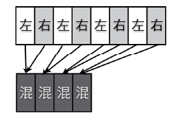

# 第01章 PSTN与VoIP基础
# 第02章 PSTN、PBX及呼叫中心业务
# 第03章 初识FreeSWITCH
# 第04章 运行FreeSWITCH
# 第05章 FreeSWITCH架构
# 第06章 拨号计划
# 第07章 SIP协议
# 第08章 媒体
# 第09章 SIP模块
# 第10章 基本技能
# 第11章 基本功能与实现
# 第12章 高级功能与配置实例
# 第13章 FreeSWITCH与FreeSWITCH对接
# 第14章 FreeSWITCH与其他设备或系统对接
# 第15章 其他技巧与实例
# 第16章 嵌入式脚本
# 第17章 嵌入式及HTTP开发
# 第18章 Event Socket
# 第19章 使用ESL开发
# 第20章 源代码导读及编译指南
# 第21章 FreeSWITCH源代码分析
# 第22章 FreeSWITCH二次开发

通过对本书前面章节的学习，我们熟悉了FreeSWITCH的使用方法，熟悉了FreeSWITCH的源代码。现在，该轮到我们自己写代码的时候了。当然，在前面我们也写过代码，但都是使用嵌入式脚本及ESL接口等在FreeSWITCH外部开发的。在本章，我们将以笔者在学习和使用过程中的实际例子为例，讲一下如何修改FreeSWITCH的源代码，如何将自己的成果提交到官方的代码库里，为开源项目做贡献。最后，带领大家从头开始开发一个新的模块，以复习和巩固前面学过的知识，告别“纸上谈兵”，冲到战场的一线，为将来的开发打下坚实的基础。

## 给FreeSWITCH汇报Bug和打补丁

大多数商业的系统都是闭源的，有时候出了问题甚至很难跟踪调试，更不容易发现Bug的具体位置。而相对来讲，使用开源项目的好处就是，我们可以参照源代码比较容易找到Bug。笔者在学习和使用FreeSWITCH的过程中，在官方的Bug跟踪工具中汇报了很多的Bug [1]，大多数都得到了很及时的修复。接下来，我们就一起看几个真实的例子（为节省篇幅，本章部分代码使用git diff格式，其中，行前的“-”表示删除的行，“+”代表添加的行）。

### 修复内存泄露问题

在笔者早期使用FreeSWITCH的过程中，发现FreeSWITCH的内存一直增长。查找了很久没有找到问题原因。而与同时，笔者却没有发现其他人遇到同样的问题。后来，笔者考虑到自己使用了mod_erlang_event模块，而使用该模块的人比较少，因此就研究了一个该模块的源代码（当时还不会使用valgrined工具查找内存泄露问题）。终于发现一处申请了内存似乎没有释放。后来，在源代码中，尝试增加了如下一行代码，在event指针用完之后将内存释放。

```
switch_event_destroy(&event);
```

进行了简单的压力测试后，发现问题似乎解决了。又在生产系统上运行了几天之后，确认没有问题了，笔者便在官方的Bug跟踪系统（Jira）上提交了一个Issue描述了发现的问题。然后，使用git diff>erlang_leak.diff命令产生了下面的补丁文件，并将补丁文件也附加了上去。

```
diff --git a/src/mod/event_handlers/mod_erlang_event/mod_erlang_event.c
    b/src/mod/event_handlers/mod_erlang_event/mod_erlang_event.c
index 9a09e80..cd58d95 100644
--- a/src/mod/event_handlers/mod_erlang_event/mod_erlang_event.c
+++ b/src/mod/event_handlers/mod_erlang_event/mod_erlang_event.c
@@ -650,6 +650,9 @@ static switch_status_t check_attached_sessions(listener_t *listener)
    }
    switch_thread_rwlock_unlock(listener->session_rwlock);
+

+switch_event_destroy(&event);
+
if (prefs.done) {
    return SWITCH_STATUS_FALSE; /* we're shutting down */
} else {
```

最后，该模块的作者将补丁合并到FreeSWITCH代码库中进去了。相关的Jira参见：http://jira.freeswitch.org/browse/FS-3488。

### 给中文模块打补丁

由于我们需要在FreeSWITCH中支持中文语音，因此要用到mod_say_zh模块。而在使用的过程中我们的团队成员发现了如下的错误：

```
[ERR] mod_say_zh.c:513: Unknown Say type=[18]
```

笔者鼓励同事去源代码里找一找出错的原因，他们很快就找到它是在第513行的一条日志输出语句中输出的。从源代码可以看到，错误的原因很明显，就是在case语句中没有对应的分支，进而转到default语句造成的。相关的部分代码片断如下：

```
490 case SST_NUMBER:
...
511 case SST_CURRENCY:
...
512 default:
513     switch_log_printf(SWITCH_CHANNEL_LOG, SWITCH_LOG_ERROR,
        "Unknown Say type=[%d]\n", say_args->type);
```

通过在全部源代码中搜索离它最近的第511行的常量定义SST_CURRENCY，我们找到了对应错误日志中18的是常量SST_SHORT_DATE_TIME（switch_types.h:418）。更深入的研究发现其实只需对它做与SST_CURRENT_DATE_TIME同样的处理即可。因而，我们产生了一个补丁。由于当时笔者已经具有代码库的提交权限，因此就直接将代码提交到了代码库中。而没有提交Jira。

如果读者有源代码的话，可以用以下命令查看相关的补丁（命令和输出结果如下，为节省篇幅，输出结果有删节）：

```
$ git show f255f6
commit f255f65a82e2cfe1aed1f44aa2459e5faaed150e
Author: Seven Du <dujinfang@gmail.com>
Date:   Thu Aug 1 09:50:51 2013 +0800
    add SHORT_DATE_TIME support
diff --git a/src/mod/say/mod_say_zh/mod_say_zh.c ...
        case SST_CURRENT_DATE:
        case SST_CURRENT_TIME:
    +    case SST_CURRENT_DATE_TIME:

case SST_SHORT_DATE_TIME:
        say_cb = zh_say_time;
```

通过这次修复，再使用该模块就不会再遇到这个错误了。

### 给FreeSWITCH核心打补丁

笔者在撰写本书的时候，阅读了大量的源代码，偶然发现其中对于多个Channel进行混音的源代码中可能有问题。该段代码不长，因此我们把它们全部贴在后面。

该函数的作用是对音频数据进行混音，即将多个声道的数据合并到一个声道里。

对多个Channel进行混音的函数是在第274行定义的，所有的音频数据存放到data指针中。其中，音频数据是16位的整型数据（int16_t）；samples代表采样率，如8000；channels代表有几个声道，如果在双声道中，它的值就是2。

第276行，定义了一个buf指针，备用；第277行，算出需要的缓冲区的字节长度；第279行，定义32位的无符号整型变量（uint32_t），以避免在计算中16位的整数溢出。

```
274  SWITCH_DECLARE(void) switch_mux_channels(int16_t *data,
         switch_size_t samples, uint32_t channels)
275  {
276      int16_t *buf;
277      switch_size_t len = samples * sizeof(int16_t);
278      switch_size_t i = 0;
279      uint32_t j = 0, k = 0;
```

第281行，申请一个足够大的缓冲区，让buf指针指向它。然后使用一个双重for循环将两个声道对应位置的数据相加（第285行），并于第286行使用switch_normalize_to_16bit [2]将32位的整数标准化成16位的整数，在第287行将数据写入缓冲区。

```
281      switch_zmalloc(buf, len);
282
283      for (i = 0; i < samples; i++) {
284          for (j = 0; j < channels; j++) {
285              int32_t z = buf[i] + data[k++];
286              switch_normalize_to_16bit(z);
287              buf[i] = (int16_t) z;
288          }
289      }
```

全部处理完成后，再使用memcpy内存拷贝函数将数据从缓冲区中复制到原来的数据区域（第291行），并释放缓冲区（第292行）。

```
291      memcpy(data, buf, len);
292      free(buf);
293
294  }
```

具体的算法应该很直观。一个双声道混音的示意图如图22-1所示（其中“左”、“右”分代表左、右声道）。



<center>图22-1　双声道混音</center>

在笔者刚刚看到该代码时，也是花了一些时间明白了混音的算法。不过，笔者立即想到，既然是混音，那么如果将两个声道混合成一个声道，理论上只占用一半的内存缓冲区，所以原来的缓冲区如果可以重复利用的话，能不能不申请新的缓冲区呢？通过一番实验，笔者实现了如下改进的算法。

在新的算法中，笔者还是使用一个双重for循环遍历所有数据，但是，这里没有申请新的内存缓冲区，而是在第280行使用了一个新的中间变量z。将对应的音频数据相加后放到z中（第282行），然后将数据标准化（第283行），并直接将最后结果写入原来的data指针所传入的数据缓冲区即可（第284行，因为原来的数据我们已经取出来计算过了，不再需要了）。

```
274  SWITCH_DECLARE(void) switch_mux_channels(int16_t *data,
         switch_size_t samples, uint32_t channels)
275  {
276      switch_size_t i = 0;
277      uint32_t j = 0;
278
279      for (i = 0; i < samples; i++) {
280          int32_t z = 0;
281          for (j = 0; j < channels; j++) {
282              z += data[i * channels + j];
283              switch_normalize_to_16bit(z);
284              data[i] = (int16_t) z;
285          }
286      }
287  }
```

通过使用新的算法，至少节省了一半的内存，而且避免了重复的内存申请造成的内存碎片，节省了一个内存拷贝操作及6行代码。笔者并没有实际测试以比较最终的效果，不过理论上是这样的。

在经过反复测试确认没有问题之后，笔者将该改进提到了官方的Jira上，见：http://jira.freeswitch.org/browse/FS-4622。虽然笔者当时具有直接向代码库中提交代码的权限，但是毕竟对于核心代码的改动问题比较重大。把它记录到Jira上，以后万一出了问题也容易跟踪。而且，Jira会给原代码的作者一个比较友好的通知，让作者决定是否将代码合并进去，这是一种比较友好的协作方式。

### 高手也会犯错误

在20.3.2章我们讲到过，由于SWITCH_CHANNEL_SUCCESS的常量值为0，因此，在使用时需要严格进行“==”判断，否则就容易出现错误。在FreeSWITCH代码的历史上，就曾经出现过这样的错误，其中一次是笔者发现的，记录在该Jira报告中：http://jira.freeswitch.org/browse/FS-5351。

该Bug已经修复，感兴趣的读者仍可以使用git showc4e7c30命令查看当时是如何修复的，以避免自己以后犯同样的错误。如下可以看出，在“+”一行，增加了“SWITCH_STATUS_SUCCESS==”判断。


```
$ git show c4e7c30
...
diff --git a/src/mod/endpoints/mod_sofia/mod_sofia.c ...
@@ -968,7 +968,7 @@ static switch_status_t sofia_write_video_frame(switch_core_session_t *session, s
                return SWITCH_STATUS_SUCCESS;
        }
if (switch_core_media_write_frame(session, frame, flags, stream_id, SWITCH_MEDIA_TYPE_VIDEO)) {

if (SWITCH_STATUS_SUCCESS == switch_core_media_write_frame(

session, frame, flags, stream_id, SWITCH_MEDIA_TYPE_VIDEO)) {
    return SWITCH_STATUS_SUCCESS;
}
```

为节省篇幅，对上述命令的输出进行了删减，读者可以自己试一下，或者直接访问Web版的界面查看：http://fisheye.freeswitch.org/changelog/freeswitch.git/?cs=c4e7c30。

当然，我们写这个例子的目的是告诉大家，即使是FreeSWITCH的作者，也可能会犯错误，所以在汇报Bug时不要有过多顾虑。

### 汇报严重的问题

在上一节，我们鼓励大家要勇敢汇报Bug。许多朋友可能在遇到问题时不确定哪个问题是Bug，便在邮件列表中询问，一来二去，耽误了好长时间。FreeSWITCH的作者Anthony Minessale经常在邮件列表中说：“在Jira上告诉一个人这不是一个Bug比在邮件列表中跟踪这些问题要容易得多”。意思是说，如果感觉类似Bug的问题尽管往Jira上提，而不要使用邮件列表。因为Jira是一个Bug跟踪系统，即使你的判断不对，别人也会直接在Jira系统上告诉你，流程很清晰。而如果使用邮件列表，因为群里的很多人每天都会收到几百封的邮件，你的信息很容易就被埋没了。

当然，无论如何，如果遇到系统崩溃，那一定是个重大问题。FreeSWITCH的目标是让它不崩溃，因此所有的崩溃都应该向Jira汇报。

笔者就曾经汇报过一个在使用会议系统时系统崩溃的案例。当发现系统崩溃后，笔者根据崩溃后产生的core Dump文件（内核转储文件），发现了一些导致问题的可能原因。下面是当时内核文件的反向跟踪信息（Back Trace，在GDB中使用bt命令得到）：

```
Thread 38 (core thread 37):
#0  switch_core_session_get_channel (session=0x0) at switch_core_session.c:1190
#1  0x00000001033d5e09 in conference_video_thread_run (thread=0x0, obj=0x7fd51c8a1f68) at mod_conference.c:1436
#2  0x00007fff887bc8bf in _pthread_start ()
#3  0x00007fff887bfb75 in thread_start ()
```

可以看出，在第“#0”个函数调用中，session=0x0，即session指针为空指针，导致后续的操作出错。而该函数是在第“#1”个函数调用的时候出现的，它发生在mod_conference:1436，因此我们很容易在源代码目录中找到它，具体如下：

```
1436 switch_channel_t *ichannel =switch_core_session_get_channel(imember->session);
```

分析问题我们可以得出，问题的原因在于并不是所有的会议成员（imember）都会对应一个Channel（如录、放音等虚拟成员）。因此笔者简单生成了一个补丁，提交到Jira上。后来Anthony在合并的时候又修改了一些内容，因此产生了如下的补丁：

```
for (imember = conference->members; imember; imember = imember->next) {
-           switch_channel_t *ichannel =
-               switch_core_session_get_channel(imember->session);
+           switch_core_session_t *isession = imember->session;
+           switch_channel_t *ichannel;
+
+           if (!isession || !switch_core_session_read_lock(ises
+                   continue;
+           }
+
+           ichannel = switch_core_session_get_channel(imember->ses
...
+           switch_core_session_rwunlock(isession);
```

经过测试发现，该补丁虽然解决了崩溃问题，但可能会造成死锁。再次反馈后，发现是又忘了判断SWITCH_STATUS_SUCCESS了。通过如下补丁把问题修复。

```
-    if (!isession || !switch_core_session_read_lock(isession)) {
+    if (!isession || switch_core_session_read_lock(isession) != SWITCH_STATUS_SUCCESS) {
```

本案例记录在http://jira.freeswitch.org/browse/FS-4318处，感兴趣的读者可以深入研究。

### 给Sofia-SIP打补丁

前面讲的一些例子都是在FreeSWITCH代码中打补丁。我们再来看一个更深层次的例子。

为了避免重复发明轮子，FreeSWITCH使用了大量第三方的代码库。同时为了编译方便，以及减少由于不同版本的引起的可能的混乱，FreeSWITCH尽量将一些协议兼容的第三方代码库也放到FreeSWITCH源代码库中。这些库一般放到FreeSWITCH源代码的libs目录中。Sofia-SIP即是其中之一。

笔者以前做过一个项目，需要在FreeSWITCH中增加MSRP [3]协议的支持。而经过跟踪发现，Sofia-SIP底层根本不支持该协议，因而如果使用该协议，就需要修改Sofia-SIP底层的代码。但Sofia-SIP库近几年的维护几乎停滞。经过与FreeSWITCH官方的沟通，他们说我们可以先把代码提交到FreeSWITCH中，等到需要的时候再提交到上游的Sofia-SIP库中。

后来，笔者便在Jira上提交了一个补丁（http://jira.freeswitch.org/browse/FS-3748）。下面我们来简单看一下这个补丁的内容。

首先，在Sofia-SIP库中提交补丁时，需要更新.update文件。该文件的内容不重要，一般就是写上当前的日期。通过修改该文件，当再次执行`make mod_sofia进行编译时，它便会感知到Sofia-SIP库的变化，进而会重新编译Sofia-SIP库 [4]。

```
diff --git a/libs/sofia-sip/.update b/libs/sofia-sip/.update
@@ -1 +1 @@
-Tue Nov 22 18:16:53 CST 2011
+Tue Dec  6 18:12:20 CST 2011
```

实际的支持代码需要在多个文件中添加，如首先在sdp_parse.c中，让它在解析的时候认识SDP中MSRP相关的内容（否则协议栈会拒绝）：
```
diff --git a/libs/sofia-sip/libsofia-sip-ua/sdp/sdp_parse.c ...
+  else if (su_casematch(s, "TCP/MSRP"))
+    m->m_proto = sdp_proto_msrp, m->m_proto_name = "TCP/MSRP";
+  else if (su_casematch(s, "TCP/TLS/MSRP"))
+    m->m_proto = sdp_proto_msrps, m->m_proto_name = "TCP/TLS/MSRP";
   else if (su_casematch(s, "UDP"))
     m->m_proto = sdp_proto_udp, m->m_proto_name = "UDP";
   else if (su_casematch(s, "TCP"))
```
在生成SDP的时候也要加入MSRP支持：
```
diff --git a/libs/sofia-sip/libsofia-sip-ua/sdp/sdp_print.c ...
     case sdp_proto_rtp:   proto = "RTP/AVP"; break;
     case sdp_proto_srtp:  proto = "RTP/SAVP"; break;
     case sdp_proto_udptl: proto = "udptl"; break;
+    case sdp_proto_msrp:  proto = "TCP/MSRP"; break;
+    case sdp_proto_msrps:  proto = "TCP/TLS/MSRP"; break;
```
最后，我们也把MSRP协议相关的常量加到sdp_proto_e枚举类型中。这样底层的协议栈就能适当解析出MSRP协议的相关内容，剩下的，我们只需要在上层的mod_sofia模块中增加相关的支持代码就行了。
```
diff --git a/libs/sofia-sip/libsofia-sip-ua/sdp/sofia-sip/sdp.h
@@ -243,6 +243,8 @@ typedef enum
   sdp_proto_rtp = 256,                 /**< RTP/AVP */
   sdp_proto_srtp = 257,                /**< RTP/SAVP  */
   sdp_proto_udptl = 258,               /**< UDPTL. @NEW_1_12_4. */
+  sdp_proto_msrp =  259,               /**< TCP/MSRP @NEW_MSRP*/
+  sdp_proto_msrps = 260,               /**< TCP/TLS/MSRP @NEW_MSRP*/
   sdp_proto_tls = 511,                 /**< TLS over TCP */
   sdp_proto_any = 512                  /**< * wildcard */
    } sdp_proto_e;
```
  进行上述修改后，Sofia-SIP库就具备支持MSRP协议的能力了。当然，具体的MSRP协议支持和处理还需要上层代码（如在mod_sofia中增加相应逻辑）的支持，在此我们就不多讲了。在本例中，我们介绍了底层的Sofia-SIP库的修改方法以及注意事项。补丁内容的本身并不重要，重要的是了解这里的方法和流程，以便在以后遇到类似问题时进行更深入的研究。在后面，FreeSWITCH开发者还修复了一些Bug并增加了SIP over WebSocket支持，以支持WebRTC。有兴趣的读者也可以看一下这部分的更新历史。

### 给现有App增加新功能

在笔者的某一个咨询项目中，有个客户提到，他想与现有的WebServer集成，但又不想使用（比方说ESL等）比较复杂的解决方案，问笔者有没有更好的解决方案。笔者推荐他可以直接在Dialplan或Lua脚本中调用curl App跟远程的HTTP服务器交互。curl App是在mod_curl中实现的，在Dialplan中的使用方法如下：

```xml
<action application="curl" data="http://..."/>
```

这个方案最初使用起来效果不错，直到某一天遇到个问题——有些curl调用由于服务器的卡死导致Channel老是卡死，电话挂掉以后还有残留的僵尸数据。出现该问题的原因是curl调用远程服务器一直没有返回，因而线程阻塞。经过对源代码进行研究，发现mod_curl是使用libcurl实现的，但并没有使用超时机制，所以导致了上述问题。

使用开源项目的好处就是我们不仅能修复Bug，还能随时添加新功能。通过查阅libcurl的文档，我们发现可以通过CURLOPT_CONNECTTIMEOUT和CURLOPT_TIMEOUT选项控制请求超时。其中，前者是连接超时，即多长时间连接不到服务器即为超时；后者是执行超时，即在长时间服务器不返回结果即为超时。

我们发现在mod_curl中连接远程服务器并获取文件的函数是在do_lookup_url函数中实现的，因此我们很快实现了如下的补丁（有时候，做好事是不需要留名的，但有时候在开源项目中留下自己的名字也感觉挺不错的，因而笔者在该模块前两位贡献者之后留下了自己的名字）：
```
  * Rupa Schomaker <rupa@rupa.com>
  * Yossi Neiman <mishehu@freeswitch.org>
+ * Seven Du <dujinfang@gmail.com>
```
为了存放我们的超时参数，我们定义了一个结构体，并使用typedef定义了一个新的类型curl_options_t：
```
+struct curl_options_obj {
+       long connect_timeout;
+       long timeout;
+};
+typedef struct curl_options_obj curl_options_t;
```
然后，我们在原来的do_lookup_url函数的基础上增加了一个curl_options_t指针类型的参数options：
```
-static http_data_t *do_lookup_url(...,
+static http_data_t *do_lookup_url(..., curl_options_t *options)
```
然后增加如下补丁并进行判断，如果options参数存在（保证向后兼容，如果没有提供超时参数，则继续保持原来的行为），则调用libcurl的switch_curl_easy_setopt函数设置相应的超时参数。
```
+       if (options) {
+           if (options->connect_timeout) {
+               switch_curl_easy_setopt(curl_handle,
+                   CURLOPT_CONNECTTIMEOUT, options->connect_timeout);
+           }
+
+           if (options->timeout) {
+               switch_curl_easy_setopt(curl_handle,
+                   CURLOPT_TIMEOUT, options->timeout);
+           }
+       }
```
至此，do_lookup_url函数就已经具备超时功能了。但为了使用它，在curl App对应的函数中我们需要先初始化一个optioins结构体，并从当前的通道变量中收集相关的超时参数：
```
+       curl_options_t options = { 0 };
+       const char *curl_timeout;
+       curl_timeout = switch_channel_get_variable(channel, "curl_connect_timeout");
+       if (curl_timeout) options.connect_timeout = atoi(curl_timeout);
        +
+       curl_timeout = switch_channel_get_variable(channel, "curl_timeout");
+       if (curl_timeout) options.timeout = atoi(curl_timeout);
```
初始化完了options参数，我们就可以在原来调用的位置把该参数加上了：
```
- http_data = do_lookup_url(pool, url, method, postdata, content_type);
+ http_data = do_lookup_url(pool, url, method, postdata, content_type, &options);
```
至此，我们增加的功能就应该完成了。不过，后来我们在编译时发现还有一个错误。由于mod_curl模块还同时实现了一个curl API命令，它也调用了do_lookup_url函数。而由于我们修改了do_lookup_url函数的定义，故导致无法编译。我们暂时不准备也为该API命令增加类似的功能（我们没有用到它），因此为了简单起见，我们仅仅给该调用增加了一个空指针作为参数。
```
- http_data = do_lookup_url(pool, url, method, postdata, content_type);
+ http_data = do_lookup_url(pool, url, method, postdata, content_type, NULL);
```
编译顺利通过。通过在Dialplan中增加如下的设置，我们的问题也顺利解决了。

```xml
<action application="set" data="curl_connect_timeout=3000"/>
<action application="set" data="curl_timeout=5000"/>
<action application="curl" data="http://..."/>
```

综上，该补丁的实现思路是比较典型的，其遵循了FreeSWITCH的架构和设计思想——通过通道变量改变App的行为。所以，我们增加了两个通道变量（curl_connect_timeout和curl_timeout），并在curl App执行过程中根据这两个变量的值决定是否启动超时机制，以及控制合理的超时时间。
该补丁的提交哈希是d8a02dc，读者可以通过“git show d8a02dc”命令查看。另外，Anthony后来也在curl API命令中增加了该超时特性的支持，详见提交6ef3f7bd。

### 给FreeSWITCH增加一个新的Interface

故事要从若干年前说起。当年，笔者学习FreeSWITCH时间不长。在测试中文模块（mod_say_zh）时，发现它说出来的中文不符合中文用户的习惯。比如，在用英语读美元时，$10.20的习惯读法是“10 dollar 20 cents”，而在中文模块中，就顺便读成了“十元二十分”，这显然不符合中文习惯。

当时，笔者就进行了一些改进，并提交了一个补丁，见http://jira.freeswitch.org/browse/FS-2809。当时笔者做得比较激进，连厘都写上去了，如10.1234元将读成“十元一角二分三厘四”。当然，当时只是为了好玩，因为笔者相信当时FreeSWITCH圈里的人，应该没有人能比笔者更懂中文了。

不过，在补丁提交了之后，原来模块的维护者Steve Underwood却说，笔者做的修改太“中国化”了，如果那样改了，势必不符合世界其他地区的习惯。在此之后笔者才意识到，原来中文是全世界的，而我确实是见识短浅。比方说，如果在美国，即使使用中文读，也确实应该是“十元二十分”啊！也许正是从那以后，笔者考虑问题都会把眼光放远一些了。

但无论如何，一定要是支持中国的中文才叫中文。所以笔者与原作者探讨，是否增加一个通道变量检查之类的（类似于22.1.8节我们提到的用通道变量控制相关行为），让用户可以酌情选择？不过一直没有得到回应。后来，Mike Jerris（FreeSWITCH三剑客之一）提议，可以做一个新的Interface时，我才恍然大悟——是啊，怎么没想到这一点？

后来笔者修改了补丁，增加了一个新的Say Interface——zh_CN。

其实，增加一个Say Interface很简单，只需要在mod_say_zh中（注意，我们是在该模块中新增加了一个Interface，而没有增加新的模块）增加如下的接口定义：
```
+       say_zh_CN_interface = switch_loadable_module_create_interface(
            *module_interface, SWITCH_SAY_INTERFACE);
+       say_zh_CN_interface->interface_name = "zh_CN";
+       say_zh_CN_interface->say_function = zh_CN_say;
```
然后，实现zh_CN_say回调函数，该函数基本上与原来的zh_say函数一样（还是调用跟以前一样的函数），只是在读货币（SST_CURRENCY）的时候，使用了笔者专门实现的只针对中国的zh_CN_say_money函数。
```
+static switch_status_t zh_CN_say(...
+{
+       case SST_CURRENCY:
+       say_cb = zh_CN_say_money;
```
关于zh_CN_say_money函数具体的算法在此就不多讲了，有兴趣的读者可以参考Jira上的链接。

最后，我们再补充点小知识。当时FreeSWITCH出现了两个大的分支，一个是master，一个是v1.2.stabe。前者是最新的开发版，并将成为新的1.4版，而后者将保持1.2版的向后兼容。因此，在这个时期，提交代码时要同时提交到两个分支中。

首先，笔者在本地提交了代码，在提交的Message信息中注明了“FS-2809--resolved”，当该提交推到远程的Git代码库时，代码库中的钩子程序（hook）会自动与“FS-2809”那条Jira报告相关联，并将Jira报告的状态设为“Resolved”。

```
$ git ci -m 'FS-2809 --resolved' .
[master 51d3282] FS-2809 --resolved
 1 file changed, 97 insertions(+), 1 deletion(-)
```
然后，通过cherry-pick将本次修改合并到v1.2.stable分支中：
```
$ git checkout v1.2.stable
Switched to branch 'v1.2.stable'
$ git cherry-pick 51d3282
[v1.2.stable f90e828] FS-2809 --resolved
 1 file changed, 97 insertions(+), 1 deletion(-)
```
最后将本地两个分支的修改推到远程Git仓库，让世界了解中国。
```
$ git push ssh master
$ git push ssh v1.2.stable
```
从本例中可以看出，实现一个新的Interface也不是很复杂的事。当然，仔细阅读源代码，保持与其他开发者沟通是很重要的。

[1] 当然，不要因此误认为开源的系统Bug多，其实闭源的通常Bug更多，只是你看不见而已。因为开源的项目，全世界的人都在各种应用场景下使用，所有人都能看到源代码，因而更容易发现Bug，而且通常开源社区也会更及时地修复。 

[2] 看起来像一个函数，实际上是一个在switch_utils.h:236定义的宏。 

[3] MSRP（Message Session Relay Protocol）称为中继会话中继协定，可用于基于Session的即时消息传递或文件传递等，参见http://tools.ietf.org/html/rfc4975。 

[4] 当然，实际的Makefile编译机制应该能自动探测到所有依赖的文件的变化，而不需要这种手工修改自定义的文件。但由于Sofia-SIP是第三方的库，为了避免过度耦合，因而采用了这种比较简单的方法。FreeSWITCH中使用的其他的第三方库也有类似的机制。

## 写一个新的FreeSWITCH编解码模块

我们前面的例子都是在为现有的代码上打补丁，在本节我们看一下如何增加一个新的模块。

在笔者测试VP8视频编码时，FreeSWITCH还不支持VP8，因而需要自己添加支持。好在，在FreeSWITCH中写一个新模块很简单。而且，由于FreeSWITCH中的视频模块不支持转码，因而大部分回调函数什么也不做。

我们首先在FreeSWITCH源代码目录中src/mod/codecs下创建mod_vp8目录，并在里面创建mod_vp8.c文件，然后，找一个类似的编解码模块，并把它里面的内容复制过来稍加修改即可。当时笔者发现与VP8最像的模块是mod_theora，因此就直接复制了mod_threora.c里面的内容。修改后的mod_vp8.c内容如下。

首先，是include和模块声明。在该模块中，我们只需要load函数。

```
33  #include <switch.h>
34
35  SWITCH_MODULE_LOAD_FUNCTION(mod_vp8_load);
36  SWITCH_MODULE_DEFINITION(mod_vp8, mod_vp8_load, NULL, NULL);
```

在编解码模块中，当在核心中初始化一个编码时，首先回调的就是init，即这里的switch_vp8_init函数。该函数在此要做的事情不多，基本上直接返回了成功值——SWITCH_STATUS_SUCCESS。

```
38  static switch_status_t switch_vp8_init(switch_codec_t *codec, switch_codec_flag_t flags, const switch_codec_settings_t *codec_settings)
39  {
...
51          return SWITCH_STATUS_SUCCESS;
```

如果在调用该模块进行编码时或解码时，将调用这里的encode或decode函数。由于我们并不支持视频的编、解码，因此直接返回SWITCH_STATUS_FALSE。实际上，由于核心本身不支持编解码，因而永远也不会回调到这里。

```
55  static switch_status_t switch_vp8_encode(switch_codec_t *codec,
...
61  {
62      return SWITCH_STATUS_FALSE;
63  }
64
65  static switch_status_t switch_vp8_decode(switch_codec_t *codec,
...
71  {
72      return SWITCH_STATUS_FALSE;
73  }
```

当然，最后要释放编解码器的回调函数destroy：

```
75  static switch_status_t switch_vp8_destroy(switch_codec_t *codec)
76  {
77      return SWITCH_STATUS_SUCCESS;
78  }
```

其实该模块最重要的就是load函数了。在load函数中，第82行初始化了一个codec_interface，它是一个switch_codec_interface_t类型的指针，说明我们想要创建一个Codec Interface。第84行就紧接着创建了它。第85行，将该codec_interface安装到核心中去。

```
80  SWITCH_MODULE_LOAD_FUNCTION(mod_vp8_load)
81  {
82      switch_codec_interface_t *codec_interface;
83      /* connect my internal structure to the blank pointer passed to me */
84      *module_interface = switch_loadable_module_create_module_interface(pool, modname);
85      SWITCH_ADD_CODEC(codec_interface, "VP8 Video (passthru)");
```

第87行，在该codec_interface上增加了一个实现（Implementation），并增加了实现的回调函数。具体的参数定义我们在此就不多讲了，总之它定义了4个回调函数，即我们上面讲过的init、encode、decode和destroy（参见20.3.13节的内容）。虽然有些回调函数什么也不做，不过我们也最好写上它们，以便跟现有的其他模块中的代码一致。最后，返回SWITCH_STATUS_SUCCESS以标明模块加载成功(第102行）。

```
87      switch_core_codec_add_implementation(pool, codec_interface,
88          SWITCH_CODEC_TYPE_VIDEO, 99, "VP8", NULL, 90000, 90000, 0,
89          0, 0, 0, 0, 1, 1, switch_vp8_init, switch_vp8_encode,
                              switch_vp8_decode, switch_vp8_destroy);
...
102     return SWITCH_STATUS_SUCCESS;
```

后来，Anthony在做WebRTC时，还用同样的方法增加了red和ulpfec视频编码，不过那就是后话了（见第91行和第96行）。

```
91      SWITCH_ADD_CODEC(codec_interface, "red Video (passthru)");
96      SWITCH_ADD_CODEC(codec_interface, "ulpfec Video (passthru)");
```

有了上述的目录和模块实现文件后，在核心进行configure的时候将会自动生成一个Makefile，不过，我们也可以先自己写一个Makefile用于测试。在Makefile中加入如下内容后就可以编译该模块了。其中第1行指定FreeSWITCH源代码的主目录，第2行装入通用的模块编译规则：

```
BASE=../../../..
include $(BASE)/build/modmake.rules
```

然后，直接在当前目录下可以使用如下命令编译安装：

```
# make install
```

接下来就可以在FreeSWITCH中直接加载使用了。当然，最后笔者把该模块也提交给官方了，相关Jira的地址是：http://jira.freeswitch.org/browse/FS-4092。

## 从头开始写一个模块

在22.2节，我们给大家讲了编码、解码模块的实现方法。本节我们再来从头实现一个综合性模块，实现自己的Dialplan、自己的App以及自己的API。

### 初始准备工作

在准备下一步之前，我们先要为我们的模块取一个名字。笔者写书写到这里，脑子几乎用尽了，实在想不出更有创意的名字了，不如就叫mod_book吧。

我们的mod_book也将脱离FreeSWITCH源代码的环境，单独存放。因此，你可以在任何喜欢的目录下创建目录mod_book，然后在里面创建mod_book.c。内容我们还是参照上面讲的mod_vp8.c（它已经足够简单了），将不需要的函数的功能删除后，并把所有的mod_vp8替换为mod_book，得到的新的模块文件如下：

```
01  /* Book Example: Dialplan/App/API  Author: Seven Du */
02
03  #include <switch.h>
04
05  SWITCH_MODULE_LOAD_FUNCTION(mod_book_load);
06  SWITCH_MODULE_DEFINITION(mod_book, mod_book_load, NULL, NULL);
07
08  SWITCH_MODULE_LOAD_FUNCTION(mod_book_load)
09  {
10      *module_interface = switch_loadable_module_create_module_interface(pool, modname);
11      return SWITCH_STATUS_SUCCESS;
12  }
```

可以看出，该模块应该是最简单了，它只有短短的12行（去掉注释只有10行）。我们迅速创建一个Makefile，内容如下（注意，我们这里的BASE变量引用的是一个绝对路径，它就是FreeSWITCH源代码的路径，如果你的源代码路径与笔者的不同，应该相应地修改它）：

```
BASE=/usr/src/freeswitch
include $(BASE)/build/modmake.rules
```

然后，直接在当前目录执行make install，该模块就安装好了。

接着，到FreeSWITCH控制台上加载该模块，从日志输出中可以看到我们的模块已经加载好了：

```
freeswitch> load mod_book
[CONSOLE] switch_loadable_module.c:1464 Successfully Loaded [mod_book]
```

虽然到此为止，我们的模块还什么都不能做，但至少它顺利加载了。我们要把这阶段性的成果记录下来。执行以下3条命令将这些成果记录到Git中。

```
$ git init
$ git add Makefile mod_book.c
$ git ci -m 'initial commit'
```

### 写一个简单的Dialplan

为了使我们的模块更有用，我们需要增加一些功能。在此我们就实现一个自己的Dialplan Interface——我们仍然叫它book。下面我们修改load函数，首先增加一个变量声明：

```
switch_dialplan_interface_t \*dp_interface;
```

然后，在*module_interface一行后，向核心注册我们的Dialplan，并设置一个回调函数：

```
SWITCH_ADD_DIALPLAN(dp_interface, "book", book_dialplan_hunt);
```

然后实现该回调函数。注意这里我们文件中的行号发生了变化。该回调函数是使用SWITCH_STANDARD_DIALPLAN声明的。在第10行，我们定义了一个switch_caller_extension_t类型的指针变量，用于定义相关的extension（与XML Dialplan中的<extension>标签相对应）。第11行将得到当前的Channel。第14行将得到一个caller_profile，它里面保存了主叫用户的相关信息。比如，在第20行我们就在日志中打印出了一些我们关心的信息。该信息跟我们最早在第6章讲到的“绿色的行”是一样的，在此我们自己编程，实现了“绿色的行”。

```
08  SWITCH_STANDARD_DIALPLAN(book_dialplan_hunt)
09  {
10      switch_caller_extension_t *extension = NULL;
11      switch_channel_t *channel = switch_core_session_get_channel(session);
12
13      if (!caller_profile) {
14          caller_profile = switch_channel_get_caller_profile(channel);
15      }
16
17      switch_log_printf(SWITCH_CHANNEL_SESSION_LOG(session), SWITCH_LOG_INFO,
18          "Processing %s <%s>->%s in context %s\n",
19          caller_profile->caller_id_name, caller_profile->caller_id_number,
20          caller_profile->destination_number, caller_profile->context);
```

当FreeSWITCH执行到该回调函数时，说明有一路电话进入了路由（ROUTING）阶段，我们要查找Dialplan，返回对应的Extension（或里面的Action），以后在后续Channel进入执行阶段时（EXECUTE），执行相关的App。在第22行，我们初始化了一个extension。第26行，往该extension上增加了一个App。在此我们并没有进行任何查找，而是直接硬编码了一个log的App。最后，返回我们生成的extension（第29行）。

```
22      extension = switch_caller_extension_new(session, "book", "book");
23
24      if (!extension) abort();
25
26      switch_caller_extension_add_application(session, extension,
27          "log", "INFO Hey, I'm in the book");
28
29      return extension;
30  }
```

进行了这些改变后，我们再次执行make install，并在FreeSWITCH控制台上使用reload mod_book重新加载模块。然后可以快速使用如下命令实验一下该Dialplan的效果：

```
freeswitch> originate user/1006 9999 book
```

还记得我们在6.7节所说的Dialplan的三要素吧？其中，9999就是Extension，book就是Dialplan的名字；而Context由于省略了，默认就是default。因此，可以在日志中看到如下的“绿色的行”，并且也可以看到我们增加的App也如期执行了（输出了对应的日志）。

```
[INFO] mod_book.c:17 Processing  <0000000000>->9999 in context default
[INFO] mod_dptools.c:1595 Hey, I'm in the book
```

至此，我们的Dialplan应该可以正常工作了。我们可以在XML Dialplan里转向它：

```
<action application="trasfer" data="9999 book default" />
```

也可以在Sofia Profile中（如internal）直接使用它，配置如下：

```
<param name="dialplan" value="book"/>
<param name="context" value="default"/>
```

当然，我们的Dialplan功能还不是很强大，有待于进一步加强。我们继续将它提交到Git中（在提交之前执行一下git diff是个好习惯）：

```
$ git status
$ git diff
$ git commit -m 'add Dialplan Interface' .
```

到这里我们应该更深入地理解Dialplan到底是干什么的——它就是负责找到一组App，保证以后FreeSWITCH后续能执行这些App。

### 增加一个App

在上述的Dialplan的例子中，我们还是使用了现有的log App作为例子。下面我们该实现一个自己的App了。我们继续将该App取名为book。实现的步骤如下。

首先，声明一个app_interface：

```
switch_application_interface_t *app_interface;
```

将该App向核心注册，并增加一个回调函数book_function：

```
SWITCH_ADD_APP(app_interface, "book", "book example", "book example",
                   book_function, "[name]", SAF_SUPPORT_NOMEDIA);
```

实现该回调函数。该函数的参数将从data指针中传过来，如果为空（第39行），则我们给它指定一个默认的名字；否则，就把传入的参数作为书的名字（第42行）。第45行输出一条日志，打印自己的名字：

```
35  SWITCH_STANDARD_APP(book_function)
36  {
37      const char *name;
38
39      if (zstr(data)) {
40          name = "No Name";
41      } else {
42          name = data;
43      }
44
45      switch_log_printf(SWITCH_CHANNEL_SESSION_LOG(session),
46          SWITCH_LOG_INFO, "I'm a book, My name is: %s\n", name);
47  }
```

当然，我们也不忘了在我们刚才的Dialplan中的extension上加上我们自己实现的App：

```
switch_caller_extension_add_application(session, extension,
    "book", "FreeSWITCH - The Definitive Guide");
```

重新编译加载后，再执行一次，日志如下（可以看出，我们的App已经执行了）：

```
[INFO] mod_dptools.c:1595 Hey, I'm in the book
[INFO] mod_book.c:45 I'm a book, My name is: FreeSWITCH - The Definitive Guide
```

最后，当然我们也不要忘了再把我们的改变提交到Git里：

```
$ git commit -m 'add book App' .
```

### 写一个API

通过上面的例子，相信读者也能想到，自己写一个API也是很容易的。出于完整性考虑，我们就来再写一个。我们已经完全没有创意了，因此该API的名字还是叫book。

声明一个api_interface：

```
switch_api_interface_t *api_interface;
```

将API注册到核心，并设置回调函数book_api_function：

```
SWITCH_ADD_API(api_interface, "book", "book example", book_api_function, "[name]");
```

实现回调函数。该回调函数与上面的book_function类似，不同的是，参数是从cmd（第53行）获取的，而且这里我们没有打印日志，而是直接将命令的返回结果写到输出流（stream）里去了（第59行）。

```
49  SWITCH_STANDARD_API(book_api_function)

50  {
51      const char *name;
52
53      if (zstr(cmd)) {
54          name = "No Name";
55      } else {
56          name = cmd;
57      }
58
59      stream->write_function(stream, "I'm a book, My name is: %s\n", name);
60
61      return SWITCH_STATUS_SUCCESS;
62  }
```

重新编译并加载该模块后，我们在日志中看到如下的输出，它分别增加了以book为名称的Dialplan、Application和API Function（我们在前面还没注意到呢）。

```
[NOTICE] switch_loadable_module.c:227 Adding Dialplan 'book'
[NOTICE] switch_loadable_module.c:269 Adding Application 'book'
[NOTICE] switch_loadable_module.c:315 Adding API Function 'book'
```

然后，我们在FreeSWITCH控制台上就可以执行book命令了：

```
freeswitch> book
I'm a book, My name is: No Name
freeswitch> book FreeSWITCH - The Definitive Guide
I'm a book, My name is: FreeSWITCH - The Definitive Guide
```

再一次，我们将里程碑成果提交到Git中：

```
$ git commit -m 'add book API Interface' .
```

### 小结

在本节的例子中，我们从无到有一步一步实现了一个模块，添加了Dialplan、App以及API。在前面的例子中，虽然我们阅读了很多源代码，但是“纸上得来终觉浅”，唯有手工一步一步地做一次才知到每一步是怎么来的。

另外，我们也把每一步的结果都提交到Git版本管理系统中了，因而可以随时查阅历史，重温这段美好的回忆。各位读者可以自己试一下，也可以从本书的Github站点上翻阅在写作本书时的美好回忆。

## 使用libfreeswitch

FreeSWITCH不仅有完善的可加载模块支持，而且它的库libfreeswitch也可以被连接到其他系统中去，使得其他系统立即具有所有的FreeSWITCH中的功能。

### 自己写一个软交换机

下面我们就尝试自己写一个软交换机。这里说的自己写，并不是一切都从头写，而是利用现有的libfreeswitch库，把它集成到我们的系统中来。

假设我们已有了一个系统，该系统的功能非常强大。不过，为了便于讲解，我们把系统精简到了最简单的程序，即精简到它在执行后仅仅打印一条信息就退出。

```
int main(int argc, char **argv)
{
    printf("Hello, MySWITCH is running ...\n");
    return 0;
}
```

下面我们要将libfreeswitch集成进我们的系统中，因此我们对main函数做了一些改变，具体实现代码如下。其中，我们在第3行装入了switch.h头文件，以便我们能引用里面的函数；第7行，我们设置一个flags标志，让它使用核心数据库；第8行，定义一个console变量并设为true；第13行，设置一些默认的全局参数；第14行，初始化并加载模块；第15行，进入控制台循环。

```
01  /* MySwitch using libfreeswitch */
02
03  #include <switch.h>
04
05  int main(int argc, char** argv)
06  {
07      switch_core_flag_t flags = SCF_USE_SQL;
08      switch_bool_t console = SWITCH_TRUE;
09      const char *err = NULL;
10
11      printf("Hello, MySWITCH is running ...\n");
12
13      switch_core_set_globals();
14      switch_core_init_and_modload(flags, console, &err);
15      switch_core_runtime_loop(!console);
16      return 0;
17  }
```

通过这短短的几行，我们就写了一个功能强大的交换机，它具有FreeSWITCH全部的功能。我们通过如下的Makefile来编译它：

```
FS  = /usr/local/freeswitch
INC = -I$(FS)/include
LIB = -L$(FS)/lib
all: myswitch
myswitch: myswitch.c
    gcc -o myswitch -ggdb $(INC) $(LIB) -lfreeswitch myswitch.c
```

在上面的Makefile中，最开始的3行我们定义了3个变量。其中INC和LIB分别指定头文件和库文件的参数。最后一行使用gcc进行编译，输出可执行文件为myswitch；为了调试方便，我们在编译时使用-ggdb加入符号表；-lfreeswitch作用为连接libfreeswitch.so库文件（在Mac上为“freeswitch.dylib”），最后的myswitch.c为源文件名。

执行make即可进行编译，编译完成后运行结果如下。由结果可以看到其为与FreeSWITCH中类似的日志，由此证明，一个强大的软交换机诞生了。

```
./myswitch
Hello, MySWITCH is running ...
2013-12-10 20:50:52.349175 [INFO] switch_event.c:669 Activate Eventing Engine.
...
```

### 使用libfreeswitch提供的库函数

在大多数情况下，我们不会重新发明一个FreeSWITCH，而是想使用它提供的库文件中有用的部分。在下面这个例子中，我们就用到了它的文件接口、编码转换接口及RTP等功能。

我们程序的功能是从本地音频文件中读取数据，然后用PCMU进行编码，并通过RTP发送出去。将源文件命名为myrtp.c。在main函数的最开始，我们定义并初始化了很多变量。在此我们先不介绍这些变量，等后面用到的时候有必要的话再讲。该文件内容如下：

 

```
1  /* File/Codec/RTP Example Author: Seven Du */
 2
 3  #include <switch.h>
 4
 5  int main(int argc, char *argv[])
 6  {
 7      switch_bool_t verbose = SWITCH_TRUE;
 8      const char *err = NULL;
 9      const char *fmtp = "";
10      int ptime = 20;
11      const char *input = NULL;
12      int channels = 1;
13      int rate = 8000;
14      switch_file_handle_t fh_input = { 0 };
15      switch_codec_t codec = { 0 };
16      char buf[2048];
17      switch_size_t len = sizeof(buf)/2;
18      switch_memory_pool_t *pool = NULL;
19      int blocksize;
20      switch_rtp_flag_t rtp_flags[SWITCH_RTP_FLAG_INVALID] = { 0 };
21      switch_frame_t read_frame = { 0 };
22      switch_frame_t write_frame = { 0 };
23      switch_rtp_t *rtp_session = NULL;
24      char *local_addr = "127.0.0.1";
25      char *remote_addr = "127.0.0.1";
26      switch_port_t local_port = 4444;
27      switch_port_t remote_port = 6666;
28      char *codec_string = "PCMU";
29      int payload_type = 0;
30      switch_status_t status;
```

从命令行参数获取音频文件名并将其放到input变量中（第34行）。

```
32      if (argc < 2) goto usage;
33
34      input = argv[1];
```

第36行初始化libfreeswitch的内核，这里我们使用了SCF_MINIMAL选项，它将启动最小配置（因为这里不需要完整的FreeSWITCH）。

```
36      if (switch_core_init(SCF_MINIMAL, verbose, &err) != SWITCH_STATUS_SUCCESS) {
37          fprintf(stderr, "Cannot init core [%s]\n", err);
38          goto end;
39      }
```

第41行，设置一些全局的参数。第42行初始化可加载模块的设置，我们使用了SWITCH_FALSE参数不让它自动加载模块，而是在后面手工加载。比如，第43～44行就加载了两个核心的模块，它们都是在核心中实现的，CORE_SOFTTIMER_MODULE是一个时钟模块，用于定时；CORE_PCM_MODULE即PCM编解码模块，用于PCMU/PCMA编解码。由于我们这里只用到PCMU，因此，其他编解码模块就不需要加载了，否则需要手工加载对应的编解码模块。由于我们要读取音频文件，因此我们在第47行加载了mod_sndfile模块，它使用libsndfile库支持很多类型的声音文件，如.au、.aiff等。当然，读者通过前面的学习也可能会想到，如果这里我们需要支持MP3的话就需要加载mod_shout了。

```
41      switch_core_set_globals();
42      switch_loadable_module_init(SWITCH_FALSE);
43      switch_loadable_module_load_module("", "CORE_SOFTTIMER_MODULE", 
            SWITCH_TRUE, &err);
44      switch_loadable_module_load_module("", "CORE_PCM_MODULE", SWITCH_TRUE, &err);
45
46      if (switch_loadable_module_load_module((char *) SWITCH_GLOBAL_dirs.mod_dir,
47          (char *) "mod_sndfile", SWITCH_TRUE, &err) != SWITCH_STATUS_SUCCESS) {
48          fprintf(stderr, "Cannot init mod_sndfile [%s]\n", err);
49          goto end;
50      }
```

第53行初始化一个内存池。第57行调用switch_core_file_open打开输入的音频文件。其参数的值我们都在main函数的开始部分定义了。其中，channels为声道的数量，rate为采样率，读者可以倒回去查看一下。如果音频文件中的参数与这里的不匹配，它将按我们这里指定的自动进行转换。

```
53      switch_core_new_memory_pool(&pool);
54
55      fprintf(stderr, "Opening file %s\n", input);
56
57      if (switch_core_file_open(&fh_input, input, channels, rate,
58          SWITCH_FILE_FLAG_READ | SWITCH_FILE_DATA_SHORT, NULL) != SWITCH_
                STATUS_SUCCESS) {
59          fprintf(stderr, "Couldn't open %s\n", input);
60          goto end;
61      }
```

第63行初始化PCMU编解码codec。音频数据从文件中读出来后，都是以L16编码实现的线性编码，后面我们需要把它们转成PCMU。其中，rate为采样率、ptime为打包时间、channels为声道数。SWITCH_CODEC_FLAG_ENCODE标志说明我们只需要用到该编码器的编码器，即不需要用它解码。

```
63      if (switch_core_codec_init(&codec,
64          codec_string, fmtp, rate, ptime, channels,
65          SWITCH_CODEC_FLAG_ENCODE, NULL, pool) != SWITCH_STATUS_SUCCESS) {
66          fprintf(stderr, "Couldn't initialize codec for %s@%dh@%di\n", 
               codec_string, rate, ptime);
67          goto end;
68      }
```

我们可以根据采样率和打包时间算出一个数据包的长度len和需要的内存空间blocksize（第78行），在此我们使用的PCMU编码的数据长度就是8000×20/1000=160，即每个RTP包有160个字节的数据，而原始读取来的数据由于是使用16位的存储，因此每个数据有2字节，所以实际原始数据的长度是160×2字节=320字节。

```
78      blocksize = len = (rate * ptime) / 1000;
79      switch_assert(sizeof(buf) >= len * 2);
80      fprintf(stderr, "Frame size is %d\n", blocksize);
```

接下来，在第74行初始化系统RTP环境，然后初始化一个RTP的标志参数；第76行表示它支持输入输出；第77行表示采取非阻塞的方式发送；第78行表示允许调试，它将在日志中打印调试信息；第79行指定使用时钟，以更好地定时。然后，在第81～84行初始化一个rtp_session，它的参数包含了RTP中必要的参数：本地IP地址和端口、远程IP地址和端口、负载类型（Payload Type）、采样率以及打包间隔等。另外，soft是一个定时器的名字，它是核心提供的定时器。

```
74      switch_rtp_init(pool);
75
76      rtp_flags[SWITCH_RTP_FLAG_IO] = 1;
77      rtp_flags[SWITCH_RTP_FLAG_NOBLOCK] = 1;
78      rtp_flags[SWITCH_RTP_FLAG_DEBUG_RTP_WRITE] = 1;
79      rtp_flags[SWITCH_RTP_FLAG_USE_TIMER] = 1;
80
81      rtp_session = switch_rtp_new(local_addr, local_port,
82          remote_addr, remote_port,
83          payload_type, rate / (1000 / ptime), ptime * 1000,
84          rtp_flags, "soft", &err, pool);
```

libfreeswitch默认会捕获各种信号，因此，我们在第99行将信号捕获回调设为空值，以后我们在调试的时候随时可以按“Ctrl+C”终止程序。

```
91      signal(SIGINT, NULL); /* allow break with Ctrl+C */
```

接下来就是无限循环一直从文件中读取数据。我们每次只读取一帧（len）大小的数据，数据将读到buf缓冲区中（第93行）。然后，在第100～101行，将读到的数据进行编码，编码后的数据将存储到encode_buf中，数据长度可以在encodec_len中得到。

```
93      while (switch_core_file_read(&fh_input, buf, &len) ==
94          SWITCH_STATUS_SUCCESS) {
95          char encode_buf[2048];
96          uint32_t encoded_len = sizeof(buf);
97          uint32_t encoded_rate = rate;
98          unsigned int flags = 0;
99
100         if (switch_core_codec_encode(&codec, NULL, buf, len*2, rate,
101             encode_buf, &encoded_len, &encoded_rate, &flags) != SWITCH_STATUS_SUCCESS) {
102             fprintf(stderr, "Codec encoder error\n");
103             goto end;
104         }
```

将数据编码成PCMU以后，我们就可以把它打包成一个数据帧（frame）。下面就是设置该数据帧的各种参数：第107行，设置帧数据的地址指向我们新编码的数据；第108行设置数据的长度；第109行设置缓冲区的长度；第110行设置采样率；第111行设置该数据帧的编解码；然后在第112行将该数据帧发送出去。

```
106          len = encoded_len;
107          write_frame.data = encode_buf;
108          write_frame.datalen = len;
109          write_frame.buflen = len;
110          write_frame.rate= 8000;
111          write_frame.codec = &codec;
112          switch_rtp_write_frame(rtp_session, &write_frame);
```

第114行，我们尝试从该rtp_session中读取一帧数据。其实，由于没人给我们发送数据，它将于20毫秒后超时，进入下一次循环。当然，在进入下一次循环前我们要重置len的值（第121行），以避免len的值可能在某些场合下更改为其他的值从而引起的错误。

```
114          status = switch_rtp_zerocopy_read_frame(rtp_session,
                         &read_frame, 0);
115
116          if (status != SWITCH_STATUS_SUCCESS &&
117              status != SWITCH_STATUS_BREAK) {
118              goto end;
119          }
120
121          len = blocksize;
122      }
```

如果在前面遇到错误，或前面读文件的循环退出（如，读到文件尾），则代码会执行到第124行。后面第125行会释放编解码器；第126行关掉文件接口；第127行释放内存池；并于第128行释放整个libfreeswitch的核心资源，程序结束。

```
124  end:
125      switch_core_codec_destroy(&codec);
126      if (fh_input.file_interface) switch_core_file_close(&fh_input);
127      if (pool) switch_core_destroy_memory_pool(&pool);
128      switch_core_destroy();
129      return 0;
```

当然，如果用户在命令行上输入错误的参数，程序将跳到usage标签，打印帮助信息。

```
131  usage:
132      printf("Usage: %s input_file\n\n", argv[0]);
133      return 1;
134  }
```

将上述程序编译运行后，便可以看到它从本地的4444端口向外（6666端口）发送RTP数据了。由于数据长度为160字节，加上12字节的RTP包头，因而日志中显示的一共是172字节。部分日志如下：

```
$ ./myrtp /wav/test.wav
Opening file /wav/test.wav
Frame size is 160
[DEBUG] switch_rtp.c:3047 Starting timer [soft] 160 bytes per 20ms
W NoName b= 172 127.0.0.1:4444 127.0.0.1:6666 127.0.0.1:4444 pt=0 ts=160 m=1
W NoName b= 172 127.0.0.1:4444 127.0.0.1:6666 127.0.0.1:4444 pt=0 ts=320 m=0
W NoName b= 172 127.0.0.1:4444 127.0.0.1:6666 127.0.0.1:4444 pt=0 ts=480 m=0
```

如果在运行时，不想要FreeSWITCH打印日志，可以在第7行将verbose调为SWITCH_FALSE。读者也可以尝试修改其他参数。
读到这里，也许有的读者会问：数据是否真的发送出去了？怎么验证呢？最简单的答案是，如果你需要这个程序，也许你已经有方法接收了。当然，如果没有的话，也可以把上述程序稍加改造——我们在第114行已经有接收RTP的代码，只需照着再写一个程序，将收到的数据保存到声音文件中，或者从声卡中放出来。这些就留给读者自行练习了。

### 其他

其实，FreeSWITCH的源代码中，也自带一些例子，其中就包括使用libfreeswitch的例子。经常有朋友问到——FreeSWITCH安装目录下的bin目录中，除了freeswitch和fs_cli外，其他的几个程序是干什么用的？其实，要回答这个问题很简单，只需不带参数运行一下那个程序，或者加上“-h”参数，就很容易得到一个帮助信息。如，从fsxs程序的帮助信息看，是帮助编译一个模块的。笔者试了一下用它编译22.3节的mod_book，不用Makefile也能编译（意味着不用源代码环境也可以编写模块）。比如，下面的命令将生成mod_book.so

```
$ /usr/local/freeswitch/bin/fsxs build mod_book.so mod_book.c
CC  mod_book.c
LD  mod_book.so [mod_book.o]
```

使用下列命令就可以安装模块了：

```
/usr/local/freeswitch/bin/fsxs install mod_book.so
```

另外，fs_encode程序可以将一个语音文件从一种编码转到另一种编码，tone2wav则帮助你从一个TGML标记语言描述的铃声转换成一个声音文件。如果要使用这两个程序，读者可以自行参考相关的帮助信息。另外，既然我们已经学会了查看源代码，自然可以在源代码中发现更多的秘密。这两个程序对应的源代码都在FreeSWITCH的源代码目录中（fs_encode.c和tone2wav.c），跟我们22.4.2节的实现方式差不多，也都用到了libfreeswitch。读者可以找到这几个程序的源代码自己研究一下，并对比一下与我们在本节的实现有何异同。

## 调试跟踪

在编写程序时，很少会一次写对，笔者也不例外。在笔者写myrtp.c的例子时，就遇到一个Bug，导致在程序运行时出现“Segmentation fault”，具体如下：

```
$ ./myrtp /wav/test.wav
Opening file /wav/vacation.wav
Frame size is 160
Segmentation fault: 11 (core dumped)
```

为了查找失败原因，笔者使用GDB进行调试。注意，在调试之前，需要先在编译过程中使用“-ggdb”选项，以让GCC在产生的可执行程序中写入相关的符号表。另外还要注意，设置ulimit环境，以允许系统产生内核转储文件（core dump）。比如，笔者使用如下命令设置允许内核转储文件的大小限制（unlimited即无限制，默认是0）：

```
ulimit -c unlimited
```

设置完成后，可以使用“ulimit-a”命令验证。然后，重新运行程序，产生core dump文件。在Linux系统上，core dump文件一般是在当前目录中产生，在笔者使用的Mac每上，它固定产生在/cores目录中，并以当前的进程号作为扩展名。

在找到的core dump文件中，笔者使用以下命令开启了gdb，装入core dump文件用于调试：

```
$ gdb -core /cores/core.75886
GNU gdb 6.3.50-20050815 (Apple version gdb-1824)...
Reading symbols for shared libraries . done
#0  apr_palloc (pool=0x0, size=72) at apr_pools.c:603
603     if (pool->user_mutex) apr_thread_mutex_lock(pool->user_mutex);
```

其中，我们可以看到调用堆栈中的第“#0”层有一个pool变量是空指针（0x0即NULL），这可能是我们遇到问题的原因。但上述的命令并没有列出详细的调用栈，apr_pools.c是APR底层的库，因而我们还是需要从更上层查找问题。接着输入“bt”命令（Back Trace），我们看到了详细的调用栈，原来在调堆栈的第“#2”层调用switch_rtp_init时pool指针就是空指针。

```
(gdb) bt
#0  apr_palloc (pool=0x0, size=72) at apr_pools.c:603
#1  0x0000000108db8b55 in apr_thread_mutex_create (mutex=0x108f146d0, flags=1, pool=0x0) at thread_mutex.c:50
#2  0x0000000108d53373 in switch_rtp_init (pool=0x0) at switch_rtp.c:1328
#3  0x0000000108cce7e0 in main (argc=2, argv=0x7fff56f32760) at myrtp.c:74
```

我们查找源文件，发现该pool在任何地方都没有初始化，因而它是一个空指针。所以，增加了第53行的对内存池初始化的函数后，一切就都正常了。

在本例子中，错误比较明显，因而很容易发现。而在实际编程开发时，可能遇到一些更隐秘的错误，不容易直接从Back Trace中看到结果。那就要配合在代码中添加日志打印语句，或临时注释掉一些语句等手段来调试了。有时候，直接使GDB连接（attach）到正在运行的进程上，再进行调试、添加断点等，也是比较有效的调试方法。调试程序是一门细活，也需要有一定的耐心和经验。在此我们仅通过此简单的例子，给大家讲解一下调试程序的基本原理和方法，剩下的就需要读者自己多加研究和练习了。

## 小结

本章我们主要讲了基于FreeSWITCH进行二次开发的知识。直接在FreeSWITCH源代码上进行开发，使我们可以直接访问FreeSWITCH提供的库函数和API，对呼叫的控制就更加灵活方便。而且，开发完成后，由于不需要依赖第三方的系统，部署起来也非常简单。

在本章，我们从最简单的汇报Bug时的注意事项开始，到真实的汇报Bug的例子。其中，我们精心选择了一些实际的案例，每个案例都涵盖一个或多个知识点，并对前面学到的内容进行了复习和补充。

另外，我们也讲了给FreeSWITCH增加新特性以及添加新模块的实例，并带领大家从头开始写了一个新模块，添加了我们自己实现的各种Interface。这使我们从前面章节中的纸上谈兵过渡到了真正的战场上。

然后，我们还讲了如何把FreeSWITCH嵌入其他系统的例子，解答了许多朋友经常问到的一些问题。

最后，我们还配合本书的例子讲解了使用GDB进行调试的实例，作为开发中的一种辅助手段，相信这也会对广大读者有所帮助。

在所有的实例中，我们都注意穿插讲解了以Makefile为主的编译设置，以及以Git作为版本控制系统的源代码版本控制，以帮助读者更快更好地将学到的知识应用到实际项目中去。

总之，这些案例虽然由于本书篇幅的限制写得都不长，但都最大限度地涵盖了相关的知识点和应该注意的问题，并给读者提供了深入学习和研究的方向和思路。

诚然，有时候对程序代码的一些解释是繁琐和冗长的，有时候甚至再多的解释也比不过一句代码能说明问题。最正确最好的例子都在FreeSWITCH的源代码中。所以，希望读者在本书的基础上，多看源代码，且学且实践。

截至本章，我们就要跟大家说再见了。“师傅领进门，修行在个人”，预祝大家都能很快精通FreeSWITCH，并能用FreeSWITCH开发出最好的应用！

