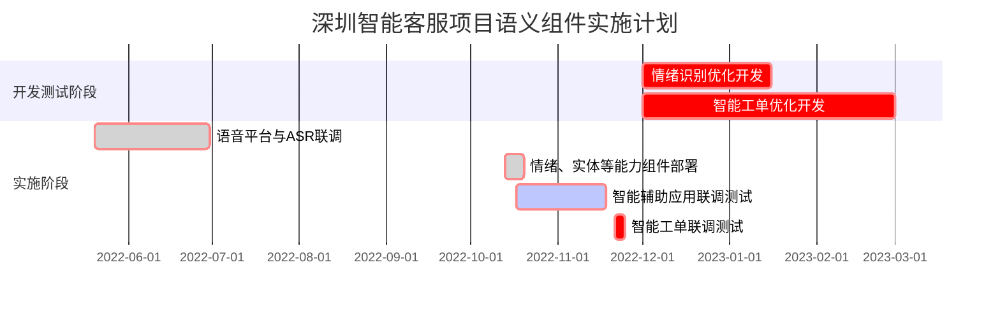

​    

```mermaid
gantt
    title 深圳智能客服项目语义组件实施计划
    dateFormat  YYYY-MM-DD
	
	section 开发测试阶段
		情绪识别优化开发     :crit, 未开始, 2022-12-01, 2023-01-16
		智能工单优化开发     :crit, 未开始, 2022-12-01, 2023-03-01

	section 实施阶段
		语音平台与ASR联调      	 :crit, done, 已完成, 2022-05-20, 2022-06-30
		情绪、实体等能力组件部署      :crit, done, 已完成, 2022-10-13, 2022-10-20
		智能辅助应用联调测试  	   :crit, active, 进行中, 2022-10-17, 2022-11-18
		智能工单联调测试  			:crit, 未开始, 2022-11-21, 2022-11-25
```