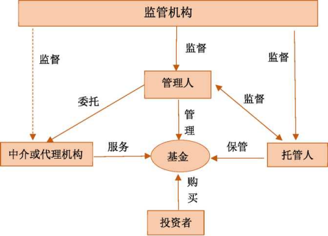
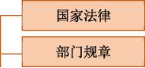

《基金法律法规、职业道德与业务规范》

# 第一章 金融市场、资产管理与投资基金

## 第一节居民理财与金融市场

金融与居民理财

现代居民经济生活中的日常收入' 支出活动和储蓄'投资等理财活动构成了 现代金融供求的重要组成部分。

居民理财主要方式是：货币储蓄' 投资。

最常见和普遍的投资产品：股票' 债券' 基金等金融工具。

居民的消费' 储蓄与投资意愿与金融市场的表现相关。随着我国金融市场特 别是资本市场的迅速发展，越来越多的人通过各类金融工具进入金融市场，获取 投资收益。

金融市场的分类

| 按照交易工具的期限划分 | 货币市场、资本市场                                    |
| ---------------------- | ----------------------------------------------------- |
| 按照交易标的物划分     | 票据市场、证券市场、衍生工具市场、外汇市 场、黄金市场 |
| 按交割期限划分         | 现货市场、期货市场                                    |
| 按交易性质划分         | 发行市场（一级市场）、流通市场（二级市场）            |
| 按地理范围划分         | 国内金融市场、国际金融市场                            |

 

三.金融市场的构成要素

（―）市场參与者

\1. 政府；

\2. 央行；

\3. 金融机构：既是金融市场的中介人，也是金融市场的投资者' 货币政策的 传递者和承受者。金融机构作为机构投资者在金融市场具有支配性的作用；

\4. 个人和企业居民：金融市场上主要的资金供给者。

（二）	金融工具

金融工具是金融市场上进行交易的载体;金融工具一般具有广泛的社会可接 受性，随时可以流通转让。

（三）	金融交易的组织方式

\1. 有固定场所的组织' 有制度、集中进行交易的方式——交易所交易方式;

\2. 在各金融机构柜台上买卖双方进行面议的'分散交易的方式——柜台交易 方式；

\3. 电信网络交易方式。

四.金融市场的监管

（-）外部性问题

（二）	脆弱性问题

（三）	不完全竟争问题

（四）	伯息不对称问题

## 第二节金融资产与资产管理行业

—.金融资产的概念

金融资产是代表未来收益或资产合法要求权的凭证，标示了明确的价值，表 明了交易双方的所有权关系和债权关系。

金融资产分为：债券类金融资产' 股权类金融资产。

债券类金融资产以票据'债券等契约型投资工具为主，股权类金融资产以各 类股票为主。

资产管理的特征

1 .从参与方来看，资产管理包括委托方（投资者）和受托方（资产管理人）；

\2. 从受托资产来看，主要为货币等金融资产，一般不包括固定资产等实物资 产；

\3. 从管理方式来看，主要通过投资于银行存款' 证券' 期货' 基金' 保险或 实体企业股权等方式来实现资产增值。

三. 资产管理的本质

(-)一切资产管理活动都要求风险与收益相匹配

(-)管理人必须坚持“卖者有责“

(=)投资人必须做到“买者自负“

四. 资产管理行业的功能

资产管理行业无论对宏观经济还是微观的个人'企业都有着重要的功能和作 用。

\1. 资产管理行业能够为市场经济体系有效配置资源，使有限的资源配置到最 有效率的产品和服务部门，提高整个社会经济的效率和生产服务水平。

\2. 通过资产管理行业专业的管理活动，能够帮助投资人搜集'处理各种和投 资有关的宏观' 微观信息，提供各类投资机会，帮助投资者进行投资决策，并提 供决策的最佳执行服务，使投资融资更加便利。

\3. 资产管理行业创造出十分广泛的投资产品和服务，满足投资者的各种投资 需求，使资金的需求方和提供方能够便利地连接起来。

\4. 资产管理行业还能对金融资产进行合理定价，给金融市场提供流动性，降 低交易成本，使金融市场更加健康有效，最终有利于一国经济的发展。

## 第三节中国资产管理行业的状况

各类资产管理业务简介

(-)基金管理公司及其子公司资产管理业务

证券投资基金管理公司是经中国证监会批准的在中国境内设立，从事证券投 资基金管理业务和中国证监会许可的其他业务的企业法人。基金管理公司可以从 事公募证券投资基金的募集和管理业务，还可以从事特定客户的资产管理业务即 非公开募集证券投资基金业务。还可以设立子公司从事特定客户的资产管理业务、 私募股权基金管理业务以及中国证监会许可的其他业务。

\1. 公开募集基金：包括向不特定对象募集资金、向特定对象募集资金累计超 过200人以及法律' 行政法规规定的其他情形。公开募集基金，应当经国务院证 券监督管理机构注册，未经注册，不得公开或者变相公开募集基金。

\2. 特定客户资产管理业务:即基金管理公司向特定客户募集资金或者接受特 定客户财产委托担任资产管理人，由托管机构担任资产托管人，为资产委托人的 利益，运用委托财产进行投资的活动。

\3. 专项资产管理计划：是指基金管理公司设立专门的子公司，投资于未通过 证券交易所转让的股权'债权及其他财产权利以及中国证监会认可的其他资产的 特定资产管理计划。

\4. 私募股权基金管理业务：是指基金管理公司可以设立专门子公司，通过设 立特殊目的机构或者设立合伙企业或者公司形式的私募股权投资基金来从事私 募股权投资基金管理业务。

(二)私林构资产管理业务

非公开募集基金应当向合格投资者募集，合格投资者累计不得超过200人。 合格投资者是指具备相应风险识别和承担能力，投资于单只私募基金的金额不低 于100万元且符合下列相关标准的单位和个人：

① 净资产不低于1000万元的单位；

② 金融资产不低于300万元或者最近3年个人年均收入不低于50万元的个 人。

下列投资者视为合格投资者：

① 社会保障基金、企业年金等养老基金，慈善基金等社会公益基金；

② 依法设立并在基金业协会备案的投资计划；

③ 投资于所管理私募基金的私募基金管理人及其从业人员。

(=)证券公司资产管理业务

证券公司可以依法从事下列客户资产管理业务：

① 为单一客户办理定向资产管理业务；

② 为多个客户办理集合资产管理业务；

③ 为客户办理特定目的的专项资产管理业务。

集合资产管理计划应当面向合格投资者推广，合格投资者累计不得超过200

人。

合格投资者是指具备相应风险识别能力和承担所投资集合资产管理计划风 险能力且符合下列条件之一的单位和个人：

① 个人或者家庭金融资产合计不低于100万元人民币；

② 公司' 企业等机构净资产不低于1000万元人民币。

依法设立并受监管的各类集合投资产品视为单一合格投资者。

（四）	期货公司资产管理业务

期货公司及其子公司从事资产管理业务包括为单一客户办理资产管理业务 和为特定多个客户办理资产管理业务。资产管理业务的客户应当具有较强资金实 力和风险承受能力，单一客户的起始委托资产不得低于100万元人民币。资产管 理计划的资产委托人应当为合格投资者，单个资产管理计划的投资者人数不得超 过200人。

（五）	信托公司资产管理业务

信托公司集合资金信托计划合格投资者，是指符合下列条件之一，能够识别、 判断和承担信托计划相应风险的人：

① 投资一个信托计划的最低金额不少于100万元人民币的自然人'法人或者 依法成立的其他组织；

② 个人或家庭金融资产总计在其认购时超过100万元人民币，且能提供相关 财产证明的自然人；

③ 个人收入在最近3年内每年收入超过20万元人民币或者夫妻双方合计收 入在最近3年内每年收入超过30万元人民币,且能提供相关收入证明的自然人。

**（六）**	保险公司、保险资产管理公司业务

保险资金委托投资业务；保险资产管理产品业务；资产支持计划业务；私募 基金业务；投资连结保险产品和非寿险非预定收益投资型保险产品的资金管理; 公募证券投资基金业务。

（七）	商业银行资产管理业务

个人理财产品业务和私人银行业务是商业银行资产管理业务的主要内容。

二.我国资产管理行业需要关注的问题

（-）资金池操作存在流动性风险隐患

（二）产品多层嵌套导致风险传递

（=）影子银行面临监管不足

（四）	刚性兑付使风险仍停留在金融体系

（五）	部分非金融机构无序开展资产管理业务

## 第四节投资基金简介

投资基金的定义

定义：通过向投资者发行受益凭证（基金份额），将社会上的资金集中起来, 交由专业的基金管理机构投资于各种资产，实现保值增值。

特点：组合投资、专业管理' 利益共享' 风险共担，集合投资方式。

属性：间接投资工具。

当事人：基金投资者（份额持有人）、基金管理人、基金托管人。

投资基金的主要类别

| 按照资金募集方式 | 公募基金（不特定投资者）、私募基金（特定投资者） |
| ---------------- | ------------------------------------------------ |
| 按照法律形式     | 契约型、公司型、有限合伙型等                     |
| 按照运作方式     | 开放式基金、封闭式基金                           |

 

\1. 传统投资基金：人们把投资于公开市场交易的权益' 债券' 货币' 期货等 金融资产的基金称为传统投资基金。

\2. 另类投资基金：投资于传统对象以外的投资基金称为另类投资基金。 证券投资基金是投资基金中最主要的一种类别，主要投资于传统金融资产。

基金所投资的有价证券主要是在证券交易所或银行间市场公开交易的证券,包括: 股票' 债券' 货币' 金融衍生工具等。

三.常见的另类投资基金

1 .私募股权基金：通过私募形式对私有企业，即非上市企业进行的权益性投 资，在交易实施过程中附带考虑了将来的退出机制。

\2. 风险投资基金：又叫创业基金，以一定的方式吸收机构和个人的资金，投 向不具备上市资格的初创期或小型的新兴企业，尤其是高新技术企业，帮助所投 资的企业尽快成熟，取得上市资格，从而使资本增值。

\3. 对冲基金：基于投资理论和极其复杂的金融市场操作技巧，充分利用各种 金融衍生产品的杠杆效用，承担高风险' 追求高收益的投资模式。

\4. 不动产投资基金：一种以发行权益凭证的方式汇集投资者的资金，有专门 投资机构进行不动产投资经营管理，并将投资综合收益按比例分配给投资者的一 种基金。可采用公募方式，也可采用私募方式。

\5. 其他另类投资基金：还有一些投资基金投资于大宗商品、黄金' 艺术品、 红酒' 农产品等。一般也采用私募方式，种类非常广泛，外延也很不确定。

# 第二章 证券投资基金概述

## 第一节证券投资基金的概念与特点

证券投资基金的概念

证券投资基金，是指通过发售基金份额，将众多不特定投资者的资金汇集起 来，形成独立资产，委托基金管理人进行投资管理，基金托管人进行财产托管, 由基金投资人分享投资收益' 共担投资风险的集合投资方式。

证券投资基金在各地不同的名称

| 美国         | 共同基金                   |
| ------------ | -------------------------- |
| 英国+香港    | 单位信托基金               |
| 日本+台湾    | 证券投资信托基金           |
| 一些欧洲国家 | 集合投资基金、集合投资计划 |

 

二. 证券投资基金的特点

(-)集合理财、专业管理

(-)组合投资、分散风险

(三) 利益共享、风险共担

(四) 严格监管、信息透明

(五) 独立托管、保障安全

三. 证券投资基金与其他金融工具的比较

(-)基金与股票、债券的差异

| 差异         | 股票                                | 债券                                            | 基金         |
| ------------ | ----------------------------------- | ----------------------------------------------- | ------------ |
| 反映经济关系 | 反映所有权关系                      | 反映债权债务 关系                               | 反映信托关系 |
| 资金投向     | 直接投资工具，资金主要投向 实业领域 | 间接投资工具，资金投向有 价证券等金融工具或产品 |              |

| 投资风险与收益 | 风险' 收益较高 | 风险、收益 较低 | 投向较多，可有效分散风 险，风险、收益适中 |
| -------------- | -------------- | --------------- | ----------------------------------------- |
|                |                |                 |                                           |

 

 

(-)基金与银行储蓄存款的差异

| 差异         | 基金                                              | 银行储蓄存款                                      |
| ------------ | ------------------------------------------------- | ------------------------------------------------- |
| 性质         | 受益凭证，基金管理人不承担 投资损失风险           | 信用凭证，表现为银行的负 债，银行有保本付息的责任 |
| 风险收益特征 | 收益具有一定的波动性，存在 投资风险               | 存款利率相对固定，本金损失的可能性小              |
| 信息披露程度 | 基金管理人必须定期向投资者 公布基金的投资运作情况 | 银行不需要向存款人披露资金的运用情况              |

 

 

(=)基金与保险产品的差异

| 差异         | 基金         | 保险                               |
| ------------ | ------------ | ---------------------------------- |
| 目的         | 获得投资收益 | 保障，分散或者转移风险             |
| 对投资人要求 | 没有太多要求 | 被保险人的年龄' 身体状况等影响因素 |
| 变现能力     | 随时变现     | 专款专用，不可随时变现             |

 

## 第二节证券投资基金的运作与参与主体

证券投资基金的运作

(-)基金的运作环节

\1. 基金的募集；

\2. 基金的投资管理；

\3. 基金资产的托管；

\4. 基金份额的登记交易；

\5. 基金的估值与会计核算;

\6. 基金的信息披露及其他。

(-)基金管理人角度看基金的运作

基金管理人角度看基金的运作

| 三大部分       | 作用及内容                                       |
| -------------- | ------------------------------------------------ |
| 基金的市场营销 | 主要涉及基金份额的募集与客户服务                 |
| 基金的投资管理 | 投资管理体现了基金管理人的服务价值               |
| 基金的后台管理 | 基金的后台管理对保障基金的安全运作起着重要的作用 |

 

证券投资基金的参与主体

(-)基金当事人

| 基金份额持有人 | 基金投资者，是基金的出资人、基金资产的所有者和基金投 资回报的受益人。权利：1. 分享基金财产收益；2. 参与分配清算后的剩余财产；3. 依法转让或者申请赎回其持有的基金份额；4. 按照规定要求召开基金份额持有人大会；5. 对基金份额持有人大会审议事项行使表决权；6. 查阅或者复制公开披露的基金信息资料；7. 对基金管理人、基金托管人、基金销售机构损害其合法权 益的行为依法提出诉讼；8. 基金合同约定的其他权利。 |
| -------------- | ------------------------------------------------------------ |
| 基金管理人     | 基金产品的募集者和管理者。在基金运作中具有核心作用。 职责：按照基金合同的约定，负责基金资产的投资运作，在 有效控制风险的基础上为基金投资者争取最大的投资收益。 在我国，基金管理人只能由依法设立的基金管理公司担任。 |

基金当事人之一。《证券投资基金法》规定，基金资产必须 由独立于基金管理人的基金托管人保管。

职责：在基金资产保管、基金资金清算、会计复核以及对基 金投资运作的监督方面体现。

(-)基金市场服务机构

| 基金管理人        | 既疋基金的当事人，也疋基金服务机构                           |
| ----------------- | ------------------------------------------------------------ |
| 基金托管人        |                                                              |
| 基金销售机构      | 从事基金销售业务活动，并以基金交易为基础收取相关佣金 的机构。基金销售包括：1 .基金的宣传推介；2. 基金份额发售；3. 基金份额的申购' 赎回。 |
| 基金销售支付 机构 | 基金销售支付业务内容：基金销售活动中基金销售机构' 基 金投资人之间的货币资金转移活动。基金销售支付机构的业务条件：1 .取得中国人民银行颁发的《支付业务许可证》(商业银行 除外);2. 制定完善的资金清算和管理制度；3. 能够确保基金销售结算资金的安全' 独立和及时划付；4. 按照中国证监会的规定进行备案。 |

| 基金細登记 机构   | 基金份额登记是指基金份额的登记过户' 存管和结算等业务 活动。基金份额登记机构指从事基金份额登记业务活动的机 构。主要职责：1. 建立并管理投资人的基金账户；2. 负责基金份额的登记；3. 基金交易确认；4. 代理发放红利；5. 建立并保管基金份额持有人名册。 |
| ----------------- | ------------------------------------------------------------ |
| 基金估值核算 机构 | 从事基金估值核算业务活动（基金会计核算、估值及相关信 息披露）。从事公开募集基金估值核算业务的，应当向中国证监会申请 注册。 |
| 基金投资顾问 机构 | 基金投资顾问是指按照约定向基金管理人' 基金投资人等服 务对象提供基金以及其他中国证监会认可的投资产品的投资 建议,辅助客户做出投资决策，并直接或间接获取经济利益 的业务活动。业务许可：基金投资顾问机构提供公开募集基金投资顾问业 务的，应当向工商登记注册地中国证监会派出机构注册。 业务禁止：1 .不得以任何方式承诺或保证投资收益；2.不得损害服务对象的合法权益。 |
| 基金评价机构      | 基金评价是指对基金投资收益和风险或者基金管理人管理能 力进行的评级'评奖' 单一指标排名或者中国证监会认定的 其他评价活动。业务许可：基金评价机构从事公开募集基金评价业务并以公 开形式发布基金评价结果的，应当向基金业协会申请注册。 业务规则：客观公正' 依法开展评价业务，禁止误导投资 者' 防范可能发生的利益冲突。 |

| 基金信息技术系 统服务机构 | 基金信息技术系统服务是指为基金管理人' 基金托管人和基 金服务机构提供基金业务核心应用软件开发' 信息系统运营 维护'信息系统安全保障和基金交易电子商务平台等业务活 动。 |
| ------------------------- | ------------------------------------------------------------ |
| 律师事务所和会 计师事务所 | 为基金提供法律' 会计服务。                                   |

 

 

(=)基金监管机构和自律组织

| 基金监管机构 | 证监会及其派出机构                     |
| ------------ | -------------------------------------- |
| 基金自律组织 | 证券交易所基金业协会——2012年6月6日成立 |

 

三.证券投资基金运作关系

 

 

## 第三节证券投资基金的法律形式和运作方式

契约型基金与公司型基金的区别

| 区别 | 契约型基金 | 公司型基金 |
| ---- | ---------- | ---------- |
|      |            |            |

| 法律主体资格        | 不具备法人资格                                               | 具有法人资格                                              |
| ------------------- | ------------------------------------------------------------ | --------------------------------------------------------- |
| 投资者地位          | 作为基金份额持有人，可 以通过持有人大会发表意 见，权利相对较小 | 作为公司股东，通过股东大会行使权利，相对权利较大          |
| 组织方式和 营运依据 | 依据基金合同，简单易行                                       | 依据投资公司章程，法律关系明 确清晰，监督约束机制较为完善 |

 

 

二.封闭式基金与开放式基金的区别

| 区别                    | 封闭式基金                                                   | 开放式基金                                                   |
| ----------------------- | ------------------------------------------------------------ | ------------------------------------------------------------ |
| 期限                    | 一般有一个固定的存续期                                       | 一般无特定的存续期限                                         |
| 細限制                  | 基金份额固定，封闭期内未 经法定程序认可不能增减              | 基金份额不固定，投资者可以随时提出申购或赎回申请             |
| 交易场所                | 完成募集后，基金份额在证 券交易所上市交易，投资者 只能委托证券公司在交易所 买卖封闭式基金份额 | 投资者可以按照基金管理人确 定的时间和地点向基金管理人 或其销售代理人提出申购、赎 回申请，交易在投资者与基金 管理人之间完成 |
| 价格形成方式            | 上市交易，受二级市场供求 关系影响                            | 价格以基金份额净值为基础， 不受市场供求关系影响              |
| 激励约束机制 与投资策略 | 因份额固定，基金激励约束 机制较差；因份额及存续期 固定，适合进行长期、全额 投资 | 因份额不固定，开放式基金能 向管理人提供更好的激励约束 机制；存在赎回压力，开放式 基金必须保留一定现金资产， 高度重视基金资产的流动性 |

 

=.基金财产的独立性

1 .基金财产的债务由基金财产本身承担,基金份额持有人以其出资为限对基 金财产的债务承担责任。但基金合同依照本法另有约定的，从其约定。

\2. 基金财产独立于基金管理人' 基金托管人的固有财产。基金管理人' 基金 托管人不得将基金财产归入其固有财产。基金管理人、基金托管人因依法解散、 被依法撤销或者被依法宣告破产等原因进行清算的，基金财产不属于其清算财产。

\3. 基金管理人'基金托管人因基金财产的管理、运用或者其他情形而取得的 财产和收益，归入基金财产。

\4. 基金财产的债权，不得与基金管理人、基金托管人固有财产的债务相抵销， 不同基金财产的债权债务不得相互抵销。

非因基金财产本身承担的债务，不得对基金财产强制执行。

## 第四节证券投资基金的起源与发展

证券投资基金的起源、发展历程

1.1868年英国“海外及殖民地政府信托”——世界上第一只公认的证券投 资基金；

2.1924年美国“马萨诸塞投资信托基金”——第一个公司型基金；

\3. 1933年美国《证券法》；

4.1934年美国《证券交易法》；

\5. 1940年美国《投资公司法》《投资顾问法》。

\6. 进入20世纪六七十年代，美国共同基金的产品和服务趋于多样化；

\7. 进入21世纪以后，全球基金业的规模继续膨胀。

二.全球基金业发展的趋势与特点

\1. 美国占据主导地位，其他国家和地区发展迅猛；

\2. 开放式基金成为证券投资基金的主流产品；

\3. 基金市场竞争加剧，行业集中趋势突出；

\4. 基金资产的资金来源发生重大变化；

\5. ETF等被动基金规模迅速扩大；

\6. 另类投资基金兴起。

## 第五节 我国证券投资基金业的发展历程

我国证券投资基金业的发展阶段

| 萌芽和早期发展时 期(1985-1997)          | 20世纪80年代末，“中国概念基金”，国外及香港用于投资大陆企业股票；1992年6月，《深圳市投资信托基金管理暂行规定》；1992年11月，当时最大的封闭式基金——天骥基金设 立；中国人民银行总行批准，国内第一家投资基一_淄博 乡镇企业投资基金设立。 |
| --------------------------------------- | ------------------------------------------------------------ |
| 试点发展阶段 (1998-2002)                | 1997年11月，《证券投资基金管理暂行办法》；1998年3月27日，证监会批准设立“基金开元"、“基金金泰“；1998年4月，华夏基金公司发起设立兴华基金；2000年10月8日，证监会《开放式证券投资基金试点 办法》；2001年9月，我国第一只开放式基金“华安创新”设 立；2002年10月，首家批准筹建的中外合资基金公司国联 安基金管理有限公司批准筹建。 |
| 行业快速发展阶段(2003-2007)             | 2003年10月28日，十届全国人大常委会第五次会议审 议通过《证券投资基金法》，并于2004年6月1日施 行。本阶段主流品种是开放式基金。 |
| 行业平稳发展及创 新探索阶段 (2008—2014) | 1. 完善规则' 放松管制' 加强监管；2. 基金管理公司业务和产品创新，不断向多元化发展；3. 互联网金融与基金业有效结合；4. 股权与公司治理创新得到突破；5. 专业化分工推动行业服务体系创新； |

|                                        | 6. 私募基金机构和产品迅猛发展；7. 混业化与大资产管理的局面初步显现；8. 国际化与跨境业务的推进。 |
| -------------------------------------- | ------------------------------------------------------------ |
| 防范风险和规范发 展阶段（2015年 至今） | 1 .加强私募机构的规范和清理；2. 规范基金管理公司及其子公司的资产管理业务；3. 规范分级、保本等特殊类型基金产品，发展基金中基 金产品；4. 对基金管理公司业务实施风险压力测试；5. 专业人士申请设立基金公司的数量攀升，申请主体渐 趋多元；6. 基金产品呈现货币化' 机构化特点。 |

 

## 第六节基金业在金融体系中的地位与作用

为中小投资者拓宽投资渠道

投资基金作为一种面向中小投资者设计的间接投资工具，把众多投资者的小 额资金汇集起来进行组合投资，由专业投资机构进行管理和运作，从而为投资者 提供了有效参与证券市场的投资渠道，已经成为广大民众普遍接受的一种理财方 式。

二. 优化金融结构，促进经济增长

证券投资基金将中小投资者的闲散资金汇集起来投资于证券市场，扩大了直 接融资的比例，为企业在证券市场筹集资金创造了良好的融资环境，实际上起到 了将储蓄资金转化为生产资金的作用。

三. 有利于证券市场的稳定和健廉发展

证券投资基金在投资组合管理过程中对所投资证券进行的深入研究与分析, 有利于促进信息的有效利用和传播，有利于市场合理定价，有利于市场有效性的 提高和资源的合理配置。

证券投资基金发挥专业理财优势，推动市场价值判断体系的形成，倡导理性 的投资文化，有助于防止市场的过度投机。证券投资基金的发展有助于改善我国 目前以个人投资者为主的不合理的投资者结构，充分发挥机构投资者对上市公司 的监督和制约作用，推动上市公司完善治理结构。

四. 完善金融体系和社会保障体系

证券投资基金的专业化服务，还可以为社会保障基金' 企业年金、养老金等 各类社会保障型资金提供长期投资，实现保值增值的平台，促进社会保障体系的 建立与完善。在我国，证券投资基金也是社会保障型资金保值增值的重要力量, 并为此做出重大贡献。

五. 推动责任投资，实现可持续发展

社会责任投资(ESG),代表的是环境(envi roment)、社会(society)和公 司治理(governance),是倡导在投资决策过程中充分考虑环境' 社会和公司治 理因素的投资理念。以ESG为核心的社会责任投资理念代表了当前国际投资和经 济发展新趋势。

# 第三章 基金的类型

## 第一节证券投资基金分类概述

证券投资基金的分类意义

随着基金数量' 品种的不断增多，对基金进行科学合理的分类，无论是对投 资者' 基金管理公司，还是对基金研究评论机构'监管部门来说，都有重要意义。

二.证券投资基金的分类标准及介绍

(-)根据投资对象分类

| 股票基金     | 以股票为主要投资对象的基金，我国规定：基金资产80% 以上投资于股票的基金为股票基金。 |
| ------------ | ------------------------------------------------------------ |
| 债券基金     | 以债券为主要投资对象的基金，我国规定：基金资产80% 以上投资于债券的基金为债券基金。 |
| 货币市场基金 | 以货币市场工具为投资对象的基金，我国规定：基金资产 仅投资于货币市场工具的基金为货币市场基金。 |
| 混合基金     | 同时以股票、债券等为投资对象的基金，我国规定：投资 于股票、债券，但比例不符合股票基金、债券基金规定的 基金为混合基金。 |
| 基金中基金   | 以基金为主要投资标的的证券投资基金。80%以上的基金资 产投资于其他基金份额的，为基金中基金。 |
| 另类投资基金 | 以股票、债券、货币传统资产以外的资产作为投资标的基 金，范围广泛。我国市场上的公募另类投资基金主要有：1. 商品基金：以商品现货或者期货合约为投资对象，主要 有黄金ETF和商品期货ETFo2. 非上市股权基金：2014年，嘉实基金管理公司发行了首 只以投资于非上市公司股权的形式参与国企混合所有制改 革的公募基金——嘉实元和封闭式混合型发起式基金。3. 房地产基金:2015年，鹏华基金管理公司发行了鹏华前 海万科封闭式混合型发起式证券投资基金。 |

（二）根据投资目标分类

| 增长型基金 | 以追求资本增值为目的，较少考虑当期收入，以具有良好 增长潜力的股票为投资对象，风险大、收益高。 |
| ---------- | ------------------------------------------------------------ |
| 炒型基金   | 以追求稳定的经常性收入为基本目标，主要以大盘蓝筹 股、公司债、政府债券等稳定收益证券为投资对象，风险 小、收益低。 |
| 平衡型基金 | 既注重资本增值又注重当期收入的基金。                         |

 

（三）根据投资理念分类

| 主动型基金 | 力图取得超越基准组合表现的基金。                             |
| ---------- | ------------------------------------------------------------ |
| 被动型基金 | 不主动寻求超过市场的表现，试图复制指数的表现，又叫 指数基金。 |

 

（四）根据基金的资金来源和用途分类

| 在岸基金 | 在本国募集资金并投资于本国证券市场的证券投资基金。           |
| -------- | ------------------------------------------------------------ |
| 离岸基金 | 一国（地区）的证券投资基金在他国（地区）发售证券基 金份额，并将募集的资金投资于本国（地区）或第三国证 券市场的证券投资基金。 |
| 国际基金 | 资本来源于国内，并投资于国外市场的投资基金，如我国 的QDI1基金。QDI 1基金是指在一国境内设立，经该国有 关部门批准从事境外证券市场的股票、债券等有价证券投 资的基金。 |

 

（五）特殊类型基金

| 避险策略基金 | 原称保本基金，是指通过一定的保本投资策略进行运作， 同时引入保本保障机制，以保证基金份额持有人在保本周 期到期时，可以获得投资本金保证的基金。 |
| ------------ | ------------------------------------------------------------ |
|              |                                                              |

| 上市开放式 基金(LOF) | 既可以在场外市场进行基金份额申购、赎回，又可以在交 易所(场内市场)进行基金份额交易和基金份额申购或赎 回的开放式基金。 |
| -------------------- | ------------------------------------------------------------ |
| 分级基金             | 是指通过事先约定基金的风险收益分配，将基金份额分为 预期风险收益不同的子份额，并可将其中部分或全部份额 上市交易的结构化证券投资基金。 |

 

## 第二节股票基金

股票基金在投资组合中的作用

\1. 以追求长期的资本增值为目标，比较适合长期投资；

\2. 与其它基金相比，股票基金的风险和预期收益较高；

\3. 提供了一种长期的投资增值性，可供投资者用来满足教育支出'退休支出 等远期支出的需要；

\4. 是应对通货膨胀最有效的手段。

股票基金与股票的区别

| 区别     | 股票                                            | 股票基金                                                     |
| -------- | ----------------------------------------------- | ------------------------------------------------------------ |
| 价格变动 | 每个交易日内始终处于变动中                      | 每个交易日只有一个价格                                       |
| 价格影响 | 受到投资者买卖股票的数量大 小和力量强弱对比影响 | 基金份额净值不受买卖数量、申购或赎回数量影响                 |
| 购买翁考 | 投资者投资股票时会考虑上市公司基本面信息        | 投资者购买基金份额时对基金 份额净值高低进行合理与否的 判断无意义 |
| 投资风险 | 单一股票的投资较集中，风险 较大                 | 分散投资，风险低于单一股票的投资风险                         |

=.股票基金的类型

（-）按投资市场分类

| 国内股票基金 | 以本国股票市场为投资场所。                                   |
| ------------ | ------------------------------------------------------------ |
| 国外股票基金 | 以非本国的股票市场为投资场所，由于币制不同，存在一 定的汇率风险。又可进一步分为单一国家型股票基金、区 域型股票基金、全球股票基金三种类型。 |
| 全球股票基金 | 以全球股票市场为投资对象，由于投资跨度大，费用相对 较高。    |

 

（二）按股票规模分类

| 依据市值的绝对值 划分 | 1. 小盘股：市值小于5亿元人民币的公司股票。2. 中盘股：市值大于5亿元人民币少于20亿元人民币的 公司股票。3. 大盘股：市值超过20亿元人民币的公司股票。 |
| --------------------- | ------------------------------------------------------------ |
| 依据相对规模划分      | 1. 小盘股：市值较小、累计市值占市场总市值20%以下 的公司股票。2. 中盘股：累计市值占市场总市值20%以上50%以下的公 司股票。3. 大盘股：市值排名靠前，累计市值占市场总市值50% 以上的公司股票。 |

 

（三）按股票性质分类

| 价值型 | 价值型股票通常是指收益稳定、价值被低估、安全性较 高的股票。专注于价值型股票投资的股票基金称为价值 型股票基金。 |
| ------ | ------------------------------------------------------------ |
| 成长型 | 成长型股票通常是指收益增长速度快、未来发展潜力大 的股票。专注于成长型股票投资的股票基金称为成长型 股票基金。 |
| 平衡型 | 同时投资于价值型股票与成长型股票的基金则称为平衡 型基金。    |

 

（四）按基金投资风格分类

|      | 小盘     | 中盘     | 大盘     |
| ---- | -------- | -------- | -------- |
| 成长 | 小盘成长 | 中盘成长 | 大盘成长 |
| 平衡 | 小盘平衡 | 中盘平衡 | 大盘平衡 |
| 价值 | 小盘价值 | 中盘价值 | 大盘价值 |

 

（五）按行业分类

同一行业内的股票往往表现出类似的特性与价格走势。以某一特定行业或板 块为投资对象的基金就是行业股票基金，如基础行业基金、资源类股票基金' 房 地产基金' 金融服务基金' 科技股基金等。行业轮换型基金集中于行业投资，投 资风险相对较高。

## 第三节债券基金

债券基金在投资组合中的作用

\1. 对追求稳定收入的投资者具有较强的吸引力；

\2. 债券基金波动性小于股票基金，因此常被投资者认为是收益、风险适中的 投资工具；

\3. 当债券基金与股票基金进行适当的组合投资时，常常能较好的分散投资风 险。

债券基金与债券的区别

| 区别     | 债券                                | 债券基金                                                     |
| -------- | ----------------------------------- | ------------------------------------------------------------ |
|          | 收益相对固定（债券利率）            | 因债券基金有不同的债券组 合，所以定期分配的收益有升 有降，不如债券固定。 |
| 到期日   | 有固定到期日                        | 由一组不同到期日的债券组 成，没有一个确定的到期日， 但可计算出平均到期日 |
| 瞄率     | 可以计算并预测                      | 难以预测                                                     |
| 投资风险 | 随到期日临近，债券的投资 风险会下降 | 无固定到期日，风险将取决于 平均到期日，会保持在一定水 平上   |

 

三.债券基金的类型

(-)债券的分类

| 按债券发行者分类   | 政府债券' 企业债券' 金融债券 |
| ------------------ | ---------------------------- |
| 按到期期限分类     | 短期债券' 长期债券           |
| 按债券伯用等级分类 | 低等级债券、高等级债券       |

 

(-)我国市场债券基金分类

1 .标准债券型基金：只投资于债券，不投资股票，又被称为“纯债基金”。 细分：短债基金' 信用债基金。

\2. 普通债券型基金：除80%以上基金资产投资于债券外，也投资于股票。细 分：一级债基(投资于一级市场，不投资于二级市场)、二级债基(即可投资一 级市场，又可投资二级市场)。

\3. 其他策略债券基金。如可转债基金等。

## 第四节 货币市场基金

货币市场基金在投资组合中的作用

\1. 风险低'流动性好；

\2. 是厌恶风险、对资产流动性和安全性要求较高的投资者进行短期投资的理

想工具；

3.暂时存放现金的理想场所。

货币市场基金的投资对象与货币市场工具

货币市场基金的投资对象是货币市场工具，通常指到期日不足1年的短期金 融工具，也称为现金投资工具。

| 货币市场基金能够投资的金融工具                               | 货币市场基金不得投资的金融工具                               |
| ------------------------------------------------------------ | ------------------------------------------------------------ |
| 1. 现金；2. 期限在1年以内（含1年）的银行存 款、债券回购' 中央银行票据、同业存 单；3. 剩余期限在397天以内（含397天） 的债券' 非金融企业债务融资工具' 资 产支持证券；4中国证监会' 中国人民银行认可的其 他具有良好流动性的货币市场工具。 | 1. 股票；2. 可转换债券' 可交换债券；3. 以定期存款利率为基准利率的浮动 利率债券，已进入最后一个利率调整 期的除外；4. 信用等级在AA+以下的企业债券与 非金融企业债务融资工具；5. 中国证监会' 中国人民银行禁止投 资的其他金融工具。 |

 

=.货币市场基金的支付功能

基金管理公司通过机制设计将货币市场基金的功能从投资拓展为类似货币 的支付功能：

1 .每个交易日办理基金份额申购' 赎回；

\2. 在基金合同中将收益分配的方式约定为红利再投资，并每日进行收益分配;

\3. 每日按照面值（一般为1元）进行报价。

四. 美国货币市场基金的产生和发展

货币基金始于20世纪70年代初，在美国利率市场化过程中，被誉为共同基 金历史上最伟大的发明。

五. 中国货币市场基金的产生和发展

\1. 我国最早在2003年12月，出现了华安现金福利基金、招商现金增值基 金' 博时现金收益基金3只货币市场基金。

\2. 2012年12月，华宝兴业基金公司旗下的中国首只上市交易型货币基金华 宝添益成立，并于2013年1月28日在上交所挂牌上市。

\3. 2013年7月，电商阿里巴巴在其网上第三方支付平台——支付宝开通了 "余额宝”业务，实质就是用支付宝的余额购买天弘货币基金。

## 第五节混合基金

混合基金在投资组合中的作用

混合基金为投资者提供了一种在股票'债券等不同资产类别之间进行灵活配 置的投资工具。基金管理人对基金投资有比较大的调整自由权限。

二. 混合基金分类

| 偏股型基金     | 股票的配置比例较高，债券的配置比例相对较低，一般采 用股票指数或者以股票指数为主作为业绩比较基准。 |
| -------------- | ------------------------------------------------------------ |
| 偏债型基金     | 债券的配置比例较高，股票的配置比例相对较低，一般采 用债券指数或者以债券指数为主作为业绩比较基准。 |
| 股债平衡型基金 | 股票与债券的配置比例较为均衡，其业绩比较基准也会以 股票指数和债券指数大致均衡组合。 |
| 灵活配置型基金 | 股票、债券上的配置比例会根据市场状况进行调整，有时 股票的比例较高，有时债券的比例较高。 |

 

## 第六节避险策略基金

避险策略基金的前身

避险策略基金的前身是保本基金,其最大特点是其招募说明书中明确引入保 本保障机制，以保证基金份额持有人在保本周期到期时，可以获得投资本金的保 证。

中国证监会于2017年年初对《关于保本基金的指导意见》进行了修订，将

“保本基金”名称调整为“避险策略基金”。

为能够保证本金安全，避险策略基金通常会将大部分资金投资于与基金到期 日一致的债券;同时，为提高收益水平,避险策略基金会将其余部分投资于股票、 衍生工具等高风险资产上，使得市场不论是上涨还是下跌，该基金于投资期限到 期时，都能保障其本金不遭受损失。

避险策略基金的投资目标是在锁定风险的同时力争有机会获得潜在的高回 报，从本质上讲是一种混合基金。此类基金锁定了投资亏损的风险，产品风险较 低，也并不放弃追求超额收益的空间，因此比较适合那些不能忍受投资亏损'比 较稳健和保守的投资者。

二.避险策略基金的投资策略

(—)对冲保险策略

主要依赖金融衍生工具来实现投资组合价值的保本与增值。

(二)固定比例投资组合保险策略***\*(CPPI)\****

\1. CPPI的含义

CPPI是一种通过比较投资组合现时净值与投资组合价值底线，从而动态调 整投资组合中风险资产与保本资产的比例，以兼顾保本与增值目标的保本策略。

\2. CPPI投资策略的投资步骤

(1) 根据投资组合期末最低目标价值(基金的本金)和合理的折现率设定当 前应持有的保本资产的价值，即投资组合的价值底线。

(2) 计算投资组合现时净值超过价值底线的数额。该值通常称为安全垫，是 风险投资(如股票投资)可承受的最高损失限额。

(3) 按安全垫的一定倍数确定风险资产投资的比例，并将其余资产投资于保 本资产(如债券投资)，从而在确保实现保本目标的同时，实现投资组合的增值。

风险资产投资额通常可用下式确定：

风险资产投资额=放大倍数X (投资组合现时净值-价值底线)

=放大倍数X安全垫

风险资产投资比例=风险资产投资额4-基金净值X100%

如果安全垫不放大,将投资组合现时净值高于价值底线的资产完全用于风险 资产投资，即使风险资产（股票）投资完全亏损，基金也能够实现到期保本，因 此，可以适当放大安全垫的倍数，提高风险资产投资比例以增加基金的收益。

三. 避险策略基金的类型

境外的避险策略基金形式多样。其中，基金提供的保证有本金保证、收益保 证和红利保证，具体比例由基金公司自行规定。一般本金保证比例为100%,但也 有低于100%或高于100%的情况。至于是否提供收益保证和红利保证，各基金情 况各不相同（但我国目前的避险策略基金并没有保证收益的类型）。

四. 避险策略基金的分析

避险策略基金的分析指标主要包括封闭周期、保本比例、赎回费' 安全垫、 担保人等。

| 封闭周期 | 避险策略基金通常有一个封闭周期。较长的封闭周期使基 金经理有较大的操作灵活性，即在相同的保本比例要求 下，经理人可适当提高风险性资产的投资比例。但封闭周 期越长，投资者承担的机会成本越高，因此封闭周期是一 个必须考虑的因素。 |
| -------- | ------------------------------------------------------------ |
| 保本比例 | 保本比例是到期时投资者可获得的本金保障比率。常见的 保本比例为80%-100%o保本比例是影响基金投资风险性资 产比例的重要因素之一。其他条件相同时，保本比例较低 的基金投资于风险性资产的比例较高。 |
| 败回费   | 通常，避险策略基金为避免投资者提前赎回资金，往往会 对提前赎回基金的投资者收取较高的赎回费，这将加大投 资者退出投资的难度。 |
| 安全垫   | 安全垫是风险资产投资可承受的最高损失限额。如果安全 垫较小，基金将很难通过放大操作提高基金的收益。较高 的安全垫在提高基金运作灵活性的同时也有助于增强基金 到期保本的安全性。 |

## 第七节交易型开放式指数基金***\*（ETF）\****

ETF的特点

（-）被动操作指数基金

ETF是以某一选定的指数所包含的成分证券（股票'债券等）或商品为投资 对象，依据构成指数的证券或商品的种类和比例，采取完全复制或抽样复制，进 行被动投资的指数基金。ETF不但具有传统指数基金的全部特色，而且是更为纯 粹的指数基金。

（二）	独特的实物申购、赎回机制

实物申购'赎回机制：投资者申购ETF需要通过这只ETF指定的一篮子证券 或商品来换取；赎回时得到的不是现金，而是相应的一篮子证券或商品。

ETF有“最小申购' 赎回份额”的规定：参与ETF-级市场的实物申购、赎 回必须在资金达到一定规模时才能参与。

（三）	实行一级市场与二级市场并存的交易制度

1 .在一级市场：只有资金达到一定规模的投资者可以随时在交易时间内进行 申购（股票换份额）' 赎回（份额换股票）；

\2. 在二级市场：ETF基金可以和普通股票一样在市场挂牌进行交易，大小投 资者均可按照市场价格进行ETF份额的交易。

二.ETF的套利交易

（-）ETF套利的基本原理

当同一商品在不同市场上价格不一致时就会存在套利交易。

1 .折价套利

当二级市场ETF交易价格低于其份额净值，即发生折价交易时，大的投资者 可以通过在二级市场低价买进ETF,然后在一级市场赎回（高价结算）份额，再 于二级市场上卖掉股票而实现套利交易。

2.溢价套利

当二级市场ETF交易价格高于其份额净值，即发生溢价交易时，大的投资者 可以在二级市场买进"一篮子”股票，于一级市场按份额净值转换为ETF （相当

29

于低价买入ETF）份额，再于二级市场上高价卖掉ETF而实现套利交易。折价套 利会导致ETF总份额的减少，溢价套利导致ETF总份额的扩大。

（-）ETF套利的结果

套利机制的存在会迫使ETF二级市场价格与份额净值趋于一致，使ETF既不 会出现类似封闭式基金二级市场大幅折价交易和溢价交易现象，也克服了开放式 基金不能进行盘中交易的弱点。

=.ETF与LOF的区别

| 区别                    | ETF                                                          | L0F                                                          |
| ----------------------- | ------------------------------------------------------------ | ------------------------------------------------------------ |
| 申购和赎回的标 的不同   | ETF与投资者交换的是基金 份额与一篮子股票                     | L0F的申购和赎回是基金份 额与现金的对价                       |
| 申购和赎回的场 所不同   | ETF的申购和赎回通过交易所进行                                | L0F的申购和赎回既可以在 代销网点进行，也可以在交 易所进行    |
| 对申购和赎回限 制不同   | ETF只有资金在一定规模以 上的投资者（份额通常要求 50万份以上）才能参与ETF 的申购和赎回交易 | L0F在申购和赎回上没有特 别要求                               |
| 二级市场的净值 报价不同 | ETF每15秒提供一个基金参考净值报价                            | L0F的净值报价频率要比ETF 低，通常每1天只提供1次 或几次基金净值报价 |
| 基金投资策略 不同       | ETF通常采用完全被动式管 理方法，以拟合某一个指数 为目标      | 普通开放式基金增加了交易 所交易方式，它可以是指数 型基金，也可以是主动管理 型基金 |

 

四.ETF的类型

| 根据标的市场 | 股票ETF、债券ETF |
| ------------ | ---------------- |
|              |                  |

根据复制方式	完全复制ETF、抽样复制ETF

五.ETF联接基金

（―）概念

定义：ETF联接基金是指将其绝大部分基金财产投资于跟踪同一标的指数的 ETF （简称目标ETF）,密切跟踪标的指数表现，追求跟踪偏离度和跟踪误差最小 化，采用开放式运作方式的基金。

管理费：ETF联接基金的管理人不得对ETF联接基金财产中持有的自身管理 的基金部分收取管理费。

托管费：ETF联接基金的基金托管人不得对ETF联接基金财产中的ETF部分 计提托管费。

我国最早的联接基金：2009年9月华安上证180ETF联接基金' 交银180治 理ETF联接基金。

（二）特征

1 .联接基金依附于主基金，通过主基金投资，若主基金不存在，联接基金也 不存在。联接基金和EIF是同一法律实体的不同部分，联接基金处于从属地位。

\2. 联接基金提供银行' 证券公司场外、互联网公司平台申购ETF的渠道，可 以吸引大量银行客户通过联接基金借入ETF的投资，增强ETF市场的影响力。

\3. 联接基金可以提供目前ETF不具备的定期定额等方式来介入ETF的运作。

\4. 联接基金不能参与ETF的套利，发展联接基金主要是为了做大指数基金的 规模。

\5. 联接基金是一种特殊的基金中的基金（FOF）, ETF联接基金持有目标ETF 的市值不得低于该联接基金资产净值的90%。

## 第八节***\*QDII\****基金

QDII基金曜

中国证监会颁布《合格境内机构投资者境外证券投资管理试行办法》，规定

31

符合条件的境内基金管理公司和证券公司，经中国证监会批准，可在境内募集资 金进行境外证券投资管理。这种经中国证监会批准可以在境内募集资金进行境外 证券投资的机构称为合格境内机构投资者(QDII)o

但我们这里主要涉及的是由基金管理公司发行的QDII产品，即QDII基金。

QDII基金可以人民币、美元或其他主要外汇货币为计价货币募集。

二.QDII基金在投资组合中的作用

为投资者提供境外投资机会；与国内市场关联性较低，为投资者降低组合投 资风险提供新的途径。

=.QDII基金的投资对象

| QDI 1基金可投资的 金融产品或工具 | 1 .银行存款、可转让存单、银行承兑汇票、银行票据、 商业票据、回购协议、短期政府债券(货币市场工 具)；2. 政府债券、公司债券、可转换债券、住房按揭支持证 券、资产支持证券，以及经证监会认可的国际金融组织 发行的证券；3. 与中国证监会签署双边监管合作谅解备忘录的国家或 地区证券市场挂牌交易的普通股、优先股、全球存托凭 证和美国存托凭证、房地产信托凭证；4. 在已与中国证监会签署双边监管合作谅解备忘录的国 家或地区证券监管机构已注册的公募基金；5. 与固定收益、股权、信用、商品指数、基金等标的物 挂钩的结构性投资产品；6. 远期合约、互换及经中国证监会认可的境外交易所上 市交易的权证、期权、期货等金融衍生工具。 |
| -------------------------------- | ------------------------------------------------------------ |
| QDI 1基金禁止 投资行为           | 1 .购买不动产；2. 购买房地产抵押按揭；3. 购买贵重金属或代表贵重金属的凭证；4. 购买实物商品； |
|                                  | 5. 除应付赎回、交易清算等临时用途外，借入现金（借 入现金的比例不得超过基金、集合计划资产净值的 10%）；6. 利用融资融券购买证券，但投资金融衍生品除外；7. 参与为持有基础资产的卖空交易；8. 从事证券承销业务；9. 中国证监会禁止的其他行为。 |

 

## 第九节分级基金

分级基金的基本概念

通过事先约定基金的风险收益分配，将母基金份额分为预期风险收益不同的 子份额，并可将其中部分或全部类别份额上市交易的结构化证券投资基金。其中， 分级基金的基础份额称为母基金份额，预期风险收益较低的子份额称为A类份 额，预期风险收益较高的子份额称为B类份额。

分级基金的特点

（-）一只基金，多类份额，多种投资工具

（二）***\*A\****类、***\*B\****类份额分级，资产合并运作

（=）基金份额可在交易所上市交易

（四）	内含衍生工具与杠杆特性

（五）	多种收益实现方式、投资策略丰富

=.分级基金的分类

| 按运作方式分类                | 封闭式分级基金、开放式分级基金                               |
| ----------------------------- | ------------------------------------------------------------ |
| 按投资对象分类                | 股票型分级基金、债券型分级基金（包括转债分级基 金）、QDI I分级基金等 |
| 按投资风格分类                | 主动投资型分级基金' 被动投资型分级基金                       |
| 按募集方式分类                | 合并募集' 分开募集                                           |
| 按子份额之间收益 分配规则分类 | 简单融资型分级基金、复杂型分级基金                           |
| 按是否存在母基金 細分类       | 存在母基金份额的分级基金' 不存在母基金份额的分级基金         |
| 按是否具有折算条 款分类       | 具有折算条款的分级基金' 不具有折算条款的分级基金             |

 

## 第十节基金中基金

基金中基金的概念与特点

| 概念 | 基金中基金又称FOF,是指以其他证券投资基金为投资对象的 基金，其投资组合由其他基金组成(80%以上的资产投资于其 他基金份额)。 |
| ---- | ------------------------------------------------------------ |
| 特点 | 将大部分资产投资于“一篮子”基金，而不直接投资于股 票、债券等金融工具。 |

 

基金中基金的运作规范

(-)明确基金中基金的定义

将80%以上的基金资产投资于经中国证监会依法核准或注册的公开募集的 基金份额的定义为F0Fo

(-)强化分散投资，防范集中持有风险

基金中基金持有单只基金的市值，不得高于基金中基金资产净值的20%,且 不得持有其他F0F。除ETF联接基金外，同一管理人管理的全部FOF持有单只基 金不得超过被投资基金净资产的20%,被投资基金净资产规模以最近定期报告披 露的规模为准。

(三) 不允许***\*F0F\****持有分级基金等具有衍生品性质产品

基金中基金不得持有具有复杂'衍生品性质的基金份额，包括分级基金和中 国证监会认定的其他基金份额。

（四）	防范利益输送

除ETF联接基金外，基金中基金投资其他基金时，被投资基金的运作期限应 当不少于1年，最近定期报告披露的基金净资产应当不低于1亿元。

（五）	减少双重收费

基金管理人不得对基金中基金财产中持有的自身管理的基金部分收取基金 中基金的管理费。基金托管人不得对基金中基金财产中持有的自身托管的基金部 分收取基金中基金的托管费。

（六）	***\*FOF\****參与持有基金的份额持有人大会的原则

FOF持有的基金召开基金份额持有人大会时，FOF的管理人应当代表其份额 持有人的利益，根据基金合同的约定参与所持有基金的份额持有人大会，并在遵 循基金中基金份额持有人利益优先原则的前提下行使相关投票权利。FOF管理人 需将表决意见事先征求基金托管人的意见，并将表决意见在定期报告中予以披露。

（七）	强化***\*FOF\****信息披露

FOF的投资风格应当清晰、鲜明。基金名称应当表明基金类别和投资特征。 基金合同中应明确被投资基金的选择标准，定期报告和招募说明书等文件中应设 立专门章节披露所持有基金的相关情况，并揭示相关风险：

（1）	投资政策' 持仓情况' 损益情况' 净值披露时间等；

（2）	交易及持有基金产生的费用，包括申购费' 赎回费、销售服务费、管 理费' 托管费等，招募说明书中应当列明计算方法并举例说明；

（3）	FOF持有的基金发生的重大影响事件，如转换运作方式、与其他基金合 并' 终止基金合同以及召开基金份额持有人大会等；

（4）	FOF投资于管理人以及管理人关联方所管理基金的情况。

（八）	保持估值的公允性

基金管理人应当在FOF所投资基金披露净值的次日，及时披露FOF份额净值 和份额累计净值。

(九) 明确基金公司开展***\*FOF\****业务的组织架构

除ETF联接基金外，基金管理人开展FOF业务，应当设置独立部门' 配备专 门人员，制定业务规则和明确相关安排，有效防范利益输送、内幕交易等行为。

除ETF联接基金外，FOF的基金经理不得同时兼任其他基金的基金经理。

(+)强化相关主体责任

基金管理人' 基金托管人等相关主体，应做好估值核算等方面准备工作，有 效防范投资风险，安全保障基金资产，确保基金平稳运行。

=.基金中基金的类型

| 主动管理主动型***\*FOF\**** | 基金经理主动地对不同资产的未来表现进行判断并 择时，然后基于配置结论将标的投资于各主动管理 型基金。 |
| --------------------------- | ------------------------------------------------------------ |
| 主动管理被动型***\*FOF\**** | 基金经理通过主动管理的方式投资于被动型基金产 品，如ETF等特征鲜明的主题类基金。 |
| 被动管理主动型***\*FOF\**** | FOF母基金采用指数编制的方式或者采用特定的投 资比例对子基金进行投资并做定期调整，而被投资 的子基金则为主动管理型基金。 |
| 被动管理被动型***\*FOF\**** | FOF母基金采用指数编制的方式或者采用特定的投 资比例对子基金进行投资并做定期调整，而被投资 的子基金则为被动管理型基金。 |

# 第四章 证券投资基金的监管

## 第一节基金监管瞧

基金监管的概念和特征

(-)基金监管的概念

基金监管，依据监管主体范围的不同，可以有广义和狭义两种理解。

广义：指有法定监管权的政府机构、基金行业自律组织、基金机构内部监督

部门以及社会力量对基金市场' 基金市场主体及其活动的监督或管理。

狭义：专指行政监管，政府机构依法对基金市场' 基金市场主体及其活动的

监督和管理。

(-)基金监管的特征

| 监管内容具有全面性          | 行政监管的内容，不仅涉及各种基金机构的设立、变更 和终止，基金机构从业人员的资格和行为，基金机构的 活动规则，而且还涉及基金市场其他诸多方面的监管， 监管内容具有全面性。 |
| --------------------------- | ------------------------------------------------------------ |
| 监管对象具有广泛性          | 行政监管机构对所有的基金机构及其从业人员乃至基 金行业自律组织均有权监管。 |
| 监管时间具有连续性          | 行政监管活动贯穿基金机构从设立直至终止的全过程， 包括市场进入' 市场活动和市场退出的各个方面，体现 为事前监管、事中监管和事后监管的连续活动。 |
| 监管主体及其权限具 有法定性 | 与基金行业相关的法律法规明确规定行政监管机构及 其权限和职责，行政监管机构依法行使其职责。 |
| 监管活动具有强制性          | 有关基金监管的法律规定，具有强制性规范的性质。行 政监管机构依法行使审批权'检查权' 禁止权、撤销权、 行政处罚权等监管权，均具有法律效力，具有强制性。 |

 

二. 基金监管体系

\1. 监管目标：基金监管活动所要达到的目的和效果;

37

\2. 监管体制：基金监管活动主体及其职权的制度体系；

\3. 监管内容：基金监管具体对象的范围，既包括基金市场活动的主体，也包 括基金市场主体的活动；

\4. 监管方式：基金监管所采用的方法和形式，也称基金监管的手段和措施。

广义的监管方式和狭义的监管方式

| 广义的监管方式                                               | 保险                                                   |
| ------------------------------------------------------------ | ------------------------------------------------------ |
| (1) 对基金市场主体即基金机构的市 场准入监管；(2) 对基金机构市场行为的监管；(3) 对基金机构各种违法违规行为或 出现某些法定情形后的处置措施；(4) 对基金机构的审核注册' 行为检 查' 检查后对存在问题的基金机构的行 政处置措施。 | 通常不包括市场准入监管，仅包括检查及其后续的处置措施。 |

 

三. 基金监管目标

(-)保护投资人及相关当事人的合法权益

依法保护投资人及相关当事人的合法权益，是基金监管的首要目标。

(-)规范证券投资基金活动

规范证券投资基金活动，是保护投资人及相关当事人合法权益的监管目标的 必然要求。

规范证券投资基金活动是基金监管的直接目标,也是促进证券投资基金和资 本市场健康发展的前提条件。

(三) 促进证券投资基金和资本市场的健康发展

证券投资基金是资本市场的重要组成部分，是投资者对专业理财和理性投资 的需要。基金监管要以有利于引导金融业发展同经济社会发展相协调，促进融资 便利化，降低实体经济成本，提高资源配置效率为目标。基金监管还要以防范系 统性金融风险为底线，保障风险可控。

四. 基金监管的基本原则

基金监管的基本原则，是贯穿于基金监管活动始终的'起统帅和指导作用的 基本准则。

（-）保护投资人利益原则

保障投资人利益原则是基金监管活动的目的和宗旨的集中体现，基金监管应 以保障投资人即基金份额持有人的利益为首要目标。

（二）	适度监管原则

行政监管体现了政府对经济的干预。市场不是万能的，政府干预是必要的， 但也并非政府干预越多' 监管越严就越有效，如果政府干预过度，就极易导致市 场主体丧失自由，甚至会导致整个行业的发展脱离其内在规律。因此，市场失灵 要求政府干预，但现代市场经济的政府干预应是“适度”的干预，即政府监管应 适度。对于基金而言，政府监管不应直接干预基金机构内部的经营管理，监管范 围应严格限定在基金市场失灵的领域。

（三）	高蜒管原则

所谓高效监管，是指基金监管活动不仅要以价值最大化的方式实现基金监管 的根本目标，而且还要通过基金监管活动促进基金行业的高效发展。

（四）	依法监管原则

行政监管不是任意的行政行为，而是一种法律活动，它必须以法律为依据。 所谓依法监管原则,是指监管机构的设置及其监管职权的取得，必须有法律依据; 监管职权的行使，必须依据法律程序，既不能超越法律的授权滥用权力，也不能 怠于行使法定的职责;对违法行为的制裁，必须依据法律的明确规定，秉公执法， 不偏不倚。依法监管原则是行政法治原则的集中体现和保障，行政监管必须坚持 依法监管原则。

（五）	审慎监管原则

审慎监管，也称“结构性的早期干预和解决方案”，其精髓在于金融监管机 构要尽可能赶在金融机构完全亏损之前采取有效措施，以便让金融机构股东之外 的其他人不受损失。审慎监管原则是金融业特有的一项监管原则，旨在通过偿付

39

能力监管和风险防控制度体系,维护投资人或者存款人对金融机构和金融市场的 信心。

(六) 公开、公平、公正监管原则

公开' 公平、公正监管原则，也称“三公”原则，是证券市场活动以及证券 监管的基本原则。

\1. 公开原则：不仅要求作为证券监管对象之一的基金市场具有充分的透明度, 实现市场信息公开化，而且要求基金监管机构的监管规则和处罚应当公开，这也 是政务公开原则的体现。

\2. 公平原则：是指基金市场主体平等，要求基金监管机构依照相同的标准衡 量同类监管对象的行为。

\3. 公正原则:要求基金监管机构在公开'公平基础上，对监管对象公正对待， —视同仁。

## 第二节基金监管机构和行业自律组织

政府基金监管机构：中国证监会

中国证监会依法担负国家对证券市场实施集中统一监管的职责，中国证监会 内部设有证券基金机构监管部，具体承担基金监管职责。

(-)中国证监会对基金市场的监管职责

1.中国证监会的职责

(1) 制定有关证券投资基金活动监督管理的规章、规则，并行使审批、核 准或者注册权；

(2) 办理基金备案；

(3) 对基金管理人' 基金托管人及其他机构从事证券投资基金活动进行监 督管理，对违法行为进行查处，并予以公告；

(4) 制定基金从业人员的资格标准和行为准则，并监督实施；

(5) 监督检查基金信息的披露情况；

(6) 指导和监督基金业协会的活动；

(7) 法律' 行政法规规定的其他职责。

\2. 证券基金机构监管部职责

(1) 负责涉及证券投资基金行业的重大政策研究；

(2) 草拟或制定证券投资基金行业的监管规则；

(3) 对有关证券投资基金的行政许可项目进行审核；

(4) 全面负责对基金管理公司、基金托管银行及基金代销机构的监管；

(5) 指导、组织和协调证监局' 证券交易所等部门对证券投资基金的日常 监管；

(6) 对证监局的基金监管工作进行督促检查；对日常监管中发现的重大问 题进行处置。

\3. 各证监局的职责

(1) 负责对经营所在地在本辖区内的基金管理公司进行日常监管，主要包 括公司治理和内部控制' 高级管理人员、基金销售行为' 开放式基金信息披露的 日常监管；

(2) 负责对辖区内异地基金管理公司的分支机构及基金代销机构进行日常 监管。

(二)中国证监会对基金市场的监管措施

\1. 检查

检查是基金监管的重要措施，属于事中监管方式。分为：日常检查、年度检 查；现场检查' 非现场检查。

\2. 调查取证

查处基金违法案件是中国证监会的法定职责之一，调查取证是查处基金违法 案件的基础，是进行有效基金监管的保障。

| 证监会的职权 | (1) 进入涉嫌违法行为发生场所调查取证；(2) 询问当事人和与被调查事件有关的单位和个人，要求 对与被调查事件有关的事项作出说明；(3) 查阅、复制与调查时间有关的财产权登记、通信记录 等资料； |
| ------------ | ------------------------------------------------------------ |
|              | (4) 查阅、复制当事人和与被调查事件有关的单位和个人 的证券交易记录、登记过户记录、财务会计资料及其他相 关文件和资料；(5) 对可能被转移、隐匿或者毁损的文件和资料，可以予 以封存；(6) 查询当事人和与被调查时间有关的单位和个人的资金 账户、证券账户和银行账户；(7) 对有证据证明已经或者可能转移或者隐匿违法资金、 证券等涉案财产或者隐匿、伪造、毁损重要证据的，经中 国证监会主要负责人批准，可以冻结或者查封。 |

 

\3. 限制交易

证监会在调查操作证券市场' 内幕交易等重大违法行为时，经证监会主要负 责人批准，可以限制被调查事件当事人的证券买卖，限制期限不得超过15个交 易日，案情复杂的，可以延长15个交易日。

\4. 行政处罚

行政处罚措施包括：没收违法所得' 罚款' 责令改正' 警告' 暂停或者撤销 基金从业资格' 暂停或者撤销相关业务许可、责令停业等。

(=)中国证监会工作人员的义务和责任

1 .依法进行调查或检查时，不得少于2人，并出示合法证件；

\2. 对调查或者检查中知悉的商业秘密负有保密义务；

\3. 中国证监会领导干部离职后3年内，一般工作人员离职后2年内，不得到 与原工作业务直接相关的机构任职。但经过中国证监会批准，可以在基金管理公 司' 证券公司' 期货公司等机构担任督察长' 合规总监' 首席风险官等职务。

基金行业自律组织：基金业协会

(-)基金业协会的性质和组成

\1. 性质：自律性组织，社会团体法人；

\2. 基金业协会的组成：

基金管理人' 基金托管人应当加入基金业协会，基金服务机构可以加入基金 业协会；

权力机构——会员大会；执行机构——理事会。

理事会成员依章程的规定由会员大会选举产生。在会员大会闭会期间，理事 会依据章程的规定执行会员大会决议，组织和领导基金业协会开展日常工作，其

会议机制' 决议程序' 具体职权等由协会章程规定。

3.基金彳丁业协会会员包括普通会员' 联席会员' 观察会员和特别会员。

| 普通会员 | 公募基金的基金管理人、基金托管人。                           |
| -------- | ------------------------------------------------------------ |
| 观察会员 | 私募基金管理人和从事私募资产管理业务的金融机构加入 协会，应当先申请成为观察会员，自成为观察会员之日起 满1年，同时符合资产管理规模标准及合规经营标准的， 可申请成为普通会员。 |
| 联席会员 | 包括按照国务院证券监督管理机构或协会规定注册、备案 或登记的从事基金销售、份额登记、估值、评价、信息技 术系统服务等基金服务业务的机构，以及为基金业务提供 法律和会计等专业服务的律师事务所和会计师事务所。 |
| 特别会员 | 包括证券期货交易所等全国性交易场所，登记结算机构等 为基金行业提供重要基础设施的服务机构，与基金行业相 关的全国性社会团体，对基金行业有重要影响的地方股权 交易中心等地方性交易场所以及地方性社会团体，对基金 行业有重要影响的境外机构，基金行业的重要机构投资 者，其他对基金行业有重要影响的机构。 |

 

（二）基金业协会的职责

\1. 教育和组织会员遵守有关证券投资法律'行政法规，维护投资人合法权益;

\2. 依法维护会员的合法权益，反映会员的建议和要求；

\3. 制定和实施行业自律规则，监督、检查会员及其从业人员的执业行为，对

违反自律规则和协会章程，依规给予纪律处分；

\4. 制定行业执业标准和业务规范，组织基金从业人员的从业考试；

\5. 提供会员服务，组织行业交流，推动行业创新，开展行业宣传和投资人教 育活动；

\6. 对会员之间' 会员与客户之间发生的纠纷进行调解；

\7. 依法办理非公开募集基金的登记' 备案；

\8. 协会章程规定的其他职责。

=.证券市场的自律管理者：证券交易所

(-)证券交易所的法律地位

证券交易所是为证券交易提供场所和设施，组织和监督证券交易，实行自律 管理的法人。

证券交易所负责对基金在交易所内的投资交易活动进行监管;负责交易所上 市基金的信息披露监管工作。

证券交易所的双重身份

| 监管者翎   | 作为证券市场组织者，交易所为众多证券机构提供集中交易 场所，组织证券交易，实行自律管理，是市场的管理者，具 有法定的监管权限。 |
| ---------- | ------------------------------------------------------------ |
| 被监管者翎 | 交易所作为特殊的市场主体，也要接受政府证券监管机构的 监管。  |

 

(二)证券交易所对基金份额上市交易的监管

基金份额在证券交易所上市交易，应当遵守证券交易所的业务规则，接受证 券交易所的自律性监管。

(=)证券交易所对基金投资行为的监管

监督对象:对投资者买卖基金的交易行为以及基金在证券市场的投资运作行 为的合法合规性进行日常监控；重点监控涉嫌违法违规的交易行为，并监控基金 财产买卖高风险股票的行为。

处置措施：采取电话提示' 警告' 约见谈话' 公开谴责等措施，并同时向中 国证监会报告。

## 第三节对基金机构的监管

对基金管理人的监管

(-)基金管理人的市场准入监管

\1. 基金管理人的法定组织形式

基金管理人：按照法律法规的规定和基金合同的约定，为保护基金份额持有 人利益，对基金财产进行管理' 运用的机构。

公募基金的基金管理人的主体资格受到严格限制，只能由基金管理公司或者 经中国证监会按照规定核准的其他机构担任。

所谓“中国证监会按照规定核准的其他机构”，是指依据中国证监会2013年 2月18日发布的《资产管理机构开展公募证券投资基金管理暂行规定》,在股东、 高级管理人员'经营期限、管理的基金财产规模等方面符合规定条件的证券公司、 保险资产管理公司以及专门从事非公开募集基金管理业务的资产管理机构，向中 国证监会申请开展公开募集资金管理业务，经中国证监会依法核准，即取得担任 公开募集基金的基金管理人业务资格。

\2. 管理公开募集基金的基金管理公司的审批

设立管理公开募集基金的基金管理公司具备的条件：

| 章程     | 公司章程符合《证券投资基金法》和《公司法》规定，并 且需要：(1) 记载《公司法》规定的公司章程绝对必要记载事项；(2) 反映《证券投资基金法》对基金管理公司从业人员、 内部治理结构、内部稽核监控制度、风险控制制度记忆行 为规范等方面的特殊要求。 |
| -------- | ------------------------------------------------------------ |
| 注册资本 | 注册资本不低于1亿元人民币，必须为实缴资本。目的：为保护基金份额持有人的利益，基金管理公司必须 具备必要的责任承担能力，以保证基金管理公司能够承担 因违法违规行为给基金份额持有人造成的损失后赔偿。 |

| 主要股东   | 主要股东应当具有经营金融业务或者管理金融机构的良好 业绩、良好的财务状况和社会信誉，资产规模达到国务院 规定的标准，最近3年无违法记录。基金管理公司主要股东：持有股权不低于25%的股东； 主要股东为法人或组织的净资产不低于2亿元； 主要股东为自然人：个人金融资产不低于3000万人民币， 在境内外资产管理行业从业10年以上。 |
| ---------- | ------------------------------------------------------------ |
| 从业人员虹 | 取得基金从业资格的人员达到法定人数。《证券投资基金管理公司管理办法》：设立基金管理公 司，应当有符合法律、行政法规和中国证监会规定的拟任 高级管理人员以及从事研究、投资、估值、营销等业务的 人员，拟任高级管理人员、业务人员不少于15人，并应当 取得基金从业资格。 |
| 董监高要求 | 董事、监事、高级管理人员具备相应的任职条件。条件由 《证券投资基金法》规定。 |
| 场所、设施 | 有符合要求的营业场所、安全防范设施和基金管理业务有 关的其他设施。设施要求：有完善的安全防范设施和其他必要设施，以保 证基金管理业务的正常开展和基金财产安全。 |
| 制度       | 有良好的内部治理结构、完善的内部稽核监控制度、风险 控制制度。 |
| 其他要求   | 法律、行政法规规定的和经国务院批准的中国证监会规定 的其他条件。 |

 

中国证监会应当自受理基金管理公司设立申请之日起6个月内进行审查，做 出批准或者不批准的决定，并通知申请人；不予批准的应当说明理由。

基金管理公司变更持有5%以上股权的股东' 变更公司的实际控制人，或者 变更其他重大事项，应当报经国务院证券监督管理机构批准。国务院证券监督管 理机构应当自受理申请之日起60日内作出批准或者不予批准，并通知申请人； 不予批准的应当说明理由。

经中国证监会批准，基金管理公司可以设立子公司，也可以与其他投资者共 同出资设立子公司，未经中国证监会批准，基金管理公司不得设立或者变相设立 子公司。

(-)对基金管理人从业人员资格的监管

1 .基金管理人的从业人员的资格

| 董事、监事、高级管 理人员应具备的条件 | (1) 熟悉证券投资方面的法律' 行政法规；(2) 具有3年以上与其所任职务相关的工作经历；(3) 高级管理人员还应当具备基金从业资格；(4) 担任督察长的，还应当具有法律' 会计' 检查' 稽核等工作经历。 |
| ------------------------------------- | ------------------------------------------------------------ |
| 基金经理任职应具备 的条件             | (1) 取得基金从业资格；(2) 通过中国证监会或者其授权机构组织的证券投资 法律知识考试；(3) 具有3年以上证券投资管理经历；(4) 没有《公司法》'《基金法》等法律' 行政法规 规定的不得担任公司董事' 监事' 经理和基金从业人 员的情形；(5) 最近3年没有受到证券' 银行' 工商和税务等行 政管理部门的行政法规。 |

 

在从业活动中有违法违规、违背诚信行为的人员，应当禁止其进入公开募集 基金行业担任基金管理人的从业人员。

2.不得担任基金管理人董事、监事、高管和其他人员的具体事项

(1) 因犯有贪污贿赂、渎职、侵犯财产罪或者破坏社会主义市场经济秩序 罪，被判处刑罚的；

(2) 对所任职的公司、企业因经营不善破产清算或者因违法被吊销营业执 照负有个人责任的董事' 监事' 厂长' 高级管理人员，自该公司、企业破产清算 终结或者被吊销营业执照之日起未逾5年的；

(3) 个人所负债务数额较大，到期未清偿的；

(4) 因违法行为被开除的基金管理人、基金托管人' 证券交易所' 证券公 司' 证券登记结算机构、期货交易所' 期货公司及其他机构的从业人员和国家机 关工作人员；

(5) 因违法行为被吊销执业证书或者被取消资格的律师、注册会计师和资 产评估机构' 验证机构' 投资咨询从业人员；

(6) 法律' 行政法规规定不得从事基金业务的其他人员。

\3. 基金管理人从业人员的兼任和竞任禁止

基于基金从业人员不得兼任不相容职务、竞业禁止和防止利益冲突的规则， 《证券投资基金法》规定，公开募集基金的基金管理人的董事' 监事' 高级管理 人员和其他从业人员，不得担任基金托管人或者其他基金管理人的任何职务，不 得从事损害基金财产和基金份额持有人利益的证券交易及其他活动。

(三)对基金管理人及其从业人员执业行为的监管

1 .基金管理人的法定职责

(1) 依法募集资金，办理基金份额的发售和登记事宜；

(2) 办理基金备案手续；

(3) 对所管理的不同基金财产分别管理' 分别记账，进行证券投资；

(4) 按照基金合同的约定确定基金收益分配方案，及时向基金份额持有人 分配收益；

(5) 进行基金会计核算并编制基金财务会计报告；

(6) 编制中期和年度基金报告；

(7) 计算并公告基金资产净值，确定基金份额申购' 赎回价格；

(8) 办理与基金财产管理业务活动有关的信息披露事项；

(9) 按照规定召集基金份额持有人大会；

(10) 保存基金财产管理业务活动的记录' 账册' 报表和其他相关资料；

(11) 以基金管理人名义，代表基金份额持有人利益行使诉讼权利或者实施 其他法律行为；

(12) 中国证监会规定的其他职责。

2.基金管理人及其从业人员的执业禁止行为

(1) 将其固有财产或者他人财产混同于基金财产从事证券投资；

(2) 不公平地对待其管理的不同基金财产；

(3) 利用基金财产或者职务之便为基金份额持有人以外的人牟取利益；

(4) 向基金份额持有人违规承诺收益或者承担损失；

(5) 侵占' 挪用基金财产；

(6) 泄露因职务便利获取的未公开信息，利用该信息从事或者明示、暗示 他人从事相关的交易活动；

(7) 玩忽职守，不按照规定履行职责；

(8) 法律' 行政法规和中国证监会规定禁止的其他行为。

\3. 基金管理人的从业人员证券投资的限制

基金管理人的董事' 监事、高级管理人员和其他从业人员，其本人' 配偶、 利害关系人进行证券投资，应当事先向基金管理人申报，并不得与基金份额持有 人发生利益冲突。公开募集基金的基金管理人应当建立董事、监事、高级管理人 员和其他从业人员进行证券投资的申报' 登记' 审查' 处置等管理制度，并报中 国证监会备案。

(四)对基金管理人内部治理的监管

1 .基金份额持有人利益优先原则

基金份额持有人利益优先原则是基金管理人内部治理的法定基本原则，公开 募集基金的基金管理人的股东' 董事' 监事和高级管理人员在行使权利或者履行 职责时，应当遵循基金份额持有人利益优先的原则。当基金管理人及其从业人员 的利益与基金份额持有人利益发生冲突时，应以基金份额持有人利益优先。

\2. 对基金管理人内部治理结构的监管

公开募集基金的基金管理人应当建立良好的内部治理结构，明确股东会' 董 事会' 监事会和高级管理人员的职责权限，确保基金管理人独立运作。基金管理 人可以实行专业人士持股计划，建立长效激励约束机制。

\3. 对基金管理人的股东、实际控制人的监管

基金管理人的股东'实际控制人应当按照中国证监会的规定及时履行重大事 项报告义务，并不得有下列行为：

(1) 虚假出资或者抽逃出资。

(2) 未依法经股东会或者董事会决议擅自干预基金管理人的基金经营活动。

(3) 要求基金管理人利用基金财产为自己或者他人牟取利益，损害基金份 额持有人利益。

(4) 中国证监会规定禁止的其他行为。

\4. 风险准备金制度

为了增强基金管理人的风险防范能力，保护基金份额持有人的利益，基金管 理人应当依法建立风险准备金制度。

公开募集基金的基金管理人应当从管理基金的报酬中计提风险准备金。公开 募集基金的基金管理人因违法违规、违反基金合同等原因给基金财产或者基金份 额持有人合法权益造成损失，应当承担赔偿责任的，可以优先使用风险准备金予 以赔偿。

(五)中国证监会对基金管理人的监管措施

1.对基金管理人违法违规行为的监管措施

| _艇法行为                 | 包括基金管理人的内部治理结构、稽核监控和风险控制管 理不符合规定的情形，尚未造成重大风险的，中国证监会 主要采取责令限期改正、限制令、责令更换有关人员等强 令整改的监管措施。 |
| ------------------------- | ------------------------------------------------------------ |
| 依据《证券投资 者基金法》 | 公开募集基金的基金管理人违法违规，或者其内部治理结 构、稽核监控和风险控制管理不符合规定的，中国证监会 应当责令其限期改正；逾期未改正，或者其行为严重危及该基金管理人的稳健运 行、损害基金份额持有人合法权益的，中国证监会可以区 别情形，对其采取下列措施：(1) 限制业务活动，责令暂停部分或者全部业务；(2) 限制分配红利，限制向董事、监事、高级管理人员支 付报酬、提供福利；(3) 限制转让固有财产或者在固有财产上设定其他权利；(4) 责令更换董事' 监事' 高级管理人员或者限制其权利； |

|          | (5)责令有关股东转让股权或者限制有关股东行使股东权 利。       |
| -------- | ------------------------------------------------------------ |
| 整改后续 | 基金管理人整改后，应当向中国证监会提交报告。中国证 监会经验收，符合有关要求的，应当自验收完毕之日起3 日内解除对其采取的有关措施。 |

 

2.对基金管理人出现重大风险的监管措施

| 对基金管理人 | 责令停业整顿、指定其他机构托管、接管、取消基金管理 资格或者撤销等监管措施。 |
| ------------ | ------------------------------------------------------------ |
| 对基金董监高 | 基金管理人的董事、监事、高级管理人员未能勤勉尽责， 致使基金管理人存在重大违法违规行为或者重大风险的， 中国证监会可以责令更换。 |
| 具体措施     | (1) 通知出境管理机关依法阻止其出境；(2) 申请司法机关禁止其转移、转让或者以其他方式处分 财产，或者在财产上设定其他权利。 |

 

3.对基金管理人职责终止的监管措施

基金管理人职责终止的情形：

(1) 被依法取消基金管理资格；

(2) 被基金份额持有人大会解任；

(3) 依法解散' 被依法撤销或者被依法宣告破产；

(4) 基金合同约定的其他情形。

基金管理人职责终止后,如果基金合同不终止，则应当选任新的基金管理人。 具体要求：

(1) 基金份额持有人大会应当在6个月内选任新基金管理人；

(2) 新基金管理人产生前，由中国证监会指定临时基金管理人；

(3) 在指定临时管理人或者选任新的基金管理人之前，原基金管理人应当 担负妥善保管基金管理业务资料的责任；

(4) 在临时管理人或者选任新的基金管理人产生后，原基金管理人与其应 当及时办理基金管理业务的交接手续。

基金管理人职责终止的，应当按照规定聘请会计师事务所对基金财产进行审 计，并将审计结果予以公告，同时报中国证监会备案。

二.对基金托管人的监管

(-)基金托管人的市场准入监管

1 .基金托管人资格的审核

基金托管人由依法设立的商业银行或者其他金融机构担任。

(1) 商业银行：银监会和证监会核准；

(2) 其他金融机构：证监会核准。

\2. 担任基金托管人的条件

担任基金托管人，应当具备下列条件：

(1) 净资产和风险控制指标符合有关规定；

(2) 设有专门的基金托管部门；

(3) 取得基金从业资格的专职人员达到法定人数；

(4) 有安全保管基金财产的条件；

(5) 有安全高效的清算' 交割系统；

(6) 有符合要求的营业场所、安全防范设施和与基金托管业务有关的其他 设施；

(7) 有完善的内部稽核监控制度和风险控制制度；

(8) 法律、行政法规规定的和经国务院批准的中国证监会、中国银监会规 定的其他条件。

\3. 特别规定

(1) 基金托管人与基金管理人不得为同一机构，不得相互出资或者持有股 份。

(2) 对基金托管人的专门基金托管部门的高级管理人员和其他从业人员任 职资格以及兼任和竞业禁止的要求，适用法律法规对基金管理人相关人员的规定。

(-)对基金托管人业务行为的监管

1 .基金托管人的职责

(1) 安全保管基金财产；

(2) 按照规定开设基金财产的资金账户和证券账户；

(3) 对所托管的不同基金财产分别设置账户，确保基金财产的完整与独立；

(4) 保存基金托管业务活动的记录' 账册' 报表和其他相关资料；

(5) 按照基金合同的约定，根据基金管理人的投资指令，及时办理清算、 交割事宜；

(6) 办理与基金托管业务活动有关的信息披露事项；

(7) 对基金财务会计报告' 中期和年度基金报告出具意见；

(8) 复核、审查基金管理人计算的基金资产净值和基金份额申购' 赎回价 格；

(9) 按照规定召集基金份额持有人大会；

(10) 按照规定监督基金管理人的投资运作；

(11) 中国证监会规定的其他职责。

\2. 基金托管人的监督义务

(1) 发现基金管理人的投资指令违反法律、行政法规和其他有关规定，或 者违反基金合同约定的，应当拒绝执行，立即通知基金管理人，并及时向中国证 监会报告。

(2) 发现基金管理人依据交易程序已经生效的投资指令违反法律' 行政法 规和其他有关规定，或者违反基金合同约定的，应当立即通知基金管理人，并及 时向中国证监会报告。

(三)中国证监会对基金托管人的监管措施

| 责令整改 措施   | 基金托管人不再具备法定条件，或者未能勤勉尽责，在履行法定 职责时存在重大失误。逾期未改正时，区别情形对应的处理方法：(1) 限制业务活动，责令暂停办理新的基金托管业务；(2) 责令更换负有责任的专门基金托管部门的高级管理人员。 |
| --------------- | ------------------------------------------------------------ |
| 取消托管 资鱷施 | 中国证监会、中国银监会对有下列情形之一的基金托管人，可以 取消其基金托管资格：(1)连续3年没有开展基金托管业务的； |

|                                                              | (2) 违反《证券投资基金法》规定，情节严重的；(3) 法律、行政法规规定的其他情形。 |
| ------------------------------------------------------------ | ------------------------------------------------------------ |
| 对基金托 管人职责 终止的监 管措施                            | 依据《证券投资基金法》的规定，有下列情形之一的，基金托管 人职责终止：(1) 被依法取消基金托管资格；(2) 被基金份额持有人大会解任；(3) 依法解散、被依法撤销或者被依法宣告破产；(4) 基金合同约定的其他情形。 |
| 终止职责以后事项：(1) 基金份额持有人大会应当在6个月内选任新基金托管人；(2) 新基金托管人产生前，由中国证监会指定临时基金托管人。(3) 基金托管人职责终止的，应当妥善保管基金财产和基金托管业务资料， 及时办理基金财产和基金托管业务的移交手续，新基金托管人或者临时基金 托管人应当及时接收。基金托管人职责终止的，应当按照规定聘请会计师事务所对基金财产进行审 计，并将审计结果予以公告，同时报中国证监会备案。 |                                                              |

 

=.对基金服务机构的监管

(-)基金服务机构的注册或者备案

1 .针对范围：从事公开募集基金的销售'销售支付' 份额登记'估值'投资 顾问'评价、信息技术系统服务等基金服务业务的机构，应当按照中国证监会的 规定进行注册或者备案。

\2. 基金销售：是指基金宣传推介、基金份额发售或者基金份额的申购、赎回 的活动。

\3. 基金销售机构范围：基金管理人可办理其募集的基金产品的销售业务。商 业银行' 证券公司' 保险公司' 期货公司' 证券投资咨询机构' 独立基金销售机 构' 保险代理公司、保险经纪公司符合一定条件，均可向中国证监会申请注册为 基金销售机构。

\4. 注册基金销售业务资格条件:

(1) 具有健全的治理结构、完善的内部控制和风险管理制度，并得到有效

执行；

(2) 财务状况良好，运作规范稳定；

(3) 有与基金销售业务相适应的营业场所' 安全防范设施和其他设施；

(4) 有安全、高效的办理基金发售' 申购和赎回等业务的技术设施，且符 合中国证监会对基金销售业务信息管理平台的有关要求，基金销售业务的技术系 统已与基金管理人' 中国证券登记结算公司相应的技术系统进行了联网测试，测 试结果符合国家规定的标准；

(5) 制定了完善的资金清算流程，资金管理符合中国证监会对基金销售结 算资金管理的有关要求；

(6) 有评价基金投资人风险承受能力和基金产品风险等级的方法体系；

(7) 制定了完善的业务流程、销售人员执业操守' 应急处理措施等基金销 售业务管理制度，符合中国证监会对基金销售机构内部控制的有关要求；

(8) 有符合法律法规要求的反洗钱内部控制制度；

(9) 中国证监会规定的其他条件。

\5. 针对其他基金服务机构的监管：

(1) 基金销售支付机构——可以是具有基金销售业务资格的商业银行或者 取得中国人民银行颁发的《支付业务许可证》的非金融支付机构，且应当具备具 有安全高效的办理支付结算业务的信息系统等条件。

(2) 公开募集基金的基金份额登记机构、基金估值核算机构——证监会实 行注册管理。

(3) 基金投资顾问机构、基金评价机构、基金信息技术系统服务机构—— 证监会实行备案管理。

(二)基金服务机构的法定义务

| 基金服务 机构 | 法定义务                       |                        |                          |
| ------------- | ------------------------------ | ---------------------- | ------------------------ |
| 基金销售 机构 | (1)向投资人充分揭示投 资风险； | (1)确保基金 销售结算资 | (1)勤勉尽责、恪 尽职守； |

|                                 | (2)根据投资人的风险承 担能力销售不同风险等级的 基金产品。    |
| ------------------------------- | ------------------------------------------------------------ |
| 基金销售 支付机构               | (1) 按照规定办理基金销 售结算资金的划付；(2) 确保基金销售结算资 金安全、及时划付。 |
| 基金細 登记机构                 | 妥善保存登记数据，并将基 金份额持有人名称、身份信 息及基金份额明细等数据备 份至中国证监会认定的机 构。其保存期限自基金账户 销户之日起不得少于20年。 |
| 基金投资 顾问机构 及其从业 人员 | (1) 提供基金投资顾问服务, 依据；(2) 对其服务能力和经营业纟(3) 不得以任何方式承诺或才(4) 不得损害服务对象的合 |
| 基金评价机构及其从业人员        | (1) 客观公正，按照依法制 展基金评价业务；(2) 禁止误导投资人，防范 冲突。 |
| 律师事务 **所、**会计 师事务所  | (1)接受基金管理人、基金 为有关基金业务活动出具法詹 报告、内部控制评价报告等戈 尽责，对所依据的文件资料卩 准确性、完整性进行核查和里 |

 

| 金' 基金份额 的安全' 独 立；(2)禁止任何 单位或者个人 以任何形式挪 用基金销售结 算资金' 基金 份额。 | (2) 建立应急等风 险管理制度和灾难 备份系统；(3) 不得泄露与基 金份额持有人' 基 金投资运作相关的 非公开信息。 |
| ------------------------------------------------------------ | ------------------------------------------------------------ |
| 应当具有合理的馈进行如实陈述； 者保证投资收益； 法权益。     |                                                              |
| 定的业务规则开可能发生的利益                                 |                                                              |
| 托管人的委托， 聿意见书、审计 Z件，应当勤勉 勺容的真实性、 佥证； |                                                              |

 

 

 

 

 

 

 

 

 

 

 

 

 

 

 

 

 

 

 

 

 

 

 

 

 

 

 

 

 

 

 

 

 

 

 

 

|      | (2)制作、出具的文件有虚假记载、误导性 称述或者重大遗漏，给他人财产造成损失 的，应当与委托人承担连带赔偿责任。 |      |
| ---- | ------------------------------------------------------------ | ---- |
|      |                                                              |      |

 

## 第四节对公开募集基金活动的监管

对基金公开募集的监管

(-)公开募集基金的注册

1 .注册制度

我国基金募集实行注册制，即对于公开募集基金，监管机构不再进行实质性 审核，而只是进行合规性审查。

公开募集基金包括：向不特定对象募集资金' 向特定对象募集资金累计超过

200人，以及法律、行政法规规定的其他情形。

2.基金注册的申请

| 注噸交文件   | 注册公开募集基金，由拟任基金管理人向中国证监会提交 下列文件：(1) 申请报告；(2) 基金合同草案；(3) 基金托管协议草案；(4) 招募说明书草案；(5) 律师事务所出具的法律意见书；(6) 中国证监会规定提交的其他文件。 |
| ------------ | ------------------------------------------------------------ |
| 基金合同内容 | (1) 募集基金的目的和基金名称；(2) 基金管理人、基金托管人的名称和住所；(3) 基金的运作方式；(4) 封闭式基金的基金份额总额和基金合同期限，或者开 放式基金的最低募集份额总额；(5) 确定基金份额发售日期、价格和费用的原则； |

|                     | (6) 基金份额持有人、基金管理人和基金托管人的权利、 义务；(7) 基金份额持有人大会召集、议事及表决的程序和规 则；(8) 基金份额发售、交易、申购、赎回的程序、时间、地 点、费用计算方式，以及给付赎回款项的时间和方式；(9) 基金收益分配原则、执行方式；(10) 基金管理人、基金托管人报酬的提取、支付方式与 比例；(11) 与基金财产管理、运用有关的其他费用的提取、支 付方式；(12) 基金财产的投资方向和投资限制；(13) 基金资产净值的计算方法和公告方式；(14) 基金募集未达到法定要求的处理方式；(15) 基金合同解除和终止的事由、程序以及基金财产清 算方式；(16) 争议解决方式；(17) 当事人约定的其他事项。 |
| ------------------- | ------------------------------------------------------------ |
| 基金招募说明书 内容 | (1) 基金募集申请的准予注册文件名称和注册日期；(2) 基金管理人、基金托管人的基本情况；(3) 基金合同和基金托管协议的内容摘要；(4) 基金份额的发售日期、价格、费用和期限；(5) 基金份额的发售方式、发售机构及登记机构名称；(6) 出具法律意见书的律师事务所和审计基金财产的会计 师事务所的名称和住所；(7) 基金管理人、基金托管人报酬及其他有关费用的提 取' 支付方式与比例；(8) 风险警示内容；(9) 中国证监会规定的其他内容。 |

\3. 基金注册的审查

中国证监会应当自受理公开募集基金的募集注册申请之日起6个月内依照 法律' 行政法规及中国证监会的规定进行审查，做出注册或者不予注册的决定, 并通知申请人；不予注册的，应当说明理由。

(二)公开募集基金的发售

\1. 基金的发售条件

依据《证券投资基金法》的规定，发售公开募集基金应符合下列条件和要求：

(1) 基金募集申请经注册后，方可发售基金份额。

(2) 基金份额的发售，由基金管理人或者其委托的基金销售机构办理。

(3) 基金管理人应当在基金份额发售的3日前公布招募说明书、基金合同 及其他有关文件。文件应当真实、准确、完整。

(4) 对基金募集所进行的宣传推介活动，应当符合有关法律' 行政法规的 规定，不得有虚假记载' 误导性陈述或者重大遗漏等法律规定的公开披露基金信 息禁止行为。

\2. 基金的募集期限

(1) 基金管理人应当自收到准予注册文件之日起6个月内进行基金募集。

(2) 超过6个月开始募集，原注册的事项未发生实质性变化的，应当报中 国证监会备案。

(3) 发生实质性变化的，应当向中国证监会重新提交注册申请。

基金募集不得超过中国证监会准予注册的基金募集期限。基金募集期限自基 金份额发售之日起计算。

\3. 基金的备案

基金募集期限届满，封闭式基金募集的基金份额总额达到准予注册规模的 80%以上，开放式基金募集的基金份额总额超过准予注册的最低募集份额总额， 并且基金份额持有人人数符合中国证监会规定的，基金管理人应当自募集期限届 满之日起10日内聘请法定验资机构验资，自收到验资报告之日起10日内，向中 国证监会提交验资报告，办理基金备案手续，并予以公告。基金募集期间募集的 资金应当存入专门账户，在基金募集行为结束前，任何人不得动用。

\4. 募集基金失败时基金管理人的责任

投资人交纳认购的基金份额的款项时，基金合同成立；基金管理人依法向中 国证监会办理基金备案手续，基金合同生效。基金募集期限届满，不能满足法律 规定的条件，无法办理基金备案手续，基金合同不生效，也即基金募集失败。

基金募集失败，基金管理人应当承担下列责任：

(1) 以其固有财产承担因募集行为而产生的债务和费用；

(2) 在基金募集期限届满后30日内返还投资人已交纳的款项，并加计银行 同期存款利息。

对公开募集基金销售活动的监管

(-)基金销售适用性监管

投资人利益优先原则：注重根据投资人的风险承受能力销售不同风险等级的 产品，把合适的产品销售给合适的基金投资人。

适用性制度的内容：

(1) 对基金管理人进行审慎调查的方式和方法；

(2) 对基金产品的风险等级进行设置、对基金产品进行风险评价的方式和 方法；

(3) 对基金投资人风险承受能力进行调查和评价的方式和方法；

(4) 对基金产品和基金投资人进行匹配的方法。

基金销售机构所使用的基金产品风险评价方法及其说明应当向基金投资人 公开。基金销售机构应当加强投资者教育，引导投资者充分认识基金产品的风险 特征，保障投资者合法权益。

基金销售机构办理基金销售业务时应当根据反洗钱法规相关要求识别客户 身份，核对客户的有效身份证件，登记客户身份基本信息，确保基金账户持有人 名称与身份证明文件中记载的名称一致，并留存有效身份证件的复印件或者影印 件。基金销售机构销售基金产品时委托其他机构进行客户身份识别的，应当通过 合同' 协议或者其他书面文件，明确双方在客户身份识别' 客户身份资料和交易 记录保存与信息交换' 大额交易和可疑交易报告等方面的反洗钱职责和程序。

(二)对基金宣传推介材料的监管

基金宣传推介材料的制作'分发和发布应当符合相关规定，应当充分揭示相 关投资风险。基金宣传推介材料，是指为推介基金向公众分发或者公布，使公众 可以普遍获得的书面' 电子或者其他介质的信息。

1 .推介材料包括：

(1) 公开出版资料；

(2) 宣传单、手册、信函、传真、非指定信息披露媒体上刊发的与基金销 售相关的公告等面向公众的宣传资料；

(3) 海报' 户外广告；

(4) 电视、电影' 广播、互联网资料、公共网站链接广告、短信及其他音 像' 通信资料；

(5) 中国证监会规定的其他材料。

\2. 关于时间的相关规定：

| 基金管理人的 基金宣传推介材料       | 应当事先经基金管理人负责基金销售业务的高级管理 人员和督察长检查，出具合规意见书，并自向公众分 发或者发布之日起5个工作日内报主要经营活动所在 地中国证监会派出机构备案。 |
| ----------------------------------- | ------------------------------------------------------------ |
| 其他基金销售机构的 基金宣传推介材料 | 应当事先经基金销售机构负责基金销售业务和合规的 高级管理人员检查，出具合规意见书，并自向公众分 发或者发布之日起5个工作日内报工商注册登记所在 地中国证监会派出机构备案。 |

 

制作基金宣传推介材料的基金销售机构应当对其内容负责，保证其内容的合 规性，并确保向公众分发' 公布的材料与备案的材料一致。

\3. 基金宣传推介材料禁止性情形：

(1) 虚假记载' 误导性陈述或者重大遗漏；

(2) 预测基金的证券投资业绩；

(3) 违规承诺收益或者承担损失；

(4) 诋毁其他基金管理人、基金托管人或者基金销售机构，或者其他基金 管理人募集或者管理的基金；

(5) 夸大或者片面宣传基金；

(6) 登载单位或者个人的推荐性文字；

(7) 中国证监会规定的其他情形。

基金宣传推介材料应当含有明确'醒目的风险提示和警示性文字，以提醒投 资人注意投资风险，仔细阅读基金合同和基金招募说明书，了解基金的具体情况。

(三)对基金销售赛用的监管

依据《证券投资基金销售管理办法》的规定，基金管理人应当在基金合同、 招募说明书或者公告中载明收取销售费用的项目'条件和方式，在招募说明书或 者公告中载明费率标准及费用计算方法。

基金销售机构办理基金销售业务,可以按照基金合同和招募说明书的约定向 投资人收取认购费' 申购费' 赎回费' 转换费和销售服务费等费用。基金销售机 构收取基金销售费用的，应当符合中国证监会关于基金销售费用的有关规定。

基金销售机构为基金投资人提供增值服务的，可以向基金投资人收取增值服 务费。增值服务是指基金销售机构在销售基金产品的过程中，在确保遵守基金和 相关产品销售适用性原则的基础上，向投资人提供的除法定或者基金合同、招募 说明书约定服务以外的附加服务。

基金管理人与基金销售机构可以在基金销售协议中约定依据基金销售机构 销售基金的保有量提取一定比例的客户维护费，用以向基金销售机构支付客户服 务及销售活动中产生的相关费用。基金销售机构收取客户维护费的，应当符合中 国证监会关于基金销售费用的有关规定。

三. 对公开募集基金投资与交易行为的监管

(-)基金的投资方式和范围

基金管理人运用基金财产进行证券投资，除中国证监会另有规定外，应当采 用资产组合的方式。资产组合的具体方式和投资比例，依照法律和中国证监会的 规定在基金合同中约定。采用资产组合投资方式是分散投资风险'保持基金财产 适当流动性和收益稳定性的重要手段。

基金财产应当用于下列投资：

(1) 上市交易的股票' 债券；

(2) 中国证监会规定的其他证券及其衍生品种。

(-)基金的投资与交易行为的限制

依据《证券投资基金法》的规定，基金财产不得用于下列投资或者活动：

(1) 承销证券；

(2) 违反规定向他人贷款或者提供担保；

(3) 从事承担无限责任的投资；

(4) 买卖其他基金份额，但是中国证监会另有规定的除外；

(5) 向基金管理人' 基金托管人出资；

(6) 从事内幕交易' 操纵证券交易价格及其他不正当的证券交易活动；

(7) 法律' 行政法规和中国证监会规定禁止的其他活动。

运用基金财产买卖基金管理人、基金托管人及其控股股东、实际控制人或者 与其有其他重大利害关系的公司发行的证券或承销期内承销的证券，或者从事其 他重大关联交易的，应当遵循基金份额持有人利益优先的原则，防范利益冲突， 符合中国证监会的规定，并履行信息披露义务。

四. 对公开募集基金信息披露的监管

(-)对基金飾披露的要求

基金管理人'基金托管人和其他基金信息披露义务人应当依法披露基金信息, 并保证所披露信息的真实性'准确性和完整性。基金信息披露义务人应当确保应 予披露的基金信息在中国证监会规定时间内披露，并保证投资人能够按照基金合 同约定的时间和方式查阅或者复制公开披露的信息资料。

(-)基金伯息披露的内容

公开披露的基金信息包括：

(1) 基金招募说明书、基金合同、基金托管协议；

(2) 基金募集情况；

(3) 基金份额上市交易公告书；

(4) 基金资产净值' 基金份额净值；

(5) 基金份额申购' 赎回价格；

(6) 基金财产的资产组合季度报告、财务会计报告及中期和年度基金报告；

(7) 临时报告；

(8) 基金份额持有人大会决议；

(9) 基金管理人' 基金托管人的专门基金托管部门的重大人事变动；

(10) 涉及基金财产、基金管理业务、基金托管业务的诉讼或者仲裁；

(11) 中国证监会规定应予披露的其他信息。

(三)基金伯息披露的禁止行为

(1) 虚假记载' 误导性陈述或者重大遗漏；

(2) 对证券投资业绩进行预测；

(3) 违规承诺收益或者承担损失；

(4) 诋毁其他基金管理人' 基金托管人或者基金销售机构；

(5) 法律' 行政法规和中国证监会规定禁止的其他行为。

五. 基金份额持有人及基金份额持有人大会

(-)基金細持有人的離权利

依据《证券投资基金法》的规定，基金份额持有人享有下列权利：

(1) 分享基金财产收益；

(2) 参与分配清算后的剩余基金财产；

(3) 依法转让或者申请赎回其持有的基金份额；

(4) 按照规定要求召开基金份额持有人大会或者召集基金份额持有人大会；

(5) 对基金份额持有人大会审议事项行使表决权；

(6) 对基金管理人' 基金托管人' 基金服务机构损害其合法权益的行为依 法提起诉讼；

(7) 基金合同约定的其他权利。

公开募集基金的基金份额持有人有权查阅或者复制公开披露的基金信息资 料；非公开募集基金的基金份额持有人对涉及自身利益的情况，有权查阅基金的 财务会计账簿等财务资料。

(二)基金細持有以会及其日常机构

基金份额持有人大会由全体基金份额持有人组成，行使下列职权：

64

(1) 决定基金扩募或者延长基金合同期限；

(2) 决定修改基金合同的重要内容或者提前终止基金合同；

(3) 决定更换基金管理人、基金托管人；

(4) 决定调整基金管理人' 基金托管人的报酬标准；

(5) 基金合同约定的其他职权。

按照基金合同约定，基金份额持有人大会可以设立日常机构。

基金份额持有人大会的日常机构，由基金份额持有人大会选举产生的人员组 成；其议事规则，由基金合同约定。

基金份额持有人大会及其日常机构不得直接参与或者干涉基金的投资管理 活动。

(三)公开募集基金的基金份额持有人权利行使

1.基金份额持有人大会的召集

(1) 基金份额持有人大会由基金管理人召集；

(2) 基金份额持有人大会设立日常机构的，由该日常机构召集；

(3) 日常机构未召集的，由基金管理人召集；

(4) 基金管理人未按规定召集或者不能召集的，由基金托管人召集；

(5) 代表基金份额10%以上的基金份额持有人就同一事项要求召开基金份 额持有人大会，而基金份额持有人大会的日常机构、基金管理人' 基金托管人都 不召集的，代表基金份额10%以上的基金份额持有人有权自行召集，并报中国证 监会备案。

召开基金份额持有人大会，召集人应当至少提前30日公告基金份额持有人 大会的召开时间' 会议形式' 审议事项' 议事程序和表决方式等事项。基金份额

持有人大会不得就未经公告的事项进行表决。

2.基金份额持有人大会的召开

| 召开方式   | 基金份额持有人大会可以采取现场方式召开，也可以采取 通信等方式召开。 |
| ---------- | ------------------------------------------------------------ |
| 表决螂行使 | 每一基金份额有一票表决权，份额持有人可以委托代理人 出席份额持有人大会并行使表决权。 |

| 召开条件       | 基金份额持有人大会应当有代表1/2以上基金份额的持有 人参加，方可召开。 |
| -------------- | ------------------------------------------------------------ |
| 重新召开规定   | 参加基金份额持有人大会的持有人的基金份额低于1/2 的，召集人可以在原公告的基金份额持有人大会召开时间 的3个月以后、6个月以内，就原定审议事项重新召集基 金份额持有人大会。 |
| 重新召开的条件 | 重新召集的基金份额持有人大会应当有代表1/3以上基金 份额的持有人参加，方可召开。 |

 

3.基金份额持有人大会的决议规则

基金份额持有人大会就审议事项做出决定，应当经参加大会的基金份额持有 人所持表决权的1/2以上通过；但是，转换基金的运作方式' 更换基金管理人或 者基金托管人' 提前终止基金合同、与其他基金合并，应当经参加大会的基金份 额持有人所持表决权的2/3以上通过。基金份额持有人大会决定的事项，应当依 法报中国证监会备案，并予以公告。

## 第五节对非公开募集基金的监管

非公开募集基金的概述

| 概念 | 也称为私募基金，是指以非公开方式向投资者募集资金设 立的投资基金。 |
| ---- | ------------------------------------------------------------ |
| 特点 | 与公开募集基金相比，私募基金投资人人数较少，运作形 式灵活，不具有外部性和公众性。因此，对其监管应区别 于公开募集基金。 |
| 监管 | 我国对于非公开募集基金的监管，坚持适度监管和区别监 管的原则，主要采用原则规范和自律管理相结合的，在基 金管理人市场准入、基金募集、产品管理、基金运作等方 面进行适度监管。既要规范非公开募集基金活动，避免发 |

生系统性风险；又要给非公开募集基金留有足够的自由发 展空间，保证其运作应有的动力和活力。

非公开募集基金的基金管理人的登记

| 市场准入       | 实行登记制度，即非公开募集基金的基金管理人只需向基 金业协会登记即可。未经登记，任何单位或者个人不得使用“基金”或者“基 金管理”字样或者近似名称进行证券投资活动。防止滥用基金或者基金管理人的名义进行非法集资等违法 活动。例外情况：除证券投资基金外，依据《社会保险法》设立 的社会保险基金和全国社会保障基金、依据《基金会管理 条例》设立的公募基金和非公募基金以及各类政府性基金 等，可以依据相关法律、行政法规的规定以“基金”名义 进行投资运作。 |
| -------------- | ------------------------------------------------------------ |
| 管理人内控监管 | 由基金业协会制定相关指引和准则，实行自律管理。               |
| 审批           | 《私募投资基金监督管理暂行办法》规定：设立私募基金 管理机构和发行私募基金不设行政审批，允许各类发行主 体在依法合规的基础上，向累计不超过法律规定数量的投 资者发行私募基金。 |
| 登记           | 1 .私募基金管理人各类私募基金管理人应当根据基金业协会的规定，向基金 业协会申请登记，报送以下基本信息：(1) 工商登记和营业执照正副本复印件；(2) 公司章程或者合伙协议；(3) 主要股东或者合伙人名单；(4) 高级管理人员的基本信息；(5) 基金业协会规定的其他信息。 |

|      | 2.基金业协会基金业协会应当在私募基金管理人登记材料齐备后的20个 工作日内，通过网站公告私募基金管理人名单及其基本情 况的方式，为私募基金管理人办结登记手续。 |
| ---- | ------------------------------------------------------------ |
|      |                                                              |

 

三.对非公开募集基金募集行为的监管

(-)对非公开募集基金募集对象的限制

办理私募基金管理人登记的机构可以自行募集其设立的私募基金，在中国证 监会注册取得基金销售业务资格并已成为中国基金业协会会员的机构可以受私 募基金管理人的委托募集私募基金。其他任何机构和个人不得从事私募基金的募 集活动。

非公开募集基金应当向合格投资者募集，合格投资者累计不得超过200人。 投资者转让基金份额的，受让人应当为合格投资者且基金份额受让后投资者人数 应当符合上述法规规定。

私募基金的合格投资者是指具备相应风险识别能力和风险承担能力，投资于 单只私募基金的金额不低于100万元且符合下列相关标准的单位和个人：

(1) 净资产不低于1000万元的单位；

(2) 金融资产不低于300万元或者最近3年个人年均收入不低于50万元的 个人。

上述金融资产包括银行存款' 股票' 债券' 基金份额、资产管理计划、银行 理财产品'信托计划' 保险产品' 期货权益等。

视为合格投资者的条件：

(1) 社会保障基金' 企业年金等养老基金，慈善基金等社会公益基金；

(2) 依法设立并在基金业协会备案的投资计划；

(3) 投资于所管理私募基金的私募基金管理人及其从业人员及其他。

以合伙企业、契约等非法人形式，通过汇集多数投资者的资金直接或者间接 投资于私募基金的，私募基金管理人或者私募基金销售机构应当穿透核查最终投 资者是否为合格投资者，并合并计算投资者人数。

“投资者适当性”原则的体现：将风险不同的金融产品提供给具有相应风险

68

承受能力投资者。

对公开募集基金投资者的保护主要依靠强制信息披露等全方位监管制度来 实现，而对于非公开募集基金的监管力度小，相应要求投资者应当具有一定的风 险识别能力和风险承受能力，以达到保护投资者的目的。

限制合格投资者的人数的依据:防止非公开募集基金丧失其私募特征而构成 实质上的公开募集基金。

《证券法》规定的公开发行标准是向不特定对象发行证券或者向特定对象发 行证券累计超过200人。因此，如果非公开募集基金的募集对象累计人数超过 200人，就构成了公开募集基金，应当按照公开募集基金接受监管。

(-)对非公开募集基金推介方式的限制

\1. 关键性特征：采用非公开方式推介。

\2. 部分禁止行为：

(1) 不得向合格投资者之外的单位和个人募集资金；

(2) 不得通过下列媒介渠道推介私募基金：

不得通过报刊、电台' 电视台、互联网等公众传播媒体或者讲座' 报告会、 分析会和布告'传单' 手机短信' 微信' 博客和电子邮件等方式向不特定对象宣 传推介。

对于违反法律法规，擅自公开或者变相公开募集基金的，应当承担相应的法 律后果。这一规定同样适用于非公开募集基金份额的转让，基金份额持有人也不 得采用公开宣传的方式向非合格投资者转让基金份额。

\3. 私募基金管理人、私募基金销售机构的推介规定：

(1) 不得向投资者承诺投资本金不受损失或者承诺最低收益。

(2) 私募基金管理人自行销售私募基金的，应当采取问卷调查等方式，对 投资者的风险识别能力和风险承担能力进行评估，由投资者书面承诺符合合格投 资者条件。

(3) 应当制作风险揭示书，由投资者签字确认。

(4) 私募基金管理人委托销售机构销售私募基金的，私募基金销售机构应 当采取上述规定的评估' 确认等措施。

(5) 投资者风险识别能力和承担能力问卷及风险揭示书的内容与格式指引， 由基金业协会按不同类别私募基金的特点制定。

(6) 私募基金管理人自行销售或者委托销售机构销售私募基金，应当自行 或者委托第三方机构对私募基金进行风险评级，向风险识别能力和风险承担能力 相匹配的投资者推介私募基金。

投资者应当如实填写风险识别能力和承担能力问卷，如实承诺资产或者收入 情况，并对其真实性、准确性和完整性负责。填写虚假信息或者提供虚假承诺文 件的，应当承担相应责任。投资者应当确保投资资金来源合法，不得非法汇集他 人资金投资私募基金。

(=)非公开募集基金的基金合同必备条款

基金合同是规范基金管理人'基金托管人和基金份额持有人等基金当事人权 利义务关系的协议。

基金合同对基金当事人具有约束力，也是保护基金份额持有人的最重要的法 律文件。

根据《私募投资基金合同指引1号》，私募基金管理人通过契约形式募集设 立私募证券投资基金的，应制定私募投资基金合同。私募基金合同的名称中须标 识“私募基金”“私募投资基金”字样。私募基金进行托管的，私募基金管理人' 基金托管人以及投资者三方应当共同签订基金合同；基金合同明确约定不托管的, 应当在基金合同中明确保障私募基金财产安全的制度措施'保管机制和纠纷解决 机制。

契约型私募基金合同的必备条款

| 契约型私募基金 | (I) 声明与承诺；(2)私募基金的基本情况；(3)私募 基金的募集；(4)私募基金的成立与备案；(5)私募基 金的申购、赎回与转让；(6)当事人及权利义务；(7) 私募基金份额持有人大会及日常机构；(8)私募基金份额 的登记；(9)私募基金的投资；(10)私募基金的财产；(II) 交易及清算交收安排；(12)私募基金财产的估值 和会计核算；(13)私募基金的费用与税收；(14)私募 基金的收益分配；(15)信息披露与报告；(16)风险揭 |
| -------------- | ------------------------------------------------------------ |
|                | 示；(17)基金合同的效力' 变更' 解除与终止；(18) 私募基金的清算；(19)违约责任；(20)争议的处理；(21)其他事项。 |

 

根据《私募投资基金合同指引2号》，私募基金管理人通过有限责任公司或 股份有限公司形式募集设立公司型私募投资基金的，应当制定公司章程。公司型 基金是指投资者依据《公司法》，通过出资形成一个独立的公司法人实体，由公 司自行或者通过委托专门的基金管理人进行管理的私募投资基金。公司型基金的 投资者既是基金份额持有者又是公司股东，按照公司章程行使相应权利'承担相 应义务和责任。投资者签署的公司章程应当满足相关法律' 法规对公司章程的法 定基本要求。

公司型基金章程必备条款

| 公司型基金 | (1)基本情况；(2)股东出资；(3)股东的权利义务；(4)入股、退股及转让；(5)股东(大)会；(6)高级 管理人员；(7)投资事项；(8)管理方式；(9)托管事 项；(10)利润分配及亏损分担；(11)税务承担；(12)费用和支出；(13)财务会计制度；(14)信息披 露制度；(15)终止、解散及清算；(16)章程的修订；(17) 一致性；(18)份额信息备份；(19)报送披露信 息等。 |
| ---------- | ------------------------------------------------------------ |
|            |                                                              |

 

根据《私募投资基金合同指引3号》，私募基金管理人通过有限合伙形式募 集设立合伙型私募投资基金的，应当制定有限合伙协议。合伙型基金是指投资者 依据《合伙企业法》成立有限合伙企业，由普通合伙人对合伙债务承担无限连带 责任，由基金管理人具体负责投资运作的私募投资基金。有限合伙协议的当事人 订立的合伙协议应当满足相关法律' 法规对合伙协议的法定基本要求。

合伙协议应具备的条款

| 合伙型基金 | (1)基本情况；(2)合伙人及其出资；(3)合伙人的权 利义务；(4)执行事务合伙人；(5)有限合伙人；(6) |
| ---------- | ------------------------------------------------------------ |
|            |                                                              |

|      | 合伙人会议；(7)管理方式；(8)托管事项；(9)入 伙、退伙、合伙权益转让和身份转变；(10)投资事项；(11)利润分配及亏损分担；(12)税务承担；(13)费 用和支出；(14)财务会计制度；(15)信息披露制度；(16)终止、解散与清算；(17)合伙协议的修订(18) 争议解决；(19) 一致性；(20)份额信息备份；(21) 报送披露信息等。 |
| ---- | ------------------------------------------------------------ |
|      |                                                              |

 

四.对非公开募集基金运作的监管

(-)非公开募集基金的备案

我国对于非公开募集基金实行产品备案制度，体现了对于非公开募集基金的 区别监管的理念。

依据《证券投资基金法》的规定，非公开募集基金募集完毕，基金管理人应 当向基金业协会备案。

对募集的资金总额或者基金份额持有人的人数达到规定标准的基金,基金业 协会应当向中国证监会报告。

《私募投资基金监督管理暂行办法》规定，各类私募基金募集完毕，私募基 金管理人应当根据基金业协会的规定，办理基金备案手续，报送以下基本信息:

(1) 主要投资方向及根据主要投资方向注明的基金类别。

(2) 基金合同' 公司章程或者合伙协议。资金募集过程中向投资者提供基 金招募说明书的，应当报送基金招募说明书。以公司' 合伙等企业形式设立的私 募基金，还应当报送工商登记和营业执照正副本复印件。

(3) 采取委托管理方式的，应当报送委托管理协议，委托托管机构托管基 金财产的，还应当报送托管协议。

(4) 基金业协会规定的其他信息。

基金业协会应当在私募基金备案材料齐备后的20个工作日内。通过网站公 告私募基金名单及其基本情况的方式，为私募基金办结备案手续。基金业协会为 私募基金管理人和私募基金办理登记备案，仅表明该私募基金管理人及其管理的 私募基金已依法履行了相关登记备案手续，不构成对私募基金管理人投资能力、

72

持续合规情况的认可；不作为对基金财产安全的保证。

(二) 非公开募集基金的托管

基金托管制度是规范基金运作、保护基金投资者合法权益的一项重要制度, 基金托管人作为共同受托人对基金管理人的投资运作负有监督职责。

《证券投资基金法》允许非公开募集基金的当事人对于设置基金托管人做例 外约定，即非公开募集基金应当由基金托管人托管，但是基金合同另有约定除外。

《私募投资基金监督管理暂行办法》规定，除基金合同另有约定外，私募基 金应当由基金托管人托管。基金合同约定私募基金不进行托管的，应当在基金合 同中明确保障私募基金财产安全的制度措施和纠纷解决机制。

(三) 非公开募集基金的投资运作行为规范

与公开募集基金的投资范围相比，非公开募集基金的投资范围更加宽泛。 投资范围：包括买卖公开发行的股份有限公司股票' 债券' 基金份额，以及 中国证监会规定的其他证券及其衍生品种。

《私募投资基金监督管理暂行办法》规定，同一私募基金管理人管理不同类 别私募基金的，应当坚持专业化管理原则；管理可能导致利益输送或者利益冲突 的不同私募基金的，应当建立防范利益输送和利益冲突的机制。

私募基金管理人'私募基金托管人'私募基金销售机构及其他私募服务机构 及其从业人员从事私募基金业务，不得有以下行为：

(1) 将其固有财产或者他人财产混同于基金财产从事投资活动；

(2) 不公平地对待其管理的不同基金财产；

(3) 利用基金财产或者职务之便，为本人或者投资者以外的人牟取利益， 进行利益输送；

(4) 侵占' 挪用基金财产；

(5) 泄露因职务便利获取的未公开信息，利用该信息从事或者明示、暗示 他人从事相关的交易活动；

(6) 从事损害基金财产和投资者利益的投资活动；

(7) 玩忽职守，不按照规定履行职责；

(8) 从事内幕交易' 操纵交易价格及其他不正当交易活动及其他。

（四）非公开募集基金的信息披露和报送

《私募投资基金监督管理暂行办法》规定，私募基金管理人' 私募基金托管 人应当按照合同约定，如实向投资者披露基金投资' 资产负债' 投资收益分配、 基金承担的费用和业绩报酬'可能存在的利益冲突情况以及可能影响投资者合法 权益的其他重大信息，不得隐瞒或者提供虚假信息。信息披露规则由基金业协会 另行制定。

私募基金管理人应当根据基金业协会的规定，及时填报并定期更新管理人及 其从业人员的有关信息'所管理私募基金的投资运作情况和杠杆运用情况，保证 所填报内容真实' 准确' 完整。发生重大事项的，应当在10个工作日内向基金 业协会报告。

私募基金管理人应当于每个会计年度结束后的4个月内，向基金业协会报送 经会计师事务所审计的年度财务报告和所管理私募基金年度投资运作基本情况。

私募基金管理人、私募基金托管人及私募基金销售机构应当妥善保存私募基 金投资决策'交易和投资者适当性管理等方面的记录及其他相关资料，保存期限 自基金清算终止之日起不得少于10年。

创业投资基金:主要投资于未上市创业企业普通股或者依法可转换为普通股 的优先股、可转换债券等权益的股权投资基金。

基金业协会在基金管理人登记'基金备案'投资情况报告要求和会员管理等 环节，对创业投资基金采取区别于其他私募基金的差异化行业自律，并提供差异 化会员服务。中国证监会及其派出机构对创业投资基金在投资方向检查等环节, 采取区别于其他私募基金的差异化监督管理；在账户开立、发行交易和投资退出 等方面，为创业投资基金提供便利服务。

# 第五章 基金职业道德

## 第一节道徳与职业道德

|      | 第一节道徳与职业道德 |
| ---- | -------------------- |
|      |                      |

道德

(-)道德的概念

所谓道德，是一种社会意识形态，是由一定的社会经济基础决定并形成的, 以是与非' 善与恶' 美与丑' 正义与邪恶' 公正与偏私' 诚实与虚伪等范畴为评 价标准，依靠社会舆论'传统习俗和内心信念等约束力量，实现调整人与人之间、 人与社会之间关系的行为规范的总和。

(二)道徳的特征

| 道徳具有 差异性 | 不同的社会有不同的道德。道德是由一定的社会经济基础决定 的，是一定社会关系的反映。因此，社会经济基础和社会关系 的不同就决定了道德的差异性。 |
| --------------- | ------------------------------------------------------------ |
| 道徳具有 继承性 | 随着社会经济基础的变化，属于意识形态的道德也会发生相应 变化。因此，没有永恒不变的道德，道德总是随着社会经济的 发展而不断地改变着。 |
| 道徳具有 约束性 | 道德是建立在调整人们关系' 维护社会秩序理念基础之上的， 是社会认可和人们普遍接受的具有一般约束力的行为规范。 |
| 道徳具有 具体性 | 在表现形式上，道德就是行为规范。但是，行为规范不限于道 德，还包括法律' 规章' 制度等。因此，相对于法律规范' 制 度规范等行为规范，道德也称为道德规范。道德规范既可以是 成文的，表现为制定的“公约” “守则” “行为准则” “行为 规则” “行为规范”等；也可以是不成文的，存在于人们的内 心观念之中。 |

 

(=)道徳与法律的关系

1 .道德与法律的区别

| 区别         | 法律                                                         | 道徳                                                         |
| ------------ | ------------------------------------------------------------ | ------------------------------------------------------------ |
| 表现形式不同 | 法律是由国家制定或认可的 一种行为规范，主要表现为 各种制定法或者判例法，内 容明确，通常以文字作为载 体，以便人们认知和遵守。 | 道德是社会认可和人们普遍接 受的行为规范，既可以是成文 的，也可以是不成文的，没有 特定的表现形式。 |
| 内容结构不同 | 法律以权利义务为内容，要 求权利义务对等。法律规范的结构是假定、处 理和制裁，或者说是行为模 式和法律后果。 | 道德一般只以义务为内容，并 不要求有对等的权利。道德规 范一般没有明确的制裁措施或 者彳丁为后果。 |
| 调整范围不同 | 法律调整的对象侧重于人们 的外在行为和结果的合法 化，具有较强的客观性，人 们的思想和动机不是法律调 整的对象。法律的评价标准 不限于价值判断或者不直接 反映价值判断。 | 道德调整的范围比法律更为广 泛。道德不仅要调整人们的外 在行为和结果，还要调整人们 内在的精神世界和心理动机。 道德以价值判断，即以公认的 是非、善恶、美丑、正邪等范 畴为评价标准。 |
| 调整手段不同 | 法律主要依靠国家强制力保 证实施。法律的实施主要依 靠他律。   | 道德主要依靠社会舆论、传统 习俗和内心信念等力量来实现 其约束力。相比法律，道德的 调整手段更多，但均不具有强 制性。道德的实施主要依靠自律。 |

 

2.道德与法律的联系

| 目的一致 | 道德和法律都是行为规范，都是重要的社会调控手段。二 者都属于上层建筑范畴，都为一定的社会经济基础服务。 绝大多数的法律规范都是以道德作为价值基础的，在评价 |
| -------- | ------------------------------------------------------------ |
|          |                                                              |

|          | 标准上与道德是一致的，因此，二者在根本目的上具有一 致性。    |
| -------- | ------------------------------------------------------------ |
| 内容转化 | 道德一般可分为两类，一类是维护社会秩序所要求的最低 限度的道德，是“必须遵守”的道德；另一类是有助于提 高人的精神素质、增进人与人之间和谐关系的较高要求的 道德，是“应当遵守”的道德。前者通常上升为法律，也 是法律所调整的内容，而对于后者法律一般不予调整。法 律规范以道德评价为基础，法律规范将“必须遵守”的道 德规范转化为法律规范，把一些积极的道德标准规定为法 律应遵循的准则，同时也将一些消极的道德行为通过立法 形式予以禁止。 |
| 功能互补 | 道德在调整范围上对法律具有补充作用。有些行为不宜由 法律调整或者本应由法律调整但因立法滞后而尚“无法可 依”的，道德调整就起了补充作用。同时，法律在约束力 上对道德具有补充作用。相比法律，道德的约束是“软” 约束，因此，重要的道德转化为法律，就可以依靠国家强 制力来保证实施。 |
| 相互促进 | 法律对传播道德具有促进作用，同时，道德对法律的实施 也具有促进作用。遵纪守法通常是道德最基本的要求，增 强道德观念有助于人们自觉守法。 |

 

二.职业道德

(-)职业道德的概念

职业道德，也称职业道德规范，是一般社会道德在职业活动和职业关系中的 特殊表现，是与人们的职业行为紧密联系的符合职业特点要求的道德规范的总和。 它既是对从业人员在职业活动中行为的要求，同时又是职业对社会所负的道德责 任与义务的体现。

（二）职业道德的特征

| 特殊性 | 1 .相对于一般社会道德，职业道德具有特殊性。职业道德 与一般社会道德之间的关系，是特殊与一般、个性与共性 之间的关系。2.不同的职业道德，各自有其特殊性。 |
| ------ | ------------------------------------------------------------ |
| 继承性 | 职业的形成是一个漫长的历史过程，人们在长期的职业实 践中所形成的比较稳定的职业作风、职业习惯和职业心 理，会在本职业中世代传承，从而使得同行业内形成相似 的职业道德规范。 |
| 规范性 | 职业道德相比于一般社会道德以及其他领域的道德，具有 规范性更强的特征。一般社会道德和其他领域道德如社会 公德和家庭美德等规范，一般没有关于行为后果的内容； 而职业道德规范，通常都规定了违反规范的处罚措施，具 备了近似于法律的规范结构。 |
| 具体性 | 职业是多种多样的，每种职业都有其特有的职业活动和职 业关系，都承担着特定的职业义务和责任。虽然不同职业 道德的内容有所不同，但其作为行为规范，具有具体性。 |

 

## 第二节基金职业道德规范

守法合规

（-）守法合规的含义

守法合规，是指基金从业人员不但要遵守国家法律' 行政法规和部门规章, 还应当遵守与基金业相关的自律规则及其所属机构的各种管理规范，并配合基金 监管机构的监管。

（二）守法合规的基本要求

1 .熟悉法律法规等行为规范

对于基金机构而言，一方面，要注重培养从业人员的守法合规意识，强化工 作流程管理，完善各项规章制度，在机构内部形成守法合规的企业文化；另一方 面，要建立健全重视法律法规等行为规范' 学习和运用法律法规等行为规范的各 项机制，为从业人员熟悉法律法规等行为规范创造条件。

\2. 遵守法律法规等行为规范

基金从业人员在熟悉法律法规等行为规范的基础上，要自觉遵守这些规范。 具体而言，包括以下要求：

(1) 基金从业人员应当严格遵守法律法规等行为规范，当不同效力级别的规 范对同一行为均有规定时，应选择遵守更为严格的规范。

(2) 基金从业人员应当自觉遵守《自律准则》规定的各类行为规范。

(3) 基金从业人员应当积极配合基金监管机构的监管。

(4) 负有监督职责的基金从业人员，要忠实履行自己的监督职责，及时发现 并制止违法违规行为，防止违法违规行为造成更加严重的后果。

(5) 普通的基金从业人员，尽管不负有监督职责，但是也应当监督他人的行 为是否符合法律法规的要求。一旦发现违法违规的行为，应当及时制止并向上级 部门或者监管机构报告。

诚实守信

(-)诚实守信的含义

诚实守信是基金职业道德的核心规范。基金行业的本质是资产管理行业，投 资人的信心和信任是支撑基金市场存续和基金行业发展的基础。而诚实守信又是 赢得投资人信心和信任的基本要素，可谓基金市场和基金行业“无信不立”。

(-)诚实守信的基本要求

诚实守信要求基金从业人员不得欺诈客户，在投资活动中不得有内幕交易和 操纵市场行为，对于同行不得进行不正当竞争。

1 .不得欺诈客户

诚实守信就是不欺诈。在宣传销售基金产品时，基金从业人员应当以诚实的 态度和合法的方式执业，如实告知投资人可能影响其利益的重要情况，正确向其 揭示投资风险，不得做出不当承诺或者保证。具体而言：

(1) 基金从业人员在宣传' 推介和销售基金产品时，应当客观' 全面' 准确 地向投资者推介基金产品' 揭示投资风险。

(2) 基金从业人员对基金产品的陈述' 介绍和宣传，应当与基金合同' 招募 说明书等相符，不得进行虚假或误导性陈述，或者出现重大遗漏。

(3) 基金从业人员在陈述所推介基金或同一基金管理人管理的其他基金的过 往业绩时，应当客观' 全面' 准确，并提供业绩信息的原始出处，不得片面夸大 过往业绩，也不得预测所推介基金的未来业绩。

(4) 基金从业人员分发或公布的基金宣传推介材料应为基金管理机构或基金 代销机构统一制作的材料。

(5) 基金从业人员不得违规向投资人做出投资不受损失或保证最低收益的承 诺。

(6) 基金从业人员不得从事隐匿、伪造' 篡改或者损毁交易数据等舞弊的行 为，或做出任何与执业声誉' 正直性相背离的行为。

\2. 不得进行内幕交易和操纵市场

(1) 内幕交易：指利用内幕信息进行证券交易，以为自己或者他人牟取利 益。所谓内幕信息，是指能够影响证券价格的重要非公开信息。

内幕信息的构成要素：

一是来源可靠的信息。

二是“重要”的信息，即该信息对于证券价格的影响明确。

三是“非公开”的信息。

(2) 操纵市场：指通过扭曲证券价格形成机制或人为控制交易量等方式而 意图误导市场参与者的行为。

操纵市场的构成要素(两方面)：

一是有误导市场参与者的意图。

二是实施了歪曲证券价格或者人为控制交易量等不当影响证券价格的行为。 从业人员不得通过操纵市场牟取不正当利益，不得利用资金优势、持股优势 和信息优势，单独或者合谋串通，影响证券交易价格或交易量，误导和干扰市场。

\3. 不得进行不正当竞争

诚实守信规范要求基金从业人员不得进行不正当竞争，不得以排挤竞争对手 为目的，压低基金的收费水平，低于基金销售成本销售基金；不得采取抽奖、回

扣或者赠送实物' 保险、基金份额等方式销售基金。基金从业人员应当公平、合 法' 有序地进行竞争。

三. 专业审慎

(-)专业审慎的含义

专业审慎是调整基金从业人员与职业之间关系的道德规范。

专业审慎，是指基金从业人员应当具备与其执业活动相适应的职业技能，应 当具备从事相关活动所必需的专业知识和技能，并保持和提高专业胜任能力，勤 勉审慎开展业务，提高风险管理能力，不得做出任何与专业胜任能力相背离的行 为。

(二)专业审慎的基本要求

1 .持证上岗

持证上岗，是指基金从业人员应当具备从事相关活动所必需的法律法规、金 融' 财务等专业知识和技能，必须通过基金从业人员资格考试，取得基金从业资 格，并经由所在机构向基金业协会申请执业注册后，方可执业。

\2. 持续学习

持续学习，是指基金从业人员应当热爱本职工作，努力钻研业务，注重业务 实践，积极参加基金业协会和所在机构组织的后续职业培训，完成规定的后续职 业培训学时(包括必修学时与选修学时)，并通过基金业协会组织的从业人员年 检。

\3. 审慎开展执业活动

基金从业人员在努力提高并保持自身专业水平的同时,应当本着对投资者高 度负责的态度执业，在执业过程中应当审慎处理各项业务，具体而言，包括以下 基本要求：

(1) 基金从业人员在进行投资分析' 提供投资建议' 采取投资行动时，应当 具有合理充分的依据，有适当的研究和调查支撑，保持独立性与客观性，坚持原 则，不得受各种外界因素的干扰。

(2) 基金从业人员在执业活动中，必须保持合理的谨慎，做出审慎的判断, 应该牢固树立风险控制意识，强化投资风险管理，提高专业化风险管理水平。

(3) 基金从业人员应当合理分析、判断影响投资分析、建议或行动的重要因

素°

(4) 基金从业人员应当区分投资分析和建议演示中的事实' 观点和假设。

(5) 基金从业人员必须记载和保留适当的记录，以支持投资分析' 建议' 行 动等相关事项。

(6) 基金从业人员在销售基金或者为投资者提供咨询服务时，应当向客户和 潜在客户披露用于分析投资、选择证券、构建投资组合的投资过程的基本流程和 —般原则。

(7) 基金从业人员在向客户推荐或者销售基金时，应充分了解客户的投资 需求和投资目标以及客户的财务状况'投资经验'流动性要求和风险承受能力等 信息，坚持销售适用性原则，向客户推荐或者销售合适的基金。

四. 客户至上

(-)客户至上的含义

客户至上是调整基金从业人员与投资人之间关系的道德规范。

客户至上，是指基金从业人员的执业活动应一切从投资人的根本利益出发。 其基本含义有两点：一是客户利益优先，二是公平对待客户。客户利益优先是指 当客户的利益与机构的利益'从业人员个人的利益相冲突时，要优先满足客户的 利益。公平对待客户是指当不同客户之间的利益发生冲突时，要公平对待所有客 户的利益。

(二)客户至上的基本要求

\1. 客户利益优先

客户利益优先要求基金从业人员必须全心全意地忠实于客户，依客户利益行 事，当发生利益冲突时，将客户的利益置于个人及所在机构的利益之上。

具体而言，基金从业人员应当遵守下列规则：

(1) 不得从事与投资人利益相冲突的业务。

(2) 应当采取合理的措施避免与投资人发生利益冲突。

(3) 在执业过程中遇到自身利益或相关方利益与投资人利益发生冲突时，应 以投资人利益优先，并应及时向所在机构报告。

(4) 不得侵占或者挪用基金投资人的交易资金和基金份额。

(5) 不得在不同基金资产之间、基金资产和其他受托资产之间进行利益输送。

(6) 不得在执业活动中为自己或他人牟取不正当利益。

(7) 不得利用工作之便向任何机构和个人输送利益，损害基金持有人利益。

\2. 公平对待客户

公平对待客户，是指基金从业人员应当尊重所有客户并公平对待所有客户， 不能因为基金份额多寡或者其他原因而厚此薄彼。公平对待客户要求基金从业人 员在进行投资分析' 提供投资建议、采取投资行动或从事其他专业活动时，应当 公平地对待所有客户。

五. 忠诚尽责

(-)忠诚尽责的含义

忠诚尽责，是调整基金从业人员与其所在机构之间关系的职业道德规范。

忠诚，是指基金从业人员应当忠实于所在机构，避免与所在机构利益发生冲 突，不得损害所在机构的利益。

尽责，是指基金从业人员应当以对待自己事情一样的谨慎和注意来对待所在 机构的工作，勤勉履行岗位职责。

(-)忠诚尽责的基本要求

\1. 忠诚廉洁

(1) 应当与所在机构签订正式劳动合同或其他形式的聘任合同，保证自身在 相应机构对其进行直接管理的条件下从事执业活动。

(2) 应当保护所在机构财产与信息安全，防止所在机构资产损失' 丢失。

(3) 应当严格遵守所在机构的各项管理制度和操作流程。

(4) 不得接受利益相关方的贿赂或对其进行商业贿赂，如接受或赠送礼物、 回扣' 补偿或报酬等。

(5) 不得利用基金财产或者所在机构固有财产为自己或者他人牟取非法利益。

(6) 不得利用职务之便或者机构的商业机会为自己或者他人牟取非法利益。

(7) 不得侵占或者挪用基金财产或者机构固有财产。

(8) 不得为了迎合客户的不合理要求而损害社会公共利益、所在机构或者他 人的合法权益，不得私下接受客户委托买卖证券期货。

(9) 不得从事可能导致与投资者或所在机构之间产生利益冲突的活动。

\2. 勤勉尽责

勤勉尽责要求基金从业人员以高度负责的态度'勤勉的敬业精神履行岗位职 责，从事执业活动。具体而言，基金从业人员应当做到以下几点：

(1) 秉持勤勉的工作态度，爱岗敬业，恪尽职守，严谨务实，做好本职工作。

(2) 在执业活动中，相互支持，团结协作，提高工作效率与工作质量，不推 诿扯皮' 贻误工作。

(3) 应当严格遵守所在机构的授权制度，在授权范围内履行职责；超出授权 范围的，应当按照所在机构制度履行批准程序。

(4) 应当严格遵守所在机构工作纪律，服从领导，认真执行上级决定。但对 来自上级' 同事' 亲友等各种关系因素的不当干扰，应坚持原则' 自觉抵制，客 观公正地履行职责。

(5) 基金从业人员提出辞职时，应当按照聘用合同约定的期限提前向公司提 出申请，并积极配合有关部门完成工作移交。已提出辞职但尚未完成工作移交的, 从业人员应认真履行各项义务，不得擅自离岗；已完成工作移交的从业人员应当 按照聘用合同的规定，认真履行保密' 竞业禁止等义务。

六. 保守秘密

(-)保守秘密的含义

保守秘密，是指基金从业人员不应泄露或者披露客户和所属机构或者相关基 金机构向其传达的信息，除非该信息涉及客户或潜在客户的违法活动，或者属于 法律要求披露的信息，或者客户或潜在客户允许披露此信息。

基金从业人员在执业活动中接触到的秘密主要包括:

1 .商业秘密

商业秘密是指不为公众所知悉的' 能够带来经济利益、具有实用性并被采取 保密措施的技术信息和经营信息。具体而言：

| 从机构运营的角度看 | 可以包括对证券市场的分析报告' 对某一行业的研究 报告' 投资组合' 投资计划等。 |
| ------------------ | ------------------------------------------------------------ |
|                    |                                                              |

| 从机构内部治理的 角度看 | 可以包括内控制度' 防火墙制度' 员工激励机制' 人 事管理制度' 工作流程等。 |
| ----------------------- | ------------------------------------------------------------ |
|                         |                                                              |

 

\2. 客户资料

客户资料主要是指客户的个人资料，包括客户个人的身份证信息'移动电话 号码' 家庭成员信息' 财务状况' 投资需求等。

\3. 内幕信息

内幕信息是指会对证券价格产生影响的重要的非公开的信息。

(二)保守秘密的基本要求

保守秘密，要求基金从业人员不得向第三者透露作为秘密的信息，也不得公 开尚处于禁止公开期间的信息。具体而言，基金从业人员应当做到以下几点：

(1) 应当妥善保管并严格保守客户秘密，非经许可不得泄露客户资料和交 易信息。且无论是在任职期间还是离职后，均不得泄露任何客户资料和交易信息。

(2) 不得泄露在执业活动中所获知的各相关方的信息及所属机构的商业秘 密，更不得用以为自己或他人谋取不正当的利益。

(3) 不得泄露在执业活动中所获知的内幕信息。

## 第三节基金职业道德教育与修养

基金职业道德教育

(-)基金职业道德教育的含义

职业道德教育，是指通过受教育者自身以外的力量，对其进行职业行为规范' 职业义务和责任等职业道德核心内容的教育活动。

(-)基金职业道德教育的内容

1 .培养基金职业道德观念

基金职业道德教育，首先是职业道德观念教育。通过基金职业道德教育，要 使基金从业人员深刻认识到基金职业道德的重要意义，牢固树立基金职业道德观

\2. 灌输基金职业道德规范

基金职业道德规范教育，是指对基金从业人员开展的以基金职业道德具体规 范为内容的教育。基金职业道德规范的主要内容是守法合规、诚实守信、专业审 慎' 客户至上' 忠实勤勉' 保守秘密。这是基金职业道德教育的核心内容，应贯 穿于基金职业道德教育的始终。

(=)基金职业道徳教育的途径

\1. 岗前职业道德教育

岗前教育，是指在基金从业人员就业上岗前，对其所进行的入职必备知识和 职业道德的教育。岗前教育主要是通过基金从业考试资格考试和基金从业人员所 在机构在其入职时上岗前对其进行教育等途径来督促完成的。

\2. 岗位职业道德教育

岗位教育，是指在基金从业人员就业上岗之后，对其所进行的业务能力和职 业道德的继续教育。岗位教育主要是通过在职培训的方式来完成。

\3. 基金业协会的自律

基金职业道德不同于基金监管法律法规,其实施主要依赖于基金从业人员的 自律。基金业协会是基金行业的自律性组织，是联系政府监管机构与会员的纽带。

\4. 树立基金职业道德典型

基金职业道德教育要与基金市场以及基金实践活动的环境结合起来，既要有 正面事例的引导，也要有反面案例的警示，坚持宣传正面典型与剖析反面典型相 结合。

\5. 社会各界持续监督

基金职业道德教育是基金职业道德建设的一个重要方面。基金职业道德建设, 是一项复杂的系统工程，涉及基金行业各相关主体的利益，也关系社会公共利益。 因此，社会各界应当齐抓共管，共同抓好基金职业道德教育工作。

二.基金职业道徳修养

(-)基金职业道徳修养的含义

基金职业道德修养，是指基金从业人员通过主动自觉地自我学习、自我改造' 自我完善，将基金职业道德外在的职业行为规范内化为内在的职业道德情感、认 知和信念，使自己形成良好的职业道德品质和达到一定的职业道德境界。

（二）基金职业道徳修养的方法

\1. 正确树立基金职业道德观念

基金职业道德修养必须首先解决内在动力问题，也即必须正确树立基金职业 道德观念。

\2. 深刻领会基金职业道德规范

基金职业道德规范是基金职业道德修养的具体内容，基金职业道德修养不能 脱离基金职业道德规范，一定是针对基金职业道德规范的自我教育' 自我改造和 自我完善。只有深刻领会基金职业道德规范的基本含义、社会意义和具体要求, 准确把握和领悟其精髓，才能在执业活动中自觉自愿地遵守。

\3. 积极参加基金职业道德实践

树立基金职业道德观念和领会基金职业道德规范的根本目的在于践行基金 职业道德。积极参加基金职业道德实践，是基金职业道德修养的有效途径。

# 第六章 基金的募集、交易与登记

## 第一节基金的募集与认购

基金的募集程序

| 概念 | 是指基金管理公司根据有关规定向中国证监会提交募集申请文 件、发售基金份额、募集基金的行为。 |
| ---- | ------------------------------------------------------------ |
| 步骤 | 募集一般要经过申请、注册、发售、基金合同生效四个步骤。       |

 

(-)基金募集申请

1 .拟任基金管理人和基金托管人应当具备的条件

申请募集基金，拟任基金管理人' 基金托管人应当具备下列条件：

(1) 拟任基金管理人为依法设立的基金管理公司或者经中国证监会核准的 其他机构,拟任基金托管人为具有基金托管资格的商业银行或者经中国证监会核 准的其他金融机构；

(2) 有符合中国证监会规定的' 与管理和托管拟募集基金相适应的基金经 理等业务人员；

(3) 最近一年内没有因重大违法违规行为、重大失信行为受到行政处罚或 者刑事处罚；

(4) 没有因违法违规行为、失信行为正在被监管机构立案调查' 司法机关 立案侦查，或者正处于整改期间；

(5) 最近一年内向中国证监会提交的注册基金申请材料不存在虚假记载、 误导性陈述或者重大遗漏；

(6) 不存在对基金运作已经造成或者可能造成不良影响的重大变更事项， 或者诉讼'仲裁等其他重大事项；

(7) 不存在治理结构不健全、经营管理混乱' 内部控制和风险管理制度无 法得到有效执行' 财务状况恶化等重大经营风险；

(8) 中国证监会根据审慎监管原则规定的其他条件。

2.拟募集的基金应当具备的条件

(1) 有明确' 合法的投资方向；

(2) 有明确的基金运作方式；

(3) 符合中国证监会关于基金品种的规定；

(4) 基金合同' 招募说明书等法律文件草案符合法律、行政法规和中国证 监会的规定；

(5) 基金名称表明基金的类别和投资特征，不存在损害国家利益'社会公 共利益，欺诈' 误导投资者，或者其他侵犯他人合法权益的内容；

(6) 招募说明书真实、准确、完整地披露了投资者做出投资决策所需的重 要信息，不存在虚假记载、误导性陈述或者重大遗漏，语言简明' 易懂、实用， 符合投资者的理解能力。

(7) 有符合基金特征的投资者适当性管理制度，有明确的投资者定位、识 别和评估等落实投资者适当性安排的方法，有清晰的风险警示内容；

(8) 基金的投资管理、销售、登记和估值等业务环节制度健全，行为规范， 技术系统准备充分，不存在影响基金正常运作'损害或者可能损害基金份额持有 人合法权益' 可能引发系统性风险的情形；

(9) 中国证监会规定的其他条件。

\3. 基金管理人募集提交的文件

基金管理人申请募集基金应向中国证监会提交的主要文件包括：(1)基金募 集申请报告；(2)基金合同草案、基金托管协议草案、招募说明书草案；(3)律 师事务所出具的法律意见书；(4)中国证监会规定提交的其他文件。

对于复杂或者创新产品，中国证监会将根据基金的特征与风险，要求基金管 理人补充提交证券交易所和证券登记结算机构的授权函'投资者适当性安排'技 术准备情况和主要业务环节的制度安排等文件。

\4. 受理后申请材料变更问题

申请材料受理后，相关内容不得随意更改。申请期间申请材料涉及的事项发 生重大变化的，基金管理人应当自变化发生之日起5个工作日内向中国证监会提 交更新材料。

（二）基金募集申请的注册

根据《证券投资基金法》的要求，中国证监会应当自受理基金募集申请之日 起6个月内做出注册或者不予注册的决定。

注册程序分为简易程序和普通程序。

| 简易程序 | 1. 注册审查时间原则上不超过20个工作日。2. 适用产品包括常规股票基金、混合基金、债券基金、指数基金、货币 基金、发起式基金、合格境内机构投资者（QDII）基金、理 财基金和交易型指数基金（含单市场、跨市场/跨境ETF）及 其联接基金。 |
| -------- | ------------------------------------------------------------ |
| 普通程序 | 1 .注册审查时间注册审查时间不超过6个月。2.适用产品包括分级基金、基金中基金（F0F）及中国证监会认定的其他 特殊产品。 |

 

（=）基金份额的发售

基金管理人应当自收到核准文件之日起6个月内进行基金份额的发售。

超过6个月开始募集，原注册的事项未发生实质性变化的，应当报国务院证 券监督管理机构备案；发生实质性变化的，应当向国务院证券监督管理机构重新 提交注册申请。

基金的募集不得超过证监会核准的基金募集期限。募集期限自基金份额发售 之日起计算，募集期限一般不得超过3个月。

基金份额发售，由基金管理人负责办理。管理人应当在基金份额发售的3日 前公布招募说明书' 基金合同及其他有关文件。

（四）基金的合同生效

\1. 基金募集成功

| 封闭式基金                                                   | 开放式基金                                                   |
| ------------------------------------------------------------ | ------------------------------------------------------------ |
| 封闭式基金需满足募集的基金份额总额 达到核准规模的80%以上，并且基金份额持有人人数达到200人以上； | 开放式基金需满足募集份额总额不 少于2亿份，基金募集金额不少于2 亿元人民币，基金份额持有人的人 数不少于200人。 |
| 验资                                                         | 基金管理人应当自募集期限届满之日起10日内聘请法定验资机 构验资。 |
| 提交                                                         | 自收到验资报告之日起10日内，向中国证监会提交备案申请和 验资报告，办理基金备案手续。 |
| 书面确认                                                     | 中国证监会自收到基金管理人验资报告和基金备案材料之日起 3个工作日内予以书面确认。 |
| 合同生效                                                     | 自中国证监会书面确认之日起，基金备案手续办理完毕，基金 合同生效。 |
| 公告                                                         | 基金管理人应当在收到中国证监会确认文件的次日予以公告。       |
| 发起式基金：是指基金管理人在募集基金时，使用公司股东资金' 公司固有资 金' 公司高级管理人员或者基金经理等人员资金认购基金的金额不少于1000 万元人民币，且持有期限不少于3年。发起式基金的基金合同生效3年后，若 基金资产净值低于2亿元的，基金合同自动终止。发起资金的持有期限自该基 金公开发售之日或者合同生效之日孰晩日起计算。 |                                                              |

 

\2. 基金募集失败

基金募集期限届满，基金不满足有关募集要求的，基金募集失败，基金管理 人应承担下列责任：

(1) 以固有财产承担因募集行为而产生的债务和费用；

(2) 在基金募集期限届满后30日内返还投资者已缴纳的款项，并加计银行 同期存款利息。

二.基金的认购

在基金募集期内购买基金份额的行为通常被称为基金的认购。

(-)开放式基金的烦

1 .开放式基金的认购步骤

投资人认购开放式基金，一般通过基金管理人或管理人委托的商业银行'证 券公司'期货公司' 保险机构' 证券投资咨询机构' 独立基金销售机构以及经国 务院证券监督管理机构认定的其他机构办理。

投资者进行认购时，如果没有在注册登记机构开立基金账户，需提前在注册 登记机构开立基金账户。

基金账户是基金登记人为基金投资者开立的'用于记录其持有的基金份额余 额和变动情况的账户。

开放式基金的认购，分为认购和确认两个步骤：

|      | (1) 投资人在办理基金认购申请时，须填写认购申请表，并需按 销售机构规定的方式全额缴款。(2) 投资者在募集期内可以多次认购基金份额。(3) 一般情况下，已经正式受理的认购申请不得撤销。 |
| ---- | ------------------------------------------------------------ |
| 确认 | (1) 销售机构对认购申请的受理并不代表该申请一定成功，而仅 代表销售机构确实接受了认购申请，申请的成功与否应以注册登 记机构的确认结果为准。(2) 投资者T日提交认购申请后，一般可于T+2日后到办理认购 的网点查询认购申请的受理情况。(3) 认购申请被确认无效的，认购资金将退回投资人资金账户。 认购的最终结果要待基金募集期结束后才能确认。 |

 

\2. 开放式基金的认购方式

开放式基金的认购采取金额认购的方式，即投资者在办理认购申请时，不是 直接以认购数量提出申请，而是以金额申请。

\3. 开放式基金的认购费率和收费模式

(1)基金管理人可以针对不同类型的开放式基金' 不同认购金额等设置不

92

同的认购费率。

不同类型基金常用费率标准

| 股票型基金 | 认购费率一般按照认购金额设置不同的费率标准，最高一般不 超过1.5%。 |
| ---------- | ------------------------------------------------------------ |
| 债券型基金 | 认购费率通常在1%以下。                                       |
| 货币型基金 | 一般认购费为0                                                |

 

(2)基金的两种收费模式

前端收费和后端收费

| 前端收费 | 指在认购基金份额时就支付认购费用的付费模式；后端收费模 式是指在认购基金份额时不收费，在赎回基金份额时才支付认 购费用的收费模式。 |
| -------- | ------------------------------------------------------------ |
| 后端收费 | 设计的目的是为鼓励投资者能够长期持有基金，因为后端收费 的认购费率一般会随着投资时间的延长而递减，甚至不再收取 认购费用。 |

 

4.开放式基金认购费用与认购份额的计算

基金认购费用将统一按净认购金额为基础收取,相应的基金认购费用与认购 份额的计算公式为：

净认购金额=认购金额/ (1+认购费率)

认购费用=认购金额-净认购金额

认购份额=(净认购金额+认购利息)/基金份额面值

(-)封闭式基金的认购

| 负责主体 | 由基金管理人负责办理。基金管理人一般会选择证券公司组成承销团代理基金份额的 发售。基金管理人应当在基金份额发售的3日前公布招募说明书、 基金合同及其他有关文件。 |
| -------- | ------------------------------------------------------------ |
|          |                                                              |

| 发售方式                                                     | 网上发售：是指通过与证券交易所的交易系统联网的全国各地的证券营业部，向公众发售基金份额的发行方式。 |
| ------------------------------------------------------------ | ------------------------------------------------------------ |
| 网下发售：是指通过基金管理人指定的营业网点和承销商的 指定账户，向机构或个人投资者发售基金份额的方式。 |                                                              |
| 职价格                                                       | 按1.00元募集，外加券商自行按认购费率收取的认购费。           |
| 烦程序                                                       | (1)开立沪' 深证券账户或沪' 深基金账户及资金账户。            |
| (2)在资金账户中存入足够的资金。                              |                                                              |
| (3)以"份额”为单位提交认购申请。                              |                                                              |
| (4)认购申请已经受理就不能撤单。                              |                                                              |

 

(三)***\*ETF\****和***\*LOF\****份额的认购

1.ETF份额的认购

| 认购方式                                                     | 现金认购：用现金换购ETF份额的行为。                  | 场内现金认购：指投资者通过基 金管理人指定的基金发售代理机 构以现金方式参与证券交易所网 上定价发售。 |
| ------------------------------------------------------------ | ---------------------------------------------------- | ------------------------------------------------------------ |
| 场外现金认购：指投资者通过基 金管理人及其指定的发售代理机 构以现金进行的认购。 |                                                      |                                                              |
| 证券认购：指投资者通过基金管理人及其指定的发售代理机 构对指定的证券进行认购。 |                                                      |                                                              |
| 注：投资者一般可选择场内现金认购' 场外现金认购以及证券认购等方式认 购ETF份额。 |                                                      |                                                              |
| 认购开户                                                     | 场内现金认购：具有沪、深证券账户或证券投资基金账户。 |                                                              |
| 场外现金认购：具有沪、深证券账户或证券投资基金账户。         |                                                      |                                                              |
| 证券认购：具有沪、深A股证券账户。                            |                                                      |                                                              |
|                                                              | 具有基金代销资格的证券公司营业网点。                 |                                                              |
| 基金管理人营业网点。                                         |                                                      |                                                              |

\2. LOF份额认购

目前，我国只有深圳证券交易所开办LOF业务。

| 认购方式                                                     | 场外认购：注册登记在中国证券登记结算有限责任公司的 开放式基金注册登记系统。 |
| ------------------------------------------------------------ | ------------------------------------------------------------ |
| 场内认购：注册登记在中国证券登记结算有限责任公司的 证券登记结算系统。 |                                                              |
|                                                              | 具有基金代销业务资格的证券经营机构营业部。                   |
| 基金管理人及其代销机构的营业网点。                           |                                                              |
| 开户                                                         | 场内认购：深圳证交所人民币普通证券账户或证券投资基 金账户。  |
| 场外认购：中国证券登记结算有限公司深圳证交所开放式 基金账户。 |                                                              |

 

(四)QDII基金份额的认购

QDII基金份额的认购程序与一般开放式基金基本相同，主要包括开户、认 购' 确认三个步骤。

QDII基金份额的认购渠道与一般开放式基金类似。在募集期间内，投资者 应当在基金管理人' 代销机构办理基金发售业务的营业场所或按基金管理人'代 销机构提供的其他方式办理基金的认购。

QDII基金主要投资于境外市场，因而与仅投资于境内证券市场的其他开放 式基金相比，在募集认购的具体规定上有如下几点独特之处：

(1) 发售QDI I基金的基金管理人必须具备合格境内机构投资者资格和经营 外汇业务资格。

(2) 基金管理人可以根据产品特点确定QDII基金份额面值的大小。

(3) QDII基金份额除可以用人民币认购外，也可以用美元或其他外汇货币 为计价货币认购。

(五)分级基金份额的认购

1 .我国分级基金的募集方式

| 合并募集 | 投资者以母基金代码进行认购。募集完成后，场外募集基 础份额不进行拆分，场内募集基础份额在募集结束后自动 分拆成子份额。 |
| -------- | ------------------------------------------------------------ |
| 分开募集 | 分别以子代码进行认购，通过比例配售实现子份额的配 比。(仅限于债券型分级基金) |

 

2.分级基金的认购方式

| 场外职   | 基金份额注册登记在中国证券登记结算有限责任公司的开放 式基金注册登记系统。 |
| -------- | ------------------------------------------------------------ |
| 场内认购 | 基金份额注册登记在中国证券登记结算有限责任公司的证券 登记结算系统。 |

 

目前，我国只有深圳证券交易所开办场内认购分级基金份额。基金募集期间， 投资者既可以通过具有基金销售业务资格的证券经营机构营业部场内认购分级 基金份额，也可以通过基金管理人及其销售机构的营业网点场外认购分级基金份 额。

## 第二节基金的交易、申购和赎回

封闭式基金的上市与交易

(-)上市交易条件

申请封闭式基金份额上市交易，应当经由基金管理人向证券交易所提出申请, 证券交易所依法审核同意的，双方应当签订上市协议。

封闭式基金份额上市交易，应当符合下列条件：

(1) 基金的募集符合《证券投资基金法》规定；

(2) 基金合同期限为5年以上；

(3) 基金募集金额不低于2亿元人民币；

（4）	基金份额持有人不少于1000人；

（5）	基金份额上市交易规则规定的其他条件。

（二）	交易账户的开立

投资者买卖封闭式基金必须开立沪'深证券账户或沪' 深基金账户及资金账 户。基金账户只能用于基金' 国债及其他债券的认购及交易。

根据当前中登公司账户业务规则，每个有效证件在同一市场可以开立3个封 闭式基金账户。每位投资者只能开设和使用一个资金账户。

（三）	交易规则

| 交易方式   | 封闭式基金发行结束后，不能按基金净值买卖，投资者可委 托券商（证券公司）在证券交易所按市价（二级市场）买 **卖,**直到到期日。 |
| ---------- | ------------------------------------------------------------ |
| 交易时间   | 封闭式基金的交易时间为每周一至周五（法定公众节假日除外），**每天** **9****：** 30—11: 30、13： 00—15： 00o |
| 交易原则   | 封闭式基金的交易遵从“价格优先、时间优先”的原则。 价格优先是指较高价格买进申报优先于较低价格买进申报， 较低价格卖出申报优先于较高价格卖出申报。时间优先是指买卖方向、价格相同的，先申报者优先于后申 报者。先后顺序按交易主机接受申报的时间确定。 |
| 报价单位   | 封闭式基金的报价单位为每份基金价格。基金的申报价格最 小变动单位为0.001元人民币。买入与卖出封闭式基金份 额，申报数量应当为100份或其整数倍。基金单笔最大数量 应当低于100万份。 |
| 涨跌幅限制 | 与股票交易一样实行价格涨跌幅限制，涨跌幅比例为10%（基金上市首日除外）。 |
| 交割       | 封闭式基金在达成交易后，二级市场交易份额和股份的交割 是在T+0日，资金交割是在T+1日完成。 |

（四）	交易赛用

按照沪、深证券交易所公布的收费标准，我国基金交易佣金不得高于成交金 额的0.5%,起点5元，不足5元的按5元收取，由证券公司向投资者收取。目 前，在沪' 深证券交易所上市的封闭式基金交易不收取印花税。

（五）	折（溢）价率

投资者常常使用折（溢）价率反映封闭式基金份额净值与其二级市场价格之 间的关系。折（溢）价率的计算公式为：

折（溢）价率=（二级市场价格-基金份额净值）/基金份额净值X100%

=（（二级市场价格/基金份额净值）-1） X100%

当基金二级市场价格高于基金份额净值时，为溢价交易，对应的是溢价率; 当二级市场价格低于基金份额净值时，为折价交易，对应的是折价率。当折价率 较高时常常被认为是购买封闭式基金的好时机，但实际上并不尽然。有时折价率 会继续攀升，在弱市时更有可能出现价格与净值同步下降的情形。

二.开放式基金的申购、败回、转换及特殊业务处理

（-）封闭期及基金开放申购和赎回

开放式基金的基金合同生效后，可有一段短暂的封闭期。开放式基金合同生 效后，可以在基金合同和招募说明书规定的期限内不办理赎回，但该期限最长不 超过3个月。封闭期结束后，开放式基金将进入日常申购' 赎回期。基金管理人 应当在每个工作日办理基金份额的申购' 赎回业务。基金合同另有约定的，按照 其约定。

1 .基金的申购概念

投资者在开放式基金合同生效后，申请购买基金份额的行为通常被称为基金 的申购。

\2. 基金认购与基金申购的区别

基金认购与基金申购的比较

基金烦	基金申购

| 费用     | 认购费一般低于申购费，在基 金募集期内认购基金份额,一 般会享受到一定的费率优惠 | 按照合同约定                               |
| -------- | ------------------------------------------------------------ | ------------------------------------------ |
| 价格     | 1元                                                          | 按未知价                                   |
| 份额确认 | 在基金合同生效时确认，并且有封闭期                           | 在T+2日之内确认，确认后下 一工作日可以赎回 |

 

\3. 基金的赎回概念

开放式基金的赎回是指基金份额持有人要求基金管理人购回所持有的开放 式基金份额的行为。

(二)开放式基金的申购和赎回原则

| 股票基金、债券基金                                           | 货币市场基金                                                 |
| ------------------------------------------------------------ | ------------------------------------------------------------ |
| (1) 未知价交易原则投资者在申购和赎回股票基金' 债券 基金时并不能即时获知买卖的成交价 格。申购' 赎回价格只能以申购' 赎 回日交易时间结束后基金管理人公布 的基金份额净值为基准进行计算。(2) 金额申购' 份额赎回原则 股票基金' 债券基金申购以金额申 请，赎回以份额申请。过去一般规定申购申报单位为1元人 民币，申购金额应当为1元的整数 倍，且不低于1000元；赎回申报单位 为1份基金份额，赎回应当为整数份 额，但现在这一规定逐渐取消。 | (1) 确定价原则货币市场基金申购和赎回基金份额价 格以1元人民币为基准进行计算。(2) 金额申购' 份额赎回原则 货币市场基金申购以金额申请，赎回 以份额申请。 |

（三）开放式基金申购和赎回的场所及时间

| 场所 | 开放式基金的申购和赎回与认购渠道一样，可以通过基金管理 人的直销中心与基金销售代理网点进行。投资者也可通过基金管理人或其指定的基金销售代理人以电 话'传真或互联网等形式进行申购和赎回。 |
| ---- | ------------------------------------------------------------ |
| 时间 | 基金管理人应在申购和赎回开放日前3个工作日在至少一种中 国证监会指定的媒体上刊登公告。申购和赎回的工作日为证券交易所交易日，具体业务办理时间 为上海证券交易所' 深圳证券交易所的交易时间。目前，上海 证券交易所' 深圳证券交易所的交易时间为9： 30-11： 30和 13： 00-15： 00□ |

 

（四）申购和赎回的费用及销售服务费

1.申购费用

投资者在办理开放式基金申购时，一般需要缴纳申购费，和认购费一样，申 购费可以采用在基金份额申购时收取的前端收费方式，也可以采用在赎回时从赎 回金额中扣除的后端收费方式。

| 前端收费                                           | 管理人可以选择根据投资人申购金额分段设置申购费率。           |
| -------------------------------------------------- | ------------------------------------------------------------ |
| 后端收费                                           | 管理人可以选择根据投资人持有期限不同分段设置申购费，对于 持有期低于3年的投资人，基金管理人不得免收其后端申购费。 |
| 注：基金销售机构可以对基金销售费用实行一定的优惠。 |                                                              |

 

2.赎回费用

基金管理人办理开放式基金份额的赎回，应当收取赎回费。

场外赎回可按份额在场外的持有时间分段设置赎回费率;场内赎回为固定赎 回费率，不可按份额持有时间分段设置赎回费率。

赎回费在扣除手续费后，余额不得低于赎回费总额的25%,并应当归入基金 财产。

不同基金赎回费归基金财产的比例

| 基金类型                                                     | 规定                                                         |                        |
| ------------------------------------------------------------ | ------------------------------------------------------------ | ---------------------- |
| 不收取销售服务费 的（一般为***\*A\****类份 额）_噸票型和 混合型基金 | 对持续持有期少于7日的投资人                                  | 收取不低于1.5%的赎回费 |
| 对持续持有期少于30日的 投资人                                | 收取不低于0. 75%的赎回 费，并将上述赎回费全额计 入基金财产   |                        |
| 对持续持有期少于3个月的投资人                                | 收取不低于0. 5%的赎回 费，并将不低于赎回费总额 的75 %计入基金财产 |                        |
| 对持续持有期长于3个月少于6个月的投资人                       | 收取不低于0. 5%的赎回 费，并将不低于赎回费总额 的50 %计入基金财产 |                        |
| 对持续持有期长于6个月的投资人                                | 应当将不低于赎回费总额的25%,计入基金财产                     |                        |
| 收取销售服务费的 一鼬票型和混合 型基金                       | 对持续持有期少于30日的投资人收取不低于0. 5%的赎 回费，并将上述赎回费全额计入基金财产。 |                        |
| ***\*ETF\****、***\*L0F\****、分级基 金、指数基金、短 期理财产品基金等 股票基金、混合基 金及其他类别基金 | 基金管理人可以参照上述标准在基金合同、招募说明书 中约定赎回费的收取标准和计入基金财产的比例，不作 强制要求。 |                        |

 

3.销售服务费

基金管理人可以从开放式基金财产中计提一定比例的销售服务费，用于基金 的持续销售和给基金份额持有人提供服务。

（五）申购份额及赎回金额的计算

\1. 申购费用及申购份额

(1) 申购费用与申购份额的计算公式如下：

净申购金额=申购金额/ (1+申购费率)

申购费用=申购金额-净申购金额

申购份额=净申购金额/申购当日基金份额净值

(2) 当申购费用为固定金额时，申购份额的计算方法如下：

净申购金额=申购金额-固定金额

申购份额=净申购金额/T日基金份额净值

一般规定基金份额份数以四舍五入的方法保留小数点后两位以上，由此产生 误差的损失由基金资产承担，产生的收益归基金资产所有，但不同的基金招募说 明书中约定不一样，有些也采用“基金份额小数点两位以后部分舍去”的方式。

\2. 赎回金额的确定

(1) 赎回金额的计算公式如下：

赎回金额=赎回总额-赎回费用

赎回总额=赎回数量X赎回日基金份额净值

赎回费用=赎回总额X赎回费率

赎回费率一般按持有时间的长短分级设置。持有时间越长，适用的赎回费率 越低。

(2) 实行后端收费模式的基金，还应扣除后端认购/申购费，才是投资者 最终得到的赎回金额。即：

赎回金额=赎回总额-赎回费用-后端收费金额

\3. 货币市场基金的手续费

货币市场基金手续费较低，通常申购和赎回费率为0。一般地，货币市场基 金从基金财产中计提比例不高于0. 25%的销售服务费，用于基金的持续销售和给 基金份额持有人提供服务。

(六) 开放式基金申购和赎回登记及款项的支付

基金管理人应当在每个工作日办理基金份额的申购和赎回业务;基金合同另 有约定的，按照其约定。

| 申购     | 投资人申购基金份额时，必须全额交付申购款项(中国证监会另 有规定的基金除外)，投资人按规定提交申购申请并全额交付款 |
| -------- | ------------------------------------------------------------ |
|          | 项的，申购申请即为成立；基金份额登记机构确认基金份额时， 申购生效。 |
| 赎回     | 基金份额持有人递交赎回申请，赎回成立；基金份额登记机构确 认赎回时，赎回生效。 |
| 缴款方式 | 申购采用全额缴款方式。若资金在规定时间内未全额到账，则申 购不成功。申购不成功或无效，款项将退回投资者账户。 |
| 登记     | 一般而言，投资者申购基金成功后，登记机构会在T+I日为投资 者办理增加权益的登记手续，投资者自T+2日起有权赎回该部分 基金份额。 |

 

投资者赎回申请成交后，基金管理人应通过销售机构按规定向投资者支付赎 回款项。对一般基金而言，基金管理人应当自受理基金投资者有效赎回申请之日 起7个工作日内支付赎回款项（具体根据基金品种和托管银行的处理速度存在不 同）。投资者赎回基金份额成功后，登记机构一般在T+1日为投资者办理扣除权 益的登记手续。

基金管理人可以在法律法规允许的范围内，对登记办理时间进行调整，并最 迟于开始实施前3个工作日内在至少一种中国证监会指定的信息披露媒体公告。

（七）开放式基金巨额赎回的认定及处理

1 .巨额赎回的认定

单个开放日基金净赎回申请超过基金总份额的10%时，为巨额赎回。单个开 放日的净赎回申请，是指该基金的赎回申请加上基金转换中该基金的转出申请之 和，扣除当日发生的该基金申购申请及基金转换中该基金的转入申请之和后得到 的余额。

2.巨额赎回的处理

出现巨额赎回时，基金管理人可以根据基金当时的资产组合状况决定接受全 额赎回或部分延期赎回。

| 接受全额赎回 | 当基金管理人认为有能力兑付投资者的全额赎回申请时， 按正常赎回程序执行。 |
| ------------ | ------------------------------------------------------------ |
|              |                                                              |

| 部分延期赎回                                                 | 当基金管理人认为兑付投资者的赎回申请有困难，或认为 兑付投资者的赎回申请进行的资产变现可能使基金份额净 值发生较大波动时，基金管理人可以在当日接受赎回比例 不低于上一日基金总份额10%的前提下，对其余赎回申请 延期办理。对单个基金份额持有人的赎回申请，应当按照 其申请赎回份额占申请赎回总份额的比例确定该单个基金 份额持有人当日办理的赎回份额。未受理部分除投资者在 提交赎回申请时选择将当日未获受理部分予以撤销外，延 迟至下一开放日办理。转入下一开放日的赎回申请不享有 赎回优先权，并将以下一个开放日的基金份额净值为基准 计算赎回金额。以此类推，直到全部赎回为止。 |
| ------------------------------------------------------------ | ------------------------------------------------------------ |
| 注：（1）当发生巨额赎回及部分延期赎回时，基金管理人应立即向中国证监 会备案，并在3个工作日内在至少一种中国证监会指定的信息披露媒体公 告，并说明有关处理方法。（2）基金连续2个开放日以上发生巨额赎回，如基金管理人认为有必要，可 暂停接受赎回申请；已经接受的赎回申请可以延缓支付赎回款项，但不得超 过正常支付时间20个工作日，并应当在至少一种中国证监会指定的信息披露 媒体公告。 |                                                              |

 

（八）开放式基金份额的转换、非交易过户、转托管与冻结

| 转换 | 开放式基金份额的转换是指投资者不需要先赎回已持有的 基金份额，就可以将其持有的基金份额转换为同一基金管 理人管理的另一基金份额的一种业务模式。基金份额的转 换一般采取未知价法，按照转换申请日的基金份额净值为 基础计算转换基金份额数量。由于基金的申购和赎回费率不同，当转入基金的申购费率 高于转出基金的申购费率而存在费用差额时，一般应在转 换时补齐。此外，基金份额的转换常常还会收取一定的转 |
| ---- | ------------------------------------------------------------ |
|      |                                                              |

|            | 换费用。尽管如此，由于基金份额的转换不需要先赎回已 持有的基金再购买另一基金，因此综合费用仍较低。 |
| ---------- | ------------------------------------------------------------ |
| 非交易过户 | 开放式基金非交易过户是指不采用申购、赎回等基金交易 方式，将一定数量的基金份额按照一定规则从某一投资者 基金账户转移到另一投资者基金账户的行为，主要包括继 承、司法强制执行等方式。接受划转的主体必须是合格的 个人投资者或机构投资者。 |
| 转托管     | 基金持有人可以办理其基金份额在不同销售机构的转托管 手续。转托管在转出方进行申报，基金份额转托管一次完 成。一般情况下，投资者于T日转托管基金份额成功后， 转托管份额于T+1日到达转入方网点，投资者可于T+2日 起赎回该部分基金份额。 |
| 冻结       | 基金注册登记机构只受理国家有权机关依法要求的基金账 户或基金份额的冻结与解冻。基金账户或基金份额被冻结 的，被冻结部分产生的权益（包括现金分红和红利再投 资）一并冻结。 |

 

***\*=.ETF\****的上市交易与申购、赎回

***\*（-）ETF\****份额折算与变更登记

\1. ETF份额折算的时间

基金合同生效后，基金管理人应逐步调整实际组合直至达到跟踪指数要求, 此过程为ETF建仓阶段。ETF建仓期不超过3个月。

基金建仓期结束后，为方便投资者跟踪基金份额净值变化，基金管理人通常 会以某一选定日期作为基金份额折算日，以标的指数的1%。（或1%）作为份额净 值，对原来的基金份额及其净值进行折算。

\2. ETF份额折算的变更登记及原则

ETF基金份额折算由基金管理人办理，并由登记结算机构进行基金份额的变 更登记。

基金份额折算后，基金份额总额与基金份额持有人持有的基金份额将发生调

105

整,但调整后的基金份额持有人持有的基金份额占基金份额总额的比例不发生变 化。基金份额折算对基金份额持有人的收益无实质性影响。基金份额折算后，基 金份额持有人将按照折算后的基金份额享有权利并承担义务。

\3. ETF份额折算的方法

假设某基金管理人确定了基金份额折算日(T日)。T日收市后，基金管理人 计算当日的基金资产净值X和基金份额总额Yo

T日标的指数收盘值为I,若以标的指数的1 %。作为基金份额净值进行基金 份额的折算，则T日的目标基金份额净值为1/1000,基金份额折算比例的计算 公式为：

折算比例=崙

(以四舍五入的方法保留小数点后8位)

折算后的份额=原持有份额X折算比例

(二)***\*ETF\****份额的上市交易

ETF基金合同生效后，基金管理人可向证券交易所申请上市。ETF上市后二 级市场的交易与封闭式基金类似，要遵循下列交易规则：

(1) 基金上市首日的开盘参考价为前一工作日基金份额净值；

(2) 基金实行价格涨跌幅限制，涨跌幅比例为10%,自上市首日起实行；

(3) 基金买入申报数量为100份或其整数倍，不足100份的部分可以卖出；

(4) 基金申报价格最小变动单位为0. 001元。

基金管理人在每一交易日开市前需向证券交易所提供当日的申购'赎回清单。 证券交易所在开市后根据申购'赎回清单和组合证券内各只证券的实时成交数据, 计算并每15秒发布一次基金份额参考净值(I0PV),供投资者交易' 申购' 赎回 基金份额时参考。

***\*(=)\*******\*ETF\****份额的申购与赎回

1.申购和赎回的场所

基金管理人将在开始申购' 赎回业务前公告申购、赎回代理证券公司(上海 证券交易所称为"代理证券公司”，深圳证券交易所称为"代办证券公司”，可以 统一称为“参与券商”)的名单。投资者应当在参与券商办理基金申购、赎回业
务的营业场所或按参与券商提供的其他方式办理基金的申购和赎回。部分ETF基 金管理人还提供场外申购赎回模式，投资者可以采用现金方式，通过场外申购赎 回代理机构办理申购赎回业务。

2.申购和赎回的时间

| 申购和赎回的 开始时间 | (1) 申购：在基金份额折算日之后可开始办理申购ETF 基金。(2) 赎回：自基金合同生效日后不超过3个月的时间起 开始办理赎回。基金管理人应于申购开始日和赎回开始日前至少3个工 作日在至少一种证监会指定的信息披露媒体公告。 |
| --------------------- | ------------------------------------------------------------ |
| 开放日及 开放时间     | (1) 开放日：投资者可办理申购、赎回等业务的开放日 为证券交易所的交易日。(2) 开放时间：为 9： 30—11: 30 和 13： 00—15： 00, 除此时间之外不办理基金份额的申购和赎回。 |

 

\3. 申购和赎回的数额限制

投资者申购和赎回的基金份额需为最小申购和赎回单位的整数倍。我国ETF 的最小申购和赎回单位一般为50万份或100万份。基金管理人有权对其进行更 改，并在更改前至少3个工作日在至少一种中国证监会指定的信息披露媒体公 告。

\4. 申购和赎回的原则

| 场内申购赎回                                                 | 场外申购赎回                                                 |
| ------------------------------------------------------------ | ------------------------------------------------------------ |
| 场内申购和赎回ETF采用份额申购' 份 额赎回的方式，即申购和赎回均以份额 申请。 | 场外申购赎回采用金额申购、份额 赎回的方式，即申购以金额申请， 赎回以份额申请。 |
| 场内申购赎回ETF的申购对价和赎回对 价包括：组合证券' 现金替代' 现金差 额及其他对价。 | 场外申购赎回ETF时，申购对价和 赎回对价均为现金。             |
| 申购和赎回申请提交后不得撤销。                               |                                                              |

5.申购和赎回的程序

| 申购和赎回申请的提出        | (1) 投资者须按申购和赎回参与券商规定的手续，在开放 日的开放时间提出申购和赎回的申请。(2) 投资者申购基金时需根据申购和赎回清单备足相应数 量的股票和现金。(3) 投资者提交赎回申请时必须持有足够的基金份额余额 和现金。 |
| --------------------------- | ------------------------------------------------------------ |
| 申购和赎回申请 的确认与通知 | (1) 基金投资者的申购和赎回申请在受理当日进行确认。(2) 投资者可在申请当日通过其办理申购和赎回的销售网 点查询确认情况。 |
| 申购和赎回的清 算交收与登记 | (1) 单市场ETF基金的清算交收是按照投资者T日申购和 赎回成功后，登记结算机构在T日收市后为投资者办理基金 份额与组合证券的清算交收以及现金替代等的清算。(2) 在T+1日办理现金替代等的交收以及现金差额的清算；(3) 在T+2日办理现金差额的交收，并将结果发送给申购 和赎回参与券商、基金管理人和基金托管人。(4) 如果登记结算机构在清算交收时发现不能正常履约的 情形，则依据有关规定进行处理。 |
| 信息公告                    | 登记结算机构可在法律法规允许的范围内，对清算交收和登 记的办理时间、方式进行调整，并最迟于开始实施前3个工 作日在至少一种中国证监会指定的信息披露媒体公告。 |

 

6.申购和赎回的对价' 费用及价格

| 场内申购和 赎回时 | 申购对价是指投资者申购基金份额时应交付的组合证券、现 金替代、现金差额及其他对价；赎回对价是指投资者赎回基金份额时，基金管理人应交付给 赎回人的组合证券、现金替代、现金差额及其他对价。 |
| ----------------- | ------------------------------------------------------------ |
|                   |                                                              |

|                   | 申购对价、赎回对价根据申购、赎回清单和投资者申购、赎 回的基金份额确定。 |
| ----------------- | ------------------------------------------------------------ |
| 场外申购和 赎回时 | 申购对价和赎回对价均为现金。                                 |

 

投资者在申购或赎回基金份额时，申购或赎回参与券商可按照0. 5%的标准 收取佣金，其中包含证券交易所' 登记结算机构等收取的相关费用。

T日的基金份额净值在当天收市后计算，并在T+1日公告，计算公式为计算 日基金资产净值除以计算日发售在外的基金份额总数。T日的申购' 赎回清单在 当日上海证券交易所开市前公告。如遇特殊情况，可以适当延迟计算或公告，并 报中国证监会备案。

\7. 申购清单和赎回清单

| 申购清单和赎回清单的内容 | T日申购清单和赎回清单公告内容包括最小申购' 赎回 单位所对应的组合证券内各成分证券数据、现金替代、T 日预估现金部分、T-1日现金差额' 基金份额净值及其 他相关内容。 |
| ------------------------ | ------------------------------------------------------------ |
| 组合证券相关内容         | 组合证券是指基金标的指数所包含的全部或部分证券。 申购清单和赎回清单将公告最小申购、赎回单位所对应 的各成分证券名称、证券代码及数量。 |
| 现金替代相关内容         | 现金替代是指申购和赎回过程中，投资者按基金合同和 招募说明书的规定，用于替代组合证券中部分证券的一 定数量的现金。采用现金替代是为了在相关成分股股票 停牌等情况下便利投资者的申购，提高基金运作的效 率。基金管理人在制定具体的现金替代方法时遵循公 平、公开的原则，以保护基金份额持有人利益为出发 点，并进行及时充分的信息披露。 |

 

现金替代分为三种类型：禁止现金替代' 可以现金替代和必须现金替代。

① 禁止现金替代：是指在申购和赎回基金份额时，该成分证券不允许使用现 金作为替代。

② 可以现金替代：是指在申购基金份额时，允许使用现金作为全部或部分该 成分证券的替代，但在赎回基金份额时，该成分证券不允许使用现金作为替代。 可以现金替代的证券一般是由于停牌等原因导致投资者无法在申购时买入的证 券。

③ 必须现金替代：是指在申购和赎回基金份额时，该成分证券必须用现金作 为替代。必须现金替代的证券一般是由于标的指数调整，即将被剔除的成分证券。

\8. 申购和赎回的暂停

出现如下情况，基金管理人可以暂停接受投资者的申购和赎回申请：

(1) 不可抗力导致基金无法接受申购和赎回；

(2) 证券交易所决定临时停市，导致基金管理人无法计算当日基金资产净 值；

(3) 证券交易所' 申购和赎回参与券商、登记结算机构因异常情况无法办 理申购和赎回；

(4) 法律法规规定或经中国证监会批准的其他情形。

在发生暂停申购和赎回的情形之一时，基金的申购和赎回可能同时暂停。发 生上述情形之一的，基金管理人应当在当日报中国证监会备案，并及时公告。在 暂停申购和赎回的情况消除时，基金管理人应及时恢复申购和赎回业务的办理, 并予以公告。

四.***\*LOF\****的上市交易、申购与赎回

***\*(-)LOF\****的上市交易

LOF完成登记托管手续后，由基金管理人向深圳证券交易所提交上市申请, 申请在交易所挂牌上市。基金上市首日的开盘参考价为上市首日前一交易日的基 金份额净值(四舍五入至价格最小变动单位)。LOF在交易所的交易规则与封闭 式基金基本相同，具体内容如下：

(1) 买入LOF申报数量应当为100份或其整数倍，申报价格最小变动单位 为0. 001元人民币。

(2) 深圳证券交易所对L0F交易实行价格涨跌幅限制，涨跌幅比例为10%,

自上市首日起执彳亍。

（3）投资者T日卖出基金份额后的资金T+1日即可到账（T日也可做回转 交易），而赎回资金至少T+2 0到账。

（二）	***\*LOF\****份额的申购和赎回

（1）	注册登记在中国证券登记结算有限责任公司的开放式基金注册登记系 统（TA系统）内的基金份额，可通过基金管理人及其代销机构在场外办理LOF的 申购和赎回。

（2）	登记在中国证券登记结算有限责任公司的证券登记结算系统内的基金 份额，也可以通过具有基金代销业务资格且符合风险控制要求的深圳证券交易所 会员单位在场内办理申购和赎回业务。

（3）	LOF采取"金额申购'份额赎回”原则，即申购以金额申报，赎回以份 额申报。场内申购申报单位为1元人民币，赎回申报单位为1份基金份额；场外 申购和赎回申报单位由基金管理人在基金招募说明书中载明。

（4）	T日在深圳证券交易所申购的基金份额，自T+1日开始可在深圳证券 交易所卖出或赎回；丁日买入的基金份额，T+1日可以在深圳证券交易所卖出或 者赎回。

（三）	***\*LOFOi\****转托管

L0F份额的转托管业务包含两种类型：系统内转托管和跨系统转托管。

| 系统内转托管 | 是指投资者将托管在某证券经营机构的L0F份额转托管到 其他证券经营机构（场内到场内），或将托管在某基金管 理人或其代销机构的L0F份额转托管到其他基金代销机构 或基金管理人（场外到场外）。 |
| ------------ | ------------------------------------------------------------ |
| 跨系统转托管 | 是指投资者将托管在某证券经营机构的L0F份额转托管到 基金管理人或代销机构（场内到场外），或将托管在基金 管理人或其代销机构的L0F份额转托管到某证券经营机构 （场外到场内）。 |

 

（四）***\*ETF\****与***\*L0F\****的区别

L0F与ETF都具备开放式基金可以申购、赎回和场内交易的特点，但两者存

111

在本质区别，主要表现在:

| 区别                  | ***\*ETF\****                                                | ***\*LOF\****                                                |
| --------------------- | ------------------------------------------------------------ | ------------------------------------------------------------ |
| 申购和赎回的 标的不同 | ETF与投资者交换的是基金份额与一篮子股票                      | L0F的申购和赎回是基金份额与 现金的对价                       |
| 申购和赎回的 场所不同 | ETF的申购和赎回通过交 易所进行                               | L0F的申购和赎回既可以在代销 网点进行，也可以在交易所进行     |
| 对申购和赎回 限制不同 | 只有资金在一定规模以上 的投资者(份额通常要求 50万份以上)才能参与 ETF的申购和赎回交易 | L0F在申购和赎回上没有特别要求                                |
| 二级市场的净 值报价   | ETF每15秒提供一个基金参考净值报价                            | L0F的净值报价频率要比ETF 低，通常每1天只提供1次或几 次基金净值报价 |
| 基金投资策略 不同     | ETF通常采用完全被动式 管理方法，以拟合某一个 指数为目标      | 普通开放式基金增加了交易所交 易方式，它可以是指数型基金， 也可以是主动管理型基金 |

 

五.***\*QDII\****基金的申购和赎回

***\*(-)QDI\*******\*I\****基金的申购和败回与一般开放式基金的申购和败回的相同点

(1) 申购和赎回渠道。QDII基金的申购和赎回渠道与一般开放式基金基本 相同，投资者可通过基金管理人的直销中心及代销机构的网站进行QDII基金的 申购与赎回。基金管理人可根据情况变更或增减代销机构，并予以公告。

(2) 申购和赎回的开放时间。证券交易所的交易日(基金管理人公告暂停 申购或赎回时除外)为QDII基金申购和赎回开放日，投资者应当在开放日的开 放时间办理申购和赎回申请。开放时间为9： 30—11: 30, 13： 00—15： 00o

(3) QDII基金申购和赎回的原则与程序，申购份额和赎回金额的确定，巨 额赎回的处理办法等都与一般开放式基金类似。

(二)QDII基金的申购和赎回与一般开放式基金的申购和赎回的区别

(1) 币种。一般情况下，QDII基金申购和赎回的币种为人民币，但基金管 理人可以在不违反法律法规规定的情况下，接受其他币种的申购和赎回，并提前 公告。

(2) 申购和赎回登记。一般情况下，基金管理公司会在T+2日内对该申请 的有效性进行确认。T日提交的有效申请，投资者应在T+3日到销售网点柜台或 以销售机构规定的其他方式查询申请的确认情况。

对QDII基金而言，赎回申请成功后，基金管理人将在T+10日(包括该日) 内支付赎回款项。在发生巨额赎回时，款项的支付办法按基金合同有关规定处理。

(3) 拒绝或暂停申购的情形。因为QDII基金主要投资于海外市场，所以拒 绝或暂停申购的情形与一般开放式基金有所不同，如基金规模不可超出中国证监 会' 国家外汇管理局核准的境外证券投资额度等。

六.分级基金份额的上市交易及申购、赎回

(-)分级基金份额的上市交易

分开募集的分级基金，是分别以子代码进行募集，基金成立后，向深圳证券 交易所提交上市申请.仅以子代码上市交易，母基金既不上市也不申购、赎回。

对于以母基金代码进行合并募集的分级基金，募集完成后，将基础份额按比 例拆分为不同风险收益的子份额，部分或全部类别份额上市交易。目前我国发行 的合并募集分级基金，通常是子份额上市交易，基础份额仅进行申购和赎回，不 上市交易。因此，合并募集的分级基金募集完成后，通常是仅将场内认购的份额 按比例拆分为子份额，场外认购的基金份额以基础份额的形式持有。

分级基金上市遵循证卷交易所相关上市条件和交易规则。

(二)开放式分级基金細的申购和赎回

开放式分级基金份额的申购和赎回包括场内和场外两种方式。

分开募集的分级基金，以子代码进行申购和赎回，母基金代码不能进行申购 和赎回。

目前我国发行的合并募集的分级基金，通常只能以母基金代码进行申购和赎 回，子基金份额只能上市交易，不能单独申购和赎回。场内申购的基础份额可以 按比例拆分为子份额上市交易。投资者可以按初始份额配比比例将其持有的不同 风险收益的子份额配对转换为基础份额，然后以母基金代码进行赎回。

(三)分级基金的跨系统转托管

由于分级基金份额是分系统登记的，登记在基金注册登记系统的基金份额只 能申请赎回，不能直接在证券交易所卖出，登记在证券登记结算系统中的基金份 额可以在证券交易所卖出。

基金份额持有人拟申请将登记在基金注册登记系统中的基金份额进行上市 交易，必须先办理跨系统转托管，即将登记在基金注册登记系统中的基金份额转 托管到证券登记结算系统。基础份额从基金注册登记系统中的基金份额转托管到 证券登记结算系统后，将基础份额拆分为子基金份额后可以在证券交易所卖出。 基金份额持有人也可以将登记在证券登记结算系统中的基金份额转托管到基金 注册登记系统。

## 第三节开放式基金份额的登记

开放式基金細登记的概念

开放式基金份额的登记:基金注册登记机构通过设立和维护基金份额持有人 名册，确认基金份额持有人持有基金份额的事实的行为。基金份额登记具有确定 和变更基金份额持有人及其权利的法律效力，是保障基金份额持有人合法权益的 重要环节。

二. 我国开放式基金注册登记机构及其职责

《证券投资基金法》规定，开放式基金的登记业务可以由基金管理人办理, 也可以委托中国证监会认定的其他机构办理。

(-)我国开放式基金注册登记体系的模式

(1) 基金管理人自建注册登记系统的“内置”模式；

(2) 委托中国证券登记结算有限责任公司作为注册登记机构的"外置”模 式；

(3) 以上两种情况兼有的“混合”模式。

(二)基金注册登记机构的主要职责

(1) 建立并管理投资者基金份额账户；

(2) 负责基金份额登记，确认基金交易；

(3) 发放红利；

(4) 建立并保管基金投资者名册；

(5) 基金合同或者登记代理协议规定的其他职责。

三. 基金婀登记流程

基金份额登记过程实际上是基金注册登记机构通过基金注册登记系统对基 金投资者所投资基金份额及其变动进行确认'记账的过程。这个过程与基金的申 购和赎回过程是一致的，具体流程如下：

| ***\*TH\****    | 投资者的申购和赎回申请信息通过代销机构网点传送至代 销机构总部，由代销机构总部将本代销机构的申购和赎回 申请信息汇总后统一传送至注册登记机构。 |
| --------------- | ------------------------------------------------------------ |
| ***\*T+1\****日 | 注册登记机构根据***\*T\****日各代销机构的申购和赎回申请数据 及***\*T\****日的基金份额净值统一进行确认处理，并将确认的基 金份额登记至投资者的账户，然后将确认后的申购和赎回 数据信息下发至各代销机构，各代销机构再下发至各所属 网点。同时，注册登记机构也将登记数据发送至基金托管 人。至此，注册登记机构完成对基金份额持有人的基金份 额登记。如果投资者提交的信息不符合注册登记的有关规 定，最后的确认信息将是投资者申购和赎回失败。 |

 

对于不同基金品种，份额登记时间可能不一样，一般基金通常如上所述，是 ***\*T+1\****日登记，而***\*QDII\****基金则通常是***\*T+2\****日登记。

四. 申购和赎回的资金结算

资金结算分清算和交收两个环节。清算是按照确定的规则计算出基金当事各 方应收应付资金数额的行为。交收是基金当事各方根据确定的清算结果进行资金 的收付，从而完成整个交易过程。

基金份额申购和赎回的资金清算是注册登记机构根据确认的投资者申购和 赎回数据信息进行的。按照清算结果，投资者的申购和赎回资金将会从投资者的 资金账户转移至基金在托管银行开立的银行存款账户或从基金的银行存款账户 转移至投资者的资金账户。

由于基金申购和赎回的资金清算依据注册登记机构的确认数据进行,为保护 基金投资人的利益，有关法规明确规定，基金管理人应当自收到投资者的申购（认 购）、赎回申请之日起3个工作日内，对该申购（认购）、赎回申请的有效性进行 确认。

目前，我国境内基金申购款一般能在T+2日内到达基金的银行存款账户，赎 回款一般于T+3日内从基金的银行存款账户划出。货币市场基金的赎回资金划付 更快一些，一般T+1日即可从基金的银行存款账户划出，最快可在划出当天到达 投资者资金账户。

# 第七章 基金的信息披露

## 第一节基金信息披露概述

基金信息披露的含义与作用

(-)基金伯息披露的含义

基金信息披露是指基金市场上的有关当事人在基金募集'上市交易' 投资运 作等一系列环节中，依照法律法规向社会公众进行的信息披露。

(二)基金信息披露的作用

1 .有利于投资者的价值判断

\2. 有利于防止利益冲突与利益输送

\3. 有利于提高证券市场的效率

\4. 能有效防止信息滥用

二.基金信息披露的原则和制度体系

(-)基金信息披露的原则

1.披露内容方面应遵循的基本原则

| 真实性原则 | 是基金信息披露最根本' 最重要的原则，它要求披露的信息 应当以客观事实为基础，以没有扭曲和不加粉饰的方式反映 真实状态。 |
| ---------- | ------------------------------------------------------------ |
| 准确性原则 | 要求用精确的语言披露信息，在内容和表达方式上不使人误 解，不得使用模棱两可的语言。 |
| 完整性原则 | 要求披露所有可能影响投资者决策的信息，在披露某一具体 信息时，必须对该信息的所有重要方面进行充分的披露，不 仅披露对信息披露义务人有利的信息,更要披露对信息披露 义务人不利的各种风险因素。 |
| 及时性原则 | 要求以最快的速度公开信息，体现在基金管理人应在法定期 限内披露基金招募说明书、定期报告等文件，在重大事件发 生之日起2日内披露临时报告。 |

| 公平性原则 | 要求将信息向市场上所有的投资者平等公开地披露，而不是 仅向个别机构或投资者披露。 |
| ---------- | ------------------------------------------------------------ |
|            |                                                              |

 

 

2.披露形式方面应遵循的基本原则

| 规范性原则 | 要求基金信息必须按照法定的内容和格式进行披露，以保证 披露信息的可比性。 |
| ---------- | ------------------------------------------------------------ |
| 易解性原则 | 要求信息披露的表述应当简明扼要' 通俗易懂，避免使用冗 长' 技术性用语。 |
| 易得性原则 | 要求公开披露的信息易为一般公众投资者所获取。                 |

 

(二)我国的基金信息披露体系

|      |                           |
| ---- | ------------------------- |
|      |  |

 

=.基金信息披露的内容

| (1) 基金招募说明书；(2) 基金合同；(3) 基金托管协议；(4) 基金份额发售公告；(5) 基金募集情况；(6) 基金合同生效公告； | (10) 基金定期报告，包括基金年度报 告' 基金半年度报告和基金季度报告；(11) 临时报告；(12) 基金份额持有人大会决议；(13) 基金管理人、基金托管人的基金 托管部门的重大人事变动； |
| ------------------------------------------------------------ | ------------------------------------------------------------ |
| (7) 基金份额上市交易公告书；(8) 基金资产净值' 基金份额净值；(9) 基金份额申购' 赎回价格； | (14) 涉及基金管理人' 基金财产' 基 金托管业务的诉讼；(15) 澄清公告；(16) 中国证监会规定的其他信息。 |

 

四. 基金信息披露的禁止行为

为了防止信息误导给投资者造成损失，保护公众投资者的合法权益，维护证 券市场的正常秩序，法律法规对于借公开披露基金信息为名编制'传播虚假基金 信息，恶意进行信息误导，诋毁同行或竞争对手等行为做出了禁止性规定。

具体包括以下情形：

1 .虚假记载' 误导性陈述或者重大遗漏

(1) 虚假记载是指信息披露义务人将不存在的事实在基金信息披露文件中 予以记载的行为；

(2) 误导性陈述是指使投资者对基金投资行为发生错误判断并产生重大影 响的陈述；

(3) 重大遗漏是指披露中存在应披露而未披露的信息，以至于影响投资者 做出正确决策。

\2. 对证券投资业绩进行预测

\3. 违规承诺收益或者承担损失

\4. 诋毁其他基金管理人' 基金托管人或者基金销售机构

\5. 登载任何自然人、法人或者其他组织的祝贺性、恭维性或推荐性的文字

\6. 中国证监会禁止的其他行为

五. ***\*XBRL\****在基金伯息披露中的应用

***\*(-)XBRL\**** 简介

XBRL (可扩展商业报告语言)是国际上将会计准则与计算机语言相结合，用 于非结构化数据，尤其是财务信息交换的最新公认标准和技术。通过对数据统一 进行特定的识别和分类，可直接为使用者或其他软件所读取及进一步处理，实现 —次录入' 多次使用。

(二) 信息披露中应用***\*XBRL\****的概况

XBRL自1998年诞生以来，已获得迅速发展，目前国际上各证券监管机构、 交易所'会计师事务所和金融服务与信息供应商等已采用或准备采用该项标准和 **技术。**

(三) 基金伯息披露应用***\*XBRL\****的意义

XBRL在基金信息披露中的应用将有利于促进信息披露的规范化、透明化和 电子化，提高信息在编报' 传送和使用的效率与质量。

## 第二节基金主要当事人的信息披露义务

基金管理人的信息披露义务

对于基金管理人来说，主要负责办理与基金财产管理业务活动有关的信息披 露事项，具体涉及基金募集' 上市交易' 投资运作' 净值披露等各环节。

(1) 向中国证监会提交基金合同草案、托管协议草案、招募说明书草案等 募集申请材料。在基金份额发售的3日前，将招募说明书、基金合同摘要登载在 指定报刊和管理人网站上；同时，将基金合同' 托管协议登载在管理人网站上, 将基金份额发售公告登载在指定报刊和管理人网站上。

(2) 在基金合同生效的次日，在指定报刊和管理人网站上登载基金合同生 效公告。

(3) 开放式基金合同生效后每6个月结束之日起45日内，将更新的招募说 明书登载在管理人网站上，更新的招募说明书摘要登载在指定报刊上；在公告的 15日前，应向中国证监会报送更新的招募说明书，并就更新内容提供书面说明。

(4) 基金拟在证券交易所上市的，应向交易所提交上市交易公告书等上市 申请材料。基金获准上市的，应在上市日前3个工作日，将基金份额上市交易公 告书登载在指定报刊和管理人网站上。ETF±市交易后，其管理人应在每日开市 前向证券交易所和证券登记结算公司提供申购'赎回清单，并在指定的信息发布 渠道上公告。

(5) 至少每周公告一次封闭式基金的资产净值和份额净值。开放式基金在 开始办理申购或者赎回前，至少每周公告一次资产净值和份额净值；开放申购赎

回后，应于每个开放日的次日披露基金份额净值和份额累计净值。如遇半年末或 年末，还应披露半年度和年度最后一个市场交易日的基金资产净值'份额净值和 份额累计净值。

(6) 在每年结束后90日内，在指定报刊上披露年度报告摘要，在管理人网 站上披露年度报告全文。在上半年结束后60日内，在指定报刊上披露半年度报 告摘要，在管理人网站上披露半年度报告全文。在每季结束后15个工作日内， 在指定报刊和管理人网站上披露基金季度报告。上述定期报告在披露的第2个工 作日，应分别报中国证监会及地方监管局、基金上市的证券交易所备案。对于当 期基金合同生效不足2个月的基金，可以不编制上述定期报告。

(7) 当发生对基金份额持有人权益或者基金价格产生重大影响的事件时， 应在2日内编制并披露临时报告书，并分别报中国证监会及地方监管局备案。封 闭式基金还应在披露临时报告前，送基金上市的证券交易所审核。

(8) 当媒体报道或市场流传的消息可能对基金价格产生误导性影响或引起 较大波动时，管理人应在知悉后立即对该消息进行公开澄清，将有关情况报告中 国证监会及基金上市的证券交易所。

(9) 管理人召集基金份额持有人大会的，应至少提前30日公告大会的召开 时间' 会议形式' 审议事项' 议事程序和表决方式等事项。会议召开后，应将持 有人大会决定的事项报中国证监会核准或备案，并予公告。

(10) 基金管理人职责终止时，应聘请会计师事务所对基金财产进行审计, 并将审计结果予以公告，同时报中国证监会备案。

除依法披露基金财产管理业务活动相关的事项外，对管理人运用固有资金进 行基金投资的事项，基金管理人也应履行相关披露义务。

基金托管人的信息披露义务

基金托管人的信息披露义务主要是办理与基金托管业务活动有关的信息披 露事项，具体涉及基金资产保管'代理清算交割' 会计核算' 净值复核' 投资运 作监督等环节。

(1) 在基金份额发售的3日前，将基金合同、托管协议登载在托管人网站 上。

(2) 对基金管理人编制的基金资产净值、份额净值' 申购赎回价格、基金 定期报告和定期更新的招募说明书等公开披露的相关基金信息进行复核、审查, 并向基金管理人出具书面文件或者盖章确认。

(3) 在基金半年度报告及年度报告中出具托管人报告，对报告期内托管人 是否尽职尽责履行义务以及管理人是否遵规守约等情况做出声明。

(4) 当基金发生涉及托管人及托管业务的重大事件时，例如：

① 基金托管人的专门基金托管部门的负责人变动，该部门的主要业务人员在 1年内变动超过30%；

② 托管人召集基金份额持有人大会；

③ 托管人的法定名称或住所发生变更；

④ 发生涉及托管业务的诉讼；

⑤ 托管人受到监管部门的调查或托管人及其托管部门的负责人受到严重行 政处罚等等。

托管人应当在事件发生之日起2日内编制并披露临时公告书，并报中国证监 会及地方监管局备案。

(5) 托管人召集基金份额持有人大会的，应至少提前30日公告大会的召开 时间' 会议形式' 审议事项' 议事程序和表决方式等事项。会议召开后，应将持 有人大会决定的事项报中国证监会核准或备案，并予公告。

(6) 基金托管人职责终止时，应聘请会计师事务所对基金财产进行审计， 并将审计结果予以公告，同时报中国证监会备案。

同基金管理人一样，基金托管人也应建立健全各项信息披露管理制度，指定 专人负责管理信息披露事务。

三.基金份额持有人的信息披露义务

基金份额持有人的信息披露义务主要体现在与基金份额持有人大会相关的 披露义务。根据《证券投资基金法》，当代表基金份额10%以上的基金份额持有人 就同一事项要求召开持有人大会，而管理人和托管人都不召集的时候，代表基金 份额10%以上的持有人有权自行召集。此时，该类持有人应至少提前30日公告 持有人大会的召开时间' 会议形式' 审议事项' 议事程序和表决方式等事项。会 议召开后，如果基金管理人和托管人对持有人大会决定的事项不履行信息披露义 务的，召集基金持有人大会的基金份额持有人应当履行相关的信息披露义务。

## 第三节基金募集信息披露

基金合同' 基金招募说明书和基金托管协议是基金募集期间的三大信息披露 文件。

基金合同

(-)基金合同的概念

基金合同是约定基金管理人'基金托管人和基金份额持有人权利义务关系的 重要法律文件。投资者缴纳基金份额认购款项时，即表明其对基金合同的承认和 接受，此时基金合同成立。

(-)基金合同的主要披露事项

1 .募集基金的目的和基金名称。

\2. 基金管理人' 基金托管人的名称和住所。

\3. 基金运作方式，基金管理人运用基金财产进行证券投资，采用资产组合方 式的，其资产组合的具体方式和投资比例，也要在基金合同中约定。

\4. 封闭式基金的基金份额总额和基金合同期限,或者开放式基金的最低募集 份额总额。

\5. 确定基金份额发售日期' 价格和费用的原则。

\6. 基金份额持有人' 基金管理人和基金托管人的权利与义务。

\7. 基金份额持有人大会召集' 议事及表决的程序和规则。

\8. 基金份额发售' 交易' 申购、赎回的程序' 时间' 地点、费用计算方式以 及给付赎回款项的时间和方式。

\9. 基金收益分配原则' 执行方式。

\10. 作为基金管理人、基金托管人报酬的管理费、托管费的提取、支付方式 与比例。

\11. 与基金财产管理' 运用有关的其他费用的提取' 支付方式。

\12. 基金财产的投资方向和投资限制。

\13. 基金资产净值的计算方法和公告方式。

\14. 基金募集未达到法定要求的处理方式。

\15. 基金合同解除和终止的事由' 程序以及基金财产清算方式。

\16. 争议解决方式。

(=)基金合同所包含的重要信息

1 .基金投资运作安排和基金份额发售安排方面的信息

基金运作方式，运作费用，基金发售、交易、申购、赎回的相关安排，基金 投资基本要素，基金估值和净值公告等事项。此类信息一般也会在基金招募说明 书中出现。

\2. 基金合同特别约定的事项

(1) 基金当事人的权利义务，特别是基金份额持有人的权利。

(2) 基金持有人大会的召集' 议事及表决的程序和规则。

(3) 基金合同终止的事由' 程序及基金财产的清算方式。

二.基金招募说明书

(-)基金招募说明书的概念

基金招募说明书是基金管理人为发售基金份额而依法制作的，供投资者了解 管理人基本情况，说明基金募集有关事宜，指导投资者认购基金份额的规范性文 件。

(二)招募说明书的主要披露事项

1 .招募说明书摘要。

\2. 基金募集申请的核准文件名称和核准日期。

\3. 基金管理人和基金托管人的基本情况。

4基金份额的发售日期'价格' 费用和期限。

\5. 基金份额的发售方式' 发售机构及登记机构名称。

\6. 份额申购和赎回的场所、时间、程序'数额与价格，拒绝或暂停接受申购、 暂停赎回或延缓支付' 巨额赎回的安排等。

\7. 基金的投资目标' 投资方向' 投资策略' 业绩比较基准' 投资限制。

\8. 基金资产的估值。

\9. 基金管理人和基金托管人的报酬及其他基金运作费用的费率水平、收取方

式。

\10. 基金认购费' 申购费、赎回费' 转换费的费率水平' 计算公式' 收取方 式。

\11. 出具法律意见书的律师事务所和审计基金财产的会计师事务所的名称和 住所。

\12. 风险警ZF内容。

\13. 基金合同和基金托管协议的内容摘要。

(=)招募说明书包含的重要信息

\1. 基金运作方式

不同运作方式的基金，其交易场所和方式不同，基金产品的流动性不同。

\2. 从基金资产中列支的费用的种类' 计提标准和方式

不同基金类别的管理费和托管费水平存在差异。即使是同一类别的基金，计 提管理费的方式也可能不同。

\3. 基金份额的发售' 交易' 申购' 赎回的约定，特别是买卖基金费用的相关 条款

不同开放式基金的申购和赎回费率可能不同。即使是同一开放式基金品种， 由于买卖金额不同' 收费模式不同(如前端收费和后端收费)，也可能适用不同 的费率水平。有的基金品种，如货币市场基金是不收取申购和赎回费的。

4基金投资目标'投资范围'投资策略' 业绩比较基准' 风险收益特征'投 资限制等

这是招募说明书中最为重要的信息，因为它体现了基金产品的风险收益水平, 可以帮助投资者选择与自己风险承受能力和收益预期相符合的产品。

\5. 基金资产净值的计算方法和公告方式

\6. 基金风险提示

在招募说明书封面的显著位置，管理人一般会做出“基金过往业绩不预示未 来表现；不保证基金一定盈利，也不保证最低收益”等风险提示。

\7. 招募说明书摘要

该部分出现在每6个月更新的招募说明书中。

=.基金托管协议

(-)基金托管协议的概念

基金托管协议是基金管理人和基金托管人签订的协议，主要目的在于明确双 方在基金财产保管'投资运作、净值计算、收益分配、信息披露及相互监督等事 宜中的权利义务及职责，确保基金财产的安全,保护基金份额持有人的合法权益。

(-)基金托管协议包含的重要伯息

1 .基金管理人和基金托管人之间的相互监督和核查。

\2. 协议当事人权责约定中事关持有人权益的重要事项。

## 第四节基金运作信息披露

基金运作信息披露文件主要包括基金净值公告'基金定期公告以及基金上市 交易公告书等。

基金净值公告

(-)普通基金净值公告

普通基金净值公告主要包括基金资产净值'份额净值和份额累计净值等信息。

| 封闭式基金 | 一般至少每周披露一次资产净值和份额净值。                     |
| ---------- | ------------------------------------------------------------ |
| 开放式基金 | 1 .放开申购和赎回前，一般至少每周披露一次资产净值和 份额净值；2.放开申购和赎回后，则会披露每个开放日的份额净值和 份额累计净值。 |

 

(-)货币市场基金瞄公告

货币市场基金每日分配收益，份额净值保持1元不变，因此，货币市场基金 不像其他类型基金那样定期披露份额净值，而是需要披露收益公告，包括每万份 基金收益和最近7日年化收益率。按照披露时间的不同，货币市场基金收益公告 可分为三类：即封闭期的收益公告' 开放日的收益公告和节假日的收益公告。

| 封闭期 的收益公告 | 是指货币市场基金的基金合同生效后，基金管理人于开始办 理基金份额申购或者赎回当日，在中国证监会指定的报刊和 基金管理人网站上披露截至前一日的基金资产净值，基金合 同生效至前一日期间的每万份基金净收益，前一日的7日年 化收益率。 |
| ----------------- | ------------------------------------------------------------ |
| 开放日 的收益公告 | 是指货币市场基金于每个开放日的次日在中国证监会指定 报刊和管理人网站上披露开放日每万份基金净收益和最近7 日年化收益率。 |
| 节假日 的收益公告 | 是指货币市场基金放开申购赎回后，在遇到法定节假日时， 于节假日结束后第二个自然日披露节假日期间的每万份基 金净收益，节假日最后一日的7日年化收益率，以及节假日 后首个开放日的每万份基金净收益和7日年化收益率。 |

 

（三）货币市场基金偏离度公告

目前，按我国基金信息披露法规要求，当偏离达到一定程度时，货币市场基 金应刊登偏离度信息，主要包括以下三类：

\1. 在临时报告中披露偏离度信息

当影子定价与摊余成本法确定的基金资产净值负偏离度绝对值超过0. 25% 时，基金管理人应当在2个交易日内向中国证监会报告，并依法履行信息披露义 务，其中涉及银行间债券市场的，应当遵守中国人民银行有关规定，向相关部门 备案。

| 当正偏离度绝对值 达到0.5%时               | 基金管理人应当暂停接受申购并在5个交易日内将正偏 离度绝对值调整到0. 5%以内。 |
| ----------------------------------------- | ------------------------------------------------------------ |
| 当负偏离度绝对值 达到0.5%时               | 基金管理人应当使用风险准备金或者固有资金弥补潜在资产损失，将负偏离度绝对值控制在0.5%以内。 |
| 当负偏离度绝对值 连续2个交易日超 过0.5%时 | 基金管理人应当采用公允价值估值方法对持有投资组合 的账面价值进行调整，或者采取暂停接受所有赎回申请 并终止基金合同进行财产清算等措施。 |

\2. 在半年度报告和年度报告中披露偏离度信息

在半年度报告和年度报告的重大事件揭示中，基金管理人将披露报告期内偏 离度的绝对值达到或超过0. 5%的信息。

\3. 在投资组合报告中披露偏离度信息

在季度报告中的投资组合报告中，货币市场基金将披露报告期内偏离度绝对 值在0. 25%-0, 5%间的次数，偏离度的最高值和最低值，偏离度绝对值的简单平 均值等信息。

基金定期公告

(-)基金季度报告

\1. 基金季度报告时间

基金管理人应当在每个季度结束之日起15个工作日内，编制完成基金季度 报告，并将季度报告登载在指定报刊和网站上。基金合同生效不足2个月的，基 金管理人可以不编制当期季度报告' 半年度报告或者年度报告。

\2. 基金季度报内容

基金季度报告主要包括:基金概况、主要财务指标和净值表现、管理人报告、 投资组合报告' 开放式基金份额变动等内容。

在季度报告的投资组合报告中：需要披露基金资产组合，按行业分类的股票 投资组合，前十名股票明细，按券种分类的债券投资组合，前五名债券明细，投 资贵金属' 股指期货' 国债期货等情况，以及投资组合报告附注等内容。

(-)基金半年度报告

\1. 基金半年度报告时间

基金管理人应当在上半年结束之日起60日内，编制完成基金半年度报告， 并将半年度报告正文登载在网站上，将半年度报告摘要登载在指定报刊上。

\2. 基金半年度报告披露特点

与年度报告相比，半年度报告的披露有以下特点：

(1) 半年度报告不要求进行审计。

(2) 半年度报告只需披露当期的主要会计数据和财务指标；年度报告应提

供最近3个会计年度的主要会计数据和财务指标。

(3) 半年度报告披露净值增长率列表的时间段与年度报告有所不同。半年 度报告需要披露过去1个月的净值增长率，但无须披露过去5年的净值增长率。

(4) 半年度报告无须披露近3年每年的基金收益分配情况。

(5) 半年度报告的管理人报告无须披露内部监察报告。

(6) 财务报表附注的披露。半年度财务报表附注重点披露比上年度财务会 计报告更新的信息，并遵循重要性原则进行披露。

(7) 重大事件揭示中，半年度报告只报告期内改聘会计师事务所的情况， 无须披露支付给聘任会计师事务所的报酬及事务所已提供审计服务的年限等。

(8) 半年度报告摘要的财务报表附注无须对重要的报表项目进行说明；而 年度报告摘要的财务报表附注在说明报表项目部分时，则因审计意见的不同而有 所差别。

(三)基金年度报告

1 .基金年度报告时间

基金年度报告是基金存续期信息披露中信息量最大的文件。应当在每年结束 之日起90日内，编制完成基金年度报告，并将年度报告正文登载于网站上，将 年度报告摘要登载在指定报刊上。

基金年度报告的财务会计报告应当经过审计。

\2. 基金年度报告内容

(1) 基金管理人和托管人在年度报告披露中的责任

基金管理人是基金年度报告的编制者和披露义务人，因此，基金管理人及其 董事应保证年度报告的真实' 准确和完整，承诺其中不存在虚假记载' 误导性陈 述或重大遗漏，并就其保证承担个别及连带责任。为了进一步保障基金信息质量, 法规规定基金年度报告应经2/3以上独立董事签字同意，并由董事长签发；如个 别董事对年度报告内容的真实' 准确、完整无法保证或存在异议，应当单独陈述 理由和发表意见；未参会董事应当单独列示其姓名。

(2) 正文与摘要的披露

(3) 关于年度报告中的重要提示

为明确信息披露义务人的责任，提醒投资者注意投资风险，目前法规规定应 在年度报告的扉页就以下方面做出提示：

① 基金管理人和托管人的披露责任。

② 基金管理人管理和运用基金资产的原则。

③ 投资风险提示。

④ 年度报告中注册会计师出具非标准无保留意见的提示。

\4. 基金财务指标的披露

\5. 基金净值表现的披露

基金资产净值信息是基金资产运作成果的集中体现。

\6. 基金管理人报告的披露

\7. 基金财务会计报告的编制与披露

\8. 基金投资组合报告的披露

\9. 基金持有人信息的披露

基金年度报告披露的持有人信息主要有：

① 上市基金前10名持有人的名称' 持有份额及占总份额的比例。

② 持有人结构，包括机构投资者、个人投资者持有的基金份额及占总份额 的比例。

③ 持有人户数，户均持有基金份额。

\10. 开放式基金份额变动的披露

三.基金上市交易公告书

(-)披露上市交易公告书的基金品种

凡是根据有关法律法规发售基金份额并申请在证券交易所上市交易的基金, 基金管理人均应编制并披露基金上市交易公告书。目前，披露上市交易公告书的 基金品种主要有：封闭式基金、上市开放式基金(L0F)和交易型开放式指数基 金(ETF)以及分级基金子份额。

(-)基金上市交易公告书的披露事项

基金上市交易公告书的主要披露事项包括：基金概况、基金募集情况与上市 交易安排' 持有人户数' 持有人结构及前10名持有人、主要当事人介绍、基金 合同摘要' 基金财务状况' 基金投资组合报告' 重大事件揭示等。

四.基金临时信息披露

(-)关于基金信息披露的重大性标准

各国(地区)信息披露所采用的“重大性”概念有以下两种标准：

(1) “影响投资者决策标准”；

(2) “影响证券市场价格标准”。

(二) 基金临时报告

对于重大性的界定，我国基金信息披露法规采用较为灵活的标准，即“影响 投资者决策标准”或“影响证券市场价格标准”。如果预期某种信息可能对基金 份额持有人权益或者基金份额的价格产生重大影响，则该信息为重大信息，相关 事件为重大事件，信息披露义务人应当在重大事件发生之日起2日内编制并披露 临时报告书。

基金的重大事件可包括：

(1) 基金份额持有人大会的召开；

(2) 提前终止基金合同；

(3) 延长基金合同期限；

(4) 转换基金运作方式；

(5) 更换基金管理人或托管人；

(6) 基金管理人的董事长、总经理及其他高级管理人员、基金经理和基金 托管人的基金托管部门负责人发生变动；

(7) 涉及基金管理人' 基金财产' 基金托管业务的诉讼；

(8) 基金份额净值计价错误金额达基金份额净值的0.5%；

(9) 开放式基金发生巨额赎回并延期支付等。

(三) 基金澄清公告

由于上市交易基金的市场价格等事项可能受到谣言'猜测和投机等因素的影 响，为防止投资者误将这些因素视为重大信息，基金信息披露义务人还有义务发 布公告对这些谣言或猜测进行澄清。

## 第五节特殊基金品种的信息披露

***\*QDII\****基金的伯息披露

(-)信息披露所使用的语言及币种选择

QDII基金在披露相关信息时，可同时采用中文和英文，并以中文为准，可单 独或同时以人民币' 美元等主要外汇币种计算并披露净值信息。当涉及币种之间 转换的，应披露汇率数据来源，并保持一致性。

(二)基金合同、基金招募说明书中的特殊披露要求

\1. 境外投资顾问和境外托管人信息

基金管理公司在管理QDII基金时，如委托境外投资顾问' 境外托管人，应 在招募说明书中文披露境外投资顾问和境外托管人的相关信息，包括境外投资顾 问和境外托管人的名称' 注册地址' 办公地址' 法定代表人' 成立时间，境外投 资顾问最近一个会计年度资产管理规模，主要负责人教育背景、从业经历' 取得 的从业资格和专业职称介绍，境外托管人最近一个会计年度实收资本、托管资产 规模' 信用等级等。

\2. 投资交易信息

如QDII基金投资金融衍生品，应在基金合同和基金招募说明书中详细说明 拟投资的衍生品种及其基本特性，拟采取的组合避险'有效管理策略及采取的方 式'频率。如QDI I基金投资境外基金，应披露基金与境外基金之间的费率安排。

\3. 投资境外市场可能产生的风险信息

包括境外市场风险' 政府管制风险' 政治风险' 流动性风险' 信用风险等的 定义' 特征及可能发生的后果。

(=)净值信息的披露频率要求

QDII基金也是开放式基金，在其放开申购、赎回前，一般至少每周披露一次 资产净值和份额净值；放开申购、赎回后，则需要披露每个开放日的份额净值和 份额累计净值。QDI I基金的净值在估值日后1-2个工作日内披露。

(四)定期报告中的特殊披露要求

1.境外投资顾问和境外资产托管人信息。

\2. 境外证券投资信息。

\3. 外币交易及外币折算相关的信息

(五)临时公告中的特殊披露要求

当QDII基金变更境外托管人、变更投资顾问、投资顾问主要负责人变动、 涉及境外诉讼等重大事件时，应在事件发生后及时披露临时公告，并在更新的招 募说明书中予以说明。

***\*ETF\****的信息披露

针对ETF特有的证券申购和赎回机制，以及一级市场与二级市场并存的交易 制度安排，交易所的业务规则规定了 ETF特殊的信息披露事项。

1 .在基金合同和招募说明书中，需明确基金份额的各种认购、申购' 赎回方 式，以及投资者认购' 申购' 赎回基金份额涉及的对价种类等。

\2. 基金上市交易之后，需按交易所的要求，在每日开市前披露当日的申购清 单和赎回清单，并在交易时间内即时揭示基金份额参考净值(l0PV)o

(1) 在每日开市前，基金管理人需向证券交易所' 证券登记结算机构提供 ETF的申购清单和赎回清单，并通过基金公司官方网站和证券交易所指定的信息 发布渠道予以公告。对于当日发布的申购清单和赎回清单，当日不得修改。

(2) 交易日的基金份额净值除了按规定于次日(跨境ETF可以为次2个工 作日)在指定报刊和管理人网站披露外，也将通过证券交易所的行情发布系统于 次1交易日(跨境ETF可以为次2个工作日)揭示。

(3) 在交易时间内，证券交易所根据基金管理人提供的基金份额参考净值 计算方式' 申购和赎回清单中的组合证券等信息，实时计算并公布基金份额参考 净值。

基金管理人关于ETF基金份额参考净值的计算方式，一般需经证券交易所认 可后公告，修改ETF基金份额参考净值计算方式，也需经证券交易所认可后公告。

\3. 对ETF的定期报告，按法规对上市交易指数基金的一般要求进行披露，无 特别的披露事项。

# 第八章 基金客户和销售机构

## 第一节基金客户

基金客户释义

基金客户即基金份额的持有人' 基金产品的投资人，是基金资产的所有者和 基金投资回报的受益人，是开展基金一切活动的中心。

二. 基金投资人类型

按投资基金的个体不同划分，基金投资者可以分为个人投资者和机构投资者 两类。

(1) 基金个人投资者是指以自然人身份从事基金买卖的证券投资者，个人 投资者主要是相对于机构投资者而言的。

(2) 基金机构投资者是指符合法律法规规定的可以投资于证券投资基金的、 在中华人民共和国境内合法注册登记并存续或经有关政府部门批准设立并存续 的企业法人' 事业法人' 社会团体或其他组织。

=.基金投资人构成现状

(-)结构个人化

基金客户主要由个人投资者和机构投资者组成。

(-)机构多元化

境内外养老金' 住房公积金、保险资金' 主权财富基金和政府投资基金等长 期机构投资者更加重视中国资本市场的发展，投资意愿不断增加。机构投资者更 加信任专业投资人的价值和作用，委托管理规模不断提高。

四.产品目标客户选择策略

(-)明确目标客户市场

销售机构进行市场细分时应遵循的原则：

(1)易入原则；(2)可测原则；(3)成长原则；(4)识别原则；(5)利润

原则。

(二) 客户寻找

常用的寻找潜在客户的方法：

(1)缘故法；(2)介绍法；(3)陌生拜访法。

## 第二节基金销吿机构

基金销售机构的主要类型

基金销售机构，是指依法办理开放式基金份额的认购' 申购和赎回的基金管 理人以及取得基金代销业务资格的其他机构。

目前，国内的基金销售机构可分为直销机构和代销机构两种类型。

(1) 直销机构是指直接销售基金的基金公司。

(2) 代销机构是指与基金公司签订基金产品代销协议，代为销售基金产品， 赚取销售佣金的商业机构，主要包括商业银行' 证券公司' 期货公司' 保险 机构' 证券投资咨询机构以及独立基金销售机构。

二. 基金销售机构的现状及发展趋势

(-)基金销售机构的现状

在过去的基金销售格局中，商业银行和证券公司处于绝对强势的地位。截至 2015年底，开放式基金销售保有量中基金公司直销首次超过银行渠道。主要原 因是货币市场基金增长迅猛，直销渠道贡献了主要份额。

(-)基金销售机构的发展趋势

\1. 深度挖掘互联网销售的技能

\2. 提升服务的专业化和层次化

三. 基金销售机构的准入条件

(-)可申请基金销售业务的机构

基金管理人可以办理其募集的基金产品的销售业务。

商业银行(含在华外资法人银行)' 证券公司' 期货公司、保险机构、证券 投资咨询机构'独立基金销售机构以及中国证监会认定的其他机构从事基金销售 业务的，应向工商注册登记所在地的中国证监会派出机构进行注册并取得相应资 格。

（-）申请基金销售资格的条件

\1. 具有健全的治理结构'完善的内部控制和风险管理制度，并得到有效执行;

\2. 财务状况良好，运作规范稳定；

\3. 有与基金销售业务相适应的营业场所' 安全防范设施和其他设施；

\4. 有安全' 高效的办理基金发售、申购和赎回等业务的技术设施，且符合中 国证监会对基金销售业务信息管理平台的有关要求,基金销售业务的技术系统已 与基金管理人' 中国证券登记结算公司相应的技术系统进行了联网测试，测试结 果符合国家规定的标准；

\5. 制定了完善的资金清算流程，资金管理符合中国证监会对基金销售结算资 金管理的有关要求；

\6. 有评价基金投资人风险承受能力和基金产品风险等级的方法体系；

\7. 制定了完善的业务流程、销售人员执业操守、应急处理措施等基金销售业 务管理制度，符合中国证监会对基金销售机构内部控制的有关要求；

\8. 有符合法律法规要求的反洗钱内部控制制度；

\9. 中国证监会规定的其他条件。

四. 基金销售机构的职责规范

（-）签订销售协议，明确权利与义务

（二）	基金管理人应制定业务规则并监督实施

（三）	建立相关制度

基金管理人'基金销售机构应当建立健全档案管理制度，妥善管理基金份额 持有人的开户资料和与销售业务有关的其他资料。客户身份资料自业务关系结束 当年起至少保存15年，与销售业务有关的其他资料自业务发生当年起至少保存 15年。

（四）	禁止提前发行

基金募集申请获得中国证监会核准前，基金管理人、基金销售机构不得办理

基金的销售业务，不得向公众分发、公布基金宣传推介材料或发售基金份额。

(五) 严格账户管理

基金销售结算专用账户是指基金销售机构'基金销售支付结算机构或基金注 册登记机构用于归集' 暂存' 划转基金销售结算资金的专用账户。

基金销售结算资金是指由基金销售机构'基金销售支付结算机构或基金注册 登记机构归集的，在基金投资人结算账户与基金托管账户之间划转的基金申购 (认购)' 赎回' 现金分红等资金。

(1) 基金销售结算资金是基金投资人的交易结算资金，涉及基金销售结算 专用账户开立'使用' 监督的机构不得将基金销售结算资金归入其自有财产；

(2) 禁止任何单位或个人以任何形式挪用基金销售结算资金；

(3) 相关机构破产或清算时，基金销售结算资金不属于其破产或清算财产。

(六) 基金销售机构反洗钱

\1. 反洗钱的定义

反洗钱是指为了预防通过各种方式掩饰' 隐瞒毒品犯罪'黑社会性质的组织 犯罪' 恐怖活动犯罪' 走私犯罪' 贪污贿赂犯罪' 破坏金融管理秩序犯罪' 金融 诈骗犯罪等犯罪所得及其收益的来源和性质的洗钱活动，依法采取相关措施的行 为。

\2. 反洗钱的相关操作

基金销售机构在进行客户风险等级划分时，应综合考虑客户身份、地域' 行 业或职业、交易特征等因素。客户风险等级至少应当分为高、中' 低三个等级。

监测客户现金收支或款项划转情况，对符合大额交易标准的，在该大额交易 发生后5个工作日内，向中国反洗钱监测分析中心报告。在发现有可疑交易或者 行为时，在其发生后10个工作日内，向中国反洗钱监测分析中心报告。

## 第三节基金销售机构的销售理论、方式与策略

销售策略

| 产品策略 | 在产品策略方面，中国基金销售机构开始呈现出根据客户 需求，创新和销售多样化产品的特点。 |
| -------- | ------------------------------------------------------------ |
|          |                                                              |

| 价格策略 | 在价格策略方面，基金销售机构常采取多种费率结构相结 合的方式，根据申购资金量不同，持有期限不同，基金投 资品种和期限的不同设定不同的费率结构。 |
| -------- | ------------------------------------------------------------ |
| 略       | 在渠道策略方面，虽然基金公司直销和独立基金销售公司 的销售额占比在上升，但我国基金销售的渠道还是较为单 以银行和券商代销为主。 |
| 促销策略 | 在促销策略方面，基金销售机构往往采取多种促销手段与 投资者进行交流沟通。 |

 

二.基金市场营销的特殊性

证券投资基金属于金融服务行业，其市场营销不同于有形产品营销，在运用

4Ps理论时有其特殊性：

| 规范性 | 基金是面对广大投资者的金融理财产品，为维护投资者利益， 监管部门在基金销售费用、基金销售宣传推介等方面做了严格 的规定。因此，基金销售机构在制定产品策略和促销策略时， 需要严格遵守这些规定。 |
| ------ | ------------------------------------------------------------ |
| 服莉   | 基金作为一种金融产品，其产品品质体现为基金的未来收益和 营销人员的持续服务。因此，基金销售机构在注重产品' 分销 和促销的同时，还必须在高质量的服务' 品牌的形象宣传等方 面下功夫，以增强可靠的信誉，扩大客户基础。 |
| 专业性 | 基金是投资于股票' 债券' 货币市场工具等多种金融产品的组 合投资工具，客观上要求营销人员广泛了解和掌握相关金融知 识和投资工具，因此，基金销售对营销人员的专业水平有更高 的要求。 |
| 持续性 | 基金营销是一种理财服务，不是一锤子买卖，因而更强调销售 服务的持续性。基金销售策略的制定也应特别重视这一点，从 而不断扩大客户群体，扩大基金规模。 |

| 适用性 | 基金销售机构在销售基金和相关产品时，应根据投资者的风险 承受能力销售不同风险等级的产品，注重销售的适用性。坚持 投资人利益优先的原则，把合适的产品卖给合适的投资人，是 各基金销售机构在销售过程中运用4Ps理论时尤其需要注意的 —点。 |
| ------ | ------------------------------------------------------------ |
|        |                                                              |

# 第九章 基金销售行为规范及信息管理

## 第一节基金销吿机构人员行为规范

—.基金销售人员

(-)基金销售人员定义

基金销售机构人员是指基金管理公司' 基金管理公司委托的基金销售机构中 从事宣传推介基金'发售基金份额、办理基金份额申购和赎回等相关活动的人员。

(二)基金销售人员的资格管理

负责基金销售业务的管理人员应取得基金从业资格。

证券公司总部及营业网点，商业银行总行、各级分行及营业网点，专业基金 销售机构和证券投资咨询机构总部及营业网点从事基金宣传推介'基金理财业务 咨询等活动的人员应取得基金销售业务资格。

上述从业人员需由所在机构进行执业注册登记,未经基金管理人或者基金销 售机构聘任，任何人员不得从事基金销售活动。

二.基金销售机构人员管理和培训

基金销售机构应该建立科学的聘用'培训'考评' 晋升' 淘汰等人力资源管 理制度，确保基金销售人员具备与岗位要求相适应的职业操守和专业胜任能力。

1 .应完善销售人员招聘程序，明确资格条件，审慎考察应聘人员。

\2. 应建立员工培训制度，通过培训、考试等方式，确保员工理解和掌握相关 法律法规和规章制度。员工培训应符合基金行业自律机构的相关要求，培训情况 应记录并存档。

\3. 应加强对销售人员的日常管理，建立管理档案，对销售人员行为、诚信、 奖惩等情况进行记录。

\4. 应建立科学合理的销售绩效评价体系，健全激励' 约束机制。

\5. 对于通过基金业协会资质考核并获得基金销售资格的基金销售人员,统一 办理执业注册' 后续培训和执业年检。

\6. 对于所属已获得基金销售资格的从业人员，应参照《中国证券投资基金业 协会从业人员后续职业培训大纲》的要求，组织与基金销售相关的职业培训。

\7. 对基金销售人员的销售行为、流动情况、获取从业资质和业务培训等进行 日常管理，建立健全基金销售人员管理档案，登记基金销售人员的基本资料和培 训情况等。

\8. 应通过网络或其他方式向社会公示本机构所属的取得基金销售从业资质 的人员信息，公示的内容包括但不限于姓名、从业资质证明及编号' 所在营业网 点等信息。

三. 基金销售机构人员行为规范

(-)基金销售人员基本行为规范

(1) 基金销售人员在向投资者推介基金时应首先自我介绍并出示基金销售 人员身份证明及从业资格证明。

(2) 基金销售人员在向投资者进行基金宣传推介和销售服务时，应公平对 待投资者。

(3) 基金销售人员分发或公布的基金宣传推介材料应为基金管理公司或基 金代销机构统一制作的材料。

(4) 基金销售人员应根据投资者的目标和风险承受能力推荐基金品种，并 客观介绍基金的风险收益特征，明确提示投资者注意投资基金的风险。

(5) 基金销售人员应当自觉避免其个人及其所在机构的利益与投资者的利 益冲突，当无法避免时，应当确保投资者的利益优先。

(-)基金销售人员禁止性规范

(1) 对基金产品陈述、介绍和宣传，应与基金合同' 招募说明书等相符， 不得进行虚假或误导性陈述，或者出现重大遗漏。

(2) 在陈述所推介基金或同一基金管理人管理的其他基金的过往业绩时， 应当客观、全面' 准确，并提供业绩信息的原始出处，不得片面夸大过往业绩, 也不得预测所推介基金的未来业绩。

(3) 应向投资者表明，所推介基金的过往业绩并不预示其未来表现，同一 基金管理人管理的其他基金的业绩并不构成所推介基金业绩表现的保证。

(4) 应当引导投资者到基金管理公司、基金代销机构的销售网点' 网上交 易系统或其他经监管部门核准的合法渠道办理开户' 认购、申购' 赎回等业务手 续，不得接受投资者的现金，不得以个人名义接受投资者的款项。

(5) 应当按照基金合同、招募说明书以及基金销售业务规则的规定为投资 者办理基金认购' 申购' 赎回等业务，不得擅自更改投资者的交易指令，无正当 理由不得拒绝投资者的交易要求。

(6) 获得投资者提供的开户资料和基金交易等相关资料后，应及时交所在 机构建档保管，并依法为投资者保守秘密，不得泄露投资者买卖' 持有基金份额 的信息及其他相关信息。

(7) 在向投资者办理基金销售业务时，应当按照基金合同、招募说明书和 发行公告等销售法律文件的规定代扣或收取相关费用，不得收取其他额外费用， 也不得对不同投资者违规收取不同费率的费用。

## 第二节基金宣传推介材料规范

宣传推介材料的范围

基金宣传推介材料是指为推介基金向公众分发或者公布，使公众可以普遍获 得的书面' 电子或者其他介质的信息，包括以下几类：

(1) 公开出版资料。

(2) 宣传单、手册' 信函、传真' 非指定信息披露媒体上刊发的与基金销 售相关的公告等面向公众的宣传资料。

(3) 海报' 户外广告。

(4) 电视、电影' 广播、互联网资料、公共网站链接广告、短信及其他音 像' 通信资料。

(5) 通过报眼及报花广告、公共网站链接广告'传真、短信' 非指定信息 披露媒体上刊发的与基金分红'销售相关的公告等可以使公众普遍获得的' 带有 广告性质的基金销售信息。

(6) 中国证监会规定的其他材料。

宣传推介材料审批报备流程

基金管理人的基金宣传推介材料,应当事先经基金管理人负责基金销售业务 的高级管理人员和督察长检查，出具合规意见书，并自向公众分发或者发布之日 起5个工作日内报主要经营活动所在地中国证监会派出机构备案。

其他基金销售机构的基金宣传推介材料,应当事先经基金销售机构负责基金 销售业务和合规的高级管理人员检查，出具合规意见书，并自向公众分发或者发 布之日起5个工作日内报工商注册登记所在地中国证监会派出机构备案。

基金管理公司和基金代销机构制作、分发或公布基金宣传推介材料，应当按 照如下规定的要求报送报告材料。

| 报送内容 | 包括基金宣传推介材料的形式和用途说明、基金宣传推介材料、 基金管理公司督察长出具的合规意见书、基金托管银行出具的基 金业绩复核函或基金定期报告中相关内容的复印件，以及有关获 奖证明的复印件。基金管理公司或基金代销机构负责基金营销业务的高级管理人员 也应当对基金宣传推介材料的合规性进行复核并出具复核意见。 |
| -------- | ------------------------------------------------------------ |
| 报送形式 | 书面报告报送基金管理公司或基金代销机构主要办公场所所在地 证监局。报证监局时应随附电子文档。 |
| 报送流程 | 基金管理公司或基金代销机构应当在分发或公布基金宣传推介材 料之日起5个工作日内递交报告材料。 |

 

=.宣传推介材料的原则性要求

制作基金宣传推介材料的基金销售机构应当对其内容负责，保证其内容的合 规性，并确保向公众分发' 公布的材料与备案的材料一致。

基金管理公司和基金代销机构应当在基金宣传推介材料中加强对投资人的 教育和引导，积极培养投资人的长期投资理念，注重对行业公信力及公司品牌、 形象的宣传，避免利用通过大比例分红等降低基金单位净值来吸引基金投资人购 买基金的营销手段，或对有悖基金合同约定的暂停、打开申购等营销手段进行宣 传。

四. 传推介材料的禁止性规定

基金宣传推介材料必须真实'准确，与基金合同' 基金招募说明书相符，不 得有下列情形：

(1) 虚假记载' 误导性陈述或者重大遗漏。

(2) 预测基金的投资业绩。

(3) 违规承诺收益或者承担损失。

(4) 诋毁其他基金管理人、基金托管人或者基金销售机构，或者其他基金 管理人募集或者管理的基金。

(5) 夸大或者片面宣传基金，违规使用“安全” “保证” “承诺” “保险” “避 险，，“有保障” “高收益” “无风险”等可能使投资人认为没有风险的或者片面强 调集中营销时间限制的表述。

(6) 登载单位或者个人的推荐性文字。

(7) 基金宣传推介材料所使用的语言表述应当准确清晰，应当特别注意：

① 在缺乏足够证据支持的情况下，不得使用“业绩稳健” “业绩优良” “名列 前茅” “位居前列” “首只” “最大” “最好” “最强” “唯一”等表述；

② 不得使用“坐享财富增长” “安心享受成长” “尽享牛市”等易使基金投资 人忽视风险的表述；

③ 不得使用"欲购从速”"申购良机”等片面强调集中营销时间限制的表述；

④ 不得使用“净值归一”等误导基金投资人的表述。

(8) 中国证监会规定的其他情形。

五. 宣传推介材料业绩登载规范

基金宣传推介材料可以登载该基金'基金管理人管理的其他基金的过往业绩, 但基金合同生效不足6个月的除外。

基金宣传推介材料登载过往业绩的，应当符合以下要求：

(1) 基金合同生效6个月以上但不满1年的，应当登载从合同生效之日起 计算的业绩。

(2) 基金合同生效1年以上但不满10年的，应当登载自合同生效当年开始 所有完整会计年度的业绩，宣传推介材料公布日在下半年的，还应当登载当年上 半年度的业绩。

(3) 基金合同生效10年以上的,应当登载最近10个完整会计年度的业绩。

(4) 业绩登载期间基金合同中投资目标、投资范围和投资策略发生改变的， 应当予以特别说明。

六. 宣传推介材料的其他规范

\1. 附有统计图表的，应当清晰' 准确。

\2. 提及基金评价机构评价结果的，应当符合中国证监会关于基金评价结果引 用的相关规范，并应当列明基金评价机构的名称及评价日期。

\3. 登载基金管理人股东背景时，应当特别声明基金管理人与股东之间实行业 务隔离制度，股东并不直接参与基金财产的投资运作。

\4. 推介货币市场基金的，应当提示基金投资人，购买货币市场基金并不等于 将资金作为存款存放在银行或者存款类金融机构，基金管理人不保证基金一定盈 利，也不保证最低收益。

\5. 推介保本基金的，应当充分揭示保本基金的风险，说明投资者投资于保本 基金并不等于将资金作为存款存放在银行或者存款类金融机构，并说明保本基金 在极端情况下仍然存在本金损失的风险。

\6. 应当含有明确、醒目的风险提示和警示性文字，以提醒投资人注意投资风 险，仔细阅读基金合同和基金招募说明书，了解基金的具体情况。电视、电影、 互联网资料'公共网站链接形式的宣传推介材料应当包括为时至少5秒钟的影像 显示，提示投资人注意风险并参考该基金的销售文件。电台广播应当以旁白形式 表达上述内容。

\7. 含有基金获中国证监会核准内容的，应当特别声明中国证监会的核准并不 代表中同证监会对该基金的风险和收益做出实质性判断' 推荐或者保证。

七. 货币市场基金宣传推介的规定

\1. 基金管理人应当在货币市场基金的招募说明书及宣传推介材料的显著位 置列明，投资者购买货币市场基金并不等于将资金作为存款存放在银行或者存款 类金融机构，基金管理人不保证基金一定盈利，也不保证最低收益。

\2. 基金管理人'基金销售机构在从事货币市场基金销售活动过程中，应该充 分揭示投资风险，不得承诺收益。

\3. 除基金管理人'基金销售机构外，其他机构或者个人不得擅自制作或者发 放与货币市场基金相关的宣传推介材料，登载货币市场基金宣传推介材料的，不 得片面引用或者修改其内容。

\4. 不得混同' 比较货币市场基金与银行存款及其他产品的投资收益，不得以 宣传理财账户或者服务平台等名义变相从事货币市场基金的宣传推介活动。

## 第三节基金销吿费用规范

基金销售费用原则性规范

\1. 基金管理人应当依据有关法律法规及《开放式证券投资基金销售费用管理 规定》，设定科学合理、简单清晰的基金销售费用结构和费率水平，不断完善基 金销售信息披露，防止不正当竞争。

\2. 基金管理人应当在基金合同、招募说明书或者公告中载明收取销售费用的 项目' 条件和方式，在招募说明书或者公告中载明费率标准及费用计算方法。

\3. 基金销售机构应当依据有关法律法规及《开放式证券投资基金销售费用管 理规定》，建立健全对基金销售费用的监督和控制机制，持续提高对基金投资人 的服务质量，保证公平' 有序' 规范地开展基金销售业务。

二.基金销售费用具体规范

1 .基金销售机构应当按照基金合同和招募说明书的约定向投资人收取销售 费用：未经招募说明书载明并公告，不得对不同投资人适用不同费率。

\2. 基金管理人与基金销售机构应在基金销售协议及其补充协议中约定，双方 在申购（认购）费' 赎回费、销售服务费等销售费用的分成比例，并据此就各自 实际取得的销售费用确认基金销售收入，如实核算' 记账，依法纳税。

\3. 基金销售机构销售基金管理人的基金产品前,应与基金管理人签订销售协 议，约定支付报酬的比例和方式。基金管理人与基金销售机构可以在基金销售协 议中约定依据销售机构销售基金的保有量提取一定比例的客户维护费，用以向基 金销售机构支付客户服务及销售活动中产生的相关费用，客户维护费从基金管理 费中列支。

4基金销售机构在基金销售活动中，不得有下列行为：

① 在签订销售协议或销售基金的活动中进行商业贿赂；

② 以排挤竞争对手为目的，压低基金的收费水平；

③ 未经公告擅自变更向基金投资人的收费项目或收费标准，或通过先收后返、 财务处理等方式变相降低收费标准;

④ 采取抽奖、回扣或者送实物、保险、基金份额等方式销售基金；

⑤ 其他违反法律' 行政法规的规定，扰乱行业竞争秩序的行为。

\5. 基金管理人应当在招募说明书及基金份额发售公告中载明以下有关基金 销售费用的信息内容：

① 基金销售费用收取的条件' 方式' 用途和费用标准；

② 以简单明了的格式和举例方式向投资人说明基金销售费用水平；

③ 中国证监会规定的其他有关基金销售费用的信息事项。

\6. 基金管理人应当在基金半年度报告和基金年度报告中披露从基金财产中 计提的管理费、托管费、基金销售服务费的金额，并说明管理费中支付给基金销 售机构的客户维护费总额。

\7. 基金管理人应当在每季度的监察稽核报告中列明基金销售费用的具体支 付项目和使用情况以及从管理费中支付的客户维护费总额。

## 第四节基金销售适用性与投资者适当性

基金销售适用性的指导原则和管理制度

（-）基金销售适用性的指导原则

1 .投资人利益优先原则

当基金销售机构或基金销售人员的利益与基金投资人的利益发生冲突时，应 当优先保障基金投资人的合法利益。

\2. 全面性原则

基金销售机构应当将基金销售适用性作为内部控制的组成部分，将基金销售 适用性贯穿于基金销售的各个业务环节，对基金管理人（或产品发起人）、基金 产品（或基金相关产品）和基金投资人都要了解并做出评价。

\3. 客观性原则

基金销售机构应当建立科学合理的方法，设置必要的标准和流程，保证基金 销售适用性的实施。对基金管理人、基金产品和基金投资人的调查和评价，应当 尽力做到客观准确，并作为基金销售人员向基金投资人推介合适基金产品的重要 依据。

\4. 及时性原则

基金产品的风险评价和基金投资人的风险承受能力评价应当根据实际情况 及时更新。

\5. 有效性原则

通过建立科学的投资适当性管理制度与方法，确保投资者适当性管理的有效 执行。

\6. 差异性原则

对投资者进行分类管理，对普通投资者和专业投资者实施差别适当性管理， 履行差别适当性义务。

(二)基金销售适用性管理制度

1 .对基金管理人进行审慎调查的方式和方法；

\2. 对基金产品的风险等级进行设置,对基金产品进行风险评价的方式或方法;

\3. 对投资者进行分类的方法与程序，投资者转化的方法和程序；

\4. 对基金投资人风险承受能力进行调查和评价的方式和方法；

\5. 对基金产品和基金投资人进行匹配的方法；

\6. 投资者适当性管理的保障措施和风控制度。

二.基金销售剛审慎调査

基金销售渠道审慎调查既包括基金代销机构对基金管理人的审慎调查，也包 括基金管理人对基金代销机构的审慎调查。基金销售的适用性要求基金管理人和 基金代销机构相互进行审慎调查。具体包括以下四个方面：

(1) 基金代销机构通过对基金管理人进行审慎调查，了解基金管理人的诚 信状况' 经营管理能力、投资管理能力和内部控制情况，并可将调查结果作为是 否代销该基金管理人的基金产品或是否向基金投资人优先推介该基金管理人的 重要依据。

(2) 基金管理人通过对基金代销机构进行审慎调查，了解基金代销机构的 内部控制情况'信息管理平台建设、账户管理制度、销售人员能力和持续营销能 力，并可将调查结果作为选择基金代销机构的重要依据。

(3) 基金销售机构在研究和执行对基金管理人' 基金产品和基金投资人调

查'评价的方法'标准和流程时，应当尽力减少主观因素和人为因素的干扰，尽 量做到客观准确，并且有合理的理论依据。

(4) 开展审慎调查应当优先根据被调查方公开披露的信息进行；接受被调 查方提供的非公开信息使用的，必须对信息的适当性实施尽职甄别。

三. 基金产品或者服务风险评价

对基金产品的风险评价，可以由基金销售机构的特定部门完成，也可以由第 三方的基金评级与评价机构提供O

基金产品风险评价以基金产品的风险等级来具体反映，其产品至少分为五个 等级：R1\ R2\ R3\ R4\ R5。

基金产品风险评价应当至少依据以下四个因素：

(1) 基金招募说明书所明示的投资方向' 投资范围和投资比例；

(2) 基金的历史规模和持仓比例；

(3) 基金的过往业绩及基金净值的历史波动程度；

(4) 基金成立以来有无违规行为发生。

基金销售机构所使用的基金产品风险评价方法及其说明，应当通过适当途径 向基金投资人公开。基金产品风险评价的结果应当定期更新，过往的评价结果应 当作为历史记录保存。

四. 基金投资人风险承受能力调查和评价

普通投资者风险承受能力应至少分为五个类型，分别为C1、C2、03v C4、C5, 其中C1含风险承受能力最低类别。

风险承受能力最低的投资者指在C1中符合下列情况之一的自然人：

(1) 不具有完全民事行为能力；

(2) 没有风险容忍度或者不愿意承受任何投资损失；

(3) 法律' 行政法规规定的其他情形。

基金销售机构应当在基金投资人首次开立基金交易账户时或首次购买基金 产品前对基金投资人的风险承受能力进行调查和评价;对已经购买了基金产品的 基金投资人，基金销售机构也应当追溯调查，评价该基金投资人的风险承受能力。

基金投资人放弃接受调查的，基金销售机构应当通过其他合理的规则或方法 评价该基金投资人的风险承受能力。基金销售机构可以采用当面、信函' 网络或 对已有的客户信息进行分析等方式对基金投资人的风险承受能力进行调查，并向 基金投资人及时反馈评价的结果。

对基金投资人进行风险承受能力调查，应当从调查结果中至少了解到基金投 资人的以下情况：投资目的，投资期限，投资经验，财务状况，短期风险承受水 平，长期风险承受水平。

采用问卷等进行调查的，基金销售机构应当制定统一的问卷格式，同时应当 在问卷的显著位置提示基金投资人在基金购买过程中注意核对自己的风险承受 能力和基金产品风险的匹配情况。基金销售机构调查和评价基金投资人的风险承 受能力的方法及其说明，应当通过适当途径向基金投资人公开。

基金销售机构应建立投资者评估数据库为投资者建立信息档案，并对投资者 风险等级进行动态管理。应充分使用已了解信息和已有评估结果，避免重复采集, 提高评估效率。

基金销售机构应当定期或不定期地提示基金投资人重新接受风险承受能力 调查，也可以通过对已有客户信息进行分析的方式更新对基金投资人的评价；过 往的评价结果应当作为历史记录保存。

五. 普通投资者和专业投资者

根据法规要求，投资者应分为普通投资者与专业投资者。基金销售机构可以 根据专业投资者的业务资格'投资实力、投资经历等因素，对专业投资者进行细 化分类和管理。

(-)专业投资者

符合以下条件之一的为专业投资者：

(1) 经有关金融监管部门批准设立的金融机构，包括证券公司'期货公司、 基金管理公司及其子公司' 商业银行' 保险公司'信托公司' 财务公司等；经行 业协会备案或者登记的证券公司子公司' 期货公司子公司' 私募基金管理人。

(2) 上述机构面向投资者发行的理财产品，包括但不限于证券公司资产管 理产品、基金管理公司及其子公司产品、期货公司资产管理产品' 银行理财产品、 保险产品'信托产品' 经行业协会备案的私募基金。

(3) 社会保障基金、企业年金等养老基金，慈善基金等社会公益基金，合 格境外机构投资者(QFII)、人民币合格境外机构投资者(RQFI)。

(4) 同时符合下列条件的法人或者其他组织：①最近1年末净资产不低于 2000万元；②最近1年末金融资产不低于1000万元；③具有2年以上证券、基 金' 期货' 黄金' 外汇等投资经历。

(5) 同时符合下列条件的自然人：①金融资产不低于500万元，或者最近 3年个人年均收入不低于50万元；②具有2年以上证券、基金、期货、黄金、外 汇等投资经历，或者具有2年以上金融产品设计、投资' 风险管理及相关工作经 历，或者上述第(1)项规定的专业投资者的高级管理人员、获得职业资格认证 的从事金融相关业务的注册会计师和律师。

上述金融资产，是指银行存款' 股票' 债券' 基金份额' 资产管理计划' 银行理财产品'信托计划' 保险产品' 期货及其他衍生产品等。

(-)普通投资者

专业投资者之外的投资者为普通投资者。普通投资者在信息告知' 风险警 示' 适当性匹配等方面享有特别保护。基金销售机构对普通投资者承担以下特 别责任和要求。

\1. 细化分类和管理义务

基金销售机构应当按照有效维护投资者合法权益的要求，综合考虑收入来 源' 资产状况' 债务' 投资知识和经验' 风险偏好' 诚信状况等因素，确定普 通投资者的风险承受能力，对其进行细化分类和管理。根据《基金募集机构投 资者适当性管理实施指引(试行)》，要按照风险承受能力将普通投资者至少分 为五种类型。

\2. 特别的注意义务

基金销售机构向普通投资者销售高风险产品或者提供相关服务，应当履行 特别的注意义务，包括制定专门的工作程序，追加了解相关信息，告知特别的 风险点，给予普通投资者更多的考虑时间，增加回访频次等。

\3. 特别告知义务

基金销售机构向普通投资者销售产品或者提供服务前，应当告知下列信 息:

(1) 可能直接导致本金亏损的事项。

(2) 可能直接导致超过原始本金损失的事项。

(3) 因经营机构的业务或者财产状况变化，可能导致本金或者原始本金亏 损的事项。

(4) 因经营机构的业务或者财产状况变化，影响客户判断的重要事由。

(5) 限制销售对象权利行使期限或者可解除合同期限等全部限制内容。

(6) 投资者适当性匹配意见。

\4. 不得主动推介超越风险承受能力或不符合投资目标的产品义务

基金销售机构不得向普通投资者主动推介风险等级高于其风险承受能力的 产品或者服务，也不得向普通投资者主动推介不符合其投资目标的产品或者服 务；不得向风险承受能力最低类别的普通投资者销售风险等级高于其风险承受 能力的基金产品或者服务。

\5. 举证责任倒置原则

基金销售机构应当妥善处理适当性相关的纠纷，与投资者协商解决争议， 采取必要措施支持和配合投资者提出的调解。基金销售机构履行适当性义务存 在过错并造成投资者损失的，应当依法承担相应法律责任。尤其是经营机构与 普通投资者发生纠纷的，经营机构应当提供相关资料，证明其已向投资者履行 相应义务。

\6. 录音或录像要求

通过营业网点向普通投资者进行以下告知' 警示时，应当全过程录音或者 录像；通过互联网等非现场方式进行的，经营机构应当完善配套留痕安排，由 普通投资者通过符合法律' 行政法规要求的电子方式进行确认。

(1) 普通投资者申请成为专业投资者，警示其能承担的投资风险，告知申 请的审查结果及其理由。

(2) 向普通投资者销售高风险产品或者提供相关服务，应当履行特别的注 意义务，包括制定专门的工作程序，追加了解相关信息，告知特别的风险点， 给予普通投资者更多的考虑时间，或者增加回访频次等。

(3) 根据投资者和产品或者服务的信息变化情况，主动调整投资者分类' 产品或者服务分级以及适当性匹配意见，并告知投资者上述情况。

(4) 向普通投资者销售产品或者提供服务前，履行前述普通投资者特别告 知义务。

(三)普通投资者与专业投资者的转化

\1. 专业投资者转化为普通投资者

符合条件的专业投资者，可以书面告知基金销售机构选择成为普通投资 者，经营机构应当对其履行相应的适当性义务。

\2. 普通投资者转化为专业投资者

符合下列条件之一的普通投资者可以申请转化成为专业投资者，但基金销 售机构有权自主决定是否同意其转化。

(1) 最近1年末净资产不低于1000万元，最近1年末金融资产不低于 500万元，且具有1年以上证券、基金、期货、黄金、外汇等投资经历的除专 业投资者外的法人或其他组织。

(2) 金融资产不低于300万元或者最近3年个人年均收入不低于30万 元，且具有1年以上证券' 基金' 期货' 黄金' 外汇等投资经历或者1年以上 金融产品设计' 投资' 风险管理及相关工作经历的自然人投资者。

六.投资者与基金产品或者服务的风险匹配

1 .基金募集机构要制定普通投资者和基金产品或者服务匹配的方法'流 程，明确各个岗位在执行投资者适当性管理过程中的职责。匹配方法至少要在 普通投资者的风险承受能力类型和基金产品或者服务的风险等级之间建立合理 的对应关系，同时在建立对应关系的基础上将基金产品或者服务风险超越普通 投资者风险承受能力的情况定义为风险不匹配。

2.基金募集机构要根据普通投资者风险承受能力和基金产品或者服务的风 险等级建立以下适当性匹配原则：

| C1型(含最低风险承受能力类别) 普通投资者 | 可以购买R1级基金产品或者服务                  |
| --------------------------------------- | --------------------------------------------- |
| C2型普通投资者                          | 可以购买R2级及以下风险等级的基金产品或者服务  |
| C3型普通投资者                          | 可以购买R3级及以下风险等级的基 金产品或者服务 |
| C4型普通投资者                          | 可以购买R4级及以下风险等级的基金产品或者服务  |
| C5型普通投资者                          | 可以购买所有风险等级的基金产品 或者服务       |

 

\3. 基金募集机构向投资者销售基金产品或者服务时，禁止出现以下行为：

(1) 向不符合准入要求的投资者销售基金产品或者服务；

(2) 向投资者就不确定的事项提供确定性的判断，或者告知投资者有可能 使其误认为具有确定性的判断；

(3) 向普通投资者主动推介风险等级高于其风险承受能力的基金产品或者 服务；

(4) 向普通投资者主动推介不符合其投资目标的基金产品或者服务；

(5) 向风险承受能力最低类别的普通投资者销售风险等级高于其风险承受 能力的基金产品或者服务；

(6) 其他违背适当性要求，损害投资者合法权益的行为。

\4. 普通投资者主动要求购买与之风险承受能力不匹配的基金产品或者服务 的，基金销售要遵循以下程序：

(1) 普通投资者主动向基金募集机构提出申请，明确表示要求购买具体 的' 高于其风险承受能力的基金产品或服务，并同时声明，基金募集机构及其 工作人员没有在基金销售过程中主动推介该基金产品或服务的信息；

(2) 基金募集机构对普通投资者资格进行审核，确认其不属于风险承受能 力最低类别投资者，也没有违反投资者准入性规定；

(3) 基金募集机构向普通投资者以纸质或电子文档的方式进行特别警示， 告知其该产品或服务风险高于投资者承受能力；

(4) 普通投资者对该警示进行确认，表示已充分知晓该基金产品或者服务 风险高于其承受能力，并明确做出愿意自行承担相应不利结果的意思表示；

(5) 基金募集机构履行特别警示义务后，普通投资者仍坚持购买该产品或 者服务的，基金募集机构可以向其销售相关产品或者提供相关服务。

七.基金销售适用性与投资者适当性的实施保障

基金销售机构应当通过内部控制保障基金销售适用性在基金销售各个业务 环节的实施。

基金销售机构应当制定基金产品和基金投资人匹配的方法，在销售过程中由 销售业务信息管理平台完成基金产品风险和基金投资人风险承受能力的匹配检 验。匹配方法至少应当在基金产品的风险等级和基金投资人的风险承受能力类型 之间建立合理的对应关系，同时在建立对应关系的基础上将基金产品风险超越基 金投资人风险承受能力的情况定义为风险不匹配。

基金销售机构应当在基金认购或申购申请中加入基金投资人意愿声明内容, 对于基金投资人主动认购或申购的基金产品风险超越基金投资人风险承受能力 的情况，要求基金投资人在认购或申购基金的同时进行确认，并在销售业务信息 管理平台上记录基金投资人的确认信息。禁止基金销售机构违背基金投资人意愿 向基金投资人销售与基金投资人风险承受能力不匹配的产品。

中国证监会及其派出机构在对基金销售活动进行现场检查时,有权对与基金 销售适用性相关的制度建设'推广实施、信息处理和历史记录等进行询问或检查, 发现存在问题的，可以对基金销售机构进行必要的指导。基金业协会有权对基金 销售适用性的执行情况进行自律管理。对匹配方案、警示告知材料' 录音录像资 料' 自查报告等保存期限不得少于20年。

## 第五节基金销吿信息管理

基金销售业赫息管理

证券投资基金销售业务信息管理平台是指基金销售机构使用的与基金销售 业务相关的信息系统，主要包括前台业务系统'后台管理系统以及应用系统的支 持系统。其中，基金销售机构是指依法办理基金份额的认购' 申购和赎回的基金 管理人，以及取得基金代销业务资格的其他机构。信息管理平台的建立和维护应 当遵循安全性' 实用性' 系统化的原则。

155

(-)前台业务系统

前台业务系统主要是指直接面对基金投资人，或者与基金投资人的交易活动 直接相关的应用系统，分为自助式和辅助式两种类型。

(二)自助式前台系统

(=)后台管理系统

后台管理系统实现对前台业务系统功能的数据支持和集中管理，后台管理系 统功能应当限制在基金销售机构内部使用。

二.基金客户信息的内容与保管要求

(-)基金客户信息的内容

1 .客户账户信息。

2.客户交易记录信息。

(二)基金经营机构客户信息管理保密要求

基金经营机构应当建立健全内部控制制度，对易发生客户信息泄露的环节进 行充分排查，明确规定各部门、岗位和人员的管理责任，加强客户信息管理的权 限设置，形成相互监督、相互制约的管理机制，切实防止信息泄露或滥用事件的 发生。

基金经营机构要完善信息安全技术防范措施，确保客户信息在收集、传输、 加工' 保存'使用等环节中不被泄露。基金经营机构不得篡改' 违法使用客户信

O

(=)基金经营机构客户信息保存期限有关规定

对于不同类型的客户信息的保管期限，基金管理部门有着不同的规定：

(1) 根据中国人民银行反洗钱法相关的法规，客户身份资料和交易记录保 管期限是5年。

(2) 《金融机构客户身份识别和客户身份资料及交易记录保存管理办法》规 定,客户身份资料应自业务关系结束当年或者一次性交易记账当年计起至少保存 5年，交易记录应自交易记账当年计起至少保存5年。

(3) 《证券投资基金销售管理办法》规定，基金销售机构应当建立健全档案

管理制度，妥善保管基金份额持有人的开户资料和与销售业务有关的其他资料。 客户身份资料自业务关系结束当年计起至少保存15年，与销售业务有关的其他 资料自业务发生当年计起至少保存15年。

(4) 《证券投资基金销售机构内部控制指导意见》规定，基金销售机构应建 立完善的档案管理制度，妥善保管相关业务资料。客户身份资料，自业务关系结 束当年计起至少保存15年，交易记录自交易记账当年计起至少保存15年。系统 数据应逐日备份并异地妥善存放，系统运行数据中涉及基金投资人信息和交易记 录的备份应当在不可修改的介质上保存15年。

(5) 《证券投资基金销售业务信息管理平台管理规定》同样规定，系统数据 应当逐日备份并异地妥善存放,系统运行数据中涉及基金投资人信息和交易记录 的备份应当在不可修改的介质上保存15年。

(6) 《证券投资基金法》规定，基金份额登记机构应当妥善保存登记数据, 并将基金份额持有人名称'身份信息及基金份额明细等数据备份至中国证监会认 定的机构。其保存期限自基金账户销户之日起不得少于20年。

(7) 《证券期货投资者适当性管理办法》规定，经营机构应当按照相关规定 妥善保存其履行适当性义务的相关信息资料，防止泄露或者被不当利用，接受中 国证监会及其派出机构和自律组织的检查。对匹配方案、告知警示资料' 录音录 像资料' 自查报告等的保存期限不得少于20年。

(8) 根据《关于加强证券期货经营机构客户交易终端信息等客户信息管理 的规定》，证券期货经营机构应妥善保存客户交易终端信息和开户资料电子化信 息，保存期限不得少于20年。证券期货经营机构应妥善保存交易时段客户交易 区的监控录像资料，保存期限不得少于6个月。

## 第六节私募投资基金销售行为规范

一瞄定

(-)私募基金销售主体和人员资格

在中国基金业协会办理私募基金管理人登记的机构可以自行募集其设立的 基金，在中国证监会注册取得基金销售业务资格并已成为中国基金业协会会员 的机构可以受私募基金管理人的委托募集私募基金。其他任何机构和个人不得 从事私募基金的募集活动。

私募基金管理人委托基金销售机构募集私募基金的，应当以书面形式签订 基金销售协议，并将协议中关于私募基金管理人与基金销售机构权利义务划分 以及其他涉及投资者利益的部分作为基金合同的附件。基金销售机构负责向投 资者说明相关内容。基金销售协议与作为基金合同附件的关于基金销售的内容 不一致的，以基金合同附件为准。

从事私募基金募集业务的人员应当具有基金从业资格(包含原基金销售资 格)应当遵守法律' 行政法规和中国基金业协会的自律规则，恪守职业道德和 行为规范，应当参加后续执业培训。

(-)原则性要求

非公开募集基金应当向合格投资者募集，合格投资者累计不得超过200 人。

销售机构应当妥善保存投资者适当性管理以及其他与私募基金募集业务相 关的记录及其他相关资料，保存期限不少于20年，且自基金清算终止之日起不 得少于10年。

取得基金销售业务资格的商业银行' 证券公司等金融机构，可以在同一私 募基金的募集过程中同时作为募集机构与监督机构。符合前述情形的机构应当 建立完备的防火墙制度，防范利益冲突。

监督机构指中国证券登记结算有限责任公司、取得基金销售业务资格的商 业银行' 证券公司以及中国基金业协会规定的其他机构。监督机构应当成为中 国基金业协会的会员。

涉及私募基金募集结算资金专用账户开立 '使用的机构不得将私募基金募 集结算资金归入其自有财产。禁止任何单位或者个人以任何形式挪用私募基金 募集结算资金。私募基金管理人' 基金销售机构' 基金销售支付机构或者基金 份额登记地破产或者清算时，私募基金募集结算资金不属于其破产财产或者清 算财产。

私募基金募集应当履行下列程序:

① 特定对象确定；②投资者适当性匹配；③基金风险揭示；④合格投资者 确认；⑤投资冷静期；⑥回访确认。

二. 特定对象确定

私募基金募集机构仅可以通过合法途径公开宣传私募基金管理人的品牌、 发展战略' 投资策略' 管理团队' 高管信息以及由中国基金业协会公示的已备 案私募基金的基本信息。

私募基金管理人应确保前述信息真实' 准确' 完整。募集机构应当向特定 对象宣传推介私募基金。未经特定对象确定程序，不得向任何人宣传推介私募 基金。募集机构通过互联网媒介在线向投资者推介私募基金之前，应当设置在 线特定对象确定程序，投资者应承诺其符合合格投资者标准。

前述在线特定对象确定程序包括但不限于：

① 投资者如实填报真实身份信息及联系方式；

② 募集机构应通过验证码等有效方式核实用户的注册信息；

③ 投资者阅读并同意募集机构的网络服务协议；

④ 投资者阅读并主动确认其自身符合《私募投资基金监督管理暂行办法》 第三章关于合格投资者的规定；

⑤ 投资者在线填报风险识别能力和风险承担能力的问卷调查；

⑥ 募集机构根据问卷调查及其评估方法在线确认投资者的风险识别能力和 风险承担能力。

三. 投资者适当性匹配

私募相关法规规定了投资者适当性的要求，本章第四节销售适用性和投资 者适当性的相关规定同样适用于私募基金销售。

(-)投资者风险识别与承受能力评估

募集机构应建立科学有效的投资者问卷调查评估方法，确保问卷结果与投 资者的风险识别能力和风险承担能力相匹配。募集机构应当在投资者自愿的前 提下获取投资者问卷调查信息。

问卷调查主要内容应包括但不限于以下方面：

| 投资者基本信息 | 1 .个人投资者基本信息包括：身份信息、年龄、学历职 业、联系方式等信息。2.机构投资者基本信息包括：工商登记中的必备信息、联 系方式等信息。 |
| -------------- | ------------------------------------------------------------ |
| 财务状况       | 其中个人投资者财务状况包括：金融资产状况、最近三年 个人年均收入、收入中可用于金融投资的比例等信息，机 构投资者财务状况包括：净资产状况等信息。 |
| 投资知识       | 包括：金融法律法规、投资市场和产品情况、对私募基金 风险的了解程度、参加专业培训情况等信息。 |
| 投资经验       | 包括：投资期限、实际投资产品类型、投资金融产品的数 量、参与投资的金融市场情况等。 |
| 风险偏好       | 包括：投资目的、风险厌恶程度、计划投资期限、投资出 现波动时的焦虑状态等。 |

 

在向投资者推介私募基金之前，募集机构应当采取问卷调査等方式履行特 定对象确定程序，对投资者风险识别能力和风险承担能力进行评估。投资者应 当以书面形式承诺其符合合格投资者标准。投资者的评估结果有效期最长不得 超过3年。募集机构逾期再次向投资者推介私募基金时，需重新进行投资者风 险评估。同一私募基金产品的投资者持有期间超过3年的，无须再次进行投资 者风险评估。投资者风险承担能力发生重大变化时，可主动申请对自身风险承 担能力进行重新评估。

(-)私募基金产品风险等级评估

募集机构应当自行或者委托第三方机构对私募基金进行风险评级，建立科 学有效的私募基金风险评级标准和方法。

募集机构应当根据私募基金的风险类型和评级结果，向投资者推介与其风 险识别能力和风险承担能力相匹配的私募基金。

四. 宣传推介

1 .私募基金不得公开宣传，因此募集机构不得通过下列媒介渠道推介私募 基金：

(1) 公开出版资料。

(2) 面向社会公众的宣传单' 布告' 手册'信函'传真。

(3) 海报' 户外广告。

(4) 电视、电影、电台及其他音像等公共传播媒体。

(5) 公共' 门户网站链接广告' 博客等。

(6) 未设置特定对象确定程序的募集机构官方网站' 微信朋友圈等互联网 媒介。

(7) 未设置特定对象确定程序的讲座' 报告会' 分析会。

(8) 未设置特定对象确定程序的电话'短信和电子邮件等通信媒介。

(9) 法律' 行政法规' 中国证监会规定和中国基金业协会自律规则禁止的 其他行为。

私募基金推介材料应由私募基金管理人制作并使用。私募基金管理人应当 对私募基金推介材料内容的真实性' 完整性'准确性负责。除私募基金管理人 委托募集的基金销售机构可以使用推介材料向特定对象宣传推介外，其他任何 机构或个人不得使用' 更改' 变相使用私募基金推介材料。

募集机构应当采取合理方式向投资者披露私募基金信息，揭示投资风险， 确保推介材料中的相关内容清晰' 醒目。私募基金推介材料内容应与基金合同 主要内容一致，不得有任何虚假记载' 误导性陈述或者重大遗漏。如有不一致 的，应当向投资者特别说明。

2.募集机构及其从业人员推介私募基金时。禁止有以下行为：

(1) 公开推介或者变相公开推介，如通过报刊、电台、电视、互联网等公 众传播媒，讲座、报告会、分析会等方式，布告、传单、短信、微信、博客和 电子邮件等载体，向不特定对象宣传具体产品，但证券期货经营机构和销售机 构通过设置特定对象确定程序的官网' 客户端等互联网媒介向已注册特定对象 进行宣传推介的除外。

(2) 推介材料虚假记载、误导性陈述或者重大遗漏。

(3) 以任何方式承诺投资者资金不受损失，或者以任何方式承诺投资者最 低收益，包括宣传“预期收益” “预计收益” “预测投资业绩”等相关内容。

(4) 夸大或者片面推介基金，违规使用“安全” “保证” “承诺” “保险”

“避险” “有保障” “高收益” “无风险”等可能误导投资人进行风险判断的措 辞；产品合同及销售材料中存在包含保本保收益内涵的表述，如零风险' 收益 有保障' 本金无忧等；产品名称中含有“保本”字样；与投资者私下签订回购 协议或承诺函等文件，直接或间接承诺保本保收益，或者向投资者口头或者通 过短信' 微信等各种方式承诺保本保收益。

(5) 使用“欲购从速” “申购良机”等片面强调集中营销时间限制的措 辞。

(6) 推介或片面节选少于6个月的过往整体业绩或过往基金产品业绩。

(7) 登载个人' 法人或者其他组织的祝贺性' 恭维性或推荐性的文字。

(8) 采用不具有可比性、公平性、准确性、权威性的数据来源和方法进行 业绩比较，任意使用“业绩最佳” “规模最大”等相关措辞。

(9) 恶意贬低同行。

(10) 允许非本机构雇佣的人员进行私募基金推介。

(11) 推介非本机构设立或负责募集的私募基金。

(12) 法律、行政法规、中国证监会和中国基金业协会禁止的其他行为。

五. 合格投资者

(-)合格投资者的条件

(1) 私募基金的合格投资者是指具备相应风险识别能力和风险承担能力， 投资于单只私募基金的金额不低于100万元且符合下列相关标准的单位和个 人：

① 净资产不低于1000万元的单位；

② 金融资产不低于300万元或者最近三年个人年均收入不低于50万元的个 人，金融资产包括银行存款' 股票' 债券' 基金份额' 资产管理计划'银行理 财产品'信托计划' 保险产品' 期货权益等。

(2) 下列投资者视为合格投资者：

① 社会保障基金、企业年金等养老基金，慈善基金等社会公益基金；

② 依法设立并在基金业协会备案的投资计划；

③ 投资于所管理私募基金的私募基金管理人及其从业人员；

④ 中国证监会规定的其他投资者。

(二)合幟资者人数限制与穿透计算

投资者转让基金份额的，受让人应当为合格投资者且基金份额受让后投资 者人数应当符合前述规定。禁止以下行为：

(1) 向非合格投资者销售私募基金。

(2) 明知投资者实质不符合合格投资者标准，仍予以销售确认，或者通过 拆分转让私募基金份额或其收益权' 为投资者直接或间接提供短期借贷等方 式，变相突破合格投资者标准。

六. 签署合同

(―)风险揭示

在投资者签署基金合同之前，募集机构应当向投资者说明有关法律法规， 说明投资冷静期' 回访确认等程序性安排以及投资者的相关权利，重点揭示私 募基金风险，并与投资者签署风险揭示书。风险揭示书的内容包括但不限于：

(1) 私募基金的特殊风险，包括基金合同与中国基金业协会合同指引不一 致所涉风险' 基金未托管所涉风险' 基金委托募集所涉风险' 外包事项所涉风 险'聘请投资顾问所涉风险' 未在中国基金业协会登记备案的风险等。

(2) 私募基金的一般风险，包括资金损失风险、基金运营风险、流动性风 险' 募集失败风险' 投资标的的风险' 税收风险等。

(3) 投资者对基金合同中投资者权益相关重要条款的逐项确认，包括当事 人权利与义务' 费用及税收' 纠纷解决方式等。

(二)资格审査

(=)投资冷静期

基金合同应当约定给投资者设置不少于***\*24\****小时的投资冷静期，募集机构在 投资冷静期内不得主动联系投资者。

（四）回访

募集机构应当在投资冷静期满后，指令本机构从事基金销售推介业务以外 的人员以录音电话' 电邮'信函等适当方式进行投资回访。回访过程不得出现 诱导性陈述。募集机构在投资冷静期内进行的回访确认无效。

回访应当包括但不限于以下内容：

① 确认受访人是否为投资者本人或机构；

② 确认投资者是否为自己购买了该基金产品以及投资者是否按照要求亲笔 签名或盖章；

③ 确认投资者是否已经阅读并理解基金合同和风险揭示的内容；

④ 确认投资者的风险识别能力及风险承担能力是否与所投资的私募基金产 品相匹配；

⑤ 确认投资者是否知悉投资者承担的主要费用及费率，投资者的重要权 利' 私募基金信息披露的内容' 方式及频率；

①确认投资者是否知悉未来可能承担投资损失；

⑦ 确认投资者是否知悉投资冷静期的起算时间、期间以及享有的权利；

⑧ 确认投资者是否知悉纠纷解决安排。

基金合同应当约定，投资者在募集机构回访确认成功前有权解除基金合 同。

# 第十章 基金客户服务

## 第一节基金客户服务概述

基金客户服务的内容

基金客户服务是指基金销售机构或人员为解决客户有关问题而提供的系列 活动。常见的客户服务内容包括基金账户信息查询、基金信息查询、基金管理公 司信息查询、人工咨询、客户投诉处理、资料邮寄' 基金转换'修改账户资料、 非交易过户' 挂失和解挂等服务。

二. 基金客户服务的特点

| 专业性 | 基金客户服务是一项专业性很强的服务，要求服务人员除了 具有金融知识基础外，还需要深入掌握各类基金产品的相关 专业知识。 |
| ------ | ------------------------------------------------------------ |
| 规范性 | 在基金销售过程中，基金的认购、申购、赎回等交易都具有 详细的业务规则，销售机构在提供服务时必须要遵守法律法 规和业务规则。 |
| 持续性 | 客户到销售机构购买基金份额不是一次简单的买卖行为，销 售机构要保持长时间的、持续的服务来满足客户需求。 |
| 时效性 | 基金产品时效性的特点决定了其客户服务的时效性。               |

 

.基金客户服务的原则

| 投资者利益优 先原则 | 企业的生存离不开客户，客户的满意应是客户服务人员追求 的目标。“投资者利益优先”是每一位客户服务人员在客户 服务过程中应遵循的原则。 |
| ------------------- | ------------------------------------------------------------ |
| 有效淘通原则        | 每一位客户服务人员都应站在客户的角度，理解客户，尊重客 户，一切为客户着想，为客户提供高品质、高效率的服务。 |
| 安全第一原则        | 基金销售机构应建立严格的基金份额持有人信息管理制度和 保密制度，及时维护、更新基金份额持有人的信息。 |
| 专业规范原则        | 基金的认购、申购、赎回等交易都具有详细的业务规则，销 售机构在提供服务时必须要遵守法律法规和业务规则。 |
| 适当性管理原则      | 把合适的基金产品或者服务销售给合适的投资者。                 |

 

四.基金客户服务的步骤

| 售前服务 | 售前服务是指在开始基金投资操作前为客户提供的各项服务。 |
| -------- | ------------------------------------------------------ |
| 售中服务 | 售中服务是指客户在基金投资操作过程中享受的服务。       |
| 售后服务 | 售后服务是指在完成基金投资操作后为投资者提供的服务。   |

 

第二节基金客户服务流程

基金客户服务内容和规范

基金客户服务宣传与推介是围绕投资人需求而展开的，且随着整个基金销售 业务的实践不断发展'修正变化。基金销售机构应制定客户服务标准，对服务对 象'服务内容 '服务程序等业务进行规范。具体工作内容主要涉及如下六个方面：

(1) 对以往销售的历史数据进行收集、评价总结，针对拟销售的目标市场 识别潜在客户，找到有吸引力的市场机会。

(2) 在宣传与推介过程中综合运用公众普遍可获得的书面、电子或其他介 质的信息，主要包括公开出版资料' 宣传单' 手册' 电视' 广播以及互联网等宣 传手段。

(3) 遵循销售适用性原则，关注投资人的风险承受能力和基金产品风险收 益特征的匹配性。建立评价基金投资人风险承受能力和基金产品风险等级的方法 体系。

(4) 在投资人开立基金交易账户时，向投资人提供投资人权益须知，保证 投资人了解相关权益。及时准确地为投资人办理各类基金销售业务手续，识别客 户有效身份，严格管理投资人账户。

(5) 为基金份额持有人提供良好的持续服务，保障基金份额持有人有效了 解所投基金的相关信息。基金代销机构同时销售多只基金时，不得有歧视性的宣 传推介活动和销售政策。

(6) 规范基金销售人员行为，产品推介时遵循如下注意事项：

① 对基金产品的陈述' 介绍和宣传，应当与基金合同' 招募说明书等相符， 不得进行虚假或误导性陈述，或出现重大遗漏；

② 陈述所推介基金或统一基金管理人管理的其他基金的过往业绩时，应客观、 全面' 准确，并提供业绩信息的原始出处，不得片面夸大过往业绩，也不得预测 所推介基金的未来业绩；

③ 应向投资者表明，所推介基金的过往业绩并不预示其未来表现，同一基金 管理人管理的其他基金的业绩并不构成所推介基金业绩表现的保证。

二. 基金投资咨询与互动交流

互动交流是基金销售机构与投资者深入探讨的重要方式，其交流内容如下：

(1) 深入了解客户的投资需求，确定和记录客户服务标准。

(2) 及时向客户传递重要的市场资讯' 持仓品种信息及最新的投资报告。

(3) 做好客户服务日志及客户资料的更新' 完备工作。

(4) 拟定' 组织' 实施及评估年(季' 月)度客户关怀计划。

(5) 进行公司所有新客户的首次和定期电话回访工作，改善客户体验，提 升满意度。

(6) 做好客户回访日志，记录并处理潜在风险隐患' 客户建议及意见。

(7) 及时接听外部客户的呼入电话' 公司客户中心转接及投资顾问转入的 电话，并做好电话咨询日志。

三. 基金客户投诉处理

基金销售机构应建立完备的客户投诉处理体系，具体包括：

(1) 设立独立的客户投诉受理和处理协调部门或者岗位。

(2) 向社会公布受理客户投诉的电话、信箱地址及投诉处理规则。

(3) 耐心倾听投资者的意见、建议和要求，准确记录客户投诉的内容，所 有客户投诉应当保留完整记录并存档，投诉电话应当录音。

(4) 评估客户投诉风险，采取适当措施，及时妥善处理客户投诉。

(5) 根据客户投诉总结相关问题，及时发现业务风险，并根据投资者的合 理意见改进工作，完善内控制度，如有需要应立即向所在机构报告。

四. 基金投资跟踪与评价

基金投资跟踪与评价的核心是对基金销售业务以及人际关系的维护。在跟踪 与评价过程中发现存在的问题并寻找新的机遇，以保持和扩大客户关系，建立更 为长期稳定的合作关系。

(1) 积极为投资者提供售后服务，回访投资者，解答投资者的疑问。

(2) 对客户进行调查，征询客户对已使用产品和服务的满意程度，在调查 中注意新发现的问题以及改正产品与服务的机会。

(3) 建立异常交易的监控、记录和报告制度，重点关注基金销售业务中的 异常交易行为。

(4) 制定完善的业务流程与销售人员职业操守评价制度，建立应急处理措 施的管理制度。

五. 基金客户档案管理与保密

基金销售机构关于客户档案管理与保密的实务操作主要包括以下六个方面:

(1) 建立严格的基金份额持有人信息管理制度和保密制度，及时维护、更 新基金份额持有人的信息，为基金份额持有人的信息严格保密，防范投资人资料 被不当运用。

(2) 明确对基金份额持有人信息的维护和使用权限并留存相关记录。

(3) 建立完善的档案管理制度，妥善保管相关业务资料。客户身份资料， 自业务关系结束当年计起至少保存15年，交易记录自交易记账当年计起至少保 存15年。

(4) 数据的保存——应逐日备份并异地妥善存放，对系统运行数据中涉及 基金投资人信息和交易记录的备份在不可修改的介质上至少保存15年。

(5) 人员的限制——在内部建立完善的信息管理体系，设置必要的信息管 理岗位，信息技术负责人和信息安全负责人不能由同一人兼任，对重要业务环节 实行双人双岗。

(6) 实行信息技术开发、运营维护' 业务操作等人员岗位分离制度，限制

信息技术开发' 运营维护等技术人员介入实际的业务操作。

六. 基金客户服务提供方式

基金管理人或者代销机构通常设立独立的客户服务部门，通过一套完整的客 户服务流程，一系列完备的软' 硬件设施，以系统化的方式，应用以下八种方式 提供并优化客户服务。

\1. 电话服务中心

\2. 邮寄服务

\3. 自动传真' 电子信箱与手机短信

4 "―对一”专人服务

\5. 互联网的应用

\6. 微信和移动客户端的应用

\7. 媒体和宣传手册的应用

\8. 讲座' 推介会和座谈会

七. 基金客户个性化服务

客户的投资方式以及自身素质 '个性 '能力的差异性,导致其需求各不相同。 因此，基金销售机构要通过为客户提供个性化服务，来满足客户潜意识的心理需 求，在竞争市场中赢得客户，进而强化客户的忠诚度。

1 .做好客户的动态分析

\2. 通过加强客户沟通了解客户深度需求

\3. 做好客户的参谋

## 第三节投资者保护工作

投资者保护工作的概念

投资者保护，是指针对个人投资者所进行的有目的、有计划' 有组织地传播 有关投资知识，传授有关投资经验，培养有关投资技能，倡导理性的投资观念, 提示相关的投资风险，告知投资者的权利和保护途径，提高投资者素质的一项系 统的社会活动。

二. 投资者保护工作的意义

投资者权益保护是国际证监会组织提出的证券监管三大目标之一。加强公司 治理'健全投资者适当性制度'良好的投资者教育是投资者权益保护的几种重要 手段。

加强我国证券市场投资者保护工作是保护我国证券市场投资者利益、维护我 国证券市场长期稳定健康发展的需要。

三. 投资者教育的基本原则

重视投资者教育首先要了解什么是投资者教育以及正确的教育方法。对此, 较权威的解释可以参考国际证监会组织为投资者教育工作设定的六个基本原则：

（1）	投资者教育应有助于监管者保护投资者。

（2）	投资者教育不应被视为是对市场参与者监管工作的替代。

（3）	证券经营机构应当承担各项产品和服务的投资者教育义务，将投资者 教育纳入各业务环节。

（4）	投资者教育没有一个固定的模式。相反地，它可以有多种形式，这取 决于监管者的特定目标' 投资者的成熟度和可供使用的资源。

（5）	鉴于投资者的市场经验和投资行为成熟度的层次不一，因此并不存在 广泛适用的投资者教育计划。

（6）	投资者教育不能也不应等同于投资咨询。

四. 投资者教育的内容

综合当前投资者教育的理论和实践，投资者教育主要包含三方面的内容。

（-）投资决策教育

投资决策就是对投资产品和服务做出选择的行为或过程，它是整个投资者教 育体系的基础。投资者的投资决策受到多种因素的影响，大致可分为两类：

1 .个人背景

个人背景包括投资者本人的受教育程度'投资知识' 年龄' 社会阶层' 个人 资产' 心理承受能力' 性格' 法律意识'价值取向及生活目标等。

\2. 社会环境

社会环境因素包括政治' 经济' 社会制度' 伦理道德' 科技发展等。

投资决策教育就是要在指导投资者分析投资问题、获得必要信息、进行理性 选择的同时，致力于改善投资者决策条件中的某些变量。目前，各国投资者教育 机构在制定投资者教育策略时,都首先致力于普及证券市场知识和宣传证券市场 法规。

(-)资产配置教育

资产配置教育即指导投资者对个人资产进行科学的计划和控制。许多投资者 教育专家都认为投资者教育的范围应超越投资者具体的投资行为，深入整个个人 资产配置中，只有这样才能从根本上解决投资者的困惑。

(三)权益保护教育

权益保护教育即号召投资者为改变其投资决策的社会和市场环境进行主动 参与与保护自身权益。这不仅是市场化的要求，也是公平原则在投资者教育领域 中的体现。

五. 投资者教育工作的形式

| 从宣传介质上看          | 基金投资者教育工作开展形式包括:纸质形式、电子形式。 |
| ----------------------- | --------------------------------------------------- |
| 从工作形式的时空 角度看 | 基金投资者教育工作形式包括：现场与非现场。          |

# 第十一章 基金管理人公司治理和风险管理治理结构

## 第一节治理结构

法规要求

作为监管部门，中国证监会高度重视基金公司治理结构，颁布了一系列针对 基金公司治理的法律法规和指引，《证券投资基金法》《证券投资基金管理公司管 理办法》和《证券投资基金管理公司治理准则(试行)》对基金管理公司治理的 目标' 原则' 结构有明确的规定。

相关法律法规明确要求在基金管理公司治理中，公司' 股东' 董事' 管理层 员工要遵守以下十大原则：

1 .基金份额持有人利益优先原则

在公司'股东以及公司员工的利益与基金份额持有人的利益发生冲突时，应 当优先保障基金份额持有人的利益。

\2. 公司独立运作原则

(1) 基金管理公司及其业务部门与股东、实际控制人及其下属部门之间没 有隶属关系；

(2) 股东及其实际控制人不得越过股东会和董事会直接任免基金管理公司 高管人员；

(3) 不得违反公司章程干预投资'研究'交易等具体事务及公司员工选聘；

(4) 董事' 监事之外的所有员工不得在股东单位兼职；

(5) 所有与股东签署的技术支持' 服务、合作等协议均应上报，不得签署 任何影响基金管理公司独立性的协议。

\3. 制衡原则

基金管理公司应当明确股东会、董事会、监事会(执行监事)' 经理层、督 察长的职责权限，完善决策程序，形成协调高效' 相互制衡的制度安排。

\4. 公司的统一性和完整性原则

公司应当在组织机构和人员的责任体系'报告路径'决策机制等几个方面体 现统一性和完整性。

(1)在董事会层面，在制度建设过程中应当保证公司的责任体系' 决策体

系和报告路径的清晰'独立。

(2) 股东不得要求经理层或其他员工违反章程直接向股东或其他机构和人 员报告基金财产运用具体事项，不得要求经理层将经营决策权让渡给股东或其他 机构和人员。

(3) 在经理层层面，在职权范围内应保证公司经营活动独立' 自主决策， 不受他人干预，不得将经营管理权让渡给股东或者其他机构和人员。

(4) 在公司文化层面，应当构建公司自身的企业文化，防止在内部责任体 系' 报告路径和内部员工之间出现割裂情况。

\5. 股东诚信与合作原则

股东对公司和其他股东负有诚信义务，应当承担社会责任。

\6. 公平对待原则

公司董事会和经理层应当公平对待所有股东，不得接受任何股东及其实际控 制人超越股东会' 董事会的指示，不得偏向任何一方股东。公司开展业务应当公 平对待管理的不同基金财产和客户资产，不得在不同基金财产之间'基金财产与 委托资产之间进行利益输送。

\7. 业务与信息隔离原则

公司应当建立与股东的业务和信息隔离制度，防范不正当关联交易和利益输 送。

(1) 在信息传递和保密方面，股东不得直接或间接要求董事' 经理层及其 他员工提供基金投资'研究等方面的非公开信息和资料，不得利用提供技术支持 或者行使知情权的方式将非公开信息泄露给任何第三方或利用其为任何人谋利；

(2) 在股东知情权方面，既要求股东关注公司的经营运作情况及财务状况， 同时要求股东按照相关法律法规和公司章程的规定行使知情权，不得滥用知情权。

\8. 经营运作公开' 透明原则

公司应当保持经营运作公开' 透明，保障股东' 董事享有合法的知情权，如 定期提供有关公司经营的各项报告，还要依法认真履行信息披露义务。

\9. 长效激励约束原则

公司应当结合基金行业特点建立长效激励约束机制，同时营造规范' 诚信、 创新' 和谐的企业文化，从而留住人才，保持公司的竞争能力。在法律法规允许 的前提下，可以引入股权激励或员工持股机制，增强公司骨干团队的稳定性，使 经营管理层' 员工的利益与股东利益趋于一致，实现公司长期价值的增加。

\10. 人员敬业原则

公司的董事' 监事' 高级管理人员的履职水平直接关系到广大基金份额持有 人的利益。因此，上述人员不仅要专业、诚信、勤勉、尽职，遵守职业操守，而 且要以较高的职业道德标准和商业道德标准规范言行，维护基金份额持有人的利 益和公司的资产安全，促进公司的高效运作。

二.相关方的权利和义务

(-)股东和股东会

\1. 股东

基金公司股东按其在基金公司出资比例对公司享有权利，并承担相应的义务。

(1) 公司股东享有的权利包括：收益分配权；表决和监督权；知情权。

(2) 基金公司股东必须承担的义务包括：履行出资义务；尊重公司的独立 性，严格执行信息传递和保密制度，不得滥用知情权和监督权损害基金份额持有 人和基金公司的合法权益；长期投资的理念。

\2. 股东会

股东会由公司全体股东组成，为公司的最高权力机构。股东会可以授权董事 会行使股东会的部分职权。一般来说，股东会依法可以行使的职权包括：

(1) 决定公司的经营方针和投资计划。

(2) 选举和更换董事，批准董事的报酬事项；选举和更换由股东代表出任 的监事，批准监事的报酬事项。

(3) 审议批准公司的年度财务预算方案和经审计的决算方案，审议批准公 司的利润分配方案和弥补亏损方案。

(4) 对公司增加或者减少注册资本或注册资本的任何变更以及任何可以转 换为股权的证券的发行作出决议；对股东转让股权作出决议；批准成立、收购或 处置公司在中国境内外的任何子公司；对公司合并' 分立，变更公司形式，解散 和清算作出决议。

(5) 修改公司章程，批准对公司经营范围的任何修改。

(二)董事和董事会

1 .董事会性质

董事会是对股东负责的决策机构，其成员由股东会决定。董事会可以成立专 业委员会，如审计' 合规和风险控制' 公司战略' 提名和薪酬等委员会，作为董 事会下设的非常设机构，向董事会负责并报告工作。

董事会负责执行股东会决议，向股东会报告工作。董事会应当加强对公司的 战略指导，加强对公司管理层人员履行职责情况和公司经营运作情况的有效监督, 公平对待所有的股东。

\2. 董事会职权

按照相关法律法规，基金公司董事会依法行使以下职权：

(1) 执行股东会的决议；

(2) 批准总经理制定的公司组织架构、内部控制制度和基本管理制度，体 现公司的统一性和完整性，从制度设计上保证公司责任体系、决策体系和报告路 径的清晰' 独立；

(3) 批准总经理制定的公司经营计划和投资方案；

(4) 聘任' 解聘公司高级管理人员及基金经理，并决定他们的薪酬' 聘用 期限和其他聘用条款事宜；

(5) 批准公司与公司任何股东或者任何关联公司进行的重大关联交易；

(6) 审议公司管理的公募基金的定期报告；

(7) 批准聘任或者替换会计师事务所。

\3. 独立董事制度

目前基金公司的产品都为契约型,相关法律法规在基金公司治理结构上建立 了独立董事制度。

(1) 独立董事人数

根据相关法律法规，独立董事人数不得少于3人，且不得少于董事会人数的 1/3o

(2) 2/3表决权要求

董事会审议下列事项，应当经过2/3以上的独立董事通过：

① 公司及基金投资运作中的重大关联交易；

② 公司和基金审计事务，聘请或者更换会计师事务所；

③ 公司管理的基金的半年度报告和年度报告；

④ 法律' 行政法规和公司章程规定的其他事项。

(=)监事和监事会

1 .监事会性质

根据法律法规，基金公司可以根据实际情况设立监事会或者执行监事。监事 会向股东会负责。法规要求监事会成员中应该包括职工监事，由全体员工民主选 举和罢免。公司章程应该明确监事会的职权范围' 人员组成，制定议事规则，包 括监事会会议的通知程序' 议事方式' 表决形式和会议程序。

2.监事会职权

根据法律法规规定，基金公司监事会行使以下职权：

(1) 监督' 检查公司的财务状况；

(2) 监督公司董事'总经理执行公司职务时是否存在违反相关法律或公司 章程的行为，是否存在损害公司利益的行为。

(四)管理层和督察长制度

\1. 管理层

基金公司总经理对董事会负责，根据公司章程和董事会授权行使职权，领导 和主持公司的管理工作，负责公司的日常经营，并由若干名副总经理等管理层成 员提供协助。

\2. 管理层经营原则

管理层在经营管理中，应遵守的原则包括：

(1) 展现良好的职业操守。

(2) 维护公司的独立性和完整性。

(3) 完善内部控制制度和流程。

(4) 公平对待股东和客户。

\3. 管理层制度

在基金公司治理结构中，中国证监会明确要求基金管理公司建立健全督察长 制度，并对督察长的职责范围、工作原则和履职所需的支持进行了规定。督察长

的职责包括：

(1) 组织拟定基金公司合规管理的基本制度和其他合规管理制度，并督导 公司各部门及其下属机构实施。

(2) 对公司内部规章制度'重大决策'新产品和新业务方案进行合规审查， 并出具书面的合规审查意见。

(3) 对基金公司及其工作人员经营管理和执业行为的合规性进行监督检查。

(4) 向董事会'总经理等报告基金公司合法合规情况和合规管理工作的开 展情况。

(5) 及时处理监管部门和自律组织要求调查的事项，配合监管部门和自律 组织对公司的检查和调查，跟踪和评估监管意见和监管要求的落实情况。

(6) 保存履行职责的相关文件' 资料、底稿，包括合规审查意见' 合规咨 询意见' 签署的公司文件' 合规检查工作底稿和履职记录等，以备审查。

督察长在履行职责时应该坚持原则、独立客观，以保护持有人利益为根本出 发点，公平对待投资者。督察长应享有充分的知情权和独立的调查权。督察长有 权参加或者列席公司董事会会议、经营决策会议，有权查阅、复制公司相关文件、 档案，有权要求相关员工对相关事项做出说明，并向为公司提供审计' 法律服务 的中介机构了解情况。如果需要，督察长可以以公司的名义直接聘请外部专业机 构或者员协助工作，费用由公司承担。

公司应保证督察长工作的独立性，不得安排或者要求督察长从事基金销售、 投资等与其履行职责相冲突的职务和工作。同时公司应该为合规管理提供保障, 包括为合规部门配备足够的'具备履职能力的专业人员，建立合规独立性的考核 方式和相应的薪酬管理制度。

董事会决定督察长的聘任、解聘和考核，决定其薪酬待遇。董事会应当建立 和完善督察长考核和薪酬管理制度，应以合规运作为主要标准，促进提高公司合 规管理的有效性。

## 第二节组织架构

机构设置原则

基金管理公司在设立子公司时，要认清自身基础定位，结合自身资源禀赋, 遵循监管要求，梳理完善母子公司组织架构，坚持以公募基金为主业，以专业化' 特色化' 差异化为原则，避免母子公司同业竞争' 盲目发展。同时，母公司要明 确自身对子公司的管控责任。

在设置业务体系和组织架构时，一定要体现以下几个原则。

(-)相互制约和不相容职责分离原则

从管理角度讲，公司高级管理人员分别分管公司不同的业务部门，不能同时 管理相互冲突的业务，公司的重大经营决策应该通过高管会议等管理层会议的方 式来审议' 批准。

从业务角度讲，业务部门要通过业务流程相互复核，合规、风险管理部门实 施持续的风险管理。

基金公司应对不相容的岗位、公司资产与客户资产执行严格的分离机制。研 究'投资决策、交易执行' 交易清算及基金核算、公募基金和专户投资等相分离。

(二) 授权清晰原则

基金公司应该实行逐级授权制度，总经理的权限由董事会授予，部门经理的 权限由总经理授予，部门内人员的权限由部门经理授予。公司权限的授予均需采 取书面形式，重要的临时性授权也应采取书面形式。各部门在授权范围内行使相 应的经营管理职能，部门和个人不得越级越权办理业务。基金经理或者专户投资 经理对其所管理的投资组合的权限由相应的基金或者专户法律文件授予。

(三) 适时性原则

公司风险控制制度的制定应具有前瞻性，并且必须随着公司经营战略、经营 方针'经营管理等内部环境的变化和国家法律法规' 政策制度等外部环境的改变 及时进行相应的修改和完善。公司制度更新分为定期更新和不定期更新。

二.具倾构设置

(-)专业委员会

1 .投资决策委员会

投资决策委员会是基金管理公司管理基金投资的最高决策机构，是非常设的 议事机构。投资决策委员会一般有基金管理公司的总经理、分管投资的副总经理' 投资总监、研究部经理、投资部经理及其他相关人员组成，负责基金投资策略、 资产分配等重大事项，确定对基金经理的权限，审批超过基金经理权限的投资计 划等。基金经理在授权范围内全权负责基金的投资工作。

\2. 产品审批委员会

产品审批委员会负责公司所有产品的审核' 决策和监督执行。

\3. 风险控制委员会

风险控制委员会对公司经营和管理中的所有风险，包括法律合规风险、操作 风险' 道德风险' 市场风险' 流动性风险等进行全面控制，确保公司风险控制战 略与公司经营目标保持一致。

\4. 运营估值委员会

运营估值委员会可以包括IT治理委员会和估值委员会。

IT治理委员会负责制定公司IT规划,使公司IT规划与公司发展战略一致， 符合公司经营对IT的要求。

估值委员会负责公司资产估值相关决策及执行，保证资产估值的公平、合理。

（二）部门设置情况

由于公司规模' 经营模式不同，每家基金公司的业务部门设置是不同的。可 以根据功能划分为投资' 研究' 交易部门，产品营销部门，合规与风险部门，后 台运营部门和其他支持性部门五大类部门。

1.投资' 研究' 交易部门

| 投资部 | 负责根据投资决策委员会制定的投资原则和计划进行股票选择和 组合管理，向交易部下达投资指令。同时，投资部还担负投资计 划反馈的职能，及时向投资决策委员会提供市场动态信息。 |
| ------ | ------------------------------------------------------------ |
| 研究部 | 主要职责是通过对宏观经济、行业状况、市场行情和上市公司价 值变化的详细分析和研究，向基金投资部门提供研究报告及投资 计划建议，为投资提供决策依据。 |

是基金投资运作的具体执行部门，负责组织、制定和执行交易计 交易部 划。目前，有些公司出于更好地控制风险的需要，将该部门划归 基金运营体系下。

2.产品营销部门

| ***\*立\****O E ***\*广口口郡\**** | 主要职责是根据公司战略，在贴近客户需求' 敏锐把握市场 投资机会和公司业绩能力的基础上，研究制定公司中长期产 品开发战略和实施计划；负责具体产品的创新' 设计工作， 产品的后续运作分析与评估。 |
| ---------------------------------- | ------------------------------------------------------------ |
| 营销部                             | 主要职责是根据公司长远发展目标，负责制定公司中长期品 牌战略和实施规划，高效规范' 管理公司品牌形象；制定品 牌宣传计划及活动并组织实施；通过多种营销手段，支持产 品新发及持续营销；负责公共关系维护及媒体管理。 |
| 销售部                             | 主要职责是负责拓展' 管理与渠道' 机构客户的合作关系， 实施公司销售策略' 业务计划，包括新基金发行' 持续营销 等活动。 |
| 客户服务中心                       | 基金公司一般设有客户服务中心，通过呼叫中心' 互联网' 移动端等多种形式，回答客户的问题，协调公司内部解决客 户的投诉，为客户提供良好的专业服务，提高客户的满意度 和忠诚度。 |

 

3.合规与风险部门

合规与风险部门是公司内部的监督部门，一般包括监察稽核部和风险管理部。

| 监察稽核部 | 负责公司的法律合规事务，主要职责是监督检查基金运作 和公司运作的合法、合规情况及公司内部控制情况，并及 时向管理层报告。监察稽核部在规范公司运作、保护基金 持有人合法权益、完善公司内部控制制度、查错防弊、堵 塞漏洞方面起到了相当重要的作用。 |
| ---------- | ------------------------------------------------------------ |
|            |                                                              |

| 风险管理部 | 负责对公司经营过程中产生的或潜在的风险进行有效识 另叭管理和报告。主要职责包括识别公司潜在风险，制定 有效控制投资风险的方案，落实投资风险分析及控制，对 基金组合进行业绩归因分析，分析投资运作过程的有效 性，及时、准确地做出风险报告并提出针对性建议，与管 理层及投资团队沟通。 |
| ---------- | ------------------------------------------------------------ |
|            |                                                              |

 

\4. 后台运营部门

后台运营部门是为基金公司管理的资产运营和公司运营提供支持，可以细分 为注册登记' 资金清算' 基金会计和信息技术等几个功能部门。

\5. 其他支持性部门

公司的其他支持性部门包括人力资源部' 财务部' 行政管理部等。

## 第三节风险管理

风险管理的目标和原则

(-)风险管理的目标

1 .严格遵守国家有关法律法规和公司各项规章制度，自觉形成守法经营'规 范运作的经营思想和经营风格。维护基金投资人的利益，在风险最小化的前提下, 确保基金份额持有人利益最大化。

\2. 不断提高公司经营管理和专业水平，提高对投资决策'经营管理中存在风 险的警觉性，有效维护公司股东及基金投资者的利益。

\3. 建立行之有效的风险控制制度，确保公司各项业务的顺利运行，确保基金 资产和公司财产的安全完整，确保公司取得长期稳定的发展。

\4. 维护公司信誉，树立良好的公司形象，及时、高效地配合监管部门的工作。

(二)风险管理的原则

\1. 最高性原则

风险管理作为公司的标志与文化，代表着公司管理层对基金投资者的承诺, 公司管理层应始终把风险控制放在经营管理的首要地位并对此做出承诺。

\2. 全面性原则

风险管理是公司经营管理的重要组成部分，也是业务运作体系及日常业务交 流中不可或缺的因素，风险控制必须覆盖公司的各项业务、各个部门和各个岗位, 渗透到决策' 执行' 反馈等各个业务环节。

\3. 权责匹配原则

公司的董事会'管理层和各个部门应当明确各自在风险管理体系中享有的职 权及承担的责任，做到权责分明' 权责对等。

\4. 独立性原则

公司应设立相对独立的风险管理职能部门或岗位，负责评估、监控、检查和 报告公司风险管理状况，并具有相对独立的汇报路线。

\5. 定性和定量相结合原则

针对具体业务部门，公司应建立具体的风险控制指标体系，并以主要绩效指 标进行风险衡量和考绩，使风险控制具有客观性和可操作性。

\6. 适时性原则

公司风险控制制度的制定应具有前瞻性，并且必须随着公司经营战略、经营 方针'经营管理等内部环境的变化和国家法律法规' 政策制度等外部环境的改变 及时进行相应的修改和完善。

二.组织架构和职能

(-)董事会的风险管理职责

董事会对有效的风险管理承担最终责任，履行的风险管理职责是：

1 .确定公司风险管理总体目标，制定公司风险管理战略和风险应对策略；

\2. 审议重大事件' 重大决策的风险评估意见，审批重大风险的解决方案，批 准公司基本风险管理制度；

\3. 审议公司风险管理报告；

\4. 可以授权董事会下设的风险管理委员会或其他专门委员会履行相应风险 管理和监督职责。

(二)公司管理层的风险管理职责

公司管理层对有效的风险管理承担直接责任，履行的风险管理职责是：

\1. 根据董事会的风险管理战略，制定与公司发展战略' 整体风险承受能力相 匹配的风险管理制度，并确保风险管理制度得以全面' 有效执行；

\2. 在董事会授权范围内批准重大事件、重大决策的风险评估意见和重大风险 的解决方案，并按章程或董事会相关规定履行报告程序；

\3. 根据公司风险管理战略和各职能部门与业务单元职责分工,组织实施风险 解决方案；

\4. 组织各职能部门和各业务单元开展风险管理工作；

\5. 向董事会或董事会下设专门委员会提交风险管理报告。

为协助管理层履行风险管理职能,公司管理层下可以设立履行风险管理职能 的委员会，如操作风险委员会' 股票投资风险委员会'信用风险委员会等，这些 专业风险管理委员会对管理层负责。

=.风险分类

基金公司日常运营中的风险可以分为：投资风险' 操作风险和业务风险。

(-)投资风险

投资风险是公司投资管理投资组合过程中所产生的，主要包括：市场风险、 流动性风险'信用风险，主要责任人是投资部门。

| 市场风险   | 是指因受各种因素影响引起证券及其衍生品市场价格不利 波动，使投资组合资产、公司资产面临损失的风险。 |
| ---------- | ------------------------------------------------------------ |
| 流动性风险 | 是指因市场交易量不足，导致不能以合理价格及时进行证 券交易的风险，或投资组合无法应付客户赎回要求所引起 的违约风险。 |
| 信用风险   | 是指由于债券发行人出现拒绝支付利息或到期时拒绝支付 本息，或由于债券发行人信用质量降低导致债券价格下 跌，以及因交易对手违约而产生的风险。 |

 

(-)操作风险

操作风险是全公司所有部门要应对的，它是指由于内部程序、人员和系统的

不完备或失效，或外部事件而导致的直接或间接损失的风险，主要包括制度和流

183

程风险'信息技术风险、业务持续风险' 人力资源风险、新业务风险和道德风险。

（三）业务持续风险

业务持续风险是指由于公司危机处理机制'备份机制准备不足，导致危机发 生时公司不能持续运作的风险。

四.风险管理程序

风险管理程序：风险识别' 风险评估' 风险应对' 风险报告和监控' 风险管 理体系的评价是风险管理中的主要环节。每一环节应当相互关联、相互影响' 循 环互动，并依据内部环境、市场环境、法规环境等内外部因素的变化及时更新完 善。

| 风险识别       | 非常重要，应在对业务流程进行梳理和评估的基础上，覆 盖基金公司各个业务环节，涵盖所有风险类型。 |
| -------------- | ------------------------------------------------------------ |
| 风险评估       | 是对已经识别的风险点进行定性或者定量分析，或者利用 定性和定量结合的方法进行分析，确定风险的等级。风险 评估方法应该保持一致性，协调好整体风险和单个风险、 长期风险和中短期风险的关系。 |
| 风险应对       | 是根据已经识别的风险性质和级别，制定相应的控制措 施，不同的风险采取不同的风险控制措施，并明确相应的 控制人员，不断完善业务流程。 |
| 风险报告和监控 | 是风险管理中的核心操作环节。基金公司应当建立清晰的 报告监测体系，对风险指标进行系统和有效的监控，根据 风险事件发生频率和事件的影响来确定风险报告的频率和 路径。 |

# 第十二章 基金管理人的内部控制

## 第一节内部控制的目标和原则

—.内部控制

基金管理人的内部控制是指公司为防范和化解风险，保证经营运作符合公司 的发展规划，在充分考虑内外部环境的基础上，通过建立组织机制' 运用管理方 法' 实施操作程序与控制措施而形成的系统。

风险管理

企业风险管理基本框架包括八个方面内容:内部环境'目标设定'事项识别、 风险评估' 风险应对' 控制活动' 信息与沟通以及行为监控八个要素构成。

| 内部环境   | 是其他所有风险管理要素的基础，为其他要素提供规则和结构， 其中特别重要的是经理层的风险偏好。内部环境的要素包括：全 体员工的诚信、道德价值观和胜任能力；管理层的理念和经营风 格；管理层分配权力和划分责任，组织和开发其员工的方式，以 及董事会给予的关注和指导。 |
| ---------- | ------------------------------------------------------------ |
| 目标曜     | 是提供给企业管理层一个适当的过程，将目标与企业的任务 或预期联系在一起，保证制定的目标与企业的风险偏好相一致。 |
| 事项识别   | 风险管理要求辨别可能对基金管理人目标产生影响的所有重要情 况或事项。事项识别的基础是对事项相关因素进行分析并加以分 类，从而区分事项可能带来的风险与机会。 |
| 风险评估   | 是识别和分析与实现目标相关的风险，从而为确定应该如何管理 风险奠定基础。风险评估的过程根据不同的情况，可采用定性和 定量相结合的方法。 |
| 风险应对   | 基金管理人要对每一个重要的风险及其对应的回报进行评价和平 衡，采取包括回避、接受、共担或降低这些风险等措施，风险应 对是企业风险管理的整体重要组成部分。 |
| 控制活动   | 包括在公司内部使用的审核、批准、授权、确认以及对经营绩效 考核、资产安全管理、不相容职务分离等方法。 |
| 信息与淘通 | 是风险管理的重要组成部分，应鼓励员工就其意识到的重要风险 与公司管理层进行交流，管理层应当重视员工的意见。 |
| 行为监控   | 以日常经营中发生的事件和交易为对象，包括基金管理人的经理 层和监控人员的活动。 |

 

三. 内部控制的三目标

（-）保证公司经营运作严格遵守国家有关法律法规和行业监管规财自觉形 成守法经营、规范运作的经营思想和经营理念

（-）防范和化解经营风险，提高经营管理效益，确保经营业务的稳健运行和 受托资产的安全完整，实现公司的持续、稳定、健康发展

（三）确保基金和基金管理人的财务和其他伯息真实、准确、完整、及时

四. 内部控制的五原则

（-）健全性原则

健全性指内部控制应当包括公司的各项业务' 各个部门（或机构）和各级人 员，并涵盖到决策' 执行' 监督' 反馈等各个环节。

（二）	有效性原则

内部控制的有效性是指内部控制必须讲求效率和效果，所有的控制制度必须 得到贯彻执行。内部控制应当约束基金管理人内部涉及基金管理工作的所有人员, 任何个人都不得拥有超越内部控制的权利。

（三）	独立性原则

独立性指基金管理人各机构'部门和岗位职责应当保持相对独立，基金资产' 自有资产、其他资产的运作应当分离。

（四）	相互制约原则

相互制约指基金管理人内部部门和岗位的设置应当权责分明' 相互制衡。

（五）	成本效益原则

成本效益指基金管理人运用科学化的经营管理方法降低运作成本，提高经济

效益，以合理的控制成本达到最佳的内部控制效果。

## 第二节内部控制机制

内部控制机制的含义

（-）内部控制机制的概念

简称内控机制，是指公司的内部组织结构及其相互之间的运作制约关系，即 一个企业组织为了实现计划目标，防范和减少风险的发生，由全体员工共同参与， 对内部组织机构业务流程进行全过程的介入和监控，采取权力分配'相互制衡手 段，制定出系统的' 制度保证的运行过程。

（二）内部控制机制的层次

基金管理人内部控制机制一般包括四个层次：

\1. 员工自律；

\2. 各部门主管（包括监察稽核）的检查监督；

\3. 公司管理层对人员和业务的监督控制；

\4. 董事会或者其领导下的专门委员会的检查' 监督' 控制和指导。

内部控制的基本要素

基金管理人内部控制的基本要素包括控制环境' 风险评估、控制活动' 信息 沟通和内部监控。

（-）控制环境

控制环境构成公司内部控制的基础，控制环境包括经营理念和内控文化'公 司治理结构' 组织结构' 员工道德素质等内容。

（二）	风险评估

基金管理人应当建立科学严密的风险评估体系，对公司内外部风险进行识别、 评估和分析，及时防范和化解风险。

（三）	控制活动

基金管理人应通过授权控制来控制业务活动的运作。授权控制应当贯穿于公

187

司经营活动的始终，授权控制的主要内容包括：

(1) 股东会、董事会、监事会和管理层应当充分了解和履行各自的职权， 建立健全公司授权标准和程序，确保授权制度的贯彻执行。

(2) 公司各业务部门、分支机构和公司员工应当在规定授权范围内行使相 应的职责。

(3) 公司重大业务的授权应当采取书面形式，授权书应当明确授权内容和 时效。

(4) 公司授权要适当，对已获授权的部门和人员应建立有效的评价和反馈 机制，对已不适用的授权应及时修改或取消授权。

公司应当建立完善的资产分离制度，基金资产与公司资产'不同基金的资产 和其他委托资产要实行独立运作，分别核算。公司应当建立科学' 严格的岗位分 离制度，明确划分各岗位职责，投资和交易' 交易和清算' 基金会计和公司会计 等重要岗位不得有人员的重叠，重要业务部门和岗位应当进行物理隔离。

(四) 信息淘通

基金管理人应当维护信息沟通渠道的畅通，建立清晰的报告系统。

(五) 内部监控

基金管理人应当建立有效的内部监控制度，设置督察长和独立的监察稽核部 n,对公司内部控制制度的执行情况进行持续的监督，保证内部控制制度落实。

## 第三节内部控制制度

内部控制制度概述

(-)内部控制制度作用

内部控制制度是基金管理人为了保护其资产的安全完整，保证其经营活动符 合国家法律' 法规和内部规章要求，提高经营管理效率，防止舞弊，控制风险等 目的，而在公司内部采取的一系列相互联系' 相互制约的制度和方法。

(二)制定内部控制制度的原则

1.合法' 合规性原则

公司内控制度应当符合国家法律' 法规' 规章和各项规定。

\2. 全面性原则

内部控制制度应当涵盖公司经营管理的各个环节，不得留有制度上的空白或 漏洞。

\3. 审慎性原则

公司内部控制的核心是风险控制，制定内部控制制度应当以审慎经营' 防范 和化解风险为出发点。

\4. 适时性原则

内部控制制度的制定应当随着有关法律法规的调整和公司经营战略'经营方 针' 经营理念等内外部环境的变化进行及时的修改或完善。

二. 内部控制大纲

公司内部控制大纲是对公司章程规定的内控原则的细化和展开，是各项基本 管理制度的纲要和总揽，内部控制大纲应当明确内控目标'内控原贝I］、控制环境、 内控措施等内容。

=.基本管理制度

基本管理制度应当至少包括风险控制' 投资管理' 基金会计'信息披露' 监 察稽核'信息技术管理、公司财务' 资料档案管理、业绩评估考核和紧急应变等。

四. 部门规章

部门业务规章是在基本管理制度的基础上，对各部门的主要职责、岗位设置、 岗位责任' 操作守则等的具体说明。

五. 业务操作手册

业务操作手册是在基金管理人确定相关业务基础上，对业务的性质'种类以 及相关的管理规定和操作流程及要求进行明确的说明，是业务人员上岗操作的指 庠I °

## 第四节内部控制的主要内容

投资管理业务控制

基金管理人应当自觉遵守国家有关法律法规，按照投资管理业务的性质和特 点严格制定管理规章'操作流程和岗位手册，明确揭示不同业务可能存在的风险 点并采取控制措施。

(-)研究业务控制的主要内容

1 .研究工作应保持独立' 客观。

\2. 建立严密的研究工作业务流程，形成科学' 有效的研究方法。

\3. 建立投资对象备选库制度，研究部门根据基金契约要求，在充分研究的基 础上建立和维护备选库。

\4. 建立研究与投资的业务交流制度，保持通畅的交流渠道。

\5. 建立研究报告质量评价体系。

(-)投资决策业务控制的主要内容

1 .投资决策应当严格遵守法律法规的有关规定,符合基金契约所规定的投资 目标' 投资范围' 投资策略' 投资组合和投资限制等要求。

\2. 健全投资决策授权制度，明确界定投资权限，严格遵守投资限制，防止越 权决策。

\3. 投资决策应当有充分的投资依据，重要投资要有详细的研究报告和风险分 析支持，并有决策记录。

\4. 建立投资风险评估与管理制度，在设定的风险权限额度内进行投资决策。

\5. 建立科学的投资管理业绩评价体系，包括投资组合情况'是否符合基金产 品特征和决策程序' 基金绩效分析等内容。

(=)基金交易业务控制的主要内容

1 .基金交易应实行集中交易制度,基金经理不得直接向交易员下达投资指令 或者直接进行交易。

\2. 公司应当建立交易监测系统、预警系统和交易反馈系统，完善相关的安全 设施。

\3. 投资指令应当进行审核，确认其合法、合规与完整后方可执行，如出现指 令违法违规或者其他异常情况，应当及时报告相应部门与人员。

\4. 公司应当执行公平的交易分配制度，确保不同投资者的利益能够得到公平 对待。

\5. 建立完善的交易记录制度，每日投资组合列表等应当及时核对并存档保管。

\6. 建立科学的交易绩效评价体系。

此外，场外交易' 网下申购等特殊交易应当根据内部控制的原则制定相应的 流程和规则。基金管理人应当建立严格有效的投资管理业务制度，防止不正当关 联交易损害基金持有人利益。基金投资涉及关联交易的，应在相关投资研究报告 中特别说明，并报公司相关机构批准。

销售业务控制

销售业务控制主要包括：

\1. 宣传推介材料必须经过审核。

\2. 严格审核客户开户资料，符合反洗钱与销售适用性规定。

\3. 申购' 赎回和转换交易申请均须经过客户的合理授权，并被准确' 及时地 进行。

\4. 建立代销机构的尽职调查流程，严格选择合作的基金销售机构，审核销售 协议，监督基金代销行为符合协议约定。

\5. 制定销售行为的规范，防止延时交易、商业贿赂以及误导' 欺诈和不公平 对待投资者等违法违规行为的发生。

\6. 制定销售人员的行为规范，保证会议费用' 礼品费用规范得到遵守。

\7. 制定相关政策，确保投资者信息得到保护。

\8. 客户投诉得到及时' 恰当地记录和处理。

三. 伯息披露控制

信息披露是基金管理人必须履行的一项义务。信息披露可能对证券市场价格 和投资者行为产生重大影响，加强基金管理人信息披露的控制，是保障证券市场 公开' 公平和公正三原则的重要支持。基金管理人应当按照法律' 法规和中国证 监会有关规定，建立完善的信息披露制度，保证公开披露的信息真实' 准确' 完 整' 及时，有相应的部门或岗位负责信息披露工作，进行信息的组织' 审核和发 布。

基金管理人应当加强对公司信息披露的检查和评价，对存在的问题及时提出 改进办法，对信息披露出现的失误提出处理意见，并追究相关人员的责任。此外， 需要对掌握未公开信息的人员进行严格的行为控制，在信息公开披露前不得泄露 其内容。

四. 伯息技术系统控制

基金管理信息技术系统的设计开发应该符合国家'金融行业软件工程标准的 要求，编写完整的技术资料；在实现业务电子化时，应设置保密系统和相应控制 机制，并保证计算机系统的可稽性；信息技术系统投入运行前，应当经过业务、 运营' 监察稽核等部门的联合验收。

公司软件的使用应充分考虑软件的安全性' 可靠性、稳定性和可扩展性，应 具备身份验证'访问控制' 故障恢复' 安全保护' 分权制约等功能。

基金管理人应建立电子信息数据的即时保存和备份制度，重要数据应当异地 备份并且长期保存。信息技术系统应当定期稽核检查，完善业务数据保管等安全 措施，进行排除故障' 灾难恢复的演习，确保系统可靠' 稳定' 安全地运行。

五. 会计系统控制

基金管理人应当依据有关法律' 法规制定基金会计制度、公司财务制度' 会 计工作操作流程和会计岗位工作手册,并针对各个风险控制点建立严密的会计系 统控制。

公司应当明确职责划分，在岗位分工的基础上明确各会计岗位职责，严禁需 要相互监督的岗位由一人独自操作全过程。公司对所管理的基金应当以基金为会 计核算主体，独立建账、独立核算，保证不同基金之间在名册登记' 账户设置、 资金划拨'账簿记录等方面相互独立。各基金会计核算应当独立于公司会计核算。

基金管理人应当采取适当的会计控制措施，以确保会计核算系统的正常运转:

\1. 应当建立凭证制度，通过凭证设计' 登录' 传递' 归档等一系列凭证管理 制度，确保正确记载经济业务，明确经济责任。

\2. 应当建立账务组织和账务处理体系，正确设置会计账簿，有效控制会计记

账程序。

\3. 应当建立复核制度，通过会计复核和业务复核防止会计差错的产生。

\4. 应当采取合理的估值方法和科学的估值程序，公允反映基金所投资的有价 证券在估值时点的价值。

\5. 应当规范基金清算交割工作，在授权范围内，及时准确地完成基金清算, 确保基金资产的安全。

\6. 应当建立严格的成本控制和业绩考核制度，强化会计的事前、事中和事后 监督。

\7. 应制定完善的会计档案保管和财务交接制度，财会部门应妥善保管密押、 业务用章' 支票等重要凭据和会计档案，严格会计资料的调阅手续，防止会计数 据的毁损、散失和泄密。严格制定财务收支审批制度和费用报销管理办法，自觉 遵守国家财税制度和财经纪律。

六.监察稽核控制

基金管理人应当设立监察稽核部门，对公司经营层负责，开展监察稽核工作, 公司应保证监察稽核部门的独立性和权威性。公司应当明确监察稽核部门及内部 各岗位的具体职责，配备充足的监察稽核人员，严格监察稽核人员的专业任职条 件，严格监察稽核的操作程序和组织纪律。

基金管理人应当设立督察长，对董事会负责，经董事会聘任，报证券监督管 理机构核准。根据公司监察稽核工作的需要和董事会授权，督察长可以列席公司 相关会议，调阅公司相关档案，就内部控制制度的执行情况独立地履行检查'评 价' 报告' 建议职能。

基金管理人应当强化内部检查制度，通过定期或不定期检查内部控制制度的 执行情况，确保公司各项经营管理活动的有效运行。基金管理人董事会和管理层 应当重视和支持监察稽核工作，对违反法律、法规和公司内部控制制度的，应当 追究有关部门和人员的责任。

# 第十三章 基金管理人的合规管理

## 第一节合规管理概述

合规管理的含义

基金管理人的合规管理可以定义为“对基金管理人的相关业务是否遵循法律、 监管规定、规则'自律性组织制定的有关准则以及公众投资者的基本需求等行为 进行风险识别' 检查' 通报' 评估' 处置的管理活动”。

二.合规管理的规则

合规管理的相关规则包括：

\1. 立法机关和证监会发布的基本法律规则；

\2. 基金业协会和证券业协会等自律性组织制定的适用于全行业的规范' 标准、 惯例等；

\3. 公司章程以及企业的各种内部规章制度；

\4. 应当遵守的诚实、守信的职业道德。

=.合规管理的意义

合规独立性包括部门' 机制和问责等独立性，其中，合规部门的独立性最为 重要。

四. 合规管理的目标

基金管理人的合规管理目标是建立健全基金管理人合规风险管理体系，实现 对合规风险的有效识别和管理，促进基金管理人全面风险管理体系的建设，确保 基金管理人依法合规经营。

五. 合规管理的基本原则

(-)独立性原则

独立性原则主要是指合规部门和督察长在基金公司组织体系中应当有独立 地位，合规管理应独立于其他各项业务经营活动。

（二）	客观性原则

客观性原则是指合规人员应当依照相关法规对违规事实进行客观评价，避免 出现合规人员自身与业务人员合谋的违规行为。

（三）	公正性原则

公正性原则是指合规人员在对业务部门进行核查时，应当坚持统一标准来对 违规行为风险进行评估和报告。

（四）	专业性原则

专业性原则是指合规人员应熟悉业务制度，了解管理人各种业务的运作流程, 准确理解和把握法律法规的规定和变动趋势。

（五）	协调性原则

协调性原则是指合规人员应当正确处理与公司其他部门及监管部门的关系， 努力形成公司的合规合力，避免内部消耗。

## 第二节合规管理机构设置

合规管理部门的设置及其责任

（-）合规管理部门的设置

根据基金管理人的实际情况，负责合规管理的部门可能有专门的合规部，也 有可能称法律合规部，也有称监察稽核部。基金管理人在董事会和管理层会设立 专门的风险控制委员会，安排督察长分管合规管理部的工作。

（二）合规管理部门的责任

合规管理部门是负责基金公司合规工作的具体组织和执行部门，依照所规定 的职责' 权限、方法和程序独立开展工作，负责公司各部门和全体员工的合规管 理工作，合规管理部门对总经理负责。

二.董事会的合规责任

董事会对公司的合规管理承担最终责任，履行以下合规职责：

1 .审议批准合规管理的基本制度。

\2. 审议批准公司年度合规报告。

\3. 决定解聘对发生重大合规风险负有主要责任或者领导责任的高级管理人 员。

\4. 决定合规负责人的聘任' 解聘' 考核及薪酬事项。

\5. 建立与合规负责人的直接沟通机制。

\6. 评估合规管理有效性，督促解决合规管理中存在的问题。

\7. 公司章程规定的其他合规管理责任。

此外，中国证监会对基金管理公司的监管要求、整改通知及处罚措施等应当 列入董事会的通报事项。经理层制定的整改方案以及公司合规运作情况的汇报应 当列入董事会的审议范围。

=.监事会的合规责任

(-)监事会对经营管理业务的监督

监事会对经营管理的业务监督包括以下方面：

1 .通知业务机构停止其违法行为。当董事或经理人员执行业务违反法律法规、 公司章程以及从事登记营业范围之外的业务时，监事有权通知他们停止其行为。

\2. 随时调查公司的财务状况，审查账册文件，并有权要求董事会向其提供情 况。

\3. 审核董事会编制的提供给股东会的各种报表，并把审核意见向股东会报告。

\4. 当监事会认为有必要时，一般是在公司出现重大问题时，可以提议召开股 左

亦K O

(二)特殊情况下监事会的权利

特殊情况下，监事会有代表公司的权利：

1 .当公司与董事间发生诉讼时，除法律另有规定外，由监事会代表公司作为 诉讼一方处理有关法律事宜。

\2. 当董事自己或他人与本公司有交涉时，由监事会代表公司与董事进行交涉。

\3. 当监事调查公司业务及财务状况，审核账册报表时，有权代表公司委托律 师' 会计师或其他第三方人员协助调查。

(=)监事会的职权

基金管理人设监事会，监事会向股东会负责。监事会依法行使下列职权：

1 .检查公司的财务。

\2. 对公司董事和高级管理人员履行合规管理职责的情况进行监督。

\3. 对发生重大合规风险负有主要责任或者领导责任的董事和高级管理人员 提出罢免的建议。

\4. 提议召开临时股东会。

\5. 列席董事会会议。

\6. 公司章程规定的其他职权。

监事会每年至少召开一次会议，监事会会议应当由全体监事出席时方可举行, 每名监事有一票表决权。监事会决议至少须经半数以上监事投票通过。

四. 督察长的合规责任

基金管理人应保证督察长的独立性。督察长负责组织指导公司监察稽核工作, 履行职责的范围应当涵盖基金及公司运作的所有业务环节。

(-)督察长履行职责重点关注事项

督察长履行职责，应当重点关注下列事项：

\1. 基金销售是否遵守法律法规'基金合同和招募说明书的规定，是否存在误 导' 欺诈投资人和不正当竞争等违规行为。

\2. 基金投资是否符合法律法规和基金合同的规定，是否遵守公司制定的投资 业务流程等相关制度，是否存在内幕交易'操纵市场等违法行为以及不正当关联 交易' 利益输送和不公平对待不同投资人的行为。

\3. 基金及公司的信息披露是否真实'准确、完整'及时，是否存在虚假记载' 误导性陈述或者重大遗漏等问题。

\4. 基金运营是否安全，信息技术系统运行是否稳定，客户资料和交易数据是 否做到备份和有效保存，是否出现延时交易' 数据遗失等情况。

\5. 公司资产是否安全完整，是否出现被抽逃、挪用、违规担保、冻结等情况。

督察长发现基金和公司运作中有违法违规行为的，应当及时予以制止，重大 问题应当报告中国证监会及相关派出机构。

（二）督察长检査公司内部风险控制情况重点关注事项

督察长监督检查公司内部风险控制情况，应当重点关注下列事项：

\1. 公司是否按照法律法规和中国证监会的规定制定和修改各项业务规章制

度及业务操作流程。

\2. 公司是否对各项业务制定和实施相应的风险控制制度。

\3. 公司员工是否严格有效执行公司规章制度。

督察长应当对公司推出新产品、开展新业务的合法合规性问题提出意见。督 察长应当关注员工的合规与风险意识,促进公司内部风险控制水平的提高及合规 文化的形成。督察长应当指导、督促公司妥善处理投资人的重大投诉，保护投资 人的合法权益。

督察长应当定期或者不定期向全体董事报送工作报告，并在董事会及董事会 下设的相关专门委员会定期会议上报告基金及公司运作的合法合规情况及公司 内部风险控制情况。督察长应当积极配合中国证监会及其派出机构的监管工作。

（三）报告事项

发现下列情形之一的，督察长应当及时向公司董事会' 中国证监会及相关派 出机构报告：

1 .基金及公司发生违法违规行为。

\2. 基金及公司存在重大经营风险或者隐患。

\3. 督察长依法认为需要报告的其他情形。

\4. 中国证监会规定的其他情形。

对上述情形，督察长应当密切跟踪后续整改措施，并将处理情况向公司董事 会' 中国证监会及相关派出机构报告。

五. 管理层的合规责任

基金管理人的管理层负责落实合规管理目标，对合规运营承担责任，履行合 规管理职责：

1 .建立健全合规管理组织架构，遵守合规管理程序，配备充足' 适当的合规 管理人员，并提供必要' 充分的人力' 物力' 财力' 技术支持和保障。

\2. 发现违法违规行为及时报告' 整改，落实责任追究。

\3. 公司章程或者董事会确定的其他要求。

六. 业务部门的合规责任

（-）公司员工禁止行为

公司所有员工不得从事以下违反忠实义务的行为：

\1. 以任何行为欺骗或欺诈任何公司现有或将来的客户。

\2. 对重大事实作虚假陈述或隐瞒重要事实，该事实隐瞒会使得其陈述具有误 导性质。

\3. 参与任何对客户或将来的客户构成欺诈或欺骗的行为、实践或商业交往。

\4. 参与任何操纵市场的行为。

\5. 向任何其他人透露（除非是代表客户履行职责的行为）关于客户' 公司的 任何证券交易或与此有关的信息。

公司在市场行为和遵纪守法方面应保持最高标准，公司及全体员工必须遵守 相关的法律法规。

（二）基金公司、部门及员工禁止行为

基金公司、部门及员工不得参与以下市场行为：

\1. 通过单独或合谋包括集中资金优势、持股优势或者利用信息优势联合或者 连续买卖，操纵证券市场价格。

\2. 与他人串通，以事先约定的时间、价格和方式相互进行证券交易或者相互 买卖并不持有的证券，影响证券交易价格或者证券成交量。

\3. 以自己为交易对象，进行不转移所有权的自买自卖，影响证券交易价格或 者证券成交量。

\4. 为获取利益或减少损失为目的，利用资金、信息等优势或滥用职权操纵市 场，影响证券市场价格，制造证券市场假象，诱导或者致使投资者在不了解事实 真相的情况下做出投资决定，扰乱证券市场秩序。

## 第三节合规管理的主要内容

合规管理活动唾

（-）合规管理活动含义

基金管理人的合规管理旨在构造公司监督系统，对公司的决策系统、执行系 统进行全程' 动态的合规监控，监督的对象覆盖公司经营管理的全部内容。基金 管理人的合规管理涉及风险控制' 公司治理' 投资管理' 监察稽核等内容。

（二）合规管理活动内容

具体内容包括：

\1. 定期传达监管要求，营造公司合规文化' 提高员工合规意识。

\2. 审核各业务部门对外签订的合同，控制风险，防范商业贿赂；审核各部门 修订的制度；审核公司对外披露的各类信息。

\3. 根据法律法规及公司制度要求，检查评估基金发行及日常运作中（销售、 投资等）各项活动的合规性，防范运作风险。

4梳理整合各项法律法规' 规章制度，开展合规培训。

\5. 参与基金管理人的组织构架和业务流程再造' 为新产品提供合规支持。

\6. 开展法律咨询，协助外部律师共同处理公司法律纠纷以及投诉。

—.合规文化

合规文化建设是合规风险管理的一部分，同时也是企业文化建设的一部分。 如果基金管理公司各部门员工都严格遵守高标准的道德行为准则，那么合规风险 的管理是最为有效的。

基金管理人的合规文化建设在现行体制下需要管理层亲自参与和重视，董事 会和高级管理层应采取一系列措施，推进基金管理人的组织文化建设，促使所有 员工包括高层管理人员在开展业务时都能遵守法律，规则和标准。基金管理人在 组建内部的合规部门时，应遵循合规原则，而合规部门则应支持业务管理部门推 进以职业操守为基础，建设蓬勃向上富有活力的合规文化，从而促进形成高效的 公司治理环境。同时，公司通过各种文化活动,来形成员工自觉合规的文化环境。

基金管理人加强合规文化建设，还应在以下四个方面努力：

1 .基金管理人管理层对合规文化建设工作足够重视。

\2. 加强合规管理部门与业务部'监察稽核部等各部门之间的信息交流和良好 的互动性，实现资源共享。

\3. 有效落实合规考核机制。将合规考核结果与员工的绩效工作和高管人员竞 聘考核相结合。

\4. 积极推行全员合规理念，加强合规文化思想教育。

三. 合规政策

合规政策是基金管理人体现合规理念'培育合规文化' 实现合规目标的纲领 性' 指导性的文件，对基金管理人开展合规工作提出了原则性要求。

(-)合规政策的制定

基金管理人的高级管理层负责制定书面的合规政策，并根据合规风险管理状 况以及法律'规则和准则的变化情况适时修订合规政策，报经董事会审议批准后 传达给全体员工定期评价各项合规政策和执行状况；若发现重大的合规问题，管 理层必须立即向董事会汇报。

基金管理人的合规政策应明确所有员工和业务条线需要遵守的基本原则，以 及识别和管理合规风险的主要程序，并对合规管理职能的有关事项做出规定，至 少应包括：

1 .合规管理部门的功能和职责。

\2. 合规管理部门的权限，包括享有与基金管理人任何员工进行沟通并获取履 行职责所需的任何记录或档案材料的权利等。

\3. 合规负责人的合规管理职责。

\4. 保证合规负责人和合规管理部门独立性的各项措施,包括确保合规负责人 和合规管理人员的合规管理职责与其承担的任何其他职责之间不产生利益冲突 等。

\5. 合规管理部门与其他部门之间的协作关系。

\6. 设立业务条线和分支机构合规管理部门的原则。

(二)合规政策的落实

公司经理层负责贯彻执行合规政策，确保发现违规事件时及时采取适当的纠 正措施，并追究违规责任人的相应责任。

各业务部门应当遵循公司合规政策，研究制定本部门或业务单元业务决策和 运作的各项制度流程并组织实施，定期对本部门的合规风险进行评估，对其合规 管理的有效性负责。

合规与风险控制部为合规风险的日常管理部门，主要负责识别、评估和监控 基金管理人面临的合规风险，并向高级管理层和董事会提出合规建议和报告。

四. 合规审核

合规审核是基金管理人的内部合规管理活动，随着基金行业合规要求的不断 加强，基金行业合规审核越来越必要，其目标是把外部监督可能发现的问题及时 在内部发现并进行有效的处理。合规审核能把公司可能受到的处罚降到最低。

基金管理人的合规审核包含以下程序:

(-)制定合规审核机制

基金管理人在开展合规工作时，首先需要制定合规审核计划，需要列出审核 的目标' 步骤和流程。一旦审核开始，不能随意变更计划。一旦审核工作扩大规 模，也需要及时修正审核机制。

(二)合规审核调查

基金管理人在公司内部开展合规审核时，可能出现内部人员不配合，刻意隐 瞒实情，需要合规部门人员进行审核调查。合规审核调查需要利用先进的技术包 括数据分析技术，但审核调查手段不能干扰公司日常的业务运作。

(=)合规审核评价

合规审核工作需要进行阶段性的评估.这种评估可以引入第三方评估，将合 规审核评价作为对下一次审核计划制定的重要决策依据，同时，对审核工作人员 的工作绩效也是一种评价，以便改进合规部门的工作。

五. 合规检査

基金管理人合规部门的合规检查包括:

\1. 公司是否独立运作；股东会、董事会、监事会是否有效制衡；董事、监事 是否按照相关法律法规和公司章程的规定履行职责，特别是独立董事是否独立、 客观' 公正地发表意见；公司相关会议的原始会议记录及会议纪要是否真实' 准 **确、**完整，是否按规定存档。

\2. 公平交易制度建设及执行情况，检查公平交易分析的方法及其有效性，是 否存在违反公平交易的行为；公司管理的旗下不同性质基金账户之间，是否遵循 了公平交易原则。

\3. 重大关联交易的执行情况,检查基金管理人运用基金财产买卖基金管理人、 基金托管人及其控股股东、实际控制人或者与其有其他重大利害关系的公司发行 的证券或承销期内承销的证券，或者从事其他重大关联交易的，是否遵循基金份 额持有人利益优先的原则，是否存在利益输送的情况，是否履行信息披露义务等。

\4. 公司员工特别是投资'研究人员及其配偶'利害关系人的证券投资活动管 理制度是否健全有效，是否存在利用基金未公开信息获取利益的情况。

\5. 基金公司投资决策的依据，以及公司的规定和投资决策流程是否有被突破。 比如按照规定，每家基金公司基金经理的权限都有一定授权，在实际操作中，基 金经理的授权是否有被突破，基金经理的买卖是否突破了股票库的管理。

\6. 风险管理制度是否涵盖了不同风险控制环节；是否涵盖了对各类产品、业 务的各类风险的管理；是否涵盖了基金运作及公司日常管理主要的业务风险，特 别是投资风险'后台运营风险和信息技术系统风险等；是否建立了有效的子公司 业务风险管理制度和母子公司业务防火墙制度' 关联交易制度等，防范可能出现 的风险传递' 利益冲突和利益输送。

六. 合规培训

基金管理人合规培训的具体内容包括：

\1. 国家制定颁布的与基金行业有关的法律法规；

\2. 公司内部的员工守则和各项业务的合规制度；

\3. 案例警示教育。

七. 合规投资蟾

随着基金管理人运作日益复杂，投诉也随之变得越来越多，集中在对部分业 绩不理想，销售服务机构质量较差等方面。大多数基金公司建立了客户投诉的管 理办法或处理流程等制度，建立了完整的投诉处理流程，明确了客服中心负责受 理客户通过电话' 传真' 网络' 信函' 来访等方式提交的投诉，区分普通与重大 投诉，规定了相关处理权限范围，处理流程与时限等。

## 第四节合规风险

合规风险的含义及种类

(-)合规风险的含义

合规风险是指因公司及员工违反法律法规、基金合同和公司内部规章制度等 而导致公司可能遭受法律制裁' 监管处罚' 重大财务损失和声誉损失的风险。

(-)合规风险的主要种类

合规风险的主要种类包括投资合规性风险、销售合规性风险、信息披露合规 性风险' 反洗钱合规性风险。

合规风险不能简单视同于操作风险' 声誉风险和道德风险。

二.投资合规性风险

(-)投资合规性风险定义

投资合规性风险是指基金管理人投资业务人员违反相关法律法规和公司内 部规章带来的处罚和损失风险。

(二)投资合规性风险管理措施

\1. 建立有效的投资流程和投资授权制度。

\2. 通过在交易系统中设置风险参数，对投资的合规风险进行自动控制，对于 无法在交易系统自动控制的投资合规限制，应通过加强手工监控、多人复核等措 施予以控制。

\3. 重点监控投资组合投资中是否存在内幕交易、利益输送和不公平对待不同 投资者等行为。

\4. 对交易异常行为进行定义，并通过事后评估对基金经理、交易员和其他人 员的交易行为(包括交易价格、交易品种、交易对手' 交易频度' 交易时机等) 进行监控，加强对异常交易的跟踪' 监测和分析。

\5. 每日跟踪评估投资比例、投资范围等合规性指标执行情况，确保投资组合 投资的合规性指标符合法律法规和基金合同的规定。

\6. 关注估值政策和估值方法隐含的风险,定期评估第三方估值服务机构的估 值质量，对于以摊余成本法估值的资产，应特别关注影子价格及两者的偏差带来 的风险，进行情景压力测试并及时制定风险管理情景应对方案。

=.销售合规性风险

(-)销售合规性风险定义

基金管理人的销售环节是基金市场竞争的核心,相关业务人员为了提高销售 业绩和争抢客户，出现违反相关法律法规和公司规章，为基金管理人带来处罚和 声誉损失的风险，被称为销售合规性风险。

(二)销售合规性风险管理措施

\1. 对宣传推介材料进行合规审核。

\2. 对销售协议的签订进行合规审核，对销售机构签约前进行审慎调查，严格 选择合作的基金销售机构。

\3. 制定适当的销售政策和监督措施，防范销售人员违法违规和违反职业操守。

\4. 加强销售行为的规范和监督，防止延时交易' 商业贿赂' 误导' 欺诈和不 公平对待投资者等违法违规行为的发生。

四.伯息披露合规性风险

(-)伯息披露合规性风险定义

基金管理人信息披露合规性风险是指基金管理人在信息披露过程中，违反相 关法律法规和公司规章,对基金投资者形成了误导或对基金行业造成了不良声誉, 受到处罚和声誉损失的风险。

(二)信息披露合规性风险管理措施

1 .建立信息披露风险责任制，将应披露的信息落实到各相关部门，并明确其 对提供的信息的真实'准确' 完整和及时性负全部责任。

\2. 信息披露前应经过必要的合规性审查。

五.反洗钱合规性风险

(-)反洗钱合规性风险定义

反洗钱合规性风险是基金管理人违反相关法律法规和公司内部规章,违反公 平交易原则，利用不同身份账户进行非法资金转移，受到相关处罚和损失的风险。

(二)反洗钱合规性风险管理措施

\1. 建立风险导向的反洗钱防控体系，合理配置资源。

\2. 制定严格有效的开户流程，规范对客户的身份认证和授权资格的认定，对 有关客户的身份证明材料予以保存。

\3. 从严监控客户核心资料信息修改' 非交易过户和异户资金划转。

\4. 严格遵守资金清算制度，对现金支付进行控制和监控。

\5. 建立符合行业特征的客户风险识别和可疑交易分析机制。