《证券投资基金》

[第T投资管理基础	1](#bookmark1)

[第一节财务报表	1](#bookmark4)

[第二节财务报表分析	4](#bookmark15)

[第三节货币的时间价值与利率	6](#bookmark31)

[第四节 常用描述性统计概念	8](#bookmark43)

[第二章权益投资	11](#bookmark64)

[第一节资本结构	11](#bookmark67)

[第二节权益类证券	12](#bookmark76)

[第三节瞄分析方法	20](#bookmark119)

[第四节瞄估值方法	23](#bookmark156)

[第三章固定蝠投资	26](#bookmark171)

[第一节债券与债券市场	26](#bookmark174)

[第二节债券价值分析	29](#bookmark180)

[第三节货币市场工具	33](#bookmark207)

[第四章衍生工具	41](#bookmark222)

第一节衍生工具1O 	41

[第二节虱合约和期货合约	43](#bookmark228)

[第三节期权合约	47](#bookmark242)

[第四节互换合约	50](#bookmark271)

[第五章另类投资	53](#bookmark299)

第一节 另类投资1O 	53

[第二节私募股权投资	54](#bookmark309)

[第三节不动产投资	57](#bookmark317)

[第四节大宗商品投资	58](#bookmark326)

[第六章投资管理流程与投资者需求	59](#bookmark336)

[第一节投资管理流程	59](#bookmark339)

[第二节投资者类型和幟	59](#bookmark348)

[第三节投资者需求和投资政策说明书	61](#bookmark360)

[第四节基金公司投资®3架构	62](#bookmark379)

[第七章投资组合管理	64](#bookmark389)

[第一节现代投资组莪论	64](#bookmark392)

[第二节资本市场理论	72](#bookmark407)

[第三节被动投资与主动投资	77](#bookmark421)

[第四节资产配置与投资组合构建	82](#bookmark438)

[第八章投资交易管理	85](#bookmark452)

[第一节证券市场的交易机制	85](#bookmark455)

[第二节交易执行	88](#bookmark480)

[第三节基金公司投资交易管理	91](#bookmark488)

[第九章投资风险管理	93](#bookmark507)

[第一节投资风险的类型	93](#bookmark510)

[第二节投资风险的测度	95](#bookmark526)

[第三节不同类型基金的风险管理	99](#bookmark553)

[第十章基金业绩咐	108](#bookmark581)

第一节基金业绩WHO	108

第二节绝对蝠与相对蝠	109

[第三节基金业绩归因	114](#bookmark611)

[第四节基金主动管理能力、业绩持续性和风格分析	115](#bookmark616)

[第五节基金业绩咐业尚系	117](#bookmark621)

[第六节全球投资业绩礙	118](#bookmark628)

[第十一章基金的投资交易与结算	122](#bookmark653)

[第一节基金参与证券交易所二级市场的交易与结算	122](#bookmark656)

[第二节银行间债券市场的交易与结算	130](#bookmark683)

[第三节海外证券市场投资的交易与结算	137](#bookmark702)

第十二章 基金的估值、费用与会计核算 	141

第一节基金资产估值	141

[第二节基金费用	149](#bookmark790)

[第三节基鈴计核算	150](#bookmark798)

[第四节基金财讎计报告分析	152](#bookmark806)

[第十三章基金的利润分配与税收	154](#bookmark809)

[第一节基金利润及利润分配	154](#bookmark812)

[第二节基金税收	157](#bookmark827)

[第十四章基金国际化的发展概况	160](#bookmark857)

[第一节海外市场发展	160](#bookmark860)

[第二节中国基金国际臓展	162](#bookmark872)

第一章投资管理基础

第一节财务报表

—.资产负债表

(―)资产负债表的定义

资产负债表也称企业的“第一会计报表”，报告了企业在某一时点的资产、 负债和所有者权益的状况，报告时点通常为会计季末、半年末或年末，反映了企 业在特定时点的财务状况，是企业经营管理活动结果的集中体现。

(二)资产负债表的组成部分

资产负债表的基本逻辑：资产=负债+所有者权益

| 组成部分   | 内容                                                         |
| ---------- | ------------------------------------------------------------ |
| **资产**   | 资产是企业所拥有或掌握的，以及被其他企业所欠的各种资源或 财产。(1) 流动资产：货币资金、应收账款、预付款项' 应收票据' 存货以及其他流动资产。(2) 非流动资产：固定资产、无形资产、长期股权投资以及其 他非流动资产。 |
| 负债       | 负债是企业所应支付的所有债务。(1) 流动负债：短期借款' 应付账款' 预收账款' 应付票据以 及其他流动负债。(2) 非流动负债：长期借款' 应付债券以及其他非流动负债。 |
| 所有者权益 | 所有者权益又称股东权益或净资产，是企业总资产中扣除负债 所余下的部分，表示企业的资产净值，即在清偿各种债务以 后，企业股东所拥有的资产价值。所有者权益主要包括股本' 资本公积' 盈余公积' 未分配利 润。 |

（=）资产负债表的作用

1 .资产负债表列出了企业占有资源的数量和性质；

\2. 资产负债表上的资源为分析收入来源性质及其稳定性提供了基础；

\3. 资产负债表的资产项可以揭示企业资金的占用情况,负债项则说明企业的 资金来源和财务状况；

\4. 资产负债表可以为收益把关。

利润表

（―）利润表的定义

利润表也称损益表，是一个动态报告，展示企业的损益账目，反映一定时期 （如一个会计季度或会计年度）的总体经营成果，揭示企业财务状况发生变动的 直接原因。

（二）利润表的组成部分

利润表的基本结构：利润（盈余）=收入-成本-费用

| 项目                  | 内容                                                         |
| --------------------- | ------------------------------------------------------------ |
| —'营业收入            | 利润表主要由三个部分构成：（1）	营业收入；（2）	与营业收入相关的生产性费用'销 售费用和其他费用；⑶利润。利润表的起点是公司在特定会计期间的收 入，然后减去与收入相关的成本费用；利润表 的终点是本期的所有者盈余，即净利润。评价企业的整体业绩，重点分析净利润， 即息税前利润减去利息费用和税费。这其实是 从普通股股东的角度去评价公司业绩。预测企 业未来盈余和现金流量，则重点分析持续性经 营利润。 |
| 减：营业成本          |                                                              |
| 营业税金及附加        |                                                              |
| 销售费用              |                                                              |
| 管理费用              |                                                              |
| 财务费用              |                                                              |
| 加:其他营业利润调整项 |                                                              |
| 二、营业利润          |                                                              |
| 加：营业外收入        |                                                              |
| 减：营业外支出        |                                                              |
| 三、利润总额          |                                                              |
| 减：所得税费用        |                                                              |
| 四、净利润            |                                                              |

(=)利润表的作用

1 .评价企业的经营绩效；

\2. 评价各部类业绩成长对企业总盈余的贡献度；

\3. 了解企业的盈利状况和获利能力，并通过对收入' 成本费用的分析，解析企 业获利能力高低的原因，评价企业是否具有可持续发展能力。

三.现金流眞表

(-)现金流董表的定义

现金流量表也称账务状况变动表，表达的是在特定会计期间内，企业的现金

(包含现金等价物)的增减变动等情形。现金流量表以收付实现制为基础编制。

(二)现金流董表的组成部分

现金流量表的基本结构：NCF (净现金流)=CFO+CFI+CFF

| 组成部分                      | 内容                                                         |
| ----------------------------- | ------------------------------------------------------------ |
| 经营活动产生 的现金流量 (CFO) | 1. 经营活动产生的现金流量是与生产商品' 提供劳务' 缴 纳税金等直接相关的业务所产生的现金流量。2. 主要包括：销售商品' 提供劳务收到的现金；购买商 品' 接受劳务支付的现金；支付给职工以及为职工支付的 现金；支付的各项税费等。 |
| 投资活动产生 的现金流量 (CFI) | 投资活动产生的现金流量包括为正常生产经营活动投资的 长期资产(如购建固定资产支付的现金)以及对外投资所 产生的股权与债权。 |
| 筹资活动产生 的现金流量 (CFF) | 筹资(也称融资)活动产生的现金流量反映的是企业长期 资本(股票和债券' 贷款等)筹集资金的状况。 |

 

(=)现金流董表的组成部分

\1. 反映企业的现金流量，评价企业未来产生现金净流量的能力;

\2. 评价企业偿还债务' 支付投资利润的能力，谨慎判断企业财务状况；

\3. 分析净收益与现金流量间的差异，并解释差异产生的原因；

4通过对现金投资与融资、非现金投资与融资的分析，全面了解企业财务状 况。

第二节财务报表分析

财务报表分析唾

通过对企业财务报表相关财务数据进行解析，挖掘企业经营和发展的相关信 息，从而为评估企业的经营业绩和财务状况提供帮助。

财务比率分析

（-）流动性比率

流动性比率用来衡量企业的短期偿债能力的比率，重点关注企业的流动资产 和流动负债。

1 .流动比率

流动比率=流动资产/流动负债。流动比率＞2,意味着即使流动资产只有一 半能在短期内变现，企业也可足额偿付其短期债务，对于短期债权人来说，流动 比率越高越好；但对于企业来说却会影响其经营获利或投资盈利状况。

2.速动比率

速动比率=（流动资产-存货）/流动负债。一般来说，速动比率＞1时，企业 才能维持较好的短期偿债能力和财务稳定状况。

【注意】速动比率总是不会大于流动比率，且流动资产的内部转换不会改变 流动比率，但可能改变速动比率。

（二）财务杠杆比率

财务杠杆比率是用来衡量企业的长期偿债能力的比率。

1 .资产负债率

资产负债率=负债总额/资产总额。资产负债率为使用频率最高的债务比率。

2.权益乘数

权益乘数=资产总额/所有者权益总额。数值越大代表财务杠杆比率越高，负 债越重。

\3. 负债权益比率

负债权益比率=负债总额/所有者权益总额。

\4. 利息倍数

利息倍数=息税前利润（EBIT） /利息。利息倍数衡量对于长期债务的利息保 障程度。对于债权人来说，利息倍数越高越安全；对于举债经营的企业来说，为 了维持正常的偿债能力，利息倍数至少应该为1,并且越高越好。

（三）	营运效率比率

营运效率比率是用来体现企业经营期间的资产从投入到产出的流转速度，可 以反映企业资产的管理质量和利用效率。

1 .存货周转率

存货周转率=年销售成本/年均存货

存货周转天数=365天/存货周转率

结论：存货周转率越大，说明存货销售' 变现所用的时间越短，存货管理 效率越高。

\2. 应收账款周转率

应收账款周转率=销售收入/年均应收账款

应收账款周转天数=365天/应收账款周转率

结论：收账款周转率越大，说明应收账款变现'销售收入收回的速度所需 的时间越短。

\3. 总资产周转率

总资产周转率=年销售收入/年均总资产

结论:总资产周转率越大，说明企业的销售能力越强，资产利用效率越高。

（四）	盈利能力比率

1 .销售利润率

销售利润率=净利润总额/销售收入总额

结论：其他条件不变时，销售利润率越高越好；但当其他条件可变时，销售

利润率低也并不总是坏事。

\2. 资产收益率

资产收益率=净利润总额/总资产总额

结论：资产收益率高，表明企业有较强的利用资产创造利润的能力，企业在 增加收入和节约资金使用等方面取得了良好的效果。

\3. 净资产收益率

净资产收益率=净利润总额/所有者权益总额

结论：净资产收益率也称权益报酬率，强调每单位所有者权益能够带来的利 润，用来衡量企业最大化股东财富的能力。净资产收益率高，说明企业利用其自 有资本获利的能力强，投资带来的收益高。

三. 杜邦分析法

\1. 含义：用来评价企业盈利能力和股东权益回报水平的方法，它利用主要的 财务比率之间的关系来综合评价企业的财务状况。

\2. 原理：将企业净资产收益率逐级分解为多项财务比率乘积，从而有助于深 入分析比较企业经营业绩。

\3. 杜邦恒等式：净资产收益率=销售利润率X总资产周转率X权益乘数

\4. 方法：当需要知道不同企业或同一企业的不同发展阶段所存在的盈利差异 是如何造成时，我们可以利用杜邦恒等式，逐个比较它们的销售利润率' 总资产 收益率和权益乘数，找到主要的原因所在。

第三节货币的时间价值与利率

货币时间价值的概念

货币随着时间的推移而发生的增值。

终值' 现值和贴现

终值：货币的未来价值。资金的时间价值一般都是按照复利方式进行计算。

现值：将来货币金额的现在价值。

贴现：将未来某时点资金的价值折算为现在时点的价值。

终值FV=PVX (1 + i)"

现值PV=FV! (1 + i)"

其中:期初投入的现值为PV,将来值即第n期期末的终值为FV,利率i也 被称为贴现率。

三. 利息率' 名义利率和实际利率

利息率:资金的增值同投入资金的价值之比，是衡量资金增值量的基本单位。

实际利率：指在物价不变且购买力不变的情况下的利率，或者是指当物价有 变化，扣除通货膨胀补偿以后的利息。

名义利率：指包含对通货膨胀补偿的利率，当物价不断上涨时，名义利率比 实际利率高。通常所说的年利率都是指名义利率。

公式:ir=in-po其中：in为名义利率；"为实际利率；P为通货膨胀率。

四. 单利和复利

(-)单利

只要本金在计息周期中获得利息，无论时间多长，所生利息均不加入本金重 复计算利息。

\1. 单利利息|=PVX i Xt

\2. 单利终值 FV=PVX (1 + i Xt)

式中：I为利息；PV为本金；i为年利率：t为计息时间。

(二)复利

每经过一个计息期，要将所生利息加入本金再计利息。通常所说的“利滚利” 都是指复利。复利计算与贴现是相反的过程。

公式：FV=PVX (1 + i) n；其中：期初投入的现值为PV,将来值即第n期期 末的终值为FVO

五. 即期利率与远期利率

\1. 即期利率：金融市场中的基本利率，常用&表示，是指已设定到期日的零 息票债券的到期收益率，它表示的是从现在(t=0)到时间t的年化收益率。利 率和本金都是在时间t支付的。

\2. 贴现因子：在即期利率确定后，基于每一个时间点上定义出的贴现数值, 未来现金流必然通过这些数值成倍折现，以得到相当的现值。这一系列数值称为 贴现因子。

\3. 远期利率：指的是资金的远期价格，它是指隐含在给定的即期利率中从未 来的某一时点到另一时点的利率水平。具体表示为未来两个日期间借入货币的利 率，也可以表示投资者在未来特定日期购买的零息票债券的到期收益率。

\4. 远期利率和即期利率的区别：计息日起点不同，即期利率的起点在当前时 刻，而远期利率的起点在未来某一时刻。

(1+S2) J (1+SD (1+f) , Si、S2分别为1年期、2年期即期利率，f为远 期利率。

第四节常用描述性统计概念

随机变量与描述性统计■

(-)随机变眞

\1. 定义：将一个能取得多个可能值的数值变量X称为随机变量。

\2. 种类：

(1) 离散型随机变量：X最多可能取n个值％, X2, ■■■,摭并且记Pi=P{X=Xj 是X取Xi的概率，所有概率的总和£pi=1；

(2) 连续型随机变量：用概率密度函数来刻画X的分布性质。概率密度函 数是用来衡量随机变量x取值在特定范围内的函数，其图像称为概率密度函数曲 线。

(二)随机变眞的数字特征与描述性统计董

1 .期望(均值)

(1) 概念：衡量了 X取值的平均水平，是对X所有可能取值按照其发生概 率大小加权后得到的平均值。

(2) 计算公式：

**n**

E(X) = 2 RXi = 0X1 + **P****2****X****2** +……**+P****n****X****n**

i=l

在X的分布未知时，我们用抽取样本X,……Xn的算术平均数来做为E (X) 的估值。即：

**n**

E(X)=§>Xi
ni=l

(3)作用：衡量X取值的平均水平。

2,方差(尸)与标准差3)

(1) 作用：衡量数据分布的离散程度，数值越大，表示离散度越高。

(2) 计算公式：

① 方差公式：

n

2	V-1	,	_.2	/	_.2	, 一.2	,	_ t 2

5 =〉R **(r****r** **-** **r) = P****1** **(r****x****—v)** **+** **P****2** **(r****2** **-** **r)** +	+缘**(r****n** **— r)**

i=i

② 标准差公式：

**-r)** **2**

**i=i**

 	2	_ 2	_ 2

**-** **r)** **+** **P****2** **(r****2** **—** **r) +**	**+P****n** **(r****n** **— v)**

3.分位数

研究随机变量X以特定概率(或者一组数据以特定比例)取得大于等于(或 小于等于)某个值的情况。

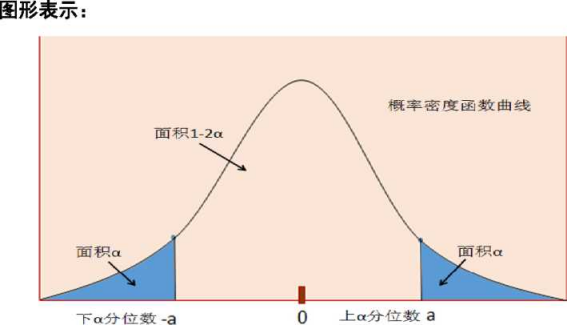 

4中位数

中位数是用来衡量数据取值的中等水平或一般水平的数值。对于一组数据来 说，中位数就是大小处于正中间位置的那个数值。

中位数用来衡量数据取值的中等水平或一般水平的数值。由于中位数能够代 表一般水平，在基金投资管理领域中，我们经常应用中位数来作为评价基金经理 业绩的基准。

二. 正态分布

正态分布是最重要的一类连续型随机变量分布，当一个随机变量的取值受到 大量不同因素作用的共同影响，并且单个因素的影响都微不足道的时候，这个随 机变量就服从或近似服从正态分布。

\1. 正态分布的图形特点：正态分布密度函数的显著特点是中间高两边低，由 中间(x=n)向两边递减，并且分布左右对称，是一条光滑的“钟形曲线”。

\2. 正态分布的取值特点：正态分布距离均值越近的地方数值越集中，离均值 较远的地方数值则很稀疏，这意味着正态分布出现极端值的概率很低。同时图像 越"瘦”，正态分布集中在均值附近的程度也越大。

三. 随机变眞的相关性一相关系數

从资产回报相关性的角度分析两种不同证券表现的联动性，通常用P M表示 证券i和证券j的收益回报率之间的相关系数。

相关系数的绝对值大小体现两个证券收益率之间相关性的强弱：

(1) 相关系数P汀总处于+1和T之间，即I P汀丨W1

(2) 若p尸1,则表示证券i与证券j完全正相关

(3) 若p汀=-1,则表示证券i与证券j完全负相关

(4) 若证券i与证券j之间完全无关系，则P ij=O

第二章权益投资

第一节资本结构

资本结构曜

(-)资本结构的定义

资本结构是指企业资本总额中各种资本的构成比例。最基本的资本结构是债 权资本和权益资本的比例，通常用债务股权比率或资产负债率表示。

(二) 资本的类型

1 .债权资本

(1) 债权资本是通过借债方式筹集的资本；

(2) 利息的高低与公司经营的风险相关。经营状况稳健的公司支付较低的 利息，而风险较高的公司则需要支付较高的利息。

2.权益资本

(1) 权益资本是通过发行股票或置换所有权筹集的资本；

(2) 两种最主要的权益证券是普通股和优先股。

(三) 各类资本的比较

| 比较               | 债券                                                   | 股票                                                         |
| ------------------ | ------------------------------------------------------ | ------------------------------------------------------------ |
| 现金流■权和投 票权 | 按期支付利息且到期归 还本金。对公司事务没 有表决权。   | 获得分红。按比例投票(但优 先股不能投票)保障，分散或 者转移风险。 |
| 清偿顺序           | 债权人拥有公司资产的 最高索取权。                      | 优先股股东优先于普通股股东 分配公司剩余财产。普通股股东是最后一个被偿还 的。 |
| 风险和收益特征     | 债权投资风险较小，同 时获得的收益水平也小 于股权投资。 | 股权投资的风险更大，要求更 高的风险溢价，其收益应该高 于债权投资的收益。 |

二.最优资本结构

***\*MM\****定理（1958年）：在不考虑税、破产成本、信息不对称并且假设在有效 市场里面，企业价值不会因为企业融资方式改变而改变。也就是说，不论公司选 择发行股票还是债券，或是采用不同的红利政策，都不会影响企业价值。因此***\*MM\**** 定理也被称为资本结构无关原理。

权衡理论：随着企业债务增加而提高的经营风险和可能产生的破产成本，会 增加企业的额外成本，而最佳的资本结构应当是负债和所有者权益之间的一个均 衡点，这一均衡点就是最佳负债比率。

第二节权益类证券

股票

权益类证券：包括权益证券和类权益证券，常见的有股票' 存托凭证' 可转 换债券和认股权证。

（-）股票的特征

| 特征   | 内容                                                         |
| ------ | ------------------------------------------------------------ |
| 收益性 | 收益性是股票最基本的特征，是指持有股票可以为持有人带来收益 的特性。股票的收益主要有两类：（1）股息和红利；（2）资本利得。 |
| 风险性 | 风险性是指持有股票可能产生经济利益损失的特性。股票风险的内 涵是预期收益的不确定性。 |
| 流动性 | 流动性是指股票可以依法自由地进行交易的特征。股票持有人不能 直接从股份公司退股，但可以在股票市场上很方便地卖出股票来变 现。 |
| 永久性 | 永久性是指股票所载有权利的有效性是始终不变的，因为它是一种 无期限的法律凭证。 |
| 参与性 | 参与性是指股票持有人有权参与公司重大决策的特性。             |

（二）股票的价值

| 价值     | 内容                                                         |
| -------- | ------------------------------------------------------------ |
| 票面价值 | 股票的票面价值又称面值，即在股票票面上标明的金额。股票的 票面价值在初次发行时有一定的参考意义：1. 以面值发行称为平价发行，此时公司发行股票募集的资金等于 股本的总和。2. 发行价格高于面值称为溢价发行，募集的资金大于股本的总 和，其中等于面值总和的部分记入股本，超额部分记入资本公 积。 |
| 账面价值 | 1 .股票的账面价值又称股票净值或每股净资产，是每股股票所代 表的实际资产的价值。2. 若没有优先股，每股账面价值以公司净资产除以发行在外的普 通股票的股数求得。3. 在盈利水平相同的前提下，账面价值越高，股票的收益越高， 股票就越有投资价值。账面价值是分析股票投资价值的重要指 标，在计算公司的净资产收益率时也有重要的作用。 |
| 清算价值 | 股票的清算价值是公司清算时每一股份所代表的实际价值。大多 数公司股票的清算价值低于其账面价值。 |
| 内在价值 | 1 .股票的内在价值即理论价值，是指股票未来收益的现值。2. 股票的内在价值决定其市场价格，股票的市场价格总是围绕其 内在价值波动。3. 由于未来收益及市场利率的不确定性，各种价值模型计算出的 “内在价值”只是股票真实内在价值的估计，经济形势的变化'宏观经济政策的调整'供求关系的变化等都会影响股票未来的收 益，引起内在价值的变化。 |

（三）股票的价格

 

1 .理论价格

股票的理论价格是根据现值理论,将股票的未来收益按市场利率折算成的当 前价值，即为股票的现值。

\2. 市场价格

股票的市场价格一般是指股票在二级市场上买卖的价格。供求关系是最直接 的影响因素。

（四）股票的类型

（1）	普通股：最主要的权益类证券。基本权利：收益权+表决权

（2）	优先股：优先分配股利和剩余资产，股东权利受限制，一般无表决权

普通股和优先股的比较

| 比较                      | 优先股 | 普通股 |
| ------------------------- | ------ | ------ |
| 股利分配和剩余资产 索取权 | 优先   | 落后   |
| 风险、收益特征            | 低     | 高     |

 

二. 存托凭证

（-）定义

指在一国证券市场上流通的代表外国公司有价证券的可转让凭证。存托凭证 一般代表外国公司股票。

（二）	作用

对发行人来说，发行存托凭证可以扩大市场容量，增强筹资能力；对于投资 者来说，购买存托凭证可以规避跨国投资的风险（如汇率风险）。

（三）	取

20世纪20年代的美国证券市场，J.P.摩根首创。

（四）	常见类型

\1. 全球存托凭证:大多数全球存托凭证在伦敦证交所和卢森堡证交所进行交 易，通常以美元计价，可以给投资者提供更多投资外国公司的机会。

\2. 美国存托凭证：以美元计价且在美国证券市场上交易的存托凭证，是最主

要的存托凭证，其流通量最大，可分为无担保的存托凭证和有担保的存托凭证。

① 无担保的存托凭证是指存券银行不通过基础证券发行公司，直接根据市场 需求和自有基础证券的数量自行向投资者发行的存托凭证。无担保的存托凭证目 前已经很少应用。

② 有担保的存托凭证是由发行公司委托存券银行发行的。根据交易能力和对 基础证券公司要求的不同，有担保的ADRs可分为四种类型，分别为一级' 二级' 三级公募ADRs和144A规则下的私募ADRso二级公募存托凭证成为中国网络股 进入纳斯达克交易所(NASDAQ)的主要形式。

三. 可转换债券

(-)可转换债券的定义和特征

\1. 定义：指在一段时期内，持有者有权按照约定的转换价格或转换比率将其 转换成普通股股票的公司债券，是一种混合债券，它既包含了普通债券的特征, 也包含了权益类债券特征。同时也具有相当于标的股票的衍生特征。

\2. 特征：既包含普通债券特征，也包含权益类债券特征，同时也具有相当于 标的股票的衍生特征。

(1) 可转换债券是含有转股权的特殊债券；

(2) 可转换债券有双重选择权，投资者拥有转股权，发行人拥有提前赎回 的权利。

(-)可转换债券的基本要素

| 基本要素 | 内容                                                         |
| -------- | ------------------------------------------------------------ |
| 标的股票 | 一般是发行公司自己的普通股股票。                             |
| 票面利率 | 可转换债券作为债券的票面年利率，它一般低于相同条件的普通 债券的票面利率，因为可转换债券持有者有特殊的选择权。 |
| 转换期限 | 可转换债券可转换成股票的起始日至结束日的期间。可转换债券 的期限最短为1年，最长为6年，自发行结束之日起6个月后才 能转换为公司股票。 |
| 转换价格 | 可转换债券转换成每股股票所支付的价格，其转换价格一般高于 其发行时的股票市价。即:转换价格=可转换债券面值4■转换比例。 |
| 转换比例 | 每张可转换债券能够转换成的普通股股数。即：转换比例=可转换 债券面值4■转换价格。 |
| 赎回条款 | 发行企业有权在约定的条件触发时按照事先约定的价格赎回所发 行的可转债的规定。一般在股票价格上升至超过转换价格一定倍 数时生效。 |
| 回售条款 | 可转债持有者有权在约定的条件触发时按照事先约定的价格将可 转债卖回给发行企业的规定。一般在股票价格下跌超过一定幅度 时生效。 |

（三）可转换债券的价值

 

可转换债券的价值=纯粹债券价值+转换权利价值

可转债的价值必须高于普通债券的价值，因为可债券的价值实际上是一个 普通债券加上一个有价值的看涨期权。

当股价很低时，可转债的价值主要体现了固定收益类证券的属性。

当股价很高时，可转债的价值主要体现了权益证券的属性。

四. 权证

（-）定义

指标的证券发行人或其以外的第三人发行的，约定在规定期间内或特定到期 日，持有人有权按约定价格向发行人购买或出售标的证券，或以现金结算方式收 取结算差价的有价证券。

（-）分类

\1. 按标的资产分：股权类权证、债权类权证、其他权证

\2. 按基础资产来源分：认股权证、备兑权证

\3. 按照持有人权利的性质分：认购权证（看涨）、认沽权证（看跌）

\4. 按行权时间分：美式权证（可在权证失效日之前任何交易日行权）、欧式 权证（仅可在失效日当日行权）、百慕大式权证（可在失效日之前一段规定时间

内行权）

（三）要素

| 权证类别     | 权证类别即为认购权证或认沽权证。                             |
| ------------ | ------------------------------------------------------------ |
| 标的资产     | 标的资产可以是股票、债券、外汇、商品等。股票权证的 标的资产可以是单一股票或是一篮子股票组合。 |
| 存续时间     | 存续时间即权证的有效期，超过有效期仍未行权，权证自 动失效。  |
| 行权价格     | 行权价格是发行权证时约定的权证持有人行权时向发行人 购买或出售标的资产的价格。 |
| 行权结算方式 | 行权结算方式有证券给付结算方式和现金结算方式两种。           |
| 行权比例     | 行权比例指单位权证可以购买或出售标的证券的数量               |

 

（四）权证的价值

认股权证的价值可以分为两部分：内在价值和时间价值

1 .内在价值：认股权证的内在价值=Max {（普通股市价一行权价格）X行权 比例，0}o

\2. 时间价值：在权证有效期内标的资产价格波动为权证持有者带来收益的可 能性隐含的价值。

五.权益类证券投资的风险和收益

（-）权益类证券投资的风险

权益类证券的价值会同时受到系统性风险和非系统性风险的影响。

1 .系统性风险

系统性风险也可称市场风险，由经济环境因素的变化引起的整个金融市场的 不确定性的加强，其冲击是属于全面性的。主要包括经济增长' 利率' 汇率与物 价波动，以及政治因素的干扰等。

\2. 非系统性风险

非系统性风险是由于公司特定经营环境或特定事件变化引起的不确定性的

加强，只对个别公司产生影响，是特有风险。

(1) 财务风险：又称违约风险，是企业在付息日或负债到期日无法以现金方 式支付利息或偿还本金的风险。

(2) 经营风险：公司在经营过程中由于产业景气状况、公司管理能力、投资 项目等企业个体因素，使企业的销售额或成本显得不稳定，引起息税前利润大幅 变动的可能性。

(3) 流动性风险：投资者在买入资产后，届时无法按照公平市价进行成交的 可能性。

(-)权益类证券投资的收益

1 .风险溢价，权益类证券本身隐含的风险越高，就必须有越多的预期报酬作 为投资者承担风险的补偿，这一补偿即是风险溢价。

2.无风险资产收益率，是指将资金投资于某一项没有任何风险的投资对象而 获得的收益率，是为投资者进行投资活动提供的必需的基准报酬。

风险资产的期望收益率=无风险资产收益率+风险溢价

【注意】无论是系统性风险还是非系统性风险，都要求相应的风险溢价。

六.影响公司发行在外股本的行为

(-)首次公开发行

指拟上市公司首次面向不特定的社会公众投资者公开发行股票筹集资金并 上市的行为。

(二)再融资

\1. 定义：指上市公司为达到增加资本和募集资金的目的而再发行股票的行为。

\2. 方式：(1)配股(2)增发(3)发行可转换债券(4)定向增发

\3. 影响：原有股东若在再融资时未增购股票的话，新增股票会稀释老股东的 持股比例。

(=)股票回购

\1. 定义：指上市公司利用现金等方式从股票市场上购回本公司发行在外股票

的行为。

\2. 方式：

（1）	场内公开市场回购——指按照目前市场价格回购企业股票，此种方法的 透明度比较高；

（2）	场外协议回购——指股票发行方通过协议价格向一个或几个大股东回 购股票；

（3）	要约回购——以一个高于股票市价的价格回购一定数量的股票，此法回 购成本较高；

公司除减少注册资本、与持有本公司股份的其他公司合并'将股份奖励给本 公司职工外，不得回购本公司股票。

（四）	股票拆分和分配股票股利

1 .股票拆分：即将一股面值较大的股票拆分成几股面值较小的股票。

影响：对公司的资本结构和股东权益不会产生任何影响，一般只会使发行在 外的股票总数增加，每股面值降低，并由此引起每股收益和每股市价下降，而股 东的持股比例和权益总额及其各项权益余额都保持不变。

2.分配股票股利：指上市公司将留存收益以股票形式支付给股东，又称送股。

影响：股东的持股比例和权益总额不变。

（五）	权证的行权

1 .当市场价格高于行权价格时，认购权证持有者行权，公司发行在外的股份 增加；

2.当市场价格低于行权价格时，认沽权证持有者行权，公司发行在外的股份 减少。

（六）	兼并收购

并购支付方式：现金支付、股票支付或两者混合的方式。

（七）	剥离

1 .定义：指上市公司将其部分资产或附属公司（子公司或分公司）分离出去， 成立新公司的行为。

2.影响：剥离后，母公司的资产因为剥离给新公司而减少，母公司的总价值

下降;但母公司原有股东持有的新公司的股票份额会弥补他们在母公司损失的价 值。

第三节股票分析方法

基本面分析

**1.** 定义：分析预期收益等价值决定因素的分析方法。

**2.** 常用方法：“自上而下”的层次分析法。

(-)宏观经济分析

\1. 定义：主要是分析宏观经济指标，预测经济周期和宏观经济政策的变化

\2. 宏观经济指标

(1) 国内生产总值：衡量一个国家或地区的综合经济状况的常用指标是国 内生产总值(GDP),国内生产总值由四部分构成：消费、投资' 净出口和政府 支出。

(2) 通货膨胀：通货膨胀的测量主要采用物价指数。

(3) 利率：利率是资金成本的主要决定因素。

(4) 汇率：汇率的变动直接影响本国产品在国际市场的竞争能力，从而对 本国经济增长造成一定影响。

(5) 预算赤字：政府的预算赤字是政府支出和政府收入之间的差额。

(6) 失业率：评价一个国家或地区失业状况的主要指标，它测度了经济运 行中生产能力极限的运用程度。

(7) 采购经理指数(PMI):衡量制造业在生产'新订单' 商品价格' 存货' 雇员' 订单交货' 新出口订单和进口八个方面状况的指数；当PMI大于50时， 说明经济在发展，当PMI小于50时，说明经济在衰退。

\3. 经济周期：根据实际国内市场总值将宏观经济运行划分为扩张期和收缩期。

\4. 宏观经济政策

(1)财政政策：指政府的支出和税收行为，通常采用的宏观财政政策包括 扩大或缩减财政支出'减税或增税等。政府希望通过这些方法控制社会的投资和 消费水平，提高经济增长率，增加就业水平或降低通货膨胀率。

20

(2) 货币政策：指通过控制货币供应量和影响市场的利率水平对社会总需 求进行管理。

货币政策工具：

① 公开市场操作，主要是央行在货币市场上买卖短期国债

② 利率水平的调节

③ 存款准备金率的调节

(-)行业分析

着重对行业基本面及其行业发展前景等行业因素进行判断。行业因素，又称 产业因素，行业因素会影响某一特定行业或产业中所有上市公司的股票价格**。**

\1. 行业生命周期

(1) 初创期：大量的新技术被采用，新产品被研制但尚未大批量生产，销 售收入和收益急剧膨胀；

(2) 成长期：各项技术已经成熟，产品的市场也基本形成并不断扩大，公 司利润开始逐步上升，公司股价逐步上涨；

(3) 成熟期：市场基本达到饱和，但产品更加标准化，公司的利润可能达 到高峰；

(4) 衰退期：行业的增长速度低于经济增速，或者萎缩。

\2. 行业景气度。景气度又称景气指数，它是对企业景气调查中的定性指标通 过定量方法加工汇总，综合反映某一特定调查群体或某行业的动态变动特性。

(三)公司内在价值与市场价格

\1. 内在价值

股票的内在价值即理论价值，是指股票未来收益的现值，由公司资产'收益、 股息等因素所决定；

股票的内在价值决定股票的市场价格，股票的市场价格总是围绕其内在价值 波动。研究和发现股票的内在价值，并将内在价值与市场价格相比较，进而决定 投资策略，是证券分析师的主要任务。

\2. 市场价格

市场价格是由市场供求关系所决定，市场价格不仅受到资产内在价值与未来

价值因素的影响，还可能受到市场情绪' 技术' 投机等因素的影响；

证券的市场价格经常与内在价值偏离的主要原因：数据不足或不准确'未来 的不确定性' 市场的非理性行为等。

二.技术分析

(-)技术分析的概述

通过研究金融市场的历史信息来预测股票价格的趋势。技术分析是通过股价、 成交量' 涨跌幅' 图形走势等研究市场行为，以推测未来价格的变动趋势。技术 分析只关心证券市场本身的变化，而不考虑基本面因素。

三大假定：(1)市场行为涵盖一切信息；

(2) 股价具有趋势性运动规律，股票价格沿趋势运动；

(3) 历史会重演。

(二)常用技术分析方法

1 .道氏理论

股票的变化表现为三种趋势：长期趋势' 中期趋势及短期趋势。

(1) 长期趋势最为重要，也最容易被辨认，它是投资者主要的观察对象。

(2) 中期趋势对于投资者较为次要，但却是投机者的主要考虑因素，它与 长期趋势的方向可能相同，也可能相反。

(3) 短期趋势最难预测，唯有投机交易者才会重点考虑。

\2. 过滤法则与止损指令

(1) 假设：股票价格是序列正相关的，也就是说，过去价格攀升的股票， 价格继续上扬而不是下跌的可能性高；

(2) 过滤法则：只要没有新的消息进入市场，股票价格就应该在其“正常 价格”的一定范围内随机波动，若某一新消息出现，一个新的均衡将出现。

\3. "相对强度”理论体系

投资者应购买并持有近期走势明显强于大盘指数的股票。也就是说要购买强 势股。相反，对于走势弱于大盘的股票，则应尽可能地采取回避的态度。

4 “量价”理论体系

当一只股票(或大盘)放量上涨或者呈现价升量增的态势时，则表明买方意

愿强烈，股票有望再续升势。相反，如果一只股票放量下跌，则表明卖压较为沉 重，发出空头信号。

第四节股票估值方法

内在价值法

又称绝对价值法或收益贴现模型，是按照未来现金流的贴现对公司的内在价 值进行评估。

(-)股利贴现模型***\*(DDM)\****

\1. 前提:假定股利是投资者在正常条件下投资股票所直接获得的唯一现金流。

\2. 公式：

***\*_Dj_\**** ***\*P\*******\*2\****	***\*_Dg\*******\*_\****	__Dt	***\*y\**** ***\*D\*******\*t\****

***\*1 + r\**** ***\*(1\**** ***\*+\**** ***\*r) (1\**** ***\*+\**** ***\*r) (1\**** ***\*+\**** ***\*r)\**** 台***\*(\*******\*1 + r)\****

式中：D表示普通股的内在价值；队表示普通股第t期支付的股息或红利； r表示贴现率，又称资本化率。

贴现率是预期现金流量风险的函数。风险越大，现金流的贴现率越大；风险 越小，则资产贴现率越小。

\3. 分类：零增长模型' 不变增长模型' 三阶段增长模型和多元增长模型。

(-)自由现金流***\*(FCFF)\****贴现模型

1 .公司价值等于公司预期现金流量按公司资本成本进行折现,将预期的未来 自由现金流用加权平均资本成本(WACC)折现到当前价值来计算公司价值，然后 减去债券的价值进而得到股票的价值。

2.公式：

n

盆**(1 +** **WACC)**

式中：FCPFf表示公司t期的自由现金流；S1CC表示加权平均资本成本， 即债务资本价值与股本价值之和。

FCFF=EBITX (1-税率)+折旧-资本性支出-追加营运资本

23

(三)股权资本自由现金流***\*(FCFE)\****贴现模型

\1. 股权自由现金流是在公司用于投资'营运资金和债务融资成本之后可以被 股东利用的现金流。

\2. FCFE=净收益+折旧一资本性支出一营运资本追加额一债务本金偿还+新 发行债务。

\3. FCFE贴现模型原理：将预期的未来股权活动现金流用相应的股权要求回 报率折现到当前价值来计算公司股票价值。

公式：

**n**

**W a+K****e****)**

式中：卩表示公司价值；**FCFEt**表示t期的现金流；、表示根据CAPM模型计 算的股权成本。

(四)经济附加值***\*(\*******\*EVA)\****模型

经济附加值等于公司税后净营业利润减去全部资本成本(股本成本与债务成 本)后的净值。

EVA=NOPAT—资本成本=(ROIC-WACC) X实际资本投入

式中：NOPAT表示税后经营利润，ROIC表示资本收益率。

经济附加值克服了传统业绩衡量指标的缺陷，比较准确的反映了一定时期内 为股东创造的价值。

二.相对价值法

使用一家上市公司的市盈率' 市净率、市售率' 市现率等指标与其竞争者进 行对比，以决定该公司价值的方法。

(-)市盈率模型

市盈率=每股市价/每股收益

根据市盈率偏高或偏低，判断该股票价格被高估还是低估。

(-)市净率模型

市净率=每股市价/每股净资产

相对于市盈率，市净率特有的优点：

(1) 每股净资产通常是一个累积的正值，因此市净率也适用于经营暂时陷 入困难的以及有破产风险的公司；

(2) 统计学证明每股净资产数值普遍比每股收益稳定得多；

(3) 对于资产包含大量现金的公司，市净率是更为理想的比较估值指标。

(三) 市现率模型

市现率是股票价格与每股现金流量的比率。

公司盈利水平容易被操纵，而现金流价值不容易被操纵，市现率越来越多的 被投资者采用。

用来计算的现金流是扣除利息' 税款' 折旧和摊销之前的收益(EBITDA), EB ITDA=^利润+所得税+利息+折旧+摊销=EB IT+折旧+摊销

(四) 市销率模型

也称价格营收比，是股票市价与销售收入的比率，该指标反映的是单位销售 收入反映的股价水平。

(五) 企业价值倍数***\*(EV/EBITDA)\****

EV/EBITDA又称企业价值倍数，是一种被广泛使用的公司估值指标。

公司价值EV=市值+净负债

EB ITDA=^利润+所得税+利息+折旧+摊销=EB IT+折旧+摊销

【注意】P/E和EV/EBITDA反映的都是市场价值和收益指标间的比例关 系，只不过P/E是从股东角度出发，EV/EBITDA则是从全体投资人的角度出 发。

第三章固定收益投资

第一节债券与债券市场

债券市场概述

| 债券     | 能够提供固定数额或根据固定公式计算出的现金流。               |
| -------- | ------------------------------------------------------------ |
| 债券市场 | 债券发行和买卖交易场所，将需要资金的政府机构或公司与资金 盈余的投资者联系起来。(1) 债券承销商：负责债券的发行与承销，金融中介作用。(2) 债券发行人：包括中央政府、地方政府、金融机构及企 业。债券到期时债务人必须按时归还本金并支付约定的利息。(3) 债券投资人：是资金的提供者。 |
| 关系     | 债券持有人与债券发行人之间是债权债务关系。                   |
| 作用     | 在其筹资功能的基础上，还为各种资产的定价提供基本的参照。     |

 

二. 债券的种类

(-)按发行主体分类

| 政府债券 | 是政府为筹集资金而向投资者出具并承诺在一定时期支付利 息和偿还本金的债务凭证。我国政府债券包括国债和地方政 府债。 |
| -------- | ------------------------------------------------------------ |
| 金融债券 | 是由银行和其他金融机构经特别批准而发行的债券。金融债 券包括政策性金融债、商业银行债券、特种金融债券、非银 行金融机构债券' 证券公司债' 证券公司短期融资券等。 |
| 公司债券 | 是公司依照法定程序发行' 约定在一定期限还本付息的有价 证券。发行主体是股份公司，但有的国家也允许非股份制企 业发行债券。归类时可将公司债券和企业债券合称公司(企 业)债券。 |

（二）按偿还期限分类

| 短期债券 | 偿还期在1年以下。美国的短期国债的期限通常为3个月或6个月。 |
| -------- | --------------------------------------------------------- |
| 中期债券 | 偿还期一般为1-10年。                                      |
| 长期债券 | 偿还期一般为10年以上。                                    |

 

 

（=）按计息方式分类

| 固定利率债券 | 有固定到期日，并在偿还期内有固定的票面利率和不变的 面值，是政府和企业的主要债券种类。 |
| ------------ | ------------------------------------------------------------ |
| 浮动利率债券 | 票面利率不是固定不变的，通常与一个基准利率挂钩，在 其基础上加上利差以反映不同债券发行人的信用，浮动利 率=基准利率+利差（可正可负）。 |
| 零息债券     | 债务存续期间内不支付利息，到期日一次性支付本金和利 息，通常本利和为债券的面值，在其发行时以低于面值的 价格发行，差价即为投资收益。 |

 

 

（四）按付息方式分类

| 息票债券 | 是指债券发行时规定，在债券存续期内，在约定的时间以 约定的利率按期向债券持有人支付利息的中、长期债券。 |
| -------- | ------------------------------------------------------------ |
| 贴现债券 | 是无息票债券或零息债券，这种债券在发行时不规定利率， 券面也不附息票，发行人以低于债券面额的价格出售债券， 即折价发行，债券到期时发行人按债券面额兑付。 |

 

 

（五）按嵌入的条款分类

| 可赎回债券 | 为发行人提供在债券到期前的特定时段以事先约定价格 买回债券的权力。 |
| ---------- | ------------------------------------------------------------ |
|            |                                                              |

| 可回售债券     | 为债券持有者提供在债券到期前的特定时段以事先约定 价格将债券回售给发行人的权力，约定的价格称为回售 价格。 |
| -------------- | ------------------------------------------------------------ |
| 可转换债券     | 是指在一段时间后，持有者有权按约定的转换价格或转 换比率将公司债券转换为普通股股票。 |
| 通货膨胀時债券 | 通货膨胀通过影响债券现金流而降低投资者的购买力， 而大多数的通货膨胀联结债券的面值（而不是票面利 率）在每个支付日会根据某一消费价格指数调整来反映 通货膨胀的变化。 |
| 结构化债券     | 指以其他债券组成的资产池为支持，构建新的债券产品 形式。      |

 

三. 债券违约时的受偿顺序

有保证债券〉优先无保证债券〉优先次级债券〉次级债券〉劣后次级债券

四. 投资债券的风险

与证券市场上的其他投资工具一样，债券投资也面临一系列风险。这些风险 可以划分为六大类：信用风险'利率风险'通胀风险'流动性风险'再投资风险' 提前赎回风险。

| 信用风险（违约风险） | 指债券发行人未按照契约的规定支付债券的本金和利息， 给债券投资者带来损失的可能性。 |
| -------------------- | ------------------------------------------------------------ |
| 利率风险             | 指利率变动引起债券价格波动的风险。债券的价格与利率 呈反向变动关系：利率上升时，债券价格下降；而当利率 下降时，债券价格上升。 |
| 通货膨胀风险         | 利息和本金都是不随通胀水平变化的名义金额，债券持有 者获得的利息和本金的购买力受通货膨胀影响，所有种类 的债券都面临通胀风险。 |
| 流动性风险           | 到期债券的持有者无法以市值的价格变现，而只能以明显 低于市值的价格变现债券形成的投资风险。 |

| 再投资风险             | 在市场利率下行的环境中，附息债券收回的利息或者提前 于到期日收回的本金只能以低于原债券到期收益率的利率 水平再投资于相同属性的债券，而产生的风险。 |
| ---------------------- | ------------------------------------------------------------ |
| 提前赎回风险(回购风险) | 指债券发行者在债券到期日前赎回有提前赎回条款的债券 所带来的风险。 |

 

五.中国债券交易市场体系

(-)以柜台市场为主***\*(1988-1991\****年)

以柜台市场为主，通过商业银行和证券经营机构的柜台进行交易。

(-)以交易所市场为主***\*(1992-2000\****年)

中国的债券市场形成了场内交易所市场和场外银行间市场并存的格局，并且 以交易所市场为主。

(=)以银行间市场为主***\*(2001\****年至今)

目前，我国债券市场形成了银行间债券市场'交易所市场和商业银行柜台市 场三个基本子市场为主的统一分层的市场体系。

第二节债券价值分析

债券的估值方法

(-)零息债券估值法

零息债券：以低于面值的贴现方式发行，不支付利息，到期按债券面值偿还 的债券。

***\**M\**\***

***\*V =\****	***\*i\****

***\**a + r)\**\***

式中：***\*V\****表示贴现债券的内在价值；***\*M\****表示面值；***\*r\****表示市场利率；***\*t\****表示债 券到期时间，单位是年。

期限小于一年，公式可调整：

***\*V = M\*******\*（\*******\*1\*******\*-360\*******\*F\*******\*）\****

（-）固定利率债券估值法

固定利息债券：一种按照票面金额计算利息，票面上附有（也可不附有）作 为定期支付利息凭证的期票的债券。

***\*V = £+\**** ***\*+\**** 网

**1** **+ r** **（1 + t）**	***\**（1 + r）\**\***	***\**Cl\**\*** ***\**+\**\*** ***\**r）\**\***

式中：V表固定利率债券的内在价值；C表示每期支付的利息；M表示面值； r表示市场利率；n表示债券到期时间。

（三）统一公债估值法

统一公债：没有到期日的特殊债券（优先股也相当于一种统一公债）。

***\**C C\**\***	***\**C C\**\***

债券的收益率

（-）当期收益率

又称当前收益率，是债券的年利息收入与当前的债券市场价格的比率。其计 算公式为：

***\**C\**\***

***\**l=\**\******\**p\**\***

式中：I表示当期收益率；C表示年息票利息；P表示债券市场价格。

当期收益率没有考虑债券投资所获得的资本利得或损失，只是债券某一期间 所获得的现金收入相较于债券价格的比率。

（二）到期收益率

1 .到期收益率概念及公式

又称内部收益率，是可以使投资购买债券获得的未来现金流的现值等于债券 当前市价的贴现率。

隐含两个重要假设：（1）投资者持有至到期；（2）利息再投资收益率不变。

债券市场价格和到期收益率的关系式：

|      | ***\**n\**\******\**▽\**\***	***\**C\**\***	***\**.\**\*** ***\**1\**\*** ***\**.n\**\******\*P=\**** ***\*>\**** 	 ***\**+M\**\*** ***\**(^-―)\**\*** |
| ---- | ------------------------------------------------------------ |
|      |                                                              |

式中：y表示到期收益率；P表示债券市场价格；C表示每期支付的利息；n

 

 

| 表示时期数； | ***\*M\****表示债券面值。 |
| ------------ | ------------------------- |
|              |                           |

2.到期收益率的影响因素

 

(1) 票面利率：与到期收益率正相关

(2) 债券市场价格：与到期收益率负相关

(3) 计息方式

(4) 再投资收益率

到期收益率不仅考虑了利息收入,还考虑了债券投资所获得的资本利得或损 失。

(=)债券当期收益率与到期收益率的关系

债券当期收益率与到期收益率两者之间关系的如下：

(1) 债券市场价格越接近债券面值，期限越长，则当期收益率就越接近到 期收益率。

(2) 债券市场价格越偏离债券面值，期限越短，则当期收益率就越偏离到 期收益率。

但是不论当期收益率与到期收益率近似程度如何，当期收益率的变动总是预 示着到期收益率的同向变动。

三.利率期限结构和信用利差

(-)利率期限结构与债券收益率曲线

1 .不同债券存在收益率差异的原因

(1) 债券信用等级不同

(2) 到期期限不同

\2. 利率期限结构概念

利率期限结构，是指在某一时点上，各种不同期限债券的收益率和到期期限 之间的关系。

\3. 收益率曲线类型

债券收益率曲线：描述到期收益率和到期期限之间关系的曲线。有上升、反 转' 水平' 拱形四种形式，上升收益率曲线最常见。

（-）伯用利差

\1. 信用利差概述

除了信用评级不同外，其余条件全部相同（包括但不限于期限'嵌入条款等） 两种债券收益率的差额。

\2. 信用利差的特点

—般而言，信用利差有以下三个显著特点：

（1）	对于给定的非政府部门的债券' 给定的信用评级，信用利差随着期限 增加而扩大；

（2）	信用利差随着经济周期的扩张而缩小，随着经济周期的收缩而扩张；

（3）	信用利差的变化本质上是市场风险偏好的变化，受经济预期影响。

四.债券的久期和凸性

（-）列

\1. 定义：债券投资者收回其全部本金和利息的平均时间。

\2. 麦考利久期计算公式：

十 **tC nM**

=召（1 +疗*（1 +呼

**mac**	**p**

\3. 修正久期的计算公式：

修正久期（。瑚）:麦考利久期除以（1+y）

|      |                                           |
| ---- | ----------------------------------------- |
|      |  |

（二）凸性

\1. 凸性：价格一收益率曲线的曲率。凸性意味着债券的价格一收益率曲线的 斜率随着收益率而变化。

\2. 债券价格和利率的变化是非线性的。

\3. 债券收益率下降所引起的债券价格上升的幅度大于收益率同比上升所引 起的债券价格下降的幅度。

(=)久期和凸性的应用

常用的免疫策略主要包括：所得免疫、价格免疫和或有免疫。重点介绍前两 个。

1 .所得免疫

所得免疫策略保证投资者有充足的资金可以满足预期现金支付的需要。这对 于养老基金'社保基金、保险基金等机构投资者具有重要的意义，因为这类投资 者对资产的流动性要求很高，其投资成败的关键在于投资组合中是否有足够的流 动资产可以满足目前的支付。包括：

(1) 现金配比策略

特点：限制性强，弹性很小，这就可能会排斥许多缺乏良好现金流量特性的 债券。

(2) 久期配比策略

特点：只要求负债流量的久期和债券投资组合的久期相同即可，因而有更多 的债券可供选择。但是，这一策略也存在一定不足之处。例如为了满足负债的需 要，债券管理者可能不得不在价格极低时抛出债券。

(3) 水平配比策略

特点：两种配比策略的优点结合。投资者可以设计出一种债券投资组合，在 短期内运用现金配比策略，在较长的时期内运用久期配比策略。这样，既具有了 现金配比策略中的流动性强的优点，又具有了久期配比策略中的弹性较大的优点。

2.价格免疫

价格免疫由那些保证特定数量资产的市场价值高于特定数量负债的市场价 值的策略组成。价格免疫使用凸性作为衡量标准，实现资产凸性与负债凸性相匹 配。

第三节货币市场工具

—.货币市场工具的特点

一般指短期的(一年以内)、具有高流动性的低风险证券，具体 定义

包括银行回购协议、定期存款、商业票据、银行承兑汇票、短期

|      | 国债、中央银行票据等。                                       |
| ---- | ------------------------------------------------------------ |
| 功能 | (1) 货币市场工具为商业银行管理流动性以及企业融通短期资金 提供了有效的手段。(2) 因货币市场工具交易而形成的短期利率在整个市场的利率体 系中充当了基准利率，为市场上其余证券利率的确定提供了重要 的参考依据，是判断市场上银根松紧程度的重要指标。 |
| 特点 | (1) 均是债务契约；(2) 期限在1年以内(含1年)；(3) 流动性高；(4) 大宗交易，主要由机构投资者参与，个人投资者很少有机会 参与买卖；(5) 本金安全性高，风险较低。 |

 

二.常见的货币市场工具

(-)银行定期存款

1 .定义：银行与存款人双方在存款时事先约定期限、利率，到期后支取本息 的存款，是银行资金的主要来源。

2.特点：期限固定' 金额选择余地大，流动性好，利息收益较稳定。

(二)短期回购协议

| 概述 | 1. 定义资金需求方在出售证券的同时与证券的购买方约定在一定期限后 按约定价格购回所卖证券的交易行为。本质上，回购协议是一种 证券抵押贷款，抵押品以国债为主。2. 参与者：(1) 证券的出售方为资金借入方，即正回购方；(2) 证券的购买方为资金贷出方，即逆回购方。 |
| ---- | ------------------------------------------------------------ |
| 功能 | (1)中国人民银行以此为工具进行公开市场操作，方便中央银行 投放(收回)基础货币，形成合理的短期利率。 |

|          | (2) 为商业银行的流动性和资产结构的管理提供了必要的工具。(3) 各类非银行金融机构可以通过证券回购协议实现套期保值、 头寸管理、资产管理、增值等目的。 |
| -------- | ------------------------------------------------------------ |
| 市场     | 1 .场内交易市场上海证券交易所和深圳证券交易所开办的国债标准回购业务，参 与者包括个人投资者和企业。因为标准化的缘故，场内交易的回购协议对国债种类、期限、合 约金额、清算方式都有极其严格的规定。2.场外交易市场银行间国债回购市场，参与者包括中国人民银行、商业银行(包 括非国有商业银行)、证券公司、基金管理公司等金融机构。货币基金在银行间回购市场兼有资金需求方和资金供给方功能。 货币基金使用回购协议作为其资金的来源的原因:(1) 基金的资产中存在大量的政府债券，可以作为回购协议的抵 押品；(2) 回购协议市场交易量大，可以方便地获得资金。同时基金会 将部分资金配置在短期回购协议，以保持基金有适当的流动性和 收益。 |
| 主要类型 | 1 .按回购期限划分1天(隔夜回购)、2天、3天' 4天、7天' 14天、28天' 91天 以及182天。国债回购在各国市场中最长期限均不超过1年。2.按逆回购方是否有权处置回购协议的标的国债划分(1) 质押式回购：质押的国债的所有权仍属于国债的出让方(正 回购方)，受让方(逆回购方)无权处置，国债被证券交易中心 冻结。(2) 买断式回购：出售的国债的所有权转移给国债的受让方(逆 回购方)，受让方有权处置该国债，只需在到期日按约定价格回 售先前的国债。 |

| 龄响因素 | (1) 抵押证券的质量。抵押证券的流动性越好、信用程度越高， 回购利率越低。(2) 回购期限的长短。一般来说.回购期限越短，抵押品的价格 风险越低，回购利率越低。(3) 交割的条件。若采用实物交割，回购利率较低。(4) 货币市场其他子市场的利率。 |
| -------- | ------------------------------------------------------------ |
| 定价     | 回购价格=本金X {1+ (回购时应付的利率X回购协议的期限)/360}    |
| 风险     | 尽管回购协议中的抵押品一般是风险较低的国债，但交易过程中仍 然存在信用风险。1 .信用风险的种类(1) 到期时，证券的出让方(正回购方)无法按约定价格赎回， 证券的受让方(逆回购方)只能保留作为抵押品的证券。此时，若 适逢利率上升，则该抵押品价格下降，抵押品的价值便低于出借资 金的价值，客户蒙受损失。(2) 到期时，证券的受让方(逆回购方)不愿意按约定价格将抵 押的证券回售给证券的出让方(正回购方)。此类信用风险一般发 生在利率下跌、抵押品价格上涨的情形下。2.降低信用风险的方法(1) 对抵押品进行限定，且倾向于对流动性高、容易变现抵押物 的要求，如只接受短期国债或中央银行票据为抵押品；(2) 提高抵押率的要求。一般要求提供更多的抵押品。 |

 

(三)中央银行票据

\1. 中央银行票据的概念

由中央银行发行的用于调节商业银行超额准本金的短期债务凭证，简称央行 票据或央票。

\2. 中央银行票据产生的原因

(1)自2001年加入WT0后，我国经常项目与资本项目的双顺差呈现出加速

增长的势态，外汇储备爆发式增长，央行通过发行中央银行票据冲销购汇带来的 货币供给的扩张，一定程度上缓解了国内流动性过剩的压力。

(2)央票弥补了我国国债期限不合理的缺点，为公开市场操作提供了有效 的市场工具。

3.中央银行票据的特征

参与主体只有中央人民银行及经过特许的商业银行和金融机构。

4中央银行票据的分类

(1) 普通央行票据：中国人民银行在公开市场操作中使用的票据。

(2) 专项央行票据：主要用于置换商业银行和金融机构的不良资产，发行 本身并不会改变市场上基础货币的供给水平。

(四) 短期政府债券

1 .短期政府债券的概念

由一国的政府部门发行并承担到期偿付本息责任的，期限在1年及1年以内 的债务凭证。广义上不仅包括国家财政部发行的债券，还包括地方政府及政府代 理机构所发行的证券。狭义上仅指由财政部发行的政府债券。

2.短期政府债券的特点

短期政府债券主要有三个特点：

(1) 违约风险小，由国家信用和财政收入作保证，在经济衰退阶段尤其受 投资者喜爱；

(2) 流动性强，交易成本和价格风险极低，十分容易变现；

(3) 利息免税，根据我国相关法律规定，国库券的利息收益免征所得税。

(五) 短期融资券

1 .短期融资券的概念

中国的短期融资券是境内具有法人资格的非金融企业发行的，仅在银行间债 券市场上流通的短期债务工具。

2.短期融资券的发行

(1)由商业银行承销并采用无担保的方式发行(信用发行)，通过市场招

标确定发行利率;

(2) 发行人必须为具有法人资格的企业，投资者则为银行间债券市场的机 构投资者；

(3) 发行目的：为了获得短期流动性，对资金用途并无明确限制。

(六) 其他具有良好流动性的货币市场工具

1 .同业拆借

| 定义     | 金融机构之间以货币借贷方式进行短期资金融通的行为。     |
| -------- | ------------------------------------------------------ |
| 期限     | 一般较短，最短的是隔夜拆借，最长的接近一年。           |
| 交易主体 | 商业银行、保险公司、证券公司、基金公司等大型金融机构。 |
| 交易过程 | 资金的拆入方(借方)和拆出方(贷方)。                     |

 

2.银行承兑汇票

| 定义     | 由在承兑银行开立存款账户的存款人出票，向开户银行申请并 经银行审查同意承兑的，保证在指定日期无条件支付确定的金 额给收款人或持票人的票据，是商业票据的一种。 |
| -------- | ------------------------------------------------------------ |
| 期限     | 一般票据的贴现期不超过6个月，贴现期从贴现日起计算至票 据到期日。 |
| 类型     | 转贴现和再贴现。                                             |
| 主要功能 | 是方便商业交易活动，减少了因售货方对购货方信用不了解而 产生的不信任，在对外贸易中运用较多。 |

 

3.商业票据

| 定义     | 发行主体为满足流动资金的需求所发行的期限为2天至270天 的' 可流通转让的债务工具。 |
| -------- | ------------------------------------------------------------ |
| 特点     | (1) 面额较大；(2) 利率较低，通常比银行优惠利率低，比同期国债利率高；(3) 只有一级市场，没有明确的二级市场。 |
| 发行方式 | (1)直接发行：指发行主体直接将票据销售给投资人，大多数 资信好的公司采用这种发行方式。 |

（2）间接发行：指发行主体通过票据承销商将票据间接出售给 投资者。

商业票据也采用贴现发行的方式。货币市场利率越高，贴现率越 高；发行主体资信越好，贴现率越低。

4.大额可转让定期存单

| 定义 | 银行发行的具有固定期限和一定利率的，且可以在二级市场上 转让的金融工具。 |
| ---- | ------------------------------------------------------------ |
| 比较 | 与银行定期存款相比：① 定期存款记名且不可转让；大额可转让定期存单不记名，并且 可以在二级市场上转让，可转让是其最大的特点；② 定期存款的金额一般由存款者自身决定，有零有整；大额可转 让定期存单一般面额较大，且为整数；③ 定期存款的投资者可以是个人投资者' 机构投资者' 企业等； 由于面额较大，大额可转让定期存单的投资者一般为机构投资 者和资金雄厚的企业；④ 定期存款的利率固定；大额可转让定期存单的利率可以是固 定的，也可以是浮动的，且一般比同期的定期存款利率要高，一 般也高于同期国债的利率；⑤ 定期存款可以提前支取，但需要罚息；大额可转让定期存单原 则上不能提前支取，只能在二级市场上转让；⑥ 定期存款期限较长，一般都在1年以上；而大额可转让定期存 单的期限较短，一般在1年以内，最短的是14天，以3个月' 6个月为主。 |

 

5.同业存单

| 定义 | 存款类金融机构在全国银行间市场上发行的记账式定期存款凭 证。目前，同业存单已经成为银行业存款类金融机构的重要短 期融资工具。 |
| ---- | ------------------------------------------------------------ |
|      |                                                              |

| 交易主体 | 全国银行间同业拆借市场成员' 基金管理公司及基金类产品（包 括信托公司）。 |
| -------- | ------------------------------------------------------------ |
|          |                                                              |

第四章衍生工具

第一节衍生工具概述

衍生工具的定义及要素

（-）衍生工具的定义

衍生工具是由另一种基础资产（股票' 债券' 货币或商品等）构成或衍生而 来的交易合约。衍生工具的价值取决于一种或多种基础资产。这些基础资产通常 被称作合约标的资产。合约标的资产可以是股票' 债券' 货币等金融资产，也可 以是黄金' 原油等大宗商品或贵金属。

常见的衍生工具有远期' 期货' 期权和互换等。

在远期和期货合约中，在未来买入合约标的资产（或者有买入合约标的资产 权利）的一方称为多头，在未来卖出合约标的资产（或者有卖出合约标的资产权 利）的一方称为空头。

（二）衍生工具的要素

| 合约标的资产 | 在合约标的资产基础上创造出来的。所有的衍生品合约追 根溯源都是以标的资产作为基础的。合约标的资产的例子包括：市场利率，股票，股票市场指 数和债券市场指数，小麦、大豆等农产品。 |
| ------------ | ------------------------------------------------------------ |
| 到期日       | 所有的衍生工具都会规定一个合约到期日。                       |
| 交易单位     | 又称合约规模，是指在交易时每一份衍生工具所规定的交 易数量。  |
| 交割价格     | 是未来买卖合约标的资产的价格。通常取决于合约标的资 产的价格和交易双方的预期。 |
| 结算         | 算可以按合约规定在到期日或者在到期日之前结算。               |

二.衍生工具的特点

与股票'债券等金融工具有所不同，衍生工具具有跨期性' 杠杆性、联动性'

不确定性或高风险性四个显著的特点。

| 跨期性              | 衍生工具是交易双方根据对价格(例如商品价格、利率、 股价等)变化的预测，约定在未来某一确定的时间按照某 一条件进行交易或有选择是否交易的权利，涉及基础资产 的跨期转移。 |
| ------------------- | ------------------------------------------------------------ |
| 杠杆性              | 衍生工具只要支付少量保证金或权利金就可以买入。这也 在很大程度上决定了衍生工具所具有的高风险性。 |
| 联动性              | 指衍生工具的价值与合约标的资产价值紧密相关，衍生资 产价格与标的资产的价格具有联动性。 |
| 不确定性或高风 险性 | 衍生工具的价值与合约标的资产紧密相关，合约标的资产 的价格变化会导致衍生工具的价格变动。而且衍生工具通 常存在较大的杠杆，所以常常会有比较大的风险。衍生工具还可能有以下风险：(1) 交易双方中的某方违约的信用风险；(2) 因为资产价格或指数变动导致损失的市场风险；(3) 因为缺少交易对手而不能平仓或变现的流动性风险；(4) 因为交易对手无法按时付款或者按时交割带来的结算 风险；(5) 因为操作人员人为错误或系统故障或控制失灵导致的 运作风险；(6) 因为合约不符合所在国法律带来的法律风险。 |

 

=.衍生工具的分类

| 按合约特点分类 | 远期合约、期货合约、期权合约、互换合约、结构化金融衍生工具 |
| -------------- | ---------------------------------------------------------- |
|                |                                                            |

| 按产品形态分类            | 独立衍生工具、嵌入式衍生工具                                 |
| ------------------------- | ------------------------------------------------------------ |
| 按合约标的资产 的种类分类 | 货币衍生工具、利率衍生工具、股权类产品的衍生工具、 信用衍生工具、商品衍生工具、其他衍生工具 |
| 按交易场所分类            | 交易所交易的衍生工具、场外交易市场(OTC)交易的衍生工具        |

 

第二节远期合约和期货合约

远期合约概述

(-)远期合约的概念

| 定义 | 远期合约是交易双方约定在未来的某一确定的时间，按约定的价 格买入或卖出一定数量的某种合约标的资产的合约。 |
| ---- | ------------------------------------------------------------ |
| 特点 | 是一种非标准化的合约，即远期合约一般不在交易所进行交易， 而是在金融机构之间或金融机构与客户之间通过谈判后签署的。 通常实物交割。 |
| 优点 | 灵活。                                                       |
| 缺点 | (1) 因为远期合约没有固定的、集中的交易场所，不利于市场 信息的披露，也就不能形成统一的市场价格，所以远期合约市场 的效率偏低；(2) 每份远期合约在交割地点、到期日、交割价格、交易单位 和合约标的资产的质量等细节上差异很大，给远期合约的流通造 成很大不便，因此远期合约的流动性比较差；(3) 远期合约的履行没有保证，当价格变动对其中一方有利 时，交易对手有可能没有能力或没有意愿按规定履行合约，因此 远期合约的违约风险会比较高。 |

 

(二)远期合约的定价

远期价格是远期市场为当前交易的一个远期合约而提供的交割价格，它使 得远期合约的当前价值为零。

理论上，远期价格是：「=尸0=、0次’

二.期货合约概述

(-)期货合约的概念

| 定义 | 期货合约是指交易双方签署的在未来某个确定的时间按确定的价 格买入或卖出某项合约标的资产的合约。期货合约在交易所中交易的标准化合约，一般用现金进行结算。 |
| ---- | ------------------------------------------------------------ |
| 分类 | (1) 商品期货包括农产品期货、金属期货、能源期货。(2) 金融期货主要包括货币期货、利率期货、股票指数期货和 股票期货。 |
| 发展 | 2006年9月，中国金融期货交易所正式成立；2010年4月，中国金融期货交易所推出沪深300指数期货；2013年9月6日，首批3个5年期国债期货合约正式在中国金 融期货交易所推出。 |

 

(-)期货合约的要素

在签署一份新的期货合约时，期货交易所详细地规定了合约的确切条款，这 主要包括期货品种' 交易单位、最小变动单位'价格波动限制和最后交易日等一 系列内容。

1 .期货品种

通常分为商品期货和金融期货两种。

\2. 交易单位

也称合约规模，是指在期货交易所交易的每一份期货合约上所规定的交易数 量。

\3. 最小变动单位

是指在期货交易所公开竞价过程中，某一商品报价单位在每一次报价时所允

许的最小价格变动量。期货合约最小变动单位的确定，取决于该合约标的资产的 种类' 性质' 市场价格波动情况和商业规范等。

\4. 每日价格最大波动限制

也称为每日涨跌停板制度，即期货合约在一个交易日中的交易价格波动不得 高于规定的涨跌幅度或者低于规定的涨跌幅度，超过该涨跌幅度的报价将被视为 无效，不能成交。

涨跌停板一般是以合约上一交易日的结算价为基准确定的。

\5. 合约月份

是指期货合约到期交收实物的月份。

期货的合约月份由期货交易所规定，期货交易者可自由选择不同合约月份的 期货合约。在金融期货中，除少数合约有特殊规定外，绝大多数合约的交割月份 都定为每年的3月' 6月、9月和12月。

\6. 交易时间

期货合约的交易时间是固定的。每个交易所对交易时间都有严格的规定，不 同的交易所可以规定不同的交易时间。

\7. 最后交易日

是指期货合约在合约月份中可以进行交易的最后一个交易日。

\8. 交割等级

是指由交易所统一规定的'准许上市交易的标的资产的质量等级。

\9. 其他交割条款

是指由交易所规定的各种期货合约因到——未做对冲平仓而进行实际交割 的各项条款，包括交割日' 交割方式和交割地点等。

（三）期货市场的交易制度

1 .保证金制度

指在期货交易中，任何交易者必须按其所买入或者卖出期货合约价值的一定 比例交纳资金，这个比例通常在5%-10%,作为履行期货合约的保证，并视价格确 定是否追加资金，然后才能参与期货合约的买卖。

\2. 盯市制度

是期货交易最大的特征，又称为“逐日结算”，即在每个营业日的交易停止 以后，将所有清算事务都交由清算机构办理。清算机构在每个交易日为其会员公 司的账户轧出盈亏。

假如经盯市后某会员的账户余额降至维持保证金水平以下，他必须立即追加 保证金；反之，在盈利的情况下会员公司则可随时提取超额部分。

\3. 对冲平仓制度

指若持仓者在到期日之前改变已有的头寸，在市场上买卖与自己合约品种、 数量相同但方向相反的期货。

交易者进行期货交易的目的有两种——套期保值或者进行投机。这种目的决 定了期货交易是一种不以实物商品的交割为目的的交易。绝大多数的期货交易者 都以对冲平仓的方式了结交易。

\4. 交割制度

分为实物交割和现金结算两种形式。

（四）期货市场的基本功能

| 风险管理 | 期货市场的最基本的功能就是风险管理，具体表现为利用 商品期货管理价格风险，利用外汇期货管理汇率风险，利 用利率期货管理利率风险，以及利用股指期货管理股票市 场系统性风险。 |
| -------- | ------------------------------------------------------------ |
| 价格发现 | 期货市场上来自各个地方的交易者带来了大量的供求信 息，标准化合约的转让又增加了市场流动性，期货市场中 形成的价格能真实地反映供求状况，同时又为现货市场提 供了参考价格，起到了 “价格发现”的功能。 |
| 投机     | 期货市场的一个主要经济功能是为生产、加工和经营者等 提供价格风险转移工具。要实现这一目的，就必须有人愿 意承担风险并提供风险资金。扮演这一角色的就是投机 者。 |

第三节期权合约

期权合约概述

期权合约又称作选择权合约，是指赋予期权买方在规定期限内按双方约定的 价格买入或卖出一定数量的某种金融资产的权利的合同。

全美范围内的标准化的期权合约是从1973年芝加哥期权交易所(CBOE)的 看涨期权交易开始的。

我国上证50ETF期权在2015年2月上市。

(-)期权合约的要素

1 .标的资产

标的资产即期权合约中约定交易的资产，可以是实物商品'金融资产'利率、 汇率或各种综合价格指数等。

\2. 期权的买方

买方为买入期权的一方，即支付费用从而获得权利的一方，也称期权的多头。

\3. 期权的卖方

卖方为卖出期权的一方，即获得费用因而承担着在规定的时间内履行该期权 合约义务的一方，也称期权的空头。

\4. 执行价格

执行价格，又称协议价格，是指期权合约所规定的，期权买方在行使权利时 所实际执行的价格。

\5. 期权费

期权费是指期权买方为获取期权合约所赋予的权利而向期权卖方支付的费 用。这一费用一旦被支付，则不管期权买方是否执行期权均不会被退给卖方。

\6. 通知日

当期权买方要求履行标的物的交付时，它必须在预先确定的交货和提运日之 前的某一天先通知卖方，以便让卖方做好准备，这一天就是通知日。

\7. 到期日

到期日指期权合约必须履行的时间。

（二）期权合约的常见类型

\1. 按期权买方执行期权的时限分类

（1）	欧式期权：期权的买方只有在期权到期日才能执行期权。

（2）	美式期权：允许期权买方在期权到期前的任何时间执行期权。

世界范围内，在交易所进行交易的多数期权均为美式期权；而在大部分场外 交易中广泛采用的则是欧式期权。

\2. 按期权买方的权利分类

（1）	看涨期权：赋予期权的买方在事先约定的时间以执行价格从期权卖方 手中买入一定数量的标的资产的权利的合约，又称买入期权。

（2）	看跌期权：期权买方拥有一种权利，在预先规定的时间以执行价格向 期权卖出者卖出规定的标的资产，又称卖出期权。

\3. 按执行价格与标的资产市场价格的关系分类

（1）	实值期权：买方具有正的现金流。

（2）	平价期权：买方此时的现金流为零。

（3）	虚值期权：买方此时具有负的现金流。

二.期权合约的价值

期权合约的价值分为：

（1）	内在价值：多头行使期权时可以获得的收益的现值，即资产的市场价 格与执行价格之间的差额。

（2）	时间价值：在期权有效期内标的资产价格波动为期权持有者带来收益 的可能性所隐含的价值。

（-）看涨期权的盈亏分布

看涨期权买方的亏损是有限的，其最大亏损额为期权价格，而盈利可能是无 限大的。

看涨期权卖方的盈利是有限的，其最大盈利为期权价格，而亏损可能是无限 大的。

（二）看跌期权的盈亏分布

看跌期权买方的亏损是有限的，其最大亏损额为期权价格。

48

看跌期权卖方的盈利是有限的，其最大盈利为期权价格。

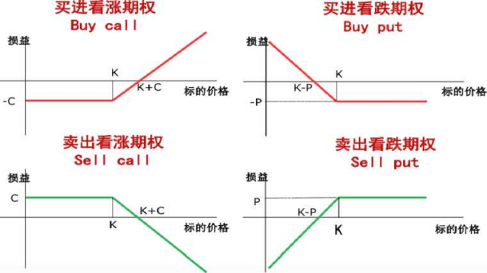 

 

如果以***\*X\****表示执行价格，St代表标的资产的到期日价格，则:

**(1)** 欧式看涨期权多头的损益为：***\*max (S-X,\**** ***\*0)\****

**(2)** 欧式看涨期权空头的损益为：***\*min (X-S\*******\*T>\**** ***\*0)\****

**(3)** 欧式看跌期权多头的损益为：***\*max (X-S\*******\*TJ\**** ***\*0)\****

**(4)** 欧式看跌期权空头的损益为：***\*min (S\****「***\*X, 0)\****

三.影响期权价格的因素

(-)合约标的资产的市场价格与期权的执行价格

看涨期权在执行时，其收益等于标的资产的市场价格与执行价格之差。因此， 标的资产的价格越高、执行价格越低，看涨期权的价格就越高。

看跌期权而言，由于执行时其收益等于执行价格与标的资产市场价格的差额, 因此，标的资产的价格越低、执行价格越高，看跌期权的价格就越高。

(二) 期权的有濒

美式期权：由于它可以在有效期内任何时间执行，有效期越长，买方获利机 会就越大，而且有效期长的期权包含了有效期短的期权的所有执行机会，所以有 效期越长，期权价格越高。

欧式期权：由于它只能在期末执行，有效期长的期权不一定包含有效期短的 期权的所有执行机会。这就使欧式期权的有效期与期权价格之间的关系显得非常

复杂。

（三）	无风险利率水平

当无风险利率上升时，看涨期权的价格随之升高，看跌期权的价值随之降低。 当无风险利率下降时，看涨期权的价格随之降低，看跌期权的价值随之升高。

（四）	标的资产价格的波动率

标的资产价格的波动率是用来衡量标的资产未来价格变动不确定性的指标, 一般以百分比表示。波动率越大，对期权多头越有利，期权价格也应越高。

（五）	合约标的资产的分红

在期权有效期内，标的资产产生的红利将使看涨期权价格下降，而使看跌期 权价格上升。

第四节互换合约

—.互换合约概述

交易双方约定在未来某一时期相互交换某种合约标的资产的合约。

互换合约的类型

（-）利率互换

\1. 概念

互换合约双方同意在约定期限内按不同的利息计算方式分期向对方支付由 币种相同的名义本金额所确定的利息。

\2. 形式

（1）	息票互换，即固定利率对浮动利率的互换。

（2）	基础互换，即双方以不同参照利率互换利息支付，如美国优惠利率对

LIBORo

（二）货币互换

1 -概念

互换合约双方同意在约定期限内按相同或不同的利息计算方式分期向对方

50

支付由不同币种的等值本金额确定的利息，并在期初和期末交换本金。

\2. 形式

(1) 固定对固定，即将一种货币的本金和固定利息与另一种货币的等价本 金和固定利息进行交换。

(2) 固定对浮动，即将一种货币的本金和固定利息与另一种货币的等价本 金和浮动利息进行交换。

(3) 浮动对浮动，即将一种货币的本金和浮动利息与另一种货币的等价本 金和浮动利息进行交换。

\3. 与利率互换的区别

货币互换中双方要以不同货币支付利息及本金,所以在每一个阶段双方都要 以不同货币支付现金利息给对方，而不是只有一方支付现金给另一方。

\4. 确定互换方案的基本过程

(1) 建立成本和融资渠道矩阵；

(2) 确定各方比较优势；

(3) 划分互换利益；

(4) 为互换定价，即确定互换合约中各方应支付的利率。

(三) 股票收益互换

\1. 概念

交易一方或双方支付的金额与特定股票'指数等权益类标的证券的表现挂钩。 双方按照净额支付，不发生本金交换。

\2. 模式

投资者和证券公司之间的股票收益互换有三种模式：

(1) 固定利率和股票收益的互换

(2) 股票收益和固定利率的互换

(3) 股票收益和股票收益的互换

三.远期合约、期货合约、期权合约和互换合约的区别

(-)交易场所与合约

衍生品在交易所和场外交易。期货合约只在交易所交易，期权合约大部分在 交易所交易，远期和互换合约通常在场外交易。

（二）	损益特性

期权合约和信用违约互换合约使买方可以对卖方行使某种权利。当情形对自 己有利或者特定条件被满足时，买方可以行权。期权合约与远期合约以及期货合 约的不同之处是它的损益的不对称性。

（三）	伯用风险

双边合约因为包括买卖双方在未来应尽的义务使双方暴露在对方违约的风 险中，单边合约仅使买方暴露在这种风险中。

（四）	执行方式

远期合约和互换合约通常用实物进行交割。远期合约的两个合约即使是方向 相反也不能自动抵消。期货合约绝大多数通过对冲相抵消，通常用现金结算，极 少实物交割。而期权合约则是买方根据当时的情况判断行权对自己是否有利来决 定行权与否。

（五）	杠杆

期货合约通常用保证金交易，因此有明显的杠杆。期权合约中买方需要支付 期权费，而卖方则需要缴纳保证金，也存在杠杆效应。远期合约和互换合约的杠 杆效应与规定的交易方式有关。

第五章另类投资

第一节另类投资概述

另类投资内涵和发展

(-)定义

另类投资是传统投资之外的所有投资。

(-)主要类型

另类投资的主要类型包括：

(1) 另类资产，如自然资源、大宗商品' 房地产' 基础设施、外汇和知识产 权等。

(2) 另类投资策略，如长短仓' 多元策略投资和结构性产品等。

(3) 私募股权，如风险投资' 成长权益' 并购投资和危机投资等，组织形式 通常为合伙人' 公司' 信托契约等。

(4) 对冲基金，如全球宏观' 事件驱动和管理期货对冲基金等。

除了私募股权'不动产'大宗商品等主流形式外,另类投资还包括黄金投资、 碳排放权交易' 艺术品和收藏品投资等方式。

二.另类投资的优势与局限

| 优势 | 投资者将另类投资产品纳入投资组合当中，主要目的是通过投 资组合提高投资回报和分散风险。1 .提高收益：部分另类投资(如不动产)相比传统股票或债券 有着更高的收益率。2.分散风险：许多另类投资的收益率与传统投资相关性较低。 |
| ---- | ------------------------------------------------------------ |
| 局限 | 1 .缺乏监管' 信息透明度低2. 流动性较差，杠杆率偏高3. 估值难度大，难以对资产价值进行准确评估 |

第二节私募股权投资

私募股权投资唾

私募股权投资是对未上市公司的投资。通常采用非公开募集的形式筹集资金, 不能在公开市场上进行交易，流动性较差。

二.私募股权投资的战略形式

（-）风险投资

一般采用股权形式将资金投入提供具有创新性的专门产品或服务的初创型 公司。通过资本的退出，从股权增值当中获取高回报。

（-）成长权益

投资于已经具备成型的商业模型和较好的顾客群，同时具备正现金流的企业。

（三）	并购投资

概念：专门进行企业并购的基金，即投资者为了满足已设立的企业达到重组 或所有权转变目的而存在的资金需求的投资。

对象：成熟且具有稳定现金流并且呈现出稳定增长趋势的企业。

目的：通过控股来确立市场地位，提升企业的内在价值，最后通过各种渠道 退出并取得收益。

包括：杠杆收购（最广泛）' 管理层收购。

（四）	危机投资

当企业遭遇财务困境时，企业可能无法偿还债务，进而面临破产危机。危机 投资者购买面临违约风险的企业的债务。若投资企业顺利生存下来然后得以持续 运营，危机投资者持有的债券价值会上升，从而获得很大的利润。

（五）	投资私募股权二级市场

私募股权合伙制度的生命周期需要10年左右，包含3-4年的投资和5-7年 的收回投资的过程。

=.私募股权投资基金的组织形式

私募股权投资基金通常可分为公司型' 合伙型' 和信托型三种。

(-)公司型基金

公司型基金是指私募股权投资基金以股份公司或有限责任公司形式设立。公 司型基金是企业法人实体，具有完整的公司结构和运作方式。

基金管理人会受到股东的严格监督管理。

(二)合伙型基金

采用有限合伙企业的形式。参与主体：普通合伙人(GP)、有限合伙人(LP)、 基金管理人。没有独立法人地位。

\1. 普通合伙人：代表整个私募股权投资基金对外行使各种权利，对私募股权 投资基金承担无限连带责任，收入来源是基金管理费和盈利分红。

\2. 有限合伙人：负责出资，并以其出资额为限，承担连带责任。

(=)信托型基金

不具有法人实体地位。参与主体有投资者' 管理人' 托管人。

四.私募股权投资的退出机制和***\*J\****曲线

(-)私募股权投资的退出机制

私募股权投资基金在完成投资项目之后，主要采取的退出机制是：首次公开 发行；买壳或借壳上市；管理层回购；二次出售；破产清算。

| 首次公开发行   | 首次公开发行(IPO)是指在证券市场上首次发行对象企业 普通股的行为。首次公开发行伴随着巨大的资本利得，被认为是退出的最 佳渠道。 |
| -------------- | ------------------------------------------------------------ |
| 买壳或借壳上市 | 私募股权投资基金通过收购上市公司一定数量股权取得控 制权后，再将自己所投资的企业通过反向收购注入该上市 公司，实现公司间接上市。 |
| 管理层回购     | 私募股权投资基金将其所持有的创业企业股权出售给企业 的管理层从而退出的方式。 |

|          | **优点:**将外部股权全部内部化，使得对象企业保持充分的 独立性。 |
| -------- | ------------------------------------------------------------ |
| 二次出售 | 私募股权投资基金将其持有的项目在私募股权二级市场出 售的行为。作用：常常用于缓解私募股权投资基金紧急的资金需求。 |
| 卄清算   | 私募股权投资基金投资的企业运营失败，项目以破产而告 终，被迫退出的一种形式。 |

 

（二）J曲线

投资者考察其所投资的私募股权基金收益状况时，会画出一条曲线，这条曲 线是以时间为横轴、以收益率为纵轴的一条曲线。

对投资者的意义：J曲线意味着，考虑到私募股权投资通常并不是在一两年 内能够得到满意回报的投资项目，因此在这种长期投资项目中，如果过度偏好和 注重短期收益的话，就不利于投资者实现长期的收益目标。

对基金管理者的意义：J曲线则意味着需要尽量缩短该曲线，尽快达到投资 者所希望的收益。

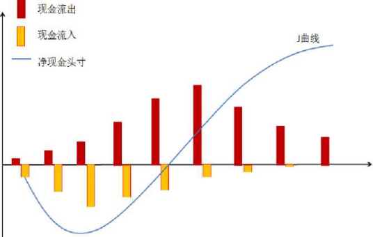

第三节不动产投资

不动产投资概述

| 定义 | 指土地以及建筑物等土地定着物，相对动产而言，强调财产和权 利载体在地理位置上的相对固定性。房地产是不动产的主要类 别。 |
| ---- | ------------------------------------------------------------ |
| 特点 | （1）异质性；（2）不可分性；（3）低流动性。                  |

 

二. 不动产投资的类型

（-）地产投资

（-）商业房地产投资

（=）工业用地投资

（四）	酒店投资

（五）	养老地产等其他形式的投资

三. 不动产投资工具

（-）房地产有限合伙

类似于私募股权合伙，由有限合伙人和普通合伙人组成。

（二）	房地产权益基金

从事房地产项目收购' 开发' 管理' 经营和销售的集合投资制度，可能会以 股份公司'有限合伙公司或契约型基金的形式存在。通常以开放式基金形式发行。

（三）	房地产投资信托

通过发行受益凭证或者股票来进行募资,并将这些资金投资到房地产或者房 地产抵押贷款的专门投资机构。

特点：（1）流动性强；（2）抵补通货膨胀效应；（3）风险较低；（4）信 息不对称程度较低。

第四节大宗商品投资

大宗商品投资概述

具有实体，可进入流通领域，但并非在零售环节进行销售，具有商品属性, 用于工农业生产与消费使用的大批量买卖的物资商品。

特征：同质化' 可交易'供需和交易量都非常大。

二. 大宗商品投资的类型

（-）能源类大宗商品

主要包括原油' 汽油' 天然气' 动力煤' 甲醇等。

（-）基础原材料类大宗商品

主要包括钢铁'铜' 铝' 铅' 锌' 镣'钙' 橡胶'铁矿石等。

（三）	贵金属类大宗商品

主要包括黄金、白银、钻金等。

（四）	农产品类大宗商品

主要包括玉米' 大豆' 小麦、稻谷、咖啡、棉花' 鸡蛋' 棕梱油' 菜油、白 砂糖等；其中，大豆' 玉米'小麦的期货被称为三大农产品期货。

三. 大宗商品的投资方式

（-）购买大宗商品实物

（二）	购买资源或者购买大宗商品相关股票

（三）	投资大宗商品衍生工具

（四）	投资大宗商品的结构化产品

第六章投资管理流程与投资者需求

第一节投资管理流程

投资组合管理的基本流程

可以分为规划' 执行' 反馈三个基本步骤。

投资组合管理的基本步骤

(-)规划

\1. 确定并量化投资者的投资目标和投资限制

\2. 制定投资政策说明书

\3. 形成资本市场预期

\4. 建立战略资产配置

(二) 执行

资产配置和证券选择等方面的投资决策和实施过程。

(三) 反馈

1 .监控和再平衡

监控和再平衡是指对投资者情况与经济和市场因素的监控，持续调整投资组 合以适应新的变化，使投资组合能够符合客户的投资目标和限制。

2.业绩评估

投资者需定期对投资业绩进行阶段性的评估，以对投资目标的实现情况和投 资管理能力进行评价。

第二节投资者类型和特征

—.个人投资者与机构投资者

(-)个人投资者

个人投资者以自然人身份进行投资，总体上具有以下特征：

(1) 投资需求受个人所处生命周期的不同阶段和个人境况的影响，呈现较大

59

的差异化特征；

(2) 可投资的资金量较少；

(3) 风险承受能力较弱；

(4) 投资相关的知识和经验较少，专业投资能力不足；

(5) 常常需要借助基金销售服务机构进行投资。

影响个人投资者投资需求的基本因素是他们在生命周期中所处的阶段。投资 者的预期投资期限' 对风险和收益的要求'对流动性的要求等因素也都会影响投 资者的投资需求和投资决策。

个人投资者不同的财务状况在很大程度上也会影响其投资需求。

个人投资者的其他个人状况，如就业状态和家庭状况，也会对其投资需求产 生多方面的影响。

(二)机构投资者

机构投资者主要包括：商业银行' 保险公司' 保险资产管理公司' 公募基金 公司' 证券公司' 证券公司下属资产管理子公司' 私募基金公司' 社保基金' 企 业年金基金' 财务公司' QFII等。

相比个人投资者，机构投资者通常具有以下特征：

(1) 资金实力雄厚，投资规模相对较大；

(2) 具有比个人投资者更高的风险承受能力；

(3) 投资管理专业；

(4) 投资行为规范。

二.普通投资者与专业投资者

《证券期货投资者适当性管理办法》规定：投资者分为普通投资者与专业投 资者。专业投资者之外的投资者为普通投资者。普通投资者和专业投资者在一定 条件下可以互相转化。

并非所有的机构投资者都是专业投资者，并非所有的个人投资者都是普通投 资者。

第三节投资者需求和投资政策说明书

投资者需求

(-)投资目标

投资者的投资目标就是其想得到的投资结果，主要是指风险和收益。

投资目标可分为风险目标和收益目标；其中，风险目标反映了投资者的风险 谷忍度。

\1. 风险容忍度

投资者的风险容忍度取决于其风险承受能力和意愿；

风险承受能力取决于其投资期限' 收入支出状况' 资产负债状况等；

风险承担意愿反映了投资者的风险厌恶程度。

\2. 收益目标

收益率有名义收益率与实际收益率之分。实际收益率在名义收益率的基础上 扣除了通货膨胀率的影响。对于长期投资者而言，应该关注的是实际收益率。

(-)投资限制

1 .流动性要求

流动性是指投资者在短期内以一个合理的价格将投资资产变现的容易程度。 流动性要求会影响投资机会的选择。

\2. 投资期限

投资期限是指投资者从购买金融资产到兑现日之间的时间长度。

\3. 税收政策

税收政策是影响投资决策的重要考量因素。

\4. 法律法规要求

法律法规要求是政府和监管机构所颁布实施的限制投资者投资决策的外部 因素。

\5. 特殊需求

投资者自身的特殊需求有可能会限制其投资组合的选择。

二.投资政策说明书的制定

投资政策说明书是投资决策的指导性文件。

投资管理人应基于投资者的需求'财务状况'投资限制和偏好制定投资政策 说明书。

投资政策说明书并没有标准格式,大部分的投资政策说明书都包含了以下内 容：

(1) 介绍。这一部分对客户的基本情况进行描述。

(2) 目的陈述。这一部分对撰写投资政策说明书的目的进行陈述。

(3) 责任和义务的陈述。这一部分详细说明客户' 客户资产的托管人以及投 资管理人的责任和义务。

(4) 流程。这一部分详细介绍根据投资政策说明书进行投资的每一个步骤, 以及各种突发和偶然情况的应对措施。

(5) 投资目标。这一部分陈述客户的投资目标。

(6) 投资限制。这一部分陈述限制客户的投资限制因素。

(7) 资产配置。包括制订战略资产配置的考虑因素和结果。这是进行资产配 置的基准，也是对投资组合中资产权重进行再平衡的指导原则。

(8) 投资指导方针。这一部分内容是有关投资政策执行的具体细节，例如, 可投资资产类别范围' 债券评级和久期限制等。

(9) 业绩考核指标与业绩比较基准。这一部分内容用于业绩评估。

(10) 评估与回顾。这一部分说明如何进行投资绩效信息的反馈以及如何对 投资政策说明书本身进行重新审查和更新。

除以上内容外，有些机构还将投资决策流程'投资策略与交易机制等内容纳 入投资政策说明书。

第四节基金公司投资管理架构

投资管理部门设置

1 .投资决策委员会：基金公司管理基金投资的最高决策机构。

\2. 投资部:负责根据投资决策委员会制定的投资原则和计划制定投资组合的 具体方案，向交易部下达投资指令。

\3. 研究部：基金投资运作的基础部门，向基金投资决策部门提供研究报告及 投资计划建议。

\4. 交易部：基金投资运作的具体执行部门，负责投资组合交易指令的审核、 执行与反馈。

二.投资交易流程

1 .形成投资策略

投资策略的制定是投资交易的基础环节。

\2. 构建投资组合

在实际操作中，基金经理根据投资决策委员会的投资战略及研究部门的研究 报告，结合对证券市场' 上市公司'投资时机的分析，拟定所管理基金的具体投 资计划，包括资产配置' 行业配置' 重仓个股投资方案。

\3. 执行交易指令

交易指令在基金公司内部执行情况如下：

首先，在自主权限内，基金经理通过交易系统向交易室下达交易指令。

其次，交易总监审核投资指令（价格' 数量）的合法合规性，并将指令分派 给交易员。

投资交易系统将自动拦截违规指令，如果发现异常指令时由交易总监反馈信 息给基金经理并有权终止指令，同时报上级主管领导，并通知合规风控部门。

最后，交易员接收到指令后有权根据自身对市场的判断选择合适时机完成交 易。

交易指令从基金公司到达经纪商，交易指令已经从基金公司流出，经纪商会 确认交易指令并执行，然后进行交易清算交割，完成交易过程。

\4. 绩效评估和组合调整

基金公司内部会定期和不定期对基金进行投资绩效评估，并提供相关报告。

\5. 风险管理

风险管理贯穿于投资组合从设计到开始投资再到日常运作的全过程。风险管 理的任务不仅是风控和合规部门的职责，也是投资、市场' 运营等各部门的工作 的一部分。

第七章投资组合管理

第一节现代投资组合理论

现代投资组合理论与资本市场理论发展概述

1952年，哈里•马科维茨，首次提出了均值一方差模型，奠定了投资组合理 论的基础，标志着现代投资组合理论的开端。马科维茨用收益率的期望值来度量 收益，用收益率的标准差来度量风险。结论是，投资者应该通过同时购买多种证 券而不是一种证券进行分散化投资。

核心思想就是把多种证券的投资组合看作是一个整体来进行分析和度量，然 后把投资组合的风险分解为两部分一系统风险和非系统风险。投资者可以通过持 有多种类型的证券以达到分散非系统风险，从而进一步降低整个组合的风险。但 是它也具有一定的局限性，没有进一步说明如何为证券估值和定价，也不能说明 投资组合期望回报率与风险之间的关系，其理论难以付诸实际应用。

威廉•夏普、约翰•林特耐和简•莫辛独立研究出著名的资本资产定价模型。 对于所有投资者，最优的资产组合都是市场资产组合和无风险资产的组合。这种 组合的所有可能情况形成一条直线，被称为资本市场线（CML）,即资本市场为 投资者在该线上提供了最优的资源配置。

斯蒂芬•罗斯于1976年突破性地发展了 CAPM,提出套利定价理论（APT）, 认为风险资产的收益与多个共同因素之间存在线性关系，从而将单因子CAPM发 展为多因子模型。APT认为，只要任何一个投资者不能通过套利获得收益，那么 期望收益率一定与风险相联系。

费雪•布莱克与迈伦•斯克尔斯，于1973年推导出期权定价模型。此后， 罗伯特•默顿扩展了原模型的内涵。

Kendal I与Roberts发现股票价格序列类似于随机漫步，他们对这种现象的 解释是：在给足所有已知信息后，这些信息一定已经被反映于股价中了，所以股 价只对新信息做出上涨或下跌的反应。由于新信息是不可预测的，那么随新信息 变动的股价必然是随机且不可预测的。

尤金•法玛把有效市场分为三种不同类型：一是弱有效市场，认为股价已反 映了全部能从市场交易数据中得到的信息；二是半强有效市场，认为股价已反映

了所有公开的信息；三是强有效市场，指股价已反映了全部与公司有关的信息, 包括所有公开信息及内部信息

均值一方差模型概述

投资者不仅关心投资收益，也关心投资风险。马科维茨投资组合的基本假设 是投资者是厌恶风险的。如果在两个具有相同预期收益率的证券之间进行选择， 投资者会选择风险较小的。要让投资者承担更高的风险，必须有更高的预期收益 率来补偿。

在回避风险的假定下，马科维茨建立了一个投资组合分析的模型，其要点如 T：

1 .首先，投资组合具有两个相关的特征：（1）预期收益率；（2）各种可能 的收益率围绕其预期值的偏离程度，用方差衡量。

\2. 其次，投资者将选择并持有有效的投资组合。有效投资组合是指在给定的 风险水平下使得期望收益最大化的投资组合,在给定的期望收益率上使得风险最 小化的投资组合。

\3. 再次，通过对每种证券的期望收益率' 收益率的方差和每一种证券与其他 证券之间的相互关系（用协方差来度量）这三类信息的适当分析，可以在理论上 识别出有效投资组合。

\4. 最后，对上述三类信息进行计算，得出有效投资组合的集合，并根据投资 者的偏好，选择出最合适的投资组合。

三. 资产收益率的期望、方差、协方差

（-）单个或多个资产的期望收益率

期望收益率是收益率的期望值。实际上是资产各种可能收益率的加权平均值, 因此它又被称为平均收益率。期望收益率计算公式如下：

n

**E**（7＞） = **^WjE S****）**

i=i

其中：**E** （少）为投资组合的期望收益率，**E** S）为第i个资产的收益 率，雄为第i个资产的权重，n为资产数目。

（二）单个资产的方差和标准差

方差和标准差是估计资产实际收益率与期望收益率之间可能偏离程度的测 度方法。

1.对于单一资产，其收益率方差和标准差计算公式如下:

|      |                                           |
| ---- | ----------------------------------------- |
|      |  |

 

其中：戶为方差；b为标准差；R为该资产在第i种状态下的收益率；代为收 益率R发生的概率；71为资产可能的收益状态的总数；**E** （r）为该资产的期望收

益率。

2.实践中，常常用资产过去m期的收益率作为样本来估算该资产收益率的方 差和标准差。样本的方差和标准差：

**m**

**a****2** **=** —-—V* (r - r) 2 ； **a =**

i=l

其中：F为样本中m期收益率的均值。

（三）资产收益率的协方差和相关系數

在投资组合理论使用协方差和相关系数测度两个风险资产的收益之间的相 关性。两个资产收益率相关性系数的计算公式为:

**Cov** **(****Ti****，****Tj) p'j = "j**

其中:閔•为相关系数;Cov S, 0为任意两个资产收益率的协方差;以、**气**

分别为资产i和丿的收益率的标准差。

P取值范围［-1, 1］。当p>0时，两变量为正线性相关；当pvo时，两变 量为负线性相关；当p=o时，两变量间无线性相关关系。P=1,完全正相关； P =-1,完全负相关；P =0,无线性相关关系；I p |越接近1,线性关系越密切。

（四）投资组合收益率的方差和标准差

投资组合收益率的方差和标准差，取决于资产的方差、权重以及互相之间的 相关系数。

1 .两个资产的投资组合收益率的方差和标准差：

**ffp** **=** **w^Ot****2** **+** **Wj****2****ffj****2** **+** **2wtWjp****if** ***沔****；****a****p** **= Jwi****2****ai****2** **+ Wj****2****ffj****2** 4-	**扩沔**

2.n个资产的投资组合收益率的方差和标准差：

?i	71 **n**

站=2可？必2 +£2雄吗％卢沔；% =

1=1	i=l **j=l**

i*l

其中：垢为组合方差；纯与吗为相应资产在组合中的权重；片，/为任意两个 资产收益率的相关系数；**贝、**巧、％分别为资产i、资产丿和投资组合收益率的标 准差。

资产组合的方差是各单一资产的方差与资产间相关系数的组合，单一资产方 差不变，相关系数越小，资产组合的方差也越小。

四, 资产收益的相关性

假设有两种资产i和j,如果资产i和资产j的收益率的相关系数在-1和1 之间，那么两个资产的投资组合将呈一条向左上方弯曲的曲线，曲线上的每一个 点表示资产权重不同的投资组合。相关系数越小，组合的曲线越往左边弯曲，组 合风险越小（即在相同收益率的情况下，风险更小）,组合的效用越高。

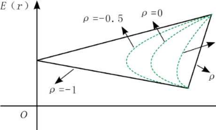资产收益之间的相关性会影响投资组合的风险,而不会影响投资组合的预期 收益率。

**P** =+0. 5

二+1

​	►

**O**

资产组合的相关系数

五. 景小方差前沿和有效前沿

可行集，又称机会集。代表市场上可投资产所形成的所有组合。所有可能的

组合都位于可行集的内部或边界上。通常，可行集的形状如图所示：

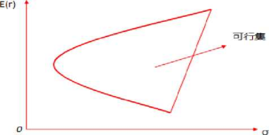 

如果做一条和横轴平行的直线，和可行集的边界交于A、B两点（见图）我 们可以发现两点的预期收益率是完全相同的，但是它们的风险不同，A点在左边, 它的风险相比B点低。

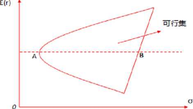 

当把所有具有相同收益率的组合进行比较时，我们会发现位于可行集最左边 的组合具有更低的风险。在收益率一定的情况下，投资者都会追求最小的风险, 投资于那些风险更小的组合。因此，只有可行集最左边的点是有效的，右边所有 的边的点都是无效的。如果把最左边的点都连在一起形成一条曲线（见图）这条 曲线称为最小方差前沿。在相同收益率水平下,这条曲线上的组合具有最小方差。 最小方差前沿上每个点都是所有风险资产的组合，各个点的区别是各风险资产的 权重不同。

E(r)

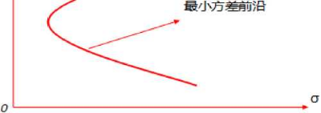 

 

在最小方差前沿最左边的拐点处会有一条与纵轴平行的直线与最小方差前 沿相切，只有一个交点（切点C）,这个切点叫作全局最小方差组合（见图）。全 局最小方差组合是所有资产组合中风险最小的一个组合，因为它在最左边，这一 点就是上半部分与下半部分的分界点。上半部分的点在风险水平一定的情况下, 具有更高的期望收益率。如图所示，组合A和组合B具有相同的风险，但是组合 A在最小方差前沿的上半部分，具有更高的收益率。因此，最小方差前沿只有上 半部分是有效的。

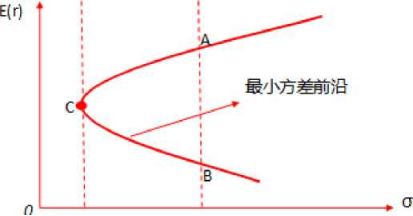 

从全局最小方差组合开始，最小方差前沿的上半部分就称为马科维茨有效前 沿，简称有效前沿。有效前沿是能够达到的最优的投资组合的集合，它位于所有 资产和资产组合的左上方，如图所示：

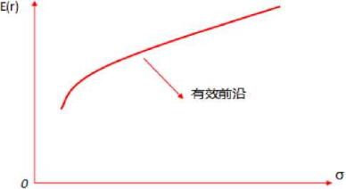 

 

所有的单个资产都位于有效前沿的右下方，有效前沿的左上方无法利用现有 市场上的风险资产来获得。在一定的期望收益率E(R)水平下，有效前沿上的投 资组合风险最低；在一定的风险水平下，有效前沿上的投资组合期望收益率水平 取咼。

有效前沿上的投资组合为有效组合，其特点是包含了所有风险资产，所以称 有效组合是完全分散化的投资组合。

有效前沿是由全部有效投资组合构成的集合。如果一个投资组合在所有风险 相同的投资组合中具有最高的预期收益率，或者在所有预期收益率相同的投资组 合中具有最低的风险，那么这个投资组合就是有效的。换句话说，如果一个投资 组合是有效的，那么投资者就无法找到另一个预期收益率更高且风险更低的投资 组合。有效前沿中有无数预期收益率和风险各不相同的投资组合。一个有效投资 组合相对于另一个有效投资组合如果在预期收益率方面有优势，那么在风险方面 就一定有劣势。

六.最小效用、无差异曲线和最优组合

根据投资者对风险不同的态度，可以将投资者分为风险偏好'风险中性和风 险厌恶三类。风险偏好的投资者喜欢投资结果的不确定性，在期望收益相同的投 资方案中，会选择其中风险最大的。风险中性的投资者仅根据期望收益这一个指 标做投资决策，不关心风险。风险厌恶的投资者不喜欢投资结果的不确定性，更 喜欢确定的收益，因此在期望收益相同的投资方案中，他们会选择其中风险最小 的。

马科维茨的现代投资组合理论假设投资者是风险厌恶的。一个风险厌恶的投 资者不会愿意持有一个无效的投资组合，因为投资者总可以构造出一个与该无效 投资组合风险相同但预期收益率更高的投资组合，或一个与该无效投资组合具有 相同的预期收益率但风险更低的投资组合。为了促使风险厌恶者购买风险资产, 市场需向其提供风险溢价，即额外的期望收益率。

效用是投资带给人的满意程度。投资者更喜欢高收益和低风险的资产，因此 不同资产给投资者的效用是不一样的。投资者总是选择效用高的资产进行投资。 假定每一个投资者可以根据资产(或资产组合)的预期收益与风险情况对效用进 行量化比较，则可得出其效用函数。效用函数的一个常见形式为：

U = ED r&-Ao-2

2

式中：U为效用值；A为某投资者的风险厌恶系数；E(r)为资产的预期收益；a2 为资产收益的方差。

从上式可以看出，对于风险厌恶系数A—定的投资者来说，某资产的期望收 益率越大，带给投资者的效用越大；资产的风险越大，效用越小。

同一资产带给风险厌恶系数不同的投资者的效用并不相同。风险厌恶系数A 越大的投资者感受到的效用越低。

根据投资者的效用函数，可以画出无差异曲线。无差异曲线是在期望收益一 一标准差平面上由相同给定效用水平的所有点组成的曲线，如图所示：

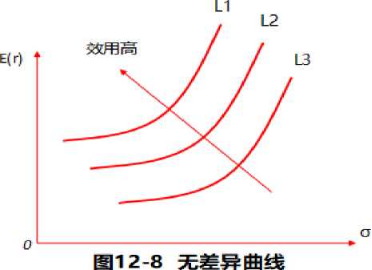 

无差异曲线具有以下特点：

(1) 风险厌恶的投资者的无差异曲线是从左下方向右上方倾斜的。

(2) 同一条无差异曲线上的所有点向投资者提供了相同的效用。

(3) 对于给定风险厌恶系数A的某投资者来说，可以画出无数条无差异曲线，且 这些曲线不会交叉。

⑷ 当向较高的无差异曲线移动时(如图12-8中，从L1向L2再向L3移动时) 投资者的效用增加。

(5)风险厌恶程度高的投资者与风险厌恶程度低的投资者相比，其无差异曲线更 陡，因为随着风险增加，其要求的风险溢价更高。

使投资者效用最大化的是无差异曲线和有效前沿相切的点所代表的投资组 合，这一组合称为最优组合。投资者按照这一组合进行投资可以获得最大的投资 效用。因为这个点在有效前沿上，因此它是投资者可以实际选择的点；而它又是 所有与有效前沿相交的无差异曲线中位于最上方的无差异曲线上的点，因此它又 是投资者可以获得最大效用的点。风险厌恶程度不同的投资者，其切点位置也不 同。如图所示，X投资者比Y投资者更加厌恶风险，因此X的最优组合在Y最优 组合的左下方。

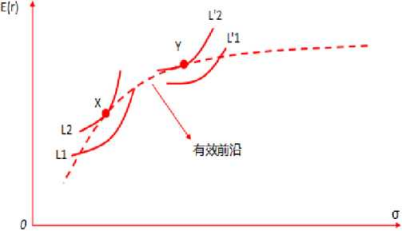 

 

第二节资本市场理论

资本市场理论的假设

(-)资本市场理论和资本资产定价模型的前提假设

资本市场理论的七条前提假设可以归结为两条:一是所有投资者都是一样的; 二是市场是有效的。具体表现为：

1 ,所有的投资者都是风险厌恶者，都以马科维茨均值-方差分析框架来分析 证券，追求效用最大化，购买有效前沿与无差异曲线的切点的最优组合。

\2. 投资者可以以无风险利率任意借入资金或者貸出资金。

\3. 所有投资者的期望相同。所有投资者都具有同样的信息，他们对各种资产 的预期收益率、风险及资产间的相关性都具有同样的判断。

\4. 所有投资者的投资期限都相同，并且不在投资期限内对投资组合做动态的 调整。

\5. 所有的投资都可以无限分割，投资数量随意。

\6. 无摩擦市场(主要指没有税和交易费用)。

\7. 投资者是价格的接受者，投资者的买卖行为不改变证券价格，每个投资者 都不能对市场定价造成显著影响。

(二)市场均衡的状态

在上述假设前提下，市场均衡状态可以总结如下，我们将在之后的部分进行 详细阐述。

1 .所有投资者将选择持有包括所有证券资产在内的市场组合Mo市场投资组 合包含市场上所有的风险资产，并且其包含的各资产的投资比例与整个市场上风 险资产的相对市值比例一致。

\2. 市场组合处于有效前沿。市场组合是最优风险投资组合，即资本配置线与 有效边界的切点。所有投资者均将M作为其最佳风险投资组合，区别在于市场组 合资产与无风险资产的配比。

\3. 市场组合的风险溢价与市场组合的方差和投资者的典型风险偏好成正比。

\4. 单个资产的风险溢价与市场投资组合M的风险溢价和该资产的|3系数成 比例。

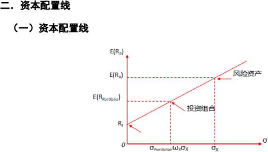 

(-)最优资本配置线

 

 

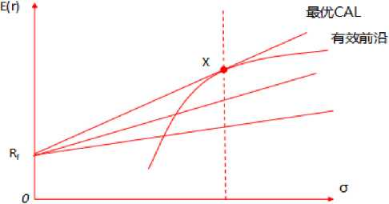 

三.资本市场线

即最优资本配置线，是与马科维茨有效前沿相切的一条直线，切点***\*M\****即为 市场投资组合。***\*CML\****上所有的组合都是有效组合，即所有的组合都是完全分散

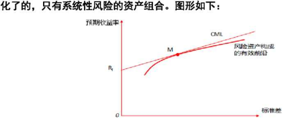 

四.系统性风险和非系统性风险及风险分散化

 

通过构造资产组合分散掉的风险称为非系统性风险，不能通过构造资产组合 分散掉的风险称为系统性风险。总风险=系统性风险+非系统性风险。

***\*C-\*******\*）\****系统性风险

系统性风险是在一定程度上无法通过一定范围内的分散化投资来降低的风 险。系统性风险的存在是由于某些因素能够通过多种作用机制同时对市场上大多 数资产的价格或收益造成同向影响，这些因素常被称为系统性因素，它往往不受 证券发行主体及投资主体的控制。

（二）非系统性风险

非系统性风险是可以通过构造资产组合分散掉的风险。往往是由与某个或少 数的某些资产有关的一些特别因素导致的，只对某个或某些资产的收益造成影响, 而与其他资产的收益无关。

（三）风险殓化

风险分散化的效果与资产组合中资产的数量是正相关的，但这并不意味着投 资组合的收益风险会随着资产数量的增加而逐渐降到零，而是会降到系统性风险 的水平，如图如下：

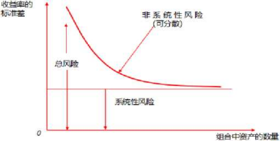 

 

五, ***\*A\****系数的衡・

B系数衡量资产所面临的系统性风险，描述资产收益率和市场组合收益率之 间的线性关系，即资产收益率相对市场波动的敏感性。其计算公式为：

& = 茶

其中：&为资产的P系数；Pi, m为资产收益率和市场组合收益率之间的相关 系数；力、必分别为资产收益率、市场组合收益率的标准差。

六. 资本资产定价蜘

***\*(-)CAPM\****的主要思想

资本资产定价模型(CAPM)体现了资产的期望收益率与系统风险之间的正向 关系。计算公式为：

**E****(****") =Tf + pi[E (.r****m****)** **-** **Tf]**

其中：**E** (貝)为资产啲预期收益率；**E** &)为市场组合的预期收益率；**r****f** 为无风险收益率；**E** (r£) 为资产风险溢价；**E**	―牛为市场组合风险溢

价。

***\*C-\*******\*)\****证券市场线

证券市场线(SML)描述预期收益率与A系数的正相关关系。证券市场线的 斜率是市场组合的风险溢价。市场组合恰好位于证券市场线上，即图中的M点, 该点胃系数为1,相对应的预期收益率是市场组合的预期收益率。证券市场线能 够为每一个风险资产进行定价。图形如下：

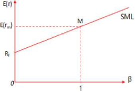 

 

（三）资本市场线与证券市场线的联系与区别

\1. 联系：证券市场线是以资本市场线为基础发展起来的。

\2. 区别：

| 差异       | ***\*CML\****                      | ***\*SML\****                                |
| ---------- | ---------------------------------- | -------------------------------------------- |
| 风险的衡・ | 总风险（用标准差衡量）             | 系统性风险（用***\*B\****值衡量）            |
| 应用       | 决定最合适的资产配置点（资产配置） | 决定资产最合理的预期收益率（定价）           |
| 斜率       | 市场组合的夏普比率                 | 市场组合的风险溢价                           |
| 适用范围   | 有效投资组合                       | 单个资产或投资组合有效投资组合和无效投资组合 |

 

（四）***\*CAPM\****的应用

在***\*CAPM\****中，证券市场线得以成立是投资者的最优选择以及市场均衡力量作 用的结果。若某资产或资产组合的预期收益率高于与其***\*8\****值对应的预期收益率, 也就是说位于证券市场线的上方，则理性投资者将更偏好于该资产或资产组合, 市场对该资产或资产组合的需求超过其供给，最终抬升其价格，导致其预期收益 率降低，使其向证券市场线回归；反之，若某资产或资产组合位于证券市场线的 下方，则理性投资者将不愿意投资该资产或资产组合，导致市场对它供过于求, 价格下降，预期收益率上升，最终该资产或资产组合收益率也会向证券市场线回 归。

第三节被动投资与主动投资

市场有效性

(-)市场有效性的提出

20世纪70年代，尤金•法玛决定为市场有效性建立一套标准。依据时间维 度，将信息进行了下列分类：

\1. 历史信息：主要包括证券交易的有关历史资料，如历史股价' 成交量等。

\2. 当前公开可得信息：即一切可公开获得的有关公司财务及其发展前景等方 面的信息。

\3. 内部信息：即还未公开的只有公司内部人员才能获得的私人信息。

(-)三种有效市场

尤金•法玛界定的三种形式的有效市场分别是弱有效市场、半强有效市场、

强有效市场。

| 弱有效市场   | 1 .证券价格能够充分反映价格历史序列中包含的所有信 息，如证券的价格、交易量等。2. 如果证券的历史价格、交易量等信息对当前证券价格的 变动不会产生任何影响，则意味着证券市场达到了弱有效 市场。3. 如果市场是弱有效的，任何为了预测未来证券价格走势 而对以往价格、交易量等历史信息所进行的技术分析都是 徒劳的。 |
| ------------ | ------------------------------------------------------------ |
| 半强有效市场 | (1) 证券价格不仅已经反映了历史价格信息，而且反映了 当前所有与公司证券有关的公开有效信息，例如盈利预 测、红利发放、股票分拆、公司并购等各种公告信息。(2) 如果市场是半强有效的，市场参与者就不可能从任何 公开信息中获取超额利润，这意味着基本面分析方法无 效。(3) 市场半强有效不代表价格对信息的反应是瞬间完成 的，也需要一个过程，只是这个过程比较短暂，并且伴随 |

|            | 着剧烈的价格波动。在价格对信息吸收的过程中，价格会 围绕着新的均衡价格上下波动，但是不会出现显著地偏离 新的均衡价格的情况。 |
| ---------- | ------------------------------------------------------------ |
| 强有效市场 | 1 .与证券有关的所有信息，包括公开发布的信息和未公开 发布的内部信息，都已经充分、及时地反映到了证券价格 之中。2. 如果市场是强有效的，那些拥有“内部信息”的市场参 与者也不能凭借该信息获得超额收益。在一个强有效市场 上，任何投资者不管采用何种分析方法，除了偶尔靠运气"预测”到证券价格的变化外，是不可能重复地、更不可 能连续地取得成功的。3. 市场反映内部信息达到强有效状态的假设(现实生活中 很难满足):(1) 信息泄露并迅速传播，从而导致未公开的信息已经“公开化”；(2) 理性人的理性学习行为，即理性人总是能够从利用内 部信息进行交易的知情者手中“学习”到该消息，并迅速 采取行动，从而使得知情者无法进一步获利。 |

 

二.被动投资

(-)被动投资的概念

在资本市场中相信市场定价有效的投资者认为:系统性地跑赢市场是不可能 的。因此，在市场定价有效的前提下，想要提高收益，最佳的选择是被动投资策 略，旨在减少不必要的交易成本。

被动投资试图复制某一业绩基准，通常是指数的收益与风险。在此策略下， 投资经理不会尝试利用基本面分析找出被低估或高估的股票，也不会试图利用技 术分析或者数量方法预测市场的总体走势，并根据市场走势相应地调整股票组合。 被动投资通过跟踪指数获得基准指数的回报。

(二) 证券价飾数

1.常见的证券价格指数

| 沪深***\*300\****指數     | (1) 中证指数有限公司编制，用以反映A股市场整体走 势的指数。沪深300指数在上海和深圳证券市场中选取 300只A股作为样本，以2004年12月31日为基期，基 点为1000点，其计算以调整股本为权重，采用派氏加权 综合价格指数公式进行计算。(2) 中证指数有限公司同时计算并发布沪深300价格指 数和全收益指数，其中，价格指数实时发布，全收益指 数每日收盘后在中证指数公司网站和上海证券交易所网 站上公布。 |
| ------------------------- | ------------------------------------------------------------ |
| 中证全债指数              | (1) 中证指数有限公司编制的综合反映银行间债券市场 和沪深交易所债券市场的跨市场债券指数，也是该公司 编制并发布的首只债券类指数。(2) 特点：对异常价格和无价情况下使用了模型价，能 更为真实地反映债券的实际价值和收益率特征。 |
| 标准普尔***\*500\****指数 | 记录美国500家上市公司的一个股票指数。                        |
| 道馴股票价格平 均指数     | 一种算术平均股价指数，是这四种指数中出现最早的、 包含成分股数量最少的指数。 |

 

\2. 证券价格指数的编制方法

目前股价指数编制的方法主要有三种，即算术平均法'几何平均法和加权平 均法。在此我们着重介绍加权平均法。

加权平均法首先按样本股票在市场上的不同地位赋予其不同的权数，即地位 重要的权数大，地位次要的权数小。权数的选择可以是股票的成交金额，也可以 是它的上市股数或市值。目前市场上股票指数大多为市值加权。另外，等权重也 可以作为一种特殊的加权方法。若选择计算期的同度量因素作为权数，则被称为 派氏加权法。

（三）	指数跟踪方法

指数跟踪也称指数复制，是用指数成分证券创建一个与目标指数相比差异尽 可能小的证券组合的过程。编制指数时不需要考虑费用，但复制指数时需要考虑 各种各样的成本，成本不仅包括佣金等交易费用，还包括建立' 管理指数组合的 各种费用。

根据市场条件的不同，通常有三种指数复制方法，即完全复制'抽样复制和 优化复制。三种复制方法所使用的样本股票的数量依次递减，但跟踪误差通常依 次增加。

1 .完全复制：购买所有指数成分证券，完全按照成分证券在指数中的权重配 置资金，并在指数结构调整时也同步调整来实现与指数完全相同的收益率。理论 上，完全复制是最好的策略，但实际操作难度大。

\2. 抽样复制：指数的风险收益特征可以抽象为若干因子的变动，这些因子包 括行业因子以及风格因子。抽样复制是在尽可能保留因子个数和因子结构不变的 情况下，对较少的股票来复制因子，从而减少复制指数所用的股票个数，其可以 分为市值优先抽样和分层抽样。

\3. 优化复制：从一篮子样本证券开始，用数学方法计算一定历史时期内（样 本期）各样本证券的最优组合，使之在样本期内能够达到对标的指数的最佳拟合 状态。

（四）	館误差

1 .跟踪误差的概述

跟踪误差是度量一个股票组合相对于某基准组合偏离程度的重要指标，被广 泛用于被动投资及主动投资管理者的业绩考核，并且这里指的业绩既可以是事前 的，也可以是事后的。跟踪误差是证券组合相对基准组合的跟踪偏离度的标准差, 跟踪偏离度的计算公式如下:

跟踪偏离度=证券组合的真实收益率一基准组合的收益率

2.跟踪误差产生的原因

|指数基金无法完全复制标的指数配置结构会带来结构性偏离。

复制误差

当指数基金的某些成分股因流动性不足而难以以公允的价格买

|                                                              | 到时，指数基金将只能采用抽样复制法，增加交易活跃股票的 权重，减少流动性差的股票权重。 |
| ------------------------------------------------------------ | ------------------------------------------------------------ |
| 现金留存                                                     | 由于有现金留存，投资组合不能全部投资于指数标的，导致实 际的股票仓位不到100%,导致与计算的指数产生偏离。 |
| 各项赛用                                                     | 基金运行有管理费' 托管费，交易证券产生佣金'印花税等， 这些都是运营基金' 复制基准指数的成本。费用越高，跟踪误 差就会越大，因为基准指数是不存在管理费扣除的。 |
| 其他影响                                                     | 分红因素和交易证券时的冲击成本也会对跟踪误差产生影响。       |
| 【注意】一个投资组合可以总收益波动率很大，但是其跟踪误差却很小。 |                                                              |

 

三.主动投资

(-)主动投资的概念

主动投资策略也称积极投资策略，即试图通过选择资产来跑赢市场。主动型 投资者注重寻找被低估或高估的资产类别、行业或证券，也有的主动型投资者试 图通过市场择时来获得超额收益。在现实生活中，被动投资和主动投资并不是完 全对立的，有些投资策略介于二者之间。

(二)主动投资的风格

常见的风格划分是根据公司盈利增长状况把股票分为价值股' 成长股'合理 价格下的成长股等几种。

\1. 偏好成长风格的基金经理，试图挑选出盈利增长相对最快的股票，从而获 得价格上涨带来的收益。

\2. 偏好价值风格的基金经理，试图寻找相对便宜的股票，期望公司的市净率' 市盈率等比率会恢复到某一合理水平。

\3. 偏好合理价格下的成长风格的基金经理，寻找盈利成长高于平均水平，同 时价格又比较合理的股票。

(=)主动投资的收益及目标

1 .与被动投资相比，在一个并非完全有效的市场上，主动投资策略更能体现 其价值。

\2. 主动投资的业绩主要取决于投资者使用信息的能力和投资者所掌握的投 资机会的个数，即信息深度和信息广度。

\3. 主动风险定义为一个证券组合的主动收益的标准差，主动收益即相对于基 准的超额收益，计算公式如下：

主动收益=证券组合的真实收益-基准组合的收益

4主动投资的目标是扩大主动收益，缩小主动风险。

第四节 资产配置与投资组合构建

资产配置

资产配置是根据投资需求将投资资金在不同资产类别之间进行分配,可以分 为战略资产配置和战术资产配置。

(-)战略资产配置

\1. 战略资产配置是为了满足投资者风险与收益目标所做的长期资产的配比; 是根据投资者的风险承受能力，对资产做出一种事前、整体性' 最能满足投资者 需求的规划和安排；是反映投资者的长期投资目标和策略，确定各主要大类资产 的投资比例，建立最佳长期资产组合结构。

\2. 战略资产配置重在长期回报，其投资期限可长达5年以上。

(-)畛资产配置

| 概念     | 在遵守战略资产配置确定的大类资产比例基础上，根据短期 内各特定资产类别的表现，对投资组合中各特定资产类别的 权重配置进行调整。 |
| -------- | ------------------------------------------------------------ |
| 投资期限 | 周期较短，一般在一年以内，如月度' 季度。                     |
| 特点     | (1)在动态调整资产配置状态时，需要根据实际情况的改 变重新预测不同资产类别的预期收益情况，但没有再次估计 投资者偏好和风险承受能力或投资目标是否发生了变化。 |

(2) 战术资产配置对战略资产配置的偏离往往被限制在一 定范围内。

(3) 战术资产配置的有效性是存在争议的，实践证明只有 少数基金管理人能通过择时得到超额收益。

二.股票投资组合构建

(-)投资组合构建策略

1 -自上而下策略

从宏观形势及行业' 板块特征入手，明确大类资产' 国家、行业的配置，然 后再挑选相应的股票作为投资标的，实现配置目标。

(1) 可以通过研究和预测决定经济形势的几个核心变量，决定大类资产配 置；

(2) 可以通过积极的风格调整，例如转换价值股和成长股的比例，追求风 格收益；

(3) 可以进行积极的板块轮换，从而获得板块的差额收益。

2.自下而上策略

依赖个股筛选的投资策略，关注的是各个公司的表现，而非经济或市场的整 体趋势，因此自下而上并不重视行业配置，主要关注个股的选择，在实施过程中 没有固定模式，只要能挑选出业绩突出的股票即可。

(二)股票投资组合构建所受限制

| 大类资产配置   | 基金设立时的目标基本上决定了大类资产配置的范围。1 .股票型基金一般要求在股票资产上的配置比例不低于 80%；2.债券型基金一般要求在债券资产上的配置比例不低于80%。 |
| -------------- | ------------------------------------------------------------ |
| 行业与风格配置 | 在行业' 风格层面上，有的基金契约已规定投资的行业或风 格，如行业基金' 大盘/小盘基金' 价值/成长基金等。这 些基金的投资范围受到较为严格的限制。 |

 

| 个瞄择 | 个股的选择与权重受到基金契约' 基金合规' 投资比例等方 面的限制。 |
| ------ | ------------------------------------------------------------ |
|        |                                                              |

 

(=)基金业绩比较基准

所有的基金都需要选定一个业绩比较基准，业绩比较基准不仅是考核基金业 绩的工具，也是投资经理进行组合构建的出发点。

指数基金的业绩比较基准就是其跟踪的指数本身，其他类型的基金在选择业 绩比较基准时，需要充分考虑其投资目标、投资范围的影响。基金的业绩基准往 往是复杂基准，如积极配置基金(即主动管理基金)选择的业绩比较基准为“上 证综指收益率X85%+上证国债指数收益率X15%" o

三.债券投资组合构建

债券与股票不同，其收益在很大程度上是可预测的。债券有其不同于股票的 独特分析方法，主要分析指标有到期收益率' 利率期限结构' 久期' 凸性等。

债券基金需在招募说明书中说明基金的投资目标' 投资理念、投资策略' 投 资范围' 业绩基准、风险收益特征等重要内容。这些元素决定了基金投资组合的 构建理念和流程O

债券投资组合构建需考虑的因素如下：

\1. 信用结构，投资者会在投资决策说明中限制非投资级债券的比例；

\2. 期限结构' 组合久期，与投资经理对市场利率变化的预期相关；

\3. 流动性，投资经理根据投资者的资金需求，对组合流动性做出安排；

\4. 杠杆率。

第八章投资交易管理

第一节证券市场的交易机制

—.报价驱动市场

(-)报价驱动市场的概念

报价驱动中，最为重要的角色就是做市商，因此报价驱动市场也被称为做市 商制度。做市商通常由具备一定实力和信誉的证券投资法人承担，本身拥有大量 可交易证券，买卖双方均直接与做市商交易，而买卖价格则由做市商报出。

(-)做市商的分类

1 .特定做市商

一只证券只由某个特定的做市商负责交易。

2.多元做市商

每只证券同时拥有多家做市商进行做市交易，避免一家做市商垄断市场的现 象发生，从而操纵价格。

(=)交易形式

做市商制度也被称为柜台交易(OTC),因为早期的证券交易是在做市商办 公室的柜台完成的。

现在的OTC市场则是通过网络交易系统' 电话信息系统等途径进行交易。

二. 指令驱动市场

(―)概念

指令驱动的核心就是买方下达购买指令，包括购买数量和相应价格，卖方下 达包含同样内容的卖出指令，满足成交条件的即可成功交易。

在指令驱动市场上，指令是交易的核心，交易者向自己的经纪人下达不同的 交易指令，经纪人将这些交易指令汇聚到交易系统，交易系统会根据已经设定好 的交易规则撮合交易指令，直至完成交易。

(二)成交原则

\1. 价格优先原则

较高的买入价格总是优于较低的买入价格，而较低的卖出价格总是优于较高 的卖出价格。

\2. 时间优先原则

如果在同一价格上有多笔交易指令，此时会遵循“先到先得”的原则，即买 卖方向相同' 价格一致的，优先成交委托时间较早的交易。

（三）指令类型

1 .市价指令

以即时的市场价格进行证券交易。

2.随价指令

随价指令可使投资者在价格变化之前采取措施，当证券价格变动时，可以设 定在某一价格买入或卖出证券。随价指令包括两类：

（1）	限价指令：分为限价买入指令和限价卖出指令。

（2）	止损指令：与限价指令类似，也是当证券价格达到目标价格时开始执 行交易，但止损指令的目的在于将损失控制在投资者可接受的范围内。

三. 经纪人市场

经纪人是为买卖双方介绍交易以获取佣金的中间商人。在某些特定商品的交 易中，如大宗股票或债券、房地产等，由于商品具有特殊性或只在少数投资者之 间交易，经纪人市场便出现了。

四. 做市商与经纪人的区别

| 市场角色不同        | 做市商在报价驱动市场中处于关键性地位，他们在市场中 与投资者进行买卖双向交易，而经纪人则是在交易中执行 投资者的指令，并没参与到交易中。 |
| ------------------- | ------------------------------------------------------------ |
| 两者的利润来源 不同 | 做市商的利润主要来自于证券买卖差价，而经纪人的利润 则主要来自于给投资者提供经纪业务的佣金。 |
| 市场流动性贡献 不同 | 在报价驱动市场中，做市商是市场流动性的主要提供者和 维持者，而在指令驱动市场中，市场流动性是由投资者的 买卖指令提供的，经纪人只是执行这些指令。 |

五. 保证金交易

(-)保证金交易雎

1 .现货交易

证券市场的主要交易模式是"一手交钱，一手交货”，即如果投资者要买入 一定数量的证券必须具有与市场价格等值的货币资金，如果投资者要卖出证券, 证券账户上必须有属于投资者支配范围内的足量的可交易证券。

2.信用交易(保证金交易)

投资者可以从证券经纪商那里借到资金或证券,进行超过自己可支付范围的 交易。投资者用于投资的自有资金或证券就称为保证金，而保证金除以所投资金 额或证券总价值的比率就称为保证金率。

(-)买空交易

1 -概念

即融券业务，投资者借入证券资金购买证券。

2.交易规则

(1) 上海证券交易所规定的融资融券保证金比例不得低于50%；

(2) 上海证券交易所规定的维持担保比例下限为130%,维持担保比例=(现 金+信用证券账户内证券市值总和)/ (融资买入金额+融券卖出证券数量X当 前市价+利息及费用总和)；

(3) 上海证券交易所规定融资融券业务最长时限为6个月；

(4) 该证券公司的融资融券年利率为8. 6%。

值得注意的是，即使融资交易结束时，该公司的股票价格没有发生变化，投 资者还是需要支付融资的贷款利息。

(三)卖空交易

1 -概念

即融券业务，与融资业务正好相反，融券即投资者借入证券卖出。

注意：上海证券交易所规定融资融券保证金比例不得低于50%,维持担保比 例下限为130%；

2.交易规则

为防范融资融券的投资风险，证券交易所对参与融资融券的证券公司做出了 严格规定，只有符合一定标准的证券公司才能开展此项业务。

同时，融资融券对于投资者的要求也较高，目前大部分证券公司要求普通投 资者开户时间须达到18个月，且持有资金不得低于50万元人民币。

此外，在《上海证券交易所融资融券交易实施细则》中，上海证券交易所对 于可用于融资融券的标的证券做出了详细规定，如标的证券为股票的，须符合以 下7个条件：

(1) 在上海证券交易所上市交易超过3个月。

(2) 融资买入标的股票的流通股本不少于1亿股或流通市值不低于5亿元， 融券卖出标的股票的流通股本不少于2亿股或流通市值不低于8亿元。

(3) 股东人数不少于4000人。

(4) 在过去3个月内没有出现下列情形之一：

① 日均换手率低于基准指数日均换手率的15%,且日均成交金额小于5000 万元；

② 日均涨跌幅平均值与基准指数涨跌幅平均值的偏离值超过4% ；

③ 波动幅度达到基准指数波动幅度的5倍以上。

(5) 股票发行公司已完成股权分置改革。

(6) 股票交易未被上海证券交易所实行特别处理。

(7) 上海证券交易所规定的其他条件。

满足以上条件的股票往往不会出现剧烈的股价波动，一方面减少了投机机会, 另一方面也降低了投资者的风险。

第二节交易执行

—.最佳执行

"最佳执行”是交易管理领域的主流理念。CFA协会将最佳执行定义为公司 (包括买方和卖方)在规定的投资目标和限制内，为最大化客户投资组合价值而 采用的交易流程。在不断变化的市场环境中，投资专业人员必须管理交易过程，

以履行他们对客户的责任。交易从决策到执行完毕中的每一步都需要各方承担其 最佳执行的责任。

最佳执行的实施框架包含三个方面：过程' 披露和记录。

二. 交易成本

（-）显性成本

显性成本是不包含在交易价格以内的费用支出，一般可以准确计量，也可事 先确定，又称为直接成本或价外成本。显性成本按照收费主体划分，包括经纪商 佣金' 税费' 交易所规费/结算所规费三个主要部分。

| 佣金   | 交易成功后，投资者根据交易额，按照一定比例付给经纪人的费 用。证券公司对于不同的投资者往往采用不同的交易佣金率。 |
| ------ | ------------------------------------------------------------ |
| 印花税 | 根据国家税法规定，在股票（包括A股和B股）成交后对买卖双 方投资者按照规定的税率分别征收的税金。目前，我国A股印花 税税率为单边征收（只在卖出股票时征收），税率为1%°。 |
| 过户费 | 在证券交易结束后需要支付给证券登记结算机构的费用。           |

（-）隐性成本

 

隐性成本是包含在交易价格以内的'由具体交易导致的额外费用支出（相对 于没有该笔交易的情形而言），一般无法准确计量，也不能事先确定，因此容易 被忽视，又被称为间接成本或价内成本。隐性成本包括买卖价差'冲击成本' 机 会成本' 对冲费用等。

| 买卖价差 | （1）	买卖价差是当前最低卖出价与最高买入价之间的差 额，在很大程度上是由证券类型及其流动性决定的。（2）	—般而言，大盘蓝筹股流动性较好，买卖价差小；小 盘股则反之。成熟市场流动性较好，价差较小；而新兴市 场买卖价差则较大。 |
| -------- | ------------------------------------------------------------ |
| 冲击成本 | （1）冲击成本是交易指令下达后形成的市场价格与交易没 有下达情况下市场可能价格之间的差额，为一种事后计算 指标，难以精确计量。 |
|          | （2）从本质上看，冲击成本是购买流动性的成本。另外， 除了流动性，信息泄露也是导致冲击成本的因素。 |
| 机会成本 | 机会成本与冲击成本之间经常存在着相互冲突，当交易执 行速度较快时，机会成本小，但冲击成本大；当交易执行 速度较慢时，冲击成本小，但机会成本大。 |
| 对冲费用 | 投资管理人可以使用远期、期货、互换等衍生工具在转持 过程中进行风险对冲，减少与目标组合的差别。对冲工具 的使用会带来对冲费用。 |

 

三. 执行缺口

（-）执行缺口的概念

执行缺口是指采用投资决策时的证券市场价格建仓的模拟投资组合（理想组 合）与采用实盘交易建仓的真实投资组合之间的收益率之差，本质是交易成本。 执行缺口被定义为：

执行缺口=（基准组合收益-实际组合收益）4■基准组合成本

（二）资产转持的概念

投资者在定期或不定期对现有投资组合进行调整时，投资组合内全部资产或 部分资产被转化为其他资产，或者从一个基金经理手里转到另一个投资经理手里。 这种对投资组合的大规模调整，被称为资产转持。

基金管理人应在日常交易和资产转持过程中，重视隐性成本，优化交易方法， 缩小执行缺口。

四. 算法交易简介

（-）算法交易的含义

通过数学建模将常用交易理念固化为自动化的交易模型，并借助计算机强大 的存储与计算功能实现交易自动化（或半自动化）的一种交易方式。

（-）常见算法交易策略

1 .成交量加权平均价格算法（VWAP）:是最基本的交易算法之一，旨在下单 时以尽可能接近市场按成交量加权的均价进行，以尽量降低该交易对市场的冲击。

\2. 时间加权平均价格算法（TWAP）:是根据特定的时间间隔，在每个时间点 上平均下单的算法。旨在使市场影响最小化的同时提供一个平均执行价格。

\3. 跟量算法（TVOL）:旨在帮助投资者跟上市场交易量，若交易量放大则同 样放大这段时间内的下单成交量，反之则相应降低这段时间内的下单成交量。交 易时间主要依赖交易期间市场的活跃程度。

4执行偏差算法（IS）:是在尽量不造成大的市场冲击的情况下，尽快以接 近客户委托时的市场成交价格来完成交易的最优化算法。

第三节基金公司投资交易管理

基金公司投资交易流程

交易指令在基金公司内部执行情况如下：

\1. 在自主权限内，基金经理通过交易系统向交易室下达交易指令。

\2. 交易系统或相关负责人员审核投资指令（价格' 数量）的合法合规性，违 规指令将被拦截，反馈给基金经理。其他指令被分发给交易员。

\3. 交易员接收到指令后有权根据自身对市场的判断选择合适时机完成交易。 交易员在执行交易的过程中必须严格按照公平'公正的原则执行交易，在执行公 平交易时需严格遵守公司的公平交易制度。

二.投资交易过程的风险管理

（-）合规风险

\1. 合规风险的概念

合规风险是指违反法律' 法规' 交易所规则、公司内部制度、基金合同等导 致公司可能遭受法律制裁' 监管处罚' 公开谴责等的风险。

\2. 合规风险的管理

合规风险管理主要体现在交易规定的执行和交易行为的监控过程中，通过制 度化，以及系统性地进行事前'事中和事后的监控和管理，以防范操纵证券市场' 不公平对待不同投资组合'利用基金财产为基金份额持有人以外的第三人牟取利 益等违法违规行为。

(二)操作风险

\1. 操作风险的概念

操作风险是指由于人员' 流程、系统或外部因素带来的交易失误，导致基金 资产或基金公司财产损失，或基金公司声誉受损' 受到监管部门处罚等的风险。

\2. 基金公司在交易执行环节可能存在的风险：

(1) 未践行最佳执行原则，交易效率低或差错率高；

(2) 交易系统未经严格测试论证，系统缺陷造成交易失误；

(3) 交易与后台清算' 托管银行的交收相互脱节，影响资金的使用；

(4) 交易价格显著偏离公允价格；

(5) 对交易对手风险的评估与控制不足；

(6) 交易执行不独立于基金经理；

(7) 公平交易' 反向交易以及超过合规限制交易的管理机制不能得到有效 执行；

(8) 交易员不能有效履行对基金经理交易指令的监督' 复核职责。

\3. 操作风险的管理

对于操作风险，基金公司应当对业务风险进行评估，对风险点进行整理'评 估，并制定相应的管理措施，在业务进行中对风险管理情况进行持续跟踪。

第九章投资风险管理

第一节投资风险的类型

—.风险的概念

风险来源于不确定性，是未来的不确定事件可能对公司带来的影响。有的风 险会影响公司的声誉，有的会影响公司的利润。

投资风险的主要因素包括：市场价格（市场风险），借款方还债的能力和意 愿（信用风险），在规定时间和价格范围内买卖证券的难度（流动性风险）。

市场风险

（-）市场风险类型

市场风险包括政策风险' 经济周期性波动风险'利率风险' 购买力风险' 汇 率风险等。

| 政策风险                    | 政策风险指因宏观政策的变化导致的对基金收益的影 响。政策风险的管理主要在于对国家宏观政策的把握与 预测。 |
| --------------------------- | ------------------------------------------------------------ |
| 经济周期性 波动风险         | 经济发展有一定周期性，由于基金投资的是金融市场已 存在的金融工具，所以基金便会追随经济总体趋向而发 生变动。 |
| 利率风险                    | 利率风险指因利率变化而产生的基金价值的不确定性。             |
| 购买力风险 （通货膨胀风险） | 购买力风险指作为基金利润主要分配形式的现金，可能 由于通货膨胀等因素的影响而导致购买力下降，降低基 金实际收益，使投资者收益率降低的风险。 |
| 汇率风险                    | 汇率风险指因汇率变动而产生的基金价值的不确定性。 合格境内机构投资者（QDII）基金由于涉及外汇业务对 汇率反应较为敏感，因而受汇率影响较大。当投资境外 的市场时，基金面临的最大风险是汇率风险。 |

(二)市场风险管理的主要措施

1 .密切关注宏观经济指标和趋势，重大经济政策动向，重大市场行动，评估 宏观因素变化可能给投资带来的系统性风险，定期监测投资组合的风险控制指标, 提出应对策略。

\2. 密切关注行业的周期性'市场竞争、价格、政策环境和个股的基本面变化， 构造股票投资组合，分散非系统性风险。应特别加强投资证券的管理，对于市场 风险较大的证券建立内部监督机制、快速评估机制和定期跟踪机制。

\3. 关注投资组合的风险调整后收益，可以采用夏普比率'特雷诺比率和詹森 比率等指标衡量。

\4. 加强对场外交易(包括价格' 对手、品种' 交易量' 其他交易条件)的监 控，确保所有交易在公司的管理范围之内。

\5. 加强对重大投资的监测，对基金重仓股' 单日个股交易量占该股票持仓显 著比例' 个股交易量占该股流通值显著比例等进行跟踪分析。

\6. 可运用定量风险模型和优化技术，分析各投资组合市场风险的来源和暴露。 利用敏感性分析，找出影响投资组合收益的关键因素。可运用情景分析和压力测 试技术，评估投资组合对大幅和极端市场波动的承受能力。

三.伯用风险

(-)伯用风险的概念

基金投资面临的基金交易对象无力履约而给基金带来的风险,如基金所投资 债券的发行人不能或拒绝支付到期本息，不能履行合约规定的其他义务。

(-)伯用风险的管理措施

1 .建立针对债券发行人的内部信用评级制度，结合外部信用评级，进行发行 人信用风险管理。

\2. 建立交易对手信用评级制度，根据交易对手的资质、交易记录' 信用记录 和交收违约记录等因素对交易对手进行信用评级，并定期更新。

\3. 建立严格的信用风险监控体系，对信用风险及时发现、汇报和处理。基金 公司可对其管理的所有投资组合与同一交易对手的交易集中度进行限制和监控。

四.流动性风险

(-)流动性风险的概念

流动性是资产在短期内以低成本完成市场交易的能力，流动性供给与需求不 平衡时会出现流动性风险。流动性风险是一种综合性风险。

(二)流动性风险的管理措施

\1. 制定流动性风险管理制度，平衡资产的流动性与盈利性，以适应投资组合 日常运作需要。

\2. 及时对投资组合资产进行流动性分析和跟踪,包括计算各类证券的历史平 均交易量' 换手率和相应的变现周期，关注投资组合内的资产流动性结构' 投资 组合持有人结构和投资组合品种类型等因素的流动性匹配情况。

\3. 分析投资组合持有人结构和特征，关注投资者申赎意愿。

\4. 建立流动性预警机制。当流动性风险指标达到或超出预警阈值时，应启动 流动性风险预警机制，按照既定投资策略调整投资组合资产结构，或剔出个别流 动性差的证券，以使组合的流动性维持在安全水平。

\5. 进行流动性压力测试，测算当面临外部市场环境的重大变化或巨额赎回压 力时，冲击成本对投资组合资产流动性的影响，并相应调整资产配置和投资组合。

\6. 制定流动性风险处置预案，在流动性风险事件发生后能够及时有序地进行 处置，建立健全自身的流动性保障和应对机制，防范风险外溢。

第二节投资风险的测度

风险指标

风险指标是对风险的抽象描述，没有一个单一的风险指标能够反映投资组合 的全部风险特征。实际风险分析中，需要应用多个风险指标进行交叉验证，互为 补充。

反映投资组合市场风险的指标有基于收益率及方差的风险指标，如波动率、 回撤' 下行风险标准差等，描述收益的不确定性，即偏离期望收益的程度；也有 基于投资价值对风险因子敏感程度的指标，如W系数' 久期' 凸性等，这些指标 

分别从市场' 利率等不同的角度反映了投资组合的风险暴露，统称风险敏感性度 量指标。

（-）贝塔系数

\1. W系数的概念

贝塔系数（8）是评估证券或投资组合系统性风险的指标，反映的是投资对

象对市场变化的敏感度。

\2. 日系数的公式

= Co”（如 S）

式中，Co” **（r****p****, r****m****）**是投资组合p的收益与市场收益的协方差；孫是市场收

益的方差。

\3. 不同数值代表的含义

|      |                            |
| ---- | -------------------------- |
|      |  |

 

贝塔系数小于1 （大于0）时，该投资组合的价格变动幅度比市场小。

（二）波动率

投资组合波动率在风险管理中最常见的定义是单位时间收益率的标准差。单 位时间根据数据来源和应用场景可以取每日' 每月、每年等。公募基金一般都会 公布每日净值增长率。

利用叫最近m天的观察数据，可估算投资组合波动率为这m天组合收益率的 标准差，即：

°n =

其中：4为第孔-1天所估计的投资组合收益率在第孔天的波动率；叫为第i天 的收益率，公式为珀=壬里上其中&为第i天末的基金净值；**上为为**的平均值,

**S****i-1**

公式为％ =幸密％寸

假设每日收益率相互独立且具有同样的方差，则T个交易日总收益率的标准 差是每日收益率标准差的VT倍，即：

**a****T** **=** **^day** **旬**

【注意】在计算波动率时，通常忽略交易所关闭的日子,仅计算交易日数量。

(三) 館误差

波动率是一个绝对风险指标，跟踪误差则是相对于业绩比较基准的相对风险 指标。计量的前提是清晰的业绩比较基准。

(四) 主动比重

\1. 主动比重概念

主动比重是指投资组合持仓与基准不同的部分。是一个相对于业绩比较基准 的风险指标，用来衡量投资组合相对于基准的偏离程度。主动比重的计算公式如 下：

1 n

***\*1\****

\2. 主动比重的表示意义

(1) 主动比重为0,意味着该投资组合实质上是一个指数基金；

(2) 主动比重为100%,意味着该投资组合与基准完全不同；

(3) 较高的主动比重意味着投资组合的表现可能会与基准差别较大。

\3. 主动比重局限性

(1) 与基准不同并不意味着投资组合一定会跑赢或跑输基准；

(2) 与基准不同并不意味着投资组合的业绩表现会与基准有显著区别。有 的组合主动比重很高，但其持仓可能和基准有较高的相关性。

主动比重指标常用于分析追求相对收益的股票型基金。对于债券投资组合, 由于存在大量相同特性的债券，持仓区别很大的两个组合相关性可能非常高。

(五) 最大回撤

|测量投资组合在指定区间内从最高点到最低点的回撤。

| 目的     | 用于衡量投资管理人对下行风险的控制能力，某些投资者 将控制下行风险作为投资的重要目标，目的是将损失控制 在相对于其投资期间最大财富的一个固定比例。 |
| -------- | ------------------------------------------------------------ |
| 表示意义 | 指定区间越长，这个指标就越不利，因此在不同的基金之 间使用该指标时，应尽量控制在同一个评估期间。 |
| 缺点     | 只能衡量损失的大小，而不能衡量损失发生的可能频率。           |

 

(六) 下行标准差

\1. 下行标准差的含义

由于市场环境变化,未来价格走势有可能低于基金经理或投资者所预期的目 标价位。下行风险是投资可能出现的最坏的情况，也是投资者可能需要承担的损 失。

\2. 下行标准差的公式

2

下行标准差=跖Sf **,** **Zt**

N n

其中，R表示第i期基金收益率；方表示目标收益率；n表示基金收益率小 于目标利率的期数。

\3. 下行标准差的局限性

计算需要获取足够多的收益低于目标的数据。如果投资组合在考察期间表现 一直超越目标，该指标将得不到足够的数据点进行计算。

二. 风险价值

(-)风险价值的含义

风险价值又称在险价值' 风险收益、风险报酬，是指在一定的持有期和给定 的置信水平下，利率、汇率等市场风险要素发生变化时可能对某项资金头寸' 资 产组合或投资机构造成的潜在最大损失。

(-)常用的风险价值模型估算方法

\1. 参数法：又称为方差-协方差法，该方法以投资组合中的金融工具是基本 风险因子的现行组合，且风险因子收益率服从某特定类型的概率分布为假设，依 据历史数据计算出风险因子收益率分布的参数值，例如方差'均值和风险因子间 的相关系数等。

\2. 历史模拟法：假设市场未来的变化方向与市场的历史发展状况大致相同, 该种方法依据风险因子收益的近期历史数据的估算,模拟出未来的风险因子收益 变化。

\3. 蒙特卡洛模拟法：在估算之前，需要有风险因子的概率分布模型，继而重 复模拟风险因子变动的过程。蒙特卡洛模拟每次都可以得到组合在期末可能出现 的值，在进行足够数量的模拟之后，组合价值的模拟分布将会收敛于组合的真实 分布，继而求出最后的组合VaR值。蒙特卡洛模拟法虽然计算量较大，但这种方 法被认为是最精准贴近的计算VaR值方法。

三. 预期损失

预期损失，是指在给定时间区间和置信区间内，投资组合损失的期望值。预 期损失也被称为条件风险价值度或条件尾部期望或尾部损失。

四. 压力测试

风险价值与预期损失无法体现那些将来可能发生但没有在历史数据中体 现的情景。对于异常的但是无法彻底排除的、可能发生的巨大损失事件，压力测 试可以测量其对投资组合的冲击。

压力测试促使投资管理人考虑被风险价值和预期损失所忽略的但可能会 发生的极端场景。投资管理人可以根据压力测试的结果采取措施，包括调整产品 持仓结构' 变更投资标的' 暂停申赎等，必要时应实施应急预案。

第三节不同类型基金的风险管理

股票基金的风险管理

(-)股票基金的风险

股票基金是高风险的投资基金品种，相对于混合基金、债券基金与货币基金, 股票基金的预期收益与风险皆为最高。股票基金面临的风险主要是非系统性风险 和系统性风险。

1 .非系统性风险:股票基金通过分散投资可以大大降低个股投资的非系统性 风险，可以设置个股最高比例来控制个股风险，实现风险分散化。

2.系统性风险：不同类型的股票基金所面临的系统性风险不同。系统性风险 往往是投资回报的来源，是投资组合需要主动暴露的风险。

(二)股票基金的风险指标

常用来反映股票基金风险的指标有标准差' **8**系数、持股集中度、行业投资 集中度' 持股数量等。

| 标准差                                 | 基金净值增长率的波动程度可以用标准差计量。若净值增长率 服从正态分布，贝1]:(1) 2/3 (约67%)的情况下，净值增长率会落入平均值±1 个标准差的范围内；(2) 95%的情况下，净值增长率会落入平均值±2个标准差 的范围内。 |
| -------------------------------------- | ------------------------------------------------------------ |
| ***\*0\****系數                        | 通常使用P的大小衡量一只股票基金面临的市场风险的大 小。(1) 若基金的P系数＞1,说明该基金是一只活跃或激进型 基金；(2) 若基金的P系数V1,说明该基金是一只稳定或防御型 基金。 |
| 持股集中 度、行业投 资集中度、持股数眞 | 前十大重仓股占比是衡量持股集中度的常用指标。计算公式为：亠丄亠皿-Uz前十大重仓股投资市值dnnn/ 刖十大重仓股占比=廿二+世X 100% 基金股票投资总市值类似地，可以计算基金在前三大行业或前五大行业的行业投资集中度。持股数量越多，基金的投资风险越分散，所面临的个股风险越低。 |
| 平均市盈率 与平均市净率                | (1)若股票基金的平均市盈率' 平均市净率小于市场指数的 市盈率和市净率，可认为该股票基金属于价值型基金； |

|                 | (2)若股票基金的平均市盈率' 平均市净率大于市场指数的 市盈率和市净率，可认为该股票基金属于成长型基金。 |
| --------------- | ------------------------------------------------------------ |
| 基金股票换 手率 | 通过对基金买卖股票频率的衡量，反映基金的操作策略。计算公式为：甘厶皿期间基金股票交易量+ 2 “cw 基金股票换手率=口、匸人	亠 X 100%期间基金平均净资产 |

 

二. 债券基金的风险管理

债券基金是指基金资产80%以上投资于债券的基金，投资对象主要有国债、 可转债' 企业债等，由于债券收益波动较小，所以债券基金具有低风险' 低收益 的特点。

某些类型的债券基金也可以有一小部分资金投资于股票市场，另外，可转债 和打新股也是此类债券基金获得收益的重要渠道，不过这类债券基金的风险也会 较纯债基金(不投资股票等权益类证券)高。

债券基金的主要投资风险包括利率风险'信用风险、流动性风险、提前赎回 风险' 再投资风险' 可转债的特定风险和债券回购风险。

(-)利率风险

债券的价格与市场利率变动密切相关，且呈反方向变动。债券基金的平均到 期日越长，债券基金的利率风险越高。债券基金常常会以组合已有债券作为质押, 融资买入更多债券。这个过程叫加杠杆。杠杆率的增加也会增大对利率变化的敏 感度。衡量利率变动对债券基金净值的影响，只要用久期乘以利率变化即可。

(二)伯用风险

债券发行人没有能力按时支付利息'到期归还本金的风险。信用风险的监控 指标主要有所持有的债券的平均信用等级' 各信用等级债券所占比例等。

(=)流动性风险

持有金融工具的一方无法以合理的价位迅速卖出或转换该金融工具而遭受 的损失。衡量债券基金流动性风险的指标：持仓集中度' 流动受限资产比例' 现 金比例' 短期可变现资产比例、区间可变现资产比例' 可流通股票资产变现天数

101

等。

（四）提前赎回风险

债券发行人有可能在债券到期日之前回购债券的风险。

（五）	再投资风险

债券持有者在持有期间收到的利息收入' 到期时收到的本息' 出售时得到的 资本收益等，用于再投资所能实现的报酬，可能会低于当初购买该债券时的收益 率。

（六）	可转换的特定风险

可转债投资的风险主要有以下四点：

\1. 当基准股票市价高于转股价格时，可转债价格随股价的上涨而上涨，但也 会随股价的下跌而下跌，持有者要承担股价波动的风险。

\2. 当基准股票市价下跌到转股价格以下时，持有者被迫转为债券投资者，因 为转股会带来更大的损失；而可转债利率一般低于同等级的普通债券，故会给投 资者带来利息损失风险。

\3. 提前赎回风险。可转债都规定发行者可以在发行一段时间后以某一价格赎 回债券；这不仅限定了投资者的最高收益率，也给投资者带来再投资风险。

\4. 转换风险。债券存续期内的有条件强制转换，也限定了投资者的最高收益 率，但一般会高于提前赎回的收益率；而到期的无条件强制转换，将使投资者无 权收回本金，只能承担股票下跌的风险。我国可转债的部分品种就具有强制性转 股条款。

（七）	债券回购风险

债券回购是指双方以契约方式约定在将来某一日期以约定的价格由债券的 卖方向买方再次购回该笔债券的行为。

为防范债券回购风险可以采取的措施有:建立健全逆回购交易质押品管理制 度，根据质押品资质审慎确定质押率水平；质押品按公允价值应足额，并持续监 测质押品的风险状况与价值变动；在进行逆回购交易时，严格规范可接受质押品 的资质。

三. 混合基金的风险管理

(-)混合基金的概念

混合基金是指同时投资于股票'债券和货币市场等工具,且不属于股票基金' 债券基金和基金中基金中任何一类的基金。混合基金的风险和预期收益低于股票 基金，高于债券基金。

(-)混合基金的分类

根据资产投资比例及投资策略，混合基金可再分为偏股型基金、偏债型基金' 平衡型基金等，一般而言，偏股型基金的风险和预期收益较高，偏债型基金相对 较低，平衡型基金介于两者之间。

(三)混合基金的风险管理

由于混合基金的股票仓位比股票型基金和债券型基金的更灵活，针对混合基 金的风险管理也更多样化，具体可根据基金当时的股票仓位和面临的主要投资风 险进行控制：

1 .股票仓位较高时：可参照股票型基金，对基金行业集中度' 持股集中度等 风险指标进行监控。

2.债券仓位较高时：可参照债券型基金，对基金组合久期' 持债集中度等风 险指标进行监控。

四. 货币市场基金的风险管理

(-)货币市场基金的概念

货币市场基金是指投资于货币市场上短期品种(包括短期国债'银行存款、 短期融资券以及信用等级很高的短期票券等)的一类基金。货币市场基金以收益 稳定'流动性强' 购买限额低' 资本安全性高等特点不断吸引投资者的关注。

(-)货币市场基金的风险指标

| 投资组合平均剩 余期限和平均剩 余存续期 | 投资组合平均剩余期限和平均剩余存续期越短，货币市场 基金的流动性越好，利率风险越低。 |
| -------------------------------------- | ------------------------------------------------------------ |
|                                        |                                                              |

|                       | 2016年2月1日起施行的《货币市场基金监督管理办法》 规定货币市场基金投资组合的平均剩余期限不得超过120 天，平均剩余存续期不得超过240天。(1) 当货币市场基金前10名份额持有人的持有份额合计 超过基金总份额的50%时，货币市场基金投资组合的平均 剩余期限不得超过60天，平均剩余存续期不得超过120 天，投资组合中现金、国债、中央银行票据、政策性金融 债券以及5个交易日内到期的其他金融工具占基金资产净 值的比例合计不得低于30%。(2) 当货币市场基金前10名份额持有人的持有份额合计 超过基金总份额的20%时，货币市场基金投资组合的平均 剩余期限不得超过90天，平均剩余存续期不得超过180 天，投资组合中现金、国债、中央银行票据、政策性金融 债券以及5个交易日内到期的其他金融工具占基金资产净 值的比例合计不得低于20%。 |
| --------------------- | ------------------------------------------------------------ |
| 融资回购比例          | 一般货币市场基金的杠杆比例越高，其收益也越高，但风 险也越大。根据目前法规，除非发生巨额赎回，连续3个交易日累计 赎回20%以上或者连续5个交易日累计赎回30%以上的情 形外，货币市场基金债券正回购的资金余额不得超过净资 产的20%,所以货币市场基金的杠杆风险通常较债券基金 低。 |
| 浮动利率债券投 资情况 | 目前浮动利率债券可参考的基准利率有一年定存利率、 SHIB0R和回购利率。货币市场基金可以投资于剩余期限小 于397天但剩余存续期超过397天的浮动利率债券。 |
| 投资对象的 信用评级   | 货币市场基金通常投资于信用债券中的较高等级债券和其 他金融工具。 |

(=)货币市场基金的估值方法

1 .摊余成本法(常用)：估值对象以买入成本列示，按照票面利率或商定利 率并考虑其买入时的溢价与折价，在其剩余期限内平均摊销，每日计提收益。

\2. 影子定价法:摊余成本法配合影子价格是当前市场环境下较优的货币市场 基金会计核算方法。使用公允的影子价格，并严格执行偏离度调整策略，是使用 摊余成本估值方法的必要保障措施。

五. 指数基金与***\*ETF\****的风险管理

(-)指数基金的风险管理

\1. 指数基金的概念

指数基金是以指数成分股为投资对象的基金，主要目的是取得与指数相近的 收益率，采用被动投资，因其较低的管理费' 申赎费等而具有成本优势，同时因 其透明度较高而受投资者青睐。

\2. 指数基金的风险指标

指数基金的风险指标主要是跟踪误差。跟踪误差越大，反映其跟踪标的偏离 度越大，风险越高；跟踪误差越小，反映其跟踪标的偏离度越小，风险越低。

\3. 指数基金的分类

(1) 完全复制型指数基金。

(2) 增强型指数基金：在将大部分资产按照基准指数权重配置的基础上， 也用一部分资产进行积极投资，其跟踪误差大于完全复制型指数基金的跟踪误差。

(二)***\*ETF\****的风险管理

\1. ETF的概念

(1) ETF属于开放式基金的一种特殊类型，投资者可向基金管理公司申购 或赎回基金份额。

(2) ETF可以像封闭式基金一样在二级市场上按市场价格买卖ETF份额， 不过申购赎回必须以一篮子股票换取基金份额或者以基金份额换回一篮子股票。

(3) 由于同时存在证券市场交易和申赎机制，投资者可在ETF市场价格与 基金单位净值之间存在差价时进行套利交易。

\2. ETF的风险

ETF的风险主要有申购赎回清单出错、基金投资运作风险以及ETF认购期风

险等。

六. 避险策略基金的风险管理

避险策略基金通常会使用一种恒定比例投资组合保险技术(CPPI)来实现避 险，这种技术的基本思路是将大部分资产(保险底线)投入固定收益证券，以保 证避险周期到期时能收回本金；同时将剩余的小部分资金(安全垫)乘以一个放 大倍数投入股票市场，以博取股票市场的高收益。详见基金法规第三章。

七. 跨境投资的风险管理

(-)跨境投资的风险

跨境投资的风险主要分为政治风险'汇率风险' 税收风险、投资研究风险、 交易和估值风险' 合规风险六部分。

| 政治风险       | 基金公司应在内部及外部研究机构的支持下，密切关注有 关国家或地区的政治、经济和产业政策变化，适时调整投 资策略以应对风险的变化。 |
| -------------- | ------------------------------------------------------------ |
| 汇率风险       | 基金投资于多个国家的证券时，需将人民币与各外汇币种 进行兑换，经兑换后投资于境外市场以多种外币计价的金 融工具，取得外汇盈利后需要重新兑换成人民币。 |
| 税收风险       | (1) 债券信用风险：国外企业债券多数没有担保机构，而 担保机构本身也存在较大的信用风险，因此证券投资和交 易对手存在较大的信用风险暴露。(2) 衍生证券风险。 |
| 投资研究风险   | 货币市场基金通常投资于信用债券中的较高等级债券和其 他金融工具。 |
| 交易和估值风险 | (1) 交易结算风险。(2) 估值风险：跨境业务涉及多市场、多品种和多币种的 估值核算问题，基金会计估值过程中经常遇到的数据来源 不一致、证券交易不活跃、各国税收制度不一样等问题。 |
| 合规风险       | 由于各个国家的法规和制度不完全相同，对国外资金的监 管限制也有所不同。按照中国证监会要求，在投资股权具有关联关系的公司时 必须合并计算持有的同一上市公司的总股本，如在我国沪 港上市的A股和H股必须合并计算。 |

 

（二）跨境投资的风险管理

1 .通过不同国家地区的资产组合配置分散风险

由于海外市场之间的关联性相对较低，基金可通过实施多个国家和地区之间 的资产组合配置来有效分散系统性风险。

2.多币种投资和汇率避险操作相结合

QDII （合格境内机构投资者）基金投资于全球多币种市场，不仅可有效降低 投资单一市场所面临的汇率风险，还可分享比人民币走势更好的货币对人民币升 值带来的好处。此外，QDII基金还可通过一些外汇远期合约和货币交换等衍生 工具来进行汇率的避险操作。

第十章基金业绩评价

第一节基金业绩评价概述

基金业绩评价的目的

基金业绩评价是促进基金行业健康发展的重要环节，建立一套完备的基金业 绩评价体系无论对基金管理人还是基金投资者都具有非常重要的意义。

1 .对于基金管理人,通过基金业绩评价有助于基金公司进行信息披露或品牌 宣传，帮助其更好地量化分析基金经理的业绩水平，为投资目标匹配' 投资计划 实施与内部绩效考核提供参考。

2.对于基金投资者，投资者可以辨识具有投资管理能力的基金经理，并通过 跟踪基金策略理性选择与其投资目标相适应'反映相应投资管理能力的基金进行 投资。

二.基金业绩评价的原则

| 客观性原则 | 基金业绩评价应当公平对待所有评价对象，具有确定、一 致的评价标准、评价方法体系以及评价程序，评价过程和 评价结果客观准确，输入可量化，结果可重复，并且避免 主观因素的干扰。 |
| ---------- | ------------------------------------------------------------ |
| 可比性原则 | 基金业绩评价应将同类基金的风险收益交换效率进行比 较，或者对同等风险（同等收益）的基金收益率（风险） 进行比较。 |
| 长期性原则 | 基金业绩评价只有坚持长期性原则，才能真正着眼于基金 长期投资管理能力的持续性。 |

 

 

三.基金业绩评价考虑的因素

| 基金管理规模 | 与小规模基金相比，规模较大的基金的平均成本更低。同 时，规模较大的基金可有效减少非系统性风险。但基金规 |
| ------------ | ------------------------------------------------------------ |
|              |                                                              |

|                     | 模过大，对可选择的投资对象、被投资股票的流动性等都 有不利影响。基金管理规模的大小影响基金管理人的投资行为，进而影 响基金业绩，因而基金业绩评价需考虑基金管理规模，分 析比较规模加权的基金收益率。 |
| ------------------- | ------------------------------------------------------------ |
| 时间区间            | 同一基金在不同时间区间内的表现可能有很大的差距，不 同基金在不同时间区间内的收益、风险不具有可比性，因 此，基金业绩评价时需要考虑时间区间。 |
| 综合考虑风险和 收益 | 基金业绩评价重在评价基金投资风险管理的能力，即基金 产生风险调整后的超额收益的能力。风险调整后的超额收 益有正负之分，基金产生正的风险调整后超额收益的能力 是反映基金投资管理能力的最重要的指标，正的风险调整 后的超额收益也是主动管理型基金为投资者创造经济效益 的终极体现。 |

 

第二节 绝对收益与相对收益

绝对收益是证券或投资组合在一定时间区间内所获得的回报，测量的是证券 或投资组合的增值或贬值，常常用百分比来表示收益率。

(-)持有区间收益率

持有区间所获得的收益通常来源于两部分：资产回报和收入回报。

1 .资产回报率

资产回报是指股票' 债券' 房地产等资产价格的增加/减少。计算公式为:

资产回报率=期末资产价格一期初资产价格* 100%

\2. 收入回报率

收入回报包括分红' 利息等。计算公式为:

|      |                            |
| ---- | -------------------------- |
|      |  |

 

(二) 现金流和时间加权收益率

\1. 现实中，计算基金的持有区间收益率需要考虑：

(1) 基金可能包含多个不同的证券，每个证券发放红利或利息的时间都不 —样。

(2) 基金的投资者在区间内会有申购和赎回，带来更多的资金进出。

\2. 现金流和时间加权收益率的计算过程用数学公式表达如下:

**R** **=** (1+&) X (1+7?2) X (1+7?3) X...X (l+7?n) -1

(三) 平均收益率

一般可分为算术平均收益率和几何平均收益率。

\1. 算术平均收益率

算术平均收益率即计算各期收益率的算术平均数，公式为：

當***\*=1\****鸵

**R****a** **=** ***** x 100%

**n**

\2. 几何平均收益率

几何平均收益率运用了复利思想，即考虑了货币的时间价值，反映了真实收 益情况。公式为：

(1 + 7?g) n = (1 + 7?!) (1+&2)-(l + 7?n)

n

**R****g** **=**( 卩(1 + 用)-1) x 100%

\3. 两者关系

一般来说，算术平均收益率要大于几何平均收益率，两者之差随收益率波动 加剧而增大。几何平均收益率克服了算术平均收益率会出现的上偏倾向。

(四) 基金收益率的计算

假定红利发放后立即以除息前一日的单位净值为计算基准立即进行再投资,

只考虑分红，分别计算每次分红期间的分段收益率，考察期间的时间加权收益率

可由分段收益率连乘得到：

**R** **=** **[** (1+7?!)X (1+7?2) X (1+7?3)X ...X (l+7?n) - 1] X 100%

**=****NAV.** **g** 雄	**NAV****n**

**NAV****0** **NAV****r****-D****r****"'NAV****n****_****2****-D****n****_****2** **NAV^-D^**	**°**

其中：&表示第一次分红前的收益率；&2表示第一次分红后到第二次分红前 的收益率；砲以此类推；M4此表示期初份额净值；M4*，…，**NAV****n****_****±**分别表示 各期除息日前一日的份额净值；N4晚表示期末份额净值；**Di, D****2****,** ■■■, D”表示 各期份额分红。

相对收益

(-)相对收益概念

基金的相对收益，又叫超额收益，代表一定时间区间内，基金收益超出业绩 比较基准的部分。广义来说,相对收益的概念也涵盖了主动收益'阿尔法收益等。

(-)相对收益计算方法

相对收益可以采用算术法和几何法两种方法进行计算,其中算术法计算相对

收益较为直观，应用也更广泛。两种方法的计算公式为：

**ERa** **=** **Rp-R****b**

**R-n** + 1

其中：E&a为算术法计算的相对收益；ERg为几何法计算的相对收益；灼为 基金收益；Rb为基准收益。

三.风险调整后收益

(-)夏普比率

\1. 夏普比率的概述

夏普比率(Sp)是根据CAPM提出的经风险调整的业绩测度指标。用公式表

示为：

s **_****曲_月**

其中：及P为基金的平均收益率；为为平均无风险收益率；％为基金收益率 的标准差。

\2. 夏普比率表示的含义

夏普比率是经总风险调整后的收益指标。夏普比率数值越大，代表单位总风 险下超额收益率越高。值得注意的是，当组合超额收益为负数时，除以较大（小） 的总风险时，夏普比率得到较小（大）的负数，基金业绩反而变得较佳（差）， 由此会产生错误的评价结论。

（-）特雷诺比率

\1. 特雷诺比率的概述

特雷诺比率（&）来源于CAPM理论，表示的是单位系统风险下的超额收益 率。用公式表示为：

**R****P****-R****f**

其中：朿卩为基金的平均收益率；为为平均无风险收益率；缶为系统风险。

\2. 特雷诺比率表示的含义

在风险偏好一定的情况下，较大的％值对应的投资组合对投资者的吸引力更 大。值得注意的是，当组合超额收益为负数时，除以较大（小）的系统风险时, 特雷诺比率得到较小（大）的负数，基金业绩反而变得较佳（差），由此会产生 错误的评价结论。

（三）詹森a

1 .詹森a的概述

詹森a同样也是在CAPM模型上发展出的一个风险调整后收益指标，衡量的 是基金组合收益中超过CAPM模型预测值的那一部分超额收益。用公式表示为：

**a?** **=** **Rp** **- -** **Bp****（如 _**	=&-[&+缶**_ Rf）]**

其中：表示市场平均收益率，其余字母含义同前。

2.詹森a表示的含义

（1） **a****p****=0**时，说明基金组合的收益率与处于相同风险水平的市场指数的

112

收益率不存在显著差异；

(2) 缶,>0时，说明基金表现要优于市场指数表现；

(3) **a****p****<0**时，说明基金表现要弱于市场指数表现。

3.詹森a的局限性

詹森a指标仅在相同风险等级的基金群体中可比，在不同风险等级的基金群 体中不可比。

(四) 伯息比率与跟踪误差

信息比率**(IR)**是单位跟踪误差所对应的超额收益。信息比率引入了业绩比 较基准的因素，是对相对收益率进行风险调整的分析指标，用公式表示为：

**^p-b**

其中：原为投资组合平均收益率；&表示业绩比较基准平均收益率，两者之 差即为超额收益；**%_b****为**跟踪误差。

信息比率越大，说明该基金在同样的跟踪误差水平上能获得更大的超额收益, 或者在同样的超额收益水平下跟踪误差更小。

(五) 应用***\*CAPM\****进行事后风险调整的注意事项

1 .理论上的无风险收益率(证券市场线中使用的无风险收益率)与实际应用 中的国债收益率往往不同；

\2. 没有被普遍接受或使用的完全具有代表性的市场指数；

\3. 证券的波动性会使统计误差变得很大，并对超额收益a的测度造成实质影 响；

4少系数并不是固定不变的。

四.基金业绩评价的基准组合

在基金业绩评价的各种模型中，多会涉及基准组合这一要素。传统的CAPM 和APT的业绩度量方法都将基金组合的业绩与外生选定的基准组合进行对比，这 使得度量结果又对基准组合的选取比较敏感，而真正的市场组合又根本无法观察 到，而且不一定能保证其收益率具有均值-方差的有效性，所以度量的结果往往

113

存在偏差。

实际操作中一般根据投资范围和投资目标选取基准指数，可以是全市场指数、 风格指数，也可以是由不同指数复合而成的复合指数。如果一个基金的目标是投 资特定市场或特定行业，就可以选取该市场或行业指数，如以创业板指数或医药 生物行业指数作为业绩比较基准。此外，也可以选取几个指数的组合作为一个基 金的业绩比较基准；混合型基金经常选取这样的业绩比较基准，例如，沪深300 指数X 70%+中证全债指数X 30%0

第三节基金业绩归因

—.绝对收益归因

在绝对收益归因中，我们考察在特定区间内，每个证券和每个行业如何贡献 到组合的整体收益。假设在考察区间内没有交易行为，每个证券的贡献为自身的 收益率乘以其初始权重，即

**BMVi****
****Ci=****^BMVt****XRi**

其中，BMV是证券期初市场价格；R为区间收益率；C为收益贡献；i表示单 个收益贡献因素；n为贡献因素总数量。

绝对收益归因提供了一个考察证券和行业收益的直观方式。

相对收益归因

相对收益归因是通过分析基金与比较基准在资产配置' 证券选择等方面的差 异，来找出基金跑赢或跑输业绩比较基准的原因。对股票组合进行相对收益归因 分析，最常用的是Brinson模型。Brinson模型分两种：BHB模型和BF模型。以 下内容以BHB模型为例。

(-)资产配置效应

1 .单项投资的资产配置效应

在一个持有期内，组合第i项投资子集的配置效应为该项投资子集在基准中 的收益率乘以该项投资子集在投资组合与基准中的权重之差：

**Allocation** (i) **=** **r?** x **(wf** — w?)

114

其中：r?为基准中第i项投资子集的收益率；祐为第i项投资子集在投资组合 中的权重；w?为第i项投资子集在基准中的权重。

2.投资组合的资产配置效应

对于投资组合整体而言，资产配置效应为所有投资子集的配置效应之和。

(-)选择效应

\1. 单项投资的选择效应

在一个持有期内，组合第i项投资子集的选择效应为该项投资子集在组合和 基准中的收益率之差乘以该项投资子集在投资组合中的权重：

**Selection** (i)=(矿—rf) x **wf**

其中：矿为投资组合中第i项投资子集的收益率；咪为基准中第i项投资子集 的收益率；祐为第i项投资子集在投资组合中的权重。

\2. 投资组合的选择效应

对于投资组合整体而言，选择效应为所有投资子集选择效应之和。

第四节基金主动管理能力、业绩持续性和风格分析

主动管理能力分析

基金作为一个投资组合，其投资管理的三大根本能力为风险管理能力'证券 选择能力和时机选择能力。

上述模型均通过检验组合8值变动的有效性来判断基金经理的时机选择能 力，如果基金经理不进行市场时机选择的操作，仅采取证券选择操作，投资组合 的8值应该是稳定的；如果基金经理能够成功地预测市场走势并据此进行时机选 择操作，组合的W值应该是变动的。

二.基金业绩的持续性分析与预测

(-)基于基金输豪变化的或然表方法

或然表实际上是一张简单的概率分布表,反映的是所有样本基金在连续两个 时期内分别处于“输赢” “输输” “赢输” “赢赢”地位的数量。

115

（二）	基金收益序列的回归系数检验

回归系数法主要是通过检验一组基金后期的业绩对前期业绩进行回归的斜 率系数是否显著对业绩持续性进行判断。

（三）	基金收益率排序的***\*Spearman\****等级相关系数的检验

Spearman等级相关系数检验法是将基金前后期的业绩进行排序，用 Spearman等级相关系数检验前后期基金业绩排名顺序是否有变化。如果前后业 绩排名具有显著正相关时，则表明基金业绩具有持续性。

=.基金投资风格检验方法

（-）基于组合的风格分析

基于组合的风格分析方法是目前评估基金投资风格的常用方法，一般是在某 个时点上先将市场上所有股票分别按照某几项特征（如市值、账面市值比' 过去 收益率等）分档，然后再根据每只基金所持股票的各项特征值计算出该基金在每 一项特征上的加权平均值（权重为各股票在投资组合中的市值比重），并比照股 票分档点归入某一档，以此确定每只基金在该时点上的投资风格。在此基础上, 再计算所有基金在每项特征上的平均值，与市场上所有股票在相应特征上的平均 值相比较，或者计算在每一项特征的各档中，基金净值占全部基金总净值的比, 与相应特征的各档中股票市值占所有股票总市值比较，以此评价基金的总体投资 风格。

采用此方法进行风格分析时，不需要复杂的算法和模型，仅通过对单一的证 券分类，并按照统一的框架来确定风格特征。其最大的缺点是数据的适时性和收 集成本。在实践中，这种方法也被基金公司和评估机构广泛采用，如美国的 MorningStar公司的基金投资风格箱方法等。

（-）基于收益率的风格分析

基于收益率的风格分析是资产收益率的多因素模型在风格分析中的运用，即 根据基金的收益率对各种风格资产（以相应的风格指数代表）收益率的敏感性来 确定基金的投资风格。

基于收益率的风格分析需要20-36个月的业绩，所以此方法不适用于新的投 资组合或不能检验短期内风格的变化；且依赖于基准指数的选择，当基准指数相

116

关性较低时准确。除此之外，一些学者运用数学规划' 神经网络' 混沌理论等提 出了许多全新的基金业绩评价方法。但是由于这些方法需要较深的数理知识，且 评价结果较为抽象不易理解，难于为人们所接受。至今传统的基金业绩评价指标 仍然是比较流行的。

第五节基金业绩评价业务体系

基金业绩评价业务介绍

2010年5月，中国证券业协会公布了第一批具有协会会员资格的基金评价 机构名单，主要包括3家证券投资咨询机构及独立基金评价机构，分别为：晨星 资讯(深圳)有限公司、天相投资顾问有限公司'北京济安金信科技有限公司； 4家证券公司，分别为：中国银河证券股份有限公司' 海通证券股份有限公司、 招商证券股份有限公司、上海证券有限责任公司；3家基金评奖机构，分别为： 中国证券报社' 上海证券报社' 深圳证券时报社有限公司。

基金业绩评价包括基金分类、评价指标计算、评价结果发布等多个环节，经 过多年的发展和实践，国内外基金评价机构已经形成各具特色'各有侧重的基金 业绩评价方法体系。

二.国内外主流基金业绩评价体系的特点

(-)基金分类

基金业绩评价机构的业务特色集中于基金类别细分，将基金依据基金合同、 投资策略等进行细化分类，注重基础源数据的采集处理，以确保相同分类层级中 各基金简单收益率的可比性。

(-)方法模型

在单因素模型的基础上，结合国内基金投资实践，开发出多因素模型，精确 度量股票型基金因承担债券市场风险产生的超额收益或债券型基金因承担股票 市场风险产生的超额收益。

(三) 充分考虑公募基金相对收益的特征

基金评价方法体系中充分考虑公募基金相对收益的特征，测度每只基金长期

117

超越自身基准的能力，目的是鞭策基金管理人遵照基金契约与投资业绩基准，为 投资者创造长期超额收益。

（四）	充分考虑信息有效性因素

在基金评价过程中，为体现最近期数据在评价过程中包括最新有效信息的重 要性，较近期赋予较高权重，综合考察基金创造超额收益的能力。

（五）	注重考察基金风险管理能力、证券选择能力和时机选择能力三大投资管 理能力的同时，重点关注基金的下行风险，因为组合向下的风险才是投资者真正 担心的

（六）	其他

比如，有基金评价机构除了关注收益的因子回归以外，也考察基金组合重仓 持有证券的特征；除了采用定量指标进行评价外，也关注定性指标等。

为了便于投资者理解，目前多数基金业绩评价机构通过星级将基金在同类中 的排名情况进行表示，这种方法的优势在于直观清晰，但值得注意的是，投资者 需要理解星级背后代表的各家评级机构评价方法和逻辑，也需要充分认识到基于 历史数据和统计方法的局限性。

第六节全球投资业绩标准

***\*—.GIPS\****简介

CFA协会在1995年开始筹备成立全球投资业绩标准（GIPS）委员会，负责 发展并制定单一绩效的呈现标准。该标准的作用是通过制定业绩报告，确保投资 表现结果获得充分的声明与披露，并对实际情况作出完整的衡量与体现。

遵循GIPS可以提高业绩报告的透明度，确保在一致、可靠、公平且可比的 基础上报告投资业绩数据，让不同投资管理机构的投资业绩具有可比性。

二.***\*GIPS\****特点

\1. GIPS非强制，属于自愿参与性质，并代表业绩报告的最低标准。如其中条 款条约与当地法律法规有冲突，则以当地法律为准，并需将该情况进行充分披露。

\2. GIPS标准包含两套。一套为必须遵守的规定，投资管理机构必须在全体 一致遵守所有规定的情况下，方可宣称已符合标准；另一套为推荐遵守的行业最 高标准。为了实现GIPS的目标，公司在符合规定的同时，也应努力遵守最高标 准。

\3. 为了防止机构仅展示业绩良好的组合，GIPS规定投资管理机构应将所有 可自由支配于预期投资策略及收取管理费的组合，根据相同策略或投资目标，纳 入至少一个以上的组合群。

\4. 除成立未满5年的投资管理机构外，所有机构必须汇报至少5年以上符合 GIPS的业绩，并于此后每年更新业绩，一直汇报至10年以上的业绩。

\5. GIPS依赖于输入数据的真实性与准确性。投资管理机构应遵守GIPS规定 的计算方式和呈现模式，并对规定内容进行充分的声明与披露。

三.***\*GIPS\****相关规定

***\*（\*******\*-\*******\*）\*******\*GIPS\****输入数据的相关规定

\1. 自2011年1月1日起，组合必须以公允价值进行实际估值。对于交易不 频繁或难以获取市价的证券，投资管理机构应采用受广泛认可的其他合理估值方 式,并遵守GIPS估值原则。进行估值的日期应为月底或月内的最后一个交易日。

\2. 2001年1月1日前，组合必须至少每季度进行一次实际估值；2001年1 月1日后，对于估值周期的要求由季度更改为月度。自2010年1月1日起，组 合须至少每月度进行一次实际估值，并在所有出现大额对外现金流的日子进行实 际估值。

\3. 自2005年1月1日起，投资管理机构必须采用交易日会计制。

\4. 对固定收益类等应计利息的证券，必须采用权责发生制。

（二）***\*GIPS\****收益率计算的相关规定

1 .必须采用总收益率，即包括实现的和未实现的回报以及损失并加上收入。

\2. 必须采用经现金流调整后的时间加权收益率。不同时期的回报率必须以几 何平均方式相关联。最低要求为：自2005年1月1日起，必须采用经每日加权 现金流调整后的时间加权收益率；自2010年1月1日起，必须在所有出现大额 对外现金流的日子对投资组合进行实际估值。

\3. 投资组合的收益必须以期初资产值加权计算,或采用其他能反映期初价值 及对外现金流的方法。

\4. 在计算收益时，必须计入投资组合中持有的现金及现金等价物的收益。

\5. 所有的收益计算必须扣除期内的实际买卖开支，而不得使用估计的买卖开 支。

\6. 自2006年1月1日起，投资管理机构必须至少每季度一次计算组合群的 收益，并使用个别投资组合的收益以资产加权计算。自2010年1月1日起，必 须至少每月计算组合群收益，并使用个别投资组合的收益以资产加权计算。

\7. 若实际的直接买卖开支无法从综合费用中确定并分离出来,则在计算未扣 除费用收益时，从收益中减去全部综合费用或综合费用中包含直接买卖开支的部 分，而不得使用估计出的买卖开支；计算已扣除费用收益时，必须从收益中减去 全部综合费用或综合费用中包含直接买卖开支及投资管理费用的部分，而不得使 用估计的买卖开支。

（三）	***\*GIPS\****组合群设定的相关规定

\1. 组合群必须以相同投资目标或策略定义。组合群应包含所有符合其定义的 投资组合。组合群定义的太宽或太窄均不利于投资者在投资管理机构间进行业绩 比较。

\2. 投资管理机构应及时将新的投资组合纳入组合群。已终止投资组合的历史 业绩应保留在组合群内，直至管理期限内的最后一个完整汇报期。

\3. 除非正式修订组合的投资目标' 范围、策略等适当理由，投资管理机构不 可随意将投资组合在组合群间转换。

（四）	***\*GIPS\****信息披露与报告展示的相关规定

GIPS关于信息披露与报告展示的条款众多，对于必须公开的具体信息以及 必须在业绩报告里做出展示的内容做了详细的规定。GIPS也允许投资管理机构 在营销材料上按照GIPS有关规定，仅展示GIPS报告的简略版本，前提为必须注 明GIPS详细报告可按需提供。

（五）	***\*GIPS\****另类资产及独立管理账户的业绩标准

GIPS对于房地产与具有固定资产和固定投资人数的私募基金等另类资产业 绩也做了相应规定。与传统资产相比，这些资产具有流动性较低' 估值困难等特

点，GIPS也做了相应的调整。此外，GIPS针对缴纳捆绑费用及由第三方管理的 独立账户做了额外的规定。

（六）GIPS审计

为了增加投资管理机构符合GIPS标准的可信性，机构可自愿聘请独立第三 方审计公司，审计GIPS合规情况。在通过审核后，机构可注明在符合GIPS标准 的基础上，已通过第三方独立审计。如第三方认为机构不符合标准，则应出具说 明解释具体原因。

第十一章基金的投资交易与结算

第一节基金参与证券交易所二级市场的交易与结算

证券投资基金场内证券交易场所与结算机构

(-)场内证券交易场所

1 .场内证券交易场所的概念

场内证券交易的场所即证券交易所，是指在证券交易所内按一定时间'一定 规则集中买卖已发行证券而形成的市场。

在我国，证券交易所是为证券集中交易提供场所和设施，组织和监督证券交 易，实行自律管理的法人。证券交易所的设立和解散，由国务院决定。证券交易 所作为进行证券交易的场所，本身不持有证券，也不进行证券买卖，更不能决定 证券交易的价格。证券交易所应当创造公开' 公平' 公正的市场环境，保证其职 能的正常发挥。

\2. 证券交易所的组织形式

证券交易所的组织形式有会员制和公司制两种。

我国上海证券交易所和深圳证券交易所都采用会员制，设会员大会' 理事会 和专门委员会。理事会是证券交易所的决策机构，理事会下面可以设立其他专门 委员会。证券交易所设总经理，负责日常事务,由国务院证券监督管理机构任免。

(-)证券登记结算机构

证券登记结算机构是为证券交易提供集中登记、存管与结算服务，不以营利 为目的的法人。其为证券市场提供安全、高效的证券登记结算服务。设立证券登 记结算机构必须经国务院证券监督管理机构批准。

中国证券登记结算有限责任公司(简称中国结算公司)是我国的证券登记结 算机构，该公司在上海和深圳两地各设一家分公司。

为防范证券结算风险，我国还设立了证券结算风险基金，用于垫付或弥补因 违约交收、技术故障、操作失误、不可抗力等造成的证券登记结算机构的损失。

二.场内证券交易结算原则、方式与内容

(-)结算原则

场内证券交易的结算原则包括法人结算原则'共同对手方制度'货银对付原 则和分级结算原则。

\1. 法人结算原则

法人结算原则是指证券登记结算机构以结算参与机构为单位办理证券资金 的结算，即清算与交收。结算参与机构应以法人名义直接在证券登记结算机构开 立结算账户，用于办理相关的结算业务。

(1) 中国结算公司深圳分公司规定：结算参与机构可以选择仅开立综合结 算备付金账户用于资金交收;结算参与机构也可以选择同时开立综合结算备付金 账户和非担保结算备付金账户用于资金交收，其中，担保交收业务及交易所场内 证券发行资金通过综合结算备付金账户完成交收，非担保交收及代收代付业务将 通过非担保结算备付金账户完成交收。

(2) 中国结算公司上海分公司规定：结算参与人在中国结算公司上海分公 司开立的结算资金账户包括五大类:担保交收账户、非担保交收账户、基金账户、 结算保证金账户和价差保证金账户。

\2. 共同对手方制度

共同对手方(CCP)是在结算过程中，同时作为所有买方和卖方的交收对手 并保证交收顺利完成的主体，一般由结算机构充当。如果买卖双方中的一方不能 按约定条件履约交收，结算机构也要依照结算规则向守约一方先行垫付其应收的 证券或资金。

共同对手方的引入，使得交易双方无须担心交易对手的信用风险，有利于增 强投资信心和活跃市场交易。我国承担相应交易交收责任的所有结算参与人的共 同对手方是证券登记结算机构。

\3. 货银对付原则

货银对付原则(DVP)又称款券两讫或钱货两清原则，是指证券登记结算机 构与结算参与人在交收过程中，当且仅当资金交付时给付证券，证券交付时给付 资金，即“一手交钱，一手交货”。

目前，货银对付已经成为各国(地区)证券市场普遍遵循的原则。我国证券 市场中，在多边净额结算方式下，已实现对ETF交易' 单市场股票ETF及单市场 债券ETF申购与赎回的份额和现金替代'货币ETF申购与赎回等业务进行T+1货 银对付担保交收。

\4. 分级结算原则

（1）	证券登记结算机构作为共同对手方时：证券登记结算机构负责与结算 参与人之间的集中清算交收，结算参与人负责与客户之间的证券和资金的清算交 收。

（2）	证券登记结算机构不作为共同对手方时：证券登记结算机构根据结算 参与机构委托，代为完成与结算参与机构之间的证券和资金的清算交收；结算参 与机构负责办理结算参与机构与客户之间的资金的清算交收。在境外证券交易所 市场，分级结算是普遍的做法。

（二）结算方式

1 .净额结算方式

（1）	定义

净额清算，又称差额清算，指在一个清算期中，对每个结算参与人价款的清 算只计其各笔应收'应付款项相抵后的净额，对证券的清算只计每一种证券应收' 应付相抵后的净额。

（2）	分类

| 双边净额结算 | 将结算参与人相对于另一个交收对手方的证券和资金的应 收、应付额加以轧抵，得出该结算参与人相对于另一个交收 对手方的证券和资金的应收、应付净额。 |
| ------------ | ------------------------------------------------------------ |
| 多边净额结算 | 将结算参与人所有达成交易的应收、应付证券或资金予以充 抵轧差，计算出该结算参与人相对于所有交收对手方累计的 应收、应付证券或资金净额。 |

 

 

2.全额结算方式

| 概念 | 全额结算又称逐笔结算，指证券登记结算机构对每笔证券交易均独 立结算，同一结算参与人应收资金（证券）和应付资金（证券）不 轧差处理。证券登记结算机构不作为买卖双方的共同对手方，不提 |
| ---- | ------------------------------------------------------------ |
|      |                                                              |

|      | 供交收担保                                                   |
| ---- | ------------------------------------------------------------ |
| 特点 | (1) 不分拆交收：资金(证券)的足额以单笔交易为最小单位，资 金(证券)足额则全部交收，不足则全不交收。(2) 交收期灵活：从实时逐笔全额(RTGS)到交收期为T+0〜T+n日 不等。(3) 交收方式多样：结算参与人可根据需要采用货银对付(DVP)、 等多种交收方式。 |
| 产品 | (1) 中国结算公司上海分公司：私募债券转让' 国债买断式回购 到期购回' 跨境ETF申购' 货币ETF申购' 大宗专场' 非公开发行 优先股的转让等。(2) 中国结算公司深圳分公司：私募债' 私募可交换债券' 可交 换债券换股等。 |

 

(=)结算内容

场内证券交易的结算包括证券交收与资金结算。资金结算可分为资金清算与 资金交收两个过程。通过清算，确认交收日各交易参与方的债权、债务关系；通 过交收，完成资金实际收付。

| 证券交收 | (1) 中国结算公司沪' 深分公司与结算参与人的证券交收，- 般被称为“集中证券交收”。(2) 结算参与人与客户之间的证券交收。【注意】实践中，ETF、权证等新品种与上述流程相同；而现行 A股' 基金等品种的实际做法是根据成交记录直接记增或记减 投资者证券账户。 |
| -------- | ------------------------------------------------------------ |
| 资金结算 | (1) 托管人结算模式：托管人结算指托管资产场内交易形成的 交收资金由托管人作为结算参与人与中国证券登记结算有限 责任公司进行净额交收(即一级结算),然后由托管人负责与 托管资产组合进行二级清算。(2) 券商结算模式(第三方存管模式)：券商结算指托管资产 |

场内交易形成的交收资金由证券公司(即经纪人)作为结算参 与人与中国证券登记结算有限责任公司进行交收，然后由证券 公司负责与其客户进行二级清算，客户的交易资金完全独立保 管于存管银行，而不存放在证券公司。

=.场内证券交易与结算涉及的费用

基金通过与券商签订交易单元租用合同，获得投资交易的路径。基金需要向 券商支付交易佣金，还需要支付过户费、经手费' 证管费、印花税等交易成本。

(—)佣金

\1. 定义

佣金是投资者在委托买卖证券成交后按成交金额的一定比例支付的费用,是 证券经纪商为客户提供证券代理买卖服务收取的费用。

\2. 组成

佣金=证券公司经纪佣金+证券交易所手续费+证券交易所交易监管费+其他 相关费用。

\3. 相关规定

(1) 佣金的收费标准因交易品种、交易场所的不同而有所差异。从2002年 5月1日开始，A股、B股、证券投资基金的交易佣金实行最高上限和向下浮动 制度。证券公司向客户收取的佣金(包括代收的证券交易监管费和证券交易所手 续费等)不得高于证券交易金额的3%。，也不得低于代收的证券交易监管费和证 券交易所手续费等。

(2) A股、证券投资基金每笔交易佣金不足5元的，按5元收取。

(3) B股每股交易佣金不足1美元或5港元的，按1美元或5港元收取。

(-)过户赛

过户费是委托买卖的股票' 基金成交后，买卖双方为变更证券登记所支付的 费用。属于中国结算公司的收入，由证券经纪商在同投资者清算交收时代为扣收。

目前上交所和深交所A股过户费均按照成交金额的0. 02%。向买卖双方投资 者分别收取，普通基金交易不收过户费。

(=)印花税

印花税是根据《中华人民共和国印花税暂行条例》规定，在A股和B股成交 后对买卖双方投资者按照规定的税率分别征收的税金。我国证券交易的印花税税 率标准曾多次调整。2008年9月19日，证券交易印花税只对出让方按1 %。征收， 对受让方不再征收。由证券经纪商在同投资者办理交收的过程中代为扣收;然后, 在证券经纪商同中国结算公司的清算' 交收中集中结算；最后，由中国结算公司 统一向征税机关缴纳。

四.场内证券交易特别规定及事项

(-)大宗交易

| 概念           | 大宗交易是单笔数额较大的证券买卖。按照规定，证券交易所可以 根据市场实际情况调整大宗交易的最低限额。 |                                                              |
| -------------- | ------------------------------------------------------------ | ------------------------------------------------------------ |
| 交易时间       | 上海证券交易所                                               | (1) 接受申报时间为每个交易日9： 30-11： 30、13：00—15： 30o(2) 若在交易日15： 00前处于停牌状态的证券，不 受理其大宗交易的申报。(3) 每个交易H 15： 00-15： 30,交易所交易主机对 买卖双方的成交申报进行成交确认。 |
| 深圳证券交易所 | (1) 接受申报时间为每个交易日9： 15-11： 30、13： 00-15： 30,申报当日有效。(2) 当天全天停牌的证券，协议平台不接受其有关申 报。(3) 协议平台按不同业务类型分别确认成交，具体规 定为：① 权益类证券大宗交易、债券大宗交易(除公司债券 外)，协议平台的成交确认时间为每个交易日15： 00- 15： 30；② 公司债券的大宗交易'专项资金管理计划协议交易， 协议平台的成交确认时间为每个交易日9： 15-11 ： 30、 |                                                              |

13： 00-15： 30o

(二)固定收益证券综合电子平台

| 交易时间 | 固定收益证券综合电子平台的交易时间为每个交易日9： 30-11:30、 13： 00-15： 30o |
| -------- | ------------------------------------------------------------ |
| 交易规定 | 1 .交易商参加固定收益平台交易前，应通过固定收益平台注册可 用于交易的证券账户；2. 交易商在固定收益平台申报卖出固定收益证券数量不得超过其 证券账户内可交易余额；3. 交易商当日买入的固定收益证券，当日可以卖出，当日被待交 收处理的固定收益证券，下一个交易日可以卖出。 |
| 申报价格 | 1. 固定收益平台进行的固定收益证券现券交易实行净价申报，申 报价格变动单位为0.001元，申报数量单位为1手(1手为1000 元面值)；2. 债券现券交易价格不再实行涨跌幅限制。 |

 

(=)回转交易

\1. 定义

投资者买入的证券，经确认成交后，在交收完成前全部或部分卖出。

\2. 规定

(1) 当日回转：债券竞价交易' 权证交易、深交所对专项资产管理计划收 益权份额协议交易。

(2) 次交易日起回转：B股。

(四)开盘价和收盘价

1.开盘价

交易所证券交易的开盘价为当日证券的第一笔成交价。证券的开盘价格通过 集合竞价方式产生。不能产生开盘价的，以连续竞价方式产生。按集合竞价产生 开盘价后，未成交的买卖申报仍然有效，并按原申报顺序自动进入连续竞价。

\2. 收盘价

收盘价通过集合竞价的方式产生O收盘集合竞价不能产生收盘价或未进行收 盘集合竞价的，以当日该证券最后一笔交易前1分钟所有交易的成交量加权平均 价（含最后一笔交易）为收盘价。当日无成交的，以前收盘价为当日收盘价。

（五）除权与除息

\1. 定义

当上市公司实施送股'配股或派息时，每股股票所代表的企业实际价值就可 能减少，因此需要在发生该事实之后从股票市场价格中剔除这部分因素。因送股 或配股而形成的剔除行为称为除权；因派息而引起的剔除行为称为除息。

\2. 除权（息）参考价

我国证券交易所在A股的权益登记日（B股为最后交易日）的次一交易日对 该证券做除权、除息处理。

前收盘价-现金红利+配股价X股份变动比例

1+股份变动比例

五.***\*PROP\****和***\*D-COM\****系统

中国结算公司与结算参与人一般通过PROP系统或D-COM系统进行数据交换。

***\*（-）\****參与人远程操作平台***\*（\*******\*PROP）\****系统

中国结算公司上海分公司为完善市场运作功能，规范清算交收'登记和存管 业务，提高对市场服务的效率而开发的建立在中国结算公司上海分公司通信系统 上的电子数据交换系统。

***\*（-）\****深圳证券综合结算平台***\*（\*******\*D-COM）\****系统

中国结算公司深圳分公司为完善市场运作功能，规范清算交收'登记和存管 业务,提高对市场服务的效率而开发的建立在深圳证券市场综合结算通信系统的, 用于实现结算参与人与中国结算公司深圳分公司之间的数据交换的系统。

第二节银行间债券市场的交易与结算

银行间债券市场概述

全国银行间债券市场自1997年创立发展至今，已成为我国债券市场非常主 要的组成部分，是货币政策和财政政策实施的最重要的金融市场。目前，我国债 券现券交易量最大的市场是银行间债券市场。

（-）银行间债券市场的组织体系

| 机构                              | 内容                                                         |                                                              |
| --------------------------------- | ------------------------------------------------------------ | ------------------------------------------------------------ |
| 市场主管部门                      | 1. 中国人民银行履行监督管理银行间债券市场职能，包括：债 券市场发展规划；研究开发债券市场新业务品种；制定市场管 理规定，对市场进行全面监督和管理；审核、批准金融机构在 银行间债券市场的有关资格；就债券市场有关业务进行指导， 授权中介机构发布市场有关信息。2. 中国人民银行分支机构对辖区内债券交易活动进行日常监 督和管理。 |                                                              |
| 发行主体                          | 财政部、中国人民银行、政策性银行、商业银行，以及被批准 可以发债的金融类公司、工商企业等。 |                                                              |
| 投资主体                          | 1. 金融机构：商业银行、农村信用联社、非银行金融机构、香 港和澳门地区人民币清算行、境外央行、境外其他金融机构。2. 非法人产品：证券投资基金、企业年金基金、全国社保基金 组合、保险产品、信托产品' 基金公司特定客户资产管理计划' 证券公司资产管理计划、商业银行理财产品'保险资产管理公 司资管产品、RQFII产品' QFII产品。 |                                                              |
| 中介服务机构                      | 全国银行间同业拆 借中心（简称同业 中心）                     | 主要为市场的投资者提供报价平台，为 其交易提供电子成交登记服务，并按照 中国人民银行的有关规定，对通过交易 系统开展的债券交易活动进行监测o |
| 中央国债登记结算 有限责任公司（简 | 主要为市场的发行人' 投资人等各类参 与主体提供国债、金融债券、企业债券和 |                                                              |

 

|                                                | 称中央结算公司)                                              | 其他固定收益证券的发行' 登记' 托管' 交易结算'信息发布等服务，并负责维护 中债综合业务平台的正常运行。 |
| ---------------------------------------------- | ------------------------------------------------------------ | ------------------------------------------------------------ |
| 银行间市场清算所 股份有限公司(简 称上海清算所) | 主要为银行间市场提供以中央对手净额 清算为主的直接和间接的本、外币清算 服务，包括清算、结算、交割、保证金管 理'抵押品管理、信息服务、咨询业务等。 |                                                              |

 

(-)银行间债券市场的交易制度

\1. 公开市场一级交易商制度

公开市场一级交易商制度是指中国人民银行根据规定遴选符合条件的债券 二级市场参与者作为中国人民银行的对手方，与之进行债券交易，从而配合中国 人民银行货币政策目标的实现。

\2. 做市商制度

做市商制度是指在债券市场上由具有一定实力和信誉的市场参与者作为特 许交易商，不断向投资者报出某些特定债券的买卖价格，双向报价并在该价位上 接受投资者的买卖要求，以其自有资金和债券与投资者进行交易的制度。

\3. 结算代理制度

结算代理制度是指经由中国人民银行批准可以开展结算代理业务的金融机 构法人，受市场其他参与者的委托，为其办理债券结算业务的制度。

二.银行间债券市场的交易品种与交易方式

(-)银行间债券市场的交易品种

\1. 债券

债券的交易品种主要有：国债' 央行票据' 地方政府债、政策性银行债、企 业债' 短期融资券、中期票据、商业银行债' 资产支持证券'非银行金融债' 中 小企业集合票据' 国际机构债券' 政府支持机构债券' 超短期融资债等。

\2. 回购

(1) 质押式回购

质押式回购指一方（正回购方）在将回购债券出质给另一方（逆回购方）， 逆回购方在首期结算日向正回购方支付首期资金结算额的同时，交易双方约定在 将来某一日期（即到期结算日）由正回购方向逆回购方支付到期资金结算额，同 时逆回购方解除在回购债券上设定的质权的交易。

（2）	买断式回购

买断式回购指一方（正回购方）在将回购债券出售给另一方（逆回购方）， 逆回购方在首期结算日向正回购方支付首期资金结算额的同时，交易双方约定在 将来某一日期（即到期结算日）由正回购方以约定价格（即到期资金结算额）从 逆回购方购回回购债券的交易。

（3）	首期' 到期资金结算额及应计利息的计算

| 项目           | 内容                                                         |                                                              |
| -------------- | ------------------------------------------------------------ | ------------------------------------------------------------ |
| 首期资金结算额 | 指一笔交易中，交易双方约定的逆回购方在首期结算日向正 回购方支付的资金额。 |                                                              |
| 质押式回购     | 首期资金结算额=正回购方融入资金数额。                        |                                                              |
| 买断式回购     | 首期资金结算额=（首期交易净价+首期结 算日应计利息）X回购鷲数量 |                                                              |
| 到期资金结算额 | 指一笔交易中，交易双方约定的正回购方在到期结算日向逆 回购方支付的资金额。 |                                                              |
| 质押式回购     | 到期资金结算额=首期资金结算额X （1+回 购利率X实际占款天数）365 |                                                              |
| 买断式回购     | 到期资金结算额=（到期交易净价+到期结 算日应计利息）X回购鷲数量 |                                                              |
| 应计利息       | 首期结算日应计利息                                           | 买断式回购中，回购债券自上次付息日（或 起息日）至首期结算日为止（不含首期结算 日）累计的按百元面值计算的债券发行人 应付给债券持有人的利息，单位为元/百元 面值。 |
| 到期结算日应   | 买断式回购中，回购债券自上次付息日（或                       |                                                              |

|      | 计利息 | 起息日)至到期结算日为止(不含到期结算 日)累计的按百元面值计算的债券发行人 应付给债券持有人的利息，单位为元/百元 面值。 |
| ---- | ------ | ------------------------------------------------------------ |
|      |        |                                                              |

 

 

3.远期交易

| 定义       | 远期交易指交易双方约定在未来某一日期，以约定价格和数量 买卖标的债券的行为。 |
| ---------- | ------------------------------------------------------------ |
| 市场参与者 | 远期交易的市场参与者应为进入全国银行间债券市场的机构 投资者。 |
| 期限       | 交易期限最长不超过365天。                                    |
| 结算       | 远期交易实行净价交易，全价结算，到期应实际交割资金和 债券。  |
| 限制       | (1) 任何一家市场参与者(基金管理公司运用基金财产进行远 期交易的，为单只基金)的单只债券的远期交易卖出与买入总 余额不得超过该只债券流通量的20%,卖出总余额不得超过其 可用自有债券总余额的200%；(2) 任何一只基金的远期交易净买入总余额不得超过其基金 资产净值的100%；(3) 任何一家外资金融机构在中国境内的分支机构的远期交 易净买入总余额不得超过其人民币营运资金的100%；(4) 其他机构的远期交易净买入总余额不得超过其实收资本 金或净资产的100%。 |

 

(二)银行间债券市场的交易方式

银行间债券市场的交易以询价方式进行，自主谈判，逐笔成交。

三.银行间债券市场的债券结算

(-)债券结算的类型

| 1.根据债券交易和结算的相互关系分类 |                                                              |                                                              |
| ---------------------------------- | ------------------------------------------------------------ | ------------------------------------------------------------ |
|                                    | 全额结算                                                     | 净额结算                                                     |
| 适用市场                           | 全额结算是最基本的结算方 式，适用于高度自动化系统的 单笔交易规模较大的市场。 | 净额结算比较适合交易非常频繁 和活跃的市场，尤其是在交易所 撮合交易模式和做市商机制比较 发达的场外市场。 |
| 优点                               | 由于交易双方是——对应的， 每个市场参与者都可监控自己 参与的每一笔交易结算进展情 况，从而评估自身对不同对手 方的风险暴露，有利于保持交 易的稳定和结算的及时性，降 低结算本金风险。 | 降低了市场参与者的流动性需 求' 结算成本和相关风险，也提 高了市场参与者尤其是做市商投 资运用和市场动作的效率。 |
| 缺点                               | 全额结算会对频繁交易的做市 商有较高的资金要求，其资金 负担比较大，结算成本较高。 | 净额结算实际上是一个交易链， 如果某个参与者无法进行结算， 则会对其他参与者的结算带来影 响，甚至给整个市场带来较大的 系统性风险。 |

 

\2. 根据结算指令的处理方式分类

(1) 实时处理交收

实时处理交收指结算系统实时检查参与者券款情况，只要结算所需条件满足 即可进行券款的交收。

实时处理交收只能以全额结算方式进行交收，实时处理的全额结算即实时全 额结算，结算效率较高，结算的本金风险较小，但对市场参与者的流动性要求也 相对较高。

(2) 批量处理交收

批量处理交收将某一时段内满足条件的所有结算集中在一个特定时间段内 集中进行处理，一般按每个营业日进行，也有按其他时间段进行的，交收方式包 括全额结算或净额结算。

(二)债券结算的重要日期

\1. 交易流通起始日:某只债券在银行间债券市场开始交易流通的日期。

\2. 交易流通终止日:某只债券在银行间债券市场交易流通终止的日期。

\3. 结算日：也称交易交割日，是指债券交易双方达成交易后实际执行债券交 割和资金交收的日期。

\4. 截止过户日：债券登记托管结算机构为某只债券在银行间债券市场的交易 结算办理相应债券过户的最后日期。

\5. 结算日：银行间债券市场现券交易的结算日有T+0和T+1两种，其中T为 交易达成日。T+0结算是指在交易达成的当日办理债券结算，T+1结算是指在交 易达成的次一营业日办理债券结算。回购业务的结算分为两次，第一次结算的执 行日称为债券首期交割日，第二次称为债券到期交割日。

(=)债券结算方式

| 结算方式                                               | 内容                                                         |
| ------------------------------------------------------ | ------------------------------------------------------------ |
| 纯券过户(FOP)                                          | 概念：交易结算双方只要求债券登记托管结算机构办理债券 交割，款项结算自行办理。这是一种交易双方建立在互相了 解和信任基础上的结算方式。 |
| 特点：快捷、简便，其本质是资金清算风险由交易双方承担。 |                                                              |
| 见券付款(PAD)                                          | 概念：收券方得知付券方有履行义务所需的足额债券，即向 对方划付款项。 |
| 特点：对收券方有利，付券方有一个风险敞口。             |                                                              |
| 见款付券(DAP)                                          | 概念：付券方确定收到收券方应付款项后予以确认，要求债 券登记托管结算机构办理债券交割的结算方式。 |
| 特点：对付券方有利，收券方有一个风险敞口。             |                                                              |
| 券款对付(DVP)                                          | 概念：在结算日债券交割与资金支付同步进行并互为约束条 件的一种结算方式。 |

特点：结算双方风险对等，是国际债券结算行业倡导且较为 安全高效的一种结算方式。

(四)债券结算业务类型

银行间债券市场的债券结算业务类型包括分销业务'现券业务'质押式回购

业务' 买断式回购业务' 债券远期交易' 债券借贷业务' 利率互换业务。

| 业务类型        | 内容                                                         |
| --------------- | ------------------------------------------------------------ |
| 分销业务        | (1) 概念：承销商在发行期内将承销的债券向其他结算成员(和分销认购人)进行承销额度的过户。(2) 结算方式：债券发行期内，债券承销商向分销认购人进 行债券分销过户时可采用任意一种结算方式。 |
| 现券业务        | (1) 概念：即债券的即期交易，是指交易双方以约定价格转 让债券所有权的交易行为。(2) 结算方式：从2001年7月2日起，全国银行间债券市场 现券交易采用净价交易。 |
| 质押式 回购业务 | (1) 期限：期限最长为1年，在1年之内由投资者双方自行 商定回购期限。在我国债券市场的质押式回购中，1天和7天 回购是交易量最大' 最为活跃的品种。(2) 结算方式：对质押式回购交易的首期结算应选择见券付 款或券款对付的结算方式，到期结算应选择见款付券或券款对 付的结算方式。 |
| 买断式 回购业务 | (1) 期限：目前买断式回购的期限最长不得超过91天，具体 期限由交易双方确定。(2) 结算方式：买断式回购以净价交易，全价结算，可选择的 结算方式为券款对付' 见券付款和见款付券三种方式。 |
| 债券远期 交易   | (1) 期限：远期交易从成交日至结算日的期限(含成交日，不 含结算日)为2~365天。(2) 结算方式：远期交易可选择券款对付' 见款付券和见券 |

|               | 付款三种结算方式。                                           |
| ------------- | ------------------------------------------------------------ |
| 债券借贷 业务 | （1）	概念：债券融入方以一定数量的债券为质物，从债券融 出方借入标的债券，同时约定在未来某一日期归还所借标的债 券，并由债券融出方返还相应质物的债券融通行为。（2）	结算方式：债券借贷首期采用券券对付（DVD）结算方式， 到期可采用券券对付（DVD）、返券付费解券（BLDAP）和券费 对付（BLDVP）结算方式中的任何一种。 |
| 利率互换 业务 | （1）	推出时间：2013年12月31日，中国人民银行批准上海 清算所开展人民币利率互换集中清算业务。（2）	种类：2014年1月和7月，上海清算所分别推出人民币 利率互换集中清算和代理清算业务，使利率互换成为我国第一 个集中清算的场外衍生品，有力地支持我国成为全球第三个实 施场外金融衍生品强制集中清算机制的国家。 |

 

第三节海外证券市场投资的交易与结算

海外证券市场的交易与结算规则

（-）OI主要交易市场

\1. 伦敦证券交易所：世界四大证券交易所之一，欧洲最大的证券交易所。

\2. 法兰克福证券交易所：世界四大证券交易所之一，是仅次于伦敦证券交易 所的欧洲第二大证券交易所，也是德国最大的证券交易所。

\3. 布鲁塞尔证券交易所——泛欧证券交易所。

（-）美洲主要证券交易所

1 .纽约证券交易所：上市公司总市值第一（2009年数据）,IP0数量及市值 第一（2009年数据），交易量第二（2008年数据）的交易所。

\2. 纳斯达克证券交易所：全球第一个电子交易市场。

（三）亚洲主要交易所

\1. 香港交易所：简称港交所，是全球主要交易所之一。

\2. 东京证券交易所：仅次于纽约证券交易所的世界第二大证券市场。

\3. 新加坡交易所

基金公司进行境外证券投资的交易与结算

(-)合格境内机构投资者***\*(QDII)\****

合格境内机构投资者(QDII)开展境外证券投资业务，应当由境内资产托管 机构负责资产托管业务，可以委托境外证券服务机构代理买卖证券。QDII是在 境内募集资金进行对外证券投资的合格境内机构投资者。

(二)境外投资顾问

境外投资顾问(简称“投资顾问”)是指依据基金合同为境内机构投资者境 外证券投资提供证券买卖建议或投资组合管理等服务并取得收入的境外金融机 构。

境内机构投资者可以委托符合下列条件的投资顾问进行境外证券投资：

\1. 在境外设立，经所在国家或地区监管机构批准从事投资管理业务；

\2. 所在国家或地区证券监管机构已与中国证监会签订双边监管合作谅解备 忘录，并保持着有效的监管合作关系；

\3. 经营投资管理业务达5年以上，最近一个会计年度管理的证券资产不少于 100亿美元或等值货币；

\4. 有健全的治理结构和完善的内控制度，经营行为规范，最近5年没有受到 所在国家或地区监管机构的重大处罚，没有重大事项正在接受司法部门' 监管机 构的立案调查。

【注意】境内基金管理公司'证券公司在境外设立的分支机构担任投资顾问 的，可以不受第3项规定的限制。

(=)财卜资产托管人

境内机构投资者开展境外证券投资业务时，应当由符合有关规定的资产托管 机构(简称托管人)负责资产托管业务。

托管人可以委托符合下列条件的境外资产托管人负责境外资产托管业务：

1 .在中国大陆以外的国家或地区设立，受当地政府'金融或证券监管机构的

监管;

\2. 最近一个会计年度实收资本不少于10亿美元或等值货币，或托管资产规 模不少于1000亿美元或等值货币；

\3. 有足够的熟悉境外托管业务的专职人员；

\4. 具备安全保管资产的条件；

\5. 具备安全、高效的清算、交割能力；

\6. 最近3年未受到监管机构的重大处罚，没有重大事项正在接受司法部门、 监管机构的立案调查。

【注意】受托境外托管人在履行职责过程中，因本身过错' 疏忽等原因导致 基金' 集合计划财产受损的，境内托管人应当承担相应责任。

（四）	境内机构投资者的相关规定

境内机构投资者在获得中国证监会颁发的境外证券投资业务许可文件后，应 按照有关规定向国家外汇管理局申请投资额度，并在国家外汇管理局核准的境外 证券投资额度范围内进行投资。境内机构投资者应在境内托管人处开立托管账户, 托管基金、集合计划的全部资产。

（五）	***\*QDI\*******\*I\****基金毗卜投资流程

1 .基金会计在各投资市场开市前将头寸余额告知基金经理；

\2. 基金经理/交易员通过交易系统下单给券商；

\3. 券商在收到基金经理的指令后处理交易；

\4. 交易部与券商通过0MGE0系统对每一笔交易进行实时对比，若发现差异直 接与券商沟通，重新下达交易指令；

\5. 在各交易市场收市后，券商按照事先约定的时间将成交回报分别以电子和 书面形式发送给管理公司；

\6. 基金会计接收券商发送的成交回报；

\7. 将券商发送的成交回报和彭博（Bloomberg）系统中导出的交易数据先同 时导入金手指系统进行各项字段明细的校验，无误后可用作估值数据；

\8. 成交回报复核无误后，将交易的结算指令通过托管行约定的方式发给境内 托管行；

\9. 境内托管行收到结算指令后，将结算指令发给境外托管行；

\10. 境外托管行在收到境内托管行的指令后，和券商做结算准备；

\11. 境外托管行和券商同时将结算结果反馈给管理人；

\12. 境外托管行将结算结果放在网银平台上供境内托管人和管理人自行查询。

第十二章 基金的估值、费用与会计核算
第一节基金资产估值

基金资产估值的概念

| 项目         | 概念                                                         |
| ------------ | ------------------------------------------------------------ |
| 基金资产估值 | 基金资产估值是指通过对基金所拥有的全部资产及全部 负债按一定的原则和方法进行估算，进而确定基金资产公 允价值的过程。 |
| 基金资产总值 | 基金资产总值是指基金全部资产的价值总和。                     |
| 基金资产净值 | 基金资产净值是指从基金资产中扣除基金所有负债。用公式表示为：基金资产净值=基金资产-基金负债 |
| 基金份额净值 | 基金份额净值是计算投资者申购基金份额' 赎回资金金额 的基础，也是评价基金投资业绩的基础指标之一。基金份 额净值的计算公式为:基金份额净值=基金资产净值/基金总份额 |

 

基金资产估值的重要性

1 .基金份额净值是开放式基金申购份额'赎回金额计算的基础，直接关系到 基金投资者的利益，要求基金份额净值的计算必须准确。

\2. 申购者希望以低于实际价值的价格进行申购；赎回者希望以高于实际价值 的价格进行赎回；而对于基金的现有持有人，他们希望流入比实际价值更多的资 金，流出比实际价值更少的资金。因此，基金份额净值必须是公允的。

三.基金资产估值需考虑的因素

(-)估值频率

\1. 开放式基金

目前，我国的开放式基金于每个交易日估值，并于次日公告基金份额净值。 于每个交易日估值，并于次日公告基金份额净值。

\2. 封闭式基金

每周披露一次基金份额净值，但每个交易日也都进行估值。

\3. 海外的基金

多数是每个交易日估值。

(-)交易价格及其公允性

\1. 当基金只投资于交易活跃的证券时:可直接采用市场交易价格对基金资产 估值。

\2. 当基金投资于交易不活跃的证券时：资产估值问题较为复杂，在这种情况 下，基金持有的证券要么没有交易价格，要么交易价格不可信，这时候对基金资 产进行估值时需要非常谨慎，其中证券资产的流动性是非常关键的考虑因素。

\3. 如果基金管理人通过估值技术获得证券公允价值，托管人必须对估值技术 进行审查，保证估值结果的公允性。

(三)估值方法的一致性及公开性

\1. —致性

基金在进行资产估值时均应采取同样的估值方法，遵守同样的估值规则。当 改变估值技术导致基金资产净值的变化在0. 25%以上的，基金管理人应就所采用 的相关估值技术' 假设及输入值的适当性等咨询会计师事务所的专业意见。

\2. 公开性

基金管理人应履行与基金估值相关的披露义务，当基金管理人改变估值技术 时，应当本着最大限度保护基金份额持有人的原则及时进行临时公告。

四.基金资产估值的原则及方法

(-)估值责任人

| 主体                   | 责任                                                         |
| ---------------------- | ------------------------------------------------------------ |
| 基金管理人(估值责任人) | (1) 制定基金估值和份额净值计价的业务管理制度，明确 基金估值的程序和技术；(2) 建立估值委员会，健全估值决策体系；(3) 使用可靠的估值业务系统； |
|                        | (4) 确保估值人员熟悉各类投资品种的估值原则及具体估 值程序；(5) 完善相关风险监测' 控制和报告机制；(6) 建立定期复核和审阅机制，以确保相关程序和技术不 存在重大缺陷。 |
| 基金托管人(估值复核)   | (1) 在复核' 审查基金资产净值和基金份额申购' 赎回价 格之前，应认真审阅基金管理公司采用的估值原则和技术；(2) 对估值原则和技术有异议时，有义务要求基金管理人 作出合理解释，通过积极协商达成一致意见。 |

 

基金管理人和托管人在进行基金估值、计算基金份额净值及相关复核工作时, 可参考基金业协会的估值指引，但不能免除相关责任；即使基金管理人选择服务 机构进行估值，也不能免除管理人的相关责任。

(二) 估值程序

\1. 基金份额净值是按照每个开放日闭市后，基金资产净值除以当日基金份额 的余额数量计算。

\2. 基金日常估值由基金管理人进行。基金管理人每个交易日对基金资产估值 后，将基金份额净值结果发给基金托管人。

\3. 基金托管人按基金合同规定的估值方法、时间、程序对基金管理人的计算 结果进行复核，复核无误后签章返回给基金管理人，由基金管理人对外公布。

4基金注册登记机构根据确认的基金份额净值计算申购、赎回数额。月末、 年中和年末估值复核与基金会计账目的核对同时进行。

(三) 估值的基本原则

1 .投资品种存在活跃市场

(1) 估值日有报价：应采用报价确定公允价值。

(2) 估值日无报价：最近交易日后如果没有发生影响公允价值计量的重大 事件的，应当采用最近交易日的报价来确定公允价值；有充足证据表明估值日或 最近交易日的报价不能真实反映公允价值的，应调整报价，确定公允价值。

2.投资品种不存在活跃市场

应采用在当前情况下适用并且有足够可利用数据和其他信息支持的估值技 术确定公允价值。采用估值技术确定公允价值时，可优先使用可观察输入值，只 有在无法取得相关资产或负债可观察输入值或取得不切实可行的情况下，才可以 使用不可观察输入值。

【注意】如果经济环境发生重大变化或者证券发行人发生影响证券价格的重 大事件，使潜在估值调整对前一估值日的基金资产净值的影响在0.25%以上的, 应对估值进行调整并确定公允价值。

(四)具体投资品种的估值方法

1 .交易所发行未上市品种的估值与交易所上市交易的非流通受限品种的估 值

| 交易所发行 未上市品种 的估值           | (1) 首次发行未上市的股票和权证，采用估值技术确定公 允价值，在估值技术难以可靠计量公允价值的情况下按成 本计量。(2) 送股、转增股、配股和公开增发新股等发行未上市股 票，按交易所上市的同一股票的市价估值。(3) 交易所发行未上市或未挂牌转让的债券：① 在存在活跃市场的情况下，应以活跃市场上未经调整的 报价作为计量日的公允价值。活跃市场报价未能代表计量 日公允价值的情况下，应调整市场报价以确认计量日的公 允价值。② 对于不存在市场活动或市场活动很少的情况下，则应采 用估值技术确定其公允价值。 |
| -------------------------------------- | ------------------------------------------------------------ |
| 交易所上市交易 的非流通受限 品种的估值 | (1) 交易所上市交易的非流通受限股票和权证以其估值 日在证券交易所挂牌的市价进行估值。(2) 交易所上市交易或挂牌转让的固定收益品种： ①不含权固定收益品种按照第三方估值机构提供的相应 品种当日的估值净价估值。 |

|      | ② 含权固定收益品种按照第三方估值机构提供的相应品 种当日的唯一估值净价或推荐估值净价估值。③ 第三方估值机构提供的估值价格与交易所收盘价存在 差异的，若基金管理人认定交易所收盘价更能体现公允价 值，应采用收盘价。(3) 交易所上市交易的可转换债券按当日收盘价作为估 值全价。(4) 交易所上市的股指期货合约以估值当日结算价进行 估值。(5) 交易所上市的不存在活跃市场的有价证券，采用估值 技术确定公允价值。对交易所上市的资产支持证券品种和 私募债券，鉴于其交易不活跃，各产品的未来现金流也较 难确认，按成本估值。 |
| ---- | ------------------------------------------------------------ |
|      |                                                              |

 

\2. 交易所上市交易的流通受限品种的估值

在发行时明确一定期限限售期的股票，包括但不限于非公开发行的股票' 首 次公开发行股票时公司股东公开发售的股份'通过大宗交易取得的带限售期的股 票等，参考流通受限股票的估值指引进行估值。

(1) 流通受限股票按以下公式确定估值日该股票的价值：

FV=SX (1-LoMD)

式中：F表示估值日该流通受限股票的价值；S表示估值日在证券交易所上 市交易的同一股票的公允价值；LoMD表示该流通受限股票剩余限售期对应的流 动性折扣。

(2) 引入看跌期权计算该流通受限股票对应的流动性折扣,计算公式如下:

LoMD=P/S

式中：P是估值日看跌期权的价值

\3. 交易所停止交易等非流通品种的估值

(1) 因持有股票而享有的配股权，从配股除权日起到配股确认日止，如果 收盘价高于配股价，按收盘价高于配股价的差额估值。收盘价等于或低于配股价, 则估值为零。

(2) 对停止交易但未行权的权证，一般采用估值技术确定公允价值。

(3) 对于因重大特殊事项而长期停牌股票的估值，需要按估值基本原则判 断是否采用估值技术，估值技术包括指数收益法、可比公司法' 市场价格模型法 和估值模型法等，供管理人对基金估值时参考。

\4. 全国银行间债券市场交易的固定收益品种的估值

全国银行间债券市场交易的固定收益品种，采用第三方估值机构提供的相应 品种当日的估值价格。

\5. 基金中基金投资的证券投资基金的估值方法

(1) 基金中基金投资的境内非货币市场基金，按所投资基金估值日的份额 净值估值；基金中基金投资的境内货币市场基金，按所投资基金前一估值日后至 估值日期间(含节假日)的万份收益计提估值日基金收益。

(2) 基金中基金投资的ETF基金，按所投资ETF基金估值日的收盘价估值； ETF联接基金投资的ETF基金，按所投资ETF基金估值日的份额净值估值；基金 中基金投资的境内上市开放式基金(LOF),按所投资基金估值日的份额净值估值; 基金中基金投资的境内上市定期开放式基金' 封闭式基金，按所投资基金估值日 的收盘价估值。基金中基金投资的境内上市交易型货币市场基金，如所投资基金 披露份额净值，则按所投资基金估值日的份额净值估值；如所投资基金披露万份

(百份)收益，则按所投资基金前一估值日后至估值日期间(含节假日)的万份 (百份)收益计提估值日基金收益。

(3) 如遇所投资基金不公布基金份额净值、进行折算或拆分'估值日无交 易等特殊情况，基金管理人根据以下原则进行估值：①以所投资基金的基金份额 净值估值的，若所投资基金与基金中基金估值频率一致但未公布估值日基金份额 净值，按其最近公布的基金份额净值为基础估值。②以所投资基金的收盘价估值 的，若估值日无交易，且最近交易日后市场环境未发生重大变化，按最近交易日 的收盘价估值；如最近交易日后市场环境发生了重大变化，可使用最新的基金份 额净值为基础或参考类似投资品种的现行市价及重大变化因素调整最近交易市 价，确定公允价值。③如果所投资基金前一估值日至估值日期间发生分红除权、 折算或拆分,基金管理人应根据基金份额净值或收盘价、单位基金份额分红金额' 折算或拆分比例' 持仓份额等因素合理确定公允价值。

\6. 其他投资品种的估值方法

(1) 黄金ETF投资品种的估值方法：

① 黄金现货实盘合约按估值日金交所的当日收盘价估值；估值日无交易的, 以最近收盘价估值。

② 黄金现货延期交收合约按估值日金交所的当日结算价估值;估值日无交易 的，以最近结算价估值。

③ 全现金替代申赎方式下，基金管理人和基金托管人应按照基金法律文件确 定的估值方法对黄金ETF的可退申购退补款和可退赎回代卖款进行估值。

(2) 港股通投资品种的估值方法：

① 港股通投资的股票，在基金估值日，按其在港交所的收盘价估值；估值日 无交易的，以最近交易日的收盘价估值。

② 港股通投资持有外币证券资产估值涉及港币对人民币汇率的，可参考当日 中国人民银行或其授权机构公布的人民币汇率中间价，或其他可以反映公允价值 的汇率进行估值。基金合同对汇率有明确约定的，按照基金合同的约定执行。

(五) 计价错误的处理及责任承担

1 .基金管理公司应制定估值及份额净值计价错误的识别及应急方案。当估值 或份额净值计价错误实际发生时，基金管理公司应立即纠正，及时采取合理措施 防止损失进一步扩大。当错误率达到或超过基金资产净值的0. 25%时，基金管理 公司应及时向监管机构报告。

\2. 基金管理公司和托管人在进行基金估值'计算或复核基金份额净值的过程 中，未能遵循相关法律法规规定或基金合同约定，给基金财产或基金份额持有人 造成损害的，应分别对各自行为依法承担赔偿责任。因共同行为给基金财产或基 金份额持有人造成损害的，应承担连带赔偿责任。

(六) 暂停估值的情形

1 .基金投资所涉及的证券交易所遇法定节假日或因其他原因暂停营业时；

2.因不可抗力或其他情形致使基金管理人'基金托管人无法准确评估基金资

产价值时;

\3. 占基金相当比例的投资品种的估值出现重大转变，而基金管理人为保障投 资人的利益已决定延迟估值；

\4. 如出现基金管理人认为属于紧急事故的任何情况，会导致基金管理人不能 出售或评估基金资产的；

\5. 中国证监会和基金合同认定的其他情形。

五.***\*QDII\****基金资产的估值问题

(-)估值责任人

基金管理公司是QDII基金的会计核算和资产估值的责任主体，托管人负有 复核责任。

(二)***\*QDI\*******\*I\****基金份额净值的计算及披露

\1. 依据：《关于实施〈合格境内机构投资者境外证券投资管理试行办法〉有 关问题的通知》

\2. 规定：

(1) 基金份额净值应当至少每周计算并披露一次，如基金投资衍生品，应 当在每个工作日计算并披露。

(2) 基金份额净值应当在估值日后2个工作日内披露。

(3) 基金份额净值应当以人民币或美元等主要外汇货币单独或同时计算并 披露。

(4) 基金资产的每一买入、卖出交易应当在最近份额净值的计算中得到反 映。

(5) 流动性受限的证券估值可以参照国际会计准则进行。

(6) 衍生品的估值可以参照国际会计准则进行。

(7) 境内机构投资者应当合理确定开放式基金资产价格的选取时间，并在 招募说明书和基金合同中载明。

(8) 开放式基金净值及申赎价格的具体计算方法应当在基金' 集合计划合 同和招募说明书中载明，并明确小数点后的位数。

第二节基金费用

基金费用的种类

(-)基金销售过程中发生的由基金投资者自己承担的费用

主要包括申购费'赎回费及基金转换费。这些费用直接从投资者申购'赎回 或转换的金额中收取。不参与基金的会计核算。

(-)基金管理过程中发生的赛用

主要包括基金管理人的管理费；基金托管人的托管费；销售服务费；基金合 同生效后的信息披露费用；基金合同生效后的会计师费和律师费；基金份额持有 人大会费用；基金的证券交易费用；按照国家有关规定和基金合同约定，可以在 基金财产中列支的其他费用。

二.各种费用的计提标准及计提方式

(-)基金管理费、基金托管赛和基錄售服务费

\1. 基金管理费' 基金托管费和基金销售服务费的概念

基金管理费：基金管理人管理基金资产而向基金收取的费用。

基金托管费:基金托管人为基金提供托管服务而向基金收取的费用。

基金销售服务费:从基金资产中扣除的用于支付销售机构佣金以及基金管理 人的基金营销广告费'促销活动费、持有人服务费等方面的费用。

\2. 基金管理费' 基金托管费和基金销售服务费的计提标准

我国的基金管理费' 基金托管费及基金销售服务费均是按前一日基金资产净 值的一定比例逐日计提，按月支付。计算方式如下：

H=EXR/当年实际天数

其中，H表示每日计提的费用；E表示前一日的基金资产净值；R表示年费 率。

(二)基金交易费

基金交易费是基金在进行证券买卖交易时所发生的相关交易费用。目前，我 国证券投资基金的交易费用主要包括印花税' 交易佣金' 过户费' 经手费' 证管 费。

(=)基金运作费

基金运作费是为保证基金正常运作而发生的应由基金承担的费用O基金运作 费主要包括审计费' 律师费、上市年费、分红手续费' 持有人大会费、开户费、 银行汇划手续费等。

三.不列入基金赛用的项目

\1. 基金管理人和基金托管人因未履行或未完全履行义务导致的费用支出或 基金财产的损失。

\2. 基金管理人和基金托管人处理与基金运作无关的事项发生的费用。

\3. 基金合同生效前的相关费用，包括但不限于验资费、会计师和律师费'信 息披露费等费用。

第三节基金会计核算

基金会计核算的特点

(-)基金会计主体

企业会计核算以企业为会计核算主体，基金会计则以证券投资基金为会计核 算主体。基金会计的责任主体是对基金进行会计核算的基金管理公司和基金托管 人，其中前者承担主会计责任。

(二) 基鏡计分期

传统的会计分期一般以年度' 半年度、季度和月度为单位，分期反映会计主 体的财务状况。我国的基金会计核算均已细化到日。

(三) 基金资产会计分类

\1. 金融资产：以公允价值计量且其变动计入当期损益的金融资产、持有至到 期投资' 贷款和应收款项' 可供出售的金融资产。

\2. 金融负债：以公允价值计量且其变动计入当期损益的金融负债和其他金融 负债。

\3. 基金的金融资产和金融负债:通常为以公允价值计量且其变动计入当期损
益的金融资产和金融负债。

二.基金会计核算的主要内容

| 项目                    | 内容                                                         |
| ----------------------- | ------------------------------------------------------------ |
| 证券和衍生工具 交易核算 | 证券投资基金主要投资于政策允许范围内的有价证券和衍 生金融工具，包括股票' 债券' 资产支持证券' 权证等有 价证券和衍生金融工具的买卖及回购交易等。 |
| 权益核算                | 权益核算指与基金持有证券的上市公司有关的、所有涉及 该证券权益变动并进而影响基金权益变动的事项，包括发 行新股' 发放股息和红利'配股等公司行为的核算。 |
| 利息和溢价核算          | 利息主要包括债券的利息'银行存款利息' 清算备付金利 息' 回购利息等。各类资产利息均应按日计提，并于当日 确认为利息收入。 |
| 费用核算                | 费用主要包括基金管理费、托管费、预提费用、摊销费 用' 交易费用等。这些费用一般按日计提，并且于当日确 认为费用。 |
| 基金申购与赎回 核算     | 开放式基金还需对基金份额的申购与赎回情况'转入与转 出情况以及基金份额拆分进行会计核算。 |
| 估值核算                | 基金逐日对其资产按规定进行估值，并且于当日将投资估 值增（减）值确认为公允价值变动损益。 |
| 利润核算                | 利润核算指会计期末结转基金损益，并按照规定对基金分 红' 除权' 红利再投资等进行核算。证券投资基金一般在 月末结转当期损益，按固定价格报价的货币市场基金一般 逐日结转损益。 |
| 基金财务会计 报告       | 财务会计报告分为年度' 半年度' 季度和月度财务会计报 告。半年度' 年度财务会计报告至少应披露会计报表和会 计报表附注的内容。 |

|                    | 目前，对于国内证券投资基金的会计核算，基金管理人与           |
| ------------------ | ------------------------------------------------------------ |
| 基金会计核算的复核 | 基金托管人按照有关规定，分别独立进行账簿设置' 账套 管理、财务处理及基金净值计算。基金托管人按有关规定 对基金管理人的会计核算进行复核并出具复核意见。 |

 

第四节 基金财务会计报告分析

基金财务会计报告分析的主要内容

基金会计报表包括资产负债表' 利润表和净值变动表等报表。

一般而言，基金财务会计报告分析可以达到以下目的：评价基金过去的经营 业绩及投资管理能力；通过分析基金现时资产配置及投资组合状况来了解基金投 资状况；预测基金未来的发展趋势，为基金投资者的投资决策提供依据。

基金财务会计报告分析的主要内容

一般来说，对股票型基金及混合型基金的财务会计报告分析包括基金持仓结 构分析'基金盈利能力和分红能力分析'基金收入情况分析'基金费用情况分析' 基金份额变动分析' 基金投资风格分析。

| 项目                         | 内容                                                         |
| ---------------------------- | ------------------------------------------------------------ |
| 基金持仓结构分析             | 股票投资、债券投资和银行存款等现金类资产分别占基金 资产净值的比例等指标，在基金定期报告的投资组合报告 中披露。其计算方式如下：股票投资占基金资产净值的比例=股票投资+基金资产净值 债券投资占基金资产净值的比例=债券投资+基金资产净值 银行存款等现金类资产占基金资产净值的比例=现金类资 产合计+基金资产净值 |
| 基金盈利能力和 分红能力 分析 | 在基金定期报告中，基金一般会披露本期利润、本期已实现 收益' 加权平均基金份额本期利润、本期加权平均净值利润 率'本期基金份额净值增长率、期末可供分配利润'期末可 供分配基金份额利润'期末基金资产净值、期末基金份额净 |

|                   | 值等指标，通过这些指标可以分析基金的盈利能力和分红 能力。    |
| ----------------- | ------------------------------------------------------------ |
| 基金收入情况分析  | 基金收入包括利息收入'投资收益、公允价值变动损益和其 他收入。 |
| 基金费用 情况分析 | 1. 对于股票基金，在计算基金净值时已经将费用扣除，因此 投资者对此不太敏感；2. 对于货币市场基金及债券基金，费用的高低对于基金净 值有着较大影响。 |
| 基金份额变动分析  | 对于开放式基金来说，基金的份额会随申购、赎回活动而变 动。通过对基金份额变动情况和持有人结构的比较分析，可 以了解投资者对该基金的认可程度。1 .基金份额变动情况分析：若基金份额变动较大，则会对基 金管理人的投资有不利影响；反之则有助于基金投资的稳 定。2.持有人结构分析：如果基金持有人中个人投资者较多，则 该基金的规模会相对稳定；如果基金持有人中机构投资者 较多，表明机构比较认可该基金的投资。 |
| 基金投资风格分析  | 1. 持仓集中度分析：通过计算持仓的前10只股票占基金净 值比例可分析基金是否倾向于集中投资。2. 基金持仓股本规模分析。3. 基金持仓成长性分析。 |

第十三章基金的利润分配与税收

第一节基金利润及利润分配

基金利润

基金在一定会计期间的经营成果。利润包括收入减去费用后的净额'直接计 入当期利润的利得和损失等。

(-)基金利润来源

1 .利息收入

基金经营活动中因债券投资、资产支持证券投资'银行存款、结算备付金、 存出保证金' 按买入返售协议融出资金等而实现的利息收入。

\2. 投资收益

基金经营活动中因买卖股票、债券、资产支持证券、基金等实现的差价收益， 因股票' 基金投资等获得的股利收益，以及衍生工具投资产生的相关损益，如卖 出或放弃权证' 权证行权等实现的损益。

\3. 其他收入

包括赎回费扣除基本手续费后的余额' 手续费返还、ETF替代损益，以及基 金管理人等机构为弥补基金财产损失而付给基金的赔偿款项等。

\4. 公允价值变动损益

基金持有的采用公允价值模式计量的交易性金融资产'交易性金融负债等公 允价值变动形成的应计入当期损益的利得或损失，并于估值日对基金资产按公允 价值估值时予以确认。

(二)与基金利润有关的几个财务指标

根据目前有关规定，与基金利润有关的财务指标主要是本期利润'本期已实

现收益' 期末可供分配利润和未分配利润。

| 指标     | 含义                                                         |
| -------- | ------------------------------------------------------------ |
| 本期利润 | 本期利润是基金在一定时期内全部损益的总和，是一个能 够全面反映基金在一定时期内经营成果的指标。 |

| 本期已实现收益   | 本期已实现收益是基金本期利息收入、投资收益、其他收 入（不含公允价值变动损益）扣除相关费用后的余额，是 将本期利润扣除本期公允价值变动损益后的余额，反映基 金本期已经实现的损益。 |
| ---------------- | ------------------------------------------------------------ |
| 期末可供分配利润 | 期末可供分配利润是期末可供基金进行利润分配的金额， 为期末资产负债表中未分配利润与未分配利润中已实现 部分的孰低数。对于期末可供分配利润，由于基金本期利润包括已实现和 未实现两部分，贝肽（1）	如果期末未分配利润的未实现部分为正数，则期末可 供分配利润的金额为期末未分配利润的已实现部分；（2）	如果期末未分配利润的未实现部分为负数，则期末可 供分配利润的金额为期末未分配利润（已实现部分扣减未 实现部分）。 |
| 未分配利润       | 未分配利润是基金进行利润分配后的剩余额，将会转入下 期分配。  |

 

二.基金利润分配

（-）基金利润分配对基金份额净值的影响

基金进行利润分配会导致基金份额净值的下降,但对投资者的利益没有实际 影响。

（二）封闭式基金的利润分配

1 .封闭式基金的收益分配，每年不得少于一次；

\2. 封闭式基金年度收益分配比例不得低于基金年度可供分配利润的90%；

\3. 基金收益分配后基金份额净值不得低于面值；

\4. 封闭式基金只能采用现金分红。

(=)开放式基金的利润分配

我国开放式基金按规定需在基金合同中约定每年基金利润分配的最多次数 和基金利润分配的最低比例，分配后基金份额净值不能低于面值，每一份基金份 额享有同等分配权。

基金进行利润分配前，应当发布分红公告，一份基金分红公告中应当包含的 内容主要有收益分配方案' 时间和发放方法等。

开放式基金的分红方式有以下两种：

\1. 现金分红方式：是基金分红采用的最普遍的形式。

\2. 分红再投资转换为基金份额：基金收益分配默认为采用现金方式，持有人 可以事先选择分红再投资，事先没有作出选择的，基金管理人应当支付现金。

(四) 基金份额的分拆、合并

基金分拆是指在保证投资者的投资总额不发生改变的前提下，将一份基金按 照一定的比例分拆为若干份，每一基金份额的单位净值也按相同比例降低，类似 于基金分红中的红利再投资模式。

1 .基金份额分拆' 合并的影响

(1) 当基金的净值过高时，通过基金份额的分拆可以降低其净值；

(2) 当基金的净值过低时，通过基金份额的合并可以提高其净值，通常也 称之为逆向分拆。

2.基金份额分拆' 合并的意义

基金份额分拆可以降低投资者对价格的敏感性，有利于基金持续营销' 改善 基金份额持有人结构'基金经理更为有效地运作资金；基金份额分拆还能有效解 决“被迫分红”的问题，有效降低交易成本，减少频繁买卖对证券市场的冲击。

(五) 货币市场基金的利润分配

对于每日按照面值进行报价的货币市场基金，可以在基金合同中将收益分配 的方式约定为红利再投资，并应当每日进行收益分配。

当日申购的基金份额自下一个工作日起享有基金的分配权益，当日赎回的基 金份额自下一个工作日起不享有基金的分配权益，但中国证监会认定的特殊货币 市场基金品种除夕卜。

具体而言，货币市场基金每周五进行分配时，将同时分配周六和周日的利润; 每周一至周四进行分配时，则仅对当日利润进行分配。节假日的利润计算基本与 在周五申购或赎回的情况相同。

第二节基金税收

基金自身投资活动产生的税收

（-）增值税

1 .增值税是以商品（含应税劳务）在流转过程中产生的增值额作为计税依据 而征收的一种流转税，税率为6%。增值税为价外税，由消费者负担。

\2. 资管产品运营过程中发生的增值税应税行为，以资管产品管理人为增值税 纳税人。

\3. 存款利息不征收增值税。

\4. 下列金融商品转让收入免征增值税：香港市场投资者（包括单位和个人） 通过基金互认买卖内地基金份额；证券投资基金（封闭式' 开放式）管理人运用 基金买卖股票'债券；证券投资基金开展质押式买入返售取得的金融同业往来利 息。

（-）印花税

从2008年9月19日起，对印花税实行单向征收，即卖出股票时按照1%。的 税率征收，而对买入交易不再征收印花税。

（三）所得税

\1. 证券投资基金从证券市场中取得的收入,包括买卖股票、债券的差价收入, 股权的股息' 红利收入，债券的利息收入及其他收入，暂不征收企业所得税。

\2. 基金取得的股利收入'债券的利息收入'储蓄存款利息收入，由上市公司、 发行债券的企业和银行在向基金支付上述收入时代扣代缴20%的个人所得税。

\3. 上市公司股息红利差别化个人所得税政策是指，个人从公开发行和转让市 场取得的上市公司股票：

（1）持股期限W1个月，其股息红利所得全额计入应纳税所得额，按20% 计征个人所得税；

(2) 1个月V持股期限W1年，暂减按50%计入应纳税所得额，按20%计 征个人所得税；

(3) 持股期限＞1年，股息红利所得暂免征收个人所得税。

投资者买卖基金产生的税收

(-)机构投资者买卖基金的税收

\1. 增值税

根据《营业税改增值税试点有关事项的规定》，机构投资者买卖基金份额属 于金融商品转让，应按照卖出价扣除买入价后的余额为销售额计征增值税。但机 构投资者购入基金' 信托、理财产品等各类资产管理产品持有至到期，不属于金 融商品转让。

根据《营业税改征增值税试点过渡政策的规定》，合格境外投资者(QFII) 委托境内公司在我国从事证券买卖业务'香港市场投资者通过基金互认买卖内地 基金份额取得的收入免征增值税。

\2. 印花税

机构投资者买卖基金份额暂免征收印花税。

\3. 所得税

机构投资者买卖基金份额获得的差价收入，应并入企业的应纳税所得额，征 收企业所得税；机构投资者从基金分配中获得的收入，暂不征收企业所得税。

(二)个人投资者投资基金的税收

\1. 增值税

个人买卖基金份额的行为免征增值税。

\2. 印花税

(1) 个人投资者买卖基金份额暂免征收印花税；

(2) 对香港市场投资者通过基金互认买卖、继承' 赠予内地基金份额，按 照内地现行税制规定，暂不征收印花税；

(3) 对内地投资者通过基金互认买卖、继承' 赠予香港基金份额，按照香 港现行印花税税法规定执行。

\3. 所得税

(1)征收所得税的项目

① 个人投资者从基金分配中获得的股票的股利收入' 企业债券的利息收入, 由上市公司、发行债券的企业和银行在向基金支付上述收入时，代扣代缴20% 的个人所得税；

② 个人投资者从封闭式基金分配中获得的企业债券差价收入,按现行税法规 定，应对个人投资者征收个人所得税；

③ 内地个人投资者通过基金互认从香港基金分配取得的收益，由该香港基金 在内地的代理人按照20%的税率代扣代缴个人所得税。

(2)不征收所得税的项目

① 个人投资者买卖基金份额获得的差价收入，在对个人买卖股票的差价收入 未恢复征收个人所得税以前，暂不征收个人所得税；

② 证券投资基金从上市公司分配取得的股息红利所得，按上述《关于上市公 司股息红利差别化个人所得税政策有关问题的通知》实施；

③ 个人投资者从基金分配中取得的收入，暂不征收个人所得税；

④ 个人投资者从基金分配中获得的国债利息' 买卖股票差价收入，在国债利

息收入' 个人买卖股票差价收入未恢复征收所得税以前，暂不征收所得税；

⑤ 个人投资者申购和赎回基金份额取得的差价收入，在对个人买卖股票的差 价收入未恢复征收个人所得税以前，暂不征收个人所得税；

⑥ 内地个人投资者通过基金互认买卖香港基金份额取得的转让差价所得，自

2015年12月18日起至2018年12月17日止，三年内暂免征收个人所得税。

=.基金管理人和基金托管人的税收

基金管理人'基金托管人从事基金管理活动取得的收入，依照税法的规定征 收增值税和企业所得税。

第十四章基金国际化的发展概况

第一节海外市场发展

投资基金国际化投资概况

(-)投资基金国际化的产生与发展

\1. 基金国际化：投资基金进行跨境投资' 销售或管理。

\2. 时间阶段：20世纪80年代开始，随着金融及投资市场出现国际一体化的 大发展，基金的运营及销售出现了国际化的趋势。

(二)投资基金国际化的意义

1 .投资角度

(1) 能够自由地选择投资地域和投资标的，把握不同区域的投资机会，最 大化基金投资者利益；

(2) 同时资产规模的扩大，能使基金管理公司以较少的单位成本获取较大 的规模效益。

2.风险分散角度

较大幅度地减少非系统性风险，甚至对于系统性风险的对冲都能起到一定的 作用。

二.投资基金监管的国际化发展概况

(-)国际证监会组织(IOSCO)投资基金监管的基本制度

国际证监会组织成立于1983年，现有近200个成员机构，总部设在西班牙 马德里，是目前证券投资基金监管领域最重要的国际组织，也是在推进证券' 期 货'基金市场监管的全球性多边合作与协调方面做得最好的国际组织。中国证监 会已加入该组织的全部委员会。

国际证监会组织关于投资基金监管的基本制度包括:关于证券投资基金的监 管原则' 关于基金管理人的监管制度、关于保护投资者权益的制度' 关于基金跨 境活动的监管合作与协调制度、关于证券投资基金监管机构职能的制度、关于自 律监管的制度。

(二)欧盟(EU)投资基金监管的基本制度

欧盟(EU)金融市场的投资基金大体上分为两类：

1 .证券投资基金：从事可转让证券集合投资计划业务的投资基金，其监管体 系以《可转让证券集合投资计划指令》(即UCITS指令)为核心。

\2. 另类投资基金：活跃在欧盟市场上的诸如对冲基金、不动产基金、私募股 权和风险投资基金' 商品基金' 基础设施基金以及投资于这些基金的基金等各类 型投资基金的合称，其受《另类投资基金管理人指令》(AIFMD)监管。

(=)经济合作与发展组织(OECD)投资基金监管规定

经济合作与发展组织简称经合组织，由30多个市场经济国家组成的政府间 国际经济组织，旨在共同应对全球化带来的经济、社会和政府治理等方面的挑战, 并把握全球化带来的机遇。

在经合组织国家内部，投资基金又称作“集合投资计划”。经合组织在2005 年发表的《集合投资计划治理白皮书》提出了该组织对新时期投资基金治理及监 管的原则性建议。

三.各国基金国际化概况

\1. 英国：英国已发展成为欧洲最大的资产管理中心，在全球范围内是除美国 之外最大的资产管理市场。

\2. 美国：美国首只国际投资基金出现于1955年。美国基金的国际化投资进 程是伴随着其他国家的证券市场开放而不断往前推进的，其国际化的另一表现是 基金海外发售募集资金。

\3. 卢森堡：作为欧洲第一、世界第八大金融中心，卢森堡拥有全球第二大基 金资产管理市场' 全世界20%的管理资产，同时也是另类投资基金的中心。

\4. 爱尔兰：爱尔兰是欧洲最主要的基金注册地之一。自1985年UCITS-号 指令启动以来，爱尔兰已成为跨境UCITS基金的同义词，其注册基金资产的近 80%都属于UCITS基金。

第二节中国基金国际化发展

中国基金国际化发展概况

(-)QFII的定义及其设立标准

\1. QFII的定义

合格境外机构投资者(QFII),是我国在资本项目未完全开放的背景下选择 的一种过渡性资本市场开放制度。具体来说，是我国通过制度安排允许符合条件 的境外机构投资者汇入一定额度的外汇资金，转换为我国货币，通过境内专门机 构严格监管的账户投资境内证券市场，其在境内的资本利得'股息红利等经相关 机构审核后方可汇出境外的制度。

\2. QFII的设立标准

| 设立标准 | 内容                                                         |
| -------- | ------------------------------------------------------------ |
| 投资额度 | (1) 国家对合格投资者的境内证券投资实行额度管理；(2) 国家外汇管理局对单家合格投资者投资额度实行备案和审 批管理；(3) 境外主权基金' 央行及货币当局等机构的投资额度不受资 产规模比例限制，可根据其投资境内证券市场的需要获取相应 的投资额度。 |
| 主体资格 | (1)申请人的财务稳健，资信良好，达到中国证监会规定的资 产规模等条件：① 资产管理机构，经营资产管理业务应在2年以上，最近一个 会计年度管理的证券资产不少于5亿美元；② 保险公司，成立2年以上，最近一个会计年度持有的证券资 产不少于5亿美元；③ 证券公司，经营证券业务5年以上，净资产不少于5亿美元， 最近一个会计年度管理的证券资产不少于50亿美元；④ 商业银行，经营银行业务10年以上，一级资本不少于3亿美 元，最近一个会计年度管理的证券资产不少于50亿美元； |

|              | ⑤其他机构投资者，成立2年以上，最近一个会计年度管理或 持有的证券资产不少于5亿美元；(2) 申请人的从业人员符合所在国家或者地区的有关从业资格 的要求；(3) 申请人有健全的治理机构和完善的内部控制，近3年未受 到监管机构的重大处罚；(4) 申请人所在国家或地区法律和监管制度完善，其证券监管 机构已与中国证监会签订监管合作谅解备忘录，并保持着有效 的监管合作关系；(5) 中国证监会根据审慎监管原则规定的其他条件。 |
| ------------ | ------------------------------------------------------------ |
| 投资范围     | (1) 在证券交易所交易或转让的股票' 债券和权证；(2) 在银行间债券市场交易的固定收益产品；(3) 证券投资基金；(4) 股指期货；(5) 新股发行' 可转换债券发行' 股票增发和配股的申购；(6) 中国证监会允许的其他金融工具。 |
| 持股比例限制 | (1) 单个境外投资者通过合格投资者持有一家上市公司股票 的，持股比例不得超过该公司股份总数的10%;(2) 所有境外投资者对单个上市公司A股的持股比例总和，不 超过该上市公司股份总数的30%；(3) 境外投资者根据相关规定对上市公司战略投资的，其战略 投资的持股不受上述比例限制。 |
| 托管人资格   | (1) 设有专门的资产托管部；(2) 实收资本不少于80亿元人民币；(3) 有足够的熟悉托管业务的专职人员；(4) 具备安全保管合格投资者资产的条件；(5) 具备安全、高效的清算、交割能力；(6) 具备外汇指定银行资格和经营人民币业务资格； |

(7) 最近3年没有重大违反外汇管理规定的记录；

(8) 外资商业银行境内分行在境内持续经营3年以上的，可申 请成为托管人，其实收资本数额条件按其境外总行的计算。

\3. QFII机制的意义

(1) 促使中国封闭的资本市场向开放的市场转变；

(2) QFII机制促进国内证券市场投资主体多元化以及上市公司行为规范化;

(3) QFII机制促进国内投资者的投资理念趋于理性化；

(4) QFII机制加快我国证券市场金融创新步伐，实现我国证券市场运行规 则与国际惯例的接轨。

(二)***\*QDI\*******\*I\****的定义及其设立标准

\1. QDII的定义

合格境内机构投资者，是指符合《合格境内机构投资者境外证券投资管理试 行办法》规定的条件，经中国证券监督管理委员会批准在中华人民共和国境内募 集资金，运用所募集的部分或者全部资金以资产组合方式进行境外证券投资管理 的境内基金管理公司和证券公司等证券经营机构。

\2. QDII的设立标准

| 设立标准 | 内容                                                         |
| -------- | ------------------------------------------------------------ |
| 主体资格 | (1) 申请人的财务稳健，资信良好，资产管理规模、经营年限 等符合中国证监会的规定；(2) 拥有符合规定的具有境外投资管理相关经验的人员；(3) 具有健全的治理结构和完善的内控制度，经营行为规范；(4) 最近3年没有受到监管机构的重大处罚，没有重大事项正 在接受司法部门' 监管机构的立案调查；(5) 中国证监会根据审慎监管原则规定的其他条件。 |

|          | (1)可投资的金融工具：① 银行存款、可转让存单、银行承兑汇票'银行票据、商业票 据' 回购协议' 短期政府债券等货币市场工具；② 政府债券'公司债券'可转换债券'住房按揭支持证券、资产 支持证券等及经中国证监会认可的国际金融组织发行的证券；③ 与中国证监会签署双边监管合作谅解备忘录的国家或地区证 券市场挂牌交易的普通股、优先股、全球存托凭证和美国存托 凭证' 房地产信托凭证；④ 在已与中国证监会签署双边监管合作谅解备忘录的国家或地 区证券监管机构登记注册的公募基金；⑤ 与固定收益'股权'信用、商品指数、基金等标的物挂钩的结 构性投资产品； |
| -------- | ------------------------------------------------------------ |
| 投资范围 | ⑥远期合约、互换及中国证监会认可的境外交易所上市交易的 权证' 期权' 期货等金融衍生产品。(2)禁止的投资行为：① 购买不动产；② 购买房地产抵押按揭；③ 购买贵重金属或代表贵重金属的凭证；④ 购买实物商品；⑤ 除应付赎回'交易清算等临时用途外，借入现金(现金比例不 得超过10%);⑥ 利用融资购买证券，但投资金融衍生品除外；⑦ 参与未持有基础资产的卖空交易；⑧ 从事证券承销业务；曲中国证监会禁止的其他行为。 |

 

\3. 境内机构投资者进行境外证券投资时,可以委托境外投资顾问为其提供证 券买卖建议或投资组合管理等服务。

境外投资顾问应当符合下列条件：

(1) 在境外设立，经所在国家或地区监管机构批准从事投资管理业务。

(2) 所在国家或地区证券监管机构已与中国证监会签订双边监管合作谅解 备忘录，并保持着有效的监管合作关系。

(3) 有健全的治理结构和完善的内控制度，经营行为规范，最近5年没有 受到所在国家或地区监管机构的重大处罚，没有重大事项正在接受司法部门、监 管机构的立案调查。

\4. 境内机构投资者开展境外证券投资业务时，应当由具有证券投资基金托管 资格的银行(托管人)负责资产托管业务。

托管人可以委托符合下列条件的境外资产托管人负责境外资产托管业务：

(1) 在中国大陆以外的国家或地区设立，受当地政府、金融或证券监管机 构的监管；

(2) 最近一个会计年度实收资本不少于10亿美元或等值货币，或托管资产 规模不少于1000亿美元或等值货币；

(3) 有足够的熟悉境外托管业务的专职人员；

(4) 具备安全保管资产的条件；

(5) 具备安全' 高效的清算' 交割能力；

(6) 最近3年没有受到监管机构的重大处罚，没有重大事项正在接受司法 部门' 监管机构的立案调查。

\5. QDII机制的意义

(1) QDII机制可以为境内金融资产提供风险分散渠道，并有效分流储蓄, 化解金融风险。

(2) 实行QDII机制有利于引导国内居民通过正常渠道参与境外证券投资, 减轻资本非法外逃的压力，将资本流出置于可监控的状态。

(3) 建立QDII机制有利于支持香港特区的经济发展。

(4) 在法律方面，通过实施QDII制度，必然增加国内对国际金融法律' 法 规' 惯例等规则的关注，从长远来说能够促进我国金融法律法规与世界金融制度 的接轨。中国加入町0后，逐步实行金融市场的对外开放。

二.中国基金国际化进展情况

(-)QFII的业务概况

1 .我国QFII的发展历程

2002年11月5日，经国务院批准，中国证监会和中国人民银行发布了《合 格境外机构投资者境内证券投资管理暂行办法》，并于当年12月1日正式实施。 这标志着QFI I制度在我国正式进入操作阶段。

2002年12月1日，上海证券交易所和深圳证券交易所发布了《合格境外机 构投资者证券交易实施细则》。随着QFI I制度的运作，管理层不断对这一制度进 行修正和改善。2006年8月24日，我国将上述暂行办法更新为《合格境外机构 投资者境内证券投资管理办法》，以鼓励长期资金入境，促进证券市场的发展。

2003年5月23日，瑞士银行和野村证券株式会社成为我国第一批获准入境 的境外机构投资者。2003年7月9日，瑞士银行通过电话下达了第一单交易指 令，意味着QFII正式在我国证券市场上实际参与投资。

2005年开始，以共同基金为代表的资产管理公司迅速进入，并很快成为我 国QFI I的主要类别o2011年以来，我国开始重点引入主权财富基金、中央银行、 养老基金' 保险公司等长期资金；而2012年下半年开始，随着QFII准入门槛的 进一步降低，越来越多中资金融机构的海外子公司或附属机构取得QFII资格。

2008年金融危机后，境外机构投资者申请QFII资格重新趋于活跃。截至 2016年12月，总共有305家境外机构获得QF II资格，累计批准投资额度873. 09 亿美元。

从构成来看，我国QFI I的五大群体是资产管理公司'商业银行'证券公司、 主权财富基金和中央银行，其中资产管理公司以约61%的数量占比和47%的额度 占比成为我国QFI I的主要构成部分。QFII成为我国证券市场除了基金公司' 证 券公司'信托公司之外的另一类重要机构投资者。

\2. 我国QFI I机制的特点

(1) QFII机制引入时的跳跃式发展；

(2) QFII准入的主体范围扩大、要求提高；

(3) 我国对QFI I制度的设计内容进行局部调整，特别是针对国外发展比较 蓬勃的各类养老基金' 慈善基金、保险基金等做了政策上的倾斜，通过降低资格 标准'加强资金流动性等方式吸引这类长期机构投资者。

\3. QFII投资A股市场的形式及投资风格

目前QFII在A股市场主要采取三种投资模式：自营模式、基金模式和客户 资金管理模式。自营模式指采用自营资金进行投资，这种投资模式满足很多境外 养老基金、捐赠基金等机构自主投资的需求，成为其全球投资组合的一部分。基 金模式是指机构投资者在境外直接面向海外投资者发行单纯A股基金，或者含有 A股投资的基金。客户资金管理模式指发行私募或专户产品管理客户资金投资A 股市场

(-)QDII的业务概况

1 .我国QDII基金的发展历程

2006年9月6日，国家外汇管理局发布了《关于基金管理公司境外证券投 资外汇管理有关问题的通知》，明确了符合规定条件的基金公司可以申请办理境 外证券投资业务。2006年11月2日，中国第一只试点债券型QDII基金——华 安国际配置基金发行，初始额度为5亿美元。

2007年6月18日，中国证监会发布了《合格境内机构投资者境外证券投资 管理试行办法》，对市场准入、审批程序、境外投资顾问设置' 资产托管以及资 金运作等方面做出了具体详细的规定。2007年9-10月，首批股票型QDII基金 发行，作为试点，南方'华夏、嘉实和上投摩根四家基金公司先后推出其首只QDII 产品。我国的QDII基金正式开始投入运行。

2.我国QDII基金产品的特点

(1) QDI I基金的投资范围较为广泛，包括了几乎所有发达国家和绝大部分 新兴市场的股票和(非对冲)基金。QDII基金可以直接投资境外证券市场不同风 险层次的产品，在理论上没有设置权益类资产比例上限，因此投资者可以在更高 的风险水平上追求收益。

(2) QDI I基金的投资组合较为丰富。部分QDI I基金持有ETF、F0F、权证、 股指期货等金融衍生产品。这些投资品种，在国内的市场环境下，或存在严格限 制，或者没有相关品种。通过QDII基金，国内基金公司可以演练构建多样化投 资组合，提前实践各种创新品种。

(3) 在投资管理过程中，国内基金公司除了借助境外投资顾问的力量外，

还可以组成专门的投资团队参与境外投资的整个过程，具有完全的主动决策权, 体现出专业性强' 投资更为积极主动的特点。

（4） QDII基金产品的门槛较低，大部分金融投资产品认购门槛为几万元甚 至几十万元人民币，而QDI I基金产品起点仅为1000元人民币，适合更为广泛的 投资者参与。

3.我国QDI I基金的投资风格

QDII基金本质上是一个跨国投资组合。根据中国证监会的规定，QDII基金 投资目的地为与中国证监会签署了双边监管合作谅解备忘录的国家或地区，投资 工具为股票' 基金' 债券' 金融衍生品等。

从投资风格来看，我国QDII基金有增值型、积极成长型、稳健成长型和指 数型等各种投资风格。增值型基金投资着眼于资本快速增长，由此带来资本增值, 风险高' 收益也高。积极成长型基金的目标是获取最大资本利得，投资标的以具 有高度发展潜力但目前股利不多或并无股利分派之新兴产业或新设立公司的普 通股为主。稳健成长型基金也是投资于具有发展潜力的股票，但是较为保守。指 数型基金则完全复制某一指数的组合，我国部分QDII基金就是以纳斯达克100 指数或者H股指数为参照组合。

（三）***\*RQFII\****的业务概况

1 .获批情况

在2011年年底推出人民币合格境外机构投资者（RQFII）试点的基础上，

2013年3月1日，中国证监会发布《人民币合格境外机构投资者境内证券投资 试点办法》和《关于实施〈人民币合格境外机构投资者境内证券投资试点办法〉 的规定》，明确境内基金管理公司' 证券公司' 商业银行、保险公司等香港子公 司或注册地以及主要经营地在香港地区的金融机构可参与人民币合格境外机构 投资者（RQFII）试点，并放宽了对RQFII的资产配置限制，允许机构根据市场 情况自行决定产品类型。7月，中国证监会、中国人民银行及国家外汇管理局决 定将RQFII试点在新加坡（500亿元额度）、伦敦（800亿元额度）等地进一步拓 展，为推动人民币离岸市场发展' 扩大资本市场对外开放注入了新的活力。

\2. RQFII投资情况

在各类RQFII机构中，甚金系RQFII机构成为主力。随着RQFII政策逐步放 宽，RQFII机构也开始陆续拓展美国' 欧洲市场。2013年11月，嘉实国际联合 德意志资产及财富管理公司合作发行的“嘉实沪深300中国A股ETF”在纽约证 券交易所上市，成为首只在美国上市的直接投资于中国A股的实物ETF,也是第 一只在美国上市的RQFII产品。2013年11月，嘉实国际联合德意志资产及财富 管理公司合作在卢森堡发行了投资于中国A股的ETF,成为欧洲的首只RQFII产 品。

（四）	合资基金管理公司的发展

2002年6月，中国证监会颁布《外资参股基金管理公司设立规则》，正式允 许外资参股基金管理公司。2002年10月16 0,国泰君安证券公司与德国安联 集团申请设立的国联安基金管理公司获准筹建。2002年12月26日，首家合资 基金公司——招商基金管理公司成立。截至2014年8月，我国共批准设立合资 基金管理公司48家，占到全部95家基金管理公司的一半。合资基金公司的外资 股东带来了先进的投资'风控和人才培养理念，合资基金公司的发展是中国基金 行业国际化进程的重要组成部分。

（五）	境外分支机构业务情况

根据毕马威（KPMG）和上海证券基金评价研究中心的统计数据，截至2015年 底共有23家内地基金公司' 29家内地证券公司在香港设立了子公司。目前这些 子公司总体盈利情况良好，具有一定的市场竞争力，部分公司还通过股权收购的 方式收购了香港当地的证券经营机构。从业务布局来看，成立时间较长的公司已 具备一定规模，也形成了各自的特色。从产品思路来看，部分先行的基金公司已 推出多样化业务及产品，如杠杆及反向ETF、UCITS基金等，并将业务范围从中 国内地及香港延伸至欧美市场。

（六）	基金互认、沪港通、深港通、债券通

1 .基金互认

基金互认是基金跨市场销售的一种制度性安排，即在一国监管体系下注册的 基金，不需要在另一个国家或地区都进行注册，或履行一定简便程序后，就可以 直接销售。

2015年5月22日，中国证监会与香港证监会就正式开展内地与香港基金互 认工作签署备忘录，同时发布《香港互认基金管理暂行规定》，自2015年7月1 日起施行，标志着内地与香港基金互认工作正式启动。

(1) 香港证监会注册的首批内地互认基金共4只，分别是华夏回报混合证 券投资基金' 工银瑞信核心价值混合型证券投资基金'广发行业领先混合型证券 投资基金和汇丰晋信大盘股票型证券投资基金。

(2) 中国证监会注册的首批香港互认基金共3只，分别是恒生中国H股指 数基金' 行健宏阳中国基金' 摩根亚洲总收益债券基金。

\2. 沪港通与深港通

(1) 沪港通的相关概念(深港通主要制度安排参照沪港通)

2014年4月10日，中国证监会正式批复上海证券交易所和香港联合交易所 开展沪港股票交易互联互通机制试点，简称沪港通。沪港通分为沪股通和港股通 两个部分。

① 沪股通：投资者委托香港经纪商，经由香港联合交易所设立的证券交易服 务公司，向上海证券交易所进行申报(买卖盘传递)，买卖规定范围内的上海证 券交易所上市的股票。

② 港股通：投资者委托内地证券服务公司，经由上海证券交易所设立的证券 交易服务公司，向香港联合交易所进行申报(买卖盘传递)，买卖规定范围内的 香港联合交易所上市的股票。

(2) 沪港通与深港通的意义

① 刺激人民币资产需求，加大人民币交投量(交易结算单位均为人民币)。

② 推动人民币跨境资本流动。

③ 构建良好的人民币回流机制。

④ 完善国内资本市场。

\3. 债券通

(1)债券通的概念

2017年5月16 0,中国人民银行和香港金融管理局联合公告，宣布开展香 港与内地债券市场互联互通合作，简称债券通。和之前南北同时开通的沪港通、 深港通有所不同，债券通的开放格局是“先北后南”。

(2)债券通的意义

继沪港通' 深港通后，债券通的开通标志着人民币国际化的重要进展，也是 中国扩大金融市场特别是银行间债券市场开放的有力举措。