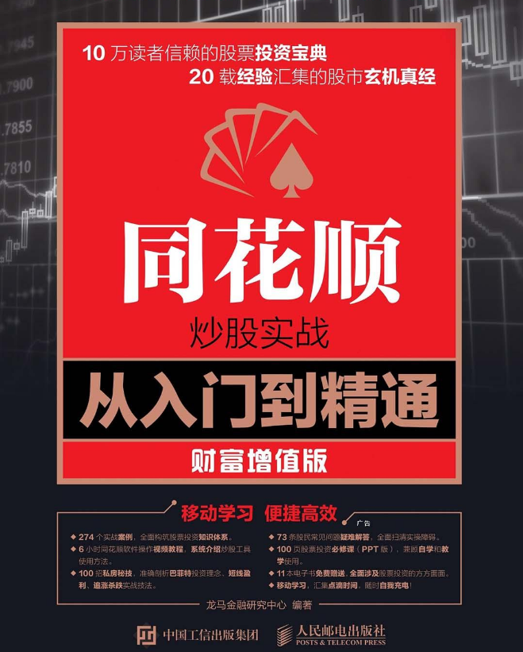

# 封面



# 版权信息

书名：同花顺炒股实战从入门到精通（财富增值版）

作者：龙马金融研究中心

出版社：人民邮电出版社

出版时间：2018-06-01

ISBN：9787115427366

本书由人民邮电出版社有限公司授权京东进行制作与发行

版权所有·侵权必究

# 内容提要

本书以实例为主线，系统地介绍了股票投的基础知识,以及同花顺炒股软件的使用方法和操作技巧。

全书分为5篇,共35章内容。

第1篇【入门篇】介绍了新股民入市的必备常识、股票的基础知识、影响股价波动的主要因素、沪港通、融资融券以及股指期货等；

第2篇【技术篇】介绍了股市分析的主要手段和作用、宏观基本面分析、单K线分析、多K线组合形态识别、移动平均线分析、趋势线分析、常用的技术指标以及如何通过成交量透视股票走势等；

第3篇【实战篇】介绍了K线实战技法、短线买卖技法、低买高卖技法、选牛股技法、捕捉黑马股技法、涨停板技法、逃顶技法、跟随主力技法、高手炒投常胜技法以及牛市投资技法等；

第4篇【秘技篇】介绍了看盘10招、超短线10招、慢牛收益10招以及巴菲特炒股10招等；

第5篇【软件篇】介绍了同花顺的基础知识、如何使用同花顺分析看盘、分时走势看盘分析、智能预警、智能选股、同花顺的控制中心、公式和函数的应用、电脑手机平板电脑协同炒股的方法以及网上炒股安全防护方法等。

本书配套视频教程及海量扩展学习资源,读者扫描二维码即可随时进行学习。

本书适合广大投票投资爱好者学习使用,也可以作为大专院校相关专业或股票投资培训班的教材或辅导用书。


# 前言

每一次牛市都会吸引大量新股民涌入，在“乱花渐欲迷人眼”的股海中历了沉浮之后，他们有的满载而归，而更多的则付出了巨大的代价。对于普通股来讲，要想真正盈利，并进而将股票作为一种长期的投资方式，不仅需要扎实基础知识，更要掌握相关的软件操作方法和股市实战技能。为了满足广大读者的学习需求，我们邀请了多位证券投资专家和高级股票分析师，共同参与了本书的策划和写作过程，希望能够以最高效的方式，帮助新股民快速掌握相关知识和投资技巧，并引导投资者理性决策，从而避免损失、实现盈利。

## 本书内容

本书是一本股票投资大全，主要面向零基础读者，系统地介绍股票的基础知识、软件的操作方法以及实战技能。全书在讲解过程中使用了大量真实案例，帮助读者通过实战掌握知识点的运用，既打牢了基础，又兼顾了实际操作，还总结了大量高手秘技，从而满足不同程度读者的学习需求。

## 本书特色

**通俗易懂，快速上手**：本书面向股票投资的零基础读者，由浅入深地介绍了股票知识及其实际运用，帮助读者透彻理解，并实现触类旁通。

**讲解细致，面向实战**：本书将知识点融入大量真实案例中，既涵盖宏观层面的分析，又兼顾微观层面的操作，完全摆脱枯燥的说教，读者在学习阶段即可进入实战状态。

**双色排版，图文并茂**：本书采用双色排版，重点难点更加突出、直观。在具体操作上，配备大量图片进行说明，一目了然，简单高效。

**视频教程，扩展学习**：本书配套视频教程是对书中知识点的深入讲解和补充，而每章最后的“高手秘技”，更进一步总结了大量炒股实战技巧，为读者提供了实用的高级操作方法。

## 视频教程学习方法

为了方便读者学习，本书配备大量视频教程。读者通过手机扫描书中的二维码，即可随时观看视频教程。

## 扩展学习资源下载方法

除视频教程外，本书还额外免费赠送了大量学习资料。读者使用手机上的微信、QQ等软件扫描二维码，关注公众号后，发送“42736”，即可获得相应的资源下载链接和提取码。将下载链接复制粘贴到任何浏览器中并访问下载页面，即可通过提取码下载本书的扩展学习资源。

## 全书电子学习资源

```
赠送资源01 6小时炒股实战从入门到精通（财富增值版）视频教程
赠送资源02 100招炒股实战秘技电子书及同步视频教程
赠送资源03 15小时电脑操作视频教程
赠送资源04 100页PPT版股票投资必修课
赠送资源05 73条新股民常见疑难问题解答电子书
赠送资源06 手机电脑炒股必备安全常识电子书
赠送资源07 24个股票基本技术指标详解电子书
赠送资源08 10个股票实战技术指标详解电子书
赠送资源09 190个电脑炒股盈利秘技电子书
赠送资源10 同花顺快捷键操作指南电子书
赠送资源11 同花顺手机炒股教程电子书
赠送资源12 同花顺炒股软件指标电子书
赠送资源13 股票代码速查手册电子书
赠送资源14 基金投资入门及盈利秘技电子书
赠送资源15 期货投资入门及盈利秘技电子书
赠送资源16 龙马高新教育APP安装包
```


## 创作团队

本书由龙马金融研究中心策划，孔长征任主编，左琨、赵源源任副主编。参与内容编写的人员有周奎奎、张田田、黄月、韩鸿雪、岳福丽等。由于作者水平有限，书中疏漏之处在所难免，敬请广大读者不吝指正。读者在阅读本书时有任何意见或建议，请发送邮件至zhangyi@ptpress.com.cn。


编者

2018年3月8日