# 新股民入市必备常识

**本章引语**

> 知己知彼，百战不殆；不知彼而知己，一胜一负；不知彼，不知己，每战必殆。
>
> ——《孙子兵法》
>
> 在战争中既了解敌人，又了解自己，百战都不会失败；不了解敌人而只了解自己，胜败的可能性各半；既不了解敌人，又不了解自己，那只有每战必败的份儿了。投资股票也是如此，如果投资者两眼一抹黑，就很可能会投资失败。

**本章要点**

> ★ 炒股是如何赚钱的
>
> ★ 炒股是如何赔钱的
>
> ★ 股票交易的流程

## 入市前的准备

想让股市成为自己的“摇钱树”，投资者就必须首先了解股市的“习性”。本章就来介绍股民入市前必知必会的基础知识。

### 对股票建立基本认识

听说周围的朋友、同事又在股市中赚了一大笔，任何人的心中都多少会泛起一丝波澜。股票市场作为一个高风险与高收益并存的市场，投资者若想推开市场大门，就必须先做一些炒股前的准备工作。

投资者首先需要了解的就是最基础的证券和交易知识。其实投资股票很简单，就如同投资者日常购物一样。购物购买的是实物等产品或服务，而投资股票购买的则是股权，是一种虚拟资产。与购物不同的是，购物一般用于消费，而投资股票则可以从中获取利润，当然也有可能会亏损。所以，投资者要对投资的股票有一定的认识。

- 股票是一种股权。
- 股票交易有固定的交易场所，在我国内地主要是上海证券交易所和深圳证券交易所。
- 投资者需要通过证券公司才可以买卖股票。
- 股票要在规定的时间才可以买卖。每周有固定的交易时间，在交易时间之外，投资者均不可以买卖股票。
- 股票买卖的单位有限制，单笔买卖必须是一手的整数倍，一手等于100股。最少可以购买100股。

上述只是最简单的证券基础知识，有助于投资者对股票建立最基本的认识。相关的证券知识与交易知识还有许多，在后面的章节我们将进行更详细的介绍。

### 炒股是如何赚钱的

常言道“无利不起早”，投资者进入股市主要是获取收益，那么炒股究竟是如何使投资者赚钱的呢？主要有以下三方面。

1. **分红获取利润**

上市公司赚钱时，会根据投资者所持有的股份，分配利润给投资者，这就是股利分红，主要分红方式有现金和股票份额两种。但如果该公司没有赚钱，投资者是不会获得股利分红的。

例如，李明买入1000股万科A，在持有该股票一段时间之后，万科A宣布除息，李明就可以获得相应的分红利润。

2. **依靠股差获取利润**

在投资股票的过程中，投资者主要依靠股差获取利润。当投资者所投资的某只股票的需求量大于供给量时，股票的价格就会上涨，这时就能低买高卖，赚取买入和卖出股价间的差额，实现收益。

例如，王珊出资2万元买入8000股某只股票，买入价格为2.5元，之后该股票一度拉升至3.6元，那么王珊卖出后获利多少呢？如果不计交易费用，通过股差获益= 8000×（3.6-2.5）=8800（元）。

3. **投资股指期货获取利润**

资金实力较雄厚的投资者在投资股票获取利润的同时还可以投资股指期货。股指期货简称期指，是指以股价指数为标的物的标准化期货合约，双方约定好在规定的时间按照事先确定的股价指数的大小，进行标的指数的买卖。我国的股指期货主要指沪深300股指期货。

股指期货的投资方式有别于股票，投资者在买卖股指期货时，不仅可以先买入再卖出，还可以先卖出股指期货再买入。前者被称为多头开仓，后者被称为空头开仓。由于股指期货交易所需资金量很大，所以基本上只有机构投资者和一些资金雄厚的投资人参与。

例如，A机构认为未来上证指数要下跌，于是在股指期货5000点时卖出股指80张合约，合计人民币1800万元。当股指下跌至4000点时，再买入80张股指期货合约，盈利2400万元。计算公式为：（5000-4000）×300×80=2400（万元）（股指期货IF合约每变动一个点位为300元）。

### 炒股是如何赔钱的

既然可以通过炒股赚钱，也一定会有人炒股赔钱。股市上有句谚语“十人炒股，一赚两平七赔”。这也就说明，有更多的投资者在股票市场上是赔钱的。为什么会出现炒股赔钱的情况呢？主要由于以下几点造成的。

1. **成也股差败也股差**

许多未曾涉股的投资者在周围人的影响下也步入了股市的殿堂。于是“一入股市深似海，从此节操是路人”。看着周围人都在大牛市中挣得盆满钵满，新手在未经历过系统学习和模拟盘操练的基础上就一头扎入股市中，想不赔钱都难。新人入市，最喜欢追涨杀跌。

例如，李兰看到中国电建一直上涨，从7元一直涨至16.5元，她认为该股很有前途还会再涨，于是在18元时终于按捺不住，投资9000元买进500股。结果万万没想到，该股票最高冲到19.9元之后一路狂跌，李兰实在是承受不了了，最终以14元的价格卖出中国电建，最终亏损2000元，亏损比例为22％。结果，李兰卖出中国电建之后，该股股价反弹至17元，这就是典型的追涨杀跌。

2. **频繁操作，提高交易成本**

有些投资者妄想能够把握住股市中每一次上涨的机会，希望利润能够最大化，结果天天交易，甚至每天多次买卖。结果越频繁操作越亏损。交易频繁容易亏损是因为频繁操作容易迷失方向，难以长期保持理性的心态对待资本市场。而且频繁的买卖所付出的交易成本过高，结果到最后沦为纳税大户和券商的打工仔。

3. **股票种类过多，杂乱无章操作**

许多投资者认为鸡蛋不应该都放入同一个篮子里，于是在刚入市的时候喜欢买许多只（10只以上）股票，并且在每一只股票上所投入的资金并不多。由于买入的股票数量太多太杂，导致投资者无法潜心研究一只股票，从而难以做到精心管理。在行情震荡上扬的时候，容易出现一半涨一半跌、无利可图的结果。当遇到大盘猛跌时，个股纷纷跟随大盘脚步猛跌，此时投资者在卖股票时就会顾此失彼，导致利润回吐甚至亏损。

4. **放大杠杆，融资炒股**

有些投资者把股票市场当成“提款机”，每日做着发财梦，不管是牛市、熊市还是震荡市，都想方设法融资、贷款炒股。由于贷款需要还本付息，并且扩大融资比例，风险被放大，所以心理承受压力过大，特别容易被很小的震荡所影响，从而导致追涨杀跌。

例如，张亮自有本金50万元，在证券公司开通融资融券业务之后，本金50万元买成平安银行，然后用这50万元的股票做抵押，融资60万元，再次买入平安银行。如果平安银行股价上涨10％，张亮将获利11万元，相对于其本金来说一下盈利22％，赚钱效应一下被放大1.1倍。相反，若股价下跌10％，将亏损11万元，亏损比例占其原有资金的22％。若股价下跌至45％时，张亮将血本无归。

> **提示：**切忌用生活开支费用、养老钱、贷款资金炒股。

### 股票交易的时间

股票交易时间主要涉及两个方面，即交易日和每个交易日的交易时间。

1. **交易日**

股票交易日是指能够进行股票交易的日期。交易日通常在工作日，而国家法定的节假日和周末，股市都休市不交易。例如，2015年端午节假期是2015年6月20日至2015年6月22日，因此股市休市三天。

2. **每日交易时间**

通常情况下，每个交易日的交易时间分为以下几个时段。

上海证券交易所交易时段

|   时间段    | 交易时段 | 投资者可以进行的操作 |
| :---------: | :------: | :------------------: |
|  9:15-9:20  |          |                      |
|  9:20-9:25  |          |                      |
|  9:25-9:30  |          |                      |
|    9:27     |          |                      |
| 9:30-11:30  |          |                      |
| 13:00-15:30 |          |                      |

深圳证券交易所交易时段

|   时间段    | 交易时段 | 投资者可以进行的操作 |
| :---------: | :------: | :------------------: |
|  9:15-9:20  |          |                      |
|  9:20-9:25  |          |                      |
|  9:25-9:30  |          |                      |
|    9:27     |          |                      |
| 9:30-11:30  |          |                      |
| 13:00-14:57 |          |                      |
| 14:57-15:00 |          |                      |

###  股票交易的场所

股票交易场所是依据国家有关法律，经政府证券主管机关批准设立的集中进行股票交易的有形场所。我国的股票证券交易所，主要有上海证券交易所、深圳证券交易所和香港联合交易所等。

上海证券交易所创立于1990年11月26日，同年12月19日开始正式营业。一大批国民经济支柱企业、重点企业、基础行业企业和高新科技企业通过在上海证券交易所上市，既筹集了发展资金，又转换了经营机制。许多权重蓝筹股都在上海证券交易所上市，股票代码均以600开头。

深圳证券交易所成立于1990年12月1日。2004年5月，中小企业板正式推出；2006年1月，中关村科技园区非上市公司股份报价转让开始试点；2009年10月，创业板正式启动。深圳证券交易所全力支持中国中小企业发展，推进自主创新国家战略实施。深圳市场的小盘股居多，股票代码均以00开头，创业板以300开头。

香港联合交易所有限公司简称SEHK，是香港证监会认可的交易公司，以在香港建立和维持股票市场为目标。香港的证券交易历史悠久，1891年香港经纪协会成立，香港开始有正式的证券交易市场。经历过多轮牛市、股灾与1998年亚洲金融风暴，香港证券市场渐趋成熟。2014年11月17日，沪港通的开通让内地投资者也能够敲开港股的大门。

### 炒股工具——电脑

网上炒股与柜台交易、电话委托的炒股方式相比，具有很大的优势，只要有电脑和网络即可买卖股票，而电脑则成为必不可少的工具。本节将介绍台式电脑和笔记本电脑的相关知识。

1. **台式电脑**

股市中的行情瞬息万变，几秒就可能让投资者错失绝佳买卖点。如果此时电脑出现问题，就可能会承受一定的损失，因此投资者对电脑的配置要有一定的要求。除了硬件外，在软件方面也要有一定的标准，投资者要尽量选择当下较为普遍的操作系统。为了能够保障个人信息安全，投资者还应该给电脑安装合适的杀毒软件。除此之外，炒股需要长时间盯着电脑屏幕，选择一款优质的显示器，对眼睛也是一种极大的保护。对于台式电脑的硬件配置，这里给投资者一些建议。

> - 显示器：最好选择品质好、对眼睛刺激小的LED显示器。
> - CPU：炒股软件对CPU的占用不大，因此对CPU的规格要求不高，现在的双核CPU、四核CPU都可以使用，投资者可按照自己的需要配置。
> - 主板：建议投资者选择稳定性强的主板。
> - 内存：由于股票市场的行情瞬息万变，因此对于时间要求十分严格，建议投资者选择2GB或以上的内存。
> - 电源：为了提高电脑的稳定性，建议投资者选择高品质的电源，而超专业的投资者则可以选择使用双电源。
> - 键盘鼠标：建议投资者选择反应灵敏的感光鼠标和知名品牌的键盘。

如果有一定的经济基础，则电脑的配置越高越好。因为投资股票不是游戏，只有做好充分的准备，才有打赢胜仗的可能。

2. **笔记本电脑**

笔记本电脑与台式机差别不是特别大，一般情况下，同样配置的笔记本电脑，其运行速度要慢于台式机。不过笔记本电脑具有便携性的特点，投资者可以在任何有网络的地点查看股市的行情，把握股市最新动态。

网上炒股不要求笔记本电脑配置过高，但在稳定性和散热设计方面有特殊的要求，具体的配置要求如下。

> （1）由于投资者要连续看盘，连续使用的时间较长，因此笔记本电脑的散热性要好。
>
> （2）由于要关注众多的股票信息，建议投资者选择屏幕较大的笔记本，而不要选择很小的迷你本。屏幕越大，对行情的查看越清晰，有助于投资者把握行情。
>
> （3）由于投资者可能在没有电源的地方使用笔记本，所以笔记本的续航能力要强。最好在不插电的情况下可以保证运行5小时以上。

鉴于以上几点，这里为投资者推荐几款适合网上炒股的笔记本电脑以做参考。

-  惠普ProBook 350 G2（M5T77PA）。

这是一款典型的商务机型，配置为：第五代智能英特尔酷睿i7处理器、最高睿频3000MHz、屏幕15.6英寸、CPU主频为2.4GHz、四线程双核心、性能级独立显卡、显存容量2GB、4芯锂电池、整机重量2.3kg。

- 戴尔（DELL）Ins14L-1528B。

该款笔记本电脑的配置为：第五代智能英特尔酷睿i7处理器、最高睿频3000MHz、屏幕14英寸、CPU主频为2.4GHz、四线程双核心、入门级独立显卡＋集成显卡、显存容量4GB、4芯锂电池、整机重量2kg。

- 联想（Lenovo）G410AT 14.0。

该款笔记本电脑的配置为：第五代智能英特尔酷睿i5处理器、最高睿频2700MHz、屏幕15.6英寸、CPU主频为2.2GHz、四线程双核心、性能级独立显卡、显存容量2GB、6芯锂电池、整机重量2.5kg。

### 炒股工具——智能手机

随着信息技术与互联网技术的不断发展，智能手机与人们的日常生活已经紧密联系在一起，手机炒股这种方式也越来越受到股民的欢迎。虽然电话委托和网上交易已经为股民完成交易提供了许多便利，但是这两种终端的固定性导致其在操作上具有很大的局限性。

而手机炒股则不同，只要在网络覆盖的范围内，并且手机下载了相关券商的行情交易客户端，就能够随时随地登录客户端查看行情、做交易，在便捷性方面手机可谓更胜一筹。除此之外，与高额的宽带费用和电话费相比，手机炒股的交易成本也较低。

投资者若想要用智能手机炒股，首先需要一台配置合适的手机。可以是iOS操作系统的智能手机，或者安卓操作系统的智能手机，也可以是Windows Phone操作系统的智能手机。这三者相较而言，笔者更推荐前两种操作系统的手机。不同品牌、不同型号的手机，在运行速度与兼容性等方面各不相同。建议投资者结合自身情况，尽量选择内存大、配置高、支持4G网络的高端智能手机。例如，iPhone 6系列、iPhone 6 Plus 系列、iPhone 5s系列、iPhone 5c系列和三星手机的Galaxy S6系列、Galaxy S5系列、Galaxy S4系列等。除了上述推荐的一些高端智能手机型号之外，小米、联想、华为、中兴的一些高配机型也可以选择。

### 炒股工具——股票分析和交易软件

除了电脑和手机之外，投资者还需要选择一款合适的股票分析软件。通常情况下，证券公司会为在本公司开户的投资者提供股票分析和交易软件。同时，网络上也有许多免费软件，投资者可以根据自己的需要下载和使用。下面简单介绍目前市面上较普及的几款软件。

1. **同花顺**

同花顺是一个功能强大的资讯和交易平台，它具有行情交易快、数据全、性能优的特点，深受股民欢迎，可以提供行情显示、行情分析和行情交易等功能。该软件还有许多特色板块：经典指标自定义，让股民自由选择，自主定义；模拟炒股，让股民学习高手操作，演练实战技巧；加入揭秘主力买卖指标，为股民降低股市风险。

同花顺软件免费提供独家个股资金流向、主力增仓数据，其全新上线的数据中心、研报中心两大平台精选财经资讯。同花顺股票软件基础功能正在稳步提高，资讯越来越准，行情越来越快，功能越来越全。

进入同花顺软件界面，最新动态信息及分析等都能在菜单栏中找到；工具栏的实用工具可以帮助投资者进行决策分析；自应用是股民根据自己的操作习惯自行添加的应用；分时图和行情报价可以显示个股以及大盘的最新进展情况。

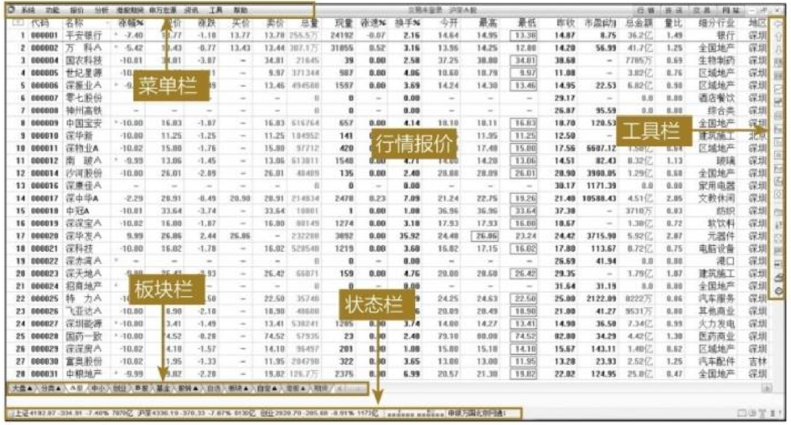

同花顺还有手机金融服务，支持iPhone手机炒股、安卓手机炒股、iPad炒股等，覆盖苹果、三星、小米、华为、中兴等主流机型。下图为同花顺手机客户端主界面。

2. **通达信**

通达信软件是证券公司广泛使用的炒股软件，集合了各类证券分析软件的优点，功能强大，操作方便，界面清晰。通达信软件能够展示实时和全面的股指行情以及及时的信息资讯，为投资者了解股市、熟悉市场规则提供了一个完善的互助平台。此外，它为投资者建立金融理念、培养投资策略提供了优化的环境，可以帮助新股民尽快成为炒股达人。

打开通达信软件后，投资者看到的是行情报价界面。在不同的板块下，界面中间显示出不同股票的最新行情，边角是各类实时财经资讯和便捷小工具。

通达信手机客户端拥有强大的技术分析工具、完整的基本面数据、开放的接口和智能化操作以及个性化功能，是一套用来进行行情显示、行情分析并同时进行信息即时接收的证券信息平台。通达信手机版的行情交易系统，功能完善，操作简单，不仅支持日常交易、融资融券交易，还支持开放式基金的认购、申购、赎回。下图为通达信手机客户端主界面。

3. **大智慧**

大智慧软件是一款设计精细的操盘软件，界面风格及操作均符合用户使用习惯。该软件版本系统稳定，操作便捷，支持股指期货行情；支持沪、深Level2十档行情，透视交易细节；独创DDE决策选股分析系统，BS点买卖决策平台，为投资者提供参考。它具有详尽的机构研究报告和券商晨会纪要，大智慧资深专家每日发布黄金内参报告，确保其资讯更全更细。

大智慧软件界面主要由菜单栏、板块栏、大盘指数、自选股、行情资讯等几个部分构成。

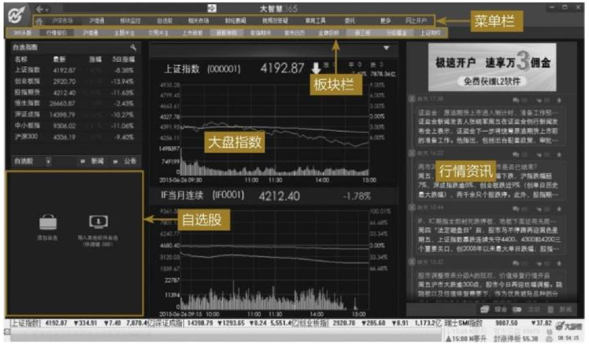

与同花顺和通达信一样，大智慧软件也有手机版。大智慧手机版是针对手机PPC的操作习惯独立设计、开发而成，其界面表现形式、用户操作习惯性与大智慧互联网版非常相似，用户无须花费过多的时间就能很好地掌握大智慧手机PPC版的操作，下图为大智慧手机客户端主界面。

### 网络

1. **开通4G网络**

“巧妇难为无米之炊”，想要用手机炒股，除了智能手机，还要开通移动网络。投资者可以选择去移动、联通、电信营业厅柜台，或者拨打客服电话开通手机上网业务。除此之外，还可以登录网上营业厅，自助在线开通该业务。下图为中国联通网上自助开通服务的界面。

由于4G网络能够快速传输数据、音频、视频和图像，比目前的家用宽带网速快25倍，并能够满足几乎所有用户对于无线网络服务的要求，所以建议投资者将手机从3G网络升级为4G网络。投资者也可以在网上营业厅预约更换4G套餐。

2. **网络双线，有备无患**

由于电脑显示屏幕较大，可查看信息更全面，所以投资者在办公地点或者家庭环境一般更喜欢使用电脑查看行情或进行交易。但是一旦投资者在使用电脑终端进行交易时，有线网络突然中断，就会给投资者带来许多不便。不用担心，只要手机有上网流量，投资者可以用手机登录同一款行情交易软件客户端同步查看自选股信息。

下图以同花顺软件为例，左图是手机登录同花顺客户端显示的自选股，右图是电脑登录同花顺客户端显示的自选股，只要使用同一账号登录同花顺软件客户端，所查看的自选股信息都是相同的。该功能为投资者看盘与交易提供了许多方便。

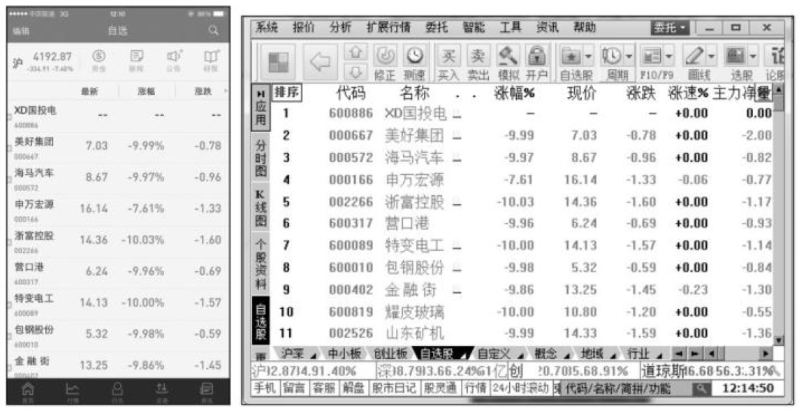

除了手机登录股票行情软件客户端可以让投资者查看行情之外，投资者还可以打开手机设置菜单，选择个人热点，开通WLAN热点。笔记本电脑可以连接手机热点，使用手机流量登录网络继续查看行情，也可以选择去营业厅购买无线上网卡，以备不时之需。

## 办理开户手续

去哪里开户，这是投资者首先需要知道的问题。选择一个好的证券公司开户，不仅可以得到良好的个性化服务，也可以节省交易成本，增加投资收益。本节为投资者就如何选择券商、开户需要准备的资料、手机开户等问题进行一一解答。

### 选择券商

现在证券公司数量繁多，面对众多的证券公司，投资者究竟该如何选择呢？下面就为投资者介绍在选择证券公司时应当考虑的几大问题。

1. **公司规模**

投资者一般难以直接判断证券公司的规模，但是可以从证券公司营业网点的多少、员工的人数等方面协助判断。如果考虑开户的证券公司是上市公司，则可以从股本的规模、财务指标大致看出其规模与实力。规模越大的证券公司，一般服务越专业、全面。

2. **服务质量**

有一些证券公司对客户的售后服务几乎为零，客户开户之后，几乎不会主动去和客户联系，不能帮助客户解决投资中常见的问题，投资者不要选择这样的券商开户。一般可以从券商经纪人团队规模、股民学校、平日的资讯推送等方面来大致判断一家券商的后续服务能力。

3. **业务是否多样化**

证券公司可以提供的业务有多种多样，要注意券商是否可以从事证券市场上所有的交易品种，如A股、创业板、ST风险警示板、股指期货、融资融券、个股期权、新三板、特别转让等交易。注册资金少的券商所能够开展的交易业务很受局限，即使能够开展一些特殊业务，其服务质量也与有实力的证券公司无法比拟。

4. **交易成本**

交易成本即开户之后交易的手续费，俗称佣金。证券公司一般是按资金量、交易量等数据来给客户定佣金的高低，资金量大、交易量大的用户就拥有更多的谈判资格。一般情况下，大公司的佣金水平会比小公司略高，不过也不能一概而论，所谓货比三家，只有多问问，多打听才能找到最适合自己的。目前一些券商已经放宽手续费至万分之三的水平甚至更低，高于这个水平线的，可以忽略。

5. **资讯推送**

服务好的证券公司会在每个交易日开盘之前就前一天收盘后的资讯进行收集整理与分析。例如，即将发行的新股都有哪些、央行的降息降准信息等。

6. **营业部位置**

证券公司营业部是证券公司组织架构的一部分，投资者想要开户需要到营业部进行办理。对于营业部的选择要看个人的情况，通常可以就近选择营业部。找营业部地址很简单，先在券商的官网上查询营业部，然后进入单个营业部页面中，一般会有详细地址和交通方式等介绍。

> **提示：**投资者需要注意证券公司的交易平台是否流畅，之前曾出现过一些券商的交易系统崩溃导致投资者无法交易的事件，因此投资者有必要提前了解该方面的信息。

### 开户需要准备的材料

依据开户的主体不同，投资者可分为个人投资者和机构投资者，二者在开户时所应准备的材料有所不同。

1. **个人投资者**

> 个人投资者需要携带本人有效身份证（年满18周岁）以及银行卡，到相关的证券营业厅登记机构办理开户手续。

2. **机构投资者**

> 机构投资者需要携带的材料较多，具体如下。
>
> （1）年检过的营业执照副本原件，留复印件并盖公章 （2份）。
>
> （2）法人组织机构代码证副本原件，留复印件并盖公章 （2份）。
>
> （3）法人代表及经办人身份证原件，留正反面复印件并盖公章（2份）。
>
> （4）税务登记证副本原件，留复印件并盖公章（国税、地税各1份；如已经两证合一，则出示合并的税务登记证即可）。
>
> （5）公章、法人人名章、财务章（如客户不能将上述三项印鉴带出，则需按要求将全部资料填写完整并加盖印鉴；但是对于新开股东卡，客户必须携带公章，新开股东卡复印件上需要加盖公章）。
>
> （6）关于控股股东或实际控制人的证明材料1份，最好是填写附表，同时附公司章程或会计师事务所出具的验资证明中涉及的关于股东出资比例的内容的复印件（如果出具附件实在有困难，就以附表为准）。
>
> （7）股东卡原件及复印件，复印件需加盖公章（如客户无股东卡，需填写《机构注册申请表》，并交900元现金办理；如客户已有股东卡，则无须填写《机构注册申请表》）。
>
> （8）开户许可证，留复印件并盖公章。

### 营业厅和网上营业厅开户

1. **营业厅开户**

自2015年4月3日起，允许投资者一人开设多个证券账户，投资者可以在多家证券公司开设账户，每个账户指定一家证券公司。所以新老客户均可以去心仪的证券公司开设证券账户。老客户若已经开通融资融券交易账户，需要先撤销已开通的融资融券交易账户，再去其他家证券公司开户。

> 个人投资者去营业厅办理A股开户流程如下。
>
> （1）选择一家证券公司。
>
> （2）持本人身份证和银行卡去证券公司的业务网点办理开户手续。
>
> （3）开设相应的证券账户卡（或称股东卡）。
>
> （4）填写开户申请书，签署《证券交易委托代理协议书》，开设资金账户。
>
> （5）如要开通网上交易，还需填写《网上委托协议书》，并签署《风险揭示书》。
>
> （6）到银行卡所在的银行，出示《交易结算资金银行存管协议书》，办理资金的第三方存管。

具体开户流程如下图所示。

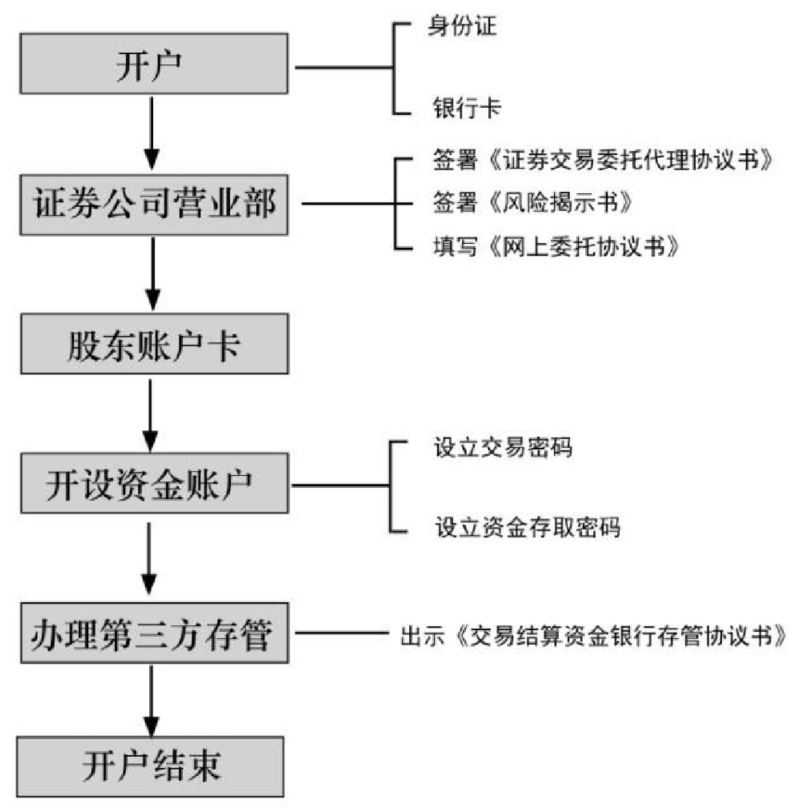

2. **网上营业厅开户**

现在各大证券公司都支持网上开户业务，投资者足不出户就可以开启证券账户，这为投资者带来了不少便利。网上开户不局限在证券公司的营业部，也不局限在交易所交易时间，在任何地点都能开户。

虽然不用去营业网点办理开户，但是实际上网上开户还是有很多细节需要注意，投资者在登录网上营业厅自助办理开户时也会碰到很多问题。首先要注意的是，网上开户有一定的条件限制。例如，休眠激活、休眠注销重开这种情况，网上是不能办理的。另外，开通创业板权限，网上也是不能办理的。

投资者若想通过网上营业厅开户，则需要先准备开户所需的材料，包括中华人民共和国第二代居民身份证（年满18岁）、银行借记卡（之前未开通过三方存管）以及手机、带摄像头和耳麦的电脑等。以下是通过网上营业厅自助开户的流程。

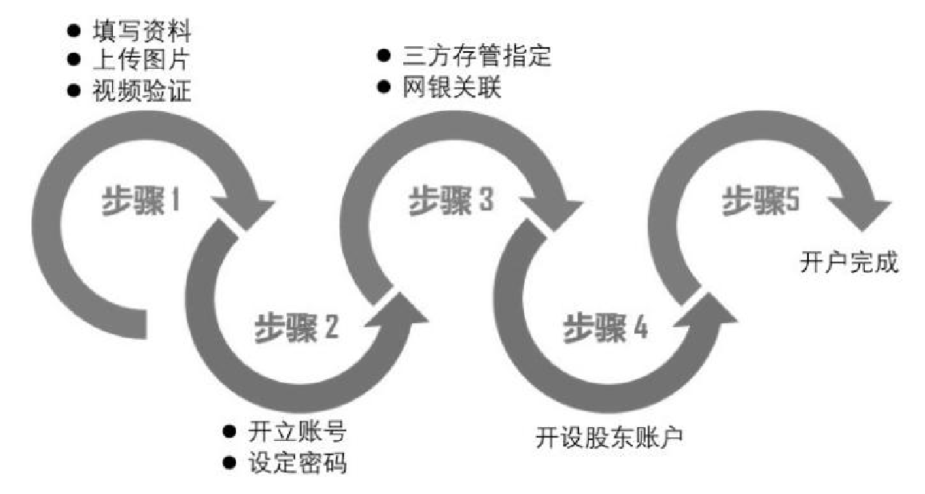

### 手机开户

伴随着智能手机的普及，越来越多的证券公司开始开发手机证券开户APP。投资者若想采用手机客户端开户，需要先准备开户所需的材料，包括中华人民共和国第二代居民身份证（年满18岁）、银行借记卡（之前未开通过三方存管）和带摄像头的智能手机。

> 下面以申万宏源手机开户为例，简单介绍一下手机开户的流程。
>
> （1）用手机助手或者APP Store搜索“申万宏源手机开户”，找到对应的应用程序，选择下载。
>
> （2）打开客户端，选择界面最下面正中间的【我要炒股】按钮。然后填写手机号，等待接收验证码。
>
> （3）上传身份证图片，核对身份证信息。注意身份证号码一定多检查一遍，以免出现纰漏。
>
> （4）视频验证。视频验证时最重要的是保持网络畅通，最好是连接Wi-Fi进行，环境不要太暗，否则视频验证工作人员看不清投资者。
>
> （5）验证完毕选择下载数字证书，这里需要设置一个数字证书密码，两次输入要一致。
>
> （6）签署开户协议，选择开户营业部，投资者可以根据自己所在的城市和区域选择相应的营业部。
>
> （7）在进行完风险测评并签署风险揭示后，设置三方存管，选择一家银行作为三方存管银行，输入银行卡密码和银行存留手机号即可。

特别方便的一点是，如果没有完整足够的时间开户，零星的碎片时间也可以进行手机开户，只要重新登录手机开户客户端，输入上一次的验证手机号码进行校验，就可以回到上次开户环节。

手机开户流程如下图所示。

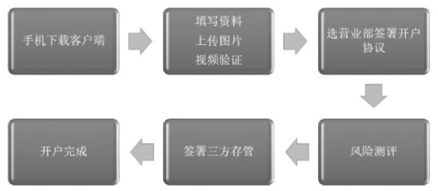

### 银行卡及资金安全

投资者在投资股票时不可以直接用银行借记卡内的资金购买股票，而是需要将银行借记卡与资金账户关联之后，先把资金从银行卡划转至资金账户内，然后再利用资金账户内的钱买股票。

1. **什么是第三方存管**

“第三方存管”是指证券公司客户证券交易结算资金交由银行存管，由存管银行按照法律、法规的要求，负责客户资金的存取与资金交收，证券交易操作保持不变。

2. **第三方存管的办理**

原来办理第三方存管手续需要投资者本人先在营业部开具《客户交易结算资金银行存管协议书》，然后拿着《客户交易结算资金银行存管协议书》和身份证去银行进行现场签约。现在，如果是用手机开户，则直接通过手机客户端开通三方存管，无须投资者再去银行办理。投资者也可以登录想签约的银行网上营业厅，自助办理三方存管的签约。若网上办理或者手机办理有误填、漏填情况发生，再去营业部开具《客户交易结算资金银行存管协议书》，然后去银行进行现场签约。

> **提示**：银行进行现场签约的时间为每个交易日的9：00—15：00。在此时间之外不予办理，投资者去银行办理时要掌握好时间。

## 股票交易流程——办理委托

投资者开户完毕之后，即可参与上海A股与深圳A股的交易，这需要按照沪深两市的交易规则进行委托申报。

### 股票买卖的委托程序

投资者开户完成的第二日就可以进行股票买卖。投资者买卖的委托程序分为委托受理、委托执行和委托撤销三步。

1. **委托受理**

证券公司在收到客户委托之后，首先将对投资者的身份、委托内容、委托卖出的证券数量以及委托买入的资金余额进行审查。经查验符合要求之后，才能接受委托。

2. **委托执行**

证券公司接受客户买卖证券的委托之后，应当根据委托的证券名称、买卖数量、出价方式、价格幅度等，按照证券交易所的交易规则代理买卖证券。买卖成交之后，应当按照规定制作买卖成交报告单交付客户。

3. **委托撤销**

在委托成交之前，投资者有权变更和撤销委托。一旦证券营业部申报竞价成交，买卖就已经成立，成交部分不得撤销。客户可以直接将撤单信息通过电脑或手机终端输入证券交易所交易系统，办理撤单。对客户撤销的委托，证券公司必须及时将冻结的资金或证券解冻。

### 股票买卖委托的内容

股票买卖委托的内容主要包含基本委托内容和上海、深圳证券交易所证券买卖申报价格的规定两部分。

1. **基本委托内容**

投资者买卖股票时，向证券公司下达的委托指令主要包括：证券账号、日期、品种、买入卖出方向、委托数量、委托价格、时间、股票名称、股票代码。下图为股票买入和卖出的主要界面。

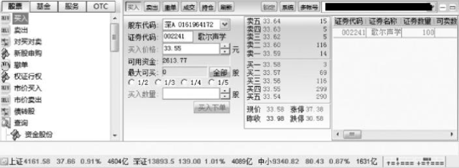

打开交易界面后，单击左侧功能列表中的【买入】选项，在右侧窗口将显示买入的界面，如图所示，在其中输入买入的证券代码，系统自动根据账户中的资金计算出最大可买入数量。投资者输入买入数量和买入价格后，单击【买入下单】按钮即可。

单击左侧功能列表中的【卖出】选项，在右侧窗口将显示卖出的界面，如下图所示。

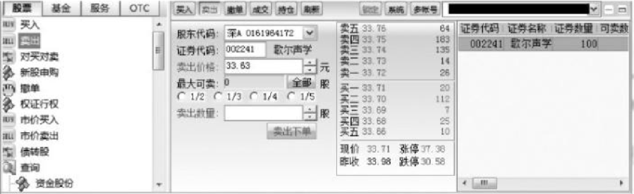

依据《上海证券交易所交易规则》和《深圳证券交易所交易规则》，两家证券交易所通过竞价交易的证券买卖申报数量和单笔申报最大数量见下表。

证券交易所竞价交易的证券买卖申报数量

|      |      |      |
| ---- | ---- | ---- |
|      |      |      |
|      |      |      |
|      |      |      |
|      |      |      |
|      |      |      |
|      |      |      |
|      |      |      |

证券交易所竞价交易的单笔申报最大数量

|      |      |      |
| ---- | ---- | ---- |
|      |      |      |
|      |      |      |
|      |      |      |
|      |      |      |
|      |      |      |
|      |      |      |
|      |      |      |

2. **上海、深圳证券交易所证券买卖申报价格的规定**

从委托价格限制形式来看，可将委托分为市价委托和限价委托。

市价委托是指客户向证券公司发出买卖某种证券的委托指令时，要求证券公司按照证券交易所当时的市场价格进行买进或者卖出证券。市价委托的优点是没有价格上的限制，证券公司执行委托指令比较容易，成交迅速且成交率高。下图为市价买入的交易界面。

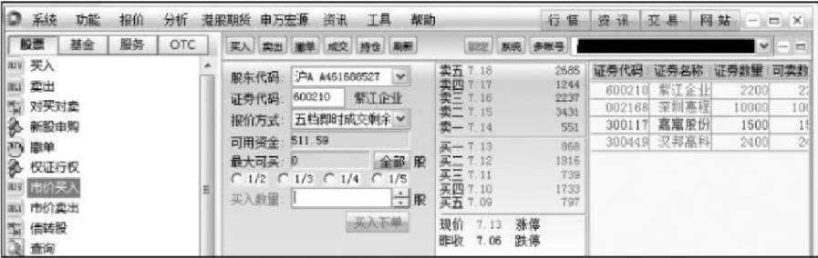

限价委托是指客户要求证券公司在执行委托指令时，必须按限定的价格或比限定价格更有利的价格买卖证券，即以限定价格或更低的价格买入，以限定价格或更高的价格卖出。限价委托的优点是证券可以以客户的预期价格或更有利的价格成交，有利于客户实现预期投资计划。但是，采用限价委托时，必须等市价与限价一致时才可以成交。而且，当市价委托和限价委托同时出现时，市价委托优先成交。因此，客户在采用限价委托时有申报不能成交的可能，也许会错失很好的成交机会。

### 股票买卖的委托手段和方式

投资者在买卖股票时，要进行下单委托，可以根据证券商所提供的设备条件，采用不同的委托方式报单，如下图所示。

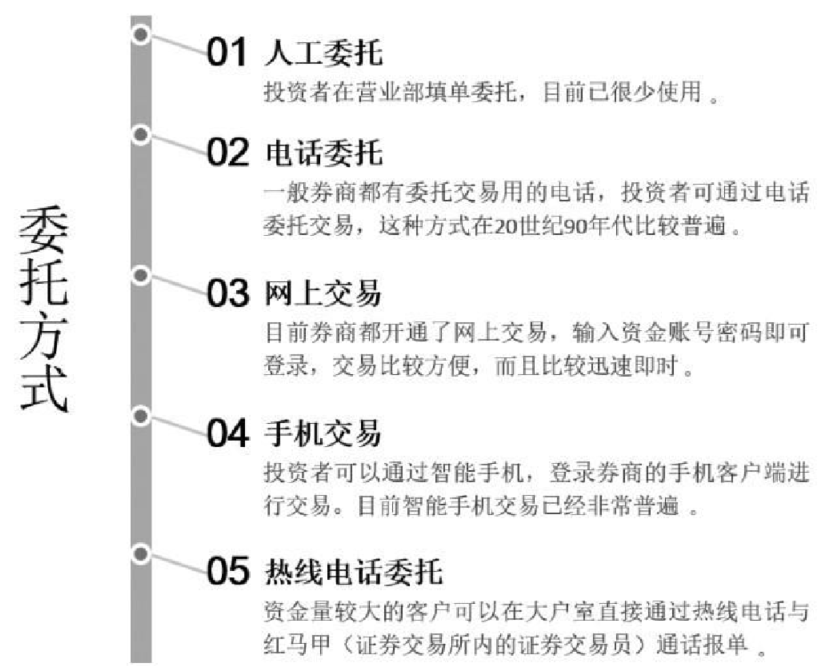

### 为什么委托价和成交价不一致

沪深证券交易所目前采用两种竞价方式：集合竞价和连续竞价。投资者在9：30—11：30、13：00—15：00之间的买卖申报都属于连续竞价。连续竞价时，交易系统对每一笔买卖委托进行自动撮合，成交价格的原则如下。

（1）买入价与卖出价相同，该价格就为成交价格。

例如：李三以10.5元卖出中国远洋200股，王丽以10.5元买入200股，最终成交价格为10.5元成交200股。

（2）买入申报价格高于即时揭示的最低卖出申报价格的，以即时揭示的最低卖出申报价格为成交价格。

例如：李兰以18元价格（最低卖出价）卖出中国人寿1500股，张琪以18.5元买入1500股，最终成交价格为18元成交1500股。

（3）卖出申报价格低于即时揭示的最高买入申报价格的，以即时揭示的最高买入申报价格为成交价格。

例如：张强以15.5元卖出平安银行500股，丽丽以15.7元（最高买入价）买入500股，最终成交价格为15.7元成交500股。

### 集合竞价成交

集合竞价是指在交易日没有开盘之前，投资者根据对当日股市的预测进行委托买入，在集合竞价时间内录入电脑主机的所有下单将按照价格优先和时间优先的原则计算出最大成交量的价格，这个价格就是集合竞价的成交价格，而这个过程被称为集合竞价。

集合竞价确定成交价的原则，如下图所示。

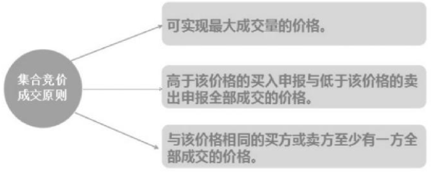

> **提示：**集合竞价未能成交的委托并不会被废除，而是直接进入竞价阶段。

## 风险较小的炒股方式——打新股

股票交易在二级市场进行，而新股申购是在一级市场进行的。通俗来讲，就像消费者一般从经销商那里购货，打新则是消费者直接从生产商那里购货。省去了中间环节和成本，自然风险小收益高。本节主要介绍与新股相关的知识。

### 新股的发行方式

股份公司发行新股常用的方式有网上申购和网下发行。网上申购是通过证券交易所的交易平台进行，投资者可以比照常规A股交易的方法进行操作；网下发行一般针对法人投资者。

### 新股申购的注意事项

个人投资者在进行申购时，需注意以下事项。

（1）投资者必须持有非限售A股股份市值1万元以上和足额的资金，才能参与新股网上申购，而且沪、深两个市场市值不能合并计算，沪、深证券账户只能申购本市场新股，并需在申购前存入足额申购资金。

（2）计算证券市值是指T-2日（T日为申购日，下同）日终投资者持有的（包括主板、中小板和创业板）非限售A股股份市值，包括融资融券客户信用证券账户的市值和证券公司转融通担保证券明细账户的市值，不包括B股股份、ETF、基金、债券或其他限售A股股份的市值。投资者持有多个证券账户的，将合并计算账户市值。

（3）投资者参与网上公开发行股票的申购，以该投资者的第一笔申购为有效申购，一个投资者只能用一个证券账户进行一次申购，其余申购将被系统自动撤销。新股一经申报，不得撤单。同一天有多只股票发行的，该可申购市值额度对投资者申购每一只股票均适用。

（4）所持股票T-2日市值确定后，可以在T-1日或T日将T-2日持有的市值卖出，资金可用于T日申购新股。

### 新股申购的流程

1. **证券账户准备**

通过证券公司开立证券账户，申购上交所股票需要有上交所证券账户，并做好指定交易，申购深交所股票需要有深交所账户。

2. **新股申购资金及市值准备**

自2015年开始实行新股申购新规，与以往申购新股不同，新规定按市值申购。投资者持有的市值指T-2日前20个交易日（含T-2日）的日均持有市值。根据投资者持有的股票市值，持有市值1万元以上股票的投资者才能参与新股申购（两市都需要满足此要求）。按上海市场每1万元市值配一个申购单位的原则计算投资者可申购额度，市值不足1万元部分不计算可申购额度。深圳市场每5000元市值配一个申购单位（一个申购单位为500股）的原则计算投资者可申购额度，不足5000元的部分不计入申购额度。同一天有多只股票发行的，该可申购市值额度对投资者申购每一只股票均适用。

投资者可以在资金的新股申购一栏查看沪深市场的申购配额。

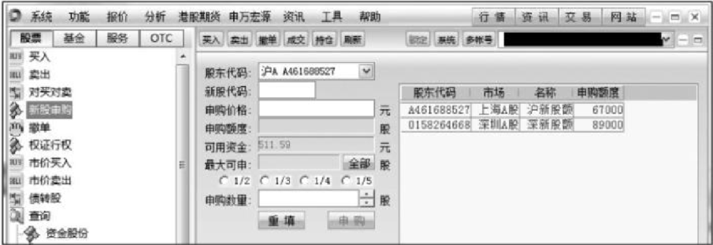

新股申购的流程主要包括以下几步。

申购时间：

沪市申购时间为9：30—11：30，13：00—15：00；深市申购时间为9：15—11：30，13：00—15：00。

操作流程：

（1）申购步骤。

在证券账户上操作，下单方式与买入股票相同，单击【买入】选项，在证券代码栏中填入“申购代码”，填写买入数量，数量必须为1000股（或500股）的整数倍。然后，单击【买入下单】按钮。下单后，到当日委托里看一下，如果有刚才的下单记录，则这笔申购就完成了。申购后，相当的申购金额就会冻结，要到T＋3日资金才会解冻。如果中签了，比如中了500股，这500股的发行价所对应的金额就转成股票显示在持仓里了，其他金额则回到投资者的资金账户中。

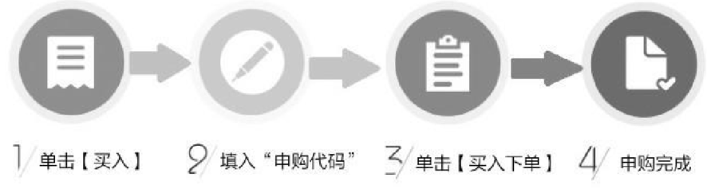

（2）申购结果查询。

① 投资者申购（T日）。

申购当日（T日）按《发行公告》和申购办法等规定进行申购。

② 资金冻结、验资及配号（T＋1日）。

申购日后的第一天（T＋1日），由结算公司将申购资金冻结。16：00前，申购资金需全部到位，结算公司配合交易所指定的具备资格的会计师事务所对申购资金进行验资，并由会计师事务所出具验资报告，交易所以实际到位资金作为有效申购进行配号（即16：00后按相关规定进行验资、确认有效申购和配号）。

③ 摇号抽签、中签处理（T＋2日）。

申购日后的第二天（T＋2日），公布确定的发行价格和中签率，并按相关规定进行摇号抽签、中签处理。

④ 资金解冻（T＋3日）。

申购日后的第三天（T＋3日）公布中签结果，并按相关规定进行资金解冻和新股认购款划付。一是投资者根据T＋3日得到的配号，查询证监会指定报刊上由主承销商刊登的中签号码，如果自己配号的后几位与中签号码相同，则为中签，不同则表示未中。每一个中签号码可以认购1000股或500股新股。二是直接查询自己账户内的解冻后资金是否有减少或者查询股份余额是否有所申购的新股，以此来确定自己是否中签。

## 购买创业板股票

创业板又称二板市场，是与主板市场不同的一类证券市场，专为暂时无法在主板上市的创业型企业、中小企业和高科技产业企业等需要进行融资和发展的企业提供融资途径和成长空间的证券交易市场。创业板股票是对主板A股市场的重要补充，在证券市场也有着重要的位置。投资者如果想在牛市当中跑赢大盘，有必要介入一只创业板的股票。

### 开通创业板业务

投资者想要买卖创业板的股票首先要开通创业板业务。投资者在开立证券账户和资金账户之后就可以选择开通创业板业务。创业板业务要求投资者必须本人携带身份证去证券公司营业部现场办理。投资者在新开资金账户的当日即可办理创业板业务。

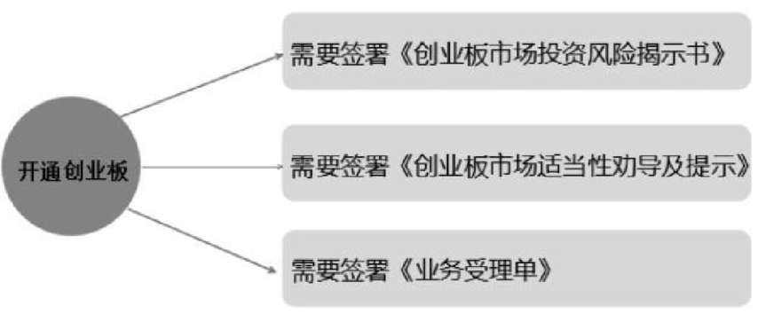

### 购买创业板股票

具有两年以上交易经验的客户在签署创业板业务两天之后才可以买卖创业板股票，不具备两年以上股票交易经验的投资者在签署创业板业务五天之后才可以买卖创业板股票。具体交易方式与上证A股并无区别。创业板股票的代码均以300开头。创业板股票的买卖流程与主板市场的股票买卖流程一致，在此不再做详细介绍。

## 炒股手续费详解

天下没有免费的午餐，天下也没有免费的市场，投资者在进行股票买卖交易的时候并不是免费的，需要支付一定的交易费用。本节将为投资者介绍股票交易费用的相关知识，以便于投资者准确认识交易成本。

### 炒股需要支付的费用

投资者在买卖证券时需要支付各种费用和税收，这些费用按收取机构可分为券商费用、交易场所费用和国家税收。目前，投资者在沪深两市买卖A股、基金、债券需要缴纳的各项费用有开户费、印花税、交易佣金、转户费用等。

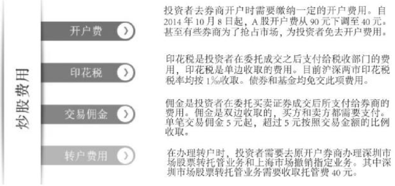

例如，小张买卖股票的时候单笔交易额达到4万元，佣金比例为0.3‰，印花税比例为1‰，则小张需要支付12元的佣金交易费用和40元的印花税。之后小张卖出1万元的股票，由于交易佣金按比例计算单笔不满5元，交易费用则按5元收取，由于印花税是单边征收，所以不需要再交印花税。

### 如何获取低佣金

在所有的股票交易费用中，佣金占据交易费用相当大的比例，并且只有佣金是可以和证券公司商谈的。对于短线交易的投资者，获取低佣金有助于降低其交易成本，少花冤枉钱。

其实，想要取得低佣金并不难，投资者可以采用以下方式。

1. **与证券经纪人谈判**

证券公司的佣金是按照投资者的交易量收取的，资金量大的投资者和资金量小但交易活跃的投资者均可以和自己的证券经纪人就佣金的费率进行商谈。

- 资金量大的投资者。资金在50万元以上就属于证券公司的大客户，证券公司对大客户门槛会有所下降，投资者可以找自己的证券经纪人要求其降低佣金比例。证券公司一般会为大客户开具0.25‰的佣金费率。
-  资金不大但是短线交易频繁的投资者。该类投资者给证券公司提供的手续费贡献甚至可能超过资金量大的投资者。因此此类交易者也可以和自己的证券经纪人谈判，证券公司一般会要求该类客户保证每月的交易量，在此交易量之上可以按较低的费率收取佣金。

2. **从网络上自助开低佣金证券账户**

经常使用股票软件或者经常查看财经网站和股票贴吧的投资者，可以在网络上、手机炒股软件上发现一些低佣金开户的广告，也可以自助在网络上开通低佣金费率的证券账户。

### 低佣金不是唯一

值得投资者注意的是，不仅要看佣金费率高低，也要综合考虑券商的服务实力。如果投资者是在网上开通的低佣金证券账户，那么只可以在该账户买卖上证A股和深证A股。由于创业板需要投资者到营业部现场办理，所以网络上不可以开通创业板业务，投资者也就无法取得买卖创业板股票的资格。此外，投资者也不可以在网络上开通融资融券业务。

综上所述，建议投资者在当地的证券公司开立证券账户的同时开通创业板业务，然后在网络上开通一个低佣金费率证券账户，在低佣金账户里面买卖沪深A股，在当地证券公司开通证券账户买卖创业板股票。

## 转户与销户

投资者如果想要换一家券商或者不想再进行股票投资，可以去营业部办理转户与销户手续。

### 证券转户流程及注意事项

投资者在交易一段时间之后，如果认为自己所签订的券商实力不够强、服务不够好，可以选择去其他证券公司新开户或者转户。如果投资者之前没有开通过融资融券账户，可以直接携带身份证和一张未曾签订三方存管协议的银行卡去其他证券公司新开证券账户；如果投资者已经在原证券公司开立融资融券账户，则需要先撤销融资融券账户，再办理转户手续。具体的转户流程和须知如下。

1. **个人投资者A股证券转户需携带的资料**

（1）证券账户本人的中华人民共和国居民身份证原件。

（2）证券账户卡原件。如果丢失可以到原券商处补办。

2. **个人投资者A股证券转户流程**

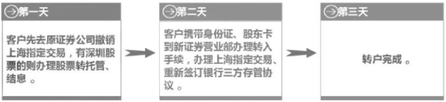

> **提示**
>
> 投资者办理转户的时间必须是周一至周五9：00—15：00。

3. **个人投资者A股证券转户须知**

（1）证券转户第一天当日不能有以下操作。

> ① 当日有股票成交。
>
> ② 当日委托过（有撤销也不行）。
>
> ③ 证券账户有负数未解决。
>
> ④ 处于新股认购期内。
>
> ⑤ 当日有银证转账。
>
> ⑥ 国债回购交易中。

（2）深圳股票转托管操作需要注意以下事项。

> ① 深市A股当日买入的或停牌的可以办理转托管，深市B股当日买入的需T＋3日才可以办理转托管。
>
> ② 深市新股申购中签但未上市的不可办理转托管。
>
> ③ 转托管股票T＋1日转入客户账户。
>
> ④ 深圳B股转托管境内居民个人所购B股不得向境外转托管。
>
> ⑤ B股配股权证不允许办理转托管。

4. **证券转户流程微调**

证券转户客户先去新营业部办理开户，再去原证券营业部办理转户，该转户流程同样有效，手续相同只需待原证券营业部撤销上海指定交易后，由新证券营业部在系统内加进上海指定交易即可。

### 证券销户

投资者证券销户必须由本人携带身份证、银行卡、股东卡（股东卡丢失可补打印）在交易时间内去原来开户的券商营业部办理，投资者领取并填写《销户申请表》即可。关于证券销户，投资者应注意以下几点。

（1）销户当天不能有股票交易。

（2）销户前一天把除股票外的现金转到银行。

（3）如果投资者销户是为了去新券商开户，则一般不建议投资者去营业部办理销户，股票账户不用放着即可，两年就会被休眠，对投资者不会造成什么影响。如果投资者销户是为了注销融资融券账户之后去新券商开户，则首先需要在原券商办理融资融券账户销户，七日之后再办理证券账户销户，然后才可以去新券商新开证券账户。

# 高手秘技

## 技巧1 提高新股中签率的妙招

> 申购新股的收益相当诱人，下面介绍一些提高中签率的技巧和方法。
>
> （1）刚开盘或收盘时下单申购的中签概率小，10：30—11：30和13：00—14：00时段的申购中签概率高。
>
> （2）资金充足的情况下，选准一只，并全仓进行申购，可以提高中签率。
>
> （3）选择大盘或冷门股，盘子大的股票，发行量大，客观上中签的机会就越大。
>
> （4）几只新股接连发行，选择靠后发行的机会大。
>
> 投资者可以登录财经网站，查看新股频道获取新股的资讯。例如金融界网站的新股频道，该频道网页包括新股申购、财经日历、新股公告、再融资一览、IPO观察站等。

## 技巧2 把股票做成T＋0交易的方法

> 所有股票都遵循“T＋1”交易制度，也就是当天买入股票之后，第二个交易日才可以卖出。那投资者一定要问，如何才可以打破这种交易制度，让其变成“T＋0”的交易模式？
>
> 首先，投资者必须对于选中的股票留有底仓，也就是事先已经持有某只股票，同时手中有一部分用于继续购买股票的资金。
>
> 其次，投资者根据对这只股票走势的判断，在交易日，高位卖出原来所持有的股票，然后待股价下跌时再买进。或者先趁股价下跌时用手里的闲置资金买进，然后等股价拉升时卖出。
> 这样就完成了当日既买又卖的交易行为。在股价波动剧烈的时候，投资者做“T＋0”交易甚至可能当日赚10％以上。

