# 股票的基础知识

**本章引语**

> 千里之行，始于足下。  ——《道德经》
>
> 想要在资本市场实现理想，就要从眼前打基础的小事做起。基础不打牢，地动又山摇，理想再美好也终将会化作泡影。不盈利事小，引火烧身的结局才令人悲伤。为了降低入市风险，投资者首先要了解股票的基础知识。

**本章要点**

> ★股票的交易单位
>
> ★股票常见风险
>
> ★常见股票术语

## 为什么购买股票

随着生活质量的提高，广大民众的腰包也渐渐鼓了起来。善于理财的投资者会考虑如何更好地利用这些暂时不用的闲置资金。不同的人有不同的投资方式，有些人喜欢把这些资金买成不动产，有些人喜欢把这些资金用来买黄金，有些人喜欢把这些资金买成银行理财产品，还有一些人会把这些资金用来投资股票市场。

究竟为什么会有人把闲置资金买成股票？买股票的好处又有哪些？

从本质上来讲，买某只股票就是把钱投资到某一公司，当该公司的股东。与购买债券及银行储蓄存款相比较，这是一种高风险行为，但与之相随的是给人们带来更大的收益。所以一些投资者，正是看中了高收益，才会踏进证券市场的大门。

具体来讲，买股票的好处主要有以下几点。

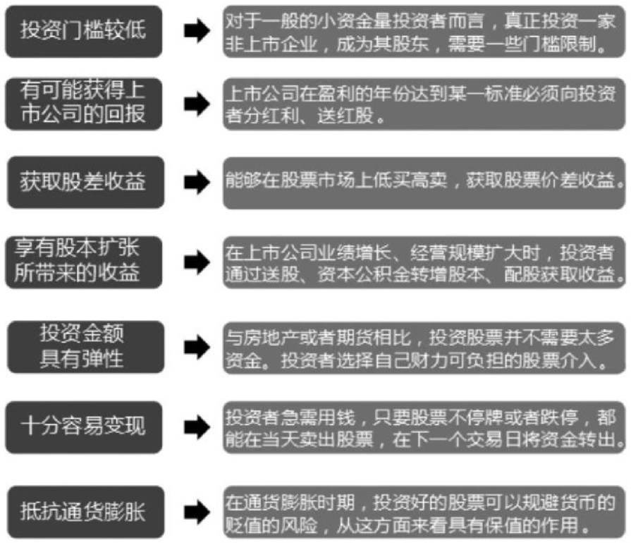

## 认识股票

投资股票并不是一件简单的事情，股市并不是所有投资者的“提款机”。投资者首先要了解什么是股票及股票的特征有哪些，真正明白股票的含义、本质和属性。

### 什么是股票

股票是股份公司发行的所有权凭证，是股份公司为筹集资金而发行给各个股东作为持股凭证并借以取得股息和红利的一种有价证券。每股股票都代表股东对企业拥有一个基本单位的所有权。股东有权按公司章程从公司领取股息和分享公司的经营红利。

股票作为一种所有权证书，最初是采取有纸化印刷方式的，如上海的老八股。时至今日，随着电子技术与信息技术的发展与应用，电子化股票应运而生。电子化股票没有纸面凭证，而是将有关事项存储于电脑中心，股东只持有一个股东账户卡，通过电脑终端可查到持有的股票品种和数量，这种电子化股票又称为无纸化股票。目前，上海证券交易所和深圳证券交易所上市的股票均采取这种方式。

在证券市场中，发行股票的公司根据不同投资主体的投资需求，发行不同种类的股票。人们通常所说的股票是指在上海、深圳证券交易所挂牌交易的A股，这些A股也可称为流通股、社会公众股、普通股。除此之外，还有B股。

### 股票的特征和作用

股票主要具有以下特征。

（1）不可偿还性。股票是一种无偿还期限的有价证券，投资者一旦认购了股票之后，就不能再要求退股，只能到二级市场卖给第三者。股票的转让只意味着公司股东的改变，并不减少公司资本。而其股价在转让时受到公司收益、公司前景、市场供求关系、经济形势等多种因素的影响。所以说，投资股票是有一定风险的。

（2）参与性。股东有权出席股东大会，选举公司董事会，参与公司重大决策。股票持有者的投资意志和享有的经济利益，通常是通过行使股东参与权来实现的。股东参与公司决策的权利大小，取决于其所持有的股份的多少。从实践看，只要股东持有的股票数量达到左右决策结果所需的实际多数时，就能掌握公司的决策控制权。
例如，某上市公司一共1亿股，流通盘7000万股，张华持有该股票6000万股，则张华持该公司60％的股份，属于绝对控股，并且是第一大股东。在召开股东大会时，张华具有该公司决策的控制权。

（3）收益性。股东可以凭其持有的股票，从公司领取股息或红利，从而获取投资的收益。至于股息或红利的多少，则取决于该公司的盈利水平和公司的盈利分配政策。股票的收益性，还表现在投资者通过低价买入和高价卖出获得价差收入。

以格力电器公司股票为例。如果在2008年10月投资241元买入该公司股票100股，到 2015年6月30日便能以63.9元的市场价格卖出100股，赚取超过26倍的利润。在通货膨胀时，股价会随着公司资产价格上升而上涨，从而避免资产贬值。因此，股票被视为在高通货膨胀时期优先选择的投资对象。

（4）流通性。股票的流通性是指股票在不同投资者之间的可交易性。流通性通常以可流通的股票数量、股票成交量及股价对交易量的敏感程度来衡量。可流通股数越多，成交量越大，价格对成交量越不敏感，股票的流通性就越好，反之就越差。

（5）价格波动性和风险性。作为证券市场上的交易对象，股票与商品一样，有自己的市场行情和市场价格。股票价格会受到诸多因素的影响，如公司经营状况、供求关系、银行利率、大众心理等。所以股价波动有很大的不确定性，也正是这种不确定性，有可能会使股票投资者遭受损失。价格波动的不确定性越大，投资风险也越大。因此，股票是一种高风险的金融产品。

例如，白酒行业在我国一直属于高利润行业，但是在2012年11月，行业中很有名气的酒鬼酒被爆“塑化剂事件”，一时间白酒板块出现跌停潮，机构纷纷抛售股票，即使是贵州茅台这样的企业，也于11月19日跌停。之后的一年多时间，白酒行业迎来了一波熊市大跌行情。如果投资者不合时机地买入了白酒行业的股票，就会导致严重损失。以贵州茅台为例，该股从2012年11月19日的开盘价166.39元跌至2014年1月10日的阶段性最低点83.77元。

对于发行者而言，股票的作用主要有以下四点。

（1）股票是筹集资金的有效手段。

股票最基本的作用就是筹集资金。上市的股份制公司可以通过发行流通股，在二级市场进行流通，进而可以将短期资金通过股票转让的形式衔接为长期资金，为企业的进一步发展提供所需的资金。没有上市的股份制公司也可以发行股票，投资者可以在证券市场之外的场外交易市场（例如银行、证券公司等）对该公司的股票进行认购。这些股份制公司发行股票的主要目的也是为企业进一步发展筹集所需的资金。

（2）通过发行股票来分散投资风险。

无论是哪一类型的企业，都会有经营风险存在。尤其是一些高新技术产业，由于产品的技术工艺尚未成熟和稳定，市场前景不明朗，在企业经营过程中，其风险就更大。这些前景难以预测的企业，当发起人不愿承担所面临的所有风险时，就会想方设法地让他人与之共担风险。发行股票组建股份制公司就是分散投资风险的好办法。即使投资失败，各个股东所承受的损失也就非常有限。

（3）通过发行股票来实现创业资本的增值。

在证券市场上，股票的发行价应当与企业的经营业绩相联系。当一家业绩优良的企业发行股票时，其发行价都要高出其每股净资产许多，若碰到二级市场的火爆行情，其溢价往往能达到每股净资产的2～3倍或者更多。而股票的溢价发行又使股份公司发起人的创业资本得到增值。例如，2015年3月24日上市的暴风科技（300431），上市开始交易之后29个交易日均“一字涨停”，公司股价上翻20倍，持有该公司股票的原始股东资产也就上翻20倍。

（4）通过股票的发行与上市，来宣传公司形象。

在牛市行情中，有更多的人参与到股票投资当中。此时，股市就成为舆论的一个热点，各大媒体每天都会实时报道股市资讯，无形之中也就提高了上市公司的知名度，起到了免费的广告宣传作用。

## 股票常见分类

股票按其票面形态、投资主体、上市地点、性质的不同，分类也有所不同。投资者应当区别不同种类的股票，选择适合自己的投资策略组合。

### 按票面形态分类

股票按票面形态进行分类，可分为记名股、无记名股、面值股和无面值股。

1. 记名股

记名股在发行时，票面上记载有股东的姓名，并记载于公司的股东名册上。记名股票的特点是，除持有者和其正式的委托代理人或合法继承人、受赠人外，任何人都不能行使其股权。此外，记名股票不能任意转让，转让时，既要将受让人的姓名、住址分别记载于股票票面，还要在公司的股东名册上办理过户手续，否则转让不能生效。这种股票有安全、不怕遗失等优点，但是转让手续烦琐。记名股若需要私自转让（例如继承和赠予等），必须在转让行为发生后马上办理过户手续。

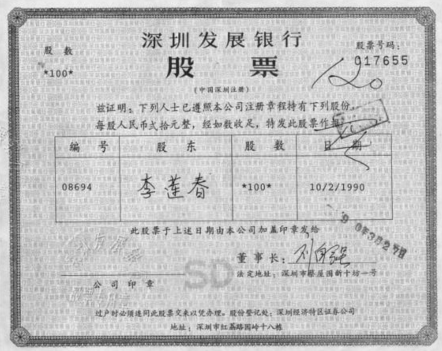

2. 无记名股

无记名股在发行时，在股票上不记载股东的姓名。持有者可自行转让股票，任何人一旦持有便可享有股东的权利，无须再通过其他方式证明自己的股东资格。这种股票转让手续简便，但也应该通过证券市场的合法交易实现转让。

3．面值股

有票面金额股票，简称金额股票或面额股票，是指在股票票面上记载一定的金额，如每股人民币100元、200元等。金额股票给股票定了一个票面价值，这样就可以很容易地确定每一股份在该股份公司中所占的比例。

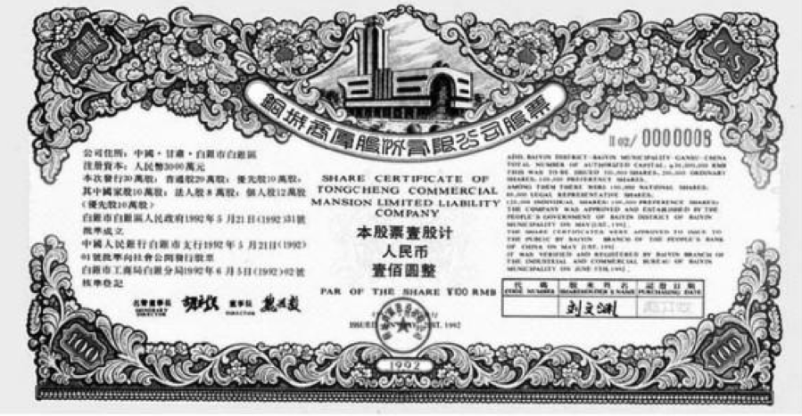

4. 无面值股

无面值股也称比例股票或无面额股票。股票发行时无票面价值记载，仅表明每股占资本总额的比例。其价值随公司财产的增减而增减。因此，这种股票的内在价值总是处于变动状态。这种股票最大的优点就是避免了公司实际资产与票面资产的背离，因为股票的面值往往是徒有虚名，人们关心的不是股票面值，而是股票价格。发行这种股票对公司管理、财务核算、法律责任等方面要求极高，因此只有在美国比较流行，而不少国家根本不允许发行。

### 按投资主体分类

我国上市公司的股份可以分为国有股、法人股和社会公众股。

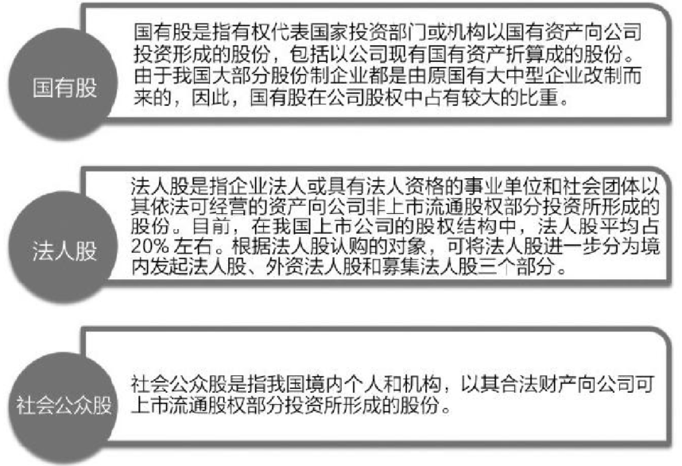

### 按上市地点分类

按照上市地点分类，国内外的股票可分为以下几类。

| 股票种类 | 基本信息 | 投资主体 |
| :------: | :------: | :------: |
|          |          |          |
|          |          |          |
|          |          |          |
|          |          |          |
|          |          |          |
|          |          |          |

### 按性质分类

1. 优先股

优先股是股份制公司发行的、在分配红利和剩余财产时比普通股具有优先权的股份，是与“普通股”概念相对而言的。优先股是无期限的有权凭证，优先股的股东一般不能在中途向公司要求退股。

优先股主要有以下几点主要特征。

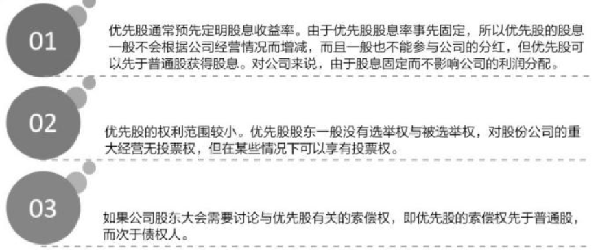

2. 普通股

普通股是随着企业利润变动而变动的一种股份，是股份公司资本构成中最普通、最基本的股份之一，是股份企业资金的基础部分。

普通股的投资收益（股息和分红）在购买时不进行约定，而是事后根据股票发行公司的经营业绩来确定。公司的经营业绩好，普通股的收益就高；反之，若经营业绩差，普通股的收益就低。普通股是股份公司资本构成中最重要、最基本的股份，也是风险最大的一种股份，但又是股票中最基本、最常见的一种。在我国证券交易所上市的股票都是普通股。

3. 后配股

后配股是在利益或利息分红及剩余财产分配时比普通股处于劣势的股票，一般是在普通股分配之后，对剩余利益进行再分配。如果公司盈利巨大并且后配股的发行数量很有限，则后配股的股东可以获取很高的收益。公司发行后配股，一般所筹措的资金不能立即产生收益，因此投资者的范围会受限制。

后配股一般在下列情况下发行。

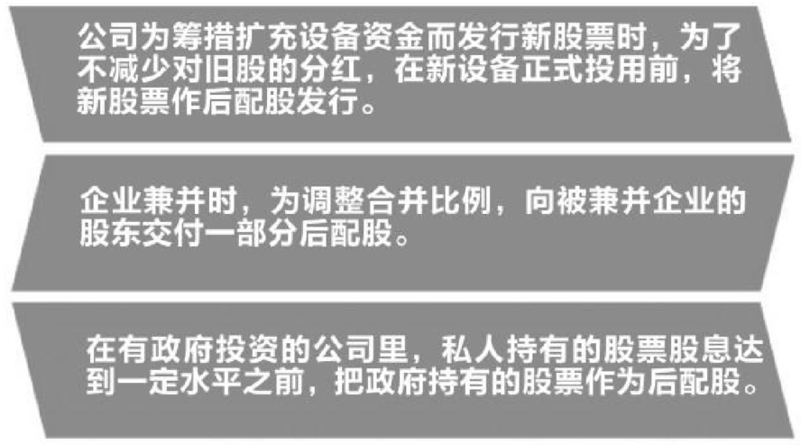

### ST股和*ST股

ST（Special Treatment）股，即“特别处理”股。该政策针对的对象是出现财务状况或其他状况异常的上市公司。1998年4月22日，沪深交易所宣布，对财务状况或其他状况出现异常的上市公司股票交易进行特别处理，由于是“特别处理”，所以在简称前冠以“ST”，因此这类股票称为ST股。如果某一只股票的名字加上ST，就是给股民一个警告，该股票存在投资风险，但这种股票风险大收益也大。

*ST意味着该股票有退市风险，需要警惕。如果上市公司向证监会递交的财务报表显示连续3年亏损，就有退市的风险。投资者在投资此类股票时需要特别谨慎。该类股票有退市的风险，但即使退市也并非意味着不可以交易，投资者可以到证券公司进行柜台交易。

2015年1月31日，上交所在《风险警示板办法》（以下简称《办法》）中增加了参与退市整理期股票交易的投资者适当性的内容。《办法》规定，个人投资者参与退市整理股票交易的，应当具备2年以上的股票交易经历，并且以本人名义开立的证券账户和资金账户内的资产（不含通过融资融券交易融入的证券和资金）在人民币50万元以上。不符合以上规定的个人投资者，仅可卖出已持有的退市整理股票，但不得买入。

深交所则规定，要求参与退市整理期股票买入交易的投资者必须具备两年以上交易经验和人民币50万元以上的证券资产规模。

> **提示**
>
> 长期看ST股票的波动率比市场基准的波动率要低；ST股票在牛市初期及牛市末期能够跑赢市场基准，中途会交替上升；在熊市初期能跑赢大盘，但是在长期熊市中，ST股票会大幅跑输市场基准。因此可以结合市场特征进行投资，在牛市初期和末期可以持有ST股票，在熊市初期可以在对冲市场风险的基础上持有ST股票，而长期熊市则不要投资ST股票。

### 股票常见代码意义

用数字表示的股票代码有不同的含义。股票代码除了区分各种股票，也有其潜在的意义，例如600*\*\*是上交所上市的股票代码，6006\*\*是最早上市的股票。一个公司的股票代码跟车牌号差不多，能够显示出这个公司的实力以及知名度。

根据上交所“证券编码实施方案”，股票代码采用6位数编制方法，前3位数用于区别证券品种，具体如下表所示。

| 代码 | 股票品种 |
| :--: | :------: |
|      |          |
|      |          |
|      |          |
|      |          |
|      |          |
|      |          |
|      |          |
|      |          |
|      |          |
|      |          |
|      |          |
|      |          |
|      |          |
|      |          |

## 股票市场与股票发行

投资者一般熟知的股票交易市场实际上是股票流通的二级市场，而股票的发行市场被称为一级市场。投资者想要认购新股或者买卖股票必须在股票市场进行。

### 了解股票市场

股票市场是指已经发行的股票转让、买卖和流通的场所，包括交易所市场和场外交易市场两大类。由于它是建立在发行市场基础上的，因此又称作二级市场。股票市场的结构和交易活动比发行市场（一级市场）更为复杂，其作用和影响力也更大。

股票市场最早起源于荷兰的阿姆斯特丹，1602年荷兰人在阿姆斯特河大桥上对东印度公司股票进行交易。后来在美国成立了史上第一家正规的股票市场。股票市场是一个国家或地区经济和金融活动的晴雨表，一国的经济处于良好态势发展，股票市场也是一派生机盎然的景象，一旦股票市场走弱，实体经济也必定受其牵连。

### 证券机构

证券机构是指依法设立的、从事证券服务业务的法人机构。在我国，证券机构主要包括证券交易所、证券公司、证券业协会、证券登记结算机构、证券监督管理机构等。

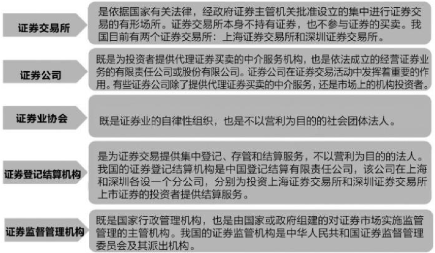

### 股份公司为什么要发行股票

股份公司如果需要资金为公司谋发展，有两种融资途径：一种是向银行或他人借贷，这属于间接融资；另一种是发行股票吸引投资者直接投资股票，这属于直接融资。对国家来说，投资者进行直接投资更为有利，因为这样既可以由整个社会来承担投资的风险，国家又能从中得到税收。此外发行股票能够起到筹集资金的作用，一方面，可以将社会公众手中闲置零散资金集中起来发挥作用，如用在国家鼓励发展的行业上去；另一方面，股份制公司更能从集资中得到好处，因为不管股东持有多少股票，只能将其转让，而不能退股，这样通过发行股票募集到的资金就成为公司的资本，而不受股东的影响。此外，发行股票使企业获得的是直接投资，降低了融资成本。

上市的股份公司通过发行股票把企业、大股东、小股东紧密联结在一起，股份公司要向全体股东负责，并且要受到社会和全体股民的监督。这样有助于促进上市公司加强经营管理，提高企业效益。因为企业的效益越好，股票的价格就越高，对投资者的吸引力也越大。

股份公司发行股票为闲置的资金找到了一条投资途径，它把人们手中零散的资金都集中起来，整合成有效的生产资金，让闲置的资金也有用武之地，在提高资金使用率的同时也推动了社会生产力的发展。从其他发达经济体的经验来看，股份制公司是市场经济的重要组成部分。虽然现在世界上各个发达国家的公司和企业各有特色，但是大型的企业基本上都采用股份制的模式。我国若想在社会主义市场经济的道路上走得更长久，发展股份制是必经之路。

### 股票上市对投资者有什么好处

股票上市不仅有利于企业本身，也对投资者有许多好处。具体的有利因素主要有以下几点。

（1）股票的流通性较好。股票的流通性越好，投资者的购买意愿就越强。如果股份公司的股票没有上市，知晓该公司的投资者就很有限，该公司的股票流通性将受到局限，不利于通过买卖该公司股票获取股差收益。

（2）增强了公司信息的透明度。有利于投资者获取上市公司的经营及财务方面的信息，了解公司的真实状况，从而有助于投资者做出正确的投资决策。

（3）成交价格更透明。上市股票的买卖，需经买卖双方的“讨价还价”，只有在买进与卖出报价基本一致时方能成交，所以证券交易所里的成交价格远比场外市场里的成交价格更加公平合理。

（4）有助于投资者了解趋势信息。目前，投资者可以通过网络直接查询股票的即时信息，及时获取上市公司的公告，这为投资提供了决策参考的依据。

（5）交易成本透明。证券交易所对经纪人所收取的佣金有统一的标准。投资者和证券经纪人可以谈判，降低其交易成本。

### 股票的发行与上市

股票发行是指符合条件的发行人以筹资或实施股利分配为目的，按照法定的程序，向投资者、原股东发行股份或无偿提供股份的行为。股票在上市发行前，上市公司与股票的代理发行证券商签订代理发行合同，确定股票发行的方式，明确各方面的责任。股票代理发行的方式按发行承担的风险不同，一般分为包销发行方式和代销发行方式两种。

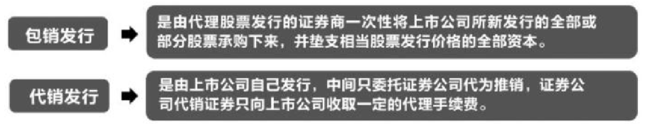

股票上市是指已经发行的股票经证券交易所批准后，在交易所公开挂牌交易的法律行为。股票上市是连接股票发行和股票交易的“桥梁”。在我国，股票公开发行后即获得上市资格。上市后，公司将能获得巨额资金投资，有利于公司研发新产品，拓展新业务。新的股票上市规则主要对信息披露和停牌制度等进行了修改，增强了信息披露的透明性，是一个很大的进步，尤其是重大事件要求公司细化、持续披露，有利于普通投资者了解公司的最新信息，抵消部分信息不对称的影响。

### 股票发行价与溢价发行

股票发行价格是股票发行时所使用的价格，也是投资者认购股票时所支付的价格。它与股票面额可以是一致的，也可以是不一致的，通常由发行公司根据股票面额、股市行情及其他有关因素决定。股票的发行价格主要有平价发行、溢价发行、折价发行、时价发行等。本节将主要介绍平价发行与溢价发行。

1. 平价发行

平价发行亦称面额发行或等价发行，是指股份公司在发行股票筹措资本时，直接以每股的票面金额作为发行价格。例如股票面额为20元或100元，则代表每股发行价格也为20元或100元。这种发行价格对发行公司而言，其所得资本与公司股本是一致的。

采用平价发行的优点是：股票发行时价格不受市场波动的影响；发行费用较低；股票容易推销，发行公司能够稳妥地筹集到资金。平价发行的缺点则主要是缺乏市场弹性，不能针对市场的股票价格波动水平，及时、合理地确定股票发行价格，从而使那些资信高、经营业绩好、股票容易销售的发行公司，无法以自身优势获得发行的溢价收益。平价发行一般在股票初次发行或在股东内部分摊增资的情况下采用。

2. 溢价发行

溢价发行是指股份公司在发行股票时以高于股票面额的价格发行。例如，某股票面额为10元，发行价格为50元。溢价发行是一种对发行公司十分有利的发行价格形式。它能够让发行公司在发行股票的过程中获得一笔创业利润，使所筹资本高于公司股本。目前，许多国家新上市的股票一般都是采用溢价发行的价格形式，发行公司所获得的溢价收入列入资本公积金。

### 买壳上市和借壳上市

 

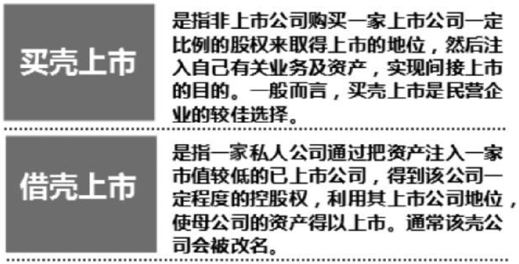

### 中概股回归

概念股是与业绩股相对而言的。业绩股需要有良好的业绩支撑。概念股则是依靠某一种题材（如资产重组概念、智慧城市概念等）支撑价格。

中国概念股就是外资因为看好中国经济成长而对所有在海外上市的中国股票的总称。中国概念股是相对于海外市场来说的，同一个公司可以在不同的股票市场分别上市，所以，某些中国概念股公司也可能在国内同时上市。

在2015年之前，由于中国证券监督管理委员会对上市公司各项硬性规定，许多高科技股份公司达不到证监会的要求，又为了满足融资需求，这些企业只得选择到国外市场进行上市。例如，许多互联网企业纷纷选择去美国纳斯达克证券交易所上市。对于互联网企业来讲，虽然美国发行证券对公司业绩没有硬性要求，流程简单，但是去美国上市也有其不良之处。在美国上市的公司估值一般较低，因为中国和海外的互联网公司商业模式无法完全对比，所以中国概念股公司都觉得自己的估值被低估，无法享受到国内的资本市场红利。外加盈率低、融资规模小、监管严格等因素，许多在国外上市的企业也在纷纷考虑回归国内市场。

自2015年年初以来，互联网公司受到了政府的高度重视，政府提出了“互联网＋”的国家战略并且制定了实施方案，政府希望依靠互联网来提升传统产业的效率，期待“能源互联网”和“工业互联网”这些概念能够逐渐落地，最终通过“大数据”“云计算”这些概念发挥更大的对于传统行业的改造作用。因此提出鼓励没有盈利的互联网公司在境内上市，这使得回归中国资本市场成为一个时髦的选择。

### 股票的价格与价值

从政治经济学原理可知，任何商品的价格都要围绕其价值上下波动。股票也不例外，但是股票又不同于普通的商品，股票的价格还反映投资者对其的预期。

1. 股票价值

由于股票是虚拟资本的一种形式，因此它本身并没有价值。股票仅是一个拥有某种所有权的凭证。股票能够有价，主要有两方面的原因：一方面是因为持有股票的股东可以行使股东权利，参加股东大会并且对股份公司的经营决策施加影响；另一方面投资者享有参与分红派息的权利，可以从中获得相应的经济利益。综上所述，股票的价值主要取决于公司本身的盈利能力和未来发展的前景。上市公司盈利能力越强，相应的股票价值就越高；上市公司盈利能力越差，相应的股票价值就越低。如果公司发展前景非常好，不断开发新市场，研发新产品，投资规模不断扩大，效益不断提高，就能够不断分红，那么股票自身的价值就越高，反之则越低。

2. 股票价格

虽然股票本身不具有价值，但它可以当作商品买卖，并且有一定的价格。股票价格又称为股票行市，是指股票在证券市场上买卖的价格。股票价格主要分为理论价格与市场价格。股票的理论价格，就是为获得股息、红利收入的请求权而付出的代价，是股息资本化的表现。股票的市场价格即股票在股票市场上买卖的价格。股票的理论价格并不等于股票的市场价格，二者之间有相当大的差距。股票的理论价格为预测股票市场价格的变动趋势提供了重要的依据，这也是股票市场价格形成的一个基础性因素。

## 股票与债券、储蓄和基金有何不同

我国的金融市场为个人投资者提供了银行存款、债券和股票等多种理财方式。这些投资理财方式各有优劣，投资者可以结合自身的需求选择相应的理财方式。

### 股票与债券的区别

债券是一种有价证券，是社会各类经济主体为筹集资金而向债券投资者出具的、承诺按一定利率定期支付利息的、到期偿还本金的债权债务凭证，包括票面价值、到期期限、票面利率、发行者名称四个要素。债券具有偿还性、流动性、安全性和收益性四种特性。

股票和债券虽然都是有价证券，都可以作为筹资的手段和投资工具，但两者却有明显的区别，如下表所示。

| 主要区别 | 股票 | 债券 |
| :------: | :--: | :--: |
|          |      |      |
|          |      |      |
|          |      |      |
|          |      |      |
|          |      |      |
|          |      |      |

### 股票与储蓄的区别

股票与储蓄存款这两种行为在形式上均表现为，货币所有人将一定的资金交付给股份公司或银行机构，并获取相应的利益。但两者在本质上是不同的，具体如下表所示。

|      |      |      |
| ---- | ---- | ---- |
|      |      |      |
|      |      |      |
|      |      |      |
|      |      |      |
|      |      |      |

### 股票与基金的区别

从广义上说，基金是指为了某种目的而设立的具有一定数量的资金。主要包括信托投资基金、公积金、保险基金、退休基金及各种基金会的基金。人们平常所说的基金主要是指证券投资基金。投资基金是一种信托投资方式，它集中了投资者众多分散资金而交由专门的投资者管理机构进行范围广泛的投资与管理以获取资金增值，投资者按出资比例分享收益并承担风险。

许多刚入市的投资者对基金和股票二者之间的认识不够充分，有些甚至认为购买股票和购买基金是一回事，其实二者之间是不同的，如下表所示。

|      |      |      |
| ---- | ---- | ---- |
|      |      |      |
|      |      |      |
|      |      |      |

## 股票交易的单位

不同股票市场的股票交易规则也不同，我国A股市场对股票交易的最小单位及最小报价单位都有明确的规定，投资者要按照规定进行交易。

### 最小报价单位

最小报价单位是指证券买卖申报价格的最小变动单位。沪深两市的价格最小变动单位如下表所示。

上海证券交易所各品种价格变动最小单位

|      |      |
| ---- | ---- |
|      |      |
|      |      |
|      |      |
|      |      |

深圳证券交易所各品种价格变动最小单位

|      |      |
| ---- | ---- |
|      |      |
|      |      |
|      |      |

例如，A股票现价5.01元，李菲想要马上买入A股票，可以提高一个申报价格，以5.02元提交申报买入。按照价格优先原则，如果没有价位比李菲的价格更高的申报，将优先成交李菲的申报。

### 最小交易单位

沪深两市股票买卖申报最小交易单位均为一手，一手即为100股。账户因为送股等原因而出现不到100股的零散股数，可以一次卖出。但是在买入时只可以按手数委托。

如果下单时遇到对方卖出股票不够买入数，如某投资者A下单买入300股，卖出方B因某些原因多出30股而一次卖出230股，若无其他报价时，投资者A就买入成交230股，另外70股没有成交。当然，这只属于个别案例。

## 股票指数

世界各国的股票市场除了有股票的价格走势外，也会根据所有股票或者具有代表性的股票编制不同的股票指数。股票指数反映的是某一市场或者某一类股票的整体趋势。投资者在进行投资股票的时候，可以结合股票指数的走势，调整相应的投资策略。

### 什么是股票指数

股票指数即股票价格指数，是描述股票市场总的价格水平变化的指标。它是选取有代表性的一组股票，把它们的价格进行加权平均，通过一定计算得到的。不同指数选取的股票和计算方法是不同的。

### 上证指数

在我国，上证指数是最重要的指数之一。上海证券综合指数简称“上证综指”，其样本股是全部在上海证券交易所上市的股票，包括A股和B股，它反映了上海证券交易所市场总体的波动情况。上证指数本身不可以交易，但是上证指数是中国股市大趋势的晴雨表，对于投资者而言意义重大。

上证综合指数等以样本股的发行股本数为权数进行加权计算，计算公式为：报告期指数=（报告期成分股的总市值/基期）×基期指数。其中，总市值= Σ（股价×发行股数）。成分股中的B股在计算上证B股指数时，价格采用美元计算。成分股中的B股在计算其他指数时，价格按适用汇率（中国外汇交易中心每周最后一个交易日的人民币兑美元的中间价）折算成人民币。

上证指数的指数代码为“000001”，投资者也可以使用快捷键，从键盘输入数字“03”，然后就可以快速查看上证指数的行情走势。

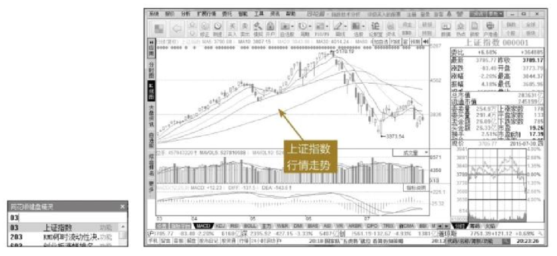

### 深证指数

深证指数是指由深圳证券交易所编制的股票指数，该股票指数的计算方法基本与上证指数相同，其样本为所有在深圳证券交易所挂牌上市的股票，权数为股票的总股本。由于以所有挂牌的上市公司为样本，其代表性非常广泛，与深圳股市的行情同步发布，是股民和专业人员研判深圳股市股票价格变化趋势必不可少的参考依据。

深证指数包括深证成指、深证A指、深证B指、深证综合指数，如下图所示。

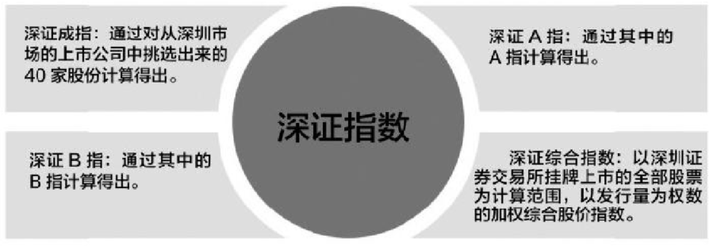

对投资者最具有参考价值的一般为深证成指，其指数代码为“399001”。投资者也可以从键盘输入“04”，使用快捷键快速查找到深证成指查看行情。

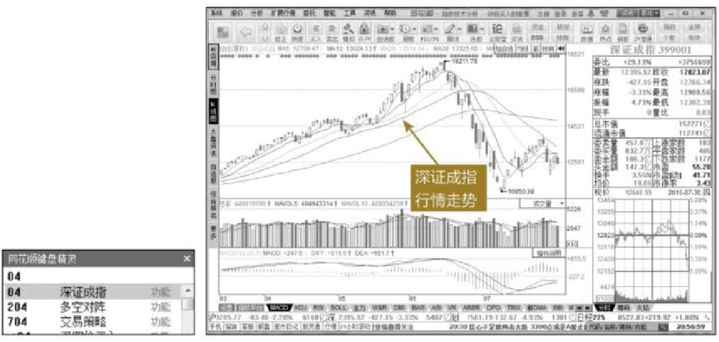

除此之外，深证A指的指数代码为“399107”，深证B指的指数代码为“399108”，深证综合指数的指数代码为“399106”。

### 上证180指数

上证180指数（又称上证成分指数）是上海证券交易所对原上证30指数进行调整并更名而成的，其样本股是在所有A股股票中抽取最具市场代表性的180种样本股票，自2002年7月1日起正式发布。作为上证指数系列核心的上证180指数的编制方案，其目的在于建立一个反映上海证券市场的概貌和运行状况、具有可操作性和投资性、能够作为投资评价尺度及金融衍生产品基础的基准指数。

上证180指数与通常计算的上证综指之间的最大区别在于，它属于成分指数而不是综合指数。成分指数是根据科学客观的选样方法挑选出的样本股形成的指数，所以能更准确地认识和评价市场。而综合指数包含了市场上所有的股票，在反映市场状况上就存在不少缺陷。例如，目前上证综指采用全市场平均市盈率标准，将不少业绩差、规模小、股价过高的股票包含进来，导致较高的市盈率。上证180指数的推出，将有利于推出指数化投资，引导投资者理性投资，并促进市场对“蓝筹股”的关注。

投资者可以通过键盘输入指数代码“000010”或者首字母缩写“SZ180”，快速查找到上证180指数来查看行情。

### 上证50指数

上证50指数是根据科学客观的方法，挑选上海证券市场规模大、流动性好的最具代表性的50只股票组成样本股，以综合反映上海证券市场最具市场影响力的一批优质大盘企业的整体状况。上证50可以作为价值蓝筹股的代名词，是反映主流机构持仓的风向标。上证50指数代码为“000016”。

### 沪深300指数

沪深300指数由沪深证券交易所于2005年4月8日联合发布，反映沪深300指数编制目标和运行状况，并能够作为投资业绩的评价标准，为指数化投资和指数衍生产品创新提供基础条件。目前，沪深300指数是我国股指期货的标的物，这也就意味着股指期货的走势紧紧跟随沪深300指数走势。

虽然沪深两个市场各自均有独立的综合指数和成分指数，并且这些指数在投资者中有较高的认同度，但市场缺乏反映沪深市场整体走势的跨市场指数。因此沪深300指数的推出切合了市场需求，适应了投资者结构的变化，为市场增加了一项用于观察市场走势的指标，也进一步为市场产品创新提供了条件。沪深300指数代码为“399300”。

### 创业板指数

创业板是专为暂时无法在主板上市的创业型企业、中小企业和高科技产业企业等需要进行融资和发展的企业提供融资途径和成长空间的证券交易市场，是对主板市场的重要补充。在创业板市场上市的公司大多从事高科技业务，具有较高的成长性，往往成立时间较短，规模较小，业绩也不突出，但有很大的成长空间。可以说，创业板是一个门槛低、风险大、监管严格的股票市场，但也是一个孵化科技型、成长型企业的摇篮。

创业板指数，也称为“加权平均指数”，就是以起始日为一个基准点，按照创业板所有股票的流通市值，一个一个计算当天的股价，再加权平均，与开板之日的“基准点”比较。创业板指数是整个创业板股票的风向标，投资者可以结合创业板指数判断其中的个股趋势行情。创业板指数代码为“399006”。

### 中小板指数

中小板块即中小企业板，是指流通盘大约1亿元以下的创业板块，是相对于主板市场而言的。有些企业的条件达不到主板市场的要求，所以只能在中小板市场上市。采用中小板企业的股票进行编制的成分指数就是中小板指。

中小板指全称为中小企业板指数，其初始成分股由前100只上市股票构成，此后需要对入围的股票进行排序选出成分股。中小板指委托深圳证券信息有限公司编制、维护和管理，由深圳证券交易所发布，其指数代码为“399005”。

创业板指数、深证成指、中小板指数共同构成反映深交所上市股票运行情况的核心指数。

### 恒生指数

恒生指数是香港股市价格的重要指标，该指数由香港恒生银行全资附属的恒生指数服务有限公司编制，是以香港股票市场中的50家上市股票为成分股样本，以其发行量为权数的加权平均股价指数，是反映香港股市价幅趋势最有影响的一种股价指数。恒生指数由恒生银行下属恒生指数有限公司负责计算并按季检讨，公布成分股调整。

### 其他主要指数

（1）日经指数。是由日本经济新闻社编制公布的反映日本东京证券交易所股票价格变动的股票价格平均指数。该指数的前身为1950年9月开始编制的“东证修正平均股价”。1975年5月1日，日本经济新闻社向美国道琼斯公司买进商标，采用修正的美国道琼斯公司股票价格平均数的计算方式编制。

（2）纳斯达克综合指数。是反映纳斯达克证券市场行情变化的股票价格平均指数，基本指数为100。纳斯达克的上市公司涵盖所有新技术行业，包括软件和计算机、电信、生物技术、零售和批发贸易等。主要由美国的数百家发展最快的先进技术、电信和生物公司组成，包括微软、英特尔、美国在线、雅虎这些家喻户晓的高科技公司，因而成为美国“新经济”的代名词。

（3）道琼斯指数。是世界上历史悠久的股票指数，它的全称为股价平均指数。通常人们所说的道琼斯指数是指道琼斯指数四组中的第一组道琼斯工业平均指数。如果说纳斯达克指数反映的是美国的高科技、高成长性股票的综合指数，那么道琼斯工业指数反映的是美国股票市场上工业构成的发展情况。

## 股票的常见风险

股市风险是指投资者买入股票后在预定的时间内不能以高于买入价的价格将股票卖出，这将导致浮动亏损，如果以低于买入价的现价卖出股票，将会造成实际损失。股市的风险主要分为两类：系统性风险和非系统性风险。本节主要介绍系统性风险。

### 购买力风险

由物价的变化导致资金实际购买力的不确定性，称为购买力风险，或通货膨胀风险。一般理论认为，轻微通货膨胀会刺激投资需求的增长，从而带动股市的活跃；当通货膨胀超过一定比例时，由于未来的投资回报将大幅减少，货币的购买力下降，也就是投资的实际收益下降，将给投资人带来损失。

### 宏观经济风险

宏观经济风险主要是宏观经济因素的变化、经济政策变化、经济的周期性波动以及国际经济因素的变化给股票投资者可能带来的意外收益或损失。宏观经济因素的变动会给证券市场的运作以及股份制企业的经营带来重大影响。例如经济体制的转轨、企业制度的改革、加入世界贸易组织、人民币的自由兑换等。

### 政策风险

经济政策和管理措施可能会造成股票收益的损失，这在新兴股市中表现得尤为突出。如财税政策的变化，可以影响到公司的利润；股市的交易政策变化，也可以直接影响到股票的价格。此外还有一些看似无关的政策，如房改政策，也可能会影响到股票市场的资金供求关系。

### 市场风险

市场风险是股票投资活动中最普通、最常见的风险之一，是由股票价格的涨落直接引起的。尤其在新兴市场上，造成股市波动的因素更为复杂，价格波动大，市场风险也大。

### 利率风险

在股票市场上，股票的交易价格是按市场价格进行，而不是按其票面价值进行交易的。市场价格的变化也随时受市场利率水平的影响。当利率向上调整时，股票的相对投资价值将会下降，从而导致整个股价下滑。

## 常见的股票术语

### 利空、利多

利空是指能够促使股价下跌的信息，如股票上市公司经营业绩恶化、银行紧缩、银行利率调高、经济衰退、通货膨胀、天灾人祸等，以及其他政治、经济、军事、外交等方面促使股价下跌的不利消息。

利多又叫利好，是指刺激股价上涨的信息，如股票上市公司经营业绩好转、银行利率降低、社会资金充足、银行信贷资金放宽、市场繁荣等，以及其他政治、经济、军事、外交等方面对股价上涨有利的信息。利多消息大部分是来自于公司内部，如营业收入创新高、接获某大订单等。

### 洗盘、做多、做空

洗盘是常见的股市术语。洗盘可以出现在主力任何一个区域内，基本目的无非是为了清理市场多余的浮动筹码，抬高市场整体持仓成本。主力为达到炒作目的，会尽量让途中低价买进、意志不坚的散户抛出股票，以减轻上涨压力，同时让持股者的平均价位升高，以利于达到牟取暴利的目的。

做多是股票、外汇或期货等金融市场术语，即看好股票、外汇或期货等未来的上涨前景而买入持有等待上涨获利。做多就是做多头，多头对市场判断是上涨，就会立即买入股票，所以做多就是买入股票、外汇或期货等。

做空又称空头，既是一种股票、期货等的投资术语，也是股票、期货等市场的一种操作模式。与多头相对，理论上是先借货卖出，再买进归还。做空是指预期未来行情下跌，将手中股票按目前价格卖出，待行情跌后买进，获取差价利润。其交易行为特点为先卖后买。实际上有点像商业中的赊货交易模式。这种模式在价格下跌的波段中能够获利，就是先在高位借货进来卖出，等跌了之后再买进归还。例如预计某一股票未来会跌，就在当期价位高时将此股票（实际交易是买入看跌的合约）卖出，再到股价跌到一定程度时买进，以现价还给卖方，产生的差价就是利润。

### 庄家、主力

庄家，指能影响金融证券市场行情的大户投资者。庄家通常会占有50％以上的发行量，但有时庄家控量不一定达到50％，看各品种而定，一般10％至30％即可控盘。庄家通常是持有大量流通股的股东，庄家操作某股票时可以影响甚至控制它在二级场的股价。庄家和散户是一个相对概念。

主力，是指主要的力量，一般也指股票中的庄家。形容市场上或一只股票里有一个或多个操纵价格的人或机构，以引导市场或股价向某个方向运行。一般股票主力和股市庄家有很大的相似性。

### 集合竞价、连续竞价

集合竞价是指在股票每个交易日9：15—9：25，由投资者按照自己所能接受的心理价格自由的进行买卖申请。
连续竞价，是指对申报的每一笔买卖委托，由电脑交易系统按照以下两种情况产生成交价：最高买进申报与最低卖出申报相同，则该价格即为成交价格；买入申报高于卖出申报时，申报在先的价格即为成交价格。

### 分红、配股

分红是股份公司在盈利时每年按股票份额的一定比例支付给投资者的红利，是上市公司对股东的投资回报。分红前需要按规定提取法定公积金、公益金等项目。通常股东得到分红后会继续投资该企业达到复利的目的。

配股是上市公司向原股东发行新股、筹集资金的行为。按照惯例，公司配股时新股的认购权按照原有股权比例在原股东之间分配，即原股东拥有优先认购权。

### 除权、除息、填权、贴权

除权指的是股票的发行公司依一定比例分配股票给股东，作为股票股利，会增加公司的总股数。例如，配股比率为20/100，表示原持有100股的股东，在除权后，股东持有股数会增加为120股。此时，公司总股数膨胀了20％。除权的股票会在除权当日暂时更改股票名称，改为“XR××”。

除了股票股利之外，发行公司也可分配“现金股利”给股东，此时则称为除息。当上市公司宣布上年度分红派息方案并获董事会及证监会批准后，即可确定股权登记日。在股权登记日交易（包括股权登记日）后手中仍持有这种股票的投资者均有享受分红派息的权力。除息的股票会在除息当日暂时更改股票名称，改为“DR××”。

在除权除息后的一段时间里，如果多数人对该股看好，该只股票交易市价高于除权（除息）基准价，这种行情称为填权。例如，互联网B（150195）在2015年3月23日至5月27日，短短两个月的时间已经将原来的除权缺口完全填满。

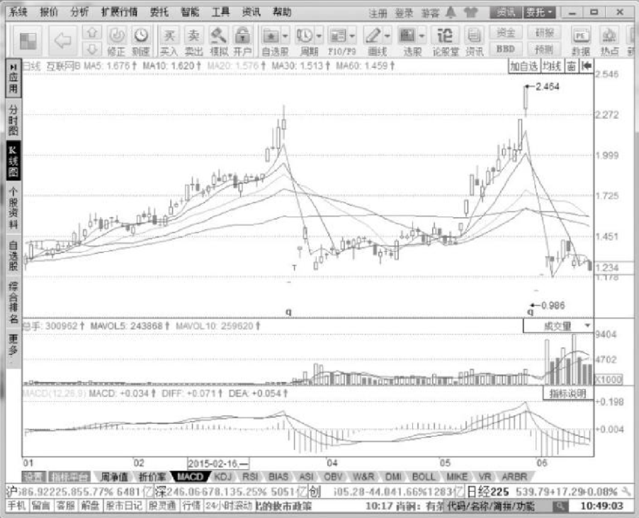

贴权是指在除权除息后的一段时间里，交易市价低于除权（除息）基准价，即股价比除权除息日的收盘价有所下降。例如，天玑科技（300245）在2015年5月28日至7月3日之间的行情，该公司股票在除权之后一路下跌，属于明显的贴权行情。

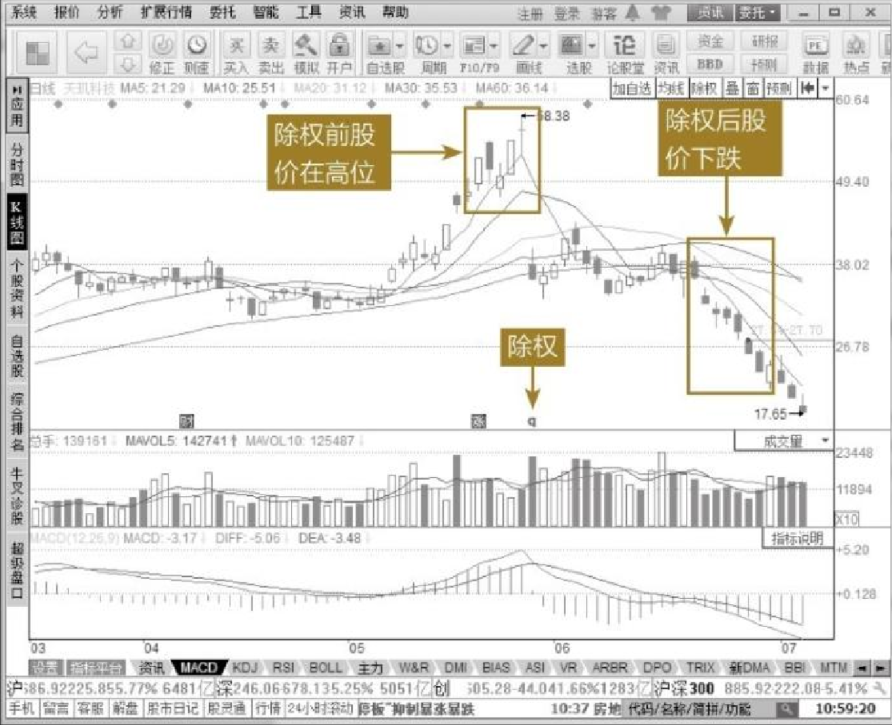

### 股权登记日

上市公司在送股、派息、配股或召开股东大会的时候，需要定出某一天，界定哪些主体可以参加分红、参与配股或具有投票权利，定出的这一天就是股权登记日。也就是说，在股权登记日这一天收盘时仍持有或买进该公司的股票的投资者，是可以享有此次分红或参与此次配股或参加此次股东大会的股东，这部分股东名册由证券登记公司统计在案，届时将所应送的红股、现金红利或者配股权划到这部分股东的账上。

打开同花顺软件的【资讯】>【股票】>【操盘必读】菜单命令，即可查询即将除权除息的股票信息，如下图所示。

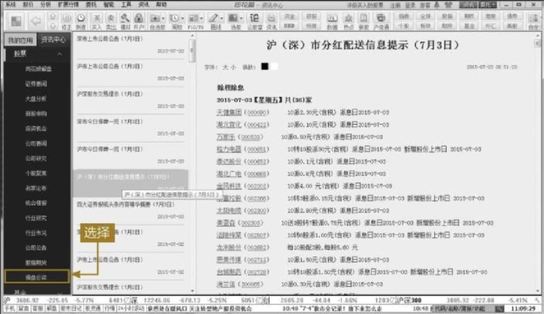

### 市盈率、市净率

市盈率是某种股票每股市价与每股盈利的比率。市场广泛谈及的市盈率通常指的是静态市盈率，通常用来作为比较不同价格的股票是否被高估或者低估的指标。用市盈率衡量一家公司股票的质地时，并非总是准确的。一般认为，如果一家公司股票的市盈率过高，那么该股票的价格具有泡沫，价值被高估。当一家公司增长迅速以及未来的业绩增长非常看好时，利用市盈率比较不同股票的投资价值时，这些股票必须属于同一个行业，因为此时公司的每股收益比较接近，相互比较才有效。

市净率指的是每股股价与每股净资产的比率。市净率可用于投资分析，一般来说市净率较低的股票，投资价值较高；相反，则投资价值较低。但在判断投资价值时，还要考虑当时的市场环境以及公司的经营情况、盈利能力等因素。

### 一级市场、二级市场

在金融市场方面的一级市场是筹集资金的公司或政府机构将其新发行的股票和债券等证券销售给最初购买者的金融市场。对于证券市场来讲，一级市场是证券发行的市场，销售证券的收入属于发行该证券的股份公司。

二级市场又称为证券交易市场、次级市场，是指对已经发行的证券进行买卖、转让和流通的市场。在二级市场上销售证券的收入属于出售证券的投资者，而不属于发行该证券的公司。

### 基本面、技术面

基本面分析是指对宏观经济、行业以及上市公司基本情况等各种指标进行的综合性分析，包括对公司经营理念策略、公司报表等的分析。它包括宏观经济运行态势和上市公司基本情况。宏观经济运行态势反映出上市公司整体经营业绩，也为上市公司进一步的发展确定了背景，因此宏观经济与上市公司及相应的股票价格有密切的关系。上市公司的基本面包括财务状况、盈利状况、市场占有率、经营管理体制、股东构成、人才构成等各个方面。

技术面指反映股价变化的技术指标、走势形态以及K线组合等。技术分析有三个前提假设：

① 市场行为包容一切信息；

② 价格变化有一定的趋势或规律；

③ 历史会重演。

### 牛市、熊市

牛市一般指多头市场，是指股价的基本趋势持续上升时形成的投机者不断买进股票、需求大于供给的市场现象。例如，我国在2006年年初至2007年年底这段时间就属于牛市。

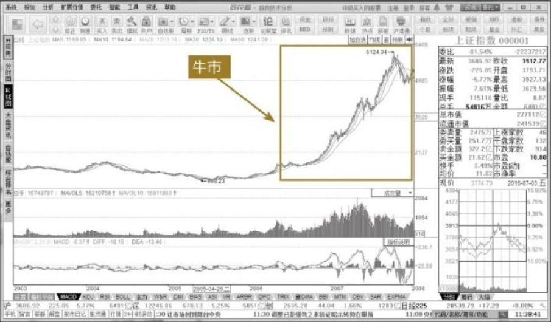

熊市一般指空头市场，证券市场总体的运行趋势向下，其间虽有反弹，但一波却比一波低，属于价格持续走低的市场。部分投资人开始恐慌，纷纷卖出手中持股，都保持空仓观望。此时，空方在市场中是占主导地位的，看好后市的氛围严重不足。在这样的市场中，绝大多数人是亏损的，所以说在熊市市场中的操作尤其困难。我国在2007年年底至2008年年底这段时间就属于熊市。

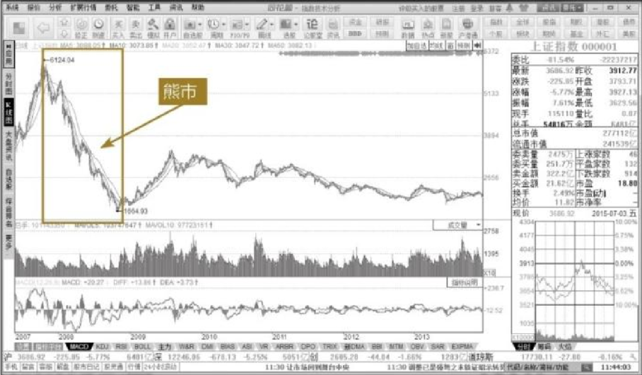

### 涨停板、跌停板

目前，我国的证券市场实行涨跌停板限制制度，普通A股、B股、ETF基金、LOF基金等均有上涨和下跌的限制。

涨停板是指证券市场中交易当天股价的最高限度。涨停板时的股价叫涨停板价。我国证券市场的涨跌幅以10％为限，当日涨幅达到10％则称为涨停板。ST类股的涨跌幅设定为5％，上涨达到5％即为涨停板。达到涨停板后，股票当日价格停止上涨，但非停止交易。

涨停板又分为一般的涨停和“一字涨停”。一般涨停是指开盘价不是涨停价格，经过一天的交易，在收盘之前涨至涨停板价。“一字涨停”是开市即封涨停的股票，势头较猛，只要当天涨停板不被打开，第二日仍然有上冲动力。下图为兰石重装（603169）2014年10月至12月的行情。该股票在上市之后就一路“一字涨停”。

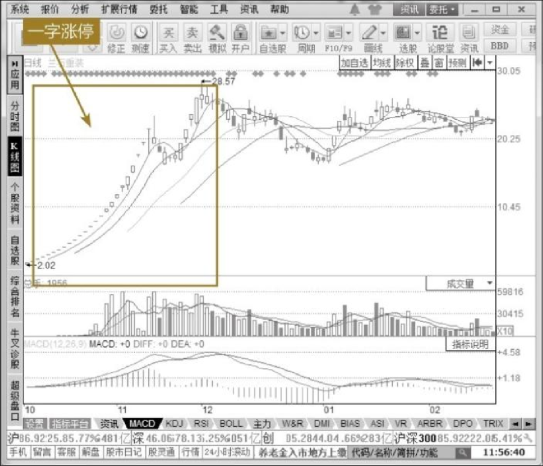

跌停板是与涨停板相对的概念，是指股价在一天中相对前一日收盘价的最大跌幅，我国目前规定当日最大跌幅为10％。ST和*ST当日最大跌幅为5％。与涨停板相似，跌停板也有普通跌停和“一字跌停”之分。

# 高手秘技

## 技巧1 投资者如何参与集合竞价

> 由于9：15—9：20这五分钟属于开放式集合竞价，允许撤销委托买进和委托卖出的申报，因此投资者看到的成交量有可能是虚假的。有些主力会在9：15—9：30撤单，然后把筹码成功地卖给投资者。因此投资者一旦发现主力有撤单行为，一定马上也跟着撤单。
>
> 如果投资者想要抢涨停板，9：20—9：25这五分钟很重要。虽然此时投资者可以委托买卖，但是这五分钟撤单是无效的，买进委托都是真实的。投资者可以通过键盘输入“61”查看上海A股涨幅排名，输入“63”查看深圳A股涨幅排名。
>
> 投资者在9：25—9：30这五分钟可以委托买卖，也可以撤单，只是这五分钟主机不处理，如果投资者对自己手中股票的成交卖出有把握，资金在9：25就可以使用。投资者此时可以调仓换股，在9：26买进另一只看好的股票。

## 技巧2 沪深股票型基金的投资方法

> 股票型基金与其他类型的基金相比波动幅度最大。如果基金投资的股票组合中有几只股票涨停，则该基金往往也会冲击涨停。当然，如果该基金投资的股票组合中有几只股票跌停，该基金往往也会跌停。因此，该类型的基金具有放大收益与亏损的功能。因此在牛市初期买入股票型基金，可以跑赢大盘，而在熊市当中则要远离。
>
> 如果投资者对某一个板块非常看好却不知道如何在该板块中选出牛股，可以买入该板块的股票型基金。常见的有军工B、医药B、信息B、证券B、新能源车B等。投资者可以通过股票分析软件查看相应的沪深股票型基金。例如在同花顺软件中，单击【拓展行情】【基金】【沪深基金】即可查询到沪深股票型基金的信息。

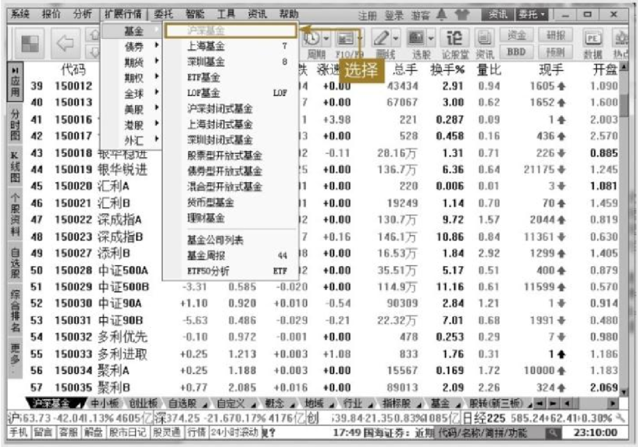