# 影响股价波动的主要因素

**本章引语**

> 一切诸果，皆从因起。 
>
> ——《华严经》
>
> 股市上涨还是下跌都有原因。从表面上看，证券市场上供求双方的博弈影响股票的走势；从宏观角度分析，国家政策对股市的影响最为直接。当然，国家政策并非引导股市走向的唯一因素，除此之外，股市还受到国内外经济环境、行业所处经济周期的阶段、证监会相关新政策、媒体的社论观点、机构和普通投资者的偏好等因素的影响。

**本章要点**

> ★宏观因素对股市的影响
>
> ★分红、价值、市盈率对股票价格的影响
>
> ★媒体报道对股市的影响

## 宏观因素对股市的影响

对于股市走向的分析，投资者首先要从国际层面、国家层面等宏观视角对经济形势有个最初的大致判断。在对经济大环境有预判之后，再对个股进行筛选。

### 国家政策

国家政策主要包括财政政策、货币政策、产业政策等。投资者必须对国家政策动向保持关注，才能捕捉到市场热点。在了解国家政策影响的同时，关注国家政策变化，就能及时规避政策风险，捕捉到大的投资机会。

1. 国家政策直接对股市的影响

我国从计划经济体制转变为市场经济体制并非一蹴而就，而是需要经历一段漫长的发展过程。虽然部分传统行业现在都已经由市场进行自发调节，但是国家依然把控着关乎国计民生的关键行业。因此从宏观层面来看，国家的宏观经济政策对于某些行业甚至整个资本市场都会产生影响。

我国的资本市场起步较晚，发展不够成熟，导致市场上投机的氛围较为浓厚，为了避免资本市场出现大起大落，尤其是让中小投资者可以逐步建立起成熟的投资理念，国家相关部委也会从政策方面对股市的暴涨暴跌进行相关调控。

例如，在2015年7月A股由于前期的不理智上涨，导致中小板、创业板和某些主板股票的估值过高，有些个股泡沫过于严重，市盈率甚至高达几百倍。因此在阶段性调整的时候，触及了场外伞形信托和配资公司的风险警示位，继而引发踩踏事件。由于股价继续下跌将可能会引发整个金融系统的系统性风险，所以我国当机立断，开展救市措施。证监会于2015年7月8日晚间发布公告称，从即日起6个月内，上市公司控股股东和持股5％以上股东（以下并称“大股东”）及董事、监事、高级管理人员不得通过二级市场减持本公司股份。上市公司大股东及董事、监事、高级管理人员违反上述规定减持本公司股份的，中国证监会将给予严肃处理。此举有效地约束了大股东和高管的套现行为，减轻了市场的抛压，提升了小股东的持股信心。沪指在3日内从3373.54点快速反弹至最高4030.19点。

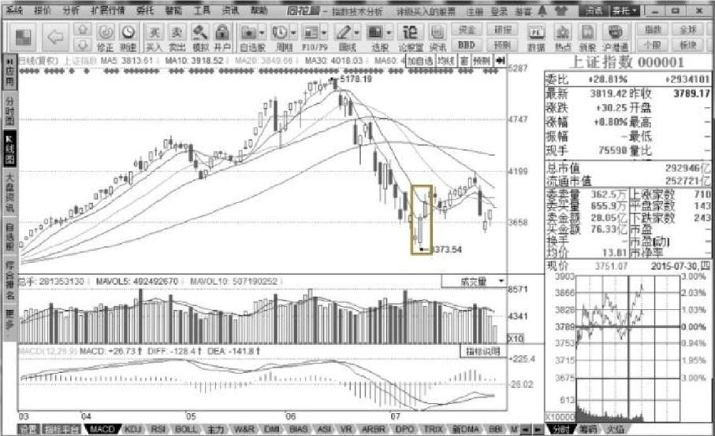

> **提示**
>
> 国家政策针对股市的变动一般都会带来股市的变动，如果有迹象显示国家可能出台利空的政策，就应该早早规避，空仓等待机会，绝不要抱侥幸心理；对国家出台的利好，如果引起股市快速波动，并且伴随量能的放大，可以做短线，实现收益最大化。

2. 货币政策对股市的影响

货币政策是央行调控宏观经济的基本手段之一。由于社会总供给和总需求的平衡与货币供给总量及货币需求总量的平衡密切相关，因此宏观经济调控的重点一定会立足于货币供给量。

货币政策对股票价格的影响为大众所周知。紧缩的货币政策会减少社会上的货币供给总量，不利于经济发展，不利于证券市场的活跃，增加了企业的成本负担，并减少了市场中的活跃资金总量，对股票价格上涨很不利。与之相反，宽松的货币政策会扩大社会上货币供给总量，对经济发展和证券市场交易有着积极影响，企业融资成本相对降低，同时也为市场提供了相对充裕的资金，为市场行情的开展提供了充足的“弹药”。除此之外，货币政策对人们的心理影响非常大，这种影响对股市的涨跌又将产生极大的推动作用。

例如，2015年2月5日起央行下调金融机构人民币存款准备金率0.5个百分点。同年4月央行第二次降准。各类存款类金融机构人民币存款准备金率下调1个百分点。下图为上证指数2015年2月至4月的走势，从图中可以看到，在宽松的货币政策下，股指维持着持续上涨的态势。

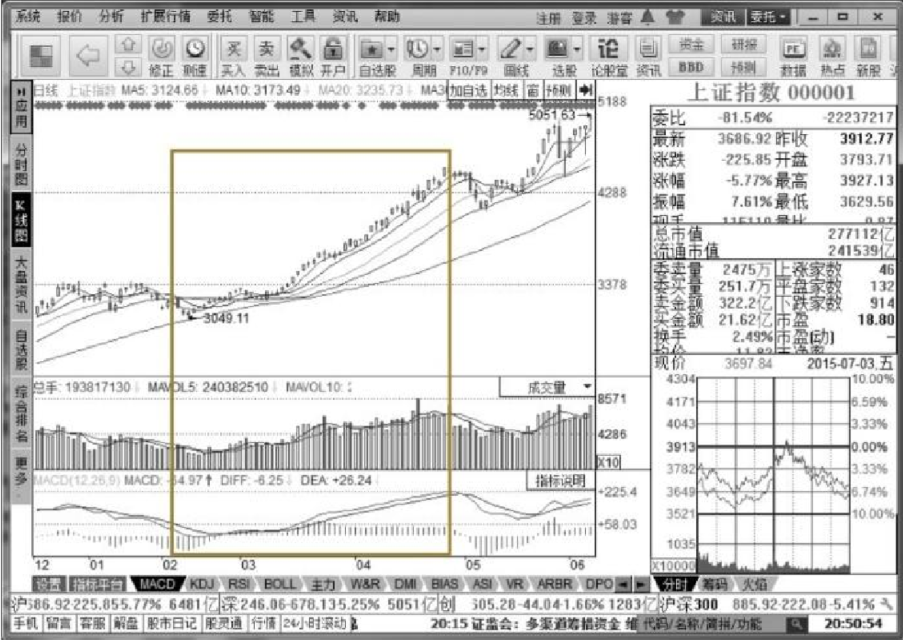

> **提示：**
>
> 货币政策也有长短之分，长期的货币政策主要和国家长期发展目标对应，短期的货币政策则以调节利率、稳定物价为目标。央行可以通过发行国债、调整存款准备金等方式对货币总量加以调整，以达到长期调整的经济目标。

3. 财政政策对股市的影响

财政政策是政府调节宏观经济的另一有效手段。财政政策对股市影响也很大，其主要通过税收影响股市。一般来讲，税负越重，企业用于发展生产和发放股利的盈余资金就越少，相应的股民用于购买股票的闲置资金也越少。因而提高税率会打击投资者投资股票的热情，股民积极性下降，股票指数也会下跌。反之，宽松的财政政策也会引导股价的上扬。

例如，在2006年至2007年这一大波牛市行情中，上证指数从1600多点上涨至4544点时，股市已经积存了太多泡沫，广大投资者却无视指数的过快上涨所积累的风险，依然沉浸其中。财政部为了控制市场过度狂热，于2007年5月30日出台提高印花税政策，印花税从原来的0.1％提高至0.3％，提高交易成本，给广大投资者当头一棒，结果股市迅速降温，许多个股甚至出现了连续四五个跌停板。仅仅4个交易日，大盘指数从4545.58点下跌至最低3404点附近，下跌幅度达25％，有些个股下跌幅度甚至超过50％。下图分别为上证指数和京东方A的“5 · 30”行情走势。

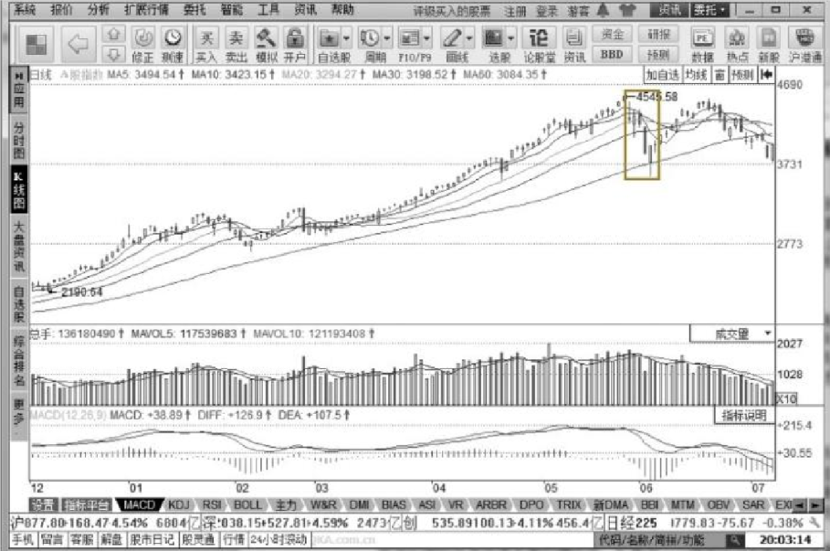

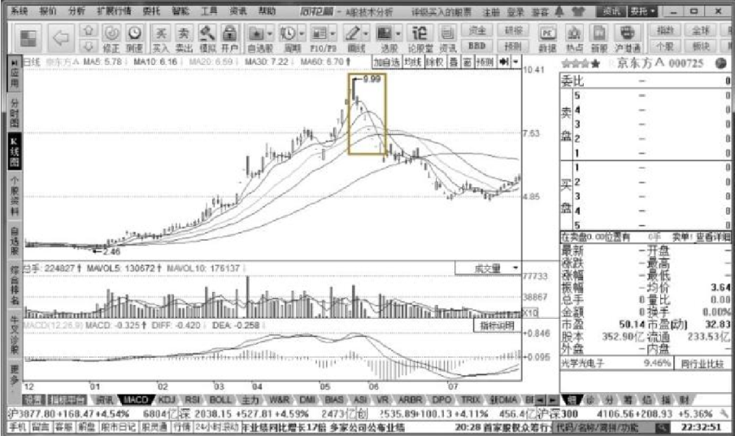

4. 国家外汇政策对股市的影响

外汇行情与股票价格也有着密切的联系。如果一国政府实行货币升值的基本方针，股价就会上涨；反之，货币贬值，股价就随之下跌。虽然本币贬值有利于促进出口贸易，拉动实体经济增长，但一旦中长期贬值预期形成，本国投资的报酬率增长又不足以弥补本币贬值带来的损失，就会引发国内资金外逃，从而直接导致股市资金不足，引发股价下跌。

中国人民银行从2005年7月21日起，开始实行有管理的浮动汇率制度。人民币汇率不再盯住单一美元，而是形成更富弹性的人民币汇率机制。自我国实行浮动汇率以来，人民币对美元的走势一直走强，从1美元兑换8.11元人民币到2007年兑换7.3046元人民币，大家普遍预期人民币将不断升值。随之而来的是，国外热钱大量涌入中国，给市场带来了大量的资金。这些资金一方面进入了房地产、楼市等基础投资项目，另一方面也不排除进入了国内股市，推动了行情的发展。下图所示是上证指数2005年到2007年年底的行情，可见在实行了有管理的浮动汇率制之后，人民币走强，股市也受其影响上涨。

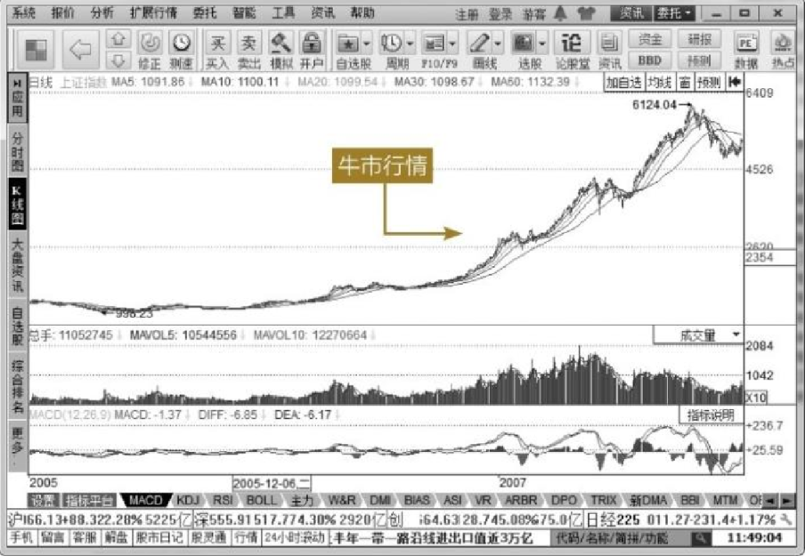

5. 国家利率政策对股市的影响

利率的变动对股市行情的影响最直接也最迅速。通常当利率下降时，除银行股之外的股票价格会上涨。反之，利率上升时，股票的价格就会下跌。

为什么利率的升降与股价的变化会呈上述负相关关系呢？主要有以下三个方面的原因。

（1）我国上市公司平均资产负债率较高，利率上升将直接增加公司的运营成本，并且利率上升还会使公司难以获得必需的资金。由此一来，公司就不得不削减生产规模，而生产规模的缩小又势必会减少公司的未来利润。因此，股票价格就会下降。反之，利率下降时股票价格就会上涨。

（2）利率上升时，投资者据以评估股票投资价值的折现率也会上升，股票价值因此会下降，从而导致股票价格相应下降。反之，利率下降时，股票价格就会上升。

（3）利率上升时，一部分资金从股市转向银行储蓄和债券，从而会减少市场上的股票需求，使股票价格出现下跌。反之，利率下降时，储蓄的获利能力降低，一部分资金就可能回到股市中来，从而扩大对股票的需求，使股票价格上涨。

例如，中国人民银行决定自2014年11月22日起下调金融机构人民币贷款和存款基准利率。金融机构一年期贷款基准利率下调0.4个百分点至5.6％；一年期存款基准利率下调0.25个百分点至2.75％。此次降息是2014年度首次降息，股市对央行的降息行为有明显的反应，上证指数从公布该降息消息时的2495点一路上扬至阶段性高点3406点。行情K线图如下图所示。

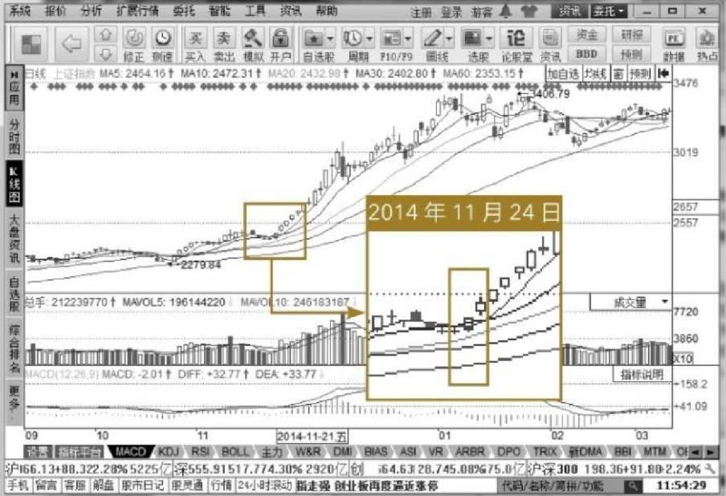

既然一般情况下利率与股价运行呈负相关关系，那么投资者就应该密切关注利率的升降，并对利率的走向进行必要的预测，以便在利率变动之前，抢先一步制定股票买卖决策。如果投资者想要了解市场上货币的宽松程度，可以登录上海银行间同业拆放利率网站，查看短期和长期的利率。

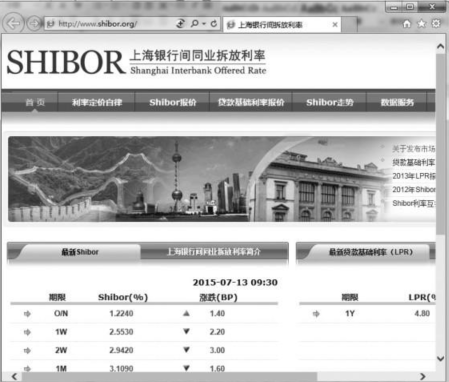

> **提示**
>
> 对股市影响较大的国家机构主要有国务院以及财政部、中国人民银行、中国证券监督管理委员会、国家发展和改革委员会、工业和信息化部、商务部、国务院国有资产监督管理委员会。投资者平时可以多关注这些机构的网站，了解最新政策消息。

### 经济形势

证券市场的波动总是与国家经济形势的变化联系在一起的，证券市场素来有宏观经济晴雨表之称。甚至可以说，证券市场长期趋势是由宏观经济发展状况决定的，其他因素可以暂时改变证券市场的中期和短期走势，但改变不了其长期走势。所谓长期走势，就是指股票价格受经济形势的影响，以及股份公司的经营能力、盈利状况、产业结构变化等稳定的、渐变的因素决定而形成的发展趋势，这是一种相对长期的变化趋势。如果大势是趋于上升的股票价格，虽然遇到临时不利因素也会下降一点，但不久就又会恢复上升，保持其总体的上升态势。

从这个意义上说，分析证券市场时有必要了解各种宏观经济数据，以助于对证券市场未来大方向走势的研判。这些宏观经济数据甚至成为了解股票走势不可或缺的一部分。主要的宏观经济数据有GDP、CPI、PPI、PMI等。

以GDP对股市的影响为例，投资者可以看到，基本上股市和GDP的增长率呈现正相关关系。也就是说，当GDP增长率高的时候，股市往往处于牛市，当GDP增长率回落的时候，股市也会回落。

中国国内生产总值GDP与增长率一览见下表。

|      |      |      |
| ---- | ---- | ---- |
|      |      |      |
|      |      |      |
|      |      |      |
|      |      |      |
|      |      |      |
|      |      |      |
|      |      |      |
|      |      |      |

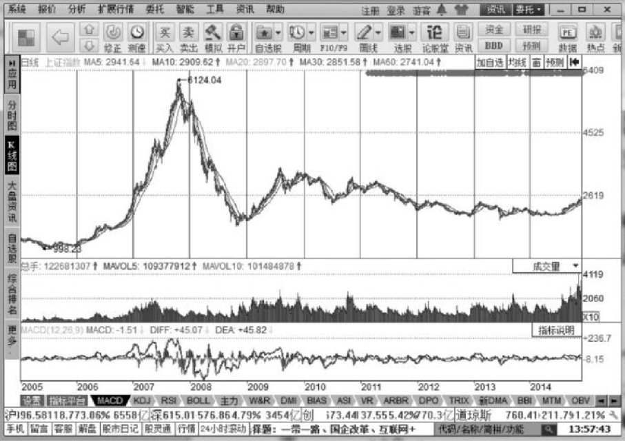

## 分红、价值、市盈率对股票价格的影响

如果说宏观经济环境对大盘有较大影响，那么对于个股来说，除了受宏观的国家政策和经济形势的影响之外，还受到企业本身的业绩影响。分红、企业价值、市盈率等财务指标均会影响个股的走势。

### 每年财报分红对股价的影响

上市公司每年都要公布年报，如果公布的年报盈利大幅增长，则企业会有分红计划。上市公司最常见的分红方式为股票股息分红和现金股息分红。

股票股息的分派从本质上讲对上市公司及股东并没有什么区别。例如，一家上市公司共有1亿股本，净资产4亿元，净利润8000万元，则每股净资产是4元，每股收益是0.8元，净资产收益率是20％。假设公司进行10送10的分红，则目前状况是总股本2亿股，净资产4亿元，年净利润8000万元，每股净资产是2元，每股收益为0.4元，净资产收益率是20％。这就相当于，原来上市公司有100元的钞票，现在变成了两张50元的钞票。

股票股息的分派对上市公司并没有什么影响，但对二级市场的股价还是有一定影响的。主要取决于以下两个因素。

1. 投资者心理因素

由于股票进行除权之后，股价会按比例下降，这让原本很贵的股票变得便宜。原本60元的股票，10送10之后变成了30元，有些投资者就会考虑购买。

2. 投资者购买力因素

由于投资者的构成不同，我国沪深股市均规定每次交易最小单位是1手，就是100股。如果投资者想要购买股价为250元的贵州茅台（600519），那么就必须至少有250×100=25000（元）才可以购买。因此，对于投资资金有限的广大中小投资者来说，是买不起的。

除权对于股票短期和长期走势的影响是不同的。在牛市当中，股票除权之后往往上涨的概率较大，称为填权。当然，也有些主力利用除权进行出货。从长线角度来看，除权对于股价的影响不是很大。但是，对于绩优股来讲，每一次除权，都是下一次上涨的低点。以格力电器为例。

（1）前复权形态中格力电器基本上从2006年开始就处于单边上涨的行情。

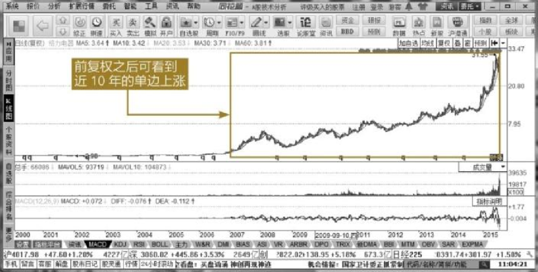

（2）除权形态中的格力电器每一次除权基本是下一轮上涨的低点。图中字母“q”就表示除权除息。

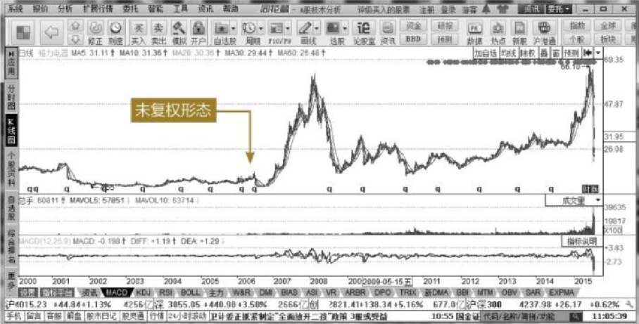

每到年底，各大公司开始纷纷发布自己的年报，其中有些公司本年财务报表巨幅盈利，将会对这些盈利进行现金股息分红。

由于大家更加认可的是按照市盈率对股票进行定价，而现金分红尽管降低了公司的净资产，但是对于每股净收益则没有任何影响。因此，一般进行现金分红的走势也都是填权走势。因为分红的比例都不会很大，所以除息的缺口一般也不会很大，基本不存在可套利的空间。对于上市公司而言，现金分红并不是越多越好。

企业的生命周期可以分为导入期、成长期、成熟期和衰退期四种。在不同的生命周期中，公司对现金的需求也是不同的。公司在导入期和成长期的阶段需要大量的投资，例如购买生产线、增建厂房等。此时，上市公司不应该大比例分派现金，而在成熟期现金流较稳定的时候可以依据企业的发展方向，选择是否进行派现。当企业进入衰退期后，企业如果没有较好的项目进行投资，则应把现金分派给股东，由股东自行选择。

### 企业本身价值对股价的影响

大家对股票的价格都有一定的认识，但是上市企业本身的价值比较难以直观地了解。企业本身的价值有账面价值、内在价值等。最常见的是采用PE、PB估值的方法来判断上市公司的价值。从理论上说，股票价格应该等于股票价值，但是股票的价格往往与其价值波动不一致。

由于上市公司自身的未来有不确定性，因此造成了其股票在资本市场上阶段性的波动。自2013年7月公布上海自贸区政策以来，上海本地股大涨，因为当时市场过于追逐上海自贸区板块，才使得投资者不论什么价格都敢于疯狂买入。然而，随着时间推移，投资者渐渐开始真正了解上海自贸区板块股票的价值，才明白太过看好其未来的发展。上海自贸区板块的股价已经远远偏离其本身的价值，因此这些股票的价格就出现了回归价值的泡沫破灭之旅。例如外高桥（600648）曾是上海自贸区概念的龙头，在股价大幅翻升5倍之后出现大幅回落。

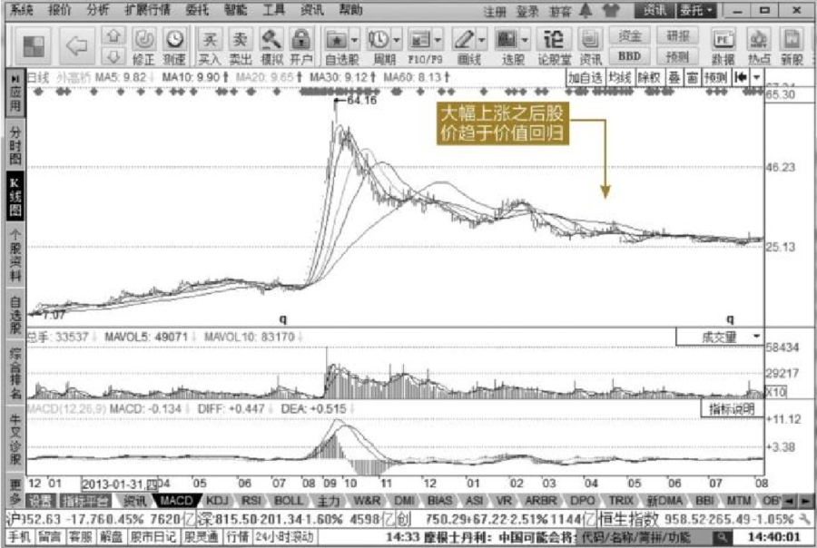

投资者不禁要问，那公司自身价值高的股票和炒作概念的股票能不能区分开？答案是肯定的，投资者可以通过多种方式区分出业绩优良的股票。首先，投资者可以搜索各个行业、各个领域的龙头企业，尤其是具有品牌效应的绩优股。例如，贵州茅台、格力电器、云南白药、双汇发展、宇通客车等知名企业。其次，参考一下上市公司的市盈率，如果市盈率过高，则不适合长期投资。最后，在上证指数处于阶段性调整时，考虑上市公司的技术走势是否抗跌。如果抗跌，则往往是上市公司有业绩支撑。题材股在股市大跌行情中往往站不住脚而一泻千里，而绩优股则表现得特别坚挺。以2015年6月中旬至7月上旬的大调整为例，上证指数从5178点一路下跌至最低3373.54点，18个交易日，跌幅高达34.8％。而贵州茅台（600519）在大盘最高点6月18日最高股价为272元，到大盘最低点的前一天跌至最低价219.75元，跌幅19.2％。并且贵州茅台基本处于箱体震荡而不是单边下跌走势，这充分体现了绩优股抗跌的优点。

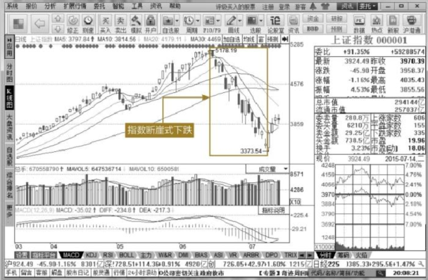

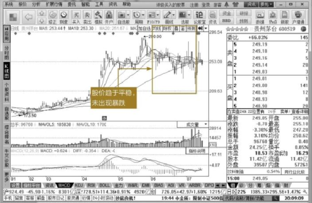

### 股票市盈率对投资的影响

市盈率又称为本益比，是衡量股价高低和企业盈利能力的一个重要指标。具体来讲，市盈率反映了每股盈利不变和所得股息没有进行再投资的情况下，经过多少年投资者可以通过股息全部收回。用公式计算为：市盈率＝普通股每股市场价格÷普通股每年每股盈利。

一般来说，某只股票的市盈率越低，说明投资回收期越短，投资风险就越小，股票投资价值越大；反之，则说明投资回收期越长，投资风险就越大，股票投资价值越小。例如，股价同为100元的两只股票，其每股收益分别为10元和2元，则其市盈率分别是100/10=10（倍）和100/2=50（倍），也就是说，与当前的实际价格水平相差5倍。若企业盈利能力不变，这说明投资者以同样50元价格购买的两种股票，要分别在10年和50年以后才能从企业盈利中收回投资。

但是，由于企业的盈利能力是会不断改变的，投资者购买股票更看重企业的未来。因此，一些发展前景很好的公司即使当前的市盈率较高，投资者也愿意去购买。预期的利润增长率高的公司，其股票的市盈率也会比较高。例如，对两家上年每股盈利同为10元的公司来讲，甲公司市盈率是30，乙公司的市盈率为20。如果甲公司今后每年保持20％的利润增长率，乙公司每年只能保持10％的增长率，那么到第十年时，甲公司的每股盈利将达到61.9元，乙公司只有25.9元，因此尽管甲公司当前的市盈率高于乙公司，投资者若以同样价格购买这两家公司股票，对甲公司的投资能更早地收回成本。

投资者在同花顺软件中，按【F10】键即可对上市公司的市盈率进行查看。仍以贵州茅台（600519）为例，投资者进入其分时图界面之后，按【F10】键即可查看公司资料。

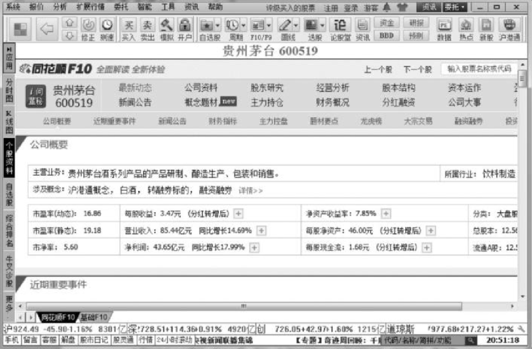

## 每年不同时间段对股市的影响

上市公司股票走势除了受到国家政策、经济形势等因素影响外，在不同的时间段，还会受到诸如年报或者节假日等影响。投资者有必要对年报行情和节假日行情有一定的认识。

### 每年财报前后股市走向

上市公司每年一季度必须公布上一年度的财务报表。如果当年的各项财务指标好于上一年度的财务指标，股价就会上涨。一般运营正常的情况下，企业的效益会一年比一年好。所以出现了一个规律，在上市公司公布财务报表之前，投资者因预期上市公司会有好的表现而买入股票，供求关系导致股价有一定的上涨空间。时间段一般为当年的12月底至第二年三四月份。投资者根据上市公司披露的公司财务报表作为概念来买卖股票，这就是所谓的年报行情。

当然，并非所有年报预增的公司都会得到市场的追捧而股价上涨。年报披露前有预披露，如果预披露的年报经营业绩有大幅度增长，此时股价可能会被炒作，等到正式年报披露的时候，股价已经涨到天上，这时会出现盈利盘兑现，引发股价下跌。一般爆炒的概念是业绩大幅度上升，或者预期有高分红高送配，因此投资者需要辨别利润增长的原因。最好的利润增长的原因是其原有主营业务的销售额增长，在提高技术含量的同时降低成本，从而扩大毛利率。其他因素也会引起利润的急剧变化，例如，出让资产、股权改变引发的会计记账的变化等。因此投资者还需要注意年报中的其他项目变化，例如投资利润、主营业务利润、政府补贴、负债率等。投资者可以在巨潮资讯网（证监会指定信息披露网站）对所有上市公司的年报季报信息进行查询。

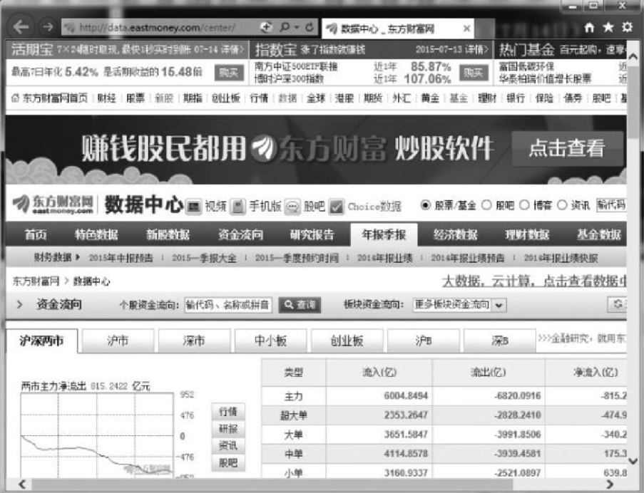

### 各大节日对相关股票的影响

除了年报外，节日对行情也有特殊的影响，如每年的春节、国庆节、元旦和其他假日等。我国每年休市时间最长的假期就是春节，因此春节对于我国证券市场的影响也最大，其次是国庆节和元旦。

1. 春节对股市的影响

根据江恩理论，在所有假日因素的影响中，最应当注意圣诞节前后的市场变化，市场经常会在它前后发生变盘。而这一理论套用在中国证券市场，就是中国的股票往往会在春节前后发生变盘。因为年关将至，投资者对持股过年还是持币过年看法不一，因此容易发生变化。据统计，自1999年后，春节因素对于股市影响的确非常大，多次产生了重要的市场拐点。

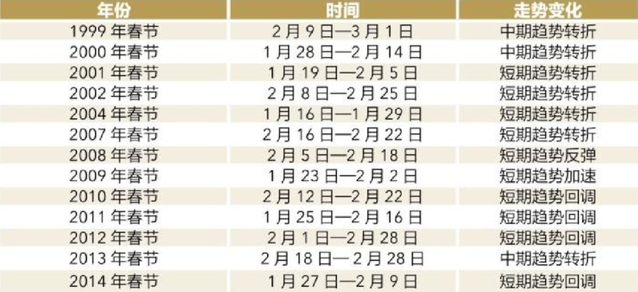

通过对历史数据的观察，投资者不难发现每年春节前两个交易日和节后两个交易日是春节因素爆发的时间窗口期。在这4天内，市场往往会出现较大幅度的上涨或下跌，进而有可能进一步改变市场趋势，值得大家重点留意。

2. 国庆节对股市的影响

国庆小长假的放假时间与春节长假的放假时间一样，再结合国庆节节日因素，因此其对市场的影响也是有目共睹的，仅次于春节对股市的影响。不过相对春节而言，国庆节对于市场的影响多为短期趋势的转折。由统计可知，2000年、2003年、2005年、2006年、2008年、2009年和2010年的国庆节，均引发了市场不同程度的转折。

例如，上证指数2010年国庆前后均出现较为明显的趋势转折。2010年9月29日，上证收盘指数为2734.81点，由于受到国庆因素对市场的影响，在假期结束的第一个交易日就放量上涨，收出一根大阳线。在之后的第二个交易日又高开高走，收出一根跳空缺口的长阳线。股票走势发生转变，一路高歌，并于2010年11月11日，涨至最高3338.01点。

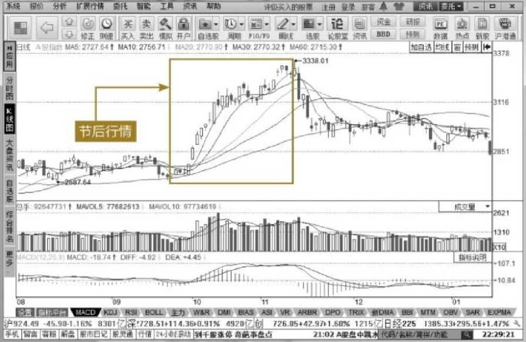

3. 元旦对股市的影响

每年的12月份均是各大银行争夺资金的月份。对于银行来讲，央行经常会在12月份检查储备金是否充足，而银行对员工也要进行年末考核。为了完成吸储任务，各大银行会使出各种手段与市场抢夺资金。因此元旦作为阳历新年的开始，对市场的影响也不容小觑，见下表。

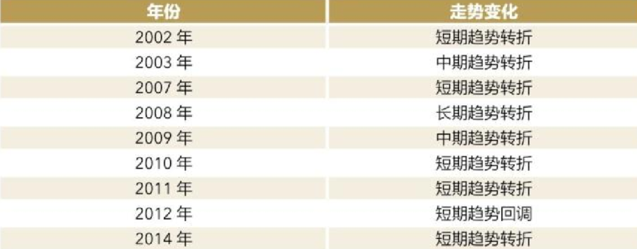

例如，上证指数2008年元旦之后出现较为明显的牛转熊趋势转折。2008年1月14日，上证指数收盘价为5497.9点，由于受到元旦因素对市场的影响，再加上前期投资者对市场的疯狂追逐，市场存在大量的泡沫。因此在元旦后，股票走势发生转变。1月21日的大阴线彻底刺穿60日均线，从此开始了为期长达10个月的大熊市，于2008年10月28日，下跌至最低点1664.93点。

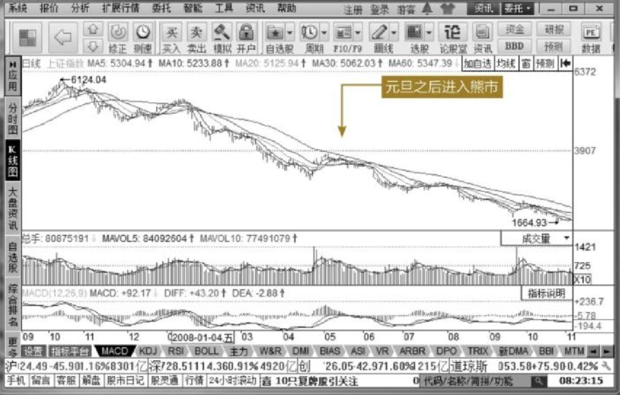

除春节、国庆、元旦这些传统假日以外，其他节假日也会出现市场的转折点。例如劳动节前后也极容易成为市场的转折点。五一前后出现拐点的年份，分别有2000年、2002年、2003年、2006年、2008年和2009年。此外，2015年端午节也是牛转熊的拐点。投资者可以在同花顺等股票软件中进行查看，发现其中的规律。

## 证监会新政对股市的影响

证监会全称中国证券监督管理委员会，是证券市场和期货市场的监管部门。因此，证监会的发声对中国的资本市场有着不容小觑的影响。证监会调控市场的手段多种多样，例如，增发新股、对券商两融进行调控、对场外配资业务的清查等。

### 股票的供给

证监会对市场进行调控最重要的手段之一就是发行新股。新股发行上市又称为首次公开募股（英文缩写为IPO），是指一家企业或公司（股份有限公司）第一次将它的股份向公众出售，增加股票的供给量。因此IPO会分流股市资金，加大股市供给。因为市场上的资金只有那么多，如果股票数量变多，平摊在每一只股票上的资金就相应要减少，因此短期内对股市造成利空已是确定无疑。不过从长期的角度来看，增加新鲜血液，让更多优质公司上市，对股市长久健康发展是有利的，对于上市公司的发展也十分有利。

所以，在资本市场低迷的时候，证监会一般会让新股发行放慢甚至是暂停。一旦股市活跃，新股发行就会加快，所以新股发行的节奏跟市场的阶段和环境有很大关系。我国历史上IPO暂停又开启大概有9次，具体时间、背景以及市场的表现如下表所示。

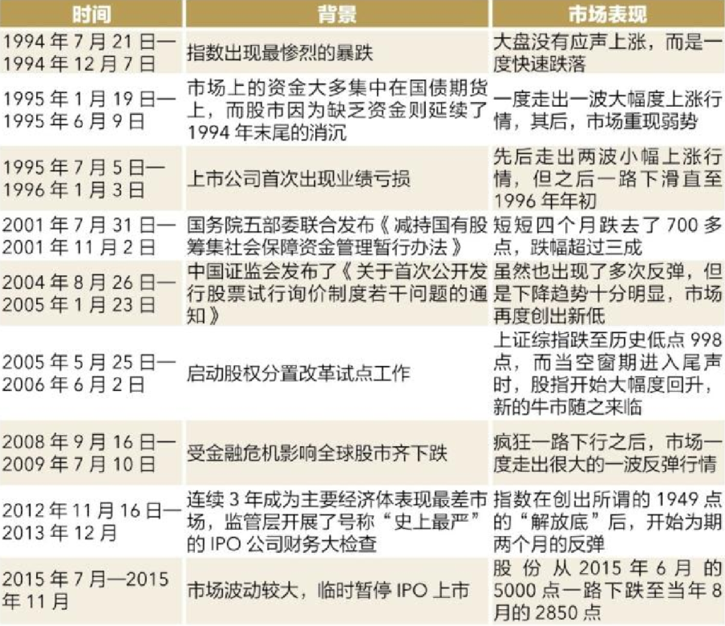

### 国家对股市的资金监管

证监会除了对上市公司新股发行进行强而有力的监督管理外，对于市场上的资金也有严格的监督管理措施。证监会对股市的资金监管主要有两个方面：一方面是对国内资金进行监管；另一方面是对国外资金进行监管。

证监会对国内资金进行监管，主要包括对券商融资融券开通资格的限定、融资融券担保品比例的调控、上市公司高管减持股票的限定、公募基金的审批与资金限定、私募基金的资金管理等。这些强有力的资金监管有助于调控证券市场行情的过度上涨和过度下跌。在有效地维护证券市场秩序的同时，也保障了投资者的合法权益。

证监会监管国外资金有助于保证我国金融市场的安全和稳定。证监会对国外资金的监管，主要包括对QFII、沪股通以及外资对基金公司的持股比例等进行监管。QFII（境外机构投资者机制）是指合格的境外投资者制度，是有限度地引进外资、开放资本市场的过渡性制度。证监会对其限制的内容主要有资格条件、投资登记、投资额度、投资方向、投资范围、资金的汇入和汇出限制等。沪股通是指香港或国外投资者通过香港联交所证券交易服务公司，向上交所进行申报，买卖规定范围内的上海市场的股票。目前沪股通的总额度为3000亿元人民币，每日额度为130亿元人民币。

## 媒体报道对股市的影响

在信息化的时代里，财经媒体既是财经类信息的传递者，又是公司负面新闻的揭露者。在现实生活中，社会大众主要是通过各种媒体获取相关信息。新闻媒体特别是财经媒体已经成为投资者获取财经信息的主要渠道，因此媒体对投资者的决策有着重要的引导影响。

### 官方媒体的社论导向

官方媒体承担着传达政府决策的重要职能。因此，股票市场对其所发出的声音十分敏感。虽然它们和其他媒体一样，也会发布日常的新闻报道，但是在股票市场上，却经常出现将权威媒体的日常新闻报道当作重大事件做出解读的情况。这种现象与股票市场的发展有直接的关系。

例如，2015年1月5日，官方媒体称2015年的股市令人充满期待。在发文之时，上证指数位于3369.28点，发文后的两个月，A股市场进入上升通道的调整阶段。调整结束之后，开始新一轮令人期待的上涨行情。随着成交量稳步增长，上证指数也稳步拉升至4500点。

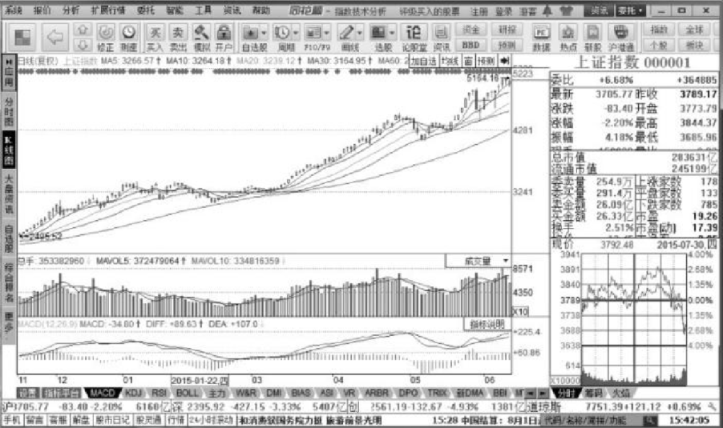

2015年4月21日，官方媒体再次发表文章，称4000点才是A股牛市的开端。此后A股经历短时间调整，从4000点一路上扬，最高涨至5178点。

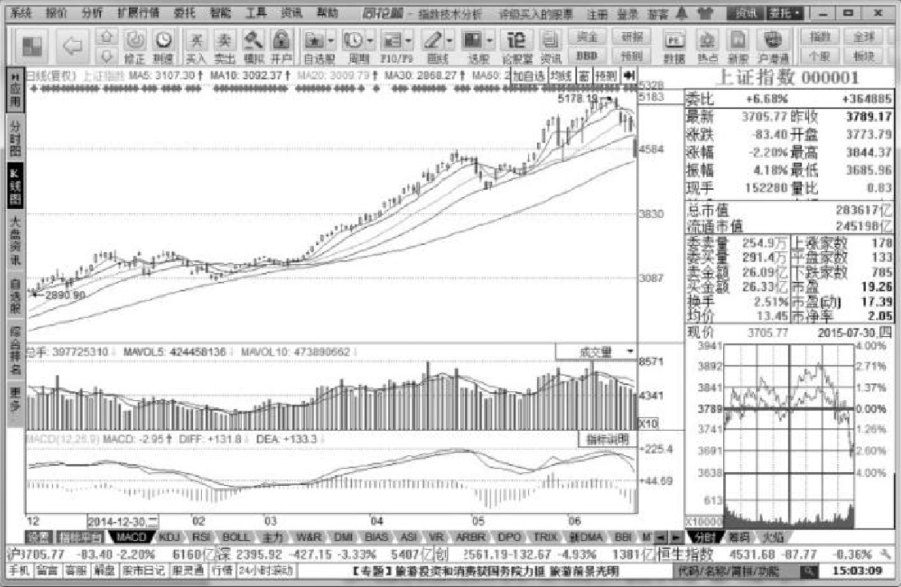

上述例子充分地说明了官方媒体的报道对沪深股市的影响。虽然股市的市场化程度正在逐步加深，但是市场仍然习惯于将官方媒体发表的报道、评论当作投资的重要信号进行解读。

### 财经媒体对相关企业的报道

2012年11月19日，21世纪网发表《致命危机：酒鬼酒塑化剂超标260％》，披露酒鬼酒“塑化剂超标”问题。酒鬼酒是我国高端酒品牌，被曝由上海天祥质量技术服务有限公司查出塑化剂超标2.6倍。针对此事，酒鬼酒公司却认为检测不够权威，甚至怀疑被检测的酒是否出自酒鬼酒公司。然而在二次公开检测中，湖南省质检局根据卫生厅标准检测出酒鬼酒塑化剂确实超标。11月20日，中酒协宣称国内所有企业的白酒都含有塑化剂，再一次引起了轩然大波，把舆论推上了制高点。中国白酒行业受此事件影响，没有停牌的白酒类上市公司遭遇资金打压，2012年11月20日早盘白酒股大跌之后，午后再度暴跌。

下图为酒鬼酒（000799）塑化剂事件之后的走势，先是断崖式连续跌停，然后是为期近两年的熊市行情。

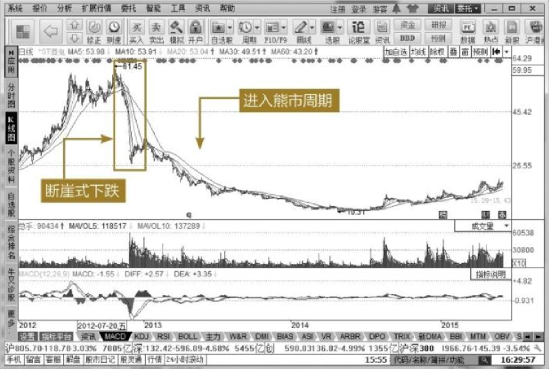

即使是白酒行业的老大贵州茅台，也没能顶住压力，在2012年11月19日当日跌幅就达4.61％，之后开始了为期两年的熊市行情。

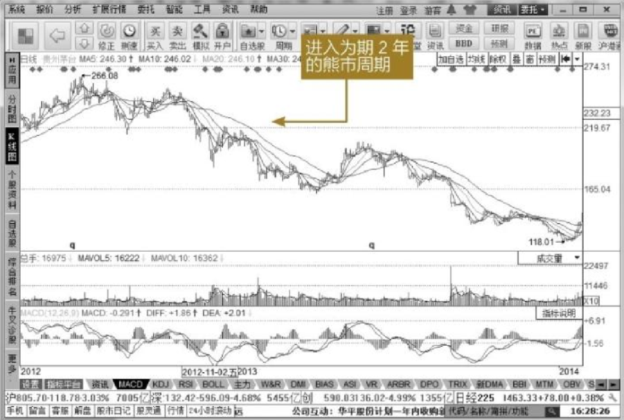

由此可见，财经媒体的报道，也会对股市中某一行业的股票产生极大的冲击。虽然对大盘指数影响并不那么大，但是这种影响也不容小觑。除了上述酒鬼酒事件，还有“三鹿奶粉”事件曝光引发的国内食品板块普跌的现象。

### 外围指数MSCI

美国明晟公司（Morgan Stanley Capital International，MSCI）是美国著名指数编制公司，也是一家股权、固定资产、对冲基金、股票市场指数的供应商，编制了多种指数。其推出的MSCI指数广为投资人参考，全球的投资专业人士，包括投资组合经理、经纪交易商、交易所、投资顾问、学者及金融媒体均会使用 MSCI指数。MSCI指数是全球投资组合经理采用最多的投资标的。根据美林盖洛普调查显示，约三分之二的欧洲大陆基金经理使用MSCI为指数供货商服务。

由于中国对海外投资者进入我国金融市场施行QFII和RQFII配额制度还有较多限制，所以A股被纳入世界主流的指数系统仍需跨越一定障碍。2015年6月9日，MSCI公司在日内瓦公布2015年全球市场分类评审结果，称中国A股处在纳入其全球基准指数的轨道上。MSCI公司在声明中明确宣布，将和中国证监会组建工作组帮助处理阻碍A股纳入的遗留问题。

## 机构和散户对股市的影响

证券市场上的投资者分为两类：一类是机构投资者；另一类是个人投资者，俗称散户。机构投资者的性质与个人投资者不同，在投资来源、投资目标、投资方向等方面都与个人投资者有很大差别，因此二者对证券市场的影响也有很大不同。

### 机构对证券市场的影响

在证券市场发展初期，市场参与者主要是个人投资者。然而自20世纪70年代以来，西方各国证券市场出现了证券投资机构化的趋势。有关统计数据表明，在20世纪，机构投资者市场份额20世纪70年代为30％，20世纪90年代初发展到70％，机构投资者已成为证券市场的主要力量。由此可见，当市场发展趋于成熟时，市场中的机构投资者应当占大多数。

机构投资者主要是指一些金融机构，包括银行、保险公司、投资信托公司、信用合作社、国家或团体设立的退休基金等组织。对于证券市场而言，机构的参与度增加对证券市场产生的影响是非常大的。

1. 正面影响

（1）机构投资者丰富了投资品种，扩大了市场容量。

（2）机构投资者的投资策略有助于股票市场的稳定。

大部分机构投资者采取价值投资策略，采用长期持股、不断低价吸筹的方法获利。这种方法在很大程度上降低了交易成本，并且避免了市场价格的短期波动，着眼于长期投资。此外，机构投资者还会以成长型的股票作为其主要投资目标，借助于机构自身的判定标准，评估上市公司的成长潜力，从而挖掘并长期持有能够获利的成长型股票。

（3）机构投资者参与申购占优势。

机构投资者拥有积聚社会个人投资者闲置资金的优势。因此，当机构投资者投资于新股申购时，可以大大提高中签率，从而可以使整个机构获得一定的稳定收益，降低了风险。

（4）机构投资者积极参与上市公司治理，提高上市公司质量。

2. 负面影响

（1）机构投资者的羊群行为。

由于信息不对称，机构投资者比个人投资者占据明显的信息优势，因此也在证券市场占据主导地位，引导股票走势。相反，个人投资者就处于信息劣势，面临投资风险高并且投资收益小的风险。

由于信息不对称，机构投资者也许会发生基于声誉的羊群行为。机构分析师的预测是否反映其真实观点或者仅仅模仿他人，这对于委托人而言都是未知的。如果机构分析师的预测与他人不同，一旦预测出现错误，这将严重损害其职业声誉。即使预测正确，其声誉也不会增加，因为委托人会将其归于侥幸成功。如果机构分析师和他人在相同时间以相同的投资决策发生错误，声誉不会因此受到影响。因为委托人会将此错误归于事态发展的不可预见，与分析师判断能力无关。因此机构投资者会出现羊群行为。

（2）机构投资者的短视行为。

并非所有的机构投资者的策略组合都是长线策略，其中不乏专门做短线套利的机构投资者，这些投资机构一旦短线获利就会抛出手中的筹码。机构投资者的资金量很大，因此会给市场带来不小的抛压。此外，一只股票中会有若干个机构参与者，持有同一股票的机构参与者之间存在竞争压力，如果短线出货，机构之间会竞相出货。

（3）机构投资者的流动性压力为市场增加了不稳定性。

当市场出现特殊情况时，如爆发金融危机、重大利好公布或机构投资者的资金链出现问题时，机构投资者都会竞相卖出或买入股票，或者频繁更换股票，此时也会导致证券市场价格的不连续性和“雪崩效应”。

机构投资者与个人投资者相比还是更具有优势的，主要有以下几个方面。

（1）机构投资者具有专业化投资管理模式。

机构投资者资金实力较为雄厚，在对上市公司进行信息搜集分析与研究等方面都配备有专门部门，由证券投资专家对投资决策运作和投资理财方式进行管理。现在我国国内的证券公司，绝大部分有自己的证券研究所。个人投资者绝大部分投入的资金量较小，并且缺乏足够的时间去搜集信息、分析行情、判断走势，也缺少足够的资料数据去分析上市公司经营情况，容易受股票市场波动的影响，追涨杀跌。因此，从理论上讲，机构投资者的投资行为相对理性，投资规模相对较大，投资周期相对较长，从而有利于证券市场的健康稳定发展。

（2）机构投资者的投资组合策略更稳定。

由于证券市场的风险较高，并且机构投资者的入市资金比个人投资者多，因此其承受的风险就较大。为了尽可能地规避非系统性风险，机构投资者会设计投资组合策略，并按照策略执行。个人投资者由于资金较少，很难进行投资组合，因此其要面临的非系统性风险也较大，承担的风险也较高。

（3）机构投资者的投资行为更规范。

机构投资者是具有独立法人身份的经济实体，因此会有相应的监管部门对其进行监管，机构投资者的投资行为也更为规范。既遵守了证券交易的“公开、公平、公正”原则，又维护了市场的相对稳定。此外，机构投资者可以通过自律管理，从各个方面规范自己的投资行为。对于个人投资者而言，监管机构一般不进行监管，因此投资者的投资行为相对更为自由，但也更不规范。

### 散户对证券市场的影响

个人投资者有一个通俗的名字叫散户，因其资金量散、思想散而得名。与机构投资者不同，由于个人投资者资金小，难以形成规模效应，不能有效左右股价，加上散户具有贪婪、恐惧和后悔等弱点，使得个人投资者的投资行动散乱不一，难以形成规模。因此散户的资金对整个证券市场而言，影响不大。

金融市场较发达地区的主要股票市场的交易所和券商的数据表明，散户在股市的平均投资业绩明显低于大市表现。整个盘面处于下跌态势当中，散户往往亏损最多，一批又一批的散户割肉离场。事实上，由于资本市场的发展阶段和监管制度不完全一致，各国的散户们在资本市场中的表现也都不尽如人意。在很大程度上，都是源于散户对自己的投资能力缺乏正确的认识，对于股票市场行情规律缺乏起码的了解。

但值得指出的是，散户在市场中的重要地位，并不局限于他们自己的投资回报，更是直接影响到了市场监管层推进“公正、公开、公平”原则的进度。股票市场是自由度较高的市场，允许不同资金规模的投资者参与，这其中也不乏散户的身影。而监管层主要是保证所有的参与者在同一市场按照相同的规则进行交易。在股票市场，机构投资者和散户之间的博弈，从某种程度上讲，更像是大学生与小学生一起参加数学竞赛。其实，当只有大学生之间进行比赛，才可以保障比赛结果的公正性。

只有当股票市场中没有散户存在，机构投资者之间短兵相接，才能够真正地维持资本市场的价格。届时，机构投资者将会要求上市公司的信息披露更加透明化，减小由信息不对称所带来的股价波动。这时的股票市场没有了散户的踪影，机构投资者也不再有较强的动机操纵股价，或者散布传言欺骗散户。其实散户并没有真正地离开股票市场，而是将资金交给具有竞争力的机构投资者代为投资。只有这样，才可以避免成为机构投资者眼中的“鱼肉”。这样，股票市场也将更加公平与健康。

# 高手秘技

## 技巧1 大股东减持对股票有哪些影响

> 其实股票市场中最大的“主力”不是机构投资者，更不是个人投资者，而是以很低的成本获取非流通股的大小股东。这些非流通的股票在经过规定的时间之后可以解禁，转化为可流通的股票。但是大股东并不能一下子把股票全部卖光，而是在规定的时间，最多减持多少股票，分批减持。当大股东减持股票的时候，股价就面临抛压，因此可能会引起股价下跌。
>
> 一般情况下，这些非流通股可以减持之后，大股东不会马上减持，而是等股价上涨到一定的高度之后再抛出手中的股票。一般在非流通股解禁之前，上市公司必须要公告。投资者在获取上市公司股东要减持股票的消息之后就应当对所持有的股票保持警惕，一旦发现股价上涨乏力，投资者应马上卖出。

## 技巧2 “两会”对证券市场有哪些影响

> “两会”并不是一个特定的机构名称，而是对“中华人民共和国全国人民代表大会”和“中国人民政治协商会议”的统称。“两会”期间可能出台一些政策，因此“两会”期间会有一些板块领涨，并带领大盘上行。多数情况下，从“两会”之前到“两会”结束这段时间，大盘会上涨15％～25％。投资者在这段时间，要留心收集“两会”热点讨论的议题，这些议题往往是市场炒作的热点。