# 沪港通

**本章引语**

> 一切事物的趋于完善，都是来自适当的改革。
>
> ——[法]巴尔扎克
>
> 
>
> 沪港通这座中国内地资本市场与香港地区资本市场之间的桥梁，让上海股票市场和香港股票市场之间首次实现了互联互通。

**本章要点**

> ★港股通交易股票规则、对象
>
> ★港股通投资的风险
>
> ★沪港通业务的开通资格

## 认识沪港通

2007年版的港股直通车其实就是沪港通的前世。2007年中央提出“港股直通车”计划，但是因为内地的投资者在“港股直通车”计划宣布的第二天大批地涌入开户，令央行担忧内地投资者没有足够的风险意识，再加之美国次贷危机爆发导致全球金融海啸，“港股直通车”计划被迫放弃。之后一直有落实港股直通车的传言，终于在2015年11月17日，连接两地的沪港通业务开通了。

### 什么是沪港通

沪港通是指两地投资者委托上海证券交易所（以下简称“上交所”）会员或者香港联交所（以下简称“联交所”）参与者，通过上交所或者联交所在对方所在地设立的证券交易服务公司，买卖规定范围内的对方交易所上市股票。中国内地登记结算公司是香港投资者的结算参与人，香港中央结算有限公司是内地投资者的结算参与人，为沪港通提供相应的结算服务。沪港通包括沪股通和港股通两部分。

沪港通的开放给我国内地的股票市场带来的意义非凡，它是我国内地资本市场对外开放的重要内容，一方面有利于加强香港与内地资本市场的联系，另一方面有助于推动资本市场双向开放，具有诸多的积极意义。

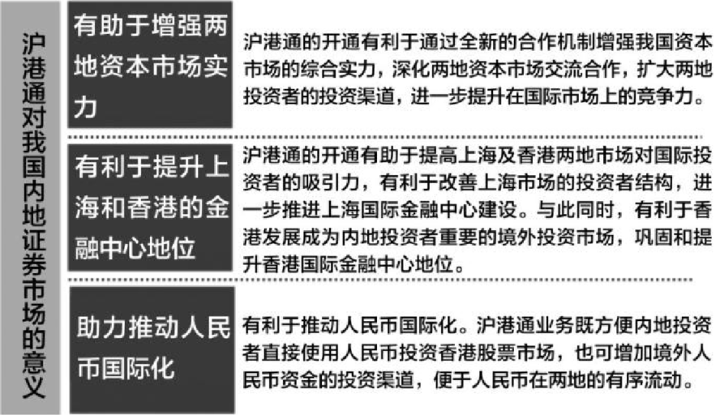

作为中国逐步开放资本市场的关键一步，沪港通主要有以下5个特点。

1. 跨境结算

沪港通业务充分借鉴了市场互联互通的国际经验，采用较为成熟的订单路由技术和跨境结算安排，为投资者提供便捷、高效的证券交易服务。

2. 双向开放

沪港通业务实行双向开放，内地投资者可以通过港股通买卖规定范围内联交所上市的股票，香港投资者则可通过沪股通买卖规定范围内上交所上市的股票。

3. 双向人民币交收制度

沪港通业务实行双向人民币交收制度，内地投资者买卖以港币报价的港股通股票并以人民币交收，香港投资者买卖沪股通股票以人民币报价和交易。

4. 额度管控

在试点初期，沪港通实行额度控制，即内地投资者买入港股通股票有总额度和每日额度限制，香港投资者买入沪股通股票也有总额度和每日额度限制。

5. 股票有限

两地投资者通过沪港通可以买卖对方市场规定范围内的股票。

### 沪港通对A股的影响

沪港通的开通对港资的数额有限制，每日的130亿元限额与内地A股市场每天上千亿元的成交金额无法媲美，但是港资参与到上海资本市场对A股会有一定的影响。这些影响主要体现在以下几个方面。

1. 资金流向A股市场更加明显

自从沪港通开通以来，A＋H股板块出现持续的A涨H跌格局，资金在沪港通正式启动前调仓迹象明显，海外投资者对A股的兴趣大于内地投资者对港股的兴趣，资金流向A股市场会较明显，沪港通对A股的正面影响要大于对港股的正面影响。

2. 海外投资者对A股的兴趣更强烈

上海与香港证券交易所在对欧美、中东等地的全球路演发现，海外机构对沪港通兴趣强烈。海外投资者对A股的兴趣更强烈的理由：首先是A股更能代表中国经济，而且估值更便宜。其次，欲参与沪股通交易的资金更多。最后，海外投资者衡量个股的标准与内地不一样。

3. 有助于树立投资者价值投资的理念

沪港通带给A股增量资金的背后，是一些具有国际背景的机构投资者。作为成熟市场的投资者，他们具有较合理的投资理念，尤其偏好优质蓝筹股。成熟的国际机构投资者的加入，将改变A股炒作之风，有助于重塑A股市场健康的投资理念。

总之，沪港通有助于健全证券市场机制，引入新的市场活力与理念，形成一个长期的制度安排，逐步实现中国资本市场的双向开放。伴随沪港通这一创新制度的推出，未来中国资本市场的改革无疑将加速前行。

### 沪港股票投资的相关差异

香港的股票市场与上海A股市场在制度和规则等方面存在一定的差异，内地的投资者在参与港股通投资之前，需要仔细了解下列差异，否则可能会面临诸多的风险。

1. 沪港两地交易时间的差异

联交所的交易时间与A股市场有所不同，周一至周五为交易日，在交易日的9：00—9：30为开市前时段，9：30—12：00为上午持续交易时段，13：00—16：00为下午持续交易时段。需要投资者注意的是，在圣诞、新年、农历新年前夕，仅有半天交易。因此，港股通的投资者对此要特别留意，避免因忽视了两地交易时间差异而可能错失的投资机会。

2. 涨跌停板制度的差异

在A股市场，设有涨跌停板制度，因此，在每一个交易日内，股票价格的涨跌波动是在规定范围内的。在联交所市场，则不实行涨跌停板制度，因而股价波动可能相对更加剧烈，投资者应当充分注意到港股在价格剧烈波动时可能面临巨大损失的风险。

3. 回转交易制度的差异

在内地A股市场，实行T＋1交易制度（交易所买卖基金等少数产品除外），也就是说，投资者当天买入的股票，在第二天才能卖出。与此不同，联交所市场实行T＋0回转交易制度，即投资者当天买入的股票可以当天卖出，因此，投资者可以在一个交易日内对同一只股票进行多次买卖交易。对于沪港两地市场的这方面差异，投资者有必要充分了解。

4. 股票交收制度的差异

在A股市场，结算周期一般为T＋1日，也就是当天卖出的股票，投资者在第二天就可以收到款项。与此不同，香港市场证券结算与经纪商之间的结算周期为T＋2日，即投资者卖出股票后，至少需要2天才能收到此款项。此外，投资者在买入股票前应预先全数付款，在卖出股票前也必须有足额股份托管于有关股票经纪商。对于此项差异，投资者在参与港股通投资前，应当先向证券公司了解有关港股通股票收付和资金结算安排的相关事宜，做好流动资金管理。

5. 整手股数的差异

在上海A股市场，每手交易单位统一为100股。但是，在联交所，上市公司可以自行设立不同数量的每手股票交易单位，对此并没有统一的规定。港股通投资者要特别留意，避免在不了解相关规则的基础上因交易单位错误而导致损失放大。

6. 股票报价显示颜色的差异

在内地A股市场，红色代表股价上涨，绿色代表股价下跌；与此不同，在联交所市场，股价上涨，报价屏幕上显示的颜色为绿色，股价下跌则为红色。对此，参与港股通的投资者还需特别留意，切记不同行情报价颜色显示的含义，规避因对此的误解而做出错误决定，并遭受损失。

7. 股票报价价位的差异

在香港联交所市场，不同港股股票的报价价位依据股价而定。股价越高，报价价位越大，投资者应了解联交所《交易所规则》规定的价位表，避免申报价格因不符合规定无法成交。

8. 停牌制度的差异

香港联交所规定，在交易所认为所要求的停牌理由合理而且必要时，上市公司方可采取停牌措施。此外，不同于内地A股市场的停牌制度，联交所对停牌的具体时长并没有量化规定，只是确定了“尽量缩短停牌时间”的原则，对此，港股通投资者要随时关注联交所及上市公司的相关公告，避免错失复牌后的投资机会。

9. 退市制度的差异

沪港两地股票市场均有退市制度。在A股市场，存在根据上市公司的财务状况在证券简称前加入ST及*ST等标记以警示投资者风险。但是，在香港联交所市场，没有风险警示板，联交所采用非量化的退市标准且在上市公司退市过程中拥有相对较大的主导权。这使得联交所上市公司的退市情形较A股市场相对复杂。港股通投资者应予以关注。

此外，香港市场在发行、上市、信息披露等方面的规则与内地市场存在的差异，敬请投资者仔细阅读联交所《交易规则》《上市规则》等有关规定，降低因对相关规则不了解造成的投资风险。

### 沪股通交易额度、交易对象

沪股通是指投资者委托联交所参与者，通过联交所证券交易服务公司，向上交所进行申报，买卖规定范围内的上交所上市股票。

1. 沪股通交易额度控制

沪港通业务实行总额度控制和每日额度控制，并对香港投资者投资上交所市场的单向总额度实施管理。在试点初期沪股通的总额度为3000亿元人民币，每日额度为130亿元人民币。

2. 沪股通交易对象

试点初期，沪股通股票范围包括上证180指数、上证380指数成分股以及同时在上交所和联交所上市的发行人的沪股，其中B股暂不纳入，被实施风险警示板的沪股也暂不纳入。截至2014年4月10日，可纳入沪股通股票范围的股票共有568只。

### 沪股通股票信息披露

沪港通的试点中规定，当持A股股权5％以上的股东或实际控制人，其持有股份或控制公司情况出现较大变化时，上市公司需就此进行公告和报告，拥有的权益需合并计算。若香港投资者通过沪股通使自身持股量上升达到信息披露要求时，应依循法规履行报告及披露义务。

## 港股通交易简介

港股通是指投资者委托上交所会员，通过上交所证券交易服务公司，向联交所进行申报，买卖规定范围内的联交所上市股票。港股通的总额度为2500亿元人民币，每日额度为105亿元人民币。

### 港股通交易股票规则、对象

1. 港股通交易规则

投资者买卖港股的交易时间应遵守联交所规定，具体的交易时间以及交易规则如下表所示。

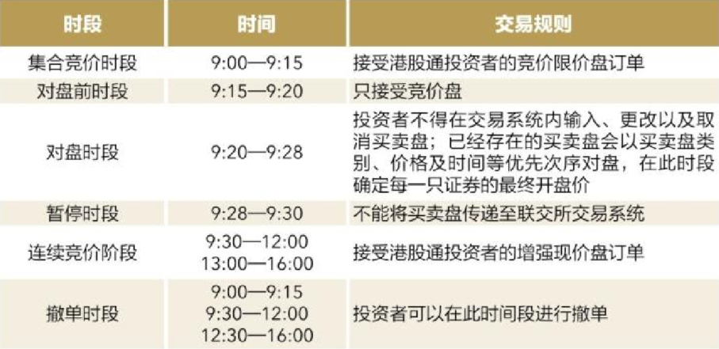

2. 港股通的交易对象

（1）港股通股票池中没有风险警示标记。

投资者在参与港股通交易时需留意，联交所交易股票一般而言并没有如内地市场在证券代号前加入标记（例如，ST及*ST）以警示风险的做法。如果投资者想要了解某上市公司股票的风险，那么可以通过登录联交所“披露易”网站的方式查询相关公告。

有关上市公司的财务状况，投资者可以在“披露易”网站，通过查询上市公司发布的业绩公告及财务报告的方式了解。另外，根据《上市规则》规定，上市公司有关公告/报告需载于其网站至少5年。

有关上市公司以往是否被交易所公开披露或谴责，该上市公司是否已进入除牌程序的信息，投资者可以通过“披露易”网站内的“上市公司公告”—“进阶搜寻”的“标题类别”中选择“监管者发出的公告及消息”，翻查相关记录。

有关已停牌上市公司的每月报告，投资者可以登录“披露易”网站，在“发行人相关资料”栏目中查阅“有关长时间停牌公司之报告”，具体了解停牌3个月或以上的上市公司的每月报告。

（2）内地投资者买卖港股通股票持股比例限制。

现行香港特别行政区法例通常没有对单一投资者持股比例限制的相关规定，但是个别上市公司章程可能对投资者的持股比例限制有要求，因此，内地投资者参与港股通交易时，还应留意并遵从相关规定。

（3）投资者持有港股通股票超过一定比例需要披露。

根据香港特别行政区《证券及期货条例》规定，首次持有上市法团5％或以上任何类别带有投票权的股份（香港上市法团可发行不带有投票权的股份）的个人及法团（该主体被界定为上市法团的大股东）必须披露以下相关信息。

① 在该上市法团持有的带投票权的股份的权益及淡仓（即空头头寸）。

② 所持有上市法团的股本衍生工具，包括大股东持有、沽出或发行的股本衍生工具，以及大股东行使、转让或不行使该衍生工具之下的权利，该权利可能导致股份会被交付持有人或由持有人交付他人。

③ 下列有关大股东权益及淡仓的变动。

a.持股量的百分率数字上升或下降，导致大股东的权益跨越某个处于5％以上的百分率整数。例如，大股东的权益由5.8％增至6.3％时，跨越6％时需要披露其权益变动。

b.大股东持有需申报的权益，而该股份权益的性质有所改变。

c.大股东持有需申报的权益，以及在披露期间持有或不再持有超过1％的淡仓。

d.大股东持有需申报的权益，而淡仓的百分率数字上升或下降，导致大股东的淡仓跨越了某个处于1％以上的百分率整数。

具体申报的时间为，大股东在知悉上述事件的当日起3个营业日内。在购买股份时，大股东通常应在订立有关购买股份的合约后3个营业日内送交通知存档；售卖股份后，大股东通常需要在结算日后3个营业日内送交通知存档。但是，《证券及期货条例》并未禁止该大股东在该3日内买卖有关上市发行人的股份。

以上只能扼要地说明香港《证券及期货条例》的相关规定，无法详尽表述所有情形，因此，个别案例需视情形而定。

（4）大股东豁免申报其权益的情形。

在规定的情形下，大股东也可以豁免申报其新的权益。也就是说，尽管大股东取得股份权益或不再持有股份权益，以及其权益的百分率水平因跨越某个百分率水平，但是在满足相应情形规定时，无须申报其新的权益。例如，大股东权益的百分率水平等于或低于其在“最后一次具报”时所申报的百分率水平；以及其在“最后一次具报”时所申报的权益的百分率数字与它自那时起的所有时间内的权益的百分率水平之间的差别，少于有关的上市法团属同一类别的已发行股本的0.5％时无须申报其新的权益。

> **提示**
>
> 投资者买卖港股通股票禁止裸卖空。
>
> 投资者买卖港股通股票，当日买入的股票经确认成交后，在交收前可以卖出。
>
> 投资者买卖港股通股票不得参与香港市场的对盘系统外交易（类似于大宗交易）。

### 港股通股票信息披露

作为港股通的投资者，必须知道港股通股票信息披露的相关问题。

1. 投资者获取港股通股票披露信息的途径

沪港通业务不改变现有沪港两地市场监管架构和市场运行模式。其中，港股通股票的相关信息披露，直接适用联交所上市公司信息披露的相关规定。

内地投资者既可以通过登录联交所“披露易”网站获取上市公司披露的信息，也可以通过上市公司自设的网站等途径获取。至于上市公司自设的网站的网址，投资者可以通过查阅联交所网站的“网上联系”栏目获取。

2. 查阅港股通股票以往发布的信息披露文件的方法

联交所上市公司信息披露的文件包括以下几类：公告及通告，通函，财务报表/环境、社会及管治资料，月报表等。通常，联交所上市公司在发布年报前，会预先披露全年业绩公告（属于公告及通告的一类）。其中，投资者较为关注的公司主要经营状况、财务数据均会在全年业绩公告中有所体现。

具体而言，投资者查询上市公司公告的方式有以下几种。

（1）从“披露易”网站内“上市公司公告”一栏内选择“进阶搜寻”查询上市公司的公告。具体操作时，投资者可在“现有上市证券”栏内输入股份代号或股份名称（繁体字或英文），在“标题类别”中选择“公告及通告”及“财务资料”，以查看该公司的董事会会议召开日期、业绩公告内容、股息分派详情等。

（2）在“披露易”网站上，从“发行人相关资料”栏目下的“董事会会议通知”及“证券持有人享有的权益（股息及其他）”查阅近期公司发布的有关资料。

（3）登录联交所网站，在“中国证券市场网页”栏目下的“上市公司”中搜寻上市公司曾发布的公告和派息记录等。

下面就以中信银行为例介绍如何在披露易网站查询港股的财务数据以及公告。

1　打开同花顺软件，单击菜单栏中的【拓展行情】【港股】【AH股列表】。

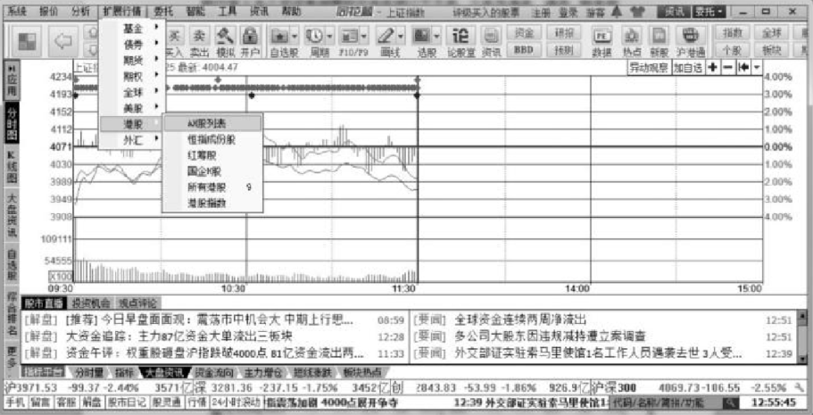

2　进入AH股列表界面之后，向下翻页查询到中信银行的港股代码“00998”。

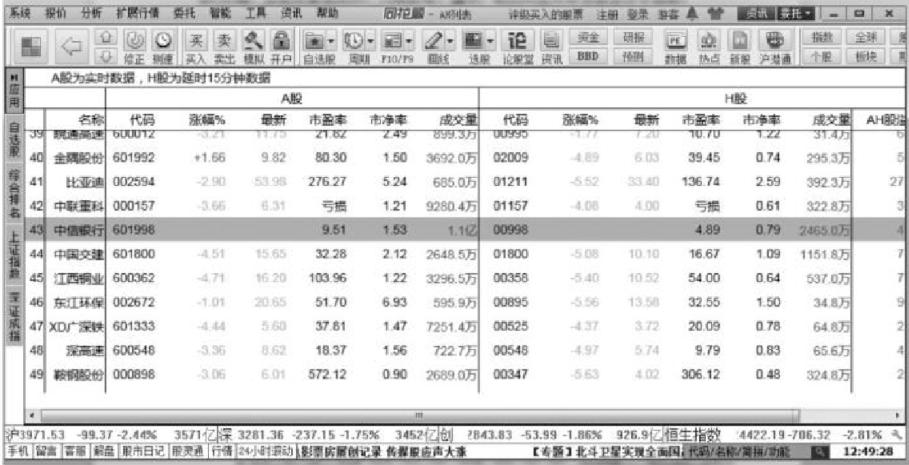

3　打开披露易网站，单击【进阶搜寻】选项，进入进阶搜寻页面。输入中信银行港股代码“00998”，然后单击【搜寻】按钮。

4　进入搜索结果页面，此时搜索出来的是该公司自申请上市至查询日止所有需披露的信息，包括年报、半年报、业绩公告、重大事项声明等。查询结果是按照时间排序的，最新的披露事项排列在最前面。

3. 港股通股票最新信息及公告刊登在“披露易”网站的时间

根据规定，上市公司应当通过联交所电子呈交系统“披露易”网站发布公告。该系统的操作时间为每个交易日6：00—23：00，以及交易日之前的非交易日18：00—20：00。

提示投资者关注，不同类型文件在“披露易”网站刊登的时间不尽相同。

（1）公告及通告不得在正常交易日8：30—12：00或12：30—16：15期间，或者在圣诞节前夕、元旦前夕及春节前夕（不设午市交易时段）8：30—12：00的期间刊登。但是，海外监管公告、没有附带意见的股价或成交量异动的澄清公告、没有附带意见的新闻报道或报告的澄清公告、短暂停牌或停牌公告这四项公告不受此约束，投资者可以及时了解。

（2）股息及业绩公告，一般应在正常交易日12：00—12：30或16：15收盘后公布。

（3）例如，“通函”及“年报”等其他类型的上市公司文件，在交易日6：00—23：00期间及在交易日之前的非交易日18：00—20：00期间随时刊登。

4. 查阅联交所上市公司股东及董事的名单

如果投资者想查询联交所上市公司的股东名单，那么分两种情况：一是持有该上市公司股票的投资者可以免费查询存放于公司股份过户处的股东名册；二是未持有该公司股票的投资者在向股份过户处缴付费用后，也可以查询该股东名册。

对于董事名单，投资者不仅可以在上市公司的年报或最近刊登的公告或通函中查看，也可到“披露易”网站上“发行人相关资料”下的“董事名单”栏目下载，或者按照股份代号、上市公司名称或董事名单查找。

### 港股通股票的停牌、复牌和除牌

投资者除了要了解交易港股通相关的交易规则、信息披露之外，还需要对港股通股票的停牌、复牌和除牌有一定的认识。

（1）港股通股票是否会在交易时段内因为股价波动暂停交易？

尽管联交所市场没有涨跌停板制度，但仍有一套关于股价及成交量波动的市场监察机制。

如果联交所通过市场监察察觉到上市发行人的股价或成交量出现异常波动，或媒体刊登了可能影响上市公司股价或交易的报道，或者市场出现了相关传闻，那么为了维持市场的公平有序，联交所会联系上市公司。上市公司必须立即对此做出回应，并履行《上市规则》中规定的持续披露义务，及时公布避免其股票出现虚假的相关资料，或者根据《证券及期货条例》第XIVA部条款规定应当予以披露的任何内幕消息，并确保这些资料能够公平发布。上市公司如果不知道有任何事宜或者发展会导致或者可能导致其股价或成交量出现异常波动，那么应当尽快通过“披露易”及其网站刊发公告说明情况。上市公司及时刊发了有关公告，则无须短暂停牌或停牌。

如果情况需要，例如发现或怀疑有关股价或成交量的异动是由于泄露了某些根据《证券及期货条例》第XIVA部条款规定应予披露的内幕消息所致，那么上市公司应当立即公布相关资料或者根据《证券及期货条例》第XIVA部条款需披露的任何内幕消息。否则，上市公司股票可能被联交所短暂停牌或停牌，待公告发出后再恢复交易。

有关上市公司“股价或成交量异动”，是指一家上市公司的股价及（或）成交量出现了没有明显原因的异常表现。例如，大市下跌，但公司股价却大幅上涨，或者成交量突然大幅增加。至于股价或成交量的波动幅度是否属于“异常”，则由联交所参照有关股票的过往表现，或该股票所属行业的其他股票的表现，以及大市的整体情况等做出判断。

（2）联交所会主动将上市公司股票停牌或除牌吗？

联交所在其认为适当的情况及条件下可能会指令上市公司的股票短暂停牌、停牌或除牌。具体情况如：发行人（即上市公司）未能遵守《上市规则》的规定，且情况严重；发行人股票的公众持股量不足；发行人进行的业务活动或拥有的资产不足以保持其证券继续上市；发行人或其业务不再适宜上市。

对于主板上市公司而言，如果其停牌已经持续很长一段时间，但未采取足够行动以争取公司股票复牌，那么可能会导致除牌，即公司股票被摘牌。

其一，联交所可以根据主板《上市规则》第17项应用指引规定的程序将出现严重财务困难及/或未能维持足够业务运作下长期停牌的主板公司除牌。如果该上市公司的证券已停牌6个月或以上且又未能符合有关主板《上市规则》的规定，那么联交所将决定该公司是否需要进入除牌程序的第二阶段。进入该阶段的上市公司将有6个月的时间向联交所提交可行的复牌建议。如果上市公司未能在限期内提交可行的复牌建议，那么将会进入除牌程序的第三阶段。进入第三阶段除牌程序后，上市公司将有最后6个月向联交所提交可行的复牌建议。若发行人在该阶段届满时仍未能提交可行的复牌建议，上市公司的上市地位将会被取消，即被除牌。

其二，如果公司涉及被监管机构调查、存在会计失当、未能刊发财务业绩或内部监控严重不足等情形，以至于根据《上市规则》规定而停牌的，那么为维持市场公平有序及信息公开，该上市公司也将被停牌。

其三，联交所还可以根据主板《上市规则》第6.10条规定将主板公司除牌。诸如，联交所认为该主板公司或其业务不再适合上市，那么联交所将刊登公告，公布该公司的名称，并列出限期，以便该公司在限期内对导致其不适合上市的事项做出补救。

例如，除主板《上市规则》第21章所界定的“投资公司”及主要或仅从事证券经纪业务的上市公司，无论是主板公司或创业板公司，如果公司全部或大部分的资产为现金或短期证券，那么联交所将视为其不适合上市并将其停牌。在停牌期间，如果该公司经营有一项适合上市的业务，那么可向联交所申请复牌。联交所会将其复牌申请视为新申请人提出的上市申请处理。如果在此情形下公司停牌持续超过12个月，或者在任何联交所认为有需要的其他情况下，联交所都有权取消该公司的上市资格。

（3）港股通股票停牌后，复牌流程是怎样的？

根据联交所《上市规则》规定，上市公司股票应当尽可能持续交易，因此，暂停交易只是处理潜在及实际出现的市场特殊情况的手段，即使必须停牌，那么停牌的时间也应尽可能缩短。

如果公司被联交所停牌，那么上市公司应向市场发出简短公告解释停牌的原因，以增加市场透明度。联交所也会在停牌期间与上市公司保持持续联络，并要求上市公司在股票复牌前发出公告。

具体的复牌程序将视情况而定，联交所保留附加其认为适当的条件的权力。一般情况下，当上市发行人发出适当的公告后，或当初要求其短暂停牌或停牌的具体理由不再适用时，联交所会让公司复牌；在其他情况下，短暂停牌或停牌将持续至发行人符合所有有关复牌的规定为止。

（4）联交所上市公司发布澄清公告后，其股票是否立即恢复交易？

联交所上市公司在公布了避免其股票出现虚假市场的任何资料或内幕消息之后，可在接下来的交易时段开始时恢复交易。相关公告应具备充足资料，以使得有关股票在公平及市场已广泛知晓相关信息的情况下恢复交易。

（5）投资者如何处理已停牌联交所上市公司的股票？

公司股票被联交所短暂停牌或停牌后，在停牌期间，投资者暂时不能再买卖。如果投资者持有该股票，那么应当密切留意上市公司通过“披露易”网站发布的最新公告，了解公司股票恢复交易的信息。如果主板及创业板上市公司已经被停牌3个月或以上，那么投资者可以通过“披露易”网站，在“发行人相关资料”栏目内查阅“有关长时间停牌公司之报告”，了解该上市公司的每月报告。

### 港股通投资的风险

对于内地投资者来说，即使十分了解港股通的交易规则等内容，依然要树立风险意识。除了投资者已经熟知的股价价差风险之外，还有许多其他要关注的风险类型。内地投资者投资香港市场可能面临如下几种主要风险。

1. 市场联动风险

由于香港市场外汇资金可以自由流动，海外资金流动与港股价格之间表现出高度关联性，因此，投资者在参与港股市场交易时受全球宏观经济和货币政策变动导致的系统风险相对较大。

2. 无涨跌幅限制的股价波动风险

由于港股市场实行T＋0交易机制，且不设涨跌幅限制，加之香港市场结构性产品和衍生品种类相对丰富，因此，香港市场个股的股价受到意外事件驱动的影响而表现出股价波动的幅度相对A股更为剧烈。

3. 个股的流动性风险

在香港市场，部分中小市值股票成交量相对较少，流动性较为缺乏，投资者持有此类股票，可能缺乏交易对手方，因此面临小量抛盘甚至导致股价大幅下降的风险。

除了上述港股通投资风险之外，投资者还需要注意以下事项。

（1）订单类型。

在试点初期，港股通投资者在联交所开市前时段仅能输入竞价限价盘，在持续交易时段仅能以增强现价盘进行买卖。

（2）额度控制。

试点初期，港股通总额度为2500亿元人民币，每日额度为105亿元人民币。注意，额度统计口径为买卖相抵后的净流量。内地投资者应当充分了解因港股通额度控制可能造成的买单交易无法及时执行，从而遭受损失的风险。

（3）交易日。

香港与内地A股市场的交易日并不完全一致。沪港通在沪港两地均为交易日且能够满足结算安排时开通，投资者在参与港股通交易时需要充分了解。

（4）货币兑换。

作为港股通标的的联交所上市公司股票以港币报价，以人民币交收。因为港股通相关结算换汇处理在交易日日终而不是交易日日间进行，所以投资者需要关注由不同交易时间结算造成的汇率风险。

（5）投资标的。

投资者可能面临因为标的证券被调出港股通标的范围而无法继续买入的风险，以及由此可能遭受的经济损失。

## 港股通业务的开通与交易

由于沪港通对于内地的投资者而言，只能通过内地的券商交易平台开通港股通交易业务。本小节就针对港股通业务的开通资格，开通方法，选择券商、银行以及港币的兑换进行一一介绍。

### 港股通业务的开通资格

根据上海证券交易所要求，申请开通港股通业务需要具备以下条件。

（1）拥有沪市人民币普通股账户。

（2）机构投资者或者证券账户及资金账户资产合计不低于人民币50万元的个人投资者。

（3）熟悉香港证券市场相关规定，了解港股通交易的业务规则与流程。

（4）不存在严重不良诚信记录。

（5）不存在法律、行政法规、部门规章、规范性文件和业务规则规定的禁止或限制参与港股通股票交易的情形。

### 开通方法

港股通的开通方式主要有两种：一是通过券商的网上营业厅自助办理港股通业务；二是到原开户券商柜台现场办理港股通业务。

1. 临柜办理流程

投资者可携带有效身份证明文件及沪深股东卡（若有）至开户营业部临柜办理。本节着重介绍沪港通业务的网上自助办理流程。

2. 网上营业厅自助办理流程

（1）以申万宏源证券为例，投资者首先打开所在券商网上营业厅主页，输入资金账号和密码登录网上营业厅。

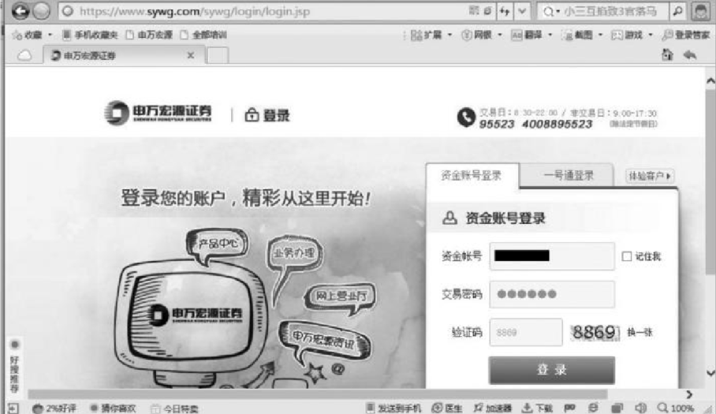

（2）单击【自助业务办理】选项进入自助业务办理中心页面。单击【全部业务栏】菜单栏内的【沪港通】选项，出现的页面如下图所示。

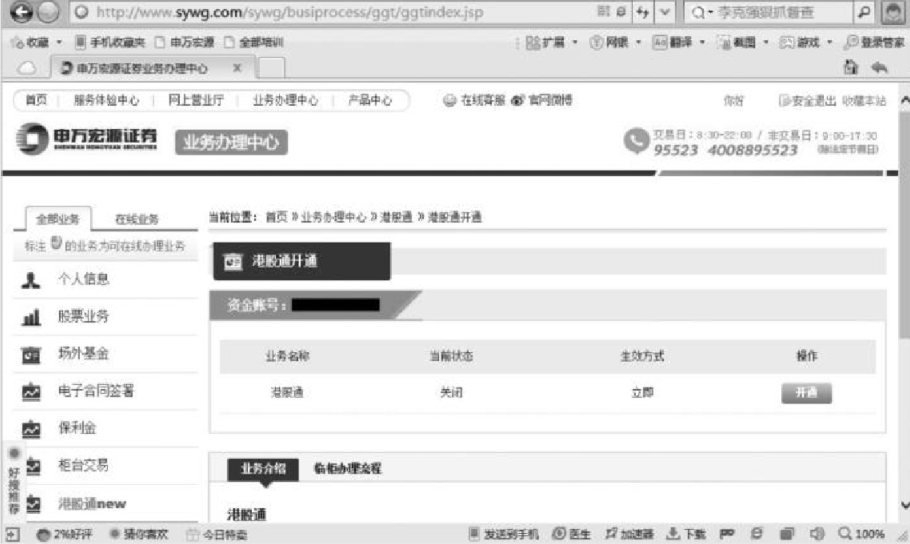

（3）单击黄色的【港股通开通】按钮，进入港股通开通页面。投资者首先要重新做风险承受能力测评。测评分数达到60分以上才可以开通港股通业务。

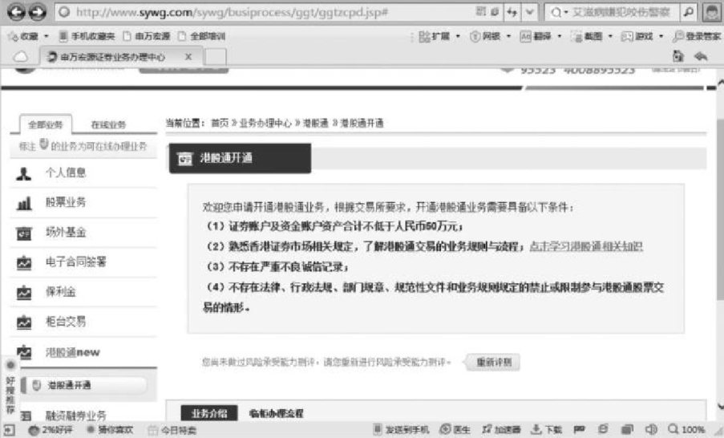

（4）风险承受能力测评通过之后投资者，还需进行港股通知识水平评估。评估结束后，投资者需要认真阅读《港股通委托协议》与《港股通交易风险揭示书》，阅读完毕之后在【我已阅读并同意以上所有协议】选项框打对勾，然后单击【确认】按钮。

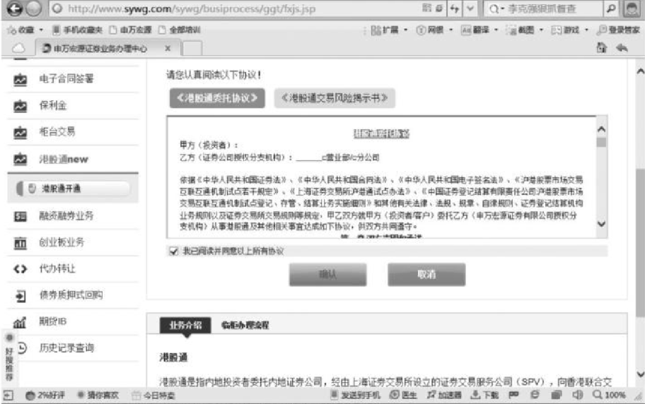

（5）页面自动跳转至已开通页面，单击【完成】按钮。

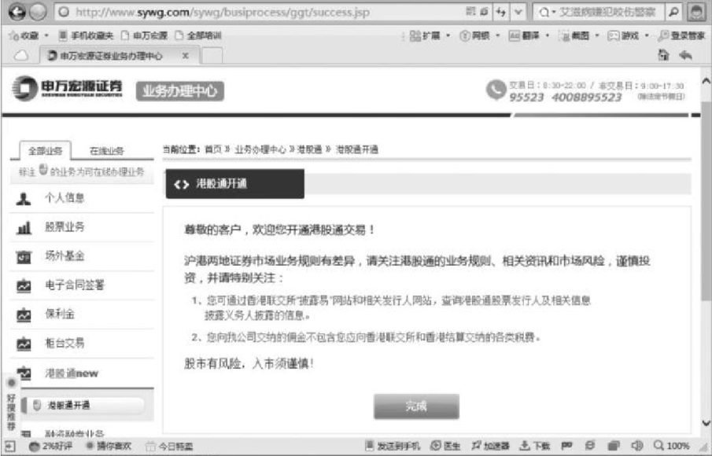

（6）查看自己的资金账户状态为港股通开通状态。

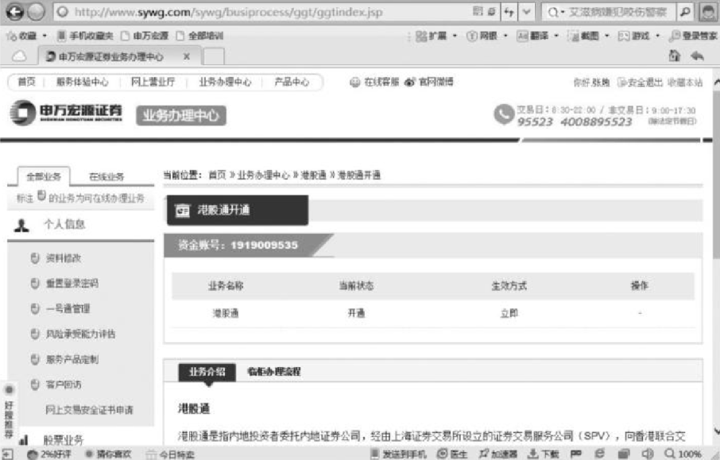

### 选择券商和银行

2014年11月17日，上交所网站公布了首批获得沪港通业务资格的券商，首批共有89家券商入围。银河证券、广发证券、国泰君安、申万宏源、方正证券、信达证券、华泰证券、中原证券等获批开通沪港通业务交易权限。投资者如果是在上述券商开立的人民币普通股账户，则可以直接开通港股通业务。相关的三方存管签约银行为普通股资金账户的签约银行，投资者不必二次签约。

### 港币的兑换

投资者在买进港股的时候，人民币均按照港币现汇的卖出价换算，卖出的时候，按照港币现汇的买入价换算。如此一来，买进卖出，除了交易成本，还有汇率转换成本。投资者不要轻视汇率买进和卖出价的价差，数额有时可达千分之三以上。因此，投资者想要做港股的短线交易成本太大，从买入A港股换到买入B港股的成本也过高。

投资者可以在百度网站搜索每日人民币兑港元的即时信息，或者登录财经类网站（和讯网、新浪财经等）对汇率进行实时查询。

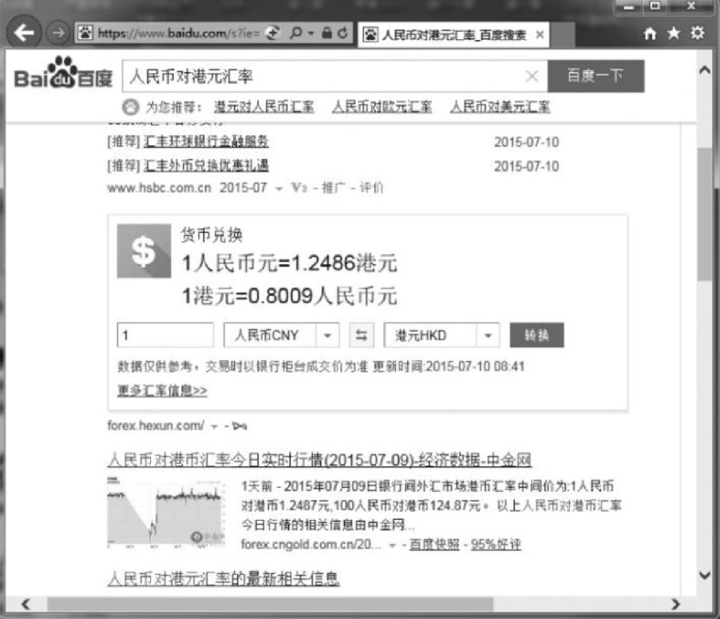

投资者若想要了解更多港股通相关知识，可登录上海证券交易所沪港通业务交易专区网站进一步了解。

## 深港通的调研

沪港通的实施与上海自贸区政策的落实，已逐步表明了中国资本市场开放的态度，紧接着，我国资本国际化的步伐也将继续加快，“深港通”将成为接下来中国证券市场开放的又一里程碑事件。

深港通是深港股票市场交易互联互通机制的简称，指深圳证券交易所和香港联合交易所有限公司建立技术连接，使内地和香港投资者可以通过当地证券公司或经纪商买卖规定范围内的对方交易所上市的股票。沪港通和“深港通”的有序推进给了外界一个明确的信号—中国资本市场将稳步推进对外开放。目前A股市场已经在国际化道路上小步前行。通过上海市场与香港市场之间的互联互通作为过渡，深圳市场与香港市场的互相开放将在不久的将来得以实现。未来还有望与其他市场加强沟通和合作，进一步拓宽国际合作渠道，预计未来10～20年A股将成为一个国际化的市场。

如果深港通正式启动，将对深圳市场和港股市场均产生深远的影响。主要表现在以下几个方面。

（1）在香港资金的刺激之下，深圳市场可能会迎来新一轮上涨行情。

（2）有助于深圳市场学习香港市场的各项制度，进一步完善本土市场的制度。

（3）前海深港合作区也许会成为连接深圳与香港之间的一体化的战略平台，深港通有可能将前海深港合作区作为先行试点。

（4）前期在沪港通开立之后，由于沪深两市资金流动有所不同，上证指数的上涨幅度超过了深成指的涨幅。若深港通开通，深市中小板、创业板可能迎来突破性的发展。

（5）香港市场中的某些稀缺的股票将会受益，而某些高估值的股票可能会受到一些负面的影响。

（6）香港市场是全球金融市场中估值很低的市场，而深圳的创业板市场在全球属于估值较高的市场，二者相差数倍。开通深港通有可能造成资金的单向流动，给港股带来影响。

# 高手秘技

## 技巧1 如何选港股

> 港股市场是全球范围内估值较低的资本市场，与A股市场相比，港股的估值非常低。Wind资讯统计显示，香港恒生指数目前市盈率只有10.17倍，A股上证指数市盈率则已达17.32倍，恒指比上证指数便宜四成以上。
>
> 投资者一般遵循价值投资的策略投资港股。
>
> 首先，看上市公司是不是大公司，是否拥有较强的实力。港股投资者最看重公司的实力，公司越大越好，例如长和、中电控股等。
>
> 其次，看上市公司分红多不多，许多投资港股的投资者靠获取分红赚取盈利。因为港股股价波动不大，并且交易一次的费用比内地的交易费用高许多，所以有许多港股不适合做差价。

## 技巧2 如何结合A股投资H股

> 众所周知，港股和A股联动性很高，A＋H股的联动性更加紧密。A＋H股是既作为A股在上海证券交易所或深圳证券交易所上市，又作为H股在香港联合交易所上市的股票。虽然A＋H两地的股价走势不会完全一样，但是二者之间是高度相关的关系。投资者可以观察两者之间的变化，发现投资机会。
>
> 如果A股市场股价率先下跌，并且跌势有进一步扩大的态势，那么H股在未来的一段时间也会受牵连下跌；反之，A股率先上涨，可能会带动H股上涨。以山东墨龙（002490）为例，A股山东墨龙于2015年6月16日开始下跌，跌势首先持续4天，之后股价小幅反弹两天后再次一落千丈。而港股的山东墨龙（00568）在2015年6月16日并没有像A股一样大幅下跌，但是此后的走势受到A股大跌的影响，最终于2015年6月26日开始下跌。此时投资者如果关注了A股对于H股的影响，可以大胆做空山东墨龙，将会有不小的收益。由此可见，投资者可以借助于A＋H股之间的联动性更好地挖掘投资港股的机会。

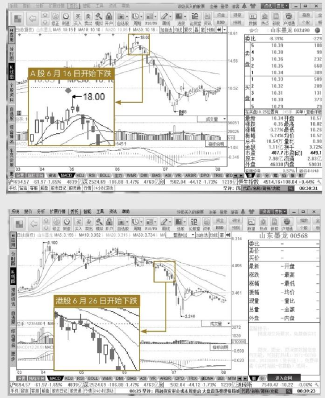