# 涨跌都能赚钱——融资融券及股指期货

**本章引语**

> 两条腿走路。
>
> ——周恩来
>
> 
>
> 如果说资本市场中的风险投资是一个人在行走，股票市场是一条腿，融券交易与股指期货则是另一条腿。在2010年推出股指期货和融资融券之前，我国的股票市场一直没有做空工具，只有在牛市中，投资者才能够赚到钱。股指期货与融资融券的推出，填补了我国金融期货的空白，在健全了我国资本市场的功能与体系的同时，也为投资者在熊市提供了有利的做空产品，投资者在熊市当中也可以获取收益。

**本章要点**

> ★双向交易
>
> ★杠杆交易

## 股指期货与融资融券简介

股指期货是金融期货中产生最晚的期货品种，但也是目前全世界交易最活跃的期货品种。1982年2月，美国堪萨斯期货交易所上市了第一个股指期货品种——价值线综合指数期货，自此，股指期货日益受到各类投资者的重视，各地区纷纷推出股指期货品种。股指期货的交易规模迅速扩大，交易品种不断增多。目前，股指期货交易在全球范围内已成为所有期货交易品种中成交量第一的期货品种。

2010年4月16日，中国金融期货交易所（以下简称“中金所”）推出了沪深300股指期货合约，该股指期货的推出填补了我国金融期货的空白。随后在2015年4月16日，中金所又推出上证50、中证500股指期货合约，进一步健全了我国金融市场的功能与体系，提高了国民经济抗金融风险的能力。股指期货的推出在规避股价大幅波动给股票投资带来巨大风险的同时也保护了广大投资者的利益。

### 什么是股指期货

投资者若想了解股指期货的含义，首先要了解什么是期货。期货又称期货合约，是指由期货交易所统一制定的、规定在将来某一特定时间和地点交割一定数量标的物的标准化合约。期货合约的标的物就是所对应的现货，可以是某种商品（例如黄金、白银），也可以是某种金融工具（例如债券、外汇），还可以是某种金融指标（例如沪深300指数、上证50指数）。因此，期货可以大致分为两大类：商品期货与金融期货。

股指期货的全称是“股票价格指数期货”，又被称为“期指”，是指以股票市场的价格指数作为交易标的物的期货，是买卖双方根据事先的约定，同意在未来某一个特定的时间按照双方事先约定的股价进行股票指数交易的一种标准化协议。股指期货既具有股票性又具有期货性。其交易对象是股票指数，以股票指数的变动为标准，以现金进行结算，交易双方并不必须持有股票。

### 股指期货的特点

投资者在证券市场中所遇到的风险一般分为两类：一类是系统性风险；另一类是非系统性风险。系统性风险是指大多数股票价格波动引发的风险。非系统性风险是指单个股票价格波动的风险。通过投资策略组合，投资者可以买入多只风险不同的股票，较好地规避非系统性风险，但是并不能有效地规避系统性风险。也就是说，当投资者在遇到熊市行情时，将面临大多数股票下跌的风险。

为了规避上述的系统性风险，也就是市场的方向发生改变，投资者可以利用股指期货进行套期保值，即在股票市场买入做多的同时，在股指期货市场反向做空，以此来减少熊市大跌给自己带来的损失。例如，投资者在熊市持有股票，为了减少股票下跌所带来的损失，在股指期货市场做空单，如果股价下跌，虽然股票方面受损失，但是股指期货盈利，抵消股票上的损失。

由于股指期货同时具备股票性与期货性，所以股指期货主要具有以下几个特点。

（1）双向均可开仓。

在我国的证券市场上，所有的股票都可以先买入后卖出，只有部分股票可以进行融券业务，投资者可以先向所在的证券公司借股票卖出，然后再买入股票，还给证券公司，这种交易方式相当于期货里面的做空。在期货市场，股指期货遵循双向开仓的交易规则，投资者可以在预期未来股市总体趋势下跌时做空股指期货，在下跌行情中也能够赚钱，而不是被动地等待股市见底。

（2）期货合约有期限，不可无限期持有。

对于股票来讲，投资者在买入股票之后，如果想要做长线投资，可以一直持有股票不卖。但是股指期货与股票不同，股指期货都有固定的合约到期日，到期就要求投资者清仓。如果投资者想要继续交易，则需要移仓（例如，如果做多，则卖出平仓本期合约，然后买入开仓下个月合约）。因此股指期货不可以像买股票一样，买入之后就不管不问了，必须注意合约交割日，并提前了结。股指期货的交割日期为每个月第三个星期五。

（3）交易成本比股票交易成本低。

2012年9月1日起，沪深300股指期货手续费标准调整为成交金额的万分之零点二五。假如投资者开一张股指期货的多单，成交额为20万元，则需要花费20×0.25=5（元）交易费用。如果投资者想要买卖20万元的股票，按佣金比例万分之三计算为20×3=60（元）。因此，股指期货的交易成本比股票投资的交易成本低很多。

（4）交易标的的非实物性。

股指期货合约的交易对象是股票价格指数，目前我国的股指期货品种的标的股票指数为沪深300、上证50和中证500指数。虽然股票指数与股票有很强的关联，但并不是股票本身。如果投资者持有某公司股票，则投资者就是股东，可以行使股东的权利。但是持有股指期货的投资者，手中所持有的只是指数合约，投资者买卖的仅仅是数字的升降。一般而言，所有持股的股东都希望股价上涨，而空头期货合约的持有者则是期待股指的下挫。

（5）股指期货实行现金交割方式。

与商品期货在期货合约到期的时候会有一部分合约进行实物的交割的方式大大不同，股指期货在期货合约到期时只计算盈亏，投资者只需要多空都平仓。虽然股指期货合约是建立在股票市场上的金融衍生品，但股指期货实行现金交割的方式进行了结头寸。

（6）保证金制度，逐日盯市制度。

股指期货交易实行保证金制度，投资者在买卖期货合约时，不需要支付合约的全部资金，而只需要支付相应比例的保证金。逐日盯市制度是指在每日收市后，对所有未平仓的合约按照当日的结算价计算盈亏。如果投资者开仓方向与市场走势相反，则会亏损，缴纳的保证金一旦触发平仓线时，投资者的合约将面临被强平的风险，因此投资者必须及时补仓，缴纳补充保证金。

（7）流动性较高。

我国的股票市场实行T＋1交易制度，也就是说，投资者当日如果买入股票，当日不可以卖出，因此股票当日的成交量绝对不可能超过其流通盘的总量。但是股指期货遵循期货市场的交易规则，实行T＋0交易制度，也就是说，投资者在一个交易日内可以进行多次买入或者卖出操作。因此交易量可以无限放大，市场的流动性也因此很高。

股指期货交易与股票交易的主要区别如下表所示。

|      |      |      |
| ---- | ---- | ---- |
|      |      |      |
|      |      |      |
|      |      |      |
|      |      |      |
|      |      |      |
|      |      |      |
|      |      |      |

###  股指期货的起源

20世纪70年代初，随着第二次世界大战的结束，国际形势发生急剧变化，布雷顿森林体系随之解体，固定汇率制被浮动汇率制所代替，利率管制等金融管制政策逐渐被取消。由于西方国家饱受石油危机的严重影响，经济发展的稳定性极差，汇率、利率频繁又剧烈地波动，导致股票市场价格大幅波动。因此投资者迫切需要一种能够有效规避风险，实现资产保值的金融工具。于是，金融期货应运而生。

1972年5月，芝加哥商业交易所（CME）设立了国际货币市场分部（IMM），首次推出了外汇期货合约。1975年10月，芝加哥期货交易所推出了“国民抵押协会债券”——史上第一个利率合约。1977年8月，“长期国债期货合约”在芝加哥期货交易所上市。在上述的金融期货产品相继问世之后，美国堪萨斯期货交易所（KCBT）推出了价值线综合指数合约，宣告了史上第一个股指期货合约品种的诞生。

在自此之后的3年时间里，投资者逐渐改变了以往投资股市的方式，在对股票组合进行投资的同时，在股指期货市场进行反向操作，进一步达到套期保值的目的，有效规避股票下跌所带来的风险。

### 股指期货的发展

随着股指期货市场的不断发展，由于其具有流动性强、交易成本低以及具有套期保值功能等优点，逐渐受到了投资者的关注，越来越多的投资者参与到投资股指期货当中，股指期货的功能在这一时期内逐步被民众接受并认同。鉴于美国股指期货交易发展呈良好态势，其他经济发达地区纷纷效仿，开发股指期货产品，形成了世界性的股指期货交易的热潮。新加坡、伦敦、香港、悉尼以及多伦多等地先后推出了股指期货金融产品。随着股指期货交易市场数量增加，越来越多的股票投资者加入了股指期货交易的行列，他们熟练地运用这一金融工具对冲风险和谋取价差。1986—1987年这段时期是股指期货高速发展时期，期货市场的特点得以完全体现。由于市场逐渐趋于成熟，因此无风险套利行为变得无利可图，但是更为复杂的动态交易模式逐渐崭露头角。

1987年10月19日，华尔街股市大崩溃。道琼斯指数暴跌508点，跌幅近25％，进一步引发全球性的股灾。1988年Bra街委员会在报告中明确指出股指期货的指数套利和组合保险是造成此轮股灾的元凶。股指期货的投资机构为了尽快清理掉所持有的股指期货头寸，在期货市场上大肆平仓股指期货合约。大量平仓行为导致股指期货贴水行情，即股指期货的价格明显低于现货市场对应的股票指数所对应的价格。由于股指期货与指数出现背离的现象，指数套利者利用期货与现货之间的基差进行指数套利（买进股指期货合约同时卖出相应股票），因此期货市场的价格下跌导致现货市场的价格进一步下跌，形成了恶性循环。1987年的股灾给美国的金融市场带来较大冲击，交易量因此大幅度减少，股指期货进入停滞阶段。此后，美国的学术界通过研究发现股指期货并不是导致1987年股灾的真正元凶。尽管如此，各地区的期货交易所和证券交易所为了防止股票市场价格的巨幅下跌，均采取了多项限制措施。

随着市场对股指期货的认识进一步完善，股指期货在20世纪90年代后出现一片繁荣的景象。全球主要股票市场繁荣催生大量的机构投资者，拥有雄厚资金实力的投资机构利用股指期货进行风险对冲和套利的需求明显增加，因此股指期货的交易规模不断增长，步入了快速发展的阶段。

我国证券市场起点较晚，1990年我国上海证券交易所与深圳证券交易所成立。直到2010年4月16日，上海的中金所才推出了我国证券交易史上第一个股指期货合约——沪深300股指期货合约，该股指期货的推出填补了我国股指期货的空白。沪深 300指数主要是反映上证以及深证选入的300家业绩优良的上市公司股票总体趋势。该股指期货合约的推出，引起了金融界的广泛关注。2014年我国金融期货市场累计成交量为2.17亿手，累计成交额为164.01万亿元，一跃成为所有期货品种当中成交量最活跃的期货品种。

2015年4月16日，中金所又推出上证50、中证500股指期货合约，进一步健全了我国金融市场的功能与体系。上证50股指期货合约主要反映蓝筹股的整体走势，中证500股指期货主要反映中小板上市公司股票的整体走势。这两种股指期货的推出既丰富了我国股指期货的投资品种，为广大投资者提供了风险对冲的产品，又健全了股指期货市场的功能，提高了国民经济抗金融风险的能力。

## 融资融券简介

我国融资融券业务始于2010年3月31日，上海市场和深圳市场均可接受融资融券的申报。融资融券交易具体可分为融资交易与融券交易，融资交易是指投资者向具有融资融券业务资格的证券公司提供担保物（可以是资金也可以是所持有的股票），借入资金买入证券；融券交易是指向证券公司借入证券并卖出，然后再买进获利的行为，如下图所示。

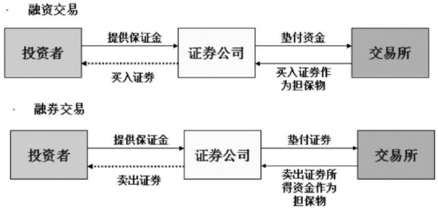

### 融资融券的发展历程

融资融券业务实施步骤如下图所示。

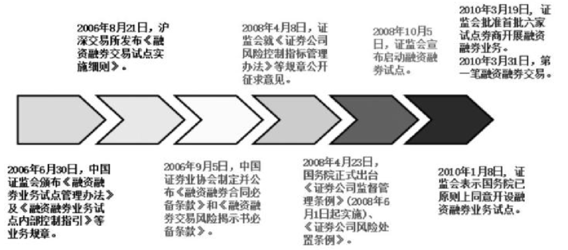

### 融资交易与融券交易

融资交易是指投资者向证券公司交纳一定的保证金，融入一定数量的资金买入股票的交易行为。投资者向证券公司提交的保证金可以是现金也可以是所持有的股票。投资者在开立信用账户之后，可以在授信额度内买入融资标的名单内的证券。如果融资买入的股票价格上涨，投资者盈利，只需高价卖出股票归还欠款。如果融资买入的股票价格下跌导致投资者亏损，这就需要投资者拿自己的资金来归还欠款。

融券交易是指投资者向证券公司交纳一定的保证金，融入一定数量的证券并卖出的交易行为。投资者融入的证券并不计入投资者的信用证券账户，而是在融券卖出成交当日结算时由证券公司代为支付，卖出证券所得资金除买券还券外不得作其他用途。如果投资者认为后市即将下跌，可以借入股票卖出，待股价下跌之后再买入还券，从中获利；或通过融券对冲已持有证券的下跌风险，以套期保值。

融资融券交易中的担保物是指投资者向证券公司借款买卖股票的抵押物和向证券公司借券的抵押物，担保物分别存放在客户信用交易担保证券账户和客户信用交易担保资金账户，作为对该客户融资融券所生债权的担保物。担保物维持比例是指客户担保物价值与其融资融券额度之间的比例。

计算公式：

维持担保比例=（现金＋信用证券账户内证券市值总和）/（融资买入金额＋融券卖出证券数量×当前市价＋利息及费用总和）×100％

由于2015年上半年的行情过热，证监会对券商融资融券授信比例一直在收紧，我国目前的融资融券比例大概为1∶1.1。

融资融券交易中的标的证券应当符合下列条件。

（1）在交易所上市交易满3个月。

（2）融资买入标的股票的流通股本不少于1亿股或流通市值不低于5亿元，融券卖出标的股票的流通股本不少于2亿股或流通市值不低于8亿元。

（3）股东人数不少于4000人。

（4）在过去3个月内没有出现下列情形之一。

① 日均换手率低于基准指数日均换手率的20％。

② 日均涨跌幅平均值与基准指数涨跌幅平均值的偏离值超过4％。

③ 波动幅度达到基准指数波动幅度的5倍以上。

④ 股票发行公司已完成股权分置改革。

⑤ 股票交易未被交易所实行特别处理。

⑥ 交易所规定的其他条件。

> **提示**
>
> 一般情况下，投资者融资买入较为容易，融券卖出要查看自己开通业务的券商的融券库中有没有标的证券，如果没有合适的标的证券，投资者是融不到券的。融券卖出的标的证券必须在交易所公布的标的证券范围内，同时也必须在证券公司自行确定的标的证券名单上。

### 融资融券的开通资格及步骤

目前，我国对投资者开通融资融券业务有明确的规范，具体的开通步骤以及资格审核如下。

（1）投资者应当去原普通账户所在地的证券公司开立信用账户。如果原证券公司不是证监会批准的具有融资融券业务的证券公司，则需要投资者去具有融资融券业务办理资质的证券公司先开通普通账户，交易满半年以上，再开通融资融券账户。

（2）交易者还必须具备以下条件：① 符合法律、法规以及中国证券登记结算有限责任公司有关业务规则之规定，能够开立证券账户。② 在公司开立普通账户18个月以上且无不良记录。③ 在公司开立的账户内资产价值达到一定规模（个人投资者账户资产价值50万元以上）。

（3）投资者需要提供身份证，然后进行融资融券知识测验，填写信用评估报告等材料，由券商综合确定投资者的信用额度。

（4）投资者需要与证券公司签订融资融券合同、风险揭示书等文件。

（5）投资者在开户营业部开立信用证券账户与信用资金账户。

（6）投资者去银行开通信用账户的三方存管业务，信用账户签订三方存管的银行卡可以和普通账户签订三方存管的银行卡保持一致，也可以更换投资者本人的其他银行卡。

## 股指期货交易特点

在5.1.2小节中简单介绍了股指期货的一些特点。作为期货品种的一类，股指期货与股票投资最大的区别是双向交易与杠杆交易。

### 双向交易

投资者若想要了解股指期货的交易规则，首先要对以下几个期货交易方面的概念有所了解。

1. 开仓

开仓是指交易者新买入或新卖出一定数量的期货合约。开仓分为买入开仓和卖出开仓，买入开仓是指投资者买入一定数量的期货合约，类似于买股票。卖出开仓是指投资者开空头合约，卖出一定数量的期货合约，属于先卖后买的交易方式，类似于股票市场中的融券。

2. 平仓

平仓是指期货交易者买入或者卖出与其所持期货合约的品种、数量及交割月份相同但交易方向相反的期货合约，了结期货交易的行为。简单地说，就是原先买入的就卖出，原先卖出的就买入。

3. 多头

多头是指投资者对所持有的期货合约看好，预计将来会涨，于是趁低价时买进期货合约，待其上涨至某一价位时再卖出，以获取差额收益。

4. 空头

空头是指虽然当前期货合约价位相对较高，但是投资者对所持合约前景不看好，预计将会下跌，于是趁相对高价时卖出期货合约，待其下降至某一价位时再买入，以获取差额收益。

下面通过具体的例子，进一步解释股指期货的盈利模式。

（1）通过做多股指期货盈利。

2015年2月底，沪深300股指期货价位是3500点，莉莉看多沪深300股指期货，认为该股指期货会超过4000点，于是在3500点选择买入一张IF1503股指期货合约（对于股指期货来讲，当月可以买之后几个月的合约，一般下一个月的股指交易量最大，因此流动性会比其他月份的合约流动性强）。待该合约在3月20日到期之时，价位已经上涨至3919点，莉莉选择平仓了结。由于股指期货上涨一个点位是300元，因此莉莉净盈利（3919-3500）×300×1=125700（元）。当然，如果莉莉认为期指还没有上涨到她认为的目标价位，也可以选择移仓，只需要卖出IF1503合约，再买入IF1504合约。

（2）通过做空股指期货盈利。

2015年6月中旬，沪深300股指期货价位达到5300点左右。莉莉认为沪深300股指期货涨幅过高，上涨动力不足，即将有一波下跌行情，于是在5300点选择卖出一张IF1506股指期货合约。结果该合约在6月15日开始下跌，仅仅四天，该合约就下跌至4598点，于是莉莉选择买平仓了结。莉莉此次做空净盈利（5300-4598）×300×1=210600（元）。如果莉莉认为期指还有持续下跌行情，她可以选择移仓，只需买入平仓IF1506合约，再卖出开仓IF1507合约。

投资者可以通过同花顺软件查看股指期货行情。具体步骤如下。

打开同花顺软件，在菜单栏中选择【扩展行情】【期货】【中金所】，如下图所示。

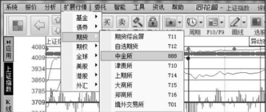

投资者可以看到中金所的全部期货合约。IF是沪深300指数合约，IH是上证50股指期货合约、IC是中证500股指期货合约。投资者可以根据需要双击合约进行行情查看。

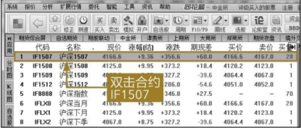

以IF1507合约为例，双击合约进行行情查看，其他操作均与股票行情查看操作相同。分时图与K线图如下图所示。

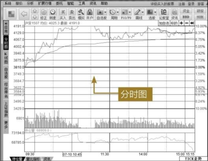

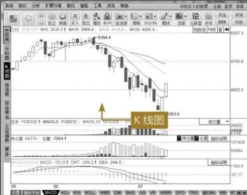

### 杠杆交易

股指期货同其他期货品种一样，遵循保证金制度。投资者在进行交易的时候，只需要支付合约面值的15％的保证金，即可买卖一张股指期货合约。例如，投资者买入IF1506合约，合约当时点位是4972点，股指期货变动一个点位的价格是300元。若投资者想要在此价位买入或者卖出一张IF1506合约，则需要投入4972×300×15％=223740（元），而不是该合约本身的价格1491600元。223740元就是期货合约的保证金，它是履行期货合约的财力保证。只有投资者交付了保证金之后，才能参与期货合约的买卖。

正是由于股指期货交易遵循保证金制度，投资者的盈亏与支付全部金额的交易相比具有放大效应。股指期货交易的保证金为15％，相当于通过杠杆效应，将原有投入的资金放大至6.7倍。杠杆交易的特性决定了股指期货的风险性比股票更高。仍以上述例子为例，如果投资者在4972点买入IF1506合约，若合约上涨到5717.8点，则投资者所持有该合约的权益为223740＋（5717.8-4972）×300=447480（元）。合约仅仅上涨了15％，但本金翻一倍。

当投资者的当日权益小于持仓保证金时，则意味着投资者的资金余额是负数，就是保证金不足。按照规定，期货公司会通知客户在下一个交易日开始之前将保证金补足，这被称为追加保证金。如果账户所有人未能在下一交易日将保证金补足，期货公司有权对投资者的账户内的合约实施部分或者全部强制平仓，直到存留的保证金符合期货交易所的规定范围。若投资者的保证金不仅全部亏掉甚至倒欠期货公司，则被称为爆仓。由于现在期货也实行涨跌板限制，所以一般不会发生爆仓。一旦发生爆仓，投资者则必须将亏损还给期货公司，否则将面临法律的追索。为了避免此现象的发生，投资者应当控制好仓位，切忌像投资股票一般满仓操作。

> **提示**
>
> 投资者可以把杠杆交易变成无杠杆交易，这需要投资者有充足的保证金，降低开仓单量，客户风险保证在20％以内。

## 指数的编制

与上证深证的各种指数类似，股指期货的不同品种的编制方法和标的证券都不同。投资者若能掌握各个指数的编制，将对投资者做正确的投资策略有很大帮助。

### 指数简介

1. 沪深300指数

沪深300指数对应的是IF合约，该指数是由沪深证券交易所于2005年4月8日联合发布的，用于反映沪深300指数编制目标和运行状况，并能够作为投资业绩的评价标准，为指数化投资和指数衍生产品创新提供基础条件。

沪深300指数是一种成分股指数，是从沪深两个证券交易上市的所有股票中抽取具有市场代表性的300家上市公司的股票作为计算对象，并以调整股本为权重计算得出的加权股价指数，综合反映沪深证券上市股票的股价走势。该指数以2004年12月31日为基日，基点为1000点。

2. 上证50指数

上证50指数对应的是IH合约，它是根据科学客观的方法，挑选上海证券市场规模大、流动性好的最具代表性的50只股票组成样本股，以便综合反映上海证券市场最具市场影响力的一批龙头企业的整体状况。上证50指数自2004 年1 月2日起正式发布。其目标是建立一个成交活跃、规模较大、主要作为衍生金融工具基础的投资指数。

3. 中证500指数

中证500指数对应的是IC合约，其样本空间内股票是扣除沪深300指数样本股及最近一年日均总市值排名前300名的股票，剩余股票按照最近一年（新股为上市以来）的日均成交金额由高到低排名，剔除排名后20％的股票，然后将剩余股票按照日均总市值由高到低进行排名，选取排名在前500名的股票作为中证500指数样本股。中证500指数综合反映沪深证券市场内小市值公司的整体状况。

### 指数的编制步骤

沪深300指数对于股指期货最重要，本小节只介绍沪深300指数的编制步骤。

1. 指数计算

沪深300指数的选样方法：首先对样本空间股票在最近一年的日均成交额由高到低进行排名，剔除排名后50％的股票，然后对剩余股票按照日均总市值由高到低进行排名，选取排名在前300名的股票作为样本股。指数以调整股本为权重，采用派许加权综合价格指数公式进行计算。其中调整股本根据分级靠档方法获得。

原则上对指数中的成分股每半年调整一次，一般在1月初和7月初进行，提前两周公布调整方案。每次调整的比例不超过10％样本股设置缓冲区，排名在240名内的新样本优先进入，排名在360名之前的老样本优先保留。最近一次财务报告亏损的股票，原则上不进入新选样本，除非这只股票影响指数的代表性。

计算公式：

报告期指数=报告期成分股的调整市值/基日成分股的调整市值×1000

其中，调整市值=∑（市价×调整股本数），基日成分股的调整市值亦称为“除数”，调整股本数采用分级靠档的方法对成分股股本进行调整。

2. 指数编制技术

沪深300指数的编制采用缓冲区技术和分级靠档技术。缓冲区技术的采用使每次指数样本定期调整的幅度得到一定程度的控制，使指数能够保持良好的连续性。分级靠档技术的采用可以使样本中上市公司股本发生微小变动时保持用于指数计算的样本公司股本数的稳定，可以降低股本变动频繁带来跟踪投资成本，便于投资者跟踪投资。样本股调整幅度的降低可以减少投资者跟踪指数的成本。

3. 指数成分股介绍

沪深300指数成分股覆盖银行、钢铁、石油、电力、煤炭、水泥、家电、机械、纺织、食品、酿酒、化纤、有色金属、交通运输、电子器件、商业百货、生物制药、酒店旅游、房地产等数十个主要行业的龙头企业。排名在前20的成分股往往成为投资者关注的焦点，其与沪深300指数的走势相关性较强，然而这些权重股的排名并非一成不变，而是每天随着股票价格变化进行位置调整。

4. 成分股选取标准

（1）上市交易时间超过一个季度，除非该股票上市以来日均A股总市值在全部沪深A股中排名前30位。

（2）非ST、*ST股票，非暂停上市股票。

（3）公司经营状况良好，最近一年无重大违法违规事件、财务报告无重大问题。

（4）股票价格无明显异常波动或市场操纵。

（5）剔除其他经专家认定不能进入指数的股票。

## 国际著名股票市场价格指数

目前，在全球范围影响较大的具有代表性的股票价格指数主要有以下几种。

1. 道 · 琼斯股价指数

该指数是世界上最早并且最有影响力的股票价格指数，由美国道 · 琼斯公司的创始人查尔斯 · 亨利 · 道开始编制，属于算术平均股价指数。该指数是以65家公司股票（工业股30家，运输股20家，公用事业股15家）为编制对象的股价综合平均数。以1928年10月1日为基期，基期指数为100点。道 · 琼斯指数不但在美国受到普遍重视，而且世界各国都十分重视该指数。在某种程度上，该指数已被看作反映美国政治、经济、社会状况的指示器和风向标。

2. 金融时报指数

金融时报指数（又称富时指数）是英国最具权威性的股价指数。由英国伦敦证券交易所编制，并在《金融时报》上公布。根据样本股票的种数，金融时报指数分别有30种股票指数、100种股票指数及500种股票指数三种指数。期货伦敦金融时报100指数是英国最具代表性的股价指数。该指数自1984年1月3日起编制并公布，指数基值定为1000点，挑选100家具有代表性的大蓝筹公司股票，被形象地称为反映英国经济的“晴雨表”。

3. 日经225股价指数

日经225股价指数是《日本经济新闻社》编制并公布以反映日本股票市场价格变动的股价指数。该指数以在东京证券交易所第一市场上市的225种股票为样本股，包括制造业、金融业、运输业等行业。该指数从1950年9月开始编制，以1950年平均股价176.21元为基数。由于该指数编制时间很早，因此具有较好的可比性，也因此成为反映和分析日本股票市场价格长期变动趋势的常用指标。

4. 恒生指数

恒生指数是香港地区最有代表性和影响最大的指数，由香港恒生银行于1969年11月24日起编制并公布的用来系统反映香港地区股票市场行情变动的股票指数。该指数的成分股最初由在中国香港上市的较有代表性的33家公司的股票构成，其中金融业4家，公用事业6家，地产业9家，其他商业14家。恒生指数最初以1964年7月31日为基期，基期指数为100点。后因为技术原因改为以1984年1月13日为基期，基数定为975.47点，采用加权平均法计算。恒生指数现已成为反映香港政治、经济和社会状况的主要风向标，现在恒生指数成分股已增至50只。

5. NASDAQ综合指数

纳斯达克是英文缩写NASDAQ的音译名，全称是美国全国证券交易商协会自动报价系统。它建于1971年，是世界上第一个电子化证券市场。纳斯达克的发展与美国高技术产业的成长是相辅相成的，被奉为美国新经济的摇篮。NASDAQ综合指数是以在NASDAQ市场上市的、所有本国和外国的上市公司的普通股为基础计算的。该指数按每个公司的市场价值来设权重，这意味着每个公司对指数的影响是由其市场价值所决定的。市场价格是所有已公开发行的股票在每个交易日的卖出价的总和。该指数是在1971年2月5日启用的，基准点为100点。

6. 标准·普尔500指数

标准 · 普尔500指数是美国标准·普尔公司编制的，通常被简称为S&P指数。标准 · 普尔公司是世界著名的分析咨询机构，早在20世纪20年代就开始编制股票指数。于1957年调整之后，样本股增大至500种。其中包括425种工业股票、15种铁路股票和60种公用事业股票。从1976年7月1日开始，其成分股改由400种工业股票、20种运输业股票、40种公用事业股票和40种金融业股票组成。它以1941年至1942年为基期，基期指数定为10，采用加权平均法进行计算，以股票上市量为权数，按基期进行加权计算。与道 · 琼斯工业平均股票指数相比，标准 · 普尔500指数具有采样面广、代表性强、精确度高、连续性好等特点，被普遍认为是一种理想的股票指数期货合约的标的。

投资者如果想查看上述指数的行情走势，可以通过同花顺软件查看国际著名股票市场价格指数行情，具体步骤如下。

1　打开同花顺软件，在菜单栏中选中【扩展行情】【全球】【全球重要指数】，如下图所示。

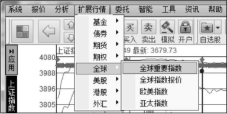

2　投资者可以看到东京日经225指数、香港恒生指数、道 · 琼斯工业平均指数、纳斯达克综合指数等。投资者可以根据需要股票指数名称进行行情查看。

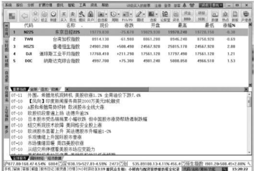

3   投资者还可以在菜单栏中选中【扩展行情】【全球】【欧美指数】查看欧美各国的股票价格指数，如下图所示。

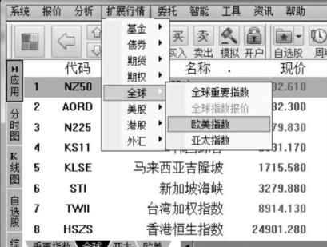

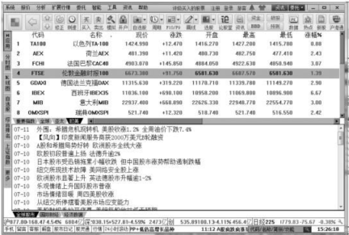

## 恶意做空

2015年6月16日至2015年7月8日这段时间，A股面临中国股市有史以来非理性的下跌。连续几个交易日出现千股跌停的局面，五成以上股票跌幅超过50％。为了避免股价下跌给上市公司的日常经营带来更大的冲击，许多上市公司纷纷申请停牌，出现了A股市场千股停牌的奇怪现象。此轮下跌会出现这样恶劣的局面，其中一个重要的原因，就是有心怀不轨的人恶意做空中国股市。所谓恶意做空，就是指跨期现市场操纵。因为股指期货的下跌会影响股票市场，所以股指期货的空头在高位大肆积累空头头寸之后，在A股市场抛售股票引发股市下跌，进而带动股指期货下跌，此时空头就可以获利。这种操作手法就是国际上对冲基金的一般做法，传导机制如下图所示。

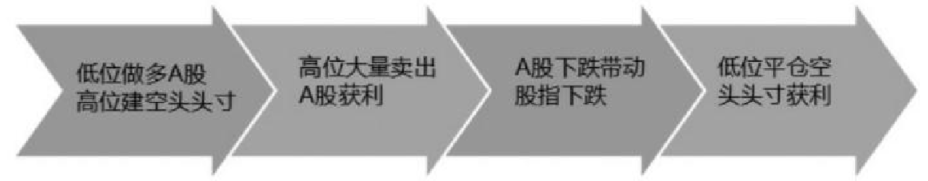

由于A股出现的非理性下跌有可能会引发系统性金融风险，因此我国十分重视此轮的股灾，相继推出了救市的策略。2015年7月9日，公安部会同证监会排查恶意卖空股票与股指的线索，这显示出监管部门要出重拳打击违法违规的恶意做空行为。终于A股市场在2015年7月9日止跌回升，强劲反弹了四天之后进入修整阶段。在这强劲反弹的四天，股指期货市场的恶意做空者由于面临期货合约的上涨导致空单亏损的局面，纷纷平仓逃跑。

# 高手秘技

## 技巧1 利用股指期现套利

> 虽然股指期货与现货市场的沪深300指数走势相关度较高，但是二者之间的走势不完全相同，因此投资者就可以从中进行套利。套利原理如下。
>
> - 当股指期货合约的实际价格大于现货市场相关指数对应价格的时候，投资卖出股指期货合约，买入指数中的成分股组合，从中获得无风险的套利收益。
> -  当股指期货合约的实际价格小于现货市场相关指数对应价格的时候，投资买入股指期货合约，卖出指数中的成分股组合，从中获得无风险的套利收益。

## 技巧2 融资融券买卖技巧

> 由于融资融券交易有标的证券的限制，因此投资者在进行两融交易时必须在标的证券范围中选择股票。如果投资者想要投资非标的证券，是不可以融资买入的。其实，通过以下的方法，投资者可以变相地通过融资买入非标的证券。
>
> 假设现在账户有资产100万元（满仓股票），申请的信用总额度也是100万元，这时投资者看中某只非标的证券，想融资买入，又不愿卖出手头现有的股票。通过以下操作，可获取50万元的融资买入额度。
>
> 第一步：融券卖出价值50万元的标的证券，融券负债50万元。
>
> 第二步：融资买入相同数量的同一标的证券，融资负债50万元。
>
> 第三步：将融资买入的标的证券以现券还券的方式偿还融券负债，账户显示总负债50万元，融券卖出资金50万元解冻。
>
> 第四步：融券解冻的50万元资金就可以用于当日以普通买入的方式买入非标的证券。
>
> 
>
> 计算方式：
>
> T日，客户股票账户担保资产100万元，可取现金50万元（融券卖出资金），此时维持担保比例=[100万元（担保资产）＋50万元（现金）]/50万元（负债）=300％，由于担保比例大于300％部分资金可取，此时客户可以转出的资金为0万元，但是客户可以用50万元买入非标的证券。