# 股市分析的主要手段和作用

**本章引语**

> 夫未战而庙算胜者，得算多也；未战而庙算不胜者，得算少也。多算胜，少算不胜，而况于无算乎！
>
> ——《孙子兵法》
>
> 兴兵作战之前，首先要周密地分析、比较、谋划，估算形势的有利与不利，制定相应的作战策略，这样取胜的可能性就大。所以，投资者要在股票市场中立于不败之地，恰当的分析是必不可少的。

**本章要点**

> ★ 宏观基本面分析
>
> ★ 微观技术面分析

股票市场千变万化，要在如此错综复杂的市场中立于不败之地，草率行事肯定不行，投资者需要有客观的头脑和冷静的分析。众所周知，巴菲特通过价值分析成为万人敬仰的“股神”；索罗斯通过投机分析成为万众瞩目的“金融大鳄”。所以，要想成为炒股高手，得先学会分析。

## 股市常见的分析手段

目前，市场上比较流行的分析方法一共有2种：宏观基本面分析法和微观技术面分析法。其中基本面分析法主要是基于对股票所属公司投资价值的分析，从而决定股票的买进卖出；而技术面分析法主要是基于对股价的变化轨迹，用数学和逻辑学的方法对股价的运动趋势进行分析，从而捕捉买卖信号，把握买卖时机。

宏观基本面分析法和微观技术面分析法主要区别有以下2点。

（1）宏观基本面分析法着重于对整体经济水平以及上市公司的发展状况、行业最新发展动态等因素进行分析，以此来研究股票的价值，衡量股价的高低。而微观技术面分析则是透过K线或技术指标的记录，研究市场过去和现在的变化情况，以推断股票未来价格的变动趋势。

（2）宏观基本面分析的目的是为了判断股票现行股价的交易价格是否合理并给出相应的发展空间，而微观技术面分析主要是预测短期内股价涨跌的可能。通过基本分析，投资者可以了解应购买哪些股票，而技术分析则让投资者把握具体购买的时机，如下图所示。

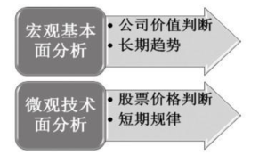

###  宏观基本面分析

宏观基本面分析是指从影响股价变动的内在因素出发，分析研究影响上市公司及股市运行的各种内、外部的因素，预测股价变动的一般趋势。通过股价的基本分析，投资者可以了解公司环境和核心竞争力，从而在最合适的时间操作，获得最大收益。

通常情况，股票的实际价值和交易价格不会非常一致，而是交易价格围绕实际价值上下波动。如果受到某种不利因素影响，使一家上市公司的股票价格严重偏低，背离价值很远，投资者就会争相购买该公司股票，使得价格上升，接近价值。相反，如果某只股票价格过高，严重偏离价值，投资者必然会竞相出手，进而拉低股价，使其接近价值。在这个过程中，由于投资者的心理和群体效应等因素，稍有不慎就会造成巨大泡沫或者大规模踩踏，给国民经济带来消极影响。

通俗来讲，宏观基本面分析要为投资者解决的问题，就是买哪个板块或买某个板块中哪个企业股票的问题。

例如，随着我国经济发展方式的转变和人们环保意识的逐步增强，小明看好环保板块，决定投资进入。但此板块的上市公司数量很多，不容易选择，小明又通过查阅上市公司的财务报表等信息，认为某家公司前景广阔，最终小明花10000元买入该公司股票。

以同花顺软件为例，介绍如何实现上述分析的步骤。

1. 打开同花顺软件，进入主界面，单击页面下方的【行业】选项卡，进入行业分类界面。

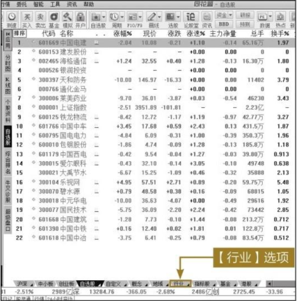

2. 单击【环保工程】菜单项。

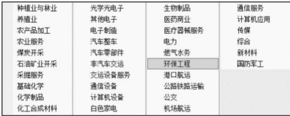

3. 页面显示出该行业的所有上市公司。面对如此多的上市公司，投资者要进一步决策，必须仔细分析行业中各企业的具体情况，然后再做出投资决策。

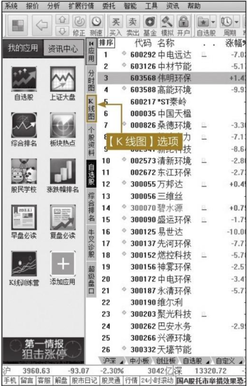

### 微观技术面分析

微观技术面分析是利用K线来描述个股或整个市场的股票指数变动轨迹，再利用数学和概率的方法寻找出具有广泛性的行为模式，然后据此预测将来一段时间股价的运动趋势。微观技术面分析是以交易价格和成交量数据为依据，进而推断未来的价格走向。

通俗来讲，微观技术面分析就是撇开宏观基本面分析的因素，只从价格与成交量或成交额这个角度分析。其实，微观技术面分析要为投资者解决的问题，就是什么时间以什么样的价格购买股票的问题。

例如，小明本想在2015年5月5日买中国中车的股票，可通过观察价格趋势，他觉得股价要进一步下跌，于是当天选择观望。果然，股价大幅下跌。6月29日，该股股价下跌到16.69元，他认为时机到了，当天买入10000元股票。

以同花顺软件为例，介绍整个过程的步骤。

1. 进入同花顺软件主界面，在键盘精灵里输入中国中车的拼音首字母“ZGZC”，然后按【Enter】键。

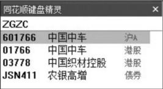

2. 双击“中国中车”，进入分时图界面，单击分时图上【K线图】选项卡，进入中国中车的【K线图】。

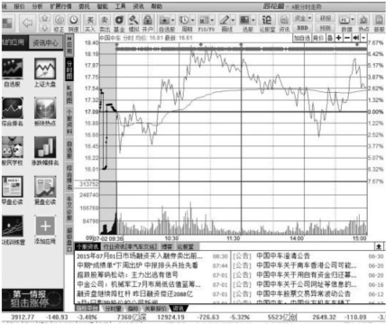

3. 下图所示为中国中车的日K线走势图。

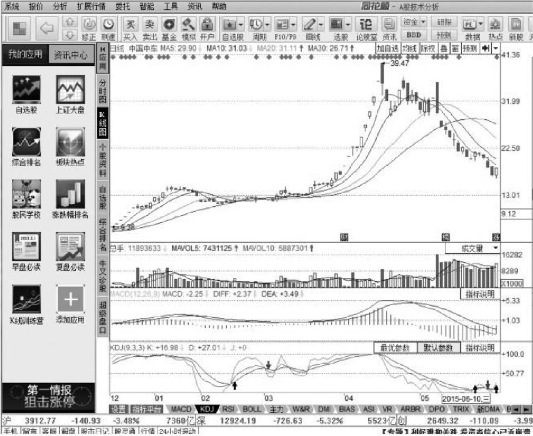

## 分析手段的作用与意义

通过宏观基本面分析，具体来说就是指对宏观经济基本面、公司主要经营业务、公司所处行业、同行业竞争水平和公司内部管理水平甚至说管理层的品格等诸多方面的分析，投资者透彻了解经济和政治形势，进而判断出股票市场未来走势。当然，数据在这里充当了最大的分析依据，但往往不能以数据来做最终的投资决策，投资者要通过对数据的提炼和加工，最终得出可靠的结论。

通过微观技术面分析，投资者可以发现多空双方一轮征战过后留下来的直接有力证据，提高对后市预测的准确性，进而找到最佳的买点和卖点，获取最高的收益。但是，技术面分析主要是从线路趋势的整体形态、股价缺口、支撑线和阻力线等方面进行分析，它是一种纯粹的数学推导，其发出的各种买卖信号一般都是必要条件而不是充分条件，所以投资者在实际操作中不能盲目照搬。

实际上，大多数成功的股票投资者是把两种分析方法结合起来加以运用。用基本面分析法估计中长期趋势，而用技术面分析法判断短期走势和确定买卖的时机。这样能取长补短，互相补充，使分析更加有效和准确。两者关系见下图。

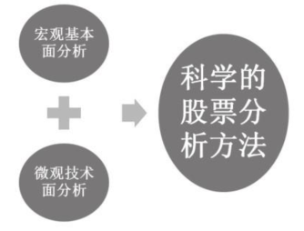

## 宏观基本面分析

宏观基本面分析是指影响股价走势的基础性因素，其中主要考虑的方面有国内外政治力量、国家整体经济环境、国家财税和产业政策、公司所在行业、公司财务状况、商品供需关系、投机因素、不可抗力因素（台风、海啸等自然灾害）和心理因素等。宏观基本面分析主要包括宏观层面分析、行业层面分析和企业层面分析三大部分。通过对宏观基本面的分析，投资者可以把握股价变动的基本因素，这是股票投资分析的基础。

### 宏观层面分析

从长期和根本因素上看，股票市场的走势和变化是由一个国家的经济发展水平和经济景气状况所决定的，股票市场价格波动也在很大程度上反映了宏观经济状况的变化。从国内外证券市场历史走势发现，股票市场的变化方向基本上与经济周期相吻合。在经济繁荣时期，企业经营状况好，盈利多，其股票价格也在上涨。经济不景气时，企业收入减少，利润下降，也将导致其股票价格不断下跌。但是股票市场的走势与经济周期在时间上并不是完全一致的，通常，股票市场的变化要有一定的超前，因此股市价格被称作是宏观经济的晴雨表。

宏观经济因素通常有利率、汇率、通货膨胀率、失业率等，除此之外，能够对股市产生影响的还有政策因素、社会因素、文化因素和国内外重大事件等。由于中国资本市场成立较晚，因此各种机制和配套设施发展还不够完善，受宏观因素的影响相对比较突出，有些人称中国股市为政策市。

> **提示**：投资者应该对“新闻联播”保持应有的关注，时刻把握国家最新、最权威的政策和产业信息，寻找投资机会。

例如，中国人民银行决定，自2015年3月1日起下调金融机构人民币贷款和存款基准利率。金融机构一年期贷款基准利率下调0.25个百分点至5.35％；一年期存款基准利率下调0.25个百分点至2.5％，同时结合推进利率市场化改革，将金融机构存款利率浮动区间的上限由存款基准利率的1.2倍调整为1.3倍；其他各档次存贷款基准利率及个人住房公积金存贷款利率相应调整。利率的下调为资本市场又注入大批流动性，以此为发端，上证指数开启了新一轮的上涨模式。

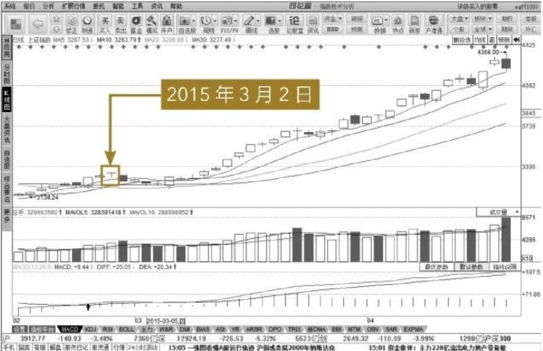

### 行业层面分析

行业是指从事国民经济中同性质的生产或其他经济社会活动的经营单位和个体等组成的组织结构体系，如农业、保险业、汽车业等。为了便于投资者查找，同花顺软件把上市公司所处的行业进行了分类，如下图所示。

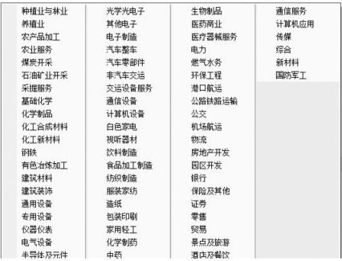

> **提示**：为了便于投资者决策分析，同花顺软件还根据上市公司所在地域和上市公司所包含的概念对所有企业进行了分类。
>

不同的行业有不同特征，国家的产业政策也会不同，自然各个行业的发展前景也不尽相同。朝阳行业前景光明，对投资者吸引力大；夕阳产业前景欠佳，投资收益相应要低。战略性产业，国家产业政策和经济政策自然会扶植；而落后产业和产能过剩行业，国家也会逐步提升改造或淘汰。因此，投资者做决策之前，要对行业状况进行分析。

例如，2015年3月28日，国家发展改革委、外交部、商务部联合发布了《推动共建丝绸之路经济带和21世纪海上丝绸之路的愿景与行动》。在“一带一路”战略的引领下，基建行业备受关注。所以，基建行业个股在2015年上半年的表现不俗。

### 企业层面分析

企业层面分析主要是指从企业自身的状况出发，通过对企业的经营状况、财务状况和管理状况三大方面的仔细分析，判断企业未来的发展走势，进而为股票投资提供依据。

通常，衡量一个公司发展潜力的标准是营业收入的增长率。例如，某家上市公司的去年的营业收入是5亿元，今年是7亿元，明年可能增加到10亿元，给投资者传递出该公司处于蓬勃发展的一个状态。公司能够快速成长，自然公司股票也会一路上涨，投资者就会竞相买入。

通常来讲，在经营、财务和管理这些方面做得相对比较优秀的企业，通常都是投资者的理想投资标的。

例如，成立于1991年的珠海格力电器股份有限公司，是一家集研发、生产、销售、服务于一体的国际化家电企业，以“掌握核心科技”为经营理念，以“打造百年企业”为发展目标，凭借卓越的产品品质、领先的技术研发、独特的营销模式引领中国制造，旗下拥有格力、TOSOT、晶弘三大品牌，涵括格力家用空调、中央空调、空气能热水器、TOSOT生活电器、晶弘冰箱等几大品类家电产品。2012年格力电器实现营业总收入1001.10亿元，成为中国首家超过千亿的家电上市公司；2015年4月27日，格力电器发布2014年业绩报告。报告显示，公司2014年实现营业总收入1400.05亿元，同比增长16.63％；归属于上市公司股东的净利润为141.55亿元，同比增长30.22％，继续保持稳健的发展态势。有优秀的企业作为后盾，股票格力电器也是备受投资者瞩目。

下图为格力电器2015年3月至6月的日K线走势图。从图中可明显看出，该股股价一直处于上升态势。

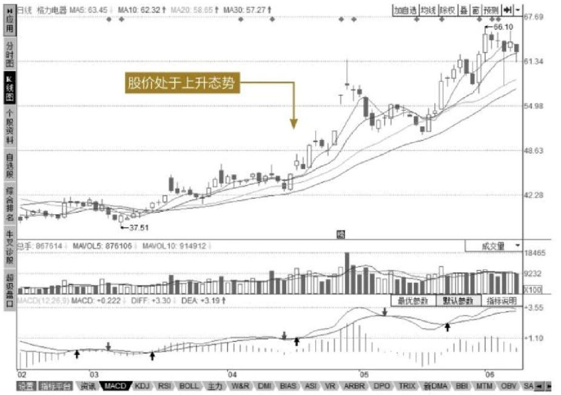

## 微观技术面分析

通俗地说，微观技术面分析最主要的是看K线图和各种趋势图。通过对股票的价格、成交量和成交时间的分析，以此推测股价下一步的变动方向，而技术面分析的最终目的是确定股票的走势以及当前走势是否发生转变。投资者根据技术面分析提供的信号，买进卖出以赚取差价。

每个人都是独一无二的个体，有着别人没有的特征，但是人本质的一些东西确实相差无几。例如，对于价格的反应，一个地区或国家的人基本上会产生相近的反应，这种现象称为群体效应，客观存在，无法避免。微观技术面分析通过研究大多数人对价格的心理承受力和反应，来推断整个股票的价格走势。但人的心理变化是非常复杂的，社会上的很多事情不可能简单地重复出现。所以说炒股是门艺术，不是科学。但投资者如果能够抓住这种群体效应，充分利用，就可能拥有更高的收益率。

### K线分析

记录股市价格变动的图形有很多，其中最重要也是最常用的就是K线图。K线是由一个交易日内的开盘价、收盘价、最高价和最低价绘制而成的。

K线是多空双方博弈的结果，投资者可以从单根K线中找到资金博弈的踪迹，进而发现主力资金的动向，为后续操作提供依据。如果单根K线提供的线索有限，投资者还可以把几根或多根K线结合起来分析，这样可信度会更高。

例如，新农开发2015年5月19日至22日收盘价分别为14.3元、14.79元、15.1元、15.29元，从下图中能清晰地看到该股正处在上升趋势当中，投资者可以买入该股票。

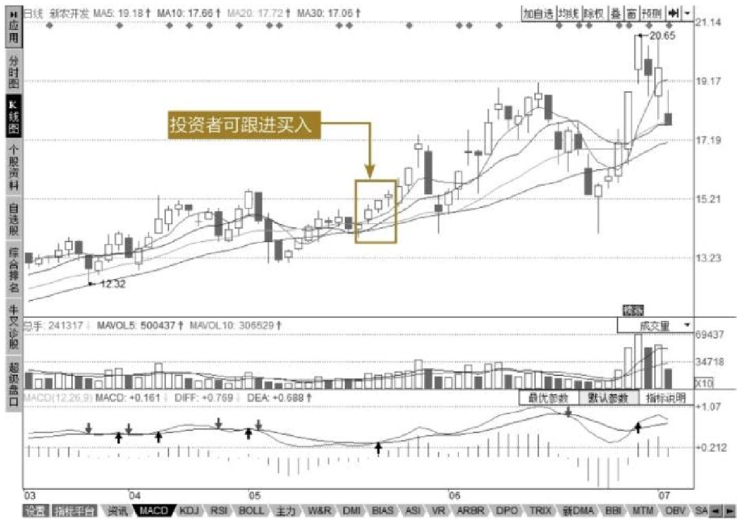

### 移动平均线分析

股价有涨有跌，K线有红有绿，多样的变化使刚入市的投资者感到迷茫。而移动平均线是一定时间周期内收盘价的平均值，可有效地熨平股价的过度起伏，使走势变得清晰。因此，投资者要想更好地把握市场趋势，移动平均线分析必不可少。

移动平均线的作用主要有以下3点。

（1）移动平均线反映当前市场的平均成本。

例如20日均线代表了20日内买进者的平均成本，60日均线代表了60日内买进者的平均成本。

（2）移动平均线揭示股价运动方向。

移动平均线表示了上升趋势或者下降趋势。通常判断的方法是：移动平均线向下，表明趋势看跌；移动平均线向上，表明趋势看涨。短期移动平均线反映的是短期趋势的好坏，中期移动平均线反映的是中期趋势的好坏，长期移动平均线反映的是长期趋势的好坏。

（3）移动平均线有助涨助跌作用。

在股票价格变化过程中，K线变化非常迅速，而移动平均线的变化则相对迟缓，通常都会在原有趋势的基础上再持续一段时间。所以，K线运行到移动平均线附近时，会受到均线的支撑或阻力作用。

### 趋势线分析

趋势线反映的是股票价格的移动趋势。股票的价格不可能永远朝一个方向移动，有涨必有跌，通常是以一种波浪的形式移动的。它是用来预测后面价格走势的，投资者根据趋势线的信号，结合自己的判断，反转价位操作，即可在延期市场中赚取利润。

趋势线是用画线的方法将低点或高点相连，利用发生过的事例，推测次日走向的一种图形分析方法。若股价处于上升趋势，价格波动必然是向上发展，出现回调也不影响其总体的趋势，如果把上升趋势中的低点分别用直线相连，就是上升趋势线，如下图所示。

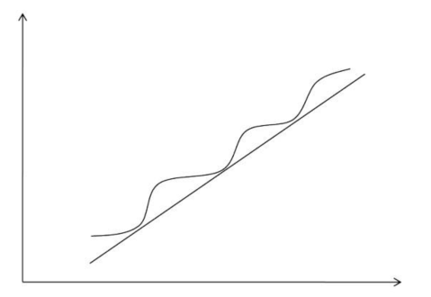

同样道理，投资者可以得到下降趋势线。投资者正确画出了趋势线，就可以大体了解股价的未来发展方向，从而做出最合理的投资决策。

### 其他技术指标分析

除了均线指标之外，从不同的角度对K线进行分析，能够得到其他技术指标，这些指标主要有：指数平滑异同移动平均线（MACD）、随机指标（KDJ）、趋向指标（DMI）、相对强弱对比指标（RSI）等。

在此对指标进行具体分类，如下图所示。

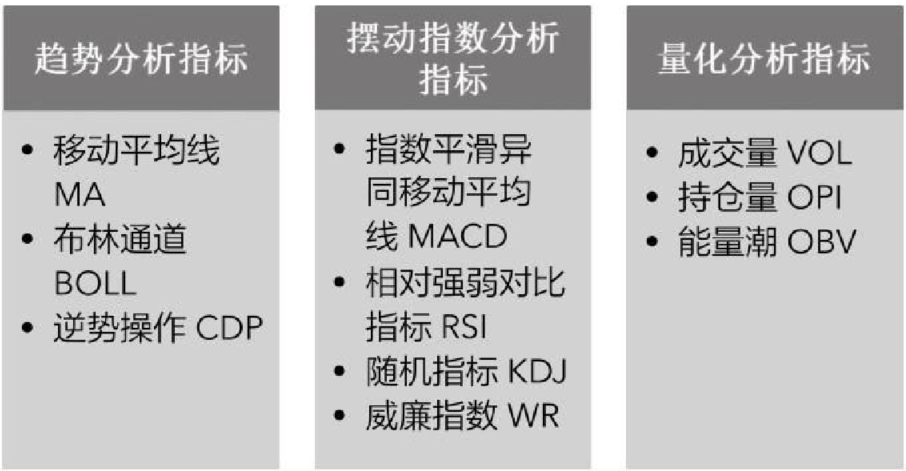

由于后面章节会详细介绍，这里不再赘述。投资者在实际操作过程中，要综合运用这些指标系统，为决策提供广泛且充分的依据。

### 波浪理论分析

投资者都希望能预测未来，波浪理论正是这样一种价格趋势分析工具，它根据周期循环的波动规律来分析和预测价格的未来走势。波浪理论的创始人——美国技术分析大师R.N.艾略特（1871—1948）在长期研究道琼斯工业平均指数的走势图后，于20世纪30年代创立了波浪理论。投资者仔细观察记录着股价波动信息的K线图，会发现它们有节奏、有规律地起伏涨落、周而复始，如同大海的波浪一样。

一个完整的波动周期，即完成所谓从牛市到熊市的全过程，包括一个上升周期和一个下跌周期。如下图所示，上升周期由五浪构成，用1、2、3、4、5表示，其中1、3、5浪上涨，2、4浪下跌；下跌周期由三浪构成，用a、b、c表示，其中a、c浪下跌，b浪上升。与主要运动方向（即所在周期指明的大方向）相同的波浪称为推动浪，与主要运动方向相反的波浪称为调整浪。也就是说，在上升周期中，因为主趋势向上，那么1、3、5浪为推动浪，2、4浪为调整浪，是对上涨的调整；在下降周期中，因为主趋势向下，那么a、c浪为推动浪，b浪为调整浪，是对下跌的调整，通常称为反弹。

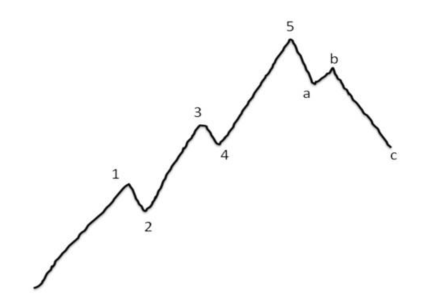

波浪理论的主要特征之一就是它的通用性。因为股票的价格运动是在公众广泛参与的自由市场之中，市场交易记录完整，与市场相关的信息全面丰富，因此特别适于检验和论证波浪理论，所以它是诸多股票技术分析理论中被运用最多的。但不可否认，它也是非常难以被真正理解和掌握的。

最后，为了便于投资者理顺思路，对本章内容进行总结，见下图。

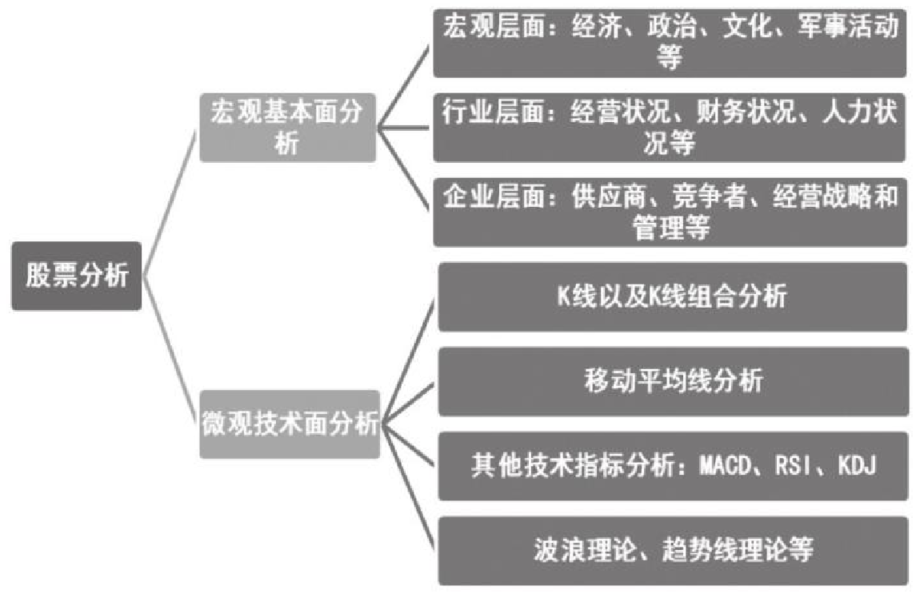

# 高手秘技

## 技巧1 “钓大鱼”不用天天看盘

> 宏观基本面分析法是对长期趋势的分析判断，对于那些长期操作的投资者，以及没有时间盯盘的特殊投资者，具有非常重要的作用。基本面分析看重的是股票的内在价值，实际上投资的是股票背后的企业。投资者通过这种方法选中股票，除了一小部分价格因素外，更主要的是对公司发展前景有良好的预期。股票价格每天都会变化，但一个成熟的公司想短期内改变方向是不容易的。所以，投资者要做的就是耐心等待，完全可以不理睬公司股票价格每天的波动，真正地“运筹帷幄之中，决胜千里之外”。

## 技巧2 操作理念和心态很重要

> 技术面分析具有客观性和精确性，能够为投资者提供非常具体、清晰的决策依据。但技术面分析毕竟仅仅是一门分析工具，也会有其不足之处。更为重要的是，工具本身并无优劣，起决定作用的是使用工具的人。如果抛开经济形势、心理、市场特性这些因素，单纯追求技术面分析，往往会事与愿违。所以，面对纷繁复杂的市场，面对股民时刻都在变化的心理预期，投资者首先应该要有一个良好的心态，看淡盈亏。在此基础上，保持一个良好的操作习惯，才能真正地笑傲股市。