# 宏观基本面分析

**本章引语**

> 投资的目标是寻找那些未来20年具有持续竞争优势而且价格上具有安全边际的优秀公司。
>
> ——巴菲特
>
> 
>
> 价值投资是股神巴菲特一直奉行的，而价值投资的基础就是对公司的基本面分析。他也曾说过，如果不能根据公司基本面分析进行估值，就根本不会关注这家公司。所以，要成为一名优秀的投资者，基本面分析至关重要。

**本章要点**

> ★宏观经济形势分析
>
> ★行业环境分析
>
> ★企业价值分析

## 宏观层面的基本面分析

宏观基本面对股市的整体走势能够产生很大影响，其中主要的影响因素有经济因素、政治因素和国内外重大事件等。说到底，股市最终是为经济发展服务的。因此，本节重点对经济因素进行详细介绍。

### 经济政策

股市是社会经济的一个重要组成部分，必然受国家经济政策的影响。经济政策是国家经济发展意志和目标的集中体现。国家都看好的事情，普通股民没有什么理由不看好。

因此，投资者要想炒股成功，就需要深入理解国家经济政策的取向，密切关注国家经济政策的出台，抓住机遇，选择具有发展前景的行业，把握好的投资时机和投资产品。

例如，2015年政府工作报告中首次出现“互联网＋”概念，报告中提出要“制定‘互联网＋’行动计划，推动移动互联网、云计算、大数据、物联网等与现代制造业结合，促进电子商务、工业互联网和互联网金融健康发展，引导互联网企业拓展国际市场”。显然，国家要通过互联网来促进经济转型和升级。这就是国家的经济政策，反映在股市上，就是“互联网＋”概念受到资金持续追捧，“互联网＋”企业的股价稳步上升。

目前的交易软件里基本上都带有资讯板块，投资者可充分利用该功能。以同花顺软件为例，介绍具体操作步骤。

1　打开同花顺软件，进入其主界面。单击【我的应用】选项卡下面的【早盘必读】图标。

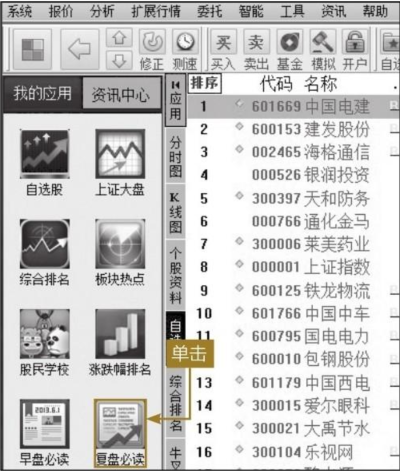

2    下图所示为【早盘必读】界面。

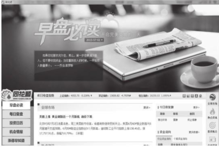

3    单击【资讯】按钮，进入资讯页面，如下图所示。

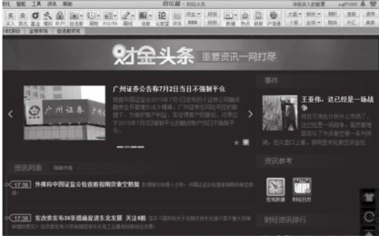

投资者也可以浏览《中国证券报》的中证网，该网站汇集了最新的经济政策信息。如下图所示。

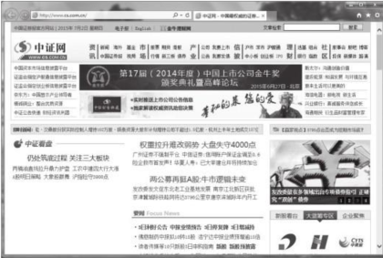

由《上海证券报》主办的中国证券网也可用于了解最新的国家经济政策。如下图所示。

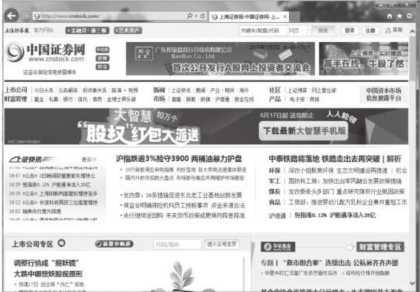

> **提示：**
>
> 投资者还可以关注《证券日报》，它是中国证监会指定披露上市公司信息报纸、中国保监会指定披露保险信息报纸、中国银监会指定披露信托信息报纸、四大产权交易所指定产权信息披露报纸。

### 经济指标

投资者在新闻中常常会接触到一些经济指标，如国内生产总值、物价指数、外贸形势等。这些指标由国家统计局定期公布，对判断宏观经济形势具有重要作用。

1. 国内生产总值（GDP）与经济增长率

国内生产总值（GDP）是指在一定时期（一般按年统计），在一国领土范围内生产的产品和劳务的总值。这些产品和劳务的界定以在一国领土范围内生产为标准。

例如，中国的制造企业在俄罗斯设厂，其生产产品的产值不计入我国的GDP；但是，俄罗斯公司在中国设厂，它的产值计入我国当年的GDP。

经济增长速度，反映一定时期一个国家或地区经济发展水平的变化程度。2015年我国的一句流行口号“保七”，指的就是力争2015年经济增长速度达到7％。

在宏观经济分析中，GDP指标举足轻重。当国内生产总值连续、稳定的增长，经济发展势头良好时，首先是企业盈利水平不断上升，提高了股票的内在价值；同时，经济增长带来了人们生活水平的改善和收入的提高，增加了投资者对股票的需求。所以，股票价格开始慢慢上涨，形成牛市。

相反，当国内生产总值持续下跌，经济发展动力不足时，企业自身的盈利能力下降，股票的内在价值有所降低；而人们收入的增速缓慢，投资者就会减少对股票的需求。两个因素共同作用，造成股价慢慢下跌，股市走熊。

2. 利率

利率是影响股市的最为敏感的因素之一。通俗来说，利率就是货币的价格。自然，货币供给多了，利率会降低；货币供给少了，利率则升高。那么，反过来我们可以这样简单认为，如果某个时刻利率下降了，说明货币供给多了，流动性相对宽松，而这么多的钱来买股票，必定会把股价抬上去。所以，利率下降，股市走高；反之，利率提高，股市走低。所以，大部分投资者把央行降息降准当成重大利好。

3. 汇率

汇率又称汇价，是一国货币兑换另一国货币的比率。汇率对股价的影响分为短期影响和长期影响。从短期分析，汇率对股市的影响主要表现在国际热钱的流入和流出上，其基本过程如下图所示。

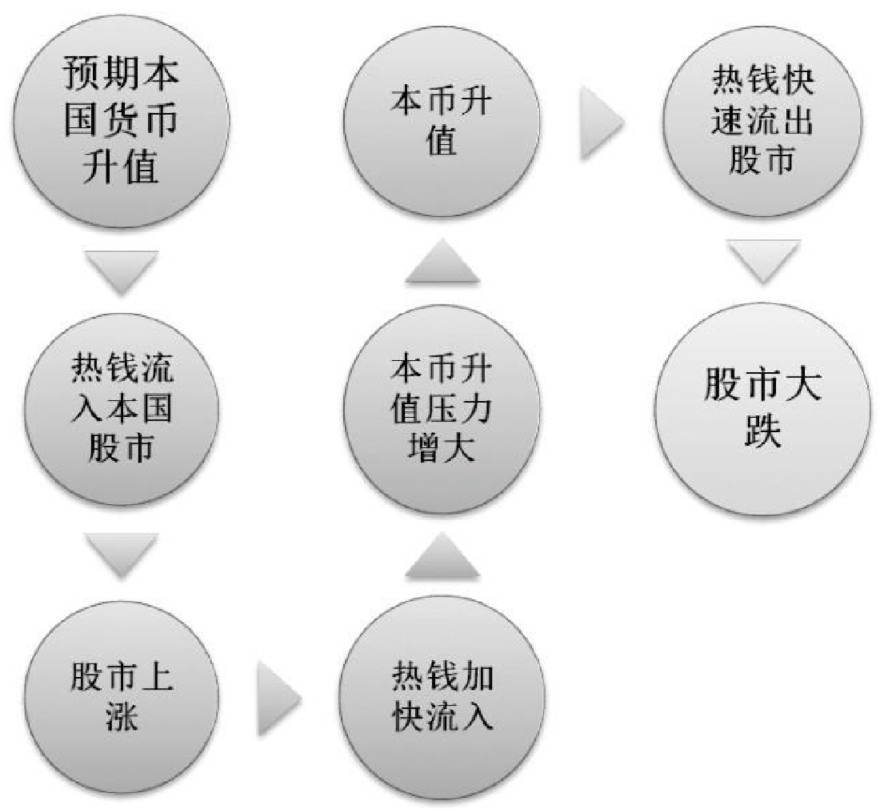

从图中可以看出，热钱的快进快出会对本国的股市造成剧烈影响，使股价短期内大起大落，让股市成为投机豪赌的场所。从长远分析，这种变动破坏了股市融资、定价和资产配置的基本功能，使股市不能很好地为实体经济服务，必然会对上市公司产生诸多不利影响，甚至危及整个证券市场和国家经济的健康发展。

4. 通货膨胀（CPI）

通货膨胀是因纸币超发，货币供给大于货币实际需求，导致货币贬值，进而引起一段时间内物价持续而普遍上涨的现象。通货膨胀实质就是货币超发。

> **提示**
>
> CPI是居民消费价格指数（Consumer Price Index）的英文缩写。居民消费价格指数，是一个反映居民家庭一般所购买的消费商品和服务价格水平变动情况的宏观经济指标。

有关通货膨胀对股市的影响，是仁者见仁，智者见智。其实，通货膨胀对股市的影响有两个方面，分别是对股价的影响和对股市发展的影响。这里介绍一下通货膨胀对股价的影响。

通货膨胀在初期对股价起推动作用，主要表现如下。

（1）通货膨胀初期，货币供应量有所增大，个人、企业也会掌握较多的货币资金。投资者如果看好股市或者预测股市盈利非常乐观，这些多余的资金就会流入股市。买的人多了，股票的价格就会上涨。

（2）随着货币供应量的增大，市场产品的价格也会上涨，而通常情况下投资品的价格上涨更快。这样，以生产投资品为主的上市公司，其账面盈利将会大幅提升。因此，股民看好这些上市公司的前景，纷纷买入股票，从而促使股价上涨。

不过，持续的通货膨胀会使股价下跌，主要表现如下。

（1）当通货膨胀趋于高峰时，将会造成经济秩序的混乱、消费者抱怨、各阶层不满等现象。这时，决策者采取措施抑制通货膨胀。个人、企业手中的货币资金减少，导致资金流出股市，从而股价下跌。

（2）持续的通货膨胀会使市场产品的价格持续上涨，造成实际生产成本的大幅上升，物资供应紧张，导致一些上市公司账面盈利减少，股民相应地不看好其前景。再加上严重的通货膨胀，投资者的信心降低，纷纷退出股市，导致股价下跌。

总结来说，短期温和的通货膨胀会促使股价上涨，长期恶性的通货膨胀最终会导致股价下跌。

同花顺软件当中对指标的分析集中在【数据】板块。下面介绍具体操作步骤。

1　打开同花顺软件，进入其主界面。单击【数据】按钮，在弹出的快捷菜单中选择【宏观数据】菜单项。

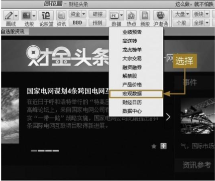

2　如下图所示，【宏观数据】中包括重要数据、居民消费、工业生产、信贷收支、金融市场等几方面的数据信息，投资者可以根据自己的特殊需求，查看不同的数据类型。

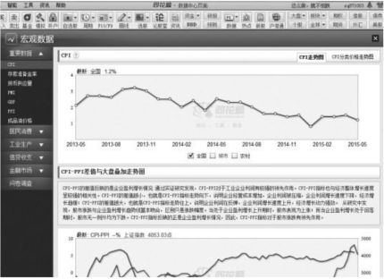

### 经济周期

宏观经济变动，呈现复苏期、高峰期、衰退期和谷底期反复循环的周期性波动。

1. 复苏期

否极泰来，经济已经处在底部无法再低，只能转头向上。随着经济形势的好转，消费需求逐步增加，企业投资增加，产品生产、销售、利润都稳步上升，呈现出蓬勃发展的预期。这一阶段，投资者纷纷开始大举抄底，无人问津的股市开始复苏。

2. 高峰期

经过前期的复苏，经济发展步入正常轨道，生产、投资、消费都快速提高，企业利润稳步上升，投资者看好的预期不变，所以该时期股票市场活跃，形成牛市。

3. 衰退期

盛极而衰，这是客观规律，股票市场也不例外。高峰期的持续上涨，使企业本身的潜能基本上得到充分挖掘，股价处在相对高位，如果没有新的经济增长点，回调在所难免。此时，投资者获利出货的心态更加迫切，市场稍有风吹草动，就会纷纷出货。买入动力不足，卖出压力增大，股价开始下跌。

4. 谷底期

经济发展速度迅速下降，甚至出现倒退，整个经济生活被阴霾笼罩。企业产能萎缩，出现大面积亏损，甚至倒闭。消费需求严重不足，缺乏促使经济上涨的动力因素，企业和投资者情绪普遍悲观。此时，股票市场一跌再跌，投资者争相出货，又进一步加剧了市场的下跌。

“选股不如选时”。根据经济循环周期，投资者最佳的获利时间是从经济开始复苏到高峰期，在衰退期、谷底期，投资者应该以保本不亏损为主。此外，不同行业的股票在整个经济周期中的表现大不相同。通常情况下，基建类、制造类企业在复苏期间表现比较强势，而消费类、公共事业类企业则在高峰期开始发力。投资者在具体操作时，要特别注意不同企业的投资组合。

综上所述，在经济周期的不同阶段，投资者应该有不同的投资策略，如下图所示。

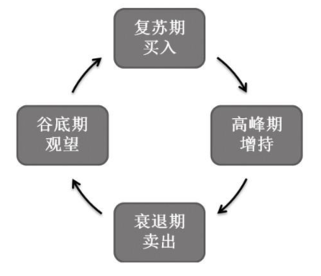

### 其他因素

股票市场价格的波动，除受经济、社会和技术因素影响外，还受政治因素的影响。通常，政治因素对股价是系统、全面的影响。

政治因素主要是指国内外的政治形势变化，例如政局的动荡、国家领导人的更迭以及国家或地区间的战争、冲突等。这些因素，特别是其中的政局突变和战争爆发，会对股市造成巨大的影响。

投资者能够经常遇到的是国家经济政策和方针措施的调整。这么重要的外部环境发生变化，自然上市公司的经营环境、经营方向以及战略也需要跟着改变，股价将必然会受到影响。

具体来说，能够对股价产生影响的政治因素包括以下几点。

1. 战争

战争是政治的集中体现，因而对股市的影响最大。例如，2015年由于乌克兰东部危机，俄罗斯有可能卷入冲突，导致俄罗斯股价大幅跳水。目前我国的周边环境相对稳定，发生大规模战争的可能性比较小，投资者可以安心进行投资。

2. 国际重大政治活动

随着世界政治多极化、经济一体化进程的加快，以及现代通信技术的飞速发展，国际上重大政治事件对一国股市的影响越来越大。例如，2015年7月希腊可能退出欧盟的风波，不仅使欧洲股市下挫，甚至波及我国股市。

3. 重大战略和政策

国家重大社会经济发展战略的选择和重大政策的出台实施，会对股市产生重要影响。例如，2015年国家提出“一带一路”战略后，上证指数便开启了连续上涨模式。

> 提示
>
> 投资者还需要考虑自然灾害（如台风、海啸、地震等）对经济和股市的影响。

总体来说，宏观经济分析的因素可以用下图表示。

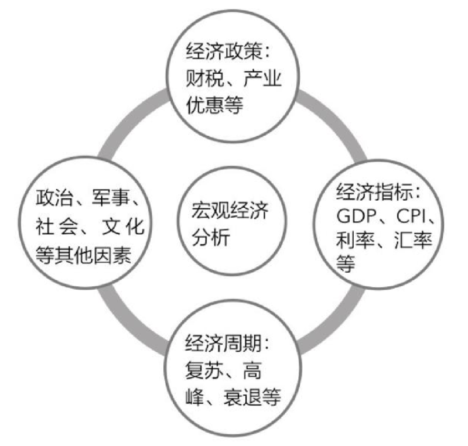

## 行业层面的基本面分析

行业分析是指运用多种分析工具对行业经济的运行状况、产品生产、销售、消费、技术、行业竞争力、市场竞争格局、行业政策等行业要素进行深入分析，进而发现行业运行的内在经济规律，从而预测未来行业的发展趋势。行业分析是介于宏观经济与微观经济分析之间的中观层次的分析，是发现和掌握行业运行规律的必经之路，是行业内企业发展的大脑，对指导行业内企业的经营规划和发展具有决定性的意义。

### 行业特征

行业的经济结构不同，变动规律不同，其盈利水平的高低及经营的稳定状况也不同。这是投资者在进行行业分析时要着重考虑的因素。

根据不同的特征，行业有很多种分类情况。根据行业竞争结构的不同，行业基本上可分为四种市场类型：完全竞争、垄断竞争、寡头垄断、完全垄断。

> **提示**
>
> 行业的竞争结构主要包括该行业中企业的数量、产品的性质、价格的制定等因素。

1. 完全竞争型

完全竞争型是指一个行业中有众多的生产者，他们以相同的方式向市场提供同质产品。其主要特点如下。

（1）企业只能是价格的接受者，不能够影响产品的价格。

（2）所有企业向市场提供的产品都是同质的、无差别的。

（3）生产者众多，所有资源都可以自由流动。

（4）市场信息完全透明，可随意进入或退出此行业。

完全竞争型行业的条件要求比较苛刻，现实中只有部分农产品生产行业比较接近。

2. 垄断竞争型

垄断竞争型是指行业中有许多企业生产同一类产品，但相互之间是有差别的。其主要特点如下。

（1）生产同一类产品，但不同企业产品之间是有差别的，其差别主要表现在质量、商标、尺寸、售后服务等方面。

（2）企业对产品的价格有一定的影响力。

（3）由于生产者众多，所有资源可以流动，进入该行业比较容易。

现实经济结构中，大部分行业是属于此类行业，例如服装行业、家电行业等。

3. 寡头垄断型

寡头垄断是指一个行业中少数几家大企业（称为“寡头”），它们控制了整个行业当中绝大部分产品的生产和销售。其主要特点如下。

（1）企业数量不多，而且彼此之间相互联系。每个企业的战略选择和变动都会给其他企业造成影响。

（2）企业对产品的价格具有很高的控制力。

（3）由于企业数量有限，所以进入该行业十分困难。

寡头垄断在现实中是普遍存在的，例如汽车产业和石化产业等。

4. 完全垄断型

完全垄断型是指一个行业中只有一家企业，全部的产品需求都由这一家企业提供。完全垄断根据主体的不同，可分为政府垄断和私人垄断两种类型。完全垄断型的特点如下。

（1）一个行业仅有一家企业，其他企业根本无法进入该行业。

（2）产品没有替代性，所以企业能够完全控制产品的价格，是产品价格的制定者。

在现实经济生活中，公用事业（如铁路、煤气、自来水和邮电通信等），某些资本、技术高度密集型行业，以及稀有金属矿藏的开采等行业属于这种完全垄断的市场类型。

对不同类型的行业，投资者应当采取不同的投资策略。对于完全竞争型，由于行业中的企业同质化较严重，很难形成自己的核心竞争力，投资者应以短线波段投资为主；对于垄断竞争型，由于行业中的企业存在一定的差异性，投资者应选择具有核心竞争力的企业，进行中长线操作；对于寡头垄断型，由于行业中企业数目不多，核心竞争力各不相同，投资者在选择标的后，应进行长线操作；对于完全垄断型，由于企业的核心竞争力是政府赋予的，投资者应密切关注政策变化进行操作，具体如下图所示。

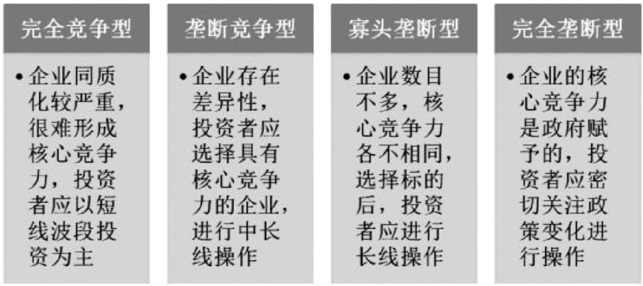

根据行业与国民经济总体周期变动关系的密切程度，可以将行业分为以下3类。

（1）发展型行业。发展型行业主要是指通过技术的突破和产品的研发，推出全新的产品引领消费需求的增长；或者通过不同的组合模式和全新的服务方法，使产品销售出现大幅增长。此类行业的投资回报率会非常高。投资者要想把握此类行业，除了具备丰富的知识和经验外，更要具备敏锐的眼光，能够及时捕捉到这些新生的投资机会。

（2）周期型行业。周期型行业与经济周期存在密切的关系。当经济处在上升阶段时，该类行业迅猛发展，股票价格随之上涨；而一旦经济出现下滑态势，该类行业的生存环境马上恶化，股票价格应声下跌。投资者要把握经济周期，适时投资该类行业。

（3）稳定型行业。此类行业主要是指那些消费需求相对固定的行业，不会随着经济周期的波动而产生剧烈的波动，例如食品行业等。通常情况下，由于此类行业变化不大，因此股票价格相对稳定，在经济处于下行空间时，此类股票成为保值的标的。

行业的分类有千万种，这里不再赘述。总之，投资者只有对行业进行全面、彻底的分析，才能更加清晰地了解某个行业的发展状况，以及它所处的行业生命周期的位置，并据此做出正确的投资决策。

### 行业市场空间

行业市场空间是指行业总的需求量，是一国经济长期增长的第一因素。市场空间是经济发展的客观原动力。有市场空间，可以拉动企业投资和经济发展；没有市场空间，仅仅靠企业自身的力量来推动经济增量，很有可能导致经济失调的巨大风险，自然经济发展质量不高。所以，一般来说，市场空间大的行业潜力巨大，市场空间小的行业潜力稍弱。

例如，改革开放之后，中国经济能够迅速地发展，潜力巨大的市场需求是一个功不可没的因素。正是看到这一点，外资才源源不断地进入，开发中国市场。

通常情况下，企业会通过以下两个方面扩张市场空间。

（1）科技创新。科技创新，一方面可以显著提高产品的使用价值，满足消费者更多样化、个性化的需求；另一方面更能大幅降低产品的生产成本，从而对消费者产生强大的吸引力。最终，通过科技创新，企业达到市场扩容的目的。

（2）走出去。本地区、本国家市场都是有一定限度的，最终都会趋于饱和。此时，一部分企业如果能走出本地区、本国家，去探索外部的市场，那么行业的市场容量就会大幅提升。

赢得市场空间，就能获取更好的发展。所以，这两个方面做得比较好的企业，其投资价值也就比较高。

### 行业环境

任何一个行业都有其生命周期。行业的生命周期指行业从出现到完全退出社会经济活动所经历的时间。行业的生命周期主要包括三个阶段：开创期、扩张期、停滞期。

1. 开创期

一个行业的开创期，往往是技术革新时期，由于前景光明，吸引了很多公司进入该行业，投入到新技术新产品的创新和研发中。经过一段时间的竞争，一些公司的产品被消费者所接受，逐渐占领和控制了市场，而更多的公司则是在竞争过程中被淘汰。此时，该行业处于成长阶段，技术进步非常迅速，利润极为可观，风险也最大，所以行业内公司的股价往往会出现大起大落的现象。

2. 扩张期

这一时期，少数大公司已基本上控制了该行业。这几家大公司经过创业阶段的资本积累和技术上的不断改进，已经取得了雄厚的财力和较高的经济效益，技术更新在平缓发展。公司利润提高，主要取决于公司经济规模的扩大和平稳增长，这一时期公司股价基本上是处于上升的态势。投资者如能在公司扩张期的适当价位入市，则其收益会随着公司效益的增长而上升。

3. 停滞期

由于市场开始趋向饱和，行业的生产规模开始受阻，甚至会出现收缩和衰退。但这一时期该行业内部的各家公司并未放弃竞争，因而利润出现了下降的趋势。所以在停滞期，该行业的股票行情表现平淡或出现下跌，有些行业甚至因为产品过时而遭淘汰，投资者应在此时不失时机地售出股票，并将资金投向成长型的企业或公司。

同花顺软件当中的【板块热点】是查看热点行业信息的一个板块。投资者可以在热门板块中挑选理想的个股。

1　单击【我的应用】选项卡下面的【板块热点】图标，进入当天的热点板块界面。

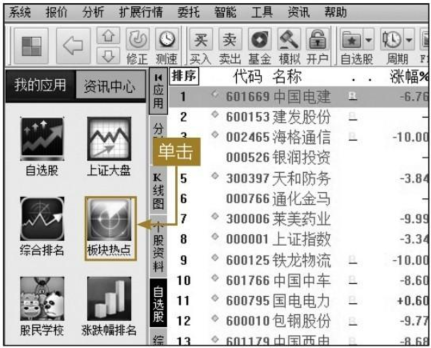

2    如下图所示，医疗器械服务板块当天跌幅最小。下面是该板块中的个股在当天的涨跌情况，按照涨幅由大到小依次排列。双击“迦南科技”，进入该股的分时图界面。

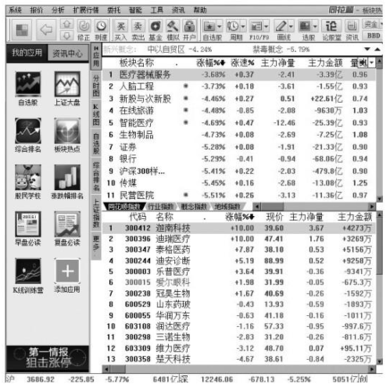

3    如下图所示，该股开盘时低开高走，中途虽有一次下降，但很快止跌拉升，最终在上午收盘时拉至涨停。下午盘中虽有打开，但最后仍以涨停收盘，表现相当强势。

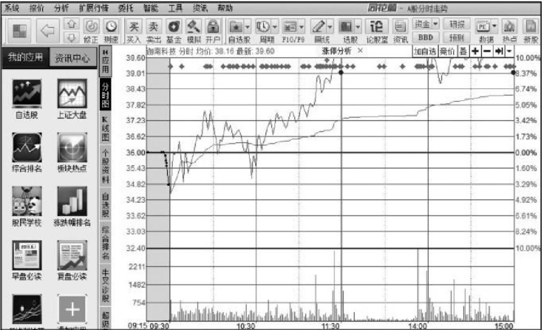

## 企业层面的基本面分析

通过分析公司的经营、财务等因素，投资者可以更确切地把握公司目前的运营状况，并对公司未来发展做出判断和预测，然后做出相应的投资决策。

### 客户和供应商

客户对企业的影响，主要表现在对产品的压价和要求企业提供更高的产品或服务质量的能力，通常称作客户的议价能力。影响客户议价能力的主要因素有以下三个方面。

（1）客户的数量。客户数量越多，单个客户的议价能力越弱；客户数量越少，单个客户的议价能力就越强。

（2）客户购买产品的数量。客户购买的产品数量占据企业销量的比例越大，议价能力越强；反之，议价能力越弱。

（3）企业产品的可替代程度。企业产品的可替代程度越高，客户的议价能力越强；反之，客户的议价能力越弱。

例如，在进货方面，沃尔玛采取中央采购制降低成本，实行统一进货。特别的是，沃尔玛一般将其在全球范围内销售的高知名度商品，如可口可乐、索尼相机等一年销售的商品一次性签订采购合同，由于数量巨大，其价格优惠远远高于同行，形成他人无法比拟的优势。所以，沃尔玛能够连续多年稳居零售业冠军的宝座。

同理，供应商对企业的盈利和产品竞争力的影响，主要表现在提高投入要素价格与降低单位价值质量的能力，通常称作供应商的议价能力。影响供应商议价能力的因素主要有供应商数量、供应商提供量所占份额，以及其提供要素的可替代性。

总之，对于一家企业来说，客户和供应商的议价能力不强，企业就有更强的市场主导权，进而就有能力获得比其他企业更丰厚的回报。这样的企业通常都是优质企业，投资者可适当关注。

### 竞争者和潜在竞争者

一山难容二虎。为了获取有限的生产资料和客户资源，同行业的生产企业之间必然存在相当激烈的竞争。这些竞争通常表现为价格战、广告战、营销战等。通常来说，影响行业竞争激烈程度的因素有以下方面。

（1）竞争者的数量。整个行业中竞争者数量越多，竞争就越激烈，这是生存法则。

（2）进入行业的门槛高低。进入行业的门槛越低，就意味着将会有更多的竞争者加入进来；门槛越高，就形成了一个天然过滤器，滤过那些有想法但无条件的潜在竞争者。

（3）行业的发展程度。如果行业处在初创阶段，由于存在太多未知因素，竞争者数量不会太多，基本上不存在同业竞争；而行业进入发展阶段时，局外人纷纷加入进来分得一杯羹，竞争自然会加剧。

潜在竞争者是指目前没有介入，但将来有可能会介入的非本行业企业。通常，企业比较重视本行业中的竞争者，对他们的信息掌握得比较全面，而对那些可能跨行业的潜在竞争者关注不够。但是，这些跨行业的潜在竞争者不仅能影响原来行业中企业的经营，甚至能够给原行业带来致命打击。

例如，苏宁和国美是两家大型的家电卖场，其经营业务几乎完全重叠，所以这两家企业都会密切注意对方的最新动态，而对局外人缺乏关注。为了获得更多的市场份额，两家企业大打价格战，曾经多次成为社会的热点话题。就在不经意间，电子商务迅猛发展，淘宝的线上购物模式彻底颠覆了这两家企业的竞争格局，短时间内迅速占领了大部分市场份额，倒逼着两家企业纷纷改变营销模式。

总之，对于一家企业来说，竞争者和潜在竞争者的能力不强或数量很少，企业就有更强的市场主导权，进而就有能力获得比其他企业更丰厚的回报。这样的企业通常都是优质企业，投资者可适当关注。

### 管理层和战略

战略观念，是指管理主体在管理实践中从全局和长远出发，对管理客体和管理过程进行总体谋划的管理观念体系。管理主体是否确立战略观念，有无进行战略思考和研究的能力，是导致管理者素质与才能差异的重要原因。因此，一个优秀的管理者，必须始终坚持从全局、长远看问题，树立牢固的战略观念，亲自研究发展战略问题，使战术服从于战略，近期服从于未来。必须指出的是，强调从战略角度看问题，并不是不干实事，恰恰是为了求得全面均衡发展，使各种短期措施与长远目标有机地衔接起来。

例如，苹果公司成立三年就上市，公司发展很顺利。然而好景不长，不久后却因乔布斯与公司董事会意见不一，被董事会挤出公司管理层。接下来因产品开发思路不能适应投资者的需求，苹果的业绩逐步走向下坡路。1996年乔布斯重返苹果时，苹果已经濒临破产了。受命于危难之际的乔布斯开始大刀阔斧的改革，先是与以前的宿敌微软结成战略联盟，进行交叉授权。然后他凭借当年修习美术课的功底和对消费者心理的洞察，带领苹果推出了炫目的iMac电脑——半透明的外观、发光的鼠标、丰富的色彩、标新立异的构思和出色的工业设计使得iMac和随后的iMac二代、iBook等产品获得了一系列最佳称号，成为时尚的代名词。直至现在，苹果产品都代表着主流的设计理念，成为竞争者争相效仿的对象。

一位优秀的企业家给企业带来的发展潜力是无限的。从某种角度来说，投资者投资企业，实际上是在对企业家以及他的企业发展战略进行投资。因此，充分了解企业的管理层和企业战略，能够使投资者做出最明智的决策。

### 企业经营状况

企业经营状况分析，主要是指以企业公开的财务报表和其他相关资料为依据，然后搜集各种与公司决策相关的信息，并对其加以分析的方法。通常包括以下几个方面。

1. 盈利能力

盈利能力（也称收益能力）是指企业获取利润的能力，也称为企业的资金或资本增值能力，通常表现为一定时期内企业收益数额的多少及其水平的高低。盈利能力指标主要包括营业利润率、成本费用利润率、盈余现金保障倍数、总资产报酬率、净资产收益率和资本收益率等6项。实务中，上市公司经常采用每股收益、每股股利、市盈率、每股净资产等指标评价其获利能力。反映企业盈利能力的指标很多，通常使用的主要有销售净利率、销售毛利率、资产净利率、净值报酬率等。

2. 偿债能力

偿债能力是指企业用其资产偿还长期债务与短期债务的能力。企业有无支付现金的能力和偿还债务的能力，是企业能否健康生存和发展的关键。企业偿债能力是反映企业财务状况和经营能力的重要标志。偿债能力是企业偿还到期债务的承受能力或保证程度，包括偿还短期债务和长期债务的能力。企业偿债能力，静态地讲，就是用企业资产清偿企业债务的能力；动态地讲，就是用企业资产和经营过程创造的收益偿还债务的能力。

3. 营运能力

营运能力是指企业的经营运行能力，即企业运用各项资产以赚取利润的能力。企业营运能力的财务分析比率包括存货周转率、应收账款周转率、营业周期、流动资产周转率和总资产周转率等。这些比率揭示了企业资金运营周转的情况，反映了企业对经济资源管理、运用的效率高低。企业资金周转越快，流动性越高，企业的偿债能力就越强，资产获取利润的速度就越快。

同花顺软件为投资者提供了各种分析企业的功能，帮助投资者进行分析。

其中的【基本资料】板块列出了该股票的各项最基本财务数据，帮助投资者更方便、直接地了解整个公司的财务状况。下面以中国中车为例进行说明。

1　打开同花顺软件，进入其主页面。单击页面右下角的搜索框，出现同花顺软件键盘精灵。

2　用键盘输入“ZGZC”，按【Enter】键确认，进入中国中车的分时图界面。

3　用键盘输入“11”，然后按【Enter】键确认，进入中国中车的【基本资料】页面。如下图所示，该页面包括股本结构、股权状况、资产状况、盈利能力、成长能力、偿债能力和现金保障共7个部分。

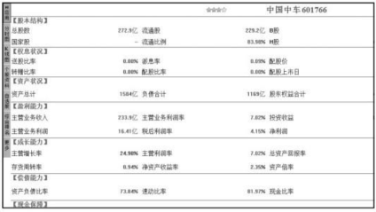

其中的【个股资料】板块罗列了企业最新的各种经营、财务状况，为投资者掌握实时信息提供了重要途径。下面仍以中国中车为例进行说明。

1　打开同花顺软件，进入中国中车的分时图。单击图中所示的【个股资料】选项卡，进入中国中车的最新资料界面。

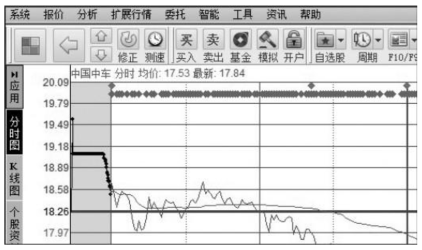

2　如下图所示，投资者可以查到公司的经营状况、股本结构、资本运作、盈利预测等能够对投资决策产生重大影响的信息。

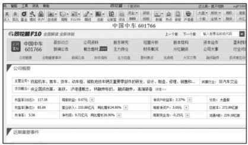

下图为【财务指标】页面窗口。

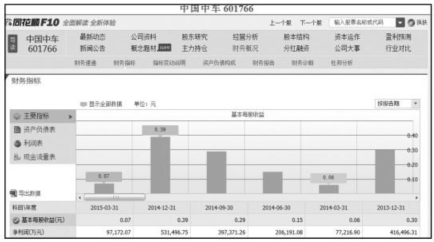

下图为【指标变动说明】页面窗口。

下图为【资产负债表】页面窗口。

## 基本面分析误区

基本面分析法是市场分析方法中最科学实用的方法之一，但很多投资者不能真正理解基本面分析的应用条件和应用环境，盲目崇尚基本面分析，最终有可能陷入基本面分析的误区。

### 舆论误导

舆论误导主要指主力或者机构利用信息传播手段，故意吹捧某一个行业或形势，使投资者盲目跟风进入。

股市过快上涨时，投资者情绪通常会过分高涨，完全忽略市场风险的一面。这个问题在市场上由来已久。其实，之所以会出现此类问题，除投资者本身有一定的错误之外，舆论宣传也不能完全脱离干系。因为在上涨的过程中，舆论一般会侧重报道那些利好因素，以此来吸引更多的投资者加入，而更多新资金的投入会引来更加猛烈的报道，如此这般循环往复。更有甚者，主力利用投资者这种跟风的特性，通过舆论造势，进而达到建仓、出货的目的，收获暴利。

例如，2008年世界金融危机爆发后，媒体报道说对中国影响不大，中国只要扩大内需就能解决问题，因此A股市场可以说是“一枝独秀”。为了避免打击投资者的信心，舆论也有意无意地对A股市场存在的问题视而不见，甚至反过来宣称大小非已不是问题，还是一涨遮百丑，给投资者打气。由于上述偏差，投资者获取了错误的市场信息，以为又歌舞升平了，于是盲目乐观起来，当暴跌突然来临时便被打了个措手不及。这是给投资者一个提醒，不应盲目跟风，应该形成自主的价值判断。

### 简单类比

简单类比主要是指没有逻辑的分析和对比，片面地认为热门行业的公司股价普遍比较高，那么那些价格偏低的股票肯定存在补涨的机会，于是大举买入。

股票不应简单类比，这个领域某只股票涨，不表明其他股票也会涨。公司内部管理水平、产品结构、市场以及客户群体都存在差异，甚至管理层的意愿也会影响股价，如有的管理层只是想利用股票来套现，并没有真正的经营企业，这样的公司，其目的不外乎就是让散户来接盘。

### 以偏概全

以偏概全主要体现在发现企业有优点，就把企业当成优质投资标的；把财务指标分析当成企业的整个价值分析。

通过财务数据来评估股票价值，在我们这个历史不长的证券市场上，实际上是从1996年开始的。1996年年初，市场逐渐活跃起来，为了进一步激活股市，引导市场注重“绩优”的理念，深交所曾搞了一个“20家绩优公司”的评选，主要依据就是一些财务指标，例如每股收益、每股净资产、净资产收益率、负债率、流动比率等财务指标。应该说，上述指标都是对上市公司及其价值研究的结果。但是，如果把这些结果用到股票投资上，却会发现这些方法对股票投资几乎没有直接用途。例如，按照上述方法选出的公司且不论能否保证今后仍然“绩优”，即便可以，由于没有和股价直接联系，无从判断是否被市场高估或低估，所以这些结果对投资就没有直接作用。当然，上述研究可能纯粹是就公司的某一方面研究而言的，并非是针对具体选股，但在证券市场上，这些结果很容易被人理解为“价值评估”。

在此要特别提醒投资者，公司的财务数据是为了更加科学地反映公司某一方面的特质，决不表示财务数据就是公司的实际价值。因为，企业很多的内在价值是无法通过数据表现的。所以，投资者在判断一个企业是否具有投资价值时，财务数据是很重要的方面，但不是全部。如果想更加全面地了解一个企业，投资者需要了解报表以外的其他综合信息，这样才不会被财务数据蒙蔽双眼。因为，个别企业为了获得投资者的青睐，会通过财务造假的方法来骗取投资。

投资者需要做的是，综合运用多种财务指标，多种层面分析，尽可能了解公司的全部资料，在此基础上做出综合判断，才能有效避免损失，取得相对合理的投资收益。

# 高手秘技

## 技巧 如何高效读懂企业年报

> 查看企业的年报，投资者需重点关注财务报告、会计资料和业务资料、董事会报告三大部分。
>
> 财务报告由审计报告、资产负债表、损益表、现金流量表等组成。这些信息是企业日常经营活动的记录形式，充分了解这些，不仅能有效提高阅读年报的效率，也能让投资者对企业有更深层次的认识。
>
> 会计资料和业务资料主要给投资者提供盈利能力、偿债能力、经营能力等技术指标数据，让投资者对企业的竞争力有直观感受，并最终有效地指导投资行为。
>
> 董事会报告能够透露出公司的战略布局或战略谋划，使投资者对公司未来发展有更加清楚的认识。

