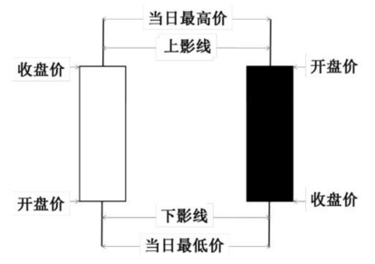

# 单K线分析

**本章引语**

> 以目而视，得形之粗者也；以智而视，得形之微者也。
>
> ——刘禹锡《天论（中）》
>
> 
>
> 用眼睛去看事物，只能看到事物粗略的概貌；以智慧去看事物，才能看到事物的细小精微之处，看到事物的本质。投资者炒股时，不仅要注意K线的形状，更应该分析K线背后的买卖信息，这样才能科学地预测股价的未来趋势，把握合理的买卖时机。

**本章要点**

> ★常见K线分析
>
> ★分时图

K线，作为一种记录价格的工具，在股票市场和期货市场被广泛采用。因此，投资者要入市炒股，第一步就要先认识K线。

## 认识K线

K线其实很简单，一点都不神秘。日用消费品的价格会变动，通常用价格变动表去反映。同样，股市股价每天都不一样，有涨有跌，而K线反映的就是股票价格的历史变动情况。

### 什么是K线

K线又称日本线、阴阳线、棒线等。K线起源于日本18世纪德川幕府时代（1603—1867）的米市交易，用来计算米价每天的涨跌。因其标画方法具有独到之处，人们把它引入股票市场价格走势的分析中。经过300多年的发展，现在已经广泛应用于股票、期货、外汇、期权等证券市场。

K线是技术分析的一种工具，在日本早期的米市用于记录开市价、收市价、最高价及最低价，阳烛代表当日升市，阴烛代表跌市。由于用这种方法绘制出来的图表形状颇似一根根蜡烛，加上这些蜡烛有黑白之分，因而也叫阴阳线图表。

如下图所示，开盘价和收盘价之间是K线的实体。K线实体的上下方有一条竖线，上方的是上影线，表示当天股价曾达到过的最高价；下方的是下影线，表示当天股价曾达到的最低价。如果收盘价高于开盘价，K线就用红色或者空心显示，称为阳线；反之，收盘价低于开盘价，K线用绿色或实心显示，称为阴线。

### 什么是K线图

股市的K线图包含四个数据，即开盘价、最高价、最低价、收盘价，所有的K线都围绕这四个数据展开，来反映大势的状况和价格信息。把单个K线连续不间断地放在一张图上，就是K线图。

根据形态的不同，K线可以分为光头光脚K线、大阳或大阴K线、十字星K线、螺旋桨K线、T型K线、锤子K线、一字K线等，后面会详细介绍。
根据时间周期的不同，K线图可以分为1分钟K线图、5分钟K线图、15分钟K线图、30分钟K线图、60分钟K线图、日K线图、周K线图、月K线图等。其中的周K线、月K线为长期K线图，其他都为短期K线图。每一种K线的使用范围是不同的，投资者根据操盘时间的不同，可以选择不同的K线进行参考。下面对同一只股票的月K线图、周K线图和日K图线进行介绍。

> **提示**
>
> 同样的K线组合，月线的可信度最大，周线其次，最后是日线。因此，投资者通过日K线预测后市时，最好配合周线和月线进行分析。

月K线图是以本月第一个交易日的开盘价为开盘价，本月最后一个交易日的收盘价为收盘价，最高和最低价分别是本月的最高价和最低价。月K线图全面、清晰地反映了股票中长期的走势情况，投资者据此可以把握该股的长期走势，对长期投资进行分析。下图为大禹节水（300021）的月K线图。

周K线图是以本周一的开盘价为开盘价，本周五的收盘价为收盘价，最高和最低价分别是本周的最高价和最低价。周K线图准确、客观地反映了股票中期的走势情况，投资者据此可以把握该股的中期走势，对中期投资进行分析。下图为大禹节水（300021）的周K线图。

日K线图是以当天的开盘价为开盘价，当天的收盘价为收盘价，最高和最低价分别是当天的最高价和最低价。日K线图准确、客观地反映了股票短期的变动情况，投资者据此可以把握该股的短期变化趋势，对短期投资进行分析。下图为大禹节水（300021）的日K线图。

K线图的作用

K线图最基本的作用就是寻找“买卖点”。K线图可以把每日或某一周期的市况表现完全记录下来，展现某些蛛丝马迹。因为股价经过一段时间的盘档后，在图上即形成一种特殊区域或形态，不同的形态显示出不同意义。投资者可以从这些形态的变化中摸索出一些有规律的东西，进而指导投资决策。

通常情况下，判断股市大体趋势，投资者需要关注长期K线图，如周K线图和月K线图。如果周K线图和月K线图处在相对较高的位置时，表明股价已经处在相对高位，下跌风险比较大。因此，投资者要注意控制仓位，重仓时尽早出货，轻仓时观望为主。如果周K线图和月K线图处在相对较低的位置时，表明股价相对较低，继续下探风险较小，此时投资者可以适时买入股票。当投资者想要买入股票时，可以通过短期K线图找到最适合的买点介入，这样就能使利润最大化。卖出股票的道理是一样的。

投资者虽然面对的是同样的K线图，但由于投资者本身的阅历和思维分析方法不同，从其中得到的领悟各有不同。要想提高分析K线的能力，必须长期认真观察，主动积极思考。对于别人的投资技巧和经验，初学者不要盲目迷信，要“辩证”地看，暂时不懂也没关系。随着投资者看盘时间增加，领悟自然会越来越到位，投资判断的准确率也会大幅提升。

8.1.4 K线图的分析技巧

分析K线图主要是分析K线的阴阳、实体的大小以及影线的长短。这些因素不同，反映出来的信息也就不同，投资者也应该根据不同的信息采取不同的投资策略。

1.看阴阳

股票的阴阳就是涨跌，由市场的供求关系决定，是多空双方博弈的结果。通常，股票的涨跌都具有一定的趋势，就像高速行驶的汽车不会马上停或转向一样。所以，如果出现大量阳线，说明多方占优，通常会沿着上涨趋势上行；反之，出现大量阴线，则会沿着下跌趋势下跌。投资者应该顺势而为。

1　打开同花顺软件，输入中国西电的股票代码“601179”，按【Enter】键确认。

2　下图为中国西电（601179）2015年4月至5月的日K线走势图。左边阳线占优，股价处于上升阶段；右边阴线占优，股价处于下跌阶段。但是股价在上升阶段会出现阴线，同样下跌阶段也会出现阳线，这些都是股价涨跌波动回调的正常现象。只要出现的这些阴线和阳线数量很少，成交量不大，就不会改变股价原来的走势。不过，当股价处于顶部或底部的时候，投资者需要特别注意，这时候出现不一样的K线，可能是股价开始反转的信号。

看实体

实体大小可以更精确地表现出多空双方的力量对比，是股价变动的动力。K线实体越大，显示出多方或空方当天占据的优势越大，紧接着股价上涨或下跌的概率相应越高。而实体越小，显示出多空双方基本上势均力敌，紧接着股价的走势就很不明显。总结来说，阳线实体的大小与上涨的动力成正比，阴线实体的大小与下跌的动力也成正比。

1　打开同花顺软件，输入国民技术的股票代码“300077”，按【Enter】键确认。

2　下图为国民技术（300077）2015年4月至5月的日K线走势图。如图所示，出现大实体阴线之后，股价开始接连下跌。当出现大实体阳线，股价开始企稳，并转向开始进入上升通道，达到新的高度。

3.看影线

K线的影线是股价发转的一个强烈信号。之所以会出现长影线，是因为前方的阻力较大。不管K线是阳是阴，K线上一个方向的影线越长，越不利于股价朝这个方向变动，即上影线越长，说明空方阻力较大，多方不能有效突破，股价继续向上的可能性就相当渺小；下影线越长，说明多方阻力较大，空方不能形成有效突破，股价继续向下将缺乏动力。投资者可利用这些识顶逃顶，识底逃底。

> **提示**
>
> 主力出货不可能做到无影无踪，如果一只股票前期已经大涨，突然出现带长上影线的K线，成交量放大，很可能是主力出货所留下来的痕迹，投资者此时应该谨慎操作。

1　打开同花顺软件，输入中国中冶的股票代码“601618”，按【Enter】键确认。

2　下图为中国中冶（601618）2015年5月至6月的日K线走势图。如图所示，在五月初，股价已经经历一波上涨，此时接连三天出现长上影线，说明阶段顶部形成，突破起来相当困难，可能会进入短期调整态势。连跌几天过后，K线图中出现了接连几天的下影线，表明股价调整基本结束，新一轮上涨马上开启。

8.1.5 单根K线图的画法

K线图由每个分析周期的开盘价、最高价、最低价和收盘价绘制而成。以绘制日K线为例，首先确定开盘和收盘的价格，它们之间的部分画成矩形实体。如果收盘价格高于开盘价格，则K线被称为阳线，用空心或红色的实体表示。反之称为阴线，用实心或绿色实体表示。但涉及欧美股票及外汇市场的投资者应该注意：在这些市场上，通常用绿色代表阳线，红色代表阴线，和国内习惯刚好相反。用较细的线将最高价和最低价分别与实体连接。最高价和实体之间的线称为上影线，最低价和实体间的线称为下影线。

用同样的方法，如果用1分钟价格数据来绘K线图，就称为1分钟K线图。用1个月的数据绘制K线图，就称为月K线图。绘图周期可以根据需要灵活选择，在一些专业的图表软件中还可以看到2分钟、3分钟等周期的K线图。

8.2 常见K线

K线存在各种各样的类型，其中有部分K线出现的频率较高，并且能够传递出清晰的信号。本节对常见的K线进行介绍。

一字线

如下图所示，一字线是指以涨停板或跌停板开盘，全天始终在涨停板或跌停板价格成交，直到收盘为止，即当日的开盘价、收盘价、最低价、最高价粘连在一起，形成一字形状。

一字线应该受到投资者的格外关注。在上涨初期出现一字线，投资者应该积极跟进，第一个交易日没有跟进，第二个交易日还可以继续跟进。因为一字线通常表明该股上涨动力很强，持续上涨的可能性非常大。但是，如果已经连续出现了多个一字线，股价上涨幅度过高、风险较大，建议投资者就不要继续跟进，规避短期风险。下跌初期出现一字线，投资者应果断平仓出货，第一天没有卖掉，第二天接着出货。如果连续出现多个下跌的一字线，此时可以等反弹再出货。

1　打开同花顺软件，输入中国中车的股票代码“601766”，按【Enter】键确认。

2　下图为中国中车（601766）2015年4月的日K线走势图。如图所示，中国中车出现两个一字线之后连续打开两天，投资者可以果断介入，之后中国中车又连续出现多个涨停。

8.2.2 光头光脚阳线、阴线

如下图所示，光头光脚阳线是指开盘价为当日最低价，收盘价为当日最高价；光头光脚阴线是指开盘价为当日最高价，收盘价为当日最低价。所以，严格意义上的光头光脚阳线、阴线都没有上、下影线。有时，如果影线很短，也可以认为没有影线，近似看作光头光脚的阳线、阴线。通常，把当日涨幅在1.5％以内的定义为小阳、小阴线，涨幅在1.5％～5％之间的定义为中阳、中阴线，涨幅大于5％的定义为大阳、大阴线。

光头光脚的中大阳线、阴线具有极强的信号作用。如果股价处在底部，此时出现光头光脚的中、大阳线，这是逐步企稳、准备拉升的典型表现，如果再加上成交量的配合，反转行情将是大概率事件。如果在横盘整理期间出现中、大阳线，很可能是主力进行突破的明确信号，后市看涨，投资者可果断跟进。如果位于顶部出现中、大阳线，投资者应该保持谨慎，尽早落袋为安。相反，中、大阴线出现在顶部是下跌开始，出现在横盘期间是突破下行，出现在底部则可能要触底反弹。

1　打开同花顺软件，输入海格通信的股票代码“002465”，按【Enter】键确认。

2　右图为海格通信（002465）2015年6月份的日K线走势图。如图所示，光脚大阳线出现在顶部区域，预示着反转信号。光脚阴线出现在下跌过程中，后市继续看跌。

8.2.3 T字线和倒T字线

如下图所示，T字线是指当日开盘价、收盘价、最高价相同，K线上只留下影线，如果有上影线，也是很短。T字线信号强弱与下影线成正比，下影线越长，则信号越强。

T字线出现的位置不同，所表示的意义也不一样。T字线在股价大幅上涨之后出现，通常意味着股价基本见顶；T字线在股价大幅下跌之后出现，通常意味着股价基本见底；T字线在股价上涨过程中出现，通常是继续上涨的信号；T字线在股价下跌过程中出现，通常是继续下跌的信号。投资者要根据具体的K线位置和相关信息进行综合判断。

1　打开同花顺软件，输入中元华电的股票代码“300018”，按【Enter】键确认。

2　下图是中元华电（300018）2015年4月至5月的日K线图。如图所示，该股在上升途中出现了两次T字线，第二个交易日都出现向上跳空，这是上升途中的T字线。投资者可果断介入。

如下图所示，倒T字线是指开盘价、收盘价、最低价粘连在一起，成为“一”字，但最高价与之有相当距离，因而在K线上留下一根上影线，构成倒“T”字状图形。倒T字线上影线越长，力度越大，信号越可靠。

在上升趋势中出现倒T字线，通常称为“上档倒T字线”或“下跌转折线”，因为开盘时股价趁着上涨趋势继续走高，但是，在空方的打压下，股价逐步被打回原形，表明多方力量衰竭，上涨动力不足。此时，投资者应该以轻仓或观望为主。如果在一轮下跌趋势的末期出现倒T字线，通常视为买入信号。如果在上涨途中出现，继续看涨；在下跌途中出现，继续看跌。

1　打开同花顺软件，输入钢研高纳的股票代码“300034”，按【Enter】键确认。

下图为钢研高纳（300034）2015年4月至5月的日K线走势图。如图所示，该股在横盘调整时期出现了倒T字线，不会改变股价的走势。

8.2.4 大阳线、大阴线

如下图所示，大阳线是指最高价与收盘价相同（或略高于收盘价），最低价与开盘价一样（或略低于开盘价），上下没有影线或影线很短。大阴线是指最高价与开盘价相同（或略高于开盘价），最低价与收盘价一样（或略低于收盘价），上下没有影线或影线很短。

从多空力量角度分析，大阳线表明从开盘到收盘，多方始终占据着优势，基本上没有给空方任何机会。这是一种强势的信号，也表现出投资者跟进热情高涨。但是，大阳线出现的位置不同，对未来股价的走势判断也会不同。如果出现在长期横盘或底部，毫无疑问这是上涨信号，投资者可果断买入，等待上涨；如果出现在上涨过程中，这是涨势的强化，投资者可继续持有；如果出现在股价大幅上涨之后，这可能是主力为了更好地出货，故意拉高，投资者最好还是尽早落袋为安。大阴线则刚好与大阳线相反。

1　打开同花顺软件，输入铁龙物流的股票代码“600125”，按【Enter】键确认。

2　下图为铁龙物流（600125）2015年6月的日K线走势图。如图所示，左边阳线分别表示了上涨和见顶信号，右边的阴线表示了继续下跌的信号。

十字星

如下图所示，十字星是指开盘价和收盘价相同，没有K线实体，只有上下影线。上影线长，表示空方力量占优。下影线长，表示多方力量占优。
十字星表现的是多空双方力量基本平衡的状态。分析十字星，主要不是区分阴阳，而是分析十字星出现的位置。通常情况下，在股价高位或大幅上涨过后出现十字星，是见顶信号，行情反转下跌的可能性较大；在股价低位或大幅下跌过后出现十字星，是见底信号，行情反转上升的可能性较大；在涨势、跌势或横盘过程中出现十字星，基本上不能改变原有的走势，继续维持原来趋势发展。总体来说，十字星往往预示着市场到了一个转折点，投资者需密切关注，及时调整操盘的策略，做好应变的准备。

1　打开同花顺软件，输入中国中铁的股票代码“601390”，按【Enter】键确认。

2　下图是中国中铁（601390）2015年3月至4月的日K线走势图。如图所示，底部十字星表示开始上涨，上涨途中和横盘时的十字星不改变走势。

其他常见K线

除了以上几个常见的单根K线形状外，K线还有其他一些特殊形状。

1.锤子线和上吊线

如下图所示，锤子线和上吊线的共同特征是实体位于整个价格区间的上端，下影线的长度至少达到实体高度的2倍，没有上影线，或上影线长度极短。
两者主要区别是锤子线位于股价下行阶段的低位，而上吊线则是位于股价上行阶段的高位。两者都是很强的股价反转信号。

2.倒锤子线和射击之星

如下图所示，倒锤子线和射击之星的共同特征是实体位于整个价格区间的底部，上影线的长度至少达到实体高度的2倍，没有下影线，或下影线长度极短。

两者主要区别是倒锤子线位于股价下行阶段的低位，而射击之星则是位于股价上行阶段的高位。两者都是很强的股价反转信号。

3.螺旋桨

如下图所示，螺旋桨是指K线实体较小，上下影较长。

8.3 在股票软件中调出K线

以同花顺软件和上证指数为例，详细介绍如何调出K线以及K线的具体指标。

1　打开同花顺软件，进入其主界面。用键盘输入“SZZS”，按【Enter】键确认后进入上证指数的分时图界面。

2　在大盘分时图中，单击左侧【K线图】选项卡，或者双击鼠标左键，或者按【F5】键或【Enter】键，都可进入大盘K线图界面。在K线图界面，按【F8】键可以切换不换同周期的K线图。

下面对大盘K线各模块的功能进行简单说明。

（1）信息地雷。显示K线对应时期的重要信息，单击每一信息地雷图标都可以进入【历史信息】界面。

（2）均线。均线代码为“MA”，MA5表示为5日均线，依次类推。单击右上角的【均线】选项卡，可以对均线进行设置，界面如下。

（3）成交量柱。以柱形条显示每个周期内成交量的变化情况，单击右侧【成交量】，在弹出的下拉菜单列表中，可以选择【金额】、【换手率】、【内盘】、【外盘】等信息。

双击成交量标题栏的任一位置，进入成交量设置的对话框，界面如下。

（4）多指标选择。从图中可查看MACD指标、KDL指标、RSI指标、ASI指标、OBV指标等众多指标走势图。单击右侧【指标说明】选项卡，可以查到该指标详细情况和使用说明，界面如下。

（5）行情统计。显示市场中涨跌、涨幅、现手、总手、委买量、委买量等行情信息。

（6）选择信息。包含【分时】、【筹码】、【火焰】三个功能。具体界面如下。

.4 走势图界面的布局方式

分时图是指大盘和个股的动态实时走势图。在实际操作中，分时图的地位非常重要，是把握多空力量转换和主力意图的根本所在。

8.4.1 大盘分时图的布局方式

（1）白色曲线。表示大盘加权指数，即证交所每日公布媒体常说的大盘实际指数。

（2）黄色曲线。大盘不含加权的指标，即不考虑股票盘子的大小，而将所有股票对指数影响看作相同而计算出来的大盘指数。
参考白黄二曲线的相互位置可知：当大盘指数上涨时，黄线在白线之上，表示流通盘较小的股票涨幅较大；反之，黄线在白线之下，说明盘小的股票涨幅落后大盘股。当大盘指数下跌时，黄线在白线之上，表示流通盘较小的股票跌幅小于盘大的股票；反之，盘小的股票跌幅大于盘大的股票。

（3）红绿柱线。在黄白两条曲线附近有红绿柱状线，是反映大盘即时所有股票的买盘与卖盘在数量上的比率。红柱线的增长减短表示上涨买盘力量的增减；绿柱线的增长缩短表示下跌卖盘力度的强弱。

（4）黄色柱线。在红白曲线图下方，用来表示每一分钟的成交量，单位是手（每手等于100股）。

（5）委买委卖手数。代表即时所有股票买入委托下三档和卖出上三档手数相加的总和。

（6）委比数值。是委买委卖手数之差与之和的比值。当委比数值为正值大的时候，表示买方力量较强股指上涨的概率大；当委比数值为负值的时候，表示卖方的力量较强股指下跌的概率大。

（7）下图为同花顺软件中大盘的分时图。

8.4.2 个股分时图的布局方式

（1）白色曲线。表示该种股票即时成交的价格。

（2）黄色曲线。表示该种股票即时成交的平均价格，即当天成交总金额除以成交总股数。

（3）黄色柱线。在红白曲线图下方，用来表示每一分钟的成交量。

（4）成交明细。在盘面的右下方为成交明细显示，显示动态每笔成交的价格和手数。

（5）外盘内盘。外盘又称主动性买盘，即成交价在卖出挂单价的累积成交量；内盘又称主动性卖盘，即成交价在买入挂单价的累积成交量。外盘反映买方的意愿，内盘反映卖方的意愿。

（6）下图为同花顺软件中的个股的分时图，以中国中车为例。

8.5 如何解读K线中的信息

表面上，K线只是记录了当天的交易信息；实际上，K线当中还隐藏了主力的买卖信息。投资者研究K线，重点就是要把握主力的意图。

8.5.1 K线图和分时图的相互作用

股票分析过程中经常要看K线，K线能够直观地表现出股价走势，这是K线真正的价值所在。但K线也具有一定的不确定性，是因为K线是由四个股价的不同组合所决定和形成的，即开盘价、最低价、最高价和收盘价。这四个价格的不同组合就形成了不同的K线，很显然仅通过四个价位就完全、真实地表现出全天的运行状态，确实有些不太现实，因此就更不能完全准确地表现主力的操作计划和目的。也就是说，主力完全可以通过操控这四个价位做出它想要的K线形态，这就是K线的不确定性。

在分析股票的时候，最该重视的是分时图走势，只有分时图走势才能够完全地记录股价走势，只有分时图走势才能完全地体现出主力的操作计划和目的。主力的操作动作必然要通过分时图走势体现出来。从这个意义上来说，分时图走势具有更高的确定性和准确性，那么我们在实战分析过程中要看分时而不是K线。
无论是分时图走势还是K线形态，形态产生必然有一定的原因，每一种形态都有其形成的原因，都能体现出主力的操作计划和目的，这才是分析股票的真正意义所在。只有我们理解了分时图走势和K线形态背后的含义，我们才能真正地把握它，形式不重要，内容才重要。

K线相对于分时走势来说，具有相当的不确定性，那么分时走势则比较完全地反映出股价走势，而主力的操作计划和目的也是通过交易来完成的，所以分时走势能够反映出主力操作的计划和目的。而主力操作计划和目的是我们操作的重要的基础，所以分析股票时，首先就要分析分时走势和分时走势形成的原因，以及所体现出的主力的操作计划和目的，然后结合相关的K线形态做进一步的确认。如果二者能相辅相成、相得益彰，那么投资者分析的准确性将大幅提高。

8.5.2 分时图形成的K线图形态

每一种分时走势的出现必然对应于不同的股价交易情况，而不同的股价交易情况能体现出不同的K线形态。下面就介绍几种特殊的单根K线所对应的分时图。

1.光头光脚阳线对应的分时图

如下图所示，光头光脚的阳线说明开盘价就是全天的最低价，收盘价就是全天的最高价。从该股的分时图上可以看出，全天的股价是一直上升的，表明多方的力量明显占优。如果是光头光脚的大阳线或中阳线，那么多方实力显露无遗，第二天继续看涨；如果是小阳线，则需要根据其他信息再进行判断。

2.带下影线的大阳线对应的分时图

如下图所示，该股的分时图表现的是有下影线的大阳线。首先，从开盘到收盘，股价基本上涨10％，属于大阳线。其次，上午的一段时间，股价跌破了当天的开盘价，随后又涨了上去，所以，最低价低于当天的开盘价，是下影线。再次，从分时图可以看出下影线比较短。这种带短下影线的大阳线表明当天空方势力很强，后市看涨。

3.T字线对应的分时图

如下图所示，该股当天以涨停板开盘。一段时间过后，涨停板打开，股价下跌，在此之后股价一直震荡。临近收盘，股价再次被拉上涨停。所以开盘价和收盘价相同，最低价低于开盘价7％，属于典型的T字线。这表明多方的实力占优，但空方已经具备一定的反击能力。

十字星对应的分时图

如下图所示，该股当天跳空低开，并继续下探。随后股价开始急速拉升，不但回到开盘价，连之前的缺口快速填补。达到最高点之后，股价开始震荡下行，收盘在开盘价的位置。这是典型的十字星K线，开盘价和收盘价相等，有上下影线。这表明多空双方博弈激烈，势均力敌。

5.锤子线对应的分时图
如下图所示，该股的开盘价略大于收盘价，这说明此阴线的实体较小。而当天股价大部分是处在开盘价的下面，没有超过开盘价，说明没有上影线。另外，下跌幅度比较大，表明下影线的长度远大于K线的实体。这是典型的锤子线的形态。具体反映的信号要结合其他指标进行综合分析。

综合运用不同时间周期的K线

下面通过一些具体案例的分析，介绍整个K线分析的过程。

8.6.1 实战：下影长、实体短的锤子线形态

如下图所示，锤子线是实体位于整个价格区间的上端，下影线的长度至少达到实体高度的2倍，没有上影线，即使有上影线，其长度也是极短的。下影长、实体短的锤子线通常出现在阶段顶部，投资者如果能熟练掌握就能够利用该形态识顶和逃顶，避免损失。

具体操作步骤如下。

1　打开同花顺软件，输入中国中冶的股票代码“601618”，按【Enter】键确认。

2　进入中国中冶的日K线走势图。通过缩放，可以看到中国中冶2015年5月的日K线走势图。如下图所示，中国中冶的股价经过一轮上涨之后，阶段高点基本已经形成，此时出现了高位的锤子线，这是行情反转的一个信号，投资者应尽早出货。

实战：快速下跌后的低点螺旋桨形态

如下图所示，螺旋桨是指K线实体较小，上下影较长的一种K线图形态，低位螺旋桨往往代表了行情即将反转。

螺旋桨通常是多空双方互相拉锯、不分伯仲时的一种特殊形态，该形态是很好的行情反战信号，投资者应该熟练掌握。

具体操作步骤如下。

1　打开同花顺软件，输入国民技术的股票代码“300077”，按【Enter】键确认。

2　进入国民技术的日K线走势图。通过缩放，可以看到国民技术2014年12月至2015年1月的日K线走势图。如下图所示，国民技术接连迎来5根阴线，最后还是一根大阴线，此时主力基本上已经完成了出货，然后出现“螺旋桨”，该K线是反转的信号。投资者可以及时买入，待股价上涨之后卖出，即可获取丰厚回报。

实战：长阴后的探底十字星形态

如下图所示，长期探底后的十字星代表了股市多空力量平衡，特别是长阴后出现下影线较长，表示多方力量占优，行情即将反转。

十字星是具有很强反转信号的 K线形态。通常来讲，大幅下跌过后出现十字星，多半是行情反转的开始，投资者应格外关注。

1　打开同花顺软件，输入爱尔眼科的股票代码“300015”，按【Enter】键确认。

2　进入爱尔眼科的日K线走势图。通过缩放，可以看到爱尔眼科2014年11月至2014年12月的日K线走势图。如下图所示，经过两周左右的横盘，主力准备抬高拉升。主力先拉起一根大阳线，造成马上就要上涨的假象，诱导散户跟进，然后迅速下调，拉出大阴线，造成下跌的态势，以此来洗出意志不坚定的投资者。一切就绪，出现探底十字星，最后开始真正拉升。

高手秘技

技巧1 如何看待向上跳空缺口

通常情况下，向上跳空缺口的产生是主力资金大规模集中造成的。因此，向上突破缺口的出现就意味着多方资金大规模积聚，那么新一轮的上涨即将开始。判断该形态时，投资者需要注意两个因素。

（1）缺口位置。如果处在低位，很可能是上涨信号；如果处在上涨途中，继续看涨；如果出现在顶部，可能是主力拉高出货，后市看跌。

（2）成交量。如果低位向上跳空缺口的产生，伴随成交量的明显放大，可以确信此为上涨信号。

技巧2 谨慎看待日K线的见顶下跌

多数投资者都有这样的经历—分析日K线图，感觉股价已经开始见顶下跌，于是赶紧卖出，但没过多久股价就调转枪头，迅速拉升，创出新高。究其原因，自然是被日K线中的“假顶部”所迷惑。因为日K线期限相对较短，主力常常创造假K线欺骗投资者，而在期限长的周K线上，出现骗线的概率就大大减少。所以，投资者在卖出时，眼光应放长远，等到周K线筑顶之后再操作。