# 通过成交量透视股票走势

**本章引语**

> 一箭易折，十箭难断。
>
> ——《魏书》
>
> 证券市场中的竞价交易产生了股价，买方与卖方交易达成就产生了成交量。成交量越大，也就意味着市场的参与度越高。由此可见，股价与成交量之间的关系十分紧密，投资者可以透过成交量分辨股票走势的真实与虚假。成交量是投资者分析和判定市场行情时最重要的依据，也是应用其他技术指标时不可或缺的参考。

**本章要点**

> ★ 上升行情中的成交量形态
>
> ★ 下降行情中的成交量形态

## 成交量对炒股的意义

在利用技术对股票进行分析的时候，最基本的技术指标就是成交量。投资者可以透过成交量，看清股票所处的阶段和主力运作的意图，因此成交量对投资者来说意义重大。

### 什么是成交量

成交量（英文缩写为VOL）是指单位时间内股票、基金、债券等交易成交的数量。一般当供不应求时，人们争相买进，成交量会随之放大；反之，供过于求，市场冷清无人，成交量势必萎缩。

在证券市场中，成交量分为两种形式：一种是成交股数；另一种是成交金额。成交股数是指个股某一交易日成交的股数之和。成交金额为该股票在某一交易日所有成交的金额。

**案例**：

打开同花顺软件，输入京东方A的股票代码“000725”，按【Enter】键确认。

下图为京东方A（000725）分时图。图中的每一根成交量柱分别代表每一分钟所产生的成交量，一个交易日有240分钟，因此应当有240根成交量柱。这些一分钟成交量柱排列在一起就是股票的成交量带。成交量大，成交量柱就长；成交量小，成交量柱就短。成交量柱为红色，表示在此时段股价上涨；成交量柱为绿色，表示在此时段股价下跌。单击鼠标左键可以在分时图中显示十字光标，十字光标竖线所指定的是该光标位置的这一分钟的股价和成交量，在分时图的左侧将显示该分钟的股价和分时成交量数据。

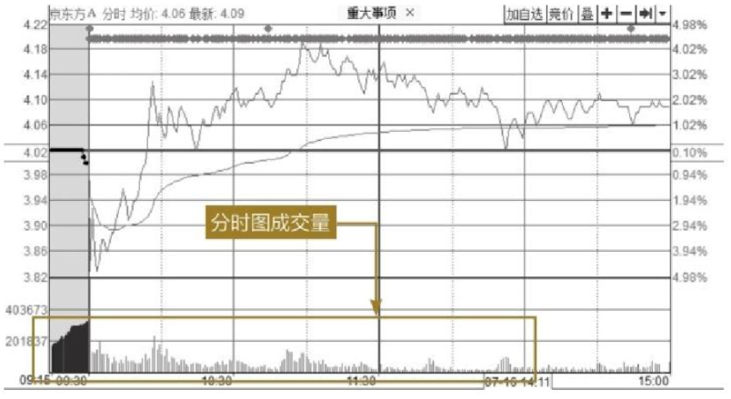

通过股票分析软件，投资者还可以查看K线图中的成交量指标。

打开同花顺软件，输入京东方A的股票代码“000725”，按【Enter】键确认，从分时图界面切换至K线图界面。

下图为京东方A（000725）的日K线图。K线图中的成交量指标图位于K线图下方。京东方A的日K线图中的每一根成交量柱分别代表每一个交易日所产生的成交量。如果投资者查看的是其他时间周期的K线图，则下方对应的成交量就是对应分析周期的成交量。与分时图一样，成交量越大，成交量柱就越长；成交量越小，成交量柱就越短。成交量柱为红色，表示在此时段股价上涨；成交量柱为绿色，表示在此时段股价下跌，量柱的颜色表示了股价是上涨还是下跌。值得注意的是，所有的K线图都有成交量均线。成交量均线也是非常重要的技术指标之一，其基本的运行规律是：成交量均线5日线上穿成交量均线10日线，股价上涨，成交量均线5日线下破成交量均线10日线，股价下跌。

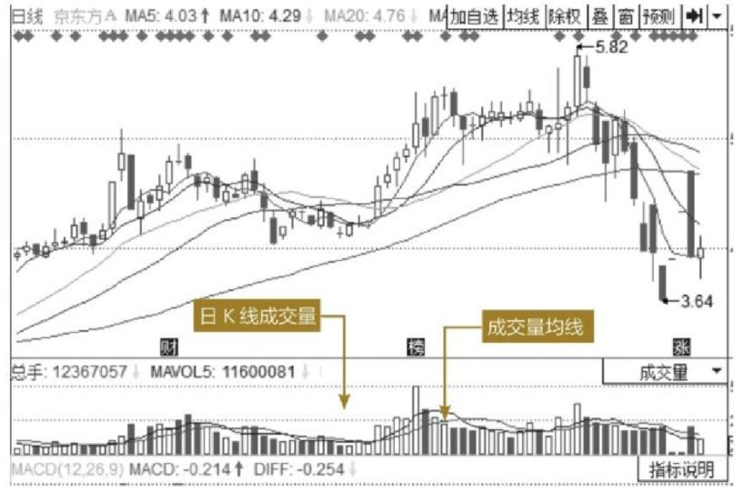

投资者如果想了解更详细的成交数据，可以查看成交明细。

打开同花顺软件，输入京东方A的股票代码“000725”，按【Enter】键确认。投资者进入个股界面后，在股票分析软件中按【F1】键，即可显示成交明细数据。

下图为京东方A（000725）在2015年7月16日的成交明细。图中现手一栏，红色字体并且旁边有向上的箭头表示以主动性买入价格成交，绿色字体并且旁边有向下的箭头表示以主动性卖出价成交。

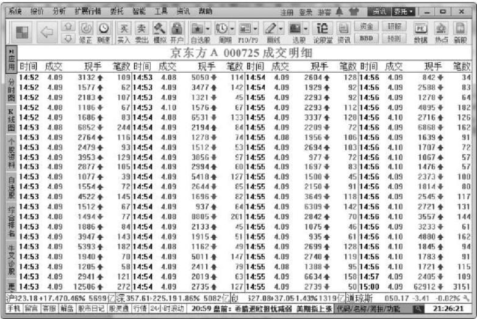

### 成交量的意义

股票的价格与成交量之间呈正相关关系，也就是遵从“价升量增、价跌量减”的规律。在股价不断上升的过程中，成交量也在不断增加；在股价下跌过程中，成交量也在逐步减少。

根据这一规律，股票价格上升而成交量不增加，则说明股票得不到买方的认同，价格的上升趋势就会因为得不到支持从而导致股票的走势发生改变。反之，当股价下跌时，成交量往往会减小，达到一定程度之后将走平，这意味着卖方认为股价不再有下跌空间，多空此时已经有一定的分歧，从而股价下跌的趋势会发生改变。

对于个股来说，成交量的大小直接反映该股票对投资者的吸引程度。当某只股票吸引力很大的时候，会吸引很多的投资者购买，买的人比卖的人多，股价就得以推高；相反，当该股票的吸引力下降时，持有该股票的投资者争相卖出手中的股票，股价就会受到打压下跌。虽然在实际走势中，所有的投资者不可能对某只个股的未来走势判断完全一致，全看涨或者全看跌。但是只要大多数投资者的投资观点一致，成交量与股价的走势就会受上述规律的影响。

当然，并不是所有的成交量走势均符合上述规律，很多投资者对此都有错误的认识，成交量与股价二者之间也会有背离的情况发生。成交量的产生必然是既要有买入者，也要有对应的卖出者，任何一个价格都必须遵守这一规律。对于某一只股票，如果有某一个股价区间成交量出乎意料地放大，只能说明在此股价区间投资者的分歧较大。如果成交量很小，则说明大多数投资者对该股在此价格区间运行意见较为一致。

总的来说，成交量所代表的真实含义主要有以下几点。

（1）投资者通过成交量的变化可以分析出某只股票的人气。成交量越大，越能吸引投资者参与，参与的投资者人数增加之后，股票价格波动幅度可能会较大。

（2）投资者通过对成交量的变化分析，还可以发现个股的价格压力和支撑位。因为如果在某一价位成交量很大，说明该区域有较多的投资者在此价位购买了该股票，那么在此价位就有较大的压力或者较强的支撑。

（3）投资者可以通过对个股不同股价区间的成交量变化分析，判断趋势的可持续性。如果是趋势性上涨，随着股价的不断上涨，成交量也会稳步地上升，这说明看好该股票的投资者较多，股价上涨的途中一直有投资者加入。股价上涨的后期，成交量逐渐减少，说明敢于参与的投资者减少了很多。

## 成交量的特征

个股在行情走势的不同阶段，成交量指标有不同的特点，虽然上涨行情和下跌行情会有多种形态，但是投资者可以从中总结其规律，帮助自己从交易中盈利。

### 上升行情中的成交量形态

股价经过长期筑底之后，主力机构掌控了足够多的筹码，之后就会拉升股价。通常股价在上升行情中，极少会一下上涨到很高的位置，更多的是波段式上涨。而在不同的阶段，成交量也会有不同的特征。

1. 上涨初期阶段成交量特征

股价经过较长时间的筑底后，主力将开始拉升股价。尤其是在上涨的初期，根据个股流通盘大小和主力的操盘风格，股价的上涨和成交量的放量会有所不同。有的股票会缓慢拉升，成交量一般是温和放量；有的股票则是急速拉升，成交量也伴随着巨幅放量。

**案例**：

打开同花顺软件，输入山煤国际的股票代码“600546”，按【Enter】键确认。

下图为山煤国际（600546）2014年3月21日附近的日K线走势。经过前期的筑底，在2014年3月21日突然放量涨停，换手率达到2.38％，成交量放出巨量，高达前期的2.53 倍。经过一个半月，该股于2014年5月8日再次放量涨停，换手率达到2.18％，并在随后两天大涨。2014年5月12日该股再次涨停，同时换手率高达4.78％，三日涨幅超过22％。在此之后，股价开始逐渐回落，但每天的换手率比筑底阶段时的换手率高得多。

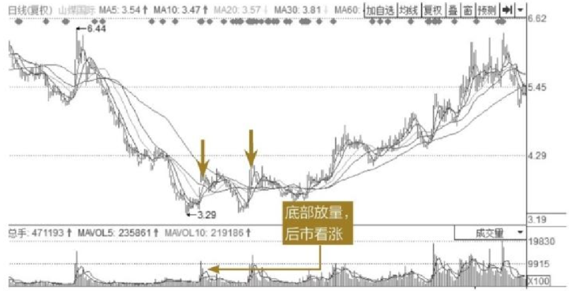

> **提示**：股价的上涨通常要分为几个波段，主力通过波段不断推高股价，并在波段中下跌洗盘，洗走意志不坚定的投资者，为主升浪做准备。这些波段中，每一波股价上涨时都需要成交量配合，都会有放量的过程，当股价上升一个台阶之后开始回落，这时候成交量也相应减小。

2. 主升浪行情中成交量特征

主升浪是股价在一轮行情中涨幅最大、上涨维持时间最长的行情，也是一轮行情中最重要的获利阶段，在波浪理论中将其称为第三浪。主升浪行情一般出现在大盘强势突破调整之后。

主升浪的股价呈单边上涨态势，均线形成多头排列。从成交量来分析，经过股价筑底时吸筹、上涨初期的洗盘，通常在主升浪阶段，主力手中的筹码已经足够多，实力强的主力甚至能达到完全控盘的效果。这时个人投资者手中的筹码已不多，主力拉升股价的压力较小。主力通过对敲等操作手段拉升股价，在主升浪阶段，成交量通常会保持在一个较高的水平，并呈现成交量平稳的态势。

**案例**：

打开同花顺软件，输入山煤国际的股票代码“600546”，按【Enter】键确认。

下图为山煤国际（600546）在2014年4月3日附近的K线图，从图中可以看到经过几个小波段的上涨之后，该股进入价跌量缩的阶段性调整，之后该股从2015年2月11日开始了主升浪行情。在主升浪阶段，成交量与股价走势保持一致：股价上涨，成交量放大；股价下跌，成交量随之也缩减。从图中可以看出，在主升浪期间，成交量都维持在一个较高的水平，股价从4.61元一路被推高至11.14元。

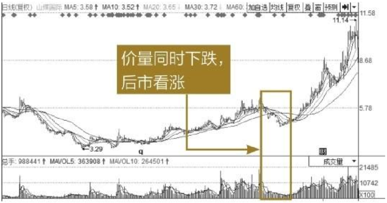

3. 股价见顶时期成交量特征

股价在见顶阶段成交量的表现分为两种情况：一种是放量见顶；另一种则是缩量见顶。

（1）放量见顶。

当个股或者大盘放出不同寻常的巨大成交量时，就出现了即将见顶的重要特征。其中，如果中小板和创业板的股票换手率达到30％以上，大盘股的换手率达到15％以上，并且前期股价已有巨大涨幅的，则在放出巨量的当天，就要当机立断迅速卖出手中的股票。

虽然有些股票的成交量没有达到上述标准，但成交量若是最近行情中最大的，也要将其视为“巨量”。例如，某只个股在一轮行情中，换手率从未超过5％，如果股价上涨到一定的高度，并且连续多次超过5％的换手率时，投资者也要加以警惕，因为从技术面分析，量和价之间有必然的联系。天量之后见天价的规律已经多次被市场验证。

**案例**：

打开同花顺软件，输入外高桥的股票代码“600648”，按【Enter】键确认。

下图为外高桥（600648）的日K线图，从图中可以看到该股从2013年8月30日开始连续11个交易日无量涨停，股价从13.16元一路高歌猛进至63.82元。投资者一定有疑问，为什么价涨量却极小？这是因为无量涨停卖单极少，大量的投资者想要买进却难以在涨停价买进，没有成交，造成成交量十分小。因此，在9月16日涨停打开的时候，成交量才恢复正常。值得注意的是，该股票在9月16日放出巨量，并且当日换手率高达7.21％。再加上当时在高位收出一根十字星线，此时投资者就应当警惕。随后的四天，股价继续上扬，但是成交量呈现减少的趋势，这说明已经没有那么多的投资者追逐该股了。果不其然，股价随后一路下跌。在下跌的过程中，主力一直在减仓，所以成交量并没有极度萎缩。

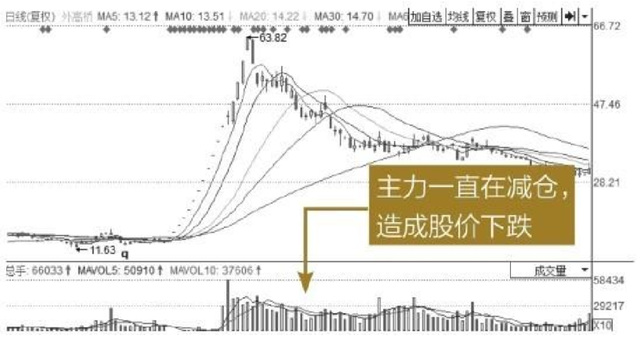

（2）缩量见顶。

缩量见顶是指当股价处于顶部时，成交量与主升浪时期相比，出现平量或者缩量，形成了成交量与价格背离的现象。由于前期主升浪已经有巨大涨幅，很多投资者已经处于狂热的非理性状态，认为只要买进该股票，就会有盈利，但是这种狂热的投资者数量会随着股价的飙升而越来越少。而此时持股的投资者看到前期股价的快速上涨，心理的期望值还很高，都认为行情还会延续，因此不会低价出售手中的股票。因此在这个阶段，成交量反而会减少。最具有代表意义的就是曾经有“中国神车”之称的中国中车。

**案例**：

打开同花顺软件，输入中国中车的股票代码“601766”，按【Enter】键确认。

下图为中国中车（601766）的日K线图。该股由中国南车和中国北车重组而来，在2014年10月停牌之后于2014年12月31日复牌，复牌6个无量涨停。经过了这一轮上涨，该股进入上升通道的结构性调整阶段。之后于2015年3月开始了新一轮的上涨，股价迅速从13元拉升至最高39.47元，此时股价已经上涨到位，冲高回落之后开始震荡。在主升浪的初期，股价在上涨的时候，成交量也跟随放大。随着股价的持续走高，但成交量却不跟随增加，呈现量价背离的现象，顶部特征已经突显。直到2015年6月9日，该股从涨停到跌停，开始了牛转熊的走势，此后股价一路下跌。

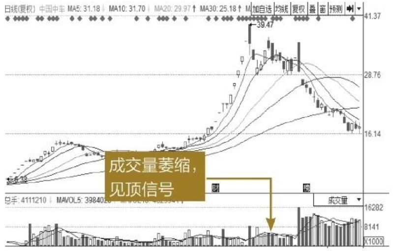

### 下降行情中的成交量形态

股价上涨需要成交量的配合，但是股价下跌的过程不一定需要成交量的配合，大部分的股票在股价下跌的过程中，成交量呈平稳的状态。如果是前期大幅上涨过的股票，则有可能会出现放量下跌的形态。因此，下降行情中的成交量形态又分为放量下跌和缩量下跌两种情形。

1. 放量下跌

当股票前期不是一波一波上涨行情，而是疯狂的暴涨行情，就容易引发放量下跌行情。因为前期主力已经高度控盘，许多看好该股的投资者根本买不进，当股价推升至十分高时，也接近了此轮行情的末尾，投资者可以买进了。此时，投资者依然沉浸在疯狂上涨的幻想中，于是给了主力出货的好时机，因此这一时段的成交量会放大，甚至大大高于建仓时的量。当投资者渐渐醒悟的时候，股价已经跌至半山腰了。

**案例**：打开同花顺软件，输入外高桥的股票代码“600648”，按【Enter】键确认。下图为外高桥（600648）的日K线图。从图中可以看到，自2013年8月30日开始，该股出现连续11个交易日无量涨停，由于这次的上涨不属于正常的上涨，而是一字涨停，符合上述的各项特征。因此，在下跌初期时成交量明显高于前期筑底和建仓及拉升时的成交量。

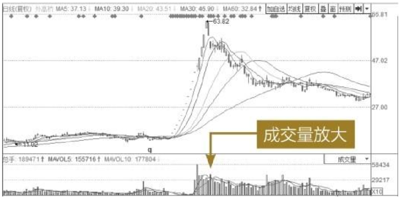

> **提示**：投资者需要注意，某只股票除权之后，股本扩大会导致成交量放大，但是成交金额不会有太大改变，此时成交量放大的含义就要大打折扣。

2. 缩量下跌

出现这种情况的主要原因是：由于股价下跌，持有股票的投资者仍想要高价卖出手中的股票，但是没有人愿意在股价下跌的时候跑去接盘，因此成交量会减少。由于下跌具有惯性，所以即使没有很大的量，也可以下跌，极小的单量就可以把价位砸低。当然，并不是股价下跌就没有投资者买入。股价下跌至一定程度，其风险就得到了一定的释放，有些投资者就会认为可以进场了。但是由于此类投资者较少，所以成交量也较小。

**案例**：

打开同花顺软件，输入歌力思的股票代码“603808”，按【Enter】键确认。

下图为歌力思（603808）的日K线图。由于该股属于次新股，从2015年4月22日到2015年5月29日期间已经完成三波上涨，股价从27.34元一路疯涨至91.56元，涨幅过大。于是投资者们都不看好该股票，股价开始下跌，在股价下跌的过程中，成交量与前期上涨阶段相比明显缩小。当股价跌到一定程度的时候，许多投资者认为该股下跌已经释放了大部分风险，于是有些投资者开始试探性地选择买入，股价探底回升。

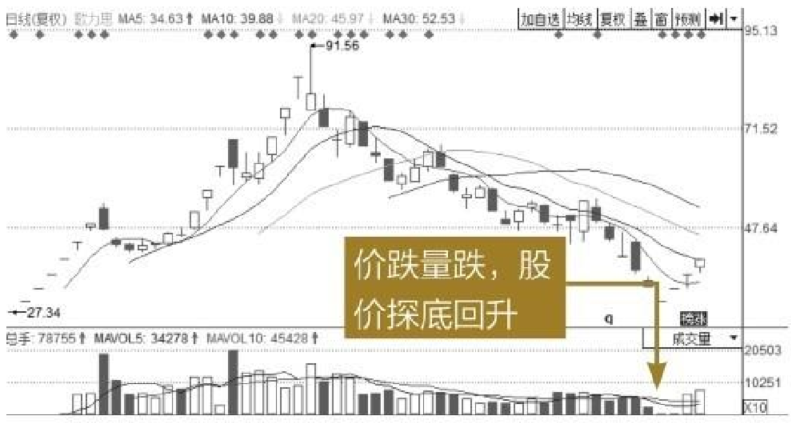

## 成交量与股价

成交量与股票的价格二者相辅相成、互相影响。成交量的变化过程就是投资者投资热情变化的过程。当某只股票人气旺盛的时候，其成交量也会随之增大，进而会吸引更多的投资者加入，这有助于股价的进一步攀升。当股价上涨到一定高度的时候，投资者的高处不胜寒心理，将导致交易欲望的减少，成交量也逐渐萎缩。股价与成交量经过一定时间的走平之后，股价后期上涨的概率较小，这时前期获利盘将纷纷套现，从而导致成交量放大，股价大跌，市场人气大减。股价经过一段时间下跌之后，投资者人心惶惶，抛盘四起，成交量的放大在此时成为人气进一步衰减的信号。当股价持续下跌，跌至一定程度之后，股民卖出的冲动将减少，这时成交量萎缩，股价将见底。

成交量与股价之间的关系一般分为两种情况。

（1）量价同向。

股价与成交量变化的方向一致。股价上升，成交量也同步上升，这是投资者看好之后走势的表现。反之，股价下跌，成交量随之下降，说明投资者对后市看好，不愿贱卖手中的筹码，转势反弹仍大有希望。

（2）量价背离。

股价与成交量变化呈反向的走势。股价上升而成交量不增或减少，这说明股价的涨势得不到投资者们的认可，没有更多的投资者加入其中，这种涨势就难以维持。反之，股价下跌，但是成交量增加，说明更多的投资者不看好后市，纷纷抛出手中的筹码，这是后市下跌的前兆。

因此，成交量是观察主力动向的有效途径，由于主力资金量巨大，他们的一切意图都会通过成交量来实现，成交量剧增，很可能是主力在大量买进或卖出。

## 成交量的常用指标

###  换手率

换手率又称为周转率，是指在一个交易日内市场中股票转手买卖的频率，是反映股票流通性强弱的指标之一，可以准确地反映出规定时间内成交量占其可流通股数的比例。

换手率的计算公式如下。

换手率=某一段时期内的成交量/发行总股数×100％

例如，某只股票在一个月内成交了100万股，而该股票的总股本为1亿股，则该股票在这个月的换手率为1％。

通常情况下，多数个股每日的换手率维持在1％～2.5％（新股与次新股除外）。由于70％股票的换手率在3％以下，因此3％就成为一个分界。当一只股票的换手率在3％～7％时，该股就进入了相对活跃状态。换手率达到8％～10％时，则为强势股的表现，股价处于高度活跃当中。换手率在11％～15％，主力密切操作。换手率超过15％，并且持续多日的话，此股也许会成为黑马股。

### 委比

委比是金融或证券实盘操作中衡量某一时段买卖盘相对强度的指标，委比的取值自-100％到＋100％，＋100％表示全部的委托均是买盘，涨停的股票的委比一般是100％，而跌停是-100％。委比为0，意思是买入和卖出的数量相等。当委比值为正值，并且数值较大，说明市场买盘强劲；当委比值为负值，并且数值较大，说明市场抛盘较强。

委比的计算公式为如下。

委比=（委买手数-委卖手数）/（委买手数＋委卖手数）×100％

- 委买手数：所有个股委托买入上五档的总数量。
- 委卖手数：所有个股委托卖出下五档的总数量。

通常情况下，委比指标表明了投资者委托买入和委托卖出的意愿的差距，由于委比只是委托的数据，并不是成交的数据，因此不能反映股票交易活跃程度。只有成交量和换手率才能反映股票的活跃程度。同时需注意的是，投资者可以随时撤单，所以委比数值可以在短时间内出现较大的变化。

委买委卖的差值就是委差，这是投资者意愿的体现，委差在一定程度上反映了价格的发展方向。委差大于零，后市看涨的可能性就大；反之，后市下降的可能性大。不过主力制造的假象也会出现委差为正，看上去后市要涨，实则变盘的情况。

**案例**：

打开同花顺软件，输入浙江龙盛的股票代码“600352”，按【Enter】键确认。

投资者可以将想看的个股加入自选股，在自选股的菜单页面中可以查看委比的信息。下图所示为浙江龙盛（600352）在2015年7月24日收盘时的委比。

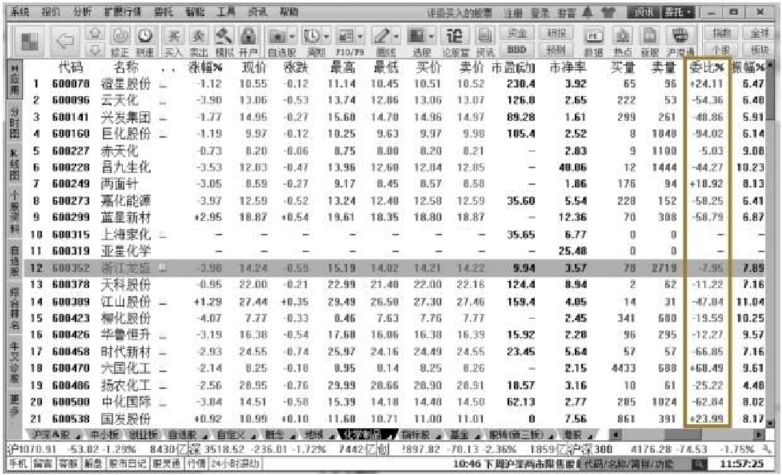

### 量比

量比是指股市开市后平均每分钟的成交量与过去5个交易日平均每分钟成交量之比，也是衡量相对成交量的重要指标之一。

计算公式如下。

量比=现成交总手数/现累计开市时间（分）/ 过去5日平均每分钟成交量

上述公式经过变换后如下。

量比=现成交总手/[过去5日平均每分钟成交量×当日累计开市时间（分）]

在即时盘口分析中，股民使用较多的是走势图、成交量以及换手率等指标。但量比及量比指标也是一种比较好的工具。当股票出现在量比排行榜上时，一般都已有相当大的涨幅，盘中的最早起涨点多数已经错过。因此，从盘口的动态分析角度讲，单单考虑量比数值大小具有一定缺陷。量比的具体使用方法如下表所示。

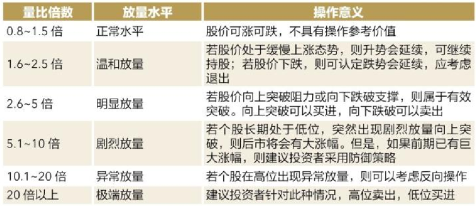

> **提示**：有些个股经过大幅拉升之后，出现量比急剧放大，也是重要的头部特征。这种放量，换手率不大，但是量比大得惊人，有时能达到数十倍之多。正是因为换手率不大，所以才容易使股民产生麻痹心理，从而错失逃顶的机会。

打开股票分析软件，切换至K线图界面，即可看到位于界面右侧信息栏中的量比信息。

13.4.4 外盘和内盘

内盘和外盘是两个不同的概念。内盘是指以买入价格成交的数量，即卖方主动以不大于当前买一、买二、买三等价格下单卖出股票时成交的数量，用绿色显示。内盘的多少显示了空方急于卖出的数量大小。外盘是指以卖出价格成交的数量，即买方主动以高于或等于当前卖一、卖二、卖三等价格下单买入股票时成交的数量，用红色显示。外盘的多少显示了多方急于买入的数量大小。

内盘和外盘这两个数据大体可以用来判断买卖主动性的强弱。若外盘数量大于内盘，则表明买方主动性较强；若内盘数量大于外盘，则说明卖方主动性较强。

例如，甲下单6元买100股，乙下单6.01元卖300股，当然不会成交。6元就是买入价，6.01元就是卖出价。

这时，丙下单 6.01元买200股，于是乙的股票中就有200股卖给丙了（还有100股没有卖出去）。这时候，成交价是 6.01元，现手就是2手即200股，显示2，显示的颜色是红的。

还是上面的情况，如果丁下单 6元卖200股，于是甲和丁就成交了，这时候成交价是6元，由于甲只买100股，所以成交了100股，现手是1，颜色是绿的。
因此，外盘就是主动去按照卖方的价格而成交的，在信息栏中字体为红色。内盘是主动迎合买方的价格而成交的，在信息栏中字体为绿色。投资者打开股票分析软件，切换至K线图界面，即可看到位于界面右侧信息栏中的内盘与外盘的信息。

13.4.5 总手和现手

现手是指个股的即时成交量，对于最近一笔成交量也称为现手，或者已经成交的最新一笔买卖的手数。在盘面的右下方为即时的每笔成交明细，红色字体和向上的箭头表示以买入价成交的每笔手数，绿色字体和向下箭头表示以卖出价成交的每笔手数。

总手即当日开始成交一直到即时的总成交手数，总手等于外盘加内盘的数量之和。通过收盘时的“总手”数量可判断当日成交的总股数。如收盘时出现“总手23.88万”，这就说明当日该股一共成交了23.88万手，即2388万股。

打开股票分析软件，切换至K线图界面，即可看到位于界面右侧信息栏中总手的信息。成交明细栏中的最新成交信息就是现手信息。

成交量与持仓量

持仓量是期货中的概念，股票中没有持仓的概念。持仓量是指投资者现在手中所持有的市值占投资总金额的比例。通过分析持仓量的变化，可以分析市场多空力量的大小、变化以及多空力量的更新状况，从而成为与股票投资不同的技术分析指标之一。在期货图形技术分析中，成交量和持仓量的相互配合十分重要。正确理解成交量和持仓量变化的关系，可以更准确地把握图形K 线分析组合，有利于深入了解市场语言。

成交量时段分析

成交量在每一个交易日的不同时间段所表达的含义也有所不同，投资者可以通过对开盘、盘中、盘尾和盘后的成交量进行分析，更加清晰地了解主力对股票后期走势的真实意图。

13.6.1 开盘分析

在每一天的交易当中，投资者首先应该关注的是开盘前和开盘时的成交量变化，以及集合竞价所产生的开盘价。结合股票前期的走势，开盘时成交量的变化会有不同的含义。

（1）股价处于相对较低价位。

当个股处于相对较低价位时，如果开盘时段放出异量，并且股价上涨，则表示该股上涨突破的动能较足，当日上涨的概率较大，甚至有可能当日涨停。

1　打开同花顺软件，输入安硕信息的股票代码“300380”，按【Enter】键确认。

2　下图为安硕信息（300380）的日K线图和2015年2月3日的分时图走势。该股开盘半小时之内就放出异量，紧接着持续放量，在上午就封涨停。结合安硕信息日K线图走势，其在价格低位就表现如此强劲，说明主力资金充足，并已经开始准备推高股价，由此可以判断该股在未来会有持续的上涨行情。

价格处于相对较高价位。

当个股处于相对较高价位时，如果开盘时段放出大量，并且股价下跌，则主力多数认为该股上涨阻力较大，日后走势有牛转熊的可能，因此会引发主力的撤退。仍以安硕信息为例。

1　打开同花顺软件，输入安硕信息的股票代码“300380”，按【Enter】键确认。

2　下图为安硕信息（300380）2015年5月22日的分时图。从分时图可以看出，该股票此时前复权后的价位已经达到200以上，股价估值过高。因此该股在除权除息的当天开盘就放量下跌，之后在10：00左右持续放量，助推股价急速下挫。虽然之后盘面有所回升，但是这已经预示着整体的趋势发生了逆转。

13.6.2 盘中分析

在10：00以后，股市进入多空双方搏杀阶段。除去开盘与收盘各半个小时，其余时间全为盘中交易。股价在盘中走势，无论是探底拉升、窄幅震荡或冲高回落，全部体现控盘主力的操作意图。盘中运行状态一般有以下几种常见情况。

1.处于上涨趋势

个股如果开盘价与前一日收盘价持平，且开盘之后股价上涨，在上午的走势中冲高回调并且不跌破开盘价，股价重新选择向上的概率较大，这意味着主力做多坚决。投资者可以待第二波高点突破第一波高点时选择加仓买进。

1　打开同花顺软件，输入易事特的股票代码“300376”，按【Enter】键确认。

2　下图为易事特（300376）的日K线走势图和分时图，从其2015年3月30日的K线图可以看出，该股此时已经处于上升通道中，投资者此时的交易均属于右侧交易。再从其分时图可以看出，该股票开盘有量，说明主力资金充足，在盘中又放出异量，并且股价虽冲高回调，但是并没有跌破当日的开盘价，这说明主力已经控盘，并已经开始准备推高股价，由此可以判断该股在未来会有持续的上涨行情。

处于箱体走势

个股处于箱体走势时，一般开盘走势有4种：高开低走、平开平走、低开平走、低开高走。由于箱体震荡走势没有明朗的趋势方向，而是处于箱体之中，因此股价稍微一涨就触及箱顶，如果个股盘中放大量上涨，就是逢高减仓的好机会，此时不要买入。在箱体阶段，不建议长线投资者进行买卖操作，短线投资者可以选择适当时机介入。

1　打开同花顺软件，输入京东方A的股票代码“000725”，按【Enter】键确认。

2　下图为京东方A（000725）的日K线图和2013年9月11日的分时图。从日K线图判断，当时股价基本见底，并且处于低位震荡阶段，在2013年9月10日，该股已经盘中放量上涨，2013年9月11日盘中再次放量，盘中最高涨幅达6.02％，然后股价回落。这时股价已经触碰了前期的阻力位，股价有回落的可能。结果在之后的第三个交易日，股价回归箱体内部。

3.处于下跌趋势

如果个股平开低走或者低开低走，跌破前一波低点，多是主力看淡后市行情。尤其弱势或有实质性利空出台，低开低走，盘中反弹无法超过开盘，主力多数会离场观望。当大盘趋弱时，个股高开低走翻绿，如果反弹无法翻红，投资者宜获利了结，以免在弱势中高位被套。

1　打开同花顺软件，输入开开实业的股票代码“600272”，按【Enter】键确认。

2　下图为开开实业（600272）在2015年6月25日的日K线图和分时图。结合其日K线图可以判断当时股价已经处于相对高位，开始上升回调，虽然有30日均线和60日均线作为支撑，但是下行风险依然较大。因此2015年6月25日的走势非常关键，如果股价强势反弹，则是新一轮的上涨行情；如果股价放量下跌，则打破前期的上升形态，牛转熊拐点已经产生。从6月25日的分时图可以看出，开盘平开，14：00开始放异量下跌，并且股价开始逐渐回落。最终收盘收了一根中阴线，这预示着后市将继续走弱。

盘尾分析

盘尾分析是指以每天14：30—15：00的走势来判断后市走势。收盘前成交量与股价的变化走势有以下几种形态。

1.尾市放量股价急升或止跌

如果个股在尾市放量，股价急拉或者止跌，说明主力已经开始发力，助推股价上涨。盘尾期间的成交量能够反映未来行情的走势。投资者可以依据尾市成交量与股价的变化关系，短线趁机介入，第二天选高点卖出，做一次短平快的短线差价交易。

1　打开同花顺软件，输入西藏药业的股票代码“600211”，按【Enter】键确认。

2　下图为西藏药业（600211）在2014年2月7日的日K线图和分时图。结合其日K线图可以判断当时股价经过箱体震荡，成功站上60日均线，并且当时的价格处于相对低位。2014年2月7日开盘平开，从其分时图上可以看出，股价自开盘之后缓慢抬升，在下午开盘之后，股价开始随着成交量的放大，稳步抬高。由于成交量是持续的成交量带，说明此时该股票的成交已经开始活跃起来，因此后市上涨的概率较大。

2.尾市放量，股价下跌

如果股市开盘之后，个股股价处于平开平走的走势，但到了14：30后，成交量开始连续不断放大，并且股价开始下跌，表明股价已经站不稳，多头主力多数对后市看跌，所以不停地卖出手中的筹码，从而出现放量下跌的现象。

1　打开同花顺软件，输入新华传媒的股票代码“600825”，按【Enter】键确认。

2　下图为新华传媒（600825）在2015年6月25日的日K线图和分时图。从其分时图上可以看出，股价自开盘之后一直围绕均线上下震荡。然而到了下午，股价开始缓慢下跌，随着成交量的不断放大，股价持续下挫，最终几乎是以跌停价收盘。说明此时该股已经打破了原有的单边上升趋势，因此后市看跌的概率较大。

盘后分析

每日收盘之后，即可看到当日完整的日K线图，投资者可以结合当日的分时图、日线图以及成交量等指标，对股票的后市进行预判。做盘后分析有许多优点，可以不受行情瞬息万变的影响，而从容对个股及大势作出判断。

盘后分析的主要内容如下。

（1）查看每日涨幅、跌幅前50名。

（2）查看每日换手率前50名。

（3）查看周涨幅、周跌幅前50名。

（4）对自己的个股进行分析判断。

（5）针对异常走势个股进行分类。

投资者通过对上述内容的分析与研判，可以大致了解当下的热点板块在哪里，适时地切换股票，改变投资组合和投资策略，以便获取利润。

13.7 逐笔成交量分析

在分析成交明细表时，投资者需要特别注意大单成交。由于个人投资者并没有强大的资金实力，通常大单均为主力所为。因此，对逐笔成交量的分析，应当重点放在对大单的分析上。

通常对大单的定义并没有很明确的标准，有的股票分析软件认为500手以上就是大单，而有的软件可以对大单数量的标准进行设置，还有的软件是按照成交额来设置大单。

例如，农业银行（601288）股价为3.89元，买入500手需要19.45万元，中小投资者可以用不到20万元的资金买入，很多散户都可以买入；而贵州茅台（600519）的股价为255.47元，投资者如果买入500手，则需要1277.35万元，上千万元的资金，就不是普通中小投资者可以支付得起的。

因此，对于大单的定义，从成交量方面来进行判断要准确许多。通常可将单笔成交量大于 1000手认定为大单。那么投资者可以通过以下几个方面对逐笔的大单成交量进行分析。

（1）连续性的大单成交就是主力机构所为，这通常表现为股价的稳步上升。

（2）如果某只股票在一段时间里大单成交非常密集，例如在一分钟之内成交好几笔大单，则一定是主力所为，说明主力机构在急于拉高出货，或者低价建仓。如果一天之内只有几笔大单成交，则说明该股当日可能没有主力机构操作。

1　打开同花顺软件，输入同花顺的股票代码“300033”，按【Enter】键确认。

2　下图为同花顺（300033）在2015年7月8日的分时图走势。从图中可以看到该股从 14：36开始，陆续有大单进入，仅仅一分钟之内，连续成交两笔大单。仅这两笔大单就成交了699万元，一分钟之内成交了772.5万元。这只能是机构所为，说明机构已经开始进入并准备抬高股价。

当某只股票处于底部，并且前期筑底时间比较充分，底部形态良好，一旦发现它的成交笔数在不断地扩大，并且股价小幅上涨，此时就是投资者买进的绝佳时期。当卖一的卖单数额很大，但是短时间内很快被几笔较大的买单所吞吃，或者卖方撤销了卖出委托，这时候投资者应当适时跟进。

如果股价前期经历了较长时间的大幅度上涨，在买一的位置有大单买进，但是有几笔较大的卖单连续抛出，这有可能是主力急于出货，这时投资者应紧跟主力卖出手中的股票，空仓观望。

高手秘技

技巧1 单独放巨量的含义及投资策略

在短期内成交量突然放大，甚至成倍增长，在日K图中呈现一根高高的成交量柱线，投资者对此形态要引起关注。这既可能出现在涨势中，也可能出现在跌势中。在不同时期出现快速放量的成交量图形时，投资者应采取不同的操作。

技巧2 温和放量的含义与投资策略

温和放量是指成交量在一个较长的期间逐渐放大，既可能出现在涨势中，也可能出现在跌势中。投资者应采取下表所示的操作策略。