# 低买高卖技法

**本章引语**

> 伺敌之隙，乘间取胜。
>
> ——《草庐经略》
>
> 进入市场中的人，大家都把低买高卖作为自己的奋斗目标，但实现起来并不容易。那么，低买高卖有什么诀窍吗？本章试图解开这个谜团。

**本章要点**

> ★ 低买原则
>
> ★ 高卖原则与交易

## 低买技巧

炒股的人都知道，要能做到低买高卖就是一个成功的投资者，但如何实现呢？特别是低买，就是一个价格的选择过程，那么，什么是低买？怎么来做呢？

### 低买的基本原则

看到别人大涨的股票眼红，听到身边跟你买同一只股票的人，因为比你的买入价格低，展现出更放心的姿态，心里很不是滋味。怎么办，如何让自己买在低点呢？低买的原则又是什么？

1. 明确股票价值

最古老也最简单的原则是“低买，高卖”。即以低于内在价值的价格买进，以更高的价格卖出。但需要确定的是，要对内在价值是什么、怎么计算有明确的认识。这样才能真正买到低价，而不是短期的股票表现出来的价格低。

从资产负债表或者清算价值角度，可以看到某个企业是否被低估了。例如浦发银行2014年市净率仅为0.84（很多银行市净率都低于1），即使浦发银行马上破产，投资者分得的每股资产都比买入的股价要高，具有足够高的安全边际，买入肯定能赚到钱。

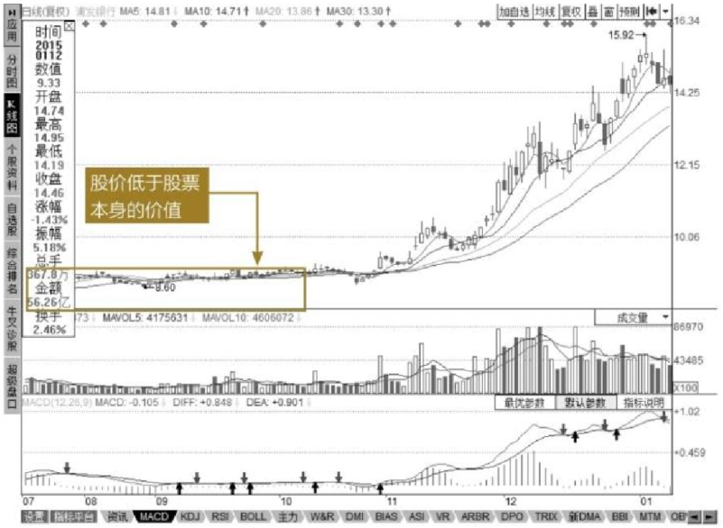

2. 顺势和借势

部分个人投资者相信巴菲特的投资理念—“别人贪婪时我恐惧，别人恐惧时我贪婪”，殊不知巴菲特的投资理念是有前提的。如果很多人在2015年6月底遵循这个原则，在别人争先恐后逃命时买入，必将遭受极大损失。

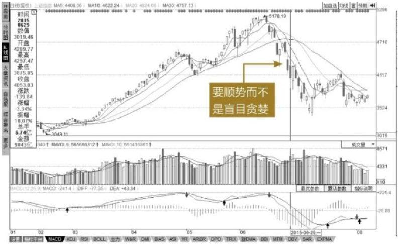

投资者应该在顺应大势的发展趋势上，巧妙选择入市时机，而且通常这种战略应用于中长线投资较为有效。逆市而为，在大势下跌之时做短线抢反弹，或在个股已在高位掉头向下时抢反弹，等待你的很可能是漫长的套牢期。同样是2015年大跌后买入，如果你是在7月中旬买入，则能短短几天内就收获颇丰，甚至利润翻倍。

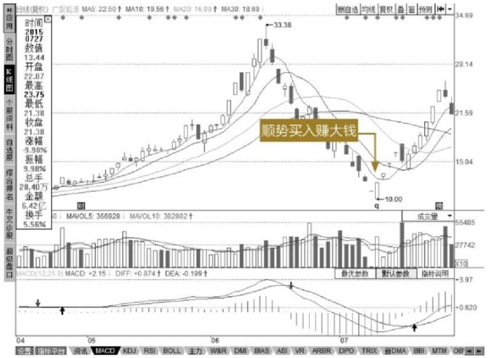

这就是顺势而为的妙处。

3. 善于等待机会

形容一个人善于等待和捕捉机会时，我们会说“三年不开张，开张吃三年”。即在没有必胜或胜率不大时尽量别出手，一旦出手，不但能有所收获，而且收获巨大。

例如，大型动物如狮子、老虎在看到猎物时，能一动不动等待很久，只等猎物进入捕获范围内时一击即中。投资也是一样，要有空仓多时的决心、恒心和能力，一个聪明的投资者既不可能抓住每一次的上涨机会，更不可能赚取市场中所有的金钱，所以一定要有耐心且善于等待机会。

否则，心浮气躁、瞎猜乱撞地买卖，很快就会毁掉信心，从而丧失理智的判断，出现一连串的决策失误，导致更加悲惨的后果。等待并不是无所事事，而是时时分析思考。“该出手时就出手，不该出手时不乱出手”，要做到“静若处子，动若脱兔”。

### 底部的种类和特征

顶和底是相对的，与宏观面、基本面、形态等关系非常密切。我们可以用以下的方法判断股票是否处于底部。

1. 市净率低

如果一家公司还不错，成长性（主要以净利润的成长性为标准）大于105％，市净率在1左右，就可以说是底部了。这是A股长期以来判断大底的一个非常重要的标志。

例如成长性为120％的公司，它的市净率要推到1.3倍左右。如果公司的成长性更高，它的大底市净率也会相对更高。

我们现在可以看到很多公司的市净率小于1，这和它的基本面太差是分不开的。

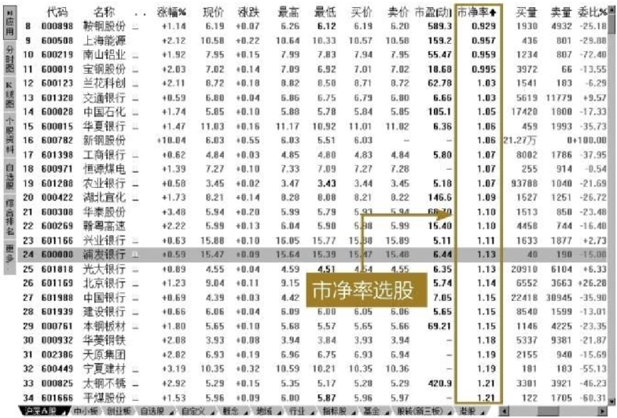

2. 市盈率较低

市盈率和市净率类似，但市盈率往往和一家公司的成长性有关，特别是很多中小板、创业板股票，市盈率动辄成百上千倍，很多人甚至觉得市盈率高，说明大家的认可度高和公司的成长性好，从而进一步提升了该股票的市盈率。

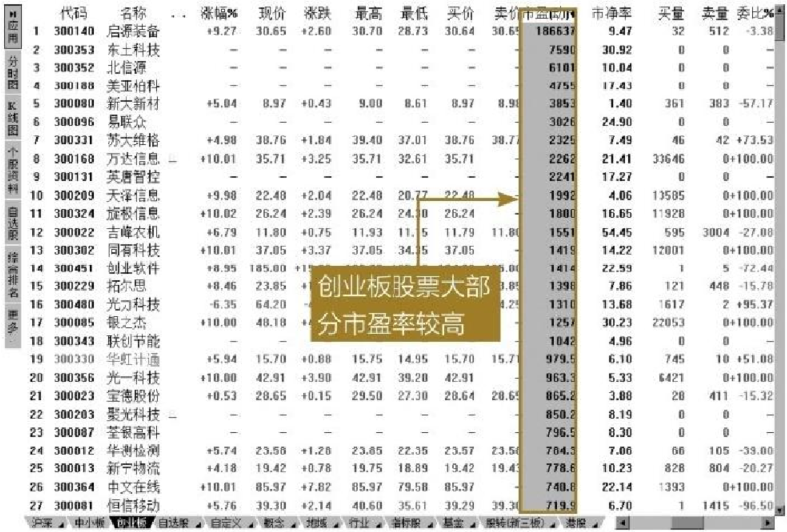

一般来说，成长性大于5％，如果市盈率能在6倍左右，就是大底到来的一个非常重要的标志。

每次股灾来临时，股价一跌再跌。5～8倍市盈率的股票比比皆是，可惜，满地的黄金却没人敢捡，因为不知股票还有多大的空间要跌。然而，股票却往往在这个时候冲天而起，一去不回头。

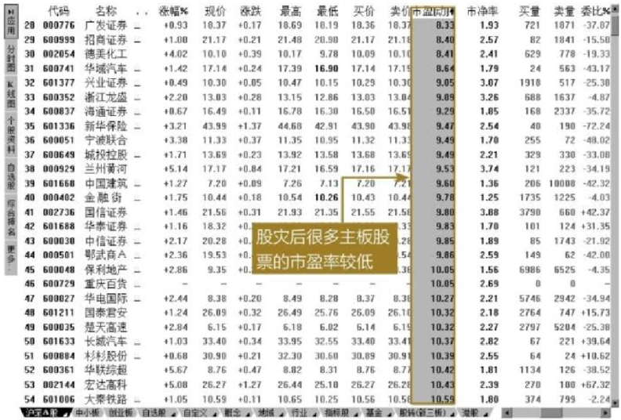

3. 技术分析（如K线）

无论K线形态多好或者多差，都应该和上面的两项结合起来。在这个时候，股票可能会走出一个横盘的形态，也可能是一个有点弯度的锅底形态。但什么形态并不重要，重要的是，这个区间的时间要非常长，价格要非常低，成交量要非常低迷。这往往是孕育大牛的形态。如上证指数经过近6年的低迷，在2013年6月创出新低1849点，成交量低迷，很多人因为被套或者空仓不再关注股票市场，随后才开始小幅震荡，直到2014年7月才出现牛市初来的迹象。

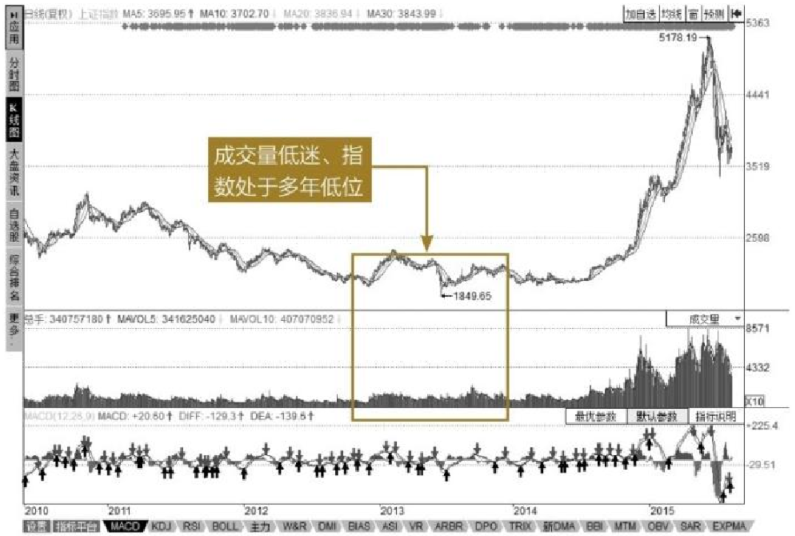

### 短线低买策略

目前大部分人热衷于追涨杀跌、短线投机的方式，热衷于偶获内幕、一夜暴富的神话，实际上并没有形成正确的投资策略。

作为短期购买策略，一般都是资金量相应比较小或者对流动性要求比较高的，这类资金建议购买中小盘股票，寻求资金的安全和流动性并重。

1. 近期市场热点

近期市场热点指即将发生的会议，可能对股票短期有影响的各种消息等。如2012年9月10日即将召开互联网大会时，移动互联网企业中的支付概念股国民技术在前期逐步走低的情况下，短期内出现一波涨幅近30％的反弹。

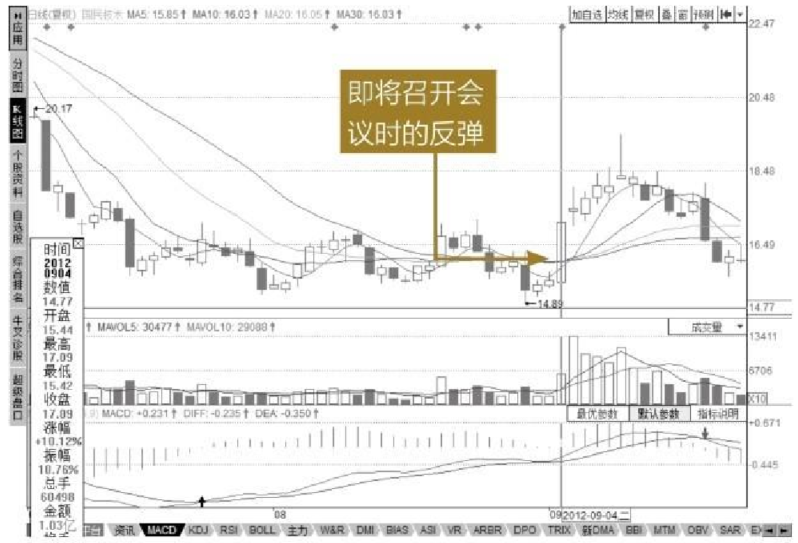

投资者在进行技术分析时，多关注日K线或者分钟线，辅助其他技术指标进行购买。

**案例利用15分钟线买入股票逃顶**

登录同花顺软件，输入“SDLQ”或“000498”快捷键，弹出同花顺键盘精灵。

按【Enter】键，进入山东路桥的【K线图】界面，在K线图中右击，选择分析周期为15分钟。

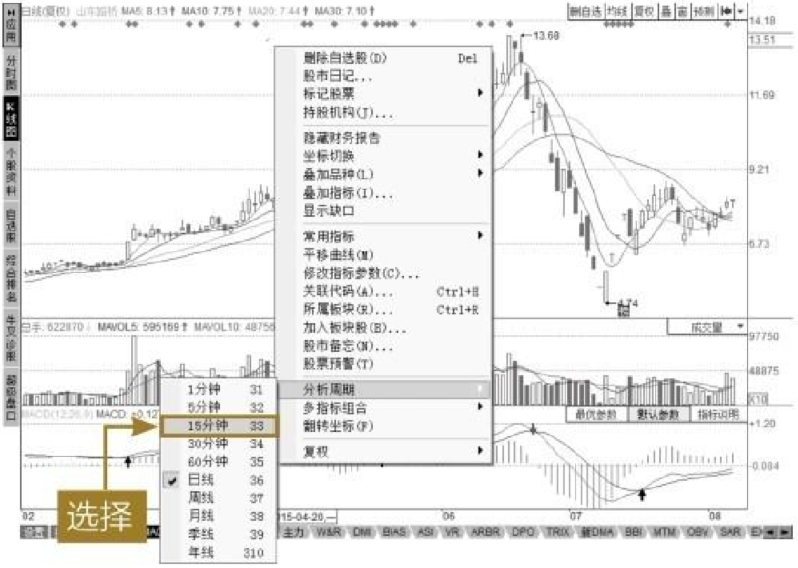

缩放显示2016年3月25日10：00至2016年4月1日15：00的15分钟K线图，从图中左侧可以看出该图出现大幅杀跌，而后出现企稳迹象，在一个低位箱体内震荡。同时MCAD技术指标中出现金叉，胆大的投资者可以在这时候布局，求稳的投资者可以在7月29日14：00K线图出现均线向上发散迹象时，再行买入。

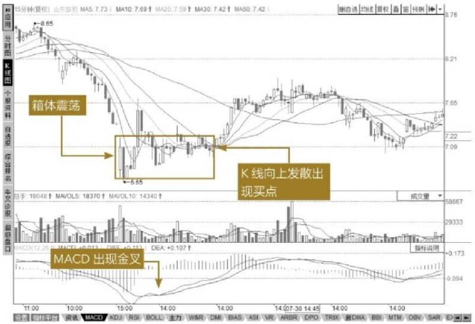

后市根据情况卖出，即可收获不菲。除了15分钟线外，用户还可以利用1分钟、30分钟线，然后辅助其他技术指标进行验证。

2. 建议多次购买

短期投资时，第一次购买时建议仓位在30％左右，后市盈利再继续加仓，加大投资。

### 中长线低买策略

作为中长线的投资者，一般追求收益的确定性和尽量高的回报率。当然，也有部分刚入市散户因为被套所以被迫从短线变成中长线。

1. 中线投资策略

对于中线投资者的操作而言，主要是以基本面分析和技术分析两者并用为主。在实际的投资操作中，建议慢进快出，基本面和技术分析说明如下。

（1）使用基本面分析方法来进行选股，保证选择股票的取胜概率。

（2）通过技术分析来对买卖股票的时机进行把握，是提升收益方法的一个很好的选择。

从这一方面来讲，中线操作明显比短线操作对投资者的要求低得多。对于投资者本人而言，中线操作对投资者在时间方面的要求不高，只要在关键时候能够有看盘的时间即可，并与股市保持若即若离的方式。而对投资者在个人素质方面的要求也不高，只要有一般的实际经验即可。但必须注意的是，中线投资者必须经常保持盘后分析的习惯，这样才能对大势有所把握。

从以上分析我们也能看出，对于中线操作而言，最重要的是把握股价波动的头部和底部。也就是说，在宽幅震荡整理过程中，投资者能够把握箱体的高点和低点。当然在实践中，做到这一点还是相当有难度的。

**案例利用中长线策略选股**

登录同花顺软件，输入“GJNY”或“000096”快捷键，弹出同花顺键盘精灵。

按【Enter】键，进入广聚能源的【K线图】界面，然后选择【个股资料】方式，查看该股的一些基本信息，可以看出其主营业务、产品、市值和相关的概念等。

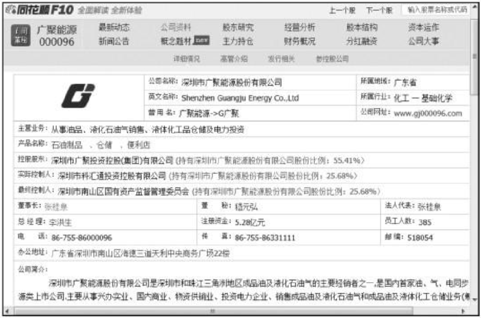

确定了购买该股票，那什么时候开始买入呢？如果刚看到该股就着急买入，即使是以最低点价位5.74元（2014年5月9日）买入，也会看到该股后期出现了窄幅震荡。

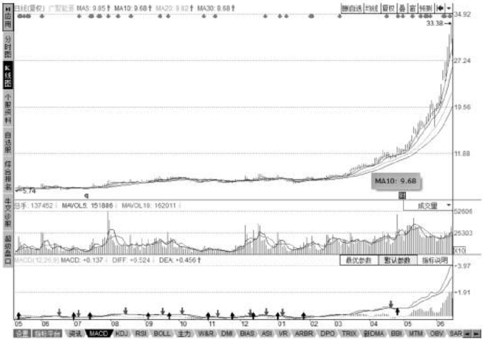

继续向右侧查看，会发现在2015年2月9日出现7.54元的买入机会，虽然从第一次5.74元购买时，已经有了30％的涨幅，但这个时间用了9个月。后一次的买入机会正好处于该股的爆发前夜，随后开始了其牛股的征途，没有再调整，直接涨到31元左右。

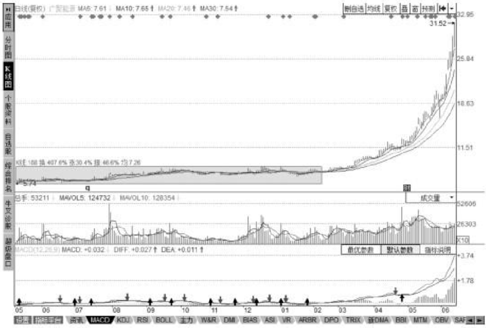

2. 长线低买策略

作为长线资金，投资者持有的已经不是短期的赚一票就跑的心态，而是纯粹意义上的投资活动，所以大多数人都在寻求一种非常稳健的投资路径，因此，如何准确地判定一只股票的底部和如何分批投入是一个重要的课题。投资者必须以基本面分析为主，特别是个股的精选尤为重要。与短线操作对于投资者的要求完全不同，长线投资要求投资者精通基本面分析，有一定的判断宏观经济的能力，同时最好远离市场，避免短期波动对于投资的影响。另外，还要求投资者必须要有足够的耐心持股，把握股价的中长期趋势。

从事长线操作获得成功最典型的即是众所周知的巴菲特先生，我们从他的投资策略中也能发现一些规律性的东西，如远离股市、投资公司而不是投资股票、有足够的持股耐心等。

### 低买的禁忌

虽然低买有很多方法和技巧，但并不是所有的股票都是在低价时才能买入，下面简单说明一下投资者在低买股票时的禁忌。

1. 忌盲目等待低价

在股市，注重趋势而不是注重价格。虽然期望买低，但并不是要求你买入股票的价格就是最低点，首先对于股价来说，其低点都是相对的低点，而且好股票涨势起来时很少回调，如果一味等待低价，就会错过好机会。

2. 重趋势，轻价格

比价格更重要的是趋势，同样一只股票，在上升趋势中的高价比下跌趋势中低价更值得买入。现以原“妖股”亿安科技（现神州高铁），在1999年11月至2001年1月期间，股价从30元左右启动到30元左右回落为例加以说明，在30元到126元的这一波上升趋势中，如果以60元买入，后面还有100％的获利希望；而如果你是在等低价，然后看到在下跌趋势中的一个小反弹时以60元买入，则等待你的将是超过50％的损失。这也是买涨不买跌说法的由来。

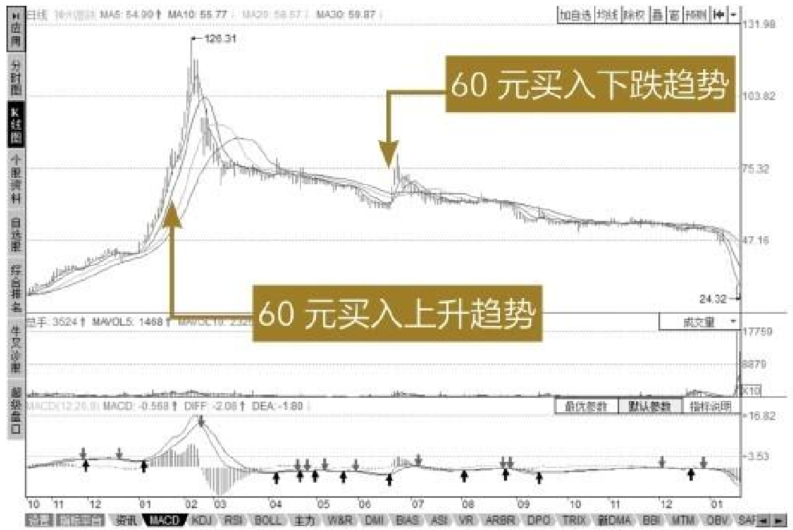

3. 不能看到达到低的条件就买

某只股票市盈率低、市净率不到1，满足这样的条件就一定要买入吗？否，要利用多种条件来综合分析，考虑一下为什么是低价。同样的时间点，不同股票的涨幅是不同的，例如，工商银行股价从2008年7月到2015年4月一直在2～5.5元徘徊，若以这个期间的最低点到最高点涨幅来计算的话，从1.55元到5.34元，涨幅达245％。

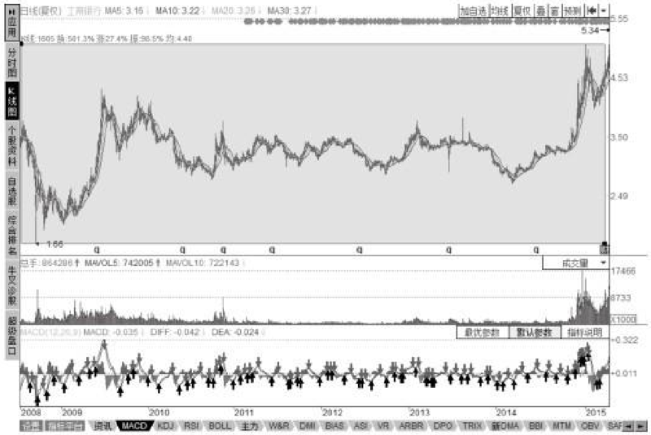

而大盘股中国西电，在这个时间段从最低价2.72元涨到最高点12.86元，涨幅接近372％。

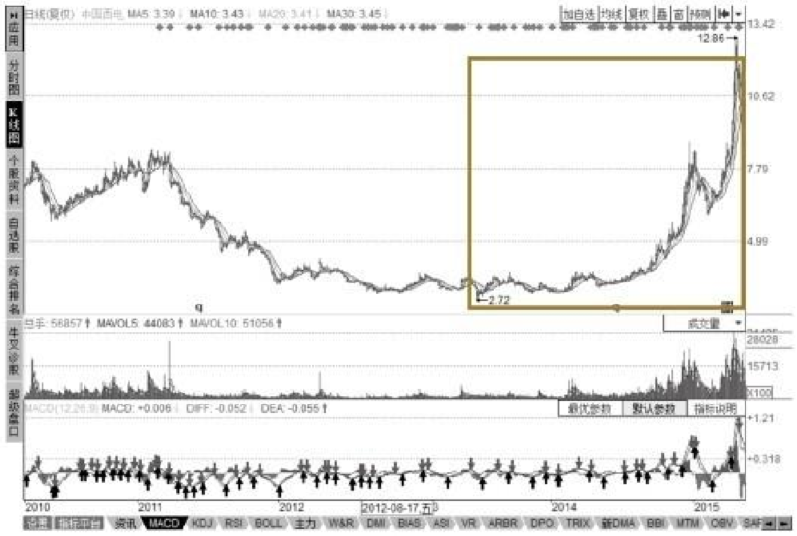

##  高卖方法

除了低买原则，高卖也有一定的方法。

### 高卖的基本原则

本小节是根据作者多年的投资经验总结，可能无法面面俱到或者深入地将每个方面都说透，期望读者多学习总结。

1. 见好就收

买卖股票的重要原则是盈利。无论是短线买入还是中长线买入，最终的目的一定是赚钱，且最好赚大钱。所以，盈利就显得尤为重要，而不论是短线还是中长期投资者，如果见到股票趋势变坏，或者基本面发生了改变（变坏），及时出手卖出，见好就收。

2. 尽可能多赚

在保证赚钱的情况下，多赚钱。有人统计，每次多赚1％，经过100次后就能滚成一个非常大的雪球，投资收益是每次不多赚这1％的投资者的2.7倍。如果每次多赚2％甚至5％呢？会是一个非常庞大的数字。

### 顶部的种类和特征

当股票处于顶部时，有什么种类和特征呢？

1. 基本面和消息面的顶部

（1）利好兑现。

主力机构常利用信息优势，先于散户进场吸筹建仓，又凭借资金优势，进行轮番炒作。一旦个股题材公开，利好兑现，股价早已提前反应，跃上了一个新的高度。所以，利好兑现之际，便是股价短顶出现之时。

（2）热点消退。

那些被短期炒作的热门股与题材股，其股价本身是由短线热钱炒作出来的。这类资金操作手法极为凶悍，投机性强，来去匆匆，持续时间短，所以，一旦出现成交量萎缩，后继跟风乏力，就构成股价短期头部。

2. 技术面顶部

（1）高换手率、高成交量、放量滞涨。

无论处于何种情况，只要大盘放出大量而股价不涨，基本可以确认主力在出货。

（2）加速上扬。

依据波浪理论，在股价整体运行趋势中，每一大浪最终总会进入狂飙阶段，这时股价上扬速度明显加快，趋势线陡峭，并放出较大成交量，既有在底部堆积的大量获利盘，又会遇上前期高位遗留下来的沉重套牢盘。

假如量能萎缩，无力突破前期高点，这时股价离短期头部就为期不远了。

### 短线高卖策略

短线买卖时，一定要注意利好即将兑现时及时出局。

（1）一次性卖出。

短线发现趋势不好或者感觉出错时，可以一次性清仓手中的股票，从而保住盈利，并及时寻找下一只股票。

（2）短期趋势走坏时及时卖出。

当均线从上升趋势走平甚至转向下降趋势时，及时出局，保住盈利为主。情形特别不好时，即使亏损也要出局。

（3）其他一些技术特征。

当一个技术走坏时，一定要同时观察其他趋势情况，确定走势不好时出局为妙。

（4）设置止损点。

既然是短期投资，一定不能恋战，我们寻求的是多次的小胜利而不能因此产生损失。建议止盈点设置在2％～5％，止损点设置在5％左右。

### 中长线高卖策略

对于中长期来说，寻求确定性比短期的盈利更重要，在交易时建议采用右侧交易。分批次交易，特别是量比较大时。

1. 右侧卖出

所谓右侧卖出，其实是右侧交易中的一部分，只不过此处只指卖出，也是相对于左侧交易中的左侧买入而说的。

即当卖出一只股票时，最好在股票创出短期新高且趋势变坏时再卖出，确定性更高。如果是左侧卖出，可能会卖到短期高位，但缺少后期的大波段涨幅，很多股票可能还会短线震荡且继续创新高。

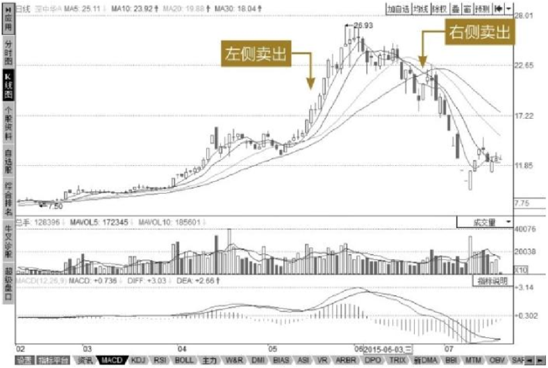

2. 分批次卖出

当趋势不好或者感觉出错时，可以先卖出手中30％的股票，从而保住盈利，降低风险，如果后市下跌，则全部出局；如果后市上涨，还能享受盈利。

# 高手秘技

## 技巧1 通过低买高卖实现T＋0交易

从事A股交易的人们都知道，在交易方面我们实行的是T＋1交割制度，即今天买入的股票最早明天才能卖出，而有大规模交易数额的主力因为有相应的套利手段，事实上实行的是T＋0制度，这对散户特别是交易量和资金量都不多的个人投资者来说，就显得不那么公平。

现在我们可以利用低买高卖手段来实现事实上的T＋0交易方式，即昨天买入一只股票（底仓），在第二天可以根据股票交易情况来进行加仓和减仓，从而降低第一次的交易成本价。

下面以嘉凯城为例来简要说明（注意，以下说明均为理想状态，不涉及手续费、印花税等各种费用）。

调取嘉凯城K线图，以大跌的两天来说明。

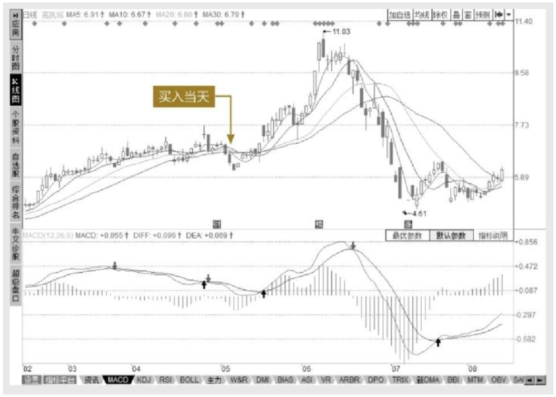

双击将大跌当日分时走势图调取出来查看，假如以7.93元价格买入1000股，结果当天收盘时价格7.72元，盈亏额：（7.93-7.72）×1000=210（元）。

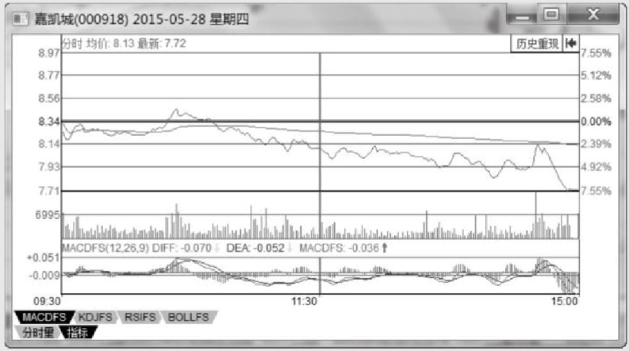

第二天即5月29日，因为当天低开且开盘半小时内有一个斜率非常陡峭的下冲，从此判断该股分时图上会有一波反弹，在到达最低点向上拉起时，我们以7.41元买入1000股，然后根据分时走势，在午盘后有个俯冲动作时，以7.88元卖出1000股，等收盘时我们手中仍然是昨天买入的1000股，好像没有变化，但实际上我们手中的股票成本价降低了。

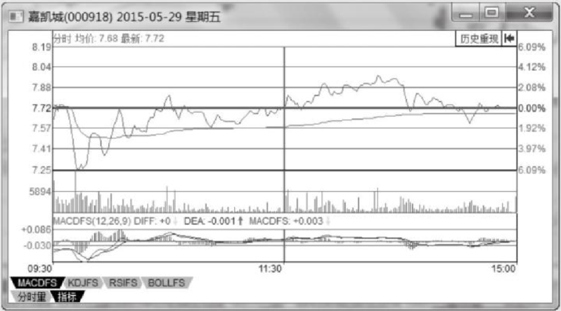

今日盈利：（7.88-7.41）×1000=470（元）。

那么这两天我们买卖股票的结果如何呢？可以看到（470-210）=260（元），每股降低了260/1000=0.26（元），即昨天买入股票的成本价相当于：7.72-0.26=7.46（元）。

当日收盘价为7.72元，即以昨天股票没有换手计算盈利为：（7.72-7.46）× 1000=260（元）。

是不是和我们想象的不同？

实际上我们今天刚刚买入的股票是不能卖的，那么是不是不应该这么计算呢？

我们以昨天买入的股票今天卖出计算（亏损），今天买入的不动（盈利），来看看总体是否正确。

（7.88-7.93）×1000＋（7.72-7.41）×1000=260（元）。

表面上看我们股票数值没有变，但价格显著降低了，后期的盈利点压力是不是一下子减轻了不少？

## 技巧2 资金量不足时怎么实现T＋0交易

按证交所规定，只有资金量在50万元以上才能开通融资融券业务（即做多和做空双向业务），如果资金量不足，按技巧1没办法实现先买后卖怎么办呢？
这里介绍一个更简单的方法—先卖后买即可。

同样以技巧1为例，价格、数量和第一天一样，第二天有所变化就行。第二天即5月29日，因为低开，等早盘冲高我们就减仓出局，比如以7.72元卖出1000股，相当于我们将昨天买入的股票亏损出局，结果是：

（7.93-7.72）×1000=210（元）

然后股价大幅下挫，最低价达到7.25元（跌幅6个点左右），情形不好暂且不动，然后该股开始反弹向上走，看分时走势不错，我们在7.41元左右加仓1000手，因为当天无法卖掉，所以收盘时我们盈利是：

（7.72-7.41）×1000=310（元）

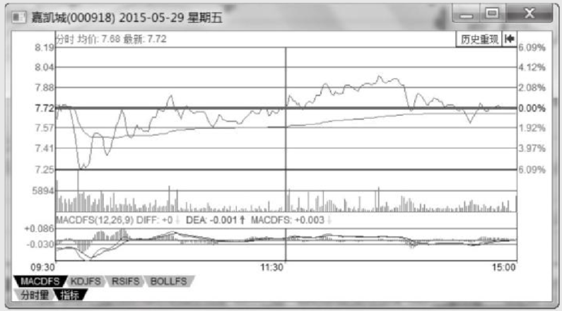

两天操作下来，我们的结果是：

310-210=100（元）

即我们盈利100元。

这是不是比技巧1更容易理解？

