# 逃顶技法

**本章引语**

> 知进而不知退，知存而不知亡，知得而不知丧，其唯圣人乎？
>
> ——《周易 · 乾 · 文言》
>
> 知道进而不知道退，知道存却不知道亡，知道得到而不知道丧失，能称得上圣人吗？炒股投资不仅要学会伺机进攻，更要识顶逃顶，避免亏损，把浮盈变成实际的盈利，这就需要卖股的技巧。

**本章要点**

> ★ 消息面逃顶
>
> ★ 技术面分析逃顶

## 通过消息面逃顶

技术面有多种分析方法，但消息面常常只有有限的几种，包括国家的政策、市场新闻，还有一些企业发生的合并破裂、重组失败的消息，甚至利润大涨但不符合市场预期都有可能成为股价的转折点。

### 2007年的“5·30”政策消息

2006年起，沪深股市开始了前所未有的大牛市。为抑制股市上涨，2007年5月29日，刚辟谣一周的财政部半夜出台政策—“印花税提高200％”。5月30日，沪深两市股指出现暴跌，跌幅达6％以上，约900只个股跌停。

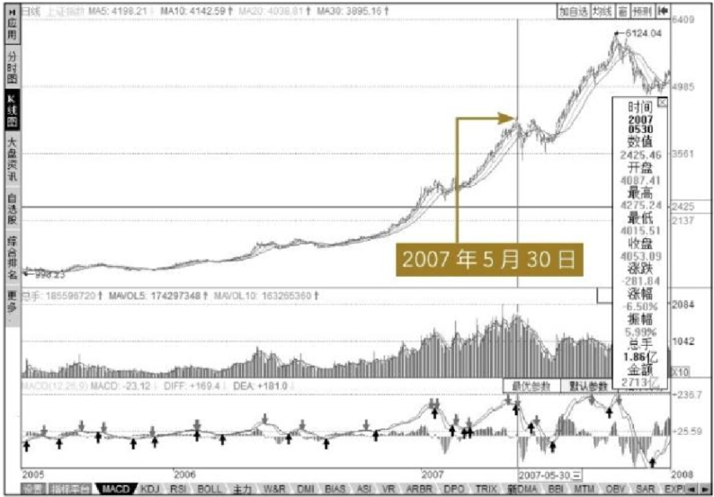

其实，针对市场传闻，财政部一周前刚刚辟谣，但随后又发布了该消息，由此可见“无风不起浪”。该消息在市场中风传近20天，很多人都觉得这是个假消息，加上财政部的官方辟谣，更让很多人觉得有假。但事实上，也有人听闻该消息后就大幅减仓甚至空仓，从而躲过了这次大跌。

把握市场消息，当不确定是真是假时，首先退出或轻仓参与，宁可错过，不可做错。

### 重啤事件

提到重啤事件，很多人想到的是重庆啤酒。据说1998年，重庆啤酒宣称要研究乙肝疫苗，因为这个原因，公司前景被大为看好，公司股票被基金增持，散户跟风炒作，股价被炒至一个又一个的新高。可13年之后，公司于2011年12月宣布其乙肝疫苗研究无成果，由此导致股价九连跌，在一个月之内，公司股价由80多元跌至20元。投机重庆啤酒的基金、散户的发财梦如重庆啤酒的疫苗梦一样破灭……这就是所谓的“重啤事件”。

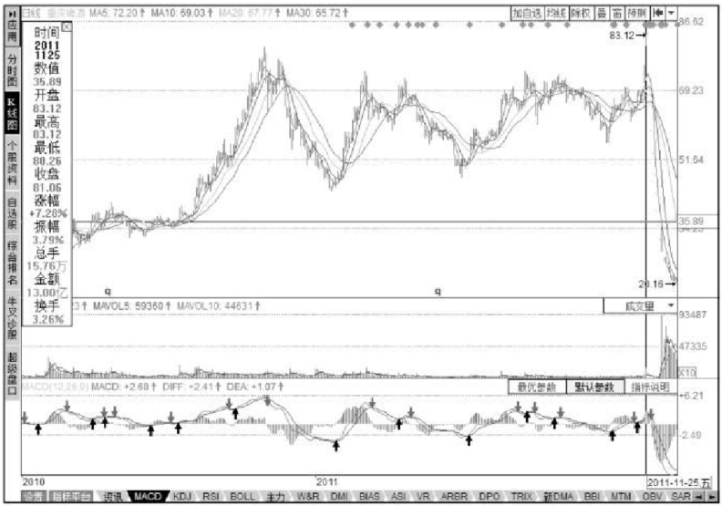

有句俗话：“会买的是徒弟，会卖的是师傅。”在股市中，无论你是短线客，还是中长线投资者，买进股票后总要卖出去。但卖出股票并不是一件简单的事情，很多人因没有把握好卖出股票的时机，最终先赢后输。有的舍不得割肉，只能深套其中。

逃顶是瞬间的过程，散户只需几秒就可以卖出股票，但又有几位能在高位顺利出逃呢？大多数投资者不是在低位被主力早早洗盘出局，就是在高位被牢牢套死，成功逃顶成了很多投资者心中的梦想。如何才能成功逃顶呢？只有下苦功练习，掌握常用的分析技巧，并能灵活运用，从主力角度去理解逃顶的心理，才能在关键时刻成为逃顶高手。

### 重组失败

从2014年年中开始，中国股市慢慢进入牛市，到2015年上半年进入牛市高潮阶段。其中，以创业板为代表的“成长型企业牛”和以国有大中型企业上市公司为代表的“重组企业牛”是这次牛市行情的两大亮点。进入2015年3月后，一大批以“增发＋重组”为停牌套路的股票在复牌后更是跟随牛市出现了疯狂的涨停潮。

在重组风口下，一大批个股在重组预案宣布失败之后，股价照样连续涨停。如2014年12月10日就开始停牌筹划重组的锐奇股份，在2015年5月中旬宣布中止重组并复牌，公司同时表示，在未来的6个月内不再筹划任何资产重组事宜。虽然重组失败，但公司股价在复牌后却走出了12个“一”字涨停。

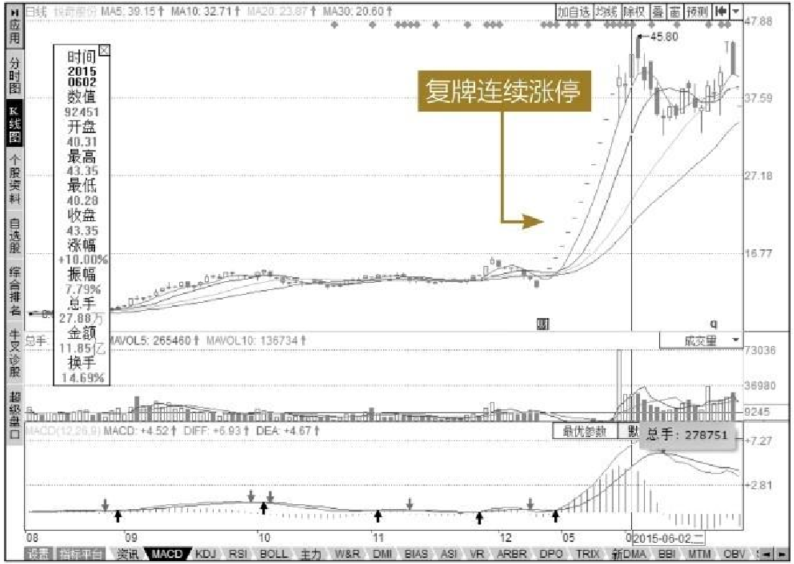

并不是所有的股票都这么幸运。威华股份与赣州稀土之间的重组搁浅，就经历了三个跌停板，公司股价近乎腰斩，即使到目前，其股价仍深陷下跌泥潭，年度跌幅榜上有名。而就在重组预案终止前，大股东大手笔的套现，让投资者不得不怀疑公司相关人员进行内幕交易。

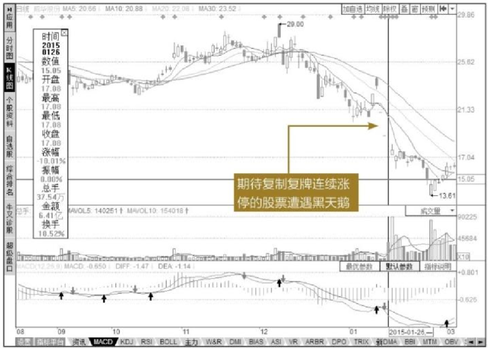

在该股停牌前，很多投资者就提示风险，说明可能出现的问题，但当时处于疯狂增值预期的人们，根本没有当回事。

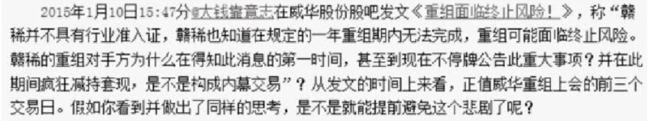

## 通过技术面分析逃顶

因为信息的不对称，通过消息面逃顶，往往并不能真正实现快速出逃。实际上，投资者也可以根据技术面分析进行识顶逃顶。

### 实战：单根K线识顶和逃顶

在本书的前面章节已具体讲解过各种见顶K线图，对这些K线图要熟记于心，并能结合股票的各种K线图走势进行整体分析。由于逃顶的重要性，下面通过具体实例讲解一下比较常用的逃顶K线图。

长十字星是相当重要的见顶信号，其形状特殊，将“T字线”“倒T字线”“射击之星”“吊颈线”“螺旋桨”等K线的特性都包括在内。

**案例利用长十字星K线逃顶**

打开同花顺软件，输入“HQKJ”或“600556”快捷键，弹出同花顺键盘精灵。

按【Enter】键，进入慧球科技的【K线图】界面。缩放显示2015年1月30日到2015年7月20日K线图，从图中可以看出，经过多次拉升后，该股在6月12日出现高位十字星K线，预示该股已到疯狂阶段，见顶概率极大，看到该形态就应尽快出逃。

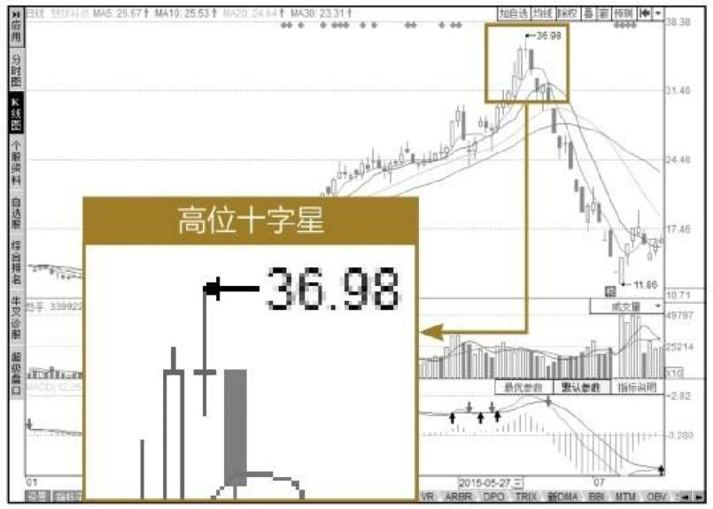

高位出现长十字星，预示两种可能：一是主力在震荡洗盘；二是主力在震荡出货。回头看一下慧球科技，从2月到6月4个月时间内，股价从12元左右涨到37元左右，涨幅200％，升势巨大，即使还能再有一波上涨，个人投资者也应清仓离场。即使后期没有大盘的大幅下挫，该股短期前景也不妙。

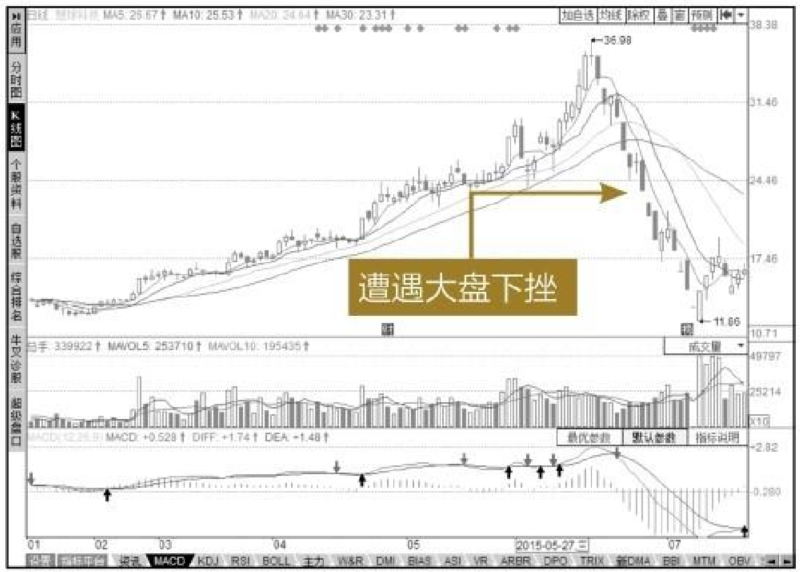

> 注意：只要在高位出现十字星，投资者都要注意，最好等形势明朗后再做决定，也可以减仓，但绝不能再短线抄底。

如果在牛市初期出现长十字星，且在一个振幅较小的范围内反复出现，很可能是主力在震荡洗盘，可能会出现回调，但是中长期是向上的，这时可根据均线进行操作。

**案例利用单根K线逃顶**

射击之星和倒T字线属于上档抛压沉重见顶信号，其共同特征是具有较长的上影线，实体部分较短。

登录同花顺软件，输入“XYD”或“600571”，弹出同花顺键盘精灵。

按【Enter】键，进入信雅达的【K线图】界面。缩放显示2015年1月5日到2015年7月1日K线图，从图中可以看出，经过疯狂上涨后，该股在6月5日出现射击之星K线，预示上档抛压沉重见顶信号。

从下图中可以看出，该股不但此时出现了射击之星形态，前期还出现了十字星形态，即使第一种形态判断不准确，这一次也应该尽快抛出逃走，否则浮盈会大幅缩水。

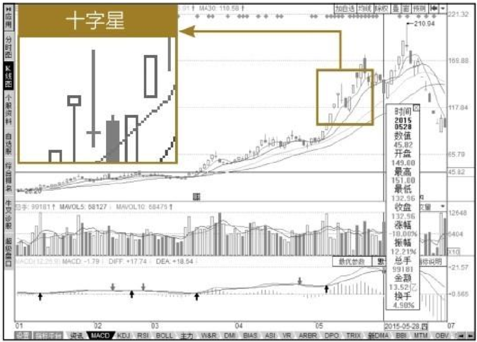

### 实战：K线组合识顶和逃顶

（1）穿头破脚是最常见的见顶K线组合，即第二根K线为长阴线，并且将前面的一根小阳线从头到脚全部穿在里面了。该K线组合出现后往往出现两种形态：一种是股价快速回落；另一种是股价盘整一段时间再向下突破。

如中国石化（600028）大幅上升后，就在高位出现穿头破脚K线组合，股价见顶后就开始大幅下跌，如下图所示。

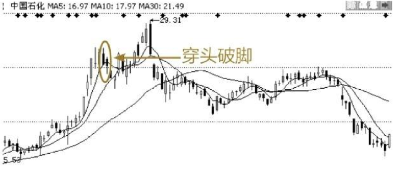

（2）投资者见到穿头破脚K线组合后，股价开始大幅下跌，就要马上斩仓出局。

（3）有些股票出现穿头破脚K线组合后，股价并没有马上跌下来，有的出现较长时间的盘整，有的可能还创出新高，但投资者一定要明白，主力是不可能在高位利用穿头破脚K线组合洗盘的，所以还是快逃为上。下图是民生银行（600016）在顶部出现的穿头破脚K线组合。

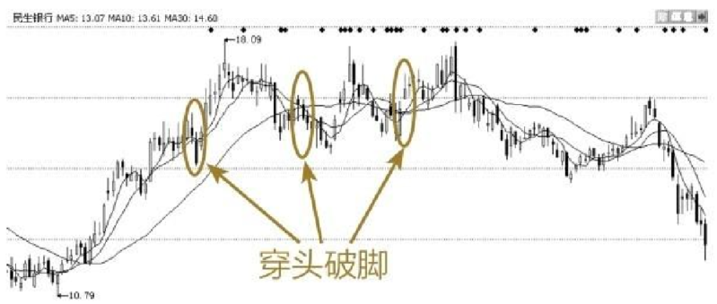

（4）如果在周线或月线中出现穿头破脚K线组合，则该股票要长期看空、做空，不要轻易进入该股票。下图是中信证券（600030）在月K线中出现的穿头破脚K线组合。

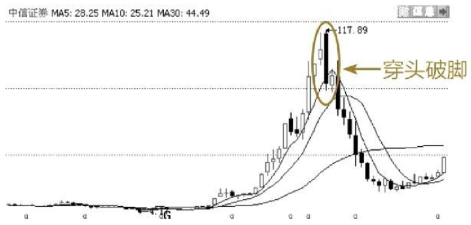

（5）乌云压顶是比较常见的见顶K线组合，在高位一旦出现该K线组合，可以先卖出一部分股票。

如一致药业（000028）在反弹的过程中出现了乌云压顶K线组合，投资者一定要果断清仓出局，否则就会深套其中，如下图所示。

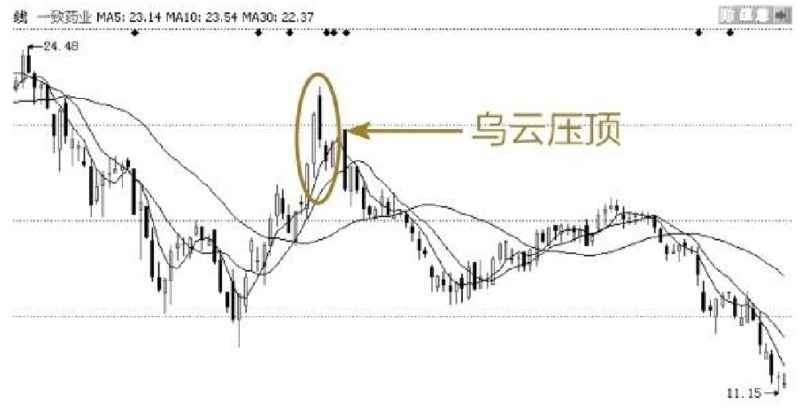

提醒：利用K线逃顶的优点是，只要能看准，就可以在高位卖出一个好价格；缺点是，误判的可能性比较大，常常被主力洗盘出局，即把阶段性顶部看成中长期顶部。

解决办法如下。

（1）K线图出现见顶信号后，要进行验证，即多观察几日或先卖出去一部分筹码。

（2）在利用K线图逃顶时，利用均线进行辅助判断，如果是多头排列或关键支撑位没有破，不要轻易清仓离场。

（3）看完日K线图，还要看一下周K线图、月K线图，进行综合验证。

### 实战：顶部背离时逃顶

在使用技术指标进行炒股时，经常会遇到股票走势与指标走势“背离”的现象。背离，简单地说就是走势的不一致。背离的特征一旦出现，就是一个比较明显的采取行动的信号。

能够形成明显技术指标背离特征的指标有MACD、WR、RSI、KDJ等，其形态都存在与股价背离的特征。

指标的背离有顶背离和底背离两种。

当K线图上的股票走势一峰比一峰高，股价一直在向上涨，而MACD指标图形上的由红柱构成的图形的走势却一峰比一峰低，即当股价的高点比前一次的高点高，而MACD指标的高点比指标的前一次高点低，这叫顶背离现象。顶背离现象一般是股价在高位即将反转的信号，表明股价短期内即将下跌，是卖出股票的信号。

反之，底背离一般出现在股价的低档位置，当股价的低点比前一次的低点低，而MACD指标的低点却比前一次的低点高，也就是说，当指标认为股价不会再持续地下跌，暗示股价会反转上涨，这就是底背离，也是可以开始建仓的信号。

注意：一定要注意识别假背离。通常假背离具有以下特征。

（1）某一时间周期背离，其他时间并不背离。例如，短线图背离，但中长线图并不背离。

（2）没有进入指标高位区域就出现背离。所说的用背离确定顶部和底部，技术指标在高于80或低于20背离，比较有效，最好是经过一段时间的钝化。技术指标在20～80往往是强市调整的特点，而不是背离，后市很可能继续上涨或下跌。

（3）单一指标的背离而其他指标并没有背离。各种技术指标在背离的时候，往往由于其指标设计上的不同，背离时间也不同。KDJ最为敏感，RSI次之，MACD最弱。单一指标背离的指导意义不强，若各种指标都出现背离，股价见顶和见底的可能性较大。

**案例利用顶背离指标逃顶**

登录同花顺软件，输入“PFYH”或“600000”快捷键，弹出同花顺键盘精灵。

按【Enter】键，进入浦发银行的【K线图】界面。缩放显示2009年3月23日到2009年8月21日K线图，从图中可以看出，浦发银行在该阶段走势稳健，处于上升趋势。但在2009年7月10日到2009年7月31日这段时间内，其股价处于上升趋势（均线也处于上升趋势），但其MACD线在这个阶段却处于下降趋势，这就是所说的顶背离形态。

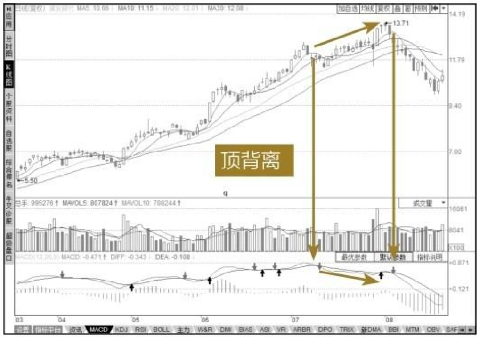

用户发现这种情况出现时，最好赶快清仓离场，否则就会遭受巨大的损失。从最高点13.71元，到最低点7.97元，损失超过50％。

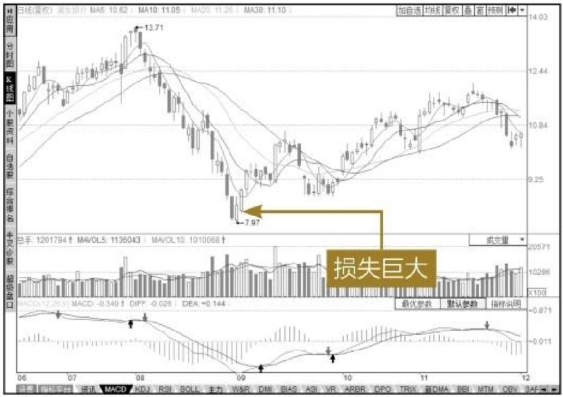

### 实战：巨量大阴时逃顶

巨量一方面是指成交量巨大，另一方面或者说更重要的是指量比巨大（一般指动态中量比大于20，此处是指成交量巨大）。在一只股票的上涨过程中，日K线呈现高开阴线，并且伴随成交量突然放大或开盘量比非常大，这种形态被称为“巨量大阴”形态。如出现“巨量大阴”形态，应当果断卖出，当天收“高开阴线”的可能极大，有些个股甚至当天振幅超过10％，如果投资者在最高价买入的话，甚至有可能当天损失15％以上。

**案例利用巨量大阴时逃顶**

登录同花顺软件，输入“HLGF”或“002647”快捷键，弹出同花顺键盘精灵。

按【Enter】键，进入宏磊股份的【K线图】界面。缩放显示2014年12月31日到2015年2月11日K线图，从图中可以看出，宏磊股份在该阶段一直处于震荡中，成交量在1.5万手（成交额1000万元）上下波动。在后期开始爆发，连续拉多个涨停板，股价处于相对高位。2015年1月25日成交量爆出31万手（成交额3.57亿元），是以前单日成交量的20多倍，且其K线是带有长上下影线的大阴柱，预示该高位有主力出逃嫌疑。

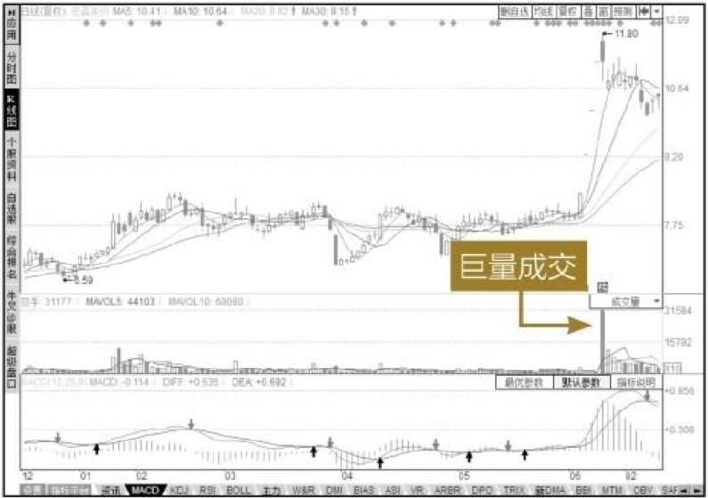

用户发现这种情况出现时，最好赶快清仓离场，否则就会遭受损失。从最高点11.80元，到后期低点10.04元，跌幅接近15％。

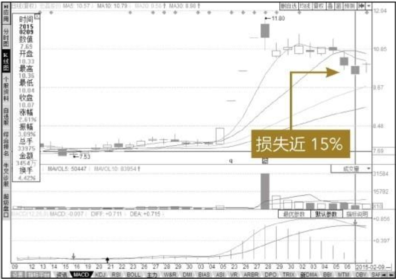

### 实战：均线识顶和逃顶

除了K线外，均线在各种应用中也特别广泛，特别是前面讲解过利用均线进行短线操作，投资者一定要对各种均线组合熟记于心，且能随机应变。

周均线和月均线是实战中很有参考价值的两条移动平均线，利用它们可以找到中长期买点和卖点。例如短期的均线一般是5日均线、10日均线，中长期均线则为5周均线、10周均线和5月均线、10月均线。

当均线三线向下散形，则多头已死，即短、中、长三条均线黏合或交叉向下发散，是逃顶最明显的信号。逃顶要及时，否则可能由盈利变成亏损。

**案例利用均线识顶和逃顶**

打开同花顺软件，输入“XHBH”或“600785”快捷键，弹出同花顺键盘精灵。

按【Enter】键，进入新华百货的【K线图】界面。在K线图界面部分单击鼠标右键，在弹出的快捷菜单中切换分析周期为“周线”。

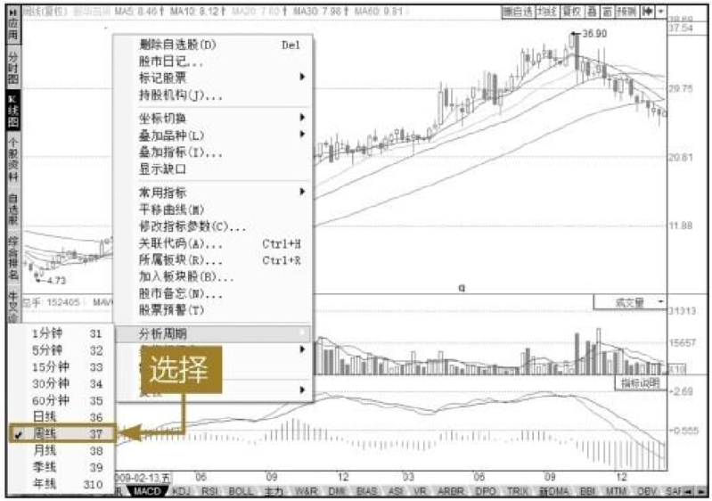

缩放显示2008年10月24日到2011年2月1日期间的周K线，可以看出在2009年1月23日这周内，5周均线、10周均线上穿20周均线出现金叉且向上有发散迹象，这时候可以适当买入该股票。

继续向右侧看，发现在2008年10月29日这周内，5周均线、10周均线下穿20周均线出现死叉，且前期从买入点7元左右到如今的32元，涨幅超3倍，短期内继续上涨的可能性较小，投资者看到该形态时，应立即卖出该股票，否则会遭受巨大损失。

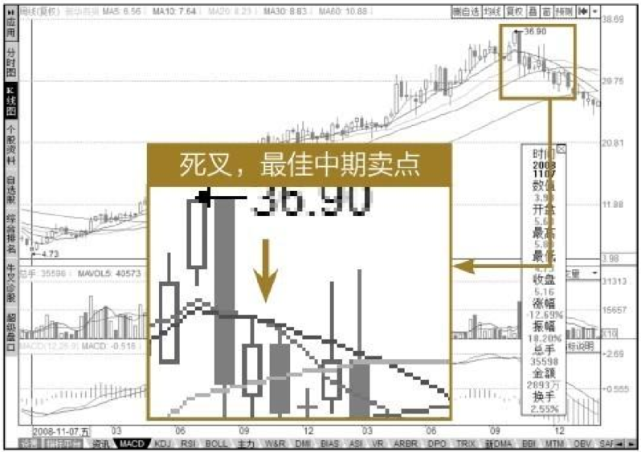

缩放显示其后期走势，可以看出，如果不抛出，将遭受连续近一年的下跌。

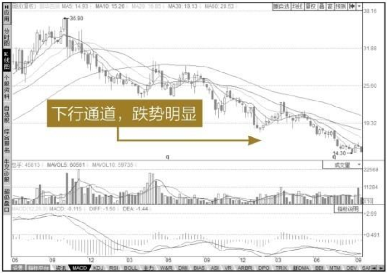

> 注意：在下跌过程中，发现均线粘连且向下发散的情况，也要及时清仓。例如右图中长白山出现的均线向下发散状况。

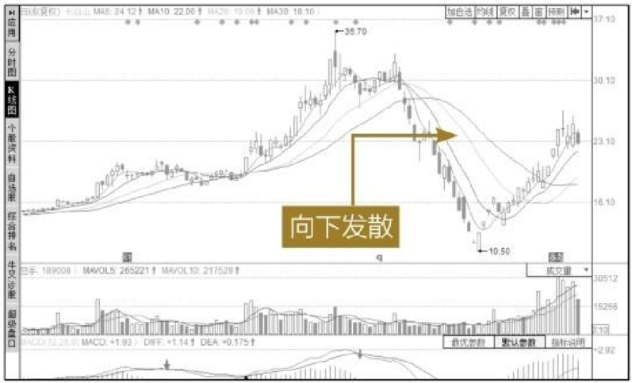

### 实战：量梯跟进时逃顶

成交量可以帮助投资者判断一只股票是否即将成为热门股票，有经验的投资者都知道“量为价先”，即成交量一般先于股价出现明显特征。当成交量均线出现死亡交叉的时候，如果同时伴随成交量像下台阶一样的量柱形态，可以判断出现了量梯跟进，此时投资者应当及时卖出逃顶。

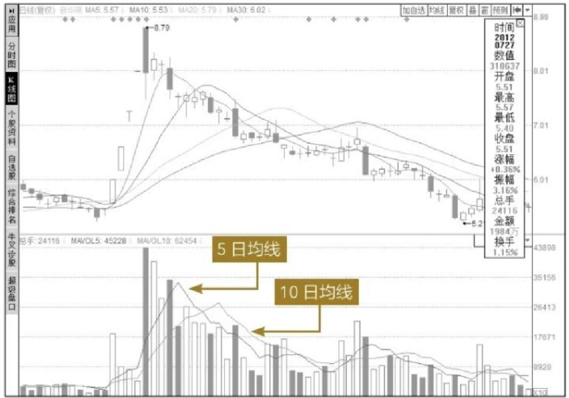

> 注意：日均量线和周均量线由于时间短、变化快，不能起到识顶和逃顶作用，只有月均量线在识顶和逃顶中能起到提前预警作用。

**案例利用量梯跟进时识顶和逃顶**

打开同花顺软件，输入“BYJC”或“600004”，弹出同花顺键盘精灵。

　按【Enter】键，进入白云机场的【K线图】界面。在K线图界面单击右键，在弹出的快捷菜单中切换分析周期为“月线”。

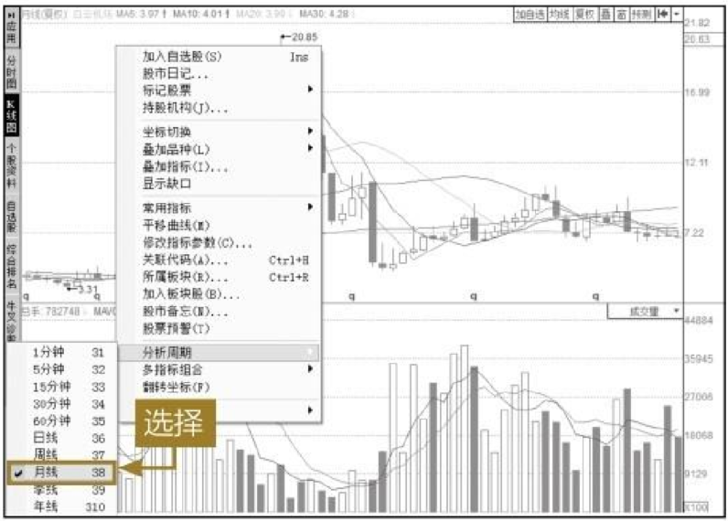

缩放显示2005年12月30日到2011年4月29日期间的月K线，可以看出，在2006年10月这个月内，成交量均线出现了一次交叉，这时看K线上面的均线图，刚刚准备向上发散。

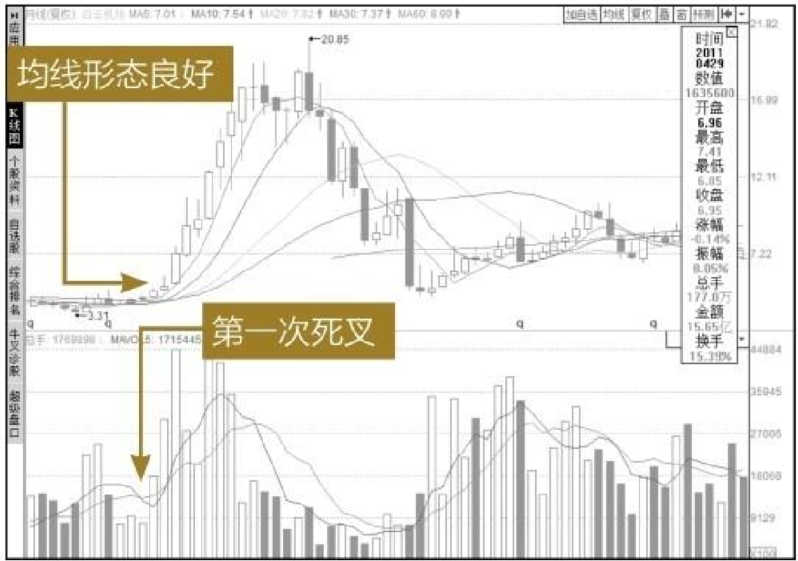

继续向右侧查看，可以看出在2007年8月，成交量均线又一次出现死亡交叉，即短期量能萎缩，预示高位无人接盘，且K线出现了十字星，这时投资者就需要小心了，前面已经说过，出现这种高位十字星一定要注意减仓。

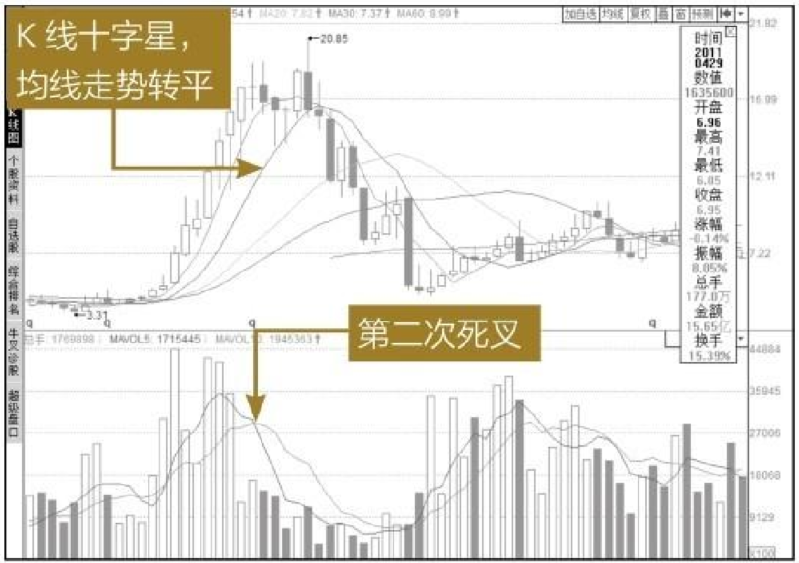

这时候如果还有投资者抱有侥幸心理，还可以继续等待，继续右移，可以看出均线走势转平，即上升不能持续了，赶快下定决心逃命吧。从后势可以看出，开始了下跌模式，直到损失超过 50％，才有所好转。

> 注意：除了判断个股外，用户还可以根据这种形态来判断大盘走势。如上证指数大幅拉升后，在2015年5月周均量线出现死亡交叉，这比实际的股灾（2015年6月下旬）开始早了一个月预警。

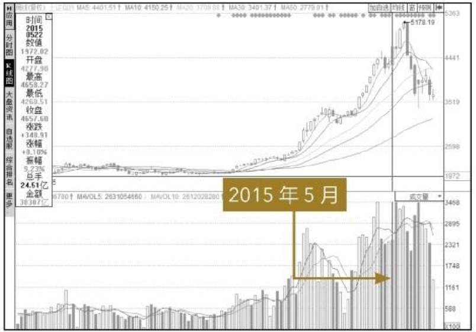

# 高手秘技

## 技巧1 双峰触天逃顶

所谓“双峰触天”，是指股价上升的过程中，出现了两个高度大致相等的顶部。此时如果没有足量跌幅，一般会出现新一轮的下跌行情。此时建议投资者谨慎，尽量抛售手中的股票。

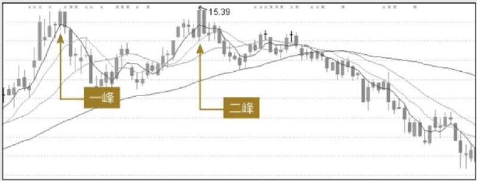

> 出现“双峰触天”的形态后，股票投资者需遵循以下操作原则。
>
> （1）出现上述形态不一定代表以后一定会出现下跌，但是一般后期不会出现新一轮的上涨，所以此时抛售股票，实属明智之举。
>
> （2）本形态出现后，有可能会出现第三次。
>
> （3）即使出现轻微的上涨震荡，卖出信号也与顶部一样强烈。
>
> 下面以“双峰触天”形态为例，讲述此种形态下的具体操作技巧。

**案例利用双峰触天时逃顶**

登录同花顺软件，输入“ZJJT”或“000039”快捷键，弹出同花顺键盘精灵。

按【Enter】键，进入中集集团个股界面K线图。

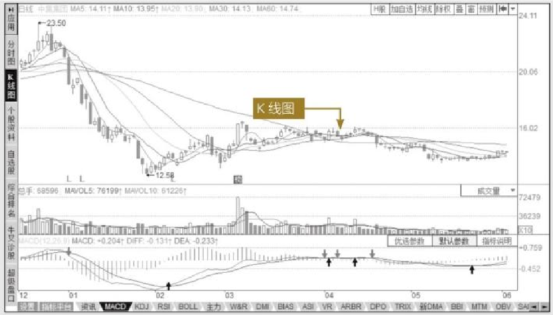

该股在2010年1月18日前后出现第一次急剧上涨的形态，并在此后又出现一次和其顶部平行的峰值。在第二次上涨后，卖出信号极强，建议投资者抛售手中的股票。

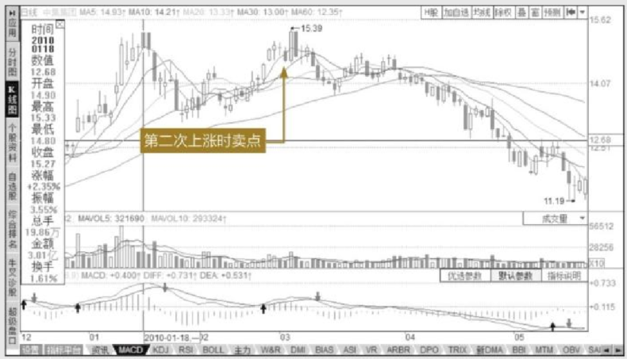

> **注意：**一旦遇到上述形态，虽然无法确定其下跌幅度，但投资者应该回避这种下跌造成的损失，及时抛出股票为宜。

## 技巧2 三峰顶天逃顶

“三峰顶天”形态，是指股价上升到高位后，相继出现高点大体处在同一水平线上的三个顶部，这是股价大顶到来的重要表现，当第三个高点出现时是强烈的最后逃命信号。

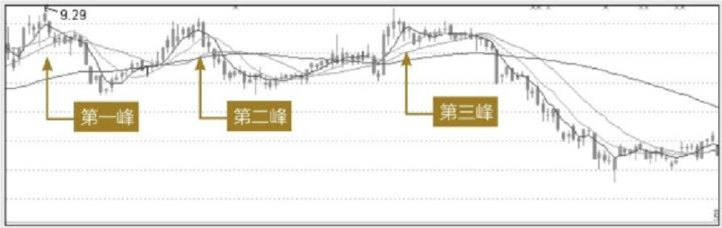

出现“三峰顶天”形态后，无论是谨慎还是激进的股票投资者都需要注意以下几点。

（1）3个峰顶出现时间间隔有长有短，长则达数周甚至数月，短则只有三五日，不论相隔时间长短，均是强烈卖出信号，尤其是卖出时机在第三峰顶出现时。如果日线无法明确显示，可以利用周K线和月K线显示。

（2）通常以股价前期升幅的大小来区分本形态所处位置。在一般情况下，前期升幅较大，处在高位的可能性也就较大。前期升幅超过30％为处在高位；经过一段下跌后形成本形态为处在下降途中。

下面以“三峰顶天”形态为例，讲述此种形态下的具体操作技巧。

**案例利用三峰顶天时逃顶**

登录同花顺软件，输入“YTG”或“000088”快捷键，弹出同花顺键盘精灵。

按【Enter】键，进入盐田港个股K线分析界面。

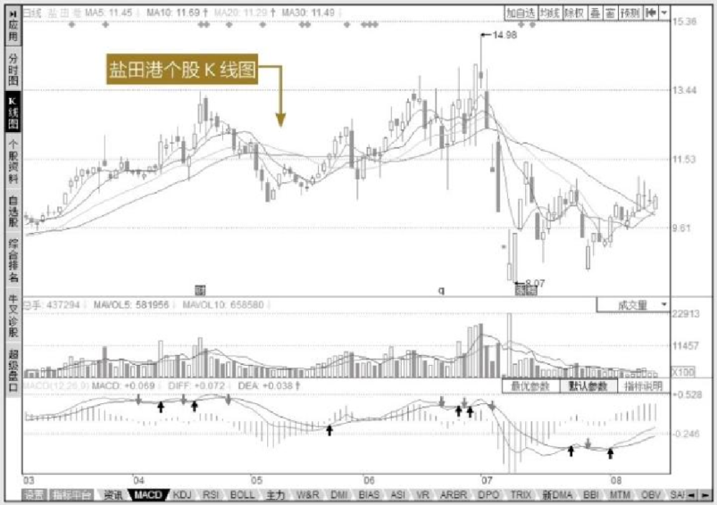

该形态的卖出原理较好理解，从该股的走势可以看出，第一个山峰出现时，表明投资者对这一高点已有戒备，谨慎做多，股价不会继续上涨，只好向下寻求出路，于是形成了第一个山峰。第二个山峰出现时，因为有前一个山峰作比较，部分投资者会在第二个山峰的高点附近卖出，迫使股价下跌。第三个山峰出现时，多数投资者会依前两次山峰的高点为警戒点，清仓离场，股价就会一蹶不振地向下滑落。这就是为什么第三个山峰出现后，股价会大跌的重要原因。

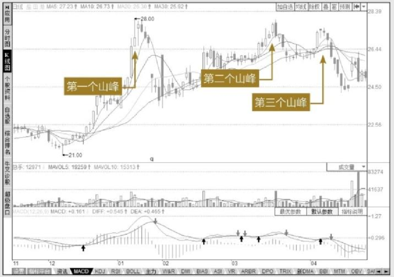

在实战中，分辨“三峰顶天”形态的主要依据是看股价前期涨幅的大小，如果在持续拉升后的高位或下降通道中出现均为见顶态势。“三峰”的出现与间隔时间没有必然联系（长则数月短则几天），同为阶段性顶部的重要信号，表明此处压力很大，在每一个顶部出现都是绝好的卖出时机，投资者可在第一峰与第三峰之间高抛低吸获取利润。

