# 慢牛收益10招

**本章引语**

> 来而不可失者，时也；蹈而不可失者，机也。
>
> ——苏轼《代侯公说项羽辞》
>
> 机遇对于人生是宝贵的。在股市投资中，牛市是可遇不可求的，投资者应该抓住股市机遇，在股市利好的形势下，赢得收益。而对于“慢牛”形势，投资者更应审时度势，掌握一定技巧。本章提供了在“慢牛”形势下，如何获得收益的10招秘技，供投资者参考。

**本章要点**

> ★ 月线止盈投资策略
>
> ★ 根据周线买牛股
>
> ★ 绩优蓝筹不放过

## 第一招 长线选股看月线

股票市场中的长线投资是指投资者购买并持有一只股票至少一年以上。既然是长线投资，选股先要根据月线进行分析。

【基本形态】

5月均线上穿10月均线，股价突破5月均线，这是股价转入牛市的必要条件。除此之外，SAR指标出现红色的买入信号，并且股价连续两个月在5月均线之上。

【拆招解式】

一般情况下，股价经历了长期下跌或盘整后，投资者和主力机构达成了一致的意见，就是股价已经到了底部，因此他们不会再贱价卖出手中的筹码，这时，市场一旦出现一些很小的利好，股价将马上借机止跌反弹。月K线作为周期很长的K线，是十分可靠的选股指标。当有一两根月K线均站到了5月均线之上的时候，5月均线就会在股价的牵引下走平并拐头向上，从而确立上涨形态已经开始。因为“船大难掉头”，一旦出现上涨信号，往往是趋势性的上涨。

因此，只要5月均线一直向上不走平，上涨趋势就不变；只要每次股价回撤至5月均线，都是很好的买入点。但是以5月均线买入时，成本会高些，如果指数能回踩至10月均线，则是较少出现的大机会。而回踩至20月均线的概率更小，如果在此时买入，则是在别人恐惧的时候贪婪。

【小试牛招】

下图为浙江龙盛（600352）2013年2月28日附近的月K线走势图。如图标注所示，该股前期已经历了一轮上涨行情，之后进入盘整阶段，并于2013年2月开始突破所有月均线组合，呈强势突破的态势。主要表现为：① 突破月均线的K线柱为一根大阳线，2013年2月这根月K线涨幅为32.25％，涨幅较大；② 同时SAR指标发出做多信号；③ 突破时的成交量较前期放大。一旦这三点均符合，投资者可以选择跟进，并长线持有。

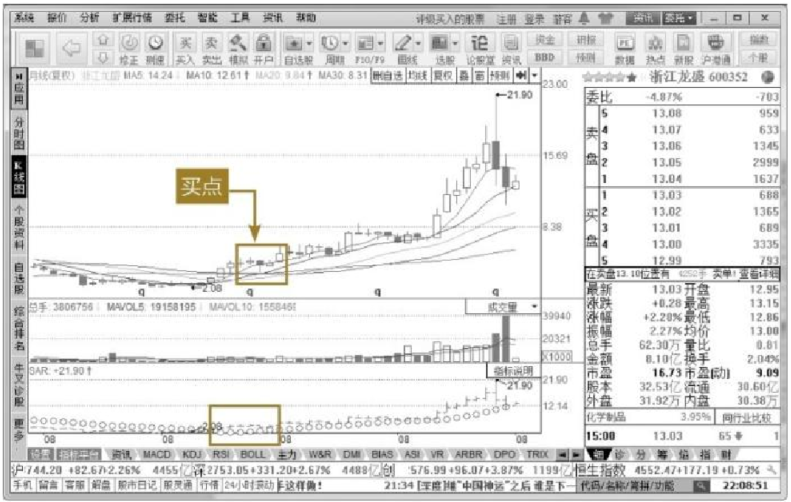

## 第二招 月线止盈投资策略

投资者既然可以利用月线选股，也可以利用月线止盈，先一步逃顶，成为市场中的弄潮儿。

【基本形态】

如果月线在前期上涨的过程中，在高位出现了1根大阴线直接吞没前一根阳线的一半，则在月K线与5月均线越近的时候，投资者可以适当地降低仓位，确保盈利兑现。

【拆招解式】

由于月线是周期很长的线，因此，一旦确立上涨态势之后，主力和其他投资机构会在这轮趋势性行情中稳稳地赚上一把。由于股价推升是需要时间和资金的，当股价上涨到一定程度的时候，主力更希望把手中的获利盘兑现成现金，这时就有可能会缓慢上涨出货。由于前期已经收了超过5个月的阳线，一旦K线出现一根阴线的时候，在技术图形上一定会出现5月线走平甚至掉头向下的情况。

对于长线投资而言，选择适当的止盈可以锁住利润，不参与“坐电梯”。当月K线连续上涨，并且在上升的尾声出现上影线较强的单根K线时，应考虑出一半的仓位。如果更进一步出现多转空的反转K线形态，例如刺透形态、乌云压顶、黄昏十字星等看跌K线时，投资者应选择全部卖出股票，止盈并观望。

【小试牛招】

下图为新华传媒（600825）2015年6月30日附近的月K线走势图。如图标注所示，该股于2014年8月开始发动这一轮上涨行情，从2014年8月的8.24元一路攀升至2015年6月的最高价25.55元。从图中可知，2015年6月的月线是一根上影线非常长的倒锤子线，明显是看跌K线形态。其实，投资者借助BOLL通道完全可以找到很好的卖点，当股价过多地偏离布林通道的上轨时，投资者可以选择平一半的仓位，待股价回落距离5月均线更近的时候，全部清仓走人。

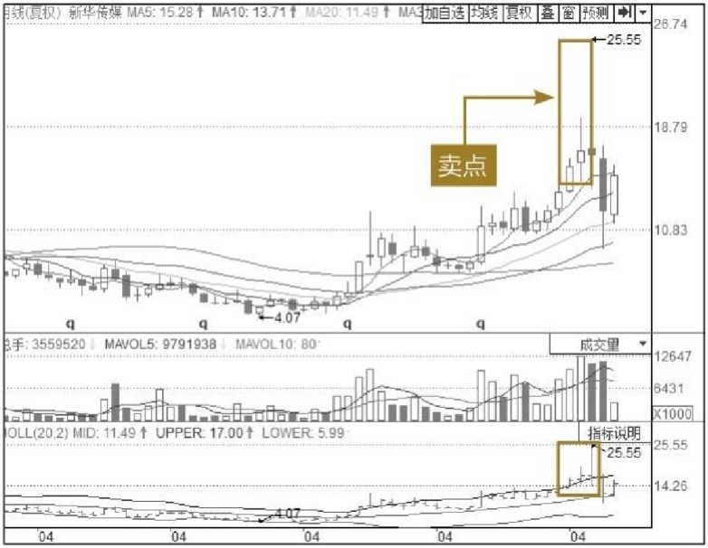

## 第三招 根据月线抢反弹

投资者一般抢反弹的时候更加看重日线，但往往是周期越长的K线，越不容易造假，投资者如果能够将日线与月线结合看，将大大增加抢反弹的成功率。

【基本形态】

在个股基本面没有任何特大利空的情况下，月线在极短的时间内，暴跌幅度过大，股价一下回踩超过20月均线的时候，投资者可以适时抄底买入。

【拆招解式】

如果出现系统性风险，也就是指大盘全部都下跌，许多主力也迫不得已抛盘，打压股价。这时“多杀多”，大家争相卖出手中的筹码，短时间内非理性的下跌容易产生踩踏事件，股价容易被低估，也就是出现超跌的状况。此时，如果个股的月K线回踩至30月均线，并有成交量的配合，投资者可以小单量介入。如果回踩超过60月均线，可以大胆地介入一半仓位。因为即使股票走弱，一般也不会出现一下跌到位的状况，主力也会参与超跌行情。

对于投资者而言，这种超跌抢反弹的回报率一般是20％或者更高。这就需要投资者认真学习K线形态，以助于判断是否应进行该操作。

【小试牛招】

下图为天坛生物（600161）2015年6月30日附近的月K线图。如图标注所示，该股此轮趋势性的行情维持了大概11个月，从2014年7月开始到2015年5月底结束。2015年6月末收盘价几乎碰触5月均线，此时，按照前文所讲第二招，应当止盈，全部卖出空仓观望。出人意料的是，该股在2015年7月，由于盘中股价极速下跌，最低价已经试探至60月均线，这时是抢反弹的极好机会。投资者应结合其周线和其他周期的指标，作出准确的判断。

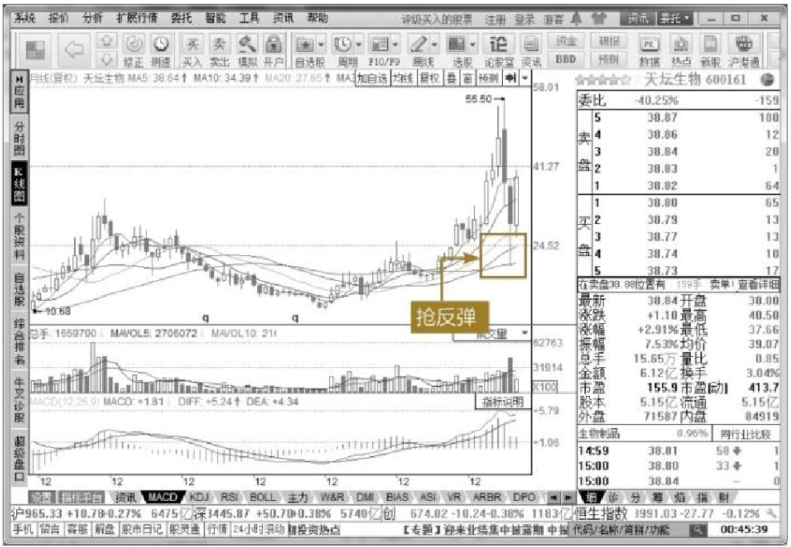

## 第四招 根据周线买牛股

周线与月线相比，更加灵敏，但与日线相比，其真实性更可靠，因此采用周线也可以从技术面选出牛股。

【基本形态】

当股价在超过3个月以上的时间段横盘，均线互相交缠，突然周K线强势突破，成交量呈逐渐放大的走势，并且成交量大于下跌波段中反抽时的成交量，此时，无论是短线还是中长线都是最安全且最容易赚钱的买入时机。

【拆招解式】

主力在建完仓后要经历洗盘的过程，虽然洗盘有多种形式，但是在周线图中经常表现为各条周均线交织在一起。对于主力而言，有时日线在高位的时候，周线往往还在长期走势中的中位或低位，因此，主力要从更长期的周期来把握股价的走势，还得从周线的角度进行研究分析。一般周线图出现以下这些情形，主力才认为其具有操作价值。

（1）周线突破长期横盘震荡的高点。

（2）周线突破重要横盘震荡的高点或重要的六十周均线的时候必须放大量，成交量是近期最大的量。

（3）MACD指标DIF和DEA突破0轴，出现红柱。

（4）在周线走势符合上述条件后，寻找具有较好题材或某种利好的个股。

所以，投资者要在上述条件当中选择周线突破后的牛股，并且在合适的安全点买进。

【小试牛招】

下图为海虹控股（000503）2014年10月31日附近的周K线图。如图标注所示，该股前期从2014年3月至2014年8月底均处于盘整时期，股价处于箱体震荡，并且与各条周均线相互交织在一起，没有显现明显趋势。当2014年8月29日所处的周K线放量突破时，投资者需要马上注意该股接下来的走势了，此时不建议投资者追涨，当股价回踩周均线的时候，才是投资者做多的极佳位置。投资者若在下图的买点买入（大概股价为22.5元），至后期的2015年6月11日最高价80.6元，可获利2.58倍。

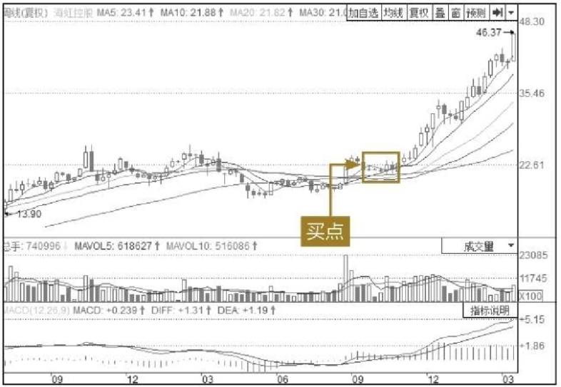

## 第五招 周线止盈

投资者通过周线既然可以选择长线黑马，也可以通过它进行长线的止盈或者止损。

【基本形态】

周线止盈是指投资者借助周K线、5周均线和10周均线以及布林线等指标进行判断，择机在高位卖出股票兑现盈利的行为。

【拆招解式】

主力对月线一般采用5月均线作为买卖准则，对于周线则更侧重于10周均线和20周均线作为买卖准则。当股价位于5周均线上行之后横盘震荡，这时候5周均线、10周均线、20周均线互相靠拢并且走平，此时主力基本没有大量的出货。投资者也可以跟着主力，做慢牛行情不出货。一旦K线出现了极速的拉升，投资者就要保持十分警惕了，如果K线偏离均线过多，投资者可以减三分之一的仓位，如果股价回落，5周均线走平，投资者要再减掉三分之一的仓位，如果K线极速下跌击穿5周均线，投资者应尽量全部卖出。

分批建仓的优点是，虽然不可能将所有的筹码都买到最高点，但是，对于全部资金而言，既保证了资金的安全，也使收益相当可观。

【小试牛招】

下图为中体产业（600158）2015年6月19日附近的日K线图。如图标注所示，该股前期一直呈单边上涨态势，按照“牛市不言顶”的金科玉律，投资者可耐心等待股价的上涨。但是在2015年6月19日，该股收出一根极长的大阴线，刺透了5周均线，并且此时股价已经脱离了布林通道的上轨，投资者在此时就需要全部卖出手中的筹码，离场观望。之后股价再次经历了三周的下跌行情，跌幅超过30％。

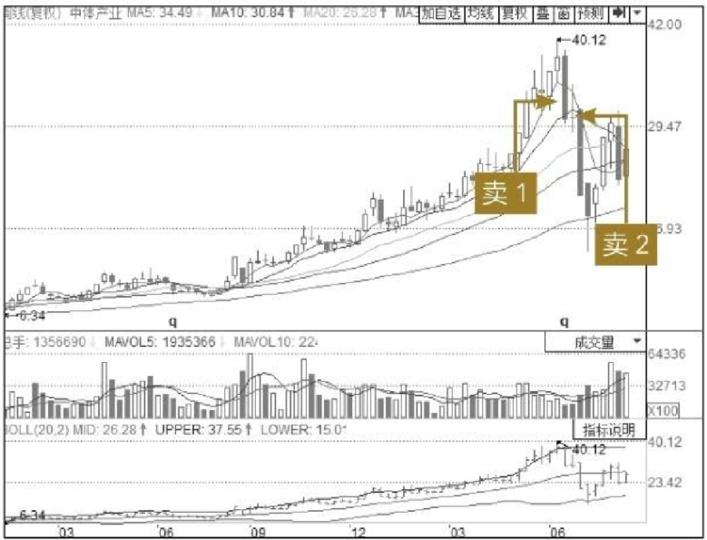

## 第六招 朝阳行业优先选

除了前面五招通过技术指标可以进行长线投资之外，还可以从基本面角度进行分析，从而选出黑马股。

【基本形态】

从行业生命周期来看，每一个行业都有四个发展时期：幼儿时期、成长时期、成熟时期和衰退时期。处于幼儿时期和成长时期的行业被统称为朝阳行业。

当然，由于地域和产业结构的不同，朝阳行业与夕阳行业的划分又不是绝对的。某些地区的夕阳行业可能是其他地区的朝阳行业。例如，美国的汽车产业已处于夕阳时期，而中国的汽车产业仍处在上升的朝阳时期。除此之外，随着时间的推移，曾经的朝阳行业在如今可能已经变成了夕阳行业。例如，20年前中国钢铁行业处在上升的朝阳时期，但是由于现在产能过剩，已成为夕阳行业。

投资者在进行股票长线投资时，一定要看清选择的股票所处行业究竟是在哪一个周期。如果是夕阳产业，投资者最好不要进行长线投资。

【拆招解式】

投资者也许会想，为什么要选择朝阳行业的公司股票？因为，任何一个行业都要经历幼儿时期，在这段时期，由于朝阳行业的利润较低且风险较高，容易让投资者产生短视行为，多数投资者不愿意买这些行业的股票，导致这类行业不被人们所关注，也因此导致了这类股票的股价偏低。投资者应对该行业的性质和所处社会经济形势进行综合分析，从而对该行业的前景作出正确预测，一旦发现具有远大前景，就应逐渐加大投资，待其发展到成长期和稳定期后，投资者将会获得高额回报。

如果想投资朝阳行业，就需要投资者花费一定的精力，多收集信息和一些最新的概念或名词，例如“国产软件替代”“互联网＋”“工业4.0”“国际产能合作”等。

【小试牛招】

国产软件从2000年以来，一直属于朝阳行业，随着时间的推移，计算机和互联网技术对于人们的生活越来越重要。2015年3月的两会首次提出了“国产软件替代”这一新名词，一时间国产软件受到了人们的广泛关注。浪潮信息（000977）也是这众多股票当中的一员。自从“国产软件替代”这一名词提出，该股开始步入上升趋势。如果投资者在2015年3月3日买入该股，则赶上了一轮趋势性的上涨行情。

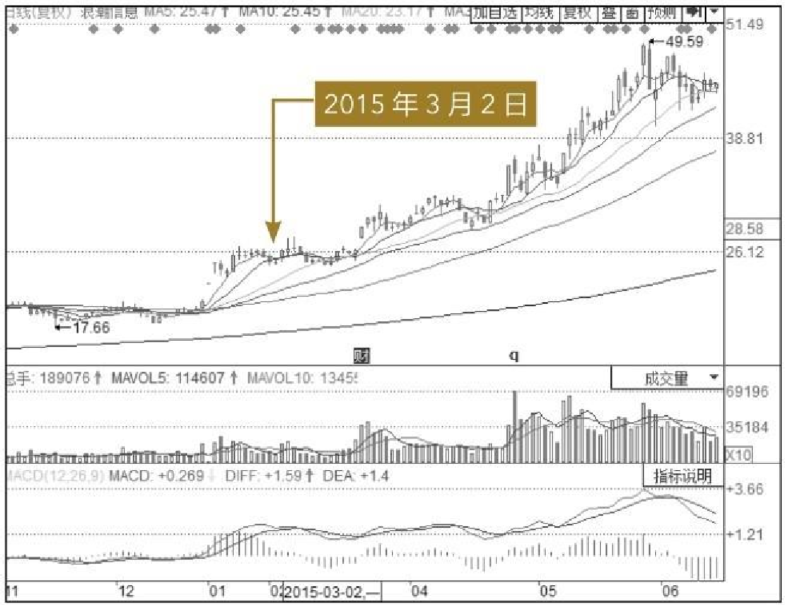

## 第七招 财务报表选长牛股

要对上市公司的财务状况进行分析，首先接触到的就可能是公司的财务报表，这是进行财务分析的重要依据。

【基本形态】

公司是以营利为目的的，公司的财务状况反映了公司生产经营各方面的状况，所以通过财务分析，可以知道公司占用了多少资产，欠了其他公司多少债务以及净资产是多少。要想成为一名成功的长线投资者，就必须能够对公司的财务状况进行独立分析，并通过财务分析在股市上找到成长性好、债务情况良好、将来会给投资者以丰厚回报的股票。

【拆招解式】

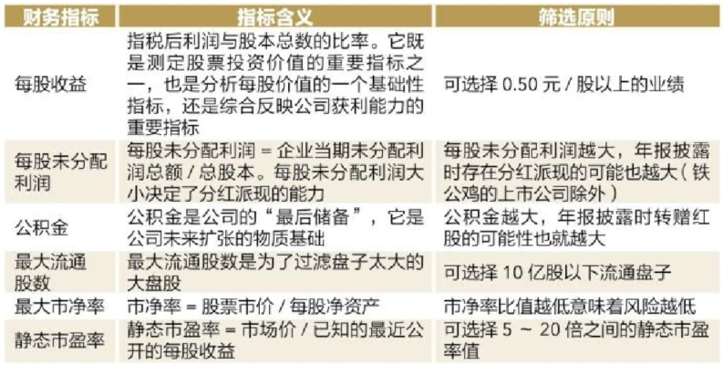

【软件实操】

投资者如果想要根据财务指标进行筛选，首先进入个股的K线图界面。单击【选股】【股票筛选器】选项，进入股票筛选器界面，在这个界面中，投资者可以按照财务指标进行相关的设置，左侧一栏的股票即为筛选出来符合投资者设置的个股。

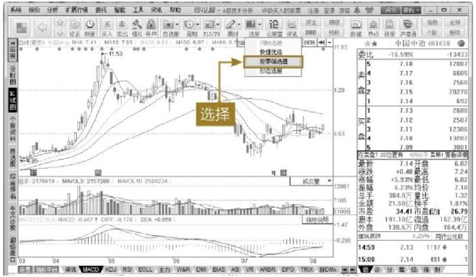

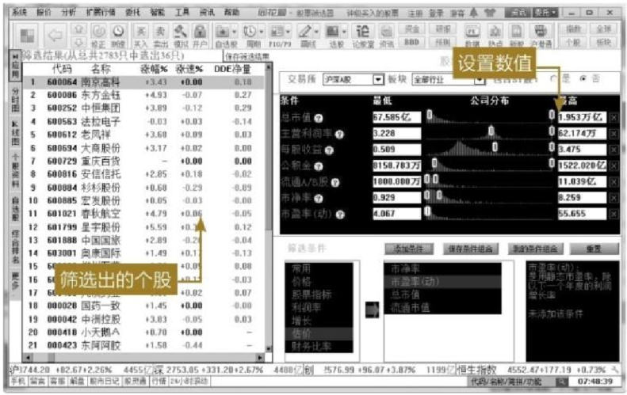

## 第八招 大胆投资重组股

随着国家产业结构调整力度的加大，很多行业面临被重新洗牌的境况，有些企业为了生存下来，选择通过资产重组的方式进行资源整合，这为资产重组股的炒作提供了丰富的题材。

【基本形态】

资产重组是企业通过股权或资产的有偿转让（收购、置换）或无偿转让（政府划拨）实现兼并或重组的结构性调整。它既包括一企业对另一企业的整体兼并或收购，也包括企业间的部分资产的流动组合，资产重组是证券市场永恒的题材。

【拆招解式】

重组股的价格一般比较低，具有较大的炒作空间，因此也是市场主力资金较关注的对象。对于长线投资者来说，重组股可能是很好的投资。只要投资者足够细心，对各类消息足够敏感，对重组股是追踪可能的。例如，控股股东发生变更时，往往暗示着较大的投资机会即将到来。

对于一般的投资者，更多的可能是从公开的信息中发现未来的重组黑马。这就需要投资者平时多关注股票信息，经常登录一些财经网站，对分类信息进行查看。或者从国家的宏观政策中，关注热点板块，即使是公开的信息，对于投资者来说，也可能传递买入重组股的信号。

【小试牛招】

以中国中车（601766）为例，早在2015年3月18日，中国南车和中国北车就发出公告，称已经收到《中国证监会行政许可申请受理书》。这一公告已经明确地给广大投资者即将重组的信号。并且该股在公告公布之后并没有马上停牌，许多投资者依旧是可以买入的。高铁作为我国在国际市场中的一张名片，中国中车可以作为超级长线股进行持有。

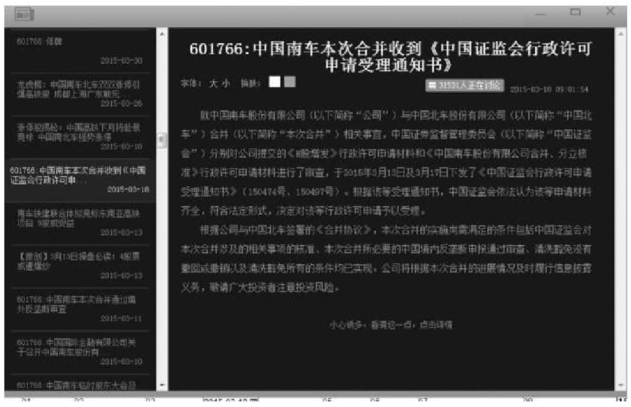

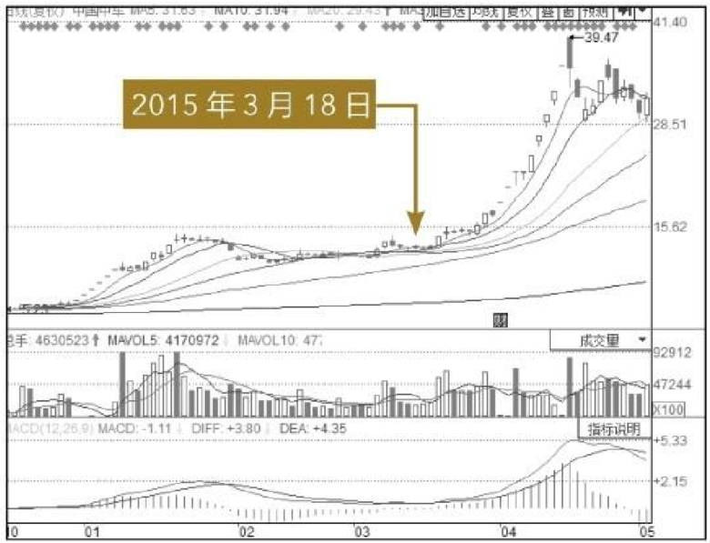

## 第九招 冷门股票潜力大

长期沉寂没有被市场所关注的冷门股票，一旦有一个表现契机，就很可能给投资者带来丰厚的回报。

【基本形态】

冷门股票一般指那些交易量小、周转率低、流通性差、股价变动幅度小的股票。这种股票的上市公司往往经营业绩不佳，投资具有较大风险，所以很少有人问津。然而，这些冷门股在熊市中却有可能突然爆发。对于做长线投资的投资者，可以选择在股市和个股都处于低点时介入。

【拆招解式】

在大盘处于低位的时候，对于长期处于冷门的股票，投资者不要傻傻地在其盘整、横盘期间进入，而应静静等待主力进场，在其出现突破的时候马上跟进。因为在大盘全面反转时，长期冷门股会充分利用机会，迅速拔高股价。因此从整体来看，冷门股中蕴藏着极大的市场机会，只不过需要投资者去发现，特别是介入时间的选择至关重要。

建议投资者在投资冷门股的时候尽量遵循以下投资原则。

（1）不要将大量资金用来投资冷门股。

（2）最好选择在“锅底”的尾段右侧进入。

（3）还要考虑其他的股票，作为一个投资组合。

（4）要有耐心。

炒作冷门股一定要格外小心，并耐心研究该股的历史表现和现实情况，如果公司已经资不抵债，则千万不可持有。

【小试牛招】

下图为中国远洋（601919）自上市以来的缩略K线图。如图标注所示，该股从自上市之后，股价在短时间内攀升至67.84元之后，股价一路下跌，基本在2007年至2014年之间都属于熊市行情，没有转牛市的迹象；但是在2014年9月，该股打破了多年的沉寂，开始了熊转牛的大行情。从缩小的K线图看，该股还具备继续上涨的动力，这样的股票十分适合长期持有。

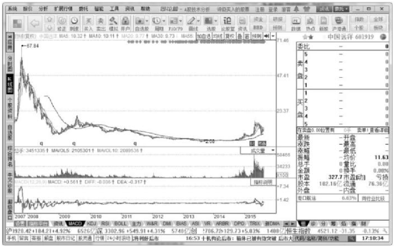

## 第十招 绩优蓝筹不放过

绩优蓝筹股是十分适合投资者进行投资的股票，这一类型的股票往往是慢牛行情。

【基本形态】

蓝筹股是实力强、营运稳定、业绩优良且规模庞大的公司所发行的股票，适合长线投资者投资，甚至可以将其作为资产配置中不可或缺的一部分长期持有。

【拆招解式】

由于绩优蓝筹股并不那么好选择，因此投资者应当按照以下几个标准进行筛选。

1. 业绩评判标准

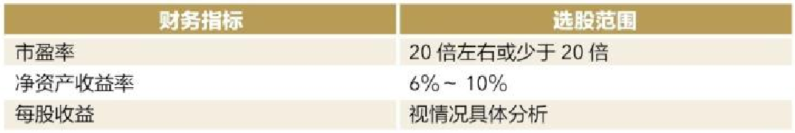

2. 业绩是否具有持久性

蓝筹股不仅要有良好的业绩，更要能长久保持，至于蓝筹股业绩是否能持久，关键在于该上市公司的业绩是否具备较强的稳定性和可持续发展能力，这种能力主要依赖于上市公司的品牌优势、技术优势和规模优势。

3. 蓝筹股的利润构成要素

要观察上市公司业绩增长是真正来源于主营业务收入的增加还是来自于偶然性收入，如补贴收入、营业外收入、债务重组收益、因会计政策变更或会计差错更正而调整的利润、发行新股冻结资金的利息等。投资者需要注意，有的上市公司利用关联交易调节利润，甚至是直接变卖家产，更有极少部分上市公司通过财务上的技术处理，给业绩注入水分，因此，投资者在选择蓝筹股时要仔细分析，避免选择这样的公司。

4. 是否具有成长性

只有成长性好的股票才能给投资者带来丰厚的利润，投资者应该选择成长性好的蓝筹股。上市公司是否具有成长性，可以通过对该公司所处行业是处于夕阳产业还是朝阳产业、公司所募集资金的投资方向和效果、产品的科技含量如何、人才资源的配置和企业的核心竞争力等多方面来进行综合分析。

5. 是否具有投资价值

蓝筹股除了具有业绩优良、市盈率较低、上市公司基本面情况向好等优点，还必须具有股价偏低、未来有较大上升潜力等特点，这样的蓝筹股才能够为投资者带来丰厚的利润。

【小试牛招】

下图为格力电器（000651）2003年至2015年的缩略K线图。如图标注所示，该股自从上市之后，股价在2006年开始启动牛市行情，并在接下来的9年时间一直处于单边上涨的大牛市，在大盘下跌的时候，该股不受大盘影响，依然具备继续上涨的动力，这样的股票十分适合长期持有。

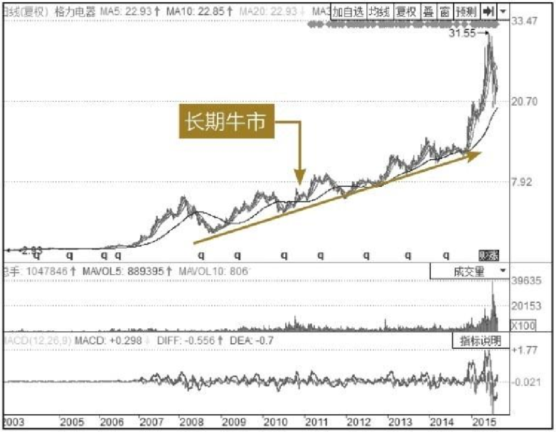