# 电脑、手机和平板电脑协同炒股

**本章引语**

> 过去的数据并不能对未来发展提供保证，只是建议罢了。
>
> ——本杰明·格雷厄姆
>
> 股市的涨跌瞬间变化万千，对于短线投资者来说，如果不能实时掌握股市信息，那无疑是瞎马。手机和平板电脑炒股APP的迅速发展，弥补了电脑炒股软件的不足，它可以让你随时随地掌握实时的股市动态。

**本章要点**

> ★ 常用炒股APP
>
> ★ APP的注册与登录
>
> ★ APP上的模拟交易

## 常用炒股APP简介

股市的上涨带动的不仅是股民的暴增，伴随着移动互联网的发展，也带动了一大批炒股APP在风起云涌的股市里追逐。

2007年，大智慧、同花顺等在PC端形成“垄断”之势，而今与炒股相关的APP已经有几百个，既有老一代的大智慧、同花顺，也有新一代的股票雷达、公牛炒股、投资堂等。这一节我们就来对市场上常用的看盘、交易APP进行介绍。

1. 同花顺

同花顺APP可以支持90％券商在线交易的炒股APP；支持手机、PC、网站多平台云同步；支持A股、基金、实时港股、美股、全球股指、期货、外汇等多种金融工具的操作。

同花顺手机版的界面内容非常丰富，除了包含大盘指数、自选股、开户转户等信息之外，还有模拟炒股、基金理财、彩票等工具，行情、交易和咨询等信息可以实时推送。该APP支持资讯订阅，并可查看网友评论。针对初次使用软件的新手，它还提供了手把手教学视频。其界面如下图所示。

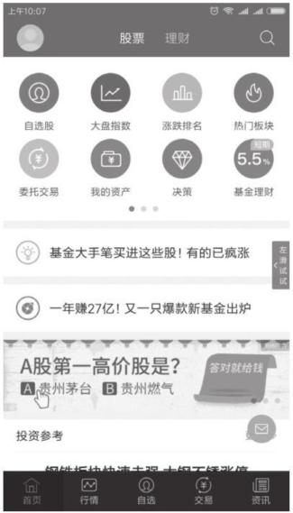

2. 大智慧

大智慧APP给人的第一印象就是界面简洁、传统。它支持50余家券商在线委托交易，采用手机专用交易接口，提供5档行情参考，保障投资者安全快捷的交易。

大智慧APP的特色功能有：自选股异动监控，个股资讯信息、重大公告新闻等实时提醒；消息预警支持盘中动态个性化推送提醒，股价、涨跌幅、换手率、信息地雷一触即发。其界面如下图所示。

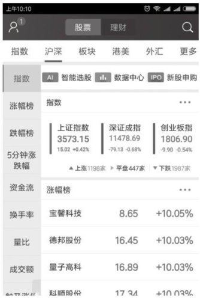

3. 掌上钱龙

掌上钱龙有全智能主力、超无限应用和畅享全免费的特色功能。

全智能主力：主力资金排行、推送强势牛股、锁定强势个股、揭示主力动向、主力资金追踪和辅助抓涨避跌等。

超无限应用：超强触感，目标一点必达，主动推送当日要点及热门信息，轻松指定自选股，个股详情一览无遗。

畅享全免费：只需要手机注册账号，即可开通实时免费主力数据。

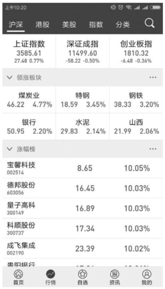

4. 益盟操盘手

益盟操盘手是上海益盟软件技术有限公司旗下的一款专业的证券软件产品。益盟操盘手手机APP凭借着炒股双核“操盘线和主力资金功能组”的完美组合，辅以资讯培训，为不同投资方式、不同投资习惯、不同风险偏好的中长线或短线证券投资者提供解决方案。不仅如此，益盟操盘手还充分考虑到了用户体验方面的页面扭转、菜单组合等小细节，让用户的使用得心应手。操盘手几乎涵盖了Windows Phone、Android和iOS等市面上常见手机平台的不同版本。

Android版本还首创黄金买卖点提示，追踪主力动向，上交所Level2用户数第一。益盟操盘手Android版是集看盘、分析、资讯、决策、交易为一体的手机炒股软件。其界面如下图所示。

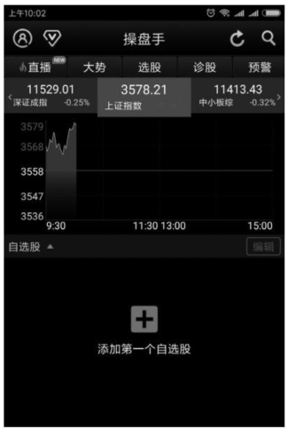

5. 通达信

通达信手机炒股软件是通达信官网全新推出的适用于广大投资者的移动证券软件，具有信息全面丰富、运行稳定高效、结构清晰易上手的特点，与其他行情软件相比，有简洁的界面，行情更新速度较快。

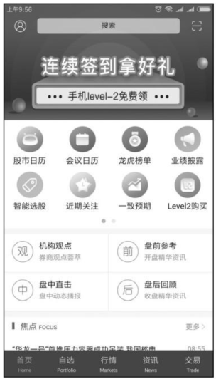

## APP注册与登录

要想使用APP软件炒股，首先就要下载软件，注册用户。这一节我们就以同花顺APP为例，来介绍炒股APP软件的下载、安装、注册与登录等。

### 下载与安装APP

用户可以在手机上打开同花顺官网下载APP，下面以安卓系统手机为例，介绍下载与安装APP的方法。如果用户使用的是苹果手机，则可在APP Store中搜索、下载并安装同花顺APP。

1　登录同花顺官方网站，然后选择【APP下载】按钮，如下图所示。

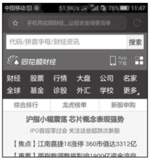

2　下载完成后，单击【安装】按钮进行安装，如下图所示。

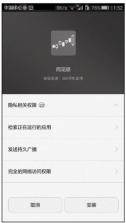

3　安装进程比较简单，如下图所示。

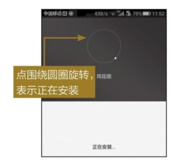

4　安装完成后，弹出安装完成界面，如下图所示。

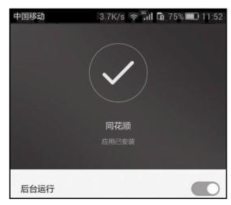

5    安装完成后，同花顺的图标出现在桌面上，如下图所示。

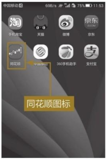

### 注册与登录

同花顺安装完成后，单击桌面图标即可进入。第一次打开软件时，会弹出同花顺的一些介绍图片，不用管它，直接往后翻页，当出现【点击进入】按钮后，单击即可进入。进入同花顺界面后，即可开始注册账号了。这一节我们就来介绍如何注册和登录。

1　在桌面上单击同花顺图标，进入同花顺界面，如下图所示。

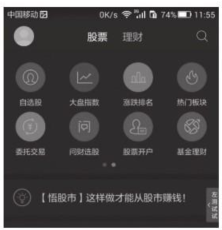

2　单击【登录】按钮，弹出登录界面，如下图所示。

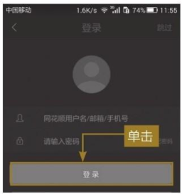

3　单击【手机快速注册】按钮，在弹出的【免费注册】界面输入手机号，如下图所示。

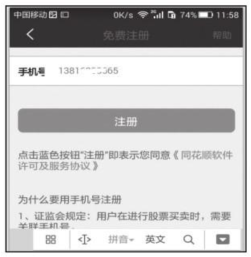

4    单击【注册】按钮，之后同花顺官方会短信提示使用本机发送密码，发送密码成功后，同花顺官方会短信提醒注册成功，如下图所示。

5　注册成功后，输入账号（手机号）和密码即可登录，登录后如下图所示。

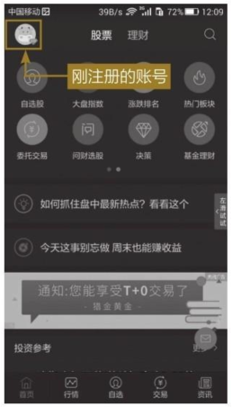

### 盘面信息和自选股

查看盘面信息和自选股信息的具体操作步骤如下。

1. 查看盘面信息

1　在首页界面单击【大盘指数】按钮，进入【市场行情】界面，如下图所示。

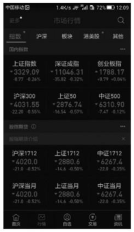

2    单击【上证指数】选项，即可进入查看上证指数，如下图所示。

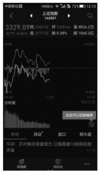

3　单击【盘口】按钮，可以查看盘口信息，如下图所示。

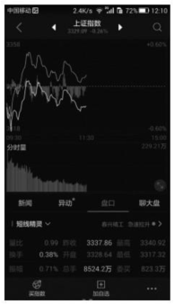

2. 自选股

1　在首页界面单击【自选股】按钮，即可进入自选股界面，在搜索框输入股票代码，并单击要加入自选股的股票，如下图所示。

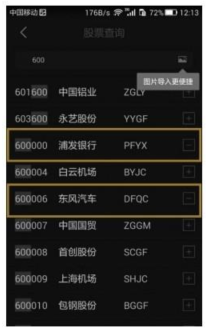

2　添加完成后如下图所示。

3    单击自选股中的某一只股票，即可进入该股票的分时走势图界面，如下图所示。

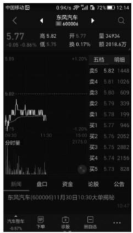

4　单击【盘口】按钮，可以查看盘口的信息，如下图所示。

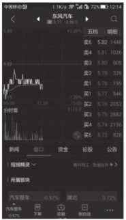

## 模拟交易

模拟交易操作和真实交易操作相同，对于没有经验的新手来说，最好还是从模拟交易练习开始。模拟交易的具体操作如下。

1　单击登录界面首页下面的【交易】菜单选项，在弹出的交易界面选择【模拟交易】选项，如下图所示。

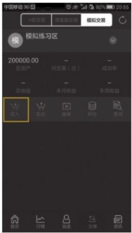

2    单击【买入】按钮，在【买入】输入框中输入买入股票的代码和买入份额，如下图所示。

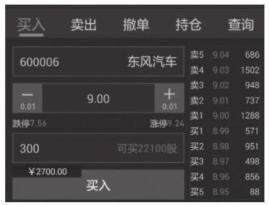

3　单击【买入】按钮，弹出【买入委托】提示单，如下图所示。

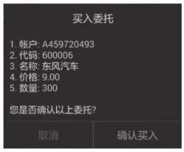

4　单击【确认买入】按钮，弹出合同号系统信息，单击【确定】按钮，即可完成买入操作，如下图所示。

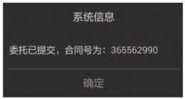

5　在模拟交易界面单击【卖出】按钮，在弹出的【卖出】输入框中输入想卖出的股票代码和份额，如下图所示。

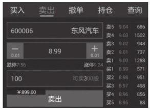

6　单击【卖出】按钮，弹出【卖出委托】提示单，如下图所示。

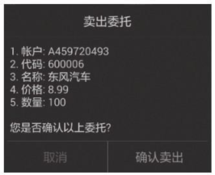

7    单击【确认卖出】按钮，在弹出的合同号系统信息上，单击【确定】按钮，即可完成卖出操作。

## 手机炒股的注意事项

手机炒股带来的方便和快捷是不言而喻的，但随之而来的也要注意手机炒股的安全问题和网络及流量问题。

1. 安全问题

手机炒股首先要注意的就是安全问题，安全问题主要包括以下三个方面。

（1）服务提供商的安全性问题。

一些手机炒股软件在装载时会为股民定制广告短信，有股民可能会轻信一些以哄抬股票价格为目的的虚假信息，从而遭受损失。

（2）手机使用安全问题。

股民使用手机炒股软件时，虽然每次交易前都要输入密码，在一定程度上保证交易的安全性，但手机炒股毕竟属于非现场交易，系统不能辨别交易人员的真实性。因此，股民一旦遗失手机，务必要及时更改密码。平时交易时，手机也尽量不要交给其他人使用。

（3）要防范手机病毒。

手机上网很容易感染病毒。为了手机安全，最好装一个手机杀毒软件，定时进行查毒杀毒，防患于未然。其中尤以支持蓝牙功能的手机中毒的机会最大，因此，不要经常无故开启手机的蓝牙功能。

2. 网络及流量问题

手机炒股首先是基于网络的，只有券商方面开通了网络交易功能，我们才能实现手机炒股。而要上网，就要产生流量，产生费用。

使用手机炒股软件，建议申请一个流量套餐，否则会使手机的流量花费剧增。此外，手机炒股特别需要注意的是，根据目前相关的证券法规，手机因信号故障影响到股民交易而造成的损失，证券公司是不负任何责任的，所以最好选择一个速度快且稳定的服务套餐。就目前而言，4G套餐速度最快且相对稳定。

3. 精简自选股

最后还要注意手机软件的选用问题，平时使用手机软件自选股不宜太多。选择过多，既会增加流量，又会使刷新速度变慢。在不看手机炒股行情时，建议退出手机软件，以免造成损失。

# 高手秘技

## 技巧1 同花顺手机炒股支持的券商有哪些

目前同花顺手机炒股支持的券商见下表。

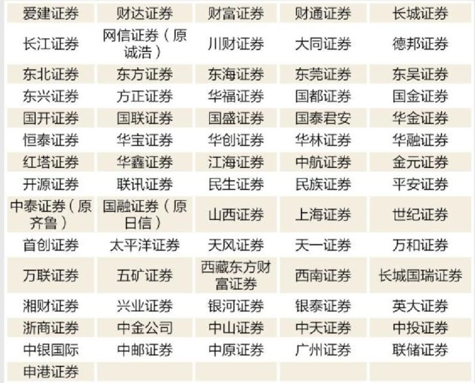

## 技巧2 同花顺手机炒股短信预警功能

只需在同花顺软件里设置好股价上破或下破某价格，一旦股价达到所设限制，用户就会收到短信提示。以下就简单介绍此功能用法。

1　打开已安装完成的同花顺手机炒股软件，进入在线服务功能，单击【绑定手机号】选项。

2　阅读提示信息后，单击“绑定手机号”确认，系统即会为用户发送短信。当绑定成功后，用户将接收到提示信息。

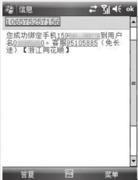

3　在需要预警的个股页面，用户单击【股价预警】选项。

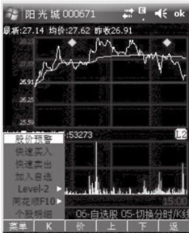

4　设置价格，最后确定，就完成了短信预警。

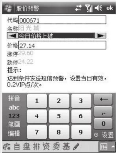

> **提示：**短信预警的有效时间是当天的0：00到15：00（即下午收盘），如果在设置当天没有到达预警价格，将不会有短信提示，预警当天作废。如果用户账户中的VIP点数显示为0点，需要充值后，才能使用该项业务。在查询账户页面下，可以选择查看充值记录、消费记录。

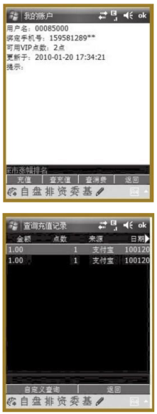