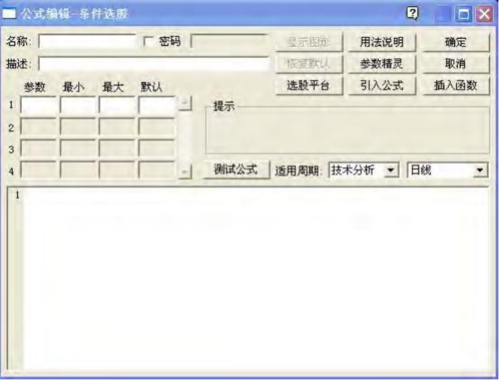
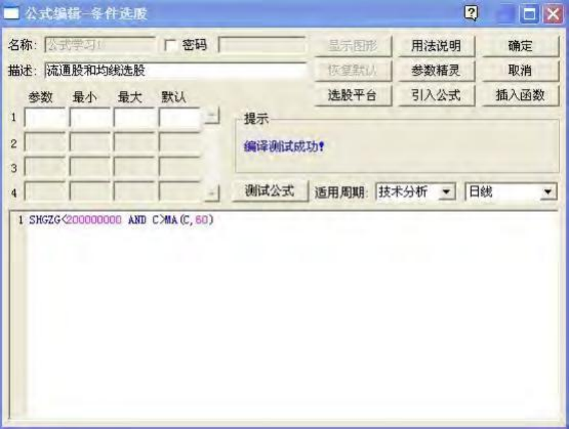
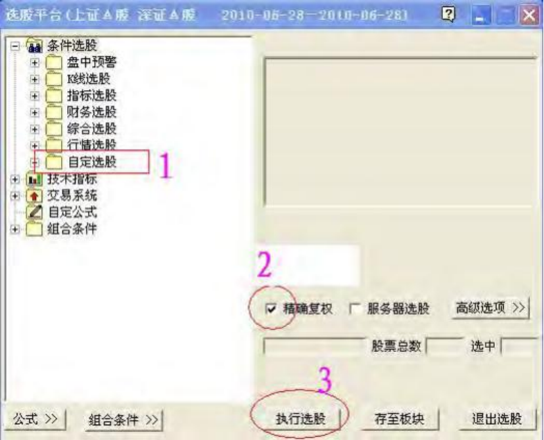
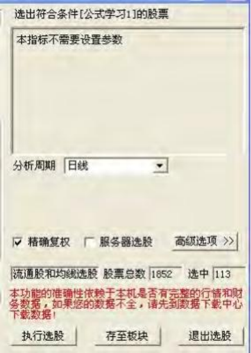
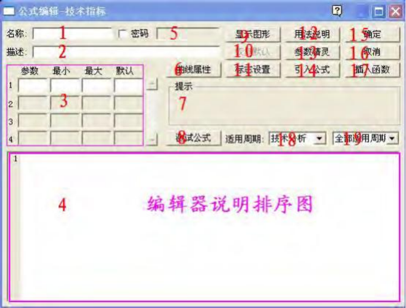
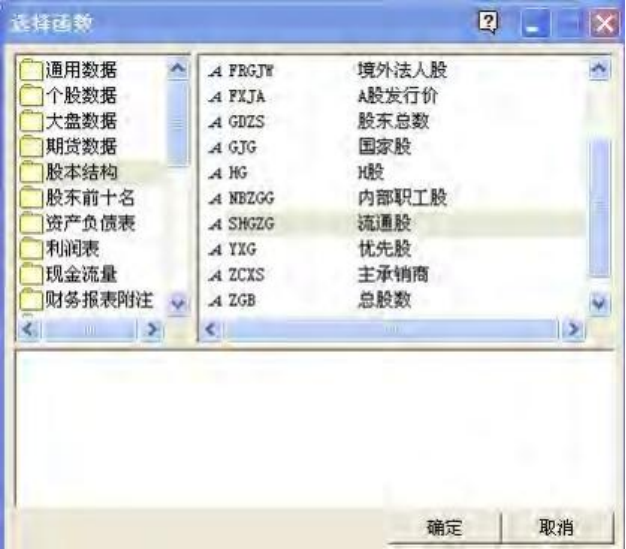
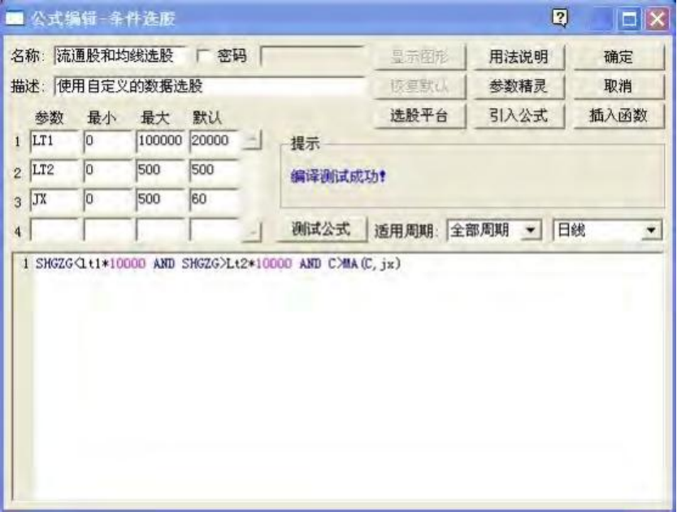
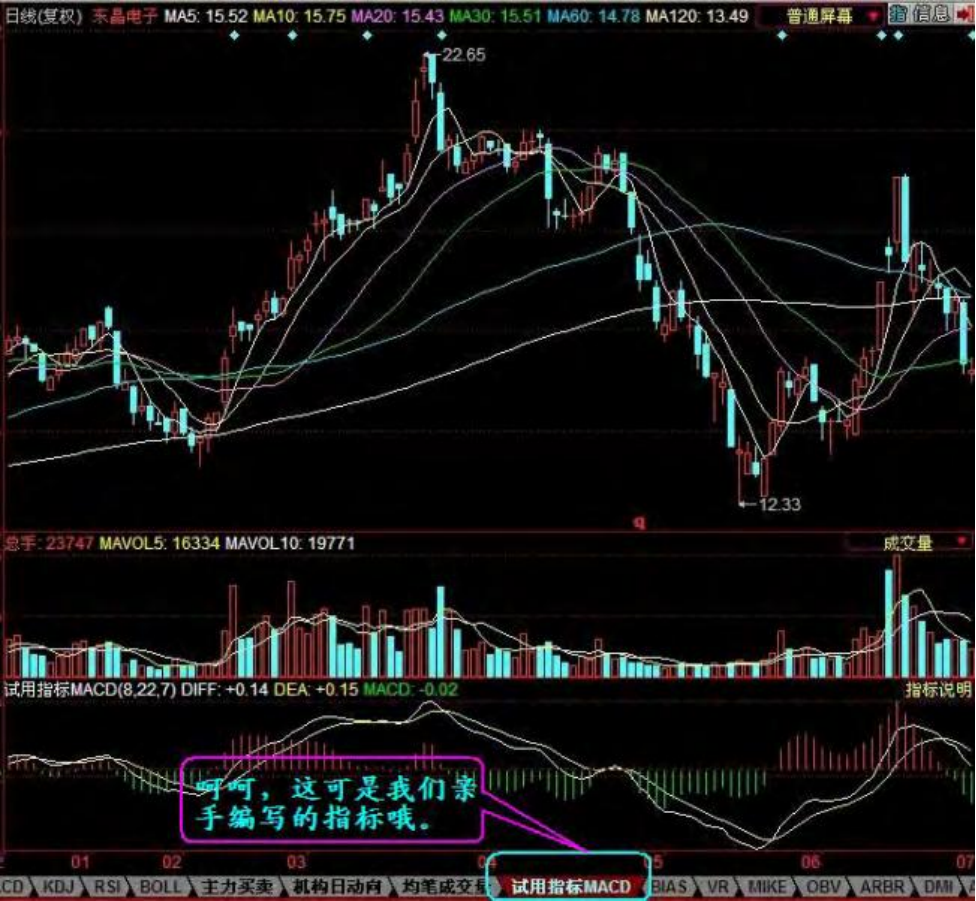
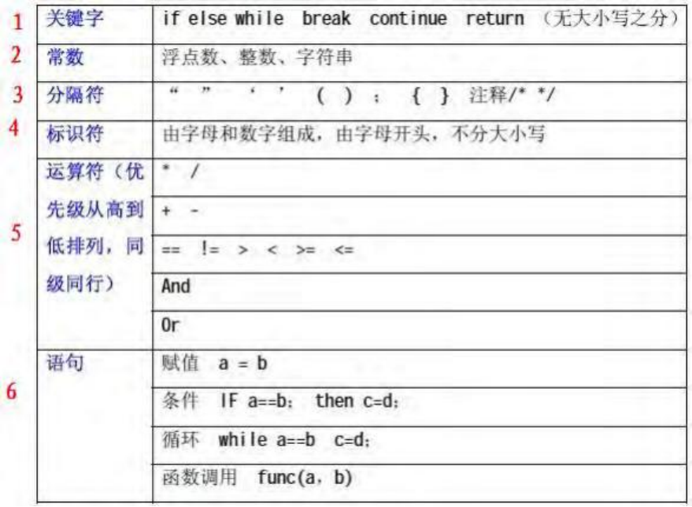
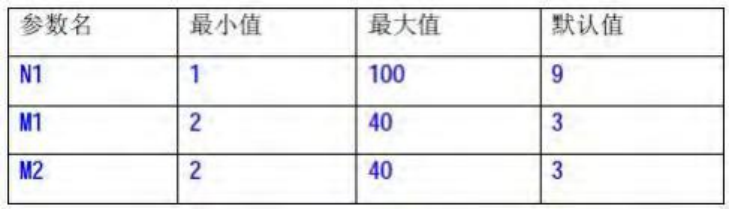

# 编写公式和用公式选股

## 导文

做股票的朋友在选择股票的时候， 往往会有很多想法， 如： 盘子(流通股) 太大的不想要， 股价在 60 日均 线下运行的股票不想要。或者是有一些好的经验，如移动平均线刚刚多头排列的股票，这样的股票也叫黑马抬头。如何才能选出来我们想要的股票来呢？这就是我们将要学习的做一个股票操作高手必备的内容：公式的编写与应用。

## 公式编写

上面刚刚提到的三个问题，假设我们要选出流通盘在 2 亿股以下，股价在 60 日移动平均线上运行的股票。 我们先用语句描述出来即为： “SHGZG<200000000 and c \> ma(c,60)”这样就行了。其中： “SHGZG” 为“上市流通股”的函数， “C”为“CLOSE”收盘价函数的缩写。上面的语句的意思即为“上市流通股小于 2 亿 股同时收盘价在 60 日移动平均线之上”。大家看看多简单。

现在，对没用过公式来找股票的朋友是不是有个这样的想法。编公式的事先放到后面慢慢学，我先学会怎么样用现成的公式吧。那好吧，跟我操作。

请打开行情软件(蓝本为同花顺软件) ，按“CTRL+F”或者点菜单选项“工具”，“公式管理”，会出现下面的 介面。


接下来点条件选股后，点确定。于是出现了公式编辑器



我们把刚刚上面的语句给复制到大空白区(编辑区)，在名称里填上“公式学习 1”，描述那里填上“流通股和均线选股”，然后点“测试公式”，画面显示“编译测试成功”，表示我们做的这个公式就已经通过测试了。 然后点右上角的“确定”。如果再出现个小窗口提示你公式已经保存到哪里，直接点“确认”就行了。



## 公式选股

没用过公式选股票的朋友现在是不是有点跃跃欲试的感觉了， 我们继续做下一个步骤： “用公式来选股”。

点菜单选项上的“智能” ，“选股平台” (注意不要点到“智能选股”哦)。然后出现下面的界面。



在“条件选股”，“自定选股”那里面找到我们刚刚编写的“公式学习 1”这个公式， 在“精确复权”前面的那个小 圈圈里点选上，然后点“执行选股”，现在发生了什么奇迹了呢？大家一起看吧。



目前两市 1852 个股票， 符合“上市流通股在 2 亿股以下， 收盘价在 60 日移动平均线之上运行”这两个条件 的股票却只有 113 个。这下大家可以看到公式的魅力了吧？

这第一节课告诉了大家怎么样使用公式编辑器编写公式和用公式来选股。在操作中大家或许还有很多看不懂的地方，以后慢慢一起学吧！

# 公式编辑器的内容与作用

首先说明一下，因为市场上的各种行情软件版本有所不同，所以会出现不兼容的情况。我们的学习以 同花顺为蓝本，大家可以去下载一个免费的同花顺行情软件来学习。

第一课我们学习了怎么样编写一个公式和用公式来选出自己想要的股票，这节课我们着重介绍一下“公式编辑器”。公式编辑器的界面如下：



**下面逐一介绍：**

> (1) 名称栏：填写你所编的公式的名称，注意必须得填而且不能与现有的软件里的公式重命。
>
> (2) 描述栏：简单描述一下公式的内容。
>
> (3) 参数栏： 这里用来设置公式里需要的参数。规定参数的最大值， 最小值和默认值。参数是指公式里多个地方需要用到的而且可以按自己需要来配置的数值名称。如：经常用的“N” ，“M”等。
>
> (4) 公式编写区： 这里是公式编辑器的核心区域。。我们把要让电脑执行的各种命令都按顺序放在这里。彩色编辑器的意思是指当我们输入各种函数或者数值如果正确的话，系统会自动的用各种颜色表达出来。
>
> (5) 密码： 有的朋友为了想保护自己的劳动成果， 在这里就可以给公式设置密码， 这样的话别人就会查看不到你所写的公式的源文件，当然也修改不了。
>
> (6) 曲线属性： 此栏较重要， 可调整指标的显示区域(是在主图显示还是副图) ，曲线特征， 名称， 参数的显示与否，参数的显示单位等。
>
> (7) 系统提示信息栏：这里提示在测试公式后的系统信息，如编辑测试通过或者是指出哪里出了错误。
>
> (8) 测试公式按钮：编辑完了公式后用这个测试一下有没有语法错误。
>
> (9) 显示图形：
>
> (10) 恢复默认：有系统自带的公式在被修改以后，可以点这个按钮恢复。
>
> (11) 标志设置： 有的时候想在画图上显示自己的独有的信息， 可以到这里设置， 这也是各个指标差异化显示的关键内容。
>
> (12) 用法说明：可以用较大的篇幅来说明一下公式的用途和用法。
>
> (13) 参数精灵：在有公式需要设置参数的时候，点这里可以很好的设置提示信息。
>
> (14) 引入公式：想利用系统里已经存在的公式的时候可以点这里引入公式。
>
> (15) 确定：当编辑好了公式之后，可以点这里保存到原来设定的位置。
>
> (16) 取消：点这里将不做任何保留退出公式编辑。
>
> (17) 插入函数：在公式里需要函数的时候，如果有不记得的，可以点这里很容易找到相关的函数。
>
> (18) 适用周期一：这里的选项有：全部周期，财务计算，实时数据，成交明细，分时走势，技术分析。
>
> (19) 适用周期二： 这里是选择 K 线的分析周期的。有 1 分钟、 5 分钟、 15 分钟、 30 分钟、 60 分钟、日线、周线、月线、年线。

公式编辑器介绍完了，大家还是动动手练习一下吧。

第一课我们学习了一个公式， 就是： 假设我们要选出流通盘在 2 亿股以下， 股价在 60 日移动平均线上 运行的股票。我们这节课还是以这个选股思想为内容，来学习新的编辑器的用法。我们把上面的条件改成如下：假设我们要编一个公式，选出自己可以在流通盘和移动平均线两个指标里随时自定义范围的股票。 

步骤如下：

**（1）第一步 填内容、描述和参数**

照样打开公式编辑器， 我们选来设定名称和描述栏， 还有参数吧。这里我们设置三个参数。 LT1，LT2 代表流通股的上限和下限， JX 代表移动平均线的周期。注意把最大和默认的数值要填好哦。

**（2）第二步 插入函数和录入内容**

我们来使用一下插入函数的这个按钮吧。点击： “插入函数”，找到： “股本结构”，“流通股”，然后点“确定”。



下面再看看编辑区，这个函数名是不是自动跳到编辑区来了？按照下面的内容依次录入吧。那个： LT1\*10000 的意思就是参数 LT1 乘以 10000 了。



**（3）第三步 输入用法说明**

点击： “用法说明”按钮， 出现下面的窗口。在里面录入相关内容后点确定。这个说明的意思是以后我们再来 看这个公式时知道它是用来做什么的。


**（4）第四步 使用“参数精灵”**

点击“参数精灵”窗口，出现如下画面：

注意“Param\#1”这个代码是点击左下角的插入参数按钮后可以自动跳进去的哦， 在它的前面和后面要留有 空格。


输入完上面的内容后点确定，点“测试公式”按钮，在系统信息栏显示“编译测试成功”。点右上角的“确定” 按钮，我们这堂课的公式就编辑完毕了！

最后让我们来享受一下劳动成果吧。点菜单栏的： “智能” ，“选股平台” ，“条件选股” ，“自定选股”“智能选 股”，再找到我们刚刚编写的公式“流通股和均线选股”，看看选股界面上的右上边是不是出现了我们用“参数精灵”录进去的内容？在这里你可以修改参数的数值，点击“执行选股”吧，选股后的画面如下：


嘿嘿， 选出了 39 个股票今天， 也就是说今天市场上符合我们的条件的股票有 39 个。大家也可以把那个参数改变一下多用用。

我们实践一下吧。看看怎么样自己写一个指标公式。大家一起来。

点“工具”，“公式管理”，“新建公式”，选“技术指标”然后确定。我们调出来公式编辑器， 并且设定了我 们要编一个“技术指标”的公式。

再点“引入公式” ，“技术指标”“MACD”，然后 MACD 的指标公式就被调到我们的编辑区来了。我们把 默认值改一下吧，以示区别。改为 8，22，7。修改好了以后图面显示如下：


注意名称哦。 要自己记得， 这是我们自己编写的公式了， 不是系统自带的。测试通过后点“确定”保存。 然后再回到主图页面，我们在指标选项区选一个不想要的指标，用自己刚刚编的指标放在这儿。点击那个 不想要的指标，然后在左边的技术指标选项里到到我们刚刚编写的“试用指标 MACD”，双击就 OK 了。看看现在是不是我们亲手编写的指标显示出来了？



本课时我们学习了主图，副图和分时图以及托盘。这些都是最基础的，希望各位朋友能认真的领会。 后面内容更精彩，期待下一课吧。


# 公式编写规则

我们要给电脑下的命令集合就是公式。话说没有规矩不成方圆，万事万物都是一样。那么这些公式的编写规则又是怎么样的呢？这一节课我们就解决这个问题。

## 语言规范



我们来看看上面的这些。逐一的说一下。

### 关键字

这些关键字在语句编写过程中经常起到承上启下的作用。注意两点：

- 一是不能用全角状态输入， 全角字符和半角字符在电脑里算是两家人（在所有的编写公式的字母都是半角，切记！）。
- 二是字母没有大小写之分。

### 常数

- 浮点数：简单理解一下吧，就是带小数的数值，如： 12.345 。
- 整数：同前面就是没小数的数值。
- 字符串：字符串是一个可以另外定义各种属性的命令的名称。

### 分隔符

- 双引号("") ：用来表示引号里面放的是字符串。
- 单引号(') ：表示里面放的是字符，是直接输出所看到的内容。
- 小括号(()) ：用来控制运算的优先级别的。
- 中括号(\[\]) ：里面放的是数值。
- 大括号({}) ：语句嵌套专用的。
- 注释(／＊＊／) ：注释的语句不参与运算，只是为了方便阅读各语句的内容。

### 标识符

由字母和数字组成。也可以用汉字，字母不分大小写。

### 运算符

数值运算同四则运算一样，先乘除，后加减。下面是几种逻辑运算符的表示方法。

- a==b 为判断 a 是否等于 b，等于的话输出值为 1,不等于输出值为 0；
- a\!=b 为判断 a 是否不等于 b，不等于的话输出值为 1，等于输出值为 0；
- a\>b 为判断 a 是否大于 b，大于的话输出值为 1,不大于输出值为 0；
- a<b 为判断 a 是否小于 b，小于的话输出值为 1,大于输出值为 0；
- a\>=b 为判断 a 是否大于或者等于 b，大于或者等于的话输出值为 1,否则为 0；
- a\<=b 为判断 a 是否小于或者等于 b，小于或者等于的话输出值为 1,否则为 0；
- a and b 表示 a 条件和 b 条件两者都为真(也就是 1)，两个条件都符合才行；
- a or b 表示 a 条件和 b 条件只要有一个条件为真就可以了；

还有几个特殊的逻辑运算符，一起介绍一下。

- isnull(a) 判断是否为空，表示如果 a 没有数据则返回值 1，否则返回 0；

- not(a) 这个简单，表示非 a，即 a 为 0 时返回 1，a 为 1 时返回 0。

### 语句

语句是公式编写的骨架。

- 赋值 a=b 把 b 的值赋给 a
- 条件 if a==b; then c=d; 表示如果 a=b 那么就 c=d
- 循环语句 while a=b c=d; 也就是当 a=b 的时候 c=d
- 函数调用 func(a,b) “func”的意思是函数名

## 赋值语句

其一般形式为：a=b； 含义为将 b 的值付给 a。几个运算符的意义

- "＝"   赋值

- ":="  赋值

- ":"   赋值并输出数值或字符串

- ":>"   赋值并输出图形

**注意：** "=" 和 ":=" 两个运算符的意义、用法完全相同。这样做主要是为了更好地兼容市场上目前的各种带有公式编辑功能的分析软件。

## 条件语句

其一般形式为：

```
IF(逻辑表达式) 语句 1；
ELSE 语句 2；
```

上述结构表示： 如果逻辑表达式的值为非 0(TURE)即真， 则执行语句 1， 执行完语句 1 从语句 2 后开始继续向下执行；如果表达式的值为 0(FALSE)即假， 则跳过语句 1 而执行语句 2。

**注意以下几点：**

1. 条件执行语句中"ELSE 语句 2；"部分是选择项， 可以缺省， 此时条件语句变成：

```
IF(逻辑表达式) 语句 1；
```

表示若逻辑表达式的值为非 0 则执行语句 1，否则跳过语句 1 继续执行。

2. 如果语句 1 或语句 2 有多于一条语句要执行时， 必须使用"{"和"}" 把这些语句包括在其中， 此时条件语句形式为：

```
IF(逻辑表达式) { 语句体 1； }

ELSE { 语句体 2； }
```

这里语句体指多个语句，每个语句都必须以“；”结尾。

3. 条件语句可以嵌套， 这种情况经常碰到， 但条件嵌套语句容易出错， 其原因主要是不知道哪个 IF 对 应哪个 ELSE。例如：

```
IF(x>20 OR x<-10)
IF(y<=100 AND y>x)
A＝"yes"；

ELSE

B＝"no"；
```

对于上述情况， 规定： ELSE 语句与最近的一个 IF 语句匹配， 上例中的 ELSE 与 IF(y\<=100 ANDy\>x)相匹配。为了使 ELSE 与 IF(x\>20 OR x\<-10)相匹配， 必须用花括号。如下所示：

```
IF(x>20 OR x<-10)

{ IF(y<=100 AND y>x)
A="yes"； }

ELSE B="no"；
```

4. 可用阶梯式 IF-ELSE-IF 结构。阶梯式结构的一般形式为：

```
IF(逻辑表达式 1) 语句 1；

ELSE IF(逻辑表达式 2) 语句 2；

ELSE IF(逻辑表达式 3) 语句 3；
```


## 循环语句

while 循环的一般形式为：

```
while(条件) 语句；
```

while 循环表示当条件为真时， 便执行语句。直到条件为假才结束循环。并继续执行循环程序外的后续语句。

**注意：**

- 可以有多层循环嵌套。
- 语句可以是语句体， 此时必须用"{"和"}"括起来。

## break 语句

break 语句通常用在循环语句中。当break 语句用while 循环语句中时， 可使程序终止循环而执行循环后面的语句， 通常 break 语句总是与if语句联在一起。即满足条件时便跳出循环。

**注意：**

- break 语句对 if-else 的条件语句不起作用。

- 在多层循环中， 一个 break 语句只向外跳一层。 

## continue 语句

continue 语句的作用是跳过循环本中剩余的语句而强行执行下一次循环。 continue 语句只用在 while 循环体中， 常与 if 条件语句一起使用， 用来加速循环。

## 函数调用

调用函数的基本方式为：函数名(参数，参数， … )

其返回值为函数里面的 return 语句规定的返回值。若无 return 语句， 则返回被调用函数里，以函数名命名的变量的值。若无以函数名命名的变量，则返回最后一个输出的值。若无输出的值，则返回最后一个被调用的语句的值。

例如：调用 KDJ 指标。 KDJ 函数的名称为 kdj，其参数和内容如下：



函数内容为：

```
RSV：=(CLOSE-LLV(LOW，N))/(HHV(HIGH，N)-LLV(LOW，N))*100；

K：SMA(RSV，M1，1)；
D：SMA(K，M2，1)；
J：3*K-2*D
```

则当您在其它函数里输入 a=KDJ(8，6，6)的时候，相当于计算 N1＝8，M1＝6，M2＝6 时的 J 值，并 把这个值赋给 a。

**注意：**

1. 当传递的参数数目不等于被调用函数设置的参数数目时。 
    - 没有传递参数。则采用原来设置的默认参数计算。
    - 传递参数少于被调用函数设置的参数数目。则将参数传过去，依次改变前面同样数目参数的值， 后面其它的参数采用原来设置的默认参数计算。
    - 传递参数大于被调用函数设置的参数数目。则将参数传过去， 依次改变被调用函数的参数值， 多余的参数不起作用。

2. 函数名称不区分大小写。

3. 新建的函数， 其函数名可能与其它以存在的函数里面的内部变量重名。这样在调用那个函数时， 那 个内部变量将变成对这个新建函数的函数调用，从而产生错误。所以，在新建函数起名时要注意。

## 关于“空”的问题

所谓“空”即指没有数据。在某些情况下，一些数据项可能取不到数据，这时返回值为“空”。例如， yearrep(\&jlr，4)，其含义为取该公司 3 年前年报的净利润。如果某家公司上市时间较短，而无三年前的年报数据，则其值为“空”。

1. “空”与任何数据作计算时，相应计算被取消。例如： 7×NULL (即“空”)得到的结果为 7。
2. “空”与任何数据比较大小时， “空”较小。例如： -7\>NULL (即“空”)得到的结果为 1 (即条件满足)。

这样的结果可能与我们原来希望得到的数值不符，如果想避免这种情况可以用 ISNULL 函数来判断某个数据是否为“空”。

# 所有函数

## 大盘函数

### INDEXDATA

含义：求与具体某种商品相关的数据。

用法：INDEXDATA(“N”，\&X，K)。N 为商品代码。 X 为数据项。 K 为周期数(可以不加) 。

示例：INDEXDATA(“1A0001”， \&LOW，3) 为 3 天前上证指数的最低点位


## 字符串函数

### STRFIND

**含义**：在字符串中查找另一个字符串

**用法**：STRFIND(STRING, SUBSTRING, N),从字符串STRING的第N个字符开始查找字符串SUBSTRING,返回找到的位置， 若没有找到就返回0。

**示例**：STRFIND('abcdefgh','cde',1)返回 3。

### STRLEFT

**含义**：取得字符串的左边部分。

**用法**：STRLEFT(STRING,N),返回字符串STRING的左边N个字符。<br />

**示例**：STRLEFT('abcdef',3)得到'abc'。同样 STRRIGHT(STRING,N),返回字符串 STRING 的右边 N 个字符。

### STRMID

**含义**：取得字符串的中间部分。

**用法**：STRMID(STRING,N,M),返回字符串STRING的第N个字符开始的长度为M个字符的字符串。 <br />

**示例**：STRMID('abcdef',3,3)得到'cde'。

### TOSTRING

**含义**：转换为字符串

**用法**：TOSTRING(X,N)，X是数值，N是精度。

**示例**：TOSTRING(3.14159,3)返回字符串‘3.141’


## 绘图函数

### DRAWBMP

**含义**：在图形上绘制位图。

**用法**：DRAWBMP(COND,PRICE,BMPFILE),当COND条件满足时,在PRICE位置画BMPFILE文件名指定的BMP位图(缺省路 径为软件安装目录\\登录用户名\\)。

**例如**： DRAWBMP(CLOSE\>OPEN,LOW,'SUN')表示当收阳时在最低价位置画软件安装目录\\登录用户名\\Sun.BMP 位图。

**说明**：※BMPFILE参数指定的BMP文件默认路径为当前用户目录， 如果不带后缀名即表示BMP文件， 也可带后缀名使 用JPG和GIF文件。也可不用用户目录而使用全路径， 路径中的'\\'要写两个以下字符串作为参数都是合法的， 如果文件存在的话：

"SUN","SUN.BMP","SUN.JPG","SUN.GIF","C:\\\\hexin\\\\SUN.JPG"


### DRAWGBK

**含义**：根据条件填充背景区域。

**用法**：DRAWGBK(COND,COLOR),填充满足COND条件的背景区域。 COLOR可以为渐变颜色STRIP，也可以为BMP图形文件 名(缺省路径为"软件安装目录\\登录用户名\\")，若省略COLOR则使用指标线颜色填充(可以使用COLORRED等 描述符设定)。

**例如**：

- DRAWGBK(CLOSE\>OPEN),COLORRED；表示收阳时用红色填充背景。 

- DRAWGBK(CLOSE\>OPEN,'MyBMP');表示收阳时用软件安装目录\\登录用户名\\MyBMP.BMP填充背景。 

**说明**：※使用图形作为背景时参数意义同DRAWBMP的说明


### DRAWGBKLAST

**含义**：图形中最后一根K线条件填充背景区域。

**用法**：DRAWGBKLAST(COND,COLOR),若图形中最后一根K线满足条件COND，则设定背景COLOR。COLOR可以为渐变颜色 STRIP，也可以为BMP图形文件名(缺省路径为“软件安装目录\\登录用户名\\”)，若省略则使用指标线颜色填充 (可以使用COLORRED等描述符设定)。

**例如**： 

- DRAWGBKLAST(CLOSE\>OPEN),COLORRED;表示最后一根K线收阳时用红色填充背景。 
- DRAWGBKLAST(CLOSE\>OPEN,STRIP(RGB(255,0,0),RGB(0,255,0),1));表示图形中最后一根K线收阳时红绿过 渡色沿水平方向填充背景。

说明：使用图形作为背景时参数意义同DRAWBMP的说明


### DRAWICON

**含义**：在图形上绘制小图标。

**用法**：DRAWICON(COND,PRICE,TYPE),当COND条件满足时,在PRICE位置画TYPE图标， TYPE是曲线标志的名称。 

**例如**：DRAWICON(CLOSE\>OPEN,LOW,"buy")表示当收阳时在最低价位置画买入图标。


### DRAWLINE

**含义**：在图形上绘制直线段。

**用法**：DRAWLINE(COND1,PRICE1,COND2,PRICE2,EXPAND),当COND1条件满足时,在PRICE1位置画直线起点，当COND2 条件满足时,在PRICE2位置画直线终点， EXPAND为延长类型。

**例如**： DRAWLINE(HIGH\>=HHV(HIGH,20),HIGH,LOW\<=LLV(LOW,20),LOW,1)表示在创20天新高与创20天新低之 间画直线并且向右延长。 


### DRAWTEXT

**含义**：在图形上显示文字。 

**用法**：DRAWTEXT(COND,PRICE,TEXT),当COND条件满足时,在PRICE位置书写文字TEXT。

**例如**： DRAWTEXT(CLOSE/OPEN\>1.08,LOW,'大阳线')表示当日涨幅大于8%时在最低价位置显示'大阳线'字样。 


### FILLRGN

**含义**：根据条件填充区域 

**用法**: FILLRGN(PRICE1,PRICE2,COND1,COLOR1,COND2,COLOR2...),填充PRICE1到PRICE2之间的区域， 当COND1条件 满足时,用COLOR1颜色， 当COND2条件满足时,用COLOR2颜色， 否则不填充， 从COLOR1之后的参数均可以省略，最多可以有15组条件。

例如： FILLRGN(CLOSE,OPEN,CLOSE\>OPEN,RGB(255,0,0),CLOSE\<OPEN,RGB(0,255,0))表示填充开盘价和收盘 价之间的区域，阳线时用红色，阴线时用绿色，平盘不绘制。 


### HORLINE

**含义**：在图形上绘制水平线。 

**用法**: HORLINE(COND,PRICE,TYPE,EXTEND),当COND条件满足时,在PRICE位置沿水平方向绘制TYPE类型的线 段,TYPE=0表示实线， 1表示虚线'---'，2表示点线'...'，3表示点划线'-.-.-'，4表示点点划线'-..-..-'。

EXTEND=1 表示向左延长， =2表示向右延长， =3表示左右延长。

例如： HORLINE(HIGH\>=HHV(HIGH,20),HIGH,1,2)表示在创20天新高时画水平虚线向右延伸。 


### PARTLINE

**含义**：根据条件画线 

**用法**: PARTLINE(PRICE,COND1,COLOR1,COND2,COLOR2...),绘制PRICE线，当COND1条件满足时,用COLOR1颜色，当COND2条件满足时,用COLOR2颜色，否则不绘制，从COLOR1之后的参数均可以省略，最多可以有15组条件。

**例如**： PARTLINE(CLOSE,CLOSE\>OPEN,RGB(255,0,0),CLOSE\<OPEN,RGB(0,255,0),1,RGB(0,0,255))表示画收 盘价线， 阳线时用红色， 阴线时用绿色， 平盘用蓝色。注意最后一个条件为1，表示前面都不满足时必然满 足这个条件。


### POLYLINE

**含义**：在图形上绘制折线段。

**用法**：POLYLINE(COND,PRICE),当COND条件满足时,以PRICE位置为顶点画折线连接。

**例如**：POLYILINE(HIGH\>=HHV(HIGH,20),HIGH)表示在创20天新高点之间画折线。


### RGB

**含义**：指定颜色。

**用法**：RGB(R,G,B),表示用三原色红(R)绿(G)蓝(B)混合组成指定颜色,每种颜色值可以设定为0-255。

 **例如**：RGB(255,0,0)表示红色， RGB(0,0,255)表示蓝色


### STICKLINE

**含义**：在图形上绘制柱线。

**用法**：STICKLINE(COND,PRICE1,PRICE2,WIDTH,EMPTY),当COND条件满足时,在PRICE1和PRICE2位置之间画柱状线， 宽度为WIDTH(10为标准间距),EMPTH不为0则画空心柱。

**例如**：STICKLINE(CLOSE\>OPEN,CLOSE,OPEN,8,1)表示画K线中阳线的空心柱体部分。


### STRIP

**含义**：描述渐变色。

**用法**：STRIP(RGB1,RGB2,DIR),表示生成RGB1色到RGB2色的渐变区域， DIR=1表示沿水平方向，否则表示沿垂直方 向,其中RGB1,RGB2必须用RGB函数描述。本函数只能用于DRAWGBK、DRAWGBKLAST函数中，作为背景填充色描 述符。

**例如**：STRIP(RGB(255,0,0),RGB(0,255,0),0)表示由红色到绿色的垂直渐变色。

参数DIR表示渐变方向1、从上到下2、从下到上3、从左到右4、从右到左


### TIPTEXT

**含义**：在图形上显示图标，鼠标移近时显示文字。

**用法**：TIPTEXT(COND,PRICE,TEXT),当COND条件满足时,在PRICE位置显示图标， 若PRICE为0，则在图形底部显示图 标。

**例如**：TIPTEXT(CLOSE/OPEN\>1.08,LOW,'大阳线， 股价为:'+close)表示当日涨幅大于8%时在最低价位置显 示图标,鼠标移近时显示文字'大阳线,股价为:15.88'字样。

※显示为三角图标


### VERTLINE

**含义**：在图形上绘制垂直线。

**用法**：VERTLINE(COND,TYPE),当COND条件满足时,沿垂直方向绘制TYPE类型的线段,TYPE=0表示实线， 1表示虚线 '---'，2表示点线'...'，3表示点划线'-.-.-'，4表示点点划线'-..-..-'。

**例如**：VERLINE(HIGH\>=HHV(HIGH,20),1)表示在创20天新高画垂直虚线。


### ZIGLINE

**含义**：在图形上绘制锯齿线。

**用法**：ZIGLINE(COND,PRICE),当COND条件满足时,以PRICE位置为顶点画锯齿连接。

**例如**：ZIGILINE(HIGH\>=HHV(HIGH,20),HIGH)表示在创20天新高点之间画锯齿线。

## 财务函数

### getreptype

**含义**：取当期报表类型。

**用法**： getreptype(\&N) N为财务数据项。其返回值为1 (1季度季报) 、2 (中报) 、3 (3季度季报) 、4 (年 报)。


### LASTREP

**含义**：按报表发布时间调用报表数据项。

**用法**： LASTREP(\&N,K) N 为财务数据项， K 为报表顺序， 1 表示最近一次公布的报表、 2 表示最近第二次公 布报表、依此类推。


### MIDREP

**含义**：调用中报数据项。

**用法**： MIDREP(\&N,K,L)，N 为财务数据项， K 可以是 1 (表示最近一次的中报)、 2 (表示上一次的中报) 、 3、4 等或者直接输入希望调用的年份。


### QUARTERREP

**含义**：调用季报数据项。

**用法**： QUARTERREP(\&N,K,L)，N 为财务数据项， K 可以是 1 (表示最近一次的季报) 、2 (表示上一次的季报) 、 3、4 等或者直接输入希望调用的年份， L 可以是 1 或 3 即第一季度或第三季度的季报。注意 L 仅在 K 选择 年份的时候适用。


### REP

**含义**：调用最近一次报表或与其同类型报表的数据项。

**用法**： REP(\&N,K) N 为财务数据项， K 为 1 (表示最近一次公布的报表) 、2 (表示去年与最近一次公布报表 同类型报表)、 3、4 等。


###  REPDATE

**含义**：REPDATE,取报表日期,

**用法**： REPDATE(&参数1,参数2,参数3)

参数1＝财务数据项

参数2＝引用周期数，与YEARREP等的调用相同

参数3＝1、一季度报表， 2、中报， 3、三季度报表， 4、年报

如REPDATE(\&ZGB,1,4)，表示取最近总股本年报的报表日期


### YEARREP

**含义**：调用年报数据项。

**用法**： YEARREP(\&N,K)，N为财务数据项， K可以是1 (表示最近一次的年报) 、2 (表示上一次的年报) 、3、 4等或者直接输入希望调用的年份。

**注意**： N 要为基本的财务数据项， 而不能是编写的计算项目， 即N 为功能树里公式栏里面的“财务数据”目录 下面的数据项。

## 板块函数

### BLOCKAVG

**含义**：求板块里某一数据项的平均值。

**用法**： BLOCKAVG(\&N),N 表示选择的数据项。例如： BLOCKAVG(\&NEW)表示这个板块里所有股票当前时刻的平 均价。

### BLOCKLEAD

**含义**：取板块指数的所属个股中数据X最大的股票的数据Y。适用于板块指数。

**用法**： BLOCKLEAD(\&X,\&Y) 取板块指数中个股数据X最大的股票的数据Y。如BLOCKLEAD(\&VOL,\&ZQMC)取该板 块指数中成交量最大的股票名称

### BLOCKMAX

**含义**：求板块里某一数据项的最大值。 MIN最小

**用法**： BLOCKMAX(\&N)，N 表示选择的数据项。例如： BLOCKMAX(\&HIGH)表示这个板块里所有股票当天的最高 价。

### BLOCKSUM

**含义**：求板块里某一数据项的和。

**用法**： BLOCKSUM(\&N)，N 表示选择的数据项。例如： BLOCKSUM(\&VOL)表示这个板块里所有股票当前时刻的总成交手数。

### INBLOCK

**含义**：判断当前代码是否属于某个板块。

**用法**：INBLOCK('BLOCK')，BLOCK 是板块名称

## 指标函数

### CM

**含义**：用于画成交分布云。

**用法**：用于画成交分布云。例如CM(0,1,2,0)。参数含义： 1、计算天数， 0表示计算全部天数。 2、当日成 本算法： 0=平均分布,1=三角分布。 3、精度： 一般是2。4、起始位置： 0是从当天开始计算,1是从前一天开 始算,类推。 5、换手：缺省是3,即300%换手。参数5可以没有。

### COST

**含义**：成本分布情况。

**用法**： COST(10)，表示10%获利盘的价格是多少，即有10%的持仓量在该价格以下，其余90%在该价格以上, 为套牢盘。该函数仅对日线分析周期有效。

### FLATZIG

**含义**：归一化之字转向。

**用法**:FLATZIG(K,N,ABS),当价格变化量超过N%时转向,K表示0:开盘价,1:最高价,2:最低价,3:收盘价,4:低点采用最低价、高点采用最高价。若ABS为0或省略，则表示相对FLATZIG转向，否则为绝对FLATZIG转向。

与ZIG函数不同的是本函数返回值在0~1之间。

**例如**： FLATZIG(3,5)表示收盘价的5%的归一化ZIG转向

★本函数的计算结果引用了未来数据★

### PEAK

**含义**：前M个ZIG转向波峰值。

**用法**:PEAK(K,N,M,ABS)表示之字转向ZIG(K,N,ABS)的前M个波峰的数值,M必须大于等于1。若ABS为0或省略，则表示相对ZIG转向，否则为绝对ZIG转向。

**例如**： PEAK(1,5,1)表示%5最高价ZIG转向的上一个波峰的数值

★本函数的计算结果引用了未来数据★

### PEAKBARS

**含义**：前M个ZIG转向波峰到当前距离。

**用法**：PEAKBARS(K,N,M,ABS)表示之字转向ZIG(K,N,ABS)的前M个波峰到当前的周期数,M必须大于等于1。若ABS为0或省略，则表示相对ZIG转向，否则为绝对ZIG转向。

**例如**： PEAKBARS(0,5,1)表示%5开盘价ZIG转向的上一个波峰到 当前的周期数 ★本函数的计算结果引用了未来数据★ 远期获利盘比例。 用法:PWINNER(10,CLOSE) 表示10天前的那部分成本以当前收市价卖出的获利盘比例，例如返回0.2表示20%获利盘； 该函数仅对日线分析周期有效。

### SAR

**含义**：计算抛物转向。

**用法**：SAR(N,S,M),N为计算周期,S为步长,M为极值。例如， SAR(10,2,20)表示计算10日抛物转向， 步长为2%， 极限值为20%。 

### TROUGH

**含义**：前M个ZIG转向波谷值。 用法: TROUGH(K,N,M,ABS)表示之字转向ZIG(K,N,ABS)的前M个波谷 的数值,M必须大于等于1。若ABS为0或省略，则表示相对ZIG转向，否则为绝对ZIG转向。

**例如**： TROUGH(2,5,2)表示%5最低价ZIG转向的前2个波谷的数值

★本函数的计算结果引用了未来数据★

### TROUGHBARS

**含义**：前M个ZIG转向波谷到当前距离。

**用法**：TROUGHBARS(K,N,M,ABS)表示之字转向ZIG(K,N,ABS)的前M个波谷到当前的周期数,M必须大于等于1。若ABS为0或省略，则表示相对ZIG转向，否则为绝对ZIG转向。

**例如**： TROUGHBARS(2,5,2)表示%5最低价ZIG转向的前2个波谷到当前的周期数

★本函数的计算结果引用了未来数据★

### WINNER

**含义**：表示获利盘比例。

**用法**： WINNER(CLOSE)，表示以当前收市价卖出的获利盘比例。例如返回0，1表示10%获利盘； WINNER(10， 5)表示10，5元价格的获利盘比例。

### ZIG

**含义**：该函数仅对日线分析周期有效。

**用法**： ZIG(K,N)，当价格变化量超过N%时转向， K表示0：开盘价， 1：最高价， 2：最低价， 3：收盘价。

**例如**： ZIG(3,5)表示当前收盘价超过上次ZIG转向输出值的+5%或-5%，则输出当前收盘价并ZIG转向。


## 统计函数

### AVEDEV

**含义**：平均绝对偏差。

**用法**：AVEDEV(X,N)

### CORREL

**含义**：两样本的相关系数。

**用法**：CORREL(X,Y,N)为X与Y的N周期相关系数，其有效值范围在-1 ~ 1之间

**例如**：CORREL(CLOSE,INDEXC,10)表示收盘价与大盘指数之间的10周期相关系数

### COVAR

**含义**：两样本的协方差。

**用法**：COVAR(X,Y,N)为X与Y的N周期协方差

**例如**：COVAR(CLOSE,INDEXC,10)表示收盘价与大盘指数之间的 10 周期协方差

### DEVSQ

**含义**：数据偏差平方和。

**用法**：DEVSQ(X,N)

### FORCAST

**含义**：线性回归预测值。

**用法**：FORCAST(X,N)为X的N周期线性回归预测值。

**例如**：FORCAST(CLOSE,10)表示求 10 周期线性回归预测本周期收盘价。

### KURT

**含义**：返回数据集的峰值。峰值反映与正态分布相比某一分布的尖锐度或平坦度。正峰值表示相对尖锐的分布。负峰值表示相对平坦的分布。

**用法**：KURT(X,N)

### SKEW

**含义**：返回分布的偏斜度。偏斜度反映以平均值为中心的分布的不对称程度。正偏斜度表示不对称边的分布更趋向正值。负偏斜度表示不对称边的分布更趋向负值。

**用法**：SKEW(X,N)

### SLOPE

**含义**：线性回归斜率。

**用法**：SLOPE(X,N)为X的N周期线性回归线的斜率。

**例如**：SLOPE(CLOSE,10)表示求 10 周期线性回归线的斜率。

### STD

**含义**：求标准差。

**用法**： STD(X,N)为 X 的 N 日估算标准差。

### STDP

**含义**：总体标准差。

**用法**：STDP(X,N)为 X 的 N 日总体标准差。

### VAR

**含义**：估算样本方差。

**用法**：VAR(X,N)为 X 的 N 日估算样本方差。

### VARP

**含义**：总体样本方差。

**用法**:VARP(X,N)为 X 的 N 日总体样本方差。

## 算术函数

###  ABS

**含义**：求绝对值。

**用法**： ABS(X)返回 X 的绝对值。例如： ABS(-34)返回 34。

### **BETWEEN**

**含义**：介于两个数之间。

**用法**： BETWEEN(A,B,C)表示A处于B和C之间时返回1，否则返回0

**例如**： BETWEEN(CLOSE,MA(CLOSE,10),MA(CLOSE,5))表示收盘价介于 5 日均线和 10 日均线之间。

### CROSS

**含义**：两条线交叉。

**用法**：CROSS(A,B)表示当A 从下方向上穿过B 时返回 1,否则返回 0。

**例如**：CROSS(MA(CLOSE,5),MA(CLOSE,10)) 表示 5 日均线与 10 日均线交金叉。

### **ISNULL**

**含义**：判断是否为空。

**用法**： ISNULL(A)表示如果 A 为空(即没有数据)则返回 1,否则返回 0。

### LONGCROSS

**含义**：两条线维持一定周期后交叉。

**用法**： LONGCROSS(A,B,N)表示 A 在 N 周期内都小于 B,本周期从下方向上穿过 B 时返回 1,否则返回 0。

**例如** ： LONGCROSS(MA(CLOSE,5),MA(CLOSE,10),5)表示 5 日均线维持 5 周期后与 10 日均线交金叉。

### MOD

**含义**：求模运算。

**用法**： MOD(A,B)返回 A 对 B 求模。例如：MOD(26,10)返回 6。

### NOT

**含义**：求逻辑非。

**用法**： NOT(X)返回非 X，即当 X=0 时返回 1，否则返回 0。

**例如**：NOT(5\>3)返回 0。

### POW

**含义**：求幂。

**用法**： POW (X,Y)。求 X 的 Y 次幂。

**例如**： POW (2,3)为 8。

### RANGE

**含义**：介于某个范围之间。

**用法**： RANGE(A,B,C)表示A大于B同时小于C时返回1，否则返回0。

**例如**： RANGE(CLOSE,MA(CLOSE,5),MA(CLOSE,10))表示收盘价大于5日均线并且小于10日均线。

### REVERSE

**含义**：求相反数。

**用法**： REVERSE(X)返回-X。 

**例如**： REVERSE(CLOSE)返回-CLOSE。

### SQRT

**含义**：开平方。

**用法**： SQRT(X)为 X 的平方根。

**例如**： SQRT(CLOSE)收盘价的平方根。

## 引用函数

### BACKSET

**含义**：将当前位置到若干周期前的数据设为X。

**用法**： BACKSET(X,N)，若X非0，将当前位置到N周期前的数值设为X。

**例如**：BACKSET(CLOSE\>OPEN,2)若收阳 则将该周期及前一周期数值设为1，否则为0。

### BARSCOUNT

**含义**：求总的周期数。

**用法**： BARSCOUNT(X)，第一个有效数据到当前的天数。

### BARSLAST

**含义**：上一次条件成立到当前的周期数。

**用法**： BARSLAST(X)，上一次X不为0到现在的天数。

**例如**： BARSLAST(CLOSE/REF(CLOSE,1)\>=1,1)表示上一 个涨停板到当前的周期数。

### BARSSINCE

**含义**：统计第一个条件成立到当前的周期数。

**用法**： BARSSINCE(X)：第一次 X 不为 0 到现在的天数。

**例如**： BARSSINCE(HIGH\>10)表示股价超过 10 元时到 当前的周期数。

### COUNT

**含义**：统计满足条件的周期数。

**用法**： COUNT(X,N)，统计N周期中满足X条件的周期数，若N=0则从第一个有效值开始。

**例如**： COUNT(CLOSE\>OPEN,20)表示统计20周期内收阳的周期数。

### DMA

**含义**：求动态移动平均。

**用法**： DMA(X,A)，求X的动态移动平均。算法： 若Y=DMA(X,A)则 Y=A\*X+(1-A)\*Y'，其中Y'表示上一周期Y 值， A必须小于1。

**例如**： DMA(CLOSE,VOL/CAPITAL)表示求以换手率作平滑因子的平均价。

### EMA

**含义**：求指数平滑移动平均。

**用法**： EMA(X,N)，求X的N日指数平滑移动平均。

**算法**：若Y=EMA(X,N)则Y=\[2\*X+(N-1)\*Y'\]/(N+1)，其中Y' 表示上一周期Y值。

**例如**：EMA(CLOSE,30)表示求30日指数平滑均价。 


### FILTER

**含义**：过滤连续出现的信号。 

**用法**: FILTER(X,N):X满足条件后，将其后N周期内的数据置为0, 若N为0表示将其后的所有数据置0

### HHV

**含义**：求最高值。

**用法**： HHV(X,N)，求N周期内X最高值，N=0则从第一个有效值开始。 

**例如**：HHV(HIGH,30)表示求30日最高 价。

### HHVBARS

**含义**：求上一高点到当前的周期数。

**用法**：HHVBARS(X,N):求N周期内X最高值到当前周期数， N=0表示从第一个有效值开始统计。

**例如**： HHVBARS(HIGH,0)求得历史新高到到当前的周期数。

### LLV

**含义**：求最低值。

**用法**： LLV(X,N),求 N 周期内X 最低值， N=0 则从第一个有效值开始。

**例如**： LLV(LOW,0)表示求历史最低价。 


### LLVBARS

**含义**：求上一低点到当前的周期数。

**用法**：LLVBARS(X,N):求N周期内X最低值到当前周期数， N=0表示从第一个有效值开始统计。

**例如**： LLVBARS(HIGH,10)求得 10 日最低点到当前的周期数。

###  MA

**含义**：求简单移动平均。

**用法**： MA(X,N)，求 X 的 N 日移动平均值。算法： (X1+X2+X3+，， ，+Xn)/N。

**例如**：MA(CLOSE,10)表示求 10 日均价。

### REF

**含义**：引用若干周期前的数据。

**用法**： REF(X,A),引用 A 周期前的 X 值。

**例如**： REF(CLOSE,1)表示上一周期的收盘价，在日线上就是昨收。

### REFX

**含义**：引用若干周期后的数据。

**用法**： REFX(\&X,A),引用A周期后的X值。

**例如**： REFX(\&CLOSE,1)表示后一周期的收盘价 ，在日线上就是明收。

### REFX

**含义**：引用若干周期后的数据。

**用法**： REFX(\&X,A),引用A周期后的X值。

**例如**： REFX(\&CLOSE,1)表示后一周期的收盘价 ，在日线上就是明收。

### SUM

**含义**：求总和。

**用法**： SUM(X,N)，统计 N 周期中 X 的总和， N=0 则从第一个有效值开始。

**例如**： SUM(VOL,5)周期设为日线时， 表示最近 5 个交易日的成交量之和。 SUM(VOL,0)表示从传数据过来第一天起的成交量总和，具体如在区间 统计里统计“总手” SUM(VOL,0)即是指全区间的成交量之和。

### SUMBARS

**含义**：向前累加到指定值到现在的周期数。

**用法**:SUMBARS(X,A):将X向前累加直到大于等于A,返回这个区间的周期数。

**例如**： SUMBARS(VOL,CAPITAL)求完全换手到现在的周期数。

### WMA

**含义**：求加权移动平均。

**用法**:WMA(X,A),求X的加权移动平均。

**算法**: 若Y=WMA(X,A) 则 Y=(N\*X0+(N-1)\*X1+(N-2)\*X2)+...+1\*XN)/(N+(N-1)+(N-2)+...+1)X0表示本周期 值， X1表示上一周期值...。

**例如**： WMA(CLOSE,20)表示求 20 日加权均价。

## 逻辑函数

### IF

**含义**：根据条件求不同的值。

**用法**： IF(X,A,B)若 X 不为 0 则返回 A，否则返回 B。 

**例如**： IF(CLOSE\>OPEN,HIGH,LOW)表示该周期收阳则返回最高值，否则返回最低值。

## 时间函数

### COUNTTIME

**含义**：计算两个时间之间的差。

**用法**： COUNTTIME (N,L,K)。 N、L为时间，其格式为YYYYMMDD。K为1、2或者3。当K为1时返回第二个之间 比第一个时间晚多少年。当K为2时返回第二个之间比第一个时间晚多少月。当K为3时返回第二个之间比第 一个时间晚多少日。

**例如**： COUNTTIME (20000808，19990606，2)其返回值为-2。注意：这里返回值有正 负号。

### FORMATTIME

**含义**：转换时间格式。

**用法**： FORMATTIME(N)。目前只支持 N=1 把当前时间转换成距开盘分钟数返回。

**例如**：分时中的量比曲线 公式： (VOL\*(TRADETIME+1)\*5)/(FORMATTIME(1)\*FIVEDAYVOL)。

### FROMNIGHT

**含义**：求当前时刻距开盘有多长时间。

**用法**： FROMNIGHT。返回当前时刻距午夜有多长时间， 单位为秒。

**例如**： 当前时刻为早上十点， 则返回36000。

### FROMOPEN

**含义**：求当前时刻距开盘有多长时间。

**用法**： FROMOPEN。返回当前时刻距开盘有多长时间， 单位为分钟。

**例如**： 当前时刻为早上十点， 则返回31。

### TRADETIME

**含义**：求当前代码类型的开市交易时间。

**用法**： TRADETIME。返回交易时间，单位为分钟。目前一般市场都返回 242，与日期或具体的股票无关。

## 期货数据

**OI持仓量**： 即未平仓合约，是指买卖双方开立的还未实行反向操作的合约数量总和。 持仓量的大小反映了市场交易规模的大小，也反映了多空双方对当前价位的分歧大小。

## 大盘数据

### BUYCOUNT

**含义**：当前本类指数所有股票的委托买入数量之和。

**用于**：沪深指数的实时、分时周期。


### FALLCOUNT

**含义**：当前本类指数所有下跌股票的家数之和。

**用于**：沪深指数的实时、分时周期。


### FALLTRENT

**含义**：当前本类指数所有下跌股票的最新价之和除以本类指数所有股票的最新价之和。

**用于**：沪深指数的实时、分时周期。


### INDEXLEAD

**含义**：即不加权的指标涨跌幅再乘以10000。具体地说就是，设A＝“当前本类指数所有股票的最 新价之和” ，B＝“当前本类指数所有股票的昨日收盘价”。那么INDEXLEAD＝(A－B) /B×10000。

**用于**：沪深指数的实时、分时周期。


### RISECOUNT

**含义**：当前本类指数所有上涨股票的家数之和。

**用于**：沪深指数的实时、分时周期。


### RISETRENT

**含义**：当前本类指数所有上涨股票的最新价之和除以本类指数所有股票的最新价之和。

**用于**：沪深指数的实时、分时周期。


### SELLCOUNT

**含义**：当前本类指数所有股票的委托卖出数量之和。

**用于**：沪深指数的实时、分时周期。


### TOTALSTOCK

**含义**：本指数所包含股票家数之和。

**用于**：沪深指数的实时周期。


### VOLAMOUNT

**含义**：在周期为“实时”时，为当日的成交次数。在周期为“分钟K线”和“日K线”时，分别为某一分 钟和某一日的成交次数。

**用于**：个股的实时、分钟 K 线、日K 线周期。


### VOLCLASS

**含义**：其数值与该笔成交的价位关系为： “3”为“成交价\<=买三价”，“2”为“买三价\<成交价\<=买二价”， “1”为“买二价\<成交价\<=买一价”，“0”为“买一价\<成交价\<卖一价”，“5”为“卖一价\<=成交价\<卖二价”，“6”为“卖 二价\<=成交价\<卖三价” ，“7”为“卖三价\<=成交价”。

**注意**：这里的买卖盘的价格都是指上一次传过来的价 格，与内外盘原理相同。也可以将“成交量分类”视为划分更为详细的内外盘。

**用于**：个股的实时、分时、成交明细。

## 通用数据

### CLOSE

**含义**：当周期的收盘价。

**用于**：个股的分钟 K 线、日K 线周期。沪深指数的分钟 K 线、日K 线周期。

### CODE

**含义**：证券的代码。

**用于**：个股的所有周期。沪深指数的所有周期。


### CODETYPE  

**含义**：指明当前商品的类型。当返回值是0时为指数、 1是A股、 2是B股、 3是债券、 4是基金。  

**用于**：个股、指数的各种周期。

### DATETIME  

**含义**：显示时间。当用于不同周期的时候，系统会自动传送相应的时间类型。而具体的显示方案 则在“窗口属性”的“时间坐标”项里的“时间格式”一栏里选择。  

**用于**：个股、沪深指数所有的周期。


### INVOL  

**含义**：内盘(又称为主动性抛盘) 成交量。判断依据为若某笔成交， 其价格小于等于前一次传过来的 买一的价格， 则称为内盘。注意，内外盘之和一般不等于总成交量) 在周期为“实时” 、“分时”时， 其值为 当日的内盘。在周期为“分钟K线”和“日K线”时， 分别为某一分钟和某一日的内盘。用于指数时指所有相应股票的内盘之和。  

**用于**：个股的实时、分时、分钟K线、 日K线周期。沪深指数的实时、分时、分钟K线、日K线周期。


### MONEY  

**含义**：在实时、分时周期时代表当日的成交金额只和。在分钟K线、日K线周期时代表那一个周期的成 交金额只和。当用于指数时，指此指数所包含所有交易品种成交金额之和。  

**用于**：个股的实时、分时、分钟 K 线、日K 线周期。沪深指数的实时、分时、分钟 K 线、日K 线周期。

### NEW  

**含义**：用于个股时为最近一笔成交的价格。用于沪深指数时为最近一次从交易所传来的指数值。  

**用于**：个股的实时、成交明细周期。沪深指数的实时周期。

### NEWVOL

**含义**：用于个股时为最近一笔成交的成交量。用于沪深指数时为对应市场的所有股票的最后一 笔成交量之和。 

 **用于**：个股的实时、成交明细周期。沪深指数的实时周期。

### OPEN  

**含义**：在实时周期时，为当日的开盘价。在分钟K线、日K线周期时，分别为当周期的开盘价。  

**用于**：个股的实时、分钟 K 线、日K 线周期。沪深指数的实时、分钟 K 线、日K 线周期。

### PRE

**含义**：上一交易日的收盘价。(注意，在分钟K线周期，也是昨日收盘价，而不是上一周期的收盘 价。)如果当天有除权，则其值为除权之后的昨日收盘价。

**用于**：所有类型、所有周期。

**例如**：某股票昨天收盘20元，今天除权， 10送10。则今日PRE值为10元。  


### VALIDBEGIN  

**含义**：区间统计的起始时间。当用于不同周期的时候，系统会自动传送相应的时间类型。而具 体的显示方案则在“窗口属性”的“时间坐标”项里的“时间格式”一栏里选择。  

**用于**：个股、沪深指数所有的周期。

### VALIDEND  

**含义**：区间统计的终止时间。当用于不同周期的时候，系统会自动传送相应的时间类型。而具体 的显示方案则在“窗口属性”的“时间坐标”项里的“时间格式”一栏里选择。  

**用于**：个股、沪深指数所有的周期。

### VOL

**含义**：在实时、分时、成交明细周期时代表当日的成交量只和。在分钟K线、日K线周期时代表那一个周期的成交量只和。当用于指数时，指此指数所包含所有交易品种成交量之和。  

**用于**：个股的实时、分时、成交明细、分钟 K 线、日 K 线周期。沪深指数的实时、分时、分钟 K 线、日 K线周期。(注意， VOL 与 MONEY 相比多了一个成交明细周期。)


### ZQMC  

**含义**：证券的名称。  

**用于**：个股的所有周期。沪深指数的所有周期。
